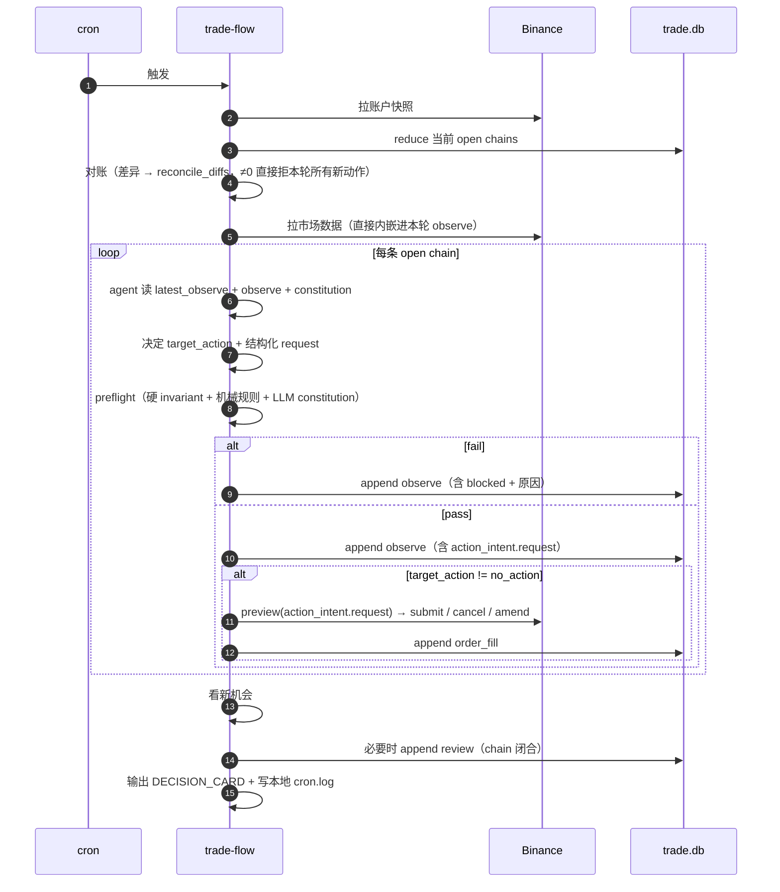

# Design Architecture — Slim 版

与 [design-architecture.md](design-architecture.md) 同源，砍掉为"未来场景"提前付的复杂度。**MVP 跑得起来 + 真出现该场景时增量加**是唯一筛子。

哲学不变：

- 事件流为真相、自然语言为主、硬字段只承载会爆仓的部分
- 两条硬 invariant 写死代码，其余规则进 constitution
- decision_card 渲染 = 校验

---

## 一、对比表（先看这张）

| 块 | 原版 | Slim | 推迟到何时加 |
|---|---|---|---|
| 持久化对象 | `plan_chain` / `plan_event` / `action_contract` / `plan_relation` 4 张 | **`plan_chain` / `plan_event` 2 张** | hedge → 真启用时；票据 → PLAN/EXECUTE 跨进程时 |
| PLAN→EXECUTE 边界 | `action_contract` 一次性票据 + 三态机 + supersede 旧票 | **直接读 `latest_observe.body.action_intent`** 内嵌的结构化 request | 同上 |
| `action_intent` shape | `target_action` + `issued_action_id` 指票 | `target_action` + `request`（结构化参数，本轮 EXECUTE 直接消费） | — |
| 硬 invariant 公式 | hedge-aware（`plan_relation` 配对、净 risk） | **non-hedge sum**：`sum(risk_budget) + open_risk ≤ equity × max_pct` | 启用 hedge 时和 `plan_relation` 一起加 |
| Market 数据 | `market_snapshot` 共享表 + `microstructure_ref` 引用 | **直接内嵌** `observe.body.microstructure` | 单 symbol ≥ 2 chain 并行时抽表 |
| Stop/TP ladder | 字段保留 + `C-EXEC-LADDER-TRIGGER` 机械自动 enforce（reduce order_fill 推断已触发档位） | **字段保留**；ladder 是 LLM 每轮读的软提示，由 agent 主动发 `sync_protection` 票 | 真出现"LLM 跳过应触发档位"事故时硬化 |
| Ack 机制 | 必带 reason + 累计 > 3 升级 reject + REVIEW 按条款聚合胜率 + SHOULD→MUST 升格 | **只保留"ack 必带具体 reason"**一条 | ≥ 20 closed chain 后做元学习时 |
| 对账写入 | 双写：`observe.body.reconcile_diffs` + append `order_fill` 标 `source='reconcile'` | **单写** `observe.body.reconcile_diffs`；差异 ≠ 0 直接拒新动作 + 通知 | 真出现"reduce 状态机错"时再补 order_fill 路径 |
| Cron 运维元数据 | `run_log` 独立表 | **本地日志文件** `./data/cron.log` | 想做"cron 健康分析"时入表 |
| Strategy 池种子 | 2 条（删 PROBE / HEDGE） | 同 | — |
| Constitution 机械条款 | 含 `C-EXEC-LADDER-TRIGGER` | **去掉 ladder 机械触发条款**，其余照旧 | ladder 硬化时同步加回 |

砍完后整套结构剩：**2 张表 + 3 event kind + 2 条硬 invariant + constitution + decision_card + strategy 池**。

---

## 二、Slim 版数据模型

### 2.1 表

```
plan_chain
  chain_id PK
  symbol
  state              -- open | closed
  strategy_ref       -- FK to strategy
  created_at
  closed_at?

plan_event
  event_key PK
  chain_id FK
  kind               -- observe | order_fill | review
  body_json
  created_at
  INDEX (chain_id, created_at)
```

完整 schema 见 [tech-spec.md](tech-spec.md)。本文只列 slim 差异。

### 2.2 Event kind（3 种，同原版）

| kind | body | 来源 |
|---|---|---|
| `observe` | 完整快照：账户事实 + 市场（内嵌）+ 对账结果 + plan 意图段 + preflight 结果 + decision_summary + action_intent | 每轮 cron 写一条 |
| `order_fill` | submit / cancel / amend / fill | EXECUTE stage |
| `review` | 终态复盘（5 字段） | chain 关闭后 |

### 2.3 `observe.body.action_intent`（替代 action_contract 票据）

```yaml
action_intent:
  target_action: no_action | place_entry | cancel_order | sync_protection | adjust_position
  request:                       # target_action != no_action 时必填
    # 结构化参数，本轮 EXECUTE 直接消费，不再回头读自然语言 plan
    # shape 由 target_action 决定，preview 解析后路由到具体 execute skill
    # 例：place_entry
    side: long
    entry_type: limit
    limit_price: 60750
    qty: 0.05
    stop_price: 60500
    tp_ladder: [...]   # 可选
```

崩溃恢复：下一轮 cron 启动时，读 `latest_observe.action_intent`，若 `target_action != no_action` 但事件流里没有对应的 `order_fill`，说明上轮挂了 / 没执行完。preflight 重新跑一遍，由 LLM 决定是续做还是放弃。**不需要单独票据表 + 状态机。**

### 2.4 硬 invariant（slim 版，无 hedge 分支）

```
INVARIANT.open_risk_after_fill:
  sum(risk_budget_usdt for active plans ∪ {candidate})
    + current_account_open_risk_usdt
  ≤ equity_live × account.max_open_risk_pct

INVARIANT.daily_loss_floor:
  realized_pnl_today_usdt
    + sum(unrealized_loss_at_stop for active plans)
    - candidate.risk_budget_usdt
  ≥ -(equity_live × account.max_day_loss_pct)
```

启用 hedge 时再升级第一条为原版的 net_open_risk 公式 + 加 `plan_relation` 表。

### 2.5 Market 数据：内嵌

`observe.body.microstructure` 直接放 OHLCV / funding / OI 等当轮采集结果。重复存储是已知代价，单 chain 单 symbol 阶段可接受。

### 2.6 Ladder：软提示

字段（`stop_ladder` / `takeprofit_ladder` / `qty_ratio` / `trigger_price` 等）保留。区别：

- preflight **不**做"已触发档位"reduce 推断
- agent 每轮读 ladder + 当前 mark + order_fill 历史，**自己决定**要不要发 `sync_protection` 票
- 跳档由 review 阶段人工发现 → 触发硬化

### 2.7 Constitution

去掉 `C-EXEC-LADDER-TRIGGER`。保留：

- `C-OBS-SNAPSHOT-FRESH`
- `C-EXEC-STOP-MARK`
- `C-EXEC-OTOCO-MOTHER`
- `C-PLAN-INTENT-COMPLETE`
- `C-PLAN-VALID-WINDOW-NOT-EXPIRED`
- `C-PLAN-LADDER-MONOTONIC`（字段单调约束保留 — 这只是字段格式校验，不是机械触发）
- `C-PLAN-RISK-CHANGE-EXPLAINED`

Ack 纪律收敛为一条："每次 ack 必须带具体理由，不是'ack'二字"。

---

## 三、Slim 版一轮 cron



崩溃语义：任意阶段挂 → abort → 只 append 已写入的 observe → 下轮读 `latest_observe.action_intent` 决定是续做还是放弃。

---

## 四、什么时候从 slim 升级回原版

| 升级触发 | 加什么 |
|---|---|
| PLAN / EXECUTE 拆跨进程 / 异步 worker | `action_contract` 表 + 三态机 + supersede 逻辑 |
| 单 symbol ≥ 2 chain 并行 | `market_snapshot` 表 + `microstructure_ref` |
| 真要做 hedge 锁仓 | `plan_relation` 表 + `S-HEDGE-GENERIC` + invariant 升级为 hedge-aware |
| 出现 "LLM 跳过应触发 ladder 档位" 事故 ≥ 1 次 | `C-EXEC-LADDER-TRIGGER` + `triggered_ladder` reduce 推断 |
| ≥ 20 closed chain | ack 累计统计 / 胜率聚合 / SHOULD→MUST 升格机制 |
| 真要做 cron 健康分析 | `run_log` 入表 + 历史回填 |
| 出现"reduce 状态机错"事故 | 对账双写补 `order_fill` 路径 |

每次升级 = 加一个对象 / 一张表 / 一组 reduce 规则。原版的所有结构都保留为升级目标，不是被否定。

---

## 五、与原版的引用关系

- 共用：[tech-spec.md](tech-spec.md)（schema / 索引 / 落库）
- 共用：[market-data-design.md](market-data-design.md)（三层接入 / 快照 / 分析）
- 共用：[prd.md](prd.md) / [user-story.md](user-story.md) / [vision.md](vision.md)
- 替代：本文取代 [design-architecture.md](design-architecture.md) 的 §Plan 设计 + §对账 + §Cron 周期 + §Constitution 当中的 ack / ladder 硬化条款

未列出的部分（DECISION_CARD shape / strategy 池种子 / account_config / 失败兜底通知场景 / 离线演化 / 执行层 Binance 约束）在 slim 版完全照搬原版，不重复贴。
