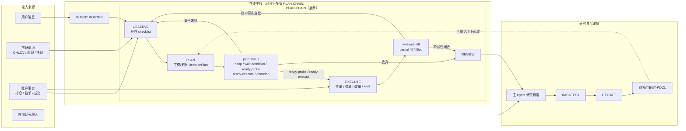

# Design Architecture

## 系统概览

### 产品形态

一组运行在 agent 工作区里的 skill，通过 Claude Code / Codex / Gemini CLI 调用。不做独立 app。持久化层是数据库，不是 agent 工作区记忆。

### 主链路

```
在线主线：OBSERVE <-> PLAN -> EXECUTE -> REVIEW
离线演化：REVIEW -> BACKTEST -> ITERATE -> STRATEGY-POOL
```

核心流转图（含并行 PLAN-CHAIN 和研究侧）：



### 核心长期容器

| 容器 | 内含 | 说明 |
| --- | --- | --- |
| `PLAN-POOL` | PlanChain[] | 每条 chain 是一个交易机会的完整生命周期（DecisionPlan 当前 + 历史 + 伴随 sidecar） |
| `STRATEGY-POOL` | strategy[] | 策略资产，离线演化结果；MVP 扁平结构，远期 namespace + 微策略两层（详见离线演化侧） |

PlanChain 是核心 lifecycle 容器。每个 `plan_chain_id` 对应一个机会，决策本体存 `decision_plan_current`，演化历史存 `decision_plan_history`，观察证据 / 执行包 / 运行时 / preflight 结果分别存各 sidecar 表（见《数据库存储》）。跨链关联通过 `plan_relation` 表引用。

**跨链 exposure 视图**：PLAN-POOL 层需聚合所有活跃态 chain（`wait-condition / ready-probe / ready-execute / wait-until-fill / partial-fill / in-position`），计算整体方向性暴露。对冲锁仓场景中，对冲链通过 `plan_relation` 引用被对冲链，PLAN-POOL 视图据此做净值计算，识别真正的净方向敞口。单个 plan 不感知其他链，跨链聚合由调用层（OBSERVE 或 REVIEW）负责。

### Skill 分层

详细结构见 [skill-layout.md](skill-layout.md)。

整个 trade 系统按两层 skill 切分，互不替代：

| 层 | 形态 | 例子 | 职责 |
| --- | --- | --- | --- |
| **套件 skill**（agent 编排层） | `trade-flow` 一个套件，内部 `stages/observe/plan/execute/review/backtest/iterate` | 仅一个：`trade-flow` | 主线流转、router、数据库读写、调用功能 skill |
| **功能 skill**（原子动作层） | 平铺单一职责 skill | `binance-*` / `ohlcv-fetch` / `tech-indicators` / `binance-market-scan` | 一件事做好（拉数据 / 下单 / 算指标），可被套件内任意 stage 调用 |

套件内 `SKILL.md` 是轻量入口（router + 各 stage 简介），各 `stages/X/STAGE.md` 按需读取，避免一次性吞 token。

文件数据库 `./data/trade.db`（SQLite），承接本节"数据库存储"定义的 schema。

---

## Plan 设计

### 核心约束

- `PlanChain` 是机会容器，`plan_chain_id` 为 uuid，贯穿整个生命周期不变；`DecisionPlan` 是当前决策本体（1 chain = 1 current，version 递增）
- **决策性变化**（thesis / entry / stop / targets / status / strategy_ref / risk 变化）：覆盖 `decision_plan_current`，同时 append `decision_plan_history` 快照，附 `change_summary`
- **监控性变化**（心跳检查 / 成交回填 / 触发评估）：进对应 sidecar 表（`runtime_state / plan_check / rule_check`），不写 `decision_plan_history`
- `decision_plan_history` 是可追溯的决策日志；`decision_plan_current` 是最新状态，agent 直接读写
- 渐进披露按"层"激活：不同阶段激活不同 sidecar（见《Sidecar 生命周期与编排合同》的状态→必存性矩阵），避免草拟阶段被执行前字段打断思考
- DecisionPlan 写入 / status 升级前必须通过 [plan-preflight](../.agents/skills/plan-preflight/SKILL.md) 的 hardcode 规则；违反则不能保存

### 分层模型

#### 设计原则

- 只有 `DecisionPlan` 叫 plan；其它都叫 sidecar
- 渐进披露按"层"激活，不按"大对象字段"激活
- authored 不被 observed 覆盖；observed 不回写 authored；compiled 可丢弃重算；derived 永远不是事实源
- 默认不携带 probe / 多腿 / 合约 / trailing / partial-fill 的全部字段——场景用到哪层才激活哪层
- 运行时状态单独管理：成交、挂单、触发、回填不污染 plan 主体

#### 七层容器

| 层 | 数据性质 | 负责什么 | 变化频率 |
| --- | --- | --- | --- |
| `PlanChain` | lifecycle | 一次交易机会的容器；串起 version、关联链、当前激活状态 | 低 |
| `DecisionPlan` | authored | 当前决策本体：为什么做、怎么做、什么时候不做 | 中 |
| `EvidenceSnapshot` | observed | 账户事实、市场语境、微结构、催化剂 | 高 |
| `ExecutionPlan` | compiled | 把 `DecisionPlan` 编译成交易所可执行包：订单组、仓位配置、预检结果 | 中 |
| `RuntimeState` | observed | 交易所当前真实状态：working orders、fills、position、progress | 高 |
| `PlanView` | derived | 给人和 agent 读的一屏摘要：`plan_brief / execution_brief / position_brief / decision_card` | 按需重算 |
| `RuleCheck` | derived | preflight、failures、warnings、acknowledgements | 按需重算 |

渐进披露 = 哪一层在当前阶段被激活，不是一个大 JSON 越往后 required 越多。状态与层的必存性矩阵见《Sidecar 生命周期与编排合同》。

#### 复杂场景如何落

- 合约扩展：`microstructure / catalyst` 进 `EvidenceSnapshot`；`margin_mode / position_mode / precheck` 进 `ExecutionPlan`
- 多腿 / 对冲：strategy_ref 承载对冲语义（`S-HEDGE-GENERIC`）；跨链关系写 `plan_relation` 表；独立对冲腿即新开 `PlanChain`
- 分批建仓：DecisionPlan 只保留 tranche 意图（价位 + 权重）；订单 id、成交量、成交时间都进 `RuntimeState`
- 高级持仓管理：默认不启用 trail / 条件加减仓；只有存在明确计划内结构时才进 `ExecutionPlan.body.management_rules`

### Plan / Strategy / Rule Shape 规范

#### 总原则

硬字段只是骨架、软字段承载变化、枚举是 LLM 的敌人。只有三类数据必须结构化：

1. 必须送交易所的（价位、数量、market、side）
2. 必须做 hardcode 校验的（status enum、max_loss_pct 数字、FK）
3. 已被 REVIEW 证明需要跨 plan / strategy 聚合的（MVP 阶段默认没有，等样本说话）

其余一律自然语言。所有"想让 agent 说点什么"的元字段（counter_thesis / edge_type / evidence_trust / exit_narrative / next_check / max_holding_duration / time_horizon / regime 逐 tf 枚举 ...）一律融进 `thesis / risk.notes / exit_note / state_reason / policy` 的自然语言里——REVIEW 聚合再从自然语言中提取，不做 design-time 前置结构化。

演化驱动结构化：某字段在 REVIEW 里第 3 次被用来跨 plan 聚合时，才升级成独立字段。

#### DecisionPlan 最小 shape

```yaml
intent:
  thesis: text             # 一段话：为什么做 + 反思 + edge 直觉 + key risks
  strategy_ref: S-xxx      # 必填，FK 到 strategy 池；临机 probe ref S-PROBE-GENERIC
trade:
  market:
    venue: string          # binance | ...
    symbol: string         # BTCUSDT
    type: spot | usdm | coinm
  side: long | short | spot-buy | spot-sell
  entry:
    price: number
    type: limit | market | stop | stop-market | take-profit | take-profit-market
    tranches: [{price, weight_pct, type?}]?   # 可选；分批建仓时填
  stop:
    price: number
    basis: mark | last       # 合约必填 mark（R-001）
    anchor: text             # 自然语言说明锚点：结构位 / ATR / 心理位
  targets: [{price, size_pct}]?    # 可选；留 null 表示"看着平"
  exit_note: text?                 # 可选：出场口述
risk:
  max_loss_pct: number       # 必填；这是 R-004 / R-012 / R-024 的计算基准
  size_intent: probe | main | scalp | reduce
  notes: text?               # 软字段：事件、时限、对冲意图、key_risks 全塞
state:
  status: enum               # 见 plan.status 状态机
  state_reason: text?        # 为什么进这个 status
```

**硬字段 10 个**（market.* / side / entry.price / entry.type / stop.price / stop.basis / max_loss_pct / size_intent / status / strategy_ref），其余全软或 optional。

**role 不是 plan 字段**：多腿/对冲语义由 strategy_ref 承载（ref `S-HEDGE-GENERIC` 即为 hedge leg），跨链关系由 `plan_relation` 表承载，不在 DecisionPlan 内重复。

#### Strategy 最小 shape

```yaml
strategy_id: S-xxx
name: string              # 一行人类可读名
status: active | draft | retired
policy: markdown          # 一大段自然语言，涵盖：
                          #   - setup 条件与失效条件
                          #   - EV 哲学（min EV / min net RR / 允许 EV 略负？）
                          #   - regime 漂移处理（must-replan / hold / conditional）
                          #   - catalyst 处理（close-before / carry-through / hedge）
                          #   - 持仓纪律（硬时限 / 节奏检查 / max_holding）
                          #   - size policy（允许 probe / main 默认 / 加仓规则）
                          #   - 需要的微结构字段（对合约 strategy）
tags: [string]            # 扁平标签，不做多层枚举
                          # e.g. ['directional','technical','intraday','usdm']
required_rules: [R-xxx]?       # 本 strategy 独需的额外 rule；默认空
overridden_rules:              # 本 strategy 明确不跑的 rule；默认空
  - rule_id: R-xxx
    reason: text               # 必须给理由
```

**硬字段 3 个**（strategy_id / status / policy），其余全软或默认空。

#### Rule 最小 shape

```yaml
rule_id: R-xxx
name: string              # 一行说明
severity: reject | warn-ack
scope: expression         # 什么时候触发这条 rule（JSONata-like 表达式）
check: expression         # 检查什么（同上）
```

**硬字段 4 个**（rule_id / severity / scope / check）。name 是展示用。

`type` 不做字段——rule 分类在 name 前缀或 rule_id 命名里自然体现（R-001..R-005 侧重 execution-safety、R-012..R-013 侧重 account-risk），需要聚合时 preflight skill 或 REVIEW 按前缀分组即可，不做 design-time 枚举。

#### plan 怎么知道用哪些 rule（matching 机制）

```
plan 本轮要跑的 rule 集合 =
    (rule 池中 scope 表达式对本 plan 求值为 true 的)
  ∪ (plan.strategy.required_rules)
  − (plan.strategy.overridden_rules；每条必须带 reason)
```

- Rule 是 scope 自动匹配，**不存在"挑 rule 组"** 这件事
- Strategy 是 plan 的显式必填 ref，**不存在"无 strategy 的 plan"**（临机 probe ref `S-PROBE-GENERIC`）
- Strategy 对 rule 有局部否决权（`overridden_rules`），否决必须显式 + 可审计（reason 必填）
- 新增 rule 只需写对 scope，自动对所有存量 plan 生效；新增 strategy 无须动 rule 池

Preflight skill 的职责：拿到 plan + strategy，机械合成 rule 集合，跑校验，输出 rule_check。Plan 本身不维护"我该跑哪些 rule"的元数据。

### Strategy 池：MVP 种子

4 条种子覆盖 MVP 场景。每条 policy 故意保持短——**不是把一切写清楚，是给 agent 一个可延展的信念起点**。

#### `S-GENERIC-TREND`

```yaml
strategy_id: S-GENERIC-TREND
name: "通用趋势跟随"
status: active
tags: ['directional', 'technical']
policy: |
  属于没明确归入具体 setup 的趋势跟随 plan 默认 fallback。
  setup：顺主周期（4H/1D）方向，回调到结构位/均线/ATR 锚点入场。
  失效：突破 stop 锚点或 thesis 里写明的结构失效位。
  EV：要求 expected_value > 0，允许小幅为负只在明确 ack 时。
  regime：主周期 regime 漂移必须 replan；次周期漂移允许继续持有直到 stop 或 target。
  catalyst：持仓窗口内有 high-impact 事件必须在 thesis 或 risk.notes 里明示处置（穿越 / 提前平）。
  持仓：不设硬时限；进 in-position 后写 state_reason 带节奏（如"每 4H 复看"）。
  size：默认 main；可 probe 起步后升级。
```

#### `S-GENERIC-MEANREVERT`

```yaml
strategy_id: S-GENERIC-MEANREVERT
name: "通用均值回归"
status: active
tags: ['mean-revert', 'technical']
policy: |
  震荡区间的反手入场默认 fallback。
  setup：主周期横盘（ADX 低 / 布林缩口），次周期触边反弹。
  失效：区间边界被真突破。
  EV：要求 min_net_rr >= 1.2；允许胜率 > 60% 但 RR 较低的 setup。
  regime：次周期 regime 漂移不必 replan——本策略本身抗波动；主周期从 range 进 trend 必须平仓重评。
  catalyst：持仓窗口 high-impact 事件默认提前平，除非 hedge 腿覆盖。
  持仓：默认短（< 4H）；超时不升档而是主动平。
  size：默认 main；不使用加仓。
```

#### `S-PROBE-GENERIC`

```yaml
strategy_id: S-PROBE-GENERIC
name: "临机 probe 通用"
status: active
tags: ['probe', 'fast-path']
policy: |
  ready-probe 状态 plan 默认 ref 此条。
  setup：信号来得快来不及写完整 plan；承认观察力稀缺，用严格 size cap 换反应速度。
  失效：stop 必须具体价位；thesis 一句话交代为什么不走完整 plan。
  EV：不要求正 EV（允许 EV 略负换 optionality）。
  regime：不评估。
  catalyst：不评估。
  持仓：入场后 2h 内必须升级 in-position（补齐完整 DecisionPlan / EvidenceSnapshot / ExecutionPlan + 通过 ready-execute rule 集）或主动平仓；超时套件强平 replan。
  size：强制 probe；risk ≤ 账户 max_loss_pct × 0.3（由 R-024 保证）。
overridden_rules:
  - rule_id: R-014
    reason: "probe 允许 EV 略负换信息，本 strategy 定义放弃 EV > 0 硬约束"
```

#### `S-HEDGE-GENERIC`

```yaml
strategy_id: S-HEDGE-GENERIC
name: "通用对冲腿"
status: active
tags: ['hedge', 'carry']
policy: |
  为已存在方向仓位做保护或 carry 对冲的 plan 默认 ref 此条。
  setup：thesis 必须点明被对冲的 plan_chain_id（同时在 plan_relation 表写 parent_chain_id）。
  失效：被对冲方平仓即本腿失效，主动平。
  EV：不要求单独正 EV——和父仓合计评估（手动或 REVIEW 阶段）。
  regime：不独立评估。
  catalyst：不独立评估（由父仓承担）。
  持仓：与父仓同周期。
  size：与父仓净敞口匹配；允许 cluster gross 超阈值（R-020 由本 strategy 自动 ack）。
overridden_rules:
  - rule_id: R-014
    reason: "hedge 腿不做独立 EV 评估，由父仓合计"
  - rule_id: R-020
    reason: "hedge 腿天然提升 gross exposure，这是设计意图"
  - rule_id: R-018
    reason: "hedge 腿不基于微结构做判断，允许 microstructure null"
```

### Rule 池：规则清单

scope/check 字段用 JSONata-like 表达式（实际实现可换 jsonata / jexl / JS 函数指针）。R-010 / R-014 / R-016 / R-023 不作为全局 rule，而是进 strategy.policy（分别落在"持仓纪律 / EV 哲学 / regime 处理 / catalyst 处理"）——这类规则的阈值天然因策略而异，强行全局会逼所有 plan 都 ack。

| rule_id | name | severity | scope | check |
| --- | --- | --- | --- | --- |
| R-001 | 永续止损必须 mark price | reject | `market.type in ['usdm','coinm'] and stop != null` | `stop.basis = 'mark'` |
| R-002 | 多腿必须算 net_after_fill | reject | `status >= 'ready-execute' and exists(plan_relation where child_chain_id = self)` | `evidence_snapshot.body.exposure.net_after_fill != null` |
| R-003 | 止损必须有结构化依据 | warn-ack | `stop != null` | `stop.anchor != null and stop.anchor != ''` |
| R-004 | 成交后账户总 open risk 不超上限 | reject | `risk.max_loss_pct != null` | `evidence_snapshot.body.account.open_risk_pct + risk.max_loss_pct <= account_config.max_open_risk_pct_after_fill` |
| R-005 | 合约 ready-execute 前必须预检 | reject | `market.type in ['usdm','coinm'] and status = 'ready-execute'` | `execution_plan.body.precheck.passed = true and covers_all(['positionSide','stepSize','minQty','minNotional','openOrders','availableBalance'])` |
| R-006 | 极端 funding 必须 thesis 或 risk.notes 提及 | reject | `status >= 'ready-execute' and abs(evidence_snapshot.body.microstructure.funding.current_rate) > 0.001` | `contains(intent.thesis, 'funding') or contains(risk.notes, 'funding')` |
| R-007 | OTOCO 必须标 visibility=mother-only | reject | `execution_plan.body.order_type = 'otoco'` | `execution_plan.body.visibility = 'mother-only'` |
| R-008 | 永续 expected_rr 必须计入 funding | warn-ack | `market.type in ['usdm','coinm'] and strategy.policy mentions holding >= 4h` | `execution_plan.body.expected_rr.funding_accounted = true` |
| R-009 | 永续执行语义必须显式 | reject | `market.type in ['usdm','coinm'] and status >= 'ready-execute'` | `execution_plan.body.margin_mode != null and execution_plan.body.position_mode != null` |
| R-011 | 永续方向仓必须检查 liq buffer | reject | `market.type in ['usdm','coinm'] and side in ['long','short'] and status >= 'ready-execute'` | `execution_plan.body.liquidation_ref.buffer_pct > 0` |
| R-012 | risk_budget 字段之间必须自洽 | reject | `status >= 'wait-condition'` | `risk.max_loss_pct × account_config.equity <= derived.max_loss_usdt_ceiling`（单字段时自洽，多字段时交叉校验） |
| R-013 | 同簇累计净敞口不得超阈值 | reject | `status >= 'ready-execute'` | `abs(evidence_snapshot.body.cluster_net_exposure.net_usdt) <= account_config.max_correlated_exposure_usdt` |
| R-015 | 市价类订单 slippage 必须基于实测 | warn-ack | `execution_plan.body.order_type in ['market','stop-market'] or any tranche.type in [...]` | `execution_plan.body.expected_rr.slippage_basis != 'fixed-assumption'` |
| R-017 | 加仓档必须事前定义 | reject | `status = 'in-position' and runtime_state.body.entry_count >= 2` | `exists tranche in trade.entry.tranches where tranche matches fill` |
| R-018 | 合约 plan 必须填微结构快照 | warn-ack | `market.type in ['usdm','coinm'] and status >= 'wait-condition'` | `evidence_snapshot.body.microstructure != null and has(funding.current_rate, open_interest.oi_usdt, long_short_ratio, taker_buy_sell_ratio)` |
| R-019 | trail-activate 必须结构化 | warn-ack | `execution_plan.body.management_rules any rule_type = 'trail-activate'` | `trail_spec != null and trail_spec.mode != 'free-form'` |
| R-020 | 同簇累计 gross 超阈值必须 ack | warn-ack | `status >= 'ready-execute'` | `evidence_snapshot.body.cluster_net_exposure.gross_usdt <= account_config.max_correlated_gross_exposure_usdt` |
| R-021 | ready-execute → wait-until-fill 必须先过 DECISION_CARD | reject | `status transition 'ready-execute' → 'wait-until-fill'` | `plan_view.decision_card rendered completely and Checks line has no '✗'` |
| R-022 | 微结构快照必须新鲜 | reject | `market.type in ['usdm','coinm'] and status >= 'ready-execute'` | `now - evidence_snapshot.body.microstructure.snapshot_at <= 30s` |
| R-024 | ready-probe 硬 cap | reject | `status = 'ready-probe'` | `size_intent = 'probe' and max_loss_pct <= account_config.max_loss_pct × 0.3` |

路径命名约定：`plan.*` = DecisionPlan 本体字段；`evidence_snapshot.body.*` / `execution_plan.body.*` / `runtime_state.body.*` = sidecar body_json 内容；`account_config.*` = `./data/account_config.json`；`plan_relation.*` = 关系表。Preflight skill 实现时用这套路径作解析输入。

### Sidecar 生命周期与编排合同

**1. Snapshot 刷新编排**

- `evidence_snapshot` 以 append-only 方式写入：每次 OBSERVE 刷新 = 新建一行（`plan_chain_id + observed_at` 作为天然时序）
- 新 `evidence_snapshot` 到达会标记该 chain 最新的 `execution_plan` 为 `stale=true` 和最新的 `rule_check` 为 `stale=true`（数据库 trigger 或套件层写入时同步更新）
- `status >= ready-execute` 且 `execution_plan.stale = true` 的 plan，preflight skill 拒绝放行，必须重编 `execution_plan` + 重跑 `rule_check`
- `wait-until-fill` 起 `execution_plan.stale` 检查关闭（order 已锁定，evidence 继续刷但不再触发重编）

**2. refs 的 cardinality（反查不存指针）**

DecisionPlan **不存** `latest_evidence_snapshot_id / latest_execution_plan_id`。

- `evidence_snapshot` 表自带 `plan_chain_id + observed_at`，反查最新：`WHERE plan_chain_id = ? ORDER BY observed_at DESC LIMIT 1`
- 同理 `execution_plan / runtime_state / rule_check`
- `rule_check` 行里存当次检查用的 `evidence_snapshot_id + execution_plan_id`（审计定格），这是**唯一一处**存 snapshot_id 指针的地方
- DecisionPlan 完全不感知刷新频率，干净

**3. ExecutionPlan 生命周期：ephemeral → submitted → cancelled**

```
ephemeral  ——订单未送交易所；evidence 刷新会标 stale；可新增行覆盖（上一行保留历史）
    │ order 送出
    ▼
submitted  ——至少一个 order_ref 已在交易所；只读；evidence 继续刷但不触发重编
    │ 全部 cancel / 全部 filled
    ▼
cancelled / fulfilled  ——终态，仅审计用
```

- 决策变更（改 entry / 改 stop）必须写新 `decision_plan_history` 行 + 新 `execution_plan` 行作为下一版执行包；旧 submitted 行保留
- 这条边界让"ExecutionPlan 可丢弃重算"的语义只在 `ephemeral` 期为真，避免一句话掩盖真相

**4. ready-probe 跳过 ExecutionPlan**

- `ready-probe` 状态下 plan **不生成 `execution_plan` 行**，直接由套件拉起最小订单参数送交易所，`runtime_state` 行记录 `order_ref / fill`
- 所需检查的 rule 集（R-001 / R-003 / R-004 / R-012 / R-024）scope 表达式不依赖 `execution_plan.body.*`
- 升级到 `in-position` 时必须补写 `execution_plan` 行作为事后记录（`status=submitted`，`reconstructed=true` 标记）

**5. 状态 → 各 sidecar 必存性**

| status | decision_plan_current | evidence_snapshot | execution_plan | runtime_state | rule_check |
| --- | --- | --- | --- | --- | --- |
| `wait-condition` | ✓ | ✓（at least 1 行） | — | — | ✓（rule_check 随写入） |
| `ready-probe` | ✓（最小 shape） | ✓（轻量） | **✗**（刻意跳过） | ✓（触发落单后） | ✓ |
| `ready-execute` | ✓ | ✓（新鲜 ≤ 30s） | ✓（非 stale） | — | ✓（非 stale） |
| `wait-until-fill` | ✓ | ✓ | ✓（submitted） | ✓ | ✓ |
| `partial-fill` | ✓ | ✓ | ✓（submitted） | ✓ | ✓ |
| `in-position` | ✓ | ✓（持续刷） | ✓ | ✓ | ✓（随 rule 触发） |
| `closed` | ✓（最终） | 最后一行 | fulfilled / cancelled | 最终 | ✓（REVIEW 写一条 aggregate） |

**6. 最小变体清单**（硬 shape 骨架 × 场景组合）

| 变体 | 必选层 | 必选 plan 字段 | 典型 strategy |
| --- | --- | --- | --- |
| spot-minimal | decision_plan + evidence（账户）+ runtime | intent.thesis / intent.strategy_ref / trade.market(spot) / trade.side / trade.entry / trade.stop / risk.max_loss_pct / risk.size_intent / state.status | `S-GENERIC-TREND / S-GENERIC-MEANREVERT` |
| usdm-minimal | spot-minimal + evidence.microstructure + execution_plan | 追加 `trade.stop.basis=mark` | 同上 |
| probe | decision_plan（骨架）+ evidence（轻）+ runtime | spot-minimal 的子集 | `S-PROBE-GENERIC` |
| hedge-leg | usdm-minimal + plan_relation | 追加 parent_chain_id（在 plan_relation 表写） | `S-HEDGE-GENERIC` |

变体不在 schema 硬编码——preflight 按 `plan.market + plan.strategy_ref + plan.status` 自动合成 rule 集和层必存性检查。

### DECISION_CARD（派生视图，不是字段）

plan 本体字段多、块多，人在扣扳机那一刻脑子里只跑 5 件事：**看到什么 / 哪里错 / 错了亏多少 / 对了赚多少 / 谁先死**。DECISION_CARD 是从 plan body 派生出来的一屏视图，写入 plan 不变、但进入 `ready-execute → wait-until-fill` 前必须渲染出来让人看（见 R-021）。

**固定 8 行主体格式**（另含上下边框）：

```
── DECISION CARD ─────────────────────────────────────────
  Plan     <plan_chain_id:8>  v<version>  <venue>:<symbol> <market_type>  <status>
  Strategy <strategy_ref>  (<strategy.name>)
  Thesis   <intent.thesis 压成 1-2 句>
  Risk     <side>  size=<size_intent>  loss≤<max_loss_pct>%
  Route    entry <entry.price|zone> [<entry.type>]  stop <stop.price>  anchor <stop.anchor>
           targets <加权均价 or "open">
  Context  funding <rate%> OI <change_1h%>  walls <上下最近大墙价位>  liq <最近爆仓簇>
           catalyst <事件名 + impact 或 "none in window">   [snapshot age <age_s>s]
  Exit     <trade.exit_note 或 strategy.policy 摘出>
  Checks   ✔ <passed R-*>   ⚠ ack <R-* + reason>   ✗ fail <R-*>
──────────────────────────────────────────────────────────
```

**渲染规则**：
- 所有字段由 preflight skill 从 DecisionPlan body + 最新 EvidenceSnapshot + 关联 Strategy 派生，**agent 不手写**——卡片只是视图
- `trade.entry.tranches` 非 null 时，Route 行 `entry` 显示首档 + `(+N 档)` 尾注
- Strategy 行若是 `S-HEDGE-GENERIC`，追加 `hedges → <plan_relation.parent_chain_ids 缩写>`
- Context 行：现货 plan（`market_type=spot`）`funding / OI` 隐藏，只渲染 walls / liq / catalyst；snapshot age 高亮（> 20s 黄、> 30s 红直接触发 R-022 fail）
- catalyst 展示规则：最新 EvidenceSnapshot 里持仓窗口内有 impact=high/med 事件时显示 `FOMC in 3h (high)`，否则 `none in window`
- `Checks` 行的 ✔/⚠/✗ 直接映射 plan-preflight 输出；✗ 非空 → 卡片拒绝渲染为"可执行"，退回 wait-condition
- 人只对卡片说 yes/no，不再逐字段过 body_json——body_json 只在卡片信息不够用时作为 drill-down

**与 body 的关系**：DECISION_CARD 不进数据库，每次 status 前进时由 preflight 重新渲染。DecisionPlan body 是唯一真相，卡是压缩摘要。

### ACCOUNT_CONFIG（不进 plan body）

固定最小 contract：`./data/account_config.json`

| 字段 | 必填 | 说明 |
| --- | --- | --- |
| `account_equity` | 是 | 当前账户权益；R-012 用它把 `max_loss_pct` 换算成名义金额 |
| `max_day_loss_pct` | 是 | 单日最大允许亏损百分比；PLAN-POOL 层的全局闸门 |
| `max_open_risk_pct_after_fill` | 是 | 成交后账户总 open risk 上限 |
| `max_correlated_exposure_usdt` | 是 | 同簇**净方向性**敞口上限；供 R-013 使用 |
| `max_correlated_gross_exposure_usdt` | 是 | 同簇**总敞口**上限；供 R-020 使用，专门约束高 gross hedge / carry |
| `max_consecutive_losses` | 是 | 连续亏损上限；超限时 PLAN-POOL 直接拦截新 plan |

缺文件、缺字段、或字段为 null 时，不允许 agent 猜默认值；凡依赖该 contract 的写入校验（至少 R-004 / R-012 / R-013 / R-020）一律直接拒写。

### 写入校验哲学

**防爆仓，不防思考。** 校验目标是拦住真会亏钱的硬错，不是把 agent 逼成填字游戏。规则按严重度分两层：

- **`reject`**：真会爆仓或结构性踩坑（永续止损取值源、预检缺失、liquidation 缓冲、OTOCO 可见性等）。违反直接拒写，必须修复。
- **`warn-ack`**：默认拒写，但允许 agent 带理由显式放行（写入 `rule_acknowledgements`）。用于"多数情况应遵守，但存在合理例外"的规则——如结构化止损（非 ATR 锚定）、scalp 忽略 funding、承认无法估胜率等。

**为什么要这样分层**：硬规则全开等于告诉 agent"填满字段就能入场"，agent 会倒推数字凑通过（比如胜率估计为凑 EV > 0 往上虚估），记录的"决策"反而被污染。warn-ack 机制让 agent 要么遵守，要么**显式写出为什么破例**——判断可追溯，REVIEW 阶段能按 rule_id 聚合"明知故犯"的胜率，数据说话再决定升降级。

**Acknowledgement 纪律**：`warn-ack` 放行不是万能通行证：
1. 每次 ack 必须带**具体**理由，不是"ack"二字
2. 同一 `rule_id` 在单个机会生命周期内以**不同 reason** 累计 ack 超过 3 次，升级为 reject（说明这个 setup 压根就是边缘情况）。**同 reason 在多次 decision_plan_history 迭代中保持一致不重复计数**——视为该理由已被追认
3. REVIEW 阶段按 `rule_id` 聚合 ack 后的胜率；某规则被 ack 的样本胜率长期低于整体，说明该规则对这类 agent/市场应固化为 reject

Preflight skill 的落地见 [.agents/skills/plan-preflight/SKILL.md](../.agents/skills/plan-preflight/SKILL.md)。


### plan.status 状态机

| status | 大类 | 含义 |
| --- | --- | --- |
| `noop` | NOOP | 机会不成立或不参与 |
| `wait-condition` | 观望 | 有 setup，等市场条件；订单尚未挂出 |
| `ready-probe` | 快速通道 | 临机捕信号：最小 DecisionPlan（10 个硬字段 + 轻量 EvidenceSnapshot）过 R-001/R-003/R-004/R-012/R-024 五条规则即可下单，`strategy_ref` 默认 `S-PROBE-GENERIC`，`size_intent` 强制 `probe`，risk ≤ 账户 `max_loss_pct × 0.3`（R-024）。用于"信号来得太快来不及写完整 plan"——不是走捷径偷懒，是承认观察力稀缺、用严格 size cap 换反应速度。入场后 2h 内必须升级到 `in-position`（补齐完整 DecisionPlan / EvidenceSnapshot / ExecutionPlan + 通过全量 ready-execute 规则）或主动平仓，超时由套件强制平仓 replan。REVIEW 按 probe 维度独立聚合，不污染 main 策略胜率 |
| `ready-execute` | 观望→执行 | 条件满足，ExecutionPlan 编出且非 stale，等用户确认 |
| `wait-until-fill` | 挂单 | 订单已挂出至交易所（`execution_plan.status = submitted`），等成交；RuntimeState 记录 `order_ref` |
| `partial-fill` | 挂单→监控 | 入场阶段尚未完整：(a) 单笔订单被部分成交、剩余挂单保留；或 (b) `trade.entry.tranches[]` 多档里某档已触发未填满。RuntimeState 持续回填成交事件 |
| `in-position` | 监控 | 仓位存活，持续 OBSERVE→PLAN 循环 |
| `abandon` | 终止 | 条件过期 / 机会消失 / 主动放弃 |
| `draft-closed` | 终止 | 计划成形但从未进入执行 |
| `closed` | 终止 | 仓位完全结束，进入 REVIEW |

### plan_check（心跳监控记录）

心跳监控不生成新 DecisionPlan 版本，写一条轻量记录：

| 字段 | 必填 | 说明 |
| --- | --- | --- |
| `check_key` | 是 | uuid |
| `plan_chain_id` | 是 | 引用 PlanChain |
| `checked_at` | 是 | 检查时间 |
| `price_at_check` | 是 | 检查时现价（不存 K 线） |
| `orders_ok` | 是 | 挂单是否全部还在 |
| `is_still_valid` | 是 | 判断还成立吗 |
| `findings` | 否 | 有 notable 才写，否则 null |
| `triggered_replan` | 是 | 是否触发了新 DecisionPlan 版本 |

只有 `is_still_valid=false` 或 `triggered_replan=true` 时才进入 PLAN 流程做决策性更新（新写 `decision_plan_history` + 覆盖 `decision_plan_current`）。

### 数据库存储

MVP 阶段用 SQLite 单文件数据库，文件路径 `./data/trade.db`（详见 [skill-layout.md](skill-layout.md)）。schema 以七层容器为轴切分表：DecisionPlan 当前 vs 历史分表；EvidenceSnapshot / ExecutionPlan / RuntimeState / RuleCheck 各自独立、按 `plan_chain_id + observed_at|compiled_at` 反查。Rule / Strategy 池独立表，MVP 可用 markdown 种子冷启动。下方用 PostgreSQL 风格表达，SQLite 实现时 `timestamptz` 用 TEXT (ISO 8601)、`text[]` / `jsonb` 用 TEXT (JSON 字符串)。

| 表 | 层 | 用途 |
| --- | --- | --- |
| `plan_chain` | lifecycle | 一条机会的骨架；`plan_chain_id` uuid，`created_at`，`closed_at`，`parent_chain_ids[]`（跨链关联走 `plan_relation` 表，这里只冗余给索引） |
| `decision_plan_current` | authored | 当前决策本体（1 行 = 1 chain）：`plan_chain_id (PK FK) / version / updated_at / strategy_ref / market_type / side / status / size_intent / body_json`。body_json 是 DecisionPlan 最小 shape |
| `decision_plan_history` | authored | 决策演化日志：`history_key uuid PK / plan_chain_id FK / version / changed_at / change_summary / snapshot_json`；version 递增 |
| `evidence_snapshot` | observed | append-only：`snapshot_key / plan_chain_id / observed_at / body_json`；每次 OBSERVE 刷新写新行。body_json 含 account / microstructure / catalyst / cluster_net_exposure |
| `execution_plan` | compiled | append-only：`execution_key / plan_chain_id / compiled_at / status (ephemeral \| submitted \| cancelled \| fulfilled) / stale / evidence_snapshot_id / body_json`。body_json 含 order 组 / precheck / margin_mode / position_mode / expected_rr |
| `runtime_state` | observed | append-only：`runtime_key / plan_chain_id / observed_at / body_json`；body_json 含 working orders、fills、position、progress |
| `rule_check` | derived | append-only：`check_key / plan_chain_id / target_status / checked_at / stale / passed[] / failed[] / warnings[] / decision_card / evidence_snapshot_id / execution_plan_id`；preflight 每次跑一条 |
| `plan_check` | derived | 心跳记录，见上节字段定义 |
| `plan_relation` | lifecycle | 跨 chain 关系：`relation_key / child_chain_id / parent_chain_id / relation_type (hedge \| spot-futures-leg \| ...) / note` |
| `review` | derived | REVIEW 产出：`review_key / plan_chain_id / reviewed_at / body_json`（见 REVIEW 字段） |
| `rule_pool` | pool | 规则池：`rule_id PK / name / severity / scope / check / body_md`；从 [Rule 池](#rule-池规则清单) seed |
| `strategy_pool` | pool | 策略池：`strategy_id PK / name / status / tags_json / policy_md / required_rules / overridden_rules`；从 [Strategy 池](#strategy-池mvp-种子) seed |

**刷新同步合同**（见《Sidecar 生命周期》）：新 `evidence_snapshot` 落地时，套件（或数据库 trigger）把该 chain 最新 `execution_plan / rule_check` 的 `stale` 置 true。`ready-execute` 前必须重编 `execution_plan`、重跑 `rule_check`。`wait-until-fill` 起 `execution_plan.stale` 检查关闭。

### 追溯方式

- 读当前决策 → `decision_plan_current WHERE plan_chain_id = ?`
- 读决策演化历史 → `decision_plan_history WHERE plan_chain_id = ? ORDER BY version`
- 读最新证据 / 执行包 / 运行时 → `evidence_snapshot / execution_plan / runtime_state WHERE plan_chain_id = ? ORDER BY observed_at|compiled_at DESC LIMIT 1`
- 读某次 preflight 定格 → `rule_check` 行里的 `evidence_snapshot_id + execution_plan_id` 回查
- 读跨 chain 关系 → `plan_relation WHERE child_chain_id = ? OR parent_chain_id = ?`

### 待收紧的开放 object

- **持仓时限的软硬分界**：DecisionPlan 的 `risk.notes` / 对应 strategy.policy 里目前用自然语言写"持仓纪律"。REVIEW 的 `holding_vs_budget` 长期聚合可揭示偏差（如 BTC 4h trending-up 做多的实际持仓是软估的 3-5 倍），积累样本后再决定是否把"最长持仓"升格为 DecisionPlan 硬字段；当前刻意不前置结构化，避免 agent 凑数。
- **correlation_cluster 的动态化**：`evidence_snapshot.body.cluster_net_exposure` 目前需要 agent 自行判定标的归簇（btc-beta / eth-eco / sol-eco / meme / stable / independent / other）。演化路径：(a) 短期——维护 `symbol -> cluster` 常量表，随季度人工校准；(b) 中期——落地"近 30/90 天滚动相关系数 ≥ 0.6 归为同簇"的动态分类任务（每日批处理，写入独立 `symbol_correlation` 表），归簇由表驱动；(c) 长期——REVIEW 按 override 样本反推静态枚举漂移，累计到阈值触发簇定义拆分。触发条件：累计 30+ 条以自然语言覆盖默认归簇的 plan。
- **strategy.policy 的结构化反压**：MVP 阶段 policy 是一段 markdown。当 REVIEW 发现某个维度（如 "max_holding" / "min_net_rr" / "catalyst 处置"）在多条 strategy 里以相似格式出现 ≥ 3 次，就从 policy 里抽成独立字段——演化驱动结构化，不前置。
- **rule 分类字段**：目前 rule 靠 name 前缀自然分类（schema-integrity / account-risk / execution-safety / market-required / personal-discipline）。当 Rule 池 ≥ 30 条或 preflight 需按类别开关时，再补 `rule.type` 字段。
- **REVIEW 产出结构**：`review.body_json` 当前只是 markdown dump。累积 20+ 样本后按查询频率决定是否把 `signal_accuracy / cost_vs_expected / holding_vs_budget` 拆成独立列或伴随表。

---

## Market Data

详细设计见 [market-data-design.md](market-data-design.md)。

### 三层原则

| 层 | 职责 |
| --- | --- |
| 接入层 | 向 Binance 拉原始数据，轻度标准化，输出 JSON |
| 快照/特征层 | 压成适合日内判断的轻量摘要，按需抓取 |
| 分析层 | 结构 / 指标 / 支撑阻力，主输入是本地 OHLCV |

### Skill 分工

| Skill | 回答什么 |
| --- | --- |
| `ohlcv-fetch` | 把这个标的的多周期 K 线拉下来 |
| `binance-symbol-snapshot` | 这个标的现在大概什么状态 |
| `binance-market-scan` | 全市场先看谁（候选粗筛） |
| `tech-indicators` | 结构和指标怎么看 |
| `binance-account-snapshot` | 账户持仓 / 挂单 / 余额快照（只读） |

`binance-market-scan` 是 OBSERVE 阶段里的一个运行形态，不是独立主流程阶段。扫描器产出 shortlist，主 agent 再派发 sub-agent 做 single-symbol PLAN，plan 视角看不到 market scan。

### OHLCV 存储演进

- **当前**：`CSV + manifest.json`，增量追加，按 timestamp 去重
- **进入 replay/backtest 后**：切换到 `SQLite`，支持时间段切片和批量回测
- **不提前做**：不现在写 SQLite schema，不提前引入缓存层

---

## 离线演化侧

### 链路

```
REVIEW → BACKTEST → ITERATE → STRATEGY-POOL
```

REVIEW 是在线主线的终点，也是离线演化的入口。闭合的 PLAN-CHAIN（`status=closed`）经 REVIEW 产出结构化复盘，再进入 BACKTEST 验证假设，最终沉淀为 STRATEGY-POOL 中可复用的策略资产。

### REVIEW

REVIEW 的输入是一条完整的 PLAN-CHAIN（从 genesis 到 closed）。产出结构（body_json 的推荐字段；MVP 阶段不硬约束 schema，按需演化）：

| 字段 | 必填 | 说明 |
| --- | --- | --- |
| `review_key` | 是 | uuid |
| `plan_chain_id` | 是 | 引用来源 PlanChain |
| `reviewed_at` | 是 | RFC 3339 |
| `outcome` | 是 | `win / loss / breakeven / abandoned` |
| `pnl_pct` | 是 | 实际盈亏百分比（相对账户权益或成本） |
| `thesis_held` | 是 | boolean；`intent.thesis` 里写的入场判断是否在整个持仓周期内维持成立 |
| `what_worked` | 是 | object[]；每条 `{ tag: string, description: string }`；`tag` 必须挂回结构化维度，取值形如 `edge:technical` / `rule:R-003` / `strategy:<strategy_id>` / `signal:<从 thesis 或 policy 里抽出的信号>`；禁止纯自由文本，避免"心态好""大盘配合"这类无法聚合的废话 |
| `what_failed` | 是 | object[]；结构同 `what_worked`；便于 REVIEW 按 tag 聚合统计"哪类 edge / 哪条 rule / 哪个信号最常失败" |
| `signal_accuracy` | 是 | object[]；`{ signal: string, source: 'thesis' \| 'strategy.policy' \| 'evidence', was_accurate: boolean, note? }`。信号从 `intent.thesis` / 引用的 `strategy.policy` / `evidence_snapshot` 里人工提取；无显式信号时写 `[]`。**必填理由**：这是策略演化与信号升降级的唯一事后口径，REVIEW 漏填等于该笔 plan 对 STRATEGY-POOL 的数据贡献为零 |
| `cost_vs_expected` | 是 | object；`{ expected_net_ratio: number, actual_net_ratio: number, fee_diff_pct: number, slippage_diff_pct: number, funding_total_pct: number }`；expected_net_ratio 由 entry/stop/targets + `max_loss_pct` 现场算出，actual 由成交与资金费聚合，偏差进入 ITERATE 调参 |
| `invalidation_triggered` | 是 | boolean；`intent.thesis` / `strategy.policy` 里写明的"失效 / 认错"条件是否在持仓周期内实际发生 |
| `holding_vs_budget` | 是 | object；`{ planned_duration: string \| null, actual_duration: string, hit_hard_cap: boolean }`；若来源 strategy.policy 里写了硬时限（`hit_hard_cap` 记该时限是否触发），没有硬时限时 `planned_duration` 必须写 `null`，不要把软估或节奏检查伪装成硬预算 |
| `replan_count` | 是 | 本次交易产生了多少个决策版本（对应 `decision_plan_current.version` 终值） |
| `key_lesson` | 是 | string；一句话核心教训，进入 STRATEGY-POOL 的候选摘要 |
| `promote_to_strategy` | 是 | boolean；是否推送到 STRATEGY-POOL |

`signal_accuracy` 让 REVIEW 阶段积累信号在特定 `(strategy_ref, regime)` 组合下的实际命中率，回测和 STRATEGY-POOL 演化都可按此聚合。`what_worked / what_failed` 强制结构化 `tag`，REVIEW 层可直接按 `edge / rule_id / strategy / signal` 做聚合统计，替代自由文本回顾。

### BACKTEST

BACKTEST 是对 REVIEW 复盘中提炼的假设做历史验证。不是对整条 PLAN-CHAIN 重放，而是对"在 regime X 下，用 setup Y 做 side Z"这个命题跑历史切片。

输入：REVIEW 产出 + 本地 OHLCV（当前为 CSV，进入 backtest 阶段后迁移 SQLite，见 OHLCV 存储演进）

产出结构（存为独立记录，引用 `review_key`）：

| 字段 | 必填 | 说明 |
| --- | --- | --- |
| `backtest_key` | 是 | uuid |
| `review_key` | 是 | 来源 REVIEW |
| `hypothesis` | 是 | string；被验证的假设，如"BTC 4h trending-up + RSI 回踩超卖区做多，RR≥2" |
| `regime_filter` | 是 | string；对应 plan `intent.thesis` / `strategy.policy` 里声明的 regime 条件 |
| `sample_count` | 是 | 回测命中的历史样本数 |
| `win_rate` | 是 | 0-1 |
| `avg_rr` | 是 | 样本平均实际奖险比 |
| `max_drawdown` | 是 | 样本内最大回撤 |
| `verdict` | 是 | `confirmed / rejected / inconclusive`；样本不足（< 10）时写 `inconclusive` |
| `notes` | 否 | string |

### STRATEGY-POOL

经 BACKTEST `verdict=confirmed` 的假设，或经多次 REVIEW 积累的高置信判断，进入 STRATEGY-POOL。PLAN 阶段的 `intent.strategy_ref` 指向这里的条目，作为决策依据与 rule 匹配的入口。

#### MVP 形态

即在线主线使用的 `strategy_pool` 表（见"数据库存储"章节）。硬字段 3 个（`strategy_id / status / policy`），其余软 / 可选。policy 是自然语言 markdown，涵盖 setup 条件、失效条件、EV 哲学、regime 处理、catalyst 处理、持仓纪律、size policy 等——**不是把一切写清楚，而是给 agent 一个可延展的信念起点**。

表结构字段回顾：

| 字段 | 必填 | 说明 |
| --- | --- | --- |
| `strategy_id` | 是 | `S-xxx`，命名见 ID 命名空间章节 |
| `name` | 是 | 人类可读名称，如"通用趋势跟随" / "BTC 4h 趋势回踩做多" |
| `status` | 是 | `draft / active / retired` |
| `policy_md` | 是 | markdown；策略的完整信念表达 |
| `tags_json` | 否 | string[] 扁平标签，e.g. `['directional','technical','intraday','usdm']` |
| `required_rules` | 否 | 本 strategy 独需的额外 rule id 列表 |
| `overridden_rules` | 否 | 本 strategy 明确不跑的 rule，每条带 reason |

演化驱动字段化：策略的"样本统计""版本化"等结构化属性不在 MVP 强约束——由 REVIEW 聚合时现算，等积累 50+ 闭合 plan、聚合查询频率上来后再决定是否升格为独立列或独立表。

#### 远期演化方向

MVP 跑通积累 50+ 闭合 plan 后再展开：

1. **namespace + 微策略两层结构**：每条策略归属一个 `(edge, regime, symbol_class)` 三元组 namespace，namespace 内才是叶子微策略（避免一个大策略带 if-else 分支，便于按格子聚合统计）
2. **微策略 id 命名**：在 `S-` 前缀后接 `{edge}-{regime}-{symbol_class}-{seq}`，如 `S-T-TRU-MAJ-001`（technical / trending-up / major / 第一个）
3. **versioning**：REVIEW 迭代微策略时写新版本而不是覆盖（旧版 stats 冻结，新版累积新 stats），`intent.strategy_ref` 指向具体 `(strategy_id, version)`
4. **stats 字段扩展**：`win_rate / expectancy / profit_factor / max_consecutive_losses / avg_holding_time / sample_count` 从 REVIEW 聚合升格为 strategy_pool 独立列
5. **namespace 留空机制**：`choppy + *` 等不可交易格子允许 namespace 为空，明确表达"这种情况不打"
6. **双层归因**：REVIEW 同时按微策略和 namespace 聚合，揭示"你的钱实际从哪个格子赚来"

`symbol_class` 候选枚举：`major`（BTC / ETH）/ `alt`（市值 top 50）/ `meme`（其他）；MVP 不强制。

---

## 执行层

详细规范见 [tech-spec.md](tech-spec.md)。

### Binance USDM 核心约束

- 即使用户已给出全部参数，仍先落 PLAN 再执行
- 主单路径：`futuresOrder`；algo 单路径：`futuresCreateAlgoOrder`
- 执行前必须预检：positionSide / 精度步进 / minQty / minNotional / 当前挂单 / 可用余额
- `clientOrderId` 必须打统一前缀，便于验单、局部撤单、计划续管
- `OTO/OTOCO` 母单：公开 API 可能读不到附带 TP/SL 细节，需显式标记"需人工确认"

### 读写分离

`binance-account-snapshot` 只读，不执行动作。进入执行模式时必须显式区分当前工具是否能下单，不让用户在只读工具上空转。

---

## 当前不提前固定的内容

- 全市场扫描的统一总分公式和候选池大小
- `binance-microstructure-snap` skill（待建）聚合现有 `binance-symbol-snapshot` + `binance-liquidation-zones` + `binance-aggtrades-fetch` + orderbook 抓取，输出统一 microstructure JSON 写入 `evidence_snapshot.body_json`
- OHLCV 进入 backtest 后的 SQLite schema
- macro 观测字段扩展（DXY / BTC.D / ETH.BTC / 稳定币净流）落入 `evidence_snapshot`：P2 阶段累计 20+ swing/position 类 closed plan 后再落地
- catalyst 数据源从手工 `./data/catalysts.json` 迁到外部 API（tradingeconomics / cryptoquant）：积累 10+ catalyst-relevant plan 后评估自动化成本
- VCP 指标的最终评分公式和 crypto 适配规则
- STRATEGY-POOL 的 namespace + 微策略两层结构、以及 `strategy_pool` 表加入独立 stats 列 / 版本列（远期演化方向，详见 STRATEGY-POOL 章节）
- `rule.type` 分类字段：rule 数量膨胀到 30+ 再考虑（见 rule 最小 shape 的说明）
- PLAN-POOL 视图注入 `portfolio_context` 的实现细节（实时聚合 vs 每次 OBSERVE 前快照）：MVP 阶段用"OBSERVE 开头查一次"实现即可，性能瓶颈出现再优化
- DecisionPlan 的 `entry.tranches[]` 与 `targets[]` 是否共享出入场调度底层：MVP 两者独立建模，`entry.tranches` 管建仓方向、`targets` 管减仓方向，避免过早抽象；分批逻辑出现复杂交叉（如"加仓同时调整止盈档位"）后再考虑合并
- REVIEW 的 `signal_accuracy` 等分档归因字段是否需要升格为独立伴随表：累积 20+ REVIEW 样本后按查询频率决定
