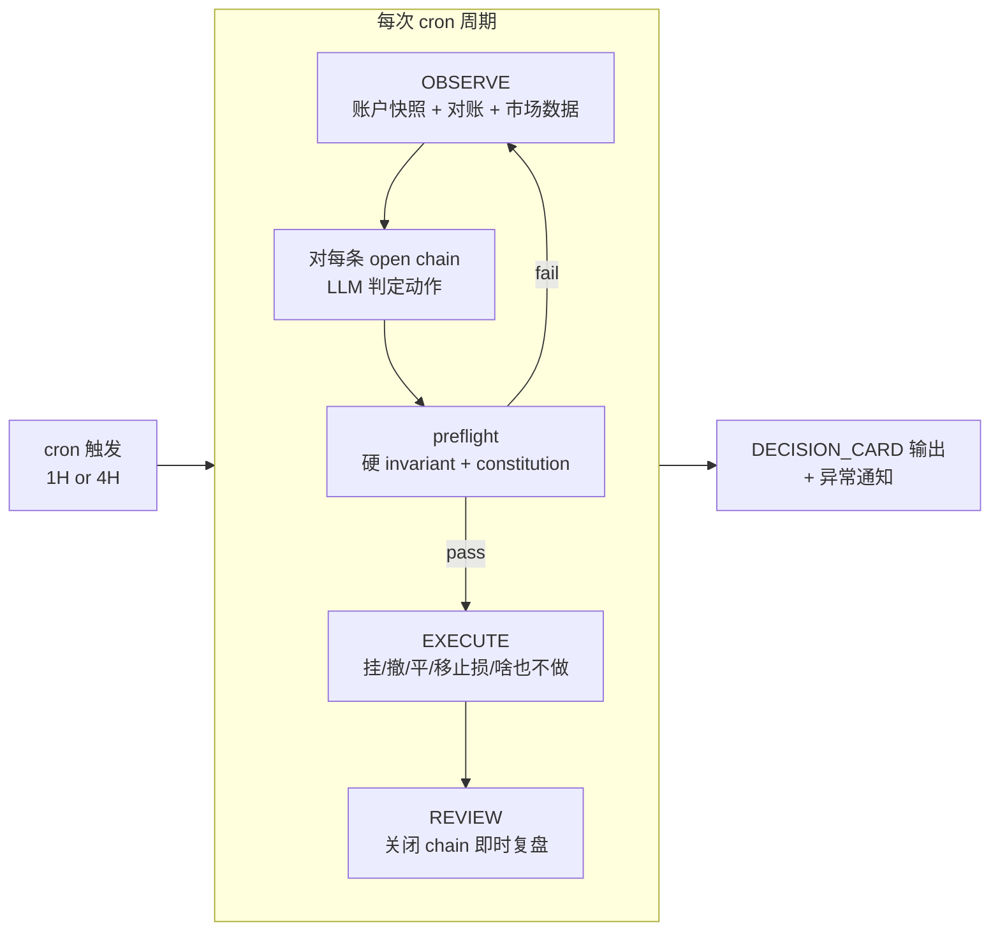
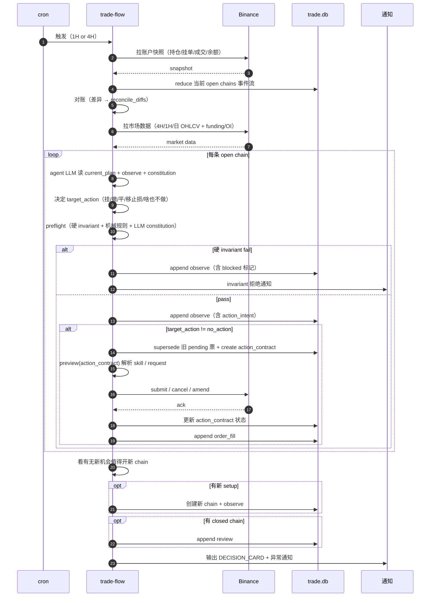

# Design Architecture

> **设计哲学**：这是一台 4H+ swing 自动化执行器，不是全能交易平台。最简结构守住"不爆仓"底线，其余交给 LLM 读自然语言判断。硬 schema 只承载"会让账户爆仓的"，软语言承载"需要让 agent 理解的"。

## 系统概览

### 产品形态

一组运行在 agent 工作区里的 skill，由外部 cron（Claude routines / Codex schedule）按固定频率触发。持久化层是 SQLite 单文件 `./data/trade.db`，不是 agent 工作区记忆。

### 项目层固定约束

**只做 Binance USDM 永续。只做 4H+ swing。不做 probe / 日内。**

这一行决定下面所有 schema、字段、状态的简化方向：

- 主周期 4H，辅助 1H + 日 K
- cron 触发频率：1H 心跳 + 4H 完整复盘
- plan 不带平台 / 品类字段：项目层即固定，执行层硬编码
- `side` 仅 `long | short`
- `binance-account-snapshot` 只读 USDM 永续合约账户
- 执行层只走 `futuresOrder` / `futuresCreateAlgoOrder`
- 不做 probe（小额快速试探）通道，不做日内策略

**演化承诺**：MVP 不为其他品类、不为日内场景预留字段。未来确需扩展时，在项目层重写本节约束，再回头改 schema。

### 主链路

```
cron 触发 → OBSERVE → 对每条 open chain 决策 → EXECUTE → REVIEW（如有 closed chain）
```

没有"在线主线 vs 离线演化"的复杂分割。每次 cron 跑一遍完整周期。BACKTEST / ITERATE / STRATEGY-POOL 推迟到积累 30+ closed chain 后再展开。



### Skill 分层

详细结构见 [skill-layout.md](skill-layout.md)。

| 层 | 形态 | 例子 | 职责 |
| --- | --- | --- | --- |
| **套件 skill** | `trade-flow`，cron 入口 | 仅一个：`trade-flow` | 主线流转、数据库读写、调用功能 skill |
| **功能 skill** | 平铺单一职责 | `binance-*` / `ohlcv-fetch` / `tech-indicators` / `plan-preflight` | 一件事做好（拉数据 / 下单 / 算指标 / 校验 plan） |

---

## Plan 设计

### 一条原则

**事件流 + 自然语言为主。** plan 真相是按时间追加的事件流，所有"当前状态"都是从事件流 reduce 出来的视图。硬字段只承载"会让账户爆仓的"，其余全软，agent 每次 cron 跑都重新读自然语言判断。

### 最小持久化模型

4 个对象：

- `plan_chain`：plan 骨架，回答"这条链是什么、是开是关"
- `plan_event`：事件流，承载 observe / order_fill / review 三种事件
- `action_contract`：可选的一次性动作票据，只在本轮已收敛到可执行动作时生成
- `plan_relation`：跨链对冲关系（hedge 等多链绑定）

字段、索引、读路径与 `trade.db` 落库约定见 [tech-spec.md](tech-spec.md)。

### Event kind（3 种）

| kind | body_json 承载 | 典型来源 |
| --- | --- | --- |
| `observe` | 完整快照：账户事实 + 市场语境 + 微结构 + 对账结果 + 当前 plan 意图 + preflight 结果 + 本轮决策摘要 | 每次 cron 跑写一条 |
| `order_fill` | 订单/成交事件：submit / cancel / amend / fill + execution_contract_snapshot + source_observe_event_key | EXECUTE stage 或对账器 |
| `review` | 终态复盘 | chain 关闭后 |

合并掉的（相对早期设计）：
- `intent` 合进 `observe`：每次 cron 都是完整快照，意图变化体现在最新 observe.body 里
- `note` 删除：cron 跑就是留痕，不需要单独事件
- `check` 合进 observe：preflight 结果作为 observe.body 的一部分
- `order` / `fill` 合并为 `order_fill`：减少事件种类

### Plan 状态（两态）

| state | 语义 |
| --- | --- |
| `open` | 还在管它（草拟 / 挂单中 / 持仓中 / 等止损均算） |
| `closed` | 终结（止盈 / 止损 / 放弃 / 过期） |

不再有 (phase, gate) 二维表。"挂单中 vs 持仓中"由 `current_orders + current_position` 视图自然体现，不需要预标记。

### PLAN 与 EXECUTE 的边界

- `plan` 是持续演化的判断，不是执行票据
- 只有 `target_action != no_action` 时，`PLAN` 才额外发一张 `action_contract`
- `action_contract` 只描述"这一轮立刻要做什么"，不追踪订单后续完整生命周期
- `EXECUTE` 只消费最新 `observe.body.action_intent.issued_action_id` 指向的票据，不再回头重读自然语言 `plan` 做交易判断
- `preview` 是唯一执行路由器：读 `action_contract.body_json`，产出这次该走哪个 execute skill、最终 request 长什么样
- `order_fill + reconcile` 继续承接订单/成交事实；`action_contract` 不变成第二套订单状态机

### Action contract（一次性动作票据）

最小语义：

- 一条 chain 同时最多只有一张 `pending / claimed` 票
- `PLAN` 是唯一发券人；`EXECUTE` 是唯一消费人
- 票据只负责"这轮动作有没有被消费"，不负责"这笔单后来是否完全成交"
- 旧票不复活：过期、失败、被替代后，都由下一轮 `PLAN` 发新票，不回收旧票

最小状态（3 态）：

- `pending` — 已创建未执行
- `done` — 已成功执行
- `failed` — 未成功（含被 supersede / 过期 / 执行错误，具体原因写 `body.failure_reason`）

PLAN 创建新票时若发现同链有 pending 旧票（多见于上一轮 cron 中途崩溃），先把旧票翻 `failed`（`failure_reason='superseded'`）再 create 新票。

不再单列 `claimed / superseded / expired`：
- `claimed` 在同 cron 进程内 `PLAN → EXECUTE` 是顺序调用，没有可观察价值，省掉
- `superseded / expired` 都收进 `failed` 的 reason，少一组状态机分支
- 真要异步执行（远程 worker / 跨进程）时再回头扩状态机

### Observe body 的"意图段" shape

每条 `observe` 的 body 里都包含 plan 当前意图。**渲染失败即字段缺失**——硬字段缺 preflight 直接拒。

```yaml
# 硬字段：必须（否则 preflight / DECISION_CARD 渲染失败）
symbol: BTCUSDT          # USDM 永续 symbol
side: long | short
stop_price: number       # 当前生效止损（mark basis 由执行层固定）
risk_budget_usdt: number # 全档成交假设下最大允许亏损（驱动两条硬 invariant）
strategy_ref: S-xxx      # FK 到 strategy 池

# 硬字段（可选；存在即按结构化对待，机械触发，不再让 LLM 跨周期重新解读）
stop_ladder:?
  # 止损推进梯度。命中后下次 EXECUTE 把 stop_price 改成 new_stop。
  # [{trigger_price: 61200, new_stop: 60800, reason: "break_even"},
  #  {trigger_price: 62000, new_stop: 61500, reason: "锁 1R"}]
  # 已触发档位由 reduce order_fill 历史推断（execution_contract_snapshot.triggered_ladder 引用 index）。
  # 单调约束：long 方向 trigger_price 递增 & new_stop 递增；short 反向。preflight 校验。
takeprofit_ladder:?
  # 分档止盈。命中后下次 EXECUTE 按 qty_ratio × current_position_qty 减仓。
  # [{price: 60800, qty_ratio: 0.3, reason: "前高阻力"},
  #  {price: 61500, qty_ratio: 0.4, reason: "1.5R"}]
  # qty_ratio 之和 ≤ 1.0，否则 preflight 拒。
risk_budget_change:?
  # 本轮 risk_budget_usdt 相对上一条 observe 的变化。首条可空；
  # 后续若 risk_budget_usdt 与上一条不同则必填，避免加仓/减仓痕迹只能从历史 reduce。
  delta_usdt: number       # 正=加仓增量；负=减仓回收；0=改其他字段未改 risk
  reason: text             # 例: "加仓：4H 收盘破 60800 后按计划 +0.5R"

# 软字段：自然语言为主；preflight 走 LLM 判 constitution
thesis: text             # 一段话：setup + edge + key risks + why now
entry_intent: text       # 何时/如何入场（含触发条件描述）
                         # 例: "4H 收盘破 60800 后挂 limit 60750 等回踩；放量则加仓节奏放快"
exit_intent: text        # 退出节奏与整体管理逻辑（"为什么这么管"）；
                         # 关键止损/止盈价位走 stop_ladder / takeprofit_ladder，不在这里再写一遍。
                         # 例: "上 60800 阻力前减半仓；持仓 ≥ 4H 把 funding 折进 break_even（具体档位见 stop_ladder）"
invalidation: text       # setup 失效条件（thesis 废，不是止血）
                         # 例: "4H 收盘破 60500，thesis 废，触发 replan 或 close"
expected_rr_net: number  # 扣费净 RR（funding + fee + slippage 折算后）；4H+ 持仓必填
valid_until_at: timestamp?  # 过期后 agent 不再沿原 entry_intent 执行
acknowledgements: [{clause_id, reason}]?   # constitution SHOULD 条款显式放行，必须带具体 reason
action_intent:
  target_action: no_action | place_entry | cancel_order | sync_protection | adjust_position
  issued_action_id: uuid?  # no_action 时必须为空；其余指向唯一有效 action_contract
```

**简化掉的字段**（相对早期设计）：

- `trigger` 6 种枚举 → 收进 `entry_intent` 自然语言；agent 每次 cron 跑读它判断
- `tranches` / 入场分档 → 收进 `entry_intent` 自然语言（入场节奏由 LLM 读语境判断）
- `phase` / `gate` → 二态 `state`（open / closed）
- `stop_anchor` 单独字段 → 并进 `thesis`（结构位锚点是 thesis 的一部分）
- `invalidation` 从 {price, condition} 对象 → 单一 text 字段（含价格与条件描述）

**回到结构化的字段**（相对"全软语言"想法的回退）：

`stop_ladder` / `takeprofit_ladder` 是从纯自然语言 `exit_intent` 拆出来的硬字段。原因：止损被错误移动、应触发的止盈档位被跳过——同样属于"会让账户爆仓的"，按设计哲学就该走硬 schema。LLM 只负责"档位 reason 是否仍成立"的语义判断，价位与触发是机械的，不让跨 cron 周期的解读漂移影响关键仓位管理。

补充约束：

- 长期 `plan` 的 setup / 管理哲学仍以自然语言承载（thesis / entry_intent / exit_intent）
- 关键执行价位（止损推进、分档止盈）以 ladder 数组结构化承载，机械触发
- 本轮若已收敛到可执行动作，结构化参数写进独立 `action_contract.body_json`
- `action_contract` 的真实请求形状不在这里固定；由 `preview` 按当前 execute skill 能力解析

### Observe body 的"证据段" shape

每条 observe 同时承载本轮 agent 判断需要的最小完整快照：

```yaml
account:
  equity_usdt: number              # 来自最近账户快照；硬 invariant 的分母
  positions: [...]                 # 当前 USDM 永续持仓
  open_orders: [...]               # 当前挂单
  funding_paid_since_entry_usdt: number?   # POSITION 维度累计 funding cost
microstructure_ref:                # 市场快照引用，本身不内嵌；详见 § Market snapshot 共享层
  symbol: BTCUSDT
  snapshot_id: uuid                # FK 到 market_snapshot 表
  captured_at: timestamp
microstructure_notes: text?        # 可选：agent 本轮对市场的一句话提炼（"4H 上破前高，funding 偏多"）
catalyst: text                     # 持仓窗口内 high-impact 事件描述（none in window 也写）
exposure: text                     # 同簇敞口判断（btc-beta / eth-eco / ...）
reconcile_diffs: [...]             # 对账差异，正常时为空
preflight_result:                  # 本轮 preflight 输出
  verdict: armable | blocked | abstain
  must_fail: []
  should_warn: []
  context_notes: []
  ack_applied: [{clause_id, reason}]
decision_summary: text             # 本轮 cron 做了什么（"挂单 X / 撤单 Y / 移止损 / 啥也不做"）
```

**最小完整快照原则**：每条 observe 都是本轮可直接消费的完整快照，不是 patch。若只是局部刷新一个槽位（如只刷 funding），上游先合并上一版完整 observe，再 append 新条目。

### Market snapshot 共享层

market data 是 chain 间共享的客观事实——BTCUSDT 4H K 线对所有 BTC chain 是同一份。每条 observe 都内嵌 microstructure 会重复存储；未来同 symbol 上多 chain 并行时尤其浪费。

独立 `market_snapshot` 表按 `(symbol, captured_at)` 唯一键存放采集快照，observe.body 通过 `microstructure_ref.snapshot_id` 引用：

- 字段：`symbol / captured_at / body_json`（body 内含多周期 OHLCV + funding rate + OI + 关键墙位 + 最近爆仓）
- 写入：每次 cron OBSERVE 阶段对每个本轮出现的 symbol 调一次采集 skill；同 cron 同 symbol 复用同一行（去重靠 UNIQUE）
- 读取：投影 `latest_observe.microstructure` 自动 join `market_snapshot`，agent 看到的形状与早期"内嵌 microstructure"一致

agent 若需要本轮自己对市场的一句话提炼（"4H 上破前高，funding 偏多"），写进 `microstructure_notes` 自然语言字段，与原始 snapshot 解耦——客观事实归 market_snapshot，主观提炼归 observe。

落库 schema 见 [tech-spec.md §12.2](tech-spec.md)。

### 投影视图

| 视图 | 实现 |
| --- | --- |
| `current_plan` | 取最近一条 `observe.body` 的意图段字段 |
| `current_action_intent` | 取最近一条 `observe.body.action_intent` |
| `current_action_contract` | 用 `current_action_intent.issued_action_id` 读 `action_contract` |
| `latest_observe` | 取最近一条 `observe`（含证据段） |
| `current_orders` | reduce `order_fill` 事件到 open-orders 集合 |
| `current_position` | reduce `order_fill` 事件到净头寸 |
| `last_preflight` | 取最近一条 `observe.body.preflight_result` |

视图都是**读时计算**。下次 cron 跑时直接读最新 observe，没有"标记 stale"机制。

### 守底线：两条硬 invariant

真正会让账户爆仓的只有两件事：**单笔/累计 open risk 超预算**、**单日累计亏损穿底**。两条写死在代码里，任何 plan 想执行新挂单/加仓必须同时通过：

```
INVARIANT.open_risk_after_fill (hedge-aware):
  net_open_risk(active_plans ∪ {candidate})
    + current_account_open_risk_usdt
  ≤ equity_live × account.max_open_risk_pct

  其中 net_open_risk(plans) =
    按 plan_relation.kind='hedge' 把父子链配对，
    pair 的净 risk = max(0, |father.risk_budget - child.risk_budget|)；
    剩余非对冲 plan 按 risk_budget_usdt 直接求和。

  cluster 同向加成不进硬 invariant——硬 invariant 只守"全部非对冲 risk 总和 < 上限"
  这条死线，简单可单测。簇内过度集中（如 BTC 多 + ETH 多 + SOL 多 同向叠仓）
  由 constitution 的 C-RISK-CORRELATED-EXPOSURE 类条款（自然语言，LLM 判）拦截。
  分工有意：硬 invariant 防爆仓，constitution 防"亏多但不爆仓"。
```

```
INVARIANT.daily_loss_floor:
  realized_pnl_today_usdt
    + sum(unrealized_loss_at_stop for active plans)
    - candidate.risk_budget_usdt
  ≥ -(equity_live × account.max_day_loss_pct)
```

第一条防"成交后爆仓"，对冲腿不重复计费；第二条防"今日已经亏到该收手了还在加单"。

`equity_live = latest_observe.account.equity_usdt`，来自最近账户快照，不来自配置文件。

其余"会亏钱但不会爆仓"的规则全部写进 **constitution**（自然语言），preflight 由 LLM 读 plan + constitution 判 pass / warn / fail。两条 invariant 是**最后的安全网**——LLM 判错了也不会真爆仓。

### Constitution：自然语言的规则总集

位置：[.agents/skills/plan-preflight/constitution.md](../.agents/skills/plan-preflight/constitution.md)

结构：一份 markdown，分 "MUST / SHOULD / CONTEXT" 三段。

- **MUST**：违反直接拒（如"永续 stop 必须 mark price"、"OTOCO 必须标 mother-only"、"observe 时间戳 > 30s 不许下单"）
- **SHOULD**：默认拒，但 plan 带 `acknowledgements[]` 条目并写清 reason 就放行（如"永续 4H+ 必须把 funding 算进 expected RR"）
- **CONTEXT**：不拦，但 preflight 把这类条款也展示在 DECISION_CARD 的 `Checks` 行

**新增规则 = 往 constitution.md 里加一句话**。不改 schema、不加表达式、不改 preflight 代码。

**机械规则不进 LLM**（preflight 代码硬执行，稳定 / 可单测 / 不烧 token）：

- `C-OBS-SNAPSHOT-FRESH`：observe 时间戳距今 > 30s 拒
- `C-EXEC-STOP-MARK`：永续 plan 的 stop order 必须 `priceProtect=true` 且 basis=mark
- `C-EXEC-OTOCO-MOTHER`：OTOCO 母单 `clientOrderId` 必须带 `mother-only` 前缀
- `C-PLAN-INTENT-COMPLETE`：thesis / entry_intent / exit_intent / invalidation 必须都非空
- `C-PLAN-VALID-WINDOW-NOT-EXPIRED`：`valid_until_at` 存在且已过期直接拒
- `C-PLAN-LADDER-MONOTONIC`：`stop_ladder` 单调（long: trigger_price & new_stop 递增；short 反向）；`takeprofit_ladder.qty_ratio` 之和 ≤ 1.0；命中即拒
- `C-EXEC-LADDER-TRIGGER`：本轮最新 mark price 触及任一未触发的 `stop_ladder.trigger_price` 或 `takeprofit_ladder.price` 时，`action_intent.target_action` 不许为 `no_action`——必须发对应 `sync_protection` 或 `adjust_position` 票据。已触发档位由 reduce order_fill 历史推断，不重复触发
- `C-PLAN-RISK-CHANGE-EXPLAINED`：`risk_budget_usdt` 与上一条 observe 不同时，`risk_budget_change.reason` 必填且非空

constitution.md 仍保留这些条款的人类描述（让人类读得到规则全集），实际判定走代码路径。

### Acknowledgement 纪律

- 每次 ack 必须带**具体**理由，不是"ack"二字
- 同一条款在同一 chain 内以**不同 reason** 累计 ack 超过 3 次，preflight 升级为 reject（说明这个 setup 本身就是边缘）
- 同 reason 在多次 cron 周期保持一致**不重复计数**——视为已被追认
- REVIEW 阶段按条款聚合 ack 后的胜率；某条款被 ack 样本胜率长期低于整体，说明该条款应从 SHOULD 升格为 MUST

### Strategy shape（不变）

```yaml
strategy_id: S-xxx
name: string
status: active | draft | retired
policy: markdown          # setup / 失效 / EV 哲学 / regime / catalyst / 持仓纪律 / size policy
tags: [string]
```

MVP 保留 2 条种子（删除 S-PROBE-GENERIC 与 S-HEDGE-GENERIC；hedge 有需要时再加）。

### Strategy 池种子（MVP）

#### `S-GENERIC-TREND`

```yaml
strategy_id: S-GENERIC-TREND
name: "通用趋势跟随"
status: active
tags: ['directional', 'technical']
policy: |
  没明确归入具体 setup 的趋势跟随 plan 默认 fallback。
  setup：顺主周期（4H/1D）方向，回调到结构位/均线/ATR 锚点入场。
  失效：突破 stop 锚点或 thesis 里写明的结构失效位。
  EV：要求 expected_value > 0；允许小幅为负只在明确 ack 时。
  regime：主周期 regime 漂移必须 replan；次周期漂移允许继续持有直到 stop 或 target。
  catalyst：持仓窗口内有 high-impact 事件必须在 thesis 或 exit_intent 里明示处置。
  持仓：不设硬时限；entry_intent / exit_intent 里写节奏（如"每 4H 复看"）。
  size：默认常规 risk_budget_usdt（≈ live equity × 0.5% ~ 1%）。
```

#### `S-GENERIC-MEANREVERT`

```yaml
strategy_id: S-GENERIC-MEANREVERT
name: "通用均值回归"
status: active
tags: ['mean-revert', 'technical']
policy: |
  震荡区间反手入场默认 fallback。
  setup：主周期横盘（ADX 低 / 布林缩口），次周期触边反弹。
  失效：区间边界被真突破。
  EV：min_net_rr >= 1.2；允许胜率 > 60% 但 RR 较低的 setup。
  regime：次周期漂移不必 replan——本策略抗波动；主周期从 range 进 trend 必须平仓重评。
  catalyst：持仓窗口 high-impact 事件默认提前平。
  持仓：默认短（< 4H 的不做；本策略最短 4H 起）；超时主动平不升档。
  size：默认常规；不使用加仓。
```

### DECISION_CARD（6 行扫读视图）

每次 cron 跑完输出，给人扫一眼。从 `current_plan + latest_observe + strategy` 实时渲染，不存库。

```
── DECISION CARD ─────────────────────────────────────────
  Plan      <chain_id:8>  <symbol>  (<state>)  <strategy_ref>
  Thesis    <thesis 压成 1-2 句>
  Risk      <side>  loss_budget $<risk_budget> (≈<%>%)  net_rr <expected_rr_net or "—">
            stop <stop_price>  invalidation <invalidation 摘要>
            stop_ladder <60800→61500→62000（now: 60800）>   # 仅当 stop_ladder 非空
  Plan      entry: <entry_intent 摘要>
            exit:  <exit_intent 摘要>
            tp_ladder <60800@30% ✓ / 61500@40% / 62500@30%>  # 仅当 takeprofit_ladder 非空
  Status    持仓 <qty>@<avg_price>  unrealized $<pnl> (<rr>R)  funding -$<so_far>
            挂单 <count> 单  下次 cron <eta>  snapshot age <s>s
  Checks    MUST ✔/✗ <clause …>   SHOULD ⚠ack <clause + reason>
──────────────────────────────────────────────────────────
```

渲染约定：

- `valid_until_at < now`：Plan 行标红，constitution 的 stale 条款触发拒
- snapshot age > 20s 黄，> 30s 红（红色 + MUST 条款 "snapshot stale 拒写" 触发拒）
- Checks 行 ✗ 非空 → 卡片拒绝渲染为"可执行"，本轮跳过 EXECUTE
- 若是 hedge 腿：Plan 行追加 `hedges → <parent_chain_ids 缩写>`

**渲染 = 校验**：硬字段缺失导致卡渲染不出来，plan 就不算完整，preflight 直接拒。不再另写"字段齐全性"规则。

### ACCOUNT_CONFIG（唯一硬配置文件）

固定最小 contract：`./data/account_config.json`

| 字段 | 必填 | 说明 |
| --- | --- | --- |
| `max_open_risk_pct` | 是 | 成交后账户总 open risk 上限（硬 invariant 的分母） |
| `max_day_loss_pct` | 是 | 单日最大允许亏损百分比 |
| `max_correlated_exposure_usdt` | 否 | 同簇净方向敞口上限；constitution 引用 |
| `max_correlated_gross_exposure_usdt` | 否 | 同簇总敞口上限；constitution 引用 |
| `max_consecutive_losses` | 否 | 连续亏损上限；触发后通知冷却 |

缺文件、缺必填字段、字段为 null、`latest_observe.account.equity_usdt` 缺失 → preflight 直接拒所有新动作（两条硬 invariant 失去基准）。

删除：`probe_budget_ratio`（不做 probe）。

### Cron 周期：每次跑做什么



### 失败兜底（自动化模式必备）

**幂等**：每个 EXECUTE 动作前先检查交易所当前状态，重复请求不下重单。`action_id` 是本轮动作的幂等锚点；`clientOrderId / clientAlgoId` 由它派生，Binance 侧自动去重。

**中途挂掉**：cron agent 任意阶段失败 → abort 当前周期 → 只 append 已写入的 observe，不补做后续。下次 cron 重跑会读最新事件流状态决定动作。**默认偏保守**：不确定就啥也不做。

**异常通知**：以下场景主动推送（Telegram / 邮件 / Push 任选）：

- 硬 invariant 拒绝任何新动作
- 对账连续 3 轮 stuck（同一 chain）
- 单日亏损 ≥ 80% × `max_day_loss_pct`
- cron 失败 / Binance API 错误连续 3 次
- 连续亏损达到 `max_consecutive_losses`
- chain 关闭（不论 outcome）

通知通道由用户在 `./data/notify_config.json` 配置；缺文件时只写本地日志。

### Cron 运维元数据

每次 cron 跑写一条 `run_log`（独立小表，与 plan_event 分离）：

```yaml
run_id: uuid
triggered_at: timestamp
duration_ms: number
chains_processed: number
actions_taken: ['placed_order_X', 'cancelled_Y', 'no_action_Z', ...]
errors: [{stage, error}]
next_cron_at: timestamp
```

### 对账（reconciliation）

事件流的权威性取决于 `order_fill` 是否被完整记录——交易所推送会丢、cron 重跑可能错位、用户在交易所 UI 手工干预不会自动 append。设计要求：**币安账户接口是 ground truth，plan_event 是 staging**。

每次 cron 周期开始时跑对账器：

1. 调 `binance-account-snapshot` 拉当前持仓 + 挂单
2. reduce 当前 open chains 的 `order_fill` 事件得 `current_orders` / `current_position`
3. 对比差异：
   - 交易所有但事件流没有 → append 一条 `order_fill`，body 标 `source='reconcile'`
   - 事件流有但交易所没有（已被手工撤）→ append `order_fill` body `kind='cancel-detected'`，标 `source='reconcile'`
   - 数量不一致 → 在本轮 observe.body.reconcile_diffs 写差异，再补 `order_fill` 对齐
4. 对账完才往下走 OBSERVE 的市场数据采集

对账差异连续 3 轮出现同一 chain → 推送通知 + preflight 拒绝该 chain 任何新动作，强制人工介入。

对账器靠"持仓/挂单数量字段"对齐，不靠时间戳精确同步。

### 跨链 exposure

聚合视图：直接读 `plan_event WHERE kind='observe' AND chain_id IN (active chains)`，按最新 observe.body 的意图段 reduce 出 side + risk_budget + cluster，再 sum。

对冲锁仓：hedge 腿 chain 的 `current_plan.strategy_ref = S-HEDGE-GENERIC`（如启用）+ `plan_relation` 指向父 chain，聚合视图按此识别真正的净方向敞口。

### REVIEW（终态复盘）

REVIEW 输入是一条闭合 chain 的完整 `plan_event` 序列。chain 关闭后立即写入 `review` 事件，body 推荐 shape：

| 字段 | 必填 | 说明 |
| --- | --- | --- |
| `outcome` | 是 | `win / loss / breakeven / abandoned` |
| `pnl_pct` | 是 | 实际盈亏百分比（相对账户权益或成本） |
| `thesis_held` | 是 | boolean；thesis 里写的入场判断是否维持成立 |
| `key_lesson` | 是 | 一句话 |
| `promote_to_strategy` | 是 | boolean；是否值得抽成新 strategy |
| `notes` | 否 | 自由 markdown：cost vs expected / signal accuracy / 其他 |

字段从 12 个简化到 5 个必填——你单量不大，应付式复盘不如少而精。需要更细维度（cost_vs_expected / signal_accuracy）时写进 `notes` 自由区，累积 20+ 样本后按查询频率决定是否升格独立字段。

### 场景覆盖：常见需求如何在简化结构里落地

| 场景 | 落地方式 |
| --- | --- |
| 等待入场触发 | `entry_intent` 自然语言描述触发；cron 每次跑都读它判"现在该不该挂/打" |
| setup 过期 | `valid_until_at` 到时后下次 cron 自动 append observe 标 stale；agent 决定 close / replan |
| setup 失效（thesis 废） | `invalidation` 自然语言；下次 cron observe 中 LLM 判已触发后写 close |
| 分批建仓 | `entry_intent` 里写"分 N 档、首档比例 X%、加仓条件 Y"；实际 fill 由 `order_fill` 序列承载 |
| 加仓 / 减仓 | append 新 `observe`：意图段 `risk_budget_usdt` 重写 + `risk_budget_change.{delta_usdt, reason}` 显式承载本轮变化（preflight 强制要求 reason）；新 `order_fill` 承接成交 |
| 分档止盈 | `takeprofit_ladder` 数组 `[{price, qty_ratio, reason}]`；mark 触及自动触发减仓；自然语言只承载档位 reason |
| trailing stop / break-even | `stop_ladder` 数组 `[{trigger_price, new_stop, reason}]`；mark 触及机械推进 `stop_price`；exit_intent 仅承载"为什么这么管" |
| 永续 funding 在 break_even | `stop_ladder` 加一档：`trigger_price=entry+ATR` / `new_stop=entry+累计_funding` / `reason="funding 折进 break_even"` |
| partial-fill | `current_orders` 视图 reduce `order_fill` 自然体现 |
| 心跳监控 | 每次 cron 跑都 append observe，本身就是心跳记录 |
| 放弃 | append 一条 observe（标 abandoned）+ 关 chain（state=closed）+ append review |
| 对账差异 | observe.body.reconcile_diffs；连续 3 轮 stuck 推送通知 + 拒新动作 |
| 新规则上线 | constitution.md 加一行；不需要 schema migration、不需要改代码 |

### 待收紧的开放 object

- **持仓时限的硬上限**：当前由 `valid_until_at` 软约束 + strategy.policy 描述；累积 20+ closed chain 后看是否需要升格 `max_holding_minutes` 硬字段
- **correlation_cluster 的动态化**：`observe.body.exposure` 当前自然语言。演化路径：(a) 短期维护 `symbol -> cluster` 常量表；(b) 中期落地"近 30/90 天滚动相关系数 ≥ 0.6 归簇"
- **strategy.policy 的结构化反压**：MVP 是 markdown。某维度在多条 strategy 里相似格式出现 ≥ 3 次，抽成独立字段
- **REVIEW notes 字段的结构化反压**：累积 20+ 样本按查询频率决定是否拆列

---

## Market Data

详细设计见 [market-data-design.md](market-data-design.md)。三层（接入 / 快照-特征 / 分析）不变。

| Skill | 回答什么 |
| --- | --- |
| `ohlcv-fetch` | 把这个标的的多周期 K 线拉下来 |
| `binance-symbol-snapshot` | 这个标的现在大概什么状态 |
| `binance-market-scan` | 全市场先看谁（候选粗筛） |
| `tech-indicators` | 结构和指标怎么看 |
| `binance-account-snapshot` | 账户持仓 / 挂单 / 余额快照（只读） |

### OHLCV 存储演进

- 当前：`CSV + manifest.json`，增量追加
- 进入 replay/backtest 后：切 SQLite `./data/ohlcv.db`（与 trade.db 分离）
- 不提前做

---

## 离线演化（推迟）

REVIEW 是 MVP 终点。BACKTEST / ITERATE / STRATEGY-POOL 链路推迟到累积 30+ closed chain 后再展开。在此之前：

- REVIEW 写完后人工扫，看是否有共性可抽成新 strategy
- 累积足够样本前不建 backtest skill、不建 strategy_pool 表升格、不做 namespace 拆分
- 这段省下的复杂度直接换到"自动化执行的运维稳定性"上

---

## 执行层

详细规范见 [tech-spec.md](tech-spec.md)。

### Binance USDM 核心约束

- 每次 cron 跑都先 append observe 再执行，从来不"先执行后记账"
- 主单路径：`futuresOrder`；algo 单路径：`futuresCreateAlgoOrder`
- 执行前必须预检：positionSide / 精度步进 / minQty / minNotional / 当前挂单 / 可用余额
- `clientOrderId` 统一前缀 `<chain_id>-<seq>-<action>`，Binance 侧自动去重，cron 重跑幂等
- `OTO/OTOCO` 母单可能读不到附带 TP/SL 细节 → 显式标记"需人工确认"

### 读写分离

`binance-account-snapshot` 只读。进入执行模式必须显式区分工具是否能下单。

---

## 当前不提前固定的内容

- 全市场扫描的统一总分公式和候选池大小
- `binance-microstructure-snap` skill（待建）聚合 snapshot / liquidation / aggtrades / orderbook 的统一 microstructure JSON，写入 observe.body.microstructure
- OHLCV 进入 backtest 后的 SQLite schema
- macro 观测字段扩展（DXY / BTC.D / ETH.BTC / 稳定币净流）：累积 20+ closed chain 后再落地
- catalyst 数据源从手工 `./data/catalysts.json` 迁到外部 API：积累 10+ catalyst-relevant chain 后评估
- VCP 指标的最终评分公式
- BACKTEST / ITERATE / STRATEGY-POOL 整条离线链路
- constitution 条款的分类字段：条款数 ≥ 30 条再考虑
- hedge 腿支持（S-HEDGE-GENERIC 与 plan_relation 实际启用）：等真有对冲需求再加
- notify_config.json 的具体 schema：先用最简 webhook URL 起步
