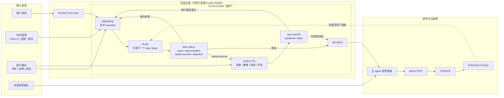

# Design Architecture

## 系统概览

### 产品形态

一组运行在 agent 工作区里的 skill，通过 Claude Code / Codex / Gemini CLI 调用。不做独立 app。持久化层是数据库，不是 agent 工作区记忆。

### 主链路

```
在线主线：OBSERVE <-> PLAN -> EXECUTE -> REVIEW
离线演化：REVIEW -> BACKTEST -> ITERATE -> STRATEGY-POOL
```

核心流转图（含并行 PLAN-CHAIN 和研究侧）：



### 核心长期容器

| 容器 | 内含 | 说明 |
| --- | --- | --- |
| `PLAN-POOL` | PLAN-CHAIN[] | 每条 chain 是一个交易机会的决策历史（plan + plan_history） |
| `STRATEGY-POOL` | strategy[] | 策略资产，离线演化结果；MVP 扁平结构，远期 namespace + 微策略两层（详见离线演化侧） |

PLAN-CHAIN 不是独立实体。每个 `plan` 记录代表一个机会的完整生命周期，其决策演化历史存于 `plan_history`，关联的监控记录存于 `plan_check` 和 `rule_evaluation`。跨机会的并行关联（如对冲链）通过 `parent_plan_keys` 引用。

**跨链 exposure 视图**：PLAN-POOL 层需聚合所有 `status` 为活跃态（`wait-condition / ready-execute / wait-until-fill / in-position`）的链，计算整体方向性暴露。对冲锁仓场景中，对冲链通过 `parent_plan_keys` 引用被对冲链，PLAN-POOL 视图可据此做净值计算，识别真正的净方向敞口。单个 plan 不感知其他链，跨链聚合由调用层（OBSERVE 或 REVIEW）负责。

### Skill 分层

详细结构见 [skill-layout.md](skill-layout.md)。

整个 trade 系统按两层 skill 切分，互不替代：

| 层 | 形态 | 例子 | 职责 |
| --- | --- | --- | --- |
| **套件 skill**（agent 编排层） | `trade-flow` 一个套件，内部 `stages/observe/plan/execute/review/backtest/iterate` | 仅一个：`trade-flow` | 主线流转、router、数据库读写、调用功能 skill |
| **功能 skill**（原子动作层） | 平铺单一职责 skill | `binance-*` / `ohlcv-fetch` / `tech-indicators` / `binance-market-scan` | 一件事做好（拉数据 / 下单 / 算指标），可被套件内任意 stage 调用 |

套件内 `SKILL.md` 是轻量入口（router + 各 stage 简介），各 `stages/X/STAGE.md` 按需读取，避免一次性吞 token。

文件数据库 `./data/trade.db`（SQLite），承接本节"数据库存储"定义的 schema。

---

## Plan 设计

### 核心约束

- `plan` 是可变记录，`plan_key` 为 uuid，贯穿整个机会生命周期不变
- **决策性变化**（thesis / entry / stop / targets / status / scope 变化）：更新 plan 当前状态，同时写一条 `plan_history` 快照，附 `change_summary`
- **监控性变化**（心跳检查 / 成交回填 / management_rule 触发）：直接更新 plan 对应字段或写伴随表，不写 `plan_history`
- `plan_history` 是可追溯的决策日志；`plan` 本身始终是最新状态，agent 直接读写
- plan 写入数据库前必须通过 [Plan 写入校验](#plan-写入校验) 列出的 hardcode 规则；违反则 plan 不能保存

### 七块顶层结构

| 块 | 包含 | 变化频率 | 主要读者 |
| --- | --- | --- | --- |
| **SYSTEM** | identity / lineage | 每版都写 | agent 追链时读 |
| **WHY** | thesis / edge_type / regime / setup_ref / confluence / conviction | 中 | 人 + agent |
| **WHAT** | scope / side / entry / stop / targets / invalidation / atr_ref / indicator_trust / timing_validity / risk_budget / management_rules | 中 | 人 + agent |
| **EXPOSURE** | leg_role / net_after_fill / second_order_risk / existing_legs | 高（账户事实变化即更新） | agent + 人 |
| **POSITION_ROLE** | role / time_horizon / size_intent | 极低 | 人 + agent |
| **EXECUTION_LANE** | order_type / visibility / tif / client_order_prefix / execution_result | 低 | agent |
| **NOW** | status / state_reason / next_check / outcome | 高 | agent |

SYSTEM 层由系统自动生成，正常阅读跳过，只有追溯链路或校验时才看。

### 字段字典

#### SYSTEM

| 字段 | 必填 | 类型 | 说明 |
| --- | --- | --- | --- |
| `plan_key` | 是 | string | uuid，机会生命周期内不变 |
| `version` | 是 | integer | 决策性变化时递增；初始为 1 |
| `created_at` | 是 | RFC 3339 | 首次创建时间 |
| `updated_at` | 是 | RFC 3339 | 最近一次决策性更新时间 |
| `parent_plan_keys` | 否 | string[] | 跨机会关联（如对冲场景）；单链写 `[]` |

#### WHY（为什么这是个机会）

| 字段 | 必填 | 类型 | 说明 |
| --- | --- | --- | --- |
| `thesis` | 是 | string | 一句话核心判断；能压成一句说明思路清晰，压不下去说明自己没想清楚 |
| `edge_type` | 是 | enum | `technical / sentiment-contrarian / order-flow / other`；归因钩子，REVIEW 时按 edge_type 聚合胜率 |
| `regime` | 是 | enum | `trending-up / trending-down / ranging / breakout / breakdown / choppy / accumulation / distribution`；当前市场结构形态判断；与 edge_type 共同决定打法 |
| `setup_ref` | 否 | object or null | `{ strategy_key: string, version: integer }`；引用 STRATEGY-POOL 中具体微策略；填了自动继承该策略的 setup_description / key_signals，confluence 不再重复 |
| `confluence` | 否 | string[] | 独立确认维度，最多 5 条；与 `setup_ref` 二选一或互补 |
| `conviction` | 是 | integer | 0-10 综合分，agent 直接给出（替代旧 score 6 子项） |
| `counter_thesis` | 是 | string | 一句话"逻辑层认错触发器"，区别于 `invalidation` 的价格触发；回答"什么发生会让我承认这个思路整个错了"，如"BTC 周线跌破 EMA50 即认定主升浪结束" |

#### WHAT（具体怎么做）

| 字段 | 必填 | 类型 | 说明 |
| --- | --- | --- | --- |
| `scope` | 是 | object | `{ venue, market_type, symbols, mode, timeframe_scope }`；`market_type` = `spot / usdm / coinm / mixed`；`mode` = `flat / pending-entry / in-position / hedged / monitor-only`；`timeframe_scope` 大→小排列如 `["4h","1h","15m"]` |
| `side` | 是 | enum | `buy / sell / long / short / reduce-long / reduce-short / flat` |
| `entry` | 是 | object | `{ price: number \| zone: {low, high}, type: market/limit/stop, qty: {type, value, leverage?} }`；qty.type = `qty / usdt / risk_pct / acct_pct`；USDM 必填 leverage，spot 写 null |
| `stop` | 是 | object | `{ price: number, basis: "mark" \| "last" }`；永续合约必须 `mark`（见 R-001） |
| `targets` | 是 | object[] | 每条 `{ price, qty_pct, trigger?: string }`；`qty_pct` 累计可 ≤ 1（剩余跟趋势） |
| `invalidation` | 是 | object | `{ hard: string, soft?: string, expires_at?: RFC3339, expires_after?: ISO duration }`；hard 触发即 replan，soft 下次 check 重评；超时视为 hard 触发 |
| `atr_ref` | 是 | object | `{ atr: number, timeframe: string, percentile?: number }`；强制锚定，禁止裸价差止损（见 R-003） |
| `indicator_trust` | 是 | enum | `full / degraded / k-line-only`；高波动妖币上自动 degraded，提示"本轮基于裸 K" |
| `timing_validity` | 是 | string | ISO duration，如 `PT15M`（高波动）/ `PT4H`（主流币）；入场窗口过期视为 hard 失效 |
| `max_holding_duration` | 条件必填 | string or null | ISO duration，如 `P1D` / `P3D` / `P2W`；`scope.mode ∈ {pending-entry, in-position}` 必填；到期未出场触发强制平仓 replan，防止短线拖成套牢（见 R-010） |
| `expected_rr` | 是 | object | `{ ratio: number, net_ratio: number, fee_pct: number, slippage_pct: number, funding_pct_per_day?: number }`；`net_ratio` 必须扣除预期 fee / slippage / funding；永续合约必填 `funding_pct_per_day`（见 R-008） |
| `risk_budget` | 是 | object | `{ max_loss_usdt?: number, max_loss_pct?: number, max_position_usdt?: number }`；三者填一即可 |
| `key_risks` | 是 | string[] | 当前主要风险；funding 极端必须列出（见 R-006） |
| `management_rules` | 否 | object[] | 仓位存活期的条件性动作，结构见下 |

`management_rules[]` 每条：

| 字段 | 必填 | 说明 |
| --- | --- | --- |
| `rule_key` | 是 | plan 内唯一 |
| `rule_type` | 是 | `move-stop / partial-exit / breakeven / trail-activate` |
| `trigger_condition` | 是 | 自然语言触发条件 |
| `trigger_price` | 否 | 有价格锚点时填，纯条件触发写 null |
| `action_description` | 是 | 触发后做什么 |
| `status` | 是 | `pending / triggered / skipped` |
| `triggered_at` | 否 | 触发时间（RFC 3339） |
| `priority` | 是 | integer，同一 plan 内 rule 激活优先级；数字越小越先，同值按 `rule_key` 字典序 |
| `depends_on` | 否 | string[]，前置 `rule_key` 列表；只有所有前置 status=triggered 才激活本 rule（如 trail-activate 必须依赖 breakeven 先触发） |

`management_rules` 按 `priority` + `depends_on` 有序激活。`status` 和 `triggered_at` 是监控性字段，OBSERVE 直接更新，不写 plan_history。每次 OBSERVE 检查 rule 时写一条 `rule_evaluation` 记录，保留完整评估历史。`targets[]` 描述静态出场目标，`management_rules` 描述动态调整逻辑，两者职责不交叉。

#### EXPOSURE（在组合里什么角色）

chat-history 反复证明这是单笔 plan 最易漏的维度。锁仓多腿场景下，单看自己腿做决策必踩坑。

| 字段 | 必填 | 类型 | 说明 |
| --- | --- | --- | --- |
| `leg_role` | 是 | enum | `main / hedge / reduce-loss / disaster-cover / probe`；本笔在多腿组合里扮演什么 |
| `net_after_fill` | 是 | object | `{ symbol_net: { [symbol]: number }, account_net_usdt: number }`；本笔成交后账户净敞口（见 R-002） |
| `second_order_risk` | 否 | string or null | 对冲/锁仓场景：如果某条腿先成交，净敞口会怎么变 |
| `existing_legs` | 是 | object[] | 当前同标的其他活跃腿：`[{plan_key, side, qty, role}]`；空仓写 `[]` |

#### POSITION_ROLE（这笔在打法里什么定位）

| 字段 | 必填 | 类型 | 说明 |
| --- | --- | --- | --- |
| `role` | 是 | enum | `offensive / defensive / hedge / probe`；进攻仓 / 防守仓 / 对冲 / 试探仓 |
| `time_horizon` | 是 | enum | `intraday / swing / position`；预期持仓时间 |
| `size_intent` | 是 | enum | `full / half / probe`；信念浓度，REVIEW 时归因不会被 size 模糊化（probe 仓亏不算真错） |

#### EXECUTION_LANE（执行通道）

chat-history 大量摔在执行路径不一致上（普通 LIMIT vs STOP_MARKET vs Algo Order vs OTOCO）。

| 字段 | 必填 | 类型 | 说明 |
| --- | --- | --- | --- |
| `order_type` | 是 | enum | `limit / market / stop_market / stop_limit / algo / oto / otoco` |
| `visibility` | 是 | enum | `full / mother-only / manual-confirm`；OTOCO 子单不可见时必须 `mother-only`（见 R-007） |
| `tif` | 否 | enum or null | `GTC / IOC / FOK / GTX`；null 默认 GTC；`GTX` = post-only；`FOK` 不适用于 USDM |
| `client_order_prefix` | 否 | string | 统一前缀，便于验单 / 局部撤单 / 计划续管 |
| `execution_result` | 否 | object or null | 执行回填：`{ filled_price, filled_qty, filled_at, actual_slippage_pct }`；plan 生成时为 null |

#### NOW（当前状态）

| 字段 | 必填 | 类型 | 说明 |
| --- | --- | --- | --- |
| `status` | 是 | enum | 见下方状态机 |
| `state_reason` | 是 | string | 为什么落在这个状态 |
| `next_check` | 是 | string | 下次回来先看什么；未闭合问题以 `?` 开头 |
| `outcome` | 否 | object or null | 仅 `closed` 时填：`{ entry_avg, exit_avg, pnl_pct, note? }` |

### Plan 写入校验

plan 写入数据库前必须通过 hardcode 校验。这些是真实踩过的坑（来源见 chat-history），违反一次就亏钱：

| ID | 规则 | 触发条件 | 校验 |
| --- | --- | --- | --- |
| **R-001** | 永续止损必须 mark price | `market_type ∈ {usdm, coinm}` 且 `stop` 存在 | `stop.basis === "mark"` |
| **R-002** | 多腿持仓必须算 net_after_fill | `existing_legs` 非空 | `exposure.net_after_fill` 非 null |
| **R-003** | 止损必须基于 ATR | 任何含 `stop` 的 plan | `atr_ref.atr` 非 null 且止损宽度与 ATR 比例可解释 |
| **R-004** | 单笔 risk 不超账户 max_loss_pct 上限 | `entry.qty.type === "risk_pct"` | `value <= risk_budget.max_loss_pct` |
| **R-005** | USDM 进入 ready-execute 前必须执行预检 | `market_type === "usdm"` 且 `status === "ready-execute"` | 关联 execution_lane 已记录预检通过 |
| **R-006** | 极端 funding 必须 key_risks 标注 | funding `\|rate\|` > 0.001 | `key_risks` 中含 funding 相关条目 |
| **R-007** | OTOCO 必须标 visibility=mother-only | `order_type === "otoco"` | `visibility === "mother-only"` |

校验失败时 plan 写入被拒，agent 必须修复字段后重试。MVP 不提供 override 机制——破例就 `notes` 里写明并人工确认。**未来如果规则膨胀到 20+ 条 / 需要看 stats 演化**，再独立化为 `global_rule` 表 + `rule_override_log` 表。

### plan.status 状态机

| status | 大类 | 含义 |
| --- | --- | --- |
| `noop` | NOOP | 机会不成立或不参与 |
| `wait-condition` | 观望 | 有 setup，等市场条件；订单尚未挂出 |
| `ready-execute` | 观望→执行 | 条件满足，等用户确认 |
| `wait-until-fill` | 挂单 | 订单已挂出至交易所，等成交 |
| `partial-fill` | 挂单→监控 | 入场单部分成交；剩余挂单保留，同时对已成仓位开始监控；PLAN 决定是追单、撤余量还是维持等待 |
| `in-position` | 监控 | 仓位存活，持续 OBSERVE→PLAN 循环 |
| `abandon` | 终止 | 条件过期 / 机会消失 / 主动放弃 |
| `draft-closed` | 终止 | 计划成形但从未进入执行 |
| `closed` | 终止 | 仓位完全结束，进入 REVIEW |

### plan_check（心跳监控记录）

心跳监控不生成新 plan，写一条轻量记录：

| 字段 | 必填 | 说明 |
| --- | --- | --- |
| `check_key` | 是 | uuid |
| `plan_key` | 是 | 引用当前活动 plan |
| `checked_at` | 是 | 检查时间 |
| `price_at_check` | 是 | 检查时现价（不存 K 线） |
| `orders_ok` | 是 | 挂单是否全部还在 |
| `is_still_valid` | 是 | 判断还成立吗 |
| `findings` | 否 | 有 notable 才写，否则 null |
| `triggered_replan` | 是 | 是否触发了新 plan |

只有 `is_still_valid=false` 或 `triggered_replan=true` 时才进入 PLAN 流程做决策性更新（写 `plan_history`）。

### 数据库存储

MVP 阶段用 SQLite 单文件数据库，文件路径 `./data/trade.db`（详见 [skill-layout.md](skill-layout.md)）。下方 schema 用 PostgreSQL 风格表达，SQLite 实现时 `timestamptz` 用 TEXT (ISO 8601)、`text[]` / `jsonb` 用 TEXT (JSON 字符串)。未来需要并发或服务器侧统一存储时迁 Postgres，DDL 基本不变。

```sql
-- 当前状态，agent 直接读写
create table plan (
  plan_key             text primary key,       -- uuid，生命周期内不变
  version              integer not null,        -- 决策性变化时递增
  created_at           timestamptz not null,
  updated_at           timestamptz not null,

  -- WHY（归因 + 索引）
  edge_type            text not null,           -- technical / sentiment-contrarian / order-flow / other
  regime               text not null,           -- trending-up / trending-down / ranging / breakout / breakdown / choppy / accumulation / distribution
  conviction           integer not null,        -- 0-10
  setup_ref_key        text,                    -- 引用 STRATEGY-POOL 微策略（远期）
  setup_ref_version    integer,

  -- WHAT（关键索引字段，详细在 body_json）
  venue                text not null,
  market_type          text not null,           -- spot / usdm / coinm / mixed
  side                 text not null,

  -- EXPOSURE
  leg_role             text not null,           -- main / hedge / reduce-loss / disaster-cover / probe

  -- POSITION_ROLE
  position_role        text not null,           -- offensive / defensive / hedge / probe
  time_horizon         text not null,           -- intraday / swing / position
  size_intent          text not null,           -- full / half / probe

  -- NOW
  status               text not null,
  pnl_pct              numeric,

  -- 跨机会关联
  parent_plan_keys     text[],

  -- 完整 plan body（七块结构序列化）
  body_json            jsonb not null
);

-- 决策演化日志：每次决策性变化写一条快照
create table plan_history (
  history_key    text primary key,             -- uuid
  plan_key       text not null references plan(plan_key),
  version        integer not null,             -- 对应写入时的 plan.version
  changed_at     timestamptz not null,
  change_summary text not null,                -- 这次改了什么，一句话
  snapshot_json  jsonb not null                -- 变更前的 body_json 快照
);

-- 心跳监控记录
create table plan_check (
  check_key        text primary key,
  plan_key         text not null references plan(plan_key),
  checked_at       timestamptz not null,
  price_at_check   numeric not null,
  orders_ok        boolean not null,
  is_still_valid   boolean not null,
  findings         text,
  triggered_replan boolean not null
);

-- management_rule 触发评估历史
create table rule_evaluation (
  eval_key   text primary key,                 -- uuid
  plan_key   text not null references plan(plan_key),
  rule_key   text not null,
  checked_at timestamptz not null,
  triggered  boolean not null,
  reasoning  text not null
);
```

### 追溯方式

- 读当前状态 → 直接查 `plan`
- 读决策演化历史 → 按 `plan_key` 查 `plan_history`，按 `version` 排序
- 读某次决策前的完整快照 → `plan_history.snapshot_json`
- 读某条 rule 的触发历史 → 按 `plan_key + rule_key` 查 `rule_evaluation`
- 读跨机会关联 → `plan.parent_plan_keys` → 相关 plan 记录

### 待收紧的开放 object

- `timing_validity` 已固定为 ISO 8601 duration（如 `PT15M` / `PT4H`）。OBSERVE 每次 check 比对 `created_at + timing_validity` vs 当前时间；超时即视为 hard 失效，触发新 plan with `status=abandon`。
- `EXPOSURE.net_after_fill.symbol_net` 的 key 当前用 symbol 字符串，未来若需要跨 venue 聚合可能扩展为 `{venue, symbol}` 结构。
- `setup_ref` 引用的 STRATEGY-POOL 微策略表结构尚未实现（详见下方 STRATEGY-POOL 章节"远期演化方向"），MVP 阶段 `setup_ref` 可为 null，confluence 直接写。

---

## Market Data

详细设计见 [market-data-design.md](market-data-design.md)。

### 三层原则

| 层 | 职责 |
| --- | --- |
| 接入层 | 向 Binance 拉原始数据，轻度标准化，输出 JSON |
| 快照/特征层 | 压成适合日内判断的轻量摘要，按需抓取 |
| 分析层 | 结构 / 指标 / 支撑阻力，主输入是本地 OHLCV |

### Skill 分工

| Skill | 回答什么 |
| --- | --- |
| `ohlcv-fetch` | 把这个标的的多周期 K 线拉下来 |
| `binance-symbol-snapshot` | 这个标的现在大概什么状态 |
| `binance-market-scan` | 全市场先看谁（候选粗筛） |
| `tech-indicators` | 结构和指标怎么看 |
| `binance-account-snapshot` | 账户持仓 / 挂单 / 余额快照（只读） |

`binance-market-scan` 是 OBSERVE 阶段里的一个运行形态，不是独立主流程阶段。扫描器产出 shortlist，主 agent 再派发 sub-agent 做 single-symbol PLAN，plan 视角看不到 market scan。

### OHLCV 存储演进

- **当前**：`CSV + manifest.json`，增量追加，按 timestamp 去重
- **进入 replay/backtest 后**：切换到 `SQLite`，支持时间段切片和批量回测
- **不提前做**：不现在写 SQLite schema，不提前引入缓存层

---

## 离线演化侧

### 链路

```
REVIEW → BACKTEST → ITERATE → STRATEGY-POOL
```

REVIEW 是在线主线的终点，也是离线演化的入口。闭合的 PLAN-CHAIN（`status=closed`）经 REVIEW 产出结构化复盘，再进入 BACKTEST 验证假设，最终沉淀为 STRATEGY-POOL 中可复用的策略资产。

### REVIEW

REVIEW 的输入是一条完整的 PLAN-CHAIN（从 genesis 到 closed）。产出结构：

| 字段 | 必填 | 说明 |
| --- | --- | --- |
| `review_key` | 是 | uuid |
| `plan_key` | 是 | 引用来源 plan |
| `reviewed_at` | 是 | RFC 3339 |
| `outcome` | 是 | `win / loss / breakeven / abandoned`；与 `plan.outcome`（NOW 块）对应 |
| `pnl_pct` | 是 | 实际盈亏百分比（相对账户权益或成本，与 outcome 记录口径一致） |
| `thesis_held` | 是 | boolean；入场判断（thesis）是否在整个持仓周期内维持成立 |
| `what_worked` | 是 | string[]；哪些判断/操作是正确的 |
| `what_failed` | 是 | string[]；哪些判断/操作是错误的 |
| `signal_accuracy` | 否 | object[]；每条信号（来自 plan.confluence 或 setup_ref.key_signals）的事后准确性：`{ signal: string, was_accurate: boolean, note? }` |
| `replan_count` | 是 | 本次交易产生了多少个决策版本（对应 `plan.version` 终值） |
| `key_lesson` | 是 | string；一句话核心教训，进入 STRATEGY-POOL 的候选摘要 |
| `promote_to_strategy` | 是 | boolean；是否推送到 STRATEGY-POOL |

`signal_accuracy` 让 REVIEW 阶段积累信号在特定 `(edge_type, regime)` 组合下的实际命中率，回测和 STRATEGY-POOL 演化都可按此聚合。

### BACKTEST

BACKTEST 是对 REVIEW 复盘中提炼的假设做历史验证。不是对整条 PLAN-CHAIN 重放，而是对"在 regime X 下，用 setup Y 做 side Z"这个命题跑历史切片。

输入：REVIEW 产出 + 本地 OHLCV（当前为 CSV，进入 backtest 阶段后迁移 SQLite，见 OHLCV 存储演进）

产出结构（存为独立记录，引用 `review_key`）：

| 字段 | 必填 | 说明 |
| --- | --- | --- |
| `backtest_key` | 是 | uuid |
| `review_key` | 是 | 来源 REVIEW |
| `hypothesis` | 是 | string；被验证的假设，如"BTC 4h trending-up + RSI 回踩超卖区做多，RR≥2" |
| `regime_filter` | 是 | string；对应 plan WHY 块的 `regime` 字段 |
| `sample_count` | 是 | 回测命中的历史样本数 |
| `win_rate` | 是 | 0-1 |
| `avg_rr` | 是 | 样本平均实际奖险比 |
| `max_drawdown` | 是 | 样本内最大回撤 |
| `verdict` | 是 | `confirmed / rejected / inconclusive`；样本不足（< 10）时写 `inconclusive` |
| `notes` | 否 | string |

### STRATEGY-POOL

经 BACKTEST `verdict=confirmed` 的假设，或经多次 REVIEW 积累的高置信判断，进入 STRATEGY-POOL。PLAN 阶段的 `setup_ref` 可引用 STRATEGY-POOL 中的条目，作为决策依据之一。

#### MVP 形态

最小可用版本：每条 strategy 是一条扁平记录，agent 自由文本描述 setup，不强制结构化字段。

| 字段 | 必填 | 说明 |
| --- | --- | --- |
| `strategy_key` | 是 | 代码做 key，如 `T-TRU-MAJ-001`（命名规则见远期演化） |
| `name` | 是 | 人类可读名称，如"BTC 4h 趋势回踩做多" |
| `setup_description` | 是 | 策略核心入场条件描述（自然语言） |
| `key_signals` | 是 | string[]；必要信号列表 |
| `invalidation_hints` | 是 | string[]；常见失效场景 |
| `review_count` | 是 | 累计 REVIEW 引用次数 |
| `last_updated` | 是 | RFC 3339 |
| `status` | 是 | `experimental / active / deprecated` |

`experimental`：样本不足或市场结构尚未确认；`deprecated`：历史有效但当前已失效，保留供研究；`active`：可用作 plan.setup_ref 主依据。

#### 远期演化方向

MVP 跑通积累 50+ 闭合 plan 后再展开：

1. **namespace + 微策略两层结构**：每条策略归属一个 `(edge_type, regime, symbol_class)` 三元组 namespace，namespace 内才是叶子微策略（避免一个大策略带 if-else 分支，便于按格子聚合统计）
2. **微策略代码命名**：`{edge}-{regime}-{symbol_class}-{seq}`，如 `T-TRU-MAJ-001`（technical / trending-up / major / 第一个）
3. **versioning**：REVIEW 迭代微策略时写新版本而不是覆盖（保留 v1 stats 冻结，v2 累积新 stats），plan.setup_ref 指向具体 `(strategy_key, version)`
4. **stats 字段扩展**：`win_rate / expectancy / profit_factor / max_consecutive_losses / avg_holding_time / sample_count`
5. **namespace 留空机制**：`choppy + *` 等不可交易格子允许 namespace 为空，明确表达"这种情况不打"
6. **双层归因**：REVIEW 同时按微策略和 namespace 聚合，揭示"你的钱实际从哪个格子赚来"

`symbol_class` 候选枚举：`major`（BTC / ETH）/ `alt`（市值 top 50）/ `meme`（其他）；MVP 不强制。

---

## 执行层

详细规范见 [tech-spec.md](tech-spec.md)。

### Binance USDM 核心约束

- 即使用户已给出全部参数，仍先落 PLAN 再执行
- 主单路径：`futuresOrder`；algo 单路径：`futuresCreateAlgoOrder`
- 执行前必须预检：positionSide / 精度步进 / minQty / minNotional / 当前挂单 / 可用余额
- `clientOrderId` 必须打统一前缀，便于验单、局部撤单、计划续管
- `OTO/OTOCO` 母单：公开 API 可能读不到附带 TP/SL 细节，需显式标记"需人工确认"

### 读写分离

`binance-account-snapshot` 只读，不执行动作。进入执行模式时必须显式区分当前工具是否能下单，不让用户在只读工具上空转。

---

## 当前不提前固定的内容

- 全市场扫描的统一总分公式和候选池大小
- `binance-symbol-snapshot` 是否拆出独立 `microstructure` skill
- OHLCV 进入 backtest 后的 SQLite schema
- VCP 指标的最终评分公式和 crypto 适配规则
- STRATEGY-POOL 的 namespace + 微策略两层结构（远期演化方向，详见 STRATEGY-POOL 章节）
- Plan 写入校验是否升格为独立 `global_rule` 表（条目膨胀到 20+ 时再考虑）
