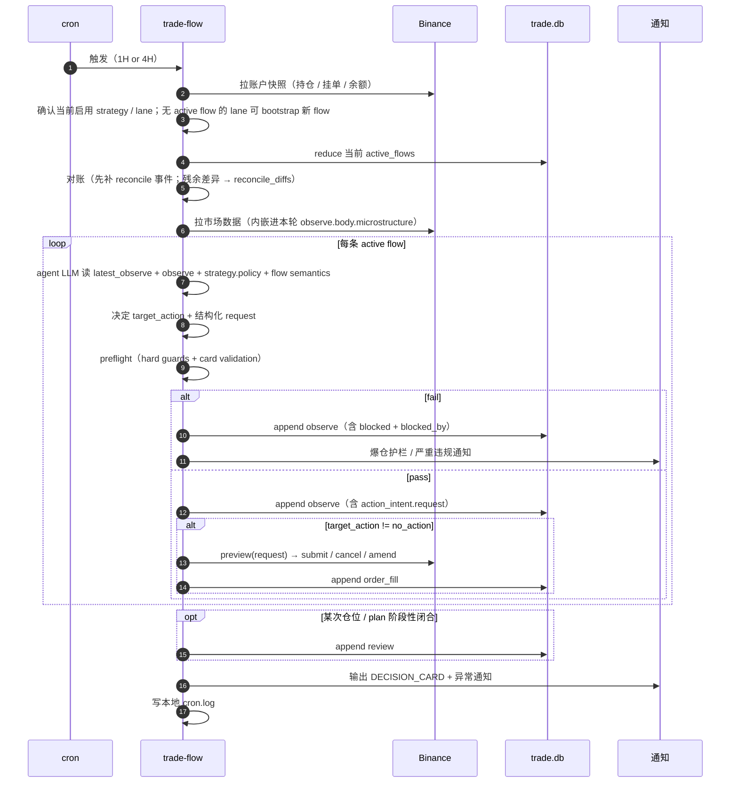

# Design Architecture

trade-flow 是套件 skill 的总入口（功能 skill 拓扑见 [skill-layout.md](skill-layout.md)）。本文是它在 plan / cron / preflight 层面的设计与 MVP 范围。

## 设计哲学

- 事件流为真相、自然语言为主
- 流程语义直接内嵌在 flow / stage 定义里；只有少量 hard guards 走确定性代码或脚本
- decision_card 渲染 = 校验

---

## 数据模型

```
plan_event
  event_key   PK
  chain_id           -- 事件归属（当前语义就是 flow_id；沿用旧字段名）
  kind               -- observe | order_fill | review
  body_json
  created_at
  INDEX (chain_id, created_at)
  INDEX (kind, chain_id)    -- 加速 review event 检索（state 推断）
```

本阶段先把身份拆成三层：`strategy` 是规则模板；`lane` 是某个 strategy 在某个 `symbol + side` 上的运行槽位；`flow` 是一笔具体机会 / 暴露从 observe 到闭合的生命周期。表结构里沿用 `chain_id` 字段名，但语义上就是 `flow_id`。MVP 的 lane 先用 `strategy_ref + symbol + side` 读时定位，不单独建表。跨 symbol / 跨 side 可并行，因为它们属于不同 lane；同一 lane 任一时刻最多只维护 1 条 active flow。数据库里同时存在多条历史 / 活跃 flow，不假设系统只有一条最新主流。

- **创建 flow**：某 lane 当前无 active flow，且本轮识别到值得跟踪的新 setup 时，trade-flow 生成 UUID，写进 first observe 的 `plan_event.chain_id`
- **延续 flow**：同一笔机会 / 持仓仍在管理时，后续 cron 都沿用同一 `chain_id` append 新事件
- **新开 flow**：某条 flow 已阶段性闭合后，同一 lane 后续又出现新 setup，或本轮机会本质上应作为独立暴露管理时，新开 flow

完整 schema / 索引 / 落库约定见 [tech-spec.md](tech-spec.md)。

### Event kind

| kind | body | 来源 |
| --- | --- | --- |
| `observe` | 完整快照（见 ### observe.body shape） | 每轮 cron |
| `order_fill` | 订单 / 成交事件（见 ### order_fill.body shape） | EXECUTE stage |
| `review` | 阶段性复盘（见 §REVIEW → ### review.body shape） | 某次仓位 / plan 阶段性闭合时 |

### observe.body shape

```yaml
# 硬字段
symbol: BTCUSDT
side: long | short
stop_price: number
risk_budget_usdt: number          # 全档成交假设下最大允许亏损（驱动 G-RISK-OPEN-CAP / G-RISK-DAY-FLOOR）
strategy_ref: S-xxx

# 硬字段（可选，结构化承载关键执行价位）
stop_ladder:?                     # [{trigger_price, new_stop, reason}]
takeprofit_ladder:?               # [{price, qty_ratio, reason}] —— qty_ratio 之和 ≤ 1.0
risk_budget_change:?              # {delta_usdt, reason}（与上一条 observe 不同时必填）

# 软字段（自然语言；由 LLM 按 flow semantics + strategy.policy 解读）
thesis: text
entry_intent: text
exit_intent: text
invalidation: text
expected_rr_net: number
valid_until_at: timestamp?

# 行动意图（一次性，本轮 EXECUTE 直接消费）
action_intent:
  target_action: no_action | place_entry | cancel_order | sync_protection | adjust_position
  request:                        # target_action != no_action 时必填
    # 结构化参数；shape 由 target_action 决定，preview 解析后路由到执行 skill

# 证据段
account:
  equity_usdt: number
  positions: [...]
  open_orders: [...]
  funding_paid_since_entry_usdt: number?
microstructure:                   # 当轮采集结果直接内嵌；shape 见 market-data-design.md
  notes: text?                    # agent 本轮一句话提炼
catalyst: text                    # 持仓窗口内 high-impact 事件（无则 "none in window"）
exposure: text                    # 同簇敞口判断（btc-beta / eth-eco / ...）
reconcile_diffs: [...]            # 对账后仍未解决的残余差异（详见 §对账）
preflight_result:
  verdict: armable | blocked | abstain
  blocked_by: [{check_id, reason}]   # 任一非空 → blocked
  warnings:   [{source, reason}]     # 不阻拦但记录
decision_summary: text            # 本轮 cron 做了什么
```

每条 observe 是**最小完整快照**，不是 patch。若只刷局部槽位，上游先合并上一版完整 observe 再 append。

同一条 flow 可以在空仓观察、等待条件、已挂单、持仓管理之间切换；一旦这次机会已阶段性闭合，同一 lane 后续再出现新 setup 时新开 flow，不复用旧 `chain_id`。

ladder 字段是**软触发**：agent 每轮读 ladder + 当前 mark + order_fill 历史，自己决定是否发 `sync_protection` 票，preflight 不做"已触发档位"的机械 reduce。

### order_fill.body shape

```yaml
sub_kind: submit | cancel | amend | fill | partial_fill
client_order_id: string             # <chain_id>-<seq>-<action>
exchange_order_id: string?          # Binance orderId（submit ack 后才有）
symbol: BTCUSDT
side: BUY | SELL
position_side: LONG | SHORT
order_type: LIMIT | MARKET | STOP_MARKET | TAKE_PROFIT_MARKET | OTOCO
qty: number
price: number?                      # LIMIT 类必填
stop_price: number?                 # STOP_MARKET 类必填
filled_qty: number?                 # fill / partial_fill
avg_fill_price: number?             # fill / partial_fill
fee_usdt: number?                   # fill 类
funding_paid_delta_usdt: number?    # 持仓段累计 funding 增量（仅 fill 且关联仓位时）
source: trade_flow | reconcile      # 主动执行 vs 对账补录
```

`current_orders` / `current_position` reduce 时只读 `sub_kind / client_order_id / side / position_side / qty / filled_qty / avg_fill_price`；其余字段是审计 / 复盘用。`source=reconcile` 只用于“交易所事实已经发生，且本轮对账能可靠归属到当前 flow”的补录事件。Binance API 字段全集见 [tech-spec.md](tech-spec.md)。

### PLAN 与 EXECUTE 的边界

- `plan` 是持续演化的判断，不是执行票据
- EXECUTE 只读 `latest_observe.action_intent.request`，不再回头读自然语言 plan
- `preview` 是唯一执行路由器：解析 request → 选 execute skill → 生成最终交易所请求

崩溃恢复：下一轮 cron 读 `latest_observe.action_intent`，若 `target_action != no_action` 但事件流无对应 `order_fill`，preflight 重跑由 LLM 决定续做或放弃。

---

## 存储

事件流落 SQLite + JSON 列，单库自用：

```sql
CREATE TABLE plan_event (
    event_key   TEXT PRIMARY KEY,             -- UUID
    chain_id    TEXT NOT NULL,
    kind        TEXT NOT NULL,                -- observe | order_fill | review
    body_json   TEXT NOT NULL CHECK(json_valid(body_json)),
    created_at  TEXT NOT NULL                 -- ISO 8601
);
CREATE INDEX idx_chain_time ON plan_event(chain_id, created_at);
CREATE INDEX idx_kind_chain ON plan_event(kind, chain_id);
```

`body_json` 用 TEXT + `json_valid` CHECK；SQLite JSON1 扩展支持 `json_extract` / expression index，可以为投影路径加索引（如 `chain_meta` 用到的 `$.symbol` / `$.strategy_ref`）。

整体存储分布：

| 内容 | 介质 | 位置 |
| --- | --- | --- |
| 事件流 | SQLite | `./data/trade.db` → `plan_event` |
| Strategy policy | Markdown（一文件一 strategy） | `.agents/skills/trade-flow/strategies/*.md` |
| Account config | JSON 文件 | `./data/account_config.json` |
| Notify config | JSON 文件 | `./data/notify_config.json` |
| Cron log | 文本日志 | `./data/cron.log` |
| OHLCV / 市场数据 | CSV + manifest（后期切 SQLite） | `./data/ohlcv/` |

选型原则：

- **SQLite（关系列 + JSON body）**：事件流 —— 需要按 chain_id / kind / time 索引和聚合，且每种 kind 自带 shape 不需 schema migration
- **Markdown**：strategy policy —— 人编辑 + LLM 直读
- **代码 / script**：hard guards —— 只承载确定性、必须严格遵守的校验
- **JSON 文件**：account_config / notify_config —— 静态单对象
- **CSV / log**：OHLCV / cron 运维 —— 追加型时间序列

不引入 MongoDB / 文档库：单进程 cron + MVP 体量（< 10k events/月）下 SQLite JSON1 扩展完全够用，多一套服务的运维成本不值。具体 schema / 索引 / JSON 查询模式见 [tech-spec.md](tech-spec.md)。

---

## Flow Semantics

流程语义直接内嵌在主流程、stage 文档和 strategy policy 的解释口径里。

### MVP 固定语义

- `valid_until_at` 已过期：当前 setup 失效，不再继续执行；若已有挂单，应进入撤单或放弃分支
- `invalidation` 已触发：当前 thesis 不得继续推进；若已有挂单，优先撤单；若已有仓位，优先进入保护或退出分支
- `current_position != 0`：当前流的工作重点从 entry 转向 `exit_intent + thesis` 管理，不把持仓语境和空仓语境混在一起
- `review` 记录某条 flow 的闭合样本；关闭的是 flow，不是 lane，更不是 strategy
- 上轮 `target_action != no_action` 但无对应 `order_fill`：下一轮必须重读最新语境再决定续做或放弃，不机械重放旧动作

与 funding、跨策略相关性、场景过滤有关的判断，当前不升格为全局阻断项。若确有 edge，优先写回各自的 `strategy.policy`，或只做提示，不做全局 blocking。

## Hard Guards

hard guard 只保留三类特征同时成立的约束：

- 很重要，违背后会直接放大账户层风险或造成脏状态
- 可以确定性计算，不依赖 LLM 主观解释
- 适合落成代码或脚本，并输出固定结构结果

MVP 先固定以下几项：

| Check ID | 标题 | 说明 |
|---|---|---|
| `G-RISK-OPEN-CAP` | 成交后总 open risk 不超预算 | 账户级硬上限 |
| `G-RISK-DAY-FLOOR` | 今日累计亏损不穿底 | 账户级硬下限 |
| `G-OBS-FRESH` | observe 距 now ≤ 30s | 防止拿过期快照执行 |
| `G-PLAN-INTENT-COMPLETE` | thesis / entry_intent / exit_intent / invalidation 必填非空 | 防止半成品 plan 落执行 |
| `G-STOP-LADDER-MONOTONIC` | stop_ladder 单调 | 结构化止损推进卫生 |
| `G-TP-LADDER-RATIO-CAP` | takeprofit_ladder.qty_ratio 之和 ≤ 1.0 | 防止止盈超配 |
| `G-RECON-NOT-STUCK` | 只要存在残余对账差异，就拒加风险动作；连续 ≥ 3 轮通知人工 | 防止脏状态继续放大风险 |

hard guard 用脚本或代码实现，语言和路径在实现时再定；当前只固定口径，不提前固定具体实现目录。

### 爆仓护栏（G-RISK-OPEN-CAP / G-RISK-DAY-FLOOR）

代码兜底，单测保证。任何新挂单/加仓必须同时通过：

```
G-RISK-OPEN-CAP:
  sum(risk_budget_usdt for active plans ∪ {candidate})
    + current_account_open_risk_usdt
  ≤ equity_live × account.max_open_risk_pct

G-RISK-DAY-FLOOR:
  realized_pnl_today_usdt
    + sum(unrealized_loss_at_stop for active plans)
    - candidate.risk_budget_usdt
  ≥ -(equity_live × account.max_day_loss_pct)
```

`equity_live = latest_observe.account.equity_usdt`，来自最近账户快照，不来自配置文件。

这两条不让 LLM 介入 —— 是自动化 cron 的最后安全网。

### preflight 执行（实现细节）

preflight 收成两步：

1. LLM 读 `current_plan + latest_observe + strategy.policy`，按 flow semantics 收敛本轮动作
2. 运行 hard guard 脚本，产出结构化 `blocked_by / warnings`

任一 hard guard 失败，或 DECISION_CARD 渲染发现关键字段缺失 → preflight verdict = blocked，本轮拒新动作。

### 对账护栏（G-RECON-NOT-STUCK）

`reconcile` 不是先产出一个“diff 非空就全拦”的总开关，而是先把交易所已经发生、但本地事件流缺失的事实补回 `plan_event`。

执行口径：

1. 先用账户快照 + 历史订单 / 成交，尝试把可确定归属的变化补写为 `order_fill(source=reconcile)`
2. 再 reduce 一次 flow 状态
3. 只有仍解释不掉的残余差异，才写进 `observe.body.reconcile_diffs`

guard 口径：

- `reconcile_diffs` 非空时，拒 `place_entry`
- `reconcile_diffs` 非空时，拒会增加暴露的 `adjust_position`
- `reconcile_diffs` 非空时，允许明确的 `sync_protection`
- `reconcile_diffs` 非空时，允许 reduce-only 的 `adjust_position`
- `reconcile_diffs` 非空时，允许目标明确的 `cancel_order`
- 若动作目标无法从交易所事实里确定归属，仍拒本轮动作并通知人工

### 复盘聚合

review 阶段按 `blocked_by[].check_id` group by，自然得到"哪项 hard guard 最常挡住动作 / 哪项可能过严 / 哪些问题其实该回到 strategy.policy 或 flow semantics 解决"。

---

## ACCOUNT_CONFIG

唯一硬配置：`./data/account_config.json`

| 字段 | 必填 | 说明 |
| --- | --- | --- |
| `max_open_risk_pct` | 是 | G-RISK-OPEN-CAP 公式分母 |
| `max_day_loss_pct` | 是 | G-RISK-DAY-FLOOR 公式分母 |
| `max_consecutive_losses` | 否 | 连续亏损上限；触发后通知冷却 |

缺文件、缺必填、`latest_observe.account.equity_usdt` 缺失 → preflight 直接拒所有新动作。

跨策略相关性与同簇敞口，当前不作为 MVP 硬配置；需要时先回到具体 strategy policy 或后续独立设计。

---

## Strategy 池

Strategy 是 `observe.body.strategy_ref` 指向的对象。strategy 是规则模板，不是 flow 身份。一个 strategy 可以在不同 symbol / side 上展开多个 lane；MVP lane 先用 `strategy_ref + symbol + side` 读时定位。每个 lane 同时最多 1 条 active flow；同一 lane 的旧 flow 闭合后，后续再出现新机会时新开 flow。更复杂的同 lane 多重重入不作为当前默认管理模型；是否支持同 symbol 双向同时并行，等真实需求出现再单独设计。MVP 2 条种子（`S-GENERIC-TREND` / `S-GENERIC-MEANREVERT`），完整 policy 落 [.agents/skills/trade-flow/strategies/](../.agents/skills/trade-flow/strategies/)。schema 见 [tech-spec.md](tech-spec.md)。

---

## 投影视图（读时计算）

| 视图 | 实现 |
| --- | --- |
| `flows` | `SELECT chain_id, MIN(created_at) AS bootstrapped_at, MAX(created_at) AS last_event_at FROM plan_event GROUP BY chain_id` |
| `lane_index` | latest `observe.body` 投影出的 `strategy_ref / symbol / side` 组合；MVP 每 lane 同时最多 1 条 active flow |
| `active_flows` | 当前启用 lane 上未闭合的 flow；由 strategy 配置 + lane 扫描结果决定，不再把 strategy 直接当 flow |
| `flow_meta(flow_id)` | latest `observe.body` 的 `strategy_ref / symbol / side`；`bootstrapped_at` 来自 `flows` |
| `current_plan` | 取某条 flow 最近一条 `observe.body` 的意图段字段 |
| `current_action_intent` | 取某条 flow 最近一条 `observe.body.action_intent` |
| `latest_observe` | 取某条 flow 最近一条 `observe`（含证据段） |
| `current_orders` | reduce 某条 flow 的 `order_fill` 事件到 open-orders 集合 |
| `current_position` | reduce 某条 flow 的 `order_fill` 事件到净头寸 |
| `last_preflight` | 取某条 flow 最近一条 `observe.body.preflight_result` |

下次 cron 跑直接读各条 active flow 的最新 observe，没有"标记 stale"机制。某条 flow 写入 terminal `review` 后不再参与 `active_flows`；同一 lane 后续若再出现新 setup，则新开 flow。

---

## 一轮 cron



---

## DECISION_CARD

每轮 cron 输出 6 行扫读视图，从 `current_plan + latest_observe + strategy` 实时渲染，不存库。ASCII 模板见 [.agents/skills/trade-flow/SKILL.md](../.agents/skills/trade-flow/SKILL.md)。

渲染约定：

- `valid_until_at < now` → Plan 行标红，按 flow semantics 直接视为当前 setup 失效
- snapshot age > 20s 黄、> 30s 红（红色触发 `G-OBS-FRESH` 拒）
- Checks 行 `blocked_by` 非空 → 卡片拒绝渲染为"可执行"，本轮跳过 EXECUTE

**渲染 = 校验**：硬字段缺导致卡片渲染不出来，preflight 直接拒。

---

## 对账

币安账户接口是 ground truth，`plan_event` 是 staging。每次 cron 周期开始时跑对账器：

1. `binance-account-snapshot` 拉当前持仓 + 挂单
2. reduce 当前 active flows 的 `order_fill` 得 `current_orders` / `current_position`
3. 必要时补读 symbol-scoped 历史订单 / 成交，尝试把缺失事实补写成 `order_fill(source=reconcile)`
4. 再 reduce 一次 flow 状态
5. 仍解释不掉的残余差异 → 写本轮 `observe.body.reconcile_diffs`

`reconcile_diffs` 只代表“对账后仍未解决的残余异常”，不是所有状态变化的总和。其处置由 `G-RECON-NOT-STUCK` 承载：本轮拒加风险动作，但允许明确的降风险 / 补保护动作；连续 ≥ 3 轮仍 unresolved 才 escalation 通知。

---

## REVIEW（阶段性复盘）

输入是同一条 flow 在闭合前后的完整 `plan_event` 切片。`review` 用来总结一段已完成的持仓 / plan，并作为该 flow 的 terminal event。

### review.body shape

```yaml
outcome: win | loss | breakeven | abandoned
pnl_pct: number                 # 实际盈亏百分比
thesis_held: boolean            # thesis 入场判断是否维持成立
key_lesson: text                # 一句话
promote_to_strategy: boolean    # 是否值得抽成新 strategy
notes: markdown?                # 自由 markdown：cost vs expected / signal accuracy / 其他
```

单条 flow 默认写 1 条 terminal `review`。同一 lane 可以随着多条历史 flow 累积多条 `review`。REVIEW 是 MVP 终点。BACKTEST / ITERATE / STRATEGY-POOL 链路推迟到累积 30+ review 样本后再展开。

---

## 失败兜底

**幂等**：每个 EXECUTE 动作前先检查交易所当前状态，重复请求不下重单。`clientOrderId` 由本轮 action 派生，Binance 侧自动去重。

**中途挂掉**：cron 任意阶段失败 → abort → 只 append 已写入的 observe。下次 cron 重跑读最新事件流决定动作。**默认偏保守**：不确定就啥也不做。

**异常通知**（配置在 `./data/notify_config.json`，缺则只写本地日志）：

- 关键 hard guard 拒新动作
- cron / preflight / Binance API 持续失败（含对账 stuck）
- 重大 PnL 事件（接近 daily loss floor / 连续亏损达上限）

具体阈值见 [tech-spec.md](tech-spec.md)。

---

## 执行层

读写分离：`binance-account-snapshot` 只读；下单走 trade-flow → preview → 执行 skill 的单一路径。详细约束（主单 / algo 单 / 预检 / clientOrderId 规则）见 [tech-spec.md](tech-spec.md)。

---

## Market Data

详细设计见 [market-data-design.md](market-data-design.md)。三层（接入 / 快照-特征 / 分析）：

| Skill | 回答什么 |
| --- | --- |
| `ohlcv-fetch` | 多周期 K 线 |
| `binance-symbol-snapshot` | 当前状态 |
| `binance-market-scan` | 全市场粗筛 |
| `tech-indicators` | 结构和指标 |
| `binance-account-snapshot` | 账户持仓 / 挂单 / 余额（只读） |
