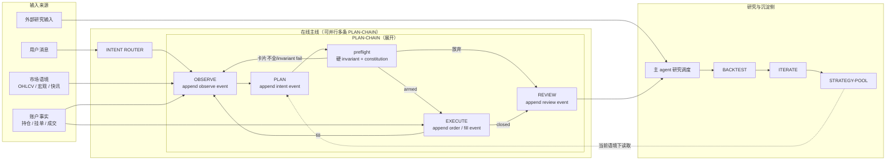
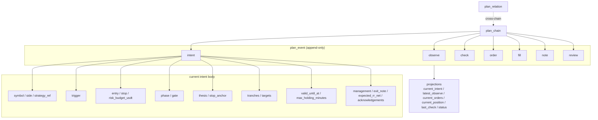
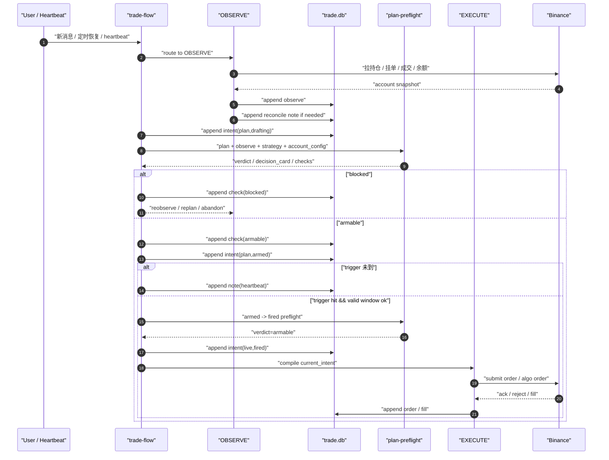

# Design Architecture

> **设计哲学**：业务复杂不等于实现复杂。用最少的结构守住"真会亏钱的那条线"，其余一律丢给自然语言 + LLM 判断。硬 schema 只承载"必须让系统算对账的"，软语言承载"需要让人读懂的"。

## 系统概览

### 产品形态

一组运行在 agent 工作区里的 skill，通过 Claude Code / Codex / Gemini CLI 调用。不做独立 app。持久化层是数据库（SQLite 单文件 `./data/trade.db`），不是 agent 工作区记忆。

### 项目层固定约束

**只做 Binance USDM 永续。** 这一行决定下面所有 schema、字段、状态的简化方向：

- plan 不带平台 / 品类字段：项目层即固定，执行层硬编码
- `side` 仅 `long | short`
- `plan_relation.kind` 仅承载 `hedge` 等 USDM 内部跨链关系
- `binance-account-snapshot` 只读 USDM 永续合约账户
- DECISION_CARD 行格式统一：funding / OI / liq 永远显示
- 执行层只走 `futuresOrder` / `futuresCreateAlgoOrder`

**演化承诺**：MVP 不为其他品类预留字段。未来确需扩展时，在项目层重写本节约束，再回头改 schema。

### 主链路

```
在线主线：OBSERVE <-> PLAN -> EXECUTE -> REVIEW
离线演化：REVIEW -> BACKTEST -> ITERATE -> STRATEGY-POOL
```

核心流转图（含并行 PLAN-CHAIN 和研究侧）：



### Skill 分层

详细结构见 [skill-layout.md](skill-layout.md)。

| 层 | 形态 | 例子 | 职责 |
| --- | --- | --- | --- |
| **套件 skill** | `trade-flow`，内部 `stages/observe/plan/execute/review/backtest/iterate` | 仅一个：`trade-flow` | 主线流转、router、数据库读写、调用功能 skill |
| **功能 skill** | 平铺单一职责 | `binance-*` / `ohlcv-fetch` / `tech-indicators` / `plan-preflight` | 一件事做好（拉数据 / 下单 / 算指标 / 校验 plan），可被套件内任意 stage 调用 |

---

## Plan 设计

### 一条原则

**一切是 event。** plan 的真相是一条按时间追加的事件流，所有"当前状态"都是从事件流 reduce 出来的视图。不建"当前决策表 + 历史表"双写结构，不建 sidecar 多表同步机制——那是两张表两套 stale 标记；事件流只有一张表 + ORDER BY at DESC。

### 最小持久化模型

在线主线只长期维护 3 个核心对象：

- `plan_chain`：机会骨架，回答“这条链是什么、是否已闭合”
- `plan_event`：事件流，承载 observe / intent / check / order / fill / note / review
- `plan_relation`：跨链关系，承载 hedge 等多链绑定

这里强调的是**模型边界**，不是具体表规格。字段、索引、读路径与 `trade.db` 落库约定移到 [tech-spec.md](tech-spec.md)。

**没有** `decision_plan_current` / `decision_plan_history` / `evidence_snapshot` / `execution_plan` / `runtime_state` / `rule_check` / `plan_check` 这 7 张分层表。它们都是 `plan_event` 的投影视图（下文定义）。

### Event kind（约定词，不枚举）

kind 是自由字符串，以下是 MVP 阶段约定的词。新增 kind 不需要 schema 变更，只要下游 reducer / card 渲染器能识别。

| kind | body_json 承载 | 典型来源 |
| --- | --- | --- |
| `intent` | 完整 DecisionPlan（下见 shape）；**仅决策性变化** append 一条 | PLAN stage |
| `observe` | 观察证据（账户事实 / 市场语境 / 微结构 / catalyst / cluster exposure） | OBSERVE stage |
| `order` | 订单事件（submit / cancel / amend + 交易所返回） | EXECUTE stage |
| `fill` | 成交事件（partial / full） | EXECUTE stage 或对账器 |
| `check` | preflight / 心跳检查输出（pass/fail/warn + DECISION_CARD 快照 + 所引 invariant） | plan-preflight skill |
| `note` | 任意自然语言记录（心跳、trailing 微调、放弃理由、对账差异、用户反馈） | 任意 stage |
| `review` | 最终复盘（outcome / pnl / what_worked 等） | REVIEW stage |

body_json 没有统一 schema——每种 kind 有自己的约定 shape，但不在数据库层强约束。kind 字段虽不在数据库 enum 约束，但 plan-preflight / reducer 维护一份白名单常量，写入时遇到未知 kind 立刻 warn（防 typo 静默落库）。

**intent vs note 的纪律**（防 intent 通胀）：

- 走 `intent`：方向变化、`trigger` 变化、`risk_budget_usdt` 变化、`stop.price` 越过 `stop_anchor` 锚点（不是单纯数字漂移）、`strategy_ref` 变化、`tranches/targets` 大档增删、`valid_until_at / max_holding_minutes / management` 变化、`phase/gate` 升降
- 走 `note`：trailing stop 在原锚点内的数值微调、心跳、未触发 replan 的观察发现、手工备注

判定原则：**这次变化是否需要 preflight 重跑？需要就 intent，不需要就 note。** trailing 微调若仍在 `exit_note` 描述的范围内，无须重跑。

### Plan 结构图



### 投影视图（projection）

常用读取路径（读时投影；具体 query 见 `tech-spec.md`）：

| 视图 | 语义 | 实现 |
| --- | --- | --- |
| `current_intent` | 当前决策本体 | 取最近一条 `intent` |
| `intent_history` | 决策演化序列 | 按时间顺序读取全部 `intent` |
| `latest_observe` | 最新证据快照 | 取最近一条 `observe` |
| `current_orders` | 活跃挂单 | reduce `order` + `fill` 事件到 open-orders 集合 |
| `current_position` | 持仓状态 | reduce `fill` 事件到净头寸 |
| `last_check` | 最近一次 preflight | 取最近一条 `check` |
| `status` | 当前 (phase, gate) | 读 `last_check` 的 outcome + `current_orders/position` 合成 |

这些视图都是**读时计算**。`observe` 事件刷新不需要"标记 execution_plan 为 stale"——preflight 下一次跑时自己读最新 observe，stale 根本不存在。

### DecisionPlan shape（`intent` 事件的 body）

`intent.body` 首先是**给 agent 执行器消费的执行合同**，不是给交易员手工照单操作的模板。人可读视图来自 DECISION_CARD；主消费者仍是 `PLAN / EXECUTE / monitor` 脚本。

硬字段只留 "必须驱动 agent 执行的" + "必须送交易所的" + "必须算对账的"，其余全软。

```yaml
# 硬字段：必须（否则 preflight / DECISION_CARD complete 直接拒）
# 平台/品类已在项目层固定为 Binance USDM 永续，不再编码进 plan
symbol: BTCUSDT          # USDM 永续 symbol
side: long | short
trigger:
  type: immediate | touch | close_above | close_below | reclaim_above | reclaim_below
  price: number?         # immediate 可空；其余 trigger 必填
  timeframe: 1m | 5m | 15m | 1h | 4h
entry:
  price: number
  order_type: limit | market | stop | stop-market | take-profit | take-profit-market
stop:
  price: number          # constitution C-EXEC-STOP-MARK 要求 basis=mark
risk_budget_usdt: number # 本次允许亏损的美元金额；与账户 equity 一起决定 invariant
phase: plan | live | closed   # 人 + preflight 都能读懂的粗粒度阶段
gate:  drafting | armed | fired | filled | flat   # 同一 phase 下的细分
strategy_ref: S-xxx      # FK 到 strategy 池

# 软字段：允许空；preflight + DECISION_CARD 会渲染/校验
thesis: text              # 一段话：为什么做 + 反思 + edge 直觉 + key risks
stop_anchor: text         # 自然语言：结构位 / ATR / 心理位
tranches: [{price, weight_pct, order_type?}]?       # 分批建仓；首档硬字段已在 entry 里
targets:  [{price, size_pct}]?                      # 减仓档；null = "看着平"
valid_until_at: timestamp? # 过期后 agent 不再沿原 trigger 执行；默认 Asia/Shanghai
max_holding_minutes: number? # 持仓时间盒；到时触发 exit/review check
management:
  break_even_after_rr: number?
  trail:
    activate_after_rr: number?
    mode: break_even | last_swing | atr
    note: text?
  add_on_trigger: text?
exit_note: text
expected_rr_net: number?  # 入场前估算的扣费净 RR（funding + fee + slippage 折算后）；永续/4h+ 持仓 SHOULD 必填
acknowledgements: [{ clause_id, reason }]?          # 对 constitution 条款的显式放行，必须带 reason
```

**硬字段核心组 9 组**（symbol / side / trigger / entry / stop / risk_budget_usdt / phase / gate / strategy_ref）。其中 `trigger` 是新增必填组：agent 不应靠自由文本猜何时扣扳机。

**不再有的字段**（上一版里有，现在删）：

- `market.*` 子结构与 `side` 上的扩展品类标记——项目层已固定 Binance USDM 永续，不需要在 plan 里再编码平台和品类
- `size_intent` 枚举（probe / main / scalp / reduce）——用 `risk_budget_usdt` 数字表达；probe 语义由 `risk_budget_usdt ≤ account.equity × account.probe_budget_ratio` 在 constitution 里守护（C-RISK-PROBE-CAP），不再是枚举值
- `status` 10 态扁平枚举——拆成 `(phase, gate)` 两维
- `role / leg_type` 字段——多腿语义由 `strategy_ref = S-HEDGE-GENERIC` + `plan_relation` 表承载
- `state_reason` 这类状态解释字段——保留在 `thesis / acknowledgements / note`
- `stop.basis / stop.anchor` 里的旧结构化子字段——basis 由执行层固定 mark；anchor 留在 `stop_anchor`
- 盘中自动化必须消费的持仓管理语义——不再全塞 `exit_note`，最小收进 `management`

### (phase, gate) 状态二维表

状态机不再是 10 个扁平态，而是两个正交轴的组合。人读得懂、preflight 判得清、新增状态不破坏现有投影。

| phase \ gate | drafting | armed | fired | filled | flat |
| --- | --- | --- | --- | --- | --- |
| `plan` | 在写，没交卡 | 卡已过，等扣扳机 | — | — | 放弃 (abandon) |
| `live` | — | — | 已挂单，等成交 | 已成交，在仓中 | 挂单撤了/过期 |
| `closed` | — | — | — | — | 终态；含 abandon / draft-closed / closed-win / closed-loss |

惯用组合：

- `(plan, drafting)`：对应旧 "wait-condition / ready-probe 草拟期"
- `(plan, armed)`：对应旧 "ready-execute"——卡片已渲染、invariant 通过、只等执行授权 / 下游执行器扣扳机
- `(live, fired)`：对应旧 "wait-until-fill"
- `(live, filled)`：对应旧 "in-position / partial-fill"（partial 由 `current_orders` 视图里有未填满挂单自然体现，不需要独立状态）
- `(live, flat)`：挂单撤了、仓位平了，但 chain 还没关
- `(closed, *)`：chain 终结，等 REVIEW 归档

**没有 ready-probe 状态**。probe 是"小额快速试探"，本质是 `risk_budget_usdt` 小 + `thesis` 一句话的特例——preflight 走同一条路，constitution C-RISK-PROBE-CAP 额外检查 "probe risk_budget ≤ account.equity × probe_budget_ratio"（默认 0.3% equity）。不需要为它多开一个状态。

### Plan 时间流



### 守底线：两条硬 invariant

真正会让账户爆仓的只有两件事：**单笔/累计 open risk 超预算**、**单日累计亏损穿底**。两条写死在代码里，任何 plan 想升到 `(plan, armed)` 必须同时通过：

```
INVARIANT.open_risk_after_fill (hedge-aware):
  net_open_risk(active_plans ∪ {candidate})
    + current_account_open_risk_usdt
  ≤ account.equity × account.max_open_risk_pct

  其中 net_open_risk(plans) =
    按 plan_relation.kind='hedge' 把父子链配对，
    pair 的净 risk = max(0, |father.risk_budget - child.risk_budget|)；
    其余 plan 按 cluster 分组，同 cluster 取 sum，跨 cluster 取 sum。
```

```
INVARIANT.daily_loss_floor:
  realized_pnl_today_usdt
    + sum(unrealized_loss_at_stop for active plans)
    - candidate.risk_budget_usdt
  ≥ -(account.equity × account.max_day_loss_pct)
```

第一条防"成交后爆仓"，对冲腿不重复计费；第二条防"今日已经亏到该收手了还在加单"——`max_day_loss_pct` 不再只是 PLAN-POOL 软闸，而是和 open risk 并列的硬线。

其它"会亏钱但不会爆仓"的规则全部写进 **constitution**（自然语言），preflight 由 LLM 读 plan + constitution 判 pass / warn / fail。两条 invariant 是**最后的安全网**——LLM 判错了也不会真爆仓。

### Constitution：自然语言的规则总集

位置：[.agents/skills/plan-preflight/constitution.md](../.agents/skills/plan-preflight/constitution.md)

结构：一份 markdown，分 "MUST / SHOULD / CONTEXT" 三段。

- **MUST**：违反直接拒写，对应旧 `reject` 规则（如"永续 stop 必须 mark price"、"OTOCO 必须标 mother-only"、"微结构快照 > 30s 不许下单"）
- **SHOULD**：默认拒写，但 plan 带 `acknowledgements[]` 条目并写清 reason 就放行，对应旧 `warn-ack`（如"永续 4h+ 必须把 funding 算进 expected RR"、"stop 应有结构化锚点"）
- **CONTEXT**：不拦，但 preflight 把这类条款也展示在 DECISION_CARD 的 `Checks` 行，让人读到（如"scalp 可以忽略 funding"）

**新增规则 = 往 constitution.md 里加一句话**。不改 schema、不加表达式、不改 preflight 代码。

**规则粒度**：constitution 用自然语言写每一条规则的触发条件 + 检查点，preflight 把整份 constitution + 当前 plan + latest observe 喂给 LLM，LLM 输出 `{must_fail: [], should_warn: [], context_notes: []}` 结构化结果。LLM 判错的风险由硬 invariant 兜底。

**机械规则不进 LLM**：以下条款判断不需要语义理解，由 preflight 代码硬执行（直接读 observe / intent 字段比较），LLM 路径只看剩余条款：

- `C-OBS-SNAPSHOT-FRESH`：observe 时间戳距今 > 30s 拒
- `C-EXEC-STOP-MARK`：永续 plan 的 stop order 必须 `priceProtect=true` 且 basis=mark
- `C-EXEC-OTOCO-MOTHER`：OTOCO 母单 `clientOrderId` 必须带 `mother-only` 前缀
- `C-PLAN-TRIGGER-STRUCTURED`：`trigger.type` 必填；非 `immediate` 时 `trigger.price / timeframe` 必填
- `C-PLAN-VALID-WINDOW-NOT-EXPIRED`：`valid_until_at` 存在且已过期直接拒
- `C-RISK-PROBE-CAP`：`strategy_ref=S-PROBE-GENERIC` 且 `risk_budget_usdt > equity × probe_budget_ratio` 拒

抽出来的目的不是"LLM 判不了"，是这些判断稳定、可单测、不需要消耗 token——constitution.md 仍保留这些条款的人类描述（让人类读得到规则全集），但实际判定走代码路径。

### Acknowledgement 纪律

- 每次 ack 必须带**具体**理由，不是"ack"二字
- 同一条款在同一 chain 内以**不同 reason** 累计 ack 超过 3 次，preflight 升级为 reject（说明这个 setup 本身就是边缘情况）
- 同 reason 在多次 intent 迭代中保持一致**不重复计数**——视为已被追认
- REVIEW 阶段按条款聚合 ack 后的胜率；某条款被 ack 样本胜率长期低于整体，说明该条款应从 SHOULD 升格为 MUST

### Strategy shape（不变，保留自然语言 policy）

```yaml
strategy_id: S-xxx
name: string
status: active | draft | retired
policy: markdown          # setup / 失效 / EV 哲学 / regime / catalyst / 持仓纪律 / size policy
tags: [string]
```

MVP 保留 4 条种子（见《Strategy 池种子》）。policy 一段 markdown，不拆字段；等 REVIEW 在同一维度上看到 3+ 次聚合需求，再升格成独立字段——**演化驱动结构化**。

strategy 对 constitution 条款的 override 也放在 `policy` 的自然语言里表述（"本策略不评估 funding"），preflight 读 policy + constitution 一起判。不再需要 `required_rules / overridden_rules` 字段。

### DECISION_CARD（唯一视图）

这是 **inspect view**，不是主存结构；真正被执行的是 `intent.body`。DECISION_CARD 只负责把当前执行合同压成可扫读快照。

**8 行固定格式**，从 `current_intent + latest_observe + strategy` 实时渲染；**不存库**，每次 preflight 跑时重新渲染。

```
── DECISION CARD ─────────────────────────────────────────
  Plan     <chain_id:8>  <symbol>  (<phase>, <gate>)
  Strategy <strategy_ref>  (<strategy.name>)
  Thesis   <thesis 压成 1-2 句>
  Risk     <side>  loss_budget $<risk_budget_usdt>  (≈<%>% of equity)   net_rr <expected_rr_net or "—">
  Route    trigger <trigger 摘要>  entry <price> [<order_type>]  size <qty> (≈$<notional>)
           stop <stop.price>  anchor <stop_anchor>
           valid ≤ <valid_until_at or "—">  hold ≤ <max_holding_minutes or "—">m  targets <加权均价 or "open">
  Context  funding <rate%>  OI <Δ1h%>  walls <上下最近墙>  liq <最近爆仓簇>
           catalyst <事件名 + impact or "none in window">   [snapshot age <s>s]
  Exit     mgmt <management 摘要 or "—">   final <exit_note 或 strategy.policy 摘出>
  Checks   MUST ✔/✗ <clause …>   SHOULD ⚠ack <clause + reason>
──────────────────────────────────────────────────────────
```

`size` 由 `risk_budget_usdt / |entry.price - stop.price|` 推出（合约场景换算合约张数），渲染时按交易所步进取整。`net_rr` 来自 `expected_rr_net` 软字段，未填时显 "—"，permanent / 4h+ 持仓的 plan 在 SHOULD 条款里要求填（缺则 warn）。

### 渲染 = 校验

**如果任何硬字段缺失导致卡渲染不出来，plan 就不算完整**，preflight 直接拒绝放行到 `armed`。不再另写"字段齐全性"规则——卡片渲染成功即证明字段齐全。这是"让一个东西同时做两件事"的节约。

其它渲染约定：

- 分批建仓：Route 行 `entry` 显示首档 + `(+N 档)` 尾注（从 tranches 派生）
- hedge 腿（strategy_ref=S-HEDGE-GENERIC）：Strategy 行追加 `hedges → <parent_chain_ids 缩写>`
- `trigger.type=immediate`：Route 行显示 `immediate`；其余显示 `<type>@<price> / <timeframe>`
- `valid_until_at < now`：Route 行标红，constitution 的 stale 条款直接触发拒
- snapshot age > 20s 黄，> 30s 红（红色 + constitution 的 MUST 条款 "snapshot stale 拒写" 直接触发拒）
- Checks 行的 ✗ 非空 → 卡片拒绝渲染为"可执行"，回退到 drafting

### ACCOUNT_CONFIG（唯一硬配置文件）

固定最小 contract：`./data/account_config.json`

| 字段 | 必填 | 说明 |
| --- | --- | --- |
| `account_equity` | 是 | 当前账户权益；硬 invariant 的计算基准 |
| `max_open_risk_pct` | 是 | 成交后账户总 open risk 上限（硬 invariant 的分母） |
| `max_day_loss_pct` | 是 | 单日最大允许亏损百分比；PLAN-POOL 层全局闸 |
| `probe_budget_ratio` | 是 | probe 上限占 equity 的比例，MVP 默认 0.003 (0.3%)，constitution 引用 |
| `max_correlated_exposure_usdt` | 否 | 同簇净方向敞口上限；constitution 引用 |
| `max_correlated_gross_exposure_usdt` | 否 | 同簇总敞口上限；constitution 引用 |
| `max_consecutive_losses` | 否 | 连续亏损上限；PLAN-POOL 层闸 |

缺文件、缺必填字段、字段为 null 时，preflight 直接拒所有写入到 `armed` 的请求。

### 跨链 exposure（替代 PLAN-POOL 聚合视图）

PLAN-POOL 层做 "净暴露 / 同簇 gross" 视图时，直接读 `plan_event WHERE kind='intent' AND chain in (active chains)`，按 `current_intent` reduce 出 side + risk_budget + cluster，再 sum。

对冲锁仓：hedge 腿 chain 的 `current_intent.strategy_ref = S-HEDGE-GENERIC` + `plan_relation` 指向父 chain，聚合视图按此识别真正的净方向敞口。

### Strategy 池种子（MVP）

4 条种子覆盖 MVP 场景。policy 故意保持短——**不是把一切写清楚，是给 agent 一个可延展的信念起点**。

#### `S-GENERIC-TREND`

```yaml
strategy_id: S-GENERIC-TREND
name: "通用趋势跟随"
status: active
tags: ['directional', 'technical']
policy: |
  没明确归入具体 setup 的趋势跟随 plan 默认 fallback。
  setup：顺主周期（4H/1D）方向，回调到结构位/均线/ATR 锚点入场。
  失效：突破 stop 锚点或 thesis 里写明的结构失效位。
  EV：要求 expected_value > 0；允许小幅为负只在明确 ack 时。
  regime：主周期 regime 漂移必须 replan；次周期漂移允许继续持有直到 stop 或 target。
  catalyst：持仓窗口内有 high-impact 事件必须在 thesis 或 exit_note 里明示处置（穿越 / 提前平）。
  持仓：不设硬时限；进 (live, filled) 后 thesis 里写节奏（如"每 4H 复看"）。
  size：默认常规 risk_budget_usdt（≈ equity × 0.5% ~ 1%）；probe 起步可后续补写 intent 升档。
```

#### `S-GENERIC-MEANREVERT`

```yaml
strategy_id: S-GENERIC-MEANREVERT
name: "通用均值回归"
status: active
tags: ['mean-revert', 'technical']
policy: |
  震荡区间反手入场默认 fallback。
  setup：主周期横盘（ADX 低 / 布林缩口），次周期触边反弹。
  失效：区间边界被真突破。
  EV：min_net_rr >= 1.2；允许胜率 > 60% 但 RR 较低的 setup。
  regime：次周期漂移不必 replan——本策略抗波动；主周期从 range 进 trend 必须平仓重评。
  catalyst：持仓窗口 high-impact 事件默认提前平，除非 hedge 腿覆盖。
  持仓：默认短（< 4H）；超时不升档而是主动平。
  size：默认常规；不使用加仓。
```

#### `S-PROBE-GENERIC`

```yaml
strategy_id: S-PROBE-GENERIC
name: "临机 probe 通用"
status: active
tags: ['probe', 'fast-path']
policy: |
  小额快速试探仓位默认 ref 此条。
  setup：信号来得快来不及写完整 plan；承认观察力稀缺，用严格 size cap 换反应速度。
  失效：stop 必须具体价位；thesis 一句话交代为什么不走完整 plan。
  EV：不要求正 EV（允许 EV 略负换 optionality）。本策略定义放弃 "EV > 0 硬约束"。
  regime / catalyst：不评估。
  持仓：入场后 2h 内必须升级（补齐完整 thesis / 完整 observe / 通过全量 constitution MUST 条款）或主动平仓；超时由套件强平 replan。
  size：risk_budget_usdt ≤ account.equity × account.probe_budget_ratio（constitution 守护）。
```

#### `S-HEDGE-GENERIC`

```yaml
strategy_id: S-HEDGE-GENERIC
name: "通用对冲腿"
status: active
tags: ['hedge', 'carry']
policy: |
  为已存在方向仓位做保护或 carry 对冲的 plan 默认 ref 此条。
  setup：thesis 必须点明被对冲的 plan_chain_id（同时在 plan_relation 表写 parent_chain_id）。
  失效：被对冲方平仓即本腿失效，主动平。
  EV：不单独评估——与父仓合计（手动或 REVIEW 阶段）。本策略定义不做独立 EV 评估。
  regime / catalyst：不独立评估，由父仓承担。
  持仓：与父仓同周期。
  size：与父仓净敞口匹配；允许 cluster gross 超阈值（constitution 里 "同簇 gross" 条款由本策略自动 ack）。
  microstructure：允许 null（hedge 腿不基于微结构判断）。
```

### 心跳 / 放弃 / 备注

原 `plan_check` 表、`state_reason` 字段、`runtime_state.progress` 等都塞进 `note` 事件。body 自由：

```json
{
  "kind": "note",
  "body_json": {
    "topic": "heartbeat",  // 或 abandon / user-feedback / ...
    "price_at_check": 62500,
    "orders_ok": true,
    "still_valid": true,
    "findings": null,
    "triggered_replan": false
  }
}
```

`note` 不会触发任何视图更新——纯留痕。需要心跳驱动 replan 时，上游逻辑在同一轮接着 append 一条新 `intent` 事件即可。

### 写入校验哲学

**防爆仓，不防思考。** 两条硬 invariant 守住"不会爆仓"；其余表达为 constitution 里的 MUST / SHOULD 条款，LLM 读 plan + constitution 判断，SHOULD 可 ack 放行带 reason。

硬规则全开等于告诉 agent"填满字段就能入场"，agent 会倒推数字凑通过。SHOULD + ack 机制让 agent 要么遵守、要么**显式写出为什么破例**——判断可追溯，REVIEW 阶段能按条款聚合"明知故犯"的胜率，数据说话再决定升降级。

### 对账（reconciliation）

事件流的权威性取决于 `order/fill` 是否被完整记录——交易所推送会丢、程序重启会断、手工干预（在交易所 UI 平仓 / 改单）不会自动 append。设计要求：**币安账户接口是 ground truth，plan_event 是 staging**。

每次 OBSERVE stage 进入时，先跑对账器：

1. 调 `binance-account-snapshot` 拉当前持仓 + 挂单
2. reduce 当前 chain 的 `order/fill` 事件得 `current_orders` / `current_position`
3. 对比差异：
   - 交易所有但事件流没有 → append 一条 `fill` 或 `order` 事件，body 标 `source='reconcile'`
   - 事件流有但交易所没有（已被手工撤）→ append 一条 `order` 事件 `kind=cancel-detected`，body 标 `source='reconcile'`
   - 数量不一致 → append 一条 `note` topic=`reconcile-diff`，body 写差异详情，再补 `fill` 事件对齐
4. 对账完才往下走 OBSERVE 的市场数据采集

对账差异连续 3 轮出现同一 chain → 升级为 `note` topic=`reconcile-stuck`，preflight 拒绝该 chain 升 armed，强制人工介入。

对账器不靠时间戳精确同步（推送延迟正常），靠"持仓/挂单数量字段"对齐——快照里有的就是真的。

### 读路径与存储实现

`trade.db` 的表规格、常用查询路径、索引与存储边界移到 [tech-spec.md](tech-spec.md)。本文件只保留“事件流 + 投影 + agent 执行合同”这层设计，不再展开具体数据库规格。

### 场景覆盖：复杂需求如何在简单结构里落地

| 场景 | 落地方式 |
| --- | --- |
| 多腿 / 对冲 | `strategy_ref=S-HEDGE-GENERIC` + `plan_relation` 父链指针；每条腿独立 chain |
| 分批建仓 | `intent.body.tranches[]` 存意图；实际成交由 `fill` 事件序列承载，不污染 intent |
| 加仓 / 减仓 | append 新 `intent` 事件（新版）+ 新 `order` 事件；`tranches / targets` 重写 |
| 等待条件 / 入场触发 | `intent.body.trigger` 驱动 agent 何时从 `(plan, armed)` 扣到 `(live, fired)` |
| setup 过期 | `intent.body.valid_until_at` 到时后 append `note(topic='stale')`，再决定 close / replan |
| trailing stop / break-even / 加仓前提 | `intent.body.management` 承载 agent 必须消费的最小管理语义；剩余解释留在 `exit_note` |
| partial-fill | `current_orders` 视图 reduce `order + fill` 自然体现；不需要独立 status |
| 心跳监控 | `note` 事件（body.topic='heartbeat'），不触发 intent |
| 放弃 | append `intent` 事件 `phase=closed, gate=flat` + `note` 事件带放弃 reason |
| 合约 precheck | `order` 事件的 body_json 里存 `precheck_result`；preflight 检 constitution 里 "合约 armed 必须过 precheck" |
| 新规则上线 | constitution.md 加一行；不需要 schema migration、不需要改代码 |

### 待收紧的开放 object

- **持仓时限的软硬分界**：`intent.body.max_holding_minutes` 已作为软字段收口；何时把它升级成 MUST / invariant，仍以后续 REVIEW 样本决定
- **correlation_cluster 的动态化**：`observe` 事件 body 需要 agent 自行判簇（btc-beta / eth-eco / sol-eco / meme / independent）。演化路径：(a) 短期维护 `symbol -> cluster` 常量表；(b) 中期落地"近 30/90 天滚动相关系数 ≥ 0.6 归簇"的动态表；(c) 长期 REVIEW 反推簇定义
- **strategy.policy 的结构化反压**：MVP 是 markdown。某维度在多条 strategy 里相似格式出现 ≥ 3 次，抽成独立字段
- **REVIEW 产出结构**：`review.body_json` 现在是 markdown dump。累积 20+ 样本按查询频率决定是否拆列

---

## Market Data

详细设计见 [market-data-design.md](market-data-design.md)。三层（接入 / 快照-特征 / 分析）不变。

| Skill | 回答什么 |
| --- | --- |
| `ohlcv-fetch` | 把这个标的的多周期 K 线拉下来 |
| `binance-symbol-snapshot` | 这个标的现在大概什么状态 |
| `binance-market-scan` | 全市场先看谁（候选粗筛） |
| `tech-indicators` | 结构和指标怎么看 |
| `binance-account-snapshot` | 账户持仓 / 挂单 / 余额快照（只读） |

### OHLCV 存储演进

- 当前：`CSV + manifest.json`，增量追加
- 进入 replay/backtest 后：切 SQLite `./data/ohlcv.db`（与 trade.db 分离）
- 不提前做

---

## 离线演化侧

### 链路

```
REVIEW → BACKTEST → ITERATE → STRATEGY-POOL
```

REVIEW 是在线主线终点，也是离线演化入口。闭合 chain（`phase=closed`）经 REVIEW 产出结构化复盘，进入 BACKTEST 验证，最终沉淀到 STRATEGY-POOL。

### REVIEW

REVIEW 输入是一条闭合 chain 的完整 `plan_event` 序列。产出 `review` 事件或写入独立 `review` 表（两者等价；MVP 选独立表便于查询）。

字段（`review.body_json` 推荐 shape，不硬约束）：

| 字段 | 必填 | 说明 |
| --- | --- | --- |
| `outcome` | 是 | `win / loss / breakeven / abandoned` |
| `pnl_pct` | 是 | 实际盈亏百分比（相对账户权益或成本） |
| `thesis_held` | 是 | boolean；intent.thesis 里写的入场判断是否维持成立 |
| `what_worked` | 是 | `{tag, description}[]`；tag 取值 `edge:technical` / `clause:<constitution-clause-id>` / `strategy:<id>` / `signal:<signal-name>`；禁止纯自由文本 |
| `what_failed` | 是 | 同上结构 |
| `signal_accuracy` | 是 | `{signal, source, was_accurate, note?}[]`；源自 thesis / policy / observe |
| `cost_vs_expected` | 是 | `{expected_net_ratio, actual_net_ratio, fee_diff_pct, slippage_diff_pct, funding_total_pct}` |
| `invalidation_triggered` | 是 | boolean |
| `holding_vs_budget` | 是 | `{planned_duration?, actual_duration, hit_hard_cap}` |
| `replan_count` | 是 | `intent` 事件数量 |
| `key_lesson` | 是 | 一句话 |
| `promote_to_strategy` | 是 | boolean |

### BACKTEST

对 REVIEW 提炼的假设跑历史切片。产出记录：

| 字段 | 必填 | 说明 |
| --- | --- | --- |
| `backtest_key` | 是 | uuid |
| `review_key` | 是 | 来源 |
| `hypothesis` | 是 | 自然语言假设 |
| `regime_filter` | 是 | 对应 thesis / policy 的 regime 条件 |
| `sample_count` | 是 | 历史命中数 |
| `win_rate` | 是 | 0-1 |
| `avg_rr` | 是 | 平均奖险比 |
| `max_drawdown` | 是 | 最大回撤 |
| `verdict` | 是 | `confirmed / rejected / inconclusive`（样本 < 10 写 inconclusive） |

### STRATEGY-POOL

`strategy_pool` 表即 MVP 形态（见《数据库存储》）。演化方向（MVP 跑通 50+ closed chain 后再展开）：

1. namespace + 微策略两层（`(edge, regime, symbol_class)` 三元组）
2. 微策略 id `S-{edge}-{regime}-{symbol_class}-{seq}`
3. versioning：迭代写新版本不覆盖
4. stats 字段升格（win_rate / expectancy / profit_factor / sample_count）
5. namespace 留空表达"这种情况不打"
6. 双层归因（REVIEW 同时按微策略和 namespace 聚合）

---

## 执行层

详细规范见 [tech-spec.md](tech-spec.md)。

### Binance USDM 核心约束

- 即使用户给全部参数，仍先 append `intent` 事件再执行
- 主单路径：`futuresOrder`；algo 单路径：`futuresCreateAlgoOrder`
- 执行前必须预检：positionSide / 精度步进 / minQty / minNotional / 当前挂单 / 可用余额
- `clientOrderId` 统一前缀，便于验单、局部撤单、计划续管
- `OTO/OTOCO` 母单可能读不到附带 TP/SL 细节 → 显式标记"需人工确认"

### 读写分离

`binance-account-snapshot` 只读。进入执行模式必须显式区分工具是否能下单。

---

## 当前不提前固定的内容

- 全市场扫描的统一总分公式和候选池大小
- `binance-microstructure-snap` skill（待建）聚合 snapshot / liquidation / aggtrades / orderbook 的统一 microstructure JSON，写入 `observe` 事件 body
- OHLCV 进入 backtest 后的 SQLite schema
- macro 观测字段扩展（DXY / BTC.D / ETH.BTC / 稳定币净流）：P2 阶段累计 20+ swing/position 类 closed chain 后再落地
- catalyst 数据源从手工 `./data/catalysts.json` 迁到外部 API：积累 10+ catalyst-relevant chain 后评估
- VCP 指标的最终评分公式
- STRATEGY-POOL namespace + 微策略两层结构
- constitution 条款的分类字段（按"执行安全 / 账户风险 / 市场纪律"分组）：条款数 ≥ 30 条再考虑
- PLAN-POOL `portfolio_context` 注入的实时聚合 vs 每次 OBSERVE 前快照：MVP 用后者，性能瓶颈出现再优化
- `tranches` 与 `targets` 是否共享底层调度：MVP 独立建模，分批逻辑出现复杂交叉再合并
- REVIEW 分档归因字段是否升格独立表：累积 20+ review 样本后按查询频率决定
