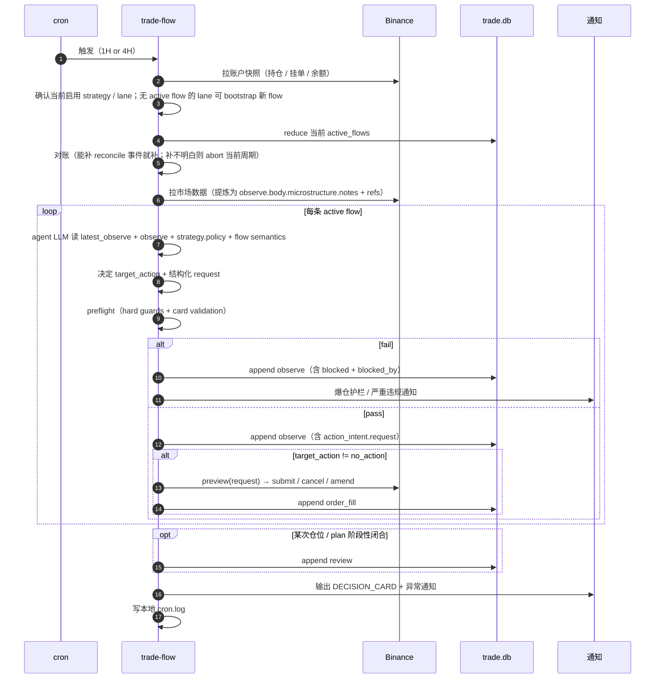

# Design Architecture

trade-flow 是套件 skill 的总入口（功能 skill 拓扑见 [skill-layout.md](skill-layout.md)）。本文是它在 plan / cron / preflight 层面的设计与 MVP 范围。

## 设计哲学

- 事件流为真相、自然语言为主
- 流程语义直接内嵌在 flow / stage 定义里；只有少量 hard guards 走确定性代码或脚本
- decision_card 渲染 = 校验
- cron 自动巡航是主轨，user-message 是接管轨；两轨共用同一组 `plan_event` / preflight / hard guards / decision_card

## 实盘收敛原则

当前阶段不扩策略宇宙，只收紧可实盘动作的资格。任何 `target_action != no_action` 都必须同时满足：

- No tested edge, no trade：`strategy.policy` 必须有可回放 / shadow / 小资金验证记录；未验证策略只能 observe 或 shadow
- No fresh facts, no trade：账户、挂单、持仓、价格快照必须新鲜，且可追溯到 skill 输出
- No executable contract, no trade：真钱动作必须先生成 `execution_contract_snapshot`
- No stop, no trade：新增或增加风险的动作必须有明确 stop / invalidation / risk_budget
- No reconciliation, no trade：对账无法恢复时全局只允许 `no_action` 或减风险动作

agent 负责判断，skill 负责事实，脚本负责硬约束，交易所事实最终覆盖本地事件流。

---

## 运行入口（cron / user-message 双轨）

trade-flow 有两条入口，共用同一套事件流和校验栈：

| 维度 | cron 主轨 | user-message 接管 |
| --- | --- | --- |
| 触发 | 调度器（快轨 5/15min、慢轨 1H/4H；快慢轨细化推迟到 cron 稳定后） | 用户消息 → ROUTER |
| 起点 | 必跑对账 → observe | 默认信任 `latest_observe`；若已过 `G-OBS-FRESH` 阈值则回灌对账 |
| 终点 | append observe（含意图段 + action_intent + 证据段 + preflight_result） + 可能 order_fill + 可能 review | 同左 |
| 共用契约 | `action_intent.request` / preflight / hard guards / DECISION_CARD | 同左 |
| 差异 | 默认遍历 active flows + lane scan | 默认只动 ROUTER 选中的那条 flow |

不写两套主流程：user-message 经 ROUTER 进入某个 stage 后，stage 内逻辑、事件 shape、preflight 与 cron 完全一致。下面 `## 一轮 cron` 描述的是主轨；user-message 入口只是跳过对账和遍历，直落对应 stage。

---

## ROUTER

只在 user-message 入口存在；cron 主轨默认进 `observe`，不经过 ROUTER。

- **不入 DB**，是 `trade-flow/SKILL.md` 里的路由分支
- **输入**：user message + `latest_observe.action_intent` + `last_preflight` + `active_flows` 概览（symbol / side / direction_state / execution_verdict）
- **输出**：本轮先进入哪个 stage；若进入 `observe`，再标出运行形态

路由优先级（自上而下，首条命中即定）：

| 触发特征 | 路由 |
| --- | --- |
| `latest_observe` 已过 `G-OBS-FRESH` 阈值，或意图不明 | `observe` |
| 明确执行确认（"挂"/"撤"/"改"/"现在下"） | `execute` |
| 持仓追问（"继续拿"/"减一点"/"还看多吗"/"现在怎么办") | `plan` |
| 阶段性闭合追述（"刚平了"/"为什么这单亏"/"复盘下"） | `review` |

ROUTER 选定 stage 后即移交，不再回流；stage 内若发现上下文不足，按 flow semantics 自行决定是否回到 `observe`。

---

## 并发与写入约定

`plan_event` append-only；不实现 per-lane / per-flow 锁。安全性来自三层 invariant：

1. **append-only**：不存在覆盖写，最差是事件链多一两条 observe，后续 tick 复盘可见
2. **idempotent execute**：`clientOrderId` 派生自 action，Binance 自动去重；同一动作被 cron / user-message 并发派发只成单一次
3. **每个入口先 reduce latest**：cron tick 与 user-message 进入时都先重读 latest event，不共享内存状态

最差并发场景：cron 派 cancel、user-message 同时派 sync_protection。两单都合法 → 都进 Binance → 下一 tick reduce 真实订单状态自动恢复。不绕过 hard guard，最多多一次往返。

写入 `plan_event` 加一道 **process-level mutex**（SQLite `BEGIN IMMEDIATE` 或单文件锁），保证 daemon 和 user-message CLI 不会写出半截事件。仅此。

---

## 数据模型

```
plan_event
  event_key   PK
  chain_id           -- 事件归属（当前语义就是 flow_id；沿用旧字段名）
  kind               -- observe | order_fill | review
  body_json
  created_at
  INDEX (chain_id, created_at)
  INDEX (kind, chain_id)    -- 加速 review event 检索（state 推断）
```

本阶段先把身份拆成三层：`strategy` 是规则模板；`lane` 是某个 strategy 在某个 `symbol + side` 上的运行槽位；`flow` 是一笔具体机会 / 暴露从 observe 到闭合的生命周期。表结构里沿用 `chain_id` 字段名，但语义上就是 `flow_id`。MVP 的 lane 先用 `strategy_ref + symbol + side` 读时定位，不单独建表。跨 symbol / 跨 side 可并行，因为它们属于不同 lane；同一 lane 任一时刻最多只维护 1 条 active flow。数据库里同时存在多条历史 / 活跃 flow，不假设系统只有一条最新主流。

- **创建 flow**：某 lane 当前无 active flow，且本轮识别到值得跟踪的新 setup 时，trade-flow 生成 UUID，写进 first observe 的 `plan_event.chain_id`
- **延续 flow**：同一笔机会 / 持仓仍在管理时，后续 cron 都沿用同一 `chain_id` append 新事件
- **新开 flow**：某条 flow 已阶段性闭合后，同一 lane 后续又出现新 setup，或本轮机会本质上应作为独立暴露管理时，新开 flow

完整 schema / 索引 / 落库约定见 [tech-spec.md](tech-spec.md)。

### Event kind

| kind | body | 来源 |
| --- | --- | --- |
| `observe` | 完整快照（见 ### observe.body shape） | 每轮 cron |
| `order_fill` | 订单 / 成交事件（见 ### order_fill.body shape） | EXECUTE stage |
| `review` | 阶段性复盘（见 §REVIEW → ### review.body shape） | 某次仓位 / plan 阶段性闭合时 |

### observe.body shape

```yaml
# 硬字段
symbol: BTCUSDT
side: long | short
stop_price: number
risk_budget_usdt: number          # 全档成交假设下最大允许亏损（驱动 G-RISK-OPEN-CAP / G-RISK-DAY-FLOOR）
strategy_ref: S-xxx
setup_id: text?                   # 指向 strategy policy 内的可交易 setup；live 动作必须可追溯

# 硬字段（PLAN 双层契约：方向 + 执行分离，防止被 thesis 文本吞掉）
direction_state: 偏多已确认 | 偏空已确认 | 中性 | 冲突
execution_verdict: 追 | 不追 | 等条件 | 等回踩 | 放弃
                 | 持有不动 | 减仓 | 退出

# 硬字段（可选，结构化承载关键执行价位）
stop_ladder:?                     # [{trigger_price, new_stop, reason}]
takeprofit_ladder:?               # [{price, qty_ratio, reason}] —— qty_ratio 之和 ≤ 1.0
risk_budget_change:?              # {delta_usdt, reason}（与上一条 observe 不同时必填）

# 软字段（自然语言；由 LLM 按 flow semantics + strategy.policy 解读）
thesis: text
entry_intent: text
exit_intent: text
invalidation: text
expected_rr_net: number
valid_until_at: timestamp?

# 行动意图（一次性，本轮 EXECUTE 直接消费）
action_intent:
  target_action: no_action | place_entry | cancel_order | sync_protection | adjust_position
  request:                        # target_action != no_action 时必填
    # 结构化参数；shape 由 target_action 决定，preview 解析后路由到执行 skill

# 证据段（紧凑投影，不塞原始 dump）
account:
  equity_usdt: number                  # hard guard 的 live equity
  position_state: text                 # 仅当前 flow / symbol 相关仓位摘要；无则 "flat"
  order_state: text                    # 仅当前 flow / symbol 相关挂单摘要；无则 "none"
  funding_paid_since_entry_usdt: number?
  snapshot_ref:? string                # 可选：account-snapshot 输出文件 / run_id
microstructure:
  notes: text                          # 本轮一句话到一小段提炼；原始 OHLCV / aggTrades / Roll / VPIN / 指标不入 observe
  refs:? [string]                      # 可选：market-data / indicator 输出文件或 run_id
catalyst: text?                        # 持仓窗口内 high-impact 事件；无则省略或写 "none in window"
exposure: text?                        # 同簇敞口判断（btc-beta / eth-eco / ...）
preflight_result:
  verdict: armable | blocked | abstain
  blocked_by: [{check_id, reason}]   # 任一非空 → blocked
  warnings:   [{source, reason}]     # 不阻拦但记录
decision_summary: text            # 本轮判断 / preflight / 动作意图摘要；真实执行结果见后续 order_fill
```

每条 observe 是**最小完整快照**，不是 patch；语义上分三段：`fact_snapshot`（账户 / 市场 / 订单投影与 refs）、`decision_snapshot`（thesis / entry / exit / action_intent）、`preflight_snapshot`（hard guard 与 card 校验结果）。这里的完整指“足以让 PLAN / preflight / EXECUTE 复读本轮判断”，不是把账户全量、OHLCV、aggTrades、Roll、VPIN、指标明细都复制进 DB。原始输出留在各 skill 的文件 / run_id，observe 只存当前 flow 相关投影、LLM 提炼和可追溯 refs。若只刷局部槽位，上游先合并上一版完整 observe 再 append。

`microstructure.notes` 默认只承载 market quality / execution risk：own Roll / VPIN 优先，其次 BTC / ETH Roll / VPIN 作为跨市场压力。它只能改变 `entry / stop / size / no_action`，不能单独构成方向判断或 setup 资格。

同一条 flow 可以在空仓观察、等待条件、已挂单、持仓管理之间切换；一旦这次机会已阶段性闭合，同一 lane 后续再出现新 setup 时新开 flow，不复用旧 `chain_id`。

ladder 字段是**软触发**：agent 每轮读 ladder + 当前 mark + order_fill 历史，自己决定是否发 `sync_protection` 票，preflight 不做"已触发档位"的机械 reduce。

### order_fill.body shape

```yaml
sub_kind: submit | cancel | amend | fill | partial_fill
client_order_id: string             # <chain_id>-<seq>-<action>
exchange_order_id: string?          # Binance orderId（submit ack 后才有）
symbol: BTCUSDT
side: BUY | SELL
position_side: LONG | SHORT
order_type: LIMIT | MARKET | STOP | STOP_MARKET | TAKE_PROFIT | TAKE_PROFIT_MARKET | TRAILING_STOP_MARKET
qty: number
price: number?                      # LIMIT 类必填
stop_price: number?                 # STOP_MARKET 类必填
filled_qty: number?                 # fill / partial_fill
avg_fill_price: number?             # fill / partial_fill
fee_usdt: number?                   # fill 类
funding_paid_delta_usdt: number?    # 持仓段累计 funding 增量（仅 fill 且关联仓位时）
source: trade_flow | reconcile      # 主动执行 vs 对账补录
source_observe_event_key:? string   # source=trade_flow 必填
execution_contract_snapshot:? object # source=trade_flow 必填；本次提交前的执行快照
```

`current_orders` / `current_position` reduce 时只读 `sub_kind / client_order_id / side / position_side / qty / filled_qty / avg_fill_price`；其余字段是审计 / 复盘用。`source=reconcile` 只用于“交易所事实已经发生，且本轮对账能可靠归属到当前 flow”的补录事件。Binance API 字段全集见 [tech-spec.md](tech-spec.md)。

### PLAN 与 EXECUTE 的边界

- `plan` 是持续演化的判断，不是执行票据
- EXECUTE 只读 `latest_observe.action_intent.request`，不再回头读自然语言 plan
- `preview` 是唯一执行路由器：解析 request → 生成 `execution_contract_snapshot` → 选 execute skill → 生成最终交易所请求
- 顺序固定为：PLAN/preflight 先 append 决策 observe；EXECUTE 再消费这条 latest_observe 的 `action_intent.request`；真实提交 / 撤销 / 成交结果随后 append `order_fill`
- `order_fill(source=trade_flow)` 必须引用 `source_observe_event_key` 与 `execution_contract_snapshot`，否则不算可审计执行事实

崩溃恢复：下一轮 cron 读 `latest_observe.action_intent`，若 `target_action != no_action` 但事件流无对应 `order_fill`，preflight 重跑由 LLM 决定续做或放弃。

---

## 存储

事件流落 SQLite + JSON 列，单库自用：

```sql
CREATE TABLE plan_event (
    event_key   TEXT PRIMARY KEY,             -- UUID
    chain_id    TEXT NOT NULL,
    kind        TEXT NOT NULL,                -- observe | order_fill | review
    body_json   TEXT NOT NULL CHECK(json_valid(body_json)),
    created_at  TEXT NOT NULL                 -- ISO 8601
);
CREATE INDEX idx_chain_time ON plan_event(chain_id, created_at);
CREATE INDEX idx_kind_chain ON plan_event(kind, chain_id);
```

`body_json` 用 TEXT + `json_valid` CHECK；SQLite JSON1 扩展支持 `json_extract` / expression index，可以为投影路径加索引（如 `chain_meta` 用到的 `$.symbol` / `$.strategy_ref`）。

整体存储分布：

| 内容 | 介质 | 位置 |
| --- | --- | --- |
| 事件流 | SQLite | `./data/trade.db` → `plan_event` |
| Strategy policy | Markdown（一文件一 strategy） | `.agents/skills/trade-flow/strategies/*.md` |
| Account config | JSON 文件 | `./data/account_config.json` |
| Notify config | JSON 文件 | `./data/notify_config.json` |
| Cron log | 文本日志 | `./data/cron.log` |
| OHLCV / 市场数据 | CSV + manifest（后期切 SQLite） | `./data/ohlcv/` |
| Replay / shadow / market artifact | 文件 + refs | `./data/artifacts/` 或各 skill 输出目录 |
| Strategy evidence ledger | JSONL | `./data/strategy-evidence.jsonl` |

选型原则：

- **SQLite（关系列 + JSON body）**：事件流 —— 需要按 chain_id / kind / time 索引和聚合，且每种 kind 自带 shape 不需 schema migration
- **Markdown**：strategy policy —— 人编辑 + LLM 直读
- **代码 / script**：hard guards —— 只承载确定性、必须严格遵守的校验
- **JSON 文件**：account_config / notify_config —— 静态单对象
- **CSV / log**：OHLCV / cron 运维 —— 追加型时间序列

不引入 MongoDB / 文档库：单进程 cron + MVP 体量（< 10k events/月）下 SQLite JSON1 扩展完全够用，多一套服务的运维成本不值。具体 schema / 索引 / JSON 查询模式见 [tech-spec.md](tech-spec.md)。

Artifact hygiene：

- `trade.db` 是唯一长期事实源；artifact 只是证据、缓存或人工复盘材料
- replay / shadow / market artifact 默认通过 refs 被 strategy evidence、review 或 active observe 引用
- 未引用、未 `.pin`、超过 retention 的 artifact 可由 `trade-flow --artifact-gc` 清理
- 清理默认 dry-run；删除必须显式 `--yes`
- `.db / .sqlite / .sqlite3` 不进入 artifact GC 删除范围

Strategy iteration：

- replay / shadow / live-small / review_batch 证据写入 JSONL ledger，不新增 `plan_event.kind`
- 每条 evidence 绑定 strategy `policy_hash`
- `policy_hash` 不包含 status；只改状态不让证据失效，改规则正文 / 名称 / tags 会让旧证据 stale
- replay evidence 必须包含 OOS / walk-forward anti-overfit proof；没有样本外证据不得升 `shadow`
- search budget 和参数数量是硬约束，防止“调到刚好过关”
- `strategy-review` 汇总 fresh / stale evidence、DB review stats 和 promotion gate
- `strategy-promote` 只改 frontmatter `status`；默认 dry-run，实改必须 `--yes`
- 自动挖矿、自动参数搜索、自动升格仍不进入当前系统

---

## OBSERVE 运行形态

OBSERVE 只服务两个问题：刷新已有 flow，或识别一个新 setup 是否值得进入 shadow / live-small。产物都是同一种 `observe` event。

| 形态 | 触发来源 | checklist 重点 | 写入策略 |
| --- | --- | --- | --- |
| `single-symbol` | user 指定标的 / cron 在已有 active flow 上刷新 | 该 lane 的市场快照 + 账户事实 + 微结构 + 策略匹配证据 | 命中 lane 已有 active flow → 沿用 `chain_id` append；无则 bootstrap 新 flow |
| `monitor-existing-chain` | cron 默认 | 遍历当前 `active_flows`，逐条刷新 latest_observe + 重判 `direction_state` / `execution_verdict` | 每条 active flow 各 append 一条 observe；不 bootstrap |

全市场扫描只允许产出候选，不直接进入 live action；候选必须回到 `single-symbol`，并通过 setup 资格证。

OBSERVE 不要求所有 lane 同频更新；本轮未命中的 lane 这一轮不写 observe，不视为 stale。

---

## Flow Semantics

流程语义直接内嵌在主流程、stage 文档和 strategy policy 的解释口径里。

### MVP 固定语义

- `valid_until_at` 已过期：当前 setup 失效，不再继续执行；若已有挂单，应进入撤单或放弃分支
- `invalidation` 已触发：当前 thesis 不得继续推进；若已有挂单，优先撤单；若已有仓位，优先进入保护或退出分支
- `current_position != 0`：当前流的工作重点从 entry 转向 `exit_intent + thesis` 管理，不把持仓语境和空仓语境混在一起
- `review` 记录某条 flow 的闭合样本；关闭的是 flow，不是 lane，更不是 strategy
- 上轮 `target_action != no_action` 但无对应 `order_fill`：下一轮必须重读最新语境再决定续做或放弃，不机械重放旧动作
- `direction_state` 与 `execution_verdict` 是两层判断，不互相吞：`偏多已确认 + 不追` / `中性 + 持有不动` 等组合都是合法输出；不允许因为"不追"就把方向写成"中性"，也不允许因为"方向成立"就反推必须有执行动作
- 微观结构压力只优先影响执行层：例如 `偏多已确认 + 不追`、`偏多已确认 + 等回踩`、`偏多已确认 + 缩小 size` 都合法；除非 strategy.policy 明确把它写成 regime / no_trade 条件，否则不改写方向层

与 funding、跨策略相关性、场景过滤有关的判断，当前不升格为全局阻断项。若确有 edge，优先写回各自的 `strategy.policy`，或只做提示，不做全局 blocking。

## Hard Guards

hard guard 只保留三类特征同时成立的约束：

- 很重要，违背后会直接放大账户层风险或造成脏状态
- 可以确定性计算，不依赖 LLM 主观解释
- 适合落成代码或脚本，并输出固定结构结果

MVP 先固定以下几项：

| Check ID | 标题 | 说明 |
|---|---|---|
| `G-RISK-OPEN-CAP` | 成交后总 open risk 不超预算 | 账户级硬上限 |
| `G-RISK-DAY-FLOOR` | 今日累计亏损不穿底 | 账户级硬下限 |
| `G-OBS-FRESH` | observe 距 now ≤ 30s | 防止拿过期快照执行 |
| `G-PLAN-INTENT-COMPLETE` | thesis / entry_intent / exit_intent / invalidation 必填非空 | 防止半成品 plan 落执行 |
| `G-PLAN-VERDICT-COMPLETE` | direction_state / execution_verdict 必填且取值合法 | 防止 PLAN 双层契约被文本吞掉 |
| `G-SETUP-LIVE-PERMISSION` | setup 已获 live-small 资格 | 防止未验证 setup 动真钱 |
| `G-KILL-SWITCH` | runtime health 允许新增风险 | 统一处理对账 / API / 亏损 / 事件窗口刹车 |
| `G-STOP-LADDER-MONOTONIC` | stop_ladder 单调 | 结构化止损推进卫生 |
| `G-TP-LADDER-RATIO-CAP` | takeprofit_ladder.qty_ratio 之和 ≤ 1.0 | 防止止盈超配 |

hard guard 用脚本或代码实现，语言和路径在实现时再定；当前只固定口径，不提前固定具体实现目录。

### 爆仓护栏（G-RISK-OPEN-CAP / G-RISK-DAY-FLOOR）

代码兜底，单测保证。任何新挂单/加仓必须同时通过：

```
G-RISK-OPEN-CAP:
  sum(risk_budget_usdt for active plans ∪ {candidate})
    + current_account_open_risk_usdt
  ≤ equity_live × account.max_open_risk_pct

G-RISK-DAY-FLOOR:
  realized_pnl_today_usdt
    + sum(unrealized_loss_at_stop for active plans)
    - candidate.risk_budget_usdt
  ≥ -(equity_live × account.max_day_loss_pct)
```

`equity_live = latest_observe.account.equity_usdt`，来自最近账户快照，不来自配置文件。

这两条不让 LLM 介入 —— 是自动化 cron 的最后安全网。

### preflight 执行（实现细节）

preflight 收成两步：

1. LLM 读 `current_plan + latest_observe + strategy.policy`，按 flow semantics 收敛本轮动作
2. 运行 hard guard 脚本，产出结构化 `blocked_by / warnings`

任一 hard guard 失败，或 DECISION_CARD 渲染发现关键字段缺失 → preflight verdict = blocked，本轮拒新动作。

### 复盘聚合

review 阶段按 `blocked_by[].check_id` group by，自然得到"哪项 hard guard 最常挡住动作 / 哪项可能过严 / 哪些问题其实该回到 strategy.policy 或 flow semantics 解决"。

---

## ACCOUNT_CONFIG

唯一硬配置：`./data/account_config.json`

| 字段 | 必填 | 说明 |
| --- | --- | --- |
| `max_open_risk_pct` | 是 | G-RISK-OPEN-CAP 公式分母 |
| `max_day_loss_pct` | 是 | G-RISK-DAY-FLOOR 公式分母 |
| `max_consecutive_losses` | 否 | 连续亏损上限；触发后通知冷却 |

缺文件、缺必填、`latest_observe.account.equity_usdt` 缺失 → preflight 直接拒所有新动作。

跨策略相关性与同簇敞口，当前不作为 MVP 硬配置；需要时先回到具体 strategy policy 或后续独立设计。

---

## Strategy 池

Strategy 是 `observe.body.strategy_ref` 指向的对象。strategy 是规则模板，不是 flow 身份。一个 strategy 可以在不同 symbol / side 上展开多个 lane；MVP lane 先用 `strategy_ref + symbol + side` 读时定位。每个 lane 同时最多 1 条 active flow；同一 lane 的旧 flow 闭合后，后续再出现新机会时新开 flow。更复杂的同 lane 多重重入不作为当前默认管理模型；是否支持同 symbol 双向同时并行，等真实需求出现再单独设计。MVP 2 条种子（`S-GENERIC-TREND` / `S-GENERIC-MEANREVERT`），完整 policy 落 [.agents/skills/trade-flow/strategies/](../.agents/skills/trade-flow/strategies/)。schema 见 [tech-spec.md](tech-spec.md)。

策略状态只承载 `draft / shadow / live-small / paused` 四态，不引入版本分支管理。`draft` 只能分析；`shadow` 可生成 action_intent 但不得真实执行；`live-small` 才允许小资金实盘；`paused` 只允许观察和减风险。

### Setup 入场资格

可交易对象不是整份 strategy，而是 strategy 内的 `setup_id`。任何 live action 必须能追溯到一个 setup，且 setup 至少声明：

- `hypothesis`：为什么这类机会有 edge
- `regime`：适用市场环境；不适用环境默认 no_action
- `entry_rule / stop_rule / no_trade_conditions`
- `size_policy`：如何把风险预算落到数量
- `evidence_ref`：回放、shadow 或小资金样本引用
- `live_permission`：`draft | shadow | live-small | paused`

没有 setup 资格证，agent 可以写 thesis，但不得把 `execution_verdict` 收敛为真钱动作。

### 信号准入

信号准入规则：任何分析只有能改变 `entry / stop / size / no_action` 四者之一，才允许进入 `action_intent`。不能改变这四项的内容，只能进入 notes / refs，不参与真钱动作。

指标、新闻、宏观、盘口、清算区都只是证据来源；它们不直接构成交易理由。交易理由只能落到 setup 的 entry / stop / size / no_action。

---

## 投影视图（读时计算）

| 视图 | 实现 |
| --- | --- |
| `flows` | `SELECT chain_id, MIN(created_at) AS bootstrapped_at, MAX(created_at) AS last_event_at FROM plan_event GROUP BY chain_id` |
| `lane_index` | latest `observe.body` 投影出的 `strategy_ref / symbol / side` 组合；MVP 每 lane 同时最多 1 条 active flow |
| `active_flows` | 当前启用 lane 上未闭合的 flow；由 strategy 配置 + lane 扫描结果决定，不再把 strategy 直接当 flow |
| `flow_meta(flow_id)` | latest `observe.body` 的 `strategy_ref / symbol / side`；`bootstrapped_at` 来自 `flows` |
| `current_plan` | 取某条 flow 最近一条 `observe.body` 的意图段字段 |
| `current_action_intent` | 取某条 flow 最近一条 `observe.body.action_intent` |
| `latest_observe` | 取某条 flow 最近一条 `observe`（含证据段） |
| `current_orders` | reduce 某条 flow 的 `order_fill` 事件到 open-orders 集合 |
| `current_position` | reduce 某条 flow 的 `order_fill` 事件到净头寸 |
| `last_preflight` | 取某条 flow 最近一条 `observe.body.preflight_result` |

下次 cron 跑直接读各条 active flow 的最新 observe，没有"标记 stale"机制。某条 flow 写入 terminal `review` 后不再参与 `active_flows`；同一 lane 后续若再出现新 setup，则新开 flow。

---

## 一轮 cron


```mermaid
sequenceDiagram
    autonumber
    participant C as cron
    participant TF as trade-flow
    participant BN as Binance
    participant DB as trade.db
    participant N as 通知

    C->>TF: 触发（1H or 4H）
    TF->>BN: 拉账户快照（持仓 / 挂单 / 余额）
    TF->>TF: 确认当前启用 strategy / lane；无 active flow 的 lane 可 bootstrap 新 flow
    TF->>DB: reduce 当前 active_flows
    TF->>TF: 对账（能补 reconcile 事件就补；补不明白则 abort 当前周期）
    TF->>BN: 拉市场数据（提炼为 observe.body.microstructure.notes + refs）

    loop 每条 active flow
        TF->>TF: agent LLM 读 latest_observe + observe + strategy.policy + flow semantics
        TF->>TF: 决定 target_action + 结构化 request
        TF->>TF: preflight（hard guards + card validation）
        alt fail
            TF->>DB: append observe（含 blocked + blocked_by）
            TF->>N: 爆仓护栏 / 严重违规通知
        else pass
            TF->>DB: append observe（含 action_intent.request）
            alt target_action != no_action
                TF->>BN: preview(request) → submit / cancel / amend
                TF->>DB: append order_fill
            end
        end
    end

    opt 某次仓位 / plan 阶段性闭合
        TF->>DB: append review
    end

    TF->>N: 输出 DECISION_CARD + 异常通知
    TF->>TF: 写本地 cron.log
```

---

## DECISION_CARD

每轮 cron 输出 6 行扫读视图，从 `current_plan + latest_observe + strategy` 实时渲染，不存库。ASCII 模板见 [.agents/skills/trade-flow/SKILL.md](../.agents/skills/trade-flow/SKILL.md)。

第 1 行（Verdict 行）独立承载 PLAN 双层契约：`direction_state` 与 `execution_verdict` 并列显示，不再揉进 thesis；其余 5 行承载 symbol/side/价位、保护、风控、checks、snapshot age。

渲染约定：

- `valid_until_at < now` → Plan 行标红，按 flow semantics 直接视为当前 setup 失效
- snapshot age > 20s 黄、> 30s 红（红色触发 `G-OBS-FRESH` 拒）
- Checks 行 `blocked_by` 非空 → 卡片拒绝渲染为"可执行"，本轮跳过 EXECUTE
- Verdict 行任一字段缺或取值非法 → 触发 `G-PLAN-VERDICT-COMPLETE`，卡片拒绝渲染为"可执行"

**渲染 = 校验**：硬字段缺导致卡片渲染不出来，preflight 直接拒；双层契约缺位等同此条。

---

## 对账

币安账户接口是 ground truth，`plan_event` 是 staging。每次 cron 周期开始时跑对账器：

1. `binance-account-snapshot` 拉当前持仓 + 挂单
2. reduce 当前 active flows 的 `order_fill` 得 `current_orders` / `current_position`
3. 必要时补读 symbol-scoped 历史订单 / 成交，尝试把缺失事实补写成 `order_fill(source=reconcile)`
4. 再 reduce 一次 flow 状态
5. 若仍无法可靠归属到当前 flow，就 abort 当前周期并通知人工；不额外持久化专门差异字段

MVP 不把“对账失败”设计成单独的持久状态字段，也不为它再加一层专门 hard guard。对账只是 cron 入口的恢复步骤：能恢复成 event 就继续，恢复不了就把本轮当作一次恢复失败处理。

---

## Kill Switch / Cool-down

Kill switch 是执行资格，不是策略观点。触发后不改写 strategy，只限制本轮可执行动作：

| 触发 | 行为 |
| --- | --- |
| 对账无法恢复 | 全局 `no_action`，通知人工 |
| Binance API / cron 连续失败 ≥ 3 次 | 暂停新增风险，只允许减风险动作 |
| 日亏损接近 `max_day_loss_pct` | 只允许减仓 / 平仓 / 撤风险单 |
| 某 lane 连续 N 次 `loss` 或 setup 失效 | lane 进入 `paused`，等待人工 review |
| 重大事件窗口且 strategy 未明确允许 | 禁新仓，只观察或减风险 |

这些规则应优先落在 preflight / cron 入口脚本；LLM 可以解释原因，但不能放行。

---

## REVIEW（阶段性复盘）

输入是同一条 flow 在闭合前后的完整 `plan_event` 切片。`review` 用来总结一段已完成的持仓 / plan，并作为该 flow 的 terminal event。

### review.body shape

```yaml
outcome: win | loss | breakeven | abandoned
pnl_pct: number                 # 实际盈亏百分比
thesis_held: boolean            # thesis 入场判断是否维持成立
key_lesson: text                # 一句话
promote_to_strategy: boolean    # 是否值得抽成新 strategy
notes: markdown?                # 自由 markdown：cost vs expected / signal accuracy / 其他
```

单条 flow 默认写 1 条 terminal `review`。同一 lane 可以随着多条历史 flow 累积多条 `review`。REVIEW 是闭合样本，不自动升级策略。

REVIEW 进入策略迭代的路径：

```text
plan_event.review
  -> strategy-review 聚合为 review_batch stats
  -> strategy policy 人工修改
  -> policy_hash 变化
  -> replay / shadow 重新验证
  -> strategy-promote dry-run / --yes
```

任何 review 只能生成待验证假设；不能绕过 replay / shadow gate。

---

## 失败兜底

**幂等**：每个 EXECUTE 动作前先检查交易所当前状态，重复请求不下重单。`clientOrderId` 由本轮 action 派生，Binance 侧自动去重。

**中途挂掉**：cron 任意阶段失败 → abort → 只 append 已写入的 observe。下次 cron 重跑读最新事件流决定动作。**默认偏保守**：不确定就啥也不做。

**异常通知**（配置在 `./data/notify_config.json`，缺则只写本地日志）：

- 关键 hard guard 拒新动作
- cron / preflight / Binance API 持续失败（含对账恢复失败）
- 重大 PnL 事件（接近 daily loss floor / 连续亏损达上限）

具体阈值见 [tech-spec.md](tech-spec.md)。

---

## 执行层

读写分离：`binance-account-snapshot` 只读；下单走 trade-flow → preview → 执行 skill 的单一路径。详细约束（主单 / algo 单 / 预检 / clientOrderId 规则）见 [tech-spec.md](tech-spec.md)。

---

## Market Data

详细设计见 [market-data-design.md](market-data-design.md)。当前只按需取能影响 `entry / stop / size / no_action` 的数据：

| Skill | 回答什么 |
| --- | --- |
| `ohlcv-fetch` | 多周期 K 线 |
| `binance-symbol-snapshot` | 当前状态 |
| `binance-market-scan` | 全市场粗筛 |
| `binance-aggtrades-fetch` | 成交流原材料 |
| `tech-indicators` | 结构、指标、轻量 Roll / VPIN 统计 |
| `binance-account-snapshot` | 账户持仓 / 挂单 / 余额（只读） |
