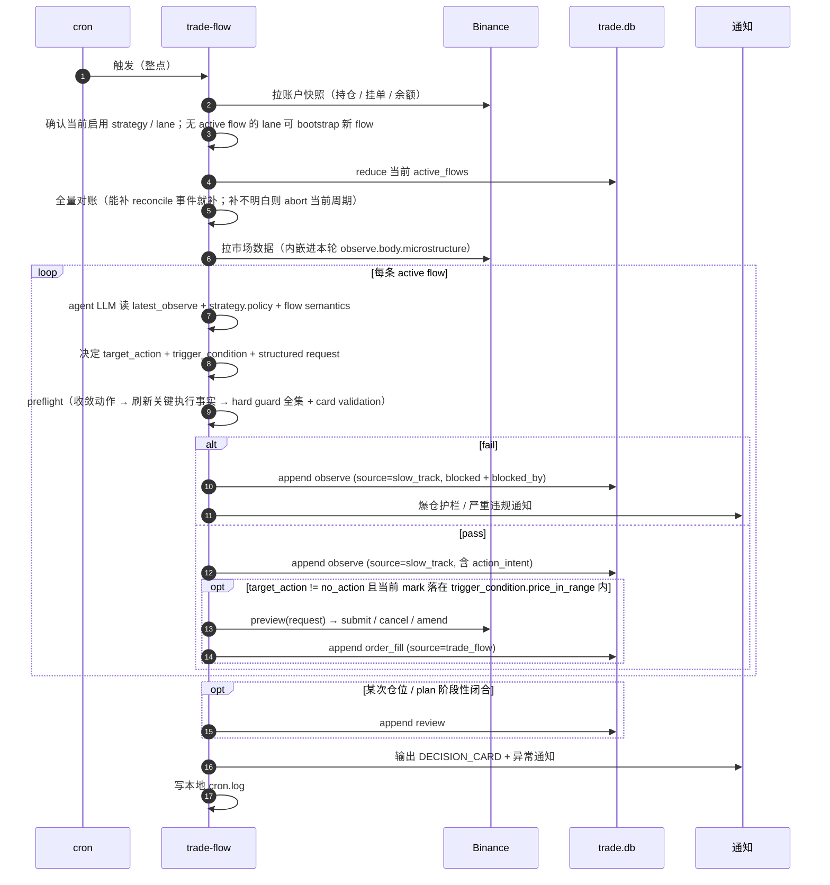

# Design Architecture

trade-flow 是套件 skill 的总入口（功能 skill 拓扑见 [skill-layout.md](skill-layout.md)）。本文是它在 plan / cron / preflight 层面的设计与 MVP 范围。

## 设计哲学

- 事件流为真相、自然语言为主
- 流程语义直接内嵌在 flow / stage 定义里；只有少量 hard guards 走确定性代码或脚本
- decision_card 渲染 = 校验
- 双轨：慢轨拥有战略层（thesis / direction / risk），快轨守护执行层（条件触发 / 防御性补救）；两轨通过事件流通信，没有专门的共享状态

---

## 双轨

trade-flow cron 分两条轨道：

| | 慢轨 | 快轨 |
|---|---|---|
| 频率 | 1H / 4H | 5m / 15m |
| 触发时机 | 整点 | 偏移触发（如 :05/:20/:35/:50），避开慢轨 LLM 推理窗口 |
| LLM 范围 | 完整：读 plan + market + strategy.policy + flow semantics | 窄域：只回答 "当前微观快照下，是否应执行 latest action_intent" |
| 写 `observe` | 完整 observe（含 thesis / action_intent / 全部硬字段） | light observe（thesis 段继承慢轨；execution context 自采） |
| 写 `order_fill` | 是 | 是 |
| 写 `review` | 是 | 否 |
| 可发起的 `target_action` | 全集 | 仅白名单：`cancel_order` / `sync_protection` / `no_action` / 慢轨预设 trigger_condition 触发的 `place_entry` 或 `adjust_position` |
| 对账范围 | 入口跑全量对账 | 仅对当前要操作的 flow 做轻量对账（fresh account + symbol-scoped open orders） |

**通信完全通过 plan_event 事件流**：快轨读慢轨写的 latest observe（拿 thesis + action_intent），慢轨读快轨写的 order_fill 和 light observe（知道窗口内发生了什么）。两轨不共享专门字段。

`trigger_condition` 是两轨之间的共同执行接口：慢轨写、慢轨/快轨都按它执行。

### 共同 executor

慢轨/快轨执行 action_intent 走完全一致的路径：

1. 读 latest action_intent 的 `trigger_condition`
2. 检查当前 mark 是否落在 `price_in_range` 内 + 未过 `valid_until_at`
3. 检查 `current_orders + current_position`，意图已实现则跳过（幂等）
4. 跑当前轨道的 preflight 子集
5. 通过 → preview → 下单 → 写 `order_fill`；不通过 → skip

慢轨写完 observe 后直接调一次 executor（mark 几乎肯定还在 range 内，相当于"立刻执行"）；行情快速跑出 range 时自然 skip，等快轨追。

### 快轨写权限边界

- **加暴露方向**（`place_entry` / `adjust_position` 加仓段）必须有慢轨预设的 `trigger_condition` 授权；快轨不能主动发起
- **防御方向**（`cancel_order` / `sync_protection` / `adjust_position` 减仓段）快轨可以自主发起
- thesis / entry_intent / exit_intent / invalidation / risk_budget_usdt / stop_price / ladder 段，快轨写 observe 时**必须从 latest 慢轨 observe 原样继承**，不修改

### 快轨"跳过执行"的事件粒度

| 情况 | 写不写事件 |
|---|---|
| trigger_condition 未触发（价格不在 range 或已过期） | 不写 |
| 触发 + context 验证通过 + 执行 | 写 light observe + order_fill |
| 触发 + context 验证不通过 + 跳过 | 写 light observe，`decision_summary` 记录跳过原因 |
| 轻量对账发现本地与 Binance 不一致 | 写 light observe，`decision_summary: "skipped: reconcile mismatch"`，等慢轨入口全量对账 |
| 发现 invalidation 价位被穿（防御触发） | 写 light observe + 自主发起 `cancel_order` / `sync_protection` 的 order_fill |

"context 验证"是快轨 LLM 的窄域判断：在 trigger 触发的瞬间，看 funding rate 极端 / 刚出现明显结构破坏 / 诱多诱空形态等微观红旗是否让本轮执行不安全。它不重新评估 thesis。`spread` 不再交给 LLM 口头判断，而是由 `G-SPREAD-CAP` 走确定性检查。

### 快轨自主防御触发

在 1H/4H 慢轨周期之间，快轨是 gap 窗口里唯一能动手的一方。除了"价格穿过 invalidation 价位"这条原有触发，再补两条确定性触发（不依赖 LLM）：

| 触发条件（确定性，代码判定） | 快轨自主动作 |
|---|---|
| `invalidation_price` 已写 且 mark 距离 `invalidation_price` < `\|entry_avg - stop_price\| × 0.3` 且未穿透 | `adjust_position reduce qty_ratio=0.5`；写 light observe 含 `defensive_reduced: true` 标记 |
| 同 flow 连续 ≥ 3 轮快轨写 `decision_summary` 含 `"reconcile mismatch"` | 写 light observe `decision_summary="suspended: reconcile mismatch streak"`；本 flow 后续快轨直接 skip 直至慢轨入口全量对账重置 |

幂等：`defensive_reduced: true` 标记一旦写入，同 flow 后续快轨读到该标记不再重复触发同条 proximity 减仓，避免一波震荡把仓位减到归零。`suspended` 由慢轨入口在全量对账成功时清除（写 source=slow_track observe 即视为重置）。

`invalidation_price` 未写（非价位型 invalidation）时第一条触发自动失效，不对 LLM 自然语言 invalidation 字段做提取。

---

## 数据模型

```
plan_event
  event_key   PK
  chain_id           -- 事件归属（当前语义就是 flow_id；沿用旧字段名）
  kind               -- observe | order_fill | review
  body_json
  created_at
  INDEX (chain_id, created_at)
  INDEX (kind, chain_id)    -- 加速 review event 检索（state 推断）
```

本阶段先把身份拆成三层：`strategy` 是规则模板；`lane` 是某个 strategy 在某个 `symbol + side` 上的运行槽位；`flow` 是一笔具体机会 / 暴露从 observe 到闭合的生命周期。表结构里沿用 `chain_id` 字段名，但语义上就是 `flow_id`。MVP 的 lane 先用 `strategy_ref + symbol + side` 读时定位，不单独建表。跨 symbol / 跨 side 可并行，因为它们属于不同 lane；同一 lane 任一时刻最多只维护 1 条 active flow。数据库里同时存在多条历史 / 活跃 flow，不假设系统只有一条最新主流。

- **创建 flow**：某 lane 当前无 active flow，且本轮识别到值得跟踪的新 setup 时，慢轨生成 UUID，写进 first observe 的 `plan_event.chain_id`（快轨不创建 flow——bootstrap 是战略层判断）
- **延续 flow**：同一笔机会 / 持仓仍在管理时，后续 cron（慢轨/快轨皆可）都沿用同一 `chain_id` append 新事件
- **新开 flow**：某条 flow 已阶段性闭合后，同一 lane 后续又出现新 setup，或本轮机会本质上应作为独立暴露管理时，新开 flow（仍由慢轨发起）

完整 schema / 索引 / 落库约定见 [tech-spec.md](tech-spec.md)。

### Event kind

| kind | body | 来源 |
| --- | --- | --- |
| `observe` | 完整快照（见 ### observe.body shape） | 每轮 cron |
| `order_fill` | 订单 / 成交事件（见 ### order_fill.body shape） | EXECUTE stage |
| `review` | 阶段性复盘（见 §REVIEW → ### review.body shape） | 某次仓位 / plan 阶段性闭合时 |

### observe.body shape

```yaml
# 硬字段
source: slow_track | fast_track   # 本条 observe 由哪条轨道写入
symbol: BTCUSDT
side: long | short
stop_price: number
risk_budget_usdt: number          # 该 lane 允许承担的风险上限；preflight 会结合 Binance 最新快照实时算 lane risk
strategy_ref: S-xxx

# 硬字段（可选，结构化承载关键执行价位）
stop_ladder:?                     # [{trigger_price, new_stop, reason}]
takeprofit_ladder:?               # [{price, qty_ratio, reason}] —— qty_ratio 之和 ≤ 1.0
risk_budget_change:?              # {delta_usdt, reason}（与上一条 observe 不同时必填）

# 软字段（自然语言；由 LLM 按 flow semantics + strategy.policy 解读）
thesis: text
entry_intent: text
exit_intent: text
invalidation: text
invalidation_price: number?       # 价位型 invalidation 时由慢轨 LLM 写；让快轨可做 proximity 计算
expected_rr_net: number
valid_until_at: timestamp?        # thesis 的有效窗口（不是 action_intent 的）

# 行动意图（执行接口）
action_intent:
  target_action: no_action | place_entry | cancel_order | sync_protection | adjust_position
  trigger_condition:              # target_action != no_action 时必填
    price_in_range: [low, high]   # 当前 mark 必须落在此区间，executor 才会执行
    valid_until_at: timestamp     # action_intent 自身的过期时间（与 thesis 的 valid_until_at 不同）
  request:                        # target_action != no_action 时必填
    # shape 由 target_action 决定，见 ### request shape by target_action

# 证据段
account:
  equity_usdt: number
  positions: [...]
  open_orders: [...]
  funding_paid_since_entry_usdt: number?
microstructure:                   # 当轮采集结果直接内嵌；shape 见 market-data-design.md
  notes: text?                    # agent 本轮一句话提炼
catalyst: text                    # 持仓窗口内 high-impact 事件（无则 "none in window"）
exposure: text                    # 同簇敞口判断（btc-beta / eth-eco / ...）
preflight_result:
  verdict: armable | blocked | abstain
  blocked_by: [{check_id, reason}]   # 任一非空 → blocked
  warnings:   [{source, reason}]     # 不阻拦但记录
decision_summary: text            # 本轮 cron 做了什么
```

每条 observe 是**最小完整快照**，不是 patch。若只刷局部槽位，上游先合并上一版完整 observe 再 append。

快轨写 light observe 时，`source = fast_track`，并且：
- thesis / entry_intent / exit_intent / invalidation / valid_until_at / risk_budget_usdt / stop_price / ladder / strategy_ref / symbol / side **从 latest 慢轨 observe 原样继承**
- account / microstructure / preflight_result / decision_summary 自采写新
- action_intent 仅在快轨自主发起防御动作时写新；否则继承 latest

同一条 flow 可以在空仓观察、等待条件、已挂单、持仓管理之间切换；一旦这次机会已阶段性闭合，同一 lane 后续再出现新 setup 时新开 flow，不复用旧 `chain_id`。

`stop_ladder` / `takeprofit_ladder` 是**确定性推进序列**，不是 LLM 每轮自行决定要不要执行的软意图：

- **建仓成交后**（`place_entry` 的 order_fill 写入时），executor 立刻发 `sync_protection`，在 Binance 侧 place 对应的 `STOP_MARKET`（@ `stop_price`）和 `TAKE_PROFIT_MARKET`（@ `takeprofit_ladder[0].price`，如有）。止损止盈从这一刻起活在交易所侧，与 cron 节奏无关。
- **后续每轮 cron**（慢/快轨皆可），executor 入口先跑 `G-STOP-ADVANCE` pre-check（见 §Hard Guards），读 order_fill 判断是否有档位成交，有则确定性推进下一档；无则跳过。
- **LLM 只负责写 ladder 内容**（档位在哪、reason 是什么）；ladder 的执行和推进路径不经过 LLM。

### request shape by target_action

LLM 写意图参数，executor 确定性算 qty，不依赖 LLM 自行填写数量。

```yaml
# place_entry
request:
  order_type: LIMIT | MARKET
  entries:
    - price: number?              # LIMIT 必填；MARKET 省略，executor 用当前 mark 估 qty
      risk_ratio: number          # 本笔占 risk_budget_usdt 的比例；sum ≤ 1.0
      time_in_force: GTC|IOC|FOK? # 可选，默认 GTC
  # executor 对每笔独立计算：qty_i = risk_budget_usdt × risk_ratio_i / |price_i - stop_price|

# adjust_position
request:
  direction: add | reduce
  # direction=add（需慢轨预授权 trigger_condition）
  order_type: LIMIT | MARKET?
  entries:
    - price: number?
      risk_ratio: number          # 相对 risk_budget_usdt 总量；sum ≤ 1.0
  # direction=reduce（快轨可自主发起）
  qty_ratio: number?              # 减仓比例 (0, 1.0]
  close_all: boolean?             # true 则全平，忽略 qty_ratio
  price: number?                  # LIMIT 减仓价；省略则 MARKET
  order_type: LIMIT | MARKET?

# cancel_order
request:
  scope: all | specific
  client_order_ids: string[]?     # scope=specific 时必填

# sync_protection
request:                          # 通常为空；executor 从 latest observe 读 stop_price + ladder 状态
  stop_price: number?             # 显式覆盖时填（罕见）
```

`place_entry` / `adjust_position add` 的 `risk_ratio` 基数均为 `risk_budget_usdt` 总量，不是剩余量；`G-RISK-OPEN-CAP` 管计划亏损，`G-SINGLE-POSITION-LEVERAGE-CAP` 管单条 lane 的名义暴露，两者一起兜底。

这里的先后顺序要固定：

- `stop_price` 先由 `invalidation` / 市场结构决定，不由盈亏比目标、也不由 leverage cap 反推
- `risk_budget_usdt` 只负责在既定 `entry + stop_price` 下倒推可承受的 `qty`
- `expected_rr_net` 是评估结果，不是拿来反向压缩止损的输入
- `G-SINGLE-POSITION-LEVERAGE-CAP` 只是最后一道否决型护栏：若结构性止损太近、导致同等风险预算下名义仓位过大，则本轮只能降 `risk_budget_usdt`、等更好 entry、分批，或放弃；**不能为了过 guard 机械改紧或改松止损**

### order_fill.body shape

```yaml
sub_kind: submit | cancel | amend | fill | partial_fill
client_order_id: string             # <chain_id>-<seq>-<action>
exchange_order_id: string?          # Binance orderId（submit ack 后才有）
symbol: BTCUSDT
side: BUY | SELL
position_side: LONG | SHORT
order_type: LIMIT | MARKET | STOP_MARKET | TAKE_PROFIT_MARKET | OTOCO
qty: number
price: number?                      # LIMIT 类必填
stop_price: number?                 # STOP_MARKET 类必填
filled_qty: number?                 # fill / partial_fill
avg_fill_price: number?             # fill / partial_fill
fee_usdt: number?                   # fill 类
funding_paid_delta_usdt: number?    # 持仓段累计 funding 增量（仅 fill 且关联仓位时）
source: trade_flow | reconcile      # 主动执行 vs 对账补录
```

`current_orders` / `current_position` reduce 时只读 `sub_kind / client_order_id / side / position_side / qty / filled_qty / avg_fill_price`；其余字段是审计 / 复盘用。`source=reconcile` 只用于“交易所事实已经发生，且本轮对账能可靠归属到当前 flow”的补录事件。Binance API 字段全集见 [tech-spec.md](tech-spec.md)。

### PLAN 与 EXECUTE 的边界

- `plan` 是持续演化的判断，不是执行票据
- EXECUTE 只读 `latest_observe.action_intent`（含 `trigger_condition + request`），不再回头读自然语言 plan
- `preview` 是唯一执行路由器：解析 request → 选 execute skill → 生成最终交易所请求
- 慢轨/快轨共用同一个 executor 路径（见 §双轨 → 共同 executor）

`trigger_condition` 的存在让 action_intent 既能表达"立刻执行"（窄 range + 短窗口），也能表达"等条件入场"（目标 range + 长窗口），路径完全一致。慢轨写完后立刻调一次 executor；mark 跑出 range 时自然 skip，等快轨追。

单轮中断后的恢复：若上一轮已写 `action_intent`，但本地尚无对应 `order_fill`，下一轮 cron 先以 Binance 事实为准；若发现交易所侧已经产生对应订单 / 成交，则补写 `source=reconcile` 事件，再继续本轮判断；不机械重放旧动作。

---

## 存储

事件流落 SQLite + JSON 列，单库自用：

```sql
CREATE TABLE plan_event (
    event_key   TEXT PRIMARY KEY,             -- UUID
    chain_id    TEXT NOT NULL,
    kind        TEXT NOT NULL,                -- observe | order_fill | review
    body_json   TEXT NOT NULL CHECK(json_valid(body_json)),
    created_at  TEXT NOT NULL                 -- ISO 8601
);
CREATE INDEX idx_chain_time ON plan_event(chain_id, created_at);
CREATE INDEX idx_kind_chain ON plan_event(kind, chain_id);
```

`body_json` 用 TEXT + `json_valid` CHECK；SQLite JSON1 扩展支持 `json_extract` / expression index，可以为投影路径加索引（如 `chain_meta` 用到的 `$.symbol` / `$.strategy_ref`）。

整体存储分布：

| 内容 | 介质 | 位置 |
| --- | --- | --- |
| 事件流 | SQLite | `./data/trade.db` → `plan_event` |
| Strategy policy | Markdown（一文件一 strategy） | `.agents/skills/trade-flow/strategies/*.md` |
| Account config | JSON 文件 | `./data/account_config.json` |
| Notify config | JSON 文件 | `./data/notify_config.json` |
| Cron log | 文本日志 | `./data/cron.log` |
| OHLCV / 市场数据 | CSV + manifest（后期切 SQLite） | `./data/ohlcv/` |

选型原则：

- **SQLite（关系列 + JSON body）**：事件流 —— 需要按 chain_id / kind / time 索引和聚合，且每种 kind 自带 shape 不需 schema migration
- **Markdown**：strategy policy —— 人编辑 + LLM 直读
- **代码 / script**：hard guards —— 只承载确定性、必须严格遵守的校验
- **JSON 文件**：account_config / notify_config —— 静态单对象
- **CSV / log**：OHLCV / cron 运维 —— 追加型时间序列

不引入 MongoDB / 文档库：单进程 cron + MVP 体量（< 10k events/月）下 SQLite JSON1 扩展完全够用，多一套服务的运维成本不值。具体 schema / 索引 / JSON 查询模式见 [tech-spec.md](tech-spec.md)。

---

## Flow Semantics

流程语义直接内嵌在主流程、stage 文档和 strategy policy 的解释口径里。

### MVP 固定语义

- `valid_until_at` 已过期 且 `current_position == 0`：setup 窗口关闭，撤销所有挂单，不再按此 thesis 入场
- `valid_until_at` 已过期 且 `current_position != 0`：`valid_until_at` 约束的是入场 thesis 的有效窗口，不是持仓的强制退出触发器。过期之后由两层规则约束：
  - **硬底（确定性，hard guard 兜底）**：禁止 `place_entry` / `adjust_position add`；禁止在该 flow 上推延 `valid_until_at`（想让 thesis 续命，必须先关闭原 flow 写 review，由同 lane 后续新机会出现时新开 flow，强制留下审计痕迹）；`stop_price` 必须不弱于 entry 均价（long: `stop_price ≥ entry_avg_price`；short: `stop_price ≤ entry_avg_price`）—— thesis 时间窗口关闭后，这笔交易最差只能保本。由 `G-EXPIRY-STOP-FLOOR` 校验，过期且 stop 仍在亏损区时 preflight blocked，executor 自动发起 sync_protection 把 stop 移至 entry 均价，不依赖 LLM
  - **保本之上的 tighten（软规则）**：是否进一步收紧（scratch 到 entry+1tick / 收到部分确认位 / 给市场剩余时间）由 LLM 读 strategy.policy markdown 决定；不同策略对时间止损的容忍度不同（trend 策略一般直接 scratch；mean reversion 给保本 stop 之上多留点时间），架构层不强制
  - 后续仓位仍由 stop_ladder / TP_ladder / exit_intent 自然退出，账户层风险已归零
- `invalidation` 已触发：当前 thesis 不得继续推进；若已有挂单，优先撤单；若已有仓位，优先进入保护或退出分支
- `current_position != 0`：当前流的工作重点从 entry 转向 `exit_intent + thesis` 管理，不把持仓语境和空仓语境混在一起
- `review` 记录某条 flow 的闭合样本；关闭的是 flow，不是 lane，更不是 strategy
- 上轮 `target_action != no_action` 但本地无对应 `order_fill`：下一轮先看 Binance 事实并补齐缺失事件，再决定是否继续推进，不机械重放旧动作
- `current_orders` 非空（含部分成交后的剩余挂单）：每轮 cron 读当前市场语境，动态判断剩余订单处置——价格仍在 thesis 射程内则继续等；市场已离开但入场逻辑仍成立则调整到当前合理价位；入场窗口已关闭（invalidation 触发 / valid_until_at 到期 / 市场结构已变）则撤销剩余，视已成交仓位大小决定继续管理或整体退出。**部分成交后的剩余挂单不是异常状态**，是建仓中的正常中间态，由后续 cron 正常迭代处理
- **快轨执行幂等**：每次 executor 进场前先 reduce `current_orders / current_position`，意图已实现（挂单已存在 / 持仓已建立）则跳过；clientOrderId 由 `chain_id + seq + action` 派生，Binance 侧自动去重
- **快轨写权限**：加暴露方向（`place_entry` / 加仓）必须有慢轨预设的 trigger_condition 授权才能由快轨触发；防御方向（`cancel_order` / `sync_protection` / 减仓）快轨可自主发起。两轨都不绕过 hard guards
- **快轨遇到本地与 Binance 状态不一致**：本轮该 flow 一律 skip，写 light observe 记录原因，等下一次慢轨入口的全量对账，不自行尝试补 reconcile 事件

与 funding、跨策略相关性、场景过滤有关的判断，当前不升格为全局阻断项。若确有 edge，优先写回各自的 `strategy.policy`，或只做提示，不做全局 blocking。

## Hard Guards

hard guard 只保留三类特征同时成立的约束：

- 很重要，违背后会直接放大账户层风险或造成脏状态
- 可以确定性计算，不依赖 LLM 主观解释
- 适合落成代码或脚本，并输出固定结构结果

MVP 先固定以下几项：

| Check ID | 标题 | 说明 |
|---|---|---|
| `G-RISK-OPEN-CAP` | 成交后总 open risk 不超预算 | 账户级硬上限 |
| `G-RISK-DAY-FLOOR` | 今日累计亏损不穿底 | 账户级硬下限 |
| `G-OBS-FRESH` | 提交前关键执行事实已刷新 | 防止拿陈旧账户 / 价格事实执行 |
| `G-PLAN-INTENT-COMPLETE` | thesis / entry_intent / exit_intent / invalidation 必填非空 | 防止半成品 plan 落执行 |
| `G-STOP-LADDER-MONOTONIC` | stop_ladder 单调 | 结构化止损推进卫生 |
| `G-TP-LADDER-RATIO-CAP` | takeprofit_ladder.qty_ratio 之和 ≤ 1.0 | 防止止盈超配 |
| `G-STOP-ADVANCE` | stop / tp ladder 确定性推进 | 读 order_fill 判断当前档位是否已成交；是则自动 place 下一档，慢/快轨都跑，不经 LLM |
| `G-STOP-SYNC` | stop_price 有实物止损单兜底 | 持仓非零时，Binance 侧必须存在与 `stop_price` 匹配的 STOP_MARKET；缺失或价位偏移则自动 sync_protection |
| `G-EXPIRY-STOP-FLOOR` | thesis 过期后强制保本 stop | `latest_observe.valid_until_at < now` 且 `current_position != 0` 时，`stop_price` 必须不弱于 entry 均价（long: `stop_price ≥ entry_avg_price`；short: `stop_price ≤ entry_avg_price`）；不满足则 preflight blocked，且 executor 自动发起 sync_protection 把 stop 移至 entry 均价，不依赖 LLM |
| `G-ENTRY-RATIO-CAP` | entries risk_ratio 总和 ≤ 1.0 | place_entry / adjust_position add 的 entries[].risk_ratio 之和不超 1.0，防止超配 risk_budget |
| `G-SINGLE-POSITION-LEVERAGE-CAP` | 单 lane / 单持仓名义价值上限 | 只拦加暴露；`lane_notional_after_action_usdt / equity_live` 不得超过 `account.max_single_position_leverage` |
| `G-SPREAD-CAP` | 快轨立即执行时的盘口摩擦上限 | 只拦加暴露的立即执行；同时看绝对 spread 和 spread 相对 stop 距离的占比 |
| `G-RISK-DIRECTION-CAP` | 方向性敞口上限 | 始终启用；按 lane.side 分别汇总 lane_risk_usdt，任一方向超 `max_long_risk_pct` / `max_short_risk_pct` 则 blocked。两字段缺省值都 = `max_open_risk_pct`（不强制方向收紧但 guard 始终在跑）；多 lane 同向场景应显式收紧到更严格值 |

hard guard 用脚本或代码实现，语言和路径在实现时再定；当前只固定口径，不提前固定具体实现目录。

### 爆仓护栏（G-RISK-OPEN-CAP / G-RISK-DAY-FLOOR）

代码兜底，单测保证。每轮 preflight 都先基于 Binance 最新快照 + 各 active lane 当前 plan，实时算出每条 lane 的 `lane_risk_usdt`；账户层只做一次汇总。任何新挂单/加仓必须同时通过：

```
G-RISK-OPEN-CAP:
  account_open_risk_after_action_usdt
  ≤ equity_live × account.max_open_risk_pct

G-RISK-DAY-FLOOR:
  realized_pnl_today_usdt
    + account_open_risk_after_action_usdt
  ≥ -(equity_live × account.max_day_loss_pct)
```

`equity_live = latest_observe.account.equity_usdt`，来自最近账户快照，不来自配置文件。

其中：

- `lane_risk_usdt`：某条 active lane 若按当前 `stop_price` 被打掉，此刻会亏多少；每轮都按 Binance 最新快照实时重算
- `account_open_risk_after_action_usdt`：执行本轮动作后，所有 active lane 的 `lane_risk_usdt` 汇总值

`risk_budget_usdt` 是单条 lane 的风险约束，不再和账户实时 open risk 并排相加，避免同一份风险被算两次。

这两条不让 LLM 介入 —— 是自动化 cron 的最后安全网。

`lane_risk_usdt` 假设 stop 按 `stop_price` 成交。极端行情下（gap / 流动性枯竭 / 连续穿透）实际成交价可能更差，`risk_budget_usdt` 与爆仓护栏是风险预算与结构约束，不是最大亏损保证。`account.stop_price_protect` 控制 Binance STOP_MARKET 是否启用 `priceProtect`：`false`（默认）保证退出但容忍坏成交价，`true` 在极端偏离时拒绝执行让仓位继续承担风险。MVP 选 `false`，承认 gap 风险，由 `max_open_risk_pct` 的账户层冗余吸收尾部。

### 单持仓杠杆护栏（G-SINGLE-POSITION-LEVERAGE-CAP）

MVP 先不上账户级 gross exposure cap。第一版只限制**单条 lane 的最大名义暴露**，目的是防止窄止损把 `qty` 放得过大；同时不因为多条远价挂单或对冲腿并存而过度保守。

它不是“止损距离生成器”。交易逻辑上，先有结构性失效位，再有仓位大小；不是先定一个允许杠杆，再倒逼 `stop_price` 贴近或远离入场位。

```
G-SINGLE-POSITION-LEVERAGE-CAP:
  lane_notional_after_action_usdt
  ≤ equity_live × account.max_single_position_leverage
```

其中：

- `lane_notional_after_action_usdt` 只看当前 lane，不跨 lane 汇总
- 已有 `current_position` 按最新 mark 计 notional
- 当前 lane 已活跃但尚未成交的加暴露挂单，按各自挂单价 / trigger 价计 notional
- 本轮 request 新增的加暴露部分：`LIMIT` 按 `price`，`MARKET` 按当前 mark 估 notional
- `reduce_only` / `cancel_order` / `sync_protection` / stop / takeprofit 保护单不计入
- 这条 guard 只拦 `place_entry` 与 `adjust_position add`；减仓与保护动作不受其阻断

它不是账户级 gross exposure cap：不会因为另一条 lane 已有多空腿，就直接把当前 lane 卡死。跨 lane 组合暴露仍留给后续版本处理。

### 执行摩擦护栏（G-SPREAD-CAP）

`spread` 属于执行质量问题，不属于 thesis 对错。MVP 先把它从快轨 LLM 的窄域判断里拆出来，改成确定性护栏。

它只在**快轨 + 加暴露 + 立即执行**场景生效：

- `place_entry` / `adjust_position add`
- `order_type = MARKET`
- 或 `LIMIT` 但当前已是可立即成交的 marketable limit：
  - long：`limit_price >= best_ask`
  - short：`limit_price <= best_bid`

它**不阻断**以下场景：

- 被动 `LIMIT` 挂单（只是挂在队列里等，不立刻吃 spread）
- `reduce_only` / `cancel_order` / `sync_protection`
- 任何减仓、止损、止盈、防御动作

先取 live top-of-book：

```text
mid = (best_bid + best_ask) / 2
spread_pct = (best_ask - best_bid) / mid
spread_bps = spread_pct × 10_000

entry_ref =
  MARKET           -> current mark
  marketable LIMIT -> request.price

stop_distance_pct = abs(entry_ref - stop_price) / entry_ref
spread_to_stop_ratio = spread_pct / stop_distance_pct
```

MVP 先固定两条代码默认阈值，不进 `account_config`：

- `spread_bps <= 15`
- `spread_to_stop_ratio <= 0.10`

也就是：盘口绝对不能太烂，同时 spread 也不能吃掉太多结构性止损空间。

guard 语义：

- 任一条件超限 → `verdict=blocked`
- 写 light observe，`decision_summary="fast_blocked: spread cap"`
- `blocked_by[].check_id = G-SPREAD-CAP`
- 不调用 LLM context 验证，不浪费推理窗口

这条规则不是用来挑 thesis，只是阻止“此刻硬追进去的执行摩擦已经明显不划算”。若后续真实样本显示某类 symbol / strategy 经常被误挡，再考虑把阈值提升为 `strategy.policy` 可覆盖项；MVP 先固定代码默认值，避免过早设计新配置层。

### preflight 执行（实现细节）

慢轨 preflight 四步：

1. **executor pre-check**（LLM 之前）：跑 `G-STOP-ADVANCE` + `G-STOP-SYNC` + `G-EXPIRY-STOP-FLOOR`，检查 stop / tp ladder 推进、止损单同步、过期保本 floor；有动作则直接执行，写 order_fill，不等 LLM
2. LLM 读 `current_plan + latest_observe + strategy.policy`，按 flow semantics 收敛本轮动作
3. 若 `target_action != no_action`，提交前刚刷新一遍关键执行事实：`account / positions / open_orders / 当前 mark`
4. 运行 hard guard 全集，产出结构化 `blocked_by / warnings`

快轨 preflight（轻量子集）：

1. **executor pre-check**（LLM 之前）：同慢轨，跑 `G-STOP-ADVANCE` + `G-STOP-SYNC` + `G-EXPIRY-STOP-FLOOR`；有动作则直接执行
2. 刷新关键执行事实：`account / positions / open_orders / 当前 mark / best_bid / best_ask`
3. 若本轮属于"加暴露的立即执行"场景，先跑 `G-SPREAD-CAP`；失败则直接 blocked
4. LLM 在窄域 prompt 下做 context 验证（"现在动手是否安全"），只看 funding / 微观结构红旗，不重做 thesis 推理
5. 只跑其余执行安全护栏与新鲜度检查：**`G-RISK-OPEN-CAP` / `G-RISK-DAY-FLOOR` / `G-SINGLE-POSITION-LEVERAGE-CAP` / `G-OBS-FRESH`**；plan 结构类（`G-PLAN-INTENT-COMPLETE` / `G-STOP-LADDER-MONOTONIC` / `G-TP-LADDER-RATIO-CAP`）由慢轨在写 plan 时已校验，快轨不重跑

任一 hard guard 失败，或 DECISION_CARD 渲染发现关键字段缺失 → preflight verdict = blocked，本轮拒新动作。

### 复盘聚合

review 阶段按 `blocked_by[].check_id` group by，自然得到"哪项 hard guard 最常挡住动作 / 哪项可能过严 / 哪些问题其实该回到 strategy.policy 或 flow semantics 解决"。

---

## ACCOUNT_CONFIG

唯一硬配置：`./data/account_config.json`

| 字段 | 必填 | 说明 |
| --- | --- | --- |
| `max_open_risk_pct` | 是 | G-RISK-OPEN-CAP 公式分母 |
| `max_day_loss_pct` | 是 | G-RISK-DAY-FLOOR 公式分母 |
| `max_single_position_leverage` | 是 | G-SINGLE-POSITION-LEVERAGE-CAP 公式分母；限制单 lane / 单持仓最大名义暴露 |
| `max_long_risk_pct` | 否（缺省 = `max_open_risk_pct`） | G-RISK-DIRECTION-CAP 多头方向上限。缺省值不收紧账户层 cap，但 guard 始终启用，schema 与代码不再分"启用/不启用"两态。多 lane 同向跑时应显式收紧（如 `max_open_risk_pct × 0.7`） |
| `max_short_risk_pct` | 否（缺省 = `max_open_risk_pct`） | 同上，空头方向上限 |
| `stop_price_protect` | 否（缺省 `false`） | Binance STOP_MARKET 的 `priceProtect`。`false` 保证退出但容忍坏成交价（swing 默认）；`true` 在极端偏离时拒绝执行让仓位继续承担风险。见爆仓护栏段的 Gap 风险声明 |

缺文件、缺必填字段、`latest_observe.account.equity_usdt` 缺失 → preflight 直接拒所有新动作。

---

## Strategy 池

Strategy 是 `observe.body.strategy_ref` 指向的对象。strategy 是规则模板，不是 flow 身份。一个 strategy 可以在不同 symbol / side 上展开多个 lane；MVP lane 先用 `strategy_ref + symbol + side` 读时定位。每个 lane 同时最多 1 条 active flow；同一 lane 的旧 flow 闭合后，后续再出现新机会时新开 flow。更复杂的同 lane 多重重入不作为当前默认管理模型；是否支持同 symbol 双向同时并行，等真实需求出现再单独设计。MVP 2 条种子（`S-GENERIC-TREND` / `S-GENERIC-MEANREVERT`），完整 policy 落 [.agents/skills/trade-flow/strategies/](../.agents/skills/trade-flow/strategies/)。schema 见 [tech-spec.md](tech-spec.md)。

---

## 投影视图（读时计算）

| 视图 | 实现 |
| --- | --- |
| `flows` | `SELECT chain_id, MIN(created_at) AS bootstrapped_at, MAX(created_at) AS last_event_at FROM plan_event GROUP BY chain_id` |
| `lane_index` | latest `observe.body` 投影出的 `strategy_ref / symbol / side` 组合；MVP 每 lane 同时最多 1 条 active flow |
| `active_flows` | 当前启用 lane 上未闭合的 flow；由 strategy 配置 + lane 扫描结果决定，不再把 strategy 直接当 flow |
| `flow_meta(flow_id)` | latest `observe.body` 的 `strategy_ref / symbol / side`；`bootstrapped_at` 来自 `flows` |
| `current_plan` | 取某条 flow 最近一条 `observe.body` 的意图段字段 |
| `current_action_intent` | 取某条 flow 最近一条 `observe.body.action_intent` |
| `latest_observe` | 取某条 flow 最近一条 `observe`（含证据段；可能是 fast_track light observe） |
| `latest_slow_observe` | 取某条 flow 最近一条 `source=slow_track` 的 observe；快轨写 light observe 时从这里继承战略层字段 |
| `current_orders` | reduce 某条 flow 的 `order_fill` 事件到 open-orders 集合 |
| `current_position` | reduce 某条 flow 的 `order_fill` 事件到净头寸 |
| `last_preflight` | 取某条 flow 最近一条 `observe.body.preflight_result` |

下次 cron 跑直接读各条 active flow 的最新 observe，没有"标记 stale"机制。某条 flow 写入 terminal `review` 后不再参与 `active_flows`；同一 lane 后续若再出现新 setup，则新开 flow。

---

## 一轮 cron

### 慢轨（1H / 4H）


```mermaid
sequenceDiagram
    autonumber
    participant C as cron
    participant TF as trade-flow
    participant BN as Binance
    participant DB as trade.db
    participant N as 通知

    C->>TF: 触发（整点）
    TF->>BN: 拉账户快照（持仓 / 挂单 / 余额）
    TF->>TF: 确认当前启用 strategy / lane；无 active flow 的 lane 可 bootstrap 新 flow
    TF->>DB: reduce 当前 active_flows
    TF->>TF: 全量对账（能补 reconcile 事件就补；补不明白则 abort 当前周期）
    TF->>BN: 拉市场数据（内嵌进本轮 observe.body.microstructure）

    loop 每条 active flow
        TF->>TF: agent LLM 读 latest_observe + strategy.policy + flow semantics
        TF->>TF: 决定 target_action + trigger_condition + structured request
        TF->>TF: preflight（收敛动作 → 刷新关键执行事实 → hard guard 全集 + card validation）
        alt fail
            TF->>DB: append observe (source=slow_track, blocked + blocked_by)
            TF->>N: 爆仓护栏 / 严重违规通知
        else pass
            TF->>DB: append observe (source=slow_track, 含 action_intent)
            opt target_action != no_action 且当前 mark 落在 trigger_condition.price_in_range 内
                TF->>BN: preview(request) → submit / cancel / amend
                TF->>DB: append order_fill (source=trade_flow)
            end
        end
    end

    opt 某次仓位 / plan 阶段性闭合
        TF->>DB: append review
    end

    TF->>N: 输出 DECISION_CARD + 异常通知
    TF->>TF: 写本地 cron.log
```

### 快轨（5m / 15m，偏移触发）

```mermaid
sequenceDiagram
    autonumber
    participant C as cron
    participant TF as trade-flow
    participant BN as Binance
    participant DB as trade.db
    participant N as 通知

    C->>TF: 触发（偏移点，如 :05 / :20 / :35 / :50）
    TF->>DB: reduce 当前 active_flows + 读各 flow 的 latest action_intent

    loop 每条有效 action_intent 的 active flow
        TF->>BN: 轻量对账（fresh account + symbol-scoped open orders + 当前 mark）
        alt 本地与 Binance 不一致
            TF->>DB: append light observe (source=fast_track, decision_summary="skipped: reconcile mismatch")
        else 一致
            alt mark 不在 trigger_condition.price_in_range 或已过 valid_until_at
                Note over TF: 静默跳过，不写事件
            else trigger 命中
                TF->>TF: G-SPREAD-CAP（仅加暴露立即执行）
                alt spread 超限
                    TF->>DB: append light observe (source=fast_track, decision_summary="fast_blocked: spread cap")
                else spread 通过
                    TF->>TF: 快轨 LLM 窄域 context 验证
                    alt context 红旗（funding/微观异常）
                        TF->>DB: append light observe (source=fast_track, decision_summary="skipped: micro red flag")
                    else context ok
                        TF->>TF: 快轨 preflight 子集（G-RISK-OPEN-CAP / G-RISK-DAY-FLOOR / G-SINGLE-POSITION-LEVERAGE-CAP / G-OBS-FRESH）
                    alt fail
                        TF->>DB: append light observe (source=fast_track, blocked + blocked_by)
                        TF->>N: 风险护栏通知
                    else pass
                        TF->>DB: append light observe (source=fast_track, 触发执行)
                        TF->>BN: preview(request) → submit
                        TF->>DB: append order_fill (source=trade_flow)
                    end
                end
            end
        end

        opt 防御触发（穿 invalidation_price / proximity 临近 / reconcile mismatch streak）
            TF->>TF: 按触发类型组装动作（cancel_order / sync_protection / adjust_position reduce / suspend flag）
            TF->>BN: preview → submit（仅有交易所动作时）
            TF->>DB: append light observe + order_fill（含 defensive_reduced 或 suspended 标记）
        end
    end

    TF->>N: 异常通知
    TF->>TF: 写本地 cron.log
```

---

## DECISION_CARD

慢轨每轮输出 6 行扫读视图，从 `current_plan + latest_observe + strategy` 实时渲染，不存库。ASCII 模板见 [.agents/skills/trade-flow/SKILL.md](../.agents/skills/trade-flow/SKILL.md)。

快轨默认不渲染完整 DECISION_CARD（频率太高、噪音多）；仅在快轨触发执行或防御动作时输出一条精简 fast-track summary（包含 source / target_action / trigger 命中信息 / preflight 结果）。

渲染约定：

- `valid_until_at < now` → Plan 行标红，按 flow semantics 直接视为当前 setup 失效
- 提交前关键执行事实刷新失败 → Checks 行展示 `G-OBS-FRESH`
- Checks 行 `blocked_by` 非空 → 卡片拒绝渲染为"可执行"，本轮跳过 EXECUTE

**渲染 = 校验**：硬字段缺导致卡片渲染不出来，preflight 直接拒。

---

## 对账

币安账户接口是 ground truth，`plan_event` 是 staging。慢轨入口跑全量对账；快轨只做 per-flow 轻量对账。

### 慢轨全量对账

1. `binance-account-snapshot` 拉当前持仓 + 挂单
2. reduce 当前 active flows 的 `order_fill` 得 `current_orders` / `current_position`
3. 必要时补读 symbol-scoped 历史订单 / 成交，尝试把缺失事实补写成 `order_fill(source=reconcile)`
4. 再 reduce 一次 flow 状态
5. 若仍无法可靠归属到当前 flow，就 abort 当前周期并通知人工；不额外持久化专门差异字段

### 快轨 per-flow 轻量对账

快轨不补 `source=reconcile` 事件，只做"这条 flow 当前能不能安全执行"的判断：

1. 拉 fresh account + symbol-scoped open orders（仅当前要操作的 flow 的 symbol）
2. 与本地 reduce 出的 `current_orders / current_position` 比对
3. 一致 → 继续 trigger / context / preflight 流程
4. 不一致 → 本轮该 flow 一律 skip，写 light observe `decision_summary="skipped: reconcile mismatch"`，等下次慢轨入口的全量对账兜底

MVP 不把"对账失败"设计成单独的持久状态字段，也不为它再加一层专门 hard guard。对账只是 cron 入口的恢复步骤：能恢复成 event 就继续，恢复不了就把本轮当作一次恢复失败处理。

---

## REVIEW（阶段性复盘）

输入是同一条 flow 在闭合前后的完整 `plan_event` 切片。`review` 用来总结一段已完成的持仓 / plan，并作为该 flow 的 terminal event。**只有慢轨写 review**——快轨不参与战略层闭合判断。

### review.body shape

```yaml
# 量化（executor 在 review 时确定性计算，不依赖 LLM 估）
outcome: win | loss | breakeven | abandoned
r_multiple: number              # 实际 PnL / 初始 risk_budget_usdt（Van Tharp R 单位）
mfe_r: number                   # 持仓期最大浮盈（R 单位），从 observe 时序 + kline 回算
mae_r: number                   # 持仓期最大浮亏（R 单位），从 observe 时序 + kline 回算

# 定性（LLM 评估，结合 thesis + 实际走势）
thesis_held: right | partially | wrong         # thesis 是否被市场验证
execution_quality: good | acceptable | poor    # 入场 / 出场 / 管理整体执行质量
plan_adherence: followed | deviated            # 是否按 plan 执行（赢但偏离 = 坏习惯信号）
primary_mistake: none | analysis | execution | discipline | random   # 本次主要失误类别

# 自由
key_lesson: text                # 一句话核心收获
promote_to_strategy: boolean    # 是否值得抽成新 strategy
notes: markdown?                # 自由 markdown：cost vs expected / signal accuracy / 其他
```

字段设计原则：每个结构化字段必须能 group by 出有意义的统计，自由文本只保留一句话 `key_lesson` 防写空话。

`r_multiple / mfe_r / mae_r` 不靠 LLM 估算：从该 flow 的 observe 时序（`account.equity_usdt` 序列）+ Binance kline（覆盖持仓窗口的 1m / 5m）回算。R 单位用 flow first observe 的 `risk_budget_usdt` 做基数。

定性字段的判断口径：

- `thesis_held`：市场是否走出了 thesis 预期的方向 / 节奏，与盈亏无关（thesis 对但被止损扫掉算 right；thesis 错但被一波噪音抬回来算 wrong）
- `execution_quality`：入场点位 / 出场时机 / 持仓管理整体打分，与 thesis 对错无关
- `plan_adherence`：本次执行路径与 plan 写明的 entry_intent / exit_intent / invalidation 是否一致；major deviation 在 `notes` 里写明
- `primary_mistake`：本次最主要的失误类别——`analysis` 看错方向 / `execution` 入出场时机差 / `discipline` 没按 plan / `random` 纯运气；`outcome=win` 时也可能非 `none`（比如赢得不该赢）

单条 flow 默认写 1 条 terminal `review`。同一 lane 可以随着多条历史 flow 累积多条 `review`。REVIEW 是 MVP 终点。BACKTEST / ITERATE / STRATEGY-POOL 链路推迟到累积 30+ review 样本后再展开。

### 复盘可回答的问题（30 笔后）

| 问题 | 聚合方式 |
|---|---|
| 期望值（每笔平均赚多少 R） | `mean(r_multiple)` |
| 胜率 | `count(outcome=win) / total` |
| 是否系统性让赢单变小 | `mean(mfe_r - r_multiple) where outcome=win` |
| 是否系统性扛单 | `mean(mae_r) where outcome=loss` 是否远超 1.0 |
| 主要失误类别分布 | `group by primary_mistake` |
| 偏离 plan 还赢的次数（坏习惯强化） | `count(plan_adherence=deviated AND outcome=win)` |
| thesis 准确率 | `count(thesis_held=right) / total` |
| thesis 对但执行差导致亏 | `count(thesis_held=right AND outcome=loss)` |

---

## 失败兜底

**幂等**：每个 EXECUTE 动作前先检查交易所当前状态，重复请求不下重单。`clientOrderId` 由本轮 action 派生，Binance 侧自动去重。

**单轮中断**：cron 任意阶段异常结束 → abort → 只保留已写入的事件。下次 cron 重跑先读 Binance 事实；若上一轮已在交易所侧产生订单 / 成交但本地未补 `order_fill`，则先补 `source=reconcile` 事件，再继续本轮流程。**默认偏保守**：不确定就啥也不做。

**异常通知**（配置在 `./data/notify_config.json`，缺则只写本地日志）：

- 关键 hard guard 拒新动作（`G-RISK-OPEN-CAP` / `G-RISK-DAY-FLOOR` 触发）
- cron / preflight / Binance API 持续失败（含慢轨对账恢复失败、快轨连续多轮 reconcile mismatch）
- 重大 PnL 事件（接近 daily loss floor）

具体阈值见 [tech-spec.md](tech-spec.md)。

---

## 执行层

读写分离：`binance-account-snapshot` 只读；下单走 trade-flow → preview → 执行 skill 的单一路径。详细约束（主单 / algo 单 / 预检 / clientOrderId 规则）见 [tech-spec.md](tech-spec.md)。

---

## Market Data

详细设计见 [market-data-design.md](market-data-design.md)。三层（接入 / 快照-特征 / 分析）：

| Skill | 回答什么 |
| --- | --- |
| `ohlcv-fetch` | 多周期 K 线 |
| `binance-symbol-snapshot` | 当前状态 |
| `binance-market-scan` | 全市场粗筛 |
| `tech-indicators` | 结构和指标 |
| `binance-account-snapshot` | 账户持仓 / 挂单 / 余额（只读） |
