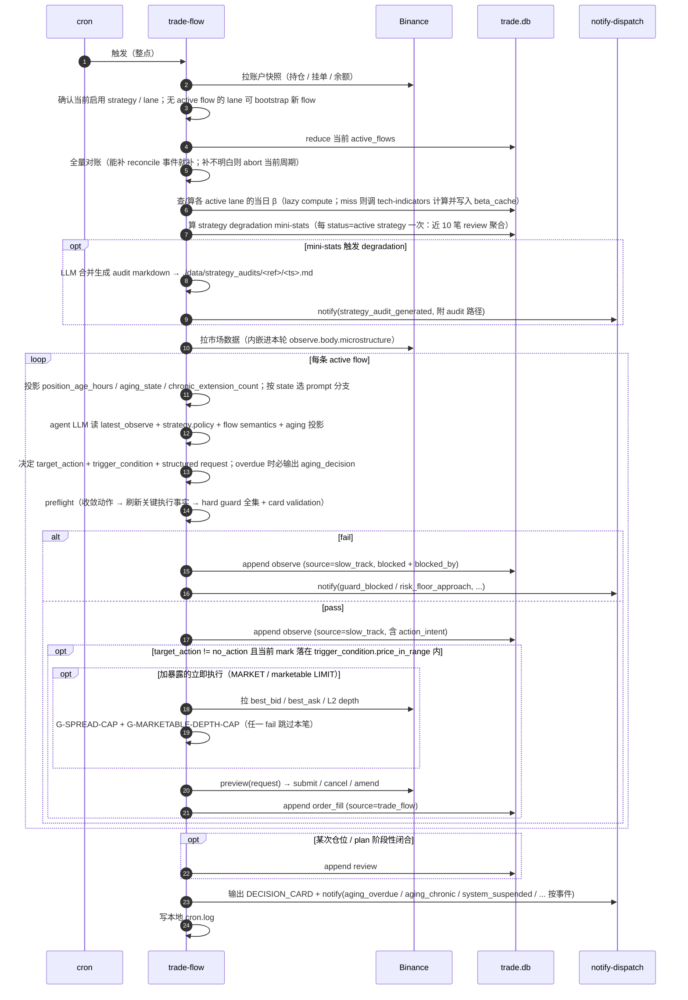
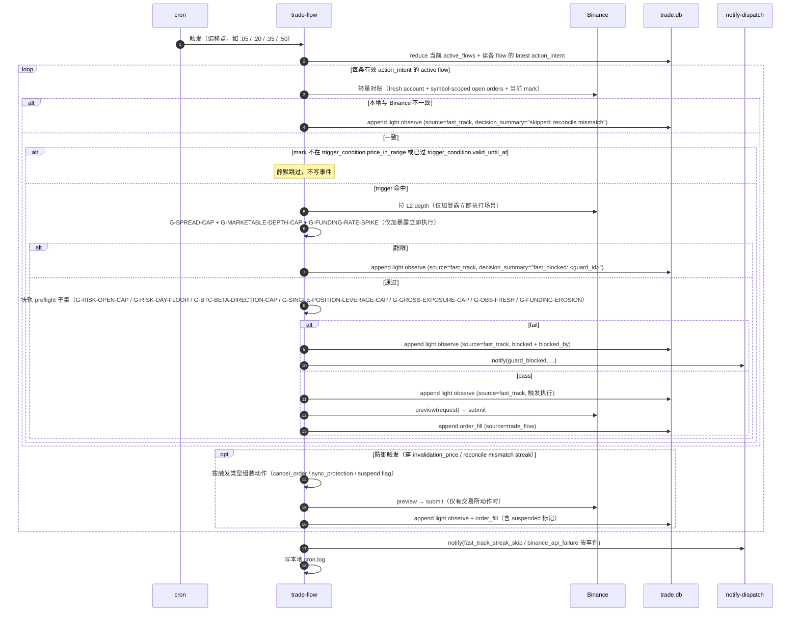

# Design Architecture

trade-flow 是套件 tool 的总入口（功能 tool 拓扑见 [tool-layout.md](tool-layout.md)）。本文是它在 plan / cron / preflight 层面的设计与 MVP 范围。

## 设计哲学

- 事件流为真相、自然语言为主
- 流程语义直接内嵌在 flow / stage 定义里；只有少量 hard guards 走确定性代码或脚本
- decision_card 渲染 = 校验
- 顶层先定责任域，再拆 job / tool / schema / 目录；不让实现粒度反向定义产品边界
- 双轨：慢轨拥有战略层（thesis / direction / risk），快轨守护执行层（条件触发 / 防御性补救）；两轨通过事件流通信，没有专门的共享状态
- 所有入口共用 executor；入口只改变授权范围，不改变执行路径
- 交易所事实优先级高于本地事件、evidence、artifact 和 memory

---

## 顶层责任域

本项目顶层采用 10 个责任域。该划分对齐交易系统常见边界：OMS/PMS、EMS、alpha / portfolio construction、pre-trade risk、market data products、exchange gateway、research/backtest/live parity、post-trade review、audit / artifact governance、operations control。域名是长期架构语言，不等同当前目录名。

架构图展示可用中文短名 + canonical slug；域内模块节点避免重复域名，只写具体职责，防止把责任域和实现模块混成同一层。Mermaid 总图不使用原生 subgraph title 承载域名，而是在黄色域内放独立 title 节点，避免不同渲染器把标题和内部组件重叠。

| Domain | 使命 | 拥有 | 禁止 |
| --- | --- | --- | --- |
| `orchestration-ops` | 决定本轮怎么跑、谁先跑、谁并行、谁跳过、何时通知 | `automation-cycle`、job graph、cadence、lock、runtime health、ops summary | 交易判断、策略研发判断、Binance 写动作、业务事件内容 |
| `policy-risk` | 定义允许怎么做：权限、风险、成本、策略/lane 可用性 | `trading-config`、strategy policy、runtime policy、risk/exposure limits、cost model | 实时账户权益、当前仓位、行情事实、执行结果 |
| `portfolio-execution-state` | 记录已经发生什么、现在暴露是什么 | `trade.db`、`plan_event`、flow projector、active flow、position/order projection、risk lock、closed-unreviewed flow | 研究 artifact、市场数据缓存、策略源码、Binance endpoint 细节 |
| `market-data-products` | 把外部行情加工成可复读、可引用、可回测的数据产品 | raw market capture、canonical market store、market scan、indicator / structure / regime features、dataset manifests、fresh market facts | 账户私有状态、下单 side effect、策略观点、直接写 `trade.db` |
| `exchange-gateway` | 管交易所私有连接、账户/订单事实与授权后的外部 side effect | account / order snapshot、position / fill facts、exchange write adapter、exchange result refs | 交易计划、策略判断、R&D 结论、数据集构造、直接写 `trade.db` |
| `live-decision-planning` | 把策略政策、市场事实和执行投影收敛成本轮交易计划 | slow observe、watchlist、thesis、entry/stop/size/no_action、`action_intent` | Binance 写动作、preflight 结论、R&D 资格证明、policy 限额 |
| `live-execution-control` | 把计划变成受控动作，或拒绝动作 | shared executor、trigger gate、preflight、execution contract、recovery/reconcile、post-execution confirm | thesis、新策略研发、market scan 候选排序、promotion |
| `research-strategy-development` | 寻找、验证、否定或冻结候选策略 | RD state、hypothesis queue、replay、panel、candidate batch、benchmark、calibration、lessons | 写 `trade.db`、触发 Binance、live authorization、最终交易事实 |
| `governance-review-compliance` | 审计已发生交易和策略资格 | closed-flow review、evidence ledger、promotion gate、execution attribution、policy feedback | 原始 R&D 搜索、实时下单、market/exchange adapter、artifact GC |
| `artifact-knowledge` | 管材料、证据、报告、引用、保留和清理 | `data_catalog.db`、artifact refs、dataset refs、report registry、stale/GC candidates、retention/pin | 交易事实真相、策略判断、live 授权、R&D 搜索逻辑 |

正交边界：

- `research-strategy-development` 只能提出候选；`governance-review-compliance` 才能判资格。
- `policy-risk` 只消费 approved strategy contracts；R&D draft 必须先进入 governance promotion gate，不能直接写入策略池。
- `market-data-products` 只提供可复读市场数据产品；不拥有账户私有状态，也不决定是否交易。
- `exchange-gateway` 只执行已授权的交易所读写连接；是否发起写动作必须进入 `live-execution-control`。
- `live-decision-planning` 可以生成 `action_intent`；`live-execution-control` 才能把 intent 编译和执行。
- `portfolio-execution-state` 是真钱事实源；`artifact-knowledge` 只能保存证据和材料，不能覆盖 `trade.db` 投影。
- `policy-risk` 定义限制和权限；live facts 参与 gate 计算，但不能反向改写 policy。
- `orchestration-ops` 只调度和收口；不解释子域业务结论，不升级权限。

### 跨域联通原则

跨域交互默认不画“模块互调”，而画 owner-owned surface：

架构决策：采用 **protocol fabric / rails**，不采用任意域互调，也不先引入万能中间件 / 万能数据库。架构图可以画出 logical bus layer 来降低理解成本，但它表示协议面，不表示当前必须部署消息中间件。

- `contract schema registry`：所有 rail 的 job / event / ref / policy envelope 先有稳定 schema；实现模块只能实现 schema，不能私自扩展跨域调用形态。
- `command rail`：`automation-cycle` 只产 job ticket；job ticket 是命令协议，不是直接函数调用。
- `fact rail`：真钱事实进入 `trade_event_store`，再由 read model / projector 被其它域读取。
- `artifact rail`：研究、shadow、review、report 只通过 artifact ref / catalog summary 传递，不传大对象。
- `policy rail`：策略资格和风险权限通过 approved strategy contract / policy snapshot 传递。
- `market data rail`：行情、特征、数据集和 fresh market facts 通过 market data store / manifests 传递。
- `exchange rail`：账户、订单、仓位、交易所写请求和结果 ref 通过 exchange gateway 传递。
- `data lineage rail`：raw capture -> canonical facts -> feature / dataset manifests -> research/evidence refs，全链路保留 hash、schema、时间窗和生成配置。

这几个 rail 是“中介协议面”，但不是同一个物理中心。当前阶段用 SQLite、manifest、JSON artifact、schema 和 job JSON 就够；只有当并发、延迟、重放或多进程消费真的需要时，才把某条 rail 升级成队列、消息总线或独立服务。

每个责任域必须暴露单一边界端口：

- `domain inbox`：只接收 job ticket、write envelope、approved decision ref、artifact register/query 等协议输入。
- `domain outbox`：只发布 event draft、read model ref、policy snapshot、market fact ref、artifact ref、promotion decision ref 等协议输出。
- 跨域图和跨域实现只允许连 inbox / outbox；不得从外部直接连到域内 handler、store 或 helper。
- 域内 handler 可以很多，但它们属于内部实现，不增加域对外入口数量。

| Surface | Owner | 允许消费者 | 规则 |
| --- | --- | --- | --- |
| `runtime policy` | `policy-risk` | orchestration、live decision、preflight | policy 只定义可做什么；不读写实时仓位事实 |
| `flow projector` | `portfolio-execution-state` | orchestration、decision、execution、governance | 任何真钱状态先落 `trade.db`，再通过 projector 被读取 |
| market facts | `market-data-products` | health、decision、research、governance | 只提供 fresh facts / feature refs，不生成交易判断 |
| exchange facts / write result refs | `exchange-gateway` | reconcile、fast guard、execution recorder、health | 只提供账户/订单事实和授权写结果，不生成交易判断 |
| data lineage refs | `market-data-products` + `artifact-knowledge` | research、governance、decision | 只传 manifest / checksum / feature refs，不传大 payload |
| artifact refs / catalog summary | `artifact-knowledge` | orchestration、research、governance | 只传 ref / manifest / retention 状态，不替代事实源 |
| approved strategy contracts | `policy-risk` | runtime policy、decision planner | R&D candidate 先经 governance promotion gate，不能直写策略池 |

设计约束：

- 不画也不实现跨域双向调用；双方需要同一事实时，沉到 owner store / projection / artifact ref。
- `live-decision-planning` 写 `action_intent` 到 `trade.db`；`live-execution-control` 从 projection 消费 intent，不依赖内存直连。
- `live-execution-control` 内部是单向链：executor -> preflight -> exchange rail -> execution recorder -> `trade.db`。
- R&D 和 shadow tracking 只产 artifact / candidate refs；promotion gate 决定是否进入 approved strategy contracts。
- 图里的虚线禁写关系不作为主图边表达，禁写规则放在 domain 禁止项和 schema / preflight guard 里。

### 存储 Ownership

分库分表的原则是“一个事实源，一个 owner，一个写入口”；跨库不做强外键，使用 event key / artifact ref / manifest ref / strategy ref 连接。当前物理上只有 `trade.db` 与 `data_catalog.db` 不等于架构上只有两个数据域；MVP 可以先少库，但逻辑 store 必须先分清。

跨域传递 store 身份时使用 `protocol-fabric.logical-store-ref`：`store / owner_domain / owner_module / physical_locator / write_contract / ref`。物理库未来可以从 SQLite / 文件 manifest 迁到 DuckDB、parquet 或独立 ledger，但外部域仍只消费 ref 和 contract，不直接依赖表结构。

| Logical store | Owner | 当前物理落点 | 目标物理化 | 写入口 | 读模型 / 消费面 |
| --- | --- | --- | --- | --- | --- |
| `trade_event_store` | `portfolio-execution-state` | `trade.db.plan_event` | 保持独立 SQLite；只 append 事件 | event-store / execution recorder / review writer | flow projector |
| `flow_read_models` | `portfolio-execution-state` | 运行时 projector 计算 | 可落 `trade.db` 派生表或独立 cache 表；可重建 | projector rebuild | active flows、open exposure、review queue |
| `market_data_store` | `market-data-products` | OHLCV / funding manifest + CSV/JSON artifacts | 数据量上来后拆 `ohlcv.duckdb` / parquet；manifest 仍进 catalog | market/data tools | fresh market facts、indicator inputs |
| `exchange_runtime_store` | `exchange-gateway` | client order id、exchange request/result artifact、account snapshots | 如需审计外部 side effect，可拆 `exchange_runtime.db`；真钱事实仍写入 `trade_event_store` | exchange adapters | account/order facts、exchange result refs |
| `artifact_catalog` | `artifact-knowledge` | `data_catalog.db` + 文件 payload | 保持独立；只存索引、hash、refs、retention，不存大 payload | catalog service | catalog summary refs、stale / GC |
| `research_state_store` | `research-strategy-development` | `rd_program_state` artifact + catalog record | 研发循环稳定后可拆 `rd_state.db`；trial ledger / holdout use 要幂等 | research supervisor / shadow tracker | research state summary、next hypothesis refs |
| `governance_ledger` | `governance-review-compliance` | strategy evidence / promotion records in `data_catalog.db` | 资格判定稳定后可拆 `governance.db`，或保留 catalog 表但独立 schema owner | review writer / promotion gate | approved decision refs、evidence freshness |
| `policy_registry` | `policy-risk` | approved strategy markdown + config hash | 可拆 policy snapshot table；必须记录 policy hash / approved status | governance promotion gate / policy compiler | runtime policy |
| `ops_runtime_store` | `orchestration-ops` | cron log / lock / health JSONL | 可拆 `ops_runtime.db`；低价值日志可继续 JSONL | health checker / notify dispatcher | orchestration summary |

拆库触发条件：

- `trade.db` 不拆出交易事件；最多增加可重建 read-model 表，避免真钱事实分裂。
- OHLCV / funding / feature 数据一旦需要批量 scan、join、回测复读，应从文件 manifest 升级成 `market_data_store`，不进入 `trade.db`。
- `data_catalog.db` 只做索引层；若 governance evidence 查询和 promotion 决策变复杂，应拆 `governance_ledger`，不要把 catalog 变成万能业务库。
- R&D state 从“单程序状态 artifact”升级为多 hypothesis / 多 campaign 并发时，应拆 `research_state_store`，并对 trial budget / holdout use 做幂等约束。
- ops runtime store 只服务调度可观测性，不反向影响 policy、flow 或 strategy evidence。

中间件升级触发条件：

- 多个 worker 需要同时消费同一种 durable command，且必须 ack / retry / dead-letter。
- 同一事件需要被多个下游异步订阅，且重放顺序和消费位点成为一等需求。
- 单机文件锁 + SQLite 事务已无法满足并发写入或恢复语义。
- 需要跨进程实时推送，而不是 cron 周期内的可重跑 job graph。

不到这些条件，不引入 Kafka / Redis stream / service bus。先把 rail 的 envelope、schema、idempotency key、owner store 和 replay 语义定稳。

### 域内能力层

10 个顶层域是责任边界，不继续把所有能力拆成顶级域；但粗域内部必须分 capability lane，避免一个黄色块吞掉已实现功能。`market-exchange-connectivity` 被拆成 `market-data-products` 与 `exchange-gateway`，因为“可复读数据产品”和“授权外部 side effect”是两类完全不同的 owner。

| Domain | Capability lanes |
| --- | --- |
| `policy-risk` | config source、approved strategy contracts、runtime policy compiler、policy snapshot registry |
| `portfolio-execution-state` | append-only trade event store、flow projector、rebuildable read models、review queue |
| `market-data-products` | raw market capture、canonical market store、feature engine、dataset manifests、fresh market fact publisher |
| `exchange-gateway` | account/order snapshots、position/fill facts、exchange write adapter、exchange command ledger、exchange result publisher |
| `live-decision-planning` | job input assembler、opportunity planner、sizing / risk-budget planner、action_intent publisher、watchlist artifact publisher |
| `live-execution-control` | reconcile/recovery、fast guard、shared executor、preflight/hard guards、execution recorder |
| `research-strategy-development` | research supervisor、data split/panel/replay/benchmark/calibration runners、signal evaluator、shadow tracker、R&D state store |
| `governance-review-compliance` | closed-flow reviewer、evidence freshness check、promotion gate、governance ledger |
| `artifact-knowledge` | artifact register/query、catalog service、retention/pin/GC、lineage index |
| `orchestration-ops` | cycle planner、job graph protocol、runtime health checker、notify dispatcher、ops runtime store |

### 数据管线

数据管线按 data product 分层，而不是按脚本名或文件夹堆叠：

1. `raw capture`：交易所原始快照、OHLCV、funding、aggtrades；只做可复读采集，不做策略判断。
2. `canonical facts`：闭合 K 线、funding events、public symbol facts；带 schema、checksum、时间窗、source freshness。账户、订单、成交事实属于 `exchange-gateway`。
3. `features`：indicator、structure、regime、microstructure 派生特征；必须引用 canonical input manifest。
4. `datasets`：panel、data split、discovery / validation / locked_holdout manifest；明确 universe、embargo、lookback、label window。
5. `experiments`：replay、benchmark、calibration、candidate batch、signal evaluation；输出 research artifact，不直接成为 live 资格。
6. `evidence`：strategy evidence / shadow evidence / review-derived evidence；由 governance 检查 freshness、policy hash、data hash、assumptions hash。
7. `policy/live`：approved strategy contract 进入 policy registry；live decision 只消费 approved policy + fresh market facts + flow read models。
8. `feedback`：closed-flow review 产生成本、滑点、funding、decay diagnostics，回到 research artifact / governance ledger，而不是直接改策略。

数据管线约束：

- 每一层只读上一层 manifest/ref，产出新 manifest/ref；禁止就地覆盖上游数据。
- 大 payload 留在文件/对象层；rail 上传递 ref、hash、schema version、time window、freshness。
- replay / shadow / live 的同一信号必须能追溯到同一 strategy contract、market data hash、feature hash 和 assumptions hash。
- market data store 与 artifact catalog 分工：前者管可计算事实，后者管引用、血缘、保留和可发现性。

### 当前架构图审计结论

当前 Mermaid 可以作为大重构的顶层草图，但还不能当作可直接落地的模块切分清单。落地前必须守住以下审计结论：

| 结论 | 判断 | 处理 |
| --- | --- | --- |
| 顶层 10 域合理 | `market-data-products` 与 `exchange-gateway` 拆开后，交易判断、数据产品、外部 side effect 已基本正交 | 不再按 tool 数继续加顶级域；后续新增能力先放 domain capability lane |
| rail 方向正确 | protocol fabric 降低了任意双向调用风险 | 先实现 envelope schema / refs / idempotency key，再考虑真正 middleware |
| 慢轨权限需收紧 | `slow_track_market_watch` 只能产 observe / action_intent / watchlist；不能直接写 `order_fill` | `order_fill` 只能由 execution recorder 根据 exchange result 写入 |
| exchange 写链必须有命令账本 | 交易所写请求需要 client order id、request/result correlation、retry 与幂等语义 | `exchange-gateway` 必须拥有 exchange command ledger；真钱事实仍回写 `trade_event_store` |
| 决策域不能只画 thesis | 真实交易计划必须包含 size、entry、stop、risk budget、no_action reason | `live-decision-planning` 拆成 opportunity planner 与 sizing / risk-budget planner |
| market scan 名字不能越界 | `market scan` 容易被误解为策略判断 | 图中改为 universe / liquidity scan；只做可交易性和事实过滤 |
| data lineage 还需 point-in-time 约束 | 研究、shadow、live 必须能复现同一时点可见数据 | dataset manifest 需要记录 availability、lookback、label window、feature hash |
| governance 与 policy 是单向关系 | governance 产 promotion decision，policy 只消费 approved snapshot | 不允许 research draft 或 review note 绕过 promotion gate 进入 policy |

---

## 双轨

trade-flow cron 分两条轨道：

| | 慢轨 | 快轨 |
|---|---|---|
| 频率 | 1H / 4H | 5m / 15m |
| 触发时机 | 单入口 supervisor 判定 slow due 后分发 | 单入口 supervisor 高频唤醒时优先分发 |
| LLM 角色 | **战略层**：读 plan + market + strategy.policy + flow semantics 做 thesis / action_intent 判断 | **orchestrator only**：按 prompt 模板顺序调 tool（reduce flow / 拉 depth / 跑 guards / 调 executor / 调 notify），把 tool 结果总结成 decision_summary。**不做任何质性判断**（不评估"诱多诱空"、不重读 thesis、不重设 invalidation） |
| 写 `observe` | 完整 observe（含 thesis / action_intent / 全部硬字段） | light observe（thesis 段继承慢轨；execution context 自采） |
| 写 `order_fill` | 经 shared executor / execution recorder 写；slow planner 不直接写 | 经 shared executor / execution recorder 写 |
| 写 `review` | 是 | 否 |
| 可发起的 `target_action` | 全集 | 仅白名单：`cancel_order` / `sync_protection` / `no_action` / 慢轨预设 trigger_condition 触发的 `place_entry` 或 `adjust_position` |
| 对账范围 | 入口跑全量对账 | 仅对当前要操作的 flow 做轻量对账（fresh account + symbol-scoped open orders） |

**通信完全通过 plan_event 事件流**：快轨读慢轨写的 latest observe（拿 thesis + action_intent），慢轨读快轨写的 order_fill 和 light observe（知道窗口内发生了什么）。两轨不共享专门字段。

`trigger_condition` 是两轨之间的共同执行接口：慢轨写、慢轨/快轨都按它执行。

### 调度归属

系统由一条外部 automation 高频唤醒，先跑 `--automation-cycle` 生成 supervisor plan，再按 `jobs[].active` 分发 slow / fast / R&D / review / catalog 子任务。`--track slow|fast` 是底层工作单元，不作为长期 automation 入口暴露。

单入口按快轨尺度唤醒；慢轨、R&D、catalog 通过 cadence gate 决定是否 due。默认口径：fast 15m、slow 240m、R&D 240m、catalog 1440m。也就是说，入口 15m 醒一次不等于慢轨或 R&D 15m 跑一次。

subagent 只负责上下文隔离和并行：交易事实仍只能通过 trade-flow CLI、`trade.db`、cron lock 与 preflight 进入。R&D tracker 子任务不得写 `trade.db`，不得生成 strategy evidence；closed-flow review 优先由本轮“已闭合且未 review”事件触发，必须在交易 / 对账子任务之后串行收尾。review cadence 只做漏单兜底，不把 review 变成第四条长期 automation。

### Memory Boundary

系统只承认三类记忆，互不替代：

| 层 | 内容 | 禁止 |
| --- | --- | --- |
| `conversation_context` | 用户偏好、`chat-history`、设计讨论 | 直接作为行情事实、策略证据或真钱动作依据 |
| `research_memory` | `rd_program_state`、R&D artifact、catalog | 写 `trade.db`、触发 Binance、冒充 live evidence |
| `execution_projection` | `plan_event` reducer、active flow、runtime health、fresh exchange snapshot | 被旧聊天或研究假设覆盖 |

真钱动作只可消费 `execution_projection + fresh exchange facts + strategy evidence + runtime_policy`。`runtime_health.safe_mode` 是运行态投影，不写成长记忆；解除必须来自新的健康检查 / 对账结果，而不是对话承诺。

### Automation Cycle Job Topology

`automation-cycle` 的核心不是“跑哪些脚本”，而是产出一份可分发、可审计、可复跑的 job graph 协议。orchestration 先准备协议，再把 job ticket 分给对应 subagent / tool runner；处理 job 的 agent 与调度中心必须共享同一份契约，才能做到上下文隔离而不丢边界。

job graph 不是责任域；它是 `orchestration-ops` 的调度产物。每个 job ticket 必须指向一个 target domain / handler，而不是把所有 job 混成一个大模块。

架构图上按 `J01...J09` 标号展示 job ticket，先让人一眼看清本轮 cycle fork 出几个 job。只有 `Jxx` 节点计入 job；没有编号的节点都是责任域组件、handler、store 或事实源。`stage` 仍保留在协议里，但它只表示调度波次 / 串并行批次，不是业务域名，也不应该作为总图主标签。

目标 job ticket shape：

| 字段 | 作用 |
| --- | --- |
| `cycle_id / job_id / stage` | 本轮身份、任务身份、串并行阶段；`stage` 是执行波次，不是业务模块 |
| `target_domain` | 任务归属的责任域，如 `live-decision-planning` 或 `research-strategy-development` |
| `handler_tool_id` | 由 registry 解析的处理入口；避免裸路径耦合 |
| `tool_id / entry_contract / command_spec` | 稳定工具身份、入口契约与可执行命令协议；`command_spec` 由 protocol resolver 生成 |
| `input_refs / payload` | 本 job 允许读取的事实、artifact、projection 或内联 payload |
| `capability_class / writes / concurrency_group` | 权限、写入面、互斥边界 |
| `requires` | 前置 job 结果或 gate，例如 runtime health、reconcile status、preflight verdict |
| `output_contract` | job 必须交回的结果外壳、artifact ref、event draft 或 blocked reason |
| `stop_conditions` | 预算耗尽、safe mode、data stale、needs_review 等停止条件 |
| `handoff_summary` | 给总控和后续 job 的短摘要；不得替代事实源 |

subagent 只能在 job ticket 授权的输入、写入面和停止条件内工作。它可以总结，但不能扩大权限；它产出的结果必须回到 `trade.db`、artifact/catalog、runtime health 或 notify side effect 这类可审计面。

目标 job family：

| job family | 业务职责 | 必须在谁之前 | 写权限 |
| --- | --- | --- | --- |
| `runtime_health_guard` | 开跑前确认系统能不能交易：配置 hash、数据新鲜度、Binance/API 可用性、DB/lock、safe mode、日内风险状态 | 所有真钱相关 job | runtime health projection / cron log；不写 `trade.db` 交易事件 |
| `account_reconcile_guard` | 先把本地执行投影和交易所事实对齐；能可靠归属则补 `source=reconcile`，不能归属则锁风险 / needs_review | fast / slow / executor | `trade.db` reconcile event / needs_review |
| `fast_track_guard` | 守护已有 active flow：触发慢轨授权动作、同步保护、处理防御动作、记录轻量执行上下文 | slow 之前优先运行；也可在慢轨间隔中单独运行 | `trade.db` light observe / order_fill |
| `slow_track_market_watch` | 慢轨盯市与计划生成：扫描市场、补证据、读已批准策略池、生成或更新 slow observe / action_intent | R&D 可并行；执行仍必须走 executor | `trade.db` full observe / action_intent；watchlist artifact |
| `rd_strategy_supervisor` | 新策略研发学习 loop：消费失败经验、推进 hypothesis、控制预算、产出 gated draft / shadow candidate | 与 live trade-db 写入隔离 | research artifact / catalog / strategy draft；不写 `trade.db` |
| `rd_forward_shadow_trackers` | 已冻结候选 / paper / shadow 样本延续跟踪 | 与真钱链路隔离 | tracker artifact / catalog；不写 `trade.db` |
| `closed_flow_review_sweep` | 对“已闭合且未 review”的 flow 做终局复盘；review cadence 只补漏 | trade / reconcile 之后 | `trade.db` review event / review artifact |
| `catalog_hygiene_scan` | 管 artifact 可见性、引用、stale / GC candidate | 可与 research 并行 | `data_catalog.db` / artifact report；不写 `trade.db` |
| `ops_notify_dispatch` | 汇总本轮异常和需要人工接管的事件：safe mode、reconcile abort、保护腿缺失、API 连续失败、候选待确认 | 所有 job 之后，或 critical 事件即时触发 | notify side effect；不改变 flow 状态 |

当前实现已经有 `fast_track_guard / slow_track_market_watch / rd_strategy_supervisor / rd_forward_shadow_trackers / closed_flow_review_sweep / catalog_hygiene_scan` 的 job graph。缺口不是又多几个脚本，而是三类交易运营职责必须成为总控的一等边界：`runtime_health_guard`、`account_reconcile_guard`、`ops_notify_dispatch`。

`fast_track_guard` 和 `slow_track_market_watch` 可以继续作为粗粒度工作单元，但语义必须收紧：

- `fast_track_guard` 是执行层巡检，不是快频策略判断；它内部只允许 trigger watch、protection watch、risk lock、light reconcile、defensive action。
- `slow_track_market_watch` 是战略观察与计划生成，不是慢速下单器；它可以写 `action_intent`，但执行仍走 shared executor。
- `closed_flow_review_sweep` 的扫描对象是“closed but unreviewed flow”，不是 active flow；flow 退出 active 集合后才最需要 review。

目标 cycle 输出的 job tickets：

| 编号 | job_id | target domain | subagent / handler 角色 | 写权限 |
| --- | --- | --- | --- | --- |
| `J01` | `runtime_health_guard` | `orchestration-ops` | runtime health checker | runtime health / cron log |
| `J02` | `account_reconcile_guard` | `live-execution-control` | reconcile runner | `trade.db` reconcile event / needs_review |
| `J03` | `fast_track_guard` | `live-execution-control` | `trade-flow-operator` | `trade.db` light observe / order_fill |
| `J04` | `slow_track_market_watch` | `live-decision-planning` | decision planner | `trade.db` full observe / action_intent；watchlist artifact |
| `J05` | `rd_strategy_supervisor` | `research-strategy-development` | `research.rd-supervisor` | research artifact / catalog / gated draft |
| `J06` | `rd_forward_shadow_trackers` | `research-strategy-development` | shadow tracker | tracker artifact / catalog |
| `J07` | `catalog_hygiene_scan` | `artifact-knowledge` | artifact catalog operator | `data_catalog.db` / artifact report |
| `J08` | `closed_flow_review_sweep` | `governance-review-compliance` | `closed-flow-reviewer` | `trade.db` review / review artifact |
| `J09` | `ops_notify_dispatch` | `orchestration-ops` | notify dispatcher | notify side effect |

`rd_strategy_supervisor` 和 `rd_forward_shadow_trackers` 必须分开：前者负责提出新 hypothesis、消费失败经验、控制搜索预算；后者只接着观察已冻结候选或 paper/shadow 样本。前者可以产出 gated draft strategy，后者只能产出 review 输入。两者都不能把研究事实写进 `trade.db`，也不能触发 Binance。

R&D 内部允许再 fan-out read-only scout subagent，但只作为旁路输入：`rd-history-scout` 查历史失败与禁试机制，`rd-data-scout` 查 manifest / split / family 约束，`rd-edge-scout` 草拟不同 market edge。三者都不能写 `rd_program_state`、不能消耗 trial budget、不能打开 holdout；只有 `research.rd-supervisor` 通过显式 state writer 边界推进 R&D state，负责把 scout proposal 编译成显式 `next_hypothesis_queue` 后再执行。

`rd_strategy_supervisor` 的 durable memory 是 `rd_program_state` artifact。`--automation-cycle` 收到 `rd_program_state_path` 时，以 state 中的 objective / budget / usage / lessons / queue 作为研发线事实源，并把该路径作为 learning memory ref；state 非 `active` 时，即使 cadence due 或被 force，也不继续派发研发 loop。临时 `rd_strategy_goal` 只用于尚未建立 state 的启动引导。

state 写入是显式边界：`research.rd-program-state` 可 init/read/update/plan_next；`plan_next` 只读 state，把 queue 中的下一条 hypothesis 编译为 R&D loop/campaign payload 草案。`research.rd-supervisor` 是高阶执行器，串起 `plan_next -> loop/campaign -> state writeback`，直到候选、预算耗尽、数据/工具阻断或 max_iterations。R&D loop / campaign 只有 payload 带 `rd_program_state_path` 才把 usage、failure、reliability、artifact refs 写回；strategy review 只产出 execution attribution、cost feedback、decay diagnostics，不直接写 RD memory。总控不隐式制造研发事实，只分发显式 job。

目标调度顺序固定四段：

1. `serial_runtime_guard`：先跑 runtime health；不健康则只允许恢复、防御、通知。
2. `serial_trade_db_guard`：先跑 account reconcile，再跑 fast guard；已有风险和账本事实优先于新机会。
3. `parallel_isolated_work`：slow 盯市、strategy R&D、R&D tracker、catalog 保洁可并行；只有 slow 可能进入 `trade-db` 写区。
4. `serial_closeout`：先 review closed-but-unreviewed flow，再 dispatch ops notification；fallback sweep 只补漏。

不要求严格 cron 对齐（如 :05 / :20 / :35 / :50）：实际触发时间可能漂移，"两轨不同时驱动 Binance API + LLM 推理"这个真需求由 supervisor cadence + tool 入口 lock file + 幂等执行兜底（见 §失败兜底 → 慢/快轨重叠），而不是靠错开 wall-clock 分钟。

### 共同 executor

慢轨/快轨执行 action_intent 走完全一致的路径：

1. 读 latest action_intent 的 `trigger_condition`
2. 检查当前 mark 是否落在 `price_in_range` 内 + 未过 `trigger_condition.valid_until_at`
3. 检查 `current_orders + current_position`，意图已实现则跳过（幂等）
4. 跑当前轨道的 preflight 子集
5. 通过 → preview → 下单 → 写 `order_fill`；不通过 → skip

慢轨写完 observe 后直接调一次 executor（mark 几乎肯定还在 range 内，相当于"立刻执行"）；行情快速跑出 range 时自然 skip，等快轨追。

### 快轨写权限边界

- **加暴露方向**（`place_entry` / `adjust_position` 加仓段）必须有慢轨预设的 `trigger_condition` 授权；快轨不能主动发起
- **防御方向**（`cancel_order` / `sync_protection` / `adjust_position` 减仓段）快轨可以自主发起
- thesis / entry_intent / exit_intent / invalidation / risk_budget_usdt / stop_price / ladder 段，快轨写 observe 时**必须从 latest 慢轨 observe 原样继承**，不修改

### 快轨"跳过执行"的事件粒度

| 情况 | 写不写事件 |
|---|---|
| trigger_condition 未触发（价格不在 range 或 `trigger_condition.valid_until_at` 已过） | 不写 |
| 触发 + 全部确定性 guard 通过 + 执行 | 写 light observe + order_fill |
| 触发 + 任一确定性 guard 拦截 + 跳过 | 写 light observe，`decision_summary="fast_blocked: <guard_id>"` |
| 轻量对账发现仅保护腿漂移（持仓事实清楚，但保护单缺失或价位漂移） | 不算 `reconcile mismatch`；写 light observe + 自主发起 `sync_protection` 的 order_fill |
| 轻量对账发现账本不一致（本地 `current_orders / current_position` 与 Binance 事实不一致，且需要补 event 才能恢复） | 写 light observe，`decision_summary: "skipped: reconcile mismatch"`；若 Binance live position 能明确归属到当前 flow，可先补一笔防御性 `sync_protection`，缺失事件仍留给慢轨入口全量对账 |
| 发现 invalidation 价位被穿（防御触发） | 写 light observe + 自主发起 `cancel_order` / `sync_protection` 的 order_fill |

`spread` / `depth` / `funding rate` 等执行质量约束全部走确定性检查（分别由 `G-SPREAD-CAP` / `G-MARKETABLE-DEPTH-CAP` / `G-FUNDING-RATE-SPIKE` 处理）。**快轨 LLM 是 orchestrator only**——按 prompt 模板顺序调 tool，把 tool 结果聚合成 decision_summary，不做任何质性判断。设计取舍：5m / 15m 节奏下 LLM 的"诱多诱空"判断高度主观、不可重现、不可回测，把所有"是否值得执行"的判定权完全收回到确定性 guards，可以让快轨可单元测试、可历史回放、可逐 guard 调阈值。微观结构信号若有真实 edge，就把它落成新的确定性 guard，不让 LLM 在快轨里黑盒判断。

这里的 `reconcile mismatch` 专指**账本归因问题**，不是保护腿缺失/错位。保护腿漂移由 `G-STOP-SYNC` / `sync_protection` 处理；缺失 `order_fill(source=reconcile)` 的归属修复仍留给慢轨入口全量对账。

### 快轨自主防御触发

在 1H/4H 慢轨周期之间，快轨是 gap 窗口里唯一能动手的一方。除了"价格穿过 invalidation 价位"这条原有触发，再补一条确定性触发（不依赖 LLM）：

| 触发条件（确定性，代码判定） | 快轨自主动作 |
|---|---|
| 同 flow 连续 ≥ 3 轮快轨写 `decision_summary` 含 `"reconcile mismatch"` | 写 light observe `decision_summary="suspended: reconcile mismatch streak"`；本 flow 后续快轨直接 skip 直至慢轨入口全量对账重置 |

`suspended` 由慢轨入口在全量对账成功时清除（写 source=slow_track observe 即视为重置）。

---

## 数据模型

```
plan_event
  event_key   PK
  chain_id           -- 事件归属（当前语义就是 flow_id；沿用旧字段名）
  kind               -- observe | order_fill | review
  body_json
  created_at
  INDEX (chain_id, created_at)
  INDEX (kind, chain_id)    -- 加速 review event 检索（state 推断）
```

本阶段先把身份拆成三层：`strategy` 是规则模板；`lane` 是某个 strategy 在某个 `symbol + side` 上的运行槽位；`flow` 是一笔具体机会 / 暴露从 observe 到闭合的生命周期。表结构里沿用 `chain_id` 字段名，但语义上就是 `flow_id`。MVP 的 lane 先用 `strategy_ref + symbol + side` 读时定位，不单独建表。跨 symbol / 跨 side 可并行，因为它们属于不同 lane；同一 lane 任一时刻最多只维护 1 条 active flow。**这是产品层硬约束，不是 MVP 临时简化**：同一 lane 只允许 1 个风险拥有者；事件驱动加一段、结构重建后二次进攻、临时新增理由，只要旧 flow 未闭合，都必须并回当前 active flow 管理，不允许同 lane 并行多条 active flow。数据库里同时存在多条历史 / 活跃 flow，不假设系统只有一条最新主流。

- **创建 flow**：某 lane 当前无 active flow，且本轮识别到值得跟踪的新 setup 时，慢轨生成 UUID，写进 first observe 的 `plan_event.chain_id`（快轨不创建 flow——bootstrap 是战略层判断）
- **延续 flow**：同一笔机会 / 持仓仍在管理时，后续 cron（慢轨/快轨皆可）都沿用同一 `chain_id` append 新事件
- **新开 flow**：只有某条 flow 已阶段性闭合后，同一 lane 后续又出现新 setup，才新开 flow（仍由慢轨发起）；只要同一 lane 仍有 active flow，新的入场理由一律并回当前 flow，不再为同 lane 另开并行 flow

完整 schema / 索引 / 落库约定见 [tech-spec.md](tech-spec.md)。

### Event kind

| kind | body | 来源 |
| --- | --- | --- |
| `observe` | 完整快照（见 ### observe.body shape） | 每轮 cron |
| `order_fill` | 订单 / 成交事件（见 ### order_fill.body shape） | EXECUTE stage |
| `review` | 阶段性复盘（见 §REVIEW → ### review.body shape） | 某次仓位 / plan 阶段性闭合时 |

### observe.body shape

```yaml
# 硬字段
source: slow_track | fast_track   # 本条 observe 由哪条轨道写入
symbol: BTCUSDT
side: long | short
stop_price: number
risk_budget_usdt: number          # 该 lane 允许承担的风险上限；preflight 会结合 Binance 最新快照实时算 lane risk
strategy_ref: S-xxx

# 硬字段（可选，结构化承载关键执行价位）
stop_ladder:?                     # [{trigger_price, new_stop, reason}]
takeprofit_ladder:?               # [{price, qty_ratio, reason}] —— qty_ratio 之和 ≤ 1.0
risk_budget_change:?              # {delta_usdt, reason}（与上一条 observe 不同时必填）

# 软字段（自然语言；由 LLM 按 flow semantics + strategy.policy 解读）
thesis: text
entry_intent: text
exit_intent: text
invalidation: text
invalidation_price: number?       # 价位型 invalidation 时由慢轨 LLM 写；快轨穿透判断用
expected_rr_net: number
setup_valid_until_at: timestamp?  # 当前 setup / entry 语境的新鲜度窗口；不直接驱动持仓退出

# 持仓 aging（详见 §持仓 aging）
expected_holding_hours: number    # first observe 必填；LLM 自定本笔预期持仓时长；后续 observe 原样继承不许改
position_age_hours: number?       # 投影字段：from first order_fill timestamp；空仓阶段为 null
aging_state: nominal | extended | overdue   # 投影字段：position_age_hours / expected_holding_hours 比值分档
aging_decision:                   # 仅 aging_state == overdue 时必填
  action: extend | reduce | exit  # LLM 三选一
  rationale: text
chronic_extension_count: number?  # 投影字段：连续 extend 次数；闭合时写进 review.chronic_flag

# 行动意图（执行接口）
action_intent:
  target_action: no_action | place_entry | cancel_order | sync_protection | adjust_position
  trigger_condition:              # target_action != no_action 时必填
    price_in_range: [low, high]   # 当前 mark 必须落在此区间，executor 才会执行
    valid_until_at: timestamp     # action_intent 自身的过期时间（与顶层的 setup_valid_until_at 不同）
  request:                        # target_action != no_action 时必填
    # shape 由 target_action 决定，见 ### request shape by target_action

# 证据段
account:
  equity_usdt: number
  positions: [...]
  open_orders: [...]
  funding_paid_since_entry_usdt: number?
microstructure:                   # 当轮采集结果直接内嵌；shape 见 market-data-design.md
  notes: text?                    # agent 本轮一句话提炼
catalyst: text                    # 持仓窗口内 high-impact 事件（无则 "none in window"）
exposure: text                    # 同簇敞口判断（btc-beta / eth-eco / ...）
preflight_result:
  verdict: armable | blocked | abstain
  blocked_by: [{check_id, reason}]   # 任一非空 → blocked
  warnings:   [{source, reason}]     # 不阻拦但记录
decision_summary: text            # 本轮 cron 做了什么
```

每条 observe 是**最小完整快照**，不是 patch。若只刷局部槽位，上游先合并上一版完整 observe 再 append。

快轨写 light observe 时，`source = fast_track`，并且：
- thesis / entry_intent / exit_intent / invalidation / setup_valid_until_at / risk_budget_usdt / stop_price / ladder / strategy_ref / symbol / side / **expected_holding_hours** 从 latest 慢轨 observe 原样继承
- account / microstructure / preflight_result / decision_summary / position_age_hours / aging_state 自采写新
- aging_decision 快轨不写（aging 是战略层判断，仅慢轨产生）
- action_intent 仅在快轨自主发起防御动作时写新；否则继承 latest

同一条 flow 可以在空仓观察、等待条件、已挂单、持仓管理之间切换；一旦这次机会已阶段性闭合，同一 lane 后续再出现新 setup 时新开 flow，不复用旧 `chain_id`。

`stop_ladder` / `takeprofit_ladder` 是**确定性推进序列**，不是 LLM 每轮自行决定要不要执行的软意图：

- **建仓成交后**（`place_entry` 的 order_fill 写入时），executor 立刻发 `sync_protection`，在 Binance 侧 place 对应的 `STOP_MARKET`（@ `stop_price`）和 `TAKE_PROFIT_MARKET`（@ `takeprofit_ladder[0].price`，如有）。止损止盈从这一刻起活在交易所侧，与 cron 节奏无关。
- **后续每轮 cron**（慢/快轨皆可），executor 入口先跑 `G-STOP-ADVANCE` pre-check（见 §Hard Guards），读 order_fill 判断是否有档位成交，有则确定性推进下一档；无则跳过。
- **LLM 只负责写 ladder 内容**（档位在哪、reason 是什么）；ladder 的执行和推进路径不经过 LLM。

### request shape by target_action

LLM 写意图参数，executor 确定性算 qty，不依赖 LLM 自行填写数量。

```yaml
# place_entry
request:
  order_type: LIMIT | MARKET
  entries:
    - price: number?              # LIMIT 必填；MARKET 省略，executor 用当前 mark 估 qty
      risk_ratio: number          # 本笔占 risk_budget_usdt 的比例；sum ≤ 1.0
      time_in_force: GTC|IOC|FOK? # 可选，默认 GTC
  # executor 对每笔独立计算：
  # - 被动 LIMIT（非立即成交）：qty_i = risk_budget_usdt × risk_ratio_i / |price_i - stop_price|
  # - MARKET 或 marketable LIMIT：entry_ref = request.price（LIMIT）或 current_mark（MARKET）；
  #   long:  qty_i = risk_budget_usdt × risk_ratio_i / |entry_ref × (1 + slippage_buffer_pct) - stop_price|
  #   short: qty_i = risk_budget_usdt × risk_ratio_i / |entry_ref × (1 - slippage_buffer_pct) - stop_price|
  #   以悲观入价估实际 risk，确保真实亏损不超 risk_budget

# adjust_position
request:
  direction: add | reduce
  # direction=add（需慢轨预授权 trigger_condition）
  order_type: LIMIT | MARKET?
  entries:
    - price: number?
      risk_ratio: number          # 相对 risk_budget_usdt 总量；sum ≤ 1.0
  # direction=reduce（快轨可自主发起）
  qty_ratio: number?              # 减仓比例 (0, 1.0]
  close_all: boolean?             # true 则全平，忽略 qty_ratio
  price: number?                  # LIMIT 减仓价；省略则 MARKET
  order_type: LIMIT | MARKET?

# cancel_order
request:
  scope: all | specific
  client_order_ids: string[]?     # scope=specific 时必填

# sync_protection
request:                          # 通常为空；executor 从 latest observe 读 stop_price + ladder 状态
  stop_price: number?             # 显式覆盖时填（罕见）
```

`place_entry` / `adjust_position add` 的 `risk_ratio` 基数均为 `risk_budget_usdt` 总量，不是剩余量；`G-RISK-OPEN-CAP` 管计划亏损，`G-SINGLE-POSITION-LEVERAGE-CAP` 管单条 lane 的名义暴露，两者一起兜底。

这里的先后顺序要固定：

- `stop_price` 先由 `invalidation` / 市场结构决定，不由盈亏比目标、也不由 leverage cap 反推
- `risk_budget_usdt` 只负责在既定 `entry + stop_price` 下倒推可承受的 `qty`
- `expected_rr_net` 是评估结果，不是拿来反向压缩止损的输入
- `G-SINGLE-POSITION-LEVERAGE-CAP` 只是最后一道否决型护栏：若结构性止损太近、导致同等风险预算下名义仓位过大，则本轮只能降 `risk_budget_usdt`、等更好 entry、分批，或放弃；**不能为了过 guard 机械改紧或改松止损**

### order_fill.body shape

```yaml
sub_kind: submit | cancel | amend | fill | partial_fill | reject | expire | unknown
lifecycle_status: intent_created | contract_compiled | submitted | accepted | partially_filled | filled | amended | cancel_requested | cancelled | rejected | expired | unknown | needs_review | reconciled
client_order_id: string             # <chain_id>-<seq>-<action>
exchange_order_id: string?          # Binance orderId（submit ack 后才有）
symbol: BTCUSDT
side: BUY | SELL
position_side: LONG | SHORT
order_type: LIMIT | MARKET | STOP_MARKET | TAKE_PROFIT_MARKET | OTOCO
qty: number
price: number?                      # LIMIT 类必填
stop_price: number?                 # STOP_MARKET 类必填
filled_qty: number?                 # fill / partial_fill
avg_fill_price: number?             # fill / partial_fill
fee_usdt: number?                   # fill 类
funding_paid_delta_usdt: number?    # 持仓段累计 funding 增量（仅 fill 且关联仓位时）
expected_price: number?             # submit 时的目标价（LIMIT 填单价；MARKET 填当时 mark）
slippage_usdt: number?              # fill / partial_fill：(avg_fill_price - expected_price) × filled_qty × direction_sign（long=+1, short=-1）
source: trade_flow | reconcile      # 主动执行 vs 对账补录
```

`current_orders` / `current_position` reduce 时只读 `sub_kind / client_order_id / side / position_side / qty / filled_qty / avg_fill_price`；其余字段是审计 / 复盘用。`source=reconcile` 只用于“交易所事实已经发生，且本轮对账能可靠归属到当前 flow”的补录事件。Binance API 字段全集见 [tech-spec.md](tech-spec.md)。

### Order lifecycle 语义

- 新增风险必须先产生 `intent_created -> contract_compiled` 语义；`execution_contract_snapshot` 是 `contract_compiled` 的审计载体。
- `submitted / accepted` 不改变 position；只有 `filled / partially_filled / reconciled` 改变 `current_position`。
- `rejected / expired / cancelled` 关闭对应 `current_orders`，不改变 position。
- `unknown` 表示交易所状态无法可靠确认；本 flow 禁止加风险，只允许 reconcile、cancel、sync protection、reduce 或人工接管。
- `needs_review` 是恢复失败后的持久语义；慢轨全量对账或用户明确处理前，不允许 `place_entry / adjust_position add`。
- 防御动作可在 `unknown / needs_review` 背景下执行，但必须写明 `decision_summary` 与来源，不能把防御动作当作账本已恢复。

### PLAN 与 EXECUTE 的边界

- `plan` 是持续演化的判断，不是执行票据
- EXECUTE 只读 `latest_observe.action_intent`（含 `trigger_condition + request`），不再回头读自然语言 plan
- `preview` 是唯一执行路由器：解析 request → 选 execute tool → 生成最终交易所请求
- 慢轨/快轨共用同一个 executor 路径（见 §双轨 → 共同 executor）

`trigger_condition` 的存在让 action_intent 既能表达"立刻执行"（窄 range + 短窗口），也能表达"等条件入场"（目标 range + 长窗口），路径完全一致。慢轨写完后立刻调一次 executor；mark 跑出 range 时自然 skip，等快轨追。

单轮中断后的恢复：若上一轮已写 `action_intent`，但本地尚无对应 `order_fill`，下一轮 cron 先以 Binance 事实为准；若发现交易所侧已经产生对应订单 / 成交，则补写 `source=reconcile` 事件，再继续本轮判断；不机械重放旧动作。

---

## 存储

事件流落 SQLite + JSON 列，单库自用：

```sql
CREATE TABLE plan_event (
    event_key   TEXT PRIMARY KEY,             -- UUID
    chain_id    TEXT NOT NULL,
    kind        TEXT NOT NULL,                -- observe | order_fill | review
    body_json   TEXT NOT NULL CHECK(json_valid(body_json)),
    created_at  TEXT NOT NULL                 -- ISO 8601
);
CREATE INDEX idx_chain_time ON plan_event(chain_id, created_at);
CREATE INDEX idx_kind_chain ON plan_event(kind, chain_id);

CREATE TABLE beta_cache (
    symbol           TEXT NOT NULL,
    computed_date    TEXT NOT NULL,         -- YYYY-MM-DD (UTC)
    lookback_days    INTEGER NOT NULL,      -- MVP 固定 30
    beta_full        REAL,                  -- 全样本 OLS 斜率（vs BTCUSDT）
    beta_downside    REAL,                  -- BTC return < 0 子集 OLS 斜率
    sample_count     INTEGER NOT NULL,
    downside_count   INTEGER NOT NULL,
    fallback_reason  TEXT,                  -- null=正常；否则记 fallback 类型
    computed_at      TEXT NOT NULL,         -- ISO 8601
    PRIMARY KEY (symbol, computed_date)
);
CREATE INDEX idx_beta_symbol_date ON beta_cache(symbol, computed_date DESC);
```

`body_json` 用 TEXT + `json_valid` CHECK；SQLite JSON1 扩展支持 `json_extract` / expression index，可以为投影路径加索引（如 `chain_meta` 用到的 `$.symbol` / `$.strategy_ref`）。

`beta_cache` 是 `G-BTC-BETA-DIRECTION-CAP` 的数据源，按 `(symbol, computed_date)` 主键去重，同一 UTC 日同一 symbol 只算一次；lazy compute 流程见 §β 缓存与 lazy compute。

整体存储分布：

| 内容 | 介质 | 位置 |
| --- | --- | --- |
| 事件流 | SQLite | `./data/trade.db` → `plan_event` |
| β 缓存 | SQLite | `./data/trade.db` → `beta_cache` |
| Strategy policy | Markdown（一文件一 strategy，frontmatter + `## Trade Contract`） | `strategies/*.md` |
| Trading config | JSON 文件 | `./profile/trading-config.json` |
| Deprecated config input | JSON 文件 | `./profile/account_config.json` / `./profile/notify_config.json` |
| System state | JSON 文件 | `./data/system_state.json`（熔断状态） |
| Cron log | 文本日志 | `./data/cron.log` |
| OHLCV / 市场数据 | CSV + manifest（后期切 SQLite） | `./data/ohlcv/` |
| Strategy degradation audits | Markdown（一文件一次触发） | `./data/strategy_audits/<strategy_ref>/<ISO8601_utc>.md` |

Git 边界与 data 留存规则见 [data-hygiene.md](data-hygiene.md)。

选型原则：

- **SQLite（关系列 + JSON body）**：事件流 —— 需要按 chain_id / kind / time 索引和聚合，且每种 kind 自带 shape 不需 schema migration
- **Markdown**：strategy policy —— 人编辑 + LLM 直读
- **代码 / script**：hard guards —— 只承载确定性、必须严格遵守的校验
- **JSON 文件**：trading-config —— 静态人工配置入口；deprecated account / notify 输入仅用于过渡读取
- **CSV / log**：OHLCV / cron 运维 —— 追加型时间序列

不引入 MongoDB / 文档库：单进程 cron + MVP 体量（< 10k events/月）下 SQLite JSON1 扩展完全够用，多一套服务的运维成本不值。具体 schema / 索引 / JSON 查询模式见 [tech-spec.md](tech-spec.md)。

---

## Flow Semantics

流程语义直接内嵌在主流程、stage 文档和 strategy policy 的解释口径里。

### MVP 固定语义

- `setup_valid_until_at` 已过期 且 `current_position == 0`：当前 setup 新鲜度窗口关闭，撤销仍未成交的 entry 挂单，不再按这段 setup 入场；后续若出现新的 setup，再由慢轨在新的 observe 里写新的 `entry_intent / setup_valid_until_at / action_intent`
- `setup_valid_until_at` 已过期 且 `current_position != 0`：只收掉这段 setup 遗留的 entry 挂单；已有仓位继续按 `exit_intent + thesis + invalidation` 管理，不自动保本、不自动 `time_exit`、不因该字段单独改写 `stop_price`
- `setup_valid_until_at` 描述的是 latest observe 当前 setup 的新鲜度，不是整条 flow 的终身开关；后续若在持仓语境下出现新的加仓 setup，慢轨可在新的 observe 里写新的 `entry_intent / setup_valid_until_at / action_intent`
- `setup_valid_until_at` 过期不等于 `invalidation` 触发：前者表示 setup 老了，后者表示 thesis 被破坏
- `invalidation` 已触发：当前 thesis 不得继续推进；若已有挂单，优先撤单；若已有仓位，优先进入保护或退出分支
- `current_position != 0`：当前流的工作重点从 entry 转向 `exit_intent + thesis` 管理，不把持仓语境和空仓语境混在一起
- `review` 记录某条 flow 的闭合样本；关闭的是 flow，不是 lane，更不是 strategy
- 上轮 `target_action != no_action` 但本地无对应 `order_fill`：下一轮先看 Binance 事实并补齐缺失事件，再决定是否继续推进，不机械重放旧动作
- `current_orders` 非空（含部分成交后的剩余挂单）：每轮 cron 读当前市场语境，动态判断剩余订单处置——价格仍在 thesis 射程内则继续等；市场已离开但入场逻辑仍成立则调整到当前合理价位；当前 setup 已过期（`setup_valid_until_at` 到期）或 `invalidation` 触发或市场结构已变时，撤销剩余 entry 挂单；若已有成交仓位，则后续仅按持仓管理语境继续，不把“收掉残余 entry”自动等同于整体退出。**部分成交后的剩余挂单不是异常状态**，是建仓中的正常中间态，由后续 cron 正常迭代处理
- **快轨执行幂等**：每次 executor 进场前先 reduce `current_orders / current_position`，意图已实现（挂单已存在 / 持仓已建立）则跳过；clientOrderId 由 `chain_id + seq + action` 派生，Binance 侧自动去重
- **快轨写权限**：加暴露方向（`place_entry` / 加仓）必须有慢轨预设的 trigger_condition 授权才能由快轨触发；防御方向（`cancel_order` / `sync_protection` / 减仓）快轨可自主发起。两轨都不绕过 hard guards
- **快轨遇到本地与 Binance 状态不一致**：本轮该 flow 一律 skip，写 light observe 记录原因，等下一次慢轨入口的全量对账，不自行尝试补 reconcile 事件

与 funding、跨策略相关性、场景过滤有关的判断，当前不升格为全局阻断项。若确有 edge，优先写回各自的 `strategy.policy`，或只做提示，不做全局 blocking。

## Hard Guards

hard guard 只保留三类特征同时成立的约束：

- 很重要，违背后会直接放大账户层风险或造成脏状态
- 可以确定性计算，不依赖 LLM 主观解释
- 适合落成代码或脚本，并输出固定结构结果

MVP 先固定以下几项：

| Check ID | 标题 | 说明 |
|---|---|---|
| `G-RISK-OPEN-CAP` | 成交后总 open risk 不超预算 | 账户级硬上限 |
| `G-RISK-DAY-FLOOR` | 今日累计亏损不穿底 | 账户级硬下限 |
| `G-OBS-FRESH` | 提交前关键执行事实已刷新 | 防止拿陈旧账户 / 价格事实执行 |
| `G-PLAN-INTENT-COMPLETE` | thesis / entry_intent / exit_intent / invalidation 必填非空 | 防止半成品 plan 落执行 |
| `G-STOP-LADDER-MONOTONIC` | stop_ladder 单调 | 结构化止损推进卫生 |
| `G-TP-LADDER-RATIO-CAP` | takeprofit_ladder.qty_ratio 之和 ≤ 1.0 | 防止止盈超配 |
| `G-STOP-ADVANCE` | stop / tp ladder 确定性推进 | 读 order_fill 判断当前档位是否已成交；是则自动 place 下一档，慢/快轨都跑，不经 LLM |
| `G-STOP-SYNC` | stop_price 有实物止损单兜底 | 持仓非零时，Binance 侧必须存在与 `stop_price` 匹配的 STOP_MARKET；缺失或价位偏移则自动 sync_protection |
| `G-ENTRY-RATIO-CAP` | entries risk_ratio 总和 ≤ 1.0 | place_entry / adjust_position add 的 entries[].risk_ratio 之和不超 1.0，防止超配 risk_budget |
| `G-SINGLE-POSITION-LEVERAGE-CAP` | 单 lane / 单持仓名义价值上限 | 只拦加暴露；`lane_notional_after_action_usdt / equity_live` 不得超过 `account.max_single_position_leverage` |
| `G-GROSS-EXPOSURE-CAP` | 账户级名义总暴露上限 | 所有 active lane 的 `lane_notional_usdt` 之和不得超过 `equity_live × account.max_gross_exposure`；只拦加暴露 |
| `G-SPREAD-CAP` | 立即执行时的盘口摩擦上限 | 慢轨 + 快轨同跑；只拦加暴露的立即执行（MARKET 或 marketable LIMIT）；同时看绝对 spread 和 spread 相对 stop 距离的占比 |
| `G-MARKETABLE-DEPTH-CAP` | 立即执行时的盘口深度覆盖 | 慢轨 + 快轨同跑；只拦加暴露的立即执行；模拟把本笔 qty 走完书里几档算 VWAP，校验 expected slippage 与 stop 距离的占比；book 填不满或 depth API 失败 → refuse 加暴露（reduce / cancel / sync_protection 不受影响） |
| `G-FUNDING-RATE-SPIKE` | 当前期间 funding rate 瞬时值过高 | 拦截快轨加暴露的立即执行；`abs(current_funding_rate) ≥ account.max_funding_rate_pct`；减仓与保护动作不受影响 |
| `G-BTC-BETA-DIRECTION-CAP` | BTC β 加权方向集中护栏 | 始终启用；用 `lane.beta_effective = max(beta_full, beta_downside)` 把每条 lane 的 `lane_risk_usdt` 折算成"BTC 等价 risk"，分别按 side 汇总。**net** 阈值 `max_btc_equiv_net_risk_pct` 拦"看着对冲实际同向"；**gross** 阈值 `max_btc_equiv_gross_risk_pct` 拦"两边都堆满单边来一波就被打"。BTC long + ETH short 因 β 同号自然 net 抵消；同向多 lane 自然加总放大。`lane.beta_effective` 用 fallback 时仍跑 guard，但在 warnings 写明 |
| `G-FUNDING-EROSION` | 持仓 funding 侵蚀上限 | 累计 funding 已消耗超过 `risk_budget_usdt × max_funding_erosion_ratio` 时，拦截所有加暴露动作，慢轨 decision_summary 须显式说明是否收紧止损 / 减仓 / 写 review |
| `G-EXPECTED-HOLDING-FROZEN` | first observe 之后 `expected_holding_hours` 不可改 | 后续任意 observe 的该字段必须严格等于 first observe 的值；防止 LLM 在持仓中漂移延长（confirmation bias 防御）。详见 §持仓 aging |
| `G-AGING-OVERDUE-NO-ADD` | aging overdue 时禁止加暴露 | `aging_state == overdue` 期间 blocked `place_entry` / `adjust_position add`；不强制平仓，平不平由慢轨 LLM 写 `aging_decision.action` 自决 |

hard guard 用脚本或代码实现，语言和路径在实现时再定；当前只固定口径，不提前固定具体实现目录。

### 爆仓护栏（G-RISK-OPEN-CAP / G-RISK-DAY-FLOOR）

代码兜底，单测保证。每轮 preflight 都先基于 Binance 最新快照 + 各 active lane 当前 plan，实时算出每条 lane 的 `lane_risk_usdt`；账户层只做一次汇总。任何新挂单/加仓必须同时通过：

```
G-RISK-OPEN-CAP:
  account_open_risk_after_action_usdt
  ≤ equity_live × account.max_open_risk_pct

G-RISK-DAY-FLOOR:
  realized_pnl_today_usdt
    + account_open_risk_after_action_usdt
  ≥ -(equity_live × account.max_day_loss_pct)
```

`equity_live = latest_observe.account.equity_usdt`，来自最近账户快照，不来自配置文件。

其中：

- `lane_risk_usdt`：某条 active lane 若按当前 `stop_price` 被打掉，此刻会亏多少；每轮都按 Binance 最新快照实时重算
- `account_open_risk_after_action_usdt`：执行本轮动作后，所有 active lane 的 `lane_risk_usdt` 汇总值

`risk_budget_usdt` 是单条 lane 的风险约束，不再和账户实时 open risk 并排相加，避免同一份风险被算两次。

这两条不让 LLM 介入 —— 是自动化 cron 的最后安全网。

`lane_risk_usdt` 假设 stop 按 `stop_price` 成交。极端行情下（gap / 流动性枯竭 / 连续穿透）实际成交价可能更差，`risk_budget_usdt` 与爆仓护栏是风险预算与结构约束，不是最大亏损保证。`account.stop_price_protect` 控制 Binance STOP_MARKET 是否启用 `priceProtect`：`false`（默认）保证退出但容忍坏成交价，`true` 在极端偏离时拒绝执行让仓位继续承担风险。MVP 选 `false`，承认 gap 风险，由 `max_open_risk_pct` 的账户层冗余吸收尾部。

### BTC β 加权方向集中护栏（G-BTC-BETA-DIRECTION-CAP）

`G-RISK-OPEN-CAP` 管账户总 open risk，但允许"3% 风险全压同一侧"。对 4H+ swing 多 lane 自动化来说，最常见的坏死法不是单笔超限，而是多条同向 lane 各自看起来合理，最后被同一轮方向性行情一起打穿。

按 `side` 简单加总会漏两件事：

1. **跨 symbol 的同向暴露被低估**：long BTC + long SOL + long ETH 在加密里基本是同一笔押注，β 不同但都 > 0
2. **看着对冲实际同向**：long BTC β=1 + short ETH β=1.2，按 side 算一边 long 一边 short 互不影响；按 BTC 等价算 net 暴露 ≈ -0.2，几乎没有对冲价值

`G-BTC-BETA-DIRECTION-CAP` 用 BTC β 把所有 lane 折算成同一计价单位，再分别拦 net 与 gross 两类风险：

```
G-BTC-BETA-DIRECTION-CAP:

  lane.beta_effective = max(beta_full, beta_downside)   # 双保险，永远偏保守

  btc_equiv_long_risk_usdt
    = sum(lane_risk_usdt × lane.beta_effective) where side=long
  btc_equiv_short_risk_usdt
    = sum(lane_risk_usdt × lane.beta_effective) where side=short

  abs(btc_equiv_long_risk_usdt - btc_equiv_short_risk_usdt)
    ≤ equity_live × account.max_btc_equiv_net_risk_pct

  max(btc_equiv_long_risk_usdt, btc_equiv_short_risk_usdt)
    ≤ equity_live × account.max_btc_equiv_gross_risk_pct
```

其中：

- `lane.beta_full` / `lane.beta_downside` 来自 `beta_cache`，按当日 UTC 查表；缺则 lazy compute（见 §β 缓存与 lazy compute）
- `beta_effective = max(beta_full, beta_downside)` 是双保险：平时 β 与下跌时 β 取大者，避免 peaceful-period β 低估 tail β
- 本轮 request 若是 `place_entry` / `adjust_position add`，新增 risk 按当前 lane 的 `beta_effective` 折算，记入对应 side
- `reduce_only` / `cancel_order` / `sync_protection` / 任何减仓动作不受其阻断
- 多头和空头在这条 guard 里通过 BTC 等价**做净额**：β 同号的 long/short 配对会在 net 项里互相抵消（真对冲），β 同号的 long/long 或 short/short 配对则自然加总放大（真集中）

为什么需要两个阈值（不能合并）：

- **net 阈值**拦"看着对冲实际同向"：long BTC + short ETH 表面对冲，β 折算后 net ≈ -0.2 × risk → 通过；long BTC + long SOL 同向 → net = 满额 → 拦
- **gross 阈值**拦"两边都堆满"：long BTC 2% + short ETH 2%，net ≈ 0 看着安全，gross = 单边 2%，单边突袭仍亏 2% → gross 兜底
- 只留一条 = 漏掉一类典型坏死法

缺省值设计为：

- `max_btc_equiv_net_risk_pct = max_open_risk_pct × 1.5`
- `max_btc_equiv_gross_risk_pct = max_open_risk_pct × 2.0`

故意宽松，先观察。等 review 数据显示 β 折算后真实暴露常压上限再收紧。`lane.beta_effective` 用 fallback `1.5` 时，本轮 guard 仍跑，但 `warnings[]` 写一条 `{source: "G-BTC-BETA-DIRECTION-CAP", reason: "lane X using fallback beta"}`，让你知道这次评估偏保守。

### β 缓存与 lazy compute

`beta_cache` 表（schema 见 §存储）按 `(symbol, computed_date_utc)` 主键去重；任意调用方读 lane β 走统一流程：

```
读 lane.beta_full / beta_downside (任意调用方):
  1. SELECT FROM beta_cache WHERE symbol=? AND computed_date=today_utc
  2. hit  → 直接 return
  3. miss → 调 tech-indicators.compute_beta_btc(symbol, lookback_days=30)
     a. 拉 30 天 1H K 线（symbol + BTCUSDT）
     b. 对齐时间戳算 1H 收益率
     c. 全样本 OLS → beta_full
        - 样本数 < 500 → fallback_reason="insufficient_samples"，beta_full=null
     d. BTC return < 0 子集 OLS → beta_downside
        - downside 样本 < 100 → beta_downside = beta_full
     e. INSERT INTO beta_cache（fallback_reason 非 null 时仍写入，记录"今天试过了"避免反复重算）
  4. 计算异常（API 失败 / 数据空洞）：
     a. SELECT 最近一条 cache（不限日期）
     b. 有 → 沿用并在调用栈挂 warning
     c. 无 → 返回 (beta_full=1.5, beta_downside=1.5, fallback_reason="no_cache_fallback") + warning
```

**只在慢轨入口（4H tick）按需触发计算**；快轨偏移触发不算 β，只读慢轨写好的 `latest_observe` 投影。`beta_effective = max(beta_full, beta_downside)` 是 reduce 时投影出的字段，不入库——落库的永远是两个原始值，方便后期 review 看 β 漂移和回测重算。

不写 prune job：5 lane × 365 天 = 1825 行/年，10 年 < 20k 行，对 SQLite 是噪音。全留作为二级数据资产（review 阶段可直接 `SELECT * FROM beta_cache WHERE symbol='SOLUSDT' ORDER BY computed_date` 看 β 时间序列，识别 regime shift）。

不维护稳定币 / BTC 白名单：BTC vs BTC 回归斜率天然 = 1.0，稳定币 vs BTC 收益率方差 ≈ 0 时回归天然 ≈ 0，且 perp lane 不会开在稳定币上。真出现 edge case（β 算出 8.0 明显数据异常），SQL 改 `beta_cache` 一行即可，比维护配置文件简单。

### 单持仓杠杆护栏（G-SINGLE-POSITION-LEVERAGE-CAP）

第一版只限制**单条 lane 的最大名义暴露**，目的是防止窄止损把 `qty` 放得过大；同时不因为多条远价挂单或对冲腿并存而过度保守。

它不是”止损距离生成器”。交易逻辑上，先有结构性失效位，再有仓位大小；不是先定一个允许杠杆，再倒逼 `stop_price` 贴近或远离入场位。

```
G-SINGLE-POSITION-LEVERAGE-CAP:
  lane_notional_after_action_usdt
  ≤ equity_live × account.max_single_position_leverage
```

其中：

- `lane_notional_after_action_usdt` 只看当前 lane，不跨 lane 汇总
- 已有 `current_position` 按最新 mark 计 notional
- 当前 lane 已活跃但尚未成交的加暴露挂单，按各自挂单价 / trigger 价计 notional
- 本轮 request 新增的加暴露部分：`LIMIT` 按 `price`，`MARKET` 按当前 mark 估 notional
- `reduce_only` / `cancel_order` / `sync_protection` / stop / takeprofit 保护单不计入
- 这条 guard 只拦 `place_entry` 与 `adjust_position add`；减仓与保护动作不受其阻断

### 账户级名义总暴露护栏（G-GROSS-EXPOSURE-CAP）

G-SINGLE-POSITION-LEVERAGE-CAP 管单条 lane；多条 lane 同向叠加时账户实际暴露可能远超单 lane 所暗示的水平。G-GROSS-EXPOSURE-CAP 在账户层汇总，防止多 lane 系统性同向叠加在极端行情下超出账户承受能力。

```
G-GROSS-EXPOSURE-CAP:
  sum(lane_notional_usdt for all active lanes)
  ≤ equity_live × account.max_gross_exposure
```

其中：

- 每条 active lane 的 `lane_notional_usdt` = 当前已成交持仓 notional + 本 lane 活跃的加暴露挂单 notional（按挂单价估）
- 本轮 request 新增的加暴露部分按与 G-SINGLE-POSITION-LEVERAGE-CAP 相同的方式估算后计入当前 lane
- `reduce_only` / stop / takeprofit / 保护单不计入任何 lane
- 这条 guard 只拦 `place_entry` 与 `adjust_position add`；减仓与保护动作不受其阻断

`max_gross_exposure` 缺省 `3.0`（账户整体名义不超 3× equity）。多 lane 同向运行时应显式收紧。它与 G-BTC-BETA-DIRECTION-CAP 的区别：方向 cap 管 risk_usdt（止损距离 × β 加权），gross exposure cap 管名义 notional（纯仓位大小）；两者共同作用，前者防亏损超限，后者防杠杆失控。

### 执行摩擦护栏（G-SPREAD-CAP）

`spread` 属于执行质量问题，不属于 thesis 对错。MVP 先把它从快轨 LLM 的窄域判断里拆出来，改成确定性护栏。

**慢轨与快轨同跑**——慢轨即使写了 MARKET 也可能撞坏盘口（深夜 / 周末 / 事件后 spread 突然变宽），不该因为是慢轨就放过。它只在**加暴露 + 立即执行**场景生效：

- `place_entry` / `adjust_position add`
- `order_type = MARKET`
- 或 `LIMIT` 但当前已是可立即成交的 marketable limit：
  - long：`limit_price >= best_ask`
  - short：`limit_price <= best_bid`

它**不阻断**以下场景：

- 被动 `LIMIT` 挂单（只是挂在队列里等，不立刻吃 spread）
- `reduce_only` / `cancel_order` / `sync_protection`
- 任何减仓、止损、止盈、防御动作

先取 live top-of-book：

```text
mid = (best_bid + best_ask) / 2
spread_pct = (best_ask - best_bid) / mid
spread_bps = spread_pct × 10_000

entry_ref =
  MARKET           -> current mark
  marketable LIMIT -> request.price

stop_distance_pct = abs(entry_ref - stop_price) / entry_ref
spread_to_stop_ratio = spread_pct / stop_distance_pct
```

MVP 先固定两条代码默认阈值，不进 `trading-config`：

- `spread_bps <= 15`
- `spread_to_stop_ratio <= 0.10`

也就是：盘口绝对不能太烂，同时 spread 也不能吃掉太多结构性止损空间。

guard 语义：

- 任一条件超限 → `verdict=blocked`
- 快轨写 light observe，`decision_summary="fast_blocked: spread cap"`；慢轨在本轮 observe 的 `preflight_result.blocked_by` 写明
- `blocked_by[].check_id = G-SPREAD-CAP`
- 快轨直接 blocked，不进入后续快轨 preflight 子集；慢轨同样 blocked，本轮跳过 EXECUTE

这条规则不是用来挑 thesis，只是阻止"此刻硬追进去的执行摩擦已经明显不划算"。若后续真实样本显示某类 symbol / strategy 经常被误挡，再考虑把阈值提升为 `strategy.policy` 可覆盖项；MVP 先固定代码默认值，避免过早设计新配置层。

### 市场深度护栏（G-MARKETABLE-DEPTH-CAP）

`G-SPREAD-CAP` 只看 top-of-book bid/ask 价差，看不到**深度**。两类典型坑：

1. top-of-book qty 太薄：BTCUSDT spread=1bp 通过 spread cap，但 best ask qty 仅 0.05 BTC，你想买 0.5 BTC 时吃 10 档，VWAP 偏离 mid 70bp，全程合法但完全吃掉 stop 距离一半
2. 中小盘币本身书就薄：山寨币 spread 看着 5bp，每一档只有 $200 名义量，0.1% 仓位都打穿 20 档

**慢轨与快轨同跑**，与 G-SPREAD-CAP 同语境（加暴露 + 立即执行 + MARKET / marketable LIMIT），互补不重叠：spread 看静态价差质量，depth 看本笔规模与流动性的关系。

#### 算法

```text
fetch L2 depth (Binance /fapi/v1/depth, limit=20 levels)
mid = (best_bid + best_ask) / 2

# 模拟把本笔 qty 走完书里几档（buy 走 asks 升序，sell 走 bids 降序）
cumulative_qty  = 0
cumulative_cost = 0
for level in book_side:
    take = min(level.qty, my_qty - cumulative_qty)
    cumulative_qty  += take
    cumulative_cost += take * level.price
    if cumulative_qty >= my_qty: break

if cumulative_qty < my_qty:
    blocked: book_too_thin           # 前 20 档总量都填不满本笔

vwap = cumulative_cost / my_qty
expected_slippage_bps  = abs(vwap - mid) / mid × 10_000
stop_distance_pct      = abs(entry_ref - stop_price) / entry_ref
slippage_to_stop_ratio = (expected_slippage_bps / 10_000) / stop_distance_pct
```

`my_qty` 由 executor 已算出（`risk_budget × risk_ratio / |entry - stop|` + slippage_buffer），depth check 在 qty 已确定但 submit 前发生。

#### 阈值（hardcode，不进 trading-config）

| 条件 | 阈值 | reason 标签 |
|---|---|---|
| `cumulative_qty < my_qty` | — | `book_too_thin` |
| `expected_slippage_bps > 10` | hardcode `10` | `depth_thin` |
| `slippage_to_stop_ratio > 0.10` | hardcode `0.10` | `slippage_eats_stop` |

第三条与 G-SPREAD-CAP 的同名维度对齐——spread 和 depth 各占 10% stop 距离上限，最坏情况合计 20% stop 空间被执行成本吞掉，仍可接受。

#### 失败开闭

- depth API 调用失败 / 超时 → **refuse 加暴露**（保守开闭：你正打算去拿流动性，没读到书等于盲拿）
- reduce / cancel / sync_protection / 任何减仓与防御动作不受影响（出场永远不被这条拦）
- 同 flow 慢轨连续 ≥ 3 轮因 depth API 失败被拒 → notify-dispatch 推 `binance_api_failure`（critical），让你知道某 lane 被卡

#### 设计哲学：entry / exit 不对称

depth refuse 与 `stop_price_protect = false`（止损必须成交，哪怕坏价）形成清晰不对称：**能不能进的选择权在你，能不能出的选择权在市场**。这是顶级交易员的本能——entry 侧"看不清不进"，exit 侧"必须出"。

#### 与 G-SPREAD-CAP 的关系

| Guard | 抓什么 |
|---|---|
| `G-SPREAD-CAP` | 盘口本身贵不贵 + spread 吃多少 stop |
| `G-MARKETABLE-DEPTH-CAP` | 我这笔能不能干净地拿进去 + VWAP 吃多少 stop |

执行顺序：先 spread → 后 depth（spread 用 best bid/ask 即可，depth 要拉 L2，先做轻的）。任一失败 → blocked。

### 持仓 Funding 侵蚀护栏（G-FUNDING-EROSION）

持仓期间 funding 持续同向时，会系统性侵蚀 expected_rr_net，但 LLM 每轮重新评估不可靠。G-FUNDING-EROSION 把这个判断升格为确定性护栏：

```
G-FUNDING-EROSION:
  abs(funding_paid_since_entry_usdt) >= risk_budget_usdt × account.max_funding_erosion_ratio
  → blocked: place_entry / adjust_position add
```

触发时不强制平仓——止损逻辑仍在 stop_price，这里只阻断继续加暴露，并在 `blocked_by` 写明 `G-FUNDING-EROSION`，由慢轨 LLM 在本轮 decision_summary 里显式说明下一步（收紧止损 / 分批减仓 / 继续等 thesis 兑现）。

`max_funding_erosion_ratio` 默认 0.5（累计 funding 消耗超过 risk_budget 的 50% 时触发）；持有周期较长的 strategy 应在 `strategy.policy` 中覆盖为更宽松值。`funding_paid_since_entry_usdt` 来自 latest observe 的 `account` 段；该字段为 null（未记录）时此 guard 自动失效，不阻断。

### 瞬时 Funding Rate 护栏（G-FUNDING-RATE-SPIKE）

G-FUNDING-EROSION 管的是累计侵蚀；G-FUNDING-RATE-SPIKE 管的是当前这一期的瞬时成本——在 funding rate 极端的时刻立即加暴露，等于用更贵的成本买入同样的 thesis。这个判断之前由快轨 LLM 口头判断，无法一致执行，现升格为确定性护栏。

```
G-FUNDING-RATE-SPIKE:
  abs(current_funding_rate) ≥ account.max_funding_rate_pct
  → blocked: place_entry / adjust_position add（仅快轨立即执行场景）
```

它只在**快轨 + 加暴露 + 立即执行**（MARKET 或 marketable LIMIT）时生效；被动 LIMIT 挂单、慢轨、减仓与保护动作均不受影响。`current_funding_rate` 来自本轮执行事实刷新时采集的 Binance mark price API 返回值。

`max_funding_rate_pct` 缺省 `0.001`（即 0.1%/8h，Binance 标准 funding 上限的 1/3）；触发时写 light observe `decision_summary="fast_blocked: funding rate spike"`，`blocked_by[].check_id = G-FUNDING-RATE-SPIKE`。该字段无法从 API 读取时此 guard 自动失效，不阻断。

### 持仓 aging（G-EXPECTED-HOLDING-FROZEN / G-AGING-OVERDUE-NO-ADD）

`setup_valid_until_at` 处理"setup 老化"，**不影响持仓**。但持仓本身会有另一类衰减：

- thesis 还成立、止损没碰，但市场 regime 已切（trend → range），原 thesis 在新 regime 下 EV ≈ 0
- 原计划 12-24h 见结果，结果横盘 4 天，funding / 机会成本累积，且 strategy 在该时长尺度上的统计性质未知
- LLM 在持仓中天然 confirmation bias：含糊场景里默认 hold，自我合理化 thesis 仍成立

aging 机制在全自动 LLM 场景下的真正价值不是"现场决策器"（LLM 总能编出"看似具体"的话术），而是三件事：**客观事实注入 + prompt branching + review 数据源**。

#### 字段计算

`expected_holding_hours` 由慢轨 LLM 在 first observe（同一 flow 第一条 `source=slow_track` observe）按当前 setup 自定。**无 strategy band，无全局 bound**——零外部配置。失败模式（LLM 写离谱值）只让 aging 机制空转，不放大风险（stop_loss 与其它 guard 仍在跑）。

```
position_age_hours
  = null                                      若 first order_fill 不存在（未成交）
  = (now - first_order_fill.created_at).hours 否则

aging_state
  = nominal     若 position_age_hours == null 或 < expected_holding_hours
  = extended    若 expected_holding_hours ≤ position_age_hours < 2 × expected_holding_hours
  = overdue     若 position_age_hours ≥ 2 × expected_holding_hours

chronic_extension_count
  = 投影：从最近一次 aging_state 转入 overdue 起，连续 source=slow_track 慢轨 observe 中
         aging_decision.action == extend 的连续次数
  = 任一轮 aging_decision.action 不是 extend，或 aging_state 回落 nominal/extended，则归零
```

#### Prompt branching

trade-flow 慢轨 LLM prompt 模板按 `aging_state` 分支：

| state | prompt 段 |
|---|---|
| `nominal` | 默认 prompt |
| `extended` | 追加："仓位已超预期持有时长，请评估 thesis 是否仍在原假设射程内、是否需要主动缩减。" |
| `overdue` | 追加："仓位已远超预期持有时长，必须输出结构化 `aging_decision`（action ∈ {extend, reduce, exit} + rationale）。`extend` 不会被禁止，但本轮硬性禁止加暴露（G-AGING-OVERDUE-NO-ADD）；`reduce` / `exit` 走 `adjust_position` action_intent。"|

prompt branching 不依赖 LLM 自觉——慢轨入口确定性计算 `aging_state` 后由模板渲染层决定加哪段。

#### Hard guards

`G-EXPECTED-HOLDING-FROZEN`：first observe 之后任意慢轨 observe 的 `expected_holding_hours` 必须严格等于 first observe 的值；不等则 blocked + warnings 写明。防止 LLM 在持仓中漂移延长（confirmation bias 防御）。快轨从慢轨继承该字段，本身不写也不验。

`G-AGING-OVERDUE-NO-ADD`：`aging_state == overdue` 期间 blocked `place_entry` / `adjust_position add`；reduce / cancel / sync_protection 不受影响。**不强制平仓**——自动平仓系统会让你在最不该平的时候平（横盘末端往往是突破前夕），平不平由 LLM `aging_decision.action` 自决。

#### Chronic 标记

`chronic_extension_count ≥ 3` 触发：

- DECISION_CARD 顶部加 `⚠ chronic extension: Nth (overdue × N consecutive extends)` banner
- notify-dispatch 推 `aging_chronic` 事件
- 该 flow review 闭合时自动带 `chronic_flag: true`，review 阶段聚合统计可以 group by `chronic_flag` 看 outcome 分布

chronic 不当下拦截 LLM（拦不住）——它的设计意图是**review 数据源**：30 笔后看 chronic flow 的赢/亏比例。若 chronic 后赢面显著高于平均，说明 LLM 的 extend 判断有 edge，机制可放松；反之就是系统性扛单倾向，必须收紧（如改 prompt 或 strategy 退役）。

### preflight 执行（实现细节）

慢轨 preflight 四步：

1. **executor pre-check**（LLM 之前）：跑 `G-STOP-ADVANCE` + `G-STOP-SYNC`；有动作则直接执行写 order_fill
2. **aging 投影**（LLM 之前）：reduce `position_age_hours` + `aging_state` + `chronic_extension_count`，按 `aging_state` 选 prompt 分支段
3. LLM 读 `current_plan + latest_observe + strategy.policy + aging 投影`，按 flow semantics + aging prompt 分支收敛本轮动作；overdue 必须输出 `aging_decision`
4. 若 `target_action != no_action`，提交前刚刷新一遍关键执行事实：`account / positions / open_orders / 当前 mark`；若本轮是加暴露的立即执行（MARKET 或 marketable LIMIT），额外刷新 `best_bid / best_ask / L2 depth`
5. 运行 hard guard 全集，产出结构化 `blocked_by / warnings`（含 `G-BTC-BETA-DIRECTION-CAP` / `G-FUNDING-EROSION` / `G-EXPECTED-HOLDING-FROZEN` / `G-AGING-OVERDUE-NO-ADD` / `G-SPREAD-CAP` / `G-MARKETABLE-DEPTH-CAP`）

快轨执行链路（轻量子集；纯确定性 gate；快轨 LLM 仅做 orchestrator，按 prompt 模板顺序调 tool 不做质性判断）：

1. **executor pre-check**：跑 `G-STOP-ADVANCE` + `G-STOP-SYNC`；有动作则直接执行写 order_fill
2. 刷新关键执行事实：`account / positions / open_orders / 当前 mark / best_bid / best_ask / current_funding_rate`；若本轮是加暴露的立即执行，额外刷新 `L2 depth`
3. 若本轮属于"加暴露的立即执行"场景，依次跑 `G-SPREAD-CAP` → `G-MARKETABLE-DEPTH-CAP` → `G-FUNDING-RATE-SPIKE`；任一失败则直接 blocked
4. 跑其余执行安全护栏与新鲜度检查：**`G-RISK-OPEN-CAP` / `G-RISK-DAY-FLOOR` / `G-BTC-BETA-DIRECTION-CAP` / `G-SINGLE-POSITION-LEVERAGE-CAP` / `G-GROSS-EXPOSURE-CAP` / `G-OBS-FRESH` / `G-FUNDING-EROSION`**；β 直接读慢轨写好的投影，快轨不触发 lazy compute；plan 结构类（`G-PLAN-INTENT-COMPLETE` / `G-STOP-LADDER-MONOTONIC` / `G-TP-LADDER-RATIO-CAP`）由慢轨在写 plan 时已校验，快轨不重跑

任一 hard guard 失败，或 DECISION_CARD 渲染发现关键字段缺失 → preflight verdict = blocked，本轮拒新动作。

### 复盘聚合

review 阶段按 `blocked_by[].check_id` group by，自然得到"哪项 hard guard 最常挡住动作 / 哪项可能过严 / 哪些问题其实该回到 strategy.policy 或 flow semantics 解决"。

---

## TRADING_CONFIG

唯一人工维护配置入口：`./profile/trading-config.json`

| 字段 | 必填 | 说明 |
| --- | --- | --- |
| `risk.max_open_risk_pct` | 是 | G-RISK-OPEN-CAP 公式分母 |
| `risk.max_day_loss_pct` | 是 | G-RISK-DAY-FLOOR 公式分母 |
| `risk.max_single_position_leverage` | 是 | G-SINGLE-POSITION-LEVERAGE-CAP 公式分母；限制单 lane / 单持仓最大名义暴露 |
| `max_gross_exposure` | 否（缺省 `3.0`） | G-GROSS-EXPOSURE-CAP 公式分母；所有 active lane 名义总暴露之和不得超过 `equity_live × max_gross_exposure`。多 lane 同向跑时应显式收紧 |
| `max_funding_rate_pct` | 否（缺省 `0.001`） | G-FUNDING-RATE-SPIKE 阈值；`abs(current_funding_rate) ≥` 此值时拦截快轨加暴露的立即执行。0.001 对应 0.1%/8h（Binance 标准上限的 1/3） |
| `max_btc_equiv_net_risk_pct` | 否（缺省 = `max_open_risk_pct × 1.5`） | G-BTC-BETA-DIRECTION-CAP 净敞口阈值。`abs(long β-equiv risk - short β-equiv risk)` 不得超过 `equity_live × 此值`。缺省故意宽松，先观察；review 数据显示 β 折算后真实暴露常压上限再收紧 |
| `max_btc_equiv_gross_risk_pct` | 否（缺省 = `max_open_risk_pct × 2.0`） | G-BTC-BETA-DIRECTION-CAP 总敞口阈值。`max(long β-equiv risk, short β-equiv risk)` 不得超过 `equity_live × 此值`。防"两边都堆满 net 看着对冲实际单边突袭就被打" |
| `stop_price_protect` | 否（缺省 `false`） | Binance STOP_MARKET 的 `priceProtect`。`false` 保证退出但容忍坏成交价（swing 默认）；`true` 在极端偏离时拒绝执行让仓位继续承担风险。见爆仓护栏段的 Gap 风险声明 |
| `slippage_buffer_pct` | 否（缺省 `0.001`） | MARKET 单 / marketable LIMIT 单的入场价格悲观系数（即 10bps）；executor 用悲观入价估计 qty，确保实际 risk 不超 risk_budget。被动 LIMIT 挂单不适用 |
| `max_funding_erosion_ratio` | 否（缺省 `0.5`） | G-FUNDING-EROSION 的触发阈值；`abs(funding_paid_since_entry_usdt) / risk_budget_usdt` 超过此值时拦截加暴露。持有周期长的 strategy 应在 strategy.policy 中覆盖 |

缺文件、缺必填字段、`latest_observe.account.equity_usdt` 缺失 → preflight 直接拒所有新动作。

---

## Strategy 池

Strategy 是 `observe.body.strategy_ref` 指向的对象。strategy 是规则模板，不是 flow 身份。一个 strategy 可以在不同 symbol / side 上展开多个 lane；MVP lane 先用 `strategy_ref + symbol + side` 读时定位。每个 lane 同时最多 1 条 active flow；同一 lane 的旧 flow 闭合后，后续再出现新机会时新开 flow。这里不是"暂不支持同 lane 多重重入"，而是**当前产品层明确禁止**：同 lane 的新理由、新结构、新加一段都并回当前 flow 管理，不开并行 flow。是否支持同 symbol 双向同时并行，等真实需求出现再单独设计。完整 strategy policy 落 [strategies/](../strategies/)；frontmatter 只做身份索引，`## Trade Contract` 才是 R&D / signal / evidence hash 的机器契约。schema 见 [tech-spec.md](tech-spec.md)。

Strategy evidence 写 `data_catalog.db.strategy_evidence`，不入 `plan_event`。`draft -> shadow` 必须有 fresh replay 正收益，并带 `anti_overfit.method=out_of_sample|walk_forward`；OOS 样本至少 10 且表现为正，`trial_count > 10` 或 `parameter_count > 8` 直接拒绝升格。

R&D 扩展边界：indicator 在自身 catalog descriptor 声明稳定 factor；factor engine 只维护有限数学原语，R&D 通用计算 transform / condition；strategy family 以独立模块放入 `rnd-families/` 并由目录自动发现。新增普通 indicator 或 family 不修改 R&D core。bounded composer 只组合不同角色 factor，并受 candidate、factor 数和参数预算约束；模板定义入场/退出骨架，factor 定义可检验条件，二者不互相硬编码。当前机制只保留 trend pullback、structure breakout/retest、time-series momentum、volatility compression breakout。

Factor discovery 先在 discovery 数据上运行 base family，以实际 setup 的 realized R 为目标，再做 causal rank IC、5% FDR、时间稳定性、跨 regime 稳定性与相关性去重；通过者仅成为 bounded composer seed。多候选用四时间块 rank-reversal 检查选择反转；跨 selection/OOS 边界的训练持仓标签 purge。locked holdout 使用完整冻结集且每个 data hash 只能评估一次；OHLCV、factor report、harness、策略与假设共同决定证据是否 fresh。

研究先跑多资产 panel：同一机制至少跨 3 个资产，保留逐资产结果，统一检查 pooled sample、正收益广度、OOS、额外成本与单资产灾难损失。单资产 BTC 结果只能提出假设，不能证明普适 edge。

Replay 成交口径包含双边 fee/slippage、同 K stop-first、止损 gap 按更差开盘。factor report 有原始 funding events 时，按持仓方向与实际结算时点、入场名义价值近似逐次计费；`adverse funding` 只作额外压力或无事件时 fallback。funding 未覆盖完整 replay 或存在 >9h 缺口时以 `R-FUNDING-COVERAGE` 拒绝 shadow。OHLCV 与 Binance Vision 百分比 depth 都无法识别盘口队列，被动单真实成交概率保持未实现，不用常数命中率伪造。

加密原生 factor 可消费 funding、premium、OI、taker ratio、归档 aggTrades/depth、Deribit DVOL 与 BRK BTC 链上序列。REST 的 OI/taker 30 天与 aggTrades 24 小时限制由 Binance Vision 日归档补齐；metrics 可跑长历史，逐笔/depth 只允许显式 1-7 天窗口。归档逐文件校验 checksum，原始 ZIP 不保留，factor report 暴露 coverage / external errors / capability gaps。

Replay / online parity：strategy family 不读取下一根 K 线；replay 注入 next-open 作为成交参考，在线 signal 注入当前报价。两条路径共享信号条件、止损与目标计算，在线 signal 本身不执行。

---

## Strategy degradation watch

某个 strategy 的 edge 可能在不破任何账户级 / 系统级护栏的情况下悄悄死掉：每笔亏 1R 没破 risk_budget、每天 1-2 笔没破 daily floor，但 5-10 笔后已经 -5R。LLM 站在单条 flow 里看不到 strategy 整体水位，confirmation bias 还会找理由继续用。

degradation watch 是**纯观察机制**，不是熔断器：mini-stats 检测出 degradation → 推 Telegram + LLM 写一份 audit markdown → 决定权完全在你（手工改 strategy.md 的 `status` 或 policy 内容）。**系统不自动暂停 strategy、不自动改 policy、不自动迭代任何战略层逻辑**——自动迭代等于 curve-fit，过拟合最近 regime 后下个 regime 必死。

### Mini-stats（慢轨入口聚合）

每条慢轨周期入口，对每个 `status=active` 的 strategy 各算一次：

```sql
-- 近 N=10 笔 review 聚合
SELECT
  COUNT(*)                                                AS recent_count,
  AVG(json_extract(body_json,'$.r_multiple'))             AS recent_expectancy,
  -- 末尾连亏：扫最近 review 直到出现非 loss 为止
  ...                                                     AS recent_consec_loss
FROM plan_event
WHERE kind = 'review'
  AND json_extract(body_json,'$.strategy_ref') = ?
ORDER BY created_at DESC
LIMIT 10;

-- baseline：该 strategy 历史全部 review
SELECT AVG(json_extract(body_json,'$.r_multiple')) AS baseline_expectancy
FROM plan_event
WHERE kind = 'review' AND json_extract(body_json,'$.strategy_ref') = ?;
```

`recent_count < 10` 时跳过本轮告警判断（样本不足）。

### 告警触发（hardcode 阈值，不进配置）

| 信号 | 阈值 | event_type |
|---|---|---|
| 末尾连亏 ≥ 4 笔 | hardcode `4` | `strategy_consec_loss` |
| `recent_expectancy < 0` 且 `< baseline_expectancy - 0.5` | hardcode | `strategy_expectancy_degraded` |

阈值写死代码不进配置：误告警的成本只是一条 Telegram 消息，可接受；多一个旋钮反而会因为不知道怎么调而腐烂。

### Audit markdown（触发时 LLM 写）

degradation 触发时，慢轨入口在已有 LLM 调用里**合并**生成一份 strategy 级 audit（不单独发 prompt，节省一次调用），落盘到：

```
data/strategy_audits/<strategy_ref>/<ISO8601_utc>.md
```

模板：

```markdown
# <strategy_ref> degradation audit
date: <ISO8601_utc>
trigger: <event_type> (recent_expectancy=X / baseline=Y / consec_loss=N)

## 数据切片
- 最近 10 笔 reviews:
  | flow_id | outcome | r_multiple | thesis_held | primary_mistake | closed_at |
  | ...     | ...     | ...        | ...         | ...             | ...       |
- baseline: 历史 N 笔 mean(r_multiple)=...
- 触发字段值: ...

## 候选假设（LLM 生成，3-5 条）
1. ...
2. ...

## 建议的下一步（LLM 生成，4 选）
- a. 暂停 strategy（手动改 status=paused）
- b. 修补 policy（具体段落 / 阈值建议）
- c. 退役 strategy（手动改 status=retired）
- d. 不动，继续观察（标注期望再观察 N 笔后再判）
```

按 `<strategy_ref>/<时间>.md` 落盘，**不入 DB**：review 是 flow 级，audit 是 strategy 级，两者不混；不覆盖旧 audit，自动留下 strategy 演化日志（git 友好，可 diff，等于免费的策略护城河时间序列）。

### 通知

notify-dispatch 推 `strategy_audit_generated` 事件，Telegram 消息附带 audit 文件相对路径：

```
[WARN] strategy_audit_generated
S-GENERIC-MEANREVERT
trigger: strategy_expectancy_degraded (-0.4R / baseline 0.6R / N=10)
audit: data/strategy_audits/S-GENERIC-MEANREVERT/2026-05-04T14-00-00Z.md
```

### 你看到告警后做什么

完全你自己决定，没有自动恢复路径需要设计：

- 改 `strategies/<strategy_ref>.md` 的 `status` frontmatter 为 `paused` / `retired` → 下一轮慢轨入口扫 strategy 池时不再 bootstrap 该 strategy 的新 flow；**已有 active flow 不受影响**，继续按既定 thesis / invalidation / aging 走完
- 改 strategy policy 内容修补 → 状态保持 active，继续观察
- 觉得是噪音 → 啥也不做，下次告警时再决定

### 与 review 的关系

degradation watch 与 review 是**单向消费关系**：

- review 写一条 → 下一次慢轨入口的 mini-stats 自动重算
- audit markdown 不进 plan_event 表，不影响 flow / lane / strategy 的事件流
- `chronic_flag` (来自 §持仓 aging) 是 flow 级标记，与 strategy 级 audit 互不依赖；但都会沉淀进 review 数据，30 笔后可一起 group by 看（chronic + degraded 同时高的 strategy 几乎一定要退役）

### 设计原则

- **零自动战略层修改**：所有触发均输出告警 + 准备假设，**任何对 strategy.policy / strategy.status 的修改都人工执行**
- **零新 schema**：复用 plan_event review 数据 + 复用 notify-dispatch + 复用 DECISION_CARD + 复用 strategy.status frontmatter；只新增一个 markdown 落盘目录
- **零新增散配置**：阈值写死代码；通知通道走 `trading-config.notifications`，旧 `notify_config` 仅作为 deprecated 输入
- **观察 vs 控制 边界清晰**：watch 是观察工具，G-RISK-OPEN-CAP / G-RISK-DAY-FLOOR / system_state.suspend 才是控制器；watch 失效不会放大账户风险，最多让某个该死的 strategy 多跑几天

---

## 投影视图（读时计算）

| 视图 | 实现 |
| --- | --- |
| `flows` | `SELECT chain_id, MIN(created_at) AS bootstrapped_at, MAX(created_at) AS last_event_at FROM plan_event GROUP BY chain_id` |
| `lane_index` | latest `observe.body` 投影出的 `strategy_ref / symbol / side` 组合；MVP 每 lane 同时最多 1 条 active flow |
| `active_flows` | 当前启用 lane 上未闭合的 flow；由 strategy 配置 + lane 扫描结果决定，不再把 strategy 直接当 flow |
| `flow_meta(flow_id)` | latest `observe.body` 的 `strategy_ref / symbol / side`；`bootstrapped_at` 来自 `flows` |
| `current_plan` | 取某条 flow 最近一条 `observe.body` 的意图段字段 |
| `current_action_intent` | 取某条 flow 最近一条 `observe.body.action_intent` |
| `latest_observe` | 取某条 flow 最近一条 `observe`（含证据段；可能是 fast_track light observe） |
| `latest_slow_observe` | 取某条 flow 最近一条 `source=slow_track` 的 observe；快轨写 light observe 时从这里继承战略层字段 |
| `current_orders` | reduce 某条 flow 的 `order_fill` 事件到 open-orders 集合 |
| `current_position` | reduce 某条 flow 的 `order_fill` 事件到净头寸 |
| `last_preflight` | 取某条 flow 最近一条 `observe.body.preflight_result` |
| `lane_beta(symbol)` | `SELECT beta_full, beta_downside, fallback_reason FROM beta_cache WHERE symbol=? AND computed_date=today_utc`；miss 触发 lazy compute（见 §β 缓存与 lazy compute） |
| `lane.beta_effective` | reduce 时投影：`max(beta_full, beta_downside)`；任一为 null 取非 null，全 null 则用 fallback `1.5` |
| `flow.first_order_fill_at` | 该 flow 第一条 `order_fill.created_at`；空仓阶段为 null |
| `flow.position_age_hours` | `(now - flow.first_order_fill_at).hours`；空仓为 null |
| `flow.aging_state` | 见 §持仓 aging 计算口径 |
| `flow.chronic_extension_count` | 从最近一次 `aging_state` 转入 overdue 起，连续 source=slow_track observe 中 `aging_decision.action == extend` 的连续次数 |

下次 cron 跑直接读各条 active flow 的最新 observe，没有"标记 stale"机制。某条 flow 写入 terminal `review` 后不再参与 `active_flows`；同一 lane 后续若再出现新 setup，则新开 flow。

---

## 一轮 cron

### 慢轨（1H / 4H）


```mermaid
sequenceDiagram
    autonumber
    participant C as cron
    participant TF as trade-flow
    participant BN as Binance
    participant DB as trade.db
    participant N as notify-dispatch

    C->>TF: 触发（整点）
    TF->>BN: 拉账户快照（持仓 / 挂单 / 余额）
    TF->>TF: 确认当前启用 strategy / lane；无 active flow 的 lane 可 bootstrap 新 flow
    TF->>DB: reduce 当前 active_flows
    TF->>TF: 全量对账（能补 reconcile 事件就补；补不明白则 abort 当前周期）
    TF->>DB: 查/算各 active lane 的当日 β（lazy compute；miss 则调 tech-indicators 计算并写入 beta_cache）
    TF->>DB: 算 strategy degradation mini-stats（每 status=active strategy 一次：近 10 笔 review 聚合）
    opt mini-stats 触发 degradation
        TF->>TF: LLM 合并生成 audit markdown → ./data/strategy_audits/<ref>/<ts>.md
        TF->>N: notify(strategy_audit_generated, 附 audit 路径)
    end
    TF->>BN: 拉市场数据（内嵌进本轮 observe.body.microstructure）

    loop 每条 active flow
        TF->>TF: 投影 position_age_hours / aging_state / chronic_extension_count；按 state 选 prompt 分支
        TF->>TF: agent LLM 读 latest_observe + strategy.policy + flow semantics + aging 投影
        TF->>TF: 决定 target_action + trigger_condition + structured request；overdue 时必输出 aging_decision
        TF->>TF: preflight（收敛动作 → 刷新关键执行事实 → hard guard 全集 + card validation）
        alt fail
            TF->>DB: append observe (source=slow_track, blocked + blocked_by)
            TF->>N: notify(guard_blocked / risk_floor_approach, ...)
        else pass
            TF->>DB: append observe (source=slow_track, 含 action_intent)
            opt target_action != no_action 且当前 mark 落在 trigger_condition.price_in_range 内
                opt 加暴露的立即执行（MARKET / marketable LIMIT）
                    TF->>BN: 拉 best_bid / best_ask / L2 depth
                    TF->>TF: G-SPREAD-CAP + G-MARKETABLE-DEPTH-CAP（任一 fail 跳过本笔）
                end
                TF->>BN: preview(request) → submit / cancel / amend
                TF->>DB: append order_fill (source=trade_flow)
            end
        end
    end

    opt 某次仓位 / plan 阶段性闭合
        TF->>DB: append review
    end

    TF->>N: 输出 DECISION_CARD + notify(aging_overdue / aging_chronic / system_suspended / ... 按事件)
    TF->>TF: 写本地 cron.log
```

### 快轨（5m / 15m，偏移触发）


```mermaid
sequenceDiagram
    autonumber
    participant C as cron
    participant TF as trade-flow
    participant BN as Binance
    participant DB as trade.db
    participant N as notify-dispatch

    C->>TF: 触发（偏移点，如 :05 / :20 / :35 / :50）
    TF->>DB: reduce 当前 active_flows + 读各 flow 的 latest action_intent

    loop 每条有效 action_intent 的 active flow
        TF->>BN: 轻量对账（fresh account + symbol-scoped open orders + 当前 mark）
        alt 本地与 Binance 不一致
            TF->>DB: append light observe (source=fast_track, decision_summary="skipped: reconcile mismatch")
        else 一致
            alt mark 不在 trigger_condition.price_in_range 或已过 trigger_condition.valid_until_at
                Note over TF: 静默跳过，不写事件
            else trigger 命中
                TF->>BN: 拉 L2 depth（仅加暴露立即执行场景）
                TF->>TF: G-SPREAD-CAP + G-MARKETABLE-DEPTH-CAP + G-FUNDING-RATE-SPIKE（仅加暴露立即执行）
                alt 超限
                    TF->>DB: append light observe (source=fast_track, decision_summary="fast_blocked: <guard_id>")
                else 通过
                    TF->>TF: 快轨 preflight 子集（G-RISK-OPEN-CAP / G-RISK-DAY-FLOOR / G-BTC-BETA-DIRECTION-CAP / G-SINGLE-POSITION-LEVERAGE-CAP / G-GROSS-EXPOSURE-CAP / G-OBS-FRESH / G-FUNDING-EROSION）
                    alt fail
                        TF->>DB: append light observe (source=fast_track, blocked + blocked_by)
                        TF->>N: notify(guard_blocked, ...)
                    else pass
                        TF->>DB: append light observe (source=fast_track, 触发执行)
                        TF->>BN: preview(request) → submit
                        TF->>DB: append order_fill (source=trade_flow)
                    end
                end
            end
        end

        opt 防御触发（穿 invalidation_price / reconcile mismatch streak）
            TF->>TF: 按触发类型组装动作（cancel_order / sync_protection / suspend flag）
            TF->>BN: preview → submit（仅有交易所动作时）
            TF->>DB: append light observe + order_fill（含 suspended 标记）
        end
    end

    TF->>N: notify(fast_track_streak_skip / binance_api_failure 按事件)
    TF->>TF: 写本地 cron.log
```

---

## DECISION_CARD

慢轨每轮输出 6 行扫读视图，从 `current_plan + latest_observe + strategy` 实时渲染，不存库。工具集边界见 [modules/README.md](../modules/README.md)。

快轨默认不渲染完整 DECISION_CARD（频率太高、噪音多）；仅在快轨触发执行或防御动作时输出一条精简 fast-track summary（包含 source / target_action / trigger 命中信息 / preflight 结果）。

渲染约定：

- `setup_valid_until_at < now` → Plan 行标注当前 setup 已失效；这只表示该 setup 不再继续补原 entry，不等同于持仓应退出
- 提交前关键执行事实刷新失败 → Checks 行展示 `G-OBS-FRESH`
- Checks 行 `blocked_by` 非空 → 卡片拒绝渲染为"可执行"，本轮跳过 EXECUTE
- `aging_state == extended` → 顶部 banner `aging: extended (Xh / expected Yh)`
- `aging_state == overdue` → 顶部 banner `⚠ aging: overdue (Xh / expected Yh) — decision: <action>`
- `chronic_extension_count >= 3` → 顶部 banner `⚠ chronic extension: Nth`（与 aging banner 并列显示）
- 该 lane 所属 strategy 在本轮慢轨入口触发了 degradation → strategy 行旁加 inline banner `strategy: <ref> ⚠ recent_exp X / baseline Y`
- 该 strategy 历史触发过 audit 但你尚未改 status / policy → strategy 行 inline `audits: N pending`（统计 `data/strategy_audits/<ref>/` 文件数与该文件最近 mtime 之后是否有 strategies/<ref>.md 修改时间）

**渲染 = 校验**：硬字段缺导致卡片渲染不出来，preflight 直接拒。

---

## 对账

币安账户接口是 ground truth，`plan_event` 是 staging。慢轨入口跑全量对账；快轨只做 per-flow 轻量对账。

### 慢轨全量对账

1. `binance-account-snapshot` 拉当前持仓 + 挂单
2. reduce 当前 active flows 的 `order_fill` 得 `current_orders` / `current_position`
3. 必要时补读 symbol-scoped 历史订单 / 成交，尝试把缺失事实补写成 `order_fill(source=reconcile)`
4. 再 reduce 一次 flow 状态
5. 若仍无法可靠归属到当前 flow，就 abort 当前周期并通知人工；不额外持久化专门差异字段

### 快轨 per-flow 轻量对账

快轨不补 `source=reconcile` 事件，只做"这条 flow 当前能不能安全执行，以及要不要先做防御补救"的判断：

1. 拉 fresh account + symbol-scoped open orders（仅当前要操作的 flow 的 symbol）
2. 先判是不是**保护腿漂移**：Binance live position 事实清楚，但保护单缺失、残留或与 latest `stop_price` / ladder 不匹配
3. 若是保护腿漂移 → 不算 `reconcile mismatch`；快轨允许直接跑 `G-STOP-SYNC` / `sync_protection`
4. 若不是保护腿漂移，再把 Binance 事实与本地 reduce 出的 `current_orders / current_position` 比对
5. 一致 → 继续 trigger / context / preflight 流程
6. 不一致 → 视为 `reconcile mismatch`；快轨不补账。若 Binance live position 能明确归属到当前 flow，可先做防御性 `sync_protection`，随后写 light observe `decision_summary="skipped: reconcile mismatch"`；其余缺失事件等下次慢轨入口的全量对账兜底

MVP 不把"对账失败"设计成单独的持久状态字段，也不为它再加一层专门 hard guard。对账只是 cron 入口的恢复步骤：能恢复成 event 就继续，恢复不了就把本轮当作一次恢复失败处理。

恢复优先级固定：

```text
Binance facts
  > exchange order/fill history
  > local plan_event
  > strategy evidence
  > artifact / notes
  > memory
```

恢复分类固定：

| 分类 | 含义 | 动作 |
| --- | --- | --- |
| `matched` | 本地事件与 Binance 事实一致 | 继续 |
| `reconcile_draft` | 缺本地事件但能可靠归属 | 慢轨可补 `source=reconcile` |
| `protective_drift` | 持仓事实清楚，保护腿缺失或价位漂移 | 允许防御性 `sync_protection`，不算账本恢复 |
| `unmatched` | 无法可靠归属的订单 / 仓位 / 成交差异 | 标记 `needs_review`，本轮不新增风险 |

快轨只做当前 flow 的轻量一致性检查；除防御性保护动作外，不补 `source=reconcile`。

---

## REVIEW（阶段性复盘）

输入是同一条 flow 在闭合前后的完整 `plan_event` 切片。`review` 用来总结一段已完成的持仓 / plan，并作为该 flow 的 terminal event。**只有慢轨写 review**——快轨不参与战略层闭合判断。

### review.body shape

```yaml
# 闭合事实（reducer / executor 在 review 时确定性计算）
outcome: win | loss | breakeven | abandoned
opened_at: timestamp?           # 首次实际持仓建立时间；从未成交则 null
closed_at: timestamp            # 本次阶段性闭合确认时间
close_reason: stop | takeprofit | invalidation | time_exit | manual_exit | abandoned | reconcile_close

# 量化（全由 reducer / executor 确定性产出，不依赖 LLM）
net_pnl_usdt: number            # realized pnl - fee - funding
fee_usdt: number
funding_usdt: number
slippage_usdt_total: number     # 全部 fill / partial_fill 的 slippage_usdt 累加
initial_risk_usdt: number?      # 首次实际持仓建立后，按当时 position + stop 算出的 live downside
max_live_risk_usdt: number?     # 整条 flow 持仓期间曾达到过的最大 live downside；canonical R 基数
r_multiple: number?             # 主口径：net_pnl_usdt / max_live_risk_usdt（诚实，自动化决策用）
r_multiple_initial: number?     # 副口径：net_pnl_usdt / initial_risk_usdt（业界标准，对外可比 / 第三方回测对照用）
risk_inflation_ratio: number?   # max_live_risk_usdt / initial_risk_usdt；衍生信号：scale-in 把 risk 推高的倍数
mfe_r: number?                  # 持仓路径最大浮盈 / max_live_risk_usdt
mae_r: number?                  # 持仓路径最大浮亏 / max_live_risk_usdt
holding_hours: number?          # opened_at -> closed_at；从未成交则 null
expected_holding_hours: number? # first observe 写定的预期持仓时长；abandoned 时仍带值便于 group by
chronic_flag: boolean           # 该 flow 整个生命周期内是否曾触发 chronic_extension（≥3 连续 extend）

# 定性（LLM 评估，结合 thesis + 实际走势）
thesis_held: right | partially | wrong         # thesis 是否被市场验证
execution_quality: good | acceptable | poor    # 入场 / 出场 / 管理整体执行质量
plan_adherence: followed | deviated            # 是否按 plan 执行（赢但偏离 = 坏习惯信号）

# 失误分类（规则推断；LLM 不直接写）
primary_mistake: none | analysis | execution | discipline | random   # 由规则函数从 outcome / thesis_held / plan_adherence / execution_quality 推断（详见 §primary_mistake 推断规则）
mistake_note: text?             # LLM 一句话补充：规则结论的缺漏 / 多重失误叠加 / 边缘语境（不进 group by）

# 自由
key_lesson: text                # 一句话核心收获
promote_to_strategy: boolean    # 是否值得抽成新 strategy
notes: markdown?                # 自由 markdown：cost vs expected / signal accuracy / 其他
```

字段设计原则：每个结构化字段必须能 group by 出有意义的统计，自由文本只保留一句话 `key_lesson` 防写空话。

`review` 仍然是 **flow 级终局复盘**，不是 fill 级、也不是 tranche 级。分批成交、加仓、减仓、部分止盈都留在同一条 flow 里，量化部分由 reducer 走完整路径后一次性算出。

量化字段口径：

- `net_pnl_usdt = realized_pnl_usdt - fee_usdt - funding_usdt`
- `fee_usdt / funding_usdt / slippage_usdt_total` 全部来自这条 flow 的 `order_fill` 序列累加；LLM 不改数字
- `initial_risk_usdt` 取这条 flow **首次实际持仓建立后**，按当时 `current_position + 生效中的 stop_price` 计算出的 live downside
- `max_live_risk_usdt` 取整条 flow 持仓期间，按每个时点的 `current_position + 当时生效 stop_price` 扫描出来的最大 live downside；它是这条 review 的 **canonical R 基数**（主口径）
- `r_multiple = net_pnl_usdt / max_live_risk_usdt`（**主口径**，诚实，所有自动化决策走它：mini-stats / aging chronic edge / DECISION_CARD / degradation watch）
- `r_multiple_initial = net_pnl_usdt / initial_risk_usdt`（**副口径**，业界标准 R，仅用于：与外部 trader / 研究文献对比、第三方回测库对照、strategy audit markdown 数据切片让 LLM 看出差异）
- `risk_inflation_ratio = max_live_risk_usdt / initial_risk_usdt`；= 1.0 表示无 scale-in；> 1.3 表示加仓激进；显式存有价值——review 阶段直接 group by 区间能看出"哪些 strategy 系统性靠 scale-in 推高 risk"，这是 max_live_risk 单独看不出的信号
- 不再使用 flow first observe 的 `risk_budget_usdt` 作为 R 基数（risk_budget 是计划值，不是实际 live downside）
- `mfe_r / mae_r` 通过重放整条持仓路径回算：`已实现 pnl` + `当时未平仓部分的未实现 pnl` - `累计 fee/funding`，对全路径取 max / min 后再除以 `max_live_risk_usdt`
- `holding_hours = closed_at - opened_at`

特殊口径：

- **从未成交即放弃**：`outcome=abandoned`，`opened_at=null`，`net_pnl_usdt=0`，`initial_risk_usdt / max_live_risk_usdt / r_multiple / r_multiple_initial / risk_inflation_ratio / mfe_r / mae_r / holding_hours = null`
- **partial fill**：只按实际成交仓位进入路径计算；未成交挂单不贡献 `R`
- **scale-in**：后续加仓若把 live downside 推高，则 `max_live_risk_usdt` 相应抬升；避免用首笔 risk 夸大利润
- **partial reduce / partial takeprofit**：先锁入已实现 pnl，剩余仓位继续参与后续 `mfe_r / mae_r` 路径
- **保本后继续持有**：后续 live risk 下降会体现在路径中，但不回头改写此前已出现过的 `max_live_risk_usdt`

定性字段的判断口径：

- `thesis_held`：市场是否走出了 thesis 预期的方向 / 节奏，与盈亏无关（thesis 对但被止损扫掉算 right；thesis 错但被一波噪音抬回来算 wrong）
- `execution_quality`：入场点位 / 出场时机 / 持仓管理整体打分，与 thesis 对错无关
- `plan_adherence`：本次执行路径与 plan 写明的 entry_intent / exit_intent / invalidation 是否一致；major deviation 在 `notes` 里写明
- `primary_mistake`：本次最主要的失误类别——`analysis` 看错方向 / `execution` 入出场时机差 / `discipline` 没按 plan / `random` 纯运气；`outcome=win` 时也可能非 `none`（比如赢得不该赢）。**由规则函数推断，LLM 不直接写**（防止跨 review 分类漂移污染 group by 统计），完整真相表见 §primary_mistake 推断规则
- `mistake_note`：LLM 自由一句话，捕捉规则结论之外的细节（如"本次偏离 plan 是因为 catalyst 提前公布"、"thesis 实际半对：方向对节奏错"等）。不进 group by，只是质性补充

#### primary_mistake 推断规则

`primary_mistake` 由规则函数从 `outcome / thesis_held / plan_adherence / execution_quality` 确定性推断，**LLM 不直接写**。理由：LLM 主观分类一致性差（同种"偏离 plan 还赢"可能一次标 discipline 一次标 none），30 笔小样本里 3-4 次漂移就足以污染 group by 统计；规则推断保证同一组输入永远输出同一个分类。

输入仍是 LLM 评估（thesis_held / plan_adherence / execution_quality），但**组合维度由规则锁死**——分类用规则，故事用 mistake_note。

```python
def primary_mistake(outcome, thesis_held, plan_adherence, execution_quality):
    if outcome == 'abandoned':
        return 'none'                      # 没建仓就无失误

    if outcome == 'win':
        if plan_adherence == 'deviated':
            return 'discipline'            # 偏离 plan 还赢 = 强化坏习惯（最危险信号）
        if thesis_held in ('wrong', 'partially'):
            return 'random'                # 论点错但赢 = 运气
        return 'none'                      # right + followed + win

    if outcome == 'breakeven':
        if plan_adherence == 'deviated':
            return 'discipline'
        if execution_quality == 'poor':
            return 'execution'
        return 'random'

    # outcome == 'loss'
    if thesis_held == 'wrong':
        return 'analysis'                  # 论点错就是 analysis 主因（即使有偏离）
    if thesis_held == 'right':
        if plan_adherence == 'deviated':
            return 'discipline'            # 论点对但偏离 → 输了归纪律
        if execution_quality == 'poor':
            return 'execution'             # 论点对、按 plan，但执行差
        return 'random'                    # 论点对、按 plan、执行 ok → 市场不配合
    if thesis_held == 'partially':
        if plan_adherence == 'deviated':
            return 'discipline'
        if execution_quality == 'poor':
            return 'execution'
        return 'analysis'
```

两条最容易被质疑的取舍说明：

- **`win + deviated → 总是 discipline`**：故意严苛。"偏离 plan 还赢"是行为强化角度最危险的样本（偏离习惯会被市场反向奖励）。哪怕本次偏离确实有理由，分类上仍算 discipline——你想知道这种情况发生了多少次。LLM 在 mistake_note 写明"本次偏离合理因为 X"
- **`loss + thesis wrong → 总是 analysis`**：论点错时偏离 plan 反而可能是好事（早走少亏）。所以失误归 analysis，不归 discipline；plan_adherence 在这里是次要维度

跑一段时间觉得规则需要调，规则函数在 review reducer 里是 ~30 行代码，改起来比改 LLM prompt 容易，且历史数据可以基于原始字段重新跑一遍统一口径。

单条 flow 默认写 1 条 terminal `review`。同一 lane 可以随着多条历史 flow 累积多条 `review`。REVIEW 是 MVP 终点。BACKTEST / ITERATE / STRATEGY-POOL 链路推迟到累积 30+ review 样本后再展开。

### 复盘可回答的问题（30 笔后）

| 问题 | 聚合方式 |
|---|---|
| 期望值（每笔平均赚多少 R） | `mean(r_multiple)` |
| 绝对赚钱能力 | `sum(net_pnl_usdt)` / `mean(net_pnl_usdt)` |
| 胜率 | `count(outcome=win) / total` |
| 是否系统性让赢单变小 | `mean(mfe_r - r_multiple) where outcome=win` |
| 是否系统性扛单 | `mean(mae_r) where outcome=loss` 是否远超 1.0 |
| 是否靠后续加仓把风险抬高 | `mean(risk_inflation_ratio) where initial_risk_usdt is not null`；> 1.3 = scale-in 激进 |
| 内外口径差距 | `mean(r_multiple_initial - r_multiple)` 显著为正 = scale-in 把表面利润放大 |
| 摩擦是否持续吞 edge | `mean(slippage_usdt_total / max_live_risk_usdt) where max_live_risk_usdt is not null` |
| funding 是否系统性侵蚀 | `mean(funding_usdt / max_live_risk_usdt) where max_live_risk_usdt is not null` |
| 主要失误类别分布 | `group by primary_mistake`（规则推断，跨 review 口径稳定） |
| 偏离 plan 还赢的次数（坏习惯强化） | `count(primary_mistake='discipline' AND outcome='win')`（与 `count(plan_adherence='deviated' AND outcome='win')` 等价，但一致性走规则口径） |
| thesis 准确率 | `count(thesis_held=right) / total` |
| thesis 对但执行差导致亏 | `count(thesis_held=right AND outcome=loss)` |
| LLM 持仓时长预估偏差 | `mean(holding_hours / expected_holding_hours) where expected_holding_hours > 0` 偏离 1.0 多少 |
| chronic 扛单是否有 edge | `mean(r_multiple) where chronic_flag=true` vs `mean(r_multiple) where chronic_flag=false`；前者显著高 → extend 判断有 edge；前者显著低 → 系统性扛单倾向，需收紧 |
| chronic 比例 | `count(chronic_flag=true) / total` 是否上升 |

---

## 失败兜底

**幂等**：每个 EXECUTE 动作前先检查交易所当前状态，重复请求不下重单。`clientOrderId` 由本轮 action 派生，Binance 侧自动去重。

**单轮中断**：cron 任意阶段异常结束 → abort → 只保留已写入的事件。下次 cron 重跑先读 Binance 事实；若上一轮已在交易所侧产生订单 / 成交但本地未补 `order_fill`，则先补 `source=reconcile` 事件，再继续本轮流程。**默认偏保守**：不确定就啥也不做。

**慢/快轨重叠**：两轨独立调度（见 §双轨 → 调度归属）可能在同一时刻被 agent runtime 触发，或因慢轨 LLM 推理跑超 5min 撞上下一次快轨触发。trade-flow 入口持进程级 lock（`./data/.trade-flow.lock`，写入 PID + start_time + track）：

- 后到者读到活 lock 即 exit 0，写一行 cron.log 记录跳过原因，不写 plan_event
- stale lock（start_time 超过 10min）由后到者强制清理后取走 lock
- 配合 `clientOrderId` 派生（`<chain_id>-<seq>-<action>`）+ 入场前 reduce `current_orders / current_position` 检查，重叠最坏后果是后到者 exit，不会重复下单

lock 不替代爆仓护栏 / 对账：它只解决"两个 cron 进程同时跑"这一类调度噪音；交易所一致性仍由幂等执行 + 全量对账兜底。

**系统级熔断**：连续 N 次慢轨周期均以 abort 结束（Binance API 持续失败 / 全量对账无法恢复），系统进入全局 suspend 模式：拒绝所有加暴露动作（`place_entry` / `adjust_position add`），只允许 `cancel_order` / `sync_protection` / `adjust_position reduce`。状态持久化在 `./data/system_state.json`：

```json
{
  "circuit_breaker": {
    "state": "normal",          // normal | suspended
    "consecutive_aborts": 0,
    "triggered_at": null,       // ISO 8601
    "reason": null
  }
}
```

触发阈值：`consecutive_aborts >= 3`（慢轨连续 3 次 abort）。每次慢轨成功完成（走到 DECISION_CARD 输出）时 `consecutive_aborts` 归零。`state=suspended` 期间，慢轨入口在全量对账成功后自动恢复 `normal`，不需要人工干预；若对账依然失败则维持 suspended 并通知。`system_state.json` 缺失时视为 `normal`，不阻断。

**异常通知**预留统一 dispatch 工具接口（配置在 `./profile/trading-config.json` 的 notifications 段，凭证只走环境变量；通道缺失或失败均 fallback 到 cron.log，永不阻塞 cron 主流程）：

| event_type | 触发条件 | 缺省 level |
|---|---|---|
| `guard_blocked` | 关键 hard guard 拒新动作（`G-RISK-OPEN-CAP` / `G-RISK-DAY-FLOOR` / `G-AGING-OVERDUE-NO-ADD` 等触发） | warn |
| `risk_floor_approach` | 接近 daily loss floor（具体阈值见 [tech-spec.md](tech-spec.md)） | critical |
| `system_suspended` | 慢轨连续 ≥ 3 次 abort 进入 suspend | critical |
| `aging_overdue` | flow `aging_state` 转 overdue（详见 §持仓 aging） | warn |
| `aging_chronic` | flow 连续 ≥ 3 轮 `aging_decision.action == extend` 仍未闭合 | warn |
| `reconcile_abort` | 慢轨入口全量对账无法可靠归属，本轮 abort | critical |
| `fast_track_streak_skip` | 快轨连续 ≥ 3 轮 `decision_summary` 含 reconcile mismatch | warn |
| `binance_api_failure` | Binance API 持续失败（cron 周期内重试均失败） | warn |
| `strategy_audit_generated` | strategy degradation watch 触发，已写 audit markdown 到 `data/strategy_audits/` | warn |

通道映射 / 级别过滤 / 凭证读取规则进入后续 `modules/orchestration-ops/notify-dispatch` 实现；当前不得引用不存在的工具入口。

---

## 执行层

读写分离：`binance-account-snapshot` 只读；下单走 trade-flow → preview → 执行 tool 的单一路径。详细约束（主单 / algo 单 / 预检 / clientOrderId 规则）见 [tech-spec.md](tech-spec.md)。

---

## Market Data

详细设计见 [market-data-design.md](market-data-design.md)。三层（接入 / 快照-特征 / 分析）：

| Tool | 回答什么 |
| --- | --- |
| `ohlcv-fetch` | 多周期 K 线 |
| `binance-symbol-snapshot` | 当前状态 |
| `binance-market-scan` | 全市场粗筛 |
| `tech-indicators` | 结构和指标 |
| `binance-account-snapshot` | 账户持仓 / 挂单 / 余额（只读） |
