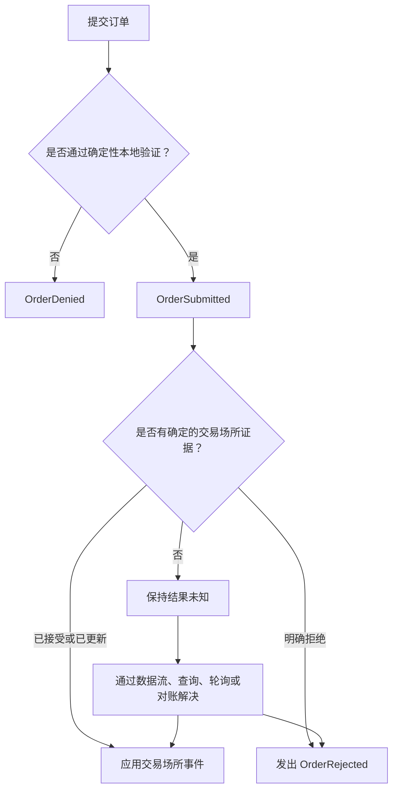
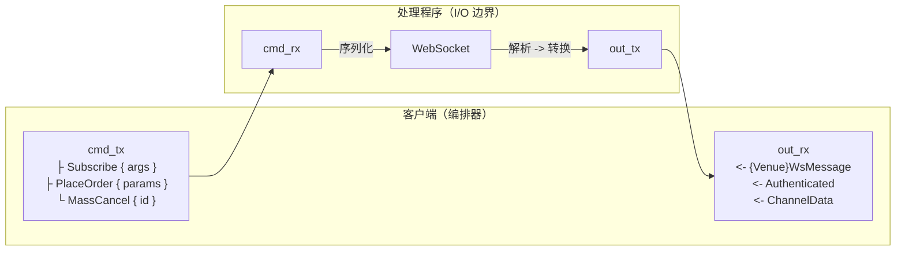

# 适配器

## 简介

适配器将 VibeTrader 连接到交易场所和数据提供商。优秀的适配器不只是传输字节：
它还会保留交易场所语义、生成有效的 Vibe 领域事件，并明确表达不确定结果。
这项工作要求严谨，但仓库已经提供了可靠的契约和有用示例。

适配器原生使用 Rust。它们以 Rust 实现平台的数据与执行客户端 trait，
然后通过 PyO3 向 Python 公开配置、工厂和部分底层 API。

请有选择地参考已有适配器。它们的布局反映了不同的交易场所协议、产品系列和实现历史。

| 适配器             | 有用的参考                                                              |
| ------------------ | ----------------------------------------------------------------------- |
| [Bybit][bybit]     | 多产品 HTTP 与 WebSocket 客户端、期权数据及执行结果处理。               |
| [OKX][okx]         | 覆盖广泛金融工具的公共、私有及业务 WebSocket 端点。                     |
| [Binance][binance] | 现货与期货产品拆分、交易 WebSocket 及 SBE 市场数据。                    |
| [Kraken][kraken]   | 具有不同 HTTP、WebSocket、数据和执行路径的现货与期货子模块。            |
| [Lighter][lighter] | Layer-2 签名、规范基准测试、覆盖率引导模糊测试及详细的执行状态处理。    |
| [Derive][derive]   | JSON-RPC 数据与执行、EIP-712 签名、规范基准测试及基于不变量的模糊测试。 |

本指南区分四类指导：

- **共享规则**来自公共 trait、网络抽象、钩子或 CI。
- **常见模式**出现在多个适配器中，但允许采用其他设计。
- **示例**展示一种可靠实现，但不将其规定为强制做法。
- 当交易场所语义或协议边界有要求时，**例外**是有效的。

## 适配器结构

Rust crate 是协议行为的事实来源。适配器通常会分离以下关注点：

```text
crates/adapters/<adapter>/
├── Cargo.toml
├── src/
│   ├── common/              # Shared credentials, enums, models, parsing, symbols, and URLs
│   ├── http/                # Typed requests, responses, signing hooks, and transport client
│   │   ├── client.rs
│   │   ├── error.rs
│   │   ├── models.rs
│   │   ├── parse.rs
│   │   └── query.rs
│   ├── websocket/           # Streaming transport, protocol messages, parsing, and routing
│   │   ├── client.rs
│   │   ├── handler.rs
│   │   ├── messages.rs
│   │   ├── parse.rs
│   │   ├── subscription.rs  # When subscription identity or replay needs a boundary
│   │   └── dispatch.rs      # When execution routing needs a boundary
│   ├── config.rs
│   ├── data.rs              # Or data/ when product implementations need a split
│   ├── execution.rs         # Or execution/ when product implementations need a split
│   ├── factories.rs
│   ├── python/              # PyO3 projection
│   ├── signing/             # When authentication or transaction signing is a subsystem
│   └── lib.rs
├── tests/                   # Public Rust boundary tests
├── test_data/               # Canonical venue payloads and protocol vectors
├── benches/                 # When confirmed hot paths warrant benchmarks
│   ├── common/              # Shared benchmark fixtures
│   ├── data.rs
│   ├── exec.rs
│   └── micros.rs
├── fuzz/                    # When untrusted codecs warrant coverage-guided fuzzing
│   ├── fuzz_targets/
│   └── README.md
├── examples/                # Rust tester nodes and focused usage examples
├── bin/                     # Optional protocol inspection or capture tools
└── README.md
```

Python 和文档界面位于 crate 之外：

```text
python/vibe_trader/adapters/<adapter>/  # Public package and generated stubs
examples/live/<adapter>/                    # Python data and execution testers
python/tests/unit/adapters/<adapter>/       # Public Python package tests
docs/integrations/<adapter>.md              # User-facing integration guide
```

只有 `Cargo.toml` 和 `src/lib.rs` 是通用的 crate 边界。适配器需要时再添加其他模块：

- 将符号、凭据、URL、共享枚举和共享解析放在 `common/` 下。
- 将传输模型、类型化请求、签名和 HTTP 客户端放在 `http/` 下。
- 将帧、消息、订阅状态、路由和 WebSocket 客户端放在 `websocket/` 下。
- 在 `data.rs` 和 `execution.rs` 中实现实盘数据与执行 trait；如果交易场所公开的协议存在实质差异，
  则在产品子模块中实现。
- 将 PyO3 投影代码保留在 `python/` 下。
- 按公共边界或产品组织集成测试。不要强迫所有适配器采用相同文件名。

当产品系列采用不同协议时，按产品拆分是合理的。如果请求和状态语义保持共通，
共享客户端也可以跨越不同端点。应匹配交易场所的真实边界，并将共享行为置于这些拆分之上。

Python 包文件位于 `python/vibe_trader/adapters/<adapter>/` 下。在当前原生 Rust 适配器中，
包通常会重新导出生成的绑定。请修改 Rust 绑定元数据或其他生成器输入，然后运行 `make py-stubs`；
不要编辑生成的 `.pyi` 文件。

### 仓库与 Python 接线

新的适配器 crate 必须能被拥有它的每个构建界面发现：

| 界面                | 必需变更                                                                               | 强制机制或证明                                                                            |
| ------------------- | -------------------------------------------------------------------------------------- | ----------------------------------------------------------------------------------------- |
| 根 Rust 工作区      | 将 crate 添加到 [`Cargo.toml`](../../Cargo.toml) 的成员和工作区依赖中。                | 工作区元数据和定向 Cargo 检查能够发现该 crate。                                           |
| 工作区测试清单      | 将 crate 添加到 [`Makefile`](../../Makefile) 的 `ADAPTER_CRATES`。                     | [工作区覆盖检查](../../scripts/ci/check-workspace-test-coverage.sh)要求存在一份测试清单。 |
| PyO3 crate          | 在 [`crates/pyo3/Cargo.toml`](../../crates/pyo3/Cargo.toml) 中添加可选依赖和功能传播。 | 构建匹配的 PyO3 功能时会编译适配器投影。                                                  |
| PyO3 根模块         | 在 [`crates/pyo3/src/lib.rs`](../../crates/pyo3/src/lib.rs) 中注册适配器模块。         | 约定钩子将此模块列表视为公共 API 允许列表。                                               |
| 适配器 PyO3 注册表  | 使用 `get_global_pyo3_registry()` 注册每个适用的工厂和配置提取器。                     | 工厂边界测试证明 Python 配置对象能够到达 Rust 工厂。                                      |
| Python 包与用户指南 | 仅为适配器公开的能力添加包投影、测试、示例和集成指南。                                 | 导入、生成漂移、示例构建和文档检查覆盖这些界面。                                          |

[Vibe 约定钩子](../../.pre-commit-hooks/check_vibe_conventions.sh)将 PyO3 模块列表视为公共 API 允许列表。
[PyO3 约定钩子](../../.pre-commit-hooks/check_pyo3_conventions.sh)还会强制执行：

- 存根元数据使用 `vibe_trader.adapters.<adapter>`。
- 运行时扩展导入使用 `vibe_trader._libvibe.<adapter>`。
- 使用 `#[pyo3(name = ...)]` 重命名的 Rust 函数应具有以 `py_` 开头的 Rust 名称。
- Python 异常使用项目的错误转换函数。

## 适配器实现顺序

使用以下阶段组织工作。它们描述依赖关系，而非发布门槛。仅提供市场数据的适配器会省略执行部分，
适配器也可以先完成一个产品，再开始另一个产品。在整个工作期间持续更新能力矩阵，
不要等到最终文档阶段。步骤标识符为进度与交接提供共享词汇；不适用于适配器的步骤可以省略。

### 阶段 1 之前：定义范围

| 步骤 | 组件         | 工作                                                                    |
| ---- | ------------ | ----------------------------------------------------------------------- |
| 0.1  | 能力矩阵     | 列出范围内的产品、环境、账户模式、数据类型、订单类型和报告。            |
| 0.2  | 交易场所约束 | 记录交易场所限制、不支持的能力和测试网差异。                            |
| 0.3  | 协议边界     | 识别独立产品 API、公共与私有端点，以及二进制或 JSON 传输。              |
| 0.4  | 初始切片     | 选择能够证明端到端路径的最小切片。                                      |
| 0.5  | 仓库接线     | 将 crate 添加到 Rust 工作区和测试清单，然后只添加它实际公开的投影界面。 |

**退出条件：** 集成指南包含初始能力矩阵、已知缺口和测试计划。

### 阶段 1：构建协议核心

| 步骤 | 组件               | 工作                                                                               |
| ---- | ------------------ | ---------------------------------------------------------------------------------- |
| 1.1  | HTTP 错误类型      | 建模传输、HTTP 状态、交易场所、解析和校验失败；在支持时对可重试性分类。            |
| 1.2  | HTTP 客户端        | 实现端点解析和类型化请求，并按需实现凭据、签名、速率限制、重试和分页。             |
| 1.3  | HTTP API 模型      | 定义类型化请求与响应，通常放在 `http/` 或其产品专用模块下。                        |
| 1.4  | HTTP 解析          | 在 `http/parse.rs` 或 `common/parse.rs` 的确定性边界将交易场所响应转换为领域类型。 |
| 1.5  | WebSocket 错误类型 | 建模连接、协议和解析失败；适用时也包括身份验证和命令失败。                         |
| 1.6  | WebSocket 客户端   | 实现生命周期与关闭，并在适用时实现身份验证、心跳、订阅状态和重新连接。             |
| 1.7  | WebSocket 消息     | 在 `websocket/` 或产品专用模块下定义帧和消息；按需包括确认与交易场所错误。         |
| 1.8  | WebSocket 解析     | 每帧只解码一次，转换领域事件，并按类型化标识路由数据或执行消息。                   |
| 1.9  | 协议测试           | 使用模拟对端证明 fixture、规范请求、适用的签名向量、生命周期及原始交换。           |

**退出条件：** crate 可编译，协议 fixture 可解析，适用的签名向量通过，且模拟或受控请求会完成任何必需的
身份验证并交换原始交易场所消息。

### 阶段 2：实现金融工具

| 步骤 | 组件         | 工作                                                                   |
| ---- | ------------ | ---------------------------------------------------------------------- |
| 2.1  | 金融工具解析 | 解析每个受支持系列，提供完整标识、精度、货币和合约字段。               |
| 2.2  | 金融工具加载 | 在每个需要上下文的解析边界加载、过滤、缓存并发出定义。                 |
| 2.3  | 符号映射     | 定义交易场所符号与 `InstrumentId` 之间的双向转换，不合并不同金融工具。 |
| 2.4  | 金融工具更新 | 实现最新金融工具请求，以及任何支持的定义或状态更新。                   |

**退出条件：** 不同 fixture 覆盖每个受支持的金融工具系列，无效定义会明确失败，
数据客户端会发出或返回完整的 Vibe 金融工具。

### 阶段 3：实现市场数据

在增加产品或端点扇出前，先从一个公共数据流和一个金融工具开始。

| 步骤 | 组件                  | 工作                                                               |
| ---- | --------------------- | ------------------------------------------------------------------ |
| 3.1  | 公共 WebSocket 数据流 | 订阅和取消订阅每种声明支持的实时数据类型，同时保留订阅意图。       |
| 3.2  | 历史数据请求          | 按精确的关联和新鲜度规则请求支持的 K 线、成交、报价或订单簿快照。  |
| 3.3  | 数据客户端            | 实现 `DataClient` 请求、订阅、生命周期及完整的 `DataEvent` 发出。  |
| 3.4  | 订单簿处理            | 保留快照、增量更新、序列、清空和批次边界。                         |
| 3.5  | 数据流恢复            | 处理格式错误的输入、间隙、取消订阅、断开连接、重新连接和订阅重放。 |

**退出条件：** 单元测试与模拟传输测试为支持的请求和订阅矩阵证明完整领域事件。

### 阶段 4：实现执行

启用订单流之前，应先建立账户状态和对账。

| 步骤 | 组件         | 工作                                                                        |
| ---- | ------------ | --------------------------------------------------------------------------- |
| 4.1  | 账户引导     | 建立账户标识、初始账户状态、私有订阅和已连接就绪状态。                      |
| 4.2  | 对账报告     | 在启动时及按需生成适用的订单、成交、持仓和批量状态报告。                    |
| 4.3  | 基本订单提交 | 实现支持的市价单和限价单提交，并进行确定性的本地校验。                      |
| 4.4  | 订单修改     | 实现支持的修改与取消命令，包括交易场所的取消替换语义。                      |
| 4.5  | 执行客户端   | 实现 `ExecutionClient` 命令、生命周期、已跟踪与外部路由，以及有序事件发出。 |
| 4.6  | 结果恢复     | 保留未知结果、去重成交，并通过数据流、查询或对账解析状态。                  |

**退出条件：** 模拟传输测试覆盖每个受支持的命令、确定性拒绝、不确定传输、重复或乱序更新，以及启动对账。

### 阶段 5：添加可选交易场所能力

仅在基础生命周期稳定后添加这些能力。

| 步骤 | 组件             | 工作                                                               |
| ---- | ---------------- | ------------------------------------------------------------------ |
| 5.1  | 高级订单类型     | 添加适用的条件、止损、止盈、追踪止损或其他高级订单。               |
| 5.2  | 批量操作         | 添加批量提交、批量取消和全部取消，并逐订单处理结果。               |
| 5.3  | 交易场所专用数据 | 将资金费率、希腊字母指标、强平或交易场所扩展作为独立能力切片添加。 |
| 5.4  | 产品或端点拆分   | 仅在协议、身份验证、配额或恢复边界有要求时拆分所有权。             |
| 5.5  | 能力证明         | 为每项能力添加 fixture、功能测试、验收用例和记录在文档中的限制。   |

**退出条件：** 每项可选能力都可独立测试，且不会削弱已建立的基础路径。

### 阶段 6：完成工厂与投影

| 步骤 | 组件       | 工作                                                                |
| ---- | ---------- | ------------------------------------------------------------------- |
| 6.1  | 配置结构体 | 最终确定类型化数据与执行配置、默认值、环境回退和机密脱敏。          |
| 6.2  | 客户端工厂 | 使用所需时钟和 `CacheView` 输入实现 Rust 工厂。                     |
| 6.3  | PyO3 注册  | 向 PyO3 注册表注册适用的工厂和配置提取器。                          |
| 6.4  | Python 包  | 为向 Python 公开的能力添加公共包和 Python 边界测试。                |
| 6.5  | 生成的存根 | 添加 Rust 存根元数据，并使用 `make py-stubs` 重新生成 `.pyi` 输出。 |

**退出条件：** Rust 工厂测试和 PyO3 边界测试通过，包导入可解析，且生成输出与其 Rust 输入匹配。

### 阶段 7：证明符合要求

| 步骤 | 组件            | 工作                                                                 |
| ---- | --------------- | -------------------------------------------------------------------- |
| 7.1  | Rust 单元测试   | 证明解析器、序列化器、符号、签名、状态转换及格式错误输入。           |
| 7.2  | Rust 集成测试   | 针对确定性模拟传输运行公共 HTTP、WebSocket、数据和执行边界。         |
| 7.3  | Python 边界测试 | 证明导入、配置提取、工厂、类型转换及代表性异步调用。                 |
| 7.4  | 验收测试        | 在测试网或受控账户运行每个适用的 `DataTester` 和 `ExecTester` 用例。 |
| 7.5  | 恢复测试        | 测试连接失败、重新连接、关闭、速率限制及状态恢复。                   |
| 7.6  | 规格缺口        | 记录每个跳过的规格用例及其交易场所或能力原因。                       |

**退出条件：** 适用的数据与执行测试规格通过，每项声明的能力都具有确定性证据和交易场所证据。

### 阶段 8：衡量性能与稳健性

| 步骤 | 组件         | 工作                                                                     |
| ---- | ------------ | ------------------------------------------------------------------------ |
| 8.1  | 规范基准测试 | 使用有代表性的 fixture 测量已确认的端到端数据与执行热路径。              |
| 8.2  | 微基准测试   | 隔离已确认的签名、哈希、身份验证、编解码、解析或序列化成本。             |
| 8.3  | 模糊测试目标 | 使用真实语料库对不可信的解析、解码、规范化、签名和编码边界进行模糊测试。 |
| 8.4  | 不变量       | 断言比"不发生 panic"更强的领域和协议属性。                               |

**退出条件：** 规范基准测试和模糊测试套件使用有代表性的 fixture 与记录在文档中的不变量运行，
且不强制要求适配器并未使用的类别。

### 阶段 9：完成文档与运维

| 步骤 | 组件       | 工作                                                       |
| ---- | ---------- | ---------------------------------------------------------- |
| 9.1  | 能力矩阵   | 将每项支持声明和例外与经过测试的实现进行核对。             |
| 9.2  | 集成指南   | 记录凭据、配置、限制、对账、环境差异和已知缺口。           |
| 9.3  | 测试器入口 | 提供采用安全默认值的适用 Rust 与 Python 数据和执行测试器。 |
| 9.4  | 运维       | 记录恢复、故障排除及运维人员必须了解的任何交易场所行为。   |
| 9.5  | 最终验证   | 验证链接、生成输出、示例及定向文档检查。                   |

**退出条件：** 用户无需阅读源代码，即可配置、测试、运行和诊断适配器。

## Rust 适配器模式

仓库范围的导入策略适用于适配器代码：导入 Vibe 类型并使用其短名称，
不要在调用位置使用完全限定名称。[Vibe 约定钩子](../../.pre-commit-hooks/check_vibe_conventions.sh)
会强制执行此规则，并记录其限定范围的例外标记。

### 配置（`config.rs`）

遵循共享的[配置指南](../concepts/configuration.md)。尤其是，Rust 配置应使用类型化字段、
严格的 Serde 解码、唯一的默认值事实来源以及 `bon::Builder`。
适配器配置只需在此基础上添加交易场所语义：

- 对环境、产品系列、账户模式或端点等封闭集合使用枚举。
- 只有当缺省具有独立含义时才使用 `Option<T>`，包括运行时凭据回退。
- 当数据与执行的能力或凭据不同时，将两者的配置分开。
- 为任何可能保存机密的配置实现经过脱敏的 `Debug`。
- 保持 Python 配置投影精简。它只转换类型，并委托给 Rust 配置。

集中解析默认 HTTP 与 WebSocket 端点，确保一次环境选择不会混用实盘和测试端点。
仅在自定义网关、模拟服务器或交易场所部署有要求时保留显式 URL 覆盖。
测试每个支持的环境，以及环境选择与显式覆盖之间的任何优先级。

### 凭据与机密处理

当 HTTP 和 WebSocket 客户端使用相同密钥材料时，应将凭据处理集中到一个类型中，
通常位于 `common/credential.rs`。配置应保持为数据传输对象：在构造凭据、工厂或客户端时解析凭据，
不要在 Python 包装器或各个请求方法中解析。

- 只定义一次环境变量名，并根据类型化的环境和产品值选择。
- 将所有字段作为一个凭据集合解析。公共客户端可以保持未认证，但已认证客户端在发送请求前
  应拒绝不完整或无效的集合。
- 将机密字段存储在自有内存中，并在释放时清零。从 `Debug` 中脱敏机密和私钥。
  如果日志需要凭据标识，只记录经过掩码处理的 API 密钥。
- 仅当不同传输使用相同密钥材料时，才在它们之间共享凭据存储。当 HTTP、WebSocket 和交易签名方法
  使用不同的规范载荷时，应将它们分开。
- 测试显式值、环境回退、缺失字段、脱敏输出和确定性签名向量。

为每个交易场所和环境使用仓库既定的环境变量名。用户需要这些名称，因此应在适配器集成指南中
记录确切名称。

切勿在错误、INFO 日志或 DEBUG 日志中包含凭据、签名或机密材料。
不要添加适配器级的原始已认证请求或 WebSocket 载荷日志。共享传输的 TRACE 日志可能包含原始出站载荷，
因此应将 TRACE 输出视为敏感信息，并在分享前进行脱敏。

### 符号与金融工具标识

将交易场所符号与 Vibe `InstrumentId` 值分开。符号模块通常负责：

- 解析和格式化交易场所符号。
- 唯一 Vibe 符号所需的产品或合约后缀。
- 校验交易场所和产品标识。
- 为支持的形式提供往返测试，并为有歧义的形式提供拒绝测试。

根据交易场所的标识方案选择映射：

| 交易场所标识                      | Vibe 表示                  | 示例                                                |
| --------------------------------- | -------------------------- | --------------------------------------------------- |
| 原生符号可以区分产品              | 保留符号并添加交易场所。   | `BTC-USDT-SWAP` -> `BTC-USDT-SWAP.OKX`。            |
| 原始符号在不同产品系列中复用      | 添加并校验稳定的产品后缀。 | Bybit 线性 `BTCUSDT` -> `BTCUSDT-LINEAR.BYBIT`。    |
| Vibe 与交易场所使用不同的合约标记 | 在一个边界实现双向转换。   | Binance USD-M `BTCUSDT` -> `BTCUSDT-PERP.BINANCE`。 |
| 传输大小写与规范标识不同          | 仅在构建传输值时转换。     | Binance 流 `BTCUSDT-PERP.BINANCE` -> `btcusdt`。    |

[`BybitSymbol`](../../crates/adapters/bybit/src/common/symbol.rs) 包装器和
[Binance 符号转换](../../crates/adapters/binance/src/common/symbol.rs)展示了后缀及双向转换模式。
应将它们视为示例，而非共享后缀方案。

不要将不同的交易场所金融工具规范化为同一个 `InstrumentId`。为测试 fixture 提供不同的符号、
精度、货币和合约字段，使互换和遗漏能够明显失败。

对每个受支持的产品系列，测试交易场所符号 -> `InstrumentId` -> 交易场所符号。
在标识边界统一规范化一次大小写，并在其他位置保留对交易场所有意义的大小写。
当映射要求产品标记时，应在缓存金融工具前拒绝缺失或有歧义的标记。

根据最新的交易场所定义构造金融工具。在缓存或发出前校验必需的标识和精度。
在可行时，保持解析函数确定且不依赖实盘客户端状态。

### 建模交易场所载荷

应建模线上格式，而不是想象中的稳定子集：

- 对已知字段使用类型化请求与响应结构体。
- 仅当支持的载荷有要求时，才使用 Serde 别名或自定义反序列化器。
- 对含义会影响领域行为的封闭集合，拒绝未知值。
- 对可能在协议版本不变时扩展的开放交易场所集合，保留未知值或对其明确分类。
- 将原始模型与 Vibe 领域对象分开。在一个可审计边界完成转换。
- 将价格、数量、货币金额、费用及其他离散值反序列化为 `Decimal`。使用
  `Price::from_decimal_dp`、`Quantity::from_decimal_dp`、`Money::from_decimal`
  或 `Money::zero` 构造领域值；切勿让线上值经过 `f64`。请参阅
  [领域数值类型](rust.md#domain-numeric-types)。
- 显式传入必需的解析上下文，包括金融工具精度、货币、账户标识和 `ts_init`。
  将实盘客户端状态留在解析器之外。
- 根据交易场所模式处理缺失、null 和空值。当它们含义不同时，不要将其合并为同一个回退值。
- 当载荷提供交易场所时间戳时，将其用于 `ts_event`。适配器接收或构造事件时，
  从适配器时钟分配 `ts_init`。只有在交易场所没有权威时间戳时才使用接收时间作为事件时间，
  并用测试覆盖此回退。

避免使用宽松回退，悄然将新的交易场所值转换为现有语义值。稳定的错误处理是解析器契约的一部分。

### 客户端 trait 与工厂（`data.rs`、`execution.rs`、`factories.rs`）

共享的 [`DataClient`](../../crates/common/src/clients/data.rs)、
[`ExecutionClient`](../../crates/common/src/clients/execution.rs) 和
[客户端工厂](../../crates/common/src/factories/client.rs) trait 定义适配器边界。
实现受支持的方法，并在集成指南中明确列出不支持的能力。

工厂接收向下转型后的 `ClientConfig` 和只读
[`CacheView`](../../crates/common/src/cache/mod.rs)。数据工厂还接收共享时钟。
使用该视图解析金融工具和现有状态。引擎缓存写入应留在引擎内部：
适配器应发出领域事件和报告，而不是修改引擎缓存。当解析、订阅重放或响应关联需要时，
可以使用私有协议缓存。

客户端 trait 使用 `#[async_trait(?Send)]`。客户端对象并不应跨线程移动，
并且可以保存非 `Send` 的 Python 状态。当异步工作必须比同步 trait 调用存活更久时，
将自有的 `Send` 输入移动到显式运行时任务中。

### 适配器自有状态

根据所有权和更新行为选择集合：

- 对单个任务拥有的状态使用普通 `AHashMap` 或 `AHashSet`。
- 对读取频繁、写入不频繁的不可变快照使用 `AtomicMap` 或 `AtomicSet`。
  当写入者可能发生竞争时使用 `rcu`；分开的加载和存储可能丢失另一个写入者的更新。
- 对接收并发条目更新的独立键使用 `DashMap` 或 `DashSet`。

不同适配器会以不同组合使用这些模式。将集合保留在拥有其不变量的组件后面，
不要仅为了避免传递消息而共享集合。当驻留可减少分配或比较成本时，对重复协议字符串使用 `Ustr`；
唯一请求 ID 和短期载荷文本则保留其自然类型。

### 连接生命周期（`connect`）

将每个生命周期方法视为契约：

| 方法         | 职责                                                               | 成功后置条件                                   |
| ------------ | ------------------------------------------------------------------ | ---------------------------------------------- |
| `start`      | 安装本地事件管道，并启动客户端自有后台工作。                       | 任何任务可以发布前，本地事件路径已经存在。     |
| `connect`    | 建立传输、进行身份验证、加载所需定义或账户状态，并启动数据流处理。 | 公共命令可以使用传输，且必需的引导状态可观察。 |
| `disconnect` | 停止新的网络工作并关闭传输。                                       | 客户端不再发送或接收交易场所流量。             |
| `stop`       | 通过幂等路径结束客户端自有工作。                                   | 重复清理是安全的。                             |
| `reset`      | 清除可重新连接的缓存、计数器、取消状态和过时的在途状态。           | 后续启动或连接不会继承无效会话状态。           |
| `dispose`    | 释放后台任务、线程和外部句柄。                                     | 不再有客户端自有资源处于活动状态。             |

在公共命令能够使用传输且所需的引擎端状态可观察之前，不要报告已连接。
尤其是，当执行客户端异步发出初始账户状态时，应等到引擎缓存包含该账户后再调用 `set_connected`；
对账和策略启动会将已连接视为就绪信号。对所需金融工具或数据流引导状态应用同一规则。
当传输连接先于套接字进入活动状态完成时，应在订阅或报告就绪前执行有界的 `wait_until_active` 步骤。
发生部分连接失败时，清理已经启动的资源，并保持状态一致，以便重试或释放。

当执行客户端使用
[`ExecutionEventEmitter`](../../crates/live/src/execution/emitter.rs) 时，应在任何任务可以发出事件前，
于 `start` 期间安装其发送端。

#### 引导顺序

连接代码可以不同，但其依赖关系不变。数据客户端通常会：

1. 解析环境，并校验引导期间所需的任何凭据。
1. 获取所需金融工具定义，并填充解析上下文。
1. 发布必须在数据到达前由引擎观察到的定义。
1. 启动传输，并等待命令路径进入活动状态。
1. 仅在处理器初始化后订阅或重放意图。
1. 所需的引擎与协议状态就绪后报告已连接。

执行客户端通常会：

1. 校验凭据、账户标识和所需金融工具上下文。
1. 建立并认证私有传输。
1. 以不会丢失确认或账户更新的顺序启动数据流处理和订阅。
1. 获取并发出初始账户状态，或等待权威数据流快照。
1. 等待所需账户与金融工具状态对引擎可观察。
1. 只有在命令与对账可以运行后才报告已连接。

应将这些视为依赖约束，而不是必需的函数名。只要测试证明相同的后置条件，
交易场所可以合并或重新排序步骤。如果任何步骤在资源启动后失败，应在返回错误前清理这些资源。

### 数据客户端

订阅表达持续意图。请求则要求提供商返回当前或历史数据。两者的新鲜度语义应保持不同：

- 显式金融工具请求会从提供商获取数据，除非 API 契约明确允许缓存结果。
- 私有缓存可以提供解析上下文，但不得将新请求变成过时响应。
- 只为满足请求标识和过滤条件的数据发出响应。
- 在响应事件中保留请求关联 ID 和原始参数。

共享的 [`DataEvent`](../../crates/common/src/messages/mod.rs) 信封决定数据如何进入引擎：

| 变体                          | 用途                                               | 必须保留的契约                                 |
| ----------------------------- | -------------------------------------------------- | ---------------------------------------------- |
| `DataEvent::Instrument`       | 来自引导、请求或更新的金融工具定义。               | 保留完整标识、精度及可用的交易场所时间戳。     |
| `DataEvent::InstrumentStatus` | 交易或可用性状态变更。                             | 发出有意义的转换，而不是未发生变化的轮询快照。 |
| `DataEvent::Data`             | 成交、报价、订单簿数据、K 线及其他类型化市场数据。 | 发出前完成解析和事件边界构造。                 |
| `DataEvent::Response`         | 当前或历史数据请求的结果。                         | 保留请求关联、参数、过滤条件和新鲜度语义。     |
| `DataEvent::FundingRate`      | 衍生品资金费率更新。                               | 保留交易场所的生效或事件时间以及金融工具标识。 |
| `DataEvent::OptionGreeks`     | 交易场所提供的期权希腊字母指标。                   | 保留源金融工具，并区分交易场所值与本地计算。   |
| `DataEvent::DeFi`             | 受功能门控的去中心化金融数据。                     | 仅当适配器和构建公开共享 `defi` 功能时发出。   |

添加回归测试，在两次请求之间改变上游金融工具响应。第二次响应必须反映新的交易场所状态，
而不是私有缓存条目。

通过引擎的数据事件路径发布类型化数据。在发出前完成解析和校验，
并且不要跨下游分派持有可变适配器状态。事件接收端关闭通常意味着引擎正在停止：
记录发送失败，让生命周期清理负责恢复，而不是无限期重试同一事件。

对于订单簿增量数据，遵循
[增量标志与事件边界契约](../concepts/data/index.md#delta-flags-and-event-boundaries)。
每次逻辑更新都以 `F_LAST` 结束；快照使用 `F_SNAPSHOT`，并以
`F_SNAPSHOT | F_LAST` 结束，包括只由 `Clear` 表示的空快照。

当交易场所只以轮询快照形式公开金融工具状态时，将其与先前的完整快照进行差异比较，
并发出变更，而不是重复每个状态。根据交易场所契约处理从快照中移除的金融工具。
只有当消失意味着金融工具不可用时，才将移除映射到 `NotAvailableForTrading`。
即使只为活动订阅过滤发出内容，也要更新完整的私有缓存。

### 执行客户端

执行客户端转换命令、保留订单标识、发布账户状态，并生成用于对账的报告。
它们必须一致地支持以下边界：

- 提交前校验确定性的本地约束。
- 只有当命令进入适配器提交路径时，才发出 `OrderSubmitted`。
- 将交易场所响应与数据流更新关联到正确的客户端和交易场所订单 ID。
- 使用工厂采用的账户类型和基础货币发出余额与保证金。
- 根据交易场所状态生成订单、成交、持仓和批量状态报告用于对账。
- 发布账户状态前，释放共享时钟、缓存或账户借用，因为订阅者可能同步访问同一状态。

不要只根据交易场所 API 推断支持。实现并测试 Vibe 命令与事件语义后，再声明能力。

#### 已跟踪与外部执行更新

应根据订单所有权路由执行更新，不受分派模块布局影响：

- 对于由此客户端提交并跟踪的订单，通过正常订单状态机发出类型化订单事件。
- 对于未跟踪或外部订单，发出 `OrderStatusReport` 和 `FillReport` 值，
  使执行引擎能够对账或创建外部订单。

不要为未跟踪订单虚构策略或客户端标识。在报告中保留可用的交易场所标识，
并让引擎应用[外部订单所有权](../concepts/execution.md#external-order-creation)。
适配器可以使用任何能够证明此路由决定的状态结构。

#### 事件排序与去重

交易场所可以通过订单响应、私有数据流、查询和对账结果报告同一次转换。
应按稳定的交易场所标识去重，而不是按交付更新的传输去重：

- 对成交使用交易场所成交或撮合 ID。如果交易场所不保证全局唯一性，
  应包括账户、金融工具或产品标识。
- 当实盘分派与对账路径可能重叠时，在两者之间共享成交标识。
- 在解析和路由成功前，不要消耗去重键。如果实现先预留，应在失败后释放该键，
  使重放可以恢复事件。
- 限制长期去重状态，但在重新连接期间保留足够历史，以覆盖交易场所重放。
  只有当协议证明旧标识符不会再次出现时才重置。
- 使重复确认与订单快照保持幂等。它们不得使状态倒退，也不得发出第二个生命周期事件。

对于已跟踪订单，确定性成交可能先于确认或未结订单更新到达。
只有当适配器具有完整订单标识，且交易场所证据证明该状态时，才发出任何必需的先前生命周期事件。
记录合成的转换，使后续确认不会重复该转换。未跟踪订单仍通过报告处理，而不是通过合成的策略事件。

当交易场所将修改实现为取消替换时，应在路由替换腿前更新交易场所订单 ID 映射。
区分针对旧腿的过时取消与活动替换腿的取消，并根据当前累计成交计算替换数量。
此行为因交易场所而异，需要针对竞争条件的定向测试；它并不意味着共享的分派状态布局。

#### 订单命令结果策略

区分三类证据：

- **确定性本地失败：** 确定性校验证明提交命令无法发送。在 `OrderSubmitted` 前发出 `OrderDenied`。
  对于取消或修改准备，只有当失败可归因于该命令且证明命令未发送时，才发出匹配的拒绝事件。
  否则只记录失败，不要虚构拒绝。
- **确定性交易场所结果：** 结构化交易场所响应或状态明确接受、更新或拒绝某一命令。
  发出匹配的领域事件。
- **未知结果：** 请求可能已到达交易场所，但没有可用的确定性结果。
  让命令保持在途，等待数据流更新、轮询、查询或对账。



如果提交校验在 `OrderSubmitted` 后失败，应让订单保持在途，除非确定性交易场所证据解析了结果。

传输错误、超时、断开连接、任务取消、重试耗尽、HTTP 5xx 响应、速率限制、确认缺失，
以及传输后的解析失败通常都会留下未知结果。不要将它们转换为交易场所拒绝。

对于批量命令，应逐订单应用证据。整个请求失败并不能证明每个子命令都失败。
根据记录在文档中的交易场所语义处理"未找到"或"已关闭"等交易场所消息；
它们可能描述了与成交或取消的竞争，而不是无歧义的命令拒绝。

此策略应独立于用于发送命令的 HTTP 或 WebSocket 路径。

## HTTP 客户端模式

### 客户端结构

常见设计分为两层：

| 层级       | 接受                     | 返回                   | 拥有                                     |
| ---------- | ------------------------ | ---------------------- | ---------------------------------------- |
| 原始客户端 | 交易场所请求与查询类型。 | 交易场所响应模型。     | 传输、身份验证、速率限制及精确线上编码。 |
| 领域客户端 | Vibe 标识符与命令。      | 领域对象、报告或确认。 | 操作语义、解析上下文、缓存和领域映射。   |

当协议较小，而拆分只会增加转发方法时，使用一层即可。
当不同产品系列的端点、签名或响应模型发生变化时，按产品拆分。

在可行时，根据交易场所操作命名底层方法，例如 `get_instruments` 或 `place_order`。
根据 Vibe 语义命名领域方法，例如 `request_instruments`、`submit_order` 或 `cancel_order`。

#### 请求流

无论由一个还是两个客户端拥有这些职责，都应保持边界明确：

1. 在领域边界校验 Vibe 输入，并构建类型化交易场所参数。
1. 在传输边界选择 HTTP 方法和路径，然后序列化精确查询或正文。
1. 分配任何必需的请求标识、时间戳或 nonce。需要时对精确的线上表示签名，
   然后通过共享 `vibe_network::http::HttpClient` 使用适用的速率限制键发送。
1. 解码响应信封，并保留传输、HTTP 状态、交易场所及解析失败。
1. 在领域边界使用显式的金融工具、账户和时间上下文，将成功载荷转换为领域类型。

将类型化请求构造与发送分开。这样无需服务器即可测试签名与规范查询编码。
当响应转换不需要实盘状态时，将其放入纯解析函数。

类型化请求与查询构建器会保留省略字段、显式零值和空值之间的差异。
保持必需交易场所参数为必填，从线上表示中省略缺省的可选参数，
并测试精确序列化后的查询或正文。分页代码还应测试游标方向、包含边界、重复边界记录，
以及重复游标或空页面，防止无限循环。

### 请求签名与身份验证

构建交易场所要求的精确规范字节，然后只签名一次。测试：

- 字段顺序和分隔符。
- 时间戳和接收窗口单位。
- 十进制数和枚举编码。
- 正文或查询哈希。
- 环境和账户标识符。
- 可用的已知交易场所向量。

明确 nonce 或序列的所有权。如果命令可以并发运行，应定义适配器如何序列化、分配或拒绝冲突 nonce。
除非交易场所语义证明安全，否则切勿使用新标识重试已签名的状态变更请求。

即使交易场所将请求标识、时间戳和 nonce 打包到一个签名载荷中，也要将它们视为独立协议字段。
分配 nonce 的组件也拥有其排序规则。根据同一个已预留值构建并签名，
然后按照记录在文档中的交易场所消耗语义处理发送前失败、不确定传输和交易场所 nonce 拒绝。
发生序列不匹配时，应从权威来源重新同步，再发出其他状态变更命令。
测试确定性向量、并发分配、单调性或唯一性，以及序列被拒后的恢复。

### 错误处理与重试逻辑

映射传输、HTTP 状态、交易场所错误、解析和校验失败时，不要抹去其来源。
重试策略遵循操作安全性：

- 仅对已分类的瞬态失败重试读取及其他幂等操作。
- 遵守交易场所的退避和速率限制信号。
- 取消时停止重试。
- 除非正面证据证明被拒，否则应将中断或耗尽重试的状态变更请求视为未知结果。

当共享 [`RetryManager`](../../crates/network/src/retry.rs) 的取消和退避模型适用时使用它。
适配器专用分类器仍负责交易场所代码与操作语义。

### 速率限制

共享 [`HttpClient`](../../crates/network/src/http/client.rs) 支持一个或多个速率限制器。
应按交易场所配额划分限制器状态，而不是按便于使用的 Rust 对象划分：

- 在消耗相同额度的客户端和操作间共享一个桶。
- 只有在交易场所公布独立配额时才使用不同的桶。
- 发送请求前获取所有必需配额。
- 让分页与重试循环处于同一策略内。

匹配交易场所的实际计量方式：窗口形状、突发行为、端点权重和共享外部流量。
按标称速率设置的令牌桶在空闲后的突发流量中，仍可能超过严格滚动窗口。
不要假定线上延迟会提供余量。

当交易场所单独限制并发的未确认命令时，应在发送速率限制器旁添加闭环在途门控。
在每次终态确认、拒绝或发送失败时释放其槽位，并在重新连接时重置门控。
单靠速率限制器无法观察确认延迟。

不要将一个适配器的桶名称或配额复制到另一个适配器。
在集成指南中记录用户可见的限制和配置。

## WebSocket 客户端模式

WebSocket 分派组织方式比大多数适配器边界具有更多仓库内差异，并且仍在积极标准化。
新代码应与共享网络抽象及最接近的协议同类保持一致，但不要将某个适配器的分派模块或状态结构
视为目标架构。

### 客户端结构

常见模式会将外层客户端与处理器任务分开：

- 外层客户端拥有生命周期、身份验证协调、订阅意图，以及向数据或执行客户端公开的数据流。
- 处理器拥有 `WebSocketClient`，负责序列化命令、解码帧及发出类型化消息。
- 通道在边界间传输自有命令与消息。

一些适配器使用流模式，并在适配器内执行重新连接；另一些则使用网络客户端的处理器模式和自动重新连接。
两者都合理。只有当端点、身份验证、吞吐量或协议语义证明额外生命周期是合理的，
才拆分市场数据与交易处理器。

根据协议事实选择客户端边界：

| 协议形态                           | 可考虑的结构                       | 义务                                           |
| ---------------------------------- | ---------------------------------- | ---------------------------------------------- |
| 一个端点和一个多路复用协议         | 一个客户端与处理器                 | 按类型化通道标识路由，不重复生命周期状态。     |
| 一个协议跨越不同产品端点           | 一个编排器加一个客户端集合         | 为每个活动产品客户端连接、关闭并重放意图。     |
| 独立的公共、私有或交易端点         | 独立传输，并在有用时共享模型       | 根据各自契约认证和恢复每个端点。               |
| 不同的线上格式、签名或重新连接规则 | 共享数据或执行逻辑后的独立协议模块 | 将共享金融工具与订单标识置于协议专用代码之上。 |

此表是决策辅助，而不是目标分派架构。不要仅为了匹配另一个适配器的文件名而拆分客户端，
也不要在合并端点会隐藏独立身份验证、配额或恢复时合并端点。



此图展示常见所有权边界，而不是必需的类型或字段名。

#### 处理器初始化握手（`SetClient`）

多个适配器通过 `SetClient` 命令，将已连接的 `WebSocketClient` 移入已运行的处理器。
其他适配器会以不同方式构造或发布处理器。无论采用哪种设计，都应保留以下不变量：

> 任何公共订阅、订单或控制命令都不能越过处理器初始化。

在发布命令发送端或已连接状态前，将初始化排入队列；也可以使用其他能证明相同顺序的机制。
测试在连接边界发出的命令，防止竞争导致命令悄然丢失。

### 身份验证

当身份验证状态必须在客户端、处理器和重新连接路径间共享时，使用
[`AuthTracker`](../../crates/network/src/websocket/auth.rs)。适配器仍拥有协议细节：

- 开始一次身份验证尝试，并关联响应。
- 根据确定性交易场所帧标记明确成功或失败。
- 在可重新连接的连接丢失时使身份验证失效。
- 在终态关闭时使等待者失败。
- 在身份验证成功前阻止私有重放和命令。

可刷新的令牌、多账户会话和混合公共/私有端点需要适配器专用状态。
将此状态保持在凭据和订阅路径附近，并通过定向测试覆盖轮换或到期。

### 订阅管理

当交易场所具有已确认订阅或重新连接重放时，使用
[`SubscriptionState`](../../crates/network/src/websocket/subscription.rs)。
它将意图与确认分开，并包含用于重复订阅者的引用计数。

| 状态         | 含义                                             |
| ------------ | ------------------------------------------------ |
| 等待订阅     | 客户端打算订阅，并等待交易场所确认或第一条数据。 |
| 已确认       | 交易场所已确认订阅，或已发送该订阅的权威数据。   |
| 等待取消订阅 | 客户端打算移除订阅，并等待确认。                 |

| 触发条件             | 共享操作                                 | 结果                                   |
| -------------------- | ---------------------------------------- | -------------------------------------- |
| 第一个本地订阅者     | `try_mark_subscribe` 或 `mark_subscribe` | 记录等待订阅意图，并在需要时发送。     |
| 订阅确认或权威第一帧 | `confirm_subscribe`                      | 将等待意图转为已确认。                 |
| 订阅失败             | `mark_failure`                           | 保持订阅意图为等待状态，以便恢复。     |
| 最后一个本地订阅者   | `mark_unsubscribe`                       | 移除活动意图，并记录等待取消订阅。     |
| 取消订阅确认         | `confirm_unsubscribe`                    | 移除等待取消订阅，不抹去后续重新订阅。 |

协议提供明确的交易场所确认时，应据此确认。如果确认缺失或不可靠，
权威的第一条数据可以确认主题。由于确认是幂等的，两条路径可以共存。
切勿仅根据本地发送成功进行确认。出现否定订阅结果时，调用 `mark_failure`，
使重新连接保留意图。分别关联取消订阅结果，防止迟到的订阅确认恢复已移除意图，
也防止过时的取消订阅确认抹去后续重新订阅。

根据交易场所订阅参数派生稳定主题键，但如果重放会要求有损解析，应保留原始参数。
重新连接时：

1. 使连接和身份验证状态失效。
1. 重新建立传输。
1. 在需要时进行身份验证。
1. 重放活动与等待中的订阅意图。
1. 根据明确确认或权威数据确认订阅。
1. 当下游消费者必须重置协议状态时通知它们。

不要重放等待取消的订阅。处理迟到或过时的确认时，不要恢复已移除订阅。
`SubscriptionState` 提供这些状态转换；适配器提供线上关联。

### 消息路由

保持路由边界可审计：

- 原始帧只解码一次。
- 在领域数据之前处理传输控制、身份验证和订阅确认。
- 在选择解析器前校验通道与产品标识。
- 将交易场所载荷转换为一条类型化适配器消息或有界消息序列。
- 在可行时，于可变协议状态之外分派领域事件。
- 保留足够标识，以关联执行响应并去重重叠来源。

分派模块布局、中间枚举名称和状态容器仍由适配器决定。
优先采用能够让协议所有权和状态转换可测试的最小设计。

### 重新连接与关闭

重新连接必须恢复协议状态，而不只是恢复套接字：

- 在报告客户端活动前重新创建或替换命令路径。
- 重新认证私有会话。
- 恢复订阅意图和所需金融工具上下文。
- 当交易场所要求重新引导时，重置序列、快照或间隙状态。
- 保留关联迟到响应或对账所需的在途执行状态。

在适用时，同时支持 WebSocket 控制帧和交易场所文本心跳。
让共享客户端处理协议控制帧，将应用心跳消息保留在交易场所处理器中。

关闭过程会向任务发送信号、要求传输关闭，然后根据有界策略 join 或中止自有工作。
使重复关闭保持安全。当客户端对象可以克隆时，不要假定一个处理器 `JoinHandle` 只有一个所有者。

### 背压

当前共享 WebSocket 传输与适配器事件路径使用无界 Tokio 通道，
因此接收循环无需等待队列容量。实盘事件路径应保留此约定。
引入有界通道、合并、丢弃或队满断开策略会改变平台语义，
需要显式共享设计，而不是适配器局部变更。

无界队列以潜在内存增长换取没有背压。保持接收循环工作集中，公开处理器失败，
并测试从消费者断开中恢复。切勿丢弃执行事件。只有当市场数据协议契约定义了相应恢复时，
才能使用快照与重新同步。

## 任务管理

### 生成异步任务（`spawn_task`）

同步客户端 trait 方法不得阻塞活动 Tokio 运行时。克隆自有输入、生成异步操作，
并返回本地校验结果。对于适配器生产任务，使用 `vibe_common::live::get_runtime().spawn()`，使原生 Rust 与
Python 绑定使用已配置的运行时。

[Tokio 使用钩子](../../.pre-commit-hooks/check_tokio_usage.sh)会拒绝适配器生产代码中的 `tokio::spawn`，
并要求使用完全限定的 Tokio spawn、time 和 sync 路径。

保持同步边界精简：

```rust
fn spawn_request<F>(&self, description: &'static str, future: F)
where
    F: Future<Output = anyhow::Result<()>> + Send + 'static,
{
    let handle = get_runtime().spawn(async move {
        if let Err(error) = future.await {
            log::warn!("{description} failed: {error:?}");
        }
    });
    self.tasks.push(handle);
}
```

在构造 future 前校验命令，并克隆每个输入。不要在比 trait 调用存活更久的工作中捕获
`RefCell` 借用、缓存 guard、时钟借用或命令引用。

当需要集合时，对客户端自有任务使用 [`TaskHandles`](../../crates/common/src/live/task.rs)。
`push` 会清理已完成的句柄，`abort_all` 会排空并中止句柄，`take_all` 会将它们转移到
客户端专用的 join 策略。为每个任务提供：

- 一个负责 join 或中止任务的所有者。
- 用于失败日志的稳定描述。
- 取消路径。
- 不保留 `RefCell` 或引擎借用的自有输入。

### 切勿在 trait 方法中使用 `block_on`

实盘运行器会从 Tokio 内调用同步数据和执行方法。此时调用 `block_on` 可能因运行时已经活动而 panic。

| 边界                                   | 适配器操作                               | 原因                                                 |
| -------------------------------------- | ---------------------------------------- | ---------------------------------------------------- |
| 同步 `DataClient` 或 `ExecutionClient` | 克隆自有输入、生成操作并返回。           | 实盘运行器可能已经在 Tokio 内执行该方法。            |
| 异步客户端、处理器或任务方法           | await 操作，或将其与取消一起 select。    | 异步边界已经参与活动运行时。                         |
| 顶层二进制文件或专用非 Tokio 线程      | 仅当该边界拥有运行时生命周期时才阻塞。   | 正确构造边界时不存在环境运行时。                     |
| 测试                                   | 使用 `#[tokio::test]` 或测试自有运行时。 | 测试框架拥有运行时设置，并避免嵌套 `block_on` 调用。 |

不要利用顶层和测试例外，为实盘客户端 trait 方法中的阻塞辩护。
应将有歧义的边界重新设计为异步。

### 使用 `CancellationToken` 优雅关闭

当多个任务共享一个生命周期时使用 `CancellationToken`。在数据流、计时器或响应通道旁 select 取消。
在 join 任务前先取消，并在 `reset` 期间替换令牌。在重新连接或任何其他路径开始新工作前，
也要替换已取消令牌。复用已取消令牌会导致每个新任务立即退出。

## 测试

测试在逐渐扩大的边界证明适配器语义。将规范有效 fixture 存放在 `test_data/` 下，
并让普通单元测试和集成测试不访问网络。有效载荷应来自交易场所官方文档或捕获的交易场所响应；
不要手工编造。对于负向测试、属性测试和模糊测试，合成的格式错误或变异输入仍然有用，
但测试应明确标记其性质。

| 边界                 | 典型位置                                        | 必需证明                                                                    |
| -------------------- | ----------------------------------------------- | --------------------------------------------------------------------------- |
| 纯协议逻辑           | `src/**` 测试模块                               | 符号、枚举、时间戳、十进制数、签名、编解码器、解析器及格式错误输入。        |
| 公共 Rust 客户端边界 | `tests/`                                        | 通过模拟服务器证明类型化 HTTP 与 WebSocket 行为、事件分派、生命周期及重试。 |
| Rust PyO3 边界       | `tests/python.rs` 或其他受功能门控的 crate 测试 | 模块注册、转换、构造函数及代表性异步调用。                                  |
| 公共 Python 包       | `python/tests/unit/adapters/`                   | 包导入、配置、工厂及 Rust 测试未证明的用户可见行为。                        |
| 实盘交易场所验收     | 适配器示例或测试节点                            | 身份验证、订阅、执行、报告、恢复及声明的限制。                              |

### Rust 测试

使用精确 fixture 值，并断言每个稳定输出字段。不同输入应能暴露字段互换、值遗漏、精度错误和意外默认值。

解析器与序列化器测试应覆盖：

- 每个受支持消息或金融工具系列的一份真实 fixture。
- 十进制精度、数量、时间戳、ID 和枚举代码的边界值。
- 根据交易场所契约处理未知、缺失、null 和格式错误的字段。
- 协议定义的往返或规范字节。
- 被拒输入的稳定错误。

当状态字段、分页游标、时间戳或嵌套结果包装器会影响行为时，保留完整交易场所信封。
在 fixture、附近的 README 或来源清单中记录 fixture 溯源。
对多头、空头、零持仓、空集和部分成交等结构不同的状态使用独立真实载荷；
不要通过变异一份正常路径 fixture 来表示每个有效情形。

当 HTTP 与 WebSocket 测试共享 fixture 加载器或模型构建器时，
将仅用于测试的代码放在 `common::testing` 模块中，而不是复制到生产模块。
没有共享测试代码时，此模式是可选的。

客户端测试应通过模拟 HTTP 或 WebSocket 服务器驱动公共方法。
断言发出的事件、请求、连接状态、订阅状态、重试次数和关闭行为。
在可行时，使用 [`wait_until_async`](../../crates/common/src/testing.rs) 等待可观察状态。
当时间窗口本身正在测试，或不存在协议信号时，可以使用短暂 sleep，
但它不应掩盖缺失的同步点。

共享仓库测试策略对 Rust 测试函数使用 `#[rstest]`，允许异步测试使用 `#[tokio::test]`，
并拒绝 arrange/act/assert 注释。[测试约定钩子](../../.pre-commit-hooks/check_testing_conventions.sh)
会在整个仓库强制执行这些规则。

### 功能与集成测试

使用成功和不利协议证据测试每个公共边界：

| 界面             | 成功证据                                           | 失败与恢复证据                                                   |
| ---------------- | -------------------------------------------------- | ---------------------------------------------------------------- |
| HTTP 客户端      | 精确方法、路径、查询或正文、身份验证及类型化响应。 | 凭据缺失、交易场所错误、格式错误的正文、重试分类及分页终止。     |
| WebSocket 客户端 | 连接、身份验证、心跳、订阅确认及类型化路由。       | 身份验证失败、格式错误的帧、过时确认、断开连接、重放及关闭。     |
| 数据客户端       | 请求和订阅生成具有正确标识与时间的完整领域事件。   | 新鲜度、过滤、格式错误输入、数据流间隙、取消订阅及重新连接行为。 |
| 执行客户端       | 命令生成有序事件、账户状态和对账报告。             | 本地否决、确定性拒绝、未知结果、重复、部分批次及启动恢复。       |

模拟传输应公开足够状态，以断言请求、连接次数、身份验证、订阅和发出的事件。
应等待这些可观察条件，而不是 sleep。断言边界两侧：精确交易场所请求，以及产生的 Vibe 事件或报告。

数据测试覆盖每个声明的请求和订阅，此外还包括：

- 金融工具标识、精度和新鲜度。
- 快照与增量订单簿边界。
- 共享一个连接的多个符号或产品系列。
- 确认、拒绝、取消订阅、重新连接和重新订阅行为。
- 格式错误或未知消息，且不丢失后续有效数据。

执行测试覆盖每个声明的命令和报告，此外还包括：

- 提交前的本地否决。
- 确定性交易场所拒绝。
- 保持可对账的未知传输结果。
- 部分和逐订单批量结果。
- 重复或乱序的数据流更新。
- 账户状态、未结订单、成交、持仓及启动对账。
- 幂等的停止、重置和释放。

适配器测试应专注于适配器行为。
[数据测试规格](spec_data_testing.md)和
[执行测试规格](spec_exec_testing.md)定义共享场景目录与跳过规则；
应链接到它们，而不是将不完整列表复制到适配器 README。

### 验收测试

只有在确定性测试通过后才运行验收测试。使用测试网或受控账户，并记录：

- 交易场所环境和产品。
- 支持及跳过的规格用例。
- 测试的订单类型与标志。
- 测试的重新连接或恢复用例。
- 交易场所限制、速率限制和已知缺口。

验收测试必须验证事件和交易场所状态，而不只是没有错误。
根据测试计划清理未结订单和持仓，切勿根据一条正常路径推断生产支持。

提供适用的测试器入口：

- Rust：`crates/adapters/<adapter>/examples/node_data_tester.rs` 和
  `node_exec_tester.rs`；当协议按产品拆分时使用产品子目录。
- Python：`examples/live/<adapter>/data_tester.py` 和 `exec_tester.py`，
  使用 `LiveNode` 以及 Rust 配置与工厂类。

Python 测试器脚本默认在不连接的情况下构建，需要 `--run` 才会连接。
执行测试器还要求单独选择 `--live-orders` 后才能提交订单。保留此安全边界。
Rust 测试器控制目前各不相同；运行前应先检查，并让任何新建或修订的执行测试器
默认采用 `ExecTester` 空运行行为。

### Python 边界测试

对于向 Python 公开的适配器，应先测试 Rust 模块，再测试广泛的 Python 工作流。验证：

- 模块可以从运行时路径导入。
- 存根元数据指向公共适配器包。
- 配置转换保留可选值，并拒绝未知字段。
- 工厂向下转型配置，并构造正确的 Rust 客户端。
- 代表性异步客户端方法能够转换成功与错误结果。

在 Python 金融工具边界使用 `instrument_any_to_pyobject` 和 `pyobject_to_instrument_any`，
以双向保留具体金融工具变体。

更改导出的 Rust 类型或签名后，使用 `make py-stubs` 重新生成存根。
[生成漂移检查](../../scripts/ci/check-generated-drift.bash)会验证生成器输入与已提交 `.pyi` 输出一致。

## 性能与稳健性

在功能、集成和验收工作确立正确行为后，再于后期添加这些套件。
它们会为已确认热路径和不可信交易场所输入提供更深保证，但不能替代符合性测试。

### 规范基准测试

对测量结果认为重要的生产边界，使用 Criterion 进行深入性能测试。
Lighter 和 Derive 套件提供参考结构：

| 套件                | 规范边界                                                               | 参考                                                                                                                               |
| ------------------- | ---------------------------------------------------------------------- | ---------------------------------------------------------------------------------------------------------------------------------- |
| `benches/data.rs`   | 原始交易场所帧或载荷，经过解码、解析、必要的缓存查询及 Vibe 领域构造。 | [Lighter 数据](../../crates/adapters/lighter/benches/data.rs)、[Derive 数据](../../crates/adapters/derive/benches/data.rs)         |
| `benches/exec.rs`   | 订单命令经过序列化与签名；适用时，入站执行载荷经过事件分派。           | [Lighter 执行](../../crates/adapters/lighter/benches/exec.rs)、[Derive 执行](../../crates/adapters/derive/benches/exec.rs)         |
| `benches/micros.rs` | 仅解码、仅解析，以及用于定位管道边界发现的回归的重点组件成本。         | [Lighter 微基准](../../crates/adapters/lighter/benches/micros.rs)、[Derive 微基准](../../crates/adapters/derive/benches/micros.rs) |

将共享的真实金融工具、载荷、签名器状态及其他 fixture 放在 `benches/common/` 中。
如果生产环境不是每次操作都支付稳定设置、分配和状态的成本，应在计时区域外构造它们。
如果设置是实际热路径的一部分，则应包括设置。

首先测量有代表性的端到端管道。添加诊断组件是为了说明回归，而不是扩大套件。
当字节、消息、订单或其他单位能够阐明运行容量时，应设置吞吐量。

为签名、哈希、二进制编解码器或身份验证等已确认热路径添加交易场所专用套件。
Lighter 有专门的密码学套件，Derive 有签名套件。不要强制要求适配器并未使用的类别。

有关工具选择、基线、噪声控制和结果报告，请遵循仓库[基准测试指南](../../BENCHMARKING.md)。
有关基准结构与本地命令，请使用
[Criterion 实践指南](benchmarking.md#writing-criterion-benchmarks)。

### 模糊测试

当任意交易场所字节或值跨越信任边界时，覆盖率引导的模糊测试会提供额外保证。优先测试：

- 原始 WebSocket 或二进制帧解码。
- 十进制数、时间戳、符号和枚举规范化。
- 签名载荷和规范编码。
- 哈希与二进制编解码器。
- nonce 或序列分配。
- 其他接受不可信输入的交易场所专用解析器与编码器。

当 `test_data/` 中有代表性的载荷能够提高覆盖率时，用它们为解析器和解码器语料库提供种子。
除非目标明确需要实盘网络或运行时边界，否则让测试框架位于这些层之下。

不发生 panic 只是基线。应断言以下确定性属性：

- 编码/解码往返。
- 规范编码与幂等性。
- 长度、精度、范围和分配边界。
- 确定性哈希与签名。
- 单调 nonce 或序列模型。
- 与独立实现一致。
- 对无效输入进行稳定拒绝。

当存在足够独立的参考实现时，使用差分模糊测试。Lighter 的标量乘法目标和 Derive 的 nonce 模型
展示了如何比较实现，而无需将网络状态放入测试框架。

规范适配器接线如下：

| 界面                                                       | 必需接线                                                                 | 强制机制或用途                                       |
| ---------------------------------------------------------- | ------------------------------------------------------------------------ | ---------------------------------------------------- |
| 适配器 `[features]`                                        | `fuzz = ["vibe-live/fuzz"]`                                              | 启用共享模糊测试支持，而不改变常规构建。             |
| 适配器 `[package.metadata]`                                | `cargo-fuzz = true`                                                      | 让 `cargo fuzz` 将适配器清单视为模糊测试包。         |
| 适配器 `[[bin]]`                                           | 每个目标一个条目，具有 `fuzz` 功能，且 `test`、`doc`、`bench` 为 false。 | 注册可发现的二进制文件，而不将其添加到普通测试运行。 |
| `fuzz/fuzz_targets/`                                       | 位于实盘网络和运行时层之下的重点目标。                                   | 将任意输入保持在解析器、编解码器、规范化或模型边界。 |
| [`scripts/fuzz-adapter.sh`](../../scripts/fuzz-adapter.sh) | 适配器目标发现和重复的时间切片运行。                                     | 使用已注册的二进制文件，并保留语料库与产物位置。     |

适配器 crate 不得直接依赖 `libfuzzer-sys`；
[Cargo 约定钩子](../../.pre-commit-hooks/check_cargo_conventions.sh)会强制采用共享功能路径。
请使用重点明确的 [Lighter 模糊测试 README][lighter-fuzz] 和
[Derive 模糊测试 README][derive-fuzz] 获取设置、语料库、产物和目标命令，而不要在此复制每条调用命令。

## 文档

创建或更新 `docs/integrations/<adapter>.md`，包括：

- 支持的产品、环境、数据类型、订单类型和报告。
- 身份验证与环境变量。
- 配置示例与工厂注册。
- 交易场所限制、对账行为和已知缺口。
- 测试网或沙盒差异。
- 实现所依据的交易场所协议文档链接。

保持能力声明可测试，并指出合理例外。链接到共享的
[配置](../concepts/configuration.md)、[基准测试](../../BENCHMARKING.md)及测试指南，
不要复制其策略。

遵循仓库[文档指南](docs.md)和
[Markdown 样式指南](markdown_style.md)。修改生成器输入并重新生成输出。

## 测试规格参考

使用以下共享规格规划和报告适配器符合性：

- [数据客户端测试规格](spec_data_testing.md)。
- [执行客户端测试规格](spec_exec_testing.md)。

[binance]: ../../crates/adapters/binance/src/lib.rs
[bybit]: ../../crates/adapters/bybit/src/lib.rs
[derive]: ../../crates/adapters/derive/src/lib.rs
[derive-fuzz]: ../../crates/adapters/derive/fuzz/README.md
[kraken]: ../../crates/adapters/kraken/src/lib.rs
[lighter]: ../../crates/adapters/lighter/src/lib.rs
[lighter-fuzz]: ../../crates/adapters/lighter/fuzz/README.md
[okx]: ../../crates/adapters/okx/src/lib.rs
