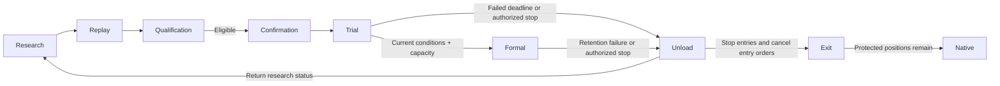

# Product loop

## Product purpose and scope

One individual uses one replaceable external Agent to turn sourced market hypotheses into reproducible strategies and portfolio evidence, then independently qualified, governed real trading. Binance is the target venue: perpetuals first, spot later, including the venue's actual equity/commodity-referencing products. A complete strategy may contain multiple instruments or hedge legs; an account composition combines independently eligible complete strategies.

Market Data and Backtest extend Nautilus; R&D supplies research management. The six responsibility groups, native foundation, client interfaces and V0.1-V0.6 delivery sequence are defined once in the [service blueprint](../architecture/). V0.1 closes R-1 data, native package sealing and replay with minimal durable research custody; sustained research iteration follows in V0.2. Later capabilities remain part of the target without becoming first-release prerequisites.

The external Agent initiates research through domain MCPs. Server services own admitted jobs and results; a disconnected conversation or unavailable laptop does not cancel them while the server remains available. New model-based decisions wait for the Agent, optionally awakened by its host timer. Dashboard reads research progress/evidence and exposes approved Governance controls; it cannot initiate, pause or terminate research or control the local Agent. The product runs no research model.

## Research and evidence

The user approves theme, risk tolerance, data scope, resource-spend ceiling and stops. Before running, the Agent registers comparisons, baselines, return units, horizon, costs and risk constraints. It may propose hypotheses and mechanism families inside those frozen boundaries. Portfolio return and drawdown guide continuation; entry advantage and randomized-entry comparisons diagnose causes. All attempts enter the trial and exposure ledger; spend caps do not impose a fixed experiment-round limit.

The product and Agent host separately cap/report consumption; unavailable model usage is not zero. Implementation repairs retain lineage and affected results. Changing passing criteria, statistical protocol, risk tolerance or scope needs user confirmation and a new frozen version. Replacing an Agent does not reset research budgets, exposure or results.

| Stage         | Client action                                                       | Owning result                                                                                   |
| ------------- | ------------------------------------------------------------------- | ----------------------------------------------------------------------------------------------- |
| Register      | Agent submits sources, experiment plans and chosen research context | R&D freezes research boundaries and trial lineage                                               |
| Prepare       | Bind instruments, history, native subscriptions and warmup          | Market Data admits PIT coverage, versions and named gaps                                        |
| Author        | Submit native Strategy signal/protection and sizing rules           | R&D seals the Artifact with its dependencies and approved execution policy references           |
| Replay        | Submit one bounded Backtest request                                 | Native Backtest returns orders, fills, portfolio evidence and diagnostics                       |
| Iterate       | Compare frozen objectives and choose the next legal action          | R&D records repair, successor, stop or selection and reusable findings                          |
| Qualify       | Submit an exact selected candidate or composition                   | Qualification independently evaluates protected evidence and returns bounded public eligibility |
| Confirm trial | User confirms the candidate and frozen policy in Dashboard          | Governance admits first real trial only with authority, capacity and native readiness           |
| Operate       | Query trial/formal stage and applied state                          | Governance evaluates frozen stage rules; native node executes authorized trading                |

One `backtest.run` performs deterministic request validation, research binding, data resolution and replay composition inside the backend. The Agent does not move market rows or assemble internal receipts. Same identity and meaning recover the original operation; changed meaning creates a successor or conflict. Unknown results never become economic judgments. See [Product Edge](../architecture/product-edge/) and [research acceptance](../scenarios/research/).

Positive and negative factor/rule findings belong to R&D knowledge, with exact versions, applicability, costs and counterexamples. Reuse supplies a new research input, never inherited qualification. For discovery, the Agent reads Market Data on demand and analyzes it; useful conclusions may become R&D knowledge. Running strategies already consume market data continuously and need no Scanner schedule or deployment-proposal service.

## Qualification and operating lifecycle

Exploration is not qualification. Qualification independently consumes the frozen candidate, complete trial family, cost/capacity assumptions, embargo and protected protocol. Internally it may distinguish pass, equivalence failure and insufficient evidence. Agent and Dashboard see only `QUALIFIED` or `CLOSED_NOT_QUALIFIED`; protected numbers, reasons, timing and categories never return to research or its knowledge store. Public nonqualification alone cannot close a mechanism. New families, clients or direct MCP calls cannot bypass exposure accounting.

Only independently eligible candidates can be offered for real trial. The user confirms exact candidate, finite named condition template, exposed parameters, capital policy and authority in Dashboard. Qualification alone starts nothing; the user may keep a qualified candidate in R&D. Trial conditions freeze before operation, including observation period, net economic/risk rules and minimum independent trade samples. Concrete templates and thresholds are detailed in their owning design slice.

Trial and formal pools both use real money. Promotion automatically rechecks current frozen conditions, authority and allocation feasibility at actual transition time. A qualified capacity waiter continues under trial authority, including beyond the maximum observation period while still satisfying conditions. A currently failing strategy at that deadline ends trial and returns to R&D. Formal retention failure unloads to R&D, never directly downgrades into trial.

A user or Agent acting within previously approved bounds may unload a valid strategy for improvement. Stop new entries, cancel unfilled entry orders and release running allocation; residual fills keep their original protection and actual account exposure. Unloading records its actual reason, not an invented economic failure. Changed strategy content hash means a new version and complete qualification/trial lifecycle. Unchanged content still needs current eligibility, stage evidence and explicit restart confirmation.

Qualification's record-only Forward Record is optional isolated simulation evidence. It creates no orders or capital commitments, replaces no real-trial evidence and cannot promote a strategy. Paper adapter verification is supporting evidence rather than a user promotion phase. Existing sealed protocols retain their meanings; design alone grants no implementation, deployment, trading credential or order permission.

## Composition and account funds

R&D owns a separately hashed composition configuration referencing exact member Artifacts, joint rules, policy
references, capital/risk scope and frozen ordinary exit plans. It evaluates joint operation, either-alone
continuation and continuous exits including residual positions. Qualification independently validates the
composition and exit plans; individually eligible members do not establish joint eligibility. Governance owns
the approved effective binding and transition authority. There is one account-wide effective composition;
members retain independent trial/formal/unload stages.

See [composition custody](../owners/rd/#composition-configuration-custody) and
[Governance](../owners/strategy-governance/).

Approved formulas use current net equity; exchange free margin constrains execution. Trial/formal pool ratios and equal allocation among actually running members create logical envelopes, not independent wallets. Admission, promotion or configuration adoption applies a new allocation atomically only if existing positions, orders and pending reservations fit all reduced envelopes and account limits. Otherwise wait in the capacity queue without starting the new member or forcing liquidation. An empty pool retains its budget. Deposits/withdrawals update the approved formulas within assessed limits; residual margin remains an account fact after logical allocation is released.

The product uses a dedicated trading account. Product orders and positions are reconciled against venue facts; unknown ownership blocks affected new risk rather than inventing attribution. Portfolio measures account facts, Governance allocates, Risk reserves/adopts capacity and Execution reconciles. No strategy or service keeps a competing balance ledger.

## Native trading and recovery

One native in-process node per Capacity Scope composes Runtime, Risk, Execution and Portfolio with a thin product trust layer. Strategies own signals/protection rules and bounded requested sizing; Risk decides admission, Execution owns orders, fills, retries and venue reconciliation. Signal target prices stay frozen at creation. Native cache, order lifecycle and accounting are reused rather than reimplemented.

Only an `APPLIED` receipt proves Runtime application of Governance authorization. Renewal needs
fresh eligibility, performance, exposure and degradation evidence; missing evidence stops new risk while
preserving the decrease-only path. Recovery consumes authoritative readiness, incident, drift or hard-stop
facts. Execution acts only inside the complete active fence set. Only the Reconciler writes
`KNOWN_CLOSED` after venue facts, Risk settlement and Portfolio projections agree; closure restores no
old trading authority.

Unknown effects permit no blind resubmit, commitment release or failure claim. [Architecture
rules](./architecture-rules/) and Owner chapters define exact permits, namespaces and refusal contracts.

## Acceptance

MCP research journeys and Dashboard read/control routes have separate acceptance. A reachable tool, chart,
local test or build is not complete R-1 or production acceptance. R-1 requires actual ordered fills, staged
exits, costs, retained open positions and durable result readback. Historical execution uses complete 1m input and native aggregation for strategy periods, without drilldown or local precision switching. Data corrections create new bindings and complete replay; no matching callback fetches data or rewinds itself. [Agent implementation](./agent-implementation/) defines verified source use, and
[Dashboard](./dashboard/) governs admitted UI slices.

Each delivery proves positive results, named refusals, unknown-state preservation, same-identity recovery and
isolation.
