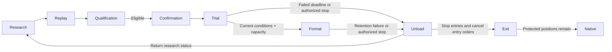

# 产品闭环

## 产品定位与范围

一个个人用户通过一个可更换的外部 Agent，将带来源的市场假设变成可复现策略与组合证据，再进入独立资格与受治理真实交易。目标场所为 Binance：先做永续，后做现货，包括该场所实际提供的股票/大宗等标的相关产品。完整策略可包含多个标的或对冲腿；账户组合由各自具备独立资格的完整策略组成。

Market Data 与 Backtest 扩展 Nautilus，R&D 提供研究管理。六组职责、原生基础、客户端接口及 V0.1-V0.6 交付顺序统一定义在[服务蓝图](../architecture/)。V0.1 交付 R-1 数据、原生策略封存与原生回放及最小持久研究托管；持续研究迭代在 V0.2 扩展。后续能力保留在完整目标中，不成为首版前置。

外部 Agent 经领域 MCP 发起研究。服务器服务持有已接纳任务与结果；服务器可用期间，对话断开或笔记本离线不取消它们。新的模型判断等待 Agent，可由其宿主定时唤醒。Dashboard 只读研究进度与证据，提供获准的 Governance 控制，不发起、暂停、终止研究或控制本地 Agent。产品不内置研究模型。

## 研究与证据

用户批准主题、风险容忍、数据范围、资源支出上限与停止边界。Agent 在运行前登记比较目标、基线、收益口径、期限、成本与风险约束，可在冻结范围内提出新假设和机制家族。组合收益与回撤决定继续方向；入场优势和随机入场比较用于诊断。所有尝试进入试验与暴露台账；支出上限不等于固定实验轮数。

产品与 Agent 宿主分别限额并报告消耗，不可读取的模型用量不记为零。实现修复保留血缘及受影响结果；改变通过标准、统计协议、风险容忍或范围需要用户确认并冻结新版本。更换 Agent 不重置研究预算、暴露或结果。

| 阶段     | 客户端动作                             | 所属结果                                                       |
| -------- | -------------------------------------- | -------------------------------------------------------------- |
| 登记     | Agent 提交来源、实验方案与所选研究说明 | R&D 冻结研究边界与试验血缘                                     |
| 准备     | 声明标的、历史范围、信号周期与预热     | Market Data 准入点时覆盖、版本及具名缺口                       |
| 编写     | 提交原生 Strategy 信号/保护与数量规则  | R&D 封存 Artifact、依赖与获准执行政策引用                      |
| 回放     | 提交一个有界 Backtest 请求             | 原生 Backtest 返回订单、成交、组合证据与诊断                   |
| 迭代     | 比较冻结目标并选择合法下一步           | R&D 记录修复、后继、停止、选择和可复用发现                     |
| 资格     | 提交准确的已选择候选或组合             | Qualification 独立评估保护证据，返回有界公开资格               |
| 确认试盘 | 用户在 Dashboard 确认候选与冻结政策    | Governance 在授权、容量与原生 readiness 满足时准入首次真实试盘 |
| 运行     | 查询试盘/正式阶段及应用状态            | Governance 判定冻结阶段规则；原生节点执行获准交易              |

一次 `backtest.run` 在后端完成声明校验、研究绑定、数据解析与回放组合。Agent 不搬运行情或拼接内部回执。同一身份与含义恢复原操作；改变含义产生后继或冲突。未知结果不产生经济判断。具体契约见 [Product Edge](../architecture/product-edge/) 与[研究验收](../scenarios/research/)。

正向和负向因子/规则发现归 R&D 知识，绑定准确版本、适用范围、成本与反例。复用产生新的研究输入，不继承资格。机会发现是 R&D 按需只读请求；运行策略已持续消费行情，不需要 Scanner 定时任务或部署提案服务。

## 资格与运行生命周期

探索不是资格。Qualification 独立消费冻结候选、完整试验家族、成本/容量假设、embargo 和保护协议。内部可区分通过、等价无效与证据不足；研究侧只看 `QUALIFIED` 或 `CLOSED_NOT_QUALIFIED`，保护数值、原因、时序与分类不进入研究或知识库。公开未合格结论本身不能关闭机制；换家族、客户端或直接 MCP 都不能绕过暴露记录。

只有独立合格候选可供真实试盘。用户在 Dashboard 确认准确候选、有限具名条件模板、开放参数、资金政策与授权。资格本身不启动交易；用户可让合格候选留在 R&D。试盘前冻结条件，包括观察期、净经济/风险规则及最低独立交易样本。具体模板与阈值在所属设计切片细化。

转正在实际转换时自动重新核验当前冻结条件、授权及分配可行性。当前达标的容量等待者继续按试盘授权运行，仍达标时可超过最长观察期等待；截至该期限仍不达标则结束试盘并退回 R&D。正式策略保留条件失效则下架退回 R&D，不直接降回试盘。

用户或在预先批准范围内行动的 Agent 可为改进下架有效策略。停止新入场、撤销未成交入场单并释放运行分配；剩余成交持仓保留原保护和实际账户暴露。下架记录实际原因，不伪造经济失败。策略内容 hash 改变即新版本，重新走完整资格/试盘生命周期；内容未变仍须当前资格、阶段证据与明确重新上线确认。

Qualification 的只记录 Forward Record 是可选隔离模拟证据，不创建订单或资金承诺，不替代真实试盘，也不能触发转正。Paper 适配器验证是辅助证据，不是用户晋级阶段。既有封存协议保持原含义；设计本身不授予实现、部署、交易凭据或下单权限。

## 组合与账户资金

R&D 拥有独立 hash 的组合配置，引用准确成员 Artifact、共同规则、政策、资金/风险范围和冻结普通退出预案。它研究共同运行、任一单独继续及包含剩余持仓的连续退出。Qualification 独立验证组合与退出预案；成员分别合格不证明组合合格。Governance 持有批准生效绑定及转换权限。账户只有一个生效组合，成员各自保留试盘/正式/卸载阶段。见[组合配置托管](../owners/rd.zh.md#组合配置托管)与 [Governance](../owners/strategy-governance/)。

批准公式使用当前净资产；交易所可用保证金约束执行。试盘/正式池比例及实际运行成员等分产生逻辑包络，不创建独立钱包。加入、转正或采用新配置时，只有已有持仓、订单及待执行预留符合所有缩小后额度和账户限制，才原子应用新分配；否则进入容量队列，不先启动成员或强制平仓。空池保留预算。充提资金在已评估范围内更新批准公式；卸载释放逻辑分配后，剩余保证金仍是账户事实。

产品使用专门交易账户。产品订单与持仓对账场所事实；归属未知阻止相关新风险，不能猜测归属。Portfolio 计量账户事实，Governance 分配，Risk 预留/准入容量，Execution 对账；策略或服务不能维护竞争余额账本。

## 原生交易与恢复

每个 Capacity Scope 一个原生进程内节点，组合 Runtime、Risk、Execution、Portfolio 与薄产品信任层。策略持有信号/保护规则与有界请求仓位；Risk 决定准入，Execution 持有订单、成交、重试与场所对账。信号目标价在产生时冻结。复用原生 cache、订单生命周期与记账，不重新实现。

Governance 授权只有 `APPLIED` 回执才能证明 Runtime 已应用。续期需要新鲜资格、表现、暴露与退化证据；缺失时停止新风险并保留 decrease-only 路径。Recovery 消费权威 readiness、事故、drift 或 hard-stop 事实，Execution 只在完整活动 fence-set 内行动。场所事实、Risk 结算和 Portfolio 投影一致后，Reconciler 才写 `KNOWN_CLOSED`；闭合不恢复旧授权。未知效果不能盲目重下、释放承诺或判为失败。准确许可、命名空间与拒绝契约见[架构规则](./architecture-rules/)和 Owner 章节。

## 验收

MCP 研究旅程与 Dashboard 读/控制路由分别验收。可达工具、图表、局部测试或编译不证明完整 R-1 或生产验收。R-1 需要真实顺序的成交、分段退出、成本、保留未平仓及持久结果回读。更细时序由 Market Data 在撮合之外准备，再由 Nautilus 按后继绑定回放；撮合回调不取数或自行回滚。[Agent 实现指南](./agent-implementation/)规定源码验证，[Dashboard](./dashboard/)规定已准入 UI 切片。每次交付证明正常结果、具名拒绝、未知保持、同身份恢复与隔离。
