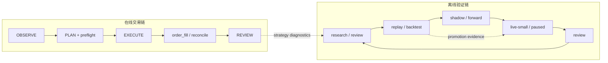
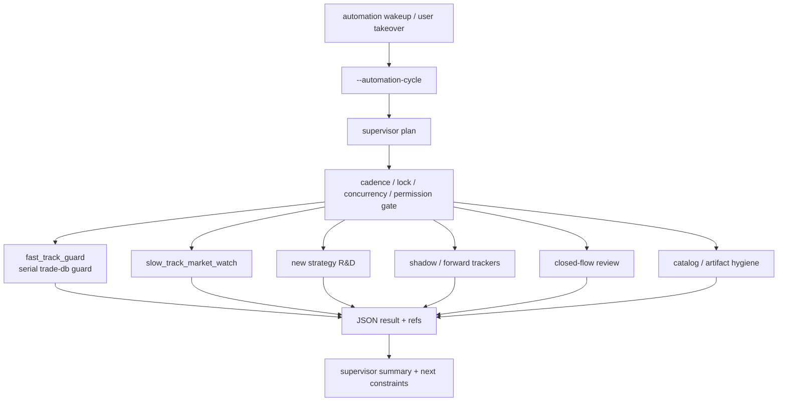
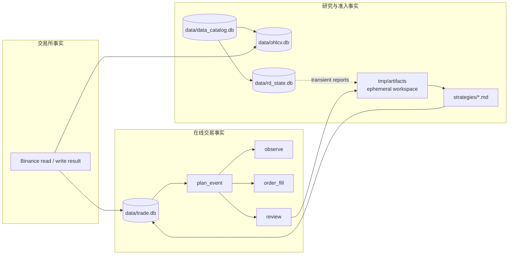
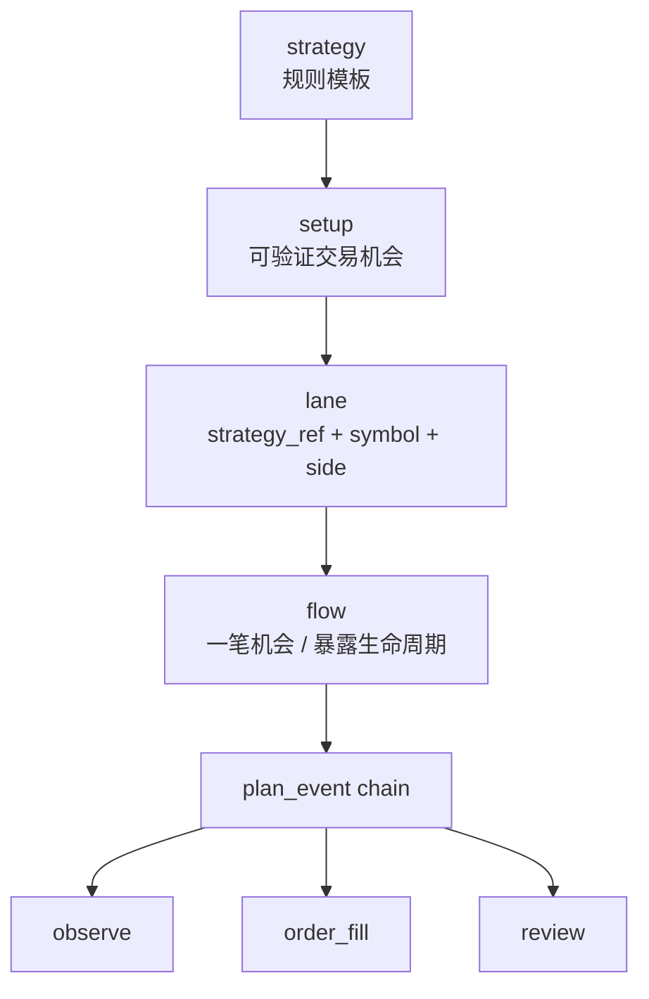
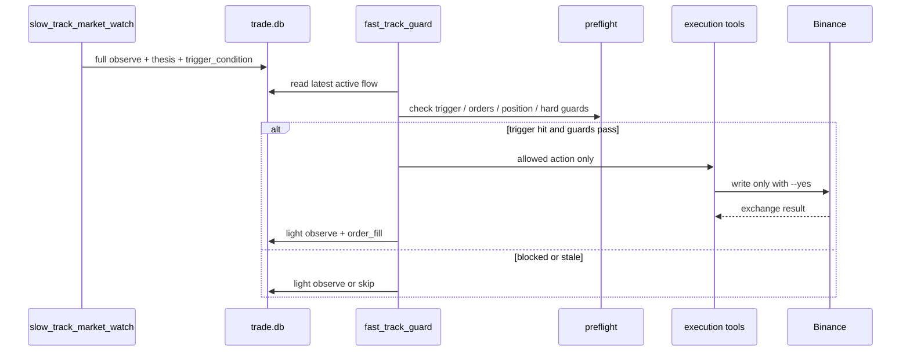
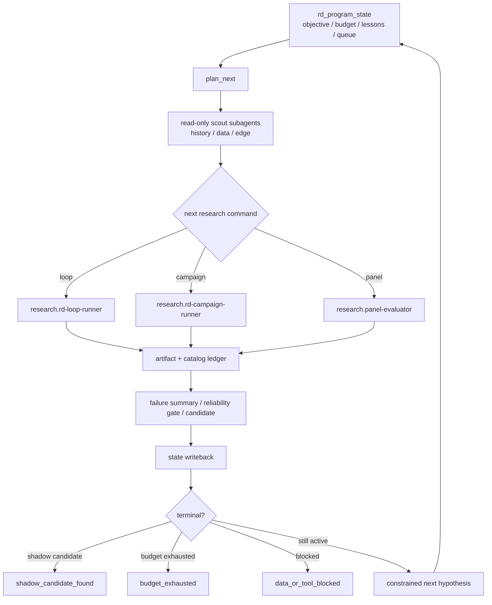
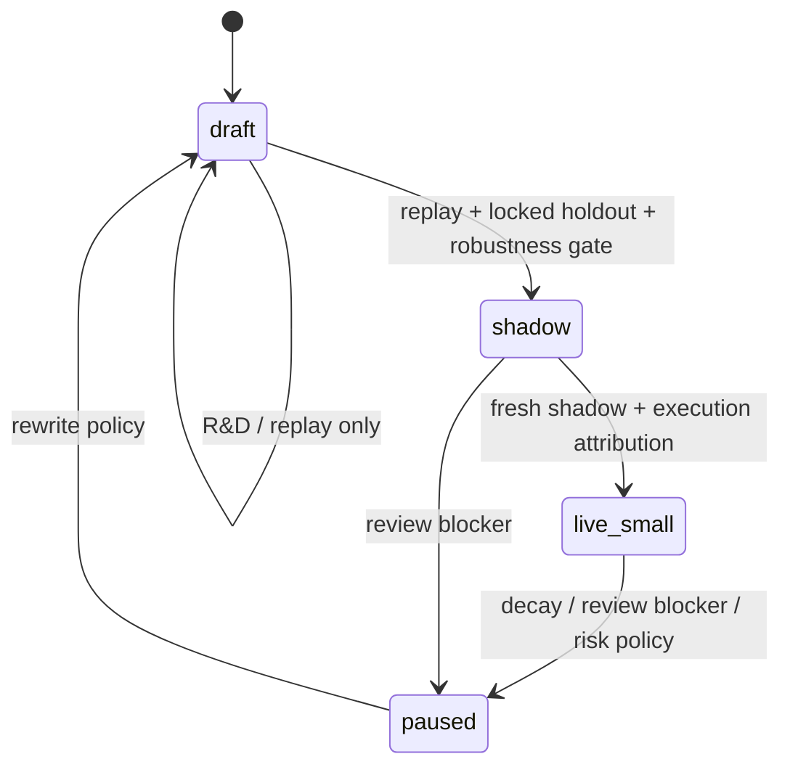
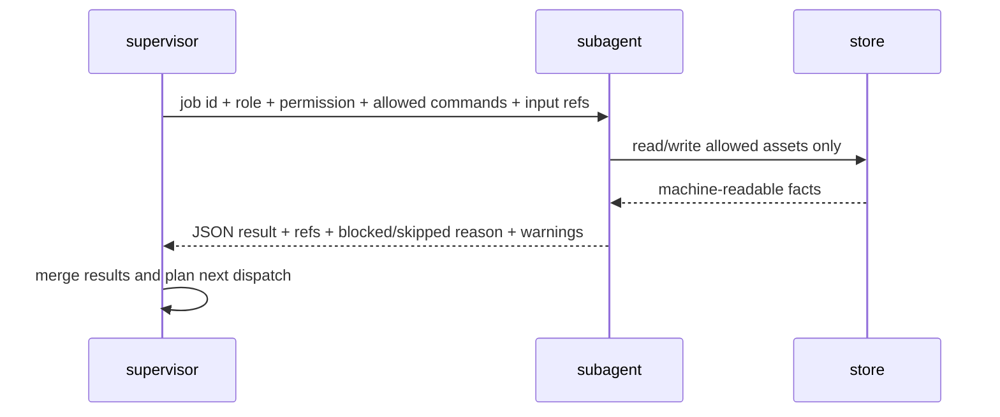

# Legacy Repository README

> 本文保留文档重构前的仓库总览，其中“当前状态”和“后续任务”是时点快照。当前入口见仓库根 [README](../../README.md) 与 [Documentation Contract](../README.md)。

agent-native 加密交易工作仓库。目标是让 agent 在可审计事实、权限边界、执行契约、交易所回读和研究记忆之上，推进 Binance USDM 4H+ swing 的观察、研发、验证、执行、恢复和复盘。

先看总览，再按模块看分区图。README 是全局地图；文档 authority 和细节入口看 [docs/README.md](../README.md)。

## 1. 全局架构

当前顶层蓝图固定在 [docs/architecture/architecture-overview-v2.mmd](../architecture/architecture-overview-v2.mmd)，当前代码投影固定在 [docs/architecture/generated/code-architecture-current.mmd](../architecture/generated/code-architecture-current.mmd)，漂移报告固定在 [docs/architecture/generated/architecture-drift-report.md](../architecture/generated/architecture-drift-report.md)。以后改顶层设计，先改 v2 蓝图，再同步 [docs/architecture/design-architecture.md](../architecture/design-architecture.md)、[docs/architecture/architecture-manifest.json](../architecture/architecture-manifest.json)、drift report 和 owner module check。v1 源图与渲染物已归档到 `docs/history/architecture-v1/`，不再作为当前约束。

一句话：外部只有一个 automation 入口；`orchestration-ops` 生成本轮 job graph protocol，并用 job graph runner 推进 stage lifecycle / ops audit，不直接解释交易、研究或治理结果；跨域通信走 `protocol-fabric / logical bus`，各责任域通过 inbox / outbox、logical store ref 和 rail envelope 解耦。

顶层责任域：

| 域 | 责任 |
| --- | --- |
| `orchestration-ops` | cycle planner、job graph、domain-bus、runtime health、notify、ops runtime |
| `contracts/protocol-fabric` | job ticket、command_spec、event/ref/store envelope、logical rails |
| `policy-risk` | runtime policy、approved strategy snapshot、风险和权限边界 |
| `portfolio-execution-state` | `trade.db` event store、flow projection、真钱状态读模型 |
| `market-data-products` | raw/canonical market data、feature、dataset manifest |
| `exchange-gateway` | 交易所 account/order/fill facts、authorized write adapter、command ledger |
| `live-decision-planning` | slow watch、thesis、watchlist、action intent |
| `live-execution-control` | recovery、fast guard、preflight、execution、recorder |
| `research-strategy-development` | hypothesis loop、experiment runners、shadow tracker、RD state |
| `governance-review-compliance` | closed-flow review、promotion gate、evidence ledger |
| `artifact-knowledge` | artifact catalog、retention、lineage、GC |

本轮 automation fork 出的 job：

| Job | 业务含义 | 状态 |
| --- | --- | --- |
| `J01 account reconcile` | 交易所事实对账，修复本地风险状态 | implemented |
| `J02 fast guard` | active flow 快轨守护、触发、防御、轻量执行 | implemented |
| `J03 slow watch` | 慢轨盯市、机会生成、watchlist / intent | implemented |
| `J04 R&D loop` | 策略研发假设循环和实验 | implemented |
| `J05 shadow tracking` | shadow / forward 样本跟踪 | implemented |
| `J06 catalog hygiene` | artifact catalog stale / GC / retention | implemented |
| `J07 closed-flow review` | 已闭合交易复盘和 promotion evidence | implemented |

runtime health、notify、incident manager、control effectiveness review 是 control tower lifecycle processors，不占 domain job 编号。

## 2. 两条主链



在线链只处理真实机会和交易事实；研究链只处理 edge 发现、验证和准入。研究链不能直接写 `trade.db`，也不能触发 Binance 写接口。

## 3. 单入口怎么分发



固定执行顺序：

```text
1. serial_trade_db_guard
   -> fast guard 先恢复 / 防御 active flow

2. parallel_isolated_work
   -> slow / R&D / tracker / catalog 可并行
   -> 只有 slow 可能进入 trade-db 写区

3. serial_review_closeout
   -> 若有新闭合 flow，再串行 review
```

## 4. 数据怎么存



事实优先级：

```text
Binance exchange facts
  > trade.db event stream
  > strategy evidence / catalog / artifact
  > rd_program_state / automation memory
  > natural-language summary
```

## 5. 核心对象关系



同一 lane 同时最多一个 active flow。新理由、新结构、新加一段都并回当前 active flow，不并行开多个风险拥有者。

## 6. 慢轨和快轨怎么交互



| 维度 | 慢轨 | 快轨 |
| --- | --- | --- |
| 角色 | 战略层：thesis、方向、风险、action intent | orchestrator only：执行守护、防御补救、轻量对账 |
| observe | full observe | light observe，继承慢轨 thesis / risk / intent |
| 动作 | 全集，经 preflight | 白名单：撤单、同步保护、no_action、慢轨 trigger 授权动作 |
| 判断 | 可做 setup / thesis 判断 | 不做质性市场判断 |

## 7. 在线交易 Flow

真钱执行写口：

| 动作 | Tool |
| --- | --- |
| 主单开仓 / 加仓 | `binance-order-place` |
| 止损 / 止盈 / trailing | `binance-position-protect` |
| 减仓 / 全平 | `binance-position-adjust` |
| 撤单 | `binance-order-cancel` |

`execution-router` 生成的 Binance 写命令默认携带 `exchange_runtime_store` 审计参数；Binance command/result/idempotency 归 `exchange_runtime_store`，真钱事件真相仍回写 `trade_event_store`。

任何新增风险动作都必须有 fresh facts、stop / invalidation / risk budget、preflight、execution contract 和 reconcile。

## 8. Recovery / Reconcile Flow

交易所事实覆盖本地乐观状态。无法可靠归属的订单 / 仓位差异必须停，不继续执行。

## 9. R&D 学习飞轮



高阶入口：

```bash
bun modules/research-strategy-development/research-control-plane/program-supervisor/src/scripts/main.ts --db ./data/rd_state.db --program-id rd-program --json '{"max_iterations":10}'
```

低阶入口：

| 命令 | 作用 |
| --- | --- |
| `research.rd-program-state` | init / read / update / plan_next durable learning memory |
| `research.candidate-batch` | bounded candidate evaluation + negative controls |
| `research.rd-loop-runner` | 一轮 batch + artifact + catalog ledger |
| `research.rd-campaign-runner` | 多 hypothesis discovery + non-overlapping validation |
| `research.data-split` | 切 discovery / validation / locked_holdout |
| `research.panel-evaluator` | 跨资产广度和 negative control |
| `research.rd-shadow-tracker` | forward / paper setup event chain tracker |

`rd_program_state` 是 research memory，不是 strategy evidence。

## 10. Strategy 升格状态机



升格规则：

- `draft` 只能研究。
- `shadow` 可记录影子动作，不提交 Binance。
- `live-small` 才能小资金实盘。
- `paused` 只允许观察和减风险。
- `strategy-promote` 默认 dry-run；改 status 必须显式 `--yes`。

## 11. Catalog / Artifact Hygiene

`.pin`、被引用资产、durable store 必须保留。普通 artifact GC 是文件扫描式；catalog GC 是 catalog-aware。

## 12. 模块速查

| 层 | 路径 / tool | 作用 |
| --- | --- | --- |
| 产品契约 | `docs/` | vision、PRD、架构、技术契约、检查契约 |
| 主流程 | `modules/orchestration-ops/trade-flow/` | event stream、automation、observe、execution、reconcile |
| 研究 | `modules/research-strategy-development/agent-roles/developer/rd-loop-runner/` + `modules/research-strategy-development/agent-roles/developer/rd-campaign-runner/` + `modules/research-strategy-development/research-control-plane/program-control/` + `modules/research-strategy-development/forward-evidence-plane/compatibility/rd-shadow-tracker/` + `modules/research-strategy-development/replay-execution-plane/compatibility/replay-runner/` + `modules/research-strategy-development/research-control-plane/dataset-governance/data-split/` + `modules/research-strategy-development/replay-execution-plane/compatibility/benchmark-runner/` + `modules/research-strategy-development/replay-execution-plane/certification/calibration-suite/` | R&D loop/campaign、RD memory、panel、benchmark、calibration、forward tracker、单策略 replay、holdout split |
| 策略契约 | `modules/contracts/strategy-contract/` + `modules/research-strategy-development/research-control-plane/contract-lint/` + `modules/research-strategy-development/agent-roles/developer/strategy-contract-compile/` | strategy contract 解析、compile、lint |
| 治理 | `modules/governance-review-compliance/strategy-review/` | evidence、review、promotion |
| 资产治理 | `modules/artifact-knowledge/artifact-catalog/` | catalog、artifact stale scan、GC |
| 市场观察 | `modules/market-data-products/binance-read/market-scan` / `modules/market-data-products/binance-read/symbol-snapshot` / `modules/market-data-products/binance-read/aggtrades-fetch` / `modules/market-data-products/liquidation-zones` | 候选、单标的事实、成交材料、清算区 |
| 账户恢复 | `modules/exchange-gateway/binance-read/account-snapshot` | 余额、持仓、挂单、保护单、订单历史 |
| 数据与指标 | `modules/market-data-products/ohlcv-fetch` / `modules/market-data-products/market-data-store` / `modules/market-data-products/tech-indicators` | OHLCV、canonical candles、funding events、feature manifest、owner read refs、BTC beta |
| 执行 | `modules/exchange-gateway/binance-write/order-preview` / `modules/live-execution-control/plan-preflight` / Binance write modules | preview、hard guards、下单、保护、减仓、撤单 |
| 策略资产 | `strategies/` | strategy policy + `## Trade Contract` |
| 运行数据 | `data/` / `tmp/` | DB、catalog、OHLCV、artifact、cache |
| 配置 | `profile/` | trading config、通知配置；凭证来自环境变量 |

## 13. Master / Subagent 信息交换



禁止：

- 不通过口头总结传递长期事实。
- 不让 subagent 自行扩大权限。
- 不让 R&D subagent 写 `trade.db` 或触发 Binance。
- 不让交易 subagent 把 research artifact 当成 execution fact。

## 14. 常用入口

```bash
# 仓库级检查
scripts/quality-check.sh

# trade-flow help
bun modules/orchestration-ops/trade-flow/src/scripts/main.ts --help

# 初始化在线事件库
bun modules/orchestration-ops/trade-flow/src/scripts/main.ts --db ./data/trade.db --init

# 生成单入口 supervisor plan
bun modules/orchestration-ops/trade-flow/src/scripts/main.ts --db ./data/trade.db --automation-cycle --json '{"slow_interval_minutes":240,"rd_state_db":"./data/rd_state.db","rd_program_id":"rd-program"}'

# 运行 job graph lifecycle，默认 dry-run 只写 ops runtime audit
bun modules/orchestration-ops/trade-flow/src/scripts/main.ts --db ./data/trade.db --run-job-graph --json '{"ops_runtime_db":"./data/ops_runtime.db","execute_jobs":false}'

# 查询 logical bus inbox/outbox envelope
bun modules/orchestration-ops/domain-bus/src/scripts/main.ts --db ./data/ops_runtime.db --action list --json '{"cycle_id":"..."}'

# 初始化并运行 R&D supervisor
bun modules/research-strategy-development/research-control-plane/program-control/src/scripts/main.ts --db ./data/rd_state.db --program-id rd-program --json '{"action":"init","objective":"find a shadow-eligible 4H swing strategy"}'
bun modules/research-strategy-development/research-control-plane/program-supervisor/src/scripts/main.ts --db ./data/rd_state.db --program-id rd-program --json '{"max_iterations":10}'
```

## 15. 安全边界

- 真实 Binance 写操作必须显式带 `--yes`。
- 写操作前必须完成 preview / preflight / execution contract。
- dry-run、preview、replay、calibration、R&D 默认不触发真实下单。
- 凭证不写入仓库；API key、通知 token、chat id 等只从环境变量读取。
- Automation memory 路径统一用 `scripts/automation-memory-path.sh <automation-id>` 解析。
- Python 命令统一用 `scripts/resolve-python.sh` 解析，不假设 `python` 存在。
- 交易所事实和 reconcile 失败可以覆盖本地状态。

## 16. 文档导航

- [docs/README.md](../README.md)：文档分层、authority 和归档规则
- [docs/product](../product/)：vision、PRD、用户故事与产品素材
- [docs/architecture](../architecture/)：当前架构、manifest、图、schema 与迁移
- [docs/runtime](../runtime/)：交易配置、执行、市场数据等大功能合同
- [docs/research](../research/)：R&D architecture、strategy、reliability 与 sources
- [docs/engineering](../engineering/)：检查、代码质量与数据卫生
- [docs/history](./)：已完成施工图和审查记录

## 17. 当前状态

已经具备：

- Binance USDM observe / account recovery / execution tools
- domain-first 目录、协议层、job ticket / command_spec、logical-store-ref
- portfolio event-store / flow-projector、dry-run、shadow、live-small、reconcile
- single automation entry + job graph protocol + subagent fan-out 契约
- job graph runner：按 dispatch_order 推进 dry-run / execute lifecycle，并把 cycle/job 状态写入 ops runtime store
- domain-bus：把 inbox/outbox envelope 和 payload refs 写入 ops runtime store，跨域 payload 仍由 owner store 持有
- slow / fast 双轨口径
- replay、strategy evidence、review、promotion gate
- R&D campaign、panel、calibration、learning memory、autonomous R&D supervisor loop
- artifact catalog、GC、quality check、通知 fallback
- storage DDL、architecture manifest、manifest / storage schema quality checks

仍保持克制：

- 不做交易 SaaS / UI / 多账户 / 跨交易所
- 不做无界策略搜索
- 不把 R&D artifact 当交易事实
- 不把单段漂亮回测直接升实盘
- 不让快轨 LLM 做不可复现的质性市场判断

## 18. 后续重构任务

下一阶段不是重新画图，而是把 v2 蓝图里的 owner port 和 runtime contract 逐个接进真实流水线。每完成一项都必须同步 `docs/architecture/architecture-overview-v2.mmd`、`docs/architecture/architecture-manifest.json`、生成的 drift report、owner module check 和 `scripts/quality-check.sh`。

| 优先级 | 任务 | 目标完成状态 |
| --- | --- | --- |
| P0 | 实现 `ops_runtime_store`、runtime health processor、ops notify processor | done：cycle/job/health/notify/incident/control_review 有独立库表和 owner module；`summary` 读口返回 stage/domain/attention 聚合 |
| P0 | 把 automation cycle 从裸路径继续收敛到 `tool_id + command_spec + protocol-fabric` | done：J01-J07 均输出 tool ticket + command_spec；health/notify/control review 作为 lifecycle processors，不占 job 编号 |
| P0 | 实现 job graph runner | done：`--run-job-graph` 可按 dispatch_order 记录 planned/running/completed/skipped/failed；默认 dry-run，`execute_jobs=true` 才调用 command_spec；响应带 `ops_summary` |
| P0 | 实现 logical domain-bus | done：`orchestration-ops/domain-bus` 写入 `ops_runtime_store.domain_message`，runner 为每个 job 记录 inbox/outbox envelope |
| P1 | 实现 `exchange_runtime_store` | done：Binance write request/result/client_order_id/idempotency 有独立审计账本 |
| P1 | 实现 `market_data_store` / `ohlcv_store` | done：OHLCV canonical candles 由 `ohlcv_store` 单写管理；manifest / funding / feature refs 由 `market_data_store` 单写管理；`ohlcv-fetch` 与慢轨盯市已接入增量 candle upsert；calibration market features 已接入 funding events 与 feature refs |
| P1 | 实现 `policy_registry` | done：approved strategy refs、runtime policy hash、风险快照可追溯 |
| P2 | 实现 `research_state_store` | done：RD hypothesis、budget、trial、holdout use 有独立 owner store |
| P2 | 实现 `governance_ledger` 与 `J07 closed-flow review sweep` | done：review/promotion evidence 有独立 ledger 和串行 closeout job |
| P2 | 收敛域间调用到 inbox/outbox + rail envelope | done：protocol-fabric 已定义 domain inbox/outbox envelope，源码边界由 checker 管控 |
| P2 | 强化 `trade-flow` 边界检查 | done：移除未使用 `src/domain/*` façade；checker 取消 trade-flow 泛化跨域豁免，改为生产文件级白名单 |
| P3 | 为每个 logical store 增加 migration/init/check CLI | done：`bun scripts/logical-store.ts --action init/check --store all` |
| P3 | 继续拆 `trade-flow` 剩余 suite 逻辑 | done：`main.ts` 已收缩为 control tower CLI router，只导出 `run`；业务能力由各 owner module 直接承接 |
