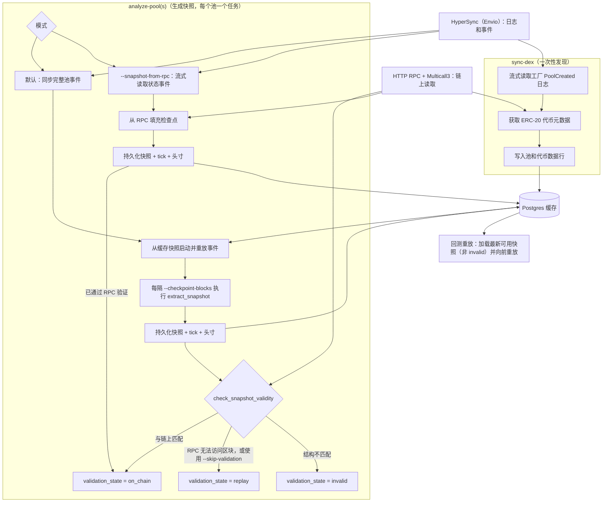

# 区块链

## 概述

区块链适配器从 EVM 链接入 DeFi 数据，并通过 VibeTrader 数据模型公开这些数据。它使用三种后端：

- HyperSync：高吞吐量历史区块和合约日志。有关查询结构、分页和调优，请参阅 [Envio HyperSync 文档](https://docs.envio.dev/docs/HyperSync/hypersync-usage)。
- HTTP RPC：合约调用、Multicall 读取和最终链上状态补全。
- Postgres：可选的持久缓存状态、池元数据、已解码事件和快照。

## 核心原语

DeFi 领域模型位于 `vibe_model::defi`。

### 链

`Chain` 定义目标区块链及其默认服务端点。

| 字段                       | 类型         | 描述                                                        |
| -------------------------- | ------------ | ----------------------------------------------------------- |
| `name`                     | `Blockchain` | 链枚举值，例如 `Ethereum` 或 `Arbitrum`。                   |
| `chain_id`                 | `u32`        | EVM 链 ID，例如 Ethereum 的 `1`。                           |
| `hypersync_url`            | `String`     | HyperSync 端点，默认为 `https://{chain_id}.hypersync.xyz`。 |
| `rpc_url`                  | `Option`     | 存储在链模型上的可选直接 RPC 端点。                         |
| `native_currency_decimals` | `u8`         | 原生 gas 代币的小数精度，通常为 `18`。                      |

可以使用 `Chain::from_chain_id` 按数字 ID 加载链，也可以使用 `Chain::from_chain_name` 按名称加载链。

| 链系列         | 代码 | 名称         | 小数位数 |
| -------------- | ---- | ------------ | -------- |
| Ethereum 和 L2 | ETH  | Ethereum     | 18       |
| Polygon        | POL  | Polygon      | 18       |
| Avalanche      | AVAX | Avalanche    | 18       |
| BSC            | BNB  | Binance Coin | 18       |

### DEX 和池

DEX 集成会注册：

- 工厂地址。
- 事件签名和解析函数。
- AMM 类型。

池定义将链和 DEX 绑定到池合约地址或协议池 ID，以形成稳定的 Vibe 金融工具 ID。代币对、费率层级、tick 间距和创建区块仍作为池元数据保留。

数据引擎处理池定义时，会使用同一个池金融工具 ID 缓存并发布 `CurrencyPair`。金融工具按池中原始 `token0`/`token1` 顺序作为基础货币/计价货币，根据代币小数位数派生价格和数量精度，上限为 `FIXED_PRECISION`，并将费率层级除以 1,000,000 后作为 `taker_fee` 公开。不同的池标识符使代币相同的池可以同时存在于缓存和消息总线上。

Uniswap V3 及兼容的集中流动性池还使用：

- `Initialize(uint160,int24)` 获取初始价格状态。
- `Mint` 和 `Burn` 事件用于持仓和 tick 状态重放。
- `Swap` 事件用于实盘池价格变化。
- HTTP RPC 最终状态读取，用于获取 `slot0`、流动性、活动 tick 和持仓数据。

## 配置

| 选项                              | 默认值             | 描述                                         |
| --------------------------------- | ------------------ | -------------------------------------------- |
| `chain`                           | 必填               | 目标 `Chain`，例如 Ethereum 或 Arbitrum。    |
| `dex_ids`                         | `[]`               | 要注册和同步的 DEX 集成。                    |
| `http_rpc_url`                    | 必填               | 用于合约读取和 Multicall 的 HTTP RPC 端点。  |
| `wss_rpc_url`                     | `None`             | 用于 RPC 实盘流的可选 WSS RPC 端点。         |
| `rpc_requests_per_second`         | `None`             | 可选的 RPC 请求限速。                        |
| `multicall_calls_per_rpc_request` | `200`              | 每个 RPC 请求所请求的 Multicall 最大目标数。 |
| `use_hypersync_for_live_data`     | Rust 中为 `false`  | 为 true 时，实盘区块和事件流使用 HyperSync。 |
| `from_block`                      | `None`             | 历史同步的可选起始区块。                     |
| `pool_filters`                    | `DexPoolFilters()` | 池范围筛选规则。                             |
| `postgres_cache_database_config`  | `None`             | 可选 Postgres 缓存配置。                     |
| `proxy_url`                       | `None`             | 可选的 HTTP 和 WebSocket 代理 URL。          |
| `transport_backend`               | `Tungstenite`      | WebSocket 传输后端。                         |

:::note
池快照请求目前要求使用 Postgres 缓存数据库。内存缓存可以保存代币和池，但当前池分析器的引导过程会通过缓存数据库路径读取快照和事件状态。
:::

## 环境

在仓库外设置凭证：

```bash
export ENVIO_API_TOKEN="<envio-token>"
export RPC_HTTP_URL="https://your-rpc.example"
export RPC_WSS_URL="wss://your-rpc.example"
```

本地使用 `.env` 时，请勿将该文件纳入版本控制：

```dotenv
ENVIO_API_TOKEN=<envio-token>
RPC_HTTP_URL=https://your-rpc.example
RPC_WSS_URL=wss://your-rpc.example
```

- Rust HyperSync 客户端要求提供 `ENVIO_API_TOKEN`。缺少令牌或令牌格式错误会在发送任何查询前导致客户端构建失败。
- 合约读取和快照补全要求提供 `RPC_HTTP_URL` 或 `--rpc-url`。
- 只有 WSS RPC 实盘流才需要 `RPC_WSS_URL`。

有关令牌设置和配额详情，请参阅 Envio 的 [HyperSync API 令牌文档](https://docs.envio.dev/docs/HyperSync/api-tokens)。

### RPC 端点

`RPC_HTTP_URL` 或 `--rpc-url` 必须指向目标链的 EVM JSON-RPC 端点。数据客户端在构建时解析该地址，首次池同步会通过它读取链上状态。
HyperSync 端点根据链 ID 派生（`https://{chain_id}.hypersync.xyz`）。

已验证的免费公共 HTTP 端点（2026 年 6 月，无需 API 密钥）：

| 链           | HTTP 端点                              | 归档支持 |
| ------------ | -------------------------------------- | -------- |
| Arbitrum One | `https://arb1.arbitrum.io/rpc`         | 否       |
| Arbitrum One | `https://arbitrum.gateway.tenderly.co` | 是       |
| Ethereum     | `https://ethereum-rpc.publicnode.com`  | 否       |

存在免费的归档端点，但其可用性和限制会变化。快照验证通常每个池只需少量 `eth_call`，因此免费归档端点可能足以获得 `validation_state = on_chain`。

归档支持会影响验证，但不影响事件同步能否运行：

- 在归档节点上，历史区块快照会根据链上状态进行验证，并以 `validation_state = on_chain` 存储。
- 在非归档节点上，历史读取会失败，快照保持 `validation_state = replay`，但仍可用作重放起点。
- 在非归档节点上进行首次同步时，必须运行到近期的 `--to-block`，因为非归档节点只提供近期状态，而引导过程会读取目标区块的链上状态。

对于其他链或归档访问，可以使用 [chainlist.org](https://chainlist.org)、[comparenodes.com](https://www.comparenodes.com) 等目录，也可以使用需要密钥的提供商（Infura、Alchemy、dRPC）。

## 本地服务

开发用 compose 文件会启动 Postgres、Redis 和 pgAdmin。

```bash
make start-services
make init-db
```

默认 Postgres 连接：

- 主机：`127.0.0.1:5432`
- 数据库：`vibe`
- 用户：`vibe`
- 密码：`pass`

检查 schema 是否存在：

```bash
docker exec vibe-database psql -U vibe -d vibe -Atc \
    "select count(*) from information_schema.tables where table_schema='public'"
```

进行破坏性 DeFi 测试时，请使用单独的数据库或可重置的 Docker volume。池发现和快照测试可能会向 `token`、`pool`、`pool_*_event`、`pool_snapshot`、`pool_position` 和 `pool_tick` 写入大量行。

## 数据流

### 架构

`sync-dex` 只执行一次池和代币发现。随后，`analyze-pool(s)` 生成 `pool_snapshot` 行。下图显示默认重放路径和 `--snapshot-from-rpc` 路径。



`analyze-pools` 为每个池运行一个任务，并由 `--concurrency` 限制并发。每个任务拥有自己的数据客户端。只要快照的 `validation_state` 不是 `invalid`，就可以用作重放起点。

### 池发现

池发现流程：

- 从 HyperSync 流式读取 DEX 工厂事件。
- 通过 RPC 获取 ERC-20 元数据。
- 将有效代币和池存入缓存。
- 可以通过 `DexPoolFilters` 跳过代币元数据无效或为空的池。

### 实盘数据

- `use_hypersync_for_live_data = true`：通过 HyperSync 订阅区块以获取实盘时间戳，并为每个已订阅 DEX 筛选器保持一条开放式 HyperSync DEX 事件流。
- `use_hypersync_for_live_data = false`：使用 WSS RPC 区块和池日志订阅获取实盘 swap、流动性更新、手续费收取、闪电事件和协议费用事件。

### 快照引导

对于兼容 Uniswap V3 的快照，引导流程为：

- 从 HyperSync 重放历史 Initialize、Mint 和 Burn 事件，以重建 tick 和持仓。
- 通过 HTTP RPC 和 Multicall 获取最终链上状态，再根据该快照恢复分析器。

引导模式：

- 默认：存储截至目标区块的完整池事件历史，再从数据库引导。
- `--snapshot-from-rpc`：跳过完整 swap 存储，从 HyperSync 流式读取 Initialize、Mint、Burn、SetFeeProtocol 和 CollectProtocol 事件以枚举 tick 和持仓，再从 RPC 补全确切检查点区块。

当所需输出是最终快照而非已存储的 swap 历史时，对历史久、交易量大的池使用 `--snapshot-from-rpc`。该选项不能与 `--from-block`、`--reset` 或 `--require-existing-snapshot` 同时使用。

如果最终 RPC 补全失败，适配器必须按失败处理。不得发出由重放事件构建、但价格状态已经过时的快照。

### 快照验证

将快照标记为有效前，引导过程会将重放得到的分析器与链上状态比较。以下结构字段必须完全匹配：

- 当前 tick。
- 活动流动性。
- 每个 tick 的净流动性和总流动性。
- 持仓流动性。

结构不匹配时必须判定失败，不能将快照标记为有效。

非结构字段不匹配时会发出警告，但仍予以接受：

- 平方根价格：当重放以事件为范围，而 RPC 快照以区块为范围时，两者会有所不同。
- 协议费用设置：在分叉上，或重放范围不包含协议费用事件时，两者可能不同。
- 协议费用余额：重放舍入可能造成差异，而 RPC 快照会直接读取链上累加器。

如果只有非结构字段不同，快照仍会被接受。这与回测重放行为一致。

### 快照引导保护

如果分析只能从本地快照缓存运行，请使用 `--require-existing-snapshot`：

- 检查目标区块或之前最新的可用 `pool_snapshot`。
- 如果不存在可用快照，返回 `needs_bootstrap`。
- 将既没有持仓也没有 tick 的空创建区块快照视为不可用。
- 跳过该池从创建区块到目标区块的引导。

```bash
vibe blockchain analyze-pools \
    --chain ethereum \
    --dex UniswapV3 \
    --addresses-file pools.txt \
    --to-block 25218797 \
    --require-existing-snapshot \
    --rpc-url "$RPC_HTTP_URL"
```

`analyze-pool(s)` 会输出：

- 每个 `--checkpoint-blocks` 条目对应一个 JSON 结果。
- 未提供检查点时，在 `--to-block` 输出一个 JSON 结果。

需要首次引导的池采用以下结构：

```json
{
  "chain": "Ethereum",
  "dex": "UniswapV3",
  "pool_address": "0x1111111111111111111111111111111111111111",
  "target_block": 25218797,
  "status": "needs_bootstrap"
}
```

成功结果包含 `validation_state`：

- `on_chain`：已补全并与链上状态匹配。
- `replay`：由重放派生或未经检查，仍可用作重放起点。
- `invalid`：已补全但不匹配，不可使用。

```json
{
  "chain": "Ethereum",
  "dex": "UniswapV3",
  "pool_address": "0x1111111111111111111111111111111111111111",
  "target_block": 25218797,
  "status": "success",
  "snapshot_block": 25218790,
  "positions": 2,
  "ticks": 7,
  "validation_state": "replay",
  "already_valid": false,
  "liquidity_utilization_rate": 0.25
}
```

### 检查点和并发

- `--checkpoint-blocks b1,b2,...`：在一次引导过程中生成多个快照。区块会排序、去重，并限制在 `--to-block` 以内。
- `--concurrency`：控制 `analyze-pools` 并行度。默认值：`4`。
- `--skip-validation`：跳过链上比较，并将重放派生快照保持为 `replay`。
- `--snapshot-from-rpc`：在检查点区块从链补全，并将快照记录为 `on_chain`。

快照键：

- 默认模式：以检查点或之前最后一个池事件为键。两个检查点之间没有事件时，可以共享同一个存储行。
- `--snapshot-from-rpc`：以请求的检查点区块为键，并使用区块范围的哨兵交易/日志索引。

### 回测重放

回测重放要求输入数据中包含快照。适配器不会在回测期间处理实盘快照请求。

`load_pool_snapshot` 从 Postgres 读取包含持仓和 tick 的完整快照：

```python
from vibe_trader.adapters.blockchain import load_pool_snapshot

snapshot = load_pool_snapshot(
    pg_config=postgres_config,
    chain_id=chain_id,
    pool_address=pool_address,
    before_block=replay_start_block,  # latest snapshot at or before this block
)
```

重放规则：

- 默认只返回 `on_chain` 快照。传入 `require_valid=False` 可接受重放快照。
- 将 `None` 视为设置失败。没有分析器状态时不得重放。
- 将结果包装为 `DefiData.PoolSnapshot(snapshot)`，并与池事件一起传给 `BacktestEngine.add_defi_data`。
- 从快照区块开始重放每个池事件。从快照区块之后开始可能导致分析器状态过时。

缓存的区块时间戳会作为 UNIX 纳秒加载到 Vibe 数据对象中。加载快照和池事件时，以秒精度区块时间戳写入的缓存行会规范化为纳秒，而纳秒行保留其存储精度。

## 合约

### 基础合约和 Multicall3

`BaseContract` 通过 Multicall3（`0xcA11bde05977b3631167028862bE2a173976CA11`）批量执行合约调用：

- 调用使用 `allow_failure: true`，以便报告单个合约调用失败。
- 读取在同一个区块上下文中执行。
- 传输和提供商故障以 RPC 错误形式呈现。

### ERC-20 元数据

`Erc20Contract` 通过 Multicall 读取 `name`、`symbol` 和 `decimals`。适配器可以跳过代币元数据格式错误、为原始字节或为空的池。

### Uniswap V3 池

`UniswapV3PoolContract` 读取全局池状态、活动 tick 和持仓。

- 大型池可能超过提供商的载荷、gas 或超时限制。
- 如果最终状态读取失败，补全会按失败处理。
- 超大型池可能需要能力更强的提供商，或未来采用分块/最小化补全。

PancakeSwap V3 复用 Uniswap V3 读取合约，因为 `slot0`、`ticks`、`positions`、`liquidity` 和费用增长读取共享相同 ABI。协议费用编码不同：

- Uniswap V3 将两个 4 位费用分母打包到一个 `uint8` 中。
- PancakeSwap V3 在 `slot0.feeProtocol` 中存储两个 16 位基点份额，并发出 `SetFeeProtocol(uint32,uint32,uint32,uint32)`。
- PancakeSwap V3 快照存储 `fee_protocol0_basis_points` 和 `fee_protocol1_basis_points`，重放按 `fee * basis_points / 10000` 计算协议费用。

## 冒烟测试

### HyperSync 身份验证

```bash
curl -fsS --max-time 15 \
    -H "Authorization: Bearer $ENVIO_API_TOKEN" \
    https://1.hypersync.xyz/height
```

预期结果：包含数字 `height` 的 JSON。

### 小型 HyperSync 查询

```bash
query='{"from_block":25170900,"to_block":25170901,"include_all_blocks":true,"field_selection":{"block":["number","timestamp","hash"]}}'

curl -sS --max-time 30 \
    -H "Authorization: Bearer $ENVIO_API_TOKEN" \
    -H "Content-Type: application/json" \
    --data "$query" \
    https://1.hypersync.xyz/query/arrow-ipc \
    -o /dev/null \
    -w "http_code=%{http_code} size_download=%{size_download}\n"
```

预期结果：HTTP `200`，且响应大小非零。

### 适配器编译检查

```bash
cargo check -p vibe-blockchain --features hypersync
```

### 实盘失败处理回归

此忽略测试使用真实 HyperSync 重放和无效的本地 HTTP RPC URL。它验证最终 RPC 补全会按失败处理，而不是发出过时快照。

```bash
cargo test -p vibe-blockchain --features hypersync \
    live_hypersync_bootstrap_fails_closed_when_rpc_hydration_fails \
    -- --ignored --nocapture
```

预期结果：一个已忽略测试通过。该测试可能需要几分钟。

## 运维说明

- 使用 HyperSync 扫描高容量历史日志。有关请求结构和调优详情，请参阅 [Envio HyperSync 文档](https://docs.envio.dev/docs/HyperSync/hypersync-usage)。
- 使用 HTTP RPC 获取最终合约状态并进行验证。
- 对大型 Uniswap V3 池使用付费或高额度 RPC 提供商。
- 将 `ENVIO_API_TOKEN`、RPC 密钥和 Postgres 凭证置于版本控制之外。
- 使用单独的 Postgres 数据库运行需要写入池快照的可重复 DeFi 测试。
- 对于发出的快照，将最终状态补全失败视为硬错误。

### 池分析的前置条件和注意事项

这些问题会使 `analyze-pool(s)` 明确报告失败原因和修复方法。

#### 分析前先发现池

`analyze-pool(s)` 从缓存读取池元数据；如果池从未被发现，则以 `Pool <address> is not registered` 失败。请先为该链/DEX 运行一次 `sync-dex`，填充 `pool` 表。

#### 不受支持的 DEX 组合会在同步前失败

DEX 可以在某条链上注册，但缺少命令所需的解析器。CLI 会快速失败：

- `sync-dex`（发现）需要 `PoolCreated` 解析器。
- `analyze-pool(s)`（快照）需要 Initialize、Swap、Mint、Burn 和 Collect 解析器。
- 可重放 DEX 还会解析 `SetFeeProtocol`，使重放保持正确的协议费用设置。
- 同时解析 `CollectProtocol` 的 DEX 可以重放协议费用余额提取。

当前支持情况：

- Uniswap V3 在 Ethereum、Base、Arbitrum 和 BSC 上可重放。
- PancakeSwap V3 在 Ethereum、Base、Arbitrum 和 BSC 上可重放。
- Aerodrome Slipstream 在 Base 上支持快照，但没有 `PoolCreated` 解析器。请先通过其他方式注册池，再运行 `analyze-pool(s)`。
- Uniswap V2/V4、Camelot 和 Fluid 目前只支持发现。
- Polygon 可运行 `sync-blocks`，但没有 DEX 注册。

`blockchain analyze-pool --help` 和 `blockchain sync-dex --help` 会根据已注册解析器，输出当前支持的链和 DEX 组合。

#### 使用带校验和的池地址

地址必须使用 EIP-55 校验和；小写地址会以 `Blockchain address '<address>' has incorrect checksum` 失败。通过 `UniswapV3Factory.getPool` 解析池会返回小写地址，因此传给 `--address` 前请转换为校验和格式。

#### 在有限制的 RPC 上减小 multicall 批次

公共节点会对每次调用实施 gas 限制，因此大型 multicall 会返回 `out of gas`，适配器随即回退到缓慢的逐项获取。请传入较小的 `--multicall-calls-per-rpc-request`（例如在 `https://arb1.arbitrum.io/rpc` 上使用 `50`），使批次保持在限制以内。

#### 在非归档 RPC 上使用近期目标区块

首次同步会读取 `--to-block` 处的链上状态，而非归档节点只提供近期状态，因此历史目标会导致链上读取失败。请参阅 [RPC 端点](#rpc-端点)。

#### HyperSync 速率限制按令牌共享

HyperSync 速率限制按令牌应用。有关令牌和用量详情，请参阅 Envio 的 [HyperSync API 令牌文档](https://docs.envio.dev/docs/HyperSync/api-tokens)。

- 对免费或低额度令牌使用较低的 `--concurrency`。
- 大型老池的完整首次同步可能需要数千次请求。
- 如果只需精确的检查点快照，无需存储完整 swap 历史，请使用 `--snapshot-from-rpc`。

#### 没有流动性事件的池会明确失败

目标区块之前没有处理过 Mint/Burn 事件的池没有可供快照的状态：

- `analyze-pools` 发出每个池一行的 `"status": "failure"` JSON，并继续运行其他池。
- `analyze-pool` 返回错误。
- 请选择存在流动性活动的池，避免此类失败。

#### 退出码反映每个池的失败

任何池失败时，`analyze-pool(s)` 都会以非零状态退出，并且每个失败池还会报告一行 `"status": "failure"` JSON。请使用退出码判断整体通过/失败信号，并解析每行结果的 `status` 获取各池详情。

## 运行手册：实盘池同步冒烟测试

使用本节检查一条链上某个 DEX 的池发现、事件解析和快照生成。
示例使用 Arbitrum 上的 PancakeSwap V3。

### 前置条件

- 已导出 `ENVIO_API_TOKEN`。
- 已提供该链的 RPC HTTP URL（`--rpc-url` 或 `RPC_HTTP_URL`）。
- Postgres 已启动且具有 schema（`make start-services && make init-db`）。
- 已构建 CLI：`cargo build -p vibe-cli --features defi --bin vibe`。

### 步骤

先发现池，再分析指定池：

```bash
./target/debug/vibe blockchain sync-dex --chain arbitrum --dex PancakeSwapV3 \
    --rpc-url https://arb1.arbitrum.io/rpc \
    --host 127.0.0.1 --port 5432 --username vibe --password pass --database vibe

./target/debug/vibe blockchain analyze-pools --chain arbitrum --dex PancakeSwapV3 \
    --address <pool-address> --address <pool-address> \
    --rpc-url https://arb1.arbitrum.io/rpc \
    --host 127.0.0.1 --port 5432 --username vibe --password pass --database vibe \
    --concurrency 1
```

通过统计以下表的行数进行验证：

- `pool_swap_event`
- `pool_liquidity_event`
- `pool_collect_event`
- `pool_flash_event`
- `pool_fee_protocol_update_event`
- `pool_fee_protocol_collect_event`
- `pool_snapshot`
- `pool_position`
- `pool_tick`

协议费用表通常为空或数据很少，因为 `SetFeeProtocol` 和 `CollectProtocol` 很少触发。

### 注意事项

- 免费或低额度 Envio 令牌可能在高活动池上将大部分时间用于退避。请选择历史较短的池、降低 `--concurrency`，或使用 `--snapshot-from-rpc`。
- 开发用 Postgres 数据可能在会话中途消失，而 schema 仍然存在。如有疑问，请在 `analyze-pool(s)` 前立即运行 `sync-dex`。
- 在池生命周期中途设置 `--from-block` 会跳过 `Initialize`，因此快照引导可能以 `Pool is not initialized and it doesn't contain initial price, cannot bootstrap profiler` 失败。需要快照时，请从创建区块开始同步。
- 地址必须使用 EIP-55 校验和。使用 CLI 或 `count(*)` 检查池行。
- 能力检查会在同步前拒绝不受支持的 DEX/解析器组合。请参阅[不受支持的 DEX 组合会在同步前失败](#不受支持的-dex-组合会在同步前失败)。

## 扩展适配器

当前事件模型面向 Uniswap V3 集中流动性池：

- `PoolSwap` 携带 `sqrt_price_x96` 和 `tick`。
- `PoolLiquidityUpdate` 携带 `tick_lower` 和 `tick_upper`。
- 还存在其他 `DexType` 和 `AmmType` 系列，但大多只完成了发现接线。

### 添加事件或协议系列

编写解析器前，应先设计分类体系。大多数系列都不适合 V3 结构体：

- Uniswap V2 发出 `Sync`。
- Uniswap V4 使用 `ModifyLiquidity` 和 `Donate`。
- Curve 和 Balancer 池可以包含两个以上代币。

零散添加事件往往会产生可选字段、重复变体和后续重命名。

设计阶段应当：

- 映射协议事件，并逐个决定每个事件是复用、扩展还是新增 `DexPoolData` 变体。
- 判断该系列是否需要新的分类轴。单例或 `poolId` 协议（Uniswap V4、Balancer）和多代币池（Curve）会打破按池地址、代币对建模的假设。
- 按 `<concept>_<verb>` 约定命名事件，例如 `fee_protocol_update`。链上事件的字面名称只保留给签名和错误标签。

然后参照 `fee_protocol_collect` 等现有事件，将每个事件接入完整路径：

- 事件结构体
- HyperSync 和 RPC 解析器
- `DexExtended` 解析器槽位
- `DexPoolData` 和 `DefiData` 变体
- 分析器应用方法
- 事件表及其插入逻辑
- `stream_pool_events` UNION 分支和行映射器
- PyO3 绑定

应使用解析器往返测试、分析器应用测试和解析器一致性测试覆盖它。

增量同步会从每个池最近同步的区块恢复。新增事件类型不会回填已经同步的历史；请从创建区块运行重置同步，以填充新表。

### 添加链

如果新链上的 DEX 复用已建模事件，则添加新链只需注册：

- 添加 `Chain`。
- 添加其 RPC 客户端。
- 添加各 DEX 注册。

新的协议系列需要执行上述设计阶段。

## 当前限制

- 在最终状态 Multicall 补全过程中，超大型 Uniswap V3 池仍可能触及提供商的载荷、超时或速率限制。
- `multicall_calls_per_rpc_request` 记录了预期的批处理限制，但部分最终快照路径仍需加强分块处理。
- WETH/USDT 或 WETH/USDC 的完整成功交付测试需要能提供最终状态读取的真实 HTTP RPC 提供商，或者适配器需要先实现最小化/分块补全。
- 链上快照验证覆盖 Uniswap V3 和 PancakeSwap V3（共享 V3 池读取 ABI）。使用不同池 ABI 的分叉可以同步事件并生成重放快照，但在最终状态补全覆盖其池合约前，无法达到 `validation_state = on_chain`。
