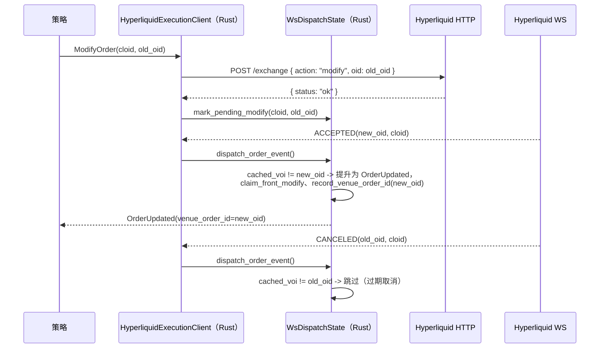

# Hyperliquid

[Hyperliquid](https://hyperliquid.gitbook.io/hyperliquid-docs) 是一个去中心化永续期货与现货交易所，
构建于专为交易优化的定制区块链 Hyperliquid L1 之上。HyperCore 提供完全在链上的订单簿和撮合引擎。
此集成支持接入 Hyperliquid 实时市场数据并执行订单。

## 概览

此适配器使用 Rust 实现并提供 Python 绑定，无需外部客户端库即可直接集成 Hyperliquid 的 REST 和 WebSocket API。

Hyperliquid 适配器包含多个组件：

- `HyperliquidHttpClient`：底层 HTTP API 连接。
- `HyperliquidWebSocketClient`：底层 WebSocket API 连接。
- `HyperliquidInstrumentProvider`：金融工具解析和加载功能。
- `HyperliquidDataClient`：市场数据馈送管理器。
- `HyperliquidExecutionClient`：账户管理和交易执行网关。
- `HyperliquidDataClientFactory`：Hyperliquid 数据客户端工厂（由交易节点构建器使用）。
- `HyperliquidExecutionClientFactory`：Hyperliquid 执行客户端工厂（由交易节点构建器使用）。

:::note
大多数用户会为实盘交易节点定义配置（如下所示），无需直接使用这些底层组件。
:::

## 示例

- [Python 示例](https://github.com/qOeOp/trade/tree/main/examples/live/hyperliquid/)
- [Rust 示例](https://github.com/qOeOp/trade/tree/main/crates/adapters/hyperliquid/examples/)

## 构建者代码归因

提交到主网的订单会携带 VibeTrader 构建者代码，且**费率为零**，因此归因不会增加交易成本。
这有助于我们衡量此集成的真实使用情况，并确定持续维护的优先级。归因订单流的用户在进行大规模交易时，
也可能有资格通过 [Institutional](https://github.com/qOeOp/trade) 层级获得直接支持。

可在序列化配置中设置 `include_builder_attribution: false`，或在 Python 中设置
`include_builder_attribution=False`，以选择退出归因。

以下三种情况下，订单不会包含构建者地址：

- **测试网**：如果订单包含钱包未明确批准的构建者地址，Hyperliquid 测试网会拒绝该订单
  （由水龙头注资的测试网钱包通常没有批准记录），因此测试网订单绝不会包含构建者。
- **金库交易**（已配置 `vault_address`）：Hyperliquid 不允许金库批准构建者费用，
  因此包含构建者地址会导致交易所拒绝订单。
- **已禁用归因**（`include_builder_attribution=False`）：不希望归因订单流的用户可以明确禁用构建者归因。

```python
from vibe_trader.adapters.hyperliquid import HyperliquidExecClientConfig

config = HyperliquidExecClientConfig(
    include_builder_attribution=False,
)
```

### 构建者费用批准

订单要携带构建者地址，Hyperliquid 要求先进行一次性 `ApproveBuilderFee` 批准：从未批准过构建者费用的钱包
所发订单会以 `Builder fee has not been approved` 为由被拒绝（此前的任何批准，包括 0% 费率，均可满足检查）。
批准必须使用主钱包私钥签名；在代理（API）钱包设置中，适配器并不持有该私钥，因此批准通过一次性脚本运行，
而不是在执行客户端启动时进行。0% 最高费率只允许归因：永远不会收取构建者费用；若要提高费率，
则需要由你签署新的批准。

每个钱包运行一次批准脚本（读取 `HYPERLIQUID_PK`；当 `HYPERLIQUID_TESTNET=true` 时读取
`HYPERLIQUID_TESTNET_PK`）：

```bash
cargo run -p vibe-hyperliquid --bin hyperliquid-builder-fee-approve
```

也可以从 Python 运行：

```python
from vibe_trader.adapters.hyperliquid import builder_fee_approve

builder_fee_approve()
```

### 撤销批准

使用撤销操作可将此前批准的构建者费用上限设为 0%（例如，某个曾收取构建者费用的版本所做的批准）。
撤销只限制费用，不会删除批准记录，因此除非禁用 `include_builder_attribution`，归因仍会继续。

```bash
cargo run -p vibe-hyperliquid --bin hyperliquid-builder-fee-revoke
```

也可以从 Python 运行：

```python
from vibe_trader.adapters.hyperliquid import builder_fee_revoke

builder_fee_revoke()
```

Rust 脚本会打印操作摘要，并在签名前暂停等待按下 Enter；如果摘要中有任何内容不正确，请用 `Ctrl+C`
中止，或传入 `--yes` 跳过提示。Python 绑定不会提示；调用前请自行检查当前生效的环境变量。

## 测试网设置

Hyperliquid 提供测试网环境，可使用模拟资金测试策略。

:::info
**需要主网账户。** Hyperliquid 测试网水龙头仅适用于此前在主网存入过资金的钱包。
必须先为主网账户注资，才能获得测试网 USDC。
:::

### 获取测试网资金

要接收测试网 USDC，必须先使用同一钱包地址在**主网**存入资金：

1. 访问 [Hyperliquid 主网门户](https://app.hyperliquid.xyz/)，并使用钱包存入资金。
2. 使用同一钱包访问[测试网水龙头](https://app.hyperliquid-testnet.xyz/drip)。
3. 从水龙头领取 1,000 模拟 USDC。

:::note
**电子邮件钱包用户**：电子邮件登录会为主网和测试网生成不同地址。要使用水龙头，请从主网导出电子邮件钱包，
将其导入 MetaMask 或 Rabby，然后把扩展连接到测试网。
:::

### 创建测试网账户

1. 访问 [Hyperliquid 测试网门户](https://app.hyperliquid-testnet.xyz/)。
2. 连接钱包（MetaMask、WalletConnect 或电子邮件）。
3. 测试网会自动为钱包地址创建账户。

### 导出私钥

要在 VibeTrader 中使用测试网账户，需要导出钱包私钥：

**MetaMask:**

1. 点击账户旁边的三点菜单。
2. 选择"Account details"。
3. 点击"Show private key"。
4. 输入密码并复制私钥。

:::warning
**绝不要分享私钥。**
请使用环境变量安全存储私钥，切勿将其提交到版本控制系统。
:::

### 设置环境变量

将测试网凭据设置为环境变量：

```bash
export HYPERLIQUID_TESTNET_PK="your_private_key_here"
# Optional: for vault trading
export HYPERLIQUID_TESTNET_VAULT="vault_address_here"
```

当配置中设置 `environment=HyperliquidEnvironment.TESTNET` 时，适配器会自动加载这些变量。

:::warning
**代理/API 钱包**：如果 `HYPERLIQUID_TESTNET_PK` 是主账户批准的
[代理钱包](#代理钱包)（在 Hyperliquid UI 上创建 API 钱包时的典型设置），还必须将
`HYPERLIQUID_ACCOUNT_ADDRESS` 设为主账户地址。否则，即使订单已在交易场所生效，
`OrderStatusReport` 请求和 WebSocket 用户数据馈送也会返回空结果。参见 GH-4010（源 issue #4010）。
:::

## 产品支持

Hyperliquid 提供线性永续期货、HIP-3 构建者部署的永续合约、原生现货市场以及 HIP-4 二元结果市场。

| 产品类型       | 数据馈送 | 交易 | 说明                                                        |
| -------------- | -------- | ---- | ----------------------------------------------------------- |
| 现货           | ✓        | ✓    | 原生现货市场。                                              |
| 永续期货       | ✓        | ✓    | 以 USDC 结算的线性永续合约（由验证者运营）。                |
| HIP‑3 永续合约 | ✓        | ✓    | 构建者部署的永续合约，每个 dex 使用各自抵押品；需选择启用。 |
| HIP‑4 结果市场 | ✓        | ✓    | 以 USDH 结算的二元结果市场；需选择启用。                    |

:::note
标准 Hyperliquid 永续合约以 USDC 结算。HIP-3 dex 可使用自己的抵押代币结算，例如 USDH、USDE 或 USDT0，
但 Vibe 符号仍以 `USD` 为报价币。现货市场是标准货币对。有关配置和选择启用的详情，请参阅
[HIP-3 构建者部署的永续合约](#hip-3-构建者部署的永续合约)和
[HIP-4 结果市场](#hip-4-结果市场)。Hyperliquid 当前的 API 文档将 `outcomeMeta` 标记为仅限测试网，
因此能否发现 HIP-4 市场取决于所选环境是否提供该载荷。
:::

## 符号体系

Hyperliquid 对金融工具使用特定的符号格式：

### 现货市场

格式：`{Base}-{Quote}-SPOT`

示例：

- `PURR-USDC-SPOT` - PURR/USDC 现货对
- `HYPE-USDC-SPOT` - HYPE/USDC 现货对

在策略中订阅：

```python
InstrumentId.from_str("PURR-USDC-SPOT.HYPERLIQUID")
```

:::note
现货金融工具可能包含金库代币（以 `vntls:` 为前缀），金融工具提供器会自动处理这些代币。
:::

### 永续期货

格式：`{Base}-USD-PERP`

示例：

- `BTC-USD-PERP` - Bitcoin 永续期货
- `ETH-USD-PERP` - Ethereum 永续期货
- `SOL-USD-PERP` - Solana 永续期货

在策略中订阅：

```python
InstrumentId.from_str("BTC-USD-PERP.HYPERLIQUID")
InstrumentId.from_str("ETH-USD-PERP.HYPERLIQUID")
```

### HIP-3 永续合约

格式：`{dex}:{Asset}-USD-PERP`

[HIP-3](https://hyperliquid.gitbook.io/hyperliquid-docs/hyperliquid-improvement-proposals-hips/hip-3-builder-deployed-perpetuals)
市场使用以冒号分隔的 dex 前缀。dex 名称用于标识市场所属的构建者部署永续合约 dex。

示例：

- `xyz:TSLA-USD-PERP` - trade.xyz 上的 Tesla 永续合约
- `xyz:GOLD-USD-PERP` - trade.xyz 上的黄金永续合约
- `flx:NVDA-USD-PERP` - Felix 上的 Nvidia 永续合约
- `vntl:SPACEX-USD-PERP` - Ventuals 上的 SpaceX 永续合约

在策略中订阅：

```python
InstrumentId.from_str("xyz:TSLA-USD-PERP.HYPERLIQUID")
```

### HIP-4 结果侧代币

格式：`{outcome_index}-{YES|NO}-OUTCOME.HYPERLIQUID`，其中 `outcome_index` 是
`outcomeMeta` 中的 `outcome` 字段，中间部分表示二元结果侧。`-OUTCOME` 后缀与 `-PERP` / `-SPOT` 对称。

[HIP-4](https://hyperliquid.gitbook.io/hyperliquid-docs/hyperliquid-improvement-proposals-hips/hip-4-outcome-markets)
侧代币是以 USDH 按 `0`（失败侧）或 `1`（获胜侧）结算的二元合约。Vibe 符号使用上述人类可读形式；
线上 `raw_symbol` 使用交易场所币种形式 `#{encoding}`（其中
`encoding = 10 * outcome_index + side`，`side` 为 `0` 表示 Yes、`1` 表示 No），
这也是 `l2Book` 和 `allMids` 接受的形式。

示例（结果 25）：

- `25-YES-OUTCOME.HYPERLIQUID`：Yes 侧。编码为 `250`，线上币种为 `#250`，
  代币名称为 `+250`，操作资产 ID 为 `100_000_250`。
- `25-NO-OUTCOME.HYPERLIQUID`：No 侧。编码为 `251`，线上币种为 `#251`，
  代币名称为 `+251`，操作资产 ID 为 `100_000_251`。

在策略中订阅：

```python
InstrumentId.from_str("25-YES-OUTCOME.HYPERLIQUID")
```

:::note
结果市场范围会循环变化。每次结算都会从 `outcomeMeta` 中移除已解决的结果，交易场所下一次上市时会递增索引。
可使用以下命令查看实时市场范围：
`curl -s -X POST https://api.hyperliquid.xyz/info -d '{"type":"outcomeMeta"}'`.
:::

有关交易流程、结算和当前限制，请参阅 [HIP-4 结果市场](#hip-4-结果市场)。

## HIP-3 构建者部署的永续合约

[HIP-3](https://hyperliquid.gitbook.io/hyperliquid-docs/hyperliquid-improvement-proposals-hips/hip-3-builder-deployed-perpetuals)
允许符合条件的部署者在 Hyperliquid 上启动无需许可的永续合约 dex。这些市场包括股票（TSLA、NVDA、AAPL）、
大宗商品（黄金、原油）、指数（S&P 500）和 IPO 前代币（SpaceX、OpenAI）。

在 `LiveNode` 中，连接时会自动同时加载 HIP‑3 永续合约和标准永续合约：适配器从 `allPerpMetas`
获取每个永续合约 dex（标准和构建者部署），因此无需额外客户端配置。

要缩小加载范围，请使用 `InstrumentProviderConfig` 过滤：

```python
instrument_provider = InstrumentProviderConfig(
    load_all=True,
    filters={"market_types": ["perp_hip3"]},
)
```

直接使用 `HyperliquidHttpClient` 时，除非通过 `load_instrument_definitions` 选择启用，否则不包括 HIP-3 永续合约 dex：

```python
from vibe_trader.adapters.hyperliquid import HyperliquidEnvironment
from vibe_trader.adapters.hyperliquid import HyperliquidHttpClient

client = HyperliquidHttpClient.from_env(HyperliquidEnvironment.MAINNET)
instruments = await client.load_instrument_definitions(
    include_spot=True,
    include_perps=True,
    include_perps_hip3=True,
    include_outcomes=False,
)
```

### 与标准永续合约的区别

HIP-3 市场在同一个 HyperCore 撮合引擎上交易，并使用相同的订单 API。主要区别如下：

- **费用更高**：默认为标准永续合约费用的 2 倍，部署者获得其中一半。
- **逐仓保证金**：HIP-3 市场默认仅支持逐仓保证金。
- **每个 dex 独立抵押品**：每个 HIP-3 dex 通过其在 `allPerpMetas` 中的 `collateralToken` 条目声明结算代币。
  Vibe 通过 `spotMeta` 解析该代币，并将符号的报价币部分保持为 `USD`。如果无法从 `spotMeta` 解析非 USDC
  抵押代币，金融工具加载会返回错误，而不会回退到 USDC。
- **由部署者管理的预言机**：预言机数据馈送由部署者而非验证者运营。
- **增长模式**：部分 dex 启用增长模式，可将协议费用降低 90%。

有关完整协议详情，请参阅 Hyperliquid 文档：

- [HIP-3 提案](https://hyperliquid.gitbook.io/hyperliquid-docs/hyperliquid-improvement-proposals-hips/hip-3-builder-deployed-perpetuals)
- [HIP-3 部署者操作](https://hyperliquid.gitbook.io/hyperliquid-docs/for-developers/api/hip-3-deployer-actions)
- [资产 ID](https://hyperliquid.gitbook.io/hyperliquid-docs/for-developers/api/asset-ids)
- [费用](https://hyperliquid.gitbook.io/hyperliquid-docs/trading/fees)

### 通配符清理

部分 HIP-3 dex 部署的资产在交易场所名称中包含 `*` 或 `?` 字节（例如 `dex:STREAMABCD****-USD-PERP`）。
这些字节会与 Vibe 消息总线的模式语法（`*` = 零个或多个字符，`?` = 一个字符）冲突；
如果原样嵌入主题字符串，会破坏订阅路由。

Hyperliquid 适配器在构造 `InstrumentId.symbol` 时会将这两种字节替换为 `x`，因此名为
`dex:STREAMABCD****` 的 HIP-3 资产会以以下形式提供给策略：

```python
InstrumentId.from_str("dex:STREAMABCDxxxx-USD-PERP.HYPERLIQUID")
```

替换仅适用于主题、缓存、日志和配置中使用的 Vibe 内部符号。交易场所官方名称会保留在金融工具的
`raw_symbol` 字段中，供 HTTP 和 WebSocket 线上调用使用；订单提交引用数字资产索引，
因此与 Hyperliquid 的往返交互不受影响。

订阅交易场所名称含通配符字节的 HIP-3 金融工具时，请使用清理后的形式。不含 `*` 或 `?` 的符号将原样传递。

此替换是有损的：`dex:FOO*` 和 `dex:FOO?` 等两个不同的交易场所名称会规范化为同一个 Vibe 符号。
金融工具加载器会检测冲突，保留第一个定义，并在警告日志中记录被丢弃的交易场所名称；
在交易场所通过重命名解决冲突之前，被丢弃的金融工具无法通过 Vibe 交易。

## HIP-4 结果市场

[HIP-4](https://hyperliquid.gitbook.io/hyperliquid-docs/for-developers/api/asset-ids#outcomes)
市场是全额抵押的二元合约。每个市场有两个侧代币（Yes / No），在结果确定日按 `1 USDH`（获胜侧）
或 `0 USDH`（失败侧）结算。Hyperliquid 当前的 API 文档通过 `outcomeMeta` 公开结果元数据，
并将该端点标记为仅限测试网。适配器以尽力而为方式处理结果元数据；当交易场所不返回该载荷时，
会跳过 HIP-4 金融工具。

### 加载结果金融工具

在 `LiveNode` 中，当交易场所公开 `outcomeMeta` 时，会以尽力而为方式自动加载结果金融工具；
Hyperliquid 当前文档将该元数据端点标记为仅限测试网，当载荷不可用时，适配器会跳过 HIP-4 金融工具。
无需客户端配置。

直接使用 `HyperliquidHttpClient` 时，请通过 `load_instrument_definitions` 选择启用：

```python
from vibe_trader.adapters.hyperliquid import HyperliquidEnvironment
from vibe_trader.adapters.hyperliquid import HyperliquidHttpClient

client = HyperliquidHttpClient.from_env(HyperliquidEnvironment.TESTNET)
instruments = await client.load_instrument_definitions(
    include_spot=True,
    include_perps=True,
    include_perps_hip3=False,
    include_outcomes=True,
)
```

提供器为每个结果发出两个以 USDH 计价的 `BinaryOption` 金融工具（每侧一个）。符号采用
`{outcome_index}-{YES|NO}-OUTCOME.HYPERLIQUID` 形式。`expiration_ns` 从交易场所描述
（`expiry:YYYYMMDD-HHMM`，UTC）中解析。独立二元结果自带到期时间；命名结果和回退结果继承父问题的到期时间。
默认值为每个 tick `0.0001`，每手 `0.01`。

每个金融工具的 `BinaryOption.info` 都以键值映射携带解析后的交易场所元数据（在 Python 中通过
`info["key"]` 使用，在 Rust 中通过 `Params.get_str(...)` 使用）。派生标识符始终会填充；
当交易场所提供描述派生字段时，这些字段才会出现。

| 字段               | 来源                           | 说明                                        |
| ------------------ | ------------------------------ | ------------------------------------------- |
| `outcome_index`    | 派生                           | `outcomeMeta` 中的 `outcome`                |
| `outcome_side`     | 派生                           | `0` = Yes，`1` = No                         |
| `side_name`        | 派生                           | `"Yes"` 或 `"No"`                           |
| `encoding`         | 派生                           | `10 * outcome_index + side`                 |
| `asset_id`         | 派生                           | `100_000_000 + encoding`                    |
| `market_name`      | `outcomeMeta.outcomes[*].name` | 交易场所市场标签                            |
| `class`            | 描述                           | `priceBinary` 或 `priceBucket`              |
| `underlying`       | 描述                           | 标的资产代码                                |
| `expiry`           | 描述                           | `YYYYMMDD-HHMM` UTC                         |
| `target_price`     | 描述                           | 二元结算阈值                                |
| `period`           | 描述                           | 重复周期（例如 `1d`、`3m`）                 |
| `price_thresholds` | 描述                           | 逗号分隔的阈值（区间市场）                  |
| `named_index`      | 命名结果描述                   | 在父级 `named_outcomes` 数组中的位置        |
| `is_fallback`      | 回退结果描述                   | 问题的 `other` 结果为 `true`                |
| `question`         | 父问题                         | 问题 ID                                     |
| `question_name`    | 父问题                         | 问题标签                                    |
| `question_*`       | 父问题描述                     | 每个已解析的问题字段，以 `question_` 为前缀 |

描述键会从交易场所的 camelCase 转换为 snake_case
（`targetPrice` -> `target_price`、`priceThresholds` -> `price_thresholds`）。
值保持为字符串，以确保线上数据保真；数字标识符（`outcome_index`、`outcome_side`、`encoding`、
`asset_id`、`question`、`named_index`）存储为 JSON 数字。

### 结算货币

结果以 USDH 结算（代币索引 360，在 `USDH/USDC` 现货对 `@230` 上交易）。首次创建结果金融工具时，
适配器会以 8 位小数精度注册 USDH，因此 `BinaryOption.currency`、`quote_currency` 以及零费用结果成交的
佣金货币都会解析为 USDH。

USDH 现货余额会与永续合约清算所视图合并，因此 `AccountState` 会同时包含 USDH、USDC 及其他非零现货持仓。

### 交易流程

结果侧代币（`{outcome_index}-{YES|NO}-OUTCOME.HYPERLIQUID`）通过标准订单路径交易。
像处理任何永续合约或现货金融工具一样提交 `SubmitOrder`；执行客户端会通过相同的 `Order` 操作，
将其路由到交易场所的 `#{encoding}` 订单簿（其中 `encoding = 10 * outcome_index + outcome_side`）。
无需 HIP-4 专用调用。

结算由交易场所驱动；请参阅[结算分派](#结算分派)。

#### 高级工作流

对于需要在订单簿外管理侧代币库存的策略，可直接通过 `HyperliquidHttpClient`（Rust 和 PyO3）
访问完整的 `userOutcome` 操作集：

```python
from decimal import Decimal
from vibe_trader.adapters.hyperliquid import HyperliquidEnvironment
from vibe_trader.adapters.hyperliquid import HyperliquidHttpClient

client = HyperliquidHttpClient.from_env(HyperliquidEnvironment.MAINNET)

# Mint matched Yes + No side tokens from USDH (e.g. dual-side market making)
await client.submit_split_outcome(50, Decimal("1.0"))

# Burn a matched Yes + No pair back to USDH (amount=None merges the max)
await client.submit_merge_outcome(50, None)

# Multi-outcome priceBucket helpers
await client.submit_merge_question(9, None)
await client.submit_negate_outcome(9, 52, Decimal("1.0"))
```

| 操作                    | 使用场景                                                    |
| ----------------------- | ----------------------------------------------------------- |
| `submit_split_outcome`  | 从报价币铸造配对的 Yes + No 代币（初始做市、双侧对冲）      |
| `submit_merge_outcome`  | 不跨越价差，将一对匹配的 Yes + No 销毁并换回报价币          |
| `submit_merge_question` | 以原子方式平掉完整的多结果篮子并换回报价币                  |
| `submit_negate_outcome` | 将某一结果的 No 份额转换为同一问题中所有其他结果的 Yes 份额 |

对于方向性交易，普通 `SubmitOrder` 路径已足够；只有要在订单簿外创建或销毁侧代币库存时，才需要上述方法。

### 订单约束

结果侧代币的行为类似现货代币（无保证金、无资金费率、无强平）。执行客户端会拒绝不适用的功能：

- `reduce_only` 订单。
- 触发订单类型（`StopMarket`、`StopLimit`、`MarketIfTouched`、`LimitIfTouched`、追踪止损）。

支持采用 `GTC`、`IOC` 或 `ALO` 有效期的 `Limit` 和 `Market` 订单。交易场所的最低名义价值为 10 USDH；
请设置 `order_qty`，使 `order_qty * limit_price >= 10`。

### 结算分派

到期时，交易场所会平掉持有的侧代币余额，并为每一侧发出一笔 `Settlement` 成交。
适配器通过标准用户成交数据流（HTTP 轮询和 WebSocket）接收这些成交，不会运行合成分派。

每笔结算成交：

- `order_side = SELL`，佣金为零。
- 获胜侧价格为 `1` USDH，失败侧为 `0`。
- 以 `FillReport` 形式呈现。
- 当 WebSocket 分派将持仓关联到已跟踪订单时，还会发出 `OrderFilled`。

统一涵盖独立 `priceBinary` 结果和多结果 `priceBucket` 问题。

### 持仓对账

HIP-4 侧代币通过 `spotClearinghouseState` 到达，其中 `coin` 设为 `+E` 代币形式，且没有 `token` 字段。
适配器会：

- 在反序列化期间将 `SpotBalance.token` 视为可选字段。
- 生成 `PositionStatusReport` 时，将 `+E` / `#E` 币种解析为相应的 `BinaryOption` 金融工具。
- 当持仓状态过滤条件是结果金融工具时，跳过获取永续合约清算所数据（结果永远不会出现在 `assetPositions` 中）。

### 多结果（priceBucket）市场

交易场所通过 `outcomeMeta` 中的顶层 `questions` 数组公开多结果市场。每个问题引用一个回退结果和一系列命名结果，
各命名结果的描述通过 `index:N` 反向指向该问题。每个侧代币均建模为独立的 `BinaryOption` 金融工具；
`HyperliquidHttpClient` 上的 `submit_merge_question` 和 `submit_negate_outcome` 操作在问题层级执行，
用于篮子平仓和跨结果轮换。

## 金融工具提供器

通过 `InstrumentProviderConfig(filters=...)` 加载金融工具时，金融工具提供器支持过滤：

| 过滤键                       | 类型        | 说明                                  |
| ---------------------------- | ----------- | ------------------------------------- |
| `market_types`（或 `kinds`） | `list[str]` | `"perp"`、`"perp_hip3"` 或 `"spot"`。 |
| `bases`                      | `list[str]` | 基础货币代码，例如 `["BTC", "ETH"]`。 |
| `quotes`                     | `list[str]` | 报价货币代码，例如 `["USDC"]`。       |
| `symbols`                    | `list[str]` | 完整符号，例如 `["BTC-USD-PERP"]`。   |

仅加载永续合约金融工具的示例：

```python
instrument_provider = InstrumentProviderConfig(
    load_all=True,
    filters={"market_types": ["perp"]},
)
```

## 数据订阅

适配器支持以下数据订阅。所有永续合约数据类型（标记价格、指数价格、资金费率）
均适用于标准永续合约和 HIP-3 永续合约。

| 数据类型        | 订阅 | 快照 | 历史 | Vibe 类型                     | 说明                                   |
| --------------- | ---- | ---- | ---- | ----------------------------- | -------------------------------------- |
| 成交 tick       | ✓    | -    | ✓    | `TradeTick`                   | WebSocket 成交；`recentTrades`。       |
| 公开成交        | ✓    | -    | ✓    | `HyperliquidPublicTrade`      | 可选的自定义数据，含交易对手和哈希。   |
| 报价 tick       | ✓    | -    | -    | `QuoteTick`                   | 最优买价/卖价。                        |
| 订单簿增量      | ✓    | ✓    | -    | `OrderBookDelta`              | L2 快照。                              |
| 订单簿深度      | ✓    | -    | -    | `OrderBookDepth10`            | 前 10 档 L2 快照。                     |
| K 线            | ✓    | -    | ✓    | `Bar`                         | 支持的周期见下文。                     |
| 标记价格        | ✓    | -    | -    | `MarkPriceUpdate`             | 永续合约标记价格 tick。                |
| 指数价格        | ✓    | -    | -    | `IndexPriceUpdate`            | 标的参考价格。                         |
| 资金费率        | ✓    | -    | ✓    | `FundingRateUpdate`           | `fundingHistory` 端点。                |
| 未平仓量        | ✓    | -    | -    | `HyperliquidOpenInterest`     | 来自 `activeAssetCtx` 的自定义数据。   |
| 全部中间价      | ✓    | -    | -    | `HyperliquidAllMids`          | 来自 `allMids` 的自定义数据。          |
| 全部 dex 上下文 | ✓    | -    | -    | `HyperliquidAllDexsAssetCtxs` | 来自 `allDexsAssetCtxs` 的自定义数据。 |

:::note
不支持历史报价请求。历史成交请求使用 `recentTrades` 信息端点，该端点返回没有时间范围的近期公开成交快照
（最新成交在前）。`request_trades` 将该快照过滤到请求的 `[start, end]` 窗口，并通过保留最近成交来应用
`limit`。当请求范围早于快照中最早的成交时，适配器会记录警告并返回可用子集（或空响应）。
该端点依赖 Hyperliquid 索引器：自行托管的 `/info` 节点会返回 HTTP 422，适配器将其视为无覆盖并返回空响应。
实时成交仍可通过 WebSocket `trades` 通道获取。
:::

### 订单簿精度控制

`l2Book` 订阅接受可选的 `nSigFigs` 和 `mantissa` 参数，用于降低交易场所侧订单簿聚合的精度。
当通过订单簿增量和深度订阅的 `subscribe_params` 传入这些参数时，适配器会将其转发。

Hyperliquid 接受的 `nSigFigs` 值为 `2`、`3`、`4`、`5`；省略则使用完整精度。
`mantissa` 仅在 `nSigFigs=5` 时有效，可接受 `1`、`2` 或 `5`。

```python
from vibe_trader.model import BookType

self.subscribe_book_deltas(
    instrument_id=instrument_id,
    book_type=BookType.L2_MBP,
    params={"n_sig_figs": 5, "mantissa": 2},
)
```

省略这两个参数会订阅完整深度订单簿。

同一金融工具的订单簿增量和 depth10 快照共享一个交易场所 `l2Book` 数据流：

- 首个订阅打开数据流并设置其精度选项。
- 在数据流处于活动状态时请求不同选项会记录警告，并保留当前生效的选项。
- 当这两种用途中的最后一个取消订阅时，数据流关闭。
- 重连会使用原始精度选项恢复数据流。

### Hyperliquid 特定数据

适配器会发出 Hyperliquid 特定的自定义数据类型：

- `HyperliquidAllMids` 来自 WebSocket `allMids` 数据馈送。每次更新在一个载荷中携带当前报告的全部中间价。
- `HyperliquidAllDexsAssetCtxs` 来自 WebSocket `allDexsAssetCtxs` 数据馈送。每次更新都携带默认永续合约 dex
  和 HIP-3 构建者 dex 中按金融工具规范化的资产上下文条目。
- `HyperliquidOpenInterest` 来自标记价格、指数价格和资金费率共用的 `activeAssetCtx` 数据馈送。
- `HyperliquidPublicTrade` 来自 `trades` 和 `recentTrades`。每个事件都自包含，并包括买方、卖方和交易场所哈希。

| 字段       | 类型             | 说明                                   |
| ---------- | ---------------- | -------------------------------------- |
| `mids`     | `dict[str, str]` | 金融工具 ID 到中间价的映射。           |
| `ts_event` | `int`            | 更新发生时的 UNIX 时间戳，单位为纳秒。 |
| `ts_init`  | `int`            | 对象构建时的 UNIX 时间戳，单位为纳秒。 |

在 actor 或策略中使用 `DataType(HyperliquidAllMids.__name__)` 订阅。
对于 HIP-3 dex 特定数据流，请在 `metadata["dex"]` 中传入交易场所 dex：

```python
from vibe_trader.adapters.hyperliquid import HYPERLIQUID_CLIENT_ID
from vibe_trader.adapters.hyperliquid import HyperliquidAllMids
from vibe_trader.model import DataType

self.subscribe_data(
    data_type=DataType(HyperliquidAllMids.__name__, metadata={"dex": "hyperliquid"}),
    client_id=HYPERLIQUID_CLIENT_ID,
)
```

`HyperliquidOpenInterest` 携带一个永续合约金融工具的最新未平仓量。
使用 `metadata["instrument_id"]` 中的规范 Vibe `instrument_id` 进行订阅：

| 字段            | 类型           | 说明                                                      |
| --------------- | -------------- | --------------------------------------------------------- |
| `instrument_id` | `InstrumentId` | 规范 Vibe 金融工具 ID。                                   |
| `open_interest` | `Decimal`      | 已解析、可直接用于算术运算的未平仓量。                    |
| `ts_event`      | `int`          | 更新发生时的 UNIX 时间戳，单位为纳秒；与 `ts_init` 相同。 |
| `ts_init`       | `int`          | 对象构建时的 UNIX 时间戳，单位为纳秒。                    |

```python
from vibe_trader.adapters.hyperliquid import HYPERLIQUID_CLIENT_ID
from vibe_trader.adapters.hyperliquid import HyperliquidOpenInterest
from vibe_trader.model import DataType

self.subscribe_data(
    data_type=DataType(
        HyperliquidOpenInterest.__name__,
        metadata={"instrument_id": str(self.instrument_id)},
    ),
    client_id=HYPERLIQUID_CLIENT_ID,
)
```

`HyperliquidOpenInterest` 会复用同一个底层 `activeAssetCtx` 交易场所订阅；该订阅已为同一币种的标记价格、
指数价格和资金费率提供支持。添加 OI 不会再打开第二个并行 `activeAssetCtx` 订阅。

对于公开订单流研究，`HyperliquidPublicTrade` 是通用 `TradeTick` 的可选替代方案。它包含
`instrument_id`、`price`、`size`、`aggressor_side`、`trade_id`、`buyer`、`seller`、`hash`、
`ts_event` 和 `ts_init`。使用相同的规范金融工具元数据进行订阅：

```python
from vibe_trader.adapters.hyperliquid import HYPERLIQUID_CLIENT_ID
from vibe_trader.adapters.hyperliquid import HyperliquidPublicTrade
from vibe_trader.model import DataType

self.subscribe_data(
    data_type=DataType(
        HyperliquidPublicTrade.__name__,
        metadata={"instrument_id": str(self.instrument_id)},
    ),
    client_id=HYPERLIQUID_CLIENT_ID,
)
```

同时请求两者时，它会与 `TradeTick` 共享同一个交易场所 `trades` 订阅。与附带的 `users` 事件不同，
每个 `HyperliquidPublicTrade` 都可独立进行 Arrow 序列化，无需联接即可记录到 Vibe 目录并从中查询。
此类型的 `RequestCustomData` 使用与历史成交请求相同、仅包含近期数据的 `recentTrades` 快照。

在 `LiveNode` 内运行的 Python 策略中，载荷会以具体自定义数据类型本身传递给 `on_data`：

```python
from decimal import Decimal

from vibe_trader.adapters.hyperliquid import HyperliquidOpenInterest


def on_data(self, data) -> None:
    if isinstance(data, HyperliquidOpenInterest):
        if data.open_interest > Decimal("1000"):
            self.log.info(f"OI {data.instrument_id} -> {data.open_interest}")
```

`HyperliquidAllDexsAssetCtxs` 公开整个数据馈送的聚合，而不是每个金融工具一个主题；
因此策略只需订阅一次，再筛选所需的规范化条目：

| 字段              | 类型                              | 说明                                                                 |
| ----------------- | --------------------------------- | -------------------------------------------------------------------- |
| `dex`             | `str`                             | 来自 Hyperliquid `perpDexs` 的永续合约 dex 标识符；`""` 为默认 dex。 |
| `instrument_id`   | `InstrumentId`                    | 条目的规范 Vibe 金融工具 ID。                                        |
| `mark_price`      | `Price`                           | 当前标记价格。                                                       |
| `oracle_price`    | `Price`                           | 当前预言机/指数参考价格。                                            |
| `prev_day_price`  | `Price`                           | 交易场所载荷中的前一日参考价格。                                     |
| `mid_price`       | `Price \| None`                   | 交易场所载荷中存在的中间价。                                         |
| `impact_prices`   | `HyperliquidImpactPrices \| None` | 存在时的最优买价/卖价影响价格。                                      |
| `funding_rate`    | `Decimal`                         | 已解析、可直接用于算术运算的资金费率。                               |
| `open_interest`   | `Decimal`                         | 已解析、可直接用于算术运算的未平仓量。                               |
| `premium`         | `Decimal \| None`                 | 交易场所载荷中存在的溢价。                                           |
| `day_ntl_volume`  | `Decimal`                         | 24 小时名义成交量。                                                  |
| `day_base_volume` | `Decimal`                         | 24 小时基础资产成交量。                                              |
| `ts_event`        | `int`                             | 更新发生时的 UNIX 时间戳，单位为纳秒；与 `ts_init` 相同。            |
| `ts_init`         | `int`                             | 对象构建时的 UNIX 时间戳，单位为纳秒。                               |

底层 Hyperliquid 线上载荷以 `ctxs: [[dex, ctxs[]], ...]` 形式到达。适配器解码该实时交易场所格式，
并在策略看到数据前将其规范化为下文所示的逐条目输出。

适配器不会虚构 `dex` 值。它从 Hyperliquid `meta` / `allPerpMetas` 引导有序 dex 集合，
并从实时 `perpDexs` 信息端点解析构建者 dex 标识符。空字符串 `""` 表示 Hyperliquid 的默认永续合约 dex；
`xyz`、`flx` 或 `vntl` 等非空值是交易场所定义的构建者 dex 标识符。

映射根据连接时加载的金融工具解析，并且数据馈送按位置排列（每个条目没有币种名称），
因此稍后上市的永续合约只有重连后才会出现。某个 dex 的上下文数量不匹配时会记录警告，提示重连；
条目保持按位置对齐，这对追加上市的情况是正确的。

```python
from vibe_trader.adapters.hyperliquid import HYPERLIQUID_CLIENT_ID
from vibe_trader.adapters.hyperliquid import HyperliquidAllDexsAssetCtxs
from vibe_trader.model import DataType

self.subscribe_data(
    data_type=DataType(HyperliquidAllDexsAssetCtxs.__name__),
    client_id=HYPERLIQUID_CLIENT_ID,
)


def on_data(self, data) -> None:
    if isinstance(data, HyperliquidAllDexsAssetCtxs):
        for entry in data.entries:
            if entry.dex == "xyz":
                self.log.info(f"{entry.instrument_id} OI={entry.open_interest}")
```

### 支持的 K 线周期

| 周期      | Hyperliquid K 线 |
| --------- | ---------------- |
| 1-MINUTE  | `1m`             |
| 3-MINUTE  | `3m`             |
| 5-MINUTE  | `5m`             |
| 15-MINUTE | `15m`            |
| 30-MINUTE | `30m`            |
| 1-HOUR    | `1h`             |
| 2-HOUR    | `2h`             |
| 4-HOUR    | `4h`             |
| 8-HOUR    | `8h`             |
| 12-HOUR   | `12h`            |
| 1-DAY     | `1d`             |
| 3-DAY     | `3d`             |
| 1-WEEK    | `1w`             |
| 1-MONTH   | `1M`             |

## 订单能力

Hyperliquid 支持完整的订单类型和执行选项。

:::note
下表中的"永续合约"同时涵盖由验证者运营的标准永续合约和构建者部署的 HIP-3 永续合约。
两者适用相同的订单类型、有效期选项和执行指令。
:::

### 订单类型

| 订单类型            | 永续合约 | 现货 | 说明                                     |
| ------------------- | -------- | ---- | ---------------------------------------- |
| `MARKET`            | ✓        | ✓    | 相对最优 BBO 带可配置滑点的 IOC 限价单。 |
| `LIMIT`             | ✓        | ✓    |                                          |
| `STOP_MARKET`       | ✓        | ✓    | 止损订单。                               |
| `STOP_LIMIT`        | ✓        | ✓    | 使用限价执行的止损订单。                 |
| `MARKET_IF_TOUCHED` | ✓        | ✓    | 以市价止盈。                             |
| `LIMIT_IF_TOUCHED`  | ✓        | ✓    | 使用限价执行的止盈订单。                 |

:::info
条件订单（止损和触价订单）使用 Hyperliquid 原生触发订单功能实现，并自动检测 TP/SL 模式。
所有触发订单均依据[标记价格](https://hyperliquid.gitbook.io/hyperliquid-docs/trading/robust-price-indices)评估。
:::

:::note
市价单需要缓存的报价数据。适配器使用最优卖价（买入时）或最优买价（卖出时），并应用可配置的滑点缓冲
（默认 50 bps）。提交前，价格会按照 Hyperliquid 的价格约束进行舍入。
请确保为任何计划使用市价单交易的金融工具订阅报价。

滑点缓冲由 `HyperliquidExecClientConfig` 上的 `market_order_slippage_bps` 控制（默认 50 bps），
并可通过 `SubmitOrder.params` 中的 `market_order_slippage_bps` 键逐订单覆盖。
:::

:::note
`STOP_MARKET` 和 `MARKET_IF_TOUCHED` 订单不携带限价。适配器使用同一可配置滑点缓冲（默认 50 bps）
从触发价格派生限价，舍入为 5 位有效数字，并限制到交易场所的小数位上限（买入向上取整，卖出向下取整）。
这可保证满足 Hyperliquid 的 `limit_px >= trigger_px`（买入）/ `limit_px <= trigger_px`（卖出）约束。
:::

:::warning
**默认启用价格规范化。** Hyperliquid 强制订单价格最多为 5 位有效数字，此外还根据 `szDecimals`
设置每种资产的小数位上限（永续合约为 `6 - szDecimals`，现货为 `8 - szDecimals`）。例如，当 ETH
交易价格为 $2,600（4 位整数）时，即使金融工具的 `price_precision=2`，也只允许 1 位小数。

默认情况下，适配器会将所有传出的限价和触发价格规范化为 5 位有效数字，并将其限制到金融工具价格精度，
以防止订单被拒绝。这
意味着提交的价格可能会有轻微变化。要禁用此功能并完全控制价格格式，请在
`HyperliquidExecClientConfig` 中设置 `normalize_prices=False`。

如果禁用规范化，可以在策略中应用相同的舍入方式：

```python
from decimal import Decimal, ROUND_DOWN


def round_to_sig_figs(price: Decimal, sig_figs: int = 5) -> Decimal:
    if price == 0:
        return Decimal(0)
    shift = sig_figs - int(price.adjusted()) - 1
    if shift <= 0:
        factor = Decimal(10) ** (-shift)
        return (price / factor).to_integral_value() * factor
    return round(price, shift)
```

:::

### 有效期

| 有效期 | 永续合约 | 现货 | 说明             |
| ------ | -------- | ---- | ---------------- |
| `GTC`  | ✓        | ✓    | 撤销前有效。     |
| `IOC`  | ✓        | ✓    | 立即成交或取消。 |
| `FOK`  | -        | -    | *不支持*。       |
| `GTD`  | -        | -    | *不支持*。       |

:::note
当 IOC 订单无法撮合任何挂单流动性时，Hyperliquid 会报告 `iocCancelRejected`，并附带
`Order could not immediately match against any resting orders`。适配器会将此交易场所拒绝保留为
`OrderRejected`，而不会合成一个 `OrderAccepted` 后跟 `OrderCanceled`。部分成交的 IOC 仍会保留其成交，
只取消未成交部分。
:::

### 执行指令

| 指令          | 永续合约 | 现货 | 说明                |
| ------------- | -------- | ---- | ------------------- |
| `post_only`   | ✓        | ✓    | 等同于 ALO 有效期。 |
| `reduce_only` | ✓        | ✓    | 仅平仓订单。        |

:::info
会立即撮合的 post-only 订单会被 Hyperliquid 拒绝。适配器会检测这一情况并生成 `OrderRejected` 事件。
Post-only 订单通过 Hyperliquid 的 ALO（仅增加流动性）通道进行路由。
:::

### 订单操作

| 操作         | 永续合约 | 现货 | 说明                                   |
| ------------ | -------- | ---- | -------------------------------------- |
| 提交订单     | ✓        | ✓    | 提交单个订单。                         |
| 提交订单列表 | ✓        | ✓    | 批量提交订单（单次 API 调用）。        |
| 修改订单     | ✓        | ✓    | 需要交易场所订单 ID。                  |
| 取消订单     | ✓        | ✓    | 按客户端订单 ID 取消。                 |
| 取消全部订单 | ✓        | ✓    | 对未结订单批量执行 `cancelByCloid`。   |
| 批量取消     | ✓        | ✓    | 对所提供列表批量执行 `cancelByCloid`。 |

:::info
取消操作优先使用 `cancelByCloid`；没有缓存 CLOID 时，回退到按数字 OID 执行 `cancel`。
快速取消和标准取消会作为独立的批量操作分派，因此一次取消请求可能产生多次交易场所调用。

当交易场所在批量取消响应中返回权威的逐订单拒绝时（例如，对已经终态的订单返回 `MissingOrder`），
适配器会发出逐订单 `OrderCancelRejected` 事件，并保持其他取消操作不变。
交易场所结果未知的整项请求失败不包含这种逐订单证据。
:::

:::info
在 VibeTrader 外部下达的订单（例如通过 Hyperliquid Web UI 或其他客户端）会被检测并作为外部订单跟踪。
这些订单会出现在订单状态报告和持仓对账中。
:::

### 以取消替换方式修改

Hyperliquid 将订单修改实现为**取消替换**。[交易所端点](https://hyperliquid.gitbook.io/hyperliquid-docs/for-developers/api/exchange-endpoint#modify-an-order)
上的 `modify` 操作会取消原订单（旧 `oid`），并以新的 `oid` 开立替代订单。两段订单共享同一客户端订单 ID（`cloid`）。

修改操作的 HTTP 响应只确认成功。随后，[`orderUpdates` WebSocket 订阅](https://hyperliquid.gitbook.io/hyperliquid-docs/for-developers/api/websocket/subscriptions)
会传送一份 `ACCEPTED(new_oid)` 状态报告，之后再为原订单段传送 `CANCELED(old_oid)`。

原生 Rust `HyperliquidExecutionClient`（通过 `HyperliquidExecutionClientFactory` 使用）会在 Rust 侧，
通过执行客户端拥有的 [`WsDispatchState`](https://github.com/qOeOp/trade/tree/main/crates/adapters/hyperliquid/src/websocket/dispatch.rs)
执行检测、去重和事件提升。提交时，客户端会以 `client_order_id` 为键注册 `OrderIdentity`
（策略、金融工具、方向、类型、数量、最近已知价格）。每份传入的状态报告或成交都会经由分派进行路由：
已跟踪订单通过 `ExecutionEventEmitter::send_order_event` 发出类型化的 `OrderEventAny::*` 事件；
外部订单则回退到原始 `OrderStatusReport` / `FillReport`，以便引擎对账。分派会将报告的 `venue_order_id`
与该 `cloid` 最近缓存的值比较；两者不同时，它会将 `ACCEPTED` 提升为 `OrderUpdated`，并抑制配对的陈旧取消：



对于正在进行的修改，如果 Hyperliquid 在 `ACCEPTED(new_oid)` 之前传送 `CANCELED(old_oid)`，
待处理修改意图会让分派丢弃旧订单段的取消，同时仍通过 `OrderUpdated` 路径路由后续 `ACCEPTED`。
意图在 HTTP 调用前入队，因此即使请求仍在传输中，也会抑制提前到达的取消。交易场所拒绝的修改会清除自身意图；
传输失败则保留意图，因此即使客户端超时，已到达交易场所的修改仍会抑制提前的 `CANCELED(old_oid)`，
并将最终的 `ACCEPTED(new_oid)` 提升为 `OrderUpdated`（否则检测会回退到缓存的 `venue_order_id`，
而迟到的 `ACCEPTED` 已不再与之匹配）。参见 GH-3827（源 issue #3827）。

同一 `cloid` 下快速重复的修改会作为进行中意图链排队，而不是使用单一标记。后续修改不会覆盖先前意图对旧订单段的抑制；
失败的修改只清除自身尝试，保留较新的排队修改。每个替代订单的 `ACCEPTED` 都会提升最早排队的意图，
并将下一意图的旧订单段推进到已提升的替代订单，因此每一段的陈旧取消都会被抑制，
且每个 `OrderUpdated` 都携带自己的目标数量。

同一条链也保护进行中的查询和单订单对账路径。修改进行期间，`query_order` 和
`generate_order_status_report` 会丢弃已被取代订单段的 `Canceled`，因此替代订单出现前，
解析旧 `oid` 的带外状态探测无法终止活动订单。旧订单段的非取消状态（例如迟到的 `Filled`）仍会转发，
以便对账恢复该状态。

这些路径也会提升替代订单。Hyperliquid 在 `frontendOpenOrders` 中，以同一 `cloid` 和新的 `oid`
列出替代订单；因此当替代订单的 `ACCEPTED(new_oid)` 在 WebSocket 上丢失且尚无成交到达时，
查询会按 `cloid` 解析替代订单，并直接将其提升为 `OrderUpdated`（把 `cloid` 重新绑定到 `new_oid`，
并推进修改链）。因此订单不会继续绑定到已取消订单段，后续修改和取消会以活动替代订单为目标。
参见 GH-4270（源 issue #4270）。

替代订单段的 `FillReport` 也可能抢在 `ACCEPTED(new_oid)` 之前到达。当已设置待处理修改标记，
且报告的 `oid` 与缓存值不匹配时，分派会使用修改目标价格直接从成交提升绑定（先 `OrderUpdated`，
再 `OrderFilled`）。如果没有可用于提升的价格，则会缓冲成交，并在匹配的 `ACCEPTED` 到达时将其排出，
因此 `OrderFilled` 始终在针对最新状态的提升事件 `OrderUpdated` 之后发生。参见 GH-3972（源 issue #3972）。

:::note
一个链式修改边界情况尚未处理：如果*先前*订单段的延迟成交在一次*新的*进行中修改期间到达，
而新修改随后失败，缓冲的成交会滞留到终态清理。对账（`request_fill_reports`）会恢复该成交。
要完全解决这一问题，还需要额外设计（跟踪已退役 VOI，或在修改失败路径上排出缓冲）。
:::

## 订单簿

订单簿通过 L2 WebSocket 订阅维护。每条消息传送完整深度快照（清空并重建），而不是增量变化。

:::note
限制为每个交易者实例中的每个金融工具只能有一个订单簿。
:::

## 账户与持仓管理

`AccountState` 会合并永续合约保证金和现货余额。永续合约保证金和全仓保证金使用情况来自
`clearinghouseState`；非零现货代币（USDC、USDH、HYPE、金库代币、HIP-4 结果侧代币等）来自
`spotClearinghouseState`。当永续合约摘要反映非零抵押品、保证金或可提现余额时，USDC 取自该摘要；
当永续合约摘要缺失或全部为零时，则改用现货 USDC。

标准永续合约默认使用全仓保证金；HIP-3 永续合约默认使用逐仓保证金。连接时，执行客户端会根据
Hyperliquid 清算所状态对账订单、成交和持仓。现货持仓根据持有余额重建（仅做多）；
HIP-4 侧代币会与匹配的 `BinaryOption` 金融工具对账。

:::note
杠杆直接通过 Hyperliquid Web UI 或 API 管理，而不是通过适配器。交易前请在 Hyperliquid 上为每个金融工具设置所需杠杆。
:::

## 强平与 ADL 处理

Hyperliquid 通过 `userEvents` 订阅上的两种 WebSocket 界面发出交易场所主动平仓信号：

- **`liquidation` 事件**：账户被强平时发出。携带 `liquidation ID`、强平者地址、被强平用户、
  被强平名义持仓和被强平账户价值。适配器以警告级别记录这些信息，供运营人员查看。
- **成交级 `liquidation` 元数据**：`fills` 数组中的每个条目都可携带可选的 `liquidation` 对象，
  其中包含 `method`、`markPx` 和 `liquidatedUser`。`method` 值可以是 `market`（在订单簿中强平）
  或 `backstop`（与托底金库平仓，相当于保险机制介入时的 ADL 平仓）。

适配器会为每笔强平成交发出标准 `FillReport`。强平元数据会与成交一同记录，以便将平仓与交易场所侧事件关联。
无需更改策略；现有风险和对账逻辑会像处理任何其他 TAKER 成交一样处理这些成交。

上游参考资料：

- [WebSocket `userEvents`（`liquidation` 和 `FillLiquidation`）](https://hyperliquid.gitbook.io/hyperliquid-docs/for-developers/api/websocket/subscriptions)
- [强平机制](https://hyperliquid.gitbook.io/hyperliquid-docs/trading/liquidations)

## 连接管理

WebSocket 断开时，适配器会使用指数退避自动重连（从 250ms 开始，最长 5s）。重连后，
所有活动订阅都会自动重新订阅，并重建订单簿快照。无需人工干预。

每 30 秒发送一次心跳 ping 以保持连接存活（Hyperliquid 会在 60 秒后关闭空闲连接）。

### 数据流健康状况与恢复

数据客户端会跟踪订单簿增量、10 档深度快照和 BBO 报价的接收新鲜度：

- `stale_stream_receive_timeout_secs` 设置过期阈值。
- `stale_stream_warning_cooldown_secs` 控制重复警告。
- 同一金融工具的新鲜 BBO 数据流会将订单簿过期警告改为相对过期警告。BBO 报价只作为新鲜度参考，
  不作为订单簿输入。

恢复功能默认关闭。设置 `stale_stream_recovery_enabled` 后：

- 首次过期检查始终发出警告。
- 仍然过期的数据流每经过一个 `stale_stream_recovery_cooldown_secs` 会执行一次定向重新订阅。
- `l2Book` 重新订阅会保留原始精度选项。
- 尝试 `stale_stream_max_targeted_resubscribes` 次后，客户端会请求完整 WebSocket 重连。
- 新鲜数据会重置该数据流的恢复阶梯。

## API 凭据

有两种方式可向 Hyperliquid 客户端提供凭据：将相应值传给配置对象，或设置以下环境变量。

对于 Hyperliquid 主网客户端，可以设置：

- `HYPERLIQUID_PK`
- `HYPERLIQUID_VAULT`（可选，用于金库交易）

对于 Hyperliquid 测试网客户端，可以设置：

- `HYPERLIQUID_TESTNET_PK`
- `HYPERLIQUID_TESTNET_VAULT`（可选，用于金库交易）

对于任一环境中的代理（API）钱包交易，还可以设置：

- `HYPERLIQUID_ACCOUNT_ADDRESS`（主账户地址；主网和测试网共用）

:::tip
建议使用环境变量管理凭据。
:::

## 代理钱包

Hyperliquid 允许主账户批准一个[代理钱包](https://hyperliquid.gitbook.io/hyperliquid-docs/for-developers/api/nonces-and-api-wallets)
（也称为 API 钱包或子密钥），代表主账户签署订单。代理签署的订单属于主账户，而不是代理地址。

如果 `HYPERLIQUID_PK`（或 `HYPERLIQUID_TESTNET_PK`）是代理钱包，还必须将 `account_address`
（或环境变量 `HYPERLIQUID_ACCOUNT_ADDRESS`）设为主账户地址。否则，适配器会查询代理地址的余额、订单和
WebSocket 事件；该地址并不拥有任何资产，提交的订单将永远无法对账（不会出现 `OrderStatusReport`，也不会呈现成交）。

执行工厂会解析一个账户地址，并将同一值传给 REST 账户查询和 WebSocket 用户订阅。签名仍使用配置的私钥；
设置 `vault_address` 时，金库交易仍会在已签名交易所载荷中发送 `vaultAddress`。

显式配置值优先于环境变量。环境变量只填充省略的配置值。

信息查询和 WebSocket 订阅所用执行账户地址的解析顺序如下：

1. `account_address`（使用代理钱包时为主账户）。
2. `vault_address`（金库子账户）。
3. `HYPERLIQUID_ACCOUNT_ADDRESS`。
4. `HYPERLIQUID_VAULT` 或 `HYPERLIQUID_TESTNET_VAULT`。
5. 从私钥派生的地址（钱包本身）。

:::note
`HYPERLIQUID_ACCOUNT_ADDRESS` 是主网和测试网共用的单一环境变量（不同于 `HYPERLIQUID_PK` /
`HYPERLIQUID_TESTNET_PK`）。如果代理钱包在两个环境中均由同一主地址批准，一个值即可同时覆盖两者。
:::

:::tip
电子邮件登录钱包会为主网和测试网生成不同地址，因此主地址可能不同。在这种情况下，
应优先在每个环境的 `HyperliquidExecClientConfig` 中显式设置 `account_address`，而不是依赖共用环境变量。
:::

## 金库交易

Hyperliquid 支持[金库交易](https://hyperliquid.gitbook.io/hyperliquid-docs/trading/vaults)，其中钱包代表金库（子账户）操作。
订单使用钱包私钥签名，但签名载荷中包含金库地址。

要通过金库交易，请在执行客户端配置中设置 `vault_address`（或设置
`HYPERLIQUID_VAULT` / `HYPERLIQUID_TESTNET_VAULT` 环境变量）。

:::warning
对于普通金库交易，请不要设置 `account_address`，让 `vault_address` 成为 REST 查询和 WebSocket 用户订阅所用的
账户地址。如果同时设置 `account_address` 和 `vault_address`，查询和订阅会优先使用 `account_address`，
而 `vault_address` 仍会进入已签名交易所载荷。
:::

## 资金费率

Hyperliquid 永续期货使用固定的 1 小时资金费率间隔。适配器会将所有 `FundingRateUpdate` 对象的
`interval` 设为 `60`（分钟）。

## 速率限制

适配器为 Hyperliquid REST API 实现了令牌桶速率限制器，容量为每分钟 1200 权重。遇到速率限制（429）
和服务器错误（5xx）响应时，HTTP 信息请求会使用指数退避（完全抖动）自动重试。
对于 WebSocket post 交易请求，适配器将同时进行的消息数限制为 100，以符合交易场所限制。

## 配置

### 数据客户端配置选项

| 选项                                     | 默认值    | 说明                                                                     |
| ---------------------------------------- | --------- | ------------------------------------------------------------------------ |
| `private_key`                            | `None`    | 用于已认证端点的可选 EVM 私钥。                                          |
| `base_url_ws`                            | `None`    | 覆盖 WebSocket 基础 URL。                                                |
| `base_url_http`                          | `None`    | 覆盖 HTTP 信息 URL。                                                     |
| `proxy_url`                              | `None`    | HTTP 和 WebSocket 传输的可选代理 URL。                                   |
| `environment`                            | `None`    | 环境枚举（`MAINNET` 或 `TESTNET`）；未设置时解析为 `MAINNET`。           |
| `http_timeout_secs`                      | `60`      | 应用于 REST 调用的超时（秒）。                                           |
| `ws_timeout_secs`                        | `30`      | 应用于 WebSocket 连接的超时（秒）。                                      |
| `stale_stream_receive_timeout_secs`      | `120`     | 市场数据流过期警告的接收时长阈值（秒）。设为 `0` 可禁用数据流健康监控。  |
| `stream_health_check_interval_secs`      | `15`      | 市场数据流健康检查的间隔（秒）。设为 `0` 可禁用数据流健康监控。          |
| `stale_stream_warning_cooldown_secs`     | `60`      | 同一市场数据流两次过期警告之间的冷却时间（秒）。                         |
| `stale_stream_recovery_enabled`          | `False`   | 启用过期市场数据流的自动恢复（先定向重新订阅，再重连）。                 |
| `stale_stream_recovery_cooldown_secs`    | `120`     | 同一市场数据流两次恢复操作之间的冷却时间（秒）。必须为正数才能运行恢复。 |
| `stale_stream_max_targeted_resubscribes` | `3`       | 过期数据流升级为完整 WebSocket 重连前的定向重新订阅尝试次数。            |
| `update_instruments_interval_mins`       | `60`      | 金融工具目录刷新间隔（分钟）。                                           |
| `transport_backend`                      | `Sockudo` | WebSocket 传输后端。                                                     |

### 执行客户端配置选项

| 选项                           | 默认值    | 说明                                                                                                      |
| ------------------------------ | --------- | --------------------------------------------------------------------------------------------------------- |
| `private_key`                  | `None`    | EVM 私钥；省略时从 `HYPERLIQUID_PK` 或 `HYPERLIQUID_TESTNET_PK` 加载。                                    |
| `vault_address`                | `None`    | 金库地址；省略时从 `HYPERLIQUID_VAULT` 或 `HYPERLIQUID_TESTNET_VAULT` 加载。                              |
| `account_address`              | `None`    | 代理钱包交易的主账户地址；从 `HYPERLIQUID_ACCOUNT_ADDRESS` 加载。                                         |
| `environment`                  | `None`    | 环境枚举（`MAINNET` 或 `TESTNET`）；未设置时解析为 `MAINNET`。                                            |
| `base_url_ws`                  | `None`    | 覆盖 WebSocket 基础 URL。                                                                                 |
| `base_url_http`                | `None`    | 覆盖 HTTP 信息基础 URL。                                                                                  |
| `base_url_exchange`            | `None`    | 覆盖交易所 API 基础 URL。                                                                                 |
| `max_retries`                  | `3`       | 提交、取消或修改订单请求的最大重试次数。                                                                  |
| `retry_delay_initial_ms`       | `100`     | 两次重试之间的初始延迟（毫秒）。                                                                          |
| `retry_delay_max_ms`           | `5000`    | 两次重试之间的最大延迟（毫秒）。                                                                          |
| `http_timeout_secs`            | `60`      | 应用于 REST 调用的超时（秒）。                                                                            |
| `ws_post_timeout_secs`         | `10`      | 应用于 WebSocket post 交易请求的超时（秒）。                                                              |
| `normalize_prices`             | `True`    | 提交前将订单价格规范化为 5 位有效数字。                                                                   |
| `include_builder_attribution`  | `True`    | 在符合条件的主网订单中包含零费用的 Vibe 构建者归因。                                                      |
| `market_order_slippage_bps`    | `50`      | 应用于 MARKET 和止损触发派生的滑点缓冲（bps）。可通过 `SubmitOrder.params` 逐订单覆盖。                   |
| `outcome_settlement_poll_secs` | `0`       | HIP‑4 `outcomeMeta` 结算轮询间隔（秒）。仅限 Rust；交易场所 `Settlement` 成交涵盖结算，因此默认禁用轮询。 |
| `proxy_url`                    | `None`    | HTTP 和 WebSocket 传输的可选代理 URL。                                                                    |
| `transport_backend`            | `Sockudo` | WebSocket 传输后端。                                                                                      |

:::note
`outcome_settlement_poll_secs` 是唯一仅限 Rust 的选项：它未在 `HyperliquidExecClientConfig` Python
构造函数中公开，始终使用默认值。Rust 和 Python 配置都接受 `max_retries`、`retry_delay_initial_ms` 和
`retry_delay_max_ms` 字段，但执行客户端尚未使用它们（其 HTTP 客户端仅使用请求超时和代理构造）。
:::

### 实盘节点配置

将 `HyperliquidDataClientConfig` 与 `HyperliquidDataClientFactory` 搭配使用，并将
`HyperliquidExecClientConfig` 与 `HyperliquidExecutionClientFactory` 搭配使用。当前 Python 示例展示了
数据和执行客户端的完整 `LiveNode.builder(...)` 配置。

当 `environment=HyperliquidEnvironment.TESTNET` 时，适配器使用 `HYPERLIQUID_TESTNET_PK` 和
`HYPERLIQUID_TESTNET_VAULT`，而不是主网环境变量。

## 贡献

:::info
如需其他功能或希望为 Hyperliquid 适配器做出贡献，请参阅[贡献指南](https://github.com/qOeOp/trade/blob/main/CONTRIBUTING.md)。
:::
