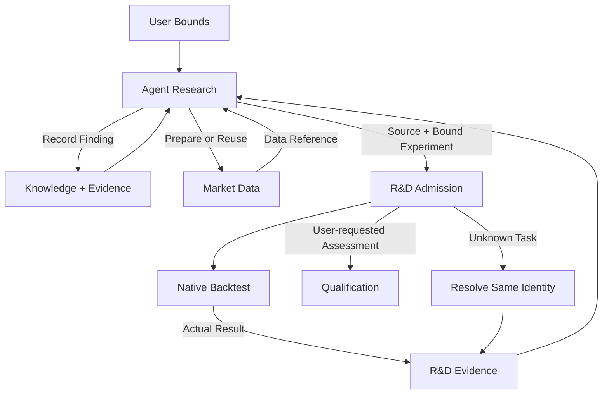

# R&D

<Callout type="info" title="Agents decide; services retain facts and execute deterministic requests">

External Agents own research ideas, source, diagnosis and iteration choices. R&D provides transferable records, sealed strategy packages, experiment tasks and evidence ledgers, not another research decision engine.

</Callout>

## Responsibility

R&D is the sole Owner of research business facts: projects, strategy/composition versions, experiments, resource commitments, attempts/data exposures, Agent decisions and reusable knowledge.
It links Market Data inputs and Backtest evidence, and hands frozen candidates to Qualification for independent assessment.
It owns no market data, matching, qualification, allocation or trading effects.

External Agents submit requests through MCP and write native Nautilus Strategies; Dashboard only reads research progress and results.
Server tasks persist independently of Agent sessions. Disconnection neither cancels admitted tasks nor lets the product substitute its own scientific judgment.

## Functional boundaries

R&D retains four responsibilities: Projects, Authoring, Experiments and Knowledge. Agent diagnosis, stopping
and selection belong to experiment records. On demand discovery is a user flow reusing data queries and replay,
not a separate Decisions or Discovery component. These responsibilities add no service, compiler or fixed research pipeline.

| Capability  | Agent owns                                                     | R&D owns                                                                     |
| ----------- | -------------------------------------------------------------- | ---------------------------------------------------------------------------- |
| Projects    | Understand demand; organize sources and risk goals             | Approved theme, scope, resource ceilings, principal and sources              |
| Experiments | Propose experiments; diagnose, compare and choose next actions | Frozen requests, admission, jobs, spend, attempts and Agent decision records |
| Authoring   | Native Strategy source, parameters and data requirements       | Sealed source/environment, content identity and readback                     |
| Knowledge   | Findings, failure reasons, scope and review conditions         | Traceable entries, references and corrective successors                      |

### Research Project

A Research Project is organized around a research objective rather than a Git repository or a single strategy.
It can link multiple hypotheses, strategy versions, exploratory analyses and replay experiments, each retaining
its own exact identity, evidence and unfinished work while sharing the approved project theme and resource bounds.
Agents develop research branches within those bounds. Branches are links among existing records, not another
subproject service or approval workflow. For example, improving Ronnie resting entries includes entry refinements,
staged exits and volatility filters, whose progress a successor reads from the same project. A project need not
map to one repository or source package; record actual provenance without treating project identity as strategy content identity.

V0.1 Projects retain only the user goal, approved scope and resource bounds, with links to strategy versions,
experiments, tasks and results. Agents create or reuse this minimal project and iterate within the same theme.
Project retention adds no research-method approval, prescribed research steps or Dashboard management page;
complete project-level handover and knowledge reuse ship in V0.2.

### V0.1 experiment explanation records

Agents may record hypotheses, interpretations or next steps before or after an experiment. Prose is flexible;
storage uses a fixed record structure owned by R&D and written/read through its MCP/API, not unrelated chat fragments.

| Fixed information                      | Constraint                                                                                      |
| -------------------------------------- | ----------------------------------------------------------------------------------------------- |
| Record identity and project/experiment | Stable identity referencing existing accessible projects and experiments                        |
| Referenced data, strategy or results   | Exact references; result explanations link the actual run rather than names guessed from prose  |
| Author and recorded time               | Author binds the caller identity; the service records write time                                |
| Explanation body                       | Bounded text, freely organized by the Agent without mandatory categories or paragraph templates |
| Correction predecessor                 | Corrections create linked new records, preserving previous text and references                  |

Explanations are queryable with experiments and substitute for neither fills/account facts, eligibility nor
authority. Code validates structure and references; Agents judge research meaning. Add no classifier, prescribed
diagnosis workflow or service. V0.2 expands comparison, takeover and knowledge reuse on these records without
requiring the full workflow in V0.1.

Hypotheses are research content, not a separate module with semantic approval authority.
R&D does not refuse a mechanically valid experiment for missing alternative explanations, fixed diagnosis categories, unfamiliar metrics or absence of a unique winner.
Agents judge scientific adequacy; deterministic services still enforce approved pass criteria, budgets, protected data and trading authority.

Agents may read admitted ordinary research market data through Market Data and use their own scripts to inspect
patterns, calculate indicators and propose rules. R&D links data references and experiment records without taking
over analysis or adding a script-execution or factor-computation service.

### V0.2 exploratory analysis and research hypotheses

A Hypothesis is an Agent-proposed testable idea, such as higher three-day returns after a particular pattern.
An Experiment is a concrete analysis or replay testing an idea; results provide evidence and Agent interpretation
can become knowledge. Link these concepts within research records without a separate Hypotheses service
or a mandatory research template for every iteration.

Experiments record both product replay and exploratory analysis executed on the Agent host. Exploratory records
retain only test descriptions, conclusion summaries, applicability, limitations and existing exact data/script/result
references, with explicit execution provenance and evidence status. Temporary scripts, charts, statistical tables
and other non-strategy intermediate files need not be submitted or retained; add no exploratory-output upload
or storage capability. Reusable conclusions enter Knowledge with necessary sample, cost and scope context;
tests without reusable findings remain queryable in experiment records. External results lacking complete
version or execution evidence may still be recorded as incomplete, never certifying a complete trial census
or independence. Scientific method, script execution and interpretation belong to the Agent; R&D retains linked
records and permitted data-exposure facts. Host results cannot impersonate native Backtest results or grant
qualification or trading authority.

External Agents organize parameter search and comparisons using existing parameterized operations and replay.
R&D retains each request, result link and selection rationale, without a built-in optimizer, automatic experiment
expansion or research preset library. Apply the [global Agent-first principle](../architecture/index.md#agent-first-and-minimal-deterministic-services).

## Research flow

1. The user gives theme, risk tolerance and resource bounds through the Agent; the Agent registers comparison goals and necessary conditions before execution.
2. The Agent proposes mechanisms, authors strategies and chooses experiments, including new families within the approved theme.
3. The Agent asks Market Data to prepare or reuse initial data and obtains an available exact data reference.
4. The Agent submits a data-bound experiment; R&D checks identity, scope, budget and authority, seals the experiment and task links, and Backtest executes native replay.
5. The Agent reads permitted evidence and decides interpretation, iteration, review or candidate selection; R&D retains decisions and references. Once the frozen research goal is met, the Agent stops new research iterations and delivers candidates, conclusions and supporting evidence. Further improvement requires a new user instruction; it may continue the same project without resetting prior evidence or trial counts.
6. Research completion does not automatically submit assessment. When the user requests independent validation, Qualification assesses the selected frozen candidate; public conclusions return to research or Governance. If assessment fails after research has completed, record the permitted conclusion and await a new user instruction. Do not automatically reopen the stopped research project or activate the candidate; nonqualification does not itself close the mechanism.

Preparation and replay execute their own admitted durable tasks. Initial preparation completion does not submit
replay on the Agent's behalf; reusing an available data reference requires no repeated preparation. Replay uses minute
execution data and reports intraminute ambiguity under frozen policy. Agents submit successors for changed data or
configuration without overwriting old evidence.

V0.1 already lets the Agent read complete permitted results through MCP and compare them on the host. In V0.2,
the Agent uses exact experiment references across rounds, compares metrics, plots and explains differences with
its own tools, and records conclusions with evidence links in R&D.
The service persists records and supports bounded queries without another comparison analysis engine.
Dashboard displays research progress and results; a dedicated interactive experiment comparison interface follows later.

A project can retain multiple candidates without selecting a unique winner each round. Failure to identify economic advantage does not block lawful exploration.
Implementation/method errors can be repaired with corrective lineage; changed pass criteria require user approval. Never overwrite failed evidence or retrospectively approve thresholds.

## Content identity and experiment binding

See [Strategy Factory](../architecture/strategy-factory/#strategy-package-and-content-identity) for package content.
Seal source, parameters, dependencies, entrypoint, native runtime versions and input needs expressed by native subscriptions/requests, without a product JSON/BFP/Wasm compilation chain.
Exact data windows/versions belong to experiments, so one package can bind independent experiments.

| Object               | Changes when                                            | Required links                                           |
| -------------------- | ------------------------------------------------------- | -------------------------------------------------------- |
| Project              | User approves different bounds                          | Principal, theme, authority and predecessor              |
| Strategy Artifact    | Source, parameters, dependencies or requirements change | Content hash, complete package and environment           |
| Composition          | Members, allocation or exit rules change                | Exact member hashes, policy and account scope            |
| Experiment           | Goals, inputs or run conditions change                  | Package, proposal, data and cost/execution configuration |
| Attempt              | Actual submission, rerun or recovery action             | Original request, task identity, resources and outcome   |
| Decision / Knowledge | Interpretation or evidence is corrected                 | Agent content, referenced results and predecessor        |

New attempts do not reset trial counts; the same hash does not merge independent experiments.
Agents can change exploratory methods without rewriting previous evidence, user authorization or protected feedback frontiers.

## MCP interaction contract

These are target capability contracts, not additional workflow services. Operation labels describe purposes;
this layer freezes neither tool names, URLs nor wire schemas. MCP and internal APIs reuse the same domain
operations. The implementation ledger below remains authoritative for delivery status.

### V0.1 call scope and unique experiment task

The first delivery uses the same domain operations below without activating complete handover, Knowledge or composition.

| Call                              | First version contract                                                                                                                                       |
| --------------------------------- | ------------------------------------------------------------------------------------------------------------------------------------------------------------ |
| Project records                   | Retain objectives, approved bounds and resources; read projects and linked experiments without a research management interface                               |
| Environment and package           | Describe exact environment/capabilities; accept source, imported modules, native entry/parameters and provenance; return sealed package or named gaps        |
| Experiment submission and queries | Accept exact package, Market Data manifest, Run Specification and explanation; return experiment/attempt identity, admission and owned replay task reference |
| Explanation records               | Retain prose, existing evidence and successor links without turning retrospective explanations into preregistration                                          |

Agents provide data needs and exact references; services do not statically infer arbitrary Python research intent.
Native subscriptions/requests in the package must be compatible with the experiment manifest. Runtime requests
outside the manifest fail explicitly rather than downloading data during replay or widening authority implicitly.

R&D registers experiments, attempts and resource commitments within its authority, then hands the stable
attempt/request identity to Backtest. The Backtest job links the same experiment and commitment without creating
another trial counter; direct MCP submission cannot bypass registration or quota checks. Protocol entrances share
domain admission. Handoff requires neither a distributed transaction nor shared private-table write authority.

After timeout, resolve the original registered and potentially admitted task: no replay receipt does not prove
no execution. Repeated delivery of identical frozen meaning resolves the original job; conflicting meaning
refuses, while a new full rerun creates a linked counted attempt. Only exact settlement facts from the responsible
service release commitments, never disconnection, error summaries or Agent inference.

### Minimal operations and handoffs

| Capability  | Operation                                       | Agent supplies                                                                                     | Returned facts and custody                                                                                                        |
| ----------- | ----------------------------------------------- | -------------------------------------------------------------------------------------------------- | --------------------------------------------------------------------------------------------------------------------------------- |
| Projects    | Create or update research bounds                | Objective, approved theme/scope/resources, predecessor for updates                                 | Project identity, exact bounds version and budget facts; no Agent expansion of user authority                                     |
| Projects    | Read project and linked records                 | Project identity and query scope                                                                   | V0.1: bounds and version/experiment/task/result links; V0.2: decisions, unfinished work and next actions                          |
| Authoring   | Seal strategy package                           | Actual native source/imports, entrypoint/parameters, exact runtime and existing Git provenance     | Artifact hash, package/environment references or named gaps; no strategy generation or moving branch execution input              |
| Authoring   | Read package and runtime capabilities           | Artifact or environment identity                                                                   | Sealed content, runtime version and supported dependencies/interfaces; explicit gaps without per strategy dependency installation |
| Experiments | Register and submit replay                      | Project, exact Artifact, prior plan, admitted data and Run Specification                           | Frozen experiment, attempt, admission and Backtest task reference; reuse exact experiment identity for another attempt            |
| Experiments | Read tasks and evidence                         | Experiment, attempt, original request or task identity                                             | R&D records and owning service task/result references; Backtest owns fills and account facts                                      |
| Experiments | Record exploration, interpretation and handover | Project/related experiments, Agent prose, existing evidence and predecessor references             | Linked record identity; no intermediate uploads, impersonated native replay or retrospective preregistration                      |
| Knowledge   | Write, correct and retrieve knowledge           | Conclusion, applicability, supporting context, optional exact code references or search conditions | Entries and provenance across projects of the same user; preserve predecessors without qualification or code execution            |

Registration and replay submission compose one responsibility without a sequence of scientific approval endpoints.
Existing hypotheses, plans and experiments can be referenced by identity. Unfinished plans may be saved as records,
not frozen replay requests. Changed frozen inputs create successor experiments rather than overwriting originals.
Ordinary host analysis requires no complete sealed strategy; product replay does require the native package and run inputs.

Failure diagnostics use these same handoffs. Backtest retains original failures and existing native diagnostics,
project listings link failed tasks, and R&D stores strategy diagnoses, repaired source references and successor
validation runs without a duplicate cross-service error database. Strategy repairs execute as new sealed packages.
Server service errors retain logs and exact version/task information for user inspection, repair and deployment;
service self-repair and automatic release are not research workflow capabilities.

### Common input and output rules

- Writes bind caller, project scope and a stable request identity. Redelivery resolves the original record/task,
  never a new experimental attempt. Reject changed content under the same identity rather than disguising a new experiment as a retry.
- Exact references use immutable version identities rather than guessed names or moving branches. Check existence,
  access and scope. Source and package custody follow their contracts; R&D does not read other Owners' private tables.
- Research prose remains flexible without mandatory hypothesis templates or metric catalogs. Deterministic services
  validate structure, references, budgets and authority, not economic merit or successor research methods.
- Reads provide bounded results and continuation positions, distinguishing complete readback, remaining records
  and unavailability. A truncated page is not a complete ledger. Takeover queries existing records as needed,
  without automatic local file capture or returning the entire research history in one response.
- Replay requires every frozen input. Missing data, dependencies, native capabilities or budget produce named gaps
  and the original record identity, never silently shortened windows, fewer instruments, substituted runtimes or another simulator.

### Failures and unknown outcomes

| Situation                                   | Handoff behavior                                                                                                                |
| ------------------------------------------- | ------------------------------------------------------------------------------------------------------------------------------- |
| Explicit rejection                          | Return the reason and affected references; rejection is neither economic failure nor executed replay                            |
| Timeout with unknown admission              | Query by original request identity or redeliver the same request; reconcile the original task before another attempt            |
| Replay admitted and running                 | Return original task identity and actual status; native execution continues without an Agent connection                         |
| Confirmed Backtest failure or interruption  | Retain failure and actual spend; Agent requests a linked complete new attempt if needed, without resuming simulator checkpoints |
| Agent disconnected or model quota exhausted | Admitted tasks continue; V0.1 reads original task/result, V0.2 adds project and pushed Git checkpoint takeover                  |
| Host exploration with incomplete evidence   | Retain the conclusion with explicit incompleteness, never fabricated native results, complete trial census or independence      |

V0.1 retains complete replay, serial execution with queuing and no active cancellation. This shared contract does
not widen first-version scope. V0.2 extends the same identities and facts for takeover, exploratory explanations
and knowledge retrieval without an Agent scheduler, analysis engine or file custody service.

## Composition configuration custody

Agents research joint A/B operation and member exit plans in R&D.
A separate composition version retains exact members, initial account, allocation policy and join/exit behavior.
Retain studied configurations, not every permutation of the strategy library.

Keep individual diagnostics distinct from joint account replay. Use native Engine multi strategy, account, risk and execution semantics rather than summing standalone equity curves.
Adopting AB while C/D already run requires whole account successor evidence covering affected members, allocations and residual positions.
Qualification owns exact strategy/composition eligibility; Governance applies assessed, approved configurations without giving R&D account effect authority.

Fixed margin, fixed planned stop risk and fractional Kelly are methods Agents can research as sizing/configuration.
Experiments state units, fees, estimation samples and available information; the product introduces neither a default Kelly allocator nor a scientific approval module.
Strategy sizing belongs to strategy content; account allocation belongs to separately versioned governance policy. Changing real policy still requires user approval.

## Cumulative trial accounting and spend ceilings

Research obeys user-approved resource bounds without a fixed iteration count. Trial counts provide overfitting
evidence separately from execution ceilings. Agents organize research across projects, estimate consumption and
decide whether to continue or stop. The product adds no cross-project total budget, allocation engine or research
resource scheduler; existing project authority, per-task limits and actual consumption records remain.

Runtime facilities constrain CPU, memory and task duration; the owning service refuses new tasks when storage
is insufficient. These runtime limits are not cumulative cost ceilings. Paid data requests check cost authority
at their source invocation boundary, reusing existing provider constraints first. Explicitly approved hard cost
ceilings still require deterministic enforcement where spending occurs, not Agent estimates alone, without a
general cross-project billing platform.
R&D retains product hosted attempts, parameters/variants, reruns, failures, cancellations, reads and feedback exposures, including unsuccessful trials.
Projects of the same user may reference still-valid Market Data research authority without renewed confirmation
when scope and purpose are unchanged. Reuse merges neither project budgets, experiment identities nor trial
ledgers and never resets data exposure; each new project still checks its own research theme and resource bounds.
Unverifiable local/external research remains explicitly incomplete; it cannot produce a complete census or invented independence.

- Admission atomically checks and commits required resources, preventing overspend/reentrance; duplicate delivery resolves the same request.
- Record commitments, actual consumption and release separately. Unknown completion/settlement does not release resources for duplicate submission.
- Reuse ordinary Docker/task CPU, memory and time limits rather than a custom static resource prover.
- Formal projects, experiments, decisions, knowledge and evidence references have no automatic age-based
  deletion; formal Backtest detail is not automatically evicted either. Insufficient storage refuses affected
  new tasks with an explicit gap; the user decides expansion or cleanup. Cleanup never resets trial counts or
  data exposure. Unreadable evidence is marked explicitly; a surviving reference does not prove complete detail.
  Temporary files are outside this retention guarantee.
- Report product compute/storage/API spend separately from Agent host model ceilings; R&D does not assume control of the user's local model quota.
- Refuse tasks outside frozen scope/budget; changed pass criteria first require user approval.

A caller summary cannot substitute the cumulative frontier. Transactions lock and reread exact policy, inputs and complete predecessors through fixed Owner APIs, bind actual unique outcomes and commit atomically.

## Protected feedback and candidate handoff

Candidate selection is an Agent decision, not qualification.
Qualification independently evaluates frozen policy; research receives `QUALIFIED` or `CLOSED_NOT_QUALIFIED`, with private ternary status not closing mechanisms.
Protected feedback cannot enter Agent readable reports, errors, timelines, knowledge or input data.

Preserve independence basis, complete research lineage, trial/exposure census, request and candidate binding.
Only Qualification's complete current readback proving empty history permits `GENESIS_EMPTY`; otherwise resolve its opaque exact frontier, returning `UNAVAILABLE` for unknown state.
Callers cannot supply their own frontier, independence disposition or positive credentials.

Shared PostgreSQL does not allow R&D raw access to Qualification private tables. Owner private schemas/roles and fixed safe APIs remain isolated, with fully qualified objects, fixed `search_path`, exact principal/request scope and lock ordering.
Only validating Owner Rust can turn a raw SQL envelope into sealed positive readback, not arbitrary deserialization.
Production materialization, custody transfer and bootstrap require exact readback; missing state does not justify reacquiring write privileges or substituting fixtures.

Selection, package loading or a passing report never grants real execution. First trial entry requires Dashboard confirmation; Governance manages promotion, quotas and exit.

## Knowledge reuse

Research Project organization and bounds are defined above. Knowledge retains its exact source project;
cross-project reuse merges neither project budgets nor experiment identities. Knowledge retrieval is shared across all research projects of the
same user without repeated project-specific authorization. Entries retain their source project, exact experiment
references and applicability. Sharing covers only research evidence that user may read; protected partitions
and private Qualification diagnoses remain isolated.

Knowledge retains reusable conclusions and necessary supporting context, not non-strategy research intermediate
files. Existing official replay results retain Backtest custody links; sealed strategy packages and reusable code
references keep their separate boundaries without a host-analysis file retention guarantee.

Knowledge is Agent interpretation of evidence, not automatic platform certification of a stable factor.
Retain definition, market/time scope, data basis, costs, sample/variant exposures, positive/negative/unresolved conclusion, limits and review conditions.
R-1 patterns/indicators can become independent entries. B3, carry or another strategy reuses exact evidence and validates anew, never inheriting qualification.

Entries with reusable implementations also link the repository address, exact commit hash, file paths and
function or class entrypoints; code remains in Git. Findings without code can still be recorded. A Git commit
fixes provenance, cannot be replaced with a moving branch name, and differs from a sealed strategy Artifact hash.
Agents retrieve, inspect and adapt implementations into new strategies, then validate them in new experiments.
Knowledge neither installs nor executes code and adds no factor runtime service. If the repository is unavailable,
report that the implementation cannot be retrieved without silently using the latest revision. Existing findings
and evidence remain; sealed execution packages retain their separate custody and readback guarantees.

Do not constrain research with fixed metric names or entry templates. Structured fields serve retrieval, identity, permissions and evidence references; Agents author the content.
Method errors or independent new evidence create explicit successors while retaining older conclusions. A new market/scope can preregister review of a closed mechanism.
Protected details cannot enter public knowledge. Unverifiable findings may be recorded with explicit evidence status, not certified as validated facts.

## On demand read only opportunity discovery

Agents query instruments, market values and supported filters directly through Market Data and may analyze
permitted responses with host tools, without first creating a project, Strategy Artifact or R&D scan job.
For strategy judgment requiring persistent state or historical warmup, bind a sealed Artifact and reuse native
Backtest replay, returning signals, evaluation cuts and coverage without a separate R&D observation Host.
On demand discovery supports both opportunities with conditions met and observation candidates approaching a
trigger, clearly separated. The Agent identifies evaluation time, source/version, bar completion, met/unmet
conditions and Agent analysis versus actual native strategy output. Candidates neither impersonate formal
signals nor change rules or grant trading authority; Agent interpretation needs no scorer or candidate engine.

R&D retains request/result references and Agent interpretation when research needs them; the executing service
owns any durable job.
Scanner is neither a separate service nor a deployment proposer; it neither activates strategies nor wakes Agents on a product timer.
Approved strategies continuously consume native live data inside Trading Node, not a scanning service.
Agent scheduling belongs to its host; read an unfinished scan by the original task identity.

## Research projects and Agent takeover

Project records hold user bounds, source-version references, experiments/tasks, budgets, results, public eligibility,
Agent decisions, knowledge, unresolved gaps and next actions. Custody follows these boundaries:

- The user designates a Git repository for the project. Agents use existing Git tools to commit and push source
  and unfinished drafts at meaningful checkpoints.
- R&D stores structured records and exact repository, commit, source paths, completion status and next actions.
  It neither hosts Git nor reads local conversations or automatically captures files.
- The product seals and retains the actual executed source package and exact runtime environment. Later repository
  unavailability cannot change old execution inputs.

A replacement Agent queries original tasks and resolves unknown outcomes, retrieves the recorded commit, checks
unfinished work and continues from the next action. A draft commit is not a validated Artifact, successful
experiment, qualification or trading authority. Uncommitted or unpushed local edits have no cross-host recovery guarantee.
Git pushes and R&D records complete separately; only pushed and registered checkpoints guarantee takeover.
Preserve an incomplete status if either step fails and let the Agent reconcile references, without a distributed transaction.
The user works with one external Agent; records/request identities do not bind one model or session.
Backend tasks continue; further scientific decisions await Agent recovery. Dashboard displays research, not remote control of the user's computer Agent.

## User story projection

| Story                            | Agent work                                               | Deterministic service path                                      |
| -------------------------------- | -------------------------------------------------------- | --------------------------------------------------------------- |
| R-1 resting entries/staged exits | Native orders/protection; replay interpretation          | Sealed package → data binding → native replay → result          |
| R-1 patterns/factor improvement  | Hypotheses, parameters, metrics, comparison and findings | Experiment/exposure ledger, knowledge references and successors |
| B3 dynamic universe              | Point in time membership/selection rules                 | Instruments/history → continuous account replay                 |
| Spot long/perpetual short carry  | Multi leg strategy and funding logic                     | Actual data types → native account/orders                       |
| Multi strategy composition       | Joint performance and exit plans                         | Composition version → joint replay → independent eligibility    |
| Current opportunities            | Filters and interpretation                               | Read only scan → coverage/results, no deployment authority      |
| Unload and improve               | Runtime evidence analysis; source/config changes         | Governance exit fact → new version/experiment                   |
| Agent quota/restart              | Take over records and resume judgment                    | Same identity readback, settlement and evidence                 |

See [Research scenarios](../scenarios/research/) and [delivery milestones](../architecture/index.md#milestones-and-delivery-iterations) for complete coverage and staging.
Unsupported data/native capabilities produce explicit gaps, not invented fields or another simulator.

## Implementation status ledger

The native source route has no proven complete submission/execution entrypoint yet. This table describes current code without making its compiler chain the development target.
Existing admitted slices and `NOT_ADMITTED` bounds do not widen through document reorganization; new package integration needs separate admission and verification.

| Current entry/component          | Existing capability                                                | Unproven target                                                                                                        |
| -------------------------------- | ------------------------------------------------------------------ | ---------------------------------------------------------------------------------------------------------------------- |
| `strategy-authoring` MCP         | validate/create/get/list/revise/archive of versioned statements    | Native package submission, isolated loading and executable Artifact                                                    |
| `research.strategy-authoring.v1` | OHLCV, bounded expressions/state, Enter/Flip/Exit, T0 subset       | Full R-1; JSON grammar expansion is not the target solution                                                            |
| BFP / `ProgramHostV2` / `wasmi`  | Current typed Plan and Wasm Host chain                             | Native Strategy package integration; existing Host does not prove readiness                                            |
| `composer-v3-replay`             | Composer request/binding custody and registered image routes       | Not actual native results/reports or complete research loop                                                            |
| Source Intake                    | Production `ProductionEnvironmentV1` admission/resolution skeleton | `resolve_policy` returns none; later production stages unavailable; acceptance environment is no production substitute |
| Trial accounting                 | Current counting/frontiers for submitted exploratory Results       | Complete production attempt/read ledger and native package wiring                                                      |

Verification locators: `crates/strategy_factory/src/source_intake/owner.rs`,
`crates/strategy_factory_rd_owner_api`, `crates/strategy_factory/src/program_host_backtest_target_set_v2.rs`,
`product/rd-workbench/Dockerfile.owner`. See [Backtest](./backtest/) and [Market Data](./market-data/) matrices for conditional refusals.

Existing Composer/Replay Policy private/API schemas, nondelegable mutation permissions, stable request identities, canonical binding readbacks, census locks and atomic commits remain enforced.
Native package adaptation must relocate those properties to the actual entrypoint, not remove checks or regrant R&D private table ownership or `CREATE`.
Existing JSON/BFP data and receipts remain readable; executable migration is separately verified and cannot relabel an old Artifact as a native package.

## APIs and acceptance

MCP adapts Owner APIs; it cannot become a second task/state writer.
Deliver target operations only for actual consumers, without another protocol language:

| Operation group                | Input/output                                     | Mechanical checks                                           |
| ------------------------------ | ------------------------------------------------ | ----------------------------------------------------------- |
| Project read/write             | Approved bounds ↔ project records                | Principal, version, scope                                   |
| Package admit/read             | Native source package ↔ Artifact                 | Complete content, resolvable entry/environment, permissions |
| Experiment submit/resolve      | Run definition ↔ same identity task/result       | Inputs, budget, atomic commitments, terminal evidence       |
| Decision/knowledge record/read | Agent content ↔ traceable records                | Existing references, public scope, complete predecessor     |
| Candidate submit/resolve       | Frozen version ↔ public eligibility request link | Qualification independence and sealed feedback              |

Not all operations exist. Each version admits only the minimum set required for its complete user flow.

Acceptance covers positive stories and refusal of overspend, data gaps, unknown outcomes, protected access and unauthorized trading.
Mechanically valid experiments cannot be refused for lacking a platform approved scientific explanation.
Production consumers/results and relevant ordered Linux Owner chains must pass before claiming availability; documentation checks do not prove running services.
