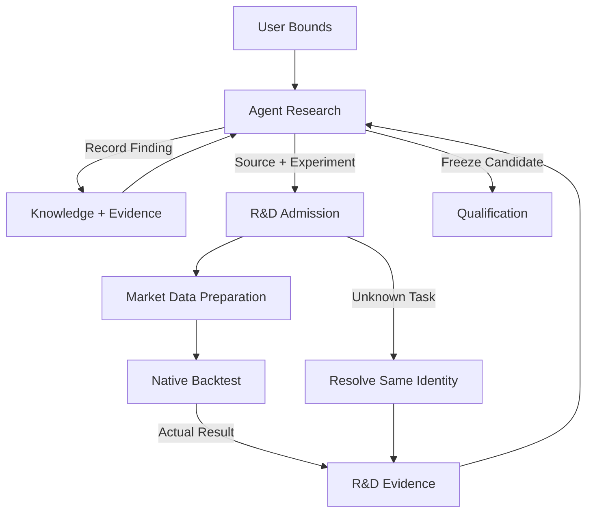

# R&D

<Callout type="info" title="Agents decide; services retain facts and execute deterministic requests">

External Agents own research ideas, source, diagnosis and iteration choices. R&D provides transferable records, sealed strategy packages, experiment tasks and evidence ledgers, not another research decision engine.

</Callout>

## Responsibility

R&D is the sole Owner of research business facts: projects, strategy/composition versions, experiments, resource commitments, attempts/data exposures, Agent decisions and reusable knowledge.
It requests inputs from Market Data, evidence from Backtest and independent assessment from Qualification.
It owns no market data, matching, qualification, allocation or trading effects.

External Agents submit requests through MCP and write native Nautilus Strategies; Dashboard only reads research progress and results.
Server tasks persist independently of Agent sessions. Disconnection neither cancels admitted tasks nor lets the product substitute its own scientific judgment.

## Functional boundaries

R&D retains four responsibilities: Projects, Authoring, Experiments and Knowledge. Agent diagnosis, stopping
and selection belong to experiment records. On demand discovery is a user flow reusing data queries and replay,
not a separate Decisions or Discovery component. These responsibilities add no service, compiler or fixed research pipeline.

| Capability  | Agent owns                                                     | R&D owns                                                                     |
| ----------- | -------------------------------------------------------------- | ---------------------------------------------------------------------------- |
| Projects    | Understand demand; organize sources and risk goals             | Approved theme, scope, resource ceilings, principal and sources              |
| Experiments | Propose experiments; diagnose, compare and choose next actions | Frozen requests, admission, jobs, spend, attempts and Agent decision records |
| Authoring   | Native Strategy source, parameters and data requirements       | Sealed source/environment, content identity and readback                     |
| Knowledge   | Findings, failure reasons, scope and review conditions         | Traceable entries, references and corrective successors                      |

Hypotheses are research content, not a separate module with semantic approval authority.
R&D does not refuse a mechanically valid experiment for missing alternative explanations, fixed diagnosis categories, unfamiliar metrics or absence of a unique winner.
Agents judge scientific adequacy; deterministic services still enforce approved pass criteria, budgets, protected data and trading authority.

External Agents organize parameter search and comparisons using existing parameterized operations and replay.
R&D retains each request, result link and selection rationale, without a built-in optimizer, automatic experiment
expansion or research preset library. Apply the [global Agent-first principle](../architecture/index.md#agent-first-and-minimal-deterministic-services).

## Research flow

1. The user gives theme, risk tolerance and resource bounds through the Agent; the Agent registers comparison goals and necessary conditions before execution.
2. The Agent proposes mechanisms, authors strategies and chooses experiments, including new families within the approved theme.
3. R&D checks identity, input scope, budget and authority, sealing immutable experiments and task links.
4. Market Data prepares/reuses inputs; Backtest executes the native Engine and records actual results.
5. The Agent reads permitted evidence and decides interpretation, iteration, review, candidate selection or stopping; R&D retains decisions and references.
6. Independent Qualification assesses selected frozen candidates; public conclusions return to research or Governance.

A project can retain multiple candidates without selecting a unique winner each round. Failure to identify economic advantage does not block lawful exploration.
Implementation/method errors can be repaired with corrective lineage; changed pass criteria require user approval. Never overwrite failed evidence or retrospectively approve thresholds.

## Content identity and experiment binding

See [Strategy Factory](../architecture/strategy-factory/#strategy-package-and-content-identity) for package content.
Seal source, parameters, dependencies, entrypoint, native runtime versions and data requirements, without a product JSON/BFP/Wasm compilation chain.
Exact data windows/versions belong to experiments, so one package can bind independent experiments.

| Object               | Changes when                                            | Required links                                           |
| -------------------- | ------------------------------------------------------- | -------------------------------------------------------- |
| Project              | User approves different bounds                          | Principal, theme, authority and predecessor              |
| Strategy Artifact    | Source, parameters, dependencies or requirements change | Content hash, complete package and environment           |
| Composition          | Members, allocation or exit rules change                | Exact member hashes, policy and account scope            |
| Experiment           | Goals, inputs or run conditions change                  | Package, proposal, data and cost/execution configuration |
| Attempt              | Actual submission, rerun or recovery action             | Original request, task identity, resources and outcome   |
| Decision / Knowledge | Interpretation or evidence is corrected                 | Agent content, referenced results and predecessor        |

New attempts do not reset trial counts; the same hash does not merge independent experiments.
Agents can change exploratory methods without rewriting previous evidence, user authorization or protected feedback frontiers.

## Composition configuration custody

Agents research joint A/B operation and member exit plans in R&D.
A separate composition version retains exact members, initial account, allocation policy and join/exit behavior.
Retain studied configurations, not every permutation of the strategy library.

Keep individual diagnostics distinct from joint account replay. Use native Engine multi strategy, account, risk and execution semantics rather than summing standalone equity curves.
Adopting AB while C/D already run requires whole account successor evidence covering affected members, allocations and residual positions.
Qualification owns exact strategy/composition eligibility; Governance applies assessed, approved configurations without giving R&D account effect authority.

Fixed margin, fixed planned stop risk and fractional Kelly are methods Agents can research as sizing/configuration.
Experiments state units, fees, estimation samples and available information; the product introduces neither a default Kelly allocator nor a scientific approval module.
Strategy sizing belongs to strategy content; account allocation belongs to separately versioned governance policy. Changing real policy still requires user approval.

## Cumulative trial accounting and spend ceilings

Resource spend limits autonomous research, not a fixed iteration count. Trial counts provide overfitting evidence separately from execution ceilings.
R&D retains product hosted attempts, parameters/variants, reruns, failures, cancellations, reads and feedback exposures, including unsuccessful trials.
Unverifiable local/external research remains explicitly incomplete; it cannot produce a complete census or invented independence.

- Admission atomically checks and commits required resources, preventing overspend/reentrance; duplicate delivery resolves the same request.
- Record commitments, actual consumption and release separately. Unknown completion/settlement does not release resources for duplicate submission.
- Reuse ordinary Docker/task CPU, memory and time limits rather than a custom static resource prover.
- Report product compute/storage/API spend separately from Agent host model ceilings; R&D does not assume control of the user's local model quota.
- Refuse tasks outside frozen scope/budget; changed pass criteria first require user approval.

A caller summary cannot substitute the cumulative frontier. Transactions lock and reread exact policy, inputs and complete predecessors through fixed Owner APIs, bind actual unique outcomes and commit atomically.

## Protected feedback and candidate handoff

Candidate selection is an Agent decision, not qualification.
Qualification independently evaluates frozen policy; research receives `QUALIFIED` or `CLOSED_NOT_QUALIFIED`, with private ternary status not closing mechanisms.
Protected feedback cannot enter Agent readable reports, errors, timelines, knowledge or input data.

Preserve independence basis, complete research lineage, trial/exposure census, request and candidate binding.
Only Qualification's complete current readback proving empty history permits `GENESIS_EMPTY`; otherwise resolve its opaque exact frontier, returning `UNAVAILABLE` for unknown state.
Callers cannot supply their own frontier, independence disposition or positive credentials.

Shared PostgreSQL does not allow R&D raw access to Qualification private tables. Owner private schemas/roles and fixed safe APIs remain isolated, with fully qualified objects, fixed `search_path`, exact principal/request scope and lock ordering.
Only validating Owner Rust can turn a raw SQL envelope into sealed positive readback, not arbitrary deserialization.
Production materialization, custody transfer and bootstrap require exact readback; missing state does not justify reacquiring write privileges or substituting fixtures.

Selection, package loading or a passing report never grants real execution. First trial entry requires Dashboard confirmation; Governance manages promotion, quotas and exit.

## Knowledge reuse

Knowledge is Agent interpretation of evidence, not automatic platform certification of a stable factor.
Retain definition, market/time scope, data basis, costs, sample/variant exposures, positive/negative/unresolved conclusion, limits and review conditions.
R-1 patterns/indicators can become independent entries. B3, carry or another strategy reuses exact evidence and validates anew, never inheriting qualification.

Do not constrain research with fixed metric names or entry templates. Structured fields serve retrieval, identity, permissions and evidence references; Agents author the content.
Method errors or independent new evidence create explicit successors while retaining older conclusions. A new market/scope can preregister review of a closed mechanism.
Protected details cannot enter public knowledge. Unverifiable findings may be recorded with explicit evidence status, not certified as validated facts.

## On demand read only opportunity discovery

Agents query instruments, market values and supported filters directly through Market Data and may analyze
permitted responses with host tools, without first creating a project, Strategy Artifact or R&D scan job.
For strategy judgment requiring persistent state or historical warmup, bind a sealed Artifact and reuse native
Backtest replay, returning signals, evaluation cuts and coverage without a separate R&D observation Host.
R&D retains request/result references and Agent interpretation when research needs them; the executing service
owns any durable job.
Scanner is neither a separate service nor a deployment proposer; it neither activates strategies nor wakes Agents on a product timer.
Approved strategies continuously consume native live data inside Trading Node, not a scanning service.
Agent scheduling belongs to its host; read an unfinished scan by the original task identity.

## Research projects and Agent takeover

Product records, not conversation history, hold user bounds, source versions, experiments/tasks, budgets, results, public eligibility, Agent decisions, knowledge, unresolved gaps and next action notes.
A taking over Agent resolves submitted tasks/unknown outcomes before considering a rerun.
The user works with one external Agent; records/request identities do not bind one model or session.
Backend tasks continue; further scientific decisions await Agent recovery. Dashboard displays research, not remote control of the user's computer Agent.

## User story projection

| Story                            | Agent work                                               | Deterministic service path                                      |
| -------------------------------- | -------------------------------------------------------- | --------------------------------------------------------------- |
| R-1 resting entries/staged exits | Native orders/protection; replay interpretation          | Sealed package → data binding → native replay → result          |
| R-1 patterns/factor improvement  | Hypotheses, parameters, metrics, comparison and findings | Experiment/exposure ledger, knowledge references and successors |
| B3 dynamic universe              | Point in time membership/selection rules                 | Instruments/history → continuous account replay                 |
| Spot long/perpetual short carry  | Multi leg strategy and funding logic                     | Actual data types → native account/orders                       |
| Multi strategy composition       | Joint performance and exit plans                         | Composition version → joint replay → independent eligibility    |
| Current opportunities            | Filters and interpretation                               | Read only scan → coverage/results, no deployment authority      |
| Unload and improve               | Runtime evidence analysis; source/config changes         | Governance exit fact → new version/experiment                   |
| Agent quota/restart              | Take over records and resume judgment                    | Same identity readback, settlement and evidence                 |

See [Research scenarios](../scenarios/research/) and [delivery milestones](../architecture/index.md#milestones-and-delivery-iterations) for complete coverage and staging.
Unsupported data/native capabilities produce explicit gaps, not invented fields or another simulator.

## Implementation status ledger

The native source route has no proven complete submission/execution entrypoint yet. This table describes current code without making its compiler chain the development target.
Existing admitted slices and `NOT_ADMITTED` bounds do not widen through document reorganization; new package integration needs separate admission and verification.

| Current entry/component          | Existing capability                                                | Unproven target                                                                                                        |
| -------------------------------- | ------------------------------------------------------------------ | ---------------------------------------------------------------------------------------------------------------------- |
| `strategy-authoring` MCP         | validate/create/get/list/revise/archive of versioned statements    | Native package submission, isolated loading and executable Artifact                                                    |
| `research.strategy-authoring.v1` | OHLCV, bounded expressions/state, Enter/Flip/Exit, T0 subset       | Full R-1; JSON grammar expansion is not the target solution                                                            |
| BFP / `ProgramHostV2` / `wasmi`  | Current typed Plan and Wasm Host chain                             | Native Strategy package integration; existing Host does not prove readiness                                            |
| `composer-v3-replay`             | Composer request/binding custody and registered image routes       | Not actual native results/reports or complete research loop                                                            |
| Source Intake                    | Production `ProductionEnvironmentV1` admission/resolution skeleton | `resolve_policy` returns none; later production stages unavailable; acceptance environment is no production substitute |
| Trial accounting                 | Current counting/frontiers for submitted exploratory Results       | Complete production attempt/read ledger and native package wiring                                                      |

Verification locators: `crates/strategy_factory/src/source_intake/owner.rs`,
`crates/strategy_factory_rd_owner_api`, `crates/strategy_factory/src/program_host_backtest_target_set_v2.rs`,
`product/rd-workbench/Dockerfile.owner`. See [Backtest](./backtest/) and [Market Data](./market-data/) matrices for conditional refusals.

Existing Composer/Replay Policy private/API schemas, nondelegable mutation permissions, stable request identities, canonical binding readbacks, census locks and atomic commits remain enforced.
Native package adaptation must relocate those properties to the actual entrypoint, not remove checks or regrant R&D private table ownership or `CREATE`.
Existing JSON/BFP data and receipts remain readable; executable migration is separately verified and cannot relabel an old Artifact as a native package.

## APIs and acceptance

MCP adapts Owner APIs; it cannot become a second task/state writer.
Deliver target operations only for actual consumers, without another protocol language:

| Operation group                | Input/output                                     | Mechanical checks                                           |
| ------------------------------ | ------------------------------------------------ | ----------------------------------------------------------- |
| Project read/write             | Approved bounds ↔ project records                | Principal, version, scope                                   |
| Package admit/read             | Native source package ↔ Artifact                 | Complete content, resolvable entry/environment, permissions |
| Experiment submit/resolve      | Run definition ↔ same identity task/result       | Inputs, budget, atomic commitments, terminal evidence       |
| Decision/knowledge record/read | Agent content ↔ traceable records                | Existing references, public scope, complete predecessor     |
| Candidate submit/resolve       | Frozen version ↔ public eligibility request link | Qualification independence and sealed feedback              |

Not all operations exist. Each version admits only the minimum set required for its complete user flow.

Acceptance covers positive stories and refusal of overspend, data gaps, unknown outcomes, protected access and unauthorized trading.
Mechanically valid experiments cannot be refused for lacking a platform approved scientific explanation.
Production consumers/results and relevant ordered Linux Owner chains must pass before claiming availability; documentation checks do not prove running services.
