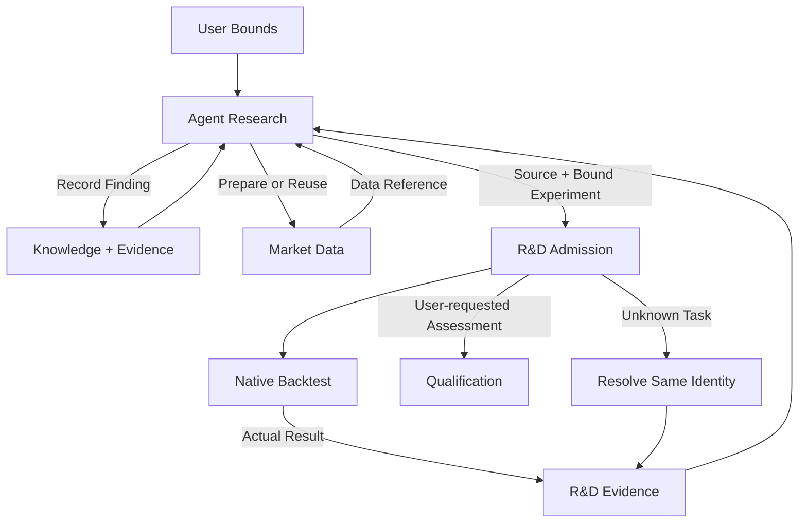

# R&D

<Callout type="info" title="Agent 决策，服务记录并执行确定性请求">

研究思想、源码、诊断和迭代选择交给外部 Agent。R&D 提供可接管的研究记录、策略包封存、实验任务和证据台账；不编写另一套研究决策引擎。

</Callout>

<a id="responsibility" />

## 职责

R&D 是研究业务事实的唯一 Owner。它保管项目、策略与组合内容版本、实验、资源承诺、尝试/数据暴露记录、Agent 决定和可复用知识。
它关联 Market Data 提供的数据输入与 Backtest 产生的证据，向 Qualification 交付冻结候选。
不拥有行情、撮合、资格、资金分配或交易效果。

外部 Agent 经 MCP 提出需求并编写原生 Nautilus Strategy；Dashboard 只读研究进度和结果。
服务在服务器运行，已接纳的数据/回测任务独立于 Agent 会话。Agent 断线不会取消任务，也不会由产品代替它产生新的研究判断。

## 功能边界

R&D 内部保留 Projects、Authoring、Experiments、Knowledge 四项职责。
Agent 的诊断、停止和选择属于实验记录；按需找币是复用数据查询与回放的用户流程，
不再独立成 Decisions 或 Discovery 组件。这些职责不新增服务、编译器或固定研究流水线。

| 功能        | Agent 负责                                 | R&D 负责                                              |
| ----------- | ------------------------------------------ | ----------------------------------------------------- |
| Projects    | 理解用户需求，整理来源和风险目标           | 保存批准主题、范围、资源上限、主体与来源              |
| Experiments | 提出机制与实验方案；诊断、比较、选择下一步 | 冻结请求、机械准入、任务、支出、尝试及 Agent 决定记录 |
| Authoring   | 编写原生 Strategy、参数和数据需求          | 封存源码包及环境、内容身份和读回                      |
| Knowledge   | 提炼因子、失败原因、适用范围和复核条件     | 持久化可追溯条目、引用及后继更正                      |

### Research Project

Research Project 按研究目标组织，而非按 Git 仓库或单个策略划分。一个项目可以关联多个假设、
策略版本、探索分析和回测实验，各自保留准确身份、证据及未完成工作，共用项目已批准的主题和资源边界。
Agent 在边界内自行展开研究分支；分支是已有记录之间的关联，不增加子项目服务或审批流程。
例如"改善 Ronnie 挂单思路"同时容纳入场优化、分段退出与波动率过滤，接管者从同一项目读取其进度。
一个项目不要求对应一个仓库或一份源码；来源引用按实际工作记录，不把项目身份当作策略内容身份。

V0.1 的 Projects 只保留最小 Research Project：用户目标、批准范围与资源边界，以及策略版本、实验、任务和结果的关联。
Agent 创建或复用该项目，在同一主题下连续提交实验；项目保存不引入研究流程审批、固定研究步骤或 Dashboard 管理页面。
完整的项目接管与知识复用在 V0.2 交付。

### V0.1 实验说明记录

Agent 可在实验前后记录假设、解释或下一步。自由的是正文写法，存储仍采用固定记录结构，
由 R&D 经自己的 MCP/API 写入与读取所拥有的数据库，不保存无关联的聊天片段。

| 固定信息                   | 约束                                                                 |
| -------------------------- | -------------------------------------------------------------------- |
| 记录身份与所属项目/实验    | 身份稳定，引用已存在且允许访问的项目与实验                           |
| 引用的数据、策略或运行结果 | 保存准确引用；结果说明关联实际 run，不靠正文中的名称猜测             |
| 作者与记录时间             | 作者绑定调用主体，服务记录写入时间                                   |
| 说明正文                   | 有界文本；Agent 自由组织假设、诊断和下一步，不要求固定分类或段落模板 |
| 更正前驱                   | 更正形成关联新记录，保留旧正文与引用，不改写历史证据                 |

说明随实验可查询，不成为成交、账户事实、资格或授权的替代。结构和引用由程序核验，
研究含义由 Agent 判断；不增加分类器、固定诊断流程或新的服务。
V0.2 在同一记录基础上展开比较、接管与知识复用，不要求首版提前实现其完整工作流。

假设是研究内容，不要求另建具有语义审批权的 Hypotheses 模块。
R&D 不以缺少替代解释、固定诊断类型、平台不认识某个研究指标或未选出唯一赢家拒绝一个机械条件有效的实验。
研究方法的充分性由 Agent 判断；用户批准的通过标准、预算、保护数据和交易边界仍由确定性服务执行。

Agent 可经 Market Data 读取已准入普通研究行情，用自己的脚本检查形态、计算指标并提出规则。
R&D 关联所用数据引用与实验记录，不接管这些分析，也不增加脚本执行或因子计算服务。

### V0.2 探索分析与研究假设

研究假设（Hypothesis）是 Agent 提出的可检验想法，例如"某形态后未来三天的收益较高"。
实验（Experiment）是检验想法的具体分析或回测；结果是证据，Agent 对证据的解释可形成知识。
这些概念在同一研究记录中关联，不新增 Hypotheses 服务，也不强制每轮使用固定研究模板。

Experiments 同时记录产品回测和 Agent 在宿主完成的探索分析。探索分析只保存测试说明、结论摘要、
适用范围、局限和已有的准确数据/脚本/结果引用，明确执行来源和证据状态；不要求提交或保管临时脚本、
图表、统计表及其他非策略中间文件，不新增探索产物上传或存储能力。值得复用的结论进入 Knowledge，
保留必要的样本、成本和范围说明；未形成可复用结论的测试仍可从实验记录查询。缺少完整版本或执行依据的
外部结果仍可记录，但标为依据不完整，不能据此签发完整试验普查或独立性证明。
宿主分析的科学方法、脚本执行和解释属于 Agent；R&D 保管关联记录和获准读取的数据暴露事实。
宿主结果不能冒充 Backtest 原生结果，也不能产生资格或交易权限。

参数搜索与实验比较由外部 Agent 经已有参数入口和回测能力组织，R&D 保存每次请求、结果关联与选择理由。
不增加内置优化器、自动实验展开器或研究参数预设库；采用[全局 Agent 优先原则](../architecture/index.md#agent-first-and-minimal-deterministic-services)。

一次实验失败只否定其实际检验的命题。Agent 解释结果时应写清失败落在数据/执行、某个规则实现、
机制解释还是经济效果；若上位机制尚未被检验，可沿失败原因提出有区别的后继假设，说明新假设
会改变哪一个可观察结果、还可能被什么证据否定，以及为何值得继续。记录保留前驱、差异、反例、
数据暴露和停止理由，使接管者能区分"一个实现失败"和"整条研究线已穷尽"。来源图例或诊断检查
可先裁掉不保真的规则；需要改变交易集合或收益结论时，再封存后继原生 Strategy 并完整回测。
不能靠已见年度结果反复微调同一阈值，把多次试验包装成一次独立成功。Agent 可因机制已被充分
反证、研究资源边界或更有价值的分支而停止一条线，并保存理由；产品不强制固定的延伸层数或次数。
比较后继分支时，Agent 应把用户的联合目标、当前差距、预期改变的交易集合或收益结构与最小反证
一起解释；单项胜率提高、诊断数量增加或更接近原片画线，均不自动等于项目目标取得进展。

## 研究流程

1. 用户通过 Agent 给主题、风险容忍与允许资源范围；Agent 运行前登记比较目标和必要条件。
2. Agent 在边界内提出机制、编写策略并选择实验；可自行开立研究主题内的新家族。
3. Agent 向 Market Data 准备或复用初始数据，取得准确可用的数据引用。
4. Agent 提交绑定数据的实验；R&D 核验身份、输入范围、预算与授权，封存实验和任务关联，Backtest 执行原生回放。
5. Agent 读取研究侧允许的证据，决定如何解释、继续、复核或选候选；R&D 保存决定与引用。达到冻结研究目标后，Agent 停止新增研究迭代，交付候选、结论和依据。继续优化须用户发出新指令；可沿用原项目，不重置旧证据或试验计数。
6. 研究完成不自动提交资格评估。用户请求独立验证后，选定的冻结候选经 Qualification 评估，公开结论回到研究或交给 Governance。研究已完成后独立评估未通过时，记录允许公开的结论并等待用户新指令，不自动重启已停止项目或上线候选；未合格本身不关闭研究机制。

准备与回测分别执行已接纳的持久任务。初始数据准备完成不代替 Agent 提交下一步回测；
复用已可用的数据引用时无需重复准备。回测固定使用一分钟执行行情，分钟内歧义按冻结政策报告；
新的数据或运行配置由 Agent 提交后继实验，不覆盖旧证据。

V0.2 中，Agent 通过 MCP 读取完整获准结果及准确实验引用，使用自己的工具比较指标、做图并解释差异，
将比较结论及证据关联存入 R&D。服务保存记录、支持有界查询，不新增比较分析引擎。
Dashboard 展示研究进度和结果，专门的交互式实验比较界面在后续交付。

一个项目可有多个候选，不要求每轮选出唯一优胜者。程序不能因没有判断出经济优势而阻止合法探索。
实现/方法错误可修复并建立更正沿革；改变通过标准先由用户确认。不得覆盖失败证据或事后追认门槛。

## 内容身份与实验绑定

策略包契约见 [Strategy Factory](../architecture/strategy-factory/#strategy-package-and-content-identity)。
包封存源码、参数、依赖、入口、原生运行版本及原生订阅/请求表达的输入需求；不经过产品策略 JSON/BFP/Wasm 编译链。
具体数据窗口和版本属于实验输入；因此同一策略包可以绑定多个独立实验。

| 对象                 | 何时改变                   | 必须保留的关联                |
| -------------------- | -------------------------- | ----------------------------- |
| Project              | 用户批准边界变化           | 主体、主题、授权与前驱        |
| Strategy Artifact    | 源码、参数、依赖或需求变化 | 内容 hash、完整包和环境       |
| Composition          | 成员、分配或退出规则变化   | 准确成员 hash、政策及账户范围 |
| Experiment           | 目标、输入或运行条件变化   | 包、方案、数据及成本/执行配置 |
| Attempt              | 实际提交、重跑或恢复动作   | 原请求、任务身份、资源与结果  |
| Decision / Knowledge | 解释或证据更正             | Agent 内容、所引结果和前驱    |

新 attempt 不重置试验计数；同 hash 不合并独立实验。
Agent 可以调整探索方法；新定义不得改写旧证据、用户授权或既有保护反馈前沿。

## MCP 交互契约

以下是目标能力契约，不是新增的一组流程服务。操作名称说明用途，不在本层冻结工具名称、URL 或 wire schema；
MCP 和内部 API 复用同一领域操作。实现状态仍以文末台账为准，文档不证明这些入口已交付。

### V0.1 调用范围与唯一实验任务

首版从下表的同一领域操作交付最小路径，不提前启用完整接管、Knowledge 或组合能力。

| 调用           | 首版契约                                                                                              |
| -------------- | ----------------------------------------------------------------------------------------------------- |
| 项目记录       | 保存目标、批准边界与资源，读取项目及关联实验；不要求先建研究管理界面                                  |
| 环境与策略包   | 查询准确环境/能力；提交实际源码、导入模块、原生入口/参数和来源，返回封存包或具名缺口                  |
| 实验提交与查询 | 输入准确包、Market Data 清单、Run Specification 和说明；返回实验/attempt 身份、准入及所属回测任务引用 |
| 说明记录       | 保存自由文字、已有证据引用和后继关系；不把事后解释改成运行前方案                                      |

Agent 提供数据需求与准确引用；服务不静态推断任意 Python 程序的全部研究意图。封存包的原生订阅/请求
与实验清单须兼容；运行时出现清单外输入需求时具名失败，不在回放中下载新数据或隐式扩大权限。

R&D 在自己的权威中登记实验、attempt 和资源承诺，再以稳定 attempt/请求身份交给 Backtest。
Backtest 任务反向关联同一实验和承诺；它不另造实验计数，直接 MCP 提交也不能绕过登记与额度检查。
不同协议入口调用同一领域准入。跨服务交接不要求一次分布式事务，也不共享私有表写权。

调用超时后，以原身份解析已经登记和可能已经接纳的任务；尚未取得回测回执不等于未执行。
重复交接同一冻结请求解析原任务，含义冲突拒绝；新完整重跑建立关联 attempt 并计入台账。
只有所属服务的准确结算事实才能释放承诺，R&D 不从断连、错误摘要或 Agent 推断自行释放额度。

### 最少操作与交接

| 功能        | 操作                     | Agent 提供                                                      | 服务返回与保管边界                                                                         |
| ----------- | ------------------------ | --------------------------------------------------------------- | ------------------------------------------------------------------------------------------ |
| Projects    | 创建或更新研究边界       | 目标、获批准的主题/范围/资源，更新时引用前驱                    | 项目身份、准确边界版本及额度事实；Agent 不能自行扩大用户授权                               |
| Projects    | 读取项目与接管记录       | 项目身份、查询范围                                              | 边界、版本/实验关联、未决任务与下一步；按需分页取回，不依赖旧聊天                          |
| Authoring   | 封存策略包               | 实际原生源码及导入模块、入口/参数、准确环境引用、已有 Git 来源  | Artifact hash、包与环境引用或具名缺口；不编写策略、不拉取可变分支作为执行输入              |
| Authoring   | 读取包与运行能力         | Artifact 或环境身份                                             | 封存内容、环境版本和可用依赖/接口；缺少能力明确返回，不为每个策略安装依赖                  |
| Experiments | 登记并提交回测           | 项目、准确 Artifact、运行前方案、已准入数据与 Run Specification | 冻结实验、attempt、准入结果及 Backtest 任务引用；已有实验仅提交新 attempt 时引用其准确身份 |
| Experiments | 查询任务与证据           | 实验、attempt、原请求或任务身份                                 | R&D 记录及所属服务的任务/结果引用；成交与账户事实由 Backtest 产生，R&D 不改写              |
| Experiments | 记录探索、解释和接管说明 | 项目/相关实验、Agent 正文、已有依据与前驱引用                   | 记录身份及关联；宿主分析不是原生回测，不上传中间文件，也不补成预登记                       |
| Knowledge   | 写入、更正与检索知识     | 结论、适用范围、必要依据、可选准确代码引用；检索条件            | 同一用户跨项目的条目与来源；更正保留前驱，不授予资格或执行代码                             |

实验登记和提交是同一职责的组合操作，不要求 Agent 依次调用科学审批端点。已有假设、方案或实验可以按身份复用；
未完成方案可以先保存为记录，但不是已冻结的回测请求。更改冻结输入建立后继实验，不覆写原实验。
普通宿主分析不要求先封存完整策略包；需要产品回测时才满足原生包和运行输入契约。

失败诊断也通过这些接口交接：Backtest 保管原始失败与已有原生诊断，项目列表关联失败任务，
Agent 在 R&D 保存策略诊断、修复源码引用及后继验证运行，不复制一份跨服务错误数据库。
策略修复通过新封存包运行；服务器服务错误只保留日志及准确版本/任务信息，由用户检查、修复并部署。
不把服务自修复或自动发布加入研究流程。

### 共同输入与返回规则

- 写入请求绑定调用主体、项目作用域和稳定请求身份；同一请求重复送达解析原记录/任务，不创建新的实验尝试。
  同身份携带不同内容明确拒绝，不能把业务上的新实验伪装成重试。
- 准确引用使用不可变版本身份，不以名称或最新分支猜测。服务核验引用存在、访问权限及所属范围；
  源码和封存包由各自契约保管，R&D 不越权读取其他 Owner 私有表。
- 研究正文允许自由表达，不要求固定假设模板或指标目录。确定性服务核验结构、引用、额度与授权，
  不替 Agent 判断经济优势或选择下一轮方法。
- 读取提供有界结果和后续查询位置，区分完整读回、尚有后续记录和不可用；不能把截断页当完整台账。
  接管按需查询已有记录，不自动抓取本地文件或把整个研究历史塞入一次返回。
- 提交回测前必须满足全部冻结输入。缺数据、依赖、原生能力或预算时返回具名缺口与原记录身份，
  不静默缩短窗口、减少标的、替换环境或另写模拟器。

### 失败与未知结果

| 情况                     | 交接行为                                                                                |
| ------------------------ | --------------------------------------------------------------------------------------- |
| 请求明确拒绝             | 返回原因和涉及的引用；拒绝不是经济失败，也不是已执行的回测                              |
| 请求超时，是否接纳未知   | Agent 按原请求身份查询或重送相同请求；R&D 核对原任务，不先创建新 attempt                |
| 回测已接纳、仍在执行     | 返回原任务身份和准确状态；Backtest 继续原生执行，Agent 不必保持连接                     |
| Backtest 明确失败或中断  | 保留失败事实与实际消耗；需要重跑时 Agent 提交关联的新完整 attempt，不续接模拟器中间状态 |
| Agent 断线或模型额度耗尽 | 已接纳任务继续；后继 Agent 查原任务、Git 检查点与研究记录，再决定下一步                 |
| 宿主探索缺少完整依据     | 保留结论并标明依据不完整；不虚构原生结果、完整试验普查或独立性                          |

V0.1 沿用已确认的完整回放、单任务执行队列和不提供主动取消的边界；本节不借公共任务契约扩大首版能力。
V0.2 在同一事实与身份机制上补齐接管、探索说明及知识检索，不新增 Agent 调度器、分析引擎或文件保管服务。

<a id="composition-configuration-custody" />

## 组合配置托管

Agent 在 R&D 研究 A/B 是否共同运行，并评估成员退出后的预案。
组合配置独立于策略源码，保存准确成员版本、账户初始状态、分配政策和加入/退出行为。
只保存实际研究的配置，不枚举策略库全部排列组合。

实验同时保留单策略诊断与共享账户联合回放。联合回放复用原生 Engine 的多策略、账户、风险和执行语义，不累加独立净值冒充共同账户结果。
账户已有 C/D 时采用 AB，必须有覆盖受影响成员、分配及残余持仓的整体后继组合证据。
Qualification 拥有策略/组合的准确资格；Governance 应用已评估、批准的配置，不让 R&D 控制账户效果。

固定保证金、固定计划止损风险及分数凯利都是 Agent 可研究的数量/配置方法。
实验明确数量单位、费用、估计样本及当时可得信息；产品不引入默认凯利分配器或科学审批模块。
策略内数量规则属于策略内容；账户分配属于独立治理政策，变更真实政策仍须用户批准。

<a id="cumulative-trial-accounting-and-spend-ceilings" />

## 累计试验记账与花费上限

研究运行遵守用户已批准的资源边界，不设固定迭代轮数。试验次数是防过拟合证据，与运行上限分开。
Agent 负责安排各项目的研究顺序、估计消耗和决定继续或停止。产品不新增跨项目总预算、额度分配器
或研究资源调度系统；现有项目授权、单任务限制和真实消耗记录仍保留。

运行设施限制 CPU、内存和任务时间，所属服务在存储不足时拒绝新任务；这些运行限制不等于累计费用上限。
付费数据请求在所属来源调用入口核对费用授权，优先复用既有 provider 约束。用户明确批准的硬性费用
上限仍须在实际支出入口确定性执行，不能仅依靠 Agent 估计，也不据此建立通用跨项目计费平台。
R&D 保存产品托管的实际尝试、参数/变体、重跑、失败、取消、读取及反馈暴露；没有收益的试验也计入。
同一用户的项目可引用 Market Data 仍有效的既有研究数据授权，未扩大范围或用途时不重复确认。
授权复用不合并项目预算、实验身份或试验台账，不重置数据暴露；新项目的研究主题与资源边界仍独立核验。
Agent 本地或外部研究没有可验证记录时，标为已知不完整，不能签发"完整普查"或虚构独立性。

- 每次任务接纳原子校验并承诺所需资源，防止重入或额度超支；相同请求重复送达解析同一结果。
- 承诺、实际消耗和释放分别记录；终态或结算未知时不能先释放再重复提交。
- CPU、内存、时间等运行上限复用普通 Docker/任务设施；不自研静态资源证明器。
- 正式项目、实验、决定、知识与证据引用不按年龄自动删除；Backtest 保管的正式明细也不自动淘汰。
  存储不足时拒绝受影响的新任务并说明缺口，由用户决定扩容或清理。清理不能重置试验计数或数据暴露，
  已不可读取的证据须明确标记，不把引用仍存在当作明细仍完整；临时文件不属于该保管保证。
- 产品计算/存储/API 支出与 Agent 宿主模型限额分开报告，R&D 不假定能读取或控制用户电脑模型额度。
- 冻结范围/预算外的新任务拒绝；通过标准变化先取得用户确认。

累计前沿不能由调用者摘要代替。数据库事务通过相应 Owner 固定读接口锁定并重读准确政策、输入和完整前驱，绑定唯一实际结果再提交。

<a id="protected-feedback-and-candidate-handoff" />

## 保护反馈与候选交接

研究记录选候选只是 Agent 决定，不是资格。
Qualification 按冻结政策独立评估；研究侧仅得到 `QUALIFIED` 或 `CLOSED_NOT_QUALIFIED`，内部三级结论不用于关闭机制。
反馈不能出现在 Agent 可读的细报告、错误、时间线、知识或输入数据中。

Independent Basis、完整研究血缘、试验/暴露 census、请求和候选绑定保留。
只有 Qualification 自己的完整当前读回证明历史为空，才能使用 `GENESIS_EMPTY`；否则读取准确不透明前沿，未知返回 `UNAVAILABLE`。
调用者不能提供自己的前沿、独立性 disposition 或正向凭证。

共享 PostgreSQL 不允许 R&D 直接查询或修改 Qualification 私有表。各 Owner 私有 schema/角色和固定安全 API 保持隔离，函数使用全限定对象、固定 `search_path`、准确主体与请求作用域及锁顺序。
SQL raw envelope 只有所属 Owner Rust 验证后才能变为密封、不可任意反序列化的正向回读。
生产部署的 schema materialization、custody 移交和 bootstrap 仍需准确读回；缺失不通过运行时恢复写权限或夹具填充。

选候选、策略包加载或报告显示"通过"都不授予真实交易权限。首次试盘必须 Dashboard 确认；自动转正、额度与退出由 Governance 管理。

<a id="knowledge-reuse" />

## 知识复用

Research Project 的组织与边界见上文；知识保留准确来源项目，跨项目复用不合并项目预算或实验身份。
知识库面向同一用户的全部研究项目共享检索，无须逐项目再次授权；条目保留来源项目、准确实验引用和适用范围。
共享仅覆盖该用户获准读取的研究证据，保护分区及 Qualification 内部诊断仍隔离。

知识保存可复用结论及其必要依据说明，不保管非策略研究中间文件。已有正式回测结果仍按 Backtest
保管契约关联，封存策略包与可复用代码引用保持各自边界，不为宿主分析增加文件保管保证。

知识条目是 Agent 对证据的解释，不是平台自动认证的"稳定因子"。
保存定义、适用市场/时间、数据依据、费用、样本/变体暴露、正面/负面/未决结论、局限和复核条件。
R-1 中有效形态或指标可以独立沉淀；B3、carry 或新策略引用准确知识和证据后重新验证，不能继承资格。

有可复用实现的条目同时关联仓库地址、准确 commit hash、文件路径及函数或类入口，代码仍保存在 Git。
没有代码的研究结论也可记录，不要求为每条知识生成实现。Git commit 固定来源，不能用可变分支名替代；
它不等于封存策略包的 Artifact hash。Agent 取回原实现、理解并适配到新策略，再形成新实验验证，
Knowledge 不自动安装或执行代码，也不新增因子运行服务。仓库不可访问时明确实现不可取回，
不得静默改用最新版本；既有结论与证据保留，已封存的执行包按其自身保管契约仍可读回。

不设固定指标名或条目模板来限制研究表达。结构化字段只服务检索、身份、权限及证据关联；自由内容由 Agent 编写。
方法错误或新增独立证据形成明确后继，旧结论保留。新的市场/范围可按预登记复核重新开启曾关闭的机制。
禁止保护样本细节进入公共知识。无法核验的发现可以记录，但明确证据状态，不能作为已验证事实。

<a id="on-demand-read-only-opportunity-discovery" />

## 按需只读机会发现

普通标的、行情与受支持过滤查询由 Agent 直接调用 Market Data；Agent 可用宿主工具分析获准返回值，
不要求先创建研究项目、策略 Artifact 或 R&D 扫描任务。需要持续状态或历史暖机的策略判断时，
封存 Artifact 并复用 Backtest 的原生回放能力，返回信号、评价截面与覆盖，不新增 R&D 观察 Host。
按需找币同时支持条件已成立的机会和接近触发的观察候选，明确分开。Agent 说明判断时刻、数据来源/版本、
所用 K 线是否收盘、已满足与仍缺少的条件，以及是 Agent 分析还是实际原生策略输出。
观察候选不冒充正式信号、不改变策略规则、不授权交易；接近程度由 Agent 解释，不新增评分器或候选引擎。

R&D 按研究需要保存请求、结果引用和 Agent 解释，持久任务由实际执行服务拥有。
Scanner 不独立成服务，不生成部署提案，不做自动上下架，不提供产品定时唤醒 Agent 的功能。
获准策略持续消费原生实时数据并找入场机会，属于 Trading Node，而非扫描服务。
Agent 定时唤醒由宿主负责；一次扫描若仍在执行，按原任务身份继续读取。

<a id="research-projects-and-agent-takeover" />

## 项目与 Agent 接管

项目记录保存用户边界、源码版本引用、实验与任务、预算、结果、公开资格、Agent 决定、知识、未决缺口和下一步说明。
源码保管和研究记录按以下边界协作：

- 用户为项目指定 Git 仓库；Agent 用已有 Git 工具保管源码和未完成草稿，在有意义的工作节点提交并推送。
- R&D 保存结构化记录及准确仓库、commit、源码路径、完成状态和下一步；不托管 Git，也不读取本地会话或自动捕获文件。
- 产品封存并保留实际执行的源码包与准确运行环境，仓库之后不可访问也不能改变旧执行输入。

接管 Agent 先查询原任务并解析未知结果，再取回记录指定的 commit，核对未完成工作，从下一步继续。
草稿 commit 不代表已验证 Artifact、成功实验、资格或交易授权；未提交或未推送的本地改动不能保证跨宿主恢复。
Git 推送与 R&D 记录分别完成；仅已推送且已登记的检查点保证可接管。任一步失败如实保留未完成状态，
由 Agent 补齐引用，不用分布式事务协调这两个系统。
用户使用一个外部 Agent；记录与请求身份不绑定某个模型或会话。
后台任务继续执行，新的科学决策等待 Agent 恢复。Dashboard 展示研究状态，不遥控用户电脑上的 Agent。

## 用户故事投影

| 用户故事             | Agent 工作                       | 确定性服务路径                      |
| -------------------- | -------------------------------- | ----------------------------------- |
| R-1 挂单/分段退出    | 写原生订单与保护规则、解释回放   | 包封存 → 数据绑定 → 原生回放 → 结果 |
| R-1 形态/因子改进    | 自选假设、参数和指标，比较与沉淀 | 实验/暴露记账、知识引用及后继       |
| B3 动态选币          | 写点时选币与成员变更规则         | 标的/历史数据 → 同账户连续回放      |
| 现货多、永续空 carry | 写多腿策略与资金费逻辑           | 真实数据类型 → 原生多腿账户/订单    |
| 多策略组合           | 研究联合表现与退出预案           | 组合版本 → 联合回放 → 独立资格      |
| 找当前机会           | 提出过滤条件并解释匹配           | 只读扫描 → 覆盖/结果，无部署权限    |
| 下架改进             | 分析运行证据，修改源码或配置     | Governance 退出事实 → 新版本/实验   |
| Agent 额度耗尽/重启  | 接管记录后继续判断               | 同身份任务读回、资源结算和证据      |

全场景和验收分期见[Research 场景](../scenarios/research/)及[交付路线](../architecture/index.zh.md#里程碑与交付迭代)。
数据/原生能力尚不支持的故事返回明确缺口，不能由另写模拟器或虚构字段补齐。

<a id="implementation-status-ledger" />

## 实现状态台账

目标源码路线尚未形成已证明的端到端入口。下表描述当前代码，不把现有编译链作为后续目标。
现有已准入切片与 `NOT_ADMITTED` 边界不因文档重组扩大；新增包接入须单独准入和验证。

| 当前入口/组件                    | 已有能力                                                       | 尚未证明的目标                                                        |
| -------------------------------- | -------------------------------------------------------------- | --------------------------------------------------------------------- |
| `strategy-authoring` MCP         | validate/create/get/list/revise/archive；版本化 statement 存储 | 原生源码包提交、隔离加载和可执行 Artifact                             |
| `research.strategy-authoring.v1` | OHLCV、有限表达式/状态、Enter/Flip/Exit；T0 子集               | 完整 R-1；不能把 JSON 语法扩展当目标方案                              |
| BFP / `ProgramHostV2` / `wasmi`  | 当前 typed Plan 与 Wasm Host 链路                              | 原生 Strategy 包接入；当前 Host 不证明新路线可运行                    |
| `composer-v3-replay`             | Composer 请求/绑定托管；镜像已注册对应路径                     | 不证明原生结果/报告或完整研究闭环                                     |
| Source Intake                    | 生产 `ProductionEnvironmentV1` 接纳/解析骨架                   | `resolve_policy` 返回空，后续生产阶段 unavailable；验收环境不替代生产 |
| 累计试验                         | 已提交探索 Result 的现有计数及前沿                             | 完整生产尝试/读取台账、原生包版本接线                                 |

核验入口：`crates/strategy_factory/src/source_intake/owner.rs`、
`crates/strategy_factory_rd_owner_api`、`crates/strategy_factory/src/program_host_backtest_target_set_v2.rs`、
`product/rd-workbench/Dockerfile.owner`。具体条件拒绝见 [Backtest](./backtest/) 与 [Market Data](./market-data/) 的能力矩阵。

现有 Composer/Replay Policy private/API schema、不可转授 mutation 权限、稳定请求身份、规范绑定读回、census 锁定及原子提交均维持。
适配原生包时必须把这些属性迁移到实际执行入口，不能仅删除其检查，也不能重新授予 R&D private table ownership 或 `CREATE`。
现有 JSON/BFP 数据和回执保持可读；可执行迁移另行验证，不能把旧 Artifact 当新原生包。

## API 与验收

MCP 是 Owner API 的适配器，不能成为第二个任务或状态写入者。
目标功能操作按消费者最小交付，不要求另建协议语言：

| 操作组                         | 输入/输出                   | 最小确定性检查                  |
| ------------------------------ | --------------------------- | ------------------------------- |
| Project read/write             | 批准边界 ↔ 项目记录         | 主体、版本、作用域              |
| Package admit/read             | 原生源码包 ↔ Artifact       | 内容完整、入口/环境可解析、权限 |
| Experiment submit/resolve      | 运行定义 ↔ 同身份任务/结果  | 输入、预算、原子承诺、终态证据  |
| Decision/knowledge record/read | Agent 内容 ↔ 可追溯记录     | 引用存在、公开范围、前驱完整    |
| Candidate submit/resolve       | 冻结版本 ↔ 公开资格请求关联 | Qualification 独立性与封口      |

并非每个操作已实现；各版本只准入该版本完整用户流程所需的最小集合。

验收包括正向故事以及超预算、数据缺口、未知结果、保护越权和未授权交易的拒绝。
机械条件成立的实验不能因没有平台认可的科学解释而被拒绝。
生产端口/结果消费者和相关 Linux Owner 有序链通过后才可声称对应能力可用；文档检查不证明服务运行。
