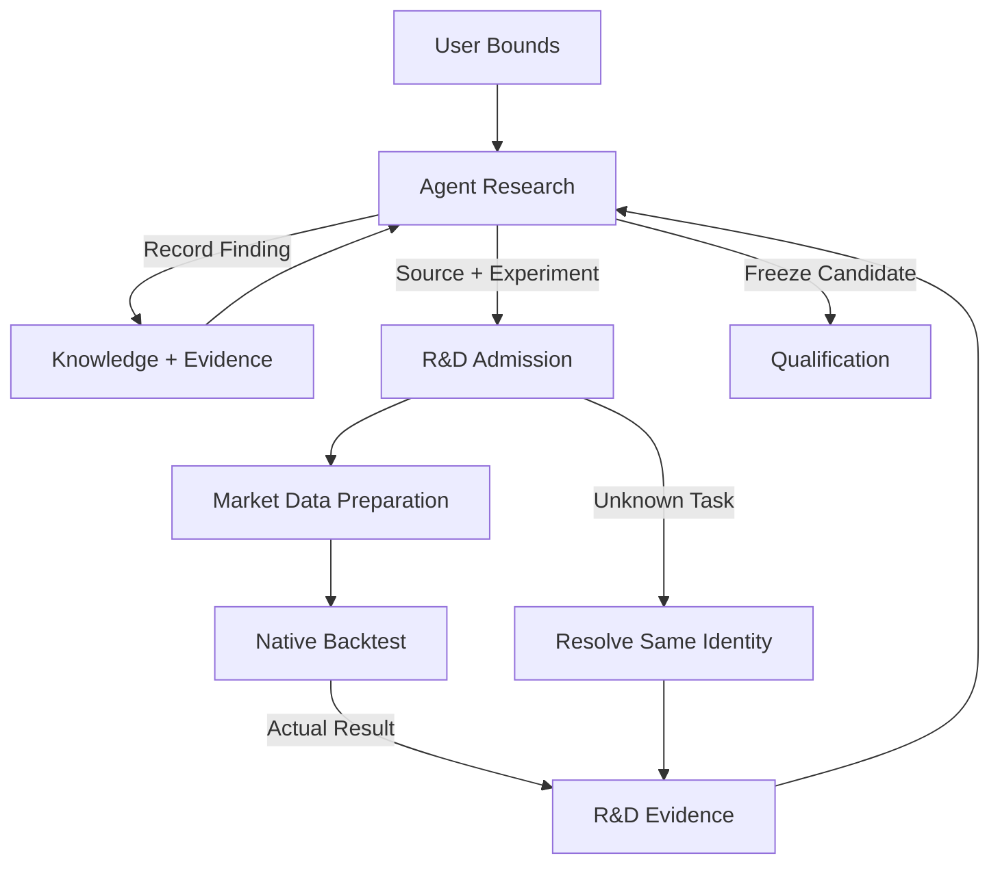

# R&D

<Callout type="info" title="Agent 决策，服务记录并执行确定性请求">

研究思想、源码、诊断和迭代选择交给外部 Agent。R&D 提供可接管的研究记录、策略包封存、实验任务和证据台账；不编写另一套研究决策引擎。

</Callout>

<a id="responsibility" />

## 职责

R&D 是研究业务事实的唯一 Owner。它保管项目、策略与组合内容版本、实验、资源承诺、尝试/数据暴露记录、Agent 决定和可复用知识。
它通过 Market Data 准备输入、通过 Backtest 产生证据、向 Qualification 交付冻结候选。
不拥有行情、撮合、资格、资金分配或交易效果。

外部 Agent 经 MCP 提出需求并编写原生 Nautilus Strategy；Dashboard 只读研究进度和结果。
服务在服务器运行，已接纳的数据/回测任务独立于 Agent 会话。Agent 断线不会取消任务，也不会由产品代替它产生新的研究判断。

## 功能边界

R&D 内部保留 Projects、Authoring、Experiments、Knowledge 四项职责。
Agent 的诊断、停止和选择属于实验记录；按需找币是复用数据查询与回放的用户流程，
不再独立成 Decisions 或 Discovery 组件。这些职责不新增服务、编译器或固定研究流水线。

| 功能        | Agent 负责                                 | R&D 负责                                              |
| ----------- | ------------------------------------------ | ----------------------------------------------------- |
| Projects    | 理解用户需求，整理来源和风险目标           | 保存批准主题、范围、资源上限、主体与来源              |
| Experiments | 提出机制与实验方案；诊断、比较、选择下一步 | 冻结请求、机械准入、任务、支出、尝试及 Agent 决定记录 |
| Authoring   | 编写原生 Strategy、参数和数据需求          | 封存源码包及环境、内容身份和读回                      |
| Knowledge   | 提炼因子、失败原因、适用范围和复核条件     | 持久化可追溯条目、引用及后继更正                      |

假设是研究内容，不要求另建具有语义审批权的 Hypotheses 模块。
R&D 不以缺少替代解释、固定诊断类型、平台不认识某个研究指标或未选出唯一赢家拒绝一个机械条件有效的实验。
研究方法的充分性由 Agent 判断；用户批准的通过标准、预算、保护数据和交易边界仍由确定性服务执行。

参数搜索与实验比较由外部 Agent 经已有参数入口和回测能力组织，R&D 保存每次请求、结果关联与选择理由。
不增加内置优化器、自动实验展开器或研究参数预设库；采用[全局 Agent 优先原则](../architecture/index.md#agent-first-and-minimal-deterministic-services)。

## 研究流程

1. 用户通过 Agent 给主题、风险容忍与允许资源范围；Agent 运行前登记比较目标和必要条件。
2. Agent 在边界内提出机制、编写策略并选择实验；可自行开立研究主题内的新家族。
3. R&D 核验身份、输入范围、预算与授权，封存不可变实验和任务关联。
4. Market Data 准备或复用数据；Backtest 用原生引擎执行并记录实际结果。
5. Agent 读取研究侧允许的证据，决定如何解释、继续、复核、选候选或停止；R&D 保存决定与引用。
6. Agent 选择的冻结候选经独立 Qualification，公开结论回到研究或交给 Governance。

一个项目可有多个候选，不要求每轮选出唯一优胜者。程序不能因没有判断出经济优势而阻止合法探索。
实现/方法错误可修复并建立更正沿革；改变通过标准先由用户确认。不得覆盖失败证据或事后追认门槛。

## 内容身份与实验绑定

策略包契约见 [Strategy Factory](../architecture/strategy-factory/#strategy-package-and-content-identity)。
包封存源码、参数、依赖、入口、原生运行版本和数据需求；不经过产品策略 JSON/BFP/Wasm 编译链。
具体数据窗口和版本属于实验输入；因此同一策略包可以绑定多个独立实验。

| 对象                 | 何时改变                   | 必须保留的关联                |
| -------------------- | -------------------------- | ----------------------------- |
| Project              | 用户批准边界变化           | 主体、主题、授权与前驱        |
| Strategy Artifact    | 源码、参数、依赖或需求变化 | 内容 hash、完整包和环境       |
| Composition          | 成员、分配或退出规则变化   | 准确成员 hash、政策及账户范围 |
| Experiment           | 目标、输入或运行条件变化   | 包、方案、数据及成本/执行配置 |
| Attempt              | 实际提交、重跑或恢复动作   | 原请求、任务身份、资源与结果  |
| Decision / Knowledge | 解释或证据更正             | Agent 内容、所引结果和前驱    |

新 attempt 不重置试验计数；同 hash 不合并独立实验。
Agent 可以调整探索方法；新定义不得改写旧证据、用户授权或既有保护反馈前沿。

<a id="composition-configuration-custody" />

## 组合配置托管

Agent 在 R&D 研究 A/B 是否共同运行，并评估成员退出后的预案。
组合配置独立于策略源码，保存准确成员版本、账户初始状态、分配政策和加入/退出行为。
只保存实际研究的配置，不枚举策略库全部排列组合。

实验同时保留单策略诊断与共享账户联合回放。联合回放复用原生 Engine 的多策略、账户、风险和执行语义，不累加独立净值冒充共同账户结果。
账户已有 C/D 时采用 AB，必须有覆盖受影响成员、分配及残余持仓的整体后继组合证据。
Qualification 拥有策略/组合的准确资格；Governance 应用已评估、批准的配置，不让 R&D 控制账户效果。

固定保证金、固定计划止损风险及分数凯利都是 Agent 可研究的数量/配置方法。
实验明确数量单位、费用、估计样本及当时可得信息；产品不引入默认凯利分配器或科学审批模块。
策略内数量规则属于策略内容；账户分配属于独立治理政策，变更真实政策仍须用户批准。

<a id="cumulative-trial-accounting-and-spend-ceilings" />

## 累计试验记账与花费上限

研究运行由资源支出限制，不设固定迭代轮数。试验次数是防过拟合证据，与运行上限分开。
R&D 保存产品托管的实际尝试、参数/变体、重跑、失败、取消、读取及反馈暴露；没有收益的试验也计入。
Agent 本地或外部研究没有可验证记录时，标为已知不完整，不能签发"完整普查"或虚构独立性。

- 每次任务接纳原子校验并承诺所需资源，防止重入或额度超支；相同请求重复送达解析同一结果。
- 承诺、实际消耗和释放分别记录；终态或结算未知时不能先释放再重复提交。
- CPU、内存、时间等运行上限复用普通 Docker/任务设施；不自研静态资源证明器。
- 产品计算/存储/API 支出与 Agent 宿主模型限额分开报告，R&D 不假定能读取或控制用户电脑模型额度。
- 冻结范围/预算外的新任务拒绝；通过标准变化先取得用户确认。

累计前沿不能由调用者摘要代替。数据库事务通过相应 Owner 固定读接口锁定并重读准确政策、输入和完整前驱，绑定唯一实际结果再提交。

<a id="protected-feedback-and-candidate-handoff" />

## 保护反馈与候选交接

研究记录选候选只是 Agent 决定，不是资格。
Qualification 按冻结政策独立评估；研究侧仅得到 `QUALIFIED` 或 `CLOSED_NOT_QUALIFIED`，内部三级结论不用于关闭机制。
反馈不能出现在 Agent 可读的细报告、错误、时间线、知识或输入数据中。

Independent Basis、完整研究血缘、试验/暴露 census、请求和候选绑定保留。
只有 Qualification 自己的完整当前读回证明历史为空，才能使用 `GENESIS_EMPTY`；否则读取准确不透明前沿，未知返回 `UNAVAILABLE`。
调用者不能提供自己的前沿、独立性 disposition 或正向凭证。

共享 PostgreSQL 不允许 R&D 直接查询或修改 Qualification 私有表。各 Owner 私有 schema/角色和固定安全 API 保持隔离，函数使用全限定对象、固定 `search_path`、准确主体与请求作用域及锁顺序。
SQL raw envelope 只有所属 Owner Rust 验证后才能变为密封、不可任意反序列化的正向回读。
生产部署的 schema materialization、custody 移交和 bootstrap 仍需准确读回；缺失不通过运行时恢复写权限或夹具填充。

选候选、策略包加载或报告显示"通过"都不授予真实交易权限。首次试盘必须 Dashboard 确认；自动转正、额度与退出由 Governance 管理。

<a id="knowledge-reuse" />

## 知识复用

知识条目是 Agent 对证据的解释，不是平台自动认证的"稳定因子"。
保存定义、适用市场/时间、数据依据、费用、样本/变体暴露、正面/负面/未决结论、局限和复核条件。
R-1 中有效形态或指标可以独立沉淀；B3、carry 或新策略引用准确知识和证据后重新验证，不能继承资格。

不设固定指标名或条目模板来限制研究表达。结构化字段只服务检索、身份、权限及证据关联；自由内容由 Agent 编写。
方法错误或新增独立证据形成明确后继，旧结论保留。新的市场/范围可按预登记复核重新开启曾关闭的机制。
禁止保护样本细节进入公共知识。无法核验的发现可以记录，但明确证据状态，不能作为已验证事实。

<a id="on-demand-read-only-opportunity-discovery" />

## 按需只读机会发现

普通标的、行情与受支持过滤查询由 Agent 直接调用 Market Data；Agent 可用宿主工具分析获准返回值，
不要求先创建研究项目、策略 Artifact 或 R&D 扫描任务。需要持续状态或历史暖机的策略判断时，
封存 Artifact 并复用 Backtest 的原生回放能力，返回信号、评价截面与覆盖，不新增 R&D 观察 Host。
R&D 按研究需要保存请求、结果引用和 Agent 解释，持久任务由实际执行服务拥有。
Scanner 不独立成服务，不生成部署提案，不做自动上下架，不提供产品定时唤醒 Agent 的功能。
获准策略持续消费原生实时数据并找入场机会，属于 Trading Node，而非扫描服务。
Agent 定时唤醒由宿主负责；一次扫描若仍在执行，按原任务身份继续读取。

<a id="research-projects-and-agent-takeover" />

## 项目与 Agent 接管

项目状态保存在产品而非会话：用户边界、源码版本、实验与任务、预算、结果、公开资格、Agent 决定、知识、未决缺口和下一步说明。
接管 Agent 先解析已提交任务和未知结果，不重跑以猜测前任是否完成。
用户使用一个外部 Agent；记录与请求身份不绑定某个模型或会话。
后台任务继续执行，新的科学决策等待 Agent 恢复。Dashboard 展示研究状态，不遥控用户电脑上的 Agent。

## 用户故事投影

| 用户故事             | Agent 工作                       | 确定性服务路径                      |
| -------------------- | -------------------------------- | ----------------------------------- |
| R-1 挂单/分段退出    | 写原生订单与保护规则、解释回放   | 包封存 → 数据绑定 → 原生回放 → 结果 |
| R-1 形态/因子改进    | 自选假设、参数和指标，比较与沉淀 | 实验/暴露记账、知识引用及后继       |
| B3 动态选币          | 写点时选币与成员变更规则         | 标的/历史数据 → 同账户连续回放      |
| 现货多、永续空 carry | 写多腿策略与资金费逻辑           | 真实数据类型 → 原生多腿账户/订单    |
| 多策略组合           | 研究联合表现与退出预案           | 组合版本 → 联合回放 → 独立资格      |
| 找当前机会           | 提出过滤条件并解释匹配           | 只读扫描 → 覆盖/结果，无部署权限    |
| 下架改进             | 分析运行证据，修改源码或配置     | Governance 退出事实 → 新版本/实验   |
| Agent 额度耗尽/重启  | 接管记录后继续判断               | 同身份任务读回、资源结算和证据      |

全场景和验收分期见[Research 场景](../scenarios/research/)及[交付路线](../architecture/index.zh.md#里程碑与交付迭代)。
数据/原生能力尚不支持的故事返回明确缺口，不能由另写模拟器或虚构字段补齐。

<a id="implementation-status-ledger" />

## 实现状态台账

目标源码路线尚未形成已证明的端到端入口。下表描述当前代码，不把现有编译链作为后续目标。
现有已准入切片与 `NOT_ADMITTED` 边界不因文档重组扩大；新增包接入须单独准入和验证。

| 当前入口/组件                    | 已有能力                                                       | 尚未证明的目标                                                        |
| -------------------------------- | -------------------------------------------------------------- | --------------------------------------------------------------------- |
| `strategy-authoring` MCP         | validate/create/get/list/revise/archive；版本化 statement 存储 | 原生源码包提交、隔离加载和可执行 Artifact                             |
| `research.strategy-authoring.v1` | OHLCV、有限表达式/状态、Enter/Flip/Exit；T0 子集               | 完整 R-1；不能把 JSON 语法扩展当目标方案                              |
| BFP / `ProgramHostV2` / `wasmi`  | 当前 typed Plan 与 Wasm Host 链路                              | 原生 Strategy 包接入；当前 Host 不证明新路线可运行                    |
| `composer-v3-replay`             | Composer 请求/绑定托管；镜像已注册对应路径                     | 不证明原生结果/报告或完整研究闭环                                     |
| Source Intake                    | 生产 `ProductionEnvironmentV1` 接纳/解析骨架                   | `resolve_policy` 返回空，后续生产阶段 unavailable；验收环境不替代生产 |
| 累计试验                         | 已提交探索 Result 的现有计数及前沿                             | 完整生产尝试/读取台账、原生包版本接线                                 |

核验入口：`crates/strategy_factory/src/source_intake/owner.rs`、
`crates/strategy_factory_rd_owner_api`、`crates/strategy_factory/src/program_host_backtest_target_set_v2.rs`、
`product/rd-workbench/Dockerfile.owner`。具体条件拒绝见 [Backtest](./backtest/) 与 [Market Data](./market-data/) 的能力矩阵。

现有 Composer/Replay Policy private/API schema、不可转授 mutation 权限、稳定请求身份、规范绑定读回、census 锁定及原子提交均维持。
适配原生包时必须把这些属性迁移到实际执行入口，不能仅删除其检查，也不能重新授予 R&D private table ownership 或 `CREATE`。
现有 JSON/BFP 数据和回执保持可读；可执行迁移另行验证，不能把旧 Artifact 当新原生包。

## API 与验收

MCP 是 Owner API 的适配器，不能成为第二个任务或状态写入者。
目标功能操作按消费者最小交付，不要求另建协议语言：

| 操作组                         | 输入/输出                   | 最小确定性检查                  |
| ------------------------------ | --------------------------- | ------------------------------- |
| Project read/write             | 批准边界 ↔ 项目记录         | 主体、版本、作用域              |
| Package admit/read             | 原生源码包 ↔ Artifact       | 内容完整、入口/环境可解析、权限 |
| Experiment submit/resolve      | 运行定义 ↔ 同身份任务/结果  | 输入、预算、原子承诺、终态证据  |
| Decision/knowledge record/read | Agent 内容 ↔ 可追溯记录     | 引用存在、公开范围、前驱完整    |
| Candidate submit/resolve       | 冻结版本 ↔ 公开资格请求关联 | Qualification 独立性与封口      |

并非每个操作已实现；各版本只准入该版本完整用户流程所需的最小集合。

验收包括正向故事以及超预算、数据缺口、未知结果、保护越权和未授权交易的拒绝。
机械条件成立的实验不能因没有平台认可的科学解释而被拒绝。
生产端口/结果消费者和相关 Linux Owner 有序链通过后才可声称对应能力可用；文档检查不证明服务运行。
