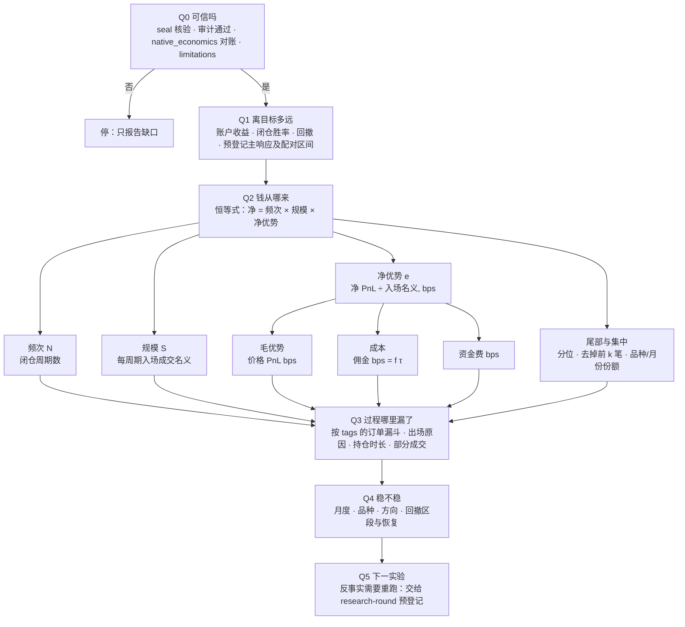
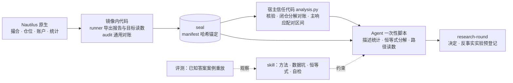

# 回测结果的拆解与诊断：调研、设计与改进计划

状态：调研、计划与第一批实施（同一 PR：skill 事实更正与评测、删 `compare_paired_returns.py`、新增 `analysis.tables()`；另三个死脚本已由 #1500 先行删除）。未写 Dolt、未跑新回测、未改镜像输入。日期 2026-10-10，代码基于 main `3b3b4876b`。

范围：拿到一次封存回测（或一对合法配对）之后，Agent 怎样拆解和诊断结果；据此如何改进 `nautilus-report-analysis` skill、如何使用和封装 Nautilus 报告 API；报告相关代码哪些可删、是否应搬进 skill。遵循"能用 Agent 就不硬编码"：代码只用于信任边界、修现有缺陷、Agent 做不到的事。

与已有文档的关系：[原生分析计划](native-rd-analysis-plan.zh.md) 定了 P0-A/B1 的信任核心与 P0-C 资本时序；[字段审阅](native-rd-analysis-fields.zh.md) 定了键名；[skill 产品形态审计](skill-product-form-audit.zh.md) 定了四层形态并列出死代码。本文不重复它们，只补"诊断方法"这一层和由此引出的改动。

## 结论

1. **诊断按"可信 → 离目标多远 → 钱从哪来 → 过程哪里漏 → 稳不稳 → 下一实验"六问走。** 核心是一个恒等式：闭仓净 PnL = 频次 × 规模 × 单位名义净优势。它正好对上 research-round L4 要点名的五个失败部分。前两问已由代码给出；中间三问由 Agent 按 skill 计算；最后一问不是读报告，要新回放，归 research-round。
2. **社区和论文的做法大多已有，或能由 Agent 计算。** 约 25 种诊断里，约 15 种 Agent 用短脚本从 seal（加输入 Catalog 的 K 线）就能算；约 8 种是反事实重跑（随机入场、信号延迟、成本加压、参数邻域等），属于实验设计。需要新代码的只有资本时序，已列为 P0-C。不新增任何分析依赖。
3. **skill 改进：事实更正直接改；9 条候选规则按评测增量取舍，最后只写入两条。**
   - 写入的是"按入场标签 × 出场原因读结果"和"用原生统计类与 `create_tearsheet_from_stats`"。
   - 恒等式、对称拆分、去掉前 k 笔等，Opus 5.5 不加 skill 也能做到，所以不写进 skill，只保留在本文作方法说明。
4. **Nautilus API 优先复用原生件。** 固定的 rc3 自带 30 多个统计类，可以离线作用于封存的日收益，结果与 runner 写入的读数一致。`create_tearsheet_from_stats` 能直接用封存数据生成 HTML 报告。原计划的"P1 HTML"因此不需要产品代码。rc3 不支持 Python 自定义统计类（rc5 才有），也没有 MAE/MFE。
5. **报告代码可删约 720 行。** 立即可删三个零消费者脚本，共 583 行；`compare_paired_returns.py` 136 行要先给 8 个外部配方钉住代码 commit 再删。信任核心 `analysis.py`、镜像内审计与 `compare_node.py` 保留。
6. **不把报告代码搬进 skill 自包含。** 信任代码留在产品里，skill 只放方法、数据坑和参考。唯一建议新增的是一个公开的、只做核验与解析的读表接口 `analysis.tables()`。它复用 `analysis.py` 现有的解析，不新增统计。理由是外部配方在一天内重写了 14 次同一格式的解析，并直接导入检查脚本的私有函数，与 `material retain` 补接口缺口是同一类问题。用户已决定加入，已实现。
7. **配对区间暂不改代码。** 文献认为非学生化百分位区间偏窄。在 4 对合法配对上实测，学生化后上沿放宽 1–4 个百分点，块长取 3/7/14 天变化很小，没有结论翻转。等区间端点接近 0、结论可能翻转时再改。

## 调研：论文

由子 Agent 打开原文或 DOI 记录核验，共 33 篇，保留 28 篇；我又抽查了关键条目。下表只列对本项目有用的，"归属"写明由谁来做。

| 主题 | 来源 | 对我们有用的一点 | 适用性 | 归属 |
|---|---|---|---|---|
| 夏普的抽样误差 | Lo 2002 FAJ；Bailey & López de Prado 2012 J. Risk（PSR、最短记录长度） | 一年 365 个日观测，年化夏普的标准误约为 1；单次检验要拒绝"夏普为 0"，年化夏普需约 1.65 | 采用；PSR 的方差只含偏度和峰度，没有自相关项，要另查日收益自相关；峰度用原始值，不用 pandas 的超额峰度 | Agent |
| 选择偏差 | Bailey & López de Prado 2014 JPM（DSR）；Harvey & Liu 2015 JPM（夏普折扣）；Bailey et al. 2014 Notices AMS（最短回测长度） | 同一年试过约 20 个噪声级变体后，DSR 要求年化夏普约 3.5（独立同分布正态下的示意值） | 改造：试验数 N 与夏普离散度取自 Dolt `find`，含失败与未登记回放 | Agent（输入来自已有台账） |
| 过拟合概率 | Bailey et al. 2016 J. Comput. Finance（PBO/CSCV） | 判断"选择过程"，不判断单个策略 | 只用于真正的参数族（约 20 个以上配置）；候选对对照时拒用 | Agent |
| 多重比较 | White 2000；Hansen 2005（SPA）；Romano & Wolf 2005；Benjamini & Hochberg 1995 | 声称"最好的变体"时，要对整个变体族做检验；次要读数多时控制 FDR | 改造：所有 seal 都保留日收益，可行 | 需要时再定；当前由 research-round 冻结审阅承担 |
| 配对区间 | Ledoit & Wolf 2008 JEF；Götze & Künsch 1996；Politis & Romano 1994；Politis & White 2004；Lahiri 1999 | 非学生化 bootstrap 在小样本、厚尾下偏乐观；块长要做敏感性检查 | 实测见下节"配对区间核验"；暂不改代码 | 代码（已有） |
| 研究协议 | Arnott, Harvey & Markowitz 2019 JFDS；Gelman & Loken 2013；Steegen et al. 2016；Novy-Marx 2015 | 看过结果后才选的诊断只是探索；从 n 个信号里选最好的 k 个组合，偏差约等于从 n^k 个里选最好的 | 采用；预登记主响应已覆盖大部分 | research-round |
| 回测统计清单 | López de Prado 2018《AFML》第 14 章 | 一般特征、表现、游程（收益集中度、水下时间）、执行损耗、效率、归因 | 采用为 Agent 清单；第 12 章 CPCV 需要已拟合模型，暂拒 | Agent |
| 执行损耗 | Perold 1988 JPM；Harris & Hasbrouck 1996；Linnainmaa 2010 JF | 损耗 = 执行成本 + 未成交单的机会成本；限价成交有逆向选择 | 改造：过期 GTD 计为机会成本；比较成交单与过期单的成交后价格变动（markout） | Agent（需 Catalog K 线） |
| 止损是否有用 | Kaminski & Lo 2014 JFM | 随机游走下止损降低期望收益，只在动量或状态切换时有益 | 改造：同一入场分别用 bracket 出场与时间出场 | 反事实重跑 |
| 规则在噪声路径上的表现 | Brock, Lakonishok & LeBaron 1992；Sullivan, Timmermann & White 1999；Bajgrowicz & Scaillet 2012 | 与零假设路径或随机入场比；低成本就能吃掉大部分规则 | 改造：经原生引擎重跑，不另写向量化回测 | 反事实重跑 |
| 加密因子与资金费 | Liu, Tsyvinski & Wu 2022 JF；He et al. arXiv 2212.06888；Schmeling et al. BIS WP 1087 | 加密收益由加密自身因子驱动；资金费 carry 大且时变，高 carry 预示崩盘 | 改造：日收益对 BTC 与等权永续回归；检查"优势"是否只是资金费收割 | Agent |
| 逐笔极值 | Sweeney 1996《Maximum Adverse Excursion》 | 用 MAE/MFE 诊断止损和止盈位置 | 采用为描述；5 分钟 K 线只能近似盘中路径；同一数据上调止损会过拟合 | Agent（需 Catalog K 线） |

剔除或降级：Tharp 的 R 倍数、Pardo 的参数平台和前推（只有目录记录、无误差控制，只作 Agent 启发式）；信号延迟检验（找不到学术原始来源，作启发式）；Brinson 归因（需要基准权重，不适用）；Lo–MacKinlay–Zhang 限价单模型（需要订单簿）；Harvey–Liu–Zhu 的"t > 3"（来自因子动物园，不是通用门槛）。

## 调研：社区与工具

由子 Agent 对照当前官方文档、源码、PyPI 与 GitHub 核验（2026-10-10）；Nautilus 部分在固定的 rc3 上本机复核。

| 诊断 | 回答的问题 | 数据 | 出处 | 归属 |
|---|---|---|---|---|
| 入场标签 × 出场原因 | 哪类入场、哪种出场（止盈/止损/GTD 过期/时间/期末）赚钱 | orders（tags、contingency）、fills、positions | freqtrade `backtesting-analysis` 分组 | Agent：出场原因取平仓那笔成交所属子单的 tag |
| 按品种、月、星期、UTC 小时、资金费时点分组 | 是否集中在少数币或时段，或资金费结算前后 | positions、fills、account | freqtrade `--breakdown`；MT5 报告 | Agent |
| 依赖少数交易 | 去掉前 N 笔或前 k 个币后还剩多少；中位数与均值 | 闭仓周期 | Wealth-Lab | Agent |
| MAE/MFE、止损止盈是否合适 | 止损是否在噪声里；盈利单是否回吐 | positions、fills + Catalog K 线 | MT5、LEAN `TradeStatistics`；Nautilus 无（#5196 开放提案） | Agent：按方向取持仓期 K 线高低点，入场与出场那根 K 线给上下界，以止损距离为单位 |
| 限价成交 markout、过期单之后的走势 | GTD 限价是否被逆向选择；过期的入场是否错过了行情 | fills、orders + Catalog K 线 | 业界 TCA 做法 | Agent：说明撮合模型决定何时算触价 |
| 成本归因 | 毛优势、佣金、资金费、止损滑点 | fills、positions | 已有对账代码 | 已有代码 + Agent（滑点 = 止损子单 avg_px − trigger_price） |
| 日收益统计 | Sharpe、Sortino、Calmar、Ulcer、尾部比、VaR | 交易窗口日收益 | Nautilus 内置统计类 | Agent：原生类、`period=365`、先去掉预热日 |
| 回撤区段 | 前 5 个回撤的深度、长度、恢复，以及由哪些币和标签造成 | 日收益 + positions | LEAN 报告、pyfolio、vectorbt | Agent |
| 基准相对 | 对 BTC 永续或等权组合的 beta、alpha、捕获率 | 日收益 + Catalog | Nautilus `get_performance_stats_returns_vs_benchmark` | Agent |
| 敞口调整后的比较 | 单位总敞口的收益、在市时间 | 原生敞口时序（seal 里没有） | LEAN、vectorbt | 代码：即已计划的 P0-C |
| 路径风险 | 回撤的分布 | 日收益 | AmiBroker 文档指出多仓重叠时交易重排无效；QuantStats 的蒙特卡洛是逐日置换 | Agent：只用日收益的块 bootstrap |
| 截断回放的前视检查、预热敏感性 | 删掉 T 之后的数据，T 之前的订单是否变化；改预热长度后订单是否变化 | 两次回放的订单流 | freqtrade `lookahead-analysis`、`recursive-analysis` | 反事实重跑：Agent 用现有 runner 跑两次再比对订单流，作为冻结前检查；需要它把关 independent 时再考虑写成代码 |
| 信号延迟、入场/出场隔离、随机入场、成本加压、参数邻域、前推 | 优势是否脆弱，来自入场还是出场 | 新回放 | Davey、Build Alpha、StrategyQuant | 反事实重跑，走 research-round 预登记；不另写向量化回测（那等于第二个撮合引擎） |

工具依赖结论：pyfolio（2019 年后停更）、empyrical、QuantStats、vectorbt、backtrader、mlfinlab、pypbo 一律不引入。它们的功能 Nautilus 已有，或几行 pandas 就能算；有的还会重新模拟成交，等于第二个撮合引擎。freqtrade、LEAN、MT5、AmiBroker 只借方法。

剔除：带噪声或合成数据的检验、逐笔蒙特卡洛置换（要约 1000 次全量回放，并破坏 37 币的相关结构）；AHPR/GHPR 与曲线线性度（多仓重叠时没有定义）；SQN 作为评分（与交易 t 统计量重复）；只有厂商描述的 Build Alpha 细节。

## 调研：Agent 做数据分析的可靠性与 skill 形态

| 证据 | 来源 | 对设计的含义 |
|---|---|---|
| 用代码计算明显好于文中推算，但剩余错误主要是方法和列选错（44% 方法、34% 列或值、6% 算术） | QRData（ACL Findings 2024）；PoT、PAL | 每个数字都由代码计算；控制重点放在口径定义上，不放在算术上 |
| 开放式数据分析仍不可靠：最好的成绩在 DABstep 难题上 14.55%，DiscoveryBench 25%，DA-Code 与 DSBench 约 30–34% | 各基准 2024–2025 | 窄的描述问题可以交给 Agent；"为什么失败"这类开放问题必须有自检和复算 |
| 仅换角色设定就能让 Agent 得出相反结论；86% 的分析通过了 AI 审阅，78% 通过了人工专家审阅 | Miao, Pritchard & Zou, arXiv 2607.01507（2026-07，摘要已核） | 审阅挡不住选择性报告；预登记主响应与对账必须是代码。子 Agent 报的 AUC 0.92 不在摘要中，不引用 |
| AI 科学家系统存在事后选择和指标误用；看轨迹和代码比看最终论文容易发现 | Luo, Kasirzadeh & Shah, arXiv 2509.08713 | 保留分析脚本和输出哈希；复核者拿代码与 seal 复算，不只读结论 |
| 没有外部依据的自我纠错无效；借助工具的批评有效；多次采样一致不代表正确 | Huang et al. ICLR 2024；Tyen et al. 2024；CRITIC；Farquhar et al. Nature 2024 | 独立复算要换模型、换实现，并且最后都要对账到审计合计 |
| 已发表的量化 Agent 系统都由代码算指标、LLM 只读表；RD-Agent-Quant 的提示让"单次年化收益稍高"就替换当前最优 | RD-Agent-Quant（NeurIPS 2025）及其 prompts.yaml；AlphaAgent；TradingAgents | 与我们的"代码算信任读数、Agent 解释"一致；它的替换规则正是要避免的选择偏差 |
| 低自由度（固定脚本）用于"脆弱易错、一致性关键"的操作；确定性操作优先用脚本；SKILL.md 少于 500 行，参考资料只链一层，至少 3 个评测并对比不加 skill 的基线；description 用第三人称 | [Anthropic skill 最佳实践](https://platform.claude.com/docs/en/agents-and-tools/agent-skills/best-practices)（已核） | 解析封存格式这类脆弱步骤适合固定脚本或接口；其余保持指令 |
| 执行轨迹显示 Agent 每次都在重写同一段逻辑（如"解析某种格式"）时，就写一个经过测试的脚本打包进 `scripts/`；gotchas 段落价值最高，留在 SKILL.md | [agentskills.io 最佳实践](https://agentskills.io/skill-creation/best-practices)（已核） | 与我们配方的实测情况吻合（见"产品形态"） |
| 除非需要确定性行为或外部工具，优先写指令 | OpenAI Codex skills 文档 | 同上 |

这条证据与我们的原则有张力：放开 Agent 自由计算会扩大可选的分析空间，而这正是选择性报告的来源。处理办法不是写更多代码，而是：

- 决定性的读数（主响应、对账）留在代码里；
- 其余读数一律标"探索"，不进入决定；
- 记录算过的每一个视角，而不只记录报告出来的那个。

## 设计一：诊断树

诊断按固定顺序走，前一问不成立就不进入下一问。每个读数写明总体（闭仓周期 / 开放仓 / 全部行 / 账户）、权重（计数或名义）和频率（日收盘或采样）。

要点：

- **Q2 的恒等式是核心。** 闭仓净 PnL = N × S × e，e = 毛优势 − 佣金 + 资金费（均以入场成交名义计 bps）。它把 research-round L4 要求点名的五个失败部分（毛优势、成本、频次、规模、尾部）一一对上。前三个因子相乘，所以"胜率上升"可以和"收益下降"同时成立。
- **价格 PnL、佣金、资金费的闭仓合计由代码对账给出**（`artifacts report`），Agent 的分解必须先回到这几个数（误差 ≤1e-6）再引用。
- **Q3 依赖策略自己的 tags 与 contingency。** 对 bracket/OCO 策略，撤单多数是子单，按出场原因（止盈/止损/时间/撤单）分组后再读结果。
- **路径类读数（MAE/MFE、成交后 markout、出场效率）需要输入 Catalog 的 K 线**，封存里没有。只有 Catalog 树哈希与 seal 的输入身份一致时才算；否则写"不可得"，不用成交价近似。
- **Q5 不是读报告。** 随机入场、固定持有期出场、信号延迟、成本加倍、参数邻域、子窗口，这些都要新回放，属于实验设计，走 research-round 的预登记，不由分析工具自动生成。

## 设计二：职责分层

| 层 | 内容 | 为什么在这一层 |
|---|---|---|
| Nautilus 原生 | 成交、仓位、账户、内置统计类 | 不另造引擎 |
| 镜像内代码 | 报告导出、summary 目标读数、通用审计、native_economics | 信任边界：目标读数（收益、胜率）不能由 Agent 自评 |
| 宿主信任代码 | `artifacts report`、`compare --analysis` | 信任边界：核验字节、对账、锁定预登记主响应 |
| skill | 诊断顺序、恒等式、数据坑、自检、禁止事项 | 方法交给 Agent，按需加载 |
| Agent 脚本 | 其余全部描述读数 | 频率低、问题各异，写成代码会腐化 |
| research-round | 反事实实验、选择压力计数 | 需要新回放和预登记 |
| 评测 | 已知答案案例 | md 是软约束，只有评测能看出它是否起作用 |

## 实例：一对合法配对的拆解

用诊断树读一对已登记的合法配对：候选 `RD20261010-C11-37`（manifest `23db95886170…`）对照 `RD20261010-B03-37`（`95afa823cf83…`）。脚本只读 manifest 复核后的字节；闭仓净 PnL 与 `artifacts report` 的 `closed.reported_realized_pnl_usdt` 一致（651.131 与 11,333.324 USDT）。总体为闭仓周期，按入场成交名义加权。B03 另有 11 个开放仓与 306.2 USDT 未实现残差，不在下表内。

| 读数 | 对照 B03 | 候选 C11 |
|---|---:|---:|
| 账户年化（summary） | 12.0% | 0.67% |
| 闭仓胜率（闭仓周期，按计数） | 42.7% | 53.6% |
| 闭仓周期数 N | 496 | 151 |
| 每周期入场名义 S（USDT） | 3,309 | 4,014 |
| 净优势 e（bps） | 69.1 | 10.7 |
| 其中毛优势 / 佣金（bps） | 74.8 / 5.9 | 16.5 / 5.6 |
| taker 成交名义占比 τ | 31.1% | 26.8% |

闭仓净 PnL 变化 −10,682 USDT。两种拆法：

| 拆法 | 频次 N | 规模 S | 净优势 e |
|---|---:|---:|---:|
| 顺序拆（N → S → e） | −7,883 | +735 | −3,534 |
| 六种顺序平均（Shapley） | −4,922 | +1,028 | −6,789 |

读法：胜率上升是真的，但它与频次降到约三分之一、单位名义毛优势从 74.8 降到 16.5 bps 同时发生。成本几乎没变（τ 反而略降），所以失败部分是频次与毛优势，不是成本。下一步要回答"过滤删掉的是哪些周期、它们的毛优势是多少"，这需要两版保留同一来源机会的标识；没有标识时只能报告分布差异（见原生分析计划的比较证据边界）。

方法教训：两种拆法给出的主因排序相反。因子同时大幅变化时，交互项很大，顺序拆会把它全记到先变的因子上。所以 skill 要求用对称拆法（Shapley），或同时报告两种顺序；差额排序不稳时，不点名"主因"。

## 配对区间核验

用 `analysis._paired` 的同一组日收益（manifest 复核后的字节），把现行方法与学生化、循环块长敏感性做对照。年化相对增长，单位为百分比：

| 配对 | 观测值 | 现行百分位区间 | 学生化（ISO 周块） | 循环块 b=3 / 7 / 14 | 差值绝对值最大 5 天占全年净差 |
|---|---:|---|---|---|---:|
| C11-37 / B03-37 | −10.1 | [−41.8, 36.8] | [−42.7, 40.9] | [−39.1, 31.2] / [−39.4, 32.0] / [−40.0, 34.1] | 1.53 |
| C03-37 / B02-37 | −21.9 | [−46.1, 9.5] | [−46.0, 13.0] | [−43.4, 6.4] / [−44.2, 7.6] / [−44.1, 8.8] | 0.68 |
| C04-37 / B02-37 | −11.2 | [−40.5, 31.8] | [−41.5, 34.7] | [−38.8, 26.6] / [−38.7, 27.3] / [−39.1, 29.6] | 1.86 |
| C01-37 / B01-37 | −11.8 | [−37.0, 20.6] | [−37.3, 23.9] | [−38.1, 24.4] / [−37.0, 21.9] / [−38.4, 23.3] | 1.91 |

现行区间与原生分析计划中的固定案例一致（C11/B03 为 [−41.8120, 36.8119]）。结论：

- 学生化后上沿放宽 1–4 个百分点，符合文献"百分位区间偏乐观"的判断；
- 但所有方法下 4 个区间都覆盖 0，没有结论翻转，所以现在不改代码；
- 触发条件：区间端点离 0 不到约 5 个百分点时，Agent 要同时报告学生化与块长敏感性，只有各方法一致时才下结论。届时如果要改信任代码，再走字段审阅。

最后一列大于 1，表示差值最大的 5 天加起来超过全年净差，即差异主要由少数几天决定。这个读数应当作为 Agent 的集中度检查。

## skill 改进计划

### A. 事实更正（现有条目有误，改正即可，不需要先测增量；已做）

由子 Agent 在固定 rc3 源码和 3 个不同镜像的 seal 上核对：10 条数据坑中 7 条成立、3 条部分成立，没有完全错误的。下列条目要改：

| 现在的写法 | 改为 | 证据 |
|---|---|---|
| 快照行靠 `position_id` 的 UUID 后缀识别 | 用原生 `is_snapshot` 列 | `analysis/reporter.py:124`；B00-37 有 470 个快照行 |
| 列顺序随镜像不同 | 随 run 不同：orders.csv 的列顺序取决于第一张订单的类型 | C08 与 C10 同镜像、列序不同 |
| 金额单元格都是 `"<decimal> <currency>"` | account.csv 的 `total/locked/free` 是纯数字，币种在 `currency` 列 | 三个 seal 核对 |
| 零行报表的列较少 | 原生零行报表没有任何列；现在的少量列是 runner 的 `_readable_empty_report` 补的 | `run_portfolio.py:72-76` |
| 按 `tags` 与 `contingency_type` 拆分订单漏斗 | 用 `parent_order_id` 区分子单与入场父单（父单也标 OTO），再按 tags 分 | B00-37：15,722 个撤单中 10,798 个是子单，4,924 个是撤掉的入场父单 |
| 三种胜率口径 | 补充：原生 `stats_pnls` 含快照与开放行，同一品种同一纳秒平仓的周期会并成一条；其中 "PnL (total)" 是现金变化，不含未实现 | B00-37：507 行只有 500 条；C10-37：614 行只有 612 条 |
| 原生 `stats_returns` 含预热 | 补充：默认按 252 天年化，加密用 365 | 原生默认值 |

另外 description 改为第三人称（"Derives …"），符合 Anthropic 指南。

### B. 新规则候选（先评测，测出增量才写入；结果见 C 节：只写入 K3、K5）

| 编号 | 规则（skill 里只写通用表述） | 位置 | 来源 |
|---|---|---|---|
| K1 | 先用恒等式 净 = 频次 × 规模 × 单位名义净优势（毛优势 − 佣金 + 资金费）定位失败部分，用 research-round L4 的名称 | SKILL.md | 本文实例；AFML 第 14 章 |
| K2 | 比较两次运行时用对称（Shapley）分解，或同时报告两种顺序；排序不稳时不点名主因 | SKILL.md | 本文实例中两种拆法排序相反 |
| K3 | 按"入场标签 × 出场原因"分组读结果；出场原因是平仓那笔成交所属子单的 tag | SKILL.md | freqtrade |
| K4 | 声称有优势或有改善之前，先去掉前 k 个周期、前 k 天、前 k 个品种再看；报告中位数 | SKILL.md | AFML 集中度；Wealth-Lab；本文配对区间核验最后一列 |
| K5 | 标准统计用 `nautilus_trader.analysis` 的统计类作用于交易窗口日收益，`period=365`；HTML 用 `create_tearsheet_from_stats` 并传入交易窗口统计；rc3 不支持 Python 自定义统计类，先查已安装包，别信 `/latest` 文档 | references | 本机复算与 summary 一致 |
| K6 | MAE/MFE、markout 只在输入 Catalog 的树哈希与 seal 输入身份一致时计算；入场与出场那根 K 线给上下界；以止损距离为单位 | references | Sweeney；LEAN；Nautilus 无原生实现 |
| K7 | 路径风险只对日收益做块 bootstrap；多仓重叠时不重排交易，也不逐日置换 | SKILL.md | AmiBroker 文档；QuantStats 源码 |
| K8 | 带夏普或 DSR 的结论要写出试验数 N 及其来源（`find`），含失败与未登记的回放 | references | DSR；Harvey & Liu |
| K9 | 配对区间端点离 0 不到约 5 个百分点时，附学生化与块长敏感性，各方法一致才下结论 | references | Ledoit & Wolf；本文配对区间核验 |

SKILL.md 改前 4.1 KB，写入 K3、K5 后 5.8 KB。gotchas 留在正文（agentskills.io：这是价值最高的部分）。只写入两条后没有建 `references/`。

### C. 评测与结果（2026-10-10）

做法：与 research-round 相同，用 `claude plugin eval`，被测模型 Opus 5.5，每组每个用例 3 次。三组对照：
- 不加 skill；
- 当前 skill（已含 A 节事实更正）；
- 当前 skill 加 K1–K9 的变体。

7 个用例都用虚构数字，不含运行编号。结果放在 Git 外的 `~/.local/share/trade/skill-evals/nautilus-report-analysis/20261010-k-rules/`。

评分器：默认的 haiku 不可靠。有一个回答明确写了"出场原因取平掉该周期那笔成交所属订单的 tag"，也做了 A/B 交叉，三票却全判失败；另一个回答写"不要引入 quantstats"，被当成依赖 quantstats。所以把这两个用例的评分改成逐条清单，换 `--judge-model sonnet` 重跑。下表是内容评分（不含"是否触发 skill"）的通过次数：

| 用例 | 检验 | 不加 skill | 当前 skill | 加候选规则 | 结论 |
|---|---|---:|---:|---:|---|
| 胜率升、收益降 | K1、K2 | 3/3 | 3/3 | 3/3 | 不写：基线已会用 Shapley 拆分或说明顺序依赖 |
| 改善集中在少数交易 | K4 | 3/3 | 3/3 | 3/3 | 不写 |
| 回撤分布的重采样 | K7 | 3/3 | 3/3 | 3/3 | 不写 |
| 配对区间贴近 0 | K9 | 3/3 | 3/3 | 3/3 | 不写 |
| MAE/MFE 的数据来源 | K6 | 2/3 | 3/3 | 3/3 | 不写：差一次在噪声内，当前 skill 也不含相关内容 |
| 入场标签 × 出场原因（sonnet 评分） | K3 | 0/3 | 1/3 | 3/3 | **写入** |
| 原生统计与 tearsheet（sonnet 评分） | K5 | 0/3 | 0/3 | 3/3 | **写入** |

K8（夏普结论要写试验数）没有单独测；research-round 已要求计算选择压力，所以也不写。

处理：
- skill 只新增一节 Readings，含 K3 与 K5 共三条，不建 `references/`。
- 评测用例只保留检验 skill 内容的 2 个作回归：出场原因、原生统计。另外 5 个测不出 skill 的贡献，已删除，做法同 research-round 的先例：4 个在两种配置下都通过；MAE/MFE 用例检验的是 skill 未写入的内容。
- 以后重跑用 `--judge-model sonnet`。
- 总花费 9.75 美元。

## Nautilus 报告 API 的用法与封装

原则：原生能给的直接用；只在原生有缺口、且有真实消费者时加最薄的一层；能离线由 Agent 做的，不进 runner 或 analysis。

| 能力 | rc3 原生情况（已核） | 做法 |
|---|---|---|
| 五种报告（orders、order fills、fills、positions、account） | 都有；空报表没有列；orders 列序随第一张订单类型变化 | runner 现有两个薄封装保留：`_orders_with_native_deadlines` 补 GTD 截止时间，`_readable_empty_report` 补零行表头。都是原生缺口的最小补丁 |
| 34 个统计类、`PortfolioAnalyzer` | 能离线作用于封存的日收益或 PnL 列表；复算与 summary 一致；不能注册 Python 自定义统计 | Agent 直接调用（K5）；runner 与 analysis 不加统计 |
| 默认统计口径 | 含预热、252 天年化、`stats_pnls` 合并同纳秒平仓 | 不改镜像（要配对重放，收益小）；skill 写明，Agent 在交易窗口用 365 复算 |
| tearsheet | `create_tearsheet_from_stats` 离线可用，依赖已锁定（plotly 6.9.0）；本机用 C11-37 生成成功（4.9 MB HTML） | Agent 按需生成，输入换成交易窗口统计；不进 seal。原生分析计划中"P1 HTML"的产品代码部分取消 |
| 权益与资本时序 | `PortfolioConfig.equity_curve` 默认开启，`portfolio.snapshots(account_id)` 可取；runner 只取了终值 | 即 P0-C；本次核验确认原生能力存在。需要新镜像，按原计划闸门推进 |
| 订单生命周期时间戳、拒绝原因 | orders 报告只有最终状态；Order 对象上有 | 有"漏斗各段耗时"这类真实问题时，再像 `expire_time_ns` 一样从 cache 导出 |
| 事件流持久化 | 回测没有持久化配置；`StreamingFeatherWriter` 要手工接入，读回只能直接用 pyarrow | 不做 |
| MAE/MFE | 没有；上游 #5196 是开放提案 | Agent 按 K6 计算；不写代码，等上游 |
| `Position` 重建 | `Position.from_dict(to_dict())` 失败 | 分析只用报告行，不重建原生对象 |
| 升级到 rc5/rc6 | rc5 恢复 Python 自定义统计 | 目前没有问题需要它；升级要新镜像与配对重放，不做 |

## 产品形态：报告代码去留与 skill 是否自包含

### 报告代码去留

| 文件 | 行数 | 消费者 | 结论 |
|---|---:|---|---|
| `research/records/analysis.py` | 338 | `artifacts report`、`compare --analysis`、D10 配方 | 保留：信任核心 |
| `backtest/r1/checks/audit_tiered_native.py` | 624 | 镜像内审计、`artifacts run` | 保留。#1494 后通用对账总会先跑。其中 tier 几何部分约 270 行，硬编码了遗留变体名；按"策略正文是产品"的原则，它应属于遗留策略自己的 `replay_integrity_findings`。改它属于改审计边界、要新镜像，等下一次有意重建镜像时再提 |
| `backtest/r1/checks/compare_node.py` | 157 | 镜像、README 配对验收 | 保留 |
| `backtest/r1/checks/readback_native_economics.py` | 98 | 无；读取当前 summary 已没有的 `retracement_strategy_source_sha256`，遇到现有 seal 必然 KeyError | 删 |
| `backtest/r1/checks/compare.py` | 189 | 无 | 删 |
| `backtest/r1/checks/compare_factorial.py` | 296 | 只有 `rd-experiment-native-evidence-plan.zh.md:11` 一处文档链接；硬编码 4 个遗留变体 | 删；文档链接改为固定 commit |
| `backtest/r1/checks/compare_paired_returns.py` | 136 | `analysis.py` 导入 `_interval`；8 个外部配方导入私有函数 `_read/_annualized/_sharpe/_interval`，且这 8 个 `recipe.json` 都没有钉住代码 commit | 先把 `_interval` 移入 `analysis.py`；在 records README 写明这些配方从 commit `3b3b4876b` 运行，并验证 8 个都能原样重建；然后删 |

前三个与 [skill 产品形态审计](skill-product-form-audit.zh.md) 第四节的死代码结论一致。本次补查了外部配方：没有配方依赖这三个文件。合计可删约 720 行。

### 是否把报告代码搬进 skill 自包含

不搬。理由有三层：

1. **信任代码不能在 skill 里。** `compare --analysis` 的输出进入 Dolt 决定，必须不论 skill 是否加载都一样。skill 里的脚本由 Agent 决定是否运行，也能被它改写。这与审计第一节对整包搬家的结论相同。
2. **skill 的内容应是方法、数据坑和参考步骤。** 前面的 A、B 两节都属于这一类，放在 SKILL.md 与一层 `references/` 里。
3. **"格式解析"这一步属于例外，但它该放在产品接口里，不该放在 skill 脚本里。** 依据如下：
   - **重写频率。** 外部配方目录里 75 个 Agent 脚本（约 4,200 行，全部写于 2026-10-10）中，14 个重写了金额解析，9 个重写了列表单元格解析，9 个重写了 events 映射，11 个自己调 verify。
   - **私有导入。** 有 8 个配方导入检查脚本的私有函数，还有配方导入 `artifacts._tree`、`_runner_inputs`、`_check_inputs`。
   - **已出过错。** 至少一个配方读错了原生语义，后来做了更正（reclaim-final 的 `reader_correction`）。
   - **外部指南。** agentskills.io 把"每次重写同一种格式的解析"列为该写成脚本的信号。
   - **为什么不放 skill 脚本。** 写成 skill 脚本会出现第二份解析器，与 `analysis.py` 并行漂移。

实现形态：`analysis.py` 中的公开函数 `tables(root, run_id, *, account=False)`。连同按列名解析单元格的部分，新增约 75 行；它复用现有的 `_sealed/_rows/_list/_usdt` 和对账时已经算出的周期。它的行为限定为：

- 只读 manifest 复核后的字节；
- 把金额与列表单元格解析成 Decimal 与列表；
- 给每笔成交标上所属周期，标出闭仓、开放仓与快照；
- 返回交易窗口日收益；
- 不计算任何统计；
- 对账不变量不成立时直接失败。

skill 写"从 `research.records.analysis.tables` 读表"。这对应三条准则中的"修现有缺陷"：接口缺口迫使 Agent 进入内部函数，与 #1497 新增 `material retain` 是同一类问题。它不完全符合准则的字面，由用户于 2026-10-10 决定加入。原始格式的 gotchas 仍留在 skill 里，供 `tables()` 不覆盖的读取使用。

## 用户决定（2026-10-10）

- 按本计划执行第 1–5 项，含 `analysis.tables()`，一个 PR 做完。
- tier 几何移入遗留策略（第 6 项）已授权，放到下一次有意重建镜像时做；那次重建也会让已从依赖中删除的 `markdown-it-py` 离开镜像（见下节）。

## 实施顺序与状态

| 顺序 | 内容 | 性质 | 状态 |
|---|---|---|---|
| 1 | skill 事实更正与 description（A 节） | 修现有缺陷 | 已做 |
| 2 | 删三个零消费者脚本，并改文档链接 | 删死代码 | 已由 #1500 完成 |
| 3 | 7 个评测用例，三组对照（不加 skill / 当前 skill / 加候选规则）；K1–K9 按增量决定写入 | 评测驱动 | 已做：写入 K3、K5，保留 2 个回归用例 |
| 4 | `compare_paired_returns.py`：`_interval` 移入 `analysis.py`，配方的运行 commit 写进 records README，8 个配方在该 commit 上全部原样重建，然后删 | 删代码 | 已做 |
| 5 | `analysis.tables()` | 新公开接口 | 已做；28 个 seal 全部可读，闭仓计数与已实现 PnL 与对账一致 |
| 6 | tier 几何移入遗留策略 | 改审计边界 | 已授权，等下次重建镜像 |
| 7 | P0-C 资本时序 | 已计划 | 按原生分析计划的闸门 |

第 4 项与原计划的差别：原计划写的是给 8 个 `recipe.json` 补 `shared_code_git`。配方按 README 用 `material retain` 存档，带哈希，改写磁盘上的配方文件会让它与存档字节不一致。所以沿用 records README 已有的做法：像"归档台账用 `9794ed307` 的 CLI 读取"一样，写明这些配方从 `3b3b4876b` 运行。实测 8 个配方在该 commit 上的输出与存档 JSON 逐键相同。

## 下次重建镜像时

下一次有意重建运行镜像（会改镜像输入、要新 digest 和工程配对重放）时，一并做：

1. **`markdown-it-py` 随镜像消失。** #1500 已把它从 `pyproject.toml` 与 `uv.lock` 删除；现用镜像 `b6b94ccc…` 仍含它，下一次从 main 构建时自动去掉。重建后确认镜像里没有它。
2. **tier 几何移入遗留策略。** `audit_tiered_native.py` 中按 `signal_variant` 硬编码的 tier 几何检查（约 270 行），移到使用这些变体的遗留策略自己的 `replay_integrity_findings`；通用对账保持不变。这属于改审计边界，用户已于 2026-10-10 授权，前提是与镜像重建一起做。
3. 新镜像对受影响的对照做工程配对重放（`compare_node`），确认订单、成交、费用、资金费与账户一致后再用于新候选。

不做：新的分析依赖、向量化反事实回测、自定义 tearsheet、runner 内新增统计、事件流持久化、为 MAE/MFE 写产品代码、学生化区间改代码（触发条件见上）。

## 来源与核验状态

核验方式：子 Agent 打开原文、DOI 记录或官方文档与源码；关键条目由我再抽查。"已核"指打开过主来源。

- 论文（DOI 记录或原文已核）：Lo 2002；Bailey & López de Prado 2012、2014；Bailey et al. 2014、2016；Harvey & Liu 2015；White 2000；Hansen 2005；Romano & Wolf 2005；Ledoit & Wolf 2008；Politis & Romano 1994；Politis & White 2004；Lahiri 1999；Götze & Künsch 1996；Benjamini & Hochberg 1995；Arnott, Harvey & Markowitz 2019；López de Prado 2018（出版社目录）；Gelman & Loken 2013；Steegen et al. 2016；Novy-Marx 2015；Perold 1988；Harris & Hasbrouck 1996；Linnainmaa 2010；Kaminski & Lo 2014；Brock et al. 1992；Sullivan et al. 1999；Bajgrowicz & Scaillet 2012；Liu, Tsyvinski & Wu 2022；He et al. arXiv 2212.06888；Schmeling et al. BIS WP 1087。Sweeney 1996 只有书目记录（部分核验）。
- Agent 分析可靠性：QRData arXiv 2402.17644；PoT 2211.12588；PAL 2211.10435；BLADE 2408.09667；DSBench 2409.07703；DA-Code 2410.07331；DiscoveryBench 2407.01725；DABstep 2506.23719；KramaBench 2506.06541；Miao, Pritchard & Zou 2607.01507（我已核摘要）；Luo et al. 2509.08713；Huang et al. 2310.01798；Tyen et al. 2311.08516；CRITIC 2305.11738；Farquhar et al. Nature 2024；RD-Agent-Quant 2505.15155；AlphaAgent 2502.16789；TradingAgents 2412.20138。
- skill 形态：[Anthropic skill 最佳实践](https://platform.claude.com/docs/en/agents-and-tools/agent-skills/best-practices)、[agentskills.io 最佳实践](https://agentskills.io/skill-creation/best-practices)（均已由我核对）；[Agent Skills 规范](https://agentskills.io/specification)；OpenAI Codex skills 文档；Anthropic 工程博客 "Equipping agents for the real world with Agent Skills"。
- 工具与社区：[freqtrade 高级回测分析](https://www.freqtrade.io/en/stable/advanced-backtesting/)、[lookahead-analysis](https://www.freqtrade.io/en/stable/lookahead-analysis/)、[recursive-analysis](https://www.freqtrade.io/en/stable/recursive-analysis/)；[MT5 测试报告](https://www.metatrader5.com/en/terminal/help/algotrading/testing_report)；[LEAN TradeStatistics](https://github.com/QuantConnect/Lean/blob/master/Common/Statistics/TradeStatistics.cs)；[LEAN 报告](https://www.quantconnect.com/docs/v2/cloud-platform/backtesting/report)；[AmiBroker 蒙特卡洛](https://www.amibroker.com/guide/h_montecarlo.html)；[StrategyQuant 稳健性测试](https://strategyquant.com/doc/strategyquant/types-of-robustness-tests-in-sqx/)；Nautilus [#5196](https://github.com/nautechsystems/nautilus_trader/issues/5196)、[#4741](https://github.com/nautechsystems/nautilus_trader/issues/4741)、[#3029](https://github.com/nautechsystems/nautilus_trader/issues/3029)。
- Nautilus rc3：本机 `nautilus_trader==2.0.0rc3` 的 `analysis/reporter.py`、`analysis/tearsheet.py`、`backtest/__init__.pyi`、`analysis/__init__.pyi`，以及离线探针。
- 未核或剔除：Asher et al. 2026 关于 Claude Code 与 Codex 做 p-hacking 的论文（未能打开原文）；QuantAgent 与 Alpha-GPT（只有摘要）；Davey 书中原始步骤（只有论坛转述）；Robot Wealth 清单（未找到）；Build Alpha 细节（只有厂商描述）。
