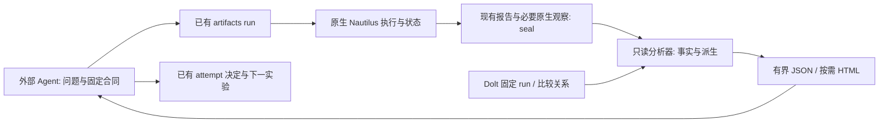

# 原生回测分析与改良比较实施计划

状态：P0-A（`artifacts report`）与 P0-B1（`compare --analysis`）已实现；B2、P0-C、P1 未实现。日期：2026-10-10。第一版服务当前 R1、USDT 线性永续、固定本金原生账户；其他账户或合约类型在口径未核实前明确为不支持或证据不足。

审阅由独立子 Agent 对照代码、28 个封存 run、固定 `nautilus_trader==2.0.0rc3` 与 Dolt v132（`f8va2hf2e7bae13p08kfs5s8ne1sk3ud`）核实 65 条事实，再按原则与切片、账务与统计、拒绝边界、字段清单四个角度逐条反驳检验。本版吸收其结论与同日用户决定；被推翻或修正的初版说法不再保留为事实。

## 用户决定（2026-10-10）

- 交付：先以 PR 合并本计划初版所在分支的既有提交，P0 自 main 另开分支实施，不堆叠 PR。
- P0-B 本轮只做 B1（今天已合法的配对，零拒绝边界变化）。允许此前 candidate 作为新参考（B2）涉及拒绝边界，以后按下文边界表逐行授权。
- 由成交加 Catalog MARK 推算旧 seal 的资金占用与逐品种逐日估值：暂不实施，P0-C 时作为与新增原生观察并列的候选方案再评估。P0-A 中旧 seal 的资本时序标为不可用。
- 顺序：修订本计划 → P0-A/B1 输出字段独立审阅并记录 retain/drop/derive → P0-A → B1。

## 目标与交付形态

让外部研究 Agent 从一次回测及其合法比较中回答：这次改动改变了什么，改善来自哪些可观测量，付出了什么代价，哪些解释仍没有证据，以及下一次最小实验应当检验什么。收益率、Sharpe、净胜率继续保留为账户结果；局部能力变化单独展示，不能把它们隐藏在总分里。

核心交付是现有研究入口中的两个读取能力：单 run 诊断、固定 pair 差异分析。共享代码整理原生事实和计算差异，Agent 解释并选择研究方法；HTML 是按需生成的阅读辅助。优先交付当前封存数据即可支持的分析，再补缺失的资金占用时序。

验收目标是找对事实、识别改动的收益和代价、拒绝没有依据的归因，并提出带预测与反证条件的下一实验。不能用“图表变多”“字段齐全”或“某次策略收益上升”代替这个目标。

## 已核实的起点

封存与入口：

- [run_portfolio.py](../../backtest/r1/run_portfolio.py) 导出 orders、fills、positions、account、returns_series 和 summary；前四份来自原生 ReportProvider，returns_series 与 summary 由 runner 写出，`reports/audit.json` 由 `audit_tiered_native.py` 写出。[artifacts.py](../../research/records/artifacts.py) 实施前有 run、verify、restore、backup、register、input-identity 子命令，没有 report/analyze；P0-A 新增 `report`。
- seal 要求实际文件集合与 manifest.files 完全一致（`verify`），旧 seal 不得追加报告；Dolt run 的 `artifact_manifest_ref` 锚定 manifest 哈希。报告集合不固定：E01-37 另封存了策略自写的 37 份 jsonl，“策略不导出”是约定而非强制边界。
- 起跑时 `_attempt_snapshot` 把 attempt revision 1 及其初始发表 commit 作为 `record_binding` 写入 manifest；`binding_origin=sealed_start` 是 register 阶段写入 run provenance 的标签。起跑时只核对策略绑定，不读 evidence_refs 或 known_exposure；按初版设想在起跑时解析参考证据属于新行为。
- 28 个 seal 分属两个 OCI（`5785c9a1…`、`d6bbbde7…` 各 14 个）。正式 compare 要求同一运行环境，验证配对必须取同一镜像内的 run。

比较契约：

- [正式 compare](../../research/records/cli.py) 分别核验双方固定源码，允许不同策略源码，并要求共同输入、窗口、账户、成本、OCI/platform、Nautilus、有效配置及完整性。它与完成决定的契约要求永久 role 为 candidate/control（`cli.py:425`、`contracts.py:166`），两处均无负向测试。拒绝统一返回 `RECORD_ERROR`、`path=null`、`write_status=unknown`，不指出冲突字段。任一侧指标为 null 时 `cli.py:497` 的 `Decimal` 运算抛出未处理异常。
- compared_with 在回测完成后的 register 阶段形成；register 只查自对照与独立等级暴露，不查对照角色。单独校验它不能证明参考事前选定。现有 27 个 attempt 的初始 revision 都没有可机器核验的参考声明，全部历史配对只能标为事前证据不足。
- [compare_paired_returns.py](../../backtest/r1/checks/compare_paired_returns.py) 在第 62 行要求源码相同，按列表顺序比较 per_coin counts/quantity，且不检查有效配置、镜像、输入身份、成本、审计或 seal 哈希。counts 是 LAST/MARK/funding 输入条数，quantity 是登记的初始 trade_size；当前 sizing 为原生权益止损风险加名义上限，实际下单量只能从订单与成交读取。已有 8 个外部配方导入其私有函数。
- 其 ISO 周块配对 bootstrap（5000 次、seed 20261008）作用于原生日 MTM 账户收益，可复用为配对区间方法。

原生语义（固定 rc3）：

- PortfolioSnapshot 没有公开 `to_dict`。原生账户报告是余额/保证金事件，`total` 为现金余额而非 MTM 权益；`margins` 在事件时点含逐品种保证金。闭仓 Position snapshots 不是连续持仓曲线。
- `Position.realized_pnl` 已含同币种佣金与资金费调整；毛 PnL = realized + 佣金 − 资金费净收入。资金费同时出现在 positions 的 `adjustments` 列与 account 余额变动中，只能取一处。`realized_return` 是不含费用的价格回报；原生 Profit Factor 按 returns 计算。
- rc3 导出 34 个统计类，BacktestNode 默认注册 20 个；封存 summary 实际约 22 个读数（stats_returns 11、stats_pnls 10、stats_general 1），另有 7 个需 benchmark。原生 stats_returns 在含预热的全序列上计算；summary 的 Sharpe 与回撤另按交易窗口计算。
- 胜率至少有三个口径：原生 stats_pnls（分析器总体，含开放仓已实现部分并对部分 NETTING snapshot 去重）、summary `closed_trade_win_rate`（闭仓周期）、positions 行数。三者数值不同，不得混名。
- 当前费率为固定 maker 2 bps、taker 5 bps，成交费率 bps 恒等于 2 + 3τ（τ 为 taker 成交名义占比）。

封存数据形态：

- returns_series 从 input_start 起含预热日，标签为 UTC 日初；需按 trade_start 过滤。
- positions 混合 NETTING snapshot（position_id 带 UUID 后缀）与活仓位对象；fills/orders 的 position_id 是基础 ID，成交到周期以 positions.events 的 event_id 映射，trade_ids 只作交叉核对。存在多档入场合并为一个周期和部分成交。`ts_closed` 在存在开放仓时有 float64 误差，收盘时刻用 `ts_last`/`duration_ns`；开放仓 `duration_ns=0`。
- `adjustments` 是 positions 的列，不是独立文件。未定价/stale 状态没有封存；runner 仅在结束时拒绝 stale/未定价快照。
- 新镜像 run 的 orders.csv 列顺序不同，须按列名解析。零行报表只保留少数列；失败 seal（C06-P02）没有 summary/audit。B03 的 account.csv 达 206 MB。
- B00-37 的审计走分档审计器，没有 `native_economics`；其余 26 个通过的 seal 有。

读取稳定性：单条固定 `show` 同样会报 `DOLT_SQL_ERROR / Errno 49`。记录存储每次对象读取新建一条 TCP 连接，读取 D09 brief 约 5,164 次；观察到 Dolt 端口 TIME_WAIT 达约 1.6 万，接近 16,384 个临时端口，端口耗尽是强有力但未最终证明的解释。

[第二轮审计](dolt-rd-second-audit.zh.md) 与 [R&D 产品发现](r1-fresh-ledger-product-findings.zh.md) 已给出毛亏、薄毛利被成本覆盖、局部改善但账户目标未达、零交易、比较阻断等验收场景。

## 按研究问题组织原生数据

每个主题都区分观察事实、计算口径、前后差异、样本/覆盖和缺失证据。事实层不自动写“主因”或“该改哪个参数”。每个读数注明总体（闭仓周期 / 开放仓 / 全部行 / 账户）。

| 研究问题 | 第一版组织的事实/派生量 | 原生或现有来源 | 如何指导下一判断 |
|---|---|---|---|
| 有无交易优势 | 闭仓毛/净 PnL；名义加权净优势（净 PnL ÷ 入场成交名义，bps）与计数胜率并列；分位盈亏 | positions、fills、固定合约事实 | 等权与名义加权可能符号相反（C10），以名义加权为主读数；不平均 realized_return；按已成交档数的描述由 Agent 按需派生，它是入场后的路径结果而非事前分层 |
| 成本从哪里来 | 毛、佣金、资金费、净，各按入场成交名义的 bps；τ | positions 的 events 与 adjustments | 费率 bps 变化称为“流动性构成变化”，不称效率；不计算成本/毛利比；仅触价 maker 成交占比需封存外的 Catalog 柱线，P0-A 不计算 |
| 为什么机会没有变成结果 | 按 tags × status 的订单计数、有成交订单、部分成交、仓位周期数、持仓时长分位 | orders、fills、positions；策略已有 replay_diagnostics | 取消数主要来自 bracket 子单，不等于丢失机会；缺少未下单机会时明确未知 |
| 本金被如何使用 | P0-A：开放仓数量与入场名义、空仓/持仓周期；时间加权敞口/保证金为 P0-C | positions；P0-C 原生观察 | 旧 seal 资本时序为不可用，不推断“闲置 X%” |
| 损失与风险是否改善 | 日收盘回撤及恢复（未恢复则右删失）、最差日/月、闭仓亏损尾部、连亏（注明同刻平仓的排序规则）、期末开放仓 | returns_series、positions | 回撤与敞口并列展示；所有峰值和回撤注明频率；未定价状态对旧 seal 不可用 |
| 改善是否集中于少数情形 | 月度账户 MTM 收益（交易窗口、日初标签）；品种按已实现口径（闭仓 + 开放仓）+ 未分配未实现残差；方向拆分 | returns_series、positions | 月度必须注明口径，闭仓月份口径与 MTM 口径单月可差约 2,035 USDT；最差月与收益/亏损集中度由 Agent 从月度表和品种表派生，总额 ≤ 0 时集中度不定义；只有一个入场方向时不给方向拆分 |

账户收益始终包含整账户及开放仓影响。闭仓分解另列边界：闭仓已实现与 native_economics 同名逐叶给出，开放仓已实现由二者相减得到（当前数据中等于入场佣金与资金费；逐行核对，含部分平仓价格盈亏时写入限制），未实现残差（期末权益 − 期末余额）单列；残差未经独立核验，其限制经 audit coverage_limits 进入 limitations。价格 PnL 只对闭仓定义（成交现金流）。原生 Profit Factor、Win Rate 与闭仓口径的同类读数使用不同名称。

归一化只在币种、合约乘数、成交金额及分母定义可核验时计算。先支持本计划的 R1 线性 USDT 范围；不使用 peak_qty 冒充初始资本，不把利润除以较小本金当作新本金回测。保持原生结算为事实源，分析层不实现第二套仓位或资金费账本，也不对品种重新估值。

## 单次报告与改良比较

每个命令输出一份确定性的有界 JSON：不设 `--brief` 或主题展开，不复用通用 `bounded_brief`（它会静默截断缺口与列表）。字段审阅原型实测单 run 4.7–10.9 KB，配对 13.7–16.2 KB；以 indent=2 计超过 32,768 UTF-8 字节即显式失败，不截断。缺口、限制与比较资格永不省略；不可得读数为 null 并进入 limitations，不新增 unavailable/gaps 键。明细通过封存文件路径与 sha256 下钻，不内嵌事件数组。

单次报告的阅读顺序：

1. 运行身份（manifest_sha256、封存的 record_binding）、交易窗口、预热、完整性、数据覆盖与当前缺口。
2. 账户目标读数；工程通过不等于经济通过。P0-A 不读 Dolt，事前主响应由 Agent 用 record_binding 关联 `show`，B1 从候选 rev1 解析。
3. 六个研究问题的主要事实，尤其毛/净优势、费用、频次、尾部及可用资本状态。
4. 月度/品种/方向表（品种表按列存储）及固定证据入口。
5. 仍无法回答的问题。Agent 再提交有限范围解释和下一实验，复用已有 attempt plan/decision，不新增必填“价值说明”。

比较报告的阅读顺序：

1. 两个固定 run 各自的 strategy_binding 与 artifact_manifest_ref、候选冻结的 selection，比较方向及合同依据。非法配对返回具体冲突字段（code、path、双方记录值、`write_status=not_written`）和下一动作，消息文本与拒绝集合不变。
2. 每个可比量沿用 compare `metrics` 的 {candidate, control, difference} 形状，单位在键名后缀；任一侧为 null 时差值为 null；不生成相对提升百分比。
3. 单独列账户主目标变化、局部能力读数变化和代价。正向变化不自动汇总成“更好策略”。
4. 共同账户日序列差、月度贡献、品种/方向构成、成本 bps、交易次数/规模和尾部。归因不能跳过成交子集与规模改变。
5. 配对区间只对候选冻结的 `selection.primary_response` 计算；当前经济 attempt 均为 `final_equity_usdt`，映射为配对日对数收益差（年化相对增长），端点再年化。attempt 契约没有可机读目标阈值，不输出目标差距或精度判语；配对相关与半宽不单列；块长敏感性只作为方法核验记录在字段审阅文件中。其他读数只给描述性点差。
6. 事前证据：B1 透传候选的 selection（含 known_exposure），并给出一条固定限制——对照在结果后登记绑定，尚无可机器核验的事前参考声明。“起跑前已登记”无法派生（seal 无起跑时刻），不新增事前布尔值或等级；历史配对不得读作事前已验证。保留暴露史、选择家族规模、既往尝试和样本限制。工具不自动决定下一候选。

MOCK：下面是独立教学例子，不是当前 R&D 实测。假设一年、初始 100000 U、无开放仓或其他账户调整。

| 读数 | 改良前 | 改良后 | 可陈述的变化 |
|---|---:|---:|---|
| 账户年收益 | 8.0% | 7.2% | 账户目标下降 0.8 个百分点 |
| 闭仓净 PnL / 入场成交名义（名义加权） | 10 bps | 12.5 bps | 已成交子集的单位名义净优势上升 |
| 闭仓周期数 | 400 | 240 | 数量减少 40% |
| taker 成交名义占比 τ（费率 2 + 3τ bps） | 67% | 17% | 流动性构成转向 maker，费率由 4 降至 2.5 bps |
| 时间加权名义敞口/权益 | 10% | 6% | 占用下降；仅当时序完整时可计算（P0-C） |
| 日收盘最大回撤 | 12% | 7% | 回撤随敞口下降 |

报告应让 Agent 看到：单位名义净优势上升、流动性构成转向 maker，同时频次、敞口和账户收益下降。回撤下降与 40% 敞口下降同时发生，是账户层面的风险下降，不是风险效率或过滤能力提高的证据。每仓 USDT 均值由 20 U 升到 30 U，部分来自每仓成交名义由约 2 万升到 2.4 万 U，不能直接称信号识别改善。下一问题可以是检验过滤是否错删正净期望机会，但先要定义共同机会、可观察证据、代价与反证，不由工具自动推荐放宽过滤。

### 比较证据边界

- B1 原样调用现有 `_compare` 后再做分析，与 `--engineering-audit` 互斥，不把工程豁免带入分析。`compare_paired_returns.py` 字节不变；RDP03 由 `compare --analysis` 解决，分析模块可在宿主侧复用其纯函数。
- 正式配对核验各自源码真实性，而非源码相等。共同输入身份与窗口已蕴含 per-instrument counts/quantity 相等，按 instrument 对齐只作为测试断言。实际订单/成交数量与规模允许作为结果不同。
- 第一版沿用共同有效配置要求。需要测试不同配置或成本的实验另行定义可比较意图和契约，不能在本能力中默默放宽现有拒绝边界。工程迁移仍是单独用途。
- 优先账户按日配对以及稳定分组的描述比较。不得凭相近时间、position_id 或开平仓方向强行跨版本配对交易：NETTING、分批成交、改出场/过滤会改变仓位集合。
- 只有两版已经保留同一来源机会的稳定定义/标识且经核验，才能比较共同/新增/删除机会。没有这些证据就报告分布差异和缺口，不建设通用信号仓库或策略语言。
- 区分样本内描述、合法配对估计、独立确认。所有现有 C 系列候选在 rev1 已看过其参考，配对区间不是确认；当前暴露窗口不能重新叫 holdout。DSR 等额外资格统计需要真实完整的搜索记录和适用假设，第一版不自动套公式宣称校正完成。
- Dolt 基础设施错误（如 `DOLT_SQL_ERROR`）原样失败，不降级为“证据不足”或“不可读”。

### B2：此前 candidate 作为新参考（推迟，需逐行授权）

启动条件：真实后继实验即将登记（如 D09@2 下一步建议以 C11-37 为参考）。启动时向用户逐行申请授权，并先完成独立契约审阅与字段审阅。

| 编号 | 位置 | 方向 | 当前数据中受影响记录 | 替代保护与测试 |
|---|---|---|---|---|
| B2-1 | `cli.py:425` compare 角色检查 | 放宽：role=candidate 参考仅在候选 rev1 声明绑定时接受；diagnostic 两侧均拒绝 | 0 | 与 B2-2 共用 allow-list 谓词；诊断参考拒绝、未绑定候选参考拒绝、已绑定接受 |
| B2-2 | `contracts.py:166` 配对决定角色检查 | 放宽，同上；`_check_family` 不变 | 0 | 同一谓词；析因族语义不变 |
| B2-3 | `artifacts register` | 收紧：rev1 声明参考时 `control_run_id` 必须等于它，不论参考角色 | 0 | 结果后换参考被拒 |
| B2-4 | rev1 发表与 `--dry-run`（初版设想在起跑时） | 收紧：声明须唯一、可解析、`{path, sha256}` 等于参考 run 的 `summary_ref`、参考在 rev1 `run_refs` 内、integrity passed 且已封存 | 0；只作用于新 rev1 | 歧义/不可解析声明被拒；历史形状全部仍可读 |
| B2-5 | 是否要求新候选登记必须声明参考 | 收紧 README 登记流程 | 0 | 单独授权项 |

规则：收紧项放在 `previous is None` 或 register 中；决定阶段的收紧以“rev1 存在声明”为条件，不能使历史记录变为不可读。B2-1/2 与 B2-3/4 同一变更交付。担保表述为“参考在本 run 封存起跑前固定”，不是“在任何结果之前选定”；分析输出另列同源码兄弟 attempt 的声明，以及 artifact root 下指向这些 attempt 但未登记的 seal。

## 最小架构与 Agent 调用

- 回测时：共享 runner 自动采集，策略只负责规则与自身已有必要诊断。不让每个策略实现导出/存档。
- 分析核心放在宿主侧 `research/records/analysis.py`，为基于已核验字节的纯函数；`artifacts.main` 与 `cli compare` 只加薄入口。P0-A/B1 不改镜像 COPY 集、`backtest/r1` 根目录、`audit_tiered_native.py`、`compare_node.py`、`pyproject.toml`、`uv.lock`，不新增依赖，因此不需要新 OCI、不需要重跑，并在两个现有镜像的 seal 上通用。`artifacts.verify/_runner_inputs/_check_inputs` 签名不变（D09 配方导入它们）。
- 调用形态：`uv run --frozen python -m research.records.artifacts report --root <ARTIFACT_ROOT> --run-id <RUN_ID>`，不读 Dolt，错误以 RecordError JSON 输出，失败 seal 输出 status=failed、manifest problems 与空经济读数且退出码 0；`uv run --frozen python -m research.records.cli --at <COMMIT> compare <CANDIDATE_RUN> <CONTROL_RUN> --analysis`。
- 分析器先 `verify`，再对实际解析的字节按 manifest.files 复核哈希；按列名解析，零行与失败 seal 不假设完整 schema；流式处理大文件。verify 会对 account.csv 计算哈希，但 P0-A 从不解析它。
- 报告身份：manifest_sha256、summary_ref/audit_ref、record_binding、`analysis.source_files_sha256`（参与计算的全部模块）、`analysis.dependency_lock_sha256`（宿主 uv.lock）；区间参数在 `paired_daily_returns` 的 seed/draws 中。第一版只接受已封存 run；输出默认 stdout，拒绝写到 artifact 或备份根下。值得保留的结论复用现有 material/evidence 引用与保管规则。
- 同一计算核心供 JSON 和 HTML 使用。旧 seal 在外部只读分析，不加文件、不替换 summary，不把后来估算称为当时的原生读数。新原生观察只能在新 run 封存前进入 manifest 并被核验/备份/恢复。

## 新存储事实与派生输出的独立审阅

存储必要性与分析结构已由独立子 Agent 审阅；Dolt 五表及登记字段在 P0-A/B1 零新增。P0-A/B1 的派生输出 schema（逐键：名称、单位、总体、来源、公式、null 规则；复用 native_economics、closed_trades、窗口、compare 既有名称）已在实现前另经三位独立子 Agent 审阅，retain/drop/derive 与裁决理由见 [派生输出字段审阅记录](native-rd-analysis-fields.zh.md)；实现以该记录的键名与定义为准。

| 内容 | retain/drop/derive | 消费者与独立事实 | 既有事实为什么不足/如何复用 |
|---|---|---|---|
| 原生 PortfolioSnapshot 时序 | retain，P0-C | 权益、保证金、估值完整性及资金分析的指定时点事实 | account 事件和日收益不足以给出日内 MTM 路径；先 probe rc3 原生 PortfolioConfig 快照选项；忠实编码原生字段，不再存 equity/余额/PnL 副本 |
| 同时点开放 Position 的原生 notional_value(MARK) | retain，P0-C | 名义占用、并发、集中度；现场原生估值 | Snapshot 不含仓位金额；最小为 Position ID + 带币种 Money，时间复用 Snapshot，品种/账户从既有固定关系解析 |
| 由成交 + Catalog MARK 推算旧 seal 资本占用与逐品种 MTM | 用户 2026-10-10：暂不实施，P0-C 时作为候选方案比较 | 旧 seal 的资本诊断 | Catalog 在封存与备份之外，只能在树哈希一致时可用，否则不可用；不得成为 P0-A 的前提 |
| 每时点全量 Position.to_dict、events/adjustments | drop | 未发现必须的新消费者 | 重复现有生命周期/事件且放大存储 |
| 重复源码、运行身份、数量、MARK 价格、乘数、费用/资金费 | drop | 不是新的独立事实 | 复用 manifest、fills/positions、固定 instrument 与输入 Catalog |
| 名义敞口、比例、均值、采样峰值、集中度、保证金比率 | derive | 单 run 与 pair 诊断 | 从原生时序求值，不新增 Dolt KPI 列 |
| 价格 as-of 时点/年龄 | 优先 derive；具体实现待闸门 | 避免缓存旧价格被误认成当时价格 | 从固定派生 MARK Catalog 与采样时点核验实际使用更新；无法证明则输出不足，并另行独立审阅最小 as-of 事实 |
| 精确空仓时间/采样空仓比例 | derive，分别命名 | 频次与占用分析 | 生命周期只在完整且无歧义时求精确区间；否则降级，采样占比不冒充精确时长 |
| MAE/MFE、退出效率 | P1，暂不新增事实 | 入场/保护/退出假说 | 先定义价格 excursion 或净 PnL excursion、部分成交/加减仓/反向；有真正缺口再独立审阅 |
| 事前参考声明（B2） | 待独立契约与字段审阅 | register/compare/决定/--analysis；独立事实：参考在本 run 封存起跑前固定 | compared_with 在结果后形成；候选载体为从未使用的 `kind=comparison`（推荐）、`kind=summary`（与后续 revision 中 17 处“本实验结果”语义冲突）或不看 kind 的精确匹配 |
| “改善何种能力”自然语言 | drop 自动持久字段 | 外部 Agent 的有范围研究解释 | 复用已有 attempt/decision；不新增必填文案模拟质量 |

P0-C 原型闸门：

1. 先 probe rc3 `PortfolioConfig` 的 `snapshot_interval_ms`/`equity_curve`：当前 native_node 未传 portfolio 配置，已有内存中的日快照但未封存。没有可用原生 codec 时只做原生字段的忠实编码薄层。
2. 用小型原生 probe 验证观察时钟：同 ts 多币 MARK/LAST、资金费与相关成交到约定处理边界后取状态。不能假设 interval timer 天然在批次最后，不因采样重排输入或另建回放控制器。
3. 核对 Snapshot margins 的账户级/品种级项与 MarginAccount total_* 口径，避免重复相加。名称限定为原生模型中的要求/占用。
4. 覆盖完整交易区间的开始、结束、空仓时段；预热分开。均值按持续时间加权，记录缺失/未定价/原生 stale 和采样覆盖。
5. 第一版选择与当前 MARK 数据相适应的 5 分钟采样，标明 sampled peak/drawdown；同柱内开平仓可能漏过采样。
6. 只记录开放仓位，流式压缩保存，无零仓位的 37 币全矩阵、无事件数组重复。测量字节、记录数及执行开销后再冻结上限，超限显式失败。
7. 观察开/关同源原生配对，核对订单、成交、仓位、佣金、资金费、账户权益和策略诊断。新 OCI 下新研究 pair 两方都需相同新 runtime。
8. `verify` 继续接受历史 runtime SOURCE_PATHS 集合；新增共享观察模块不得使 28 个现有 seal 失效。

## 分阶段实施与完成条件

| 阶段 | 实施内容 | 完成条件 | 新回测/新存储 |
|---|---|---|---|
| P0-A：现有证据的单 run 诊断 | `artifacts report`；读 manifest 核验后的 summary、audit、positions、fills、orders、returns_series | 现有 seal 无修改；零交易/失败 seal/开放仓/缺失不造零；26 个有 native_economics 的 seal 在 1e-6 内回到原生经济事实，B00-37 只有未实现残差不可用；每个闭仓在 1e-6 内满足 price − 佣金 + 资金费 = realized；输出 ≤ 32 KiB 且重复输出字节一致；README 与架构说明可发现 | 不需重跑；无 Dolt 新字段 |
| P0-B1：合法配对分析 | `compare --analysis`；结构化拒绝；null 差值；rev1 主响应区间；事前描述事实 | 合法配对成功且 ≤ 32 KiB（含最大谱系 C12-37/B03-37）；现有拒绝不变；历史配对不显示为事前已验证；`compare_paired_returns.py` 字节不变；台账版本不变 | 不需重跑；无 Dolt 新字段 |
| P0-B2：此前 candidate 作参考 | 见 B2 边界表 | 逐行用户授权；独立契约与字段审阅；隔离 Dolt 测试 | 视审阅结论 |
| P0-C：必要资本时序 | 存储/编码/批次 probe 闸门；共享 runner 原生观察；seal 纳入与 verify/restore/backup；派生占用报告 | native 观察开/关经济及交易一致；同 ts/缺价/空仓/首尾/部分成交正确；最小事实获独立审阅；旧 seal 仍可核验 | 需新 OCI 工程配对 |
| P1：目标驱动明细与 HTML | 复用原生 tearsheet、共同日序列及差曲线、成本分解、分组贡献、资本曲线；按真实问题补共同机会或 MAE/MFE | 同一计算核心；没有可靠输入时明确不可计算 | 仅真正缺失事实另走字段审阅 |
| 最终：Agent 研究任务验收 | 冻结产品及案例，用干净上下文读取、比较、形成最小下一实验；随后新 R&D 再审计 | 事实/引用/动作正确，能保留局部收益及代价，能停无依据重复试验 | 不把几十个相关版本当几十次独立验收 |

先完成 P0-A/P0-B1，再视真实需要推进 B2 与 P0-C；不等 HTML 或 MAE/MFE 才向研究 Agent 交付价值。无确定工期前不承诺天数。

## 验收任务

测试分三层：

1. CI 合成夹具：零行报表、失败 seal（无 summary/audit）、开放仓、部分成交、NETTING snapshot 对、资金费正负、orders 列顺序置换、32 KiB 上限与重复输出一致；null 差值；compare 两处角色检查的负向测试。分析不读 Dolt，compare 的 Dolt 错误沿既有路径原样失败。
2. 真实 seal 套件：仅在设置 `TRADE_RESEARCH_ARTIFACT_ROOT` 时运行，按 run ID 寻址，不把数值写入 Git。28 个 seal 无异常；26 个 seal 的 realized、佣金、资金费合计在 1e-6 内等于 native_economics；returns_series 复利等于 final_equity；B00-37 只有未实现残差为 null、C06-P02 为 failed；B03/C10/C11/C12 与 D09 外部配方的固定结果一致。
3. B2 只在隔离 Dolt 中测试。

固定案例：

- 零交易 E00-P02：账户保持原生结果，交易级胜率/期望为 null。
- 毛亏 C03、薄毛利被成本覆盖 C04、开放仓边界 B03：分解正确，佣金/资金费不双扣。四个回归样本中毛赢转净亏均为 0，不预期非零。
- B03 含 7 对同刻开平的 NETTING snapshot：报表计数和固定证据正确，跨版本不可强配对。
- 合法配对：C11-37/B03-37、C03-37/B02-37、C04-37/B02-37、C01-37/B01-37。C11 对 B03 胜率上升而账户收益下降，两者同时展示，不给综合分。
- 拒绝配对：C09-37/B03-37（cost_model）；C02/C01、C05/C04、C11/C10（非登记对照）；带 `--engineering-audit` 的 `--analysis`。
- 区间可复现：C11/B03 在 seed 20261008、5000 次、ISO 周块下得到年化相对增长 −10.0992%，95% 区间 [−41.8120, 36.8119]。
- 旧 seal 无资本时序：明确不可用，不推断“闲置 X%”，不补写旧 seal。
- 不变量：28 个 seal 仍通过 verify；`TRADE_RECORDS_CONFIG` 指向不存在路径时 P0-A 仍可用；镜像 COPY 集文件不变；D09 配方复核仍通过；分析命令不写台账（执行前后台账版本相同）。

Agent 任务验收：在冻结证据集上至少做独立干净上下文的重复读取，使用 Claude/Codex 可用环境，不把复述预设故事当通过。检查实际引用和计算、是否识别未知、是否区分局部改善/总目标变化、下一实验是否有可观察预测及反证、是否避免无依据放大仓位。基线限于第二轮审计已回答的五个问题（C03 毛亏、C04 薄毛利被费用覆盖、B03 开放仓边界、C11 对 B03 胜率升收益降、C09 被拒配对），记录工具调用、字节和事实/归因错误，不先造“质量总分”，也不让 P0-A 等待新的评测设施。

## 第一版删减与后续再评估

第一版不建设综合能力分/排行榜、自动主因分类、自动参数搜索或自动下一实验推荐，不承诺 34 项统计。不建研究调度器、策略语言、信号仓库或第二套交易账本。先保持共同配置比较；跨配置消融、复杂 benchmark、事件级极值和通用 MAE/MFE，在具体问题与消费者证明收益后再评估。

Dolt 读取稳定性（每次读取新建连接、谱系重复展开）仍是产品待办（RDP06）。报告分析读取选中的固定证据闭包，不以全库 validate 成功为前提；也不能以单条读取成功声称问题修复。

## 联网依据与适用范围

- [NIST DOE 步骤](https://www.itl.nist.gov/div898/handbook/pri/section1/pri14.htm) 支持先核验测量、保持简单、保留原始数据并用一系列小实验迭代；本计划据此让分析围绕问题与最小下一实验组织。
- [NIST 实验目标](https://www.itl.nist.gov/div898/handbook/pri/section3/pri31.htm) 区分比较、筛选和优化；局部指标观察不自动证明某个机制或整体资格。
- [DSR 原论文](https://www.davidhbailey.com/dhbpapers/deflated-sharpe.pdf) 指出重复尝试和选择偏差会夸大回测表现；本计划保留暴露史和尝试范围，不把开发点改善升级为确认。
- [arch 时间序列 bootstrap 文档](https://arch.readthedocs.io/en/stable/bootstrap/timeseries-bootstraps.html) 说明时间序列需要依赖结构相适应的重采样。第一版复用已有 ISO 周块方法，报告块长敏感性及其局限，不增加 arch 依赖，也不声称一个区间完成多次搜索校正。
- 原生 API 以本地固定 `nautilus_trader==2.0.0rc3` 及[对应 Portfolio 源码](https://github.com/nautechsystems/nautilus_trader/blob/v2.0.0rc3/crates/portfolio/src/portfolio.rs)、[Reporter 源码](https://github.com/nautechsystems/nautilus_trader/blob/v2.0.0rc3/python/nautilus_trader/analysis/reporter.py)为准；滚动官网不代替版本匹配及小型原生 probe。
