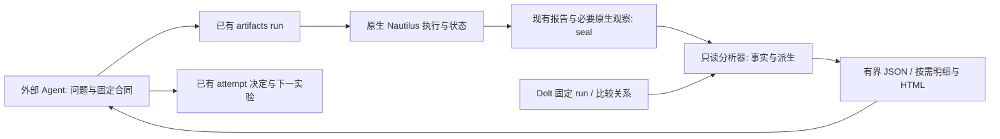

# 原生回测分析与改良比较实施计划

状态：计划，尚未实现。日期：2026-10-10。第一版服务当前 R1、USDT 线性永续、固定本金原生账户；其他账户或合约类型在口径未核实前明确为不支持或证据不足。

## 目标与交付形态

让外部研究 Agent 从一次回测及其合法比较中回答：这次改动改变了什么，改善来自哪些可观测量，付出了什么代价，哪些解释仍没有证据，以及下一次最小实验应当检验什么。收益率、Sharpe、净胜率继续保留为账户结果；局部能力变化单独展示，不能把它们隐藏在总分里。

核心交付是现有研究入口中的两个读取能力：单 run 诊断、固定 pair 差异分析。共享代码整理原生事实和计算差异，Agent 解释并选择研究方法；HTML 是按需生成的阅读辅助。优先交付当前封存数据即可支持的分析，再补缺失的资金占用时序。

验收目标是找对事实、识别改动的收益和代价、拒绝没有依据的归因，并提出带预测与反证条件的下一实验。不能用“图表变多”“字段齐全”或“某次策略收益上升”代替这个目标。

## 已核实的起点

- [run_portfolio.py](../../backtest/r1/run_portfolio.py) 已导出 orders、fills、positions、account、returns_series 和 summary；[artifacts.py](../../research/records/artifacts.py) 负责运行、核验、登记、备份和恢复。当前没有 report/analyze 子命令。
- [正式 compare](../../research/records/cli.py) 分别核验双方固定源码，允许不同策略源码；它与完成决定的契约仍要求永久 role 为 candidate/control，尚不支持此前 candidate 作为新实验的固定参考。
- 当前 compared_with 在回测完成后的 register 阶段形成，单独校验它不能证明参考事前选定。新增“事前配对”能力必须把起跑绑定的初始登记与后续参考端点核对，不能靠修改历史合同补齐。
- [compare_paired_returns.py](../../backtest/r1/checks/compare_paired_returns.py) 另行要求源码相同，未复用正式比较契约。其 per_coin.counts 是 LAST/MARK/funding 输入条数，quantity 是登记的初始 trade_size；两者都是输入或配置事实，不能误认为策略响应并删除核验。订单、成交和实际下单量才是可能变化的响应。
- 当前原生账户报告是余额/保证金事件，不是连续 MTM 权益和敞口时序；闭仓 Position snapshots 也不是组合的连续持仓曲线。
- 当前 seal 要求实际文件集合与 manifest.files 完全一致。旧 seal 不得追加报告或补写观察事实；派生报告放在 seal 外，引用原 manifest 与输入文件哈希。
- [第二轮审计](dolt-rd-second-audit.zh.md) 与 [R&D 产品发现](r1-fresh-ledger-product-findings.zh.md) 已给出毛亏、薄毛利被成本覆盖、局部改善但账户目标未达、零交易、比较阻断等验收场景。

## 按研究问题组织原生数据

每个主题都区分观察事实、计算口径、前后差异、样本/覆盖和缺失证据。事实层不自动写“主因”或“该改哪个参数”。默认短报告只显示主要读数、关键代价、缺口与固定证据入口；34 个原生统计和事件数组按需展开。

| 研究问题 | 第一版组织的事实/派生量 | 原生或现有来源 | 如何指导下一判断 |
|---|---|---|---|
| 有无交易优势 | 闭仓毛/净 PnL、正负比例、平均及分位盈亏、盈亏幅度、按明确成交金额口径归一化的读数 | fills、positions、adjustments、account、固定合约事实 | 区分毛优势不足、弱优势被成本覆盖；每仓金额会受规模和成交子集影响，不能直接称信号识别改善 |
| 成本从哪里来 | 佣金、资金费收/付、成交名义金额、费用 bps、毛赢转净亏数量、maker/taker 构成 | 原生成交与资金费调整 | 比较费用效率而非只比费用总数；毛利非正或接近零时不强算“成本占毛利比例” |
| 为什么机会没有变成结果 | 订单数、发生过成交的订单数、成交完成度、取消/过期/拒绝、仓位周期数、持仓时长 | orders、fills、positions；策略已有 replay_diagnostics | 将订单漏斗与策略信号漏斗分开；缺少未下单机会/跳过原因时明确未知，不用 native 行数冒充完整市场机会 |
| 本金被如何使用 | 权益、时间加权 gross notional/equity、采样峰值、原生保证金要求/equity、同时持仓及集中度、空仓时间/采样空仓比例 | P0 后续原生观察 + 既有仓位生命周期 | 分辨低频、低敞口、保证金需求和弱优势；不把名义敞口、保证金、部署最低本金混为一谈 |
| 损失与风险是否改善 | 日收盘回撤与恢复时长、最差日/月、闭仓亏损尾部、连亏、开放仓及未定价状态；补采后增加采样日内回撤 | 原生收益序列、仓位、账户及后续快照 | 展示降低风险是否同时丢失盈利/频次；所有峰值和回撤注明观察频率，不能称真实盘中极值 |
| 改善是否集中于少数情形 | 默认月度、品种、方向的收益与损失贡献、次数、覆盖及集中度 | 原生账户日序列、闭仓事实、已有稳定标签 | 找到值得检验的局部解释；品种贡献不是独立品种账户收益，开发样本分组结果只用于生成假说 |

账户收益始终包含整账户及开放仓影响。闭仓分解另列边界，核对浮盈亏、现金调整和费用，不能强行把闭仓总和当作期末权益变化。原生 realized_pnl 已计入同成本币佣金及 Position adjustments；其他币种费用另核对。原生 realized_return 是价格回报，原生 Profit Factor 按 returns 计算，不能与闭仓净 PnL 因子混名。

归一化只在币种、合约乘数、成交金额及分母定义可核验时计算。先支持本计划的 R1 线性 USDT 范围；不使用 peak_qty 冒充初始资本，不把利润除以较小本金当作新本金回测。保持原生结算为事实源，分析层不实现第二套仓位或资金费账本。

## 单次报告与改良比较

单次报告的阅读顺序：

1. 运行身份、交易窗口、预热、完整性、数据覆盖与当前缺口。
2. 账户目标读数和当前预登记主响应；工程通过不等于经济通过。
3. 六个研究问题的少量主要事实，尤其毛/净优势、费用、频次、尾部及可用资本状态。
4. 按需月度/品种/方向明细及固定事件证据；简要输出不塞事件数组。
5. 仍无法回答的问题。Agent 再提交有限范围解释和下一实验，复用已有 attempt plan/decision，不新增必填“价值说明”。

比较报告的阅读顺序：

1. 两个固定 run、各自源码与 seal，比较方向及合同依据。非法正式配对首先返回具体差异和下一动作，不能以数值差值冒充配对通过。
2. 每个可比量显示参考值、候选值、绝对差和明确单位；比率分母为零、缺失或不稳定时不生成误导性的相对提升百分比。
3. 单独列账户主目标变化、局部能力读数变化和代价。正向变化不自动汇总成“更好策略”。
4. 同时展示共同账户日序列及其差值、月度贡献、品种/方向构成、费用效率、交易次数/规模和尾部。归因不能跳过成交子集与规模改变。
5. 针对预先关心的少量响应提供配对不确定性读数；其他大量细分先展示描述，不默认逐指标显著性筛选。
6. 保留缺失证据、暴露史、选择家族、既往尝试和样本限制。工具不自动决定下一候选。

MOCK：下面是独立教学例子，不是当前 R&D 实测。假设一年、初始 100000 U、无开放仓或其他账户调整，闭仓数与每仓均值对应净利。

| 读数 | 改良前 | 改良后 | 可陈述的变化 |
|---|---:|---:|---|
| 账户年收益 | 8.0% | 7.2% | 账户目标下降 0.8 个百分点 |
| 每仓平均净 PnL | 20 U | 30 U | 本样本已成交仓位均值增加 50% |
| 闭仓周期数 | 400 | 240 | 数量减少 40% |
| 佣金/成交金额 | 4 bps | 2.5 bps | 费用效率改善 |
| 时间加权名义敞口/权益 | 10% | 6% | 占用下降；仅当时序完整时可计算 |
| 同频率最大回撤幅度 | 12% | 7% | 观察到的回撤降低 |

报告应让 Agent 看到“每仓均值、费用效率与回撤改善，同时频次和账户收益下降”。它尚不能证明“信号过滤能力提高”或“应扩大仓位”；两版成交子集/规模可能不同。下一问题可以是检验过滤是否错删正净期望机会，但先要定义共同机会、可观察证据、代价与反证，不由工具自动推荐放宽过滤。

### 比较证据边界

- 当前合法参考关系复用固定 compared_with；先把现有环境检查抽成存储无关共用函数，再以独立审阅的新规则允许此前 candidate 作为下一次的参考。历史 role/决定/合同不改。
- 第一版事前参考绑定限定为已有封存 run。拟复用初始 attempt 的现有字段：唯一 kind=summary 的 evidence_refs 引用指定参考的 artifact summary/hash；其固定 run ID/revision 同时存在于 known_exposure.run_refs，scope/plan 说明参考用途。起跑时只读 record_binding 指向的初始 revision/commit，解析该证据并核验对应 run；register、compare 和 paired decision 核对 compared_with 的对象及 revision 与它一致。不能用最新 attempt 的可变 evidence_refs，不能仅凭“在已看过 runs 列表中”允许任意切换，也不靠解析自由文本判断参考。该既有字段语义约定须经独立契约审阅后实施；无法唯一表达则停在描述级，重新评估必要表示，不增添一套前登记文案。
- 旧记录缺少机器可核验的初始参考时，不回补初始合同或改写原决定；保留按原契约读回的历史结果，将新增分析中的事前选择证据标为不足。两方都尚未运行的新窗口确认实验不能填写不存在的 run 引用，其事前源/配置比较意图另按具体实验审阅；本阶段不宣称已解决该场景。
- 正式配对核验各自源码真实性，而非源码相等。保持共同输入、窗口、账户、成本、OCI/platform、Nautilus、有效配置及完整性要求；输入 counts/登记 quantity 按 instrument 对齐核验，不能依赖列表顺序。实际订单/成交数量与规模允许作为结果不同。
- 第一版沿用共同有效配置要求。需要测试不同配置或成本的实验另行定义可比较意图和契约，不能在本能力中默默放宽现有拒绝边界。工程迁移仍是单独用途。
- 优先账户按日配对以及稳定分组的描述比较。不得凭相近时间、position_id 或开平仓方向强行跨版本配对交易：NETTING、分批成交、改出场/过滤会改变仓位集合。
- 只有两版已经保留同一来源机会的稳定定义/标识且经核验，才能比较共同/新增/删除机会。没有这些证据就报告分布差异和缺口，不建设通用信号仓库或策略语言。
- 区分样本内描述、合法配对估计、独立确认。发现更多月度/币种改善不是更多独立试验；当前暴露窗口不能重新叫 holdout。DSR 等额外资格统计需要真实完整的搜索记录和适用假设，第一版不自动套公式宣称校正完成。

## 最小架构与 Agent 调用

- 回测时：共享 runner 自动采集，策略只负责规则与自身已有必要诊断。不让每个策略实现导出/存档。
- 回测后：分析器读 manifest 核验后的原生文件。单次报告拟扩展现有 artifacts CLI；配对分析拟扩展现有 records compare，复用同一合法性检查，不增加第二套比较命令体系。
- 拟议调用形态（尚未实现，最终参数随现有 argparse 契约确认）：`artifacts report --run-id <id> --brief`；`records.cli --at <commit> compare <candidate> <registered-reference> --analysis --brief`；主题明细按需展开，HTML 按需输出。
- 同一计算核心供 JSON 和 HTML 使用，避免两套指标。短 JSON 以 32 KiB UTF-8 为上限，给出省略项与证据入口；关键缺口和比较资格不得被截断。
- 维护源码放 Git，共享观察与运行放固定 OCI。派生报告默认临时生成；值得保留的固定结论复用现有 material/evidence 引用与保管规则，不把每份 HTML 变成研究记忆。
- 派生报告需可追溯到固定 run/pair、输入文件哈希、分析代码/方法和参数。同一个方法可重建；改变分析算法产生新报告身份，不改旧运行。
- 旧 seal 在外部只读分析，不加文件、不替换 summary，不把后来估算称为当时的原生读数。新原生观察只能在新 run 封存前进入 manifest 并被核验/备份/恢复。

## 新存储事实的独立审阅记录

本轮由独立 sub-agent 审阅存储必要性，另一个独立 reviewer 挑战分析/比较结构。结论支持先做既有文件分析；Dolt 五表及登记字段零新增。以下决定是原型范围，具体编码和观察钩子尚未通过实施闸门。派生报告的输出 schema 也需独立核对口径与必要性，不能以“不进 Dolt”规避新增字段约束。

| 内容 | retain/drop/derive | 消费者与独立事实 | 既有事实为什么不足/如何复用 |
|---|---|---|---|
| 原生 PortfolioSnapshot 时序 | retain，P0 后续 | 权益、保证金、估值完整性及资金分析的指定时点事实 | account 事件和日收益不足以给出日内 MTM 路径；忠实编码原生字段，不再存 equity/余额/PnL 副本 |
| 同时点开放 Position 的原生 notional_value(MARK) | retain，P0 后续 | 名义占用、并发、集中度；现场原生估值 | Snapshot 不含仓位金额；最小为 Position ID + 带币种 Money，时间复用 Snapshot，品种/账户从既有固定关系解析 |
| 每时点全量 Position.to_dict、events/adjustments | drop | 未发现必须的新消费者 | 重复现有生命周期/事件且放大存储 |
| 重复源码、运行身份、数量、MARK 价格、乘数、费用/资金费 | drop | 不是新的独立事实 | 复用 manifest、fills/positions、固定 instrument 与输入 Catalog |
| 名义敞口、比例、均值、采样峰值、集中度、保证金比率 | derive | 单 run 与 pair 诊断 | 从原生时序求值，不新增 Dolt KPI 列 |
| 价格 as-of 时点/年龄 | 优先 derive；具体实现待闸门 | 避免缓存旧价格被误认成当时价格 | 从固定派生 MARK Catalog 与采样时点核验实际使用更新；若无法证明对应关系，输出不足，并另行独立审阅最小 as-of 事实，不偷加字段 |
| 精确空仓时间/采样空仓比例 | derive，分别命名 | 频次与占用分析 | 生命周期只在完整且无歧义时求精确区间；否则降级，采样占比不冒充精确时长 |
| MAE/MFE、退出效率 | P1，暂不新增事实 | 入场/保护/退出假说 | 先定义价格 excursion 或净 PnL excursion、部分成交/加减仓/反向；优先现有生命周期+Catalog，有真正缺口再独立审阅 |
| “改善何种能力”自然语言 | drop 自动持久字段 | 外部 Agent 的有范围研究解释 | 复用已有 attempt/decision；不新增必填文案模拟质量 |

原型闸门：

1. pinned rc3 的 PortfolioSnapshot 没有公开 to_dict。先核验可用原生 codec；没有时只做原生 16 字段的忠实编码薄层。不要假设接口存在。
2. 用小型原生 probe 验证观察时钟：同 ts 多币 MARK/LAST、资金费与相关成交到约定处理边界后取状态。不能假设 interval timer 天然在批次最后，不因采样重排输入或另建回放控制器。
3. 核对 Snapshot margins 的账户级/品种级项与 MarginAccount total_* 口径，避免重复相加。名称限定为原生模型中的要求/占用，不能宣称真实交易所扩容量。
4. 覆盖完整交易区间的开始、结束、空仓时段；预热分开。均值按持续时间加权，记录缺失/未定价/原生 stale 和采样覆盖；原生 stale 不是完整价格年龄 SLA。
5. 第一版选择与当前 MARK 数据相适应的 5 分钟采样，标明 sampled peak/drawdown；同柱内开平仓可能漏过采样。若无法保证观察边界或价格对应，则不能出完整占用结论。
6. 只记录开放仓位，流式压缩保存，无零仓位的 37 币全矩阵、无事件数组重复。按窗口/账户/开放仓规模测字节、记录数及执行开销，再冻结数量/体积上限，超限显式失败；不预设未经测量的开销承诺。
7. 观察开/关同源原生配对，核对订单、成交、仓位、佣金、资金费、账户权益和策略诊断。分析新增代码若改变 OCI 身份，新研究 pair 两方都需相同新 runtime；旧控制不能直接当新 OCI 的正式经济参考。

## 分阶段实施与完成条件

| 阶段 | 实施内容 | 完成条件 | 新回测/新存储 |
|---|---|---|---|
| P0-A：现有证据的单 run 诊断 | 统一核验读入、单位/粒度/窗口；毛净成本、频次、尾部和集中度；短 JSON、主题展开 | 现有 seal 无修改；零交易/开放仓/缺失不造零；账务分解回到原生经济事实；短输出有证据和缺口 | 不需经济重跑；无 Dolt 新字段 |
| P0-B：合法改良比较 | 共用契约，修不同源码统计消费者；独立评审后支持事前固定的前候选参考；双列/差值/代价与有限配对区间 | 合法不同 source 可读；事前固定参考成功、结果后换参考拒绝、旧记录事前证据不足正确标级；输入按 instrument 对齐；历史对照不改；不把净仓/日收益口径混淆 | 先用既有 pair 验证，无需为读取重跑 |
| P0-C：必要资本时序 | 存储/编码/批次 probe 闸门；共享 runner 原生观察；seal 纳入与 verify/restore/backup；派生占用报告 | native 观察开/关经济及交易一致；同 ts/缺价/空仓/首尾/部分成交正确；频率/覆盖/采样极值可读；最小事实获独立审阅 | 需新 OCI 工程配对；新观察进入新 run seal |
| P1：目标驱动明细与 HTML | 复用原生 tearsheet、共同日序列及差曲线、成本分解、分组贡献、资本曲线；按真实问题补共同机会或 MAE/MFE | 同一计算核心，无重复指标；没有可靠输入时明确不可计算，不输出伪交易匹配/退出效率 | 仅真正缺失事实另走字段审阅 |
| 最终：Agent 研究任务验收 | 冻结产品及案例，用干净上下文读取、比较、形成最小下一实验；随后新 R&D 再审计 | 事实/引用/动作正确，能保留局部收益及代价，能停无依据重复试验；未暴露任务也检查 | 不把几十个相关版本当几十次独立验收 |

先完成 P0-A/P0-B 的可用切片，再补 P0-C；不等 HTML 或 MAE/MFE 才向研究 Agent 交付价值。无确定工期前不承诺天数，各阶段以完成条件推进。

## 验收任务

确定性与原生验证：

- 零交易：账户保持原生结果，交易级胜率/期望为不可计算，不能崩溃或伪造零收益交易。
- 毛亏、薄毛利被成本覆盖、正净优势但低频三个场景有正确分解，佣金/资金费不双扣。B03/C03/C04/C11 可作已知封存回归样本，结合其实际覆盖，不借文案替代数值核验。
- 多父单合并、部分成交、重开同一 NETTING 身份：报表计数和固定证据正确，跨版本不可强配对。
- 改良后某一读数提升而主目标下降：报告两者同时展示，不能默认资格通过或用综合分掩盖。
- 输入/成本/OCI/有效配置不一致、audit 失败、固定证据缺失：正式配对拒绝且说明事实要求；历史描述清楚标级，不能绕过该拒绝入口。
- 旧 seal 无资本时序：明确 unavailable，不推断“闲置 X%”，不补写旧 seal。
- P0-C：同 ts 多币、资金费/成交次序、空仓间隔、起止点、未平仓、缺价、账户级/品种级 margin；观察开/关按已固定原生验收口径一致。
- 报告可从固定输入和方法重建，JSON/HTML数值一致；32 KiB 简要边界内保留比较资格、缺口及证据入口。

Agent 任务验收：在冻结证据集上至少做独立干净上下文的重复读取，使用 Claude/Codex 可用环境，不把复述预设故事当通过。检查实际引用和计算、是否识别未知、是否区分局部改善/总目标变化、下一实验是否有可观察预测及反证、是否避免无依据放大仓位。已知案例作回归，另留未参与报告调优的案例；合理停止也是正确动作。

实施前选择同一任务集测当前入口与新入口的读取步骤、数据量/token、完成时间和重大事实/归因错误。最终报告实际改善与失败，不先造一个“质量总分”。新 R&D 长链完成后再次审计实际数据库内容与后续动作，检查这些报告是否真的改变了研究选择。

## 第一版删减与后续再评估

第一版不建设综合能力分/排行榜、自动主因分类、自动参数搜索或自动下一实验推荐，也不把34项统计全部塞入简报。不建研究调度器、策略语言、信号仓库或第二套交易账本。先保持共同配置比较；跨配置消融、复杂 benchmark、事件级极值和通用 MAE/MFE，在具体问题与消费者证明收益后再评估。

现有 Dolt 读取稳定性/谱系展开问题仍是产品待办，但报告分析应读取选中的固定证据闭包，不以全库 validate 成功作为单 run 报告的无关前提；也不能以单条读取成功声称全库问题修复。

## 联网依据与适用范围

- [NIST DOE 步骤](https://www.itl.nist.gov/div898/handbook/pri/section1/pri14.htm) 支持先核验测量、保持简单、保留原始数据并用一系列小实验迭代；本计划据此让分析围绕问题与最小下一实验组织。
- [NIST 实验目标](https://www.itl.nist.gov/div898/handbook/pri/section3/pri31.htm) 区分比较、筛选和优化；局部指标观察不自动证明某个机制或整体资格。
- [DSR 原论文](https://www.davidhbailey.com/dhbpapers/deflated-sharpe.pdf) 指出重复尝试和选择偏差会夸大回测表现；本计划保留暴露史和尝试范围，不把开发点改善升级为确认。
- [arch 时间序列 bootstrap 文档](https://arch.readthedocs.io/en/stable/bootstrap/timeseries-bootstraps.html) 说明时间序列需要依赖结构相适应的重采样。第一版复用已有配对周块方法并明确其假设/局限，不增加 arch 依赖，也不声称一个区间完成多次搜索校正。
- 原生 API 以本地固定 `nautilus_trader==2.0.0rc3` 及[对应 Portfolio 源码](https://github.com/nautechsystems/nautilus_trader/blob/v2.0.0rc3/crates/portfolio/src/portfolio.rs)、[Reporter 源码](https://github.com/nautechsystems/nautilus_trader/blob/v2.0.0rc3/python/nautilus_trader/analysis/reporter.py)为准；滚动官网不代替版本匹配及小型原生 probe。
