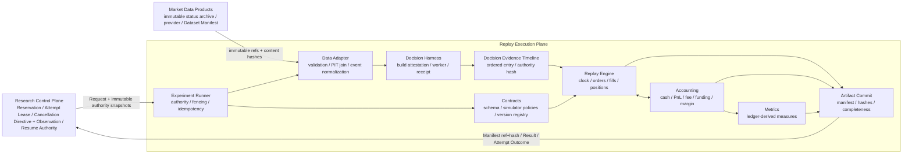

# RD Replay Execution Plane Design

## 1. 结论与边界

Replay Execution Plane 是 **冻结实验的确定性执行与历史证据生产面**，不是研究决策面，也不是实盘执行面。它只做一件事：把 Research Control Plane 已冻结的 Trial，连同不可变 Experiment Contract、Candidate Identity、Dataset Manifest 与模拟政策，执行成可复读的事件链、统一账本和 Result Artifact。

当前成熟度判断：**M2 / 5，已认证的受限纵切**。Control Plane authority、provider certification/termination、Reservation/Attempt cancellation/fencing、durable Artifact/outbox、checkpoint resume、Dataset Manifest v11、PIT supplemental/status/provenance、closed-candle/next-open、simple bracket、EventKey、average-cost Position、Cash Ledger、Equity v3、Journal v5 与 isolated Margin v7 已贯通。Request v30 / Schedule v7 可冻结 next-open market、单个 pre-entry GTC/IOC Limit 或 GTC Stop-market；GTC 可由冻结 closed-bar Cancel 终止，Stop range 触发后路径不可证明时 typed-fail 且无 Result。R4.77–R4.144 已锁定四源 pre-worker evidence 链及 Worker authority cutover。R4.128–R4.139 已推进到 Response validation 与 exact frozen Schedule boundary match，R4.140 冻结 Pair requirements，R4.141 选择 same-Attempt higher-generation，R4.142 提供 Control Plane atomic renewal producer，R4.143 贯通 exact Lease admission，R4.144 再物化 predecessor-linked successor Execution Envelope；尚无 successor Command 与第二进程。当前 first Request Frame/write/decode、Response Frame/read/validation、Schedule validation 均为 1，first/second Response=`1/0`、required=`2`、actual successor Lease/Envelope/Command/process/second Schedule/pair/Harness Receipt=`1/1/0/0/0/0/0`；DecisionOutput 只是 first-member Schedule-matched claim，successor Envelope 仅授权 fresh Command construction，Signal、Order、economic/Trial authority 均未授予。正式结果继续写入 Checkpoint v22、Result v43/Fingerprint 与 Artifact v45；真实 queue/depth partial、FOK/GTD、runtime Cancel/amend、多 pending order、Runner exact source、remote transport、停牌结算、cross/shared portfolio、tick/L2、generic matching 与 step/fast parity 仍缺，因此不升到 M3。

R4.41 已将首条 partial reduce 边界收敛为**非可执行 draft**，但不改变上述成熟度。Draft 只允许一次小于初始仓位的 fixed-quantity market reduce-only；partial Fill 必须留下 open Position，然后在无 SourceEvent 插入的同一 boundary 取消当前 stop/target，按 `abs(post-fill position)` 保留原 trigger 价重建全量双保护。首版 draft 禁止与 stop replacement 组合，允许后续 final full exit。该 schema/capability 未进入 Request v20、Schedule v4 或 certified set；Runner 必须在 Engine 前拒绝它，故当前仍不得声称 partial strategy reduction 已实现。

R4.42 已将该 seam 升为**可执行且受限认证**。Partial Reduce Intent v1 必须 opposite-side、market、reduce-only、increment-aligned fixed quantity，并严格留下 open Position；Schedule v5 只允许一次且拒绝与 stop replacement 组合。partial fee/realized PnL、剩余 unrealized PnL、事件时 Funding、Margin 和下一次 State Snapshot v3 共用同一 Position/Ledger；terminal owner 在 executable open 前发生时取消 pending partial。该能力是确定性全成 fixed quantity，不代表历史委托簿的 partial liquidity。

R4.43 不增加新 capability，而是认证 partial Fill **之后**的唯一终态所有权：重建 stop、重建 target、exact-risk liquidation、EOD 与已认证 final strategy exit 均读取同一剩余 Position/current bracket；前三类全平，EOD 仅 mark open Position 且不造 Fill。Engine Checkpoint v15 将保护 trigger/order identity、Intent/Fill、Order 与最后 OrderEvent、全局 event sequence 纳入恢复时语义校验，故重算自哈希不能把伪造 protection 恢复成权威状态。该阶段证明模型内组合闭包，不证明真实成交队列、partial liquidation 或 multiple partial。

R4.44 不改变 Simulator v8 的经济执行语义，而将既有 simple-bracket OHLCV 保守规则提升为机器可审计证据。每次 stop/target 终止均生成自哈希 Resolution Evidence v1：绑定 source EventKey、bar、active bracket、P1/P2 outcome/path digest、canonical path 与 selection policy；open gap 和单触点为 `exact_under_ohlc`，双触点为 `resolution_limited / stop_target_order_ambiguous`，canonical 取 stop path。Result v31/Fingerprint/Artifact v33 独立绑定证据集合，Runner 幂等复读重验内容。该阶段只证明 two-path simple-bracket envelope，不证明真实 intrabar path，也不开放 limit queue 或通用多订单 resolver。

R4.45 不增加 production schema/version/capability，而用 certification-only `OHLCV Oracle Fixture v1` 检验该包络。8 条有序价格轨迹覆盖 long/short open gap、single touch、collision high-first/low-first；oracle 只按 synthetic piecewise-linear observations 的已知顺序取首个 bracket crossing。实际 outcome 必须落入 P1/P2 对应 path，canonical raw terminal PnL 不得优于实际 path；同一 OHLC 的两种极值顺序产生相反 owner，却必须得到同一 `resolution_limited` envelope。分段内加密采样不改变 bar、terminal outcome 或 evidence semantics。该结论是 simple-bracket envelope soundness，不是 tick runtime、真实成交 reconstruction 或 completeness proof。

R4.46 不改变 Simulator v8 经济语义，而修复“证据只记 trigger、未证明使用哪一代保护单”的 identity 缺口。OHLCV Resolution Evidence v2 内嵌 active protection：初始 stop/target 为 generation 1；已认证的 stop replacement 或 partial resize 原子完成后为 generation 2；同时绑定剩余数量、两个 Order id/trigger 与 protection hash。Checkpoint v16 保存并按 Schedule/Timeline/OrderEvent 重验 generation；Result v32/Artifact v34/Run Outcome v29 在发布和复读时把证据与 SourceEvent、保护单生命周期及 terminal Fill 交叉核对。v2 只认证当前互斥的一次 mutation，不预先规定多次 amend/resize 的长期上限或组合语义。

R4.47 不改变 Simulator v8 canonical Fill，而为每条 admissible path 增加确定性 terminal economics。Evidence v3 使用实际 entry Fill 价、当前保护数量、冻结 cost policy 与 instrument increments，计算 path execution price、gross realized PnL、exit fee、net terminal contribution，并输出 min/max/span/canonical shortfall；Result v33 Metrics 只聚合该敏感度。scope 明示排除所有 path 共同的 entry fee、funding、既有 partial cashflow，因此不能称为完整账户 equity interval，也不赋予路径概率。Artifact v35/Run Outcome v30 在首次发布与复读时重算，canonical path price/fee 必须等于实际 terminal Fill。

R4.48 不推进 production wire epoch，而以独立经济 oracle 认证 R4.47。Certification-local `Economic Oracle Fixture v1` 冻结 zero-cost、cost-aware fine-grid、fractional-bps coarse-grid 三套 quantity/cost/increment profile；test oracle 仅用本地 BigInt 有理数实现 buy-ceil/sell-floor 滑点价、signed PnL floor、fee ceil 与精确净额，不导入 Replay accounting/decimal 原语。24 个 profile×trace case 的两条 path、ordered actual path、min/max/span/canonical shortfall 均须与 Evidence v3 一致；long/short collision 手算 golden 和轨迹加密采样 metamorphic 另行锁定。它证明当前 simple-bracket terminal contribution 算术的实现独立 parity，不证明真实成交成本、路径概率、完整 equity interval 或跨语言一致性。

R4.49 继续不推进 production wire epoch，而把 R4.48 集成经济链扩展到 Python `Decimal` 跨语言 oracle。Certification-only Request/Response v1 只经 stdin/stdout 传 canonical decimal string；Python 独立执行滑点、price tick、signed gross、fee、settlement increment 与 net，不导入 TypeScript 实现。Bun 测试通过仓库 Python resolver 调用它，要求 48 条 path 的 execution price/gross/fee/net 与 test-local BigInt、production Evidence 三方逐字符串一致，并锁定非规范 decimal 的 typed `input_invalid`。这证明当前 fixture 范围内的跨语言十进制算术 parity，不把 Python 变成 Replay backend，也不证明不同 JS runtime、平台浮点、完整 Result 或真实 venue 成本可移植。

R4.50 冻结**执行相关时间网格缺失协议**。连续且完整的相邻 bar 若下一根 open 跳价，仍是 observed price gap，按 `worse_open` 执行；若 expected interval 上整根 bar 不存在，则没有可执行价格事实，禁止 synthetic bar、forward-fill 或跨越未知区间。冻结 earliest executable bar 缺失时 Adapter 在任何 Fill 前返回 `missing_earliest_executable_bar`；持仓后的网格缺失由 Engine 在前一根已观测 bar close 完成后、任何后续 Funding/Mark/open 与 checkpoint 前返回 `open_position_grid_gap`。两者共用自校验 `ReplayDataGapFailureEvidence`，绑定精确 bounds、interval/count 与 `fail_before_unobserved_interval_effects`，Runner 以 Run Outcome v31 的 non-retryable `data_integrity` failure 发布且不产生 partial Result/Artifact。若 terminal 已发生于未来 gap 前，该 gap 未被消费，Result/source prefix/limitations 均不变；resume 不能越过 continuity fence。Simulator 推进至 v9；Request、Dataset、Result、Artifact 与 Checkpoint schema 不变。

R4.51 冻结**PIT instrument trading-status 与 halt/resume 协议**。新增 `Instrument Status Snapshot v1`，Dataset Manifest v8 以连续半开 epochs 声明 `trading/halted`，Request v22、Trial Reservation v6 与 Result v34 Fingerprint 分别绑定 `instrument_status_schedule_hash`。缺 bar 不自动等于停牌；仅当 complete schedule 证明 `[previous.close, next.open)` 全程 halted 且 `next.open` 已为 trading，Engine 才允许跨越该区间。每个 decision 与冻结 earliest executable boundary 必须处于 trading，每根提供的 bar 必须完整落在 trading epoch。halt/resume 作为 phase-`00` SourceEvent 进入 consumed prefix，delisting sequence `0` 仍先行；停牌期间 protection/order state 保持但禁止 market/strategy Fill，exact Funding/Mark 继续结算和风险观察。恢复首个真实 open 继续使用 observed-open `worse_open`；停牌中 exact maintenance breach 返回 `maintenance-margin-breach-while-halted` 与非权威 observation，不造 liquidation Fill、Result 或 Artifact。Checkpoint v17 锁定 clean/resume parity；Simulator v10、Artifact v36、Run Outcome v32 同步推进。该协议不采集交易所历史状态、不重建缺失状态、不定义停牌结算或 delisting settlement。

R4.52 冻结**instrument-status producer authority 与 completeness attestation**。`Instrument Status Provenance v1` 不是第三份状态真相，而是 Market Data Products 对 `status_epochs` 的生产证明：绑定 producer domain/id/version、source owner/kind、normalization policy、effective coverage、source-observed-through、produced-at、原始记录 count/ref/hash 与 derived schedule hash。Dataset Manifest v9 内嵌 attestation；Request v23、Trial Reservation v7、Result v35 Fingerprint 独立绑定 `instrument_status_provenance_hash`，因此替换 producer、raw source、coverage 或 normalization 即使导出相同 epochs 也属于不同证据。`complete_history` 只接受 `venue_status_event_archive` 且 coverage 必须包住 Replay window；`venue_current_snapshot` 与 `periodic_snapshot_series` 只能是 `current_snapshot_only`，连续轮询“全为 trading”不能证明采样间没有 halt。Replay 只验证不可变声明与闭包，不采集、不补全、不替 Market Data 证明外部 archive 真实穷尽；production provider、archive certification、halt/delisting settlement 均未实现。

R4.53 落地 **Market Data immutable archive → Replay status evidence** 的生产接缝，不改变 Replay wire epoch 或 Simulator 经济语义。`market-data-store` 新增 Instrument Status Archive v1：原始 transition、coverage、finality watermark、source/content/archive hash 以 `BEGIN IMMEDIATE` create-or-identical CAS 原子提交，同一 id 不允许内容漂移。`market-data.instrument-status-provider` 只读该 archive，要求首个 coverage anchor、严格递增且交替的 `trading/halted` transition、`source_observed_through >= coverage_end` 与 requested-window containment，再按 hash-bound Normalization Policy v1 生成连续半开 epochs、Provenance v1、Provider Capability v1 与 self-hashed evidence。跨域 fixture 已证明输出可直接通过 Replay Request v23 / Dataset Manifest v9；但 archive 的 finality 是 source/import assertion，不是交易所签名或第三方穷尽证明，Control Plane 对 provider capability 的 registry admission 仍未冻结。

R4.54 冻结 **Control Plane provider certification admission**。`Provider Certification v1` 是 Control Plane 单写、self-hashed、create-or-identical 的不可变快照，绑定 certifier/policy、`[certified_at, valid_until)`、provider capability/build、normalization 与允许的 source/completeness；Trial Reservation v8 只能嵌入注册且在 `issued_at` 有效的认证。Market Data Provider 必须消费认证 ref/hash 且 capability hash 与自身固定 capability 完全一致，无权自签或延期。Dataset Manifest v10 的 Provenance v2、Request v24、Reservation v8、Result v36 Fingerprint 与 Runner 必须指向同一 certification/capability；任一自报、替换、未知或过期认证均在 Engine 前拒绝。该收据证明的是 Control Plane 对仓库内实现能力的准入，不证明 venue archive 外部真实、完整、签名或 finality。

R4.55 补齐 **Market Data imported archive 的仓库内来源闭包**，不改变 Replay wire、Simulator 或经济语义。Instrument Status Archive v2 必须内嵌有序 Source Batch Manifest v1：每批绑定 venue/symbol、半开 coverage、source watermark、retrieval time、source ref、raw content hash/count、前批 hash；Completeness Audit v1 只认证批次序号、hash link、coverage 无 gap/overlap、linked event count 与 archive window 闭合，固定声明 `audit_scope=batch_window_continuity`、`external_completeness=not_verified`。修订不覆盖旧行，而以同 venue/symbol/window、单后继 `supersedes_archive_hash + correction_reason` 追加；冻结 Trial 继续复现旧 hash，Control Plane 是否为新 Trial 选择修订版尚未制度化。Provider v3 / Evidence v3 将 archive/audit/batch-chain/supersession hash 带到跨域证据，能力/build hash 因 Archive v2 输入升级而变化，须重新获得 Control Plane certification。该闭包仍不证明交易所签名、collector 未漏采、源系统历史穷尽或外部事实真实性。

R4.56 冻结 **instrument-status acquisition receipt 与 capability fence**。Market Data Store 以 Acquisition Receipt v1 保存 request identity、source capability、transport、ordered Attempt、HTTP status、failure class/retryable、exact response BLOB ref/hash/bytes/count 与 terminal status；同 acquisition id 仅 create-or-identical，失败收据也持久化。Source Batch v2 / Archive v3 必须引用已落库 receipt id/hash，提交时再次核对 venue/symbol/window/watermark/raw hash/count 和成功 payload；只有 `historical_event_archive + offline_import` 可进入 batch，`current_snapshot_only` 永远不可晋升为 `complete_history`。新增 Binance USDⓈ-M read-only collector 调用官方 [Exchange Information](https://developers.binance.com/docs/derivatives/usds-margined-futures/market-data/rest-api/Exchange-Information)，保存 429/5xx/invalid body 与重试链，但只出具当前 snapshot；官方 [Contract Info Stream](https://developers.binance.com/docs/derivatives/usds-margined-futures/websocket-market-streams/Contract-Info-Stream) 是后续 prospective collection 候选，不被本阶段解释为历史回填。Provider v4 / Evidence v4 因 Archive v3 输入升级而需重新认证；Replay wire、Simulator、Checkpoint 与经济语义不变。Receipt 固定 `external_authenticity=not_verified`，证明本地采集过程和字节闭包，不证明 TLS 对端签名留存、venue 未遗漏、断线期间无事件或历史穷尽。

R4.57 冻结 **Provider Certification rotation/revocation lifecycle**。Certification v1 仍不可变；Control Plane 另写 self-hashed、create-or-identical 的 Termination v1，每份认证至多一个终止事实。`recorded_at <= effective_at` 禁止追溯撤销；`revoked` 不带 successor，`superseded` 必须引用预先注册、同一 `producer_id` 且在 cutover 可准入的新认证。有效准入窗变为 `[certified_at, min(valid_until, termination.effective_at))`，但只作用于 cutover 起签发的新 Reservation；此前已签发的 Reservation、后续 claim/Attempt、Result/Artifact 不被重写。Control Plane 不自动选择 latest，调用者仍提交精确 certification hash；Replay wire、Fingerprint、Simulator、Checkpoint 与经济语义不变，Replay 不读取 lifecycle registry。

R4.58 冻结 **Reservation/Attempt emergency cancellation authority**。Reservation Cancellation v1 是 non-retroactive、self-hashed、append-only 收据，绑定完整 Reservation hash 与 Trial/run，只在 `effective_at` 起永久阻止新的 Attempt claim；同一 active claim 的幂等重送不被误杀。Attempt Cancellation v1 独立绑定 Trial/run/request/reservation、Attempt/worker/ordinal 与精确 `target_lease_generation`，收据与 Attempt terminal `cancelled` 原子提交；stale generation、terminal Attempt、竞争取消均拒绝。若事故需要“停止当前运行且禁止 retry”，协调者必须显式写两份收据。Runner 继续通过既有 source-boundary execution-control callback 接收 `cancel`，不发布 partial Result/Artifact；Control Plane 终态会拒绝旧 lease 的 renew/finalize/new checkpoint。当前尚无 production coordinator 将 DB cancellation 实时投递给跨进程 worker，因此只能声称 authority/storage fence 已认证，不能声称即时抢占或有界停止延迟。Replay wire、Fingerprint、Simulator 与经济语义不变。

R4.59 冻结 **Attempt Cancellation observation/acknowledgement seam**。Control Plane 提供只读 SQLite reference directive：只有 cancellation 与调用方携带的 exact、未过期 lease 在 Trial/run/request/reservation、Attempt/worker/ordinal/generation 全部一致时才返回 `cancel + original receipt`；不续租、不伪造新 generation。Runner 在完整 source-event boundary 校验 receipt self-hash、`recorded_at <= observed_at`、active lease hash 与所有 binding，以 Run Outcome v35 返回 self-hashed Observation v1；Control Plane 再以 create-or-identical append-only registry 确认，保存首次 `registered_at` 并强制 `observed_at <= registered_at`，禁止竞争 ack 或 terminal Attempt 漂移。Observation 证明某 worker 已合作观察并返回 cancelled outcome，不证明发送时刻、进程强制抢占或有界 stop latency；取消已先终止 Attempt，故随后落地的本地 diagnostic checkpoint 仍无 Receipt/Resume authority。Result/Artifact/Fingerprint/Simulator/经济语义不变。

R4.60 落地 **transport-neutral cancellation coordinator reference path**。Experiment Runner 新增 Coordination Result v1 与注入式 port：每个完整 source boundary 先以当前 lease 调 `poll`，无取消时才委托既有 renewal/control callback；收到 exact directive 后沿 R4.59 生成 Observation，Run Outcome 返回后再调 `acknowledge`。ack 失败抛出保留完整 cancelled outcome 的 typed coordinator error，调用方可重试 immutable observation，不能把失败伪装为已登记。Control Plane 提供结构兼容的 SQLite adapter 与只读 latency projection，分别计算 authority→observation、observation→registration、authority→registration；测量值不等于 SLA。authority cancel 已使 Attempt terminal，因此 Runner 不再发布其 resumable checkpoint/diagnostic commit，并删除 attempt-local diagnostic 文件；普通 cooperative cancel 的 checkpoint/resume 语义不变。该 port 不固定 push、poll、lease-renew response、IPC 或网络协议，也不实现强制抢占、进程 watchdog 或通用空目录 GC。Replay Result/Artifact/Fingerprint/Simulator/经济语义不变。

R4.61 冻结 **cancellation acknowledgement no-replay retry seam**。`acknowledgeReplayCancellationOutcome` 只接受 R4.59 的 authority-cancelled Run Outcome 与其 self-hashed Observation，保留原 boundary poll count，以新的 registration attempt 重调同一 injected port；该路径不再 poll、不进入 Engine、不生成第二 Observation。ack typed error 除完整 outcome 外保存 attempted `registered_at` 与原始 cause；重试成功仍返回 Coordination Result v1。SQLite adapter 对同一 Observation create-or-identical，首次成功 `registered_at` 与 latency projection 不因重复 ack 改写，竞争 Observation 继续拒绝。该 seam 只解决调用栈仍持有 outcome 时的进程内恢复，不是 durable outbox、进程崩溃恢复、跨进程投递或停止 SLA；Replay Result/Artifact/Fingerprint/Simulator/经济语义不变。

R4.62 落地 **Runner-owned local durable cancellation outbox**。Durable coordinator 在 authority-cancelled Run Outcome 返回后、调用 Control Plane `acknowledge` 前，先向 certified Attempt-local Artifact Store immutable-CAS 固定名 Outbox Record v1；记录 self-hash 并绑定 request hash、run、Attempt/lease generation、boundary poll count、完整 Run Outcome 与首次 `persisted_at`。落盘失败抛 typed persistence error，严格禁止 ack；ack 失败携带 Outbox Commit。进程重启后 `recoverReplayCancellationAcknowledgement` 只 load、重验 byte/content hash 与 Outcome/Observation authority，再重投 ack，不 poll、不进入 Engine。相同 record first-write-wins，竞争内容/tamper 拒绝；成功 ack 后记录不删除，使 outbox commit 之后的崩溃只会触发 Control Plane create-or-identical redelivery。Durable Coordination Result v1 与 Outbox Commit 只是 operational evidence，不进入 Result/Artifact Manifest/Fingerprint，也不取得 Checkpoint Receipt/Resume authority。Observation 生成至 outbox commit 之间仍存在进程指令级窗口，不能声称与 Engine terminal transition 原子；当前只认证 local filesystem store，retention/GC、remote outbox/store、网络 transport、SLA 与 watchdog未决。

R4.63 冻结 **pre-terminal cancellation outbox handoff**，不改变 R4.62 schema。Runner 抽取唯一 canonical authority-cancellation outcome constructor；durable coordinator 在 source-boundary poll 得到 directive 后，先按 current lease/time/binding 验证并构造 Observation + terminal outcome，再 immutable-CAS outbox，成功后才把 `cancel` 返回 Engine。Runner 终态必须与预提交 bytes canonical-equal；因此 outbox commit 后、Engine 抛出 interrupted 或调用栈返回前崩溃，重启可直接 load/ack，不需要重跑 Engine。持久化异常被捕获但不阻止 authority cancel，终态后抛 typed persistence error 并禁止 ack；无效或过期 directive 不得写 operational record。测试以 persist 时 diagnostic checkpoint 尚存在、终态 cleanup 后仅保留 outbox 锁定真实顺序，并继续锁定 restart no-poll/no-replay。该协议只将 durable point 前移到 terminal transition 之前；`poll` 从 Control Plane 返回到 local filesystem commit 不是跨存储事务，仍不能宣称 exactly-once、强制抢占或 stop SLA。Result/Artifact/Fingerprint/Simulator/经济语义不变。

R4.64 冻结 **recovery-first durable coordinator admission**，继续复用 Outbox/Coordination v1。Durable invocation 在 Runner admission、authority poll 与 Engine 前必须先 `load`；pending record 存在时直接走同一 no-replay acknowledgement helper。Coordinator 额外交叉校验 record/outcome/commit 与本次 rehydrated Request hash/run、Trial Reservation ref/hash、Attempt id/ordinal/worker、完整 lease snapshot hash/generation、producer 与 Observation hash；任何跨 invocation 漂移或 tamper 都 fail-before-poll。测试故意传入已过 lease 时间、`cancel_requested=true` 与空 bars，仍只完成 ack；cross-run record 与 hash tamper 均保持 poll/ack 为零。显式 recovery helper 保留为底层 seam，但正常重启不再依赖调用方先记得调用它。该协议不提供 Attempt namespace discovery，也不从 outbox 重建 Request/Reservation/lease；caller 必须 rehydrate exact frozen invocation，recovery index 的 owner/存储/生命周期尚未决定。Result/Artifact/Fingerprint/Simulator/经济语义不变。

R4.65 冻结 **Attempt-monotonic lease cancellation outbox**，不升级 Outbox schema。Attempt namespace 不应被初始 generation 固死：constructor lease 只充当 Trial/run/request/reservation、Attempt id/ordinal/worker 的 identity fence 与 generation floor；persist 必须再携带当下完整 lease snapshot，并要求 prepared outcome 的 `attempt_lease_hash`、Outcome/Observation/Commit generation 与其全等。真实 coordinator fixture 在首个 source boundary 将 generation `2→3`，第二 boundary 才接收 generation 3 cancellation；同一 namespace pre-terminal commit/ack 成功。重启只有 exact generation 3 invocation 可 recovery-first，generation 2、generation rollback、worker 或 Attempt 漂移均 fail-before-poll/ack。这样普通 renewal 不再破坏 R4.63/R4.64 durability，但 outbox 仍不含可独立重建 lease 的完整 invocation bundle；namespace discovery/rehydration 继续未决。Result/Artifact/Fingerprint/Simulator/经济语义不变。

R4.66 冻结 **local outbox discovery 与 cancellation-generation lease rehydration**。Outbox Record v2 保存 exact current lease snapshot 与 logical idempotency-key hash；Local Artifact Store 以 canonical hash-prefix 两级目录做确定性只读枚举，先验证全部 namespace/record 的 regular-file、canonical bytes、self-hash、lease/outcome/Observation hash 与 derived location，再触发任何投递。Control Plane 不读取 outbox，只通过 recovery inspection 裁决 exact Observation 为 `pending` 或 `already_registered`；前者 no-poll/no-Engine ack，后者不重复投递。legacy v1 只保留显式 bound recovery，不做启发式 discovery/migration；symlink、misplaced record、authority drift 均 fail-before-delivery。该纵切只认证 local filesystem discovery，不定义 remote list/index、quarantine、retention/GC、跨存储事务或 startup/stop SLA；Result/Artifact/Fingerprint/Simulator/经济语义不变。

R4.67 落地 **Control Plane-owned cancellation startup recovery job**。`research-control-plane/replay-recovery` 是跨 Plane 原子协调组件：只接受 existing authority DB、existing certified local Artifact Store root 与 UTC registration time，先验证 authority schema，再调用 Runner discovery 和 SQLite recovery inspection/ack；错误 DB 不自动初始化，且不 claim Attempt、不运行 Engine。Agent-facing 入口为 `research.replay-cancellation-recovery`，部署层须在同一 worker pool fresh admission 前调用。Discovery Recovery Result 升至 v2，删除机器相关 namespace/outbox ref，只返回 portable namespace identity、record、Observation hash 与 Attempt generation；job output 不泄漏 DB/artifact path。它不是 J04 research loop、daemon、cron、remote transport、GC/quarantine 或 SLA policy；Replay Result/Artifact/Fingerprint/Simulator/经济语义不变。

R4.68 冻结 **Control Plane recovery-before-claim admission gate**。仓库审计确认 canonical/compatibility Runner 都只消费现成 Lease，`claimReplayAttempt` 此前没有 production CLI；因此不把 DB/recovery 塞进 Replay Plane，也不虚构 worker supervisor。`research.replay-attempt-admission` 在同一 existing authority DB session 内先完成 R4.67 全量 recovery，再调用既有 claim authority；`recovered_at <= claimed_at`，malformed/tampered discovery、authority conflict 或时间倒置均 zero-claim，返回 Lease 再交叉核对 Attempt/worker、Trial/run、Reservation/hash、Request 与 claim/expiry。standalone recovery 仍不 claim；valid Observation recovery 不因后续 claim validation 失败回滚，因此这是 ordered fail-closed gate，不是 filesystem/SQLite distributed transaction。调用方仍须确保 artifact root 属于同一已停止 worker pool；process supervisor/pool identity、remote store、startup SLA 尚未设计。J04、Result/Artifact/Fingerprint/Simulator/经济语义不变。

R4.69 冻结 **Pending Order Resolution v1 pre-integration primitive**。不修改既有 `ReplayOrder`、Request/Checkpoint/Result/Artifact epoch，也不声称 Runner 已支持 Limit。新合同只解析一个已激活 `limit` GTC/IOC 或 `stop_market` GTC、一个 `bar_open|bar_range` observation 与可选 Cancel EventKey。Limit 只有显式 `ohlcv-cross-through-full-fill-bounded-v1` 且 quantity 不超过 capacity 才可给出 full-fill reference：open marketable 取不劣于 limit 的 observed open，range 必须 strict-cross 才取 limit；两者因 queue 不可见仍 `resolution_limited`，exact touch 为 no-fill limited，未触达才 `exact_under_ohlc`。Stop gap 取 open、range trigger 取 trigger reference；这里只是执行参考，不是含 fee/slippage/impact 的 Fill。Cancel 严格早于 observation 胜、严格晚于 modelled fill 败、晚于确定 non-fill 胜；same ordinal 与 touch-before-cancel 返回 `unresolved`，禁止 stable id 猜序。golden hash、IOC、long/short mirror、capacity/activation/price-bound 与 rehash tamper 已锁定。FOK/GTD、amend、真实 queue/partial、多订单 allocation、Runner/Artifact 集成仍未完成；Simulator v10 与经济语义不变。

R4.70 将该 primitive 收敛为首条 **pre-entry GTC Limit 可执行纵切**。Request v25 以 tagged `entry_execution` 冻结 market 或 `limit + gtc + limit_price + liquidity_model + full_fill_capacity`；Limit 在 signal boundary 提交/激活，但最早只消费 next-open。每个 `bar_open|bar_range` 都生成有序 Pending Resolution：open marketable 或 range strict-cross 才按 bounded-full-fill 进入 Fill，exact touch 继续 resting；adverse slippage 必须被 limit price 截断，保护单只能在 Fill EventKey 之后激活，禁止回看同一已消费 OHLC boundary。Checkpoint v18 保存 active entry、解析前缀和 nullable entry transition，resume 与 clean Result 哈希一致。Result v37/Fingerprint/Artifact v39 独立绑定 `pending_order_resolutions`；成功链必须以 full Fill 结束，EOD 未成交返回 non-retryable `limit-entry-unfilled-at-end-of-data` 且不发布 Result。Simulator v11 的该 Fill 永远携带 `ohlcv-limit-queue-unobserved / resolution_limited`；capacity 是冻结模型上限，不是历史成交量或 maker queue 证明。IOC/Stop pending integration、Cancel OrderEvent、真实 partial/depth、多订单竞争仍未开放。

R4.71 消除 R4.70 的 **capacity 裸自报**。Dataset Manifest v11 可携带 self-hashed `Liquidity Capacity Attestation v1`：绑定 symbol/base-asset quantity unit、静态全成上限、校准窗口、`observed_through <= available_at <= signal_time`、source ref/hash、opaque derivation policy id/version/hash，并固定 `not_event_depth_or_queue_position_proof`。Request v26 的 Limit lane 同时冻结 capacity 与 attestation hash；Trial Reservation v9 独立冻结该 hash，Market lane 固定为 `null`。Adapter 在 Engine 前拒绝缺失、未来可见、标的/容量/哈希漂移；Result v38 Fingerprint、Dataset manifest hash 与 Artifact v40 的 `liquidity-capacity-attestation.json` 形成复读闭包。Checkpoint v18 不复制新对象，而由 Request hash + Dataset manifest hash 间接冻结；恢复仍必须生成同一 Result hash。该证据不定义 ADV/volume/depth 算法、不校验外部数据真实性，也不降低所有 OHLCV Limit Fill 的 `resolution_limited` 等级。

R4.72 纠正 R4.70 的 **未成交即 Engine failure 临时策略**。GTC Limit 消费完全部 admissible SourceEvent 后仍无 Fill，是正常市场结果，不是模拟器故障。Source Reducer 以 nullable entry/terminal transition 返回 `end_of_data`；Result v39 新增 `entry_outcome=filled|unfilled_at_data_end`。后者保持 entry Order `active`，保留 submit/activate 与全量 resting resolution，不合成 cancel/expire；`fills/positions/margin_snapshots/liquidation` 为空，Ledger 仅 initial/ending cash，Equity v2 以 `never_opened` 和 nullable `position_event_id` 表达零仓位，Journal v5 不预留 collateral，Metrics 为零交易/零 PnL，并正常提交 Artifact v41。Simulator v12 改变的是终态证据分类，不放宽 Fill 条件。clean/resume Result hash、Artifact 幂等复读、Result tamper、空账本/空保证金均已锁定。持单遇 delisting 仍 typed-fail；IOC/Cancel/expire 的 OrderEvent 与终态 authority 尚未开放。

R4.73 冻结 **IOC 首个 next-open 到期纵切与订单终态分型**。Request v27 允许 pre-entry `limit+ioc`，但其生命周期只有一个 observation：`earliest_executable_time` 的 `bar_open`。若 open marketable，则在 attested capacity 内全成，仍因历史 queue/depth 不可见标 `ohlcv-limit-queue-unobserved / resolution_limited`；若不 marketable，Pending Order Resolution v2 返回 `expired / ioc_unfilled_at_first_open`，Engine 在 decisive SourceEvent 之后生成独立 `expired` OrderEvent，立即以 `entry_outcome=expired_unfilled` 完成 Result v40，Equity v3 用该 open 作为零仓位 valuation source，Artifact v42 可幂等复读。后续同 bar strict-cross、后续 bar、Funding entitlement、Fill/Position/Margin 均不得出现。`active_at_data_end` 仍只属于 GTC；`cancelled` 只属于显式外部/用户 cancel authority，不能用来代替 TIF expiry。Checkpoint v19 允许 expiry 前的 active IOC 恢复，但 terminal expiry 不作为可恢复中间态。此映射参考 Binance 官方 [USDⓈ-M Common Definitions](https://developers.binance.com/zh-CN/docs/products/derivatives-trading-usds-futures/common-definition) 的 IOC/EXPIRED 词义；仓库内版本化合同才是 Replay 权威，不宣称重建交易所 queue。主动 Cancel、IOC partial remainder、FOK/GTD、stop pending 和 multi-order allocation 仍未开放。

R4.74 冻结 **Experiment Contract-owned pre-entry GTC Limit Cancel 纵切**。Request v28 可内嵌 self-hashed `ReplayEntryCancelIntent v1`，authority 固定为不可变 Experiment Contract，target 固定为 entry/limit/gtc，`requested_at=signal_time`，`effective_at` 必须晚于 earliest executable，boundary 固定 `after_bar_range`。指定 close 的 SourceEvent phase `20` 先解析价格，Cancel phase `90` 后生效：strict-cross Fill 胜；确定未触达时生成 `cancelled` OrderEvent、`entry_outcome=cancelled_unfilled`、bar-close valuation 与零成交账本；exact touch 因 queue 不可见返回 `limit_touch_before_cancel_unresolved` typed failure，缺指定 close 返回 `missing-entry-cancel-boundary` data-integrity failure，二者均无 Result/Artifact。Checkpoint v20、Result v41、Artifact v43 与 Simulator v14 绑定 intent/resolution/EventKey；clean/resume 与幂等复读已锁定。本纵切不是运行中 agent/user cancel、Attempt execution cancellation、IOC Cancel、amend/cancel-replace、Stop pending 或多订单取消。

R4.75 冻结 **scheduled pending-entry Cancel decision evidence**。Request v29 保留 R4.74 fixed-intent compatibility，并允许 Decision Schedule v6 可选增加一条 `authorized_entry_cancel`，逐字段及哈希绑定同一 `ReplayEntryCancelIntent v1`，decision time 必须等于 effective close。Harness Context v7 新增 `pending_entry`：只消费该边界的 PIT closed-bar Market Snapshot，Position State Snapshot 必须为 null；Engine 在 range 已可见后执行双进程 parity，再把同一 intent 交给既有 phase-`20` price / phase-`90` Cancel resolver。若 entry 更早 Fill，Timeline v9 以 entry Fill EventKey 标记 Cancel `not_reached_terminal`，Harness 不运行；若同 close strict-cross，Harness 已验证但 Fill 仍先于 Cancel。Checkpoint v21、Result v42、Artifact v44 与 Simulator v15 绑定 schedule/timeline/receipt。该能力仍是冻结 Experiment Contract 的确定性分支，不是 agent 在运行中扩大动作空间；IOC Cancel、Stop pending、amend/cancel-replace、多订单取消仍未开放。

R4.76 冻结 **pre-entry GTC Stop-market 可执行纵切**。Request v30 新增 `stop_market + trigger_price + last_trade_ohlcv + gtc + bounded-full-fill capacity attestation`；trigger 必须严格位于该方向保护 stop/target 之间。Order 在 signal boundary 提交/激活，next-open 起逐 open/range 解析：open 已越过 trigger 以 observed open 为 reference，range 触发以 trigger 为 reference，实际 Fill 再施加方向不利 slippage；权威 OrderEvent 顺序为 submitted → activated → triggered → filled，保护单只能在 Fill 后 phase `90` 激活。`ReplayEntryCancelIntent v1` 继续只表示 Limit compatibility；v2 只表示 Stop-market，fixed/scheduled `pending_entry` 路径共享同一 phase-`20` trigger/fill → phase-`90` Cancel 顺序，same-close trigger 胜、确定未触发 Cancel 胜。若 range 触发 bar 同时触达保护价，`Stop Entry Same-bar Path Ambiguity v1` 绑定 source/bar/trigger/保护触点与 hash，因无法证明触发后路径而 deterministic-engine fail，无 Result/Artifact；禁止静默推迟到下一 bar。Checkpoint v22、Timeline v10、Result v43、Artifact v45 与 Simulator v16 绑定 trigger/resolution/Cancel/恢复闭包；long/short、gap/range、EOD active、clean/resume、Runner Artifact 与 typed failure 已锁定。真实 trigger feed、queue/depth partial、运行时 Cancel、多 pending order 与 fast parity 仍未开放。

R4.77 冻结 **aggregate-trade exact-trigger pre-integration seam**，不推进 production wire epoch。`Aggregate Trade Event v1` 规范 symbol、aggregate/underlying trade id、trade/availability time、price/quantity 与 maker side；`Aggregate Trade Coverage Attestation v1` 以半开 window、连续 aggregate id、首尾/count、source/events hash 和 `external_completeness=not_verified` 约束输入。`Exact Trade Stop Resolution v1` 只按有序 price observation 选择 entry trigger 严格后继的第一条 stop/target crossing；同 timestamp 以 aggregate id 排序，entry 所在聚合事件不得触发尚未激活的保护。golden 证明相同 OHLC 可由不同顺序分别得到 target-first/stop-first，long/short reflection 与 rehash tamper 已锁定。该 primitive 的 scope 固定为 `price-trigger-order-only`，不产生 Fill/Ledger/Result/Artifact，不证明 queue/slippage/impact，也不把 insurance/ADL 缺失或 source archive 自报升级成外部完整性。Binance 官方 [Compressed/Aggregate Trades List](https://developers.binance.com/en/docs/catalog/core-trading-derivatives-trading-usd-s-m-futures/api/rest-api/market-data#compressed-aggregate-trades-list) 声明同价同 taking side 的 100ms 聚合、REST 历史不超过 24 小时、单时间窗小于 1 小时，并排除 insurance fund/ADL trades；仓库现有 recent fetcher 因此不能直接成为 Replay complete-history authority。Request v30、Result v43、Artifact v45、Checkpoint v22 与 Simulator v16 均不变。

R4.78 落地 **aggregate-trade Market Data archive/provider authority seam**，仍不推进 production wire epoch。`market-data-store` 的 Source Receipt v1 仅接受显式 `historical_aggregate_trade_archive + offline_import`，保存 Binance USD-M 原始 JSON exact bytes/hash/count；Normalization v1 将 `a/p/q/f/l/T/m` 确定性映射为内部事件，availability 固定为 trade-time 毫秒分辨率并显式标注 resolution-limited。Completeness Audit v1 只证明单 symbol、aggregate id 连续、trade time 非递减、事件属于半开 window 与 source/event hash closure，固定 `external_completeness=not_verified`；Archive v1 以 create-or-identical SQLite CAS 保存 receipt/audit/events/archive hash，读取时复算原始字节规范化。`market-data.aggregate-trade-provider` 只读 archive，要求 Control Plane certification ref/hash 精确绑定 Provider Capability v1，按 requested half-open window 输出 R4.77 Event/Attestation 与 self-hashed Evidence v1；跨域 fixture 已通过 Replay authoritative contract。该 seam 仍不证明 collector/外部 archive 无漏项、transport authenticity、insurance/ADL、真实 dissemination latency、mark/funding/status/bar 跨源顺序，也不产生 Fill/Ledger/Result/Artifact；Runner exact-source admission、Request/Result/Artifact/Checkpoint/Simulator 版本均不变。

R4.79 冻结 **Control Plane aggregate-trade provider certification 与 Trial-sidecar admission**，仍不修改 Replay production wire。Aggregate Trade Provider Certification v1 绑定实际 capability/build/provider-policy hash、Archive v1 输入和 Replay Event/Attestation v1 输出，并把允许的 source/completeness 固定为 `venue_aggregate_trade_archive + not_verified`；它不复用语义不兼容的 Instrument Status Certification。Termination v1 以 append-only、non-retroactive revoke/supersede 只影响 cutover 后的新 admission。Evidence Admission v1 只能在 Trial 仍 reserved、既有 Reservation v9 半开有效窗内、provider certification 有效时由 Control Plane 单写；每个 Reservation hash 至多一个 create-or-identical sidecar，绑定 archive/source-receipt/audit/evidence/coverage-attestation hash，scope 恒为 `pre_integration_exact_price_path_only`。后续 termination 不回写历史 admission；Admission 不是 Request、Attempt、Fill 或 Result authority，Runner 无读取入口，Request v30、Reservation v9、Result v43、Artifact v45、Checkpoint v22 与 Simulator v16 均不变。

R4.80 冻结 **pre-integration cross-source EventKey 与 Ordering Attestation**，仍不接 production SourceEvent。Cross-source Envelope v1 同时保存 `effective_time` 与 `availability_at`，不得用归档观察时间改写市场生效时间，也不得让未来可见事实提前进入策略视图。EventKey Policy v1 的确定性键为 `(effective_time, semantic_phase, source_rank, native_sequence, stable_event_id)`：Instrument Status=`00/0`、Funding=`10/10`、Aggregate Trade=`20/20`、OHLCV=`20/30`；各源 native order 先独立验证，source rank 只解决可复现排序，绝不声明 venue 真实先后。不同源同一有效时间且没有 venue-global sequence 时，Ordering Attestation v1 必须列出 ambiguity group，状态固定为 `resolution_limited`，并保留 Aggregate Trade 外部完整性、Funding 外部完整性、bar/trade source-link、status effective/availability 等 limitation。其 scope 固定为 `pre_integration_ordering_evidence_only`，economic admission 固定为 forbidden；Request/Reservation/Runner/Result/Artifact/Checkpoint/Simulator 与既有 `ReplayEventKey` 均未升级。

R4.81 冻结 **Control Plane Reservation-bound Cross-source Ordering Admission**，仍不形成 production execution authority。Control Plane 必须读取并重验实际 R4.80 Attestation，不能接受调用方自报的 resolution/source hash；签发要求同一 Trial 仍 `reserved`、Reservation v9 有效、既有 Aggregate Trade Evidence Admission ref/hash 匹配、provider certification 在新签发时点未终止。Attestation 必须包含 canonical 四源集合，window 与 aggregate coverage 完全相同，aggregate collection hash 与 coverage events hash 相等；status/funding/aggregate/OHLCV collection、ordered events、ambiguity、limitations hash 从 Attestation 派生，Dataset ref/hash 与 status schedule/provenance 从 Reservation bindings 继承。每个 Reservation/aggregate admission 只能 create-or-identical 一份 immutable Admission v1；scope=`pre_integration_cross_source_ordering_only`、economic authority=`none`、external completeness=`not_verified`。该 receipt 不升级 Reservation v9、Request v30、Result v43、Artifact v45、Checkpoint v22 或 Simulator v16，Runner 没有读取入口。

R4.82 冻结 **Admission-bound SourceEvent Projection Attestation v1**，先证明证据投影可逆，不伪装成 production SourceEvent。Data Adapter 必须同时验证实际 R4.81 Admission 与 R4.80 Ordering Attestation，并逐项匹配 Trial/run、Reservation、Dataset、四源 collection、ordered events、ambiguity、resolution 与 limitation hash；随后对每个 ordered envelope 一对一投影并保留 `source_kind/projected_kind`、symbol、native sequence/id、`effective_time`、`availability_at`、payload hash、source-envelope hash 与完整 cross-source ordering key。Funding 只做词汇映射为 `funding`，Aggregate Trade 保留独立 kind；不得把 source rank 塞进既有 `ReplayEventKey.event_subphase`，因为现有键先比较 `source_sequence`，该做法不能保持 R4.80 总序。Projection Attestation 自哈希并绑定 Admission/Attestation/Reservation/Dataset；即使 declared timestamp exact，也固定 `economic_authority=none`、`payload_materialization=hash_only`、`production_source_event_compatibility=not_asserted`。现有 `ReplaySourceEvent`、Request、Runner、Engine、Result、Artifact、Checkpoint 与 Simulator 均不修改；production wire epoch、payload materialization、Aggregate Trade consumer 和 ambiguity execution gate 仍待设计。

R4.83 冻结 **candidate SourceEvent Wire v2 合同**，并决定采用 parallel epoch。Legacy SourceEvent 已被 Result v43、Artifact `source-events.json`、Checkpoint source prefix 与 resume 引用，原地加 provenance 或改 EventKey 会重写既有证据身份；Wire v2 因此独立使用 `trade.rd-replay-source-event-wire.v2` 与 R4.80 cross-source key。每个 event 内嵌 canonical typed payload：Instrument Status Snapshot、Funding Event、Aggregate Trade Event、bar-open observation 或完整 closed bar；validator 从 wire 字段重建原 Cross-source Envelope，要求 payload/envelope/event id hash、effective/availability、source kind、semantic kind、native sequence 与 key 完全一致。Manifest v1 绑定 Projection schema/policy/id/hash、Admission、Ordering Attestation、Reservation、Dataset、window、resolution/ambiguity/limitations、ordered envelope/events/payload hashes，并机器固定 `parallel_epoch + legacy preserved unchanged + legacy parity not certified + runner not bound + economic authority none`。同刻 Aggregate Trade sequence=7、OHLCV sequence=0 的 fixture 证明：新键以 source rank 排序为 trade→bar，若 rank 塞进旧 subphase 则旧键先比较 sequence 而反转为 bar→trade。R4.83 当时仅冻结 schema/validator；R4.84 承接 materializer 与受限 parity，但 Engine consumer、Request/Reservation epoch 或 Result/Artifact v2 仍未开始。

R4.84 实现 **Projection-bound Wire v2 materializer 与 legacy shared-schedule parity**。Materializer 不信任调用方给出的 payload→projection 配对：它先用 Instrument Status、Funding、Aggregate Trade、OHLCV 原始 typed collections 重建完整 R4.80 Ordering Attestation，并要求与 Admission/Projection 绑定的 attestation canonical hash 全等；随后按 native id 逐项内联 payload，复核 Projection payload hash、source-envelope hash、事件基数与 ordered envelope hash。缺失、额外、篡改或重排均在产出 Manifest 前失败。独立 `Legacy Shared Event Schedule Parity Attestation v1` 再把真实 legacy Engine builder 输出与 Wire v2 按 `kind + effective_time + status snapshot id` 一对一匹配，只认证 Instrument Status、Funding、bar-open/bar-range 的调度 correspondence。Aggregate Trade 固定 Wire-only；legacy payload 在 SourceEvent 外置、旧键结构不兼容且跨源同刻顺序无共同证明，因此 payload parity、EventKey parity 与 cross-source order parity 均机器标记 `not_asserted`。Manifest 仍保持 R4.83 的 `legacy_semantic_parity=not_certified`，因为该字段代表更强的全语义迁移门；Request、Reservation、Runner、Engine、Result、Artifact、Checkpoint 与 Simulator 均未切换 epoch。

R4.85 冻结 **Wire pre-execution gate 与非经济 candidate reducer**。Gate 同时绑定 Wire Manifest、Ordering Attestation、ambiguity/limitation hash，并把 capability 分成两类：`non_economic_schedule_trace` 可放行，因为只复读已声明全序且不产生经济副作用；`economic_exact_trigger` 一律拒绝——`resolution_limited` 输入以 `cross_source_ordering_is_resolution_limited` 拒绝，无碰撞输入也以 `economic_wire_consumer_is_not_certified` 拒绝，避免把 declared timestamp exact 误写成 venue/execution exact。Candidate reducer 只接受已放行的 trace gate，逐事件输出 payload hash、cross-source key、ambiguity-group hash 与 `declared_timestamp_unique|deterministic_tie_break_only`，并折叠四源 observation count/last-id；`execution_effect=none`、全局 `execution_effects=forbidden`。它与 Simulator/reference Engine 隔离，不能创建 Order、Fill、Position、Ledger、Metrics、Checkpoint、Result 或 Artifact，也不构成 Control Plane Admission。

R4.86 冻结 **availability-aware 双时钟 candidate cursor**。Candidate Trace 的 effective timeline 继续按市场生效时间与 R4.80 key 排列，Cursor 不得重写它；独立 visibility timeline 按 `(availability_at, effective_time, effective-event ordinal, wire-event id)` 推进。同一 availability 的后续字段只是确定性 cursor tie-break，不证明 venue 发布顺序。`availability_at > effective_time` 的记录固定为 `delayed_historical_fact`：在 availability 前的 cut 中不可见，到达后只增加历史事实，`retroactive_execution=forbidden`，不得回溯创建 Order、Fill、Position、Ledger 或 Metrics。Cursor 绑定 Trace/Wire/Gate/Ordering identity、effective/visibility timeline hash、lag 与四源 fold；仍为 non-economic、Runner-not-bound pre-integration evidence，不升级 Request、Result、Artifact 或 Checkpoint epoch。

R4.87 冻结 **closed-world as-of Visibility Cut**。Cut 的 inclusion rule 唯一为 `availability_at <= as_of_time`，必须复制 Cursor 的完整可见前缀并保留原 visibility ordinal，同时以全量 transition count、future transition count 与 future transition-id hash 关闭未可见后缀；少报已可见记录即使重算自身 hash 也会因 Cursor lineage 失败。Cut 可表达首事件前的空前缀，并折叠 source count/last-id、delayed-visible count、latest availability 与 max effective frontier。它固定 `payload_view=identity_lineage_only_no_payload`、`decision_authority=none`、`economic_authority=none`，只是未来 Decision Input 接线前的 PIT 完整性证据，不是 Harness Context、策略输入或 Runner capability。

R4.88 冻结 **Cut-bound PIT Payload View**。View 只允许对 Cut 已列出的 transition 按 visibility ordinal 一对一物化同一 Wire Manifest 的 canonical typed payload；每条 record 同时绑定 transition/Wire identity、source/kind、effective/availability、visibility/ambiguity evidence、payload hash 与 source-envelope hash。Cut 未包含的未来 transition 只继承 count/id hash，`future_payload_materialization=forbidden`；空 Cut 对应 canonical 空 records/payload hash。View 固定 decision/economic authority none、Harness/Runner not bound，证明的是“当时可读内容与 Wire 一致”，尚不定义特征投影、Signal、Order 或经济消费。

R4.89 冻结 **Decision Observation Projection 字段白名单**。Projection 只从 PIT Payload View 逐 ordinal 生成五类只读 observation：Instrument Status 保留 snapshot/status/effective/observed/provenance；Funding 保留 event time/rate/mark；Aggregate Trade 保留 ids/time/price/quantity/maker side；bar-open 严格只含 `open_time/open`；closed-bar 才允许完整 OHLCV 且必须 `closed=true`、`close_time=effective_time`。Validator 对每类对象执行 exact-key 校验，禁止额外字段；record 再绑定 payload-record/value/payload/source-envelope hash，语义替换即使重哈希也无法脱离 parent lineage。该对象固定 Decision Input compatibility not asserted、decision/signal/order/economic authority none、Harness/Runner not bound，不等同策略 Context。

R4.90 冻结 **Decision Schedule Observation Binding**，只关闭“哪个冻结 decision boundary 读取哪个 as-of observation prefix”的非经济时点缺口。Binding 接受外部 `Decision Schedule v7 + frozen hash`、selected sequence 与 R4.89 Projection：schedule 仅做 schema/policy、连续 sequence、严格递增时间和 hash 引用校验；selected entry 的 effect 作为 opaque label 连同 entry hash 保存，不在此复验 Request 授权。唯一时点规则为 `projection.as_of_time == selected decision_time`；对象再绑定 projection/payload-view/cut hash 并执行 exact-field/self-hash 校验。它明确 `harness_invocation=forbidden`、decision/signal/order/economic authority none、Runner not bound；因此不是 Decision Input/Context、不是第二套 Schedule authority validator，也不产生 Timeline、Checkpoint、Result 或 Artifact。

R4.91 冻结 **Decision Schedule Observation Binding Set**，将单 boundary proof 提升为完整 Schedule 的 closed-world coverage proof，而不提升执行权限。Set 必须内嵌 `entry_count` 份 R4.90 binding，按 sequence `1..N` 严格升序、全部引用同一 frozen Schedule hash；binding id/hash 与 Projection hash 均唯一，first/last time、完整 members、binding-hash list、projection-hash list 分别哈希。Builder 不接受缺项、多项、重复、乱序或 cross-Schedule member，每个成员再重验完整 parent lineage；本地重算 Set/member hash 不能掩盖 lineage 漂移。Set 仍固定 opaque effect、Harness forbidden、decision/signal/order/economic authority none、Runner not bound，不是 Schedule authorization、Decision Timeline 或 Artifact。

R4.92 冻结 **portable Decision Observation Bundle**，关闭 R4.91 只有 Projection 引用而未携带实际只读 payload 的交付缺口。Bundle 内嵌完整 Binding Set 与等基数、同序的 R4.89 Projections；每项必须匹配 binding 的 projection id/hash、as-of time、observation count、Payload View hash 与 Cut hash，Projection identity 不得重复，并分别哈希完整 payload、id list、hash list 与 observation-values hash list。`payload_portability` 仅表示可携带审计内容，`parent_lineage_requirement=mandatory_for_authoritative_rebuild` 明确禁止脱离 Wire→Cut→View parent 自证。Bundle 仍固定 Decision Input compatibility not asserted、Harness/Artifact/Runner not bound、decision/signal/order/economic authority none，不是 Context、Timeline、Result 或正式 Artifact。

R4.93 冻结 **Control Plane Decision Observation Bundle Admission**。Control Plane 以实际对象重验 reserved Trial、Reservation v9、Request v30、已登记 Cross-source Ordering Admission、Wire v2、Request 的完整 frozen Schedule 与 R4.92 Bundle，再签发每 Reservation/request/ordering/wire/bundle identity 唯一且 create-or-identical 的不可变 sidecar。receipt 只授予 `non_economic_decision_observation_audit`，并机器固定 `parent_lineage_validation=wire_identity_and_schedule_binding_only`、`projection_derivation_compatibility=not_certified`：它证明这份 Bundle 属于哪次受治理 Trial/Request/Wire/Schedule，不证明 Projection 已由完整 Cursor→Cut→View 父链重新推导。Harness/Runner/Decision/Signal/Order/economic authority 继续为 forbidden/not-bound/none；Request、Reservation、Result、Artifact、Checkpoint 与 Simulator 均不升级。

R4.94 冻结 **Replay-owned Decision Observation Bundle Derivation Attestation**。认证器先调用 R4.92 Bundle 的完整 lineage，再逐 boundary 重放 Wire→non-economic Gate→Candidate Trace→Availability Cursor→Visibility Cut→PIT Payload View→Observation Projection→Schedule Binding；所有 boundary 必须共用同一 Wire/Gate/Trace/Cursor root，不能把两条各自有效的父链混装成一份 Bundle。Attestation 折叠 Cut/View/Projection/Binding、observations 与 future-transition hashes，只携带 hash summary，`independent_verification=external_parent_replay_required`。它证明 Replay 在给定完整 parents 上可确定性重建 Bundle，但还不是 Control Plane authority：R4.93 Admission v1 仍固定 derivation not certified，`control_plane_admission_compatibility=not_bound`，Harness/Runner/Decision/Signal/Order/economic authority 均未开放。

R4.95 冻结 **Control Plane Decision Observation Bundle Derivation Admission**。Control Plane 不修改 R4.93 receipt，也不导入 Replay Engine；它在 Trial 仍 reserved、Reservation 半开窗口仍有效时读取既有 Bundle Admission，验证 R4.94 Attestation 的 schema/self-hash，并把 Reservation、Request、Dataset、Ordering Admission、Wire、Schedule、Bundle Admission、Bundle、Binding Set 与 Attestation identity 锁成每组 identity create-or-identical 的不可变 sidecar。逐 boundary 必须与 admitted Bundle 的 Cut/View/Projection/Binding、observation/future hashes 一致。receipt 明示 `control_plane_validation=attestation_schema_hash_and_admitted_bundle_binding`、`control_plane_parent_replay=not_performed`、`independent_verification=external_parent_replay_required`；因此它接纳 Replay 证据但不冒充第二个 derivation certifier，也不授予 Harness/Runner/Decision/Signal/Order/economic authority。

R4.96 冻结 **Decision Observation Harness Context Binding**。Data Adapter 同时重验 Request v30、R4.95 Derivation Admission 与 portable Bundle，要求 Request/Reservation/Dataset/Schedule/Bundle identities 全等；随后为每个 frozen Schedule entry 以既有 `createReplayDecisionHarnessContext(Request, entry)` 生成 Context v7，并与同 sequence 的 Binding、Projection、Cut、PIT View、observation hashes 一对一绑定。新对象 exact-field、自哈希且折叠 entry/context/projection hashes，但只证明“这份 admitted observation boundary 对齐这个冻结 Harness identity/time”。正式 Harness Context v7、Worker v9、Receipt v11 不改版，`decision_input_materialization=not_certified`，supplemental/market/state snapshots、Worker Request 全部 `not_bound`，Harness invocation、Decision/Signal/Order/economic authority 与 Runner compatibility 均未开放。

R4.97 冻结 **Decision Observation Input Materialization**。Data Adapter 完整重建 R4.96 parent binding，并校验 Dataset Manifest schema 与 Request 的 ref/data/symbol/timeframe identity；每个 boundary 生成既有正式 Decision Input Snapshot v1 与 Market Input Snapshot v1。首版仅认证 supplemental requirement `none` 的 canonical 空快照；Market requirement `none` 生成空快照，`closed_bar_lookback` 只从 admitted Projection 的 `closed_bar` observation 取末 N 根，并复用正式合同检查闭合时点、interval、连续网格与 terminal bar。对象明确 `raw_dataset_revalidation=not_performed`，不能替代 Runner 对原始数据内容的复验；position-open State Snapshot v3 必须由经济运行时状态产生，故固定 `runtime_state_required_not_materialized`。Worker Request materialization、Harness invocation、Decision/Signal/Order/economic authority 与 Runner compatibility 仍为 forbidden/none/not-bound，正式 Context v7、Worker v9、Receipt v11 不改版。

R4.98 冻结 **Initial Signal Supplemental Input Materialization v1**，不修改 R4.97 v1。现有 `Supplemental Requirement Set v1` 的 `signal_time_complete` 语义只在 `request.order.signal_time` 计算 completeness/freshness，现有 Runner 也仅在该 boundary 注入非空 Snapshot；因此新对象显式固定 `authorized_initial_order_signal_time_only`，不得外推到 pre-entry、pending-entry 或 position-open 滚动 join。Data Adapter 对 Request v30、Dataset Manifest v11 与完整 supplemental revision stream 做 ref/data/symbol/timeframe、record count、source ids、content/requirement hash、`received_at <= observed_through` 闭包校验；每条 fact 必须恰好命中一个冻结 requirement，以 `availability_at <= decision_time` 取同事实组最后可见 revision，逐项验证 minimum/freshness，并生成既有正式 Decision Input Snapshot v1。对象携带完整 supplied stream、selected/future ids、requirement evaluations 与 parent hashes，exact-field、自哈希且可完整重建；future revision 进入 lineage 但不得进入 selected view。该对象是独立 `dataset_manifest_bound_supplemental_revision_stream` 通道，明确 `separate_input_channel_not_market_wire_source`：四源 Market Wire 仍只含 Instrument Status、Funding、Aggregate Trade、OHLCV。它不创建 Worker Request、不调用 Harness、不进入 Runner，不产生 Decision/Signal/Order/economic authority；滚动 supplemental requirement/window 仍未设计。

R4.99 冻结 **Decision Worker Input Assembly v1**。Assembly 不是 Worker Request：它只消费自哈希 R4.96 Context Binding 与恰好一个同 Request 的输入物化来源，执行 schema/hash/cross-object binding，不重复执行完整 parent derivation。`mode=none` 必须使用 R4.97，逐 boundary 绑定 Context、空 Supplemental Snapshot、Market Snapshot；非 position-open entry 标记 `complete_non_executable_build_unbound`，position-open 因缺运行时 State 固定为 `incomplete_runtime_state_snapshot`。`signal_time_complete` 必须使用 R4.98 且只允许单个 initial-signal boundary；因为 R4.97 v1 无法与非空 Request hash 共存，Assembly 不旁路重算或接收裸 Market Snapshot，而固定 `not_materialized_for_nonempty_request / incomplete_market_snapshot`。对象逐 entry 携带 canonical Context 与现有正式 Snapshot，折叠完整/缺 market/缺 state 数量；`source_bundle_binding`、`build_attestation_binding` 均为 `not_bound`，`invocation_identity_materialization`、Worker Request、Harness invocation 均为 `forbidden`，`worker_request_count=0`。这把下一步收敛为“解耦 Request-neutral Market Input Materialization”，而不是直接调用 Worker。

R4.100 冻结 **Decision Market Input Materialization v1**，不修改 R4.97/R4.99 v1。Data Adapter 完整重建 R4.96 Context Binding parent lineage，校验 Request v30、Dataset Manifest 的 ref/data/symbol/timeframe market identity、Bundle Projection 对齐，然后只从 admitted `closed_bar` observations 按冻结 `Decision Market Input Requirement` 选择末 N 根并调用既有正式 Snapshot constructor。对象逐 boundary 绑定 Context entry、Projection 与 Snapshot，exact-field、自哈希；`mode=none` 生成空 Market Snapshot，`closed_bar_lookback` 保留 close-time、interval、strict-grid 与 terminal-bar 检查。`supplemental_binding_validation=not_inspected_outside_market_responsibility` 是 owner boundary，不是跳过 Dataset/Request 父链：supplemental 完整性仍由 R4.98 负责；Market 组件既不读取 supplemental facts，也不要求其 mode 为 `none`。认证锁定：相同 market parents/requirement 在空与非空 supplemental Request 下 Snapshot hash 相同，但 materialization、Request、Context hash 不同；旧 R4.97 仍拒绝非空 mode。该对象不复验 raw dataset、不生成 supplemental/State、不创建 Worker Request、不调用 Harness、不进入 Runner；R4.101 只在其上增加非执行型装配。

R4.101 冻结 **Decision Worker Input Assembly v2**，不改写 v1 历史对象。v2 必须消费同一 Request、R4.96 Context Binding 与 R4.100 Market Materialization，并在 R4.97 空 Supplemental 或 R4.98 initial-signal Supplemental 中恰选一个；只做 parent self-hash、identity、entry 与 snapshot cross-binding，不重复声称完整 parent derivation。R4.97 迁移路径必须证明其旧内嵌 Market Snapshot 与 R4.100 逐项同 hash、同内容，然后只采用 R4.100；R4.98 路径直接组合独立 Supplemental 与 Market，消除 v1 的 `incomplete_market_snapshot`。非 position-open entry 可标记 `complete_non_executable_build_unbound`；position-open 仍固定 `incomplete_runtime_state_snapshot`。`complete` 只表示 Context + Supplemental + Market + 当前 phase 所需 State 的输入 tuple 完整，不表示 source bundle/build attestation/invocation identity 已绑定，更不创建 Worker Request、调用 Harness、产生 Decision/Signal/Order/economic effect 或进入 Runner。

R4.102 冻结 **Engine-owned Position-open State Input Materialization v1**，不修改 R4.101 Assembly v2。对象只在一个冻结 `position_open` closed-bar boundary 上消费既有正式 Decision State Snapshot v3，重验 Request/Schedule、R4.96 Context Binding 对应 entry 与完整 SourceEvent prefix，再绑定 decision time/sequence、schedule entry、prefix hash/count/terminal EventKey 和完整 Snapshot/hash。该步骤不重算 Position、active protection、Cash、Fee、Funding、unrealized PnL 或 Equity；合同自校验也不把任意 schema-valid Snapshot 升格为 certified Engine provenance，离开外部完整 prefix 不能独立复验。它只关闭 runtime State 的输入物化接缝：R4.101 v2 尚未消费该对象，source bundle/build/invocation identity、Worker Request、Harness invocation、Decision/Signal/Order/economic authority 与 Runner 继续关闭。

R4.103 冻结 **Engine-owned Decision Worker Input Assembly v3**，不改写 v1/v2 历史对象，也不把 runtime State owner 移入 Data Adapter。v3 内嵌一个至少含一个 `incomplete_runtime_state_snapshot` 的 R4.101 v2，并要求按 Schedule 顺序为每个 position-open entry 恰好提供一个 R4.102 parent；Request、Trial、Candidate、Context Binding、entry hash、decision sequence/time 必须全等，重复、遗漏、乱序或跨 Request State 均失败。组合后每个 entry 都是 `complete_non_executable_build_unbound`，但 `complete` 仍只表示 Context + Supplemental + Market + phase-required State 的 tuple 闭合。v3 自校验 embedded parent schema/hash 与 cross-binding；R4.101/R4.102 上游 lineage 和完整 SourceEvent prefix 仍需外部 parents 重放。source bundle/build/invocation identity、Worker Request、Harness invocation、Decision/Signal/Order/economic authority 与 Runner 继续关闭。

R4.104 冻结 **Runner-owned Decision Worker Input Assembly v4**，不改变 v3，也不把 code admission 放入 Engine。v4 内嵌完整 R4.103 v3、同一 request/context identity 的 R4.96 Context Binding、Harness Source Bundle v1 与 Build Attestation v2；`Context.harness_hash` 必须等于 bundle hash，Context entry 必须逐项回绑 v3 内嵌 v2。Runner builder 复用既有 deterministic Bun build path，在 attested runtime/version/executable 下重建 Source Bundle，并要求完整 attestation 与 artifact bytes 精确相等；因此攻击者即使为伪 artifact 重算合法 schema/hash 仍不能通过。输出状态是 `complete_non_executable_build_bound`：只关闭“输入与哪份 source/artifact 绑定”的缺口，不产生 registry admission、invocation id、Worker Request、Harness execution、Decision/Signal/Order/economic authority，也不进入 Trial Runner。独立验证仍须外部 deterministic rebuild；signed provenance、SBOM、OS sandbox 与 remote runtime compatibility 未被证明。

R4.105 冻结 **Runner-owned Decision Harness Code Admission v1**，但不把当前内存 registry 升格为长期 authority。Runner 先验证固定 Registry Capability，再按 v4 的 `source_bundle_hash` 查询；只有返回的完整 Source Bundle 与 Build Attestation 均和 v4 embedded code evidence canonical-exact 时，才发布 deterministic、exact-field、自哈希 receipt，并保留 capability、lookup value、完整 registration 与 parent v4。receipt 只断言 `compatible_exact_registration_observed`：registration 承诺仅为 `immutable_for_process_lifetime`，`registry_instance_id=null`、instance identity unavailable、future lookup not proven、authenticity 仅为 unsigned process-local interface observation。任意实现同一 TypeScript interface 的对象仍可被注入，因此该证据不证明 registry 实例来源、跨进程持久性或远端可达性；invocation identity、Worker Request、Harness invocation、Decision/Signal/Order/economic/Trial authority 继续禁止。

R4.106 冻结 **Runner-owned Decision Harness Invocation Identity Set v1**，不创建 Worker Request。Runner 从完整 R4.105 Code Admission 的 v4→v3→v2 entries 逐 boundary 读取 `run_id`、bundle/artifact、Supplemental/Market/nullable State snapshot hashes，调用正式 Worker 执行路径共用的纯函数，精确复现 Worker Request v9 既有六字段 canonical-hash `invocation_id`；重复实现公式被删除。Set 内嵌 Code Admission、按 Schedule 顺序绑定 v2/v3 entry 与 Context hash，并强制 invocation id 在冻结 Schedule 内唯一。这里的 identity 是 logical worker-input identity：reproducibility pair 两个 fresh subprocess 使用同一值，不是 PID、process instance、execution attempt 或 retry identity。旧 v9 公式没有直接纳入 `request_context_hash`，只能依赖完整 parent evidence 间接绑定；本阶段如实记录该限制，不无版本升级地改变 v9。Worker Request 仍为 null/forbidden，Harness 未启动，Decision/Signal/Order/economic/Trial authority 仍为 none。

R4.107 冻结 **Runner-owned Logical Request Identity Upgrade v1 / Identity Policy v2**，只决定下一 Worker epoch 的身份，不激活协议。每个 R4.106 entry 保留 legacy v9 ID 作为 `compatibility_alias_not_target_authority`，再以 policy version、目标 Worker protocol/schema、`run_id`、Code Admission、bundle/artifact、Context 与 phase-required Supplemental/Market/nullable State hashes 派生新 `logical_request_id`；Context 与 Code Admission 从间接 parent binding 升为公式直接成员。Attempt lease 明确禁止进入 logical hash：其 heartbeat/generation 可续变，混入会破坏相同冻结输入在 lease renewal、resume/retry 下的稳定身份；未来 execution envelope 必须另绑 attempt/ordinal/worker/lease generation 与 logical request ID。目标字符串固定为 Worker v10 是迁移边界，不等于 v10 Request 已存在；对象仍 `worker_request=null`、process/attempt identity not materialized、Harness forbidden，且不授权 Decision/Signal/Order/economic/Trial。

R4.108 物化 **Runner-owned Worker Request v10 Materialization v1**，但只开放对象存在性，不开放执行。每个 Request 以 exact whitelist 内嵌完整 Context、Decision Input、Market Input 与 phase-required nullable State，并同时携带各自 hash、Code Admission、bundle/artifact、v2 `logical_request_id`、legacy v9 alias 和自哈希；validator 重算实体 hash、logical ID、Request hash，并与嵌入的 R4.107 entry 逐项投影一致。Attempt/process/lease 字段被白名单拒绝，Request 固定 `execution_admission=not_granted`、`execution_envelope=null`、`transport_status=not_invoked`。迁移政策是 v9 execution unchanged / v10 contract only；只有 Response echo、execution envelope、transport 与 Worker certification 全部完成后才可讨论激活，因此本阶段无进程、Harness、Decision/Signal/Order/economic/Trial authority。

R4.109 冻结 **Runner-owned Worker Response v10 Contract v1**，不物化生产 Response。Response exact whitelist 必须 echo `logical_request_id`、Request self-hash、run、Code Admission、bundle/artifact、Context、Supplemental/Market/nullable State 共十个 Request 字段，并分别提供 typed `DecisionOutput` hash、trace hash 与 Response self-hash；公共 DecisionOutput shape validator 被 v9/v10 共用，但不改变 v9 wire。结构合法只说明 payload 可解析，Response 固定为 `unadmitted_worker_claim`，尚未经过冻结 Schedule、reproducibility pair、execution envelope 或 Harness Receipt admission。Contract 内嵌 R4.108，`response_instance_count=0`、transport/Harness forbidden，v9 Response/Receipt execution path unchanged；因此无 Response 事实、进程、Signal/Order/economic/Trial authority。

R4.110 物化 **Runner-owned Attempt-bound Execution Envelope v1**，仍不开放 transport。Envelope 从 R4.109 选择一个 logical Worker Request，另嵌 Control Plane `ReplayAttemptLeaseSnapshot v1`，明确区分 lease 所绑定的 Replay Execution Request v30 hash 与 Worker Request v10 self-hash，并复制校验 Trial/run/Reservation、Attempt id/ordinal、worker authority、status、generation 与时间窗。`worker_id` 仅是 Control Plane authority，不是 OS process identity；同一冻结输入同 generation 重建完全一致，lease renewal 必须以同 Attempt 不变字段和更高 generation/非回退 heartbeat 生成 predecessor-linked successor，跨 Attempt retry 则以新 root envelope 保持 logical ID。Envelope 固定 `lease_freshness_at_dispatch=not_evaluated`、transport admission 未授予、Response null、Harness forbidden，因此不证明当前租约可派发、进程启动、reproducibility 或 Decision/Signal/Order/economic/Trial authority。

R4.111 物化 **Runner-owned Dispatch Lease Admission v1**，只关闭派发前 freshness 缺口。Admission 内嵌 R4.110 Envelope 与一次 Control Plane current-Attempt Lease observation，要求 Attempt id/ordinal、worker、完整 Lease hash 和 generation 精确相等，并采用 `heartbeat_at <= observed_at < lease_expires_at` 半开区间；heartbeat 边界可准入，expiry 边界必须拒绝。当前 Lease generation 高于 Envelope 时不得沿用旧 Admission，必须先生成 predecessor-linked successor Envelope；新 Attempt 则必须先生成新 root。Admission 固定 `dispatch_eligibility=lease_freshness_admitted_only`、`dispatch_occurrence=not_materialized`，其时间只来自 Control Plane observation、不是独立可信时钟 attestation；process identity、transport、Harness、Response 与所有 Decision/Signal/Order/economic/Trial authority 继续关闭。

R4.112 物化 **Control Plane-owned Current Attempt Lease Observation Receipt v1 + Replay-owned Dispatch Lease Authority Binding v1**。Control Plane state-store 在一个只读 transaction 内按 `trial_id` 查询唯一 `claimed|running` Attempt，生成 self-hashed positive receipt，复制并校验 Trial/run、Attempt id/ordinal、worker、Lease generation/hash，且仅允许 `heartbeat_at <= observed_at < lease_expires_at`；相同 DB state 与 observation time 重建一致，terminal/无 active Attempt、过早或过期 observation 均拒绝。Replay Runner 不读 Control Plane DB，而用 receipt 重建 R4.111 Admission，再将 receipt hash/time/Lease 与 Admission 精确绑定；renewal receipt 对旧 Envelope typed-fail。Receipt 当前不落 durable registry，单事务只证明本地 SQLite read consistency，caller-supplied UTC 不等于独立 clock attestation；Binding 仍固定 `dispatch_occurrence=not_materialized`，不授予 process/transport/Harness/Response 或经济 authority。

R4.113 将 **Current Attempt Lease Observation Receipt v1** 纳入 Control Plane immutable registry，不改变 receipt schema 或 Replay Binding。首次登记在 SQLite immediate transaction 内按 Attempt 重读 current Lease，要求 receipt 的完整 Lease hash 仍完全相同且 `registered_at < lease_expires_at`；因此观察后发生 renewal/terminal transition 的旧 receipt 不得首次补登记。`observation_id/ref/hash` 与 `(attempt_id, lease_generation, observed_at)` 共同形成 create-or-identical 冲突域；重复同证据幂等返回，任何交叉键竞争、UPDATE、DELETE 均失败。Registry 保存完整 canonical JSON，读取时重验官方 contract 与行/载荷一致性，并以 file-backed close/reopen fixture 证明重启可读。已登记 receipt 的后续读取不重新要求 active Lease，也不重新授予 authority；下游 wire 仍无法自证 registry-read provenance，`registered_at` 仍是 caller-supplied UTC，故 independent clock/remote port、dispatch occurrence 与 process/transport/Response authority 继续关闭。

R4.114 物化 **Runner-owned Dispatch Evidence Registration v1 + local immutable CAS registry**，只持久化派发前证据，不派发。Registration 内嵌完整 R4.112 Binding，因而传递 Envelope、Admission 与 Control Plane Observation；自然键固定为 `(attempt_id, lease_generation, logical_request_id)` 的 canonical hash，同一 generation 可登记多个 logical Request，同一自然键只能 create-or-identical。首次登记要求 `observed_at <= registered_at < lease_expires_at`，以 staged-file fsync、hard-link create-if-absent、parent-directory fsync 提交 canonical JSON；并发胜者保留首个 `registered_at`，相同 Binding 重试/重启读取返回原证据，不同 Binding 竞争或外部字节篡改在 contract/canonical 重验时失败。Registry 不返回本机绝对路径，Registration 固定 `dispatch_claim=null`、`dispatch_occurrence=not_materialized`，且明确要求未来重新取得 current Lease observation 与 one-time dispatch claim；它不是独立时钟、OS immutable storage、remote durability、process identity、transport、Response 或经济 authority。

R4.115 物化 **Runner-owned Local Dispatch Claim v1**，只提供保守的 claimant exclusivity，不启动 Worker。Claim API 必须先从同一 root 重读并 hash-match R4.114 Registration，再接收一份 self-hash 重验通过、`observed_at > registered_at`、与 Registration exact Attempt/worker/generation/Lease hash 相同的新 Control Plane Observation；`claimed_at` 必须满足 `observed_at <= claimed_at < lease_expires_at`。Claim 与 Registration 共用自然键，hard-link CAS 使首个 `dispatcher_claimant_id` 胜出；同 claimant/registration/observation 重试保留首个 `claimed_at`，竞争 claimant 或 evidence、renewed generation、过期、缺失/损坏 Registration、非 canonical/tampered Claim 均失败。Claimant 只是 caller-supplied opaque id，不是 PID、supervisor 或认证 worker process；记录固定 `dispatch_authorization=cas_exclusivity_only_not_process_or_transport_authority` 与 `dispatch_occurrence=not_materialized`。同 key 不允许 reassignment，故 claim 后、真实 dispatch 前 crash 采用 at-most-once safety 并可能丢失 delivery；CAS 文件被外部删除也会破坏 exclusivity。R4.116 只补上本地 claimant→process-start probe lineage；正式派发仍需 Worker Request occurrence、远端/不可删除一致性、response admission 与明确 failure recovery，不能把本地 claim 直接升级为可执行制度。

R4.116 物化 **Runner-owned Process Launch Attempt/Receipt v1**，只认证本地 process-start probe。首次调用必须重读 exact durable Claim，使用 `observed_at > claimed_at`、same Attempt/worker/generation/Lease hash 的新 Observation，并在 expiry 前由 Runner clock port 取得 `launch_invoked_at`；随后先以同一自然键 CAS 写 Attempt，冻结 embedded Build Attestation 的 Bun version/executable hash、artifact hash、`TZ=UTC/LANG=C/LC_ALL=C`、timeout/output cap、exact argv 与 zero-request EOF policy。只有 Attempt CAS 创建者可物化 `0500` artifact、复验 hash 并以 exact runtime 启动 child；Receipt 保存 local PID/context-derived process instance id、started/pre-start-failed typed outcome、exit/signal、stdout/stderr byte count+hash，不保存临时绝对路径或原始 stderr。完成态 retry 只读原 Receipt，不取新 clock、不 relaunch；Attempt 无 Receipt 代表 process outcome pending/indeterminate，自动 relaunch/reassignment 禁止。PID 可能复用，`launch_invoked_at` 不是 kernel start timestamp，stderr hash 不是外部证明，local CAS 可被 OS 管理员删除；最关键的是 probe 向 stdin 发送 **0 个 Worker Request 字节**后 EOF，故 process launch occurrence 已物化但 dispatch/transport admission/Harness/Response/Decision/Signal/Order/economic/Trial authority 仍全部关闭。

R4.117 物化 **Runner-owned Transport Activation Gate v1**，结论固定为 blocked，而不是预设 frame。Gate 必须从同一 registry 重读 exact R4.116 Receipt，并绑定其 Claim、Execution Envelope、唯一 logical v10 Request、Build Attestation 与 artifact；机器比较得到 `attested_artifact_worker_protocol=v9 != target_worker_protocol=v10`，同时核验 Request 仍自声明 execution 未准入/transport 未调用、probe Receipt 已完成且不可当作 live worker handle。完整 ordered blocker set 固定包含 protocol mismatch、terminal probe non-reuse、Request admission 未授予与 transport 未调用；任何省略、增补、重排、重新哈希篡改都失败。Gate 以 `(dispatch registry key, Process Receipt hash, target protocol)` 派生新 key 并 local CAS create-or-identical，固定 `transport_frame_instance_count=0`、`request_write_receipt_count=0`、`dispatch_occurrence=not_materialized`。本阶段不设计 frame schema，也不允许兼容投影；未来 build-attested v10 capability 与新的 process evidence 只能生成 successor gate key，不能把当前 blocked record 改写为 granted。

R4.118 物化 **Runner-owned Worker v10 Decoder Build Capability v1**，关闭“只有 v9 artifact、没有任何 v10 可构建代码实体”的缺口，但不宣称 stdio worker 已完成。Runner 从 exact R4.105 Code Admission 取得同一 Source Bundle 与 v9 lineage，生成独立 `__rd_replay_worker_v10_decoder__.ts`，以固定 Bun args、exact metafile source closure、no external/runtime imports 构建不同 artifact；capability 内嵌 generated source/hash、runtime/executable hash、artifact bytes/hash、v9 parent 与 v10 Request/Response schema。artifact 只导出 `decodeReplayDecisionHarnessWorkerRequestV10(value)`：输入面是一个内存 plain object，核验 exact Request 字段、v10 protocol/schema 与 `not_granted/null/not_invoked` markers；完整 self-hash、logical identity、snapshot 及 parent 语义仍须先由 Runner v10 Contract validator 证明。Builder byte-identical rebuild、模块 decoder 的 accept/reject fixture、local CAS create-or-identical/restart read、different-evidence 与 byte tamper 均已测试。capability 固定 `stdio_loop/process_launch/request_instance/decode_occurrence/dispatch=not_materialized`、frame 未设计、Harness forbidden；它不能解除 R4.117 的 terminal probe 与 Request-admission blockers，后续必须以新 v10 process evidence 和新 gate key 继续。

R4.119 物化 **Runner-owned Worker v10 Single-request Transport Contract v1**，先决定受限认证 mode 而不创建 transport。Process profile 固定 `fresh_single_request_process_no_pool_keepalive_or_multiplex`，生命周期为 exact artifact spawn → one Request frame → stdin EOF → one Response frame → process exit；同一 logical frame 的 reproducibility pair 未来必须来自两个 fresh process/receipt。Request/Response frame schema 均 exact-field/self-hashed，编码固定 canonical JSON UTF-8 + LF，禁止单 frame 后非空 trailing bytes；logical frame 不含 PID/process identity，未来 write/read receipt 才能绑定具体 process。合同同时纠正 artifact 角色歧义：内层 Request v10 `artifact_hash` 仍是 legacy v9 Code Admission anchor，外层 frame 的 `process_artifact_hash` 才指向 R4.118 v10 artifact；bridge 必须证明 exact Code Admission、Source Bundle 与 legacy artifact lineage，且固定 `v1_bridge_not_long_term_artifact_taxonomy`，不得把迁移锚点升级成长期命名。由于 R4.118 仍只是 decoder module、没有 stdio loop/process artifact，合同持久化 complete blockers，frame/write/read/process/dispatch 实例数均为零，Harness/Response/economic authority 关闭；registry 还要求 exact durable R4.118 Capability 与 R4.114 Execution Envelope parent，支持 create-or-identical/restart read 并拒绝 parent、bridge、canonical bytes 篡改。R4.117 blocked Gate 保持历史事实，后续新 stdio artifact/process evidence 使用 successor key。

R4.120 物化 **Runner-owned Worker v10 Stdio Process Capability v1 + Negative Probe Receipt v1**，只补 build-attested process surface，不开放有效 frame。Builder 从 exact durable R4.119 Contract 取得 R4.118 decoder、Source Bundle、runtime 与 resource bounds，加入 `__rd_replay_worker_v10_stdio__.ts`，要求 Bun metafile closure 恰为 Source Bundle + decoder + stdio entrypoint、无 residual import，并构建同时不同于 v9/decoder 的 successor artifact；byte-identical rebuild 与 local CAS create-or-identical/restart read 已认证。由于 R4.119 frame 仍绑定 decoder hash，新 artifact 固定 `successor_artifact_requires_new_transport_contract_no_retroactive_rewrite`：stdin loop 只执行 bounded read、fatal UTF-8、单 LF、无 trailing/multiple frame 与 JSON parse 边界，任一可解析输入仍在 decoder 前 exit 70，不能生成 Response。Negative Probe Registry 以五个 fresh process 顺序发送 empty EOF、invalid JSON + LF、missing LF、two frames 与 `max+1` bytes，要求 exact exit `64/65/67/68/66`、empty stdout 与 deterministic stderr；Receipt 持久化 input/output hash、local PID-context process identity 与五个 instance，但明确所有输入都不是 Worker Request frame，故 frame/write receipt/decode/dispatch/Response/Harness/economic authority 计数仍为零。Probe retry 命中既有 receipt 时不重启；并发重复 probe 因无有效 frame/authority 只被界定为安全诊断，不等价于生产 launch exactly-once。PID、Runner clock、local CAS 仍非远端/内核 attestation，R4.117 与 R4.119 均保持历史事实。

R4.121 物化 **Runner-owned Worker v10 Successor Transport Contract v2**，只修正外层 artifact binding 与 blocker closure。Contract 以 exact durable R4.120 Negative Probe Receipt 为直接 parent，由其闭包重验 Stdio Capability、R4.119 predecessor、Execution Envelope、Request、legacy v9 anchor 与 decoder→stdio artifact chain；outer `successor_process_artifact_hash` 现精确等于 build-attested stdio artifact，R4.119 decoder binding 保持 immutable predecessor。新的 ordered blocker set 固定为：Request v10 `execution_admission=not_granted`、`transport_status=not_invoked`；successor process 的 current-Lease revalidation、Attempt-bound launch intent/receipt；Request frame、write receipt、decode receipt；Response frame/read/admission均未物化。Transport 无权改写 immutable Request markers，因此 artifact 可用不等于 Request 可执行。五个 negative-probe process 只作为 source diagnostic，contract 内 `admitted_process_instance_count=0`，frame/write/decode/response counts 全为零，dispatch 未发生、Harness forbidden。Registry 采用 local canonical CAS create-or-identical/restart read，要求 exact durable probe parent并拒绝 artifact、blocker、instance 与字节篡改；R4.117 blocked Gate、R4.119 predecessor 与长期 artifact taxonomy 均未被改写。

R4.122 物化 **Runner-owned Worker v10 Execution Admission Contract v1**，只冻结 authority model，不签发 command。结论是 Request v10 继续作为不可执行 logical payload source，其 `not_granted/not_invoked` markers 保持原义；不创建 Request v11 仅为翻转 authority，也不允许 wrapper 覆盖这些字段。未来 transport 可执行对象必须是独立 `Execution Admission Command v1`，identity 精确绑定 Worker Request hash/logical id、Attempt/ordinal/worker/Lease generation、durable Dispatch Claim、签发时 current-Lease observation、successor process artifact 与 Transport Contract；同 Attempt 续租和跨 Attempt retry 都必须产生新 command，logical request 才可保持稳定，Response 必须回显 command/request 双 hash。当前 Contract 以 exact durable R4.121 successor 为 parent，持久化零 command instance 与九项 pre-issue blocker：Claim 未绑定、Control Plane registry-read provenance/独立 clock/current-Lease revalidation 未物化、command 未签发，且 process/frame/write/decode/Response 均不存在。Registry 只做 local canonical CAS create-or-identical/restart read；因此本阶段解决“authority 放在哪里”，不解决“现在能否执行”，无 dispatch/Harness/economic authority。

R4.123 物化 **Runner-owned Worker v10 Execution Admission Pre-issue Bundle v1**，绑定材料但不签发 command。Bundle 以 exact durable R4.122 Contract 与 exact durable local Dispatch Claim 为 parents，再要求 `observed_at > claimed_at`、同 Request/logical id、Attempt/ordinal/worker/generation/Lease hash 且仍在 expiry 前的新 Control Plane Lease observation；同时闭包比对 Claim 与 R4.122→R4.121→R4.119 两条 lineage 的 Execution Envelope/Worker Request，并绑定 successor stdio artifact 与 Transport Contract hash。由此 R4.122 的 `exact_durable_dispatch_claim_not_bound` 和 `current_lease_revalidation_for_admission_command_not_materialized` 两项关闭，剩余 blocker 固定七项。该 observation 仍只携带 self-hashed wire view，`clock_evidence=caller_supplied_utc_not_external_time_attestation`，未证明它是从权威 registry 重读或使用独立时间源；renewed generation、claim-time observation、跨 Request/Attempt substitution 均 fail-closed。Registry 采用 local canonical CAS create-or-identical/restart read 并重读两项 durable parent；bundle/command/process/frame/Response 概念严格分离，command instance 仍为零，无 dispatch/Harness/economic authority。

R4.124 物化 **Control Plane-owned Lease Observation Registry Read Receipt v1** 与 **Runner-owned Execution Admission Registry Provenance v1**，只关闭来源证明 blocker。Control Plane producer 在同一 SQLite transaction 内读取 immutable `rd_replay_attempt_lease_observation` 行与当前 active Attempt，要求注册行完整 contract、当前 Lease hash/内容、Attempt/worker/generation 均精确相等，并约束 `registered_at <= read_at < lease_expires_at`；收据绑定 registry table/key、SQLite UPDATE/DELETE trigger immutability、注册时刻、读取时刻、原 observation 与 current Lease。Replay 不导入 Control Plane state-store 或读取其 SQLite，只验证该收据的本地 wire view，并与 exact durable R4.123 bundle 作 canonical CAS create-or-identical/restart 绑定。由此 `control_plane_registry_read_provenance_not_materialized` 关闭，剩余 blocker 固定六项；但 `read_at` 仍是 caller-supplied UTC，`external_time_attestation=not_provided`，所以独立 dispatch clock 未关闭，且 command/process/frame/Response/dispatch/Harness/economic authority 均仍为零。该收据不能被解释成远程 durability、OS 强制不可变、可信时钟或执行许可。

R4.125 物化 **Control Plane-owned Dispatch Clock Attestation v1** 与 **Runner-owned Execution Admission Clock Attestation Binding v1**，只关闭 caller-independent local clock blocker。Control Plane producer 不接受任何时间字段；它通过 authority-owned clock port 在 R4.124 registry/current-Attempt 单事务读取前后分别采样 UTC wall time 与 process monotonic nanosecond tick，要求 `started_at=registry_receipt.read_at <= completed_at < lease_expires_at` 且 monotonic tick 严格递增，再 self-hash 绑定完整 registry receipt、Attempt/worker/generation/Lease hash。Replay 仅验证该 attestation wire view，并与 exact durable R4.124 provenance 作 canonical CAS create-or-identical/restart 绑定，不读取 Control Plane DB 或调用其 clock。由此 `independent_dispatch_clock_attestation_not_materialized` 按“authority 内部采样、调用方不可注入”的本地边界关闭，剩余 blocker 固定五项。`external_time_attestation=not_provided` 与 `clock_authority_limit=local_control_plane_process_clock_not_signed_remote_or_tsa_time` 明确禁止把它解释成 NTP 正确性、签名 TSA、可信硬件、跨主机可比时间或 remote transport 证明；command/process/frame/Response/dispatch/Harness/economic authority 仍全部为零。

R4.126 物化 **Runner-owned Execution Admission Command v1**，只签发 command，不创建 process-launch intent。Command 以 exact durable R4.125 clock binding 为 parent，完整绑定 Worker Request hash/logical id、Attempt id/ordinal、worker、Lease generation、durable Dispatch Claim hash、current Lease observation hash、successor stdio artifact hash 与 Transport Contract hash，并额外记录 registry receipt、clock attestation、current Lease 与 R4.122 authority Contract hash。Natural key 只由 Request/logical id、Attempt/ordinal、worker、Lease generation 与 command policy 决定；因此同 generation 即使出现第二份合法 clock attestation，也只能命中同一 key 并因 evidence 不同 fail-closed，续租或 retry 必须生成新 command。`issued_at` 明确等于 Control Plane clock attestation completion、不是 local registry commit time，`valid_before` 等于 Lease expiry；不可变 command 不自行撤销，未来 process-intent gate 必须在 expiry/cancellation/fencing 时拒绝。由此 `execution_admission_command_instance_not_issued` 关闭，command instance 固定 1，剩余 blocker 固定四项；Worker Request v10 的 `not_granted/not_invoked` 原字段仍不覆盖、不重解释，process intent/receipt、request frame/write/decode、Response read/admission、dispatch/Harness/economic authority 均为零。

R4.127 物化 **Runner-owned Worker v10 Process Launch Intent v1**，只提交不可变启动意图，不启动进程。Intent 以 exact durable R4.126 Command 为唯一槽位，再绑定一份 `observed_at/registry-read/clock-start > command.issued_at` 的 Control Plane clock-bracketed current-attempt receipt；receipt 必须仍为 `claimed|running`，并与 Command 的 Request/logical id、Attempt/ordinal、worker、Lease generation、exact Lease hash/expiry 完全一致，因此在该观察点 fail-closed 排除已取消、已 fencing、已续代或已过期状态。Intent 同时从 R4.121 lineage 冻结 Bun runtime/version/executable hash、successor stdio artifact、fresh-process argv、private ephemeral cwd、`0500` materialization、固定环境与 request/response/timeout bounds；natural key 以 Command 为唯一 launch slot，第二份合法 post-command clock evidence 只能冲突，不能替换 intent。`intent_issued_at` 是 Control Plane clock completion，不伪称 local CAS commit time；观察完成后仍可能发生取消/续租，故 `process_launch_authority=not_granted_until_fresh_spawn_boundary_revalidation`，未来真正可执行 artifact 的 spawn 前仍须读取当前权威状态。旧 R4.116 v9 EOF probe 的 Attempt/Receipt 是已终止诊断进程，不可迁移、复用或冒充该 v10 intent。由此 intent instance=1，剩余 blocker 固定三项；process/receipt、frame/write/decode、Response read/admission、dispatch/Harness/economic authority 仍为零。

R4.128 物化 **Runner-owned Worker v10 Process Launch Readiness Gate v1**，纠正“下一步只需 spawn revalidation/receipt”的错误前提，不启动进程。Gate 从 exact durable R4.127 Intent 闭包读取 R4.120 Stdio Capability 与 R4.121 Successor Transport，机器确认 intent-bound artifact 的有效输入路径固定为 `reject_before_decode_until_successor_transport_activation`、exit `70`、`transport_activation_not_granted`；因此即使 Lease 再新鲜，spawn 后发送有效 frame 也只会得到 decoder 前终止，不能产生可续接 process receipt。Gate 同时冻结 Frame v1 authority gap：Request Frame 仍是 `unadmitted_transport_candidate` 且没有 Command/Intent hash，Response Frame 与 Worker Response v10 均不回显 Execution Admission Command hash，不满足 R4.122/R4.126 的双 hash response policy。`launch_decision=denied` 与四项 ordered cutover finding 通过 local canonical CAS 持久化；修复必须依次新版本化 activated stdio build capability、command-bound Request Frame、command-echoing Response Frame、artifact-bound Transport，再重新签发 Command 与 Intent，严禁在原 policy version 下改 bytes、覆盖 exact artifact hash 或把旧 v9/R4.120 probe 当生产进程。R4.127 的三项 downstream blocker 没有被虚假关闭；readiness gate=1，process/receipt/frame/Response/dispatch/Harness/economic authority 仍为零，成熟度不变。

R4.129 物化 **Runner-owned Worker v10 Authority Frame Build Contract v1**，只冻结 cutover 协议，不构建 activated artifact、不重签 authority、不启动进程。Contract 的唯一 parent 是 exact durable R4.128 Gate；Request Frame v2 的外层 hash 闭包固定 Transport、process artifact、Execution Envelope、Execution Admission Command、Process Launch Intent、logical Request 与内层 Worker Request v10，Response Frame v2 必须逐项回显 Command、Intent、exact Request Frame 与 Worker Request，再包裹已按原 Request 验证的 Worker Response v10。内层 v10 Request 的 `not_granted/not_invoked` 与 Response 字段均不改写，执行 authority 只存在于未来外层 frame + successor authority 闭包。Activated build 顺序固定为 fatal UTF-8、单 canonical JSON UTF-8 LF、拒绝 trailing frame、校验外层 authority、解码 v10、调用 Harness、校验 v10 Response、生成 exact echo；任何 hash/field/echo 漂移均 fail-closed。旧 R4.120 artifact、Frame v1、Command 与 Intent 因 exact artifact binding 禁止复用。当前 build contract=1，activated artifact、successor Transport/Command/Intent、spawn revalidation、process receipt、frame I/O/admission 均为零，七项 blocker 保留，成熟度仍为 M2。

R4.130 物化 **Runner-owned Worker v10 Activated Stdio Capability v1** 与一个确定性、byte-distinct authority-stdio artifact，但不物化 successor authority 或有效 Request。仅校验 Frame v2 的 schema/self-hash 不能证明外部授权，因为攻击者可同时替换字段与 self-hash；artifact 因此在读取 stdin 前强制接收单个 `RD_REPLAY_WORKER_V10_AUTHORITY` canonical JSON environment capsule，字段恰为期望 Transport、artifact、Envelope、Command、Intent、logical Request 与 Worker Request hashes，随后逐项比对外层 Frame，才允许 v10 decoder 与 Harness。未来 Process Launch Intent 只冻结“由自身及 exact parents 派生胶囊”的政策，spawn 时再把已完成的 Intent hash 注入，故 payload 不包含自身 hash、无固定点循环；Process Receipt 必须绑定实际胶囊 hash。缺失/畸形胶囊固定在 stdin/Harness 前 exit 71/72。Capability 认证 exact source-bundle + decoder + generated entrypoint build closure、无 residual import、runtime、source/artifact hashes 与 deterministic rebuild；不使用 synthetic authority 运行 valid frame。activated artifact=1，successor Transport/Command/Intent、capsule/process/frame/Response=0，blocker 从七项降为六项，成熟度仍为 M2。

R4.131 物化 **Runner-owned Worker v10 Authority Transport Contract v3**，只切换 Transport 权威，不签发新 Command/Intent、不生成 capsule、不启动进程。Contract 以 exact durable R4.130 Capability 为唯一新父证据，并闭包重验 R4.129 Frame policy、R4.121 Transport v2、旧 Envelope/Request；process artifact hash 必须等于 activated authority-stdio bytes 且不得退回 R4.120 artifact，历史 Transport/Command/Intent 均不可改写。未来 launcher 的 capsule 派生分三段：Transport/artifact/Envelope/logical Request/Worker Request 从 v3 固定，Command 提交后加入 command hash，Intent 提交后由 launcher 注入 intent hash；Intent payload 不存自身 hash，capsule 禁止跨 Command/Intent/Attempt/generation 复用。固定环境只允许 `TZ=UTC`、`LANG=C`、`LC_ALL=C` 与唯一 capsule；未来 Process Receipt 在 Response admission 前必须回绑 capsule、Command、Intent、artifact、runtime executable、spawn-boundary revalidation、Transport 与 Worker Request 八项 hash，Response Frame v2 继续逐项 echo。当前 Authority Transport v3=1；新 Command/Intent、capsule、spawn revalidation、process receipt、frame/Response=0，blocker 从六项降为五项，成熟度仍为 M2。

R4.132 物化 **Runner-owned Worker v10 Authority Execution Admission Command v2**，只签 Command，不签 Intent、不生成 capsule、不启动进程。旧 R4.126 Command 的 `issued_at` 属于旧 Transport/artifact 链，不能仅换 policy version 冒充新鲜 authority；新 Command 因此同时消费 exact durable Authority Transport v3 与新的 Control Plane clock-bracketed registry/current-Attempt read，并要求整个读取区间从旧 Intent `intent_issued_at` 之后才开始。read 内嵌的 Attempt/worker/Lease generation/hash 必须与旧 Claim lineage 及 v3 Request 完全一致，完成时刻仍早于 Lease expiry；local CAS commit time 不记录且不充当 authority。自然键固定 Transport/Request/logical Request/Attempt/worker/generation，第二份合法 clock evidence 只能冲突；payload 绑定 activated artifact、Frame v2、Envelope、Claim 与 current Lease，但不可能内嵌自身 hash，future launcher 只在 exact Command commit 后将 command hash 注入 capsule。当前 Authority Command v2=1；新 Intent、capsule、spawn revalidation、process/frame/Response=0，blocker 从五项降为四项，成熟度仍为 M2。

R4.133 物化 **Runner-owned Worker v10 Authority Process Launch Intent v2**，只提交新启动意图，不生成 capsule、不执行 spawn。Intent 的 exact durable parent 是 R4.132 Authority Command v2；同时要求 Control Plane clock-bracketed registry/current-Attempt read 的整个区间均从 Command `issued_at` 之后才开始，且 Attempt/worker/Lease generation/hash/expiry 仍与 Command、Claim、Authority Transport 完全一致。Intent 冻结 activated artifact、Bun version/executable、fresh single-request process、private ephemeral cwd、`0500` materialization、`TZ=UTC/LANG=C/LC_ALL=C` fixed base environment、Frame v2/resource bounds，以及 capsule 的 static/Command/Intent 三段派生；不继承 launcher 环境。Capsule 必须包含最终 `intent_hash`，而 payload 不得自含自身 hash，因此 Intent 只声明确定性 post-commit 派生规则，launcher 仅可从 exact committed Transport/Command/Intent 生成实例。自然键对一个 Command 只允许一个 Intent，第二份合法 fresh evidence 也冲突。当前 Authority Intent v2=1；capsule、spawn-boundary revalidation、process receipt、frame/Response=0；以显式 `authority_capsule_not_materialized` 替代已关闭的 Intent blocker后仍为四项，成熟度仍为 M2。

R4.134 物化 **Runner-owned Worker v10 Authority Capsule v1**，只生成 artifact 可读取的启动环境值及其不可变外层 record，不做 spawn-boundary revalidation、不启动进程。Capsule Record 的唯一 parent 是 exact durable R4.133 Intent；内层 `authority_capsule` 严格只有 `transport_contract_hash`、`process_artifact_hash`、`execution_envelope_hash`、`execution_admission_command_hash`、`process_launch_intent_hash`、`logical_request_id`、`worker_request_hash` 七项，且每项都由 committed Transport/Command/Intent lineage 确定，不接受 caller field。内层 canonical JSON 原文即未来环境变量值，`capsule_hash` 是该原文的 SHA-256；schema/registry metadata 与外层 `record_hash` 不得混入环境值。自然键对一个 Intent 只允许一个 create-or-identical capsule，local commit time 不构成 authority，跨 Command/Intent/Attempt/generation 复用禁止。当前 capsule=1；spawn-boundary revalidation、process receipt、process/frame/Response=0，blocker 从四项降为三项，成熟度仍为 M2。

R4.135 物化 **capsule-bound Spawn Boundary Revalidation Request/Receipt v1 与 Runner Binding v1**，只完成 spawn 前 current authority 复验，不启动进程。Runner 必须先读到 exact durable R4.134 Capsule，才可持久化一个不含 caller time/state 的一次性 challenge；Request 只向 Control Plane 暴露 capsule/Transport/Command/Intent/artifact/Worker Request hashes 与期望 Attempt/ordinal/worker/Lease generation/hash/expiry，不传完整 capsule record。Control Plane producer 在同一权威调用内以内部 wall/monotonic clock 包围一次 current-Attempt transaction，只有状态仍为 `claimed|running` 且 fencing identity、完整 Lease hash/expiry 全等时才返回 Receipt；Replay 再要求 capsule 与 Request 均已 durable，并对 Request hash 的唯一槽位 CAS 第一份 Receipt，第二份合法 clock evidence 也冲突。Receipt 只授予一次“立即尝试启动”的 transition candidate，不是 kernel/process-start evidence；读取完成后仍可能发生 cancellation/fencing，race 不被伪装关闭。当前 Request=1、Receipt/Binding=1；process receipt、process/frame/Response=0，blocker 从三项降为两项，成熟度仍为 M2。

R4.136 物化 **Runner-owned Worker v10 Authority Process Launch Attempt/Receipt v1**，只启动 fresh child 并保留三路 pipe，不写 Request Frame。Runner 必须先重读 exact durable R4.135 Binding 与 Capsule，再以 Binding hash 的唯一自然键 CAS 一个不可重放 Attempt；只有 CAS 创建者可校验当前 Bun executable hash、在 fresh private cwd 以 `0500` 物化并复验 activated artifact，随后用 `TZ=UTC/LANG=C/LC_ALL=C` 加唯一 exact capsule、无继承环境执行 exact argv。成功 Receipt 绑定 Transport、artifact、Envelope、Command、Intent、Worker Request、capsule、spawn revalidation、Attempt/worker/Lease generation/hash、local PID、spawn-observed time、ephemeral cwd/argv/environment hashes 与 process instance id；stdin 保持打开且 0 bytes，stdout/stderr 未读，Harness 未调用。失败前启动写 typed Receipt；Attempt 无 Receipt 视为 indeterminate，二者均禁止自动 relaunch。首次调用返回 ephemeral live handle，durable Receipt retry 不取新 clock、不 spawn、也不能恢复 handle；未来 Frame 必须消费首次调用的 exact live handle。Receipt 只证明 Runner 观察到 local child `spawn` event，不是 kernel start timestamp、OS/remote attestation 或 post-spawn current-Attempt read，revalidation 后 cancellation/fencing race继续保留。当前 process Attempt/Receipt/live instance=1，frame/Response=0，blocker 从两项降为一项，成熟度仍为 M2。

R4.137 物化 **Runner-owned Worker v10 Authority Request Dispatch Attempt/Receipt v1**，完成一次 Request Frame 写入与 opaque output capture，但不解析或接纳 Response。Runner 从 exact durable Process Launch Receipt 的闭包谱系定位唯一 Worker Request，结合当前 Transport/artifact/Envelope/Command/Intent 构造 canonical JSON UTF-8 LF Frame；调用方不能提交或替换 payload。触碰 child stdin 前先以 `Process Receipt hash + Request Frame hash` CAS 唯一 Attempt；只有创建者且持有 exact process instance id/PID 的 ephemeral session 才可写入、关闭 stdin、按冻结 timeout/response bound 排空 stdout/stderr并等待 close。Attempt 无 Receipt 表示 child 可能已消费请求，禁止自动 rewrite；Receipt retry 不需要 live handle、不取新 clock。Receipt 以 canonical base64 暂作 local-v1 exact-byte carrier，绑定原始 bytes/count/hash、exit status/signal 与 transport error；该 carrier 不是长期 Artifact 格式决策。Runner 无法从 pipe 写入事实证明 worker 已 decode 或调用 Harness，因此 `request_decode_receipt_count=0`、`response_frame/read=0`，exit `0` 与非空 stdout 仍固定为 `opaque_transport_candidate_not_response_frame`，Decision/Signal/Order/economic/Trial authority 全为 none。下一纵切必须对 raw stdout 做 fatal UTF-8、单 Frame、trailing bytes、outer echo、inner Worker Response 与完整 lineage 校验，再单独形成 Response admission；成熟度仍为 M2。

R4.138 物化 **Runner-owned Worker v10 Authority Response Validation v1**，将 R4.137 raw capture 解码为受限 Response candidate，不调用 Harness、不执行 Schedule。校验是纯确定性函数，故不新建副作用 Attempt、不记录本地 validation time；自然键仅绑定 exact Dispatch Receipt 与 policy，Registry create-or-identical。只有 process exit `0`、无 signal/transport error/stderr，stdout 非空且为 fatal UTF-8、唯一 canonical JSON UTF-8 LF Frame，outer exact fields/schema/self-hash/Transport/artifact/Envelope/Command/Intent/Request Frame echo 与 inner Worker Response v10 Request echo/payload/self-hash全部成立，才生成 admitted Validation；malformed UTF-8、多帧/trailing bytes、非 canonical JSON、exit/stderr 或 echo drift 均生成稳定 rejection code/hash。成功 Validation 通过 exact activated artifact 的控制流证明 Request 已 decode 且 Harness 返回 typed claim，因此 Request decode、Response Frame/read/validation count 均为 1；但 `unadmitted_worker_claim` 不被改写，只授予 `granted_non_economic_worker_response_candidate_only`，唯一 blocker 变为 Schedule/Harness Receipt admission。DecisionOutput 不能直接变 Signal/Order，经济账本、Result、Review 与 Trial authority 仍为 none；成熟度仍为 M2。

R4.139 物化 **Runner-owned Worker v10 Authority Schedule Admission v1**。Registry 要求 exact durable R4.138 admitted parent；caller 可补交完整 Request v30，但其 canonical hash 必须等于 authority spawn revalidation 时由 Control Plane 返回的 `current_attempt_lease.request_hash`，不能用 Worker 自报 identity 代替。Admission 以 Worker Context 的 sequence/time 唯一选择 Request 的冻结 Schedule entry，要求 `createReplayDecisionHarnessContext(Request, entry)` 全等，Decision/Market snapshots 重新通过 Request-aware validator，position-open 时 State snapshot 亦须匹配；最终 Worker `DecisionOutput` 必须 canonical 等于 `replayDecisionOutputFor(Request, entry)`。成功只意味着一次 Response 对一个冻结 boundary 的非经济 Schedule match；Worker marker 仍不改写，Response instance=`1`、所需 reproducibility response=`2`、Harness Receipt=`0`，唯一 blocker 是第二个 distinct fresh-process Response 与正式 Receipt。故本阶段不把一次运行伪装为 v11 `fresh_subprocess_stdio_reproducibility_pair`，也不产生 Signal/Order、账本、Result、Review 或 Trial 状态；成熟度仍为 M2。

R4.140 物化 **Runner-owned Worker v10 Reproducibility Pair Contract v1**，只冻结双跑资格，不物化 pair。合同从 exact durable R4.139 first member 提取真实 process instance/PID、launch/dispatch/Response/Schedule identities；第二成员必须保持 logical Request、Worker Request、Replay Request、Schedule boundary、code/source/artifact、Context、三类 snapshot、完整 inner Worker Response（含 trace）等 19 项全等，同时 Command、Intent、Capsule record/value、spawn revalidation、process launch Attempt/Receipt、process instance/PID、dispatch Attempt/Receipt、Response Validation 与 Schedule Admission 等 13 项全部不同。Outer Response 因 authority echo 不同而不得要求全等；同一 Capsule single-use，重读旧 Receipt、caller 注入第二 Response 或用另一个 registry root 重放同一 authority lineage 都不能构成独立性。第二 lineage 可来自 same-Attempt new generation 或 Control Plane-authorized new Attempt，当前证据不足以固定其一。故当前 first/second=`1/0`、required=`2`、pair/Receipt=`0/0`，四项 blocker 显式保留，所有经济权限仍为 none；成熟度仍为 M2。

R4.141 物化 **Runner-owned Worker v10 Successor Verification Authority Contract v1**，解决 R4.140 留下的 authority 二选一，但仍不物化 successor。选择 `same_attempt_higher_lease_generation`：reproducibility pair 是同一次 Replay Attempt 的执行认证义务，不是失败恢复；Control Plane 新 Attempt 必须保留给前一 Attempt terminal/expired 后的授权 retry，不能仅为取得第二 PID 消耗新 ordinal。合同绑定第一成员 exact Envelope/Lease hash、Attempt/ordinal/worker/generation，Replay 的 renewal authority 固定为 none；未来只能由 Control Plane 在权威事务中证明该 Attempt 仍 current active 且未 cancellation/fencing，再发布严格更高 generation 的 Lease evidence。successor 必须保持 Trial/run/Reservation/Request/worker/claimed_at 与 logical Request 全等，以第一 Envelope 为 predecessor 新建 Envelope，并重走全新的 Command、Intent、Capsule、spawn revalidation、process、dispatch、Response 与 Schedule admission；第一 lineage 全部历史化且不可复用。当前 successor Lease/Envelope/Command/Intent/Capsule 均为 null，successor lineage/second Schedule/pair/Receipt=`0/0/0/0`；合同只是 path selection，不是续租请求、续租 Receipt、第二 Response 或 Harness authority，成熟度仍为 M2。

R4.142 实现 **Control Plane-owned Successor Verification Lease Renewal Request/Receipt v1 与 atomic producer capability**，但尚未把 R4.141 真实 parent 接入 producer。Replay Request 固定第二 reproducibility member 用途，并携带 successor-authority/Pair/first Schedule/first Envelope hashes、logical/Worker/Replay Request identity、Attempt fencing identity、expected Lease hash/generation、minimum successor generation 与 proposed expiry；它是请求，不是续租权。Control Plane 不导入 Replay 类型解释 parent，只作 opaque hash 留痕；在一个 immediate transaction 中先按 source Request 与 successor-authority contract 执行 create-or-identical，随后重验 current active Attempt、Request hash、worker、generation 与完整 predecessor Lease hash，以 authority-internal clock 产生 heartbeat，原子执行 generation `+1`，再把 predecessor/successor Lease 嵌入 Receipt 并写入不可更新/删除的 registry。Receipt retry 不重采 clock，竞争 Request、stale fencing、非递增 expiry 与事务中 authority loss 均 fail closed；Receipt 只授权 successor Lease generation，不授权 Envelope、Command、Intent、Capsule、process、Harness 或 economic effect。当前测试证明 producer capability 与 fixture Receipt，尚未证明 exact durable R4.141→Request→Receipt 消费链，故正式 successor Lease/lineage/second Schedule/pair/Harness Receipt 仍=`0/0/0/0/0`，成熟度仍为 M2。

R4.143 完成 **exact durable R4.141→renewal Request→R4.142 producer port→CP Receipt→Replay Successor Lease Admission v1**。Runner 只能从已落盘 R4.141 contract 内嵌的第一 lineage 派生 Request；requested expiry 是送审 proposal，同一 natural key 改值会与已落盘 Request 冲突。Request 必须先经 local immutable CAS 落盘，随后才可调用窄 `renew(request)` authority port；CP 提供 SQLite adapter，复用单事务 producer。返回 Receipt 必须全量通过 CP schema/self-hash、source Request、predecessor fencing、generation `+1`、Attempt immutable bindings 与 expiry relation 校验；Runner 在外部调用返回后再次读取 exact durable authority/Request，才写入 content-addressed Admission。CP 已提交、Replay 未提交的 crash window 由同一 Request 幂等补写；Admission 已存在的 retry 不重复调用 CP。当前 renewal Request/CP Receipt/successor Lease Admission=`1/1/1`，successor Envelope/Command/Intent/Capsule/revalidation/process/Response、second Schedule、pair、Harness Receipt 均为 `0`；Admission 只允许下一阶段构造 predecessor-linked fresh Envelope，不代表进程或经济授权，成熟度仍为 M2。

R4.144 完成 **R4.143-bound predecessor-linked Successor Execution Envelope Admission v1**。复用既有 Execution Envelope v1 的 `same_attempt_lease_generation_successor`，不为阶段推进改写稳定 schema；Runner 只从 exact durable R4.143 Admission 内嵌 lineage 恢复第一 Envelope，并以 CP-admitted successor Lease、同一 Response Contract 与 logical Request 构造新 Envelope。新的 Replay-owned binding record 全量嵌入 Lease Admission、predecessor Envelope 与 successor Envelope，锁定 generation `+1`、Attempt immutable bindings、Request/context/Reservation 全等、predecessor hash 与 successor Lease hash；canonical local CAS 提供 create-or-identical 与 tamper detection。当前 successor Lease/Envelope=`1/1`，Command/Intent/Capsule/revalidation/process/second Response/second Schedule/pair/Harness Receipt 均为 `0`；Envelope 只是第二成员 authority lineage root，不是完整 lineage、process launch 或 Harness/economic authority，成熟度仍为 M2。

实现路径：`replay-execution-plane/contracts`、`data-adapter`、`engine`、`accounting`、`metrics`、`runner` 与 `tests` 已成为 certified slice 的新语义 owner；`replay-execution-plane/compatibility/replay-runner` 可转发 Trial-bound request，`compatibility/replay-engine` 仅复用稳定 accounting 原语并继续作为 parity/迁移来源，不再承接新语义扩展。RD 根已无旧 Replay package。

权威边界：

| Replay 可以 | Replay 不可以 |
| --- | --- |
| 校验冻结输入及其 hash | 修改 Experiment Contract / Candidate / Trial Group |
| 读取 Dataset Manifest，按 point-in-time 规则产出市场事件 | 扩大 search space、生成候选、分配 trial budget |
| 模拟 order / fill / position / ledger / margin / cost | 决定 winner、晋级、Review Decision 或 lifecycle |
| 输出 append-only run status、Result Artifact、Evidence Fingerprint | 写 strategy status、正式 shadow/live evidence 或 `trade.db` |
| 对未消费的数据缺口、分辨率和模型能力输出 limitation；对执行相关缺口 typed-fail | 用乐观补值把不可判定结果伪装为已成交 |

三个概念必须分开：

- `Replay Engine`：确定性市场事件、订单、仓位和账本状态机；历史与合成事件均可驱动。
- `Backtest`：Replay Engine 消费历史 Dataset Manifest 的一种运行模式，不是另一套 engine。
- `Experiment Runner`：验证 Trial Reservation、选择受支持模式、执行/重试/取消、提交 artifact 的编排层；不做研究裁决。

正式 Shadow、Live-small、真实订单、账户和交易所对账不属于本设计。第三个 Plane 正式命名为 `Forward Evidence Plane`（前瞻证据面），目录名固定为 `forward-evidence-plane/`；它承接 candidate freeze 后随新数据到达形成的 paper/forward evidence，不等于正式 Shadow。本文只确认接口边界，不设计其内部合同。

## 2. Plane 接口



对外执行闭包由 `ReplayExecutionRequest + TrialReservationSnapshot + ReplayAttemptLeaseSnapshot` 组成；跨 Attempt 恢复时额外要求 `ReplayResumeAuthorizationSnapshot`。输出为 `ReplayExecutionResult + ArtifactManifest + RunOutcome`。内部 Engine/Accounting 不被 Control Plane 直接调用；Market Data 只提供 owner-owned manifest/ref，不接收 Replay 回写。

## 3. 当前实现审计

用户给出的 `modules/contracts/replay-contracts` 当前不存在；实际模块是 `modules/contracts/replay-contract`。以下按实际路径审计。

### 3.1 模块判定

| 当前模块 | 当前事实 | 目标归属与动作 |
| --- | --- | --- |
| `replay-engine` | `replayStrategy` 是单 lane、一次全仓 resolver；同文件混合 manifest 读取、指标、撮合、成本、metrics、gate、hash | **拆分重构**：事件/订单/仓位进 `replay-execution-plane/engine`，成本进 `accounting`，manifest/PIT/hash 输入进 `data-adapter`，统计进 `metrics`；旧入口做兼容 adapter 后淘汰 |
| `replay-runner` | 单策略 CLI 与浅 fingerprint；不绑定 Experiment/Trial/Candidate | **保留并升级**到 `replay-execution-plane/runner`，成为 Trial Reservation 驱动的唯一编排入口 |
| `data-split` | 物理切 discovery/validation/locked_holdout 并留 embargo | **保留在 Research Control Plane**；split/holdout 选择是研究治理，不是 Replay 执行；Replay data-adapter 只消费并验证冻结 manifest |
| `benchmark-engine` / `benchmark-runner` | 独立 close-return 权重模拟、成本和负对照；不是订单级 Replay | **保留在 research**；benchmark 定义和裁决不进 Replay。仅当某个 fast kernel 通过 parity 后，抽取其纯执行内核，禁止直接把现实现命名为 Replay fast mode |
| `calibration-suite` | 诊断数据、成本、funding、regime 与负对照 | **保留在 research**；它消费 Replay/benchmark 结果，不属于执行面 |
| `candidate-batch-engine` | 候选生成输入、negative control、OOS、selection/reliability gate | **保留在 Research Control Plane**；改为逐 Trial 调 runner，禁止直接 import engine 或在 Replay result 上追加修改 assumptions |
| `panel-evaluator` | 单资产结果汇总；另有独立 cross-sectional close-return simulator | **拆分**：panel gate/aggregation 留 research；真正共享资金的 portfolio execution 必须改走 Replay。现 cross-sectional simulator 在 parity 前只算研究近似 |
| `strategy-family-engine` | family/feature/forecast/signal 实现与 registry | **保留在 research**；编译出的不可变 executable candidate 是 Replay 输入，family registry 本身不是 Replay 组件 |
| `rd-campaign-runner` | hypothesis queue、budget、discovery/validation、artifact/state writeback | **保留在 Research Control Plane**；不得迁入 `replay-execution-plane/runner` |
| `contracts/replay-contract` | `ReplayResult v1` 只锁浅外壳，fingerprint 仅强制 `harness_hash` | **版本化替换**为完整 request/result/artifact/fingerprint schema；v1 只作兼容读模型 |

不应保留的长期重复实现：`replayStrategy` 单笔 resolver、`simulateReplayOrderLane`、benchmark 权重模拟、panel cross-sectional 模拟不能继续各自定义“成交与成本事实”。迁移期允许并存，但只有新 event kernel 是订单/账本权威；其他路径必须成为 adapter、受限 fast mode，或明确标为 diagnostic approximation。

### 3.2 已由测试锁定的语义

验证快照：`2026-07-16` 本轮 Replay contracts/engine/runner/certification 与 Reviewer 定向测试均通过；仓库级质量结果以本轮交付记录为准。通过只证明下表已有行为稳定，不证明尚无 fixture 的订单/账本 fidelity。

| 状态 | 当前语义 | 证据与限制 |
| --- | --- | --- |
| 已正式实现并测试 | closed candle 产生 signal，默认下一根 open 入场 | Certified adapter 已验证 closed、UTC、OHLC、interval/grid、manifest window 与 content hash；legacy `strategy-replay` 仍主要依赖 manifest 声明 |
| 已正式实现并测试 | 简单 bracket 同 bar 时 stop-first；终结单 fill 后取消 sibling | 单仓 exact-risk liquidation 已另有 forced lane；仍不能外推到多 entry、多 stop ladder、一般 cancel race 或部分强平 |
| 已正式实现并测试 | stop/TP gap 在 open 已越过 trigger 时绑定 observed open，再施加不利滑点 | stop 不得回填 trigger 以掩盖更差开盘；TP 也不得等到 close 后回填 target，long/short 均有 fixture |
| 已正式实现并测试 | break-even 在触发 bar 完成后、下一 bar 生效 | 是当前兼容 policy，不是所有 trailing/protection 的长期唯一制度 |
| 已正式实现并测试 | 双边 fee/slippage bps；funding 与 bar 共用 EventKey，entry/exit 同 timestamp 使用 `t-` position | 当前 certified lane 允许一次 fixed-quantity partial；Funding/Margin 按 EventKey 读取当时 Position，multiple partial/add/reversal 未认证，adverse fallback 仅属 compatibility |
| 已正式实现并测试 | 主 replay 不允许 lane 内重叠持仓 | 允许单仓一次 reduce-only partial，但不允许第二 entry、加仓、反转或 portfolio 并发 |
| 已正式实现并测试 | SourceEvent reducer 同步驱动 entry/exit order lanes；submit/activate/trigger/partial/full/cancel/reject、EventKey 全序、oversized cap 与 wrong-side reduce-only 由独立状态 owner 守恒 | entry open、halt/resume、funding、bracket activation、terminal source/fill/cancel 共用因果边界；尚无 external-command、多订单 matching、真实 partial liquidity 或 limit queue |
| 已正式实现并测试 | Pending Order Resolution v2：Limit GTC/IOC、Stop-market GTC、OHLC open/range 与 Cancel EventKey race | pre-entry GTC/IOC 已进入 Request/Runner/Result/Artifact；Stop/Cancel 仍只是 primitive。IOC 只允许 earliest-open 全成或 expired；Limit fill/touch 均保留 queue limitation，同 ordinal/touch-before-cancel unresolved |
| 已正式实现并测试 | complete PIT `trading/halted` status epochs；停牌区间无 bar、Funding/Mark 继续、恢复首 open gap 与 checkpoint resume | 只接受冻结状态事实，不从缺 bar 推断 halt；停牌中 maintenance breach typed-fail；无 halt settlement、venue state collector 或 delisting settlement |
| 已正式实现并测试 | instrument-status acquisition receipt、immutable archive、provider normalization、Control Plane certification 与 provenance binding | Store 保存 exact response BLOB、retry/terminal receipt，并只允许 historical capability 进入 Source Batch；Binance REST collector 只能 current snapshot。Provider 只读生成 certification-bound epochs/provenance；Control Plane 注册并在 Reservation issuance 校验 capability/有效期；Dataset/Request/Reservation/Fingerprint 四方绑定同一收据。该闭包不等于 venue 签名或外部穷尽审计 |
| 已正式实现并测试 | multi-Fill average-cost、open/flat cash reducer、terminal valuation 与 settlement-asset journal | 一次 fixed-quantity partial 后的 stop/target/final exit/exact liquidation 全平及 EOD open-marked 已锁定；add/reversal/multiple partial、oversized reduce-only 仍拒绝；cash、position valuation、ending equity、journal/trial balance 对账 |
| 已正式实现并测试 | frozen isolated margin source-prefix observation、exact-risk full liquidation 与 OHLCV terminal failure | exact Mark/funding-mark breach 先于同时间策略退出，forced reduce-only full close、独立 liquidation fee、flat reconciliation 与 typed execution evidence 已锁定；OHLCV breach 仍不执行，exact trigger 也不证明交易所真实成交价 |
| 已正式实现并测试 | Numeric Policy v3 rational arithmetic | bps/rate/product/division 使用 BigInt rational；quantity floor；buy fill ceil/sell fill floor；fee ceil；signed funding/realized floor；weighted average/return 12 位 half-away；未对齐 trigger/OHLC/cash evidence 拒绝；Bun/Python 共享向量 parity |
| 已正式实现并测试 | discovery/validation/locked holdout 物理分段与 embargo | 属于 research split 纪律，不等于 Replay data adapter 已防全部 PIT 泄漏 |
| 已正式实现并测试 | supplemental provenance、Decision Snapshot、Source Bundle、Build Attestation、fresh worker 与 Harness Receipt | 已绑定 Request/Result/Fingerprint/Artifact/checkpoint；证明 exact source/build/runtime/process protocol，不证明 OS sandbox、外部依赖 SBOM 或第三方签名 |

### 3.3 不能升级为长期制度的行为

| 分类 | 当前行为 | 设计判定 |
| --- | --- | --- |
| 保守临时策略 | 任意同 bar 冲突一律 stop-first | 保留为 simple-bracket compatibility；长期使用 OHLC admissible-path 协议 |
| 保守临时策略 | 不允许 overlapping positions | 当前 family 可继续用；长期由 Contract 的 position/portfolio policy 决定 |
| 保守临时策略 | 固定 bps slippage、adverse funding fallback | 仅 stress mode；不能冒充历史实际成本 |
| 保守临时策略 | limit 一触即全成、没有 queue | 无 L2/成交量合同不得用于 maker fidelity 结论 |
| 隐含行为 | `time_exit` 在 exit candle close 成交 | 必须在 simulator policy 显式声明 earliest executable time 与 price source |
| 隐含行为 | funding 区间为 `(entry_time, exit_time]` | 应升级为 timestamp phase protocol：同时间 funding 使用 `t-` 持仓，之后的 fill 不参与本次结算 |
| 隐含行为 | supplemental report 的生成时间同时充当 `availability_at` | 不可靠；生成、观测、发布、可用时间必须分开 |
| 隐含行为 | manifest 缺 universe time 时回退 dataset start/generated time | 只能输出 limitation，不能据此声称 point-in-time universe |
| 已正式实现并测试 | expected grid 上缺 bar 不得被时间压缩或当作 observed price gap | 缺 entry bar 在 Fill 前失败；持仓后缺口在前一 observed close 后、未来 source/checkpoint 前失败；terminal-before-gap 不消费未来缺口 |
| 已正式实现并测试 | 单个 pre-entry Limit GTC/IOC 或 Stop-market GTC executable lane；fixed/scheduled contract-owned GTC Cancel | Limit 可推导 Fill/expiry/active/cancelled，Stop 可推导 triggered-and-filled/active/cancelled；Stop range 触发且同 bar 触达保护价时 typed-fail、无 Result。R4.77–R4.104 pre-worker seam 已贯通 ordering/observation/derivation、正式 Supplemental/Market/State input、Assembly v1–v4 与 deterministic local source→artifact exact-match；v4 build-bound 不等于 registry、Worker、Harness execution、signed provenance 或 Trial Runner 已认证。amend、FOK/GTD、真实 queue/partial、多订单 allocation、multi-entry/reversal 尚未设计 |
| 已正式实现并测试 | frozen isolated collateral reserve/release | entry reserve、position-attributed cashflow routing、flat release、open retain、wallet/collateral/settled cash/equity 对账已锁定；动态 add/withdraw、cross/shared margin 仍不支持 |
| 部分实现 | isolated source-prefix margin/liquidation | 完整 Mark Event grid 与 exact funding 可触发单仓全量模拟强平；缺 Mark 时 bar open + 不利极值只做保守失败。Mark 不触发策略单，forced Fill 为 policy-modelled evidence；部分强平、deficit/insurance/ADL、cross/shared margin、borrow、真实 impact 未完成 |
| 尚未设计 | step/fast semantic digest parity | fast mode 上线前硬门槛 |
| 已知不可靠 | `simulateReplayOrderLane` 的 limit 触发按 BUY-high / SELL-low，实质混同 stop；wrong-side reduce-only 可加仓 | 不修补成长期 API；在新 order kernel 用 fixture 重建 |
| 已知不可靠 | lane helper 与主 `replayStrategy` 脱节 | 主路径迁到同一 event kernel |
| 已知不可靠 | benchmark、panel、replay 各算一套成本/收益 | 研究 gate 可不同，执行事实必须统一 |
| 已知不可靠 | `replayHarnessHash()` 未覆盖实际 `strategy-family-engine` 全部源码；fingerprint schema 又允许缺 data/assumptions | 不能据当前 fingerprint 声称完整复现 |
| 已知不可靠 | Replay 自己输出 `shadow_candidate` | 越权；目标 Result 只给 metrics/quality flags，由 Reviewer 决策 |

### 3.4 最危险的五个 fidelity 缺口

1. **多个模拟器、无 parity**：同一 candidate 在 replay、benchmark、panel 可能得到不同资金、成本和时序语义。
2. **订单状态机仍未接入通用 matching**：主路径已有 market/bracket lifecycle、单个 pre-entry GTC/IOC Limit 与 reduce-only 守恒；主动 cancel/amend、真实 queue/partial、多订单资金竞争、加仓与 reversal 仍无统一 Fill/Position 事实。
3. **OHLC 路径不可知却未输出 resolution limitation**：stop/target 之外的多订单结果可能被任意实现顺序决定。
4. **强平只覆盖单仓无坏账模型**：exact-risk full close 已进入统一账本，但多资产并发、动态 collateral、cross/shared allocation、部分强平、grid 间路径、破产价、保险基金与 ADL 仍无法守恒。
5. **Harness 仍不是安全沙箱或完整策略闭包**：required lane 已认证 Source Bundle -> deterministic Bun artifact -> exact runtime -> fresh stdio subprocess，并对冻结 schedule 中每个 pre-entry boundary 重做 market PIT；但该边界不封锁文件系统/网络、没有独立签名者或任意依赖 SBOM，也未覆盖持仓后动态 supplemental join、feature DAG trace 与订单更新。

## 4. 目标组件树

目录按稳定责任和 owner boundary 划分，不按 tool 数量划分。目标根与首条纵切已经建立；`data-adapter`、`accounting`、`metrics` 与 Plane-local `tests` 已有 certified single-position 实现，不再是空壳，但其 owner 范围只覆盖当前 capability。`artifacts` 仍是目标 owner，v1 暂由 runner 物化；不得把 runner 内的临时聚合误报为完整迁移。

```text
modules/research-strategy-development/
├── research-control-plane/
│   └── ...                         # Research 治理、合同、Trial、Review、KG；具体迁移另案
├── replay-execution-plane/
│   ├── contracts/                  # request/result/event/order/ledger/artifact/policy schema
│   ├── engine/                     # clock、event loop、order state、matching、position projection
│   ├── accounting/                 # double-entry ledger、PnL、fee/funding/borrow、margin/liquidation
│   ├── data-adapter/               # manifest validation、PIT join、market-event normalization
│   ├── metrics/                    # 只从 fills/ledger/NAV 派生指标
│   ├── artifacts/                  # event/fill/position/ledger/journal/result manifest；当前暂由 runner 物化
│   ├── runner/                     # Trial 编排、幂等、checkpoint、取消、artifact commit
│   └── tests/                      # golden fixtures、property、metamorphic、parity certification
├── forward-evidence-plane/
│   └── ...                         # candidate freeze 后的前瞻证据；内部设计另案
└── agent-roles/                     # 角色入口，不是第四个 Plane，不持有独立事实
    ├── planner/                         # bounded Proposal submission
    ├── developer/                       # Trial-bound Replay Request
    └── reviewer/                        # explicit Review Decision submission
```

`agent-roles/` 与三个 Plane 同级，但语义不对称：Plane 持有稳定责任、合同与权威状态；Agent Role 是调用这些能力的 typed 角色入口。当前已锁最小输入输出，仍不固定 agent 数量、tool 组合、prompt、内部推理流程或部署形态。

稳定组件与运行模式的区别：

| 稳定组件 | 不能独立成为组件的“模式” |
| --- | --- |
| contracts / data-adapter / engine / accounting / metrics / runner / certification tests | backtest、historical replay、cost stress、Monte Carlo、single-asset、panel batch、shared portfolio、step、fast/vectorized |

运行模式只选择同一合同和内核的受限 capability set，不复制状态机。Panel 是多 Trial/资产的评估组织方式；只有声明 shared portfolio 时才是一个组合执行实例。

## 5. Control Plane 输入/输出合同

当前 certified wire id 为 Control Plane `trade-flow.rd-experiment-contract.v3`、Trial Reservation v9、Provider Certification/Termination v1、Cancellation/Attempt Lease/Checkpoint Receipt/Resume Authorization，以及 Replay Request v30、Replay Entry Cancel Intent v1（Limit compatibility）/v2（Stop-market）、Dataset Manifest v11、Liquidity Capacity Attestation v1、Decision Schedule v7/Timeline v10、Harness Context v7/Worker v9/Receipt v11、Pending Order Resolution v2、OHLCV Resolution Evidence v3、Stop Entry Same-bar Path Ambiguity v1、Result v43、Artifact v45、Engine Checkpoint v22、Run Outcome v35。Request/Reservation/Manifest/Result/Artifact 显式绑定所有 non-market entry 的 capacity authority；Request/Execution Spec hash 同时绑定可选 Cancel Intent，Schedule/Timeline 可再绑定其 pending-entry Harness decision，Checkpoint 通过 Request/Manifest/Timeline hash 冻结恢复闭包。Simulator 为 v16，Journal/Equity 为 v5/v3；Storage/Numeric/Margin Policy 不变。

Trial Reservation v9 冻结授权准入窗口 `[issued_at, expires_at)`、risk/spec/status 三份 schedule hash、status provenance/provider capability/provider certification hash、完整 supplemental revision stream hash、Requirement Set hash 与 nullable liquidity-capacity-attestation hash，并内嵌认证快照。发放时 Control Plane 从注册表按 certification hash 读取，不接受调用方内嵌对象；认证须处于 `[certified_at, min(valid_until, termination.effective_at))` 且 capability 与 binding 相等。Termination v1 只裁定新签发；Reservation Cancellation v1 才能停止既有 Reservation 的未来 claim，且不停止已 active Attempt；Attempt Cancellation v1 才能终止精确 lease generation。Reservation TTL 仍只控制新 Attempt claim；未取消的合法 active claim 继续由 Attempt lease/generation fencing 决定。Replay 不查询这些注册表，只复核冻结 Reservation、Request 与 Dataset 三方闭包，并从外部 execution-control port 接收运行命令。

### 5.1 目标 `ReplayExecutionRequest`

```json
{
  "schema_version": "trade.rd-replay-execution-request.v30",
  "run_id": "...",
  "idempotency_key": "...",
  "identity": {
    "experiment_id": "...",
    "trial_group_id": "...",
    "trial_group_hash": "sha256",
    "trial_id": "...",
    "candidate_id": "...",
    "candidate_identity_hash": "sha256",
    "identity_hash_policy_version": "rd-identity-hash.v1"
  },
  "experiment_contract": {"ref": "...", "content_hash": "sha256"},
  "trial_reservation": {"ref": "...", "reservation_hash": "sha256"},
  "dataset": {
    "manifest_ref": "...",
    "data_hash": "sha256",
    "supplemental_facts_hash": "sha256",
    "supplemental_requirement_set_hash": "sha256",
    "venue_risk_policy_schedule_hash": "sha256",
    "instrument_spec_schedule_hash": "sha256",
    "instrument_status_schedule_hash": "sha256",
    "instrument_status_provenance_hash": "sha256",
    "instrument_status_provider_capability_hash": "sha256",
    "instrument_status_provider_certification_hash": "sha256"
  },
  "supplemental_requirement_set": {
    "schema_version": "trade.rd-replay-supplemental-requirement-set.v1",
    "mode": "none | signal_time_complete",
    "undeclared_input_policy": "reject",
    "requirements": [{"requirement_id": "...", "source_id": "...", "entity_key": "...", "fact_key": "...", "event_time_start_inclusive": "...", "event_time_end_inclusive": "...", "minimum_visible_event_count": 1, "maximum_latest_event_age_ms": 14400000}]
  },
  "decision_market_input_requirement": {
    "schema_version": "trade.rd-replay-decision-market-input-requirement.v1",
    "mode": "none | closed_bar_lookback",
    "source_kind": "ohlcv",
    "fields": ["open", "high", "low", "close", "volume"],
    "lookback_bars": 1,
    "visibility_policy": "close_time_at_or_before_decision_time",
    "terminal_bar_policy": "close_time_equals_decision_time",
    "continuity_policy": "strict_interval_grid",
    "undeclared_input_policy": "reject"
  },
  "decision_market_input_requirement_hash": "sha256",
  "decision_schedule": {
    "schema_version": "trade.rd-replay-decision-schedule.v7",
    "schedule_policy": "frozen_closed_bar_schedule",
    "entries": [
      {"decision_sequence": 1, "decision_time": "...", "expected_effect": "no_action", "authorized_protective_stop_replace": null, "authorized_reduce_only_exit": null, "authorized_order_hash": null},
      {"decision_sequence": 2, "decision_time": "...", "expected_effect": "authorized_initial_order", "authorized_protective_stop_replace": null, "authorized_reduce_only_exit": null, "authorized_order_hash": "sha256"},
      {"decision_sequence": 3, "decision_time": "...", "expected_effect": "authorized_entry_cancel", "authorized_entry_cancel": {"schema_version": "trade.rd-replay-entry-cancel-intent.v2", "intent_id": "...", "effective_at": "...", "target_order_type": "stop_market", "intent_hash": "sha256"}, "authorized_order_hash": "sha256"},
      {"decision_sequence": 4, "decision_time": "...", "expected_effect": "authorized_protective_stop_replace", "authorized_protective_stop_replace": {"schema_version": "trade.rd-replay-protective-stop-replace-intent.v1", "side": "sell", "order_type": "stop_market", "reduce_only": true, "quantity_policy": "full_open_position", "replace_policy": "tighten_only_cancel_then_submit", "signal_time": "...", "previous_stop_price": 95, "new_stop_price": 104}, "authorized_reduce_only_exit": null, "authorized_order_hash": "sha256"},
      {"decision_sequence": 5, "decision_time": "...", "expected_effect": "authorized_reduce_only_exit", "authorized_protective_stop_replace": null, "authorized_reduce_only_exit": {"schema_version": "trade.rd-replay-reduce-only-exit-intent.v1", "side": "sell", "order_type": "market", "reduce_only": true, "quantity_policy": "full_open_position", "signal_time": "...", "earliest_executable_time": "..."}, "authorized_order_hash": "sha256"}
    ]
  },
  "decision_schedule_hash": "sha256",
  "order": {
    "side": "long | short", "quantity": 1, "signal_time": "...", "earliest_executable_time": "...",
    "stop_price": 95, "target_price": 110,
    "entry_execution": {"order_type": "stop_market", "trigger_price": 101, "trigger_source": "last_trade_ohlcv", "time_in_force": "gtc", "liquidity_model": "ohlcv-cross-through-full-fill-bounded-v1", "full_fill_capacity": 1, "liquidity_capacity_attestation_hash": "sha256"},
    "entry_cancel_intent": {"schema_version": "trade.rd-replay-entry-cancel-intent.v2", "intent_id": "...", "authority": "experiment_contract", "target_order_role": "entry", "target_order_type": "stop_market", "target_time_in_force": "gtc", "requested_at": "...", "effective_at": "...", "effective_boundary": "after_bar_range", "reason_code": "experiment_contract_cancel", "intent_hash": "sha256"}
  },
  "executable_candidate": {"harness_bundle_hash": "sha256", "candidate_hash": "sha256"},
  "policies": {
    "simulator_policy_version": "rd-replay-simulator-v16",
    "assumptions_ref": "...",
    "assumptions_hash": "sha256",
    "cost_policy_ref": "...",
    "cost_policy_hash": "sha256",
    "margin_policy_ref": "...",
    "margin_policy_hash": "sha256",
    "metrics_policy_version": "replay-metrics.v1"
  },
  "execution": {"mode": "step", "random_seed": null}
}
```

当前受限实现已完成 reservation + cancellation + attempt + receipt + resume authority 闭包：Control Plane 只从 `status=reserved` Trial 签发 v8 Reservation，并在写 Attempt 前强制 `issued_at <= claimed_at < expires_at` 与未命中 effective Reservation Cancellation；claim 还校验权威 Trial、risk/spec/status schedule、status provenance、supplemental-facts 与 execution-spec binding。active-attempt 唯一索引阻止双 worker；renew 必须在旧 lease 到期前推进 generation。Attempt Cancellation 以当前 generation 原子终止 authority，旧 worker 后续写入拒绝。transport-neutral coordinator 每个完整 boundary poll 注入 port；SQLite reference adapter 在未过期 lease 窗内返回 exact receipt，Runner 输出 Observation v1 后由 Control Plane append-only确认并可派生三段 latency。该闭包没有跨进程 transport、polling cadence 或 latency SLA；authority cancel 不发布 resumable checkpoint并删除本地 diagnostic 文件。Resume Authorization 只接受 source 最新有效 receipt；Runner 不接受裸 locator。cooperative cancel 返回 Run Outcome v35，不含 Result/Artifact；未认证 store、execution-relevant data gap 或 halted margin breach返回 typed failure，只有 completed 可携带权威 Result/Manifest/terminal completeness hash。

### 5.2 目标 `ReplayExecutionResult`

```json
{
  "schema_version": "trade.rd-replay-result.v43",
  "result_id": "...",
  "run_id": "...",
  "attempt_id": "...",
  "idempotency_key": "...",
  "status": "completed",
  "entry_outcome": "filled | unfilled_at_data_end | expired_unfilled | cancelled_unfilled",
  "authoritative_result": true,
  "identity": {},
  "execution": {
    "mode": "step",
    "engine_version": "...",
    "harness_hash": "sha256",
    "simulator_policy_version": "rd-replay-simulator-v7",
    "determinism_class": "deterministic",
    "resolution": {"status": "exact", "limited_event_count": 0}
  },
  "liquidation_execution": null,
  "supplemental_evidence": {"decision_time": "...", "requirement_set_hash": "sha256", "undeclared_input_policy": "reject", "selected_record_ids": [], "selected_records_hash": "sha256", "future_revision_count": 0, "requirement_evaluations": [], "decision_input_snapshot_hash": "sha256"},
  "decision_evidence_timeline": {"schema_version": "trade.rd-replay-decision-evidence-timeline.v6", "ordering_policy": "decision_time_then_sequence", "cardinality_policy": "frozen_decision_schedule", "entries": [{"decision_sequence": 1, "decision_time": "...", "evaluation_status": "evaluated | not_reached_terminal", "execution_effect": "no_action | authorized_order | authorized_reduce_only_exit | not_reached", "authorized_order_hash": null, "decision_output_hash": "sha256 | null", "decision_boundary": {"schema_version": "trade.rd-replay-decision-boundary.v5", "boundary_kind": "frozen_decision_schedule_entry", "evaluation_time": "...", "market_data_cutoff": "...", "earliest_executable_time": "... | null", "boundary_hash": "sha256"}, "decision_input_snapshot": {}, "decision_market_input_snapshot": {"schema_version": "trade.rd-replay-decision-market-input-snapshot.v1", "snapshot_hash": "sha256"}, "decision_state_snapshot": {"schema_version": "trade.rd-replay-decision-state-snapshot.v1", "source_prefix_hash": "sha256", "position": {"state": "open"}, "cash_balance": 0, "equity": 0, "snapshot_hash": "sha256"}, "terminal_event_key": null, "entry_hash": "sha256"}], "timeline_hash": "sha256"},
  "metrics": {"schema_version": "trade-flow.replay-metrics.v1", "ref": "...", "content_hash": "sha256"},
  "artifact_manifest": {"ref": "...", "content_hash": "sha256"},
  "evidence_fingerprint": {"schema_version": "trade-flow.replay-fingerprint.v2", "hash": "sha256", "payload": {}},
  "quality_flags": [],
  "failure": null,
  "completeness": {"last_committed_event_key": "...", "checkpoint_hash": "sha256"}
}
```

目标 Result 不含 `shadow_candidate`、`live_small_candidate` 或 promotion gate。Replay 只输出事实、limitations、typed failure 和 quality flags；Research Reviewer 将它们与 stage/negative-control/selection protocol 组合后裁决。

## 6. 时间、事件与状态模型

### 6.1 时间字段

- 所有机器时间使用 RFC 3339 UTC；内部排序使用整数 epoch nanoseconds/microseconds，禁止本地时区和浮点时间。
- 每个外部事实至少有 `event_time`（事实发生）、`availability_at`（策略最早可知）、`source_sequence`（同源顺序）、`received_at`（采集时间，仅 lineage）。
- 决策只能读取 `availability_at <= decision_time` 的版本；修订数据以版本事件追加，不覆盖历史可见版本。
- engine 使用嵌套顺序 `(event_time, boundary_phase, source_sequence, event_subphase, stable_event_id)`；同一 market source event 必须完成 `mark -> risk -> match -> fill` 后才处理下一 source sequence。多资产共享资金时先形成同 timestamp decision batch，再统一分配，禁止循环顺序偷偷决定谁先占资金。

### 6.2 权威 phase 顺序

| Phase | 事件 | 权威语义 |
| --- | --- | --- |
| `00` | instrument status | listing/delisting、合约规格与交易状态先于本时点动作生效 |
| `10` | funding settlement | **当前单仓纵切已实现**：使用 EventKey 上 `t-` position；entry 同 timestamp 不计、exit 同 timestamp 仍计 |
| `15` | mark/risk/liquidation | **当前 v6 已实现受限子集**：exact Mark/funding-mark 更新 margin；breach 时按 `15.1` cancel stop、`15.2` cancel target、`15.3` submit forced order、`15.4` activate、`15.5` full Fill；非 breach Mark 不触发策略订单 |
| `20.0` | executable market event | trade/quote/bar-open 等外生执行事实按 source sequence 逐条推进；当前只实现 OHLC `bar_open|bar_range` |
| `20.1` | risk fallback | 无完整 Mark 流时，OHLCV 持仓方向不利极值在策略单解析前做保守 maintenance 检查 |
| `20.2` | resting order trigger/match | 只处理当前 source event 到来前已 active 的订单 |
| `20.3` | fill/accounting commit | 每笔 fill 立即原子更新 fee、PnL、cash、margin、remaining qty，再进入下一 source event |
| `60` | bar close publication | high/low/close/volume 至此才作为 closed candle 可见 |
| `70` | signal evaluation | 只消费当前 `availability_at` 已到的事实，生成 signal，不直接改仓位 |
| `80` | portfolio allocation | 同 timestamp signals 一次性应用 cash/risk budget 与 contract tie-breaker |
| `90` | command activation | submit/cancel/amend 进入订单状态；只能匹配后续 eligible market event |
| `100` | snapshot/checkpoint | 记录 NAV、exposure、state hash；metrics 不反向影响执行 |

同一真实 tick 内若有交易所 source sequence，以 source sequence 为准；否则使用 simulator policy stable tie-breaker 并输出 limitation。同 timestamp 固定为 delisting `00` -> funding `10` -> mark/risk/liquidation `15` -> OHLC market `20`。exact breach 的 forced lane 先于同时间 stop/target，且明确取消二者；无完整 Mark 流时，OHLCV 不利极值仅在策略单解析前形成 typed failure，不生成 forced Fill。该规则只证明 Replay 内的确定顺序，不证明交易所 liquidation queue、partial execution 或真实成交价。

### 6.3 Candle 可见性

| 时点 | 可见字段 |
| --- | --- |
| bar open | 本 bar `open`；此前已闭合 bars 的全字段 |
| bar 进行中 | 只有另有 timestamped tick/mark/quote 流时才可见增量 high/low/last/volume |
| bar close + availability lag | 本 bar `high/low/close/volume` 才整体可用于 signal |

closed-candle signal 在 phase `70` 生成；bar 模式的最早可执行时间是下一根 bar open，除非 Contract 明确绑定了 close auction/独立 tick 数据。禁止用本 bar close 产生 signal，再让本 bar high/low 成交。

## 7. OHLCV resolution 与 same-bar 协议

OHLCV 不能证明 bar 内真实路径。目标协议不猜唯一真相，而是运行两个与 OHLC 一致的极值路径：

```text
P1 = Open -> High -> Low -> Close
P2 = Open -> Low  -> High -> Close
```

每一段按价格穿越顺序驱动同一个 event kernel；child bracket 在 parent fill 后才激活。处理规则：

1. 先处理 open gap：active stop-market 以 open 与 trigger 的较差方向成交；limit 不得比 limit 更差。
2. 对 P1/P2 分别执行所有 crossing、订单激活、partial、reduce-only、margin 与 ledger。
3. 若两条路径的 normalized orders/fills/ending position/ledger 相同，`resolution.status=exact_under_ohlc`。
4. 若不同，`resolution.status=resolution_limited`；canonical result 取 bar-end equity 更低者，再按 realized PnL、stable path id 破同值；artifact 同时保存两条 path digest。
5. limit queue、同价多单成交量分配、bar 内 funding/exit 先后若无法由数据和 policy 确定，不伪造精确性；标记对应 `resolution_reason`。

P1/P2 是 v1 的保守 envelope，不声称枚举真实 bar 内全部往返路径；任何依赖同一价格多次穿越、queue replenishment 或 trailing 高频更新的 Contract 在 OHLC 模式下直接 `unsupported` 或 `resolution_limited`。

因此当前 `stop_first` 只作为 simple bracket 下“选择较差 admissible path”的兼容结果。多订单不再靠全局 `stop > target > entry` 排名直接解决。任何关键指标、gate 结论会因 P1/P2 改变的 run 必须标记 `resolution_limited`；Replay 只报告 material exposure、trade count 与 metric delta，Reviewer 决定是否要求更高分辨率重跑。

R4.44 已实现上述协议的 **simple-bracket terminal subset**，而非完整逐段 event-kernel：`OHLCV Resolution Evidence v1` 的每条记录绑定 source EventKey/bar、position side、active stop/target、ordered P1/P2 outcome 与 path digest、canonical path/role/selection policy、自哈希。open gap 使用两条相同 observed-open path，单 stop 或单 target touch 使用两条相同 terminal outcome，均为 `exact_under_ohlc`；同 bar stop/target collision 的两条 role 不同，标记 `resolution_limited / stop_target_order_ambiguous`，并按 simple bracket 中较差 terminal equity 选择 stop。Result v31 保存证据数组，Fingerprint 保存其 canonical collection hash，Artifact v33 独立发布 `ohlcv-resolution-evidence.json`。不存在 stop/target terminal 时数组为空；这不把 absence 解释成 tick-level exactness。

R4.45 的 higher-resolution oracle 只存在于 `replay-execution-plane/tests`。Fixture 明确 open/close 与严格递增的 `(offset_seconds, price)` observations；完整覆盖 bar interval，首个 observation 为 open，末个为 close。测试从同一轨迹独立聚合 OHLC，再分别计算 ordered first crossing 与生产 evidence：gap/single-touch 的两条 outcome 必须等价；collision 的 high-first/low-first outcome 必须各自匹配对应 path。Oracle 不产生 Fill/Ledger/Result，不写 Artifact，也不能被 Contract 当作可执行数据模式。

## 8. 订单与成交协议

### 8.1 Order 状态

```text
submitted -> active -> filled                         # market
                  \-> partially_filled -> filled
                  \-> triggered -> filled             # stop/TP
                              \-> partially_filled -> filled
submitted | active | triggered | partially_filled -> cancelled
triggered | partially_filled -> rejected              # reduce-only zero-fill
```

当前 Simulator v16 的 transition 是 append-only `OrderEvent`；conditional entry/strategy fill 必须先 `triggered`。source vocabulary 为 `instrument_delisted|instrument_halted|instrument_resumed|funding|mark|bar_open|bar_range`。Mark 不触发 OHLCV stop/TP；exact maintenance breach 只有在 trading 时才能创建 `liquidation`，halted 时必须 typed-fail。`authorized_entry_cancel` 是独立 `pending_entry` 决策相位，不使用 Position State；`authorized_protective_stop_replace` 保持 tighten-only。`authorized_partial_reduce` 在决策边界提交 `strategy_partial_reduce`，仅在严格更晚 eligible `bar_open` 全成 fixed quantity；同刻 exact risk、stop gap、target gap 先执行。partial Fill 位于 phase 20，旧 stop/target cancel 与剩余仓位 protection submit/activate 位于同 source 的 phase 90；无 SourceEvent 可插入。后续 source、Funding、Margin、State Snapshot 与 terminal owner 只读当前 Position/protection。非终止 `bar_range` 后必须先通过 continuity/status fence，才能发布 checkpoint 或消费未来 source。EOD 或更早 terminal 会取消 pending partial/final exit；`rd-replay-number-v3` 不变。

`Pending Order Resolution v2` 已接入单个 pre-entry Limit GTC/IOC 与 Stop-market GTC。Order 在 signal 后 active，next-open 起按 EventKey 逐 `bar_open/bar_range` 观察。Limit GTC 未触达或 exact-touch 保持 resting，open marketable/strict-cross 才 resolution-limited full Fill；IOC 只观察 earliest-executable `bar_open`，不 marketable 即 `expired`。Stop open 已越 trigger 以 observed open 为 reference，range 穿越以 trigger 为 reference，随后施加 frozen adverse slippage，并记录 submitted → activated → triggered → filled；保护单只在 Fill 后 phase `90` 激活。Stop range 触发且同 bar 触达任一保护价时，OHLC 无法证明触发后的顺序，必须输出 self-hashed `Stop Entry Same-bar Path Ambiguity v1` 并 deterministic-engine fail，禁止推迟成交或发布 Result。可选 Cancel v1 只属于 Limit compatibility，v2 只属于 Stop-market；fixed 或 Schedule v7/Harness `pending_entry` 均在 range 可见后验证，phase `20` Fill/trigger 先于 phase `90` Cancel。更早 Fill 令 Cancel not-reached；同 close Limit strict-cross/Stop trigger 由 Fill 胜，确定 non-fill/non-trigger 由 Cancel 胜，Limit exact touch typed-fail。解析链与 Decision Timeline v10 进入 Checkpoint/Result/Artifact。未冻结运行时 Cancel、amend/cancel-replace 和多单 allocation 仍不是 Runner capability。

### 8.2 类型合同

| 类型 | 触发/成交合同 |
| --- | --- |
| Market | activation 后第一个 eligible quote/trade；fill price = reference + direction-aware slippage + impact；缺报价时 bar open 仅是声明过的近似 |
| Limit | BUY 仅在 executable ask/trade `<= limit`，SELL 仅在 `>= limit`；不得更差于 limit；仅 touch 默认不证明 queue fill，`touch/cross/volume` policy 必须版本化 |
| Stop | 当前 pre-entry lane 仅 `stop_market + last_trade_ohlcv + GTC`：open gap 取 observed open、range 触发取 trigger reference，再施加不利滑点；range 触发同 bar 触达保护价即 typed ambiguity。未来 exact-event mode 才可开放 `mark/index/last` 其他 trigger source |
| Take-profit | 与 stop 相反方向的条件单，不等于保证价；trigger source、market/limit child、reduce-only 必填 |
| Cancel（受限） | Experiment Contract 预冻结的 pre-entry GTC intent；v1 固定 Limit、v2 固定 Stop-market。指定 `bar_range` phase `20` 先于 phase `90` Cancel：Limit strict-cross 或 Stop trigger 的 Fill 胜，确定 non-fill/non-trigger 的 Cancel 胜，Limit exact touch typed-fail；不是运行时命令、IOC Cancel 或通用 cancel API |
| Partial fill | 每笔 fill 独立记 fee/position/ledger；remaining qty 保持 active；无 volume/queue 模型时不得声称 maker partial fidelity |
| Reduce-only | 只能减少当前同向 position；actual qty = `min(requested, reducible remaining)`；空仓、wrong-side 或已被先前 fill 消耗时为 zero-fill/expire，绝不加仓或翻向 |
| Protective stop replace（受限） | Schedule 最多一次；Intent 固定 opposite-side / stop-market / reduce-only / full-open-position / tighten-only。决策 close 必须尚未穿越新 stop；old cancel 先于 new submit/activate；不是通用 amend、target 改动或 trailing API |
| Strategy exit（受限） | Schedule 最多冻结一个且必须末位；Intent 固定 opposite-side / market / reduce-only / full-open-position / signal time / earliest executable time。决策时提交，严格更晚的指定 bar open 全成；优先级为 exact risk → stop gap → target gap → strategy exit；不等于通用减仓或 discretionary order API |
| Forced liquidation | 仅 exact risk observation 可创建；先 cancel strategy exits，再以 full reducible qty 提交 reduce-only market；trigger Mark 与 modelled execution price 分开记录；deficit 不发布 Result |

条件方向固定为：BUY stop 在 trigger source `>= stop_price` 时触发，SELL stop 在 `<=` 时触发；long 的 reduce-only stop/TP 分别是 SELL `<= stop` / SELL `>= target`，short 分别是 BUY `>= stop` / BUY `<= target`。`working_type=mark/index/last` 必填；trigger stream 与 executable quote/trade stream 不得混为一个字段。

Partial fill 必须绑定 liquidity capability：`event_book` 使用历史 book/queue，`bar_volume_cap` 使用预声明 participation cap，`full_fill_bounded` 只允许 notional 未超过冻结 capacity ceiling。`bar_volume_cap` 的可分配量在同 bar 所有订单间共享，按订单 priority 扣减，不能每笔重复使用全部 volume；缺 capability 时返回 unsupported/limited，不默认全成。

Observed-price gap policy 固定外壳：expected interval grid 完整，或 complete PIT status schedule 证明中间全程 halted 且当前 open 已 resumed 时，Market 使用 activation 后第一条 executable price；Stop/TP-market 在该 observed open 已越过 trigger 时以 open/quote 触发并成交，不能回填 trigger price；Limit 仍不得差于 limit。普通缺失 grid bar 的下一 open 不是“缺口期间首个可安全执行事实”，Simulator v16 在跨越未知区间前 typed-fail。具体 spread/slippage/impact 继续由冻结 cost/fill policy 决定。

订单优先级只在数据缺 source sequence 时使用：`forced liquidation -> protective stop -> protective target -> scheduled strategy exit -> 已 active 的风险增加单 -> 同类 activation key -> order_id`。已冻结 strategy exit 也不能越过同一 open 已观测到的 bracket gap。OHLC 同 bar 仍以双路径执行；priority 不能替代路径。

Market/Stop/Take-profit/Reduce-only 的目标语义参考 Binance USDⓈ-M 官方 [New Order](https://developers.binance.com/docs/derivatives/usds-margined-futures/trade/rest-api/New-Order) 合同，但 Replay Contract 使用自己的稳定 vocabulary，并显式记录映射版本；不能把某次 Binance API 参数集合直接当作永恒内部模型。

## 9. 仓位、资金、成本与保证金账本

### 9.1 目标统一账本

所有 metrics 只从不可变 fills 与 double-entry ledger 派生。最小 account：

- `wallet_cash`
- `isolated_margin_collateral`
- `realized_pnl`
- `unrealized_pnl`（projection，不与 realized 混记）
- `fee_expense`
- `funding_income/expense`
- `borrow_interest`
- `impact_attribution`
- `initial_margin_requirement`（risk memo，不冒充现金账户）
- `maintenance_margin_requirement`（risk memo）
- `liquidation_penalty`

每条 Ledger Entry 绑定 `event_key / order_id / fill_id / instrument / asset / amount / currency / policy_version`，借贷平衡为硬 invariant。slippage/impact 主要进入 fill price，同时记 attribution，禁止又从 PnL 重复扣减。

当前 Result v43 延续单 settlement-asset Cash Ledger，并使用 Valuation/Equity v3 与 Journal v5。Limit entry 只使用 limit-respecting execution price；Stop entry 使用 trigger resolution reference 加 frozen adverse slippage 后的 execution price。`pending_order_resolutions`、Decision Timeline 与 capacity attestation 是解析/authority 证据，不重复入账。partial Fill 的手续费和 realized PnL 以同一 EventKey 入账；Funding 只按 SourceEvent 前已生效 Position 计提。未成交/未触发 GTC EOD、IOC first-open expiry 与 contract-cancelled GTC 都是 `never_opened` 完成结果：无 Fill/Position/Funding/Margin、现金不变、PnL 为零；三者分别保留 active Order、绑定 expired OrderEvent/`bar_open` valuation、绑定 cancelled OrderEvent/`bar_close` valuation。Margin v7、exact-risk execution 与 OHLCV failure fallback 不变；Limit cancel exact-touch ambiguity、Stop same-bar path ambiguity、data gap、halted breach仍由 Run Outcome v35 typed failure 表达且不发布 partial Result。

Manifest v9 的 instrument-accounting spec 冻结 `base_asset / quote_asset / settlement_asset / contract_multiplier / price_increment / quantity_increment / settlement_increment`，并与 instrument-spec schedule 一起计算 Request-bound hash；status schedule 与 status provenance 分别以独立 hash 绑定，不得混入 accounting identity。Mark capability 仅接受 `none` 或覆盖 `[first_open_time,last_close_time]` 的 `complete_grid`，每条必须 `available_at == timestamp`、时间严格递增、source sequence 严格递增、价格 tick-aligned，count/interval/grid/content hash 全部一致；partial/stale/lagged Mark 流拒绝认证。当前只接受 unit-multiplier linear derivative、`quote_asset == settlement_asset` 与最多 12 位 increment scale。instrument-spec schedule 已提供事件时 provenance，但全窗口仍只允许一份不变的 accounting spec；会改变 tick、multiplier、settlement 等核算语义的 epoch、maker fee asset 与 mark-price 独立 increment 尚未认证，故只能声称 manifest-bound precision，不声称完整 venue precision。

### 9.2 Position accounting

v1 支持 `net` position mode：

- 同向增加按 filled qty 加权平均 entry；fee 不混入 entry，单独记账。
- 反向 fill 先以 `min(abs(position), fill_qty)` 平旧仓并确认 realized PnL；残余 qty 才按新方向开仓。
- reduce-only 禁止产生残余反向仓位。
- unrealized PnL 使用 Contract 指定 mark source；close/last 不能静默替代 mark。
- `R_initial` 的分母为初始已承诺风险；`R_max_live_risk` 的分母为路径中最大有效风险。partial/add/reduce 后两者都保留，禁止只报一套易看的 R。

当前 certified Result v35 的 Runner 闭包是 pre-entry `no_action*`、一笔 non-reduce entry、position-open `no_action*`，再选择“一次全仓止损收紧”或“一次 fixed partial + 可选 final full exit”。State Snapshot v3 冻结当下 Position/Cash 与 current protection；partial 后下一决策看到剩余数量与重建后的 order ids/trigger。stop/target/exact liquidation/EOD 都可成为唯一 terminal owner；halt 只暂停可执行 market/order facts，不取消 protection。该模型输出是确定性假设证据，不是历史交易所 order reconstruction。

### 9.3 Funding、fee、borrow、margin、liquidation

- Fee：逐 fill，以 maker/taker、tier、quote/base asset 与 rounding policy 记账。
- Funding：消费 exact funding event；以 phase `10` 的 signed position notional 与规定 mark 结算。无 exact events 时只能运行 `stress`，evidence grade 下降；官方字段与时间来源见 Binance [Funding Rate History](https://developers.binance.com/docs/derivatives/usds-margined-futures/market-data/rest-api/Get-Funding-Rate-History)。
- Borrow：只有 Contract/venue product 需要且有 point-in-time rate 时启用；USDM perp 默认 `not_applicable`，不能拿 funding 代替 borrow。
- Margin：`isolated` 只使用 position 隔离 collateral；`cross` 使用同 portfolio account equity。initial/maintenance tiers、mark source、fees 与 liquidation penalty 必须绑定 policy/data snapshot。
- Liquidation（受限实现）：exact Mark/funding-mark breach 后、策略订单前 cancel active stop/target，生成 forced reduce-only market 并全量成交；price=`trigger mark + frozen adverse slippage`，普通 fee 与 liquidation fee 分账，deficit 拒绝。Mark 只负责触发，模拟 Fill 不声称真实 exchange execution；OHLCV、partial liquidation、bankruptcy/insurance/ADL 未实现。Binance 官方把 Mark、MARKET order 与成交记录作为不同外部事实面，参照 [Common Definition](https://developers.binance.com/zh-CN/docs/products/derivatives-trading-usds-futures/common-definition) 与 [Liquidation Order Streams](https://developers.binance.com/docs/derivatives/usds-margined-futures/websocket-market-streams/Liquidation-Order-Streams)。

## 10. Single-asset、Panel 与 Portfolio

每个 request 必须声明：

| 字段 | 值与语义 |
| --- | --- |
| `execution_scope` | `single_lane` / `independent_lanes` / `shared_portfolio` |
| `cash_scope` | 每 lane 虚拟隔离，或同一 account 共享 |
| `risk_budget_scope` | per-position / per-strategy / portfolio |
| `margin_scope` | isolated / cross |
| `order_namespace` | 保证 idempotency 与 cancel scope 不串 lane |
| `simultaneous_signal_policy` | 预声明排序、pro-rata 或 optimizer ref |

- Single-asset 可使用隔离 cash/risk，但仍走同一 ledger。
- Panel 默认是 `independent_lanes` 的研究聚合，不得把各资产各自拥有 100% cash 的结果称作共享 portfolio。
- Shared portfolio 在同 timestamp 先收齐 signals，再一次性计算资金、gross/net exposure 与 risk budget；allocation 之后才提交订单。
- 多资产 concurrent positions 共享 cash/margin 时，任何 fill、fee、funding、liquidation 都立即影响后续可用资金；按数组/字母顺序逐资产回放是不合法的隐含优先级。
- 当前 PRD 不做 hedge 多腿；本设计不借 portfolio 支持扩张该产品边界。

## 11. 数据时序安全

### 11.1 Point-in-time join

Feature/funding/OI/event join 使用 `entity_key + event_time + availability_at + revision_id`。对 decision time `t`，只取 `availability_at <= t` 的最后可见版本；禁止按最终修订值回填历史。每个被消费 record 的 source ref/version 进入 lineage hash。

### 11.2 Instrument-status producer authority

Producer implementation 与 normalization policy 都同时绑定 version + SHA-256 content hash；仅有版本字符串不构成可复现 authority。

`status_epochs` 是执行事实，`status_provenance` 是其生产闭包，两者必须独立 hash。Market Data Products 是唯一允许的 producer domain；`producer_id/version` 标识物化实现，`source_owner` 标识 venue truth owner，二者不得混为同一 authority。`source_kind=venue_status_event_archive` 才能出具 `complete_history`；attestation coverage 必须覆盖 Replay window，raw `source_ref/hash/count`、`source_observed_through`、`produced_at`、normalization policy 与 derived schedule hash 全部冻结。`venue_current_snapshot` 和 `periodic_snapshot_series` 只能出具 `current_snapshot_only`：增加轮询密度仍不构成“采样间无状态变化”的证明。Control Plane 只冻结 ref/hash，Replay Adapter 只验证闭包；Replay 不调用 venue API、不从 OHLCV 缺口推导 status、不纠正 archive，也不把 attestation 误报为第三方签名或外部完整性审计。

R4.53 的 owner 链为：venue-owned raw source → `market-data-store` immutable archive → `instrument-status-provider` deterministic normalization → Dataset Manifest → Replay Adapter。Store 只接受 event sequence 从 1 连续、effective time 严格递增、状态交替、首事件不晚于 coverage start、每条 observation 落在 `[effective_at, source_observed_through]`，且完整 archive 的 finality watermark 不早于 coverage end；archive id 冲突且内容不同必须失败。Provider 不写 Store，不缩短/扩大 coverage，不筛掉中间 transition；首 epoch 从 coverage start 取 anchor state，末 epoch 在 coverage end 封口。Provider Capability 的 build/policy hash 与 provenance 对齐，self-hashed evidence 再绑定 archive hash、requested window、epochs 和 provenance。此链证明仓内内容闭包、幂等与确定性，不证明 venue 在 archive 外没有遗漏事件；在 Control Plane 建立认证 provider registry 前，任意 caller 自填相同字段仍不能被解释为受信任的外部来源。

R4.55 将 Store 的“content closure”细化为三层：Source Batch Manifest 锁 raw content hash/count 与相邻 coverage/hash link；Completeness Audit 锁导入批次序列无 gap/overlap并明确不验证外部穷尽性；Archive Hash 再锁批次、audit、normalized transitions 与可选 supersession。`complete_history` 因而只表示本 archive 声明并闭合的历史窗口，不得脱离 `external_completeness=not_verified` 解读为 venue 真相已穷尽。Provider Evidence v3 直接暴露 audit/batch-chain/supersession hash，而 Dataset Provenance 的 `source_hash=archive_hash` 已传递绑定相同闭包。修订链不改变冻结证据：旧 Trial 不追随 successor，新 Trial 也不得在缺少 Control Plane selection policy 时隐式“取 latest”。

R4.56 在 Source Batch 之前增加 acquisition authority：每个 response（包括 429、5xx、invalid body）以 exact BLOB、payload ref/hash/bytes 和 Attempt hash 保存；attempt ordinal 连续、时间不倒退、成功后不可继续 retry，terminal receipt 必须等于末次 outcome。失败分类只控制本次 collector 重试，不赋予 Replay retry 权限。当前 Binance REST `exchangeInfo` receipt 无 historical coverage，故即使 status 为 `TRADING`、重复轮询或 commit 幂等，也只能是 `current_snapshot_only`；Store 在 Source Batch commit 时以 receipt/payload 外键和语义核验双重拒绝能力升级。离线 historical import 则必须显式声明半开 coverage 和 finality watermark，并保留原始 payload；它仍是 imported claim，不是 venue-signed history。

### 11.3 Listing、delisting、survivorship

- Universe 必须由 point-in-time selection rule 在每次选择时刻物化，不接受“今天仍可交易的 symbol 列表”回放过去。
- `listed_at / trading_enabled_at / delisted_at / contract_spec_version` 是 instrument events；listing 前不生成 signal/order，delisting 后只能按冻结 settlement/expiry policy 处理。当前 Manifest 未绑定 settlement price，故开放仓位到达 `delisted_at` 直接 typed-fail，不把末根 close 伪造成可成交价格。
- inactive/delisted 数据缺失时显式 `survivor_only=true`；该 run 不能声称 survivorship robust。
- asset membership 与 selection score 都进入 Dataset/Contract hash，不只存 symbol 列表路径。

### 11.4 缺口与 stale

- Adapter 按 timeframe expected grid 检测 missing、duplicate、out-of-order、invalid OHLC、zero/negative price、unexpected partial candle。
- 缺 bar 不压缩 elapsed time、holding period 或 funding window，也不等于 observed open-price gap。当前 certified execution policy 固定为 `fail_before_unobserved_interval_effects`：缺 frozen earliest-executable bar 在 Fill 前失败；已开仓路径到达 gap 时，在前一 observed bar close 后、后续 Funding/Mark/open 与 checkpoint 前失败。
- `ReplayDataGapFailureEvidence v1` 必须区分 `missing_earliest_executable_bar / open_position_grid_gap`，并满足 `gap_start + missing_bar_count * interval = next_observed_open`。同一 immutable Dataset 的该 failure non-retryable，且无 partial Result/Artifact；更换/修复数据必须由 Control Plane 冻结新的 Manifest/Data Hash。
- 未消费的 pre-entry gap 可作为 limitation；terminal-before-gap 时未来 gap 不进入 consumed prefix，添加或删除它不得改变 semantic Result。严格 closed-bar decision lookback 的内部 gap、lookback 不足和 terminal close stale 均在 Harness 前拒绝。
- `no_signal / carry_with_stale_limit / resolution_limited` 仍是未来数据类型可协商政策，不适用于当前 OHLC execution grid；禁止 synthetic candle 与 forward-fill trade/volume/event label。
- 多 timeframe join 只使用已闭合且已 availability 的慢周期 bar；不能用未来 slow-bar close 填当前 fast row。
- manifest 的 `closed_candles_only=true` 是声明，不是证明；adapter 必须用 close time、run cutoff、checksum 与行级 invariant 验证。

Certified v7 已实现主 OHLC/funding、规则 schedule 与 supplemental signal-time PIT 准入子集：Runner 强制接收结构化 Dataset Manifest；request ref/hash、manifest ref/hash 与实际 canonical bars/funding/mark/supplemental revision stream 必须一致。Control Plane 从冻结 Experiment Contract 派生并授权 `Supplemental Requirement Set v1`；Replay 不解释研究意图，只校验其 canonical hash。每项 requirement 以 `source/entity/fact + inclusive event-time window + minimum visible event count + maximum latest-event age` 定义必需输入，scope 必须按 id 排序且互不重叠，未声明输入策略固定为 `reject`。Adapter 对完整 stream 执行闭世界校验：每条 revision 必须且只能命中一个 requirement；缺失、signal-time 不可见、陈旧、窗口外、未声明、多重匹配或 requirement hash 漂移均在首个市场事件前失败。supplemental record 仍强制 `event_time <= availability_at <= received_at`、同源 sequence 递增、同事实 revision id 唯一且 availability 递增；在 `signal_time` 只选择最后可见版本，未来修订保留在 Artifact 但不进入 decision view。

R4.28 将该 decision view 冻结为自哈希 `Decision Input Snapshot v1`：只含 `run_id + decision_time + requirement-set hash + selected records/hash`，故追加 signal-time 之后的未来 revision 不改变 snapshot hash，而完整 dataset/supplemental-stream hash 仍独立进入 Fingerprint。`signal_time_complete` lane 不再允许仅携带预计算 Order 进入 Engine：Harness 必须实际以 Snapshot 调用一次，派生 Order 与 Contract-authorized Request Order canonical 相等；Engine 再复核 Snapshot/Receipt/Order，幂等重读不得重复执行。`mode=none` 仍是 legacy precomputed-order lane，Bundle/Receipt 均为 `null`，不冒充已重算。

R4.29 消除 caller 直接注入“自称匹配 hash 的 callback”：Request v14 的 required-lane `harness_hash` 必须等于 Source Bundle v1 hash；Registry Capability v1 只按 hash 解析 process-lifetime immutable reviewed static registration。Capability/Receipt v2 与 Result v21/Artifact v23/Checkpoint v6 绑定 Bundle/Snapshot/Order/Loader；该历史切片只认证 source identity 和实际调用，不认证 build/runtime/process boundary。

R4.30 将该 gap 收紧为可执行 build/worker 合同：Request v15 语义下，Bundle 由固定 Bun build args 编译；metafile inputs 必须精确等于 source set + generated worker，输出不得残留 runtime import。Build Attestation v1 保存完整 artifact UTF-8 bytes/hash、Bundle hash、Bun version/executable SHA-256、Build/Worker Policy 与自哈希。Registry Capability v2 不再保存 callback；admission 从 Bundle 独立重建并与提交 attestation 逐字节一致，拒绝调用方自签任意 artifact。Runner 重验 runtime，物化精确 artifact，在 `TZ=UTC/LANG=C/LC_ALL=C`、5s timeout、1 MiB output cap 下启动两次 fresh stdio subprocess；两份 Worker Response canonical 相等才准入，Receipt 同时绑定 primary/verification hash。Result v22、Artifact v24、Checkpoint v7 与 Fingerprint 全链保存 build/runtime/worker parity。相同 Bundle 跨临时目录 build parity、fresh PID、forged build/external import/runtime drift/nondeterministic response/direct Engine bypass 和 idempotent zero-execution 均有测试。

R4.31 将四份并列 decision evidence 收敛为 `Decision Evidence Timeline v1`。Timeline 按 `decision_time_then_sequence` 排序并自哈希；Entry 绑定 `decision_sequence`、decision time、authorized Order hash、Snapshot 及 nullable Bundle/Build/Receipt，Entry 自身也独立哈希。v1 强制 `single_authorized_decision`：required lane 必须提交唯一 attested Entry，`mode=none` 可由 Engine 确定性生成唯一 precomputed-order compatibility Entry。Result v23 只内嵌 Timeline；Artifact v25 只落盘 `decision-evidence-timeline.json`；Fingerprint 与 Engine Checkpoint v8 绑定 Timeline hash并保留成员派生 hash 便于审计。空/多 Entry、顺序/时间/Order 漂移、member 或 Timeline hash 篡改、required direct bypass、resume Timeline 漂移均拒绝。该 phase 只建立未来多 boundary 的证据 owner 和迁移 seam，不宣称多次 signal evaluation、动态 PIT join 或多订单状态机已实现。

R4.32 增加自哈希 `Decision Boundary v1` 并升级 Timeline v2。Boundary 固定 `boundary_sequence=1`、`contract_frozen_initial_signal`、evaluation time、market/supplemental cutoff、earliest executable time、`closed_candle`、`signal_time_snapshot` 与 `next_open`，同时强制 `decision_origin=frozen_request_order`、`market_input_evidence=declared_not_materialized_or_recomputed`、`market_input_snapshot_hash=null`。这是诚实性合同：当前 Harness Worker 只接收 Request 与 supplemental Snapshot，没有接收市场特征/closed-candle Snapshot，因此 attested Harness 也不能证明市场 signal 被重算。Result v24 添加 `decision-market-input-recomputation-uncertified` limitation；Artifact v26、Fingerprint 与 Checkpoint v9 绑定 Boundary/Timeline hashes；Run Outcome 升至 v21。时间、policy、evidence claim、Boundary/Entry/Timeline hash 或 resume binding 漂移均拒绝。下一步若要消除此 limitation，必须先定义 Market Decision Input Snapshot，并让 Harness 输入不再依赖 Request 中预填 Order，而不是仅把 cardinality 放宽。

R4.33 完成该最小可信纵切。Request v16 冻结 `Decision Market Input Requirement v1`：`none` 是兼容 lane；`closed_bar_lookback` 强制 OHLCV 字段集、正整数 lookback、`close_time <= decision_time`、终根 `close_time == decision_time`、严格 interval grid 与未声明输入拒绝。Adapter 不接收旁路行情，而从 Manifest/Data Hash 已覆盖的完整 `bars` 截取 Snapshot v1；不足、未来可见、终根错位或 gap 均在 Harness 前失败。Worker Protocol v2 用 `Decision Harness Context v1` 白名单替代完整 Request，Context 只含 identity、symbol/timeframe、decision/earliest-executable time、seed 等非 Order 字段；Harness 同时消费 supplemental 与 market Snapshot，连续两次 fresh subprocess 输出必须一致且等于冻结 Order。Boundary v2 仅在该 lane 声明 `materialized_closed_bar_lookback + attested_harness_verified_frozen_order`；兼容 lane继续输出 `not_required_compatibility`，并保留 `decision-market-input-recomputation-uncertified` limitation。Timeline v3、Build Attestation v2、Registry Capability v3、Harness Capability/Receipt v4、Result v25、Artifact v27、Checkpoint v10、Run Outcome v22 绑定 requirement/context/snapshot/worker hashes；Artifact 新增独立 `decision-market-input-snapshot.json`。测试覆盖 lookback 不足、grid gap、future-visible、Worker 无 `order`、market-derived Order parity、Artifact/Fingerprint/checkpoint 与 deterministic rebuild。该 phase只认证一次 initial decision，不宣称 feature DAG、滚动 signal、动态订单或任意策略执行。

R4.34 把该单点 seam 扩成 Control Plane 授权的最小滚动决策闭包。Request v17 冻结 `Decision Schedule v1 + hash`；sequence/time 严格递增，当前 capability 只接受零到多个 `no_action`，最后且仅最后一个 entry 可绑定 Request 中唯一 `authorized_initial_order`。多 entry 强制 `supplemental mode=none + closed_bar_lookback`，防止把尚未设计的动态 supplemental window 偷渡为已认证能力。Adapter 按 schedule 对同一 hash-bound bars 重做每个 PIT Snapshot；Context v2 增加 sequence，`no_action` 的 earliest executable 为 `null`。Worker Protocol v3 输出 tagged `decision_output`，双进程 parity 后还须等于 schedule 预期；Receipt v5、Boundary v3 与 Timeline v4 逐 entry 绑定 output/snapshot/context，Engine 重新从 Dataset 计算全部 entry 的 PIT inputs，不能只验证最终入场点。Result v26/Fingerprint 加入 schedule hash，Artifact v28/Run Outcome v23 完成版本推进；effect-bearing 最终 entry 继续作为现有单仓 Engine/Checkpoint 的经济入口，完整 Timeline hash 覆盖此前所有无动作证据。测试锁定两次 boundary 各自 close-time Snapshot、独立回执、`no_action -> authorized_order` 顺序、schedule hash/时间/效果篡改拒绝及既有 golden digest 不变。该 phase 不支持持仓后决策、动态 supplemental join、第二笔订单、cancel/replace、加减仓或 exit signal。

R4.35 先消除上述“最终 entry 等于经济入口”的隐含位置耦合，不改变 wire schema 或扩大 capability。Contract 提供唯一授权语义定位器；Adapter 从 Schedule 的 `authorized_initial_order` 选择权威 signal-time 输入，Engine、Artifact writer/reader、Harness 默认 Context 与 Fingerprint/Checkpoint 派生成员从 Timeline 的 `authorized_order` 选择经济入口。完整 Timeline hash 仍是所有 boundary 的集合 authority，单项 snapshot/receipt/build hash 只是唯一入场授权的便捷投影。缺失或重复授权均拒绝。这样后续可在授权入场之后追加持仓期 `no_action/not_reached`，而不会把 Result 主投影错绑到最后一个观察点。当前 Schedule v1 仍强制授权入场排末尾并拒绝持仓后 boundary；下一纵切必须在 Source Reducer 的非终止 closed-bar boundary 内生成 Position/Cash State Snapshot，terminal 先发生时写 `not_reached`，Checkpoint 保存已消费 Timeline prefix，禁止执行结束后事后调用 Harness。

R4.36 完成第一条 post-entry 只读纵切。Schedule v2 以相对 frozen signal/earliest-executable time 推导 `pre_entry / initial_entry / position_open`，只允许后者声明 `no_action`。Runner 不预执行 position-open entry，而以 `pending_runtime` 交给 Engine；Source Reducer 仅在非终止 `bar_range` 后生成 State Snapshot v1，绑定 EventKey/source-prefix、open Position、average entry、closed-bar mark、cash、fee、funding、unrealized PnL 与 equity，再由 Worker Protocol v4 的双 fresh subprocess 求值。风险/stop/target/liquidation 先终止时 Entry 最终化为 `not_reached_terminal`，无 State/Receipt，terminal EventKey 说明原因；正式 Result 禁止残留 pending。Checkpoint v11 内嵌当前 Timeline，因此 resume 复用已提交的 post-entry receipt，不重跑过去 boundary。Context v3、Registry v4、Capability/Receipt v6、Boundary v4、Timeline v5、Result v27/Fingerprint state-hash vector、Artifact v29 与 Run Outcome v24 完成绑定。测试覆盖运行时仓位/资金值、state hash 篡改、同刻 terminal 优先、checkpoint prefix/resume 零重复 post-entry 调用及既有 golden economic digest 不变。

R4.37 完成第一条 effect-bearing post-entry 纵切。Schedule v3 增加至多一个且必须末位的 `authorized_reduce_only_exit`；Exit Intent v1 冻结 opposite side、market、reduce-only、`full_open_position`、signal 与 earliest executable time，禁止 partial/add/reversal。Harness Context v4 在持仓边界暴露冻结执行时点，Worker Protocol v5 必须复算完全相同的 Intent；Engine 在非终止 closed-bar 后提交 `strategy_exit` Order，Checkpoint v12 保存该 submitted Order，严格更晚的 frozen bar open 才 activate/fill。相同 open 的 exact risk、stop gap、target gap 均优先；决策前 terminal 写 not-reached，提交后抢占则取消 strategy exit。Timeline v6、Boundary v5、Registry v5、Capability/Receipt v7、Result v28、Artifact v30 与 Run Outcome v25 完成绑定。测试锁定正常 full close、State/Intent hash、stop-gap 抢占、同刻 terminal、checkpoint tamper/resume parity、旧 golden economic digest 不变；该能力仍不是通用 order-management API。

R4.38 完成第一条保护单变更纵切。Schedule v4 最多冻结一个 `authorized_protective_stop_replace`；Protective Stop Replace Intent v1 冻结 opposite-side、stop-market、reduce-only、`full_open_position`、旧/新 trigger 与 `tighten_only_cancel_then_submit`，long 只能上调、short 只能下调，且不得穿越 target。State Snapshot v2 将当前 active stop/target 及 remaining quantity 纳入自哈希；Harness Context v5、Worker Protocol v6 复算相同 Intent。Engine 在非终止 closed-bar 后以同一 phase 的固定 subphase 执行 old cancel → new submit → new activate；新 stop 已被当前 close 穿越则拒绝，不伪造已消失的 bar 内路径。Source Reducer 从当前 active stop 读取后续 gap/touch；Checkpoint v13 内嵌替换后 protection state。Timeline v7、Boundary v6、Registry v6、Capability/Receipt v8、Result v29、Artifact v31 与 Run Outcome v26 完成绑定。测试锁定 transition 顺序、后续 gap fill、terminal not-reached、checkpoint tamper 拒绝、clean/resume parity 与已消费 Harness 零重跑。该能力不外推为通用 cancel/replace、stop loosening、target amend、continuous trailing 或 partial protection。

R4.39 不新增 schema/version，而是将 R4.37–R4.38 的组合空白升为认证事实。`replace -> strategy exit` fixture 要求后一 Harness State Snapshot 观测 replacement stop，随后 submitted exit 与 active protection 共同进入 Checkpoint；恢复后 exit 全成，replacement stop/target 以 `strategy-exit-filled` 取消，且只存在 entry + terminal 两个 Fill。`replace -> exact liquidation` fixture 要求 phase-15 依次取消当前 stop、target，再 forced submit/activate/fill；不回读已取消的初始 stop。R4.38 已覆盖 replacement stop 自身 gap fill 及取消 pending exit 的优先级。因此三类终止均共用一个 EventKey/order-state owner，没有平行 terminal arbitration。

R4.40 继续不新增 schema/version。以固定中心价映射 `p' = 2c - p` 构造 long/short 镜像 bars、entry、initial stop、target 与 replacement stop；long 向上收紧和 short 向下收紧均通过 Harness/State binding。replacement 后的终止 bar 同时穿越 stop/target，两侧均产生 stop Fill 和 `ohlcv-stop-target-collision / resolution_limited`；镜像 Fill 价格、net/realized PnL、return、trade count 与 OrderEvent phase/subphase 一致。这证明当前 simple-bracket 保守包络的方向对称性，不证明真实 intrabar path，也不把 stop-first 升级为多订单通用解析制度。

R4.41 冻结 `trade.rd-replay-partial-reduce-intent-draft.v1`，但故意不推进 Request/Result/Artifact 版本。Draft Intent 绑定 opposite side、market、reduce-only、fixed quantity、closed-bar signal/next eligible open、`must_remain_open`，且 quantity 严格小于 initial quantity。`rd-replay-partial-reduce-protection-v1-draft` 绑定 partial Fill 后的同 source boundary 执行 old stop/target cancel → remaining-quantity stop/target submit/activate，价格保持当前 trigger，数量 authority 只能是 post-fill Position。组合范围仅为 one partial → optional final full exit，不与 stop replacement 并存。当前 Reference Engine 仍把 strategy exit 视为 terminal，certified Position Projection 仍拒绝 partial close，Checkpoint 也未有 protection generation；因此 draft capability 的 Reservation 必须 unsupported，没有 Result/Artifact。

R4.42 将其正式化为 `trade.rd-replay-partial-reduce-intent.v1 / rd-replay-partial-reduce-protection-v1 / next-open-fixed-quantity-partial-reduce`。Request v21 / Schedule v5 增加 `authorized_partial_reduce`，Harness/Timeline/Boundary/State 分别推进到 Context v6、Worker v7、Registry v7、Capability/Receipt v9、Timeline v8、Boundary v7、State v3；Simulator v8 新增独立 non-terminal lane。测试锁定 long/short 数量对称、phase `20 fill -> 90 cancel/cancel/submit/activate/submit/activate`、partial+final 的三笔 Fill 投影、逐 Fill fee/realized PnL、post-partial Funding、next State protection、terminal preemption，以及 Checkpoint v14 clean/resume parity。Result v30、Artifact v32、Run Outcome v27 完成 wire epoch 推进。该认证只证明模型内 fixed quantity 全成，不证明 maker queue、成交概率或真实 partial liquidity。

R4.43 不新增 Request/Result/Artifact capability，只推进 Engine Checkpoint v15 并补齐组合认证。partial Fill 后重建的 stop/target 在下一 `bar_range/open` 只按剩余 quantity 触发；exact-risk liquidation 取消 current bracket 后 forced full-close 剩余 Position；EOD 取消 current bracket、保留 open Position 且不造 Fill；final strategy exit 延续 R4.42。long/short lane 对四类 owner 具有同构 transition。恢复校验新增 `event_sequence == max(OrderEvent.sequence)`、Order 与其最后 OrderEvent 一致，以及 partial Order/Fill、重建 stop/target 的确定 id/type/side/quantity/trigger 与冻结 Intent 一致；测试证明篡改 trigger 后即使重算 checkpoint hash 仍拒绝。

R4.44 新增 `trade.rd-replay-ohlcv-resolution-evidence.v1`、Result v31、Artifact v33 与 Run Outcome v28，但 Simulator 保持 v8：变更的是证据可审计性，不是 Fill 决策。Reference Engine 在 stop/target gap/touch 处生成 two-path simple-bracket evidence；Contract 校验 path id/order、bar geometry、bracket orientation、EventKey boundary、observation/status/reason 组合、path digest、canonical role 与 evidence hash。Runner 以 required artifact role 发布证据并在幂等复读时与 Result/Fingerprint 三方核对。golden、long/short collision、gap/single-touch、semantic tamper、价格/资金 scaling metamorphic 均已锁定；multiple order、limit queue、真实 bar 内路径仍未认证。

R4.45 不推进任何 wire epoch。`certified-ohlcv-resolution-oracle-v1.json` 冻结 8 条完整 bar interval ordered-price traces；Plane-local test oracle 独立聚合 OHLC、按已知顺序求 first crossing，再与生产 `createReplaySimpleBracketOhlcvResolution` 比较。golden parity 锁定 outcome containment 与 canonical non-improvement；same-OHLC parity 锁定 long/short high-first/low-first 可产生相反真实 owner；densification metamorphic 锁定分段内插值不改变结果。Oracle 无 Result/Artifact authority，不能作为 tick capability 使用。

R4.46 推进 `trade.rd-replay-ohlcv-resolution-evidence.v2`、Result v32、Artifact v34、Run Outcome v29 与 Engine Checkpoint v16，Simulator 仍为 v8。Engine 将初始 protection 标为 generation 1，唯一 replacement 或 partial resize 完成后标为 generation 2；resolution evidence 嵌入 remaining quantity、stop/target Order id/trigger 与 protection hash。Contract 先验 bracket/path/self-hash，Runner 再把 evidence 与 consumed SourceEvent、双保护 submitted/activated、terminal triggered/Fill 交叉核对。测试覆盖 initial、replacement、post-partial stop/target、重算 evidence hash 的 stale-generation 篡改、重算 checkpoint hash 的 generation 篡改和 clean/resume parity。该 generation 只描述当前 certified mutation subset，不开放 repeated amend。

R4.47 推进 `trade.rd-replay-ohlcv-resolution-evidence.v3`、Result v33、Artifact v35 与 Run Outcome v30；Request/Checkpoint/Simulator 不变。每个 path digest 新增 directionally rounded execution price、gross realized PnL、exit fee、net terminal contribution；Economic Impact Envelope 绑定 cost/numeric policy、instrument increments、entry basis、quantity、min/max/span、canonical contribution/shortfall 与 impact hash。Contract 校验 envelope 结构，Runner 从冻结 Request、Dataset accounting 与实际 entry Fill 重算，并要求 canonical price/fee 等于 terminal Fill。golden、long/short cost arithmetic、exact-zero-span、collision-positive-span、价格/现金 scaling、policy/evidence/Fill tamper 与 Artifact replay 已认证。

R4.48 不改变 Request v21、Result v33、Artifact v35、Run Outcome v30、Checkpoint v16 或 Simulator v8。`certified-ohlcv-economic-oracle-v1.json` 冻结三套成本/精度 profile 与两条手算 collision golden；同包测试以不依赖 production decimal/accounting 的 BigInt rational oracle，逐项比较 8 条 ordered-price trace × 3 profile × 2 admissible path 的 execution price、gross、fee、net，并验证 ordered actual path containment、canonical non-improvement、envelope 聚合和 densification invariance。Oracle 只拥有 certification authority，不进入 Result 或 Artifact。

R4.49 同样不改变任何 production version。`ohlcv_economic_oracle.py` 暴露 certification-only JSON Request/Response v1；所有 decimal 输入必须为 canonical string，success 保序返回 canonical string economics，非法 schema/direction/decimal/重复 id 返回非零退出与 typed `input_invalid`。Bun certification 通过 `scripts/resolve-python.sh` 解析解释器，一次提交 48 条向量，并将 Python Decimal 结果同时对齐 R4.48 BigInt oracle 和 Evidence v3；Python unittest 另锁 long/short 手算 golden、协议保序、重复 id 与非法输入。该 CLI 不是 Plane port、tool registry 或 runtime adapter。

R4.50 推进 Simulator v9 与 Run Outcome v31，不改变成功 Result/Artifact/Checkpoint/Dataset schema。Contracts 新增自校验 Data Gap Failure Evidence；Adapter 要求 frozen earliest executable time 必须恰好命中 bar open，缺失时在 Fill 前失败；Engine 在每个非终止 bar range 后、checkpoint 前检查下一 observed open，持仓路径不可跨越缺失 interval。Runner 将两类 failure 统一映射为 non-retryable `data_integrity`，不发布 partial Result/Artifact。认证覆盖 missing-entry、post-entry gap、Funding 位于 gap 内不被消费、clean/resume 同 failure、terminal-before-gap 的完整 semantic equality，以及 strict lookback stale terminal 拒绝。该协议既不推断 halt/delisting，也不把未知区间升级为 OHLC path limitation。

R4.51 推进 Trial Reservation v6、Request v22、Dataset Manifest v8、Result v34、Artifact v36、Checkpoint v17、Run Outcome v32 与 Simulator v10。Manifest 新增 complete PIT status epochs；Request/Reservation/Fingerprint 分别绑定 status hash。Adapter 拒绝 halted decision/executable boundary、跨 halt bar、schedule drift 与 `current_snapshot_only` 历史 halt；Source Reducer 仅对完整 frozen halt gap 放行 continuity fence。phase-`00` halt/resume、停牌 Funding、恢复首 open gap、halted maintenance typed failure、delisting priority 与 cancel/resume parity 已认证。该能力不从缺 bar 推断停牌，不定义 halt/delisting settlement。

R4.52 推进 Trial Reservation v7、Request v23、Dataset Manifest v9、Result v35、Artifact v37 与 Run Outcome v33；Checkpoint v17、Simulator v10 不变。Manifest 新增 Instrument Status Provenance v1，Request/Reservation/Fingerprint 分别绑定 provenance hash。Contract/Adapter 拒绝非 Market Data producer domain、schedule/source-owner/completeness/hash drift、archive coverage 不足，以及 current/periodic snapshot 的 complete claim；相同 epochs 更换 source 或 normalization 也改变证据身份。该能力是 producer/completeness contract，不是 production collector、外部 archive 审计或 settlement model。

R4.53 不推进 Replay production schema。Market Data Store 新增 Archive v1 两表与 immutable immediate-CAS；Provider Capability/Evidence v1 固定 producer build manifest、Normalization Policy v1、finality policy 与 archive input schema。认证覆盖 idempotent recommit、same-id mutation、hash/count/order/redundant-transition、anchor/finality/window failure、deterministic epochs、capability/evidence tamper、read-only CLI，以及 Provider 输出对 Replay Request/Manifest 的跨域准入。该 phase 认证仓库内 source-to-manifest closure，不认证 venue 外部穷尽性、签名、自动采集或 halt/delisting settlement。

这一闭包证明 deterministic source-to-artifact closure、执行时 exact runtime binary、冻结 pre-entry/position-open schedule 的逐 boundary market/state PIT、一次 tighten-only stop replacement、一次 full reduce-only exit Intent parity、三类终止组合唯一 owner、方向镜像 parity 及单请求进程边界；它不证明第三方签名 provenance，不支持任意外部依赖/SBOM，也不是 OS sandbox。Result 使用 `decision-harness-os-sandbox-uncertified` info limitation。其他 effect-changing decision、动态 supplemental join 与完整 feature DAG trace 仍未认证；不得表述为任意 Candidate 安全执行闭包。

## 12. Step/Event-driven 与 Fast/Vectorized

Step 是权威 reference implementation。Fast 只是相同语义的优化后端，必须输出相同 normalized semantic digest：

```text
orders + fills + ending positions + ledger balances + metrics inputs
  -> canonical semantic digest
```

Fast v1 只允许以下闭包：closed-candle signal、next-open market/rebalance、固定 deterministic sizing、无 active conditional orders、无 intrabar decision、无 partial/queue、无 dynamic trailing、无 margin/liquidation、无 shared-capital contention。以下策略强制 Step：limit/stop/TP、same-bar 可能性、加减仓、partial exit、reduce-only ladder、cancel/amend、path-dependent risk、exact funding 与 bar 内持仓变化冲突、shared portfolio margin、liquidation。

Parity 不是“metrics 接近”，而是对同一 Request 的 semantic digest 完全一致；数值容差只允许由统一 decimal policy 明示。任一 supported fixture 不一致，Fast capability 整体降级，不得逐结果挑选更好路径。

## 13. Metrics、Artifact 与 Fingerprint

### 13.1 Metrics Contract

`replay-metrics.v1` 至少包含：

- coverage：start/end、event/bar count、missing/stale、resolution-limited exposure；
- execution：orders、fills、fill ratio、partial/cancel/reject、slippage、impact、turnover；
- position：holding time、gross/net exposure、concurrency、MFE/MAE；
- PnL：gross、realized、unrealized、net、`R_initial`、`R_max_live_risk`；
- cost：maker/taker fee、funding、borrow、slippage/impact attribution、liquidation penalty；
- portfolio：NAV、cash、margin usage、peak exposure、drawdown、liquidation count；
- trade distribution：sample、win rate、profit factor、expectancy、quantiles。

每项 metric 必须声明 unit、currency/denominator、aggregation、missing policy 与 version。`profit_factor=999999` 之类 sentinel 不进入权威 schema；无 loss 时用 typed `null/+infinity-policy` 表达。研究 gate、DSR/PBO、winner selection 属于 Control Plane，不混进 execution metrics。

当前 Result v43 认证基础 PnL/cost、observed margin、`total_liquidation_fees`、Schedule v7/Timeline v10、OHLCV Resolution Evidence v3、Pending Order Resolution v2、nullable liquidity-capacity-attestation hash 与 typed `entry_outcome`。`pending_order_resolution_limited_count` 只计解析链中的 limitation；它不反写经济账本。Limit/Stop/partial 的经济效果都只能由 Fill → Position → Ledger → Equity/Metrics 派生。exact breach Result 含 simulated liquidation execution；`unfilled_at_data_end`、`expired_unfilled` 与 `cancelled_unfilled` 都有正式零交易 metrics，分别绑定 active GTC/data boundary、expired IOC/first open 与 cancelled GTC/frozen closed-bar boundary。scheduled Cancel receipt/not-reached 是 decision authority evidence，不产生账本现金流。OHLCV maintenance、halted maintenance、Limit cancel-touch ambiguity 或 Stop same-bar path ambiguity 仍无正式 Result metrics。

### 13.2 Artifact Manifest

```text
artifact-manifest.json
├── request.json
├── trial-reservation.json
├── attempt-lease.json              # 实际 producer；不进入经济 fingerprint
├── dataset-manifest.json
├── liquidity-capacity-attestation.json # Limit 的 PIT 静态 capacity authority；market lane 为 null
├── supplemental-facts.json        # 完整 immutable revision stream
├── decision-market-input-snapshot.json # 已绑定 dataset 内的 closed-bar lookback；none lane 为空快照
├── decision-evidence-timeline.json # Boundary、两类 Snapshot、Bundle/Build/Receipt 的唯一权威容器
├── normalized-market-events.*
├── order-events.*
├── fills.*
├── positions.*
├── ledger.*
├── ohlcv-resolution-evidence.json # simple-bracket P1/P2、canonical path、resolution status；必需角色，可为空数组
├── pending-order-resolutions.json # pre-entry GTC Limit 的 ordered self-hashed 解析链；market entry 为空数组
├── valuation-snapshot.json
├── equity-bridge.json
├── margin-snapshots.json
├── liquidation.json               # null 或 Liquidation Execution v2
├── nav-series.*
├── metrics.json
├── limitations.json
├── diagnostics/                    # 非 promotion evidence
├── terminal completeness checkpoint # manifest 内完整提交摘要；不可 resume
├── engine checkpoint v21           # 非权威可恢复 payload；另含 active/pending entry、Timeline、解析前缀与 nullable entry transition
└── diagnostic checkpoint commit v2 # immutable versioned marker + storage policy；登记 Receipt 后方可授权恢复
```

当前 Artifact v45 通过 Artifact Store port 在 `logical idempotency key / attempt_id` namespace 中提交并绑定 storage policy；Fingerprint 分别绑定 status authority、liquidity-capacity attestation、Decision Timeline v10 与 `pending_order_resolutions_hash`。Runner 首次发布和幂等复读都重验 attestation、解析链、SourceEvent 与 `entry_outcome`：Limit filled 分支必须绑定不劣于限价的 entry Fill；Stop filled 分支必须绑定 trigger resolution、triggered OrderEvent 与 adverse-slippage execution；GTC data-boundary 分支必须只有 resting chain 与 active Order；IOC expiry 分支必须只有一条 earliest-open expired resolution、独立 expired OrderEvent；GTC Cancel 分支必须绑定 frozen v1/v2 intent、terminal range source、phase-`90` Cancel key、cancelled OrderEvent 与 bar-close valuation。scheduled Cancel 还必须是 evaluated Harness receipt，或在更早 Fill 时是无 receipt 的 not-reached entry。三种 zero-execution 分支均无 Fill/Position；Stop same-bar ambiguity 只进入 failure evidence，不生成 Artifact。Checkpoint v22 通过 Request/Manifest/Timeline hash 与解析前缀冻结恢复闭包，恢复后必须重建同一 Result hash。local CAS 已认证，remote target 仍未认证。

### 13.3 Evidence Fingerprint

Fingerprint payload 使用与 Control Plane 一致的 `SHA-256(UTF-8(JCS(normalized_payload)))` 与冻结 `identity_hash_policy_version`，至少绑定：

- `experiment_id`
- `trial_group_id + trial_group_hash`
- `trial_id`
- `candidate_id + candidate_identity_hash`
- `identity_hash_policy_version`
- `experiment_contract_hash`
- `trial_reservation_hash`
- `dataset_manifest_hash + data_hash`
- `supplemental_facts_hash`（完整 revision stream）、`supplemental_requirement_set_hash`（Contract-derived 闭世界需求）、`decision_boundary_hash`、`decision_evidence_timeline_hash`、按 schedule 对齐的 `decision_state_snapshot_hashes`、其派生的 `decision_input_snapshot_hash`、nullable `decision_harness_bundle/build-attestation/build-artifact/runtime/receipt` hash 与 Registry/Build/Loader/Worker Policy version
- `venue_risk_policy_schedule_hash`
- `instrument_spec_schedule_hash`（覆盖有序 spec provenance epochs 与全窗口 accounting fields）
- `instrument_status_schedule_hash`（覆盖 complete PIT `trading/halted` epochs；与 spec/accounting identity 独立）
- `instrument_status_provenance_hash`（覆盖 producer/source/completeness/coverage/normalization/raw-source/derived-schedule attestation；与相同 epochs 的 schedule hash 独立）
- `instrument_status_provider_capability_hash + instrument_status_provider_certification_hash`（认证收据本体由 Trial Reservation v8 内嵌；Dataset Provenance v2 同时给出相同 certification ref/hash）
- `executable_candidate_code_hash`
- `harness_hash`
- `assumptions_hash`
- `cost_policy_id/version/hash`
- `simulator_policy_version`
- `numeric_policy_version`
- `margin_policy_version + margin_policy_hash`
- `ohlcv_resolution_evidence_hash`（ordered self-hashed evidence collection；无 stop/target terminal 时绑定空数组 hash）
- `pending_order_resolutions_hash`（ordered self-hashed pre-entry resolution collection；market entry 绑定空数组 hash）
- `data_adapter_version`
- `metrics_policy_version`
- `execution_mode`
- `random_algorithm/version + seed schedule`（若适用）

artifact 路径、run wall-clock、日志文本不进入 evidence identity；内容 hash 进入 Result/Artifact Manifest。相同 fingerprint 必须得到相同 semantic digest，否则是 P0 determinism incident。

### 13.4 随机性与证据等级

| 等级 | 含义 | 可作为 primary Result |
| --- | --- | --- |
| `deterministic_exact` | exact event source 或 OHLC 两路径结果等价 | 可以 |
| `deterministic_resolution_limited` | 固定保守路径，但 admissible paths 有差异 | 可以提交事实，Reviewer 必须处理 limitation |
| `stochastic_diagnostic` | Monte Carlo/queue/impact sampling，固定 algorithm + seed schedule | 不可以单独作为 primary promotion evidence |

Monte Carlo 必须在确定性 baseline 之外运行；输出分布、seed schedule、trial count 与 convergence diagnostics。当前所谓 `monte_carlo` 实际是四个固定 trade-order 变换和固定 R drag，应改名 deterministic diagnostics，不能声称 stochastic robustness。

### 13.5 Engine versioning 与可复现

- `engine_version` 标识实现发布；required lane 的 `harness_hash` 是完整 Source Bundle identity；Build Attestation 与 Receipt 证明固定 source closure 生成 exact artifact、同一 Bun executable 启动 fresh worker 并返回绑定响应；这仍不是 OS sandbox 或第三方签名 provenance。`simulator_policy_version` 标识经济/撮合语义，各者不能互相替代。
- policy、rounding、event phase、fill、margin 或 metric 定义变化使旧 evidence stale；单纯优化只有在 golden/parity digest 不变时可沿用 policy version。
- 复现成功标准：同 Request/fingerprint 在受支持 runtime 上得到相同 artifact member hashes 与 semantic digest；只得到“相近 metrics”不算复现。

## 14. 幂等、重试、取消、失败与部分结果

Control Plane Attempt 状态为：

```text
claimed -> running -> completed
       \          \-> failed
        \----------> cancelled
         \---------> expired -> new attempt
```

- Trial Reservation 的 replay idempotency key 绑定完整 Request hash；Attempt 另有 claim idempotency key。相同 active claim 同 authority 返回同 lease，任一字段漂移冲突。
- Reservation expiry 只封闭新 claim；不撤销已在窗口内 claim 的 Attempt，也不替代 lease expiry。retry/resume 需要新 Attempt 时必须仍在原窗口内，否则由 Control Plane 重签新 authority，Replay 无权复活旧 Reservation。
- retry 创建新 `attempt_id/attempt_ordinal`，保持 logical `run_id`、Trial、reservation 与 request hash；每个 attempt 使用隔离 artifact 目录，不复用可被旧 worker 改写的 staging。是否计费仍由 Trial accounting policy 决定。
- 跨 Attempt resume 不是 retry 的默认权利：source 必须 `cancelled/expired`，其最新 Checkpoint Receipt 必须由有效 producer lease 登记；不可变 Resume Authorization 再绑定 receipt 对应 commit、later target Attempt/worker、claimed identity 与 lease generation floor。一个 target Attempt 只能对应一份授权。
- lease generation 是 fencing token：heartbeat 只能在旧 lease 有效时扩展 expiry 并 `generation+1`；旧 worker 可以产生 diagnostic 文件，但不能用旧 generation finalize authoritative Result。
- completed finalize 强制 `result_hash + artifact_ref/hash + terminal_checkpoint_hash`；failed/cancelled/expired 强制 failure class 且禁止 authoritative Result 字段。terminal row 由 SQLite trigger 保持不可变。
- engine 启动前 cancel 与 source-event boundary cooperative cancel 均已实现；边界只出现在该 source 的 risk/order/decision/partial/protection 副作用全部完成后。普通 cooperative cancel outcome 可携带 Engine Checkpoint v17（Timeline、State Snapshot v3、partial Order/Fill、current protection generation、pending final exit 与 status/source prefix）且禁止 Result/Artifact；resume 必须重验 authority、commit/payload hash、Timeline/member/order hash、source prefix、OrderEvent last-state 与 rebuilt protection semantics，并由 parity test 证明与 clean run 等价且不重放 partial Fill/Funding。若 cancel 绑定已 terminalize Attempt 的 authority receipt，Run Outcome v35 另带 Observation v1，但随后生成的 checkpoint 不能登记 Control Plane Receipt，除非取消前已有合法 Receipt 可被单独授权。terminal completeness checkpoint 仍仅证明 Artifact 完整提交，三者禁止混用。
- `failure_class = input_invalid | unsupported_contract | data_integrity | deterministic_engine | resource | external_io` 与 `retryable` 是机器合同，日志文本不决定重试。

## 15. 测试与认证矩阵

| 语义面 | Golden fixtures | Property tests | Metamorphic tests | Parity tests |
| --- | --- | --- | --- | --- |
| clock/visibility | close signal、next-open、funding boundary；effective/availability 双时钟、500ms 迟到 status、边界前/等于/首事件前 cut/view | 无事件可在 availability 前消费；迟到事实不得追溯产生 execution effect；as-of cut 必须是完整 Cursor 前缀；future payload 不得物化；bar-open 不得含 range/close | 全部时间平移不改相对结果；reorder+rehash 不能提前揭示，omit+rehash 不能隐藏已可见事实，payload/observation substitution+rehash 不能脱离 lineage | availability 全 immediate 时 visibility/effective order 一致；step 与 replay chunking digest 尚待统一经济消费者 |
| cross-source ordering/projection/wire | status/funding/aggregate-trade/OHLCV 同刻与错峰 fixture；Admission-bound 一对一 projection；typed Wire v2 | 各源 native order、半开 window、content/event/attestation/admission/projection/wire/payload/trace/cursor/cut/view/observation hash；同刻跨源必须生成 ambiguity group；各层不得丢 native identity、payload lineage、availability、source rank、ordinal 或 field policy | 相同输入复读 hash 不变；无跨源同刻时仅按 declared timestamp exact；Admission/projection/payload/envelope/order/visibility/field drift 与 migration overclaim fail-closed；证明旧 key 映射会反转同刻 source rank | materializer、受限 legacy shared-schedule parity、非经济 candidate reducer/dual-clock cursor/closed-world cut/PIT payload view/observation projection 已认证；legacy payload/EventKey/cross-source-order parity、Harness、Runner 与经济 EventKey 尚未消费 |
| execution authority | Reservation scheduled/immediate cancellation、active Attempt cancellation、lease renewal、terminal race、observation ack、pre-terminal outbox、restart recovery-first admission、local namespace discovery/startup job/claim-side gate | receipt/observation/outbox self-hash、CAS/单目标；active cancellation 精确命中未过期 current lease；outbox v2 绑定 exact current lease/derived namespace；admission 要求 existing authority DB/store、全量 recovery 在 claim 前、返回 Lease 与输入 authority 一致 | 生效前 active claim 幂等重送不变；already-registered 不重投；旧 generation、rollback、worker/Attempt 漂移、misplaced namespace、symlink、tamper、wrong DB、时间倒置均 fail-before-claim；输出不含本机路径 | `research.replay-attempt-admission`：local discovery + pending/already inspection/ack → authoritative claim → Lease → Replay；process supervisor/pool identity、remote discovery/transport/polling/SLA 未认证 |
| OHLC/exact path | stop/target、open gap、single touch、long/short high-first/low-first collision、aggregate-trade target-first/stop-first、原始 archive 字节与 path/economics tamper | P1/P2 order/digest、bar/bracket/EventKey 自洽；aggregate-trade id 连续、半开 coverage、raw byte/receipt/audit/archive/provider hash-bound，entry trigger event 不反向触发保护；独立 BigInt oracle 覆盖 cost arithmetic；重算 evidence hash 不能掩盖篡改 | price/cash 同比缩放不改 path role；轨迹 densification 不改 OHLC oracle；long/short reflection 保持 exact ordered owner；未来补数据不改已终止证据 | 已认证 imported archive → certification-bound provider → Replay Contract，以及 aggregate-trade resolver；外部 archive completeness、Runner exact source、真实成本拟合尚未完成 |
| exact-source admission | actual provider capability/build/policy certification；Reservation-bound archive/receipt/audit/evidence/attestation；四源 Ordering Attestation/collection/ambiguity/limitation；revoke cutover | certification/admission self-hash、create-or-identical、每 Reservation hash 单 aggregate/cross-source admission、reserved Trial 与半开有效窗；window/events/Dataset/status/scope/completeness 不可扩张 | cutover 前已签发 admission 不受后续 revoke 回写；cutover 后新 ordering admission 拒绝；相同输入重送不变，capability/evidence/source hash 漂移失败 | Control Plane registry/admission ↔ actual Market Data provider capability ↔ Replay Ordering Attestation 已锁定；Reservation v9、Request/Runner 未消费，故不构成 execution parity |
| orders | market/bracket；pre-entry Limit GTC/IOC、Stop-market GTC；fixed 或 scheduled contract-owned GTC Cancel v1/v2 | fill 不早于 active/earliest boundary；bounded capacity；limit 不劣价；Stop 必须 triggered 后 fill；pending-entry Harness 无 Position State；range phase `20` 先于 Cancel phase `90`；Limit touch/Stop same-bar path ambiguity 无 Result；解析前缀严格有序 | buy/sell 镜像；clean/resume Result hash；未成交/未触发跨 bar 保持 active；更早 Fill→Cancel not-reached；same-close strict-cross/trigger Fill 胜、non-fill/non-trigger Cancel 胜 | Limit GTC/IOC 与 Stop GTC 的 fixed+scheduled contract Cancel 已贯通 Runner/Timeline/Fill-or-zero-ledger/Artifact；真实 trigger feed、未冻结运行时 Cancel、amend、多单与 fast 仍未认证 |
| reduce/position | multiple entry、partial TP、oversized/wrong-side reduce-only、reversal；partial quantity/时序/组合/保护非法输入 | reduce-only 不增仓/翻向；fixed quantity 留 open Position；partial Fill 后 stop/target 数量等于剩余绝对仓位；terminal preemption 取消 pending partial | long/short 数量镜像；同价 Fill 拆分保持经济终态；clean/resume Result hash 相同 | legacy simple resolver compatibility；partial Position/Ledger/State/checkpoint parity |
| numeric | bps price、fee、funding、linear PnL、weighted average、return vectors；integrated terminal contribution | 舍入方向不改善证据；所有现金事实 increment-aligned；canonical decimal string 与 typed invalid input | price/cash 同比缩放后 return 与 scaled PnL 精确等价 | 已认证 primitive Numeric v3 shared vectors；terminal path 的 production Evidence ↔ TS BigInt ↔ Python Decimal 三方 parity；完整 Result/多 runtime 尚未认证 |
| ledger/cost | fee、funding、borrow、impact | 借贷平衡；NAV bridge 可解释 | zero-cost policy 恢复 gross PnL | step/fast ledger digest |
| margin | isolated/cross、stop-liquidation collision | equity/margin 守恒；liquidation 后无未解释风险 | collateral 等比缩放 | 不允许 fast，断言 capability reject |
| portfolio | 同时多资产信号、资金不足 | cash/exposure/risk cap 永不越界 | asset permutation 在对称 tie policy 下不变 | batch/stream step digest |
| data safety | listing/delisting、revision、strict-lookback gap/stale、missing entry、open-position grid gap | 无 pre-list trade、无未来 join；gap bounds/count 自洽；缺口前禁止消费未来 source/checkpoint；失败无 partial Result | terminal-before-gap 时追加未来 gap 不改变 source/orders/fills/ledger/limitations；future revision 不改过去 decision | Adapter/Engine/Runner gap evidence；clean/resume 同 failure；完整 grid 的 observed-open gap 仍按 `worse_open` |
| instrument status | complete trading/halted/resumed、same-time delisting、halted Funding/Mark、resume gap、acquisition receipt/raw payload、immutable archive/provider、archive/current/periodic provenance、provider certification rotation/revocation | attempt chronology/hash/payload bytes/CAS 自洽；current snapshot 禁止生成 historical batch；archive sequence/transition/anchor/finality/content/CAS 自洽；termination non-retroactive/单终态/successor 同 provider；schedule 连续/覆盖/hash-bound；decision/executable/bar 不落 halt；缺 bar 只有全程 halt 才可跨越；halted breach 无 Result/Fill | 429→success retry、invalid body non-retry、receipt/termination idempotence、payload tamper、missing/mismatched receipt、相同 archive/provider 重跑；cutover 前 Reservation 不变、cutover 后旧认证拒绝/新认证通过；cancel/resume 不重放 status/Funding | Collector + Store receipt/payload/source-batch gate + Provider capability/evidence + Control Plane Certification/Termination/Reservation + Replay Contract/Adapter/Runner/Fingerprint；外部 venue authenticity/completeness 未认证 |
| supplemental completeness | none/required、缺失、陈旧、窗口外、未声明、重叠 scope | 每条 revision 恰好命中一项；每项 minimum/freshness 满足 | 增加 future revision 不改变 selected view/economic digest，但 lineage/fingerprint 必变化；删除 required fact 必失败 | Contract/Request/Manifest/Reservation/Result requirement hash 一致 |
| decision harness | registry 缺失、未知/tampered bundle/build、external import、runtime/loader drift、nondeterministic response、Order 漂移、direct Engine bypass | build source closure 精确；parity pair 为不同 PID 且 response 相同；幂等重读零执行 | 同 Bundle 跨临时目录 build attestation 相同；未来 revision 不改变 Snapshot | Runner/Engine 双准入；Result/Fingerprint/Artifact/checkpoint 的 bundle/build/runtime/worker hash 一致 |
| decision boundary/timeline | evaluation/cutoff/earliest time、lookback 不足/gap/future-visible、Worker Order/Cancel 泄漏、pending-entry State 非空、exit/stop-replace/partial/cancel intent 篡改、stop 放宽/穿 target、state/source-prefix/protection generation 篡改、terminal/stop-gap 碰撞、Stop-entry same-bar ambiguity、resume 漂移、缺失/重复授权 | Timeline v10 恰有一条语义入场授权、可选一条匹配 Request 的 pending-entry Cancel、至多一次 tighten-only stop replace 或 fixed partial 和一个末位全量退出；更早 Fill 使 Cancel not-reached；State/Boundary/Entry/Timeline 自哈希，Checkpoint v22 另验 OrderEvent 末态、Intent、protection generation、pending trigger 与 status prefix | long/short 价格镜像及 partial terminal lane 保持 Fill/PnL/OrderEvent parity；scheduled Cancel fixed/scheduled 经济结果一致；重算 hash 后的 intent/trigger/ambiguity/generation 篡改仍拒绝；resume 不重跑已消费 Harness/Fill | Contract/Adapter/Worker/Engine/Runner/Artifact/Checkpoint 的 schedule/market/state/boundary/timeline/active-protection/pending-order hash 一致 |
| identity/runtime | request/result/artifact golden hash | 同 key 异 request 必冲突 | artifact relocation 不改 evidence identity | clean run/checkpoint resume digest |

认证阶段：

1. `C0 contract`：schema、canonical hash、非法状态/输入拒绝。
2. `C1 single-lane`：现有 simple bracket fixtures 全部在 event+ledger 内核通过。
3. `C2 order fidelity`：partial/reduce/cancel/multi-entry 与 OHLC limitations 通过。
4. `C3 accounting/portfolio`：fee/funding/margin/liquidation/shared cash 守恒通过。
5. `C4 optimization`：Fast 在声明 capability subset 上全量 parity；否则只保留 Step。

Property tests 的核心 invariants：订单 qty、position qty、cash/NAV bridge、double-entry balance、reduce-only、no-future-data、no-fill-before-active、terminal state 单一、fingerprint/semantic digest 稳定。Golden fixture 必须保存输入、完整 event/fill/ledger 期望和 digest，不能只断言最终 `total_r`。

## 16. 渐进迁移顺序

### R0：冻结合同，不搬目录

- 冻结版本化 authority/evidence schema：Trial Reservation v9、Provider Certification/Termination v1、Reservation/Attempt Cancellation v1、Attempt Cancellation Observation v1、Attempt Lease v1、Checkpoint Receipt v2、Resume Authorization v1、Cross-source Ordering Admission v1、Decision Observation Bundle Admission v1、Decision Observation Bundle Derivation Attestation/Admission v1、Decision Observation Harness Context Binding/Input Materialization v1、Request v30、Dataset Manifest v11、Liquidity Capacity Attestation v1、Instrument Status Snapshot v1/Provenance v2、Supplemental Requirement Set v1、Decision Input/Market Snapshot v1、Decision State Snapshot v3、Entry Cancel Intent v1/v2、Partial Reduce/Reduce-only Exit/Protective Stop Replace Intent v1、Decision Schedule v7、Harness Context v7、Source Bundle v1、Build Attestation v2/Worker Protocol v9、Registry Capability v9、Harness Capability/Receipt v11、Boundary v8、Timeline v10、Pending Order Resolution v2、OHLCV Resolution Evidence v3、Stop Entry Same-bar Path Ambiguity v1、Aggregate Trade Event/Coverage Attestation/Exact Trade Stop Resolution v1、Data Gap Failure Evidence v1、Result v43、Artifact v45、Artifact Store Capability v1、Engine Checkpoint v22、Diagnostic Commit v2、Run Outcome v35、Cancellation Coordination Result v1；Simulator v16，Storage/Numeric/Journal/Equity/Margin Policy 不变。Aggregate-trade 三合同、Bundle/Derivation Admission、Derivation Attestation、Context Binding 与 Input Materialization 仍是 pre-integration/pre-worker authority/evidence schema，不属于 Request/Result wire。
- 给 v1 输出标 `legacy_single_trade_resolver`；停止向 v1 增加 promotion 语义。
- 建 current behavior fixture inventory，明确正式、临时、隐含和 known-bad。

### R1：第一条实现纵切

实现 **single-asset 4H closed-candle -> next-open market entry -> reduce-only stop/TP -> exact funding/fee -> ledger-derived Result**：一个 Trial、一个 net position、Step 模式、OHLC P1/P2 resolution、完整 ids/fingerprint/artifact manifest。先覆盖现有 next-open、stop-first、gap、break-even、partial TP + remaining stop、oversized reduce-only fixtures；旧 `replayStrategy` 通过 adapter 调新内核并比较 compatibility digest。

这是建议的第一条纵切，因为它同时穿过 Control Plane binding、data adapter、event ordering、order/fill、position、ledger、metrics、artifact 和 determinism，却不先引入 shared portfolio 或复杂 maker queue。

**当前状态：已完成 certified subset。** Trial identity、closed-candle/next-open、simple bracket、gap、fee/slippage/exact funding、ledger-derived metrics、artifact/fingerprint 已接通；golden digest 与 long/short stop/target 守恒已锁定。主路径已在 R3 子集上补齐 market/bracket order events，但通用 matching 仍不属于本阶段完成范围。

### R2：数据时序与身份硬化

- manifest/candle/PIT/availability/listing/gap validator；删除 universe time 乐观 fallback。
- 修正 code/harness/data/assumptions/cost hash 覆盖；Control Plane Trial reservation 原子校验。
- runner 实现 idempotency、typed failure、cancel、checkpoint/atomic commit。

**当前状态：完成 authority/storage/data/Harness 的受限闭包。** R4.96–R4.103 已物化静态与 runtime inputs，R4.104–R4.105 绑定 deterministic code 与 process-local registry observation，R4.106–R4.144 完成 v9/v10 logical lineage、Attempt/Lease/Claim、stdio/authority-stdio artifact、registry/clock provenance、Authority Frame/Transport/Command/Intent/Capsule、spawn revalidation、fresh child、at-most-once Request dispatch、Response/Schedule admission、zero-instance pair requirements、successor authority selection、CP renewal、Replay Lease admission 与 predecessor-linked successor Envelope。第一 Request/Response/Schedule validation、exact renewal Request/Receipt 及第二 lineage root 已物化；第二个完整 authority lineage/Response、pair、Harness Receipt、kernel/remote start attestation、完整 upstream lineage replay、OS sandbox、signed provenance、legacy parity、rolling supplemental、economic Wire consumer、worker supervisor/pool identity 与 remote transport 仍未完成。

### R3：订单状态机

- limit/stop/TP、cancel/amend、multi-entry、partial、wrong-side/oversized reduce-only、reversal。
- 只有具备数据能力的 fill policy 才开放；maker queue 缺失继续 limitation/unsupported。

**当前状态：完成第一百四十四子集，R3 未完成。** R4.43–R4.76 已认证受限订单经济链，R4.77–R4.103 锁定跨源 PIT evidence 与完整 inputs，R4.104–R4.144 已把 authority lineage 推进至 first Schedule match、zero-instance Pair requirements、same-Attempt successor selection、CP renewal、exact successor Lease admission 与 predecessor-linked Envelope。Frame v2、process Receipt、raw stdout、single Response、requirements/selection contract、successor Lease/Envelope，都不能代替第二个 fresh process、实际 pair/Harness Receipt。successor Command/Intent/Capsule/revalidation/process/Response、kernel/remote attestation、Harness Receipt 和 economic granted gate 尚未物化。terminal preemption、capacity causality、zero-execution accounting、EventKey race、ambiguity、continuity fence 与 clean/resume parity 已锁定。仍缺 rolling supplemental、Worker/economic Wire execution admission、legacy parity、Runner exact-trigger、runtime Cancel、真实 liquidity partial、多订单、halt settlement、generic resolver 与 step/fast parity。

### R4：统一 accounting

- 定点 decimal、double-entry ledger、逐 fill fee、exact funding、borrow 接口。
- isolated/cross margin、maintenance tiers、liquidation 与 penalty fixtures。

**当前状态：完成第一百四十四子集，未完成统一组合账本。** Request/Result 为 v30/v43，Artifact/Run Outcome 为 v45/v35；Simulator v16、Equity v3、Journal v5 已区分 filled、open、flat 与三种 pending-entry 零成交终态。R4.77–R4.144 authority evidence 不改变经济投影；first Response 已与冻结 Schedule 投影一致，Pair Contract 冻结资格，same-Attempt successor Lease 与 predecessor-linked Envelope 已接纳。仍缺 successor Command 后的完整 execution lineage、第二个独立 Response、实际 parity 与 Harness Receipt，未执行 Signal/Order 或重算账本。partial PnL/Fee、Funding、cash/equity、Margin、EOD/Cancel valuation 与零成交 cash conservation 已守恒。现有 lane 仍是单 settlement asset、单 isolated Position；borrow、cross/shared portfolio、halt settlement、partial liquidation、bankruptcy/insurance/ADL 与多资产组合尚未开始。

### R5：Portfolio

- independent lanes 与 shared portfolio 明确分开。
- panel/cross-sectional research 改为调用 Replay shared-portfolio mode；淘汰独立 position-return execution semantics。

### R6：Fast parity 与消费者切换

- 只实现受限 fast capability；逐 fixture semantic digest parity。
- candidate batch、panel、benchmark adapter 改走 runner；Reviewer 消费当前 Result schema。
- 无调用者后淘汰 legacy resolver、重复 cost/PnL simulator 与 v1 promotion gate。

**当前状态：只建立认证骨架。** 已有 golden、property、metamorphic 与 component parity；尚无 Fast kernel，因此不存在可宣称的 Step/Fast parity。兼容 engine 复用 accounting 纯原语并通过 legacy integration regression，只证明兼容行为未漂移，不证明 feature parity。

迁移不是整体重写：每一步都以 legacy/new 双跑、golden digest、可回退 adapter 为边界；先替换事实内核，再移动目录。不得先搬模块后继续保留多套语义。

## 17. 明确不做

- 不把已落的 Forward admission/runner 纵切扩展成正式 Shadow、账户事实或自动晋级。
- 不设计正式 Shadow、Live-small、Binance side effect 或真实账户对账。
- 不修改 Strategy Universe taxonomy、L0-L3 或 family 分类。
- 不让 Replay 生成 hypothesis、candidate、search space、winner、Review Decision 或 strategy status。
- 不把 Backtest、Replay Engine、Experiment Runner 合并成一个大模块。
- 不承诺无历史 L2 时的 maker queue、真实 partial probability 或精确 market impact。
- 不支持当前 PRD 排除的 hedge 多腿、跨账户、跨交易所或高频撮合。
- 不以“和 Binance 字段同名”替代版本化内部语义和 fixture 认证。

## 18. 尚未决策的问题

以下问题需要真实数据能力或 Control Plane 共同决策，本文不提前固定：

1. Numeric Policy v3 已冻结 certified arithmetic 与 Bun/Python parity；若未来把 wire number 改为 canonical decimal string，是否同时升级 Request、Dataset Manifest 与 Result，须以真实跨语言消费者需求决定，不能仅为形式上的任意精度提前破坏现有 wire。
2. R4.71 已冻结 capacity attestation 的内部 schema、PIT 因果与跨合同哈希闭包，R4.72 已冻结数据边界 active/unfilled，R4.73 已冻结 IOC first-open expired/unfilled，R4.74–R4.75 已冻结 fixed/scheduled contract GTC Cancel，R4.76 已冻结 OHLCV Stop-market GTC、Cancel v2 与 same-bar path ambiguity，R4.77–R4.79 已冻结 aggregate-trade event/coverage、ordered resolver、离线 archive/provider、Control Plane certification 与 Reservation-bound sidecar admission，R4.80 已冻结 cross-source ordering evidence；production capacity source/校准算法、aggregate-trade 外部 complete-history acquisition/authenticity/completeness 认证仍未决。上述 attestation 都不是 maker queue/depth 证明；真实 queue/depth/partial model，以及未冻结运行时 Cancel、IOC partial remainder与多订单何时进入 executable capability，须由真实数据能力和独立订单终态协议驱动。
3. shared portfolio 同时信号采用 pro-rata、预注册 priority 还是独立 allocator ref；不能由 symbol 排序代替。
4. venue risk/instrument spec 历史快照，以及 instrument-status event archive 的历史自动采集、venue 签名和外部 completeness audit owner；R4.56 已实现 current REST snapshot receipt、exact raw payload/retry 留存及 imported archive 保留/纠错，但 finality/authenticity 仍是 source assertion，不能声称自动复原 Binance 历史规则/状态。
5. Reservation/Attempt Cancellation v1、transport-neutral coordinator、进程内 no-replay ack retry、local durable outbox、pre-terminal handoff、recovery-first admission、monotonic renewal binding、local namespace discovery、startup job 与 recovery-before-claim gate 已冻结；`research.replay-attempt-admission` 是 production claim 入口，但仓库尚无 deployment worker supervisor/pool identity，无法证明 artifact root 与被停止/准入的进程集合一致。Control Plane poll/local commit、filesystem discovery/SQLite ack 仍无跨存储事务。remote discovery/index、outbox retention/GC/quarantine、remote store、push/poll/lease-renew response/IPC/网络、startup/停止确认 SLA、worker watchdog 与外部签名仍需结合部署模型决定，不能让 Replay 或 J04 research loop 擅自固定。
6. resolution limitation 的 materiality 只由 Reviewer stage policy决定，还是另有统一 quantitative threshold；Replay 本身不做晋级判断。
7. Artifact 大事件流采用 JSONL、Arrow/Parquet 或 SQLite bundle；无论格式如何，manifest/hash/schema 合同不变。
8. R4.80–R4.144 已冻结四源 pre-integration evidence 到 v10 first Schedule admission、zero-instance Pair requirements、successor authority selection、CP renewal、Replay Lease admission 与 predecessor-linked successor Envelope。R4.140 要求 pair 的 logical/code/input/inner-response 全等且 authority/process receipts 全异；R4.141 选择 same-Attempt higher-generation；R4.142 决定 CP 单事务 Receipt；R4.143 贯通 durable renewal；R4.144 物化第二 lineage root。尚未实现的是 successor Command/Intent/Capsule/revalidation/process/Response、actual pair、Harness Receipt 与 transport certification；requested expiry 仍是由 Control Plane 接纳的 proposal，本阶段不另造 lease-duration policy。local spawn/write observations不消除 revalidation 后 cancellation/fencing race，Runner/CP local CAS 不是 OS-enforced immutability 或 remote durability，base64 carrier也不是最终 Artifact 格式。当前 first/second=`1/0`、required=`2`、actual successor Lease/Envelope/Command/process/second Schedule/pair/Harness Receipt=`1/1/0/0/0/0/0`；R4.85–R4.144 已机器拒绝凭 schema、claim、Receipt、Lease 或 Envelope admission 开放 Runner exact-trigger。
9. Fast v1 是否值得实现；若当前 4H trial volume 不构成瓶颈，可以长期只保留 Step。

## 19. 保留、重构、拆分、淘汰摘要

| 动作 | 模块/实现 |
| --- | --- |
| 保留 | `research-control-plane/dataset-governance/data-split` 的治理语义；`replay-execution-plane/certification/calibration-suite` 作为认证来源；`replay-execution-plane/compatibility/replay-runner` 暂作兼容入口 |
| 重构 | 新 `replay-execution-plane` 已承接 reference kernel、Trial identity、输入准入、金额账本、派生指标与 artifact lifecycle；legacy engine 只复用稳定原语、补 parity adapter，不再 enrich |
| 拆分 | `replay-engine` 的 data/hash/cost/metrics；`panel-evaluator` 的 research gate 与 portfolio execution；`benchmark-engine` 的研究定义与可能的 fast primitive |
| 迁往角色层 | `candidate-batch-engine`、`strategy-family-engine` 的生成能力进 Developer；evaluation gate 进 Reviewer；campaign/supervisor 拆 program-control 与角色编排 |
| 淘汰 | parity/caller cutover 后淘汰 legacy single-trade resolver、脱节 lane helper、重复 panel/benchmark execution-cost semantics、Replay 内部 promotion gate |

## 20. 外部依据

访问日期：`2026-07-15`。外部资料只约束交易所字段/触发语义，不替代本项目 simulator policy 与测试认证。

- Binance USDⓈ-M Futures [New Order](https://developers.binance.com/docs/derivatives/usds-margined-futures/trade/rest-api/New-Order)：order type、trigger、reduce-only 等外部映射依据。
- Binance USDⓈ-M Futures [Funding Rate History](https://developers.binance.com/docs/derivatives/usds-margined-futures/market-data/rest-api/Get-Funding-Rate-History)：历史 funding rate/time 数据合同。
- Binance USDⓈ-M Futures [Position Information V3](https://developers.binance.com/docs/derivatives/usds-margined-futures/account/rest-api/Position-Information-V3)：mark、liquidation、position 等账户字段参照。
- Binance USDⓈ-M Futures [Common Definition](https://developers.binance.com/zh-CN/docs/products/derivatives-trading-usds-futures/common-definition)：MARKET、MARK_PRICE、order status 与 symbol filters 的官方 vocabulary。
- Binance USDⓈ-M Futures [Liquidation Order Streams](https://developers.binance.com/docs/derivatives/usds-margined-futures/websocket-market-streams/Liquidation-Order-Streams)：强平订单外部成交字段与 Mark 风险观察分离的依据。
