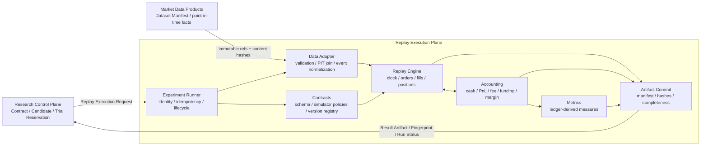

# RD Replay Execution Plane Design

## 1. 结论与边界

Replay Execution Plane 是 **冻结实验的确定性执行与历史证据生产面**，不是研究决策面，也不是实盘执行面。它只做一件事：把 Research Control Plane 已冻结的 Trial，连同不可变 Experiment Contract、Candidate Identity、Dataset Manifest 与模拟政策，执行成可复读的事件链、统一账本和 Result Artifact。

当前成熟度判断：**M2 / 5，已认证的受限纵切**。新 owner 已实现完整 Control Plane identity binding、closed-candle、next-open、简单 stop/target、stop-first resolution limitation、worse-open gap、fee/slippage/exact funding ledger、Result/Fingerprint、artifact 原子提交、幂等、取消和 Forward parity；尚未形成通用 order state machine、partial fill、portfolio/margin/liquidation、data-adapter/PIT 全覆盖与 step/fast parity。它可支持明确 capability 范围内的正式证据，不能外推到复杂执行 fidelity。

实现路径：`replay-execution-plane/contracts`、`engine`、`runner` 已成为新语义 owner；`replay-execution-plane/compatibility/replay-runner` 可转发 Trial-bound request，`compatibility/replay-engine` 继续作为 parity/迁移来源，不再承接新语义扩展。RD 根已无旧 Replay package。

权威边界：

| Replay 可以 | Replay 不可以 |
| --- | --- |
| 校验冻结输入及其 hash | 修改 Experiment Contract / Candidate / Trial Group |
| 读取 Dataset Manifest，按 point-in-time 规则产出市场事件 | 扩大 search space、生成候选、分配 trial budget |
| 模拟 order / fill / position / ledger / margin / cost | 决定 winner、晋级、Review Decision 或 lifecycle |
| 输出 append-only run status、Result Artifact、Evidence Fingerprint | 写 strategy status、正式 shadow/live evidence 或 `trade.db` |
| 对数据缺口、分辨率和模型能力输出 limitation | 用乐观补值把不可判定结果伪装为已成交 |

三个概念必须分开：

- `Replay Engine`：确定性市场事件、订单、仓位和账本状态机；历史与合成事件均可驱动。
- `Backtest`：Replay Engine 消费历史 Dataset Manifest 的一种运行模式，不是另一套 engine。
- `Experiment Runner`：验证 Trial Reservation、选择受支持模式、执行/重试/取消、提交 artifact 的编排层；不做研究裁决。

正式 Shadow、Live-small、真实订单、账户和交易所对账不属于本设计。第三个 Plane 正式命名为 `Forward Evidence Plane`（前瞻证据面），目录名固定为 `forward-evidence-plane/`；它承接 candidate freeze 后随新数据到达形成的 paper/forward evidence，不等于正式 Shadow。本文只确认接口边界，不设计其内部合同。

## 2. Plane 接口



对外只有两个合同：`ReplayExecutionRequest` 与 `ReplayExecutionResult`。内部组件不得被 Control Plane 直接调用；Market Data 只提供 owner-owned manifest/ref，不接收 Replay 回写。

## 3. 当前实现审计

用户给出的 `modules/contracts/replay-contracts` 当前不存在；实际模块是 `modules/contracts/replay-contract`。以下按实际路径审计。

### 3.1 模块判定

| 当前模块 | 当前事实 | 目标归属与动作 |
| --- | --- | --- |
| `replay-engine` | `replayStrategy` 是单 lane、一次全仓 resolver；同文件混合 manifest 读取、指标、撮合、成本、metrics、gate、hash | **拆分重构**：事件/订单/仓位进 `replay-execution-plane/engine`，成本进 `accounting`，manifest/PIT/hash 输入进 `data-adapter`，统计进 `metrics`；旧入口做兼容 adapter 后淘汰 |
| `replay-runner` | 单策略 CLI 与浅 fingerprint；不绑定 Experiment/Trial/Candidate | **保留并升级**到 `replay-execution-plane/runner`，成为 Trial Reservation 驱动的唯一编排入口 |
| `data-split` | 物理切 discovery/validation/locked_holdout 并留 embargo | **保留在 Research Control Plane**；split/holdout 选择是研究治理，不是 Replay 执行；Replay data-adapter 只消费并验证冻结 manifest |
| `benchmark-engine` / `benchmark-runner` | 独立 close-return 权重模拟、成本和负对照；不是订单级 Replay | **保留在 research**；benchmark 定义和裁决不进 Replay。仅当某个 fast kernel 通过 parity 后，抽取其纯执行内核，禁止直接把现实现命名为 Replay fast mode |
| `calibration-suite` | 诊断数据、成本、funding、regime 与负对照 | **保留在 research**；它消费 Replay/benchmark 结果，不属于执行面 |
| `candidate-batch-engine` | 候选生成输入、negative control、OOS、selection/reliability gate | **保留在 Research Control Plane**；改为逐 Trial 调 runner，禁止直接 import engine 或在 Replay result 上追加修改 assumptions |
| `panel-evaluator` | 单资产结果汇总；另有独立 cross-sectional close-return simulator | **拆分**：panel gate/aggregation 留 research；真正共享资金的 portfolio execution 必须改走 Replay。现 cross-sectional simulator 在 parity 前只算研究近似 |
| `strategy-family-engine` | family/feature/forecast/signal 实现与 registry | **保留在 research**；编译出的不可变 executable candidate 是 Replay 输入，family registry 本身不是 Replay 组件 |
| `rd-campaign-runner` | hypothesis queue、budget、discovery/validation、artifact/state writeback | **保留在 Research Control Plane**；不得迁入 `replay-execution-plane/runner` |
| `contracts/replay-contract` | `ReplayResult v1` 只锁浅外壳，fingerprint 仅强制 `harness_hash` | **版本化替换**为完整 request/result/artifact/fingerprint schema；v1 只作兼容读模型 |

不应保留的长期重复实现：`replayStrategy` 单笔 resolver、`simulateReplayOrderLane`、benchmark 权重模拟、panel cross-sectional 模拟不能继续各自定义“成交与成本事实”。迁移期允许并存，但只有新 event kernel 是订单/账本权威；其他路径必须成为 adapter、受限 fast mode，或明确标为 diagnostic approximation。

### 3.2 已由测试锁定的语义

验证快照：`2026-07-14` 定向运行 replay-contract、replay-runner、strategy-replay/campaign、data-split、benchmark/calibration、panel 测试，共 `64 pass / 0 fail`。通过只证明下表已有行为稳定，不证明尚无 fixture 的订单/账本 fidelity。

| 状态 | 当前语义 | 证据与限制 |
| --- | --- | --- |
| 已正式实现并测试 | closed candle 产生 signal，默认下一根 open 入场 | `strategy-replay.test.ts` 锁定 signal/entry time；manifest 的 `closed_candles_only` 主要是声明，loader 未完整验证闭合、连续性和 OHLC invariants |
| 已正式实现并测试 | 简单 bracket 同 bar 时 stop-first | 只覆盖单仓位、单 stop/target；不能外推到多 entry、多 stop ladder、cancel 或 liquidation |
| 已正式实现并测试 | stop gap 按更差 open 成交 | long 用 `min(stop, open)`、short 用 `max(stop, open)` |
| 已正式实现并测试 | break-even 在触发 bar 完成后、下一 bar 生效 | 是当前兼容 policy，不是所有 trailing/protection 的长期唯一制度 |
| 已正式实现并测试 | 双边 fee/slippage bps、exact funding event 与 adverse funding fallback | 当前按 entry notional 估算，不是逐 fill/逐时点 position notional 账本 |
| 已正式实现并测试 | 主 replay 不允许 lane 内重叠持仓 | loop 跳到上笔 exit 后；不支持加减仓或 portfolio 并发 |
| 已正式实现并测试 | lane helper 的 partial TP 后剩余 stop、oversized reduce-only quantity cap | helper 未接入主 replay，只能证明两个 fixture，不证明完整 order state machine |
| 已正式实现并测试 | discovery/validation/locked holdout 物理分段与 embargo | 属于 research split 纪律，不等于 Replay data adapter 已防全部 PIT 泄漏 |
| 已正式实现并测试 | 有限 temporal provenance、data/harness/assumptions hash 外形 | 未绑定 Control Plane identity；部分 hash 覆盖和 canonicalization 仍不足 |

### 3.3 不能升级为长期制度的行为

| 分类 | 当前行为 | 设计判定 |
| --- | --- | --- |
| 保守临时策略 | 任意同 bar 冲突一律 stop-first | 保留为 simple-bracket compatibility；长期使用 OHLC admissible-path 协议 |
| 保守临时策略 | 不允许 overlapping positions | 当前 family 可继续用；长期由 Contract 的 position/portfolio policy 决定 |
| 保守临时策略 | 固定 bps slippage、adverse funding fallback | 仅 stress mode；不能冒充历史实际成本 |
| 保守临时策略 | limit 一触即全成、没有 queue | 无 L2/成交量合同不得用于 maker fidelity 结论 |
| 隐含行为 | `time_exit` 在 exit candle close 成交 | 必须在 simulator policy 显式声明 earliest executable time 与 price source |
| 隐含行为 | funding 区间为 `(entry_time, exit_time]` | 应升级为 timestamp phase protocol：同时间 funding 使用 `t-` 持仓，之后的 fill 不参与本次结算 |
| 隐含行为 | supplemental report 的生成时间同时充当 `availability_at` | 不可靠；生成、观测、发布、可用时间必须分开 |
| 隐含行为 | manifest 缺 universe time 时回退 dataset start/generated time | 只能输出 limitation，不能据此声称 point-in-time universe |
| 隐含行为 | 缺 bar 被时间压缩，holding bars 只按数组索引 | 必须检测 expected grid；缺口不能当作时间不存在 |
| 尚未设计 | cancel/amend/TIF、真实 partial fill、wrong-side reduce-only、reversal | 进入目标 order contract |
| 尚未设计 | shared cash、margin、liquidation、borrow、market impact | 进入统一 accounting/portfolio contract |
| 尚未设计 | step/fast semantic digest parity | fast mode 上线前硬门槛 |
| 已知不可靠 | `simulateReplayOrderLane` 的 limit 触发按 BUY-high / SELL-low，实质混同 stop；wrong-side reduce-only 可加仓 | 不修补成长期 API；在新 order kernel 用 fixture 重建 |
| 已知不可靠 | 非 reduce-only 穿仓翻向时，旧仓 realized qty 与新仓 cost basis 未正确拆分 | 新 position accounting 必须按 close leg + residual open leg 记账 |
| 已知不可靠 | lane helper 与主 `replayStrategy` 脱节 | 主路径迁到同一 event kernel |
| 已知不可靠 | benchmark、panel、replay 各算一套成本/收益 | 研究 gate 可不同，执行事实必须统一 |
| 已知不可靠 | `replayHarnessHash()` 未覆盖实际 `strategy-family-engine` 全部源码；fingerprint schema 又允许缺 data/assumptions | 不能据当前 fingerprint 声称完整复现 |
| 已知不可靠 | Replay 自己输出 `shadow_candidate` | 越权；目标 Result 只给 metrics/quality flags，由 Reviewer 决策 |

### 3.4 最危险的五个 fidelity 缺口

1. **多个模拟器、无 parity**：同一 candidate 在 replay、benchmark、panel 可能得到不同资金、成本和时序语义。
2. **主路径没有订单/仓位/账本状态机**：partial、reduce-only、加减仓、cancel、reversal 只在局部 helper 或完全缺失。
3. **OHLC 路径不可知却未输出 resolution limitation**：stop/target 之外的多订单结果可能被任意实现顺序决定。
4. **没有 portfolio/margin/liquidation 的统一资金事实**：多资产并发、funding、fee 和强平无法对 NAV 与 risk budget 守恒。
5. **temporal identity 不完整**：availability、listing/delisting、缺口、survivorship、Control Plane ids 与完整 code/policy hash 未共同绑定。

## 4. 目标组件树

目录按稳定责任和 owner boundary 划分，不按 tool 数量划分。目标根与首条纵切已经建立；下列 `accounting`、`data-adapter`、`metrics`、`artifacts`、Plane-local `tests` 仍表示待能力成熟后独立出的稳定 owner，不创建无实现空壳，也不把 runner 内的临时聚合误报为迁移完成。

```text
modules/research-strategy-development/
├── research-control-plane/
│   └── ...                         # Research 治理、合同、Trial、Review、KG；具体迁移另案
├── replay-execution-plane/
│   ├── contracts/                  # request/result/event/order/ledger/artifact/policy schema
│   ├── engine/                     # clock、event loop、order state、matching、position projection
│   ├── accounting/                 # double-entry ledger、PnL、fee/funding/borrow、margin/liquidation
│   ├── data-adapter/               # manifest validation、PIT join、market-event normalization
│   ├── metrics/                    # 只从 fills/ledger/NAV 派生指标
│   ├── artifacts/                  # event/fill/ledger/result manifest；v1 暂由 runner 物化
│   ├── runner/                     # Trial 编排、幂等、checkpoint、取消、artifact commit
│   └── tests/                      # golden fixtures、property、metamorphic、parity certification
├── forward-evidence-plane/
│   └── ...                         # candidate freeze 后的前瞻证据；内部设计另案
└── agent-roles/                     # 角色入口，不是第四个 Plane，不持有独立事实
    ├── planner/                         # bounded Proposal submission
    ├── developer/                       # Trial-bound Replay Request
    └── reviewer/                        # explicit Review Decision submission
```

`agent-roles/` 与三个 Plane 同级，但语义不对称：Plane 持有稳定责任、合同与权威状态；Agent Role 是调用这些能力的 typed 角色入口。当前已锁最小输入输出，仍不固定 agent 数量、tool 组合、prompt、内部推理流程或部署形态。

稳定组件与运行模式的区别：

| 稳定组件 | 不能独立成为组件的“模式” |
| --- | --- |
| contracts / data-adapter / engine / accounting / metrics / runner / certification tests | backtest、historical replay、cost stress、Monte Carlo、single-asset、panel batch、shared portfolio、step、fast/vectorized |

运行模式只选择同一合同和内核的受限 capability set，不复制状态机。Panel 是多 Trial/资产的评估组织方式；只有声明 shared portfolio 时才是一个组合执行实例。

## 5. Control Plane 输入/输出合同

### 5.1 `ReplayExecutionRequest v1`

```json
{
  "schema_version": "trade-flow.replay-execution-request.v1",
  "run_id": "...",
  "idempotency_key": "...",
  "identity": {
    "experiment_id": "...",
    "trial_group_id": "...",
    "trial_group_hash": "sha256",
    "trial_id": "...",
    "candidate_id": "...",
    "candidate_identity_hash": "sha256",
    "identity_hash_policy_version": "rd-identity-hash.v1"
  },
  "experiment_contract": {"ref": "...", "content_hash": "sha256"},
  "trial_reservation": {"ref": "...", "reservation_hash": "sha256"},
  "dataset": {"manifest_ref": "...", "data_hash": "sha256"},
  "executable_candidate": {"ref": "...", "code_hash": "sha256"},
  "policies": {
    "simulator_policy_version": "replay-simulator.v1",
    "assumptions_ref": "...",
    "assumptions_hash": "sha256",
    "cost_policy_ref": "...",
    "cost_policy_hash": "sha256",
    "metrics_policy_version": "replay-metrics.v1"
  },
  "execution": {"mode": "step", "random_seed": null}
}
```

Runner 必须在开始前原子验证 Control Plane 签发的不可变 reservation snapshot：Trial 状态为 `reserved`；Trial 属于 Experiment/Group/Candidate；四类 identity/hash 与 reservation 相等；candidate 属于冻结 search space；Dataset/assumptions/cost policy 内容 hash 可复算；engine capability 覆盖 Contract。Runner 自己分配 `attempt_id`，无权改 Control Plane Trial 行。任一失败返回 typed rejection，不消费市场事件，不写正式 Result。

### 5.2 `ReplayExecutionResult v2`

```json
{
  "schema_version": "trade-flow.replay-execution-result.v2",
  "result_id": "...",
  "run_id": "...",
  "attempt_id": "...",
  "idempotency_key": "...",
  "status": "completed",
  "authoritative_result": true,
  "identity": {},
  "execution": {
    "mode": "step",
    "engine_version": "...",
    "harness_hash": "sha256",
    "simulator_policy_version": "replay-simulator.v1",
    "determinism_class": "deterministic",
    "resolution": {"status": "exact", "limited_event_count": 0}
  },
  "metrics": {"schema_version": "trade-flow.replay-metrics.v1", "ref": "...", "content_hash": "sha256"},
  "artifact_manifest": {"ref": "...", "content_hash": "sha256"},
  "evidence_fingerprint": {"schema_version": "trade-flow.replay-fingerprint.v2", "hash": "sha256", "payload": {}},
  "quality_flags": [],
  "failure": null,
  "completeness": {"last_committed_event_key": "...", "checkpoint_hash": "sha256"}
}
```

目标 Result 不含 `shadow_candidate`、`live_small_candidate` 或 promotion gate。Replay 只输出事实、limitations、typed failure 和 quality flags；Research Reviewer 将它们与 stage/negative-control/selection protocol 组合后裁决。

## 6. 时间、事件与状态模型

### 6.1 时间字段

- 所有机器时间使用 RFC 3339 UTC；内部排序使用整数 epoch nanoseconds/microseconds，禁止本地时区和浮点时间。
- 每个外部事实至少有 `event_time`（事实发生）、`availability_at`（策略最早可知）、`source_sequence`（同源顺序）、`received_at`（采集时间，仅 lineage）。
- 决策只能读取 `availability_at <= decision_time` 的版本；修订数据以版本事件追加，不覆盖历史可见版本。
- engine 使用嵌套顺序 `(event_time, boundary_phase, source_sequence, event_subphase, stable_event_id)`；同一 market source event 必须完成 `mark -> risk -> match -> fill` 后才处理下一 source sequence。多资产共享资金时先形成同 timestamp decision batch，再统一分配，禁止循环顺序偷偷决定谁先占资金。

### 6.2 权威 phase 顺序

| Phase | 事件 | 权威语义 |
| --- | --- | --- |
| `00` | instrument status | listing/delisting、合约规格与交易状态先于本时点动作生效 |
| `10` | funding settlement | 使用 `t-` 的 position snapshot；本 timestamp 新 fill 不参与本次 funding |
| `20.0` | market event | trade/quote/mark/index/bar-open 等外生事实按 source sequence 逐条推进 |
| `20.1` | risk engine | 对当前 market event mark-to-market、检查 maintenance margin；触发 liquidation 时先于策略单 |
| `20.2` | resting order trigger/match | 只处理当前 source event 到来前已 active 的订单 |
| `20.3` | fill/accounting commit | 每笔 fill 立即原子更新 fee、PnL、cash、margin、remaining qty，再进入下一 source event |
| `60` | bar close publication | high/low/close/volume 至此才作为 closed candle 可见 |
| `70` | signal evaluation | 只消费当前 `availability_at` 已到的事实，生成 signal，不直接改仓位 |
| `80` | portfolio allocation | 同 timestamp signals 一次性应用 cash/risk budget 与 contract tie-breaker |
| `90` | command activation | submit/cancel/amend 进入订单状态；只能匹配后续 eligible market event |
| `100` | snapshot/checkpoint | 记录 NAV、exposure、state hash；metrics 不反向影响执行 |

同一真实 tick 内若有交易所 source sequence，以 source sequence 为准；只有 source 不提供顺序时才使用 simulator policy 的 stable tie-breaker，并输出 limitation。若 stop 与 liquidation 在同一低分辨率 market event 冲突，默认先 liquidation 是保守模拟政策，不得表述为交易所精确重演。

### 6.3 Candle 可见性

| 时点 | 可见字段 |
| --- | --- |
| bar open | 本 bar `open`；此前已闭合 bars 的全字段 |
| bar 进行中 | 只有另有 timestamped tick/mark/quote 流时才可见增量 high/low/last/volume |
| bar close + availability lag | 本 bar `high/low/close/volume` 才整体可用于 signal |

closed-candle signal 在 phase `70` 生成；bar 模式的最早可执行时间是下一根 bar open，除非 Contract 明确绑定了 close auction/独立 tick 数据。禁止用本 bar close 产生 signal，再让本 bar high/low 成交。

## 7. OHLCV resolution 与 same-bar 协议

OHLCV 不能证明 bar 内真实路径。目标协议不猜唯一真相，而是运行两个与 OHLC 一致的极值路径：

```text
P1 = Open -> High -> Low -> Close
P2 = Open -> Low  -> High -> Close
```

每一段按价格穿越顺序驱动同一个 event kernel；child bracket 在 parent fill 后才激活。处理规则：

1. 先处理 open gap：active stop-market 以 open 与 trigger 的较差方向成交；limit 不得比 limit 更差。
2. 对 P1/P2 分别执行所有 crossing、订单激活、partial、reduce-only、margin 与 ledger。
3. 若两条路径的 normalized orders/fills/ending position/ledger 相同，`resolution.status=exact_under_ohlc`。
4. 若不同，`resolution.status=limited`；canonical result 取 bar-end equity 更低者，再按 realized PnL、stable path id 破同值；artifact 同时保存两条 path digest。
5. limit queue、同价多单成交量分配、bar 内 funding/exit 先后若无法由数据和 policy 确定，不伪造精确性；标记对应 `resolution_reason`。

P1/P2 是 v1 的保守 envelope，不声称枚举真实 bar 内全部往返路径；任何依赖同一价格多次穿越、queue replenishment 或 trailing 高频更新的 Contract 在 OHLC 模式下直接 `unsupported` 或 `resolution_limited`。

因此当前 `stop_first` 只作为 simple bracket 下“选择较差 admissible path”的兼容结果。多订单不再靠全局 `stop > target > entry` 排名直接解决。任何关键指标、gate 结论会因 P1/P2 改变的 run 必须标记 `resolution_limited`；Replay 只报告 material exposure、trade count 与 metric delta，Reviewer 决定是否要求更高分辨率重跑。

## 8. 订单与成交协议

### 8.1 Order 状态

```text
created -> accepted -> active -> partially_filled -> filled
                    \-> cancelled | expired | rejected
```

每次 transition 是 append-only `OrderEvent`。`requested_qty / remaining_qty / filled_qty` 使用 instrument precision 的定点整数；价格、金额和费率采用版本化 decimal/rounding policy，不能依赖不同 runtime 的 binary float 舍入。

### 8.2 类型合同

| 类型 | 触发/成交合同 |
| --- | --- |
| Market | activation 后第一个 eligible quote/trade；fill price = reference + direction-aware slippage + impact；缺报价时 bar open 仅是声明过的近似 |
| Limit | BUY 仅在 executable ask/trade `<= limit`，SELL 仅在 `>= limit`；不得更差于 limit；仅 touch 默认不证明 queue fill，`touch/cross/volume` policy 必须版本化 |
| Stop | 条件触发后转 market 或 limit；trigger source 必填 `mark/index/last`；gap 后 market leg 按首个 eligible price，不保证 stop price |
| Take-profit | 与 stop 相反方向的条件单，不等于保证价；trigger source、market/limit child、reduce-only 必填 |
| Cancel | 在 cancel effective key 之后阻止未成交 remaining qty；若 fill source sequence 先发生，fill 胜出；重复 cancel 返回同一终态 |
| Partial fill | 每笔 fill 独立记 fee/position/ledger；remaining qty 保持 active；无 volume/queue 模型时不得声称 maker partial fidelity |
| Reduce-only | 只能减少当前同向 position；actual qty = `min(requested, reducible remaining)`；空仓、wrong-side 或已被先前 fill 消耗时为 zero-fill/expire，绝不加仓或翻向 |

条件方向固定为：BUY stop 在 trigger source `>= stop_price` 时触发，SELL stop 在 `<=` 时触发；long 的 reduce-only stop/TP 分别是 SELL `<= stop` / SELL `>= target`，short 分别是 BUY `>= stop` / BUY `<= target`。`working_type=mark/index/last` 必填；trigger stream 与 executable quote/trade stream 不得混为一个字段。

Partial fill 必须绑定 liquidity capability：`event_book` 使用历史 book/queue，`bar_volume_cap` 使用预声明 participation cap，`full_fill_bounded` 只允许 notional 未超过冻结 capacity ceiling。`bar_volume_cap` 的可分配量在同 bar 所有订单间共享，按订单 priority 扣减，不能每笔重复使用全部 volume；缺 capability 时返回 unsupported/limited，不默认全成。

Gap policy 固定外壳：Market 使用 activation 后第一条 executable price；Stop/TP-market 在 open 已越过 trigger 时以该 open/quote 触发并成交，不能回填 trigger price；Limit 在 gap 后仍不得差于 limit。具体 spread/slippage/impact 继续由冻结 cost/fill policy 决定。

订单优先级只在数据缺 source sequence 时使用：`forced liquidation -> 已 active 的风险降低单 -> 已 active 的风险增加单 -> 同类 activation key -> order_id`。OHLC 同 bar 仍以双路径执行；priority 不能替代路径。

Market/Stop/Take-profit/Reduce-only 的目标语义参考 Binance USDⓈ-M 官方 [New Order](https://developers.binance.com/docs/derivatives/usds-margined-futures/trade/rest-api/New-Order) 合同，但 Replay Contract 使用自己的稳定 vocabulary，并显式记录映射版本；不能把某次 Binance API 参数集合直接当作永恒内部模型。

## 9. 仓位、资金、成本与保证金账本

### 9.1 统一账本

所有 metrics 只从不可变 fills 与 double-entry ledger 派生。最小 account：

- `wallet_cash`
- `realized_pnl`
- `unrealized_pnl`（projection，不与 realized 混记）
- `fee_expense`
- `funding_income/expense`
- `borrow_interest`
- `impact_attribution`
- `initial_margin_reserved`
- `maintenance_margin_requirement`
- `liquidation_penalty`

每条 Ledger Entry 绑定 `event_key / order_id / fill_id / instrument / asset / amount / currency / policy_version`，借贷平衡为硬 invariant。slippage/impact 主要进入 fill price，同时记 attribution，禁止又从 PnL 重复扣减。

### 9.2 Position accounting

v1 支持 `net` position mode：

- 同向增加按 filled qty 加权平均 entry；fee 不混入 entry，单独记账。
- 反向 fill 先以 `min(abs(position), fill_qty)` 平旧仓并确认 realized PnL；残余 qty 才按新方向开仓。
- reduce-only 禁止产生残余反向仓位。
- unrealized PnL 使用 Contract 指定 mark source；close/last 不能静默替代 mark。
- `R_initial` 的分母为初始已承诺风险；`R_max_live_risk` 的分母为路径中最大有效风险。partial/add/reduce 后两者都保留，禁止只报一套易看的 R。

### 9.3 Funding、fee、borrow、margin、liquidation

- Fee：逐 fill，以 maker/taker、tier、quote/base asset 与 rounding policy 记账。
- Funding：消费 exact funding event；以 phase `10` 的 signed position notional 与规定 mark 结算。无 exact events 时只能运行 `stress`，evidence grade 下降；官方字段与时间来源见 Binance [Funding Rate History](https://developers.binance.com/docs/derivatives/usds-margined-futures/market-data/rest-api/Get-Funding-Rate-History)。
- Borrow：只有 Contract/venue product 需要且有 point-in-time rate 时启用；USDM perp 默认 `not_applicable`，不能拿 funding 代替 borrow。
- Margin：`isolated` 只使用 position 隔离 collateral；`cross` 使用同 portfolio account equity。initial/maintenance tiers、mark source、fees 与 liquidation penalty 必须绑定 policy/data snapshot。
- Liquidation：每次 mark event 后、策略订单前检查；触发后生成 forced order、cancel 冲突 active orders、记 liquidation fee/penalty。缺 maintenance tier 或 mark history时，该 contract 为 unsupported 或 resolution-limited，不用简化止损冒充强平。账户参考字段见 Binance [Position Information V3](https://developers.binance.com/docs/derivatives/usds-margined-futures/account/rest-api/Position-Information-V3)。

## 10. Single-asset、Panel 与 Portfolio

每个 request 必须声明：

| 字段 | 值与语义 |
| --- | --- |
| `execution_scope` | `single_lane` / `independent_lanes` / `shared_portfolio` |
| `cash_scope` | 每 lane 虚拟隔离，或同一 account 共享 |
| `risk_budget_scope` | per-position / per-strategy / portfolio |
| `margin_scope` | isolated / cross |
| `order_namespace` | 保证 idempotency 与 cancel scope 不串 lane |
| `simultaneous_signal_policy` | 预声明排序、pro-rata 或 optimizer ref |

- Single-asset 可使用隔离 cash/risk，但仍走同一 ledger。
- Panel 默认是 `independent_lanes` 的研究聚合，不得把各资产各自拥有 100% cash 的结果称作共享 portfolio。
- Shared portfolio 在同 timestamp 先收齐 signals，再一次性计算资金、gross/net exposure 与 risk budget；allocation 之后才提交订单。
- 多资产 concurrent positions 共享 cash/margin 时，任何 fill、fee、funding、liquidation 都立即影响后续可用资金；按数组/字母顺序逐资产回放是不合法的隐含优先级。
- 当前 PRD 不做 hedge 多腿；本设计不借 portfolio 支持扩张该产品边界。

## 11. 数据时序安全

### 11.1 Point-in-time join

Feature/funding/OI/event join 使用 `entity_key + event_time + availability_at + revision_id`。对 decision time `t`，只取 `availability_at <= t` 的最后可见版本；禁止按最终修订值回填历史。每个被消费 record 的 source ref/version 进入 lineage hash。

### 11.2 Listing、delisting、survivorship

- Universe 必须由 point-in-time selection rule 在每次选择时刻物化，不接受“今天仍可交易的 symbol 列表”回放过去。
- `listed_at / trading_enabled_at / delisted_at / contract_spec_version` 是 instrument events；listing 前不生成 signal/order，delisting 后撤单并按冻结 policy close/expire。
- inactive/delisted 数据缺失时显式 `survivor_only=true`；该 run 不能声称 survivorship robust。
- asset membership 与 selection score 都进入 Dataset/Contract hash，不只存 symbol 列表路径。

### 11.3 缺口与 stale

- Adapter 按 timeframe expected grid 检测 missing、duplicate、out-of-order、invalid OHLC、zero/negative price、unexpected partial candle。
- 缺 bar 不压缩 elapsed time、holding period 或 funding window；保护单跨缺口时只能在第一条恢复事实上按 gap policy 处理，并标记不可见区间。
- `missing_data_policy` 必须是 `fail_run / no_signal / carry_with_stale_limit / resolution_limited` 之一；forward-fill 必须有最大 stale age，且不适用于 trade/volume/event label。
- 多 timeframe join 只使用已闭合且已 availability 的慢周期 bar；不能用未来 slow-bar close 填当前 fast row。
- manifest 的 `closed_candles_only=true` 是声明，不是证明；adapter 必须用 close time、run cutoff、checksum 与行级 invariant 验证。

## 12. Step/Event-driven 与 Fast/Vectorized

Step 是权威 reference implementation。Fast 只是相同语义的优化后端，必须输出相同 normalized semantic digest：

```text
orders + fills + ending positions + ledger balances + metrics inputs
  -> canonical semantic digest
```

Fast v1 只允许以下闭包：closed-candle signal、next-open market/rebalance、固定 deterministic sizing、无 active conditional orders、无 intrabar decision、无 partial/queue、无 dynamic trailing、无 margin/liquidation、无 shared-capital contention。以下策略强制 Step：limit/stop/TP、same-bar 可能性、加减仓、partial exit、reduce-only ladder、cancel/amend、path-dependent risk、exact funding 与 bar 内持仓变化冲突、shared portfolio margin、liquidation。

Parity 不是“metrics 接近”，而是对同一 Request 的 semantic digest 完全一致；数值容差只允许由统一 decimal policy 明示。任一 supported fixture 不一致，Fast capability 整体降级，不得逐结果挑选更好路径。

## 13. Metrics、Artifact 与 Fingerprint

### 13.1 Metrics Contract

`replay-metrics.v1` 至少包含：

- coverage：start/end、event/bar count、missing/stale、resolution-limited exposure；
- execution：orders、fills、fill ratio、partial/cancel/reject、slippage、impact、turnover；
- position：holding time、gross/net exposure、concurrency、MFE/MAE；
- PnL：gross、realized、unrealized、net、`R_initial`、`R_max_live_risk`；
- cost：maker/taker fee、funding、borrow、slippage/impact attribution、liquidation penalty；
- portfolio：NAV、cash、margin usage、peak exposure、drawdown、liquidation count；
- trade distribution：sample、win rate、profit factor、expectancy、quantiles。

每项 metric 必须声明 unit、currency/denominator、aggregation、missing policy 与 version。`profit_factor=999999` 之类 sentinel 不进入权威 schema；无 loss 时用 typed `null/+infinity-policy` 表达。研究 gate、DSR/PBO、winner selection 属于 Control Plane，不混进 execution metrics。

### 13.2 Artifact Manifest

```text
artifact-manifest.json
├── request.json
├── normalized-market-events.*
├── order-events.*
├── fills.*
├── positions.*
├── ledger.*
├── nav-series.*
├── metrics.json
├── limitations.json
├── diagnostics/                    # 非 promotion evidence
└── checkpoints/                    # failed/cancelled attempt 可复读
```

Manifest 为每个成员记录 schema、content hash、row count、time range、compression、producer version 与 completeness。正式结果采用 staging -> hash/verify -> atomic manifest commit；只有 committed manifest 可被 Control Plane 写入 `rd_experiment_result`。

### 13.3 Evidence Fingerprint

Fingerprint payload 使用与 Control Plane 一致的 `SHA-256(UTF-8(JCS(normalized_payload)))` 与冻结 `identity_hash_policy_version`，至少绑定：

- `experiment_id`
- `trial_group_id + trial_group_hash`
- `trial_id`
- `candidate_id + candidate_identity_hash`
- `identity_hash_policy_version`
- `experiment_contract_hash`
- `dataset_manifest_hash + data_hash`
- `executable_candidate_code_hash`
- `harness_hash`
- `assumptions_hash`
- `cost_policy_id/version/hash`
- `simulator_policy_version`
- `data_adapter_version`
- `metrics_policy_version`
- `execution_mode`
- `random_algorithm/version + seed schedule`（若适用）

artifact 路径、run wall-clock、日志文本不进入 evidence identity；内容 hash 进入 Result/Artifact Manifest。相同 fingerprint 必须得到相同 semantic digest，否则是 P0 determinism incident。

### 13.4 随机性与证据等级

| 等级 | 含义 | 可作为 primary Result |
| --- | --- | --- |
| `deterministic_exact` | exact event source 或 OHLC 两路径结果等价 | 可以 |
| `deterministic_resolution_limited` | 固定保守路径，但 admissible paths 有差异 | 可以提交事实，Reviewer 必须处理 limitation |
| `stochastic_diagnostic` | Monte Carlo/queue/impact sampling，固定 algorithm + seed schedule | 不可以单独作为 primary promotion evidence |

Monte Carlo 必须在确定性 baseline 之外运行；输出分布、seed schedule、trial count 与 convergence diagnostics。当前所谓 `monte_carlo` 实际是四个固定 trade-order 变换和固定 R drag，应改名 deterministic diagnostics，不能声称 stochastic robustness。

### 13.5 Engine versioning 与可复现

- `engine_version` 标识实现发布；`harness_hash` 标识实际代码内容；`simulator_policy_version` 标识经济/撮合语义。三者不能互相替代。
- policy、rounding、event phase、fill、margin 或 metric 定义变化使旧 evidence stale；单纯优化只有在 golden/parity digest 不变时可沿用 policy version。
- 复现成功标准：同 Request/fingerprint 在受支持 runtime 上得到相同 artifact member hashes 与 semantic digest；只得到“相近 metrics”不算复现。

## 14. 幂等、重试、取消、失败与部分结果

Run Attempt 状态为：

```text
requested -> accepted -> running -> completed
                              \-> failed
                              \-> cancel_requested -> cancelled
```

- `idempotency_key` 对应完整 normalized Request hash；同 key 同 request 返回已有 attempt/result，同 key 不同 request 返回 conflict。
- retry 创建新 `attempt_id`，保持 logical `run_id`、Trial identity 与 request hash；是否计费由 Control Plane Trial accounting policy 决定，Replay 不改 `counts_against_budget`。
- cancel 是合作式命令，在 event/checkpoint boundary 生效；completed 与 cancel race 由单一 compare-and-set finalization 决定，只有一个 terminal state。
- `failed` 必须有 `failure_class = input_invalid | unsupported_contract | data_integrity | deterministic_engine | resource | external_io`、`retryable`、last checkpoint；不得用自由文本决定重试。
- failed/cancelled 的 checkpoint/artifact 可以保留为 diagnostic partial，但 `authoritative_result=false`，不能写成正式 experiment Result primary evidence。
- 从 checkpoint 重试必须验证 request、engine/policy、data hash 与 state hash 全等；否则从头运行。

## 15. 测试与认证矩阵

| 语义面 | Golden fixtures | Property tests | Metamorphic tests | Parity tests |
| --- | --- | --- | --- | --- |
| clock/visibility | close signal、next-open、funding boundary | 无事件可在 availability 前消费 | 全部时间平移不改相对结果 | step 与 replay chunking digest |
| OHLC path | stop/target、gap、entry+bracket 同 bar | canonical 是 admissible path 且 limitation 完整 | bar 拆细后已 resolved 结果不变 | OHLC step 与 higher-res resolved subset |
| orders | market/limit/stop/TP/cancel race | fill 不早于 active；filled+remaining=requested | price/qty scale 后经济量同比 | fast supported order subset |
| reduce/position | multiple entry、partial TP、oversized/wrong-side reduce-only、reversal | reduce-only 不增仓/翻向；position qty 守恒 | 拆一笔 fill 为多笔同价 fill，终态相同 | legacy simple resolver compatibility |
| ledger/cost | fee、funding、borrow、impact | 借贷平衡；NAV bridge 可解释 | zero-cost policy 恢复 gross PnL | step/fast ledger digest |
| margin | isolated/cross、stop-liquidation collision | equity/margin 守恒；liquidation 后无未解释风险 | collateral 等比缩放 | 不允许 fast，断言 capability reject |
| portfolio | 同时多资产信号、资金不足 | cash/exposure/risk cap 永不越界 | asset permutation 在对称 tie policy 下不变 | batch/stream step digest |
| data safety | listing/delisting、revision、gap/stale | 无 pre-list trade、无未来 join | 添加未来记录不改变过去结果 | adapter batch/stream digest |
| identity/runtime | request/result/artifact golden hash | 同 key 异 request 必冲突 | artifact relocation 不改 evidence identity | clean run/checkpoint resume digest |

认证阶段：

1. `C0 contract`：schema、canonical hash、非法状态/输入拒绝。
2. `C1 single-lane`：现有 simple bracket fixtures 全部在 event+ledger 内核通过。
3. `C2 order fidelity`：partial/reduce/cancel/multi-entry 与 OHLC limitations 通过。
4. `C3 accounting/portfolio`：fee/funding/margin/liquidation/shared cash 守恒通过。
5. `C4 optimization`：Fast 在声明 capability subset 上全量 parity；否则只保留 Step。

Property tests 的核心 invariants：订单 qty、position qty、cash/NAV bridge、double-entry balance、reduce-only、no-future-data、no-fill-before-active、terminal state 单一、fingerprint/semantic digest 稳定。Golden fixture 必须保存输入、完整 event/fill/ledger 期望和 digest，不能只断言最终 `total_r`。

## 16. 渐进迁移顺序

### R0：冻结合同，不搬目录

- 新增 request/result/fingerprint/artifact/simulator-policy v2 设计 schema。
- 给 v1 输出标 `legacy_single_trade_resolver`；停止向 v1 增加 promotion 语义。
- 建 current behavior fixture inventory，明确正式、临时、隐含和 known-bad。

### R1：第一条实现纵切

实现 **single-asset 4H closed-candle -> next-open market entry -> reduce-only stop/TP -> exact funding/fee -> ledger-derived Result**：一个 Trial、一个 net position、Step 模式、OHLC P1/P2 resolution、完整 ids/fingerprint/artifact manifest。先覆盖现有 next-open、stop-first、gap、break-even、partial TP + remaining stop、oversized reduce-only fixtures；旧 `replayStrategy` 通过 adapter 调新内核并比较 compatibility digest。

这是建议的第一条纵切，因为它同时穿过 Control Plane binding、data adapter、event ordering、order/fill、position、ledger、metrics、artifact 和 determinism，却不先引入 shared portfolio 或复杂 maker queue。

### R2：数据时序与身份硬化

- manifest/candle/PIT/availability/listing/gap validator；删除 universe time 乐观 fallback。
- 修正 code/harness/data/assumptions/cost hash 覆盖；Control Plane Trial reservation 原子校验。
- runner 实现 idempotency、typed failure、cancel、checkpoint/atomic commit。

### R3：订单状态机

- limit/stop/TP、cancel/amend、multi-entry、partial、wrong-side/oversized reduce-only、reversal。
- 只有具备数据能力的 fill policy 才开放；maker queue 缺失继续 limitation/unsupported。

### R4：统一 accounting

- 定点 decimal、double-entry ledger、逐 fill fee、exact funding、borrow 接口。
- isolated/cross margin、maintenance tiers、liquidation 与 penalty fixtures。

### R5：Portfolio

- independent lanes 与 shared portfolio 明确分开。
- panel/cross-sectional research 改为调用 Replay shared-portfolio mode；淘汰独立 position-return execution semantics。

### R6：Fast parity 与消费者切换

- 只实现受限 fast capability；逐 fixture semantic digest parity。
- candidate batch、panel、benchmark adapter 改走 runner；Reviewer 消费 v2 Result。
- 无调用者后淘汰 legacy resolver、重复 cost/PnL simulator 与 v1 promotion gate。

迁移不是整体重写：每一步都以 v1/v2 双跑、golden digest、可回退 adapter 为边界；先替换事实内核，再移动目录。不得先搬模块后继续保留多套语义。

## 17. 明确不做

- 不把已落的 Forward admission/runner 纵切扩展成正式 Shadow、账户事实或自动晋级。
- 不设计正式 Shadow、Live-small、Binance side effect 或真实账户对账。
- 不修改 Strategy Universe taxonomy、L0-L3 或 family 分类。
- 不让 Replay 生成 hypothesis、candidate、search space、winner、Review Decision 或 strategy status。
- 不把 Backtest、Replay Engine、Experiment Runner 合并成一个大模块。
- 不承诺无历史 L2 时的 maker queue、真实 partial probability 或精确 market impact。
- 不支持当前 PRD 排除的 hedge 多腿、跨账户、跨交易所或高频撮合。
- 不以“和 Binance 字段同名”替代版本化内部语义和 fixture 认证。

## 18. 尚未决策的问题

以下问题需要真实数据能力或 Control Plane 共同决策，本文不提前固定：

1. v1 decimal 实现采用整数 tick/step、decimal library，还是二者组合；需先做跨 runtime golden。
2. OHLC `touch` limit 的默认 queue policy是 zero-fill，还是基于可证明 cross-through 的 conservative fill；必须由数据 capability 与研究用途共同决定。
3. shared portfolio 同时信号采用 pro-rata、预注册 priority 还是独立 allocator ref；不能由 symbol 排序代替。
4. Binance maintenance tier、liquidation fee 与 mark history的历史快照来源和 retention owner。
5. resolution limitation 的 materiality 只由 Reviewer stage policy决定，还是另有统一 quantitative threshold；Replay 本身不做晋级判断。
6. Artifact 大事件流采用 JSONL、Arrow/Parquet 或 SQLite bundle；无论格式如何，manifest/hash/schema 合同不变。
7. exact event mode 的 source sequence 在 aggTrades、mark、funding、instrument status 间如何映射；缺 exchange sequence 时必须保留 limitation。
8. Fast v1 是否值得实现；若当前 4H trial volume 不构成瓶颈，可以长期只保留 Step。

## 19. 保留、重构、拆分、淘汰摘要

| 动作 | 模块/实现 |
| --- | --- |
| 保留 | `research-control-plane/dataset-governance/data-split` 的治理语义；`replay-execution-plane/certification/calibration-suite` 作为认证来源；`replay-execution-plane/compatibility/replay-runner` 暂作兼容入口 |
| 重构 | 新 `replay-execution-plane` 已承接 reference kernel、Trial identity、ledger、artifact lifecycle；legacy engine 只补 parity adapter，不再 enrich |
| 拆分 | `replay-engine` 的 data/hash/cost/metrics；`panel-evaluator` 的 research gate 与 portfolio execution；`benchmark-engine` 的研究定义与可能的 fast primitive |
| 迁往角色层 | `candidate-batch-engine`、`strategy-family-engine` 的生成能力进 Developer；evaluation gate 进 Reviewer；campaign/supervisor 拆 program-control 与角色编排 |
| 淘汰 | parity/caller cutover 后淘汰 legacy single-trade resolver、脱节 lane helper、重复 panel/benchmark execution-cost semantics、Replay 内部 promotion gate |

## 20. 外部依据

访问日期：`2026-07-14`。外部资料只约束交易所字段/触发语义，不替代本项目 simulator policy 与测试认证。

- Binance USDⓈ-M Futures [New Order](https://developers.binance.com/docs/derivatives/usds-margined-futures/trade/rest-api/New-Order)：order type、trigger、reduce-only 等外部映射依据。
- Binance USDⓈ-M Futures [Funding Rate History](https://developers.binance.com/docs/derivatives/usds-margined-futures/market-data/rest-api/Get-Funding-Rate-History)：历史 funding rate/time 数据合同。
- Binance USDⓈ-M Futures [Position Information V3](https://developers.binance.com/docs/derivatives/usds-margined-futures/account/rest-api/Position-Information-V3)：mark、liquidation、position 等账户字段参照。
