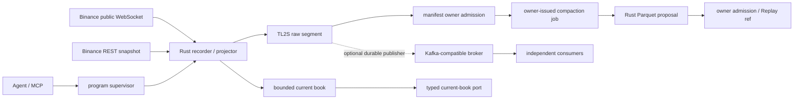

# L2 Order Book Data Plane

## 1. 状态与目标

本文定义 public L2 从采集、可恢复记录、订单簿投影到程序化消费的合同。Rust / TL2S 已通过 [L2 Runtime Adoption Decision](../architecture/l2-runtime-adoption-decision.md)，并形成单标的 production-candidate service、loopback gRPC、仓库托管 supervisor、连续 TypeScript owner admission、磁盘水位保护，以及 owner-issued TL2S → Parquet compaction / bounded read 纵切；多 symbol、24h 自然轮转验收、raw GC、Replay consumer cutover 与 broker 仍未完成，因此保持 `active-partial`。`l2-recorder-bakeoff` 继续是证据模块，不是生产依赖。

目标是：Agent、LLM、MCP 和任一消费者离线时，L2 owner 仍能连续运行；任何不连续都成为显式 epoch / incident，而不是被静默修补。

## 2. 决策边界

| 能力 | Owner / 语言 | Authority | 禁止 |
| --- | --- | --- | --- |
| WebSocket、snapshot bridge、sequence、book、raw writer | 独立 Rust daemon | 当前连续 epoch 与本地 durable append | API key、Binance write、策略、LLM |
| manifest / retention / catalog admission | `market-data-products` owner / TypeScript | finalized segment、coverage、hash 与 lineage | Rust 直写 owner SQLite |
| current-book 查询 | Rust typed read port；首选 gRPC | 内存投影及其 freshness / continuity 状态 | 从 Kafka 或 raw 文件临时拼“当前簿” |
| durable 分发 | 可选 Kafka-compatible adapter | consumer offset；不是采集事实源 | 以 broker “exactly once”替代 owner 幂等 |
| Replay / RD | finalized manifest、后续 Parquet reader | 冻结 dataset / source lineage | 用当前 gRPC snapshot 冒充历史 L2 |
| Agent / MCP | owner health、coverage、incident 的北向适配 | 无新 authority | 实时 transport、book owner、内部总线 |

Rust 采用已通过 [Program-Owned Runtime Migration](../architecture/migrations/program-owned-runtime-migration-plan.md) 的 P0 gate。Go 不扩成第二套数据面；TypeScript 保留 supervisor、owner admission 与运维编排。

## 3. 数据流与确认点



接收确认顺序固定为：

1. 校验 payload、symbol 与 epoch；
2. 成功 append 到本地 raw segment；
3. 按 `U/u/pu` 更新同一 epoch 的 book；
4. 发布可查询的新 watermark；
5. 若启用 broker，由 durable publisher 从 raw offset 异步发送。

内存状态、gRPC 或 broker 成功都不能替代第 2 步。raw segment 是采集证据；只有 finalize、hash 与 owner admission 后，才成为可供 Replay / RD 引用的正式 source ref。

## 4. 连续性与状态机

```text
starting -> buffering -> bridging -> live
                  \         |         |
                   +----> resyncing <-+
                              |
                         live | degraded
                              |
                    draining -> stopped
```

- 每次连接、snapshot 重建或 gap recovery 创建新 `stream_epoch`；epoch 不跨 gap 延续。
- 只有 snapshot bridge 成功、`pu == previous.u`、raw append 正常且 book freshness 合格时才是 `live`。
- bridge miss、parse failure、`pu` gap、queue overflow、level-cap breach、raw append / fsync failure分别记录 reason；当前 epoch 以 `incomplete` finalize 或 salvage。
- WebSocket close / 24h rotation 使用有界退避重连；新连接重新 buffer + snapshot，不复用旧 book。
- 进程重启先 salvage 唯一 partial segment，再从新 snapshot 建新 epoch；不得根据旧内存 checkpoint 猜测连续性。
- stale、resyncing、degraded 或 incomplete 状态必须由 read port 原样暴露；交易消费者 fail closed，不使用最后一次值伪装 fresh book。

### 故障隔离

| 故障 | owner 行为 | 消费者可见结果 |
| --- | --- | --- |
| WebSocket / snapshot 失败 | 当前 epoch 终止，退避后新 epoch | `resyncing` / unavailable |
| bounded queue 饱和 | 明确 overflow，终止 epoch | 不发布跨缺口更新 |
| 本地磁盘 / fsync 失败 | 停止接纳并报警 | `degraded`，readiness=false |
| projector / daemon crash | supervisor 重启、salvage、新 snapshot | epoch 改变；客户端重新取 snapshot |
| broker 不可用 | raw 继续落盘，publisher offset 滞后并重试 | current-book 查询不受影响；distribution readiness=false |
| broker backlog 或磁盘逼近硬限 | 停止扩大 backlog，报警并按 retention policy 处置 | 禁止静默 drop 或跳 offset |
| gRPC 客户端慢 / 断开 | 丢弃该连接的有界发送队列并要求重连 | owner、其他消费者不背压 |

生产 supervisor 必须使用有界重启退避、shutdown drain、精确子进程 ownership 与资源限制。Agent 退出不触发 daemon 退出。

Retention 只冻结安全下界：epoch admission 初始为 `raw_hot`；owner 先登记唯一 job，Rust 只读取该 job 指定的 complete TL2S evidence 并 create-new 发布 Parquet + proposal；owner 逐字段闭合 job、source manifest、row count、Parquet bytes/hash 后才推进为 `compacted_pinned`。两种状态均固定 `deletion_eligible=false`；catalog/referrer 闭包和独立 GC gate 落地前，不自动删除 raw、snapshot、manifest、Parquet 或 incomplete incident evidence。磁盘进入 soft watermark 时 readiness 降级；hard watermark 或无法读取磁盘状态时，supervisor 在启动前拒绝或对运行中 child 做 drain 后失败终止。

## 5. 最小事件合同

所有边界共享以下 identity；具体 protobuf / schema 在首个生产纵切中冻结：

```text
contract_version
exchange + market + symbol
stream_epoch + event_id
first_update_id(U) + final_update_id(u) + previous_final_update_id(pu)
exchange_event_time + exchange_transaction_time + local_receive_time
raw_segment_ref + frame_offset + payload_hash
continuity_status + source_status
```

`event_id` 由稳定 source identity、epoch 与 raw frame offset 派生，不用进程时间或 broker offset 充当。价格与数量保持规范化 decimal string；跨语言边界不使用 binary floating point 表达交易所数值。

### Kafka-compatible 分发 profile

只有 broker adoption gate 通过才启用。首条 rail 只承载已 durable append 的 raw depth event：

- record key：`exchange/market/symbol`，保证同一 symbol 在单 partition 内有序；不声称跨 symbol 全序；
- delivery：at-least-once；producer retry 与 consumer replay 都允许重复；consumer 按 `event_id` 幂等；
- offset：只表示 transport 位置，不替代 `u/pu`、epoch、raw offset 或 coverage authority；
- retention：按恢复窗口和磁盘预算配置；raw archive / manifest 保留策略独立；
- schema evolution：新增字段向后兼容；改变 sequence、decimal 或 identity 语义必须升 major rail version；
- 派生 feature / snapshot topic 不预先建立；出现真实独立消费者后另行评审。

初始实现允许 Kafka 或 Redpanda 提供同一协议；产品合同不绑定具体发行版。未满足多独立 consumer、独立 replay offset、ack/retry/DLQ 或单机 port 瓶颈之一时，保持 broker disabled。

## 6. 最小查询语义

首个 read port 必须支持三类语义，但本文不提前固定最终 RPC 数量：

- **current snapshot**：返回 bids / asks、epoch、last `u`、source / receive / publish time、checksum、freshness 与 continuity；只返回同一 epoch 的原子视图；
- **bounded watch**：先给 snapshot identity，再给同 epoch update / watermark；客户端落后、epoch 变化或服务端队列饱和时返回 typed resync，客户端重新取 snapshot；
- **health / coverage**：返回 source、raw writer、projector、read port、可选 broker publisher 的独立 readiness 和最近 incident ref。

默认服务协议为本机或内网 gRPC；不得暴露公网。调用方必须设置 deadline、校验 schema / epoch / freshness，并在 unavailable / stale / resync 时 fail closed。MCP 可读取 health / coverage 摘要，不转发逐档数据。

## 7. Backpressure 与容量

- network reader、raw writer、projector、每个 read client 和可选 publisher 均使用独立 bounded queue；任何上限必须配置化并进入 health。
- 不通过无限 channel、无限 book levels、无限 broker retry 或无限 partial segment 换取“看起来不掉线”。
- 监控至少覆盖 ingest rate、queue utilization、append / fsync lag、projection lag、event lag、book levels、segment bytes、resync reason、publisher lag、client drops、RSS / CPU / disk headroom。
- readiness 是组合结论，不等同于进程存活；`live && raw_durable && fresh` 才可服务交易热路径。broker 仅在对应消费 profile 启用时进入 distribution readiness。
- 容量阈值由 symbol 数、100ms depth 实测与目标机器 soak 冻结；本文不虚构 QPS / latency SLO。

## 8. 对现有模块的迁移影响

| 现有面 | Phase 1 处置 | 后续接入条件 |
| --- | --- | --- |
| `l2-recorder-bakeoff` | 保持证据模块，不被生产 import | 采用 ADR 后提取经 parity 验证的 Rust core，bake-off fixture 继续当 oracle |
| `market-data-store` | 已实现 epoch admission、唯一 compaction job、proposal/Parquet admission 与 `compacted_pinned` 状态 | Rust 只提交 typed proposal，不直写数据库；incomplete epoch 不晋升；raw 仍不可删 |
| Replay Ledger / RD | 零行为修改；已有 Parquet bounded reader spike | consumer adapter 只消费 admitted compaction ref；必须声明 coverage、epoch 与 gap policy |
| execution / fast guard | 零修改 | 有 fresh typed fact、deadline 与 stale fail-closed 测试后才接 current-book port |
| `domain-bus` | 零修改 | 继续只记录 control / ref envelope，不承载 depth delta |
| Agent MCP | 零修改 | 真实 owner health port 成立后再增加白名单运维适配 |

目录移动、数据格式冻结、owner-store migration、consumer cutover 分开完成；任何阶段都不得让 Replay / RD 或 live execution 依赖 bake-off 临时路径。

## 9. 分阶段采用门

### A — Rust owner（当前门）

- Bun / Go / Rust fixture、gap、segment、crash recovery parity 通过；
- 至少一小时 natural soak 合格，零 silent gap / overflow，全部 finalized segment 可复验；
- adopter ADR 明确语言、TL2S 编码、资源证据、已知限制与回滚；
- Rust fmt / check / clippy / test、依赖审计、supervisor 与 observability 进入项目质量闸。

### B — 单 symbol production vertical slice（进行中）

- `BTCUSDT` public-only daemon 独立于 Agent 启停；
- snapshot / gap / restart / disk failure / slow-client 注入全部 typed fail closed；
- raw finalize + manifest admission + current-book read port 形成端到端 fixture parity；
- 生产与 bake-off 使用不同 module / data path；可一键回退到“无 L2 consumer”。

已完成的 B 证据：repository-owned detached supervisor、原子 runtime/terminal receipt、精确 PID stop、真实子进程强杀后的自动重启与 partial salvage；连续 admission scanner、原子 manifest-last、磁盘软硬水位与 child RSS/CPU 采样已接通。5 秒轮转纵切生成 4 个 proposal，3 个 complete 自动 admission，1 个 snapshot bridge miss 保留拒绝观察；硬水位在 child attempt 0 前阻止写入。另以 49 帧真实 admitted epoch 完成 owner job → Rust Zstd Parquet（28,129 bytes）→ owner byte/hash admission → 首末 bounded read，retention 推进为 `compacted_pinned` 且 raw 仍不可删。短周期证据不替代正在运行的 24h 自然轮转验收。

### C — consumer 与 broker

- 第一个 consumer 先通过 direct read 或 finalized source ref 接入；
- 只有 adoption trigger 成立后实现 Kafka-compatible adapter，并验证停机积压、重复、乱序防护、追平与 retention；
- Replay / RD、执行 guard、feature worker 分别通过自身数据现实 / freshness gate，不因 transport 存在而自动接入。

## 10. Phase 0 完成定义

- production owner、authority、query、transport 与 MCP 边界无歧义；
- sequence / epoch / durable append / resync / backpressure 失败语义可测试；
- Kafka 可加入但不会成为采集事实或 current-book owner；
- Replay / RD 与现有 live 模块在首个纵切保持零行为改动；
- natural soak verdict 出来后，能直接选择“进入 B”或“修复并重跑 A”，不需要重做架构。
