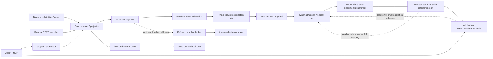

# L2 Order Book Data Plane

## 1. 状态与目标

本文定义 public L2 从采集、可恢复记录、订单簿投影到程序化消费的合同。Rust / TL2S 已通过 [L2 Runtime Adoption Decision](../architecture/l2-runtime-adoption-decision.md)，并形成单标的 production-candidate service、loopback gRPC、仓库托管 supervisor、连续 TypeScript owner admission、磁盘水位保护，以及 owner-issued TL2S → Parquet compaction / bounded read → Control Plane non-economic attachment 纵切；多 symbol、24h 自然轮转验收、raw GC、Replay Runner cutover 与 broker 仍未完成，因此保持 `active-partial`。`l2-recorder-bakeoff` 继续是证据模块，不是生产依赖。

目标是：Agent、LLM、MCP 和任一消费者离线时，L2 owner 仍能连续运行；任何不连续都成为显式 epoch / incident，而不是被静默修补。

## 2. 决策边界

| 能力 | Owner / 语言 | Authority | 禁止 |
| --- | --- | --- | --- |
| WebSocket、snapshot bridge、sequence、book、raw writer | 独立 Rust daemon | 当前连续 epoch 与本地 durable append | API key、Binance write、策略、LLM |
| manifest / retention / catalog admission | `market-data-products` owner / TypeScript | finalized segment、coverage、hash 与 lineage | Rust 直写 owner SQLite |
| current-book 查询 | Rust typed read port + TypeScript owner client | 内存投影及其 freshness / continuity 状态；固定 loopback、symbol、deadline | 从 Kafka/raw 临时拼“当前簿”；由 caller 注入 endpoint |
| durable 分发 | 可选 Kafka-compatible adapter | consumer offset；不是采集事实源 | 以 broker “exactly once”替代 owner 幂等 |
| Replay / RD | finalized manifest、后续 Parquet reader | 冻结 dataset / source lineage | 用当前 gRPC snapshot 冒充历史 L2 |
| Agent / MCP | owner health、coverage、incident 的北向适配 | 无新 authority | 实时 transport、book owner、内部总线 |

Rust 采用已通过 [Program-Owned Runtime Migration](../architecture/migrations/program-owned-runtime-migration-plan.md) 的 P0 gate。Go 不扩成第二套数据面；TypeScript 保留 supervisor、owner admission 与运维编排。

## 3. 数据流与确认点



接收确认顺序固定为：

1. 校验 payload、symbol 与 epoch；
2. 成功 append 到本地 raw segment；
3. 按 `U/u/pu` 更新同一 epoch 的 book；
4. 发布可查询的新 watermark；
5. 若启用 broker，由 durable publisher 从 raw offset 异步发送。

内存状态、gRPC 或 broker 成功都不能替代第 2 步。raw segment 是采集证据；只有 finalize、hash 与 owner admission 后，才成为可供 Replay / RD 引用的正式 source ref。

## 4. 连续性与状态机

```text
starting -> buffering -> bridging -> live
                  \         |         |
                   +----> resyncing <-+
                              |
                         live | degraded
                              |
                    draining -> stopped
```

- 每次连接、snapshot 重建或 gap recovery 创建新 `stream_epoch`；epoch 不跨 gap 延续。
- 只有 snapshot bridge 成功、`pu == previous.u`、raw append 正常且 book freshness 合格时才是 `live`。
- bridge miss、parse failure、`pu` gap、queue overflow、level-cap breach、raw append / fsync failure分别记录 reason；当前 epoch 以 `incomplete` finalize 或 salvage。
- WebSocket close / 24h rotation 使用有界退避重连；新连接重新 buffer + snapshot，不复用旧 book。
- 进程重启先 salvage 唯一 partial segment，再从新 snapshot 建新 epoch；不得根据旧内存 checkpoint 猜测连续性。
- stale、resyncing、degraded 或 incomplete 状态必须由 read port 原样暴露；交易消费者 fail closed，不使用最后一次值伪装 fresh book。

### 故障隔离

| 故障 | owner 行为 | 消费者可见结果 |
| --- | --- | --- |
| WebSocket / snapshot 失败 | 当前 epoch 终止，退避后新 epoch | `resyncing` / unavailable |
| bounded queue 饱和 | 明确 overflow，终止 epoch | 不发布跨缺口更新 |
| 本地磁盘 / fsync 失败 | 停止接纳并报警 | `degraded`，readiness=false |
| projector / daemon crash | supervisor 重启、salvage、新 snapshot | epoch 改变；客户端重新取 snapshot |
| broker 不可用 | raw 继续落盘，publisher offset 滞后并重试 | current-book 查询不受影响；distribution readiness=false |
| broker backlog 或磁盘逼近硬限 | 停止扩大 backlog，报警并按 retention policy 处置 | 禁止静默 drop 或跳 offset |
| gRPC 客户端慢 / 断开 | 丢弃该连接的有界发送队列并要求重连 | owner、其他消费者不背压 |

生产 supervisor 必须使用有界重启退避、shutdown drain、精确子进程 ownership 与资源限制。Agent 退出不触发 daemon 退出。

Retention 只冻结安全下界：epoch admission 初始为 `raw_hot`；owner 先登记唯一 job，Rust 只读取该 job 指定的 complete TL2S evidence 并 create-new 发布 Parquet + proposal；owner 逐字段闭合 job、source manifest、row count、Parquet bytes/hash 后才推进为 `compacted_pinned`。两种状态均固定 `deletion_eligible=false`。Market Data 已能把 Control Plane owner-read 的完整 self-hashed attachment 验证为本地 source referrer，并只保存 immutable 最小收据；该收据是 catalog reference，不是删除许可。owner 另提供单 epoch、确定性 self-hashed 的只读闭包审计，区分 raw、压缩后零登记引用和压缩后有登记引用；并提供按 `epoch_id` 排序、最多 50 条的 self-hashed 摘要页。页内计数不冒充全 catalog，跨页不声称同一 snapshot，且不产生删除候选。其范围仅是 Market Data 已登记 catalog，`0` 不证明外部无引用，所有状态均返回 `forbidden_no_gc_authority`。其他 consumer 的 referrer 闭包、release 语义和独立 GC gate 落地前，不自动删除 raw、snapshot、manifest、Parquet 或 incomplete incident evidence。磁盘进入 soft watermark 时 readiness 降级；hard watermark 或无法读取磁盘状态时，supervisor 在启动前拒绝或对运行中 child 做 drain 后失败终止。

## 5. 最小事件合同

所有边界共享以下 identity；具体 protobuf / schema 在首个生产纵切中冻结：

```text
contract_version
exchange + market + symbol
stream_epoch + event_id
first_update_id(U) + final_update_id(u) + previous_final_update_id(pu)
exchange_event_time + exchange_transaction_time + local_receive_time
raw_segment_ref + frame_offset + payload_hash
continuity_status + source_status
```

`event_id` 由稳定 source identity、epoch 与 raw frame offset 派生，不用进程时间或 broker offset 充当。价格与数量保持规范化 decimal string；跨语言边界不使用 binary floating point 表达交易所数值。

### Kafka-compatible 分发 profile

只有 broker adoption gate 通过才启用。首条 rail 只承载已 durable append 的 raw depth event：

- record key：`exchange/market/symbol`，保证同一 symbol 在单 partition 内有序；不声称跨 symbol 全序；
- delivery：at-least-once；producer retry 与 consumer replay 都允许重复；consumer 按 `event_id` 幂等；
- offset：只表示 transport 位置，不替代 `u/pu`、epoch、raw offset 或 coverage authority；
- retention：按恢复窗口和磁盘预算配置；raw archive / manifest 保留策略独立；
- schema evolution：新增字段向后兼容；改变 sequence、decimal 或 identity 语义必须升 major rail version；
- 派生 feature / snapshot topic 不预先建立；出现真实独立消费者后另行评审。

初始实现允许 Kafka 或 Redpanda 提供同一协议；产品合同不绑定具体发行版。未满足多独立 consumer、独立 replay offset、ack/retry/DLQ 或单机 port 瓶颈之一时，保持 broker disabled。

## 6. 最小查询语义

首个 read port 必须支持三类语义，但本文不提前固定最终 RPC 数量：

- **current snapshot**：返回 bids / asks、epoch、last `u`、source / receive / publish time、checksum、freshness 与 continuity；只返回同一 epoch 的原子视图；
- **bounded watch**：先给 snapshot identity，再给同 epoch update / watermark；客户端落后、epoch 变化或服务端队列饱和时返回 typed resync，客户端重新取 snapshot；
- **health / coverage**：返回 source、raw writer、projector、read port、可选 broker publisher 的独立 readiness 和最近 incident ref。

默认服务协议为本机或内网 gRPC；不得暴露公网。调用方必须设置 deadline、校验 schema / epoch / freshness，并在 unavailable / stale / resync 时 fail closed。MCP 可读取 health / coverage 摘要，不转发逐档数据。

## 7. Backpressure 与容量

- network reader、raw writer、projector、每个 read client 和可选 publisher 均使用独立 bounded queue；任何上限必须配置化并进入 health。
- 不通过无限 channel、无限 book levels、无限 broker retry 或无限 partial segment 换取“看起来不掉线”。
- 监控至少覆盖 ingest rate、queue utilization、append / fsync lag、projection lag、event lag、book levels、segment bytes、resync reason、publisher lag、client drops、RSS / CPU / disk headroom。
- readiness 是组合结论，不等同于进程存活；`live && raw_durable && fresh` 才可服务交易热路径。broker 仅在对应消费 profile 启用时进入 distribution readiness。
- 容量阈值由 symbol 数、100ms depth 实测与目标机器 soak 冻结；本文不虚构 QPS / latency SLO。

## 8. 对现有模块的迁移影响

| 现有面 | Phase 1 处置 | 后续接入条件 |
| --- | --- | --- |
| `l2-recorder-bakeoff` | 保持证据模块，不被生产 import | 采用 ADR 后提取经 parity 验证的 Rust core，bake-off fixture 继续当 oracle |
| `market-data-store` | 已实现 epoch admission、唯一 compaction job、proposal/Parquet admission、`compacted_pinned`、immutable Control Plane attachment referrer receipt 与只读 retention/reference audit | Rust 只提交 typed proposal，不直写数据库；审计只覆盖已登记 catalog，零引用不代表可删；incomplete epoch 不晋升，raw 仍不可删 |
| Replay Ledger / RD | 已有 owner-pinned source descriptor、非经济 bounded adapter，以及绑定 reserved Trial / Request / canonical Dataset Manifest / exact source-batch-frame range 的 immutable Control Plane attachment；State Store 正式 CLI/read port 可 create-or-identical issue 和按 Reservation hash 读取 | Runner 接入前保持 `runner_compatibility=not_bound`；attachment 不改 OHLCV Manifest、不保存 raw rows、不跨 epoch拼接、不产生 Fill；Market Data 不反查 Control Plane SQLite |
| execution / fast guard | 零修改 | 有 fresh typed fact、deadline 与 stale fail-closed 测试后才接 current-book port |
| `domain-bus` | 零修改 | 继续只记录 control / ref envelope，不承载 depth delta |
| Agent MCP | 已增加 exact epoch / bounded page retention audit、`l2_service_health` 与 `l2_book_watch_consumer_health` 白名单只读适配 | 只调用固定 owner CLI；health 去 PID/路径且无生命周期控制，resident consumer 仅给 readiness、baseline identity 与 aggregate counters，retention 不增加删除 authority |
| Runtime health guard | 已支持 service owner 与 resident consumer 两个独立 opt-in pre-cycle check 及 per-job dependency | 仅通过登记 owner read 消费 readiness 与安全 projection；默认不启用、不直读 PID/路径/SQLite/gRPC、不获得生命周期 authority |
| Current-book probe | 已接首个独立、只读、非经济程序化消费者 | 必须先通过登记的 owner health，再读登记的 current-book owner surface；同 symbol/epoch、freshness 与 authority 漂移均 fail closed，不进入 J01–J07 或 MCP |
| Resident watch consumer | supervisor + worker + atomic latest projection 已实现 | worker 复用 bounded watch/resnapshot 状态机；owner read 只给 health、latest baseline 与累计 counters，不给 PID/path/lifecycle/delta delivery |

目录移动、数据格式冻结、owner-store migration、consumer cutover 分开完成；任何阶段都不得让 Replay / RD 或 live execution 依赖 bake-off 临时路径。

## 9. 分阶段采用门

### A — Rust owner（当前门）

- Bun / Go / Rust fixture、gap、segment、crash recovery parity 通过；
- 至少一小时 natural soak 合格，零 silent gap / overflow，全部 finalized segment 可复验；
- adopter ADR 明确语言、TL2S 编码、资源证据、已知限制与回滚；
- Rust fmt / check / clippy / test、依赖审计、supervisor 与 observability 进入项目质量闸。

### B — 单 symbol production vertical slice（进行中）

- `BTCUSDT` public-only daemon 独立于 Agent 启停；
- snapshot / gap / restart / disk failure / slow-client 注入全部 typed fail closed；
- raw finalize + manifest admission + current-book read port 形成端到端 fixture parity；
- 生产与 bake-off 使用不同 module / data path；可一键回退到“无 L2 consumer”。

已完成的 B 证据：repository-owned detached supervisor、原子 runtime/terminal receipt、精确 PID stop、真实子进程强杀后的自动重启与 partial salvage；连续 admission scanner、原子 manifest-last、磁盘软硬水位与 child RSS/CPU 采样已接通。5 秒轮转纵切生成 4 个 proposal，3 个 complete 自动 admission，1 个 snapshot bridge miss 保留拒绝观察；硬水位在 child attempt 0 前阻止写入。另以 49 帧真实 admitted epoch 完成 owner job → Rust Zstd Parquet（28,129 bytes）→ owner byte/hash admission → Replay bounded read；P1.7 重新从真实 bytes 生成 source `8ae117…f0d8` 与 full batch `da0985…7f91`，frame `[1,50)`、首末 `u`、payload hash、source coverage 全部闭合。Control Plane 已进一步实现 create-or-identical exact attachment registry 与正式 CLI/read port：绑定 reserved Trial、Request、full Manifest、source/batch hash 与半开 frame range，拒绝越界/跨 epoch/hash drift，且不复制 raw rows。P1.8 增加 Market Data immutable referrer receipt：消费完整 owner-read snapshot，使用共享 NFC canonical hash 复验并闭合本地 pinned source，只保存最小 hashes/bounds；真实 49 行 source 纵切生成 receipt `b8cc82…73b5`，update/delete、source/hash/economic drift 均 fail closed，且 retention 仍为 `compacted_pinned/deletion_eligible=0`。P1.9 再增加确定性只读 retention/reference audit：绑定 epoch manifest、pinned compaction/source 和全部登记 receipt，危险 retention、receipt self-hash 或 source drift 均 fail closed；同一真实 epoch 返回 1 个登记 referrer、`compacted_pinned_with_registered_referrers` 与 audit `0bfcb5…487b`，审计前后 retention 仍为 `deletion_eligible=0`。P1.10 将该 exact owner read 接入 Agent MCP 白名单；真实 stdio MCP 调用返回同一 audit hash 与删除禁止结论，适配层没有 SQL、路径或 GC 分支。P1.11 增加 owner-bounded audit page 与 MCP 薄适配；三 epoch synthetic fixture 证明游标/页 hash，真实 stdio page 返回 1 条、page `7b68f9…954e`、`deletion_candidates_produced=false`。P1.12 增加唯一 active supervisor 的 owner health 与 MCP 薄适配；真实 stdio 返回 `healthy/overall_ready=true`、live continuity、零 incident，且不暴露 PID/路径或 lifecycle authority。审计不写库、不扫描文件且固定拒绝删除。真实 source/batch 复验与完整 synthetic Trial issuance fixture 分开，不冒充生产 Trial。Attachment 固定非经济、Runner 未绑定；raw 不可删。短周期证据不替代正在运行的 24h 自然轮转验收。

P1.13 将同一 owner health 接入程序化 runtime guard；真实 pre-cycle 采样返回 `ok`，state age 3,677ms / budget 90,000ms、live continuity、零 incident，且落库 projection 无 PID/路径、无 lifecycle authority。该 check 仅在 `runtime_health.require_l2_ready=true` 时进入 automation cycle，未声明的周期保持原行为；本阶段不把 health failure 粗暴升级成全局 job 停机，后续 consumer 必须显式声明依赖并保留防御动作通道。

P1.14 增加 per-job health dependency：`job_health_requirements.<job_id>=["l2_service:owner_health"]` 自动启用 L2 owner check，runner 解析 processor 的业务 status 与逐项 check status，只阻断显式 consumer。未知 job/check、关闭 health processor、配置冲突及让 J01 reconciliation 依赖 L2 均 fail closed；reconciliation 继续作为 defense bypass。真实 job-graph processor 纵切返回 `completed/business_status=ok/l2_check=ok` 并写入同一 ops store；同时修正 lifecycle tool cwd 下相对 DB 参数误指向模块内路径的问题。

P1.15 增加程序化 current-book owner client 与首个只读消费者。Owner client 只允许 depth `1..100` 和 freshness `100..2000ms`，固定 unique active owner、loopback endpoint、release binary 与 `1500ms` deadline，并验证 schema、symbol、epoch、safe integer、hash、canonical decimal、uncrossed top、live/fresh。`orchestration-ops/l2-current-book-probe` 再先读 exact owner health，要求 `healthy/overall_ready=true`，然后读取同 symbol/epoch 的 current book；输出固定 `non_economic_observation_only`、零 writes、`execution_compatible=false`。该纵切不新增 automation job，不经过 Agent/LLM/MCP，也不给 Replay、策略或执行任何 authority。

P1.16 闭合 bounded-depth snapshot：Rust query 不再裁掉 gRPC 已有的 levels/timestamps，owner 必须验证 bid 降序、ask 升序、level count、best-level、`exchange event/transaction + local receive/publish` 时间关系，并以 `{asks,bids}` 重新计算 bounded book SHA-256。Probe 使用 BigInt decimal 运算派生 `spread_absolute`、`spread_bps_x1e6`、双边 quantity sum 与 `depth_imbalance_ppm`，不经过 binary floating point。真实 20 档纵切在同一 live epoch 返回 hash-verified bids/asks，freshness `108ms`，spread `0.1`、数量 `13.102/30.49`、imbalance `-398880ppm`；派生合同固定 `economic_authority=none`，不是策略信号、fill/liquidity 或执行质量证明。

P1.17 闭合 bounded watch：Rust query 支持 `1..100` events、`100..5000ms` 双界限，服务端 `tokio::watch` 保持 latest-only coalescing，慢消费者只取最新 watermark、不背压 ingestion。Owner 固定 endpoint/symbol/release binary 与 `watch_ms+1500ms` deadline，校验 event identity、update/publish 单调、epoch 不回返，且 epoch change 必须携带 `resync_required=true`。独立 probe 先过 exact owner health，并要求首 watermark 与 health epoch 相同；resync/rollover 输出 `read_new_current_book_snapshot`，不尝试拼接缺失 delta。真实 `500ms/10 events` 纵切收到 6 个同 epoch live watermark，因时间界到达以 `timed_out=true` 正常结束，零 resync；Rust fixture 另证明慢读只见最新 update `103`，新 epoch 强制 resync。该 watch 不是 depth-delta、Replay、broker、策略或执行 rail。

P1.18 将 watch 接入 bounded reconnecting consumer session：会话先取 current-book baseline，再执行最多 `1..120` 个 watch cycle，总时限 `2s..300s`；每次 watch failure、epoch change 或 resync 都先强制重取 fresh snapshot，禁止把缺失 watermark 当 delta 补齐。重试策略固定为 `100/200/400/800/1600/2000ms`，连续失败最多 6 次、单会话总失败最多 20 次；caller 不能注入 endpoint、进程、重试算法或基础设施。输出只保留 bounded transition、epoch/hash、计数和 typed unavailable class，不泄漏 owner stderr/path/PID。真实 `3 cycles / 500ms` 会话在 `2067ms` 内完成：initial snapshot freshness `103ms`，三轮各观察 6 个 watermark，保持同一 live epoch，零 retry/resync/reconnect。该 session 位于 `orchestration-ops`，不是 Rust 热路径、永久 supervisor、broker、durable log、MCP 或经济 rail。

P1.19 在 bounded session 外增加 resident consumer：operator launch 创建独立 supervisor/worker，supervisor 只做 exact-child restart 与 bounded backoff，worker 在每次 snapshot/watch/retry 后原子替换 latest observation projection；固定 owner read 将其收敛为 readiness、latest epoch/hash、snapshot freshness 和累计 cycle/event/retry/resync/reconnect counters，不返回 PID、路径、内部错误或 lifecycle command。为避免同步 owner subprocess 饥饿信号事件循环，session 每个成功 transition 后显式 yield；真实 6 秒 lifecycle fixture 完成 11 个 watch cycle、64 个 watermark、2 次周期 baseline、零 retry/resync/reconnect，并以 child exit `0` 写出 completed terminal receipt。常驻实例再经 exact worker `SIGKILL` 注入：supervisor 在约 `0.6s` 内恢复 attempt 2/fresh baseline，`worker_start_total=2`，且重启前 13 cycles / 142 events 累计值未清零。随后全仓高负载回归期间累计至 597 cycles / 6,447 events，经历 1 次 watch 与 2 次 snapshot unavailable、3 次退避及 1 次 resnapshot 后自行恢复 `healthy`，底层 L2 仍为零 incident。该 projection 不是 durable log、delivery ack、depth delta、Replay source 或经济事实。

P1.20 将 resident consumer owner read 接入 runtime health guard：只有显式 `require_l2_watch_consumer_ready=true` 才读取 `ops.l2-book-watch-consumer`，校验 schema、无写入/生命周期 authority、完整 readiness、fresh control、baseline epoch/SHA-256/timestamps 与非负累计 counters，并只把该安全 projection 写入 `ops_runtime_store`；PID、路径、内部错误与 limitations 均不越界。`job_health_requirements.<job_id>=["l2_watch_consumer:owner_health"]` 可为单个任务自动启用该 check，失败只阻断声明者，J01 reconciliation 仍禁止依赖健康 rail。真实 pre-cycle 纵切在 attempt 2 的常驻实例上落库 `ok`：同一 baseline epoch `1784714017480-0001`、book hash `402f0f…130b8`、871 cycles / 9,413 events、1 次 resnapshot/reconnect/watch failure 与 2 次 snapshot failure；真实 automation plan 只给 `slow_track_market_watch` 附加依赖，reconciliation 无依赖。当前没有任何交易、策略、RD 或执行任务默认消费该 projection。

P1.21 将同一 resident consumer owner read 接入 Agent MCP 显式白名单 `l2_book_watch_consumer_health`：tool 固定空输入、stdio/read-only/idempotent/closed-world，只调用 `consumer-read.ts`，不重新解释 readiness、baseline 或 counters，也不提供任意命令、depth stream、PID/路径、生命周期或经济 authority。真实 MCP client 纵切返回 `healthy/overall_ready=true`、epoch `1784714017480-0001`、snapshot freshness `53ms` 与累计 1,686 cycles / 18,234 events，序列化结果不含 PID/path。Agent、runtime health 与代码消费者至此共享一个 owner fact；Agent/MCP 下线仍不影响 Rust service 或 resident consumer。

P1.22 增加首个 program-owned one-shot shadow wakeup：固定要求 L2 service 与 resident consumer 两条 owner health，只运行 ops lifecycle processors，禁用所有 domain jobs、live writes 与真实通知；`ops_lock` 租约、稳定 cycle identity、attempt-scoped observation、terminal skip 和 stale-running recovery 防止正常重复唤醒产生双执行。真实 cycle 返回两条 L2 health `ok`、3/3 processor completed、7/7 domain job disabled/skipped，租约正常释放；同 cycle 重放未再次运行 job graph。该入口不读取 depth stream、不生成经济事实，也不改变 L2 owner authority；常驻 cadence、lease heartbeat、timeout/drain 与 Agent 结果对照仍属后续 P3。

P1.23 在 one-shot 上增加前台常驻 program shadow supervisor：外层 20 秒 durable lease 每 5 秒续租，独立 generation 表保证 fencing token 跨正常释放继续单调；每个时间槽生成稳定 cycle id，生命周期子命令固定 30 秒 timeout，`SIGINT/SIGTERM` 不再启动新轮并等待当轮 drain。真实两周期均得到两条 L2 health `ok`、3/3 lifecycle completed、7/7 domain jobs skipped，随后两层锁清空；同槽连续重启的两层 token 均由 `1→2`，第二轮只做 terminal skip；真实 `SIGINT` 也以一轮完成、`stop_reason=signal`、无残留锁退出。该 supervisor 不持有 PID-file/restart authority，由外部 process manager 托管；它仍不读取 L2 depth、不开放 J01-J07 或 live write。进程崩溃、DB busy 与 Agent 结果对照仍属于 P3 后续。

P1.24 闭合 program shadow 的首轮故障与对照证据：ops store 持续被锁时，one-shot/supervisor 在 `1000ms` busy window 后返回 `ops_store_busy`，不启动 lifecycle/domain command；真实 supervisor 被 `SIGKILL` 后遗留 token `1`，到期后新进程以 token `2` 和 `recovered_stale=true` 接管，完成一轮后无 active lock。Agent job-graph 与 program wakeup 现在都输出 canonical parity projection，只比较 ticket/status/reason、domain runtime result、processor/health、summary 和 incident/attention，不把 cycle/ref 当差异；两条真实路径得到相同 hash `5b130b67…0773`。这些证据仍只说明 L2 health consumer 的 program shadow 等价性，不授权策略、执行或 Replay 使用 L2 数据。

P1.25 将单轮对照扩为持久迁移观察：resident supervisor 可选择每轮运行 legacy Agent shadow profile，将两侧 canonical projection/hash 以 immutable ledger 写入既有 ops store。launchd 配置固定 `KeepAlive`、绝对 Bun/entrypoint、`TRADE_REPO_ROOT` 与诊断日志，不引入 PID file；但当前源码位于 macOS 受保护的 `Downloads`，安装器会 fail closed，已回滚无法打开源码的实例。首次 tmux 观察以 fencing token `4` 运行 27 轮后受控退出，得到 26 match / 1 mismatch；复盘确认 mismatch 是两条路径先后读取实时 resident-consumer health 时发生状态翻转，不是程序图与 Agent 图的实现漂移，也证明顺序 live read 不能作为严格 parity 输入。

P1.26 将 parity 口径修正为 `shared_owner_result_replay_v1`：program 每轮只执行一次固定 owner command，Agent 路径仍独立构图，但回放该轮捕获的同一组退出码/stdout/stderr，再比较 canonical projection；回放键保留 executable / cwd / argv 语义，只去除 cycle、时间和结果 ID 等 invocation identity，捕获缺失或命令语义漂移均以 typed failure 暴露。ops owner 与 Agent MCP 新增只读 parity status，同时给出 raw、shared-input comparable、legacy sequential counts、最新双侧 hash/basis 和 fenced lease state，不泄漏 holder/PID/path/detail，也不作 cutover 判断。旧的 28 条观察原样保留并归类为 `sequential_live_reads_v1`；真实共享输入预检与短观察累计 `7/7 match`，token `5/6` 均正常释放。最终一小时 bounded observation 于 2026-07-23 01:11 CST 由 operator-owned tmux 从零启动并取得 token `7`；J01–J07、live write、真实通知仍全部关闭，该证据仍不授权策略、执行或 Replay 使用 L2 数据。

该一小时窗口在 2026-07-23 01:19 CST 捕获一次两侧一致的降级输入：program 与 Agent hash 相同，但 L2 owner read 短暂失败、resident consumer 进入重试并随后恢复；Rust owner 进程未退出、continuity 仍为 live、incident 仍为零。故此轮可继续证明共享输入 parity，却不能作为零故障 availability gate。随后 supervisor 超过 `duration_seconds=3600` 仍未退出；精确进程树显示其同步阻塞在 `state.flow-projector --active-flows` 超过 19 分钟，需 operator 终止该子进程后才以 typed script error 释放，stdout 没有伪造完成 verdict。planning read 已改为 30 秒异步硬截止与精确子进程收割；真实 exclusive-lock fixture 在约 100ms deadline fail closed，3 秒 resident fixture 在 3.23 秒以 `stop_reason=duration`、lease released、`4/4` shared-input match 退出且无残留子进程。

终态 SQLite 只读审计保留 `53/53` 条 `shared_owner_result_replay_v1` match、零 comparable mismatch；legacy sequential history 仍为 `27/28` match。结合上述退出缺陷回归，P1.26 的 parity 与 bounded-exit 缺陷收口；原始窗口仍不能充当零故障 availability gate，后者转入独立 P1.28 clean window，J06 canary 仍需等待该 gate。

consumer 现以固定 taxonomy 区分 owner-health/current-book/snapshot/watch failure，并跨恢复与 worker restart 保留最近一次净化后的 timestamp、operation、class、attempt；原始异常、stderr、路径、PID 与 owner detail 不进入 owner/runtime/MCP projection。真实 worker `SIGKILL` 后 supervisor 由 attempt `2→3` 自动恢复，累计 counters 未清零，owner state 在恢复 healthy 后仍保留最近的 `watch_unavailable` timestamp/operation/class/attempt，证明新合同已加载。

P1.28 以 production-like immutable release 作为 availability 主证据，并把 dirty workspace 长驻栈仅作对照。`2026-07-23T02:15:28Z..02:30:30Z` 的 15 分钟窗口内，release consumer 完成 696 个 watch cycle / 7,461 个 watermark，watch/snapshot failure、retry、reconnect、worker restart、resync 全部零增量；Rust owner 始终 `running`、attempt 与 consecutive failure 零增量，RSS `15.2MB→15.4MB`、历史峰值 `20.2MB`。同窗 workspace 对照完成 793 cycle / 8,563 event，出现 1 次 typed `watch_unavailable` 后自动恢复，owner 未重启；另对 release loopback 连续 24 次真实 `1000ms` watch 均成功，`timed_out=true` 被确认是正常有界完成而非 failure。采用门据此固定为 production-like release 的 clean rolling window + owner 零 restart/incident + consumer live/fresh 终态；不要求进程生命周期绝对零瞬时错误。P1.28 放行 J06 one-shot canary，但不放行实盘写、Replay cutover 或双 owner。

### C — consumer 与 broker

- 第一个非经济 Replay source consumer 已通过 finalized ref 接入，Control Plane 已可冻结 exact experiment attachment；进入 Runner / economic semantics 仍需独立 consumer authority 与数据现实 gate；
- 只有 adoption trigger 成立后实现 Kafka-compatible adapter，并验证停机积压、重复、乱序防护、追平与 retention；
- Replay / RD、执行 guard、feature worker 分别通过自身数据现实 / freshness gate，不因 transport 存在而自动接入。

## 10. Phase 0 完成定义

- production owner、authority、query、transport 与 MCP 边界无歧义；
- sequence / epoch / durable append / resync / backpressure 失败语义可测试；
- Kafka 可加入但不会成为采集事实或 current-book owner；
- Replay / RD 与现有 live 模块在首个纵切保持零行为改动；
- natural soak verdict 出来后，能直接选择“进入 B”或“修复并重跑 A”，不需要重做架构。
