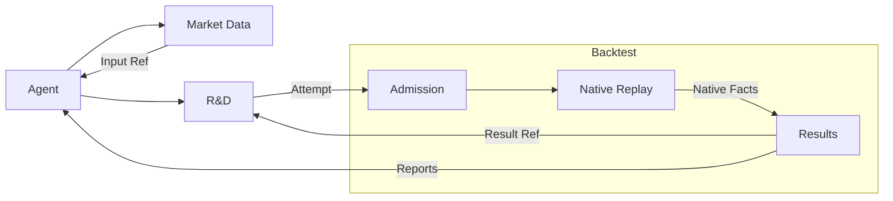

# Research requirements and acceptance

R&D converts a sourced market hypothesis into a frozen, reproducible strategy artifact while keeping
exploration separate from protected qualification.

## Research scope and autonomy

Research covers Binance products in the approved market scope: perpetuals, spot and spot/perpetual pairs, including the venue's actual equity/commodity/index-referencing instruments. FX or macroeconomic series may be admitted explanatory inputs, not an independent trading venue or account integration. R-1 first acceptance remains Binance USDT perpetuals. Spot intake and multi-leg hosting require their own integration and acceptance; no Paper/Live path is admitted.

**Target state, not a claim of current availability.** An external agent is a user-chosen assistant outside
the product, such as Codex or Claude, connected to domain MCP/CLI tools; another host can use the same
interface. The user supplies a research theme, risk tolerance, available data, and resource-spend cap. Before
experiments, the agent registers portfolio objectives, benchmarks, risk constraints, return units, and
observation horizon. Objectives cannot change after results to select a winner. Within that frozen scope, the
agent may find sources, propose and preregister new mechanism families, author strategies, run experiments,
diagnose failures, and open successor rounds.

There is no fixed trial-count limit, but every run, rerun, and look is counted in the trial and data-read
ledgers. Spend caps pause work, method stops have explicit decisions, and leaving the theme or changing pass
criteria needs a new user request. Product and agent host enforce separate resource limits and report them
separately; unavailable model usage is never zero. The product persists business facts and deterministic jobs;
a host-side timer wakes the external agent. A new session resumes from Owner receipts, not from the previous
chat or a living MCP process. This grants neither the agent nor the product Paper, Live, or real-money
execution authority.

The Agent may correct implementation against the frozen method, preserving correction lineage, affected results and successor verification. It cannot erase failures or reuse the old run identity for a changed run. Changing pass/closure criteria or statistical protocol requires user confirmation and a new frozen version.
For example, correcting coin clustering to the prescribed week clustering fixes implementation; changing the prescribed clustering revises the protocol. Neither makes old results independent evidence for the new protocol.

| User expectation                                                | Observable result for agent and user                                                                                                                                                                                                                                                    | Authority and failure path                                                                                                                           |
| --------------------------------------------------------------- | --------------------------------------------------------------------------------------------------------------------------------------------------------------------------------------------------------------------------------------------------------------------------------------- | ---------------------------------------------------------------------------------------------------------------------------------------------------- |
| Start from a source and question, then explore within the theme | The Agent organizes sources and hypotheses and chooses its analysis method; the product freezes approved boundaries, selected experiment inputs and trial family, preserving lineage for new families                                                                                   | Source Intake and R&D receipts; sources are data, and unregistered or out‑of‑scope experiments are refused                                           |
| Use only data available at the time                             | Point‑in‑time universe rule, listing and delisting treatment, data version, costs, funding, and capacity identity are frozen with the request; every agent data read and trial is traceable                                                                                             | Market Data and R&D ledgers; protected partitions, missing data, and unreproducible scope fail closed                                                |
| Author real order behavior                                      | The Agent writes a native Nautilus Strategy; R&D seals source, parameters, dependencies and environment as an immutable Artifact that can express expiring resting limits, linked stops and targets, partial exits, stop moves, holding limits, and slots assigned by actual fill order | R&D authoring and build receipts; build and semantic failures do not become economic failures                                                        |
| See a useful research report                                    | Under the same frozen data and execution model, report portfolio return, drawdown, risk‑adjusted results, holding and cash comparisons, concurrent exposure and overlap, costs, and capacity first; single‑strategy and random‑entry comparisons diagnose causes                        | Native Backtest Result and R&D Diagnosis; charts, agent prose, and run success create neither selection nor qualification                            |
| Continue or stop unattended                                     | Each round records prediction, observed result, failure cause, mechanism change, and resource use; spend cap and method stop rules can halt it, while trial count is not a run quota                                                                                                    | R&D iteration records and knowledge ledger; unknown results stay unresolved and weak evidence waits for new data                                     |
| Evaluate independently and observe forward evidence             | Qualification may internally distinguish pass, equivalence to null, and insufficient evidence, but exposes only `QUALIFIED` or `CLOSED_NOT_QUALIFIED` to research; record‑only forward is optional simulation evidence; qualified candidates follow the real trial route below          | Qualification owns protected and forward facts; public nonqualification cannot close a mechanism, and forward recording cannot create trading orders |

### Agent takeover and imported data

A Research Project groups work by objective. Improving Ronnie resting entries links hypotheses, strategy
versions and experiments for entry refinements, staged exits and volatility filters without requiring a separate
project per strategy. Branches retain their results and pending work while sharing the frozen theme and budget.
One Research Project persists across replacement of the single external Agent, retaining product budget, trial and data-exposure ledgers;
family rules and experiment identities remain frozen separately. Before exhausting its quota, the Agent pushes
unfinished strategy work to the project Git repository and registers the exact commit, completed work and next
action in R&D. Its successor reads submitted tasks before retrieving that revision and continuing development.
A draft is not a qualified strategy; unpushed files are not claimed recoverable. Handoff resumes project/Owner receipts without
resetting census or independence. See [R&D project admission](../owners/rd/#research-projects-and-agent-takeover)
and [Market Data imports](../guide/market-data-intake/#target---external-historical-file-imports). Files cannot directly
become backtest market facts.

### Factor discovery, durable knowledge and reuse

During R-1 iteration, a user discovers a promising indicator, pattern or rule and wants a future agent to find and
reuse it. When the user later starts B3 research, the Agent can retrieve that same user's R-1 knowledge by
default, inspect its source experiments and applicability, and decide whether to preregister a B3 test. No
project-by-project permission is needed, but R-1 effects or qualification do not transfer to B3.
Before authoring a complete strategy, the Agent may hypothesize higher average three-day returns after a
pattern, test it on permitted data with a host script, and record the test description, conclusion summary,
existing evidence references and limitations as an exploratory experiment. Reusable conclusions enter Knowledge.
A successor can find what was tested and concluded, without guaranteed retrieval of temporary scripts, charts
or statistical tables; the Agent can repeat analysis when needed. This is external analysis evidence,
not a qualified strategy replay.
If R-1 produced a reusable filter function, the entry links its Git repository, exact commit, file and entrypoint.
The Agent retrieves that revision, adapts it to B3 and submits a new experiment. Knowledge retains references
and research evidence, Git retains code, and no factor execution service is added. Sources at `0725a7b3f89902e27cd421a18b4b879a13268534` include
`research/ronnie/loop/ledger.txt`, `loop/r1_select.py` and `loop/WORKFLOW_NOTES.md`.
The ledger records cross-loop signals and the runner tests R-1 constructs. Historical figures and its admission
rules are not confirmed product advantages or default thresholds.

The replay is: Backtest produces an exact exploratory Result → R&D checks attempt/census and the Agent diagnoses → the
R&D knowledge ledger admits construct definition, applicability, effect and evidence → a successor agent
searches `knowledge` and cites an entry → preregisters a new Intent and authors a new Artifact →
Backtest evaluates portfolio return and risk. Qualification and trials still use their respective Owners;
knowledge cannot trigger trading. One positive result is recorded as an exploratory finding, with insufficient
evidence explicit when replication or statistical support is absent. Negative, invalidated and untested scopes
remain visible.

Restart retains entries, retries create no duplicate evidence, and protected values and reasons never enter
knowledge.

This fits existing R&D, using Market Data identities and Backtest results without a new factor department or another
backtest engine. A database instance may be shared; entry writes, versions and queries belong only to R&D interfaces.
See the [Research knowledge ledger](../owners/rd/#knowledge-reuse) for entry, reuse and failure
acceptance. This is a target path: ledger implementation, exact evidence references and end-to-end search/reuse
acceptance remain missing. Documentation does not establish current agent availability.

### On-demand discovery and running strategies

At `0725a7b3f89902e27cd421a18b4b879a13268534`, `research/ronnie/scan/scan.py` finds closed daily trend signals across Binance USDT perpetuals
and reports new signals, in-trend, flat and trigger distance without accounts/orders. Its top-150/spot
intersection is not a product default. Ordinary discovery uses Agent Market Data queries and host analysis
without an Artifact, research project or R&D scan job. Exact native strategy state or warmup uses a sealed
strategy and Backtest replay; R&D links results when research needs them. Reports include total, completed,
excluded and incomplete instruments. Unknown/missing data is not no opportunity; reconstructed positions are
not account facts.

For example, BTC closed daily bars meet a pattern and appear as an opportunity with conditions met; ETH forming
daily data approaches the conditions and appears only as an observation candidate. Separate the categories with
evaluation time, source/version, bar completion, met/unmet conditions and Agent analysis versus native strategy output.
Candidates may fail, change no formal rules or trading authority, need no scorer and do not widen V0.1 replay scope.

Running strategies subscribe/evaluate through the native node without a separate scan schedule.
On demand observation does not modify running instance state. Discovery creates no deployment proposal;
Governance owns lifecycle. See [R&D on-demand
discovery](../owners/rd/#on-demand-read-only-opportunity-discovery). Full discovery operations,
native Strategy integration and end-to-end acceptance remain missing capabilities.

### Qualified backtests, real trading trials and promotion

When the research goal is reached, the Agent records the conclusion and stops. Unassessed candidates remain in R&D custody; ownership does not imply continuing execution. Iteration continues only while the goal is unmet and existing authority remains valid, or on a new user instruction.

Only when the user considers launch do they request independent Qualification for the exact frozen version. Failure records the binary public result and waits for another instruction; protected detail never returns to research, research does not restart automatically, and the result does not close the research mechanism.

After qualification the user may still decline launch or request improvement. Initial real trial requires Dashboard confirmation of version, trial template, account authority and capital policy, then enters the Governance queue. Admission uses current eligibility, capacity, existing occupancy and frozen conditions; a strategy cannot widen authority. Promotion follows preapproved conditions automatically. Minimum samples and independent-trade counting follow [Governance](../owners/strategy-governance/); staged exits do not add samples; native Trading Node owns actual execution/account facts. Unloading stops operation and records facts without automatically starting research.

## Research story replay and capability gaps

The source is `origin/claude/inspiring-gauss-pxaril` at `0725a7b3f89902e27cd421a18b4b879a13268534`.
`research/ronnie/` contains 1007 files and 31 family `INTENT.md` files, including data/charts/results rather than one
story per file. The 20 independently verifiable capability stories below cover every family Intent and cross-family
source, loop, book, discovery and forward workflows. Paths are relative to `research/ronnie/`; bare directory names
refer to their `INTENT.md`. This is contract replay against the architecture, not current runtime acceptance or adoption
of prototype thresholds, statistical conclusions or historical holdout protocols.

| Story | User goal and sources                                                                                                                    | Path, result and failure boundary                                                                                                                               | Current gap                                                                                          |
| ----- | ---------------------------------------------------------------------------------------------------------------------------------------- | --------------------------------------------------------------------------------------------------------------------------------------------------------------- | ---------------------------------------------------------------------------------------------------- |
| U01   | Interpret human methods and drawings; `community/INTENT.md; tv/; yt/; journal/score.py`                                                  | Agent interpretation → R&D provenance/annotations → frozen hypothesis; insufficient time evidence stays an outside claim                                        | Source/evidence links and Agent explanations need acceptance                                         |
| U02   | Import data and replicate across markets; `altcoins, fxrevert, goldtrend, rangex, rangex2`                                               | Market Data admits source, clocks, price basis/revisions → Backtest; missing contract/cost facts cannot establish tradability                                   | Scope defined; family‑specific data admission/native integration missing                             |
| U03   | Combine multiple bar windows; `mtf, timing`                                                                                              | R&D freezes closed/forming‑bar semantics → Market Data prepares → native Strategy; future values/inconsistent aggregation refused                               | Complex windows/warmup/input binding need acceptance                                                 |
| U04   | R-1 resting entries and partial exits; `loop/family_r.py; loop/r1_dynexit_fine.py; run_plan.py`                                          | Native Strategy → R&D Artifact → native Backtest orders; unknown/fine‑data gaps stay unresolved without duplicate coarse fills                                  | First acceptance; minute replay, aggregation, native paths and readback/reporting require acceptance |
| U05   | Compare stop and exit rules; `stops, exits; loop/r1_exits.py; roleflip/`                                                                 | Same entries/capital baseline → paired Backtest controls → Agent attribution recorded by R&D; changing R units is not improved return                           | Bounded diagnostics/paired reporting need integration                                                |
| U06   | Select filters and learned parameters; `filters, filters2, range6; loop/r1_select.py; loop/r1_select_val.py`                             | Agent chooses/trains filters → R&D records variants and frozen inputs → native replay → Agent diagnosis; reuse is not independence                              | Native packages, data access and experiment/evidence records need integration                        |
| U07   | Express multiple price mechanisms; `patterns, patterns2, setups, screen, range, range2, range3, range4, range5, volume2`                 | One native Strategy/Artifact expresses patterns/context → Backtest; no module per mechanism, unsupported rules refused                                          | Native APIs/package integration need acceptance; one narrow example proves no general coverage       |
| U08   | Study mechanisms before simulating trades; `oversold, volume; community/INTENT.md`                                                       | Agent analyzes admitted Market Data with host scripts → R&D records method/evidence → Knowledge; first‑touch/correlation is not portfolio return/qualification  | Ordinary data reads and external analysis evidence records need integration                          |
| U09   | Study funding and market state; `carry, short; loop/fetch_funding_ext.py; loop/fetch_metrics.py; loop/overlay_x2.py`                     | Market Data economics/availability → native Strategy/Backtest → R&D; settlement costs and signal reads require distinct proof                                   | OI/taker flow/historical availability/field consumption need acceptance                              |
| U10   | Use macro calendars and stress inputs; `events; loop/r1_macro.py; loop/r1_crypto_stress.py`                                              | Market Data releases/vintages → causal features → Backtest; delayed latest revisions are not PIT                                                                | Source/revision/event‑calendar admission needs integration                                           |
| U11   | Run fixed and dynamic continuous books; `trend, combo; trend/books_pit.py; loop/ensemble.py`                                             | R&D freezes membership/subrules → Market Data timeline → one Backtest equity path; selection does not reset holdings                                            | Versioned timeline/capacity contract; current fixed path cannot satisfy B3                           |
| U12   | Two‑leg carry and pair trades; `carry; loop/family_h.py`                                                                                 | One frozen Artifact → native multi‑leg orders/account replay; actual fills, fees and margin per leg, no assumed atomicity                                       | Native multi‑leg integration, netting/hedging and partial‑leg failure policy need acceptance         |
| U13   | Measure sizing and risk‑management effects; `risk; loop/r1_portfolio.py`                                                                 | Frozen sizing/risk policy → shared native account comparisons → reports → R&D; experiments cannot override production pool policy                               | Policy/cost/capital‑competition binding and reports incomplete                                       |
| U14   | Verify source fidelity and fills; `xcheck/compare.py; replay/src/main.rs; tv_line_fidelity.py; checks.py`                                | Source annotations/exported intents → native Backtest comparison → R&D repair successor; Python is no second engine                                             | End‑to‑end repair/corresponding event evidence needs acceptance                                      |
| U15   | Diagnose decay, attribution and false edges; `loop/attrib.py; loop/bucket_audit.py; loop/decay_diagnosis.py; loop/gatekeeper_book.py`    | Backtest results/stratified controls → Agent analysis with method/evidence/full census retained by R&D → continue/stop; retain losses, seal protected diagnosis | Result reads and Agent explanation/evidence records need integration                                 |
| U16   | Autonomous research and session takeover; `RD_AUTONOMY.md; loop/PROTOCOL.md; loop/RETROSPECTIVE.md; loop/LOG.md`                         | Shared budgets/census → durable jobs → agent judgment → R&D Decision; atomic budget contention, unknown jobs retained                                           | Single‑Agent continuity/full research catalog/report‑decision readback need acceptance               |
| U17   | Retain and reuse factor knowledge; `loop/ledger.txt; loop/WORKFLOW_NOTES.md; loop/r1_select.py`                                          | Counted Result → R&D knowledge → search → new Intent/Artifact; positive estimates are not automatic stability, reuse grants no eligibility                      | Knowledge records/evidence links/search consumer unimplemented                                       |
| U18   | Query current market opportunities; `scan/scan.py`                                                                                       | Agent → Market Data queries; stateful native Backtest replay → signals; R&D retains references as needed; no scan schedule, inferred state is not a position    | Read‑only discovery operations/native evaluation integration need acceptance                         |
| U19   | Observe future evidence and seal qualification feedback; `loop/FORWARD_PLAN.md; trend/forward_b3.py; journal/score.py; loop/CRITERIA.md` | Frozen candidate → two‑level public qualification; qualified backtests precede real trials, optional simulation, no copied prototype thresholds                 | Protected isolation specified; real trial stages/condition choices need freezing                     |
| U20   | Deploy findings and return to iteration; `User-approved lifecycle; product extension of forward research needs`                          | Governance pools/stages → native node → Portfolio → promote or unload to R&D; release allocation immediately, protect residual exposure                         | Target authority split; no live effect admission, stage/capital/recovery chain needs acceptance      |

### From replay to development tasks

Each responsibility path is assigned; the last column still requires delivery. Start a task at one
producer/consumer handoff and name version, input, sole fact writer, success/refusal/unknown outcome and
restart readback. A defined path is not current runtime success. U04 is first end-to-end acceptance;
U11/U12/U17/U18 test dynamic books, multi-leg, knowledge reuse and discovery without implementing all
mechanisms at once. U03/U07/U08/U14 reuse constructs and input binding. Extend native results and versioned
Agent analysis tools instead of new services per statistic.

Unsupported bounded expressions return gaps for an implementation successor, not arbitrary scripts, a second
simulator or unverifiable edge.

First-trial Dashboard confirmation is settled. Promotion options/thresholds and formal retention criteria require user-frozen policy,
not new departments. Other gaps are versioned interfaces/acceptance within assigned capabilities, giving future agents
concrete stories to develop. This target grants no real-money effects.

## R-1 resting entries and staged exits

In V0.1, the Agent may first read admitted ordinary research bars through Market Data and use its own scripts to
inspect post-breakout retracement depth, waiting times and patterns, then author a native strategy and submit formal
replay. Analysis binds the versions read; script statistics establish neither native replay results nor eligibility.

V0.1 accepts zero-fill diagnosis using an R-1 strategy with pre-order diagnostic logs. The Agent combines those logs
with native order/fill events to distinguish absent triggers, strategy filters, submitted but unfilled orders and
rejections. The strategy author supplies messages; other strategies need no fixed log template. If logs are absent,
truncated or unavailable, the pre-order cause remains undetermined. Native account facts still determine economic results.

**The first end-to-end acceptance example is the R-1 family.** It anchors the [confirmed V0.1
scope](../architecture/index.md#v01---usable-r-1-data-and-backtest-journey): deliver the usable data/replay
journey before completing the autonomous research loop. Its market baseline is point-in-time Binance USDT
perpetual history, not spot prices substituted for perpetual economics. Starting from a sourced daily
breakout-and-retest hypothesis, the agent registers the mechanism and builds a strategy on a point-in-time
universe that includes historical listings and delistings.

R-1u rests a limit near the broken level for at most ten days. After an actual entry fill, it exits under the
original stop, signal-frozen 2R target, or a maximum 60-day holding period. At most one R-1 trade per coin occupies
a slot at a time. The slot is occupied from the fill until that trade exits on a stop, target, or 60-day limit;
neither order creation nor a fixed 60-day reservation determines occupancy.

R-1s uses the same entry and original stop and splits the filled quantity into two legs. The first exits at the
same frozen 2R target. The second compares that 2R target with one breakout impulse length, `1.00 × |B - A|`,
in the trade direction from the actual fill and takes whichever lies farther in the profit direction. A and B
are breakout impulse anchors available when the signal is issued; later information cannot redefine them. Only
after the first leg meets its registered actual
profit-fill condition does the second leg move its stop to this trade's actual average entry. Touching the target
or submitting an exit order does not move the stop. Both legs have the same maximum 60-day holding period from
entry; the coin's slot becomes free only after both have actually exited. Native per-trade protection rules below
govern rounding, partial fills, and failed changes; a triggered target is not treated as a fill.

These rules define the R-1 acceptance example, not a template for other strategies. Fills, cancels, stops, and
targets follow native event order; pre-fill highs cannot count as post-fill profit. Seal and report the variants
separately. R-1s was a forward-only proposal in the source study. Its "closer target" wording conflicted with
holding a remainder after the first 2R exit; the farther target defines this strategy version. Spot prototype
inputs, results under the old target rule, and holdout conclusions do not prove an economic edge in a new
perpetual replay.

The report includes perpetual fees, funding, slippage, minimum order size, and margin constraints, and names
the fill-path resolution and events that cannot be ordered within its smallest time unit. When missing data
can change the outcome, the result stays unresolved. Passing this acceptance example establishes neither economic
edge, qualification nor trading permission. The source study is pinned to `claude/inspiring-gauss-pxaril` commit
`0725a7b3f89902e27cd421a18b4b879a13268534`, especially `research/ronnie/loop/family_r.py`,
`loop/LOG.md`, `replay.py`, and `loop/RETROSPECTIVE.md`.

### V0.1 service handoff acceptance

This replay projects R-1 onto existing service contracts. Completion conditions below are development acceptance
requirements, not evidence of an already successful execution.

| Story step or failure                       | Contract and acceptance observation                                                                                                              |
| ------------------------------------------- | ------------------------------------------------------------------------------------------------------------------------------------------------ |
| Prepare about 50 instruments and five years | Fixed members follow actual listing ranges; manifest binds minute execution, mark prices, economic inputs and warmup with named gaps             |
| Only some preparation succeeds              | Reuse completed references; R&D/Backtest refuse formal replay missing required inputs rather than shortening the window                          |
| Submit R-1u and R-1s separately             | Seal distinct strategy contents; experiments bind exact manifests/run conditions and retain separately counted, queued results                   |
| Submission times out                        | Query or resend the original request; the same attempt resolves the same job rather than duplicating execution without a receipt                 |
| Native loading or replay fails              | Retain exact failure and available diagnostics; skipped Node items or other results cannot prove this run succeeded                              |
| Fills and minute valuation                  | Native orders/OMS, fees, funding and Portfolio own facts; aggregates drive signals only and frozen native paths label assumptions                |
| Replay completes and reports are read       | Extract required facts before disposal and commit custody before reading a complete result; minute reads and primary drawdown use the same input |
| Agent disconnects or reruns after failure   | Admitted jobs persist; confirmed interruption permits a linked new full attempt while retaining original costs/records                           |
| Storage shortage and protected scope        | Stop admission of affected new tasks without evicting formal evidence; Agent/Dashboard cannot read protected assessment detail                   |

Complete zero-fill replay returns authoritative zero-fill facts with complete account, valuation and report coverage;
undefined performance metrics are marked unavailable. Missing or partial order/fill details, reports or minute series
leave the result incomplete or a named gap, never a successful empty result or summary substitute.

V0.1 need not automatically organize research, provide complete project handover or judge economic advantage.
Agents may keep modifying and comparing; complete management and knowledge reuse stay in V0.2, while
qualification, trials and trading authority stay in V0.3. Market Data, R&D and Backtest chapters respectively own
manifest, task identity and native loading contracts; this scenario creates no separate schema or state machine.

## Replay consistency and reporting

### Event causality and minimum-resolution ambiguity

The finest execution data is one minute. Native matching uses the frozen OHLC or adaptive high/low path;
same-minute entry, stop and target outcomes follow that simulated path, not stop-first or enter-then-hold overrides.
Report the path configuration and bar-resolution assumptions; the Agent may compare native configurations in
separate runs without selecting favorable outcomes after inspection. Missing minutes, invalid market facts and
unverifiable execution inputs remain gaps. Signal bars are native aggregates of the one-minute execution base. For a daily candle reaching entry and target,
minute chronology governs effective orders: a pre-entry target is not profit; a later target may exit. Coarse signal
bars do not drive matching twice. Activation, expiry, protection, capital contention and funding share one causal
account timeline. Close-confirmed signals cannot fill earlier that day, and pre-entry extremes do not describe
post-entry performance. Readback states minute precision and inferred timing rather than claiming observed ticks.
Backtest reuses native matching; strategies do not implement multitimeframe fill logic. Acceptance covers target-before-
entry, entry-before-target, protective races, invalidation boundaries, portfolio contention and recovery.

Statistics follow Nautilus: reuse native Portfolio valuation snapshots and `MaxDrawdown`. The primary report
calculates maximum drawdown from one-minute sampled account equity; list daily closing drawdown separately with
an explicit label. Minute equity includes unrealized PnL and incurred fees/funding, retaining initial, terminal
and account-change records rather than counting only closed trades. Freeze valuation sources, sampling boundaries
and event order. Do not combine instrument-specific minute highs/lows into an observed portfolio extreme; the
metric describes drawdown observed at minute samples, not every intraminute risk.

Native Portfolio supports optional fine-grained snapshots, but current analyzer portfolio returns remain
aggregated daily. V0.1 must connect the minute valuation series to native maximum-drawdown statistics; enabling
snapshots alone does not change primary drawdown. Daily closing drawdown retains its own inputs and label without
silently changing the sampling frequency of other statistics. Missing valuation, stale inputs or disconnected
minute statistics produce explicit gaps; daily drawdown or closed-trade returns cannot replace minute primary drawdown.

### Research scale and usability

R-1 `loop/r1_zone_entry_fine.py` and `loop/r1_select.py` use `ITER_COINS + ITER_EXT_COINS`: 17 majors from
`range2/run.py` plus 36 extensions from `loop/engine.py`, over the 2018 to 2022 development window. V0.1 performance
acceptance follows approximately 50 perpetual instruments over five years, freezing actual members and intervals
against Binance point-in-time coverage. This source provides scale and use cases, not prototype data sources,
local precision or return numbers as acceptance standards. Run the complete account timeline with admitted
minute execution data, marks and economic inputs; measure preparation, cache reuse, loading, execution,
statistics and readback time and peak memory. Unmeasured performance remains unproved; resource/input gaps
cannot silently shrink scope.

### Portfolio statistics and terminal valuation

Terminal handling: retain open positions at the window end, without inventing a strategy
exit or automatically liquidating. Use the frozen Portfolio valuation methodology and valid cutoff historical
mark prices for perpetual terminal equity; separately report realized/unrealized PnL, open quantities and incurred
fees/funding. Perpetual minute equity and unrealized PnL also use historical marks, while execution uses trading
data. Missing or invalid marks remain named gaps; native price fallback cannot label trade-price approximations
as mark valuation. Unincurred
exit costs are not actual costs; show fill prices separately from valuation prices with source/time/staleness.
Missing valid valuation cannot produce fictitious complete returns. Engine shutdown cleanup must not silently add
liquidation trades to the primary report.

In-run liquidation is a separate question. The V0.1 R-1 USDT perpetual primary replay leaves native
`liquidation_enabled` off: the current native check calculates unrealized PnL from cached bid/ask quotes and skips
when quotes are absent; its liquidation path closes all positions in the breached settlement currency. Turning on
the switch does not establish historical-mark triggering or fidelity to the
[Binance liquidation protocol](https://www.binance.com/en/support/faq/detail/360033525271). The primary report
must check the liquidation threshold at decidable minute event points using frozen margin mode, maintenance-margin
terms covering actual notional and labeled as historical facts or simulation assumptions, native MarginAccount/Portfolio
state and historical marks, while retaining event order
and data resolution.
If every point is provably above the threshold, a complete report under the declared minute model is allowed;
this does not prove the venue never liquidated intraminute. At the first threshold breach, missing mandatory input,
or unresolved same-minute ordering, retain preceding diagnostics but draw no complete subsequent return, drawdown
or Sharpe conclusion. Do not let an unliquidated continuation flatter results. A native liquidation sensitivity
may be reported separately when quotes and frozen configuration are available; it neither replaces the primary
result nor represents Binance liquidation. Reconsider in-run liquidation in the primary report only after a bounded
native-node path for mark-price triggers, tiers, liquidation fills and fees passes real-consumer acceptance;
do not create another ledger or matcher.

Close-confirmation rule: first-version candle/indicator conditions for signals, cancellations
and stop changes are confirmed only after the relevant bar closes and its data is available. A 15m closing indicator
cannot cancel an earlier fill within that interval. Already effective price entry/stop/target orders may still trigger
intrabar. Execution does not generate signals from unfinished indicators or backdate new protection to the parent
bar's open; retain previous order/protection effective times. Dynamic unfinished-bar indicators are outside initial
semantics. Freeze/verify closing-boundary event ordering in the shared execution contract, not input loading order.

Same-time new-entry admission order: shared execution orders by effective decision time; requests actually
available at the same decision cut use frozen canonical symbol-name ascending order, then stable
strategy/signal identity for ties. Thread scheduling, database iteration and agent submission speed do not
decide priority; never wait for future requests to form a batch. This is shared execution configuration, not a
strategy priority parameter. Existing Risk contracts still admit/refuse each request. Insufficient capacity
terminates the request with no queue, automatic resizing or recovery replay.

Ordering applies only to new-entry admission, not existing resting-order matching or protective/exit event
chronology. Acceptance varies traversal/scheduling order and preserves identical admissions and per-request
grounds.

Within one minute, effective entry and linked-order activation follow native matching and order events.
Do not independently delay targets or rewrite completed fills to manufacture a conservative result.

### Multi-timeframe data and execution preparation

**Base data and native aggregation.** Market Data prepares complete minute history for chosen instruments, replay
and warmup intervals, validating coverage. Daily OHLC cannot reconstruct minute paths; missing/invalid minutes remain
named gaps. Strategies express signal timeframes through native subscriptions/history requests without duplicate
product forms or strategy-side downloads. Run dates, warmup length, instruments and non-bar inputs remain explicit.
V0.1 begins its execution interval with frozen initial funds, no positions and no pending orders. Warmup only
establishes computational state; it cannot trade early or carry warmup fills into the account.

Initial larger bars use the minute-derived basis under native aggregation settings, available only after their close.
They are not labelled as Binance venue-native larger bars; measured source differences retain distinct meanings.
Native aggregation and rebuildable caches reuse minute history without full copies of every timeframe. Existing
packages, experiment data references and native run configurations retain minute versions, aggregation settings and
runtime identity without another configuration system.

**Preparation and replay handoff.** The Agent prepares or reuses Market Data results, then submits data-bound
experiments through R&D/Backtest. Market Data owns acquisition, repair, PIT custody and gap facts. R&D owns research,
experiments, attempts and resources. Backtest consumes exact bindings and reuses native aggregation, orders, matching
and account events; the matcher holds no MCP client or remote-fetch responsibility. Funding settlement, historically
available funding signals, fees and contract terms bind separately and cannot be derived from bar aggregation.

Minute data drives matching throughout the run; internal signal aggregates trigger no duplicate fills. Native
streaming batches consume already bound inputs without changing meaning. Verify actual multi-input loading memory,
ordering and complete equal-`ts_init` boundaries; a chunk size alone does not guarantee bounded total memory.

**Gaps, repair and new runs.** Data gaps return to Market Data preparation/repair, not intraminute ambiguity fallback.
Agents may request repair within original scope, source, budget and permissions; scope or authority cannot widen
silently. Changed data versions require Agent-submitted successor experiments replayed completely from frozen initial
state. Old requests, inputs, digests, spend and read records remain immutable; resolve unknown predecessor outcomes by
original identity. Streaming does not join a new data version to an old attempt. Never rewind partial state or stitch
fills, fees and results from different runs.

Acceptance covers minute coverage, aggregation close boundaries, resting/protective orders, capital contention,
preparation failure, same-identity recovery and configured native intraminute paths. Measure reads, memory and elapsed
time; performance optimizations preserve the complete account timeline and exact inputs.

[Native capability adoption](../architecture/capability-adoption/) distinguishes engine mechanisms, product
responsibilities and integration gaps. Native execution/cache remains the order/fill/position fact authority;
the shared adapter retains intent, trade/leg linkage, consumed-event frontier and rule progress only.
Native Strategies may reuse the framework Strategy base's native order management without making
authored signal logic manage venue state. Default brackets use OUO; ordinary OCO or unequal-quantity OUO
cannot directly implement R-1s half-size targets with full-size stops. Leg completion is not whole-trade
closure.

Update remaining protection from native fill feedback and reuse native modify/cancel commands, not a second
state machine. GTD expiration advances from native events, not invented expiry facts. Freeze/report
probabilistic slippage, L1 market-style remainder handling, gaps and actual fees separately; disabled
probability does not imply zero execution price difference. Backtests use initial funds only without injected
deposits/withdrawals. Portfolio distinguishes live external flows from trading PnL; equity jumps due to deposits
or withdrawals are not strategy profit/loss.

Native statistical fallback or synthetic recovery terminals do not override existing
portfolio-evidence/unknown-commitment boundaries.

Current `pit_window_custody_v1` retains input/fill declarations and custody with `FillBarOpen` quote derivation.
V1 `backtest.run` still names one member, execution timeframe and window; it establishes neither multi-instrument
minute replay, native signal aggregation nor the configured native path. Acceptance covers minute gaps, aggregation
close boundaries, warmup, budgets, new identities after repair and refusal of reads outside frozen scope.

### Planned and filled prices

R-1u and the first leg of R-1s calculate and freeze their fixed 2R target from planned entry and initial stop when
the signal is generated; price improvement on actual fill does not recalculate it. R-1s's second-leg impulse
target instead uses the actual fill and already known A/B anchors, then takes the farther profit-direction target
when compared with the frozen 2R target. Planned entry 100, stop 90 and target 120 remain target 120 after fill
at 98: gross price risk is 8, reward 22 and actual gross ratio
2.75 rather than 2. Report planned price, actual average fill, stop, fixed target, planned R and actual
risk/reward separately, with net-of-cost outcomes distinct. Source `replay.py` recalculates targets
from fill price, so this is a new named strategy/trial meaning, preserving old evidence rather than claiming
exact trade reproduction.

Acceptance separates registered target-basis divergence from unexplained matching divergence. Qualification
consumes the new artifact/fixed-target identity, never reused eligibility from the earlier variant. Once
R-1s's registered first-leg fill condition is satisfied, move the remaining stop to this trade's actual
average entry, not its planned signal entry. Seal the fill frontier/average referenced at the transition and
apply the trade identity and native price precision. This does not change the fixed target or add fee
compensation to a different breakeven price.

Report a move to actual entry average; actual stop slippage and all costs remain execution facts, with no
promise of zero net PnL. Racing entry fills follow the existing quantity/protection feedback contract, never
silently rewriting an already recorded stop move.

### Entry invalidation and independent trades

**Pending-entry invalidation is not limited to expiry.** The authoring contract requires cancellation on
candle patterns, indicator changes, or price distance beyond a volatility-normalized threshold. These are
composable, pre-registered lifecycle predicates in the native Strategy source, decided by the
native Strategy and executed by the native simulator. Freeze observation timeframe, price reference, composition
and priority, thresholds, and whether volatility is captured at arming or updated at each decision. Use only
data available at the decision cut: a close-based cancel cannot erase an earlier fill. Cancel only remaining
quantity; preserve filled positions and protection.

Suspended entries may also become invalid and must not be resubmitted. Restoration preserves terminal
cancellation. Creating an order and cancelling an identified order are independent strategy actions; a later
entry is a new order, not automatic restoration. Do not introduce product recovery windows, retry counts, or
automatic rearming switches inside strategies. Strategies express new economic opportunities; operational
failure recovery belongs to independent shared execution policy. Keep strategy/trial attribution; an ordinary
new entry need not reference an earlier cancelled order.

Reports expose expiry, invalidation, fills and cancelled remainder with predicate inputs and event times;
ambiguous ordering follows frozen execution policy or stays unresolved. The current compatibility `AuthoringActionV1` exposes
only `Enter`, `Flip`, and `Exit`; Host cleanup and shutdown
cancellation do not establish support for the complete cancellation story. Acceptance adds candle/indicator invalidation,
distance thresholds, partial fills, fill/cancel competition, suspended invalidation, and restart/rearming to
the [resting-entry kernel
target](../architecture/strategy-factory.md#native-replay-and-ambiguous-fills).

**Independent entries and exits, shared capital and risk.** two entries in the same instrument retain separate
orders, actual fills, stops, staged exits and trade results. Cancelling or closing one must preserve the
other. Exits name their trade and reduce only its remaining quantity. One portfolio shares capital and margin.
Portfolio owns account/exposure/capacity evidence; Risk alone owns commitment usage, headroom and risk
admission. Trade attribution reconciles to the portfolio without duplicating account capital. reject an entry
exceeding available capital, margin or frozen risk bounds, recording the native reason and requested quantity.

Do not automatically resize or queue submission when capacity returns implicitly. Risk refusal remains
terminal for that request; Runtime/Execution handles refusal, waiting or admitted successors under
independently frozen execution policy without strategy recovery code. The first execution baseline has no
automatic resizing or implicit queue. Quantity changes require sizing policy or explicit new request meaning,
never hidden mutation by an execution retry. Check the shared portfolio at the event cut. Distinguish
rejection, native partial fills and frozen instrument-grid rounding, reporting requested, admitted and filled
quantities.

Acceptance covers entries competing for one remaining allowance, refusal preserving existing trades, and
restoration without implicit retries. the native Strategy implements fixed quantity, allocation from current portfolio
equity, or risk sizing from entry/stop distance. The native Strategy evaluates the expression at the registered
decision cut using actual portfolio state; an external agent need not resubmit quantities on every simulated
frame. Seal expression, dimensions, equity/price/stop inputs and instrument rounding, making evaluated
quantities reproducible. Invalid dimensions, invalid arithmetic, zero denominators and unavailable required
state receive named refusals.

Sizing cannot bypass portfolio admission or introduce implicit resizing. The compatibility V1 fixed integer
`Enter.units` field does not prove dynamic authoring is available. calculate quantity when creating the
order, keep pending quantity fixed, and use explicit cancel/new-create actions to change it. The original
remains a commitment until cancellation becomes effective. Acceptance covers equity changes, stop distance,
rounding, stable pending quantity and resource refusal. One-trade-per-instrument and entry exclusivity are
strategy rules; preserve R-1's original slot rule without imposing it on all strategies.

Reuse engine position identities and net-position mapping rather than building another fill or accounting
simulator. The current compatibility target-set Host still requires one native net position per member; this is a versioned
extension target. Acceptance adds distinct stops and partial exits for two same-coin entries, cancellation,
isolated closure, portfolio reconciliation and checkpoint restoration.

The same product path must later cover two different mechanisms: K1 spot-perpetual carry tests multi-leg positions,
funding, margin, and return on capital actually committed; the B3 point-in-time top-N trend book tests historical
universe entry and exit, simultaneous positions across strategies, correlated losses, and portfolio drawdown. These
are architecture compatibility examples. Returns in the source branch are neither product qualification nor a
promise of future returns.

### Re-evaluation and completion

**New evidence can explicitly reopen a conclusion.** `CLOSED` binds a tested mechanism, market scope, time, and
evidence; it is not a permanent ban across markets. The same mechanism may acquire a named review successor only
when new independent data or an untested scope exists, a review prediction and minimum effect of interest were
registered first, and old evidence plus new reads remain counted. Old conclusions are never rewritten. Replaying
old data, renaming the mechanism, or restating a binary protected status cannot reopen it.

**Completion criterion.** In V0.1, an external Agent prepares data, seals strategy source, runs native replay, and
reads back complete results through domain tools. After a session restart, admitted jobs remain queryable by their
original identities, with failures and gaps visible. A Dashboard report page is not a V0.1 acceptance condition.
V0.1 also exercises missing data, unregistered trials, resource caps, wrong event order, protected read violations,
and job recovery. The later full research and operation journey also shows sources, trials, reports, unresolved states,
and admitted actions in Dashboard, and exercises the stage-specific refusals for mistaken closure after
nonqualification and a forward record trying to trade.

### Reports and on-demand graphical replay

**On-demand graphical replay.** Address a bounded chart window by Run, signal and trade identity. Show custody
candles, signal-time planned entry/stop/target, pending validity/invalidation, simulated actual fills, partial
exits, protection changes and unfilled/refusal/cancel reasons, including signals with no fills. Charts project
Market Data custody and native Backtest events/reports; agents and Dashboard reference the same identities.
Rendering creates no order facts, eligibility or research conclusions. Distinguish planned prices, simulated
fills and actual venue facts; inferred intrabar order is not observed tick execution.

Expose execution model, resolution, rounding and uncertainty, with native event/input/refusal readback.
Generate on demand rather than pre-rendering every trade, respecting bounded windows and product resource
caps. Charts inherit request permissions/protected isolation and cannot disclose protected data/results; this
target widens no Dashboard route implementation admission. Acceptance includes filled/unfilled,
refused/cancelled, partial exits, fixed targets versus actual entry average, event races, data gaps and
restoration under the same identities.

**TARGET / after U1: control intervention attribution.** The design distinguishes risk refusals,
capital trims, readiness and kill gates as changes between strategy intent and actual trading. Diagnostics should
join intent, control decision, actual orders/fills and reasons, separating mechanism, market, execution and control
intervention. The current Portfolio attribution enum does not establish this capability. This is a deferred gap,
not a second authoritative order book; an unfilled intent contributes no invented return. A counterfactual requires
its own frozen simulation, preserving the actual fill facts. Strategies do not own execution retries or reconciliation.

## Strategy and Owner boundaries

**Target design; no new execution path is admitted.** R&D seals strategy source and environment. The strategy defines signals, entry conditions/prices, economic invalidation, cancellations, stops/targets and staged exits. It proposes intents; it cannot change external limits, grant permission or declare qualification.

Sizing configuration declares quantity rules; Runtime combines them with Portfolio state to calculate requested quantities. Execution policy owns waiting, retry and termination, including insufficient funds, rate limits, network failures and venue rejections. R&D jointly seals these configurations with the native Strategy package; no extra Owner, registry or strategy recovery program is required. Native Strategy declares protection rules and transition conditions; actual fill
events activate and maintain them without per-bar strategy modification commands or broker state management.
R-1s declares half at 2R and a stop move to entry once that exit leg actually fills to its registered
condition.

Touch, submission and acceptance do not prove the exit filled. The native Strategy consumes fills to apply frozen
protection rules; Execution applies native changes and records results; replay uses the same Strategy/native simulator.
Protection quantity follows the trade's actual remaining open quantity, not another trade or assumed
completion of a partially filled exit leg. Seal condition, exit-leg quantity basis, updated price and native
rounding meaning. floor preceding exit legs to the frozen instrument quantity step and assign remainder to the
last leg. Half of three minimum units becomes legs of one and two.

Shared handling prevents aggregate exits exceeding the trade's actual open quantity and reports planned/actual
fractions and rounding basis. Validate price/quantity/notional terms against historical instrument rules and
order type, without applying inapplicable opening constraints to reduce-only orders. Refuse an invalid split
known before entry by name, never silently merging legs or changing fractions. If actual partial fills reveal
no legal nonzero split, report the unexecutable plan, retain fills and existing protection and follow
established incident handling; never erase a real position as unfilled.

Acceptance covers odd quantities, multiple legs, remainder, zero legs, partial-fill changes and restore, with
no over-exit or unexplained quantity. after partial entry, the first actual exit fill, including a partial
take-profit fill, causes shared lifecycle handling to cancel the unfilled entry remainder and end further
entry. No strategy recovery code or extra switch is required. Target touch or exit submission is not an exit
fill. Cancellation cannot block stop execution and releases no commitment until effective. Racing entry fills
update actual quantity/protection rather than being marked cancelled.

Acceptance uses the valid path of partial entry then price rising to a target while the remainder rests below;
do not invent ordinary matching with a live buy remainder skipped as the same-book trade price descends
through it to a lower stop. R&D/Qualification freeze signal rules, sizing, execution policy and cost/capacity
identities together for replay. Quantity expressions remain supported; they need not be coded inside the
signal state machine.

| Responsibility                                             | Sole decision or fact authority                                                                                                             | Prohibited crossing                                                                   |
| ---------------------------------------------------------- | ------------------------------------------------------------------------------------------------------------------------------------------- | ------------------------------------------------------------------------------------- |
| Trading rules and configuration                            | R&D owns authoring, Artifact and trial identity; signal rules, independent sizing configuration and execution policy are jointly sealed     | No risk approval, account truth or protected‑result adaptation                        |
| Strategy state machine                                     | Runtime native Strategy consumes market and actual‑fill feedback, emits intents and checkpoints trade state; Backtest hosts research replay | No invented fills, account allocation or self‑issued Risk permission                  |
| Account, equity, exposure and measurement                  | Portfolio; replay applies sealed methodology and engine accounting to simulated facts                                                       | No trading approval or Risk commitment/headroom calculation                           |
| External risk policy, commitments and per‑intent admission | Risk evaluates policy, account evidence and held commitments to permit or refuse                                                            | No choosing entries/exits, resizing requested quantity or declaring economic validity |
| Qualification and validated economic bounds                | Qualification evaluates the complete frozen candidate, including sizing, exits, costs and capacity; owns Eligibility and qualified bounds   | No per‑order execution, candidate optimization or deployment authorization            |
| Deployment authority and capital envelopes                 | Strategy Governance authorizes generations, allocation and lifecycle within qualified bounds                                                | No overriding Qualification ceilings or claiming fills/commitments                    |
| Orders, fills and account effects                          | Execution owns production facts; Backtest native simulator produces and seals simulated orders/fills and Run Results                        | No self‑approved risk addition or simulation claimed as venue effect                  |

### Signals, sizing and execution outcomes

**Signals are decoupled from execution.** A signal identifies a market opportunity; a Trade Intent requests
entry quantity, cancellation or a trade-specific exit. Neither proves risk permission, order acceptance or
fills. Runtime hosts the strategy and submits intents to Risk, binding permission into order commands; only
Execution executes production venue commands and owns acceptance/rejection and actual fills. Account
synchronization and external withdrawal attribution are not strategy parameters. Strategies call no
account/trading APIs, keep no venue-balance authority and allocate no account capital.

Risk checks fresh account evidence and all commitments before orders; waiting for a venue margin error cannot
replace admission. Withdrawals, market changes or external activity between approval and submission may still
cause venue rejection. Execution retains the rejection receipt, Risk settles commitments from authoritative
effect/settlement evidence, Portfolio updates account facts, and Runtime/strategy consumes feedback. A funds
refusal does not falsify the market signal or turn intent into a filled position.

Runtime/Execution applies independent policy to the original valid signal and failure: terminate, wait or
admit a successor without asking the strategy for another signal merely to recover execution. The first
execution baseline is: insufficient margin and other definite refusals terminate this signal execution, with
no waiting for capacity to return. Distinguish local Risk refusal from post-invocation venue rejection.
Temporary failures proven to have no effect may retry finitely under standard policy; unknown results require
readback, never blind resubmission. Strategies handle no broker error codes, retry counters or queues.

A missed opportunity is not erased history: retain signal, admission/refusal, submission, venue response and
filled quantity. Reports distinguish no signal, Risk refusal, venue rejection, pending-unfilled orders and
actual fills; no fill creates no fabricated PnL or position. Terminal signals remain terminal through
duplicate delivery/restore. Later independent signals use normal admission, but execution cannot fabricate
them. Admitted transient-failure successors bind original signal, policy and order/attempt lineage, require
fresh risk admission and preserve existing Execution idempotency/recovery rules.

Expired/economically invalid signals cannot proceed; execution policy cannot increase quantity, change
economic prices or chase indefinitely. Timeout/unknown response is not definite rejection, permits no release
without no-effect evidence, and cannot trigger a blind retry. Simulator acceptance covers local risk refusal,
post-admission venue rejection and unknown effects separately, not only ideal fills.

Dependency direction: strategy expresses market signals/trading rules; Runtime forms Trade Intents using
independent sizing configuration and committed account/market evidence;
Risk independently consumes intent, policy and account/commitment cuts; execution results then update account
facts and strategy state. Calculated quantity is not permission. A utility in `crates/risk` grants no Owner
authority. Inherited `calculate_fixed_risk_position_size` clips using `hard_limit`; adopting its arithmetic
must not silently replace the baseline refusal with clipping. Requested quantity, refusal and precision rounding
remain distinct and traceable.

**Research versus production authority.** An unqualified exploratory candidate may replay under frozen research
risk/capital/cost conditions. Backtest reuses Risk policy evaluation, capacity and accounting semantics and records
simulated admission/commitments within that run. It creates no Paper/Live Execution Scope and issues no production
Risk Decision, Reservation, Governance authorization or Eligibility. Production permissions and durable reservations
remain with their original Owners. Protected replay uses the same frozen Artifact/execution identities and returns
protected facts only to Qualification.

### Multi-strategy portfolios and shared accounts

**Combined strategies and account allocation.** The identity hierarchy is account/economic pool → strategy
instance (frozen Artifact/version) → independent trade → order/fill. Strategy positions are attributed
projections within one account, not copies of its balance. Bind fills to strategy/trade identities before
aggregating under the actual account's netting or hedging semantics. Report strategy gross exposure and
account net exposure; offsetting directions cannot conceal both commitments and risks. Seal the mapping from
trade exits to venue orders for the account mode.

The portfolio model permits independent opposing same-instrument trades across strategies, retaining separate
entry/exit and PnL attribution. Zero account net quantity does not close both strategy trades. Seal
netting/hedging mode, engine virtual-position mapping and trade-exit order rules. Native netting quantities
may offset, but B's entry must not be recorded as A's strategy exit. Margin, funding and commitment follow the
actual frozen model; zero net quantity alone cannot erase both capital/risk commitments, nor may virtual
trades duplicate native account fees or fills. Refuse inaccurate attribution/quantity/cost/exit mapping
instead of silently imposing one-position-per-instrument.

Acceptance covers equal offset, unequal net quantity, separate exits, partial fills and restore with
trade/account reconciliation.

R&D registers the research combination's complete member/Artifact set, shared initial capital, allocation
rule, capital-contention order, sizing equity basis and member/reallocation transitions. Backtest replays one
continuous shared account, not a sum of separate curves each funded with the entire account. Production
allocation remains Governance's `POOL_ROOT` and `STRATEGY_GENERATION` Capital Envelopes. Strategies
request capital, Portfolio provides capacity/interaction facts, and Risk enforces envelopes against all
same-pool commitments without reallocating Governance fractions. Research configuration is frozen run input,
not a production Governance decision.

The operator baseline uses current reconciled account net equity, approved trial/formal pool ratios and equal
allocation among running members of each pool. Research freezes these formulas and occupancy-safe join/exit
transitions to reproduce production constraints. An added member waits until existing positions, orders and
pending reservations fit every successor allocation; then Governance applies the allocation atomically.
Waiting members do not acquire capacity, and idle allocations are not implicitly lent.

Member PnL, fees and funding are attribution and diagnostic facts, not separate strategy wallets or independently compounding usable equity. Attribution plus residual items reconciles to account totals at one cut. Changed composition meaning requires a new composition version; capital changes inside approved rules update allocation facts without automatically rebuilding strategy Artifacts. Other allocation experiments require separately frozen research configurations and are not the operator baseline. Unknown, unvalued or incomplete account facts cannot justify new risk.

Each request must fit both its strategy allocation and account total ceilings. An envelope is not a cash
transfer or guarantee of future fills. Explicitly choose account equity, allocated capital or
strategy-attributed equity as the sizing basis. Portfolio methodology defines strategy PnL/fee/funding
attribution and unallocated cash/cost items; strategy attribution plus residual items reconciles to account
totals. Count each fill, reservation and commitment once, not again at every reporting level.

Acceptance covers same-coin directional interactions across two strategies, isolated trade exits,
strategy/account limit contention, costs, restore and aggregate reconciliation. pending entry orders reserve
strategy and shared-account capacity under the frozen margin and risk model. They cannot each reuse the same
headroom. Required margin is not full order notional. The Binance USDⓈ-M account API separately reports
`totalOpenOrderInitialMargin`, `totalPositionInitialMargin` and `availableBalance`, the named external semantic reference
([Account
API](https://developers.binance.com/en/docs/catalog/core-trading-derivatives-trading-usd-s-m-futures/api/rest-api/account),
checked 2026-10-05).

Freeze account mode, leverage, fee/margin models, parameters and capacity dimensions. Separate model assumptions
from historical facts; current rates are not historical charging facts. Follow [native fee and margin models](../owners/backtest.md#native-fee-and-margin-models). Report product risk commitments separately from venue margin without double
deduction of one economic liability. Partial fills transfer the corresponding pending commitment to position
commitment; the remainder stays held. Release unfilled commitment only after effective cancellation/expiry,
not a cancel request. Unknown/racing cancellation remains held; restoration follows the original identity
without duplicate reserve/release.

Risk owns production commitment lifecycle; Backtest records only run-local simulated commitments under the
same model, never production Reservations. Acceptance covers shared headroom, partial fills, cancel/expiry,
fill/cancel races, restoration and commitment reconciliation.

Allocation affects combination return/drawdown: individual member qualifications cannot be concatenated into
combination qualification. Qualification must evaluate the exact member/allocation identity independently while
retaining protected isolation and deployment authorization boundaries.

### Reconciliation and external capital flows

**Venue account readback and reconciliation.** A strategy maintains no second authoritative balance or
available-funds ledger. It reads Portfolio's versioned account/attribution projection; its checkpoint holds
trading logic and execution feedback state. Execution adapter readback commits venue facts → Portfolio
projects account/attribution/valuation → Risk joins policy and commitments not yet represented in
venue/Portfolio facts → Runtime consumes state and proposes intents. Binance `availableBalance`, total
account equity and attributed strategy equity have different meanings; equality is not required.

Illustratively, equity/attribution of 100,000 and position/order margin of 70,000 with 30,000 available is not
itself drift. Actual availability follows the frozen account model and authoritative facts, not this
illustrative subtraction.

Reconcile balances, orders, fills, fees/funding and positions at the same account, mode, currency/unit, valuation
method and provably consistent observation cut, not just one available-balance number. Order/account events,
authoritative snapshots and restart readback build a versioned fact frontier; missing, reordered, stale or
inconsistent observations cannot prove synchronization. Risk retains local commitments not yet reflected in
venue availability. Replace liability already incorporated into a consistent account cut by its lineage instead
of deducting it twice; venue available funds are not product headroom.

Execution records real same-basis drift and reads back missing orders/fills/fees/transfers; Portfolio
reprojects from complete facts. Do not overwrite strategy attribution or reset allocation from a latest API
number. Idempotently join attributable late facts to existing identities; unknown ownership stays unknown.
Balance changes alone cannot assign external deposits, withdrawals or manual trades to a strategy. The
supported route uses a dedicated product-managed trading account and permits deposits and withdrawals during
operation. Manual or other-tool trading is an account anomaly, not a supported coexistence route.

Execution records authoritative cashflow/order/fill facts; Portfolio keeps deposits and withdrawals separate
from trading returns. Unknown provenance stays unattributed, while actual exposure and reduced funds still
constrain Risk.

After receipt and reconciliation, Governance recomputes allocations using approved current-equity and pool formulas within assessed limits. A stated deposit purpose is a policy proposal, not direct authority to credit a strategy or bypass pool allocation. Receipt and purpose retain separate identities; no allocation before receipt or duplicate matching by amount. New signals may use newly effective approved capacity; existing pending quantities stay fixed. Widening assessed limits requires the existing authorization and qualification path. Envelope updates never prove running instances or venue effects; native readback remains required.

Unspecified withdrawal policy: debit releasable unallocated capital first, then apportion the remainder in
proportion to each strategy's releasable idle capital, not initial allocation fractions or position notional.
Derive releasable amounts from a consistent pre-withdrawal effective fact frontier and existing Risk
constraints; retain policy/frontier identity, amounts and cash-precision rounding, and apply each cashflow
once. Portfolio records capital flow rather than trading loss; Governance updates production envelopes without
turning withdrawals into replay allocation events. Strategies handle no withdrawals. Do not automatically resize
pending orders or remove position protection.

If actual withdrawal exceeds provably releasable product capital, accept venue facts, record the deficit and
use existing Risk/recovery constraints for affected additions; never invent releasable funds, erase
commitments through prorating or preserve a fictitious pre-withdrawal balance. Unallocated capital is a
product attribution category, not venue availability or withdrawable amount. Capital attributed to strategies
but not committed at the venue may remain withdrawable. For example, 100,000 fully attributed to A/B with no
unallocated cash and 70,000 position/order usage may leave 30,000 withdrawable under the venue model.

Withdrawing it can comply with venue limits while requiring strategy-capital attribution updates. Read
`maxWithdrawAmount` separately rather than equating it to `availableBalance`, and reconcile local admitted
commitments not yet reflected at the venue. Accept an actual withdrawal as an account fact even if strategy
attribution is pending; apply the explicit withdrawal policy to attribution and risk constraints afterward.
Reconciled deposits and withdrawals alone do not unconditionally stop operation. Unexpected external trading
requires affected-scope reconciliation and risk fencing; it never becomes approved strategy activity.

Unexplained drift, unavailable account evidence or exceeded risk bounds blocks affected-scope additions under
existing Owner contracts. External cancellation/ closure updates execution feedback from authoritative facts;
it is not a strategy-triggered exit or permission to restore the old order/position automatically. Validate
deposits/withdrawals in live account reconciliation, attribution and governance chains. Backtest injects no external
cash flows and does not reconstruct the account timeline after transfers. Unavailable consistent state blocks affected-scope risk addition
under existing Runtime readiness, Risk fence and Execution Recovery contracts.

Protection/recovery uses only its existing authority; synchronization cannot blindly trade to match a ledger,
and reconciliation closure does not restore trading authorization. Acceptance covers ordinary basis
differences, missing/duplicate/ reordered events, pending cancellation, liability replacement, external
capital changes, unknown fills, restart and recovery, retaining original facts/correction lineage. Owner
ledgers still mark Execution reconciliation/ recovery custody and full Portfolio account projection TARGET;
this is design, not a deployed Binance integration.

### Design change and qualification bounds

**Change boundaries.** Within approved research bounds, an agent changes entry/sizing/exit rules through new
artifacts and counted trials, never by editing an already qualified artifact or reusing old eligibility for
new meaning. User risk tolerance and research hard caps constrain the strategy from outside; widening them or
changing pass standards requires user confirmation. Strategy parameters or Governance allocations cannot widen
qualified economic ceilings. This table grants no new Owner implementation admission, Paper/Live route or
production write.

Every later task names intent producer, sole admission authority, effect source and readback consumer; it
cannot create a second account or risk authority inside the strategy.

## Research request and iteration contracts

Agents make scientific judgments; [R&D](../owners/rd/) enforces deterministic admission. Source/tool content is data, not executable instruction.
Within frozen bounds, Agents choose mechanisms, methods, metrics, controls, variants and stop reasons. R&D records explanations/decisions without mandatory diagnosis enums, unique winners or information value ranking.

Before submission freeze the exact package, input scope, cost/capacity models, account/execution configuration, budget and approved comparison conditions.
Exact Market Data version/coverage readback proves available inputs; request matched actual consumption and terminal Backtest evidence prove execution.
Preserve failed, cancelled, unknown, economically unsuccessful and insufficient sample outcomes separately. Resolve unknown tasks by original identity rather than duplicate execution.

### Service handoffs

- R&D → Market Data: requirements and authorized scope; return unsupported capabilities, unprepared coverage and failure distinctly.
- R&D → Backtest: package, inputs, configuration and resource admission; return actual task and immutable results.
- Agent → R&D: interpretation, knowledge, next iteration/stop or selection; code checks references and authority only.
- R&D → Qualification: frozen candidate, complete trial/exposure frontiers, independence basis and preapproved assessment policy.
- Qualification → research: approved binary public outcome; protected values/diagnostics remain sealed.
- Governance → R&D: unloading/runtime facts for successor research; research does not confer real effects.

Data, source or method fixes create successors retaining affected evidence; confirmed repair is not successful replay.
Native defects belong to the relevant Owner; Agents do not rewrite matching, accounts or network reconciliation inside strategies.
Changed pass criteria require user approval; no retrospective modification of requests, results, eligibility or deployed versions.

### Acceptance outcome

R-1 source, inputs, actual order/account paths, reports and experiment records are repeatedly readable and transferable.
Agents iterate from public evidence, retain positive/negative findings or select candidates; absence of a platform approved explanation does not block a lawful experiment.
Selection is not qualification and qualification is not activation; first trial entry still requires Dashboard confirmation.

Negative cases prove refusal of overspend, missing inputs, protected access, wrong identities, mismatched evidence and unauthorized trading.
Never invent missing data, hide failures/reads, replace production results with fixtures, leak protected outcomes or overwrite changed source under an old hash.
Owner matrices record current gaps; target stories are not delivered capability.
