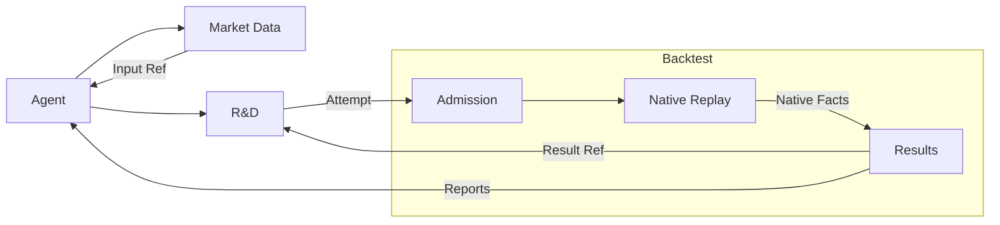

# 研究功能设计与验收

R&D 把带来源市场假设转化为冻结且可复现的策略工件，同时把探索迭代与保护资格评估隔离。

## 研究范围与自主边界

研究交易标的限定于批准的 Binance 产品范围：永续、现货、现货/永续双腿及该场所实际提供的股票/商品/指数相关标的。FX 或宏观序列可作为获准解释变量，不承诺独立交易市场或账户接入。首验采用 Binance USDT 永续；现货接入与双腿原生接入 仍需各自实现和验收，不开放 Paper/Live。

**目标状态，不代表今天已经可用。** 外部代理是产品之外由用户选择、连接领域 MCP/CLI 的助手，例如 Codex 或 Claude； 支持同一工具接口的其他宿主也可使用。
用户给代理研究主题、风险容忍、可用数据与资源支出上限，代理在实验前登记 组合比较目标、基线、风险约束、收益单位和观察期限；不能在看到结果后改目标来挑赢家。
代理可在这个冻结范围内自行查找来源、提出和预登记新机制家族、编写策略、运行实验、诊断失败并开启后继轮次； 不设固定试验轮数，但每次运行、重跑和查看都进入试验与数据读取台账。 资源上限触发暂停，方法学停止有明确决定，
越出主题或改变通过标准先向用户提出新请求。

产品与代理宿主各自强制资源限额、分别报告，不把读不到的模型用量记为零。 产品保存业务事实和确定性任务，宿主侧定时器负责重新唤醒外部代理。 新会话从 Owner 回执恢复，不依赖上一段对话或 MCP 进程存活。
研究代理和产品都不能因此获得 Paper、Live 或真钱执行权限。

Agent 可修复偏离冻结方法的实现，保留修复血缘、受影响结果并验证后继运行；不能抹去失败或让变更后运行沿用旧身份。修改通过/关闭标准或统计协议须用户确认并冻结新版本。
例如，把按币聚类的代码改为协议规定的按周聚类是修复；修改协议规定的聚类方式则是协议修订。两者都不能把旧结果当作新协议的独立证据。

| 用户期待                                 | 产品必须给代理和用户的可观察结果                                                                                                                                                 | 权威与失败路径                                                                                |
| ---------------------------------------- | -------------------------------------------------------------------------------------------------------------------------------------------------------------------------------- | --------------------------------------------------------------------------------------------- |
| 从一个来源和问题开始，并自主扩展同一主题 | Agent 整理来源与假设，自行选择分析方法；产品冻结已批准边界、所选实验输入和试验家族，新家族保留血缘                                                                               | Source Intake 与 R&D 回执；来源不是指令，未预登记或主题越界的实验拒绝                         |
| 只用当时可得的数据研究                   | 点时标的选择规则、上市和退市处理、数据版本、成本、资金费与容量身份随请求冻结；每次代理数据读取和试验可追溯                                                                       | Market Data 与 R&D 台账；受保护分区、缺失数据或不可复现范围失败关闭                           |
| 让代理实现真实订单规则                   | 代理编写原生 Nautilus Strategy；R&D 封存源码、参数、依赖和环境的内容寻址 Artifact 可表达有有效期的限价入场、止损与目标联动、分段退出、止损移动、持仓时限和按实际成交顺序占用槽位 | R&D 包准入与执行证据；加载/接口失败不伪装成经济失败                                           |
| 看到值得继续的研究报告                   | 同一冻结数据与执行模型下，优先报告组合收益、回撤、风险调整结果、与持有及现金比较、同时持仓与重叠、成本与容量；单策略和随机入场对照用于归因与诊断                                 | Backtest 原生 Result 与 Agent 解释记录；图表、代理总结和运行成功不产生选择或资格              |
| 无人值守地继续或停止                     | 每轮记录预测、实际结果、失败原因、下一轮改变的机制与资源消耗；资源上限和方法学停止规则可中断，试验次数不充当运行额度                                                             | R&D 迭代记录与知识台账；未知结果保持未决，证据不足只暂停或等待新数据                          |
| 独立评估并记录将来表现                   | Qualification 内部可区分通过、等价无效与证据不足，但对研究侧只公开 `QUALIFIED` 或 `CLOSED_NOT_QUALIFIED`；只记录前向是可选模拟证据；回测合格候选按下文进入真实试盘               | 保护样本和前向事实由 Qualification 持有；公开未合格不能自动关闭机制，前向记录不能生成交易订单 |

### Agent 接管与数据导入

Research Project 按研究目标汇总工作。例如"改善 Ronnie 挂单思路"关联入场优化、分段退出和
波动率过滤的假设、策略版本及实验，不为每个策略另建项目；各分支保留自己的结果和待办，共用冻结主题与预算。
同一 Research Project 由一个可更换的外部代理推进，统一产品预算、试验与数据暴露台账；接管不重置这些事实，家族规则与实验身份各自冻结。
Agent 在额度耗尽前，将未完成策略推送至项目 Git 仓库，并在 R&D 登记准确 commit、已做工作与下一步。
接管者先回读已提交任务，再取回该版本继续研发；草稿不被当作合格策略，未推送文件不宣称可恢复。
接管从项目与 Owner 回执恢复，不能换宿主就重置计数或独立性。具体接纳/冲突规则见
[R&D 项目接管](../owners/rd.zh.md#research-projects-and-agent-takeover)。用户或代理的外部历史文件可走
[Market Data 导入](../guide/market-data-intake.zh.md#target---外部历史文件导入)，不能直接成为回测行情。

### 因子发现、知识沉淀与后续复用

用户在 R-1 迭代中发现某个指标、形态或规则有正向效果，希望另一个代理以后开发策略时能找到并使用它。
后来用户启动 B3 研究，接手 Agent 可默认检索同一用户的 R-1 知识，取回来源实验和适用范围，
决定是否在 B3 中预登记验证；无须用户逐项重新开放，但不能把 R-1 的效果或资格直接转给 B3。
在编写完整策略前，Agent 可提出"某形态后未来三天平均收益较高"的假设，用宿主脚本统计获准行情，
并把测试说明、结论摘要、已有依据引用和局限关联为探索实验，可复用结论进入 Knowledge。
接管者能查到测过什么及所得结论，但不保证取回临时脚本、图表或统计表；需要时由 Agent 重新分析。
它是外部分析证据，不是已通过资格的策略回测。
若 R-1 留有过滤函数，知识条目关联其 Git 仓库、commit、文件与函数入口；Agent 取回准确版本，
适配 B3 并提交新实验。知识库保管引用与研究依据，Git 保管代码，不增加因子执行服务。
研究来源包括固定于 `0725a7b3f89902e27cd421a18b4b879a13268534` 的
`research/ronnie/loop/ledger.txt`、`loop/r1_select.py` 与 `loop/WORKFLOW_NOTES.md`。
前者记录跨轮因子信号，后者测试 R-1 构件；其历史数字及自定准入规则不是当前产品确认的优势或默认门槛。

重放路径是：Backtest 产出准确探索 Result → R&D 核对 attempt/census，Agent 诊断 → R&D 知识台账登记构件定义、
适用范围、效果与证据 → 后继代理通过 `knowledge` 检索并引用 → 预登记新 Intent、编写新 Artifact →
Backtest 检验组合收益和风险。合格与试盘继续走各自 Owner；知识不直接触发交易。
一次正结果作为探索发现保存，缺少独立复现或统计支持时明确证据不足；负向、失效和未测范围同样可查。
会话重启不丢条目；重复提交不重复制造证据；保护样本的数值和原因不能进入知识库。

职责落在已有 R&D 内，复用 Market Data 的数据身份和 Backtest 的结果，不设新因子部门或第二套回测。
数据库可以共用实例，知识条目的写入、版本和检索只由 R&D 接口提供。完整条目、复用和失败验收契约见
[研究知识台账](../owners/rd.zh.md#knowledge-reuse)。此路径是目标设计；现状仍缺台账实现、准确证据关联与端到端检索/复用验收，不能据文档宣称现有代理已经可用。

### 按需找币与运行策略

`0725a7b3f89902e27cd421a18b4b879a13268534` 的 `research/ronnie/scan/scan.py` 在一批 Binance USDT 永续 上按闭合日线寻找趋势信号，输出新信号、趋势中、空闲和触发距离，明确不连接账户、不下单。 其
top-150 与现货交集不是产品默认范围。普通找币由 Agent 查询 Market Data 后在宿主分析，不要求先创建 Artifact、
研究项目或 R&D 扫描任务；需要精确原生策略状态或暖机时，封存策略并提交 Backtest 原生回放，R&D 按研究需要关联结果。 报告完整总数、完成数、排除和未完成项；未知或缺数据不是没有机会，推演持仓不是真实账户持仓。

例如 BTC 闭合日线已满足形态，列为条件已成立的机会；ETH 未收盘日线接近条件，只列为观察候选。
两类结果分开，说明判断时刻、数据来源/版本、收盘状态、已满足与缺少的条件，以及是 Agent 分析还是原生策略输出。
观察候选可能失效，不改变正式策略规则或交易授权，不新增评分器，也不扩大 V0.1 回测交付范围。

运行策略已经通过原生节点持续订阅行情并判断机会，不另外设计定时扫描；按需观察不修改运行实例状态。 扫描不产生部署提案，Governance 决定生命周期。 具体验收见 [R&D
按需发现](../owners/rd.zh.md#on-demand-read-only-opportunity-discovery)。 完整发现操作、原生 Strategy 接线与端到端验收仍是能力缺口。

### 回测合格、真实试盘与转正

研究目标达成后，Agent 记录结论并停止。尚未评估的候选仍由 R&D 保管，归属不表示继续运行；未达目标且原授权仍有效，或用户另行要求时才继续迭代。

用户决定考虑上线，才请求 Qualification 对准确冻结版本做独立评估。未通过只保存二级公开结论并等待新指令，不回流保护细节、不自动重启研究，也不据此关闭研究机制。

资格通过后，用户仍可选择不上线或继续优化。首次真实试盘需要 Dashboard 确认版本、试盘模板、账户授权与资金政策；随后进入 Governance 队列。队列按当前资格、资金容量、已有占用和冻结条件执行准入，策略不得自行扩大权限。试盘达标后按已批准条件自动转正；最低样本与独立交易计数由 [Governance](../owners/strategy-governance/) 规定，分段退出不得增加样本。真实执行与账户事实由原生交易节点产生。下架只停止运行并记录事实，不自动启动研发。

## research 用户故事重放与能力缺口

来源固定为 `origin/claude/inspiring-gauss-pxaril` 的提交 `0725a7b3f89902e27cd421a18b4b879a13268534`。 `research/ronnie/` 有 1007 个文件、31 个家族
`INTENT.md`；文件数量包含数据、图和结果，不等于用户故事数量。 下表按可独立验收的用途归纳 20 个故事，覆盖全部家族 Intent 和来源、循环、组合、扫描、前向等跨家族流程。 路径均相对
`research/ronnie/`；只写目录名时指该目录 `INTENT.md`。 这是对架构的契约重放，不声称这些原型已经
由当前产品运行，更不把原型的筛选门槛、统计结论或历史留出协议当作现行资格。

| 故事 | 用户目标与来源                                                                                                   | 路径、结果与失败边界                                                                                                | 当前缺口                                                         |
| ---- | ---------------------------------------------------------------------------------------------------------------- | ------------------------------------------------------------------------------------------------------------------- | ---------------------------------------------------------------- |
| U01  | 解释人类策略与手绘计划；`community/INTENT.md; tv/; yt/; journal/score.py`                                        | Agent 获取并解释来源 → R&D 来源/批注 → 冻结假设；时间证据不足仅作外部主张                                           | 来源/证据关联与 Agent 解释记录待验收                             |
| U02  | 导入与跨市场复制；`altcoins, fxrevert, goldtrend, rangex, rangex2`                                               | Market Data 接纳来源、时区、价格依据与修订 → Backtest；缺合约/成本事实不能称可交易证据                              | 研究范围已定义；对应数据准入/原生接线仍逐类缺失                  |
| U03  | 组合不同 K 线窗口；`mtf, timing`                                                                                 | R&D 冻结闭合/形成中语义 → Market Data 准备 → 原生 Strategy；未来值与不一致聚合拒绝                                  | 复杂窗口/预热与输入绑定待验收                                    |
| U04  | R-1 挂单和分段退出；`loop/family_r.py; loop/r1_dynexit_fine.py; run_plan.py`                                     | 原生 Strategy → R&D Artifact → Backtest 原生订单；未知、缺细数据保持未决，不能按粗 K 重复成交                       | 首验；分钟回放、聚合、原生路径及回读/报告须验收                  |
| U05  | 比较止损与退出规则；`stops, exits; loop/r1_exits.py; roleflip/`                                                  | 同入场和资金基线 → Backtest 配对对照 → Agent 归因，R&D 记录；R 单位不同不冒充收益改善                               | 有界诊断与配对报告待接通                                         |
| U06  | 选择过滤器与学习参数；`filters, filters2, range6; loop/r1_select.py; loop/r1_select_val.py`                      | Agent 选择和训练过滤器 → R&D 记录变体及冻结输入 → 原生回放 → Agent 诊断；旧数据反复挑选不算独立验证                 | 原生包、数据读取与实验/证据记录待接通                            |
| U07  | 表达多种形态机制；`patterns, patterns2, setups, screen, range, range2, range3, range4, range5, volume2`          | 同一原生 Strategy/Artifact 表达形态及上下文 → Backtest；不为每种机制新设模块，无法表达则具名拒绝                    | 优先复用原生 API，产品能力缺口明确；不能以窄突破样例证明全部支持 |
| U08  | 先检验机制、不模拟交易；`oversold, volume; community/INTENT.md`                                                  | Agent 用宿主脚本分析获准 Market Data → R&D 记录方法/依据 → Knowledge；首次触碰/相关性不是组合收益或资格             | 普通数据读取与外部分析证据记录待接通                             |
| U09  | 研究资金费及市场状态；`carry, short; loop/fetch_funding_ext.py; loop/fetch_metrics.py; loop/overlay_x2.py`       | Market Data 经济事实/可得截面 → 原生 Strategy/Backtest → R&D；结算成本与信号读取得分别证明                          | OI/taker flow/历史发布可得证据与字段消费待验收                   |
| U10  | 引入宏观日历与压力；`events; loop/r1_macro.py; loop/r1_crypto_stress.py`                                         | Market Data 历史发布/vintage → 因果特征 → Backtest；今天最新版加延迟不算 PIT                                        | 来源/修订/事件日历准入待接通                                     |
| U11  | 固定及动态连续组合；`trend, combo; trend/books_pit.py; loop/ensemble.py`                                         | R&D 冻结成员政策/子规则 → Market Data 成员时间线 → Backtest 一条净值路径；换币不重置持仓                            | 新成员时间线与容量合同；当前固定路径不满足 B3                    |
| U12  | 双腿 carry 与配对交易；`carry; loop/family_h.py`                                                                 | 一个冻结工件 → 原生多腿订单/账户回放；按各腿实际成交、费用和保证金记账，不能假定原子成交                            | 多腿原生策略接入、净额/对冲与部分腿失败政策待验收                |
| U13  | 验证仓位管理的增量价值；`risk; loop/r1_portfolio.py`                                                             | 冻结仓位/风险政策 → 同一原生账户比较 → 报告 → R&D；生产两池政策不被实验优化覆盖                                     | 政策/成本/资金竞争绑定与报告待完整接通                           |
| U14  | 核对实现忠实性与成交；`xcheck/compare.py; replay/src/main.rs; tv_line_fidelity.py; checks.py`                    | 来源标注/导出意图 → 原生 Backtest 对照 → R&D 修复后继；Python 原型不成为第二引擎                                    | 端到端修复/对应事件证据待验收                                    |
| U15  | 诊断衰减、归因和伪优势；`loop/attrib.py; loop/bucket_audit.py; loop/decay_diagnosis.py; loop/gatekeeper_book.py` | Backtest 结果/分层对照 → Agent 分析并由 R&D 保存方法/证据及完整 census → 继续/停止；负结果保留，保护诊断不泄漏      | 结果读取与 Agent 解释/证据记录待接通                             |
| U16  | 自主研究与会话接管；`RD_AUTONOMY.md; loop/PROTOCOL.md; loop/RETROSPECTIVE.md; loop/LOG.md`                       | 共享项目预算/计数 → 持久 jobs → Agent 判断 → R&D Decision；额度竞争原子接纳，未知任务不丢失                         | 单 Agent 接续、完整 research 工具与报告/决定读回待验收           |
| U17  | 沉淀与复用因子知识；`loop/ledger.txt; loop/WORKFLOW_NOTES.md; loop/r1_select.py`                                 | 已计入 Result → R&D 知识条目 → 检索 → 新 Intent/Artifact；正估计不自动稳定，复用不继承资格                          | 知识记录、证据关联与检索消费者未实现                             |
| U18  | 查询现在的市场机会；`scan/scan.py`                                                                               | Agent → Market Data 查询；需状态则 Backtest 原生回放 → 信号；R&D 按需保存引用；不新设定时扫描，推演状态不是真实持仓 | 只读发现操作与原生判断接线待验收                                 |
| U19  | 观察未来证据并控制资格反馈；`loop/FORWARD_PLAN.md; trend/forward_b3.py; journal/score.py; loop/CRITERIA.md`      | 冻结候选 → Qualification 二级公开结论；回测合格后真实试盘，模拟记录可选，旧原型门槛不照搬                           | 保护隔离有契约；真实试盘规范阶段与条件选项待冻结                 |
| U20  | 把研究产物部署并退回迭代；`用户确认的产品晋级路线；研究前向需求的产品扩展`                                       | Governance 两池/阶段 → 原生节点 → Portfolio → 自动转正或卸载退回 R&D；预算立即释放，残余风险继续保护                | 目标已分权；真实效果未准入，阶段/资金/恢复链待验收               |

### 从重放到开发任务

每个故事的责任路径已指定，仍须按末列交付能力。任务从一个生产者→消费者交接开始，明确版本、输入、
唯一事实 writer、成功/具名拒绝/未知状态及重启读回；不能把"有路径"当作"当前可跑通"。
U04 是首个端到端验收，U11、U12 和 U17/U18 分别检验动态组合、多腿、知识复用和发现，不要求一口气实现所有机制。
相同构件在 U03/U07/U08/U14 复用定义及输入绑定；统计由 Agent 复用原生结果和自己的分析工具，不为每种统计新开服务。
暂未支持的有界表达返回明确缺口，Agent 可登记实现后继，不能退回任意脚本、另写模拟器或把无法验证的结果当优势。

首次试盘 Dashboard 确认方式已确定；条件选项/阈值和正式保留条件仍由用户冻结；这些是业务政策参数，不用新增部门解决。
其余缺口属于已分权能力的版本化接口和验收，后续 Agent 可以据具体故事安排开发。目标设计未开放真钱效果。

## R-1 挂单与分段退出

V0.1 的 Agent 可先从 Market Data 读取已准入的普通研究 K 线，用自己的脚本分析突破后的回踩深度、
等待时间与形态，再编写原生策略并提交正式回测。分析绑定所读数据版本；脚本统计不冒充原生回测结果或资格。

V0.1 用带有入场前诊断日志的 R-1 策略验收零成交：Agent 结合日志与原生订单/成交事件，区分未触发、
策略过滤、订单已提交但未成交或拒绝。诊断消息由策略作者提供，不要求其他策略遵循固定日志模板；
日志未输出、截断或不可用时，成交前原因保持未定，不能推断某个条件未发生。经济结果仍以原生账户事实为准。

**首个端到端验收样例是 R-1 规则族。** 它是[已确认 V0.1](../architecture/index.zh.md#v01---可用的-r-1-数据与回测流程)
的交付依据；本版先打通数据与回测使用流程，完整自主研究循环后置。 市场基线为 Binance USDT 永续合约的点时历史，而非用现货价格代替合约经济。

从一个带来源的日线突破回踩假设开始，Agent 登记机制并在包含历史上架与退市的点时标的集合上构建策略。R-1u 的限价单在突破价附近等待至多十天；实际入场成交后，按原始止损、信号时冻结的 2R 目标和最长 60 天持仓规则退出。同一币种同时最多占用一个 R-1 交易名额；名额从实际成交开始占用，到该笔交易因止损、目标或 60 天期限退出后才释放，不能从挂单创建或固定占满 60 天推断占用。

R-1s 沿用入场与原始止损，把实际入场数量分为两段：首段在同一冻结 2R 目标退出；余段比较该 2R 目标与按实际成交价沿交易方向延伸一段突破冲量长度 `1.00 × |B - A|` 的目标，取沿盈利方向更远者。A/B 是策略在发出信号时已可得的突破冲量锚点，不用未来数据重定。只有首段按取整规则确定的目标数量全部经 2R 止盈实际成交后，余段止损才移至该笔交易的实际入场均价；首段仅部分止盈成交、触价或提交止盈单时维持原保护。两段均受成交后最长 60 天期限约束，只有两段都实际退出才释放该币名额。数量取整、部分成交及变更失败遵循下文的逐笔保护契约，不把目标触发当作已成交。

这些规则是 R-1 验收样例，不成为其他策略的固定模板。成交、撤单、止损和目标按原生事件顺序决定，不能把成交前的最高价算作成交后的收益。两种变体分别封存和报告。原研究的 R-1s 是尚未在已读样本上检验的前向方案；其中余段"取较近目标"与首段止盈后继续持有的目的冲突，现以较远目标定义该策略版本。原型现货数据、旧目标规则下的任何结果或留出结论，都不能证明新永续回测的经济优势。报告计入合约手续费、资金费、滑点、最小下单量与保证金约束，标明成交路径分辨率及无法排序的事件；缺少能判定结果的数据时保持未决。

统计机制沿用 Nautilus：复用原生 Portfolio 估值快照与 `MaxDrawdown`，主报告使用一分钟采样的账户净值计算最大回撤，日末回撤另列并明确名称。
分钟净值包含未实现盈亏及已发生手续费、资金费；初始、期末与账户变化记录保持完整，不能只统计已平仓交易。
冻结估值价格来源、采样边界与事件顺序，不把不同标的各自的分钟高低价拼成实际组合极值；报告明确该值是分钟采样观察到的回撤，不覆盖分钟内全部风险。

当前原生 Portfolio 支持可选细粒度快照，分析器的组合收益序列仍按日归集；首版须接通分钟估值序列到原生最大回撤统计，不能只开启快照就宣称主回撤已改变。
日末回撤保留独立输入与标签，不静默改变其他统计量的采样频率。缺失估值、陈旧输入或未接通分钟统计须明确返回缺口，不以日末回撤或已平仓收益冒充分钟主回撤。

### V0.1 服务交接验收

以下重放把 R-1 故事投影到现有服务契约；表中的完成条件是开发验收要求，不是已经运行通过的证据。

| 故事步骤或异常             | 契约与验收观察                                                                              |
| -------------------------- | ------------------------------------------------------------------------------------------- |
| 准备约 50 个币、约五年数据 | 固定成员按真实上市范围准备；输入清单绑定分钟成交、标记价、经济输入及预热，具名报告缺口      |
| 数据只有部分准备成功       | 已完成引用可复用；R&D/Backtest 不接纳缺必需输入的正式回放，不缩短区间掩盖缺口               |
| R-1u 与 R-1s 分别提交      | 封存不同策略内容；实验绑定准确清单和运行条件，各自计数、排队并保留独立结果                  |
| 提交时网络超时             | 查询或重送原请求；同一 attempt 解析同一任务，不因未收到回执重复运行                         |
| 原生策略加载或运行失败     | 返回准确失败与可用诊断；不因 Node 跳过失败项或返回其他结果就宣布成功                        |
| 成交和分钟估值             | 原生订单/OMS、费用、资金费及 Portfolio 为事实来源；聚合只驱动信号，分钟内路径按原生配置标注 |
| 回放完成与报告查询         | dispose 前提取所需事实，托管后才返回完整结果；有界读取的分钟序列与主回撤使用同一输入        |
| Agent 断线或失败后重跑     | 已接纳任务独立存续；确认中断后建立关联的新完整 attempt，原消耗和记录保留                    |
| 存储不足与保护范围         | 停止接纳受影响的新任务，不淘汰正式证据；Agent/Dashboard 不读取保护评估详情                  |

完整的零成交回放返回零成交事实及完整的账户、估值和报告覆盖；无定义的绩效指标标为不可用。
订单/成交明细、报告或分钟序列缺失或只完成一部分时，保持结果未完成或具名缺口，不以空集合或摘要冒充零成交成功。

此故事不要求 V0.1 自动组织研究、提供完整项目接管或判定经济优势。Agent 可以继续修改和比较，
完整研究管理与知识复用留在 V0.2；资格、试盘与交易授权留在 V0.3。
详细输入清单、任务身份和原生加载顺序分别以 Market Data、R&D、Backtest 章节为准，场景不另造 schema 或状态机。

## 回放一致性与报告

### 研究规模与可用性

R-1 的 `loop/r1_zone_entry_fine.py` 与 `loop/r1_select.py` 使用 `ITER_COINS + ITER_EXT_COINS`，
对应 `range2/run.py` 的 17 个主流币和 `loop/engine.py` 的 36 个扩展币；开发窗口为 2018 至 2022。
V0.1 采用约 50 个永续标的、约五年历史作为性能验收规模，实际名单和窗口按币安点时覆盖冻结。
该来源提供研究规模与使用场景，不继承原型数据来源、局部精度或收益数值为标准。
验收必须在完整账户时间线上使用已准入分钟执行行情、标记价和经济输入，记录准备、缓存复用、
加载、执行、统计和回读的耗时及峰值内存。尚未测量的性能保持未证明；资源或输入不足不得静默缩水。

### 组合统计与期末估值

期末处理确认：回测窗口结束时保留未平仓状态，不因窗口截止虚构策略退出或自动清仓。按冻结的
Portfolio 估值口径与截止时有效历史标记价计算永续期末组合净值，分列已实现/未实现盈亏、未平仓数量与已发生费用/资金费。
永续分钟净值与未实现盈亏同样用历史标记价；成交仍用成交行情。缺失或无效标记价保持具名缺口，
不采用原生价格回退将成交价近似值冒充标记价估值。
未发生的平仓成本不冒充实际成本，成交价与估值价分别展示；估值来源、时间与陈旧性可检查，缺少有效估值时不伪造
完整收益。引擎结束清理不能悄然生成影响主报告的强平交易。

途中清算另按持仓期间处理。V0.1 的 R-1 USDT 永续主回放暂不启用原生 `liquidation_enabled`：
当前原生清算检查用缓存报价的 bid/ask 计算未实现盈亏，缺报价时会跳过；其清算路径关闭
同结算币的全部持仓，不能把开关打开当作按历史标记价与
[币安清算流程](https://www.binance.com/en/support/faq/detail/360033525271)完成验收。主报告须用冻结的保证金模式、
覆盖实际名义额且标明历史事实或模拟假设的维持保证金条款、原生 MarginAccount/Portfolio 状态及
历史标记价，在可判定的分钟事件点
检查是否触及清算阈值，并保留事件顺序与数据分辨率。全部时点可证明未触线时，可按已声明的
分钟模型输出完整报告，不能声称证明真实场所从未发生分钟内清算。首次触线、必要输入缺失，
或同分钟先后无法判定时，保留此前诊断，后续收益、回撤与 Sharpe 不形成完整主结论；
不能让无强平的继续持仓轨迹美化结果。具备报价与冻结配置时可单列原生清算敏感性，
但不得替代主结果或冒充币安清算。以后只有在原生节点内的标记价触发、档位、清算成交与费用
都经真实消费者验收后，才重新决定主报告纳入途中清算；不得另造交易账本或撮合器。

### 事件因果与最小周期歧义

最细执行数据为 1 分钟。原生撮合采用冻结的 OHLC 或高低点自适应路径；同分钟入场、止损、止盈
按该模拟路径处理，不再叠加止损优先或入场后持仓规则。报告记录路径配置及 K 线精度假设，不冒充逐笔先后。
Agent 可用不同原生配置分别回测比较，不回看后挑选有利结果。缺失分钟、无效行情或不可验证的执行输入仍是缺口。
收盘确认规则：首版的 K
线形态与指标条件用于发信号、撤单或移动止损时，统一在对应周期收盘且 数据实际可得后确认；例如 15m 收盘指标撤单不能影响该区间内先前已发生的成交。 已生效的价格入场、止损、止盈订单 仍可盘中触发。

执行不以未收盘指标生成信号，也不把新保护规则回溯到整根 K 的开头；先前订单/保护的生效时间保留。 盘中动态指标不属于首版语义。 收盘边界事件顺序由共享执行契约冻结并验证，不能用数据载入顺序改变结果。

同刻新入场接纳顺序：共享执行链路按生效决策时间排序；同一决策截面实际可得的请求按冻结的
规范币种名称升序，同币用稳定策略/信号身份破同序，不依赖线程、数据库返回或代理提交速度，不等待未来请求凑批。
此顺序属于共享执行配置，不增加策略优先级参数；每笔仍由原 Risk 契约判断额度。额度不足按已确认的终止语义处理，
不排队、不自动缩量或恢复重放。排序只针对新入场接纳，不重排已生效挂单的市场成交先后，不覆盖原保护/退出时序。
验收改变输入遍历与调度顺序仍得到相同接纳结果，并保留每笔允许/拒绝的依据。

日线与 4 小时等信号周期由一分钟基础行情经 Nautilus 原生聚合产生；撮合始终使用分钟行情。
例如同一天触及入场价与止盈价，按当天分钟顺序处理已有订单：目标先于入场时不能记成止盈；
先入场、之后到达目标才可退出。粗信号 K 不重复推动成交。

订单激活、有效期、保护变化、资金竞争与资金费时点都在同一因果账户时间线上处理。
收盘才确认的日线信号不得在该日更早成交，成交前高低点不计作持仓期间表现。回读标明一分钟精度及政策推定，
不冒充逐笔观察。Backtest 复用原生撮合，策略无需实现多周期成交逻辑；验收覆盖目标先于入场、入场后目标、
止损/止盈竞争、失效边界、组合竞争和重启。

同分钟入场及关联保护单的生效，沿用原生撮合与订单事件。不另行延后止盈，也不改写已完成的成交来制造保守结果。

### 多周期数据与执行准备

**基础数据与原生聚合。** Market Data 准备所选标的、回测区间与预热区间的一分钟历史，并验证完整覆盖。
日线 OHLC 不能反推分钟路径；缺失或无效分钟保持具名缺口。策略通过 Nautilus 原生订阅/历史请求表达
信号周期，不另填重复的产品周期表，也不要求策略自行下载行情。回测日期、预热长度、标的和非 K 线输入仍须明确。
V0.1 在正式区间以冻结初始资金、空仓和无挂单开始；预热只建立计算状态，不能提前交易或带入预热成交。

首版大周期以分钟派生序列为准，按原生聚合设置形成并在收盘实际可得后使用。该序列不冒充币安直接提供的
原生大周期；已有来源差异保持不同含义。原生聚合与可重建缓存复用分钟基础，不要求各周期托管完整副本。
策略包、实验数据引用和原生运行配置保存分钟版本、聚合设置及运行环境，不增加第二套配置系统。

**准备与回放交接。** Agent 提交或复用 Market Data 的准备结果，再向 R&D/Backtest 提交绑定数据的实验。
Market Data 拥有采集、修复、点时托管和缺口事实；R&D 拥有研究、实验、尝试和资源记录；Backtest 消费
准确绑定的行情，复用原生聚合、订单、撮合及账户事件。撮合核心不持有 MCP 客户端或远程取数职责。
资金费结算、当时可见的 funding 信号、手续费、合约条款等分别绑定，不由 K 线聚合推导。

回放固定使用一分钟执行行情，内部聚合信号 K 不驱动第二次撮合。原生 streaming 分批消费已绑定输入，
不改变其含义；需验证多输入加载的实际内存、时间排序与完整相同 `ts_init` 边界，不能凭设置分片量保证总内存。

**缺口、修复与重新回测。** 数据缺口返回 Market Data 准备/修复，不适用分钟内歧义兜底。Agent 可在原范围、
来源、预算与权限内请求修复；改变范围或授权不能静默完成。修复产生新数据版本时，Agent 显式提交后继实验，
从冻结初始状态完整重放。旧尝试的请求、输入、数据摘要、支出和读取记录不可变；未知旧结果先按原身份解析。
原生 streaming 不用于把新数据版本续接旧尝试，不回滚局部状态，也不拼接多次运行的成交、费用或结果。

验收检查分钟覆盖、信号聚合边界、挂单与保护事件、资金竞争、准备失败、原身份恢复和分钟内原生路径，
并测量读取量、内存及耗时。性能优化须保持同一完整账户时间线和准确输入绑定。

[原生能力扩展](../architecture/capability-adoption/)区分引擎机制、产品职责和接入缺口。 原生 execution/cache
保持订单、成交、持仓事实权威；共享适配层只保留意图、trade/leg 关联、事件消费前沿和规则进度。 原生 Strategy 可复用基类的订单管理，不意味着研究代理编写的信号逻辑需要维护交易所状态。 默认 bracket 为 OUO；普通 OCO 或不等量 OUO 不能直接承接 R-1s
的半仓目标与全仓止损，段完成也不等于全笔平仓。 按原生成交反馈更新剩余保护，复用原生修改/撤销，不造第二状态机。 GTD 到期由原生事件确认，不另造已过期事实。

滑点配置、市场类订单 L1 余量处理、跳空和实际费用分别冻结与报告；关闭概率滑点不自动等于零执行价差。
回测只使用初始资金，不注入充值提现。真实账户收益由 Portfolio 区分外部资金流与交易损益，
不能凭充值提现造成的净值跳变声称策略盈利或亏损。原生统计 fallback 或恢复合成终态不覆盖既有组合证据/未知承诺边界。

当前 `pit_window_custody_v1` 保留输入/成交周期与窗口托管，以及 `FillBarOpen` Quote 派生基础。
`backtest.run` 的 V1 数据坐标仍为单标的、单执行周期和有界窗口，不证明多标的分钟回放、原生信号聚合或
原生路径配置已经接通。验收覆盖分钟覆盖缺口、聚合收盘边界、预热、预算、修复后的新身份及冻结范围外读取拒绝。

### 计划价与成交价

R-1u 与 R-1s 首段的固定 2R 止盈目标在信号生成时按计划入场价与初始止损算好并冻结，实际成交价格改善不重算这个目标。R-1s 余段的冲量目标另按实际成交价和已知 A/B 锚点计算，再与冻结的 2R 目标比较，取沿盈利方向更远者。例如计划买入 100、止损 90、固定目标 120，实际以 98 成交后固定目标仍为 120；毛价格风险为 8、该目标收益为 22，
实际毛收益风险比是 2.75，而不是 2。 报告分别列计划价、实际成交均价、止损、固定目标、计划 R 与实际风险收益， 扣成本收益另列，不因信号标为 2R 就把实际结果写成 2R。 来源
`replay.py` 会用实际成交价重算目标， 因此该选择产生新的具名策略/试验含义，保留旧结果，不宣称逐交易等价复现。

对照验收区分已登记的目标基准差异与 未解释的撮合差异，Qualification 消费新工件及固定目标身份，不复用旧变体资格。 R-1s 首段按取整规则确定的目标数量全部经 2R 止盈实际成交后，剩余止损移到该笔交易的实际成交均价，
不是信号计划入场价。 移动发生时封存所引用的成交前沿与均价，产品按该笔身份与标的价格精度执行； 这不改变固定止盈目标，也不擅自覆盖手续费以计算另一种"保本价"。 报告称为移至实际入场均价，
止损实际成交滑点和全部成本仍按真实执行事实记账，不承诺净收益为零。 撤单竞争中的新增入场成交继续按 原有数量/保护反馈契约处理，不静默改写已经发生的止损变更。

### 挂单失效与独立交易

**挂单失效条件不限于到期。** 等待期间出现指定 K 线形态、指标变化，或者价格离挂单价 超过波动率归一化阈值，都应能撤销入场挂单。 它们是可组合、预登记的订单生命周期规则，由原生 Strategy 编写、
原生 Strategy 决定并由原生模拟器执行。 冻结观察周期、价格取值、条件组合与优先级、阈值，以及 ATR 等波动率是取挂单时 快照还是随时间更新；代理不能回看结果后改变这些含义。 仅使用决策时已可得的数据，日线收盘触发撤单不能抹去
当天更早的成交。 撤单只撤未成交数量，已成交部分的持仓和保护单继续保留；暂停中的挂单也能失效，失效后不得重新提交。 重启要保留撤单事实。

挂单与撤单是独立的策略动作：撤单指向具体订单，之后再挂是一笔新订单，不自动恢复旧单。 不增加策略专用的恢复期限、恢复次数或自动重挂开关；新的经济机会由策略信号表达，执行故障的恢复由通用执行政策处理。
订单保留所属策略与试验的归属， 普通新订单不强制关联此前撤销的订单。 报告能区分到期、条件失效、成交和 剩余数量撤销，并展示触发条件、输入和事件时序；不能排序的事件沿用冻结的执行政策或保持未决。

当前兼容接口 `AuthoringActionV1` 只有 `Enter`、`Flip`、`Exit`；Host
有清理保护单与结束回测时的撤单调用， 尚不能据此声称完整条件撤单故事已实现。 验收须增加形态/指标失效、距离阈值、部分成交后撤余量、成交与撤单竞争、 暂停后失效以及重启/重挂，具体内核目标见英文架构的
[Resting
entries](../architecture/strategy-factory.md#native-replay-and-ambiguous-fills)。

**入场与退出按笔独立，资金与风险统一约束。** 同币两笔入场各自保留订单、 实际成交数量、止损、分段退出及交易盈亏；撤销或平掉一笔不能误动另一笔。 退出指定所属交易，只减少该笔剩余数量。 组合共用资本与保证金。
Portfolio 拥有账户、暴露与容量事实；Risk 独占承诺占用、剩余额度和风险准入。 逐笔盈亏汇总须与组合事实对账，不能给每笔重复分配整份账户资金。
新入场超过可用资本、保证金或冻结风险额度时，拒绝并记录原生原因及请求数量；产品不自动缩量， 也不隐式排队等待额度恢复后自动提交。

Risk 的当前请求终态仍是拒绝；Runtime/Execution 按独立冻结执行政策 处理拒绝、等待或允许的后继，不能要求策略重新实现拒单恢复。 首个执行基线不自动缩量、不隐式排队；
调整数量属于独立仓位政策或明确的新请求含义，不能由执行重试偷偷修改。 按事件时点的共享组合状态检查额度， 并区分资源拒绝、真实部分成交和已冻结的标的精度取整，报告请求、接纳及实际成交数量。 验收驱动多笔入场争用
同一剩余额度、拒绝不影响已有持仓，以及重启不触发隐式重试。 原生策略可实现固定数量、按当前组合净值分配或按入场与止损距离计算风险数量；
原生 Strategy 在登记的决策时点用实际 Portfolio 状态求值，代理无需在每个模拟时点重新提交数量。

计算式、单位、净值/价格/止损输入和标的取整语义随工件封存，报告能重现求值结果；无效单位、非法算术、 零分母或必要状态缺失须具名拒绝。 数量计算不绕过组合额度，也不引入隐式缩量。
创建订单时计算数量，挂单期间不随净值变化自动改量；改量须显式撤旧单、挂新单， 旧单尚未实际撤销时仍计入承诺占用。 当前兼容 V1 `Enter.units` 固定整数字段不能证明动态编写已可用；
验收覆盖净值变化、止损距离、取整、挂单数量稳定及额度拒绝。 "每币最多一笔"以及入场互斥由具体策略声明，R-1 原有槽位规则仍须准确复现，不成为产品的普遍限制。 复用引擎的持仓身份与净持仓映射，避免另建成交或会计模拟器。

当前兼容 target-set Host 仍限制每币一个原生净持仓； 上述能力是版本化扩展目标。 验收增加同币两笔不同止损、部分退出、撤单、单笔关闭不影响另一笔、组合核算与重启恢复。

R-1 之后仍需用同一产品路径覆盖两类不同机制：K1 现货与永续对冲检验多腿、资金费、保证金和按实际占用资本计算的收益；
B3 点时 top-N 趋势组合检验历史成员进出、不同策略同时持仓、相关损失与组合回撤。它们是架构兼容性样例，
来源分支中的收益数值不是产品资格或预期收益承诺。

### 结论复核与完成条件

**研究结论可被新证据显式复核。** `CLOSED` 绑定被测试的机制、市场范围、时间和证据，不是跨市场的永久禁令。
同一机制只有在新的独立数据或原结论未覆盖的新范围可用、复核预测与最小关注效应先登记、旧证据与新增读取都计数时，
才可创建具名复核后继。旧结论不被改写；只是重新运行旧数据、更换名称或复述保护评估的二级状态不能重开。

**完成判据。** V0.1 由外部 Agent 经领域工具完成数据准备、策略封存、原生回测和完整结果读回；
断开并重启会话后，已接纳任务仍可按原身份查询，失败和缺口保持可见。Dashboard 报告页不作为该版验收条件。
V0.1 还要验收数据缺失、未登记试验、资源上限、错误事件顺序、保护读取越权与任务恢复的拒绝和失败路径。
后续完整研究与运行故事再让 Dashboard 按相同身份展示来源、试验、报告、未决状态和允许动作，
并验收资格未通过后误关闭研究、前向记录误触真实交易等对应阶段的负例。

### 报告与按需图形回放

**按需图形回放。** 产品可按 Run、信号与交易身份调取有界时间窗口内的 K 线、信号时计划入场/止损/目标、 挂单有效期与失效条件、模拟实际成交、分段退出、保护变更及未成交/拒绝/撤单原因。
没有成交的信号也可回放。 图表是 Market Data 托管行情与 Backtest 原生事件/报告的投影，代理与 Dashboard 引用相同身份；渲染不产生新订单事实、 资格或研究结论。
明确区分计划价、模拟成交与真实场所事实；不把 K 线内推定先后顺序画成已观察到的逐笔成交。 展示执行模型、时间分辨率、取整与未决标识，允许从图中回读对应事件、输入与拒绝事实。 按需生成而非预渲染所有交易，
窗口与资源消耗受产品额度控制。

图形回放继承原请求的权限与保护隔离，不能通过图表暴露受保护数据/结果； 该目标不扩大 Dashboard 的路线实现准入。 验收包含成交、未成交、拒绝、撤单、分段退出、固定目标与实际入场均价、
事件竞争及数据缺口，重启后按原身份取得相同事实。

**TARGET / U1 之后：控制层干预归因。** 策略意图可能被风险拒绝、额度裁剪、readiness 或 kill gate 改变。
研究报告应关联原始意图、控制决策、实际订单/成交及原因，分别归因机制、市场、执行和控制干预。现有 Portfolio
归因枚举不能视为已覆盖它。这是后续诊断缺口，不增加第二个权威订单簿；未成交意图不能当作虚构收益。
反事实比较必须用另行冻结的模拟运行，不能修改原始成交事实。策略无需负责执行重试或账户对账。

## 策略与 Owner 边界

**目标设计；不准入新的执行路径。** R&D 封存策略源码与环境。策略定义信号、入场条件与价位、机会失效、撤单、止损止盈及分段退出，只表达交易意图；不能修改外部额度、签发许可或自行宣布合格。

数量配置声明数量规则，Runtime 结合 Portfolio 状态计算请求数量。执行政策负责等待、重试和终止，包括资金不足、限流、网络失败及场所拒单。R&D 将这些配置随原生 Strategy 源码包联合封存，不另建 Owner、注册表或策略恢复程序。原生 Strategy 声明保护规则及变化条件，产品按实际成交事件激活和维护，不要求策略每根 K 线
重发修改指令或维护订单状态。 例如 R-1s 预先声明一半在 2R 退出，仅在首段取整后的目标数量全部止盈成交后把剩余止损移到实际入场均价；首段部分止盈成交、触价或订单接纳均不触发移动。
原生 Strategy 据成交反馈应用冻结保护规则，Execution 实施原生 订单变更并记录结果；回测用相同 Strategy 和原生模拟器。 保护数量以该笔实际未平数量为依据，不覆盖别的交易，也不因部分成交把整个退出段当作完成。若首段为 5 个单位，先止盈成交 2 个时保留原止损，剩余 3 个全部止盈成交后才移动；首次实际退出成交仍按独立的退出开始规则撤销尚未成交的入场余量。

条件、退出段数量基准、变化后的价位与原生取整语义随工件封存。 按冻结的标的数量步长，前面的退出段向下取整，余量归最后一段；例如 3 个最小单位 按半仓退出，实际分为 1 与 2。
原生策略中的复用订单工具保证各段合计不超过本笔实际未平数量，并报告计划/实际比例及取整依据。 价格/数量/名义额约束按点时标的条款及订单类型验证，不套用不适用的开仓约束到只减仓订单。
入场前可判定的非法分段计划具名拒绝，不静默合并段或改比例。 已发生部分成交后发现无法形成合法非零段时， 明确报告计划不可执行，保留实际成交与原有保护并按既有异常契约处理；不能将真实持仓写成未成交。
验收覆盖奇数量、多个退出段、余量、零段、部分成交变化和恢复，禁止超额退出或遗留无法解释的数量。

同一入场部分成交后，一旦该笔实际开始退出（包括止盈段发生部分成交），原生 Strategy 按冻结规则撤销尚未成交的入场余量，停止继续入场；不要求策略补写恢复逻辑或增加开关。 价格触及目标或提交退出命令 不等于实际退出。
撤单不能阻塞止损，撤单请求不释放余量占用；竞争期间新增成交按真实事实更新数量与保护， 不能伪装成已撤销。 验收用"部分成交后价格上涨并止盈，入场余量仍在下方"的可成立路径，不能凭空构造
同一有效买单尚未填完、同一盘口成交价已向下穿过它到止损位的普通撮合路径。 R&D 与 Qualification 冻结信号规则、仓位配置、执行政策和成本/容量身份的整体含义，回测复用它们；
策略代码不必处理交易所错误码或每轮恢复状态。

数量公式能力保留，公式不再要求写进信号状态机。

| 责任                             | 唯一决策或事实来源                                                                                  | 不能越界做什么                                       |
| -------------------------------- | --------------------------------------------------------------------------------------------------- | ---------------------------------------------------- |
| 定义交易规则与配置               | R&D 拥有编写、Artifact 和试验身份；信号策略、独立仓位配置与执行政策联合封存                         | 不批准风险，不改账户真相，不读取保护结果来调整规则   |
| 执行策略状态机                   | Runtime 中的原生 Strategy 消费行情与实际成交反馈，产生意图并保存逐笔状态；Backtest 承载其研究回放   | 不创造成交，不分配账户资金，不自签 Risk 许可         |
| 账户、净值、暴露和计量方法       | Portfolio；回放按封存的相同方法与引擎会计计算模拟事实                                               | 不许可交易，不计算 Risk 的承诺占用或剩余 headroom    |
| 外部风险政策、额度承诺和逐笔准入 | Risk 根据政策、账户事实及已持有承诺返回许可或拒绝                                                   | 不替策略选买卖点、不改请求数量、不判断研究是否有效   |
| 研究资格与已验证经济边界         | Qualification 独立评估完整冻结候选，包含数量规则、退出规则、成本和容量；拥有 Eligibility 与资格边界 | 不逐笔下单，不替候选优化仓位规则，不把合格当部署授权 |
| 部署授权与资金包络               | Strategy Governance 在资格边界内决定授权 generation、分配和生命周期                                 | 不覆盖 Qualification 上限，不声称资金已经成交或占用  |
| 订单、成交与账户效果             | 生产由 Execution 拥有事实；研究由 Backtest 的原生模拟器产生并封存模拟订单/成交及 Run Result         | 不自己批准新增风险，不把模拟成交当作场所效果         |

### 信号、数量与执行结果

**信号与执行解耦。** 信号表示策略发现某种市场机会；Trade Intent 表示它请求入场数量、撤单或逐笔退出， 二者都不证明下单获准、订单被接纳或已经成交。 Runtime 承载策略、向 Risk
提交意图，取得许可后绑定为订单命令； 只有 Execution 执行生产场所命令并拥有接受/拒绝和实际成交事实。 账户同步与外部撤资归属不进入策略参数， 策略不调用账户/交易 API、不保管场所余额、不决定资金重新分配。
Risk 在下单前按最新可用事实与全部承诺检查额度；不能用"等场所报保证金不足"代替风险准入。

即使此前通过 Risk，提交期间的提现、市场变化或外部操作仍可能造成场所拒单；Execution 保留准确拒绝回执， Risk 按实际效果/结算事实处理预留，Portfolio
更新账户事实，Runtime/策略消费执行反馈。 资金拒绝不意味着原市场信号无效，也不能将意图写成已成交仓位。 Runtime/Execution 负责把同一有效信号与拒绝
归入独立执行政策，决定终止、等待或允许的后继；不要求策略发第二个信号来修复第一次执行失败。 首个执行基线：保证金不足等确定拒绝结束本次信号执行，不等额度恢复后补单； 本地 Risk 拒绝与调用场所后被拒绝分别记录。

明确未产生效果的临时故障可按标准政策有限重试， 结果未知只回读对账，不盲目重下。 策略不处理错误码、重试计数或队列。 "信号丢失"指放过该次机会，不删除审计事实：保留信号、准入/拒绝、提交、场所回执及成交数量，
报告区分无信号、Risk 拒绝、场所拒绝、挂单未成交和实际成交。 没有成交不创建虚假交易盈亏或持仓。 已终止信号不会因重复投递或重启重新执行；后来的新独立信号可走正常链路，执行端不能自行伪造它。
允许的临时故障后继必须引用原信号、政策与订单/尝试血缘，重新满足风险准入，并遵守既有 Execution 幂等/恢复契约。 经济条件失效或止损止盈含义已经改变的信号不得继续执行；执行政策不能扩大数量、改变价位或无限追单。

超时/未知响应不当成确定拒绝，不释放未证明无效果的承诺，也不裸重试。 模拟器须验证本地风险拒绝、 获准后场所拒绝和未知效果这三类不同路径，不能只测理想成交。

依赖方向是：策略表达市场信号与交易规则；Runtime 用独立仓位配置和已提交账户/行情事实形成 Trade Intent；
Risk 消费该意图、独立政策及账户/承诺截面
进行准入；执行结果再更新账户事实与策略状态。数量公式计算出的值不等于允许下单量，计算库放在 `crates/risk`
也不使调用者取得 Risk 权威。继承的 `calculate_fixed_risk_position_size` 含 `hard_limit` 截断，采用其算术时不能
把该截断偷偷接到额度不足即拒绝的语义上；所请求数量与拒绝/精度取整要分别可追溯。

**研究回放与生产权威隔离。** 探索候选尚未合格，仍可在冻结研究风险/资本/成本条件下回放。Backtest 复用
Risk 政策求值、容量模型和会计语义，在本次运行中记录模拟准入及承诺变化；不创建 Paper/Live Execution Scope，
不伪造生产 Risk Decision、Reservation、Governance 授权或 Eligibility。生产链路的权限与持久预留仍归原 Owner。
Qualification 请求的保护回放执行相同工件及冻结执行身份，保护事实仍只向 Qualification 返回。

### 多策略组合与共享账户

**组合策略与账户分配。** 统一身份层级为账户/经济资金池 → 策略实例（冻结 Artifact 与版本）→ 独立交易 → 订单/成交。 策略持仓是账户内的归属投影，不是各自另有一份账户余额。
每个成交先绑定准确策略与交易，再按真实账户的 净持仓或双向持仓语义汇总；同时报告逐策略 gross 暴露和账户 net 暴露，不能因方向抵消而隐藏两边的承诺与风险。
允许不同策略在同币同时持有独立多空交易，各自保留入场、退出和盈亏归属。 账户净持仓可能为零， 但两笔交易不因此变成已平仓。 冻结账户净持仓/双向持仓模式、引擎虚拟持仓映射和逐笔退出到原生订单的规则；
净持仓账户的原生数量可以抵消，但不得把 B 的入场作为 A 的策略退出记录。

保证金、资金费与承诺按真实模型计算， 不能只凭净量抵消就宣称双方无需资金或风险额度；也不能给虚拟交易编造第二份原生账户费用或成交。 无法证明归属、数量、费用和退出映射准确时拒绝该形状，不能静默退回"每币一个仓位"。
验收驱动等量抵消、 不等量净额、分别退出、部分成交和恢复，验证策略交易身份与账户总量始终对账。

研究组合由 R&D 登记完整策略成员、各 Artifact、共享初始资本、分配规则、资金竞争顺序、数量公式的权益基准， 以及策略加入/退出与再分配规则；Backtest
在一个连续共享账户内回放，不能叠加若干各自使用全部资金的单策略曲线。 生产资金分配仍由 Governance 产生 `POOL_ROOT` 与各 `STRATEGY_GENERATION` 的
Capital Envelope；策略只能提出需求， Portfolio 只提供容量/交互事实，Risk 检查对应包络和同一资金池全部承诺，不替 Governance 重排比例。 研究配置只是冻结的回放输入，不是生产
Governance 决定。

操作基线采用对账后的当前账户净值、获批的试盘/正式池比例，以及每池实际运行成员等分。 研究冻结同样的公式与安全加入/退出过程，以重放生产约束。 新成员加入后的全部额度必须容纳已有持仓、订单及待确认预留，否则排队；满足后由
Governance 原子应用分配。 等待成员不取得额度，空闲额度不隐式借给其他成员。

逐策略盈亏、手续费与资金费是归属和诊断事实，不构成独立钱包，也不独立复利决定可用资金。归属加残余项须在同一截面对到账户总量。组合含义改变产生新组合版本；获批规则内的资金变化更新分配事实，不自动重建策略 Artifact。其他分配实验须单独冻结研究配置，不替代操作基线。未知、不可估值或不完整账户事实不能支持新增风险。

每笔请求必须同时符合策略分配上限与账户总上限；额度不是实际资金划转，也不是未来成交保证。 策略用于计算数量的 权益是账户净值、获分资本还是策略归属净值，必须明确，不能混用。 Portfolio
计量方法定义逐策略盈亏、费用和资金费 归属，以及未分配现金/成本；逐策略归属加未分配项须对到账户总量。 同一成交、预留或占用只记一次，不能因逐笔/逐策略 统计再次扣减。
验收覆盖两个策略同币同向/反向、逐笔退出隔离、策略额度与账户额度竞争、费用归属、重启和总体对账。 入场挂单按冻结保证金与风险模型预占策略额度和共享账户额度；不能每笔都重复使用同一份剩余额度。
挂单所需保证金不等于全部名义本金。

Binance USDⓈ-M 的官方账户接口分别报告 `totalOpenOrderInitialMargin`、`totalPositionInitialMargin` 和 `availableBalance`，作为点名的外部语义依据
（[Account
API](https://developers.binance.com/en/docs/catalog/core-trading-derivatives-trading-usd-s-m-futures/api/rest-api/account)，核对于
2026-10-05）。

回放冻结账户模式、杠杆、费用与保证金模型、参数及额度维度。模型假设与历史事实分列，不能把今天的费率声称为历史收费事实；遵循[原生费用与保证金模型](../owners/backtest.zh.md#原生费用与保证金模型)。产品风险承诺与场所保证金分别记录，避免重复扣减。
部分成交时，对应挂单占用转为持仓占用，余量仍预占；撤单或到期实际生效后 才释放未成交部分，提交撤单请求并不释放。 未知或竞争中的撤单不隐式消失，恢复后沿原身份继续，不能重复释放或预留。 Risk
拥有生产承诺生命周期；Backtest 只记录同一模型的运行内模拟承诺，不签发生产 Reservation。 验收覆盖共享额度竞争、部分成交、撤单/到期、成交与撤单竞争、重启和占用对账。

组合本身的资金分配也影响收益与回撤，因此组合证据不能由成员各自的资格拼接而成；Qualification 必须消费准确组合
成员与分配身份进行独立评估，成员资格不自动产生组合资格。该扩展保持所有原有保护隔离与部署授权边界。

### 账户同步与外部资金流

**场所账户回读与对账。** 策略不维护第二套权威账户余额或可用资金；它读取 Portfolio 的版本化账户/归属投影， 自己的 checkpoint 只保留交易规则与执行反馈状态。 账户链路为 Execution
适配器回读场所事实并提交 → Portfolio 投影账户、归属及估值 → Risk 联结政策和尚未进入场所/Portfolio 的承诺 → Runtime 消费状态并提出意图。 Binance
`availableBalance`、账户总净值与策略归属净值口径不同，不能要求三者数值相等。

例如账户净值 10 万、策略归属合计 10 万，但挂单和持仓已占保证金 7 万，可用资金为 3 万并不意味着对账差异； 实际可用金额仍由冻结账户模型与准确场所事实决定，而非这个示意减法。

对账比较同账户、同持仓模式、同币种单位、同估值方法与可证明一致时点的余额、订单、成交、费用/资金费和持仓，
不只比较一个可用余额数字。接入用订单/账户事件、权威快照与重启补读构造版本化事实前沿；缺失、乱序、过期或
无法组成一致截面的事实不证明同步完成。Risk 对尚未反映到场所可用资金的本地承诺继续保留占用；已被一致账户
事实纳入的同一经济占用按 lineage 替换而非再次扣减，场所可用资金不直接等于本产品剩余额度。

同口径真实差异由 Execution 提交 drift 并回读缺失订单/成交/费用/转账事实，Portfolio 据完整事实重投影；
不直接用最新 API 数字覆盖策略账本或重置分配。可确定的迟到事实按既有身份幂等补齐，无依据的交易归属保持未知，
外部充值/提现/人工操作不凭余额变化猜给某个策略。正常路线使用全部订单和持仓由产品管理的专用账户，支持运行期间充值与提现。人工或其他工具交易属于账户异常，不是支持的共存路线。Execution 记录权威现金流、订单及成交事实；Portfolio 将充值/提现与交易收益分开。来源或归属不明保持未知，但实际风险和资金减少仍约束 Risk。

到账并对账后，Governance 按获批的当前净值及资金池公式，在已评估范围内重新计算分配。充值用途是政策提案，不是直接给某策略记账或绕过资金池的权限。用途与到账身份分开，不提前分配，不凭金额匹配重复记账。新信号可使用新生效额度，已有挂单数量不自动改变。扩大已评估边界必须走原授权和资格路径；包络更新不证明运行实例或交易所效果，仍须原生读回。

未指定用途的出金政策：先扣可释放的未分配资金，余款按各策略可释放闲置资金比例自动分摊； 不是按原始分配比例或持仓名义金额分摊。 以出金生效前的一致事实截面及原 Risk 约束确定可释放金额，保留分摊政策、
截面身份、金额和现金精度舍入结果；同一出金幂等入账。 Portfolio 记录资本流而非交易亏损，Governance 更新生产资金包络；该链路不把提现转换成回测分配事件，策略无需处理提现。
既有挂单数量不自动缩减，持仓保护不因分摊撤除。 若实际出金超过产品可证明的可释放总额，仍接纳场所事实并记录资金缺口，由原 Risk/恢复契约处理受影响新增风险；
不能虚构可释放资金、强行按比例冲掉承诺或让账本保持未提现状态。

"未分配资金"是产品归属口径，不等于 Binance 可用资金或可提金额；分给策略但尚未实际占用的资金仍可能可提。 例如账户净值 10 万全归属 A/B、未分配为零，持仓/挂单占用 7 万，场所仍可能允许提取剩余 3
万； 提走这笔钱是外部撤资，不是越过场所可提额度，却需要更新策略资本归属。 场所可提金额应读独立的 `maxWithdrawAmount`，不能默认等于 `availableBalance`。
产品已经批准但场所尚未反映的承诺也必须重新核对。 实际发生的出金先作为账户事实接纳，不能因产品策略归属未确定而否认它；随后按明确的撤资政策更新归属和风险约束。

对账闭合的充值和提现本身不是无条件停机原因；意外外部交易须在受影响范围对账并设风险围栏，不能转为获批策略活动；无法解释的差异、账户证据失效或实际风险超限按原有 Owner 契约阻止受影响范围新增风险。
外部撤销或平掉产品订单/持仓时，以权威事实更新执行反馈，不能默认为策略自己触发退出或自动补回原仓位。 充值提现在真实账户对账、归属和治理链路验证；Backtest 不注入外部资金流，不负责重建入出金后的账户时间线。 受影响 scope
的一致状态不可用时不允许新增风险，按已有 Runtime readiness、Risk fence 和 Execution Recovery
契约处理；保护与恢复动作只按其原有权威执行，不能为了"同步"盲目下单补仓或平仓。

对账闭合本身不恢复交易授权。 验收覆盖正常口径差异、丢失/重复/乱序事件、取消中的挂单、已投影承诺避免重复扣减、外部资金变化、未知成交、 重启和恢复，原始场所事实与更正血缘保留。 当前 Execution Owner
对账/恢复 custody 和 Portfolio 完整账户投影 在 Owner 台账仍为 TARGET；此处是产品设计，不声称已经接通实际 Binance 账户。

### 设计变更与资格边界

**变更边界。** 代理在已批准研究边界内改变入场、数量或退出规则，生成新的工件/试验并计数；不得原地复用旧资格。
用户风险容忍与研究硬额度是策略之外的限制；放宽这些限制或修改通过标准要取得用户确认。资格已验证的经济上限
不会随策略参数或 Governance 分配变宽。此表不扩大任一 Owner 的实现准入，也不授权 Paper、Live 或生产写入。
后续任务必须列明提出意图的生产者、批准/拒绝的唯一 Owner、实际效果来源和回读消费者；不在策略里造第二套账户或风控。

## 研究请求与迭代契约

科学判断由 Agent 完成，确定性准入遵循 [R&D](../owners/rd/)。所有来源/工具内容作为数据而非执行指令。
Agent 在冻结边界内选择机制、方法、指标、对照、变体和停止理由；R&D 记录其解释和决定，不要求固定诊断枚举、唯一赢家或信息价值排序。

提交实验前冻结准确策略包、输入范围、成本/容量模型、账户与执行配置、预算及用户批准的比较条件。
Market Data 只有准确版本/覆盖读回才证明输入可用；Backtest 只有实际消费证据与请求匹配的终态才证明运行完成。
失败、取消、未知、无经济优势和样本不足分别保留；未知先按原任务身份解析，不为获得结果重复运行。

### 服务交接

- R&D → Market Data：需求和获准读取范围；数据能力缺口、未准备与失败分别返回。
- R&D → Backtest：封存策略包、准确输入、配置与资源准入；返回真实任务和不可变结果。
- Agent → R&D：对结果的解释、知识、下一轮/停止或候选选择；程序只校验引用和授权。
- R&D → Qualification：准确冻结候选、完整 trial/exposure 前沿、独立性依据及预先批准的评估政策。
- Qualification → 研究侧：允许的二级公开结论；内部保护值和诊断保持封口。
- Governance → R&D：下架/运行事实供新研究引用；研究证据不反向授予真实交易。

数据、策略或方法修复形成后继并保留受影响证据；修复确认不等于回测成功。
原生引擎缺陷由相应 Owner 修复，Agent 不在策略中重写撮合器、账户或网络对账。
通过标准变化先由用户确认；旧请求、结果、资格与已部署版本不能被事后改写。

### 验收结果

R-1 的源码、输入、实际订单/账户路径、报告及每次实验记录可以重复读取和接管。
Agent 可以基于公开证据迭代、保存正面/负面知识或选择候选；没有平台认可的解释不阻止合法实验。
达到冻结研究目标后停止迭代并交付，不自动验证或上线；用户请求独立验证后才进入 Qualification，继续优化须用户新指令。后续独立 Qualification 未通过时，保留允许公开的结论并等待用户决定，不自动恢复研究。选择候选不等于资格，资格不等于上线。首次试盘由用户在 Dashboard 授权后进入 Governance 队列，条件检查通过再自动调度；Runtime 应用回执才证明已运行。

负例须证明超预算、缺输入、保护越权、错误身份、证据不匹配和未授权交易被拒绝。
不得伪造缺数据、隐藏失败/读取、用夹具替代生产结果、泄露保护结论或复用旧策略 hash 覆盖修改后的源码。
当前实现缺口见各 Owner 能力矩阵，目标用户故事不等于已交付能力。
