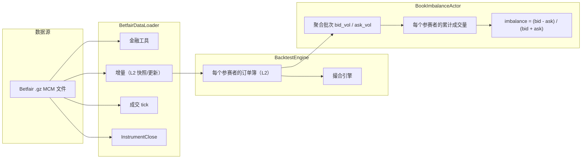
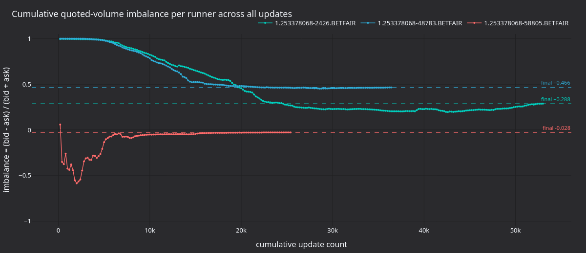
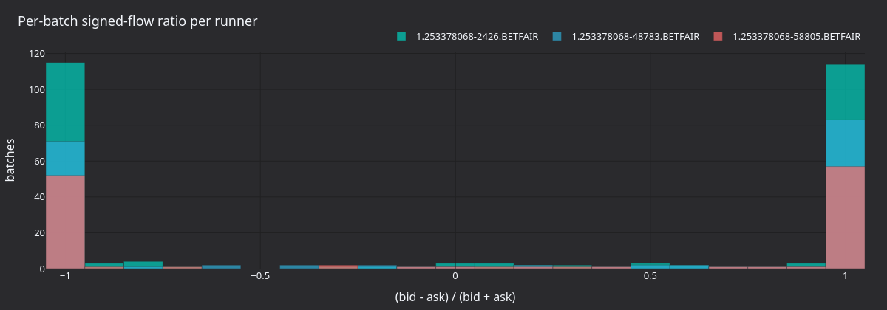
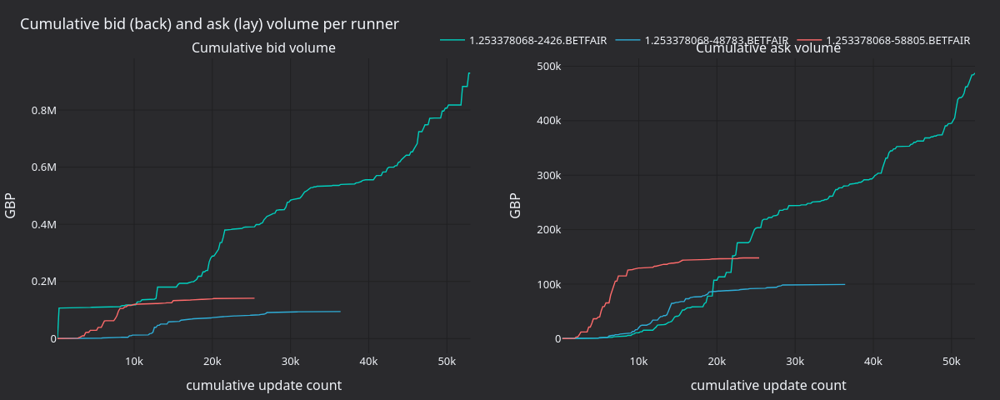

# 订单簿不平衡回测（Betfair）

:::note
这是一个**仅使用 Rust**的系统教程。它绕过 Python 和 Parquet 路径，直接以原始 Betfair 流数据驱动 Rust `BacktestEngine`。
:::

本教程在 Betfair MATCH_ODDS 市场上回测 `BookImbalanceActor`。它加载原始历史流 `.gz` 文件，将数据送入 Rust `BacktestEngine`，并跟踪每个参赛者的买方/卖方报价量不平衡。

## 简介

Betfair 是一家体育博彩交易所，参与者按十进制赔率对某个结果下 back（买入支持）或 lay（卖出反对）订单。每个参赛者都有自己的 L2 订单簿，其运作方式与金融订单簿相似。

Actor 读取每个参赛者的 `OrderBookDeltas`，并分别累计两侧的交易量：买方量（back 订单）和卖方量（lay 订单）。每批次不平衡和累计不平衡的计算方式如下：

```
imbalance = (bid_volume - ask_volume) / (bid_volume + ask_volume)
```

正值表示市场更倾向于支持该结果。体育交易者常以此为起点，再结合价格动量或全市场特征。

发布构建每秒可处理约 300 万个数据点，同时由撮合引擎维护完整订单簿。



## 先决条件

- 可用的 Rust 工具链（[rustup.rs](https://rustup.rs)）。
- 已克隆并能成功构建的 VibeTrader 仓库。
- 一个包含 MCM（Market Change Message，市场变更消息）数据的 Betfair 历史 `.gz` 文件。可从 [Betfair 历史数据](https://historicdata.betfair.com/)获取、使用第三方存档，或自行录制 Exchange Streaming API 数据。

将文件放置在：

```
test_data/local/betfair/1.253378068.gz
```

此路径已被 Git 忽略，文件不会随仓库分发。配套示例数据集来自一个足球 MATCH_ODDS 市场，包含 3 名参赛者以及在 18 天内记录的约 82,000 行 MCM 数据。

## 加载数据

`BetfairDataLoader` 读取 gzip 压缩的 Betfair Exchange Streaming API 文件，并将每一行解析为 Vibe 领域对象：

```rust
use vibe_betfair::loader::{BetfairDataItem, BetfairDataLoader};
use vibe_model::types::Currency;

let mut loader = BetfairDataLoader::new(Currency::GBP(), None);
let items = loader.load(&filepath)?;
```

加载器返回 `Vec<BetfairDataItem>`：

| 变体                | 说明                                    | 映射到 `Data` 枚举？        |
| :------------------ | :-------------------------------------- | :-------------------------- |
| `Instrument`        | 市场定义中的参赛者定义。                | 否（单独添加）              |
| `Status`            | 市场状态转换（PreOpen、Trading 等）。   | 否（`Data` 无此变体）       |
| `Deltas`            | 订单簿快照或增量更新。                  | 是，`Data::Deltas`          |
| `Trade`             | 从累计成交量生成的增量成交 tick。       | 是，`Data::Trade`           |
| `Ticker`            | 最新成交价、成交量、BSP 近端/远端价格。 | -                           |
| `StartingPrice`     | 参赛者的 Betfair 起始价格。             | -                           |
| `BspBookDelta`      | BSP 专用订单簿增量。                    | -                           |
| `InstrumentClose`   | 结算事件。                              | 是，`Data::InstrumentClose` |
| `SequenceCompleted` | 批次完成标记。                          | -                           |
| `RaceRunnerData`    | GPS 跟踪数据（赛马/赛狗）。             | -                           |
| `RaceProgress`      | 赛事级进度数据。                        | -                           |

回测引擎接受 `Data` 枚举，因此我们映射所需变体，并跳过 Betfair 专用类型：

```rust
use vibe_model::data::{Data, OrderBookDeltas_API};

let mut instruments = AHashMap::new();
let mut data: Vec<Data> = Vec::new();

for item in items {
    match item {
        BetfairDataItem::Instrument(inst) => {
            instruments.insert(inst.id(), *inst);
        }
        BetfairDataItem::Deltas(d) => {
            data.push(Data::Deltas(OrderBookDeltas_API::new(d)));
        }
        BetfairDataItem::Trade(t) => {
            data.push(Data::Trade(t));
        }
        BetfairDataItem::InstrumentClose(c) => {
            data.push(Data::InstrumentClose(c));
        }
        _ => {}
    }
}
```

`OrderBookDeltas_API` 是 `Data` 枚举所需的 `OrderBookDeltas` 轻量 FFI 包装器。

流中每次更新市场定义时都会重新发出金融工具，因此该映射通过保留最新版本来去重。

:::warning
`Status` 变体携带市场状态转换（PreOpen、Trading、Suspended、Closed），但 `Data` 枚举没有对应变体。本示例不会重放这些状态转换。如果将其扩展为会提交订单的策略，撮合引擎将无法感知数据流中的市场暂停或关闭。请单独订阅金融工具状态，或为引擎添加状态路由。
:::

## Actor

VibeTrader 在 trading crate 的 examples 模块中提供了 `BookImbalanceActor`。示例为它配置每个参赛者的金融工具列表和日志间隔：

```rust
use vibe_trading::examples::actors::BookImbalanceActor;

let actor = BookImbalanceActor::new(instrument_ids, 5000, None);
engine.add_actor(actor)?;
```

第二个参数是日志间隔：每个参赛者每更新 5,000 次打印一行进度。示例从环境变量读取 `IMBALANCE_LOG_INTERVAL`；如需为本教程末尾的图表采集更细粒度的数据，可将其设为较小值（`200`）。

完整源代码位于 [`crates/trading/src/examples/actors/imbalance/actor.rs`](https://github.com/qOeOp/trade/tree/main/crates/trading/src/examples/actors/imbalance/actor.rs)。

### 工作原理

Rust 中的`DataActor` 需要三个部分：

1. 一个包含 `DataActorCore` 字段和自定义状态的结构体。
2. 使用 `vibe_actor!(YourType)` 接入核心，并实现 `Debug`。
3. 实现 `DataActor` trait 及其回调。

框架为运行时 Actor 提供了 `Actor` 和 `Component` 的 blanket 实现。当结构体持有 `DataActorCore` 时，`vibe_actor!` 宏会提供原生运行时接线，因此常规 Actor 代码只需实现所需回调。

启动时，Actor 为每个金融工具订阅 `OrderBookDeltas`。每次更新时，它对各条增量中的两侧交易量分别求和，并累计总量。停止时，它会打印每个金融工具的汇总。

在 `subscribe_book_deltas` 中设置 `managed: false`，表示数据引擎不会在缓存中为该 Actor 另行维护一份订单簿。交易所侧撮合引擎仍会在每次增量到达时通过 `book.apply_delta()` 维护自己的订单簿。如果 Actor 需要通过 `self.cache().order_book(&instrument_id)` 读取完整订单簿状态，请设置 `managed: true`。

## 回测引擎设置

### 创建引擎和交易场所

Betfair 是一家以现金结算的博彩交易所。交易场所使用`AccountType::Cash`、`OmsType::Netting`和`BookType::L2_MBP`：

```rust
let mut engine = BacktestEngine::new(BacktestEngineConfig::default())?;

engine.add_venue(
    SimulatedVenueConfig::builder()
        .venue(Venue::from("BETFAIR"))
        .oms_type(OmsType::Netting)
        .account_type(AccountType::Cash)
        .book_type(BookType::L2_MBP)
        .starting_balances(vec![Money::from("1_000_000 GBP")])
        .build()?,
)?;
```

### 添加金融工具、Actor 和数据

```rust
for instrument in instruments.values() {
    engine.add_instrument(instrument)?;
}

let actor = BookImbalanceActor::new(instrument_ids, 5000, None);
engine.add_actor(actor)?;

engine.add_data(data, None, true, true)?;
```

`add_data` 的参数为 `(data, client_id, validate, sort)`。设置 `validate: true` 后，引擎会检查第一个元素对应的金融工具是否已注册（假定该批次同质）。设置 `sort: true` 后，数据会按时间戳排序。

### 运行

```rust
engine.run(None, None, None, false)?;
```

四个参数依次为 `(start, end, run_config_id, streaming)`。起止时间均传入 `None`，即使用已加载数据的完整时间范围。

## 运行期间发生了什么

引擎按时间戳顺序处理每个数据点，并执行以下步骤：

1. 将时钟提前到数据时间戳。
2. 将数据路由到模拟交易所；模拟交易所把每条增量应用到各金融工具的 `OrderBook`，并运行一轮撮合引擎。
3. 通过数据引擎和消息总线发布数据，触发 Actor 的 `on_book_deltas` 回调。
4. 排空命令队列并结算交易场所（处理任何挂单）。

撮合引擎为每个金融工具维护完整订单簿。本示例没有需要撮合的订单，因此将 Actor 换成 `Strategy` 后便可直接使用该订单簿状态。

## 结果

捆绑的 MATCH_ODDS 数据集有 3 个参赛者和 143,098 个数据点；发布版本在大约 48 毫秒内完成：

```
--- Book imbalance summary ---
  1.253378068-2426.BETFAIR   updates: 53197  bid_vol: 212225339.34  ask_vol: 117422531.85  imbalance:  0.2876
  1.253378068-48783.BETFAIR  updates: 36475  bid_vol:  52506905.49  ask_vol:  19104694.72  imbalance:  0.4664
  1.253378068-58805.BETFAIR  updates: 25426  bid_vol:  24295351.82  ask_vol:  25692733.11  imbalance: -0.0280
```

参赛者 `2426`（最终获胜者，BSP 结算价为 2.22）的最终值为 +0.288：整个市场中，back 流量始终高于 lay 流量。参赛者 `48783` 的更新次数较少，但支持买入压力更强（+0.466）；`58805` 最终接近中性（-0.028）。



**图 1.** *每个参赛者在市场生命周期内约 143k 次更新中的累计`(bid - ask) / (bid + ask)`。虚线标记每个参赛者的最终不平衡情况。*



**图 2.** *每个参赛者在 `IMBALANCE_LOG_INTERVAL=200` 的各批次中，每批次带符号流量比率 `(bid - ask) / (bid + ask)` 的分布。相较于累计不平衡，每个参赛者的批次分布形态是更敏锐的信号。*



**图 3.** *每个参赛者的累计 back（买方）量和 lay（卖方）量。两侧都并非单调占优：即使累计不平衡保持为正，lay 流量偶尔也会在短暂的集中时段内超过 back 流量。*

### 重新生成面板

Actor 每更新 N 次就记录一行 `[runner] update #N: batch bid=B ask=A cumulative imbalance=I`。渲染器解析这些日志行，并使用 `vibe_dark` tearsheet 主题生成静态 PNG。

```bash
IMBALANCE_LOG_INTERVAL=200 cargo run -p vibe-betfair --features examples --release \
    --example betfair-backtest > /tmp/betfair.log 2>&1

uv sync --extra visualization
BETFAIR_LOG=/tmp/betfair.log \
    python3 docs/tutorials/assets/backtest_book_imbalance_betfair/render_panels.py
```

## 运行示例

```bash
# Debug build
cargo run -p vibe-betfair --features examples --example betfair-backtest

# Release build (recommended)
cargo run -p vibe-betfair --features examples --release --example betfair-backtest

# Custom data file
cargo run -p vibe-betfair --features examples --release --example betfair-backtest -- path/to/file.gz
```

## 完整源码

完整示例位于 [`crates/adapters/betfair/examples/betfair_backtest.rs`](https://github.com/qOeOp/trade/tree/main/crates/adapters/betfair/examples/betfair_backtest.rs)。

## 后续步骤

- **添加策略**。将 Actor 替换为根据不平衡信号提交 back/lay 订单的 `Strategy` 实现。实现模式可参考 `crates/trading/src/examples/strategies/ema_cross/strategy.rs` 中的 `EmaCross` 示例。
- **使用托管订单簿**。在 `subscribe_book_deltas` 中设置 `managed: true`，并通过 `self.cache().order_book(&id)` 读取完整订单簿，以构建订单簿顶部价差、深度比率或加权中间价等更丰富的信号。
- **多个市场**。加载多个 `.gz` 文件并通过同一引擎运行，以测试跨市场信号。
- **与 Python 比较**。使用 `BacktestEngine` Python API 从 Python 运行相同回测。Rust 引擎处理同一数据管道的吞吐量约为 Python/Cython 路径的六倍。
