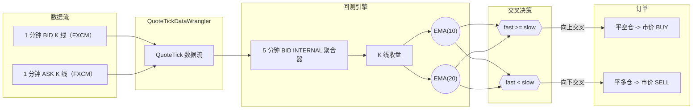
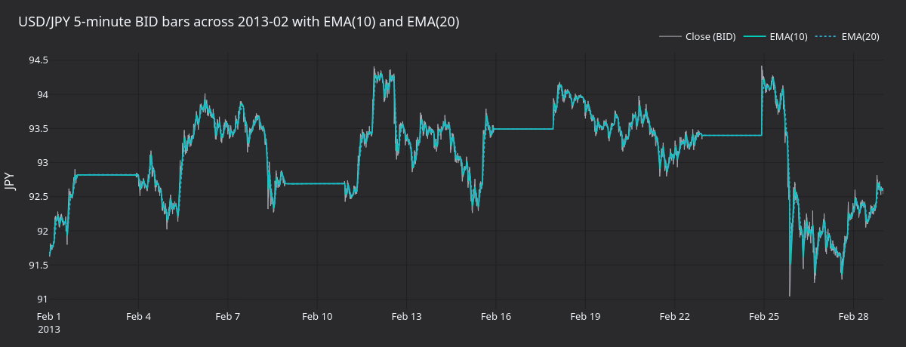
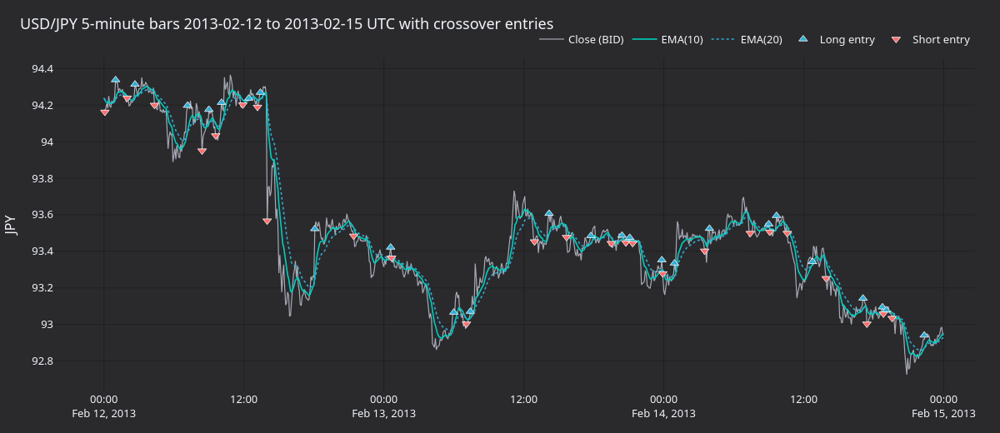
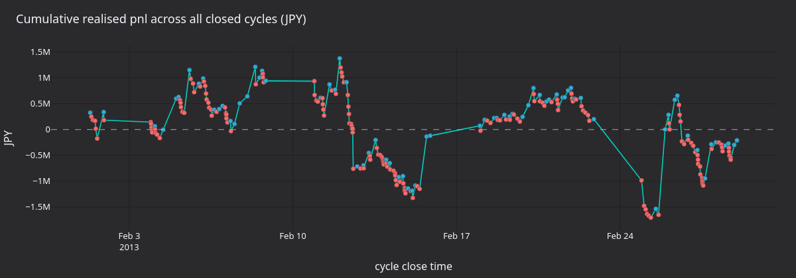
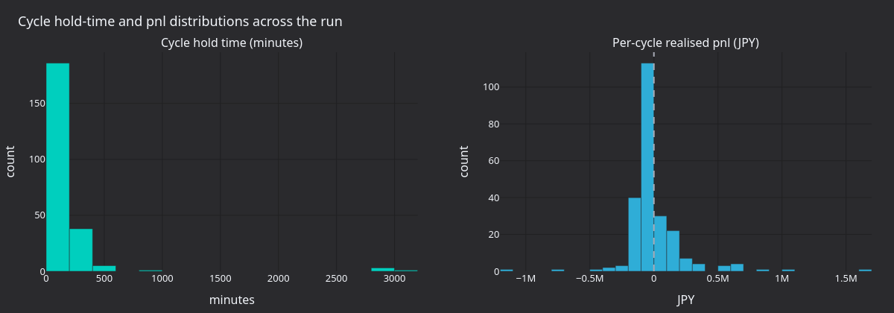

使用外汇展期利息和概率成交模型，在 USD/JPY 一分钟买价/卖价柱上运行 EMA 交叉策略。数据随 VibeTrader 测试工具包提供，因此本教程无需下载外部数据即可运行。

[在 GitHub 上查看源代码](https://github.com/qOeOp/trade/blob/main/docs/tutorials/backtest_fx_bars.py)。

## 简介

策略为 `EMACross`，这是一个在柱收盘时比较快慢 EMA 的教学示例：

- **快速 EMA 向上穿越慢速 EMA**：平掉所有空头持仓，并建立新的多头持仓。
- **快速 EMA 向下穿越慢速 EMA**：平掉所有多头持仓，并建立新的空头持仓。

交易场所是模拟外汇 ECN，使用 `MARGIN` 账户和 `HEDGING` OMS，多币种起始余额为 1,000,000 USD 和 10,000,000 JPY。`FillModel` 为每次成交引入 50% 的单 tick 滑点概率，`FXRolloverInterestModule` 根据相关短期利率差计提每日展期利息。

`EMACross` 是教学策略，不具备交易优势。



## 先决条件

- Python 3.12+
- 本地 Vibe Trader 源码构建（`make build-debug`）。只有需要重新生成教程末尾的图表时，才需要额外安装 `visualization`。

```python
from decimal import Decimal

from vibe_trader.common import LogLevel
from vibe_trader.config import BacktestEngineConfig
from vibe_trader.backtest import BacktestEngine
from vibe_trader.backtest import FXRolloverInterestModule
from vibe_trader.backtest import InterestRateRecord
from vibe_trader.config import LoggerConfig
from vibe_trader.config import RiskEngineConfig
from vibe_trader.execution import ProbabilisticFillModel
from vibe_trader.examples.strategies.ema_cross import EMACross
from vibe_trader.examples.strategies.ema_cross import EMACrossConfig
from vibe_trader.model import BarType
from vibe_trader.model import Money
from vibe_trader.model import Venue
from vibe_trader.model.currencies import JPY
from vibe_trader.model.currencies import USD
from vibe_trader.model.enums import AccountType
from vibe_trader.model.enums import OmsType
from vibe_trader.persistence.wranglers import QuoteTickDataWrangler
from vibe_trader.test_kit.providers import TestDataProvider
from vibe_trader.test_kit.providers import TestInstrumentProvider
```

## 引擎设置

这里绕过交易前风险检查，使策略的市价订单直接进入撮合引擎。

```python
config = BacktestEngineConfig(
    trader_id="BACKTESTER-001",
    logging=LoggerConfig(stdout_level=LogLevel.ERROR),
    risk_engine=RiskEngineConfig(bypass=True),
)
engine = BacktestEngine(config=config)
```

## 模拟模块

`FXRolloverInterestModule` 使用随附的 `short-term-interest.csv` 利率数据（来自 OECD 短期利率序列），在配置的切换时间对未平仓持仓收取或计入展期利息。若不启用此模块，跨多个交易时段的回测将忽略持仓利差。

```python
provider = TestDataProvider()
interest_rate_data = provider.read_csv("short-term-interest.csv")
interest_rate_records = [
    InterestRateRecord(location=row.LOCATION, time=row.TIME, value=row.Value)
    for row in interest_rate_data.itertuples(index=False)
]
fx_rollover_interest = FXRolloverInterestModule(records=interest_rate_records)
```

## 成交模型

限价订单价格被触及时，每个 tick 有 20% 的成交概率；任何市价订单或可立即成交的订单，则以 50% 概率产生一个 tick 的滑点。随机种子使运行结果可复现。

```python
fill_model = ProbabilisticFillModel(
    prob_fill_on_limit=0.2,
    prob_slippage=0.5,
    random_seed=42,
)
```

## 交易场所

`OmsType.HEDGING` 允许策略同时持有同一金融工具的多头和空头持仓，并由交易场所分配持仓 ID。账户采用多币种模式，因此 USD/JPY 的 PnL 以 JPY 累计，而不是在每次成交时转换币种。

```python
SIM = Venue("SIM")
engine.add_venue(
    venue=SIM,
    oms_type=OmsType.HEDGING,
    account_type=AccountType.MARGIN,
    base_currency=None,
    starting_balances=[Money(1_000_000, USD), Money(10_000_000, JPY)],
    fill_model=fill_model,
    modules=[fx_rollover_interest],
)
```

## 金融工具及数据

`QuoteTickDataWrangler.process_bar_data` 根据随附的 FXCM 买价和卖价 CSV，在每根分钟柱的开盘与收盘各合成一条报价 tick，从而在柱聚合前为引擎提供报价 tick 流。策略声明 `5-MINUTE-BID-INTERNAL`，因此引擎会在内部从报价流聚合五分钟 BID 柱。

```python
USDJPY_SIM = TestInstrumentProvider.default_fx_ccy("USD/JPY", SIM)
engine.add_instrument(USDJPY_SIM)

wrangler = QuoteTickDataWrangler(instrument=USDJPY_SIM)
ticks = wrangler.process_bar_data(
    bid_data=provider.read_csv_bars("fxcm/usdjpy-m1-bid-2013.csv"),
    ask_data=provider.read_csv_bars("fxcm/usdjpy-m1-ask-2013.csv"),
)
engine.add_data(ticks)
```

## 策略

每笔订单的交易规模为 1,000,000 USD。EMACross 在每次交叉时平掉原持仓并建立反向持仓，因此策略几乎整月都有持仓。

```python
strategy_config = EMACrossConfig(
    instrument_id=USDJPY_SIM.id,
    bar_type=BarType.from_str("USD/JPY.SIM-5-MINUTE-BID-INTERNAL"),
    fast_ema_period=10,
    slow_ema_period=20,
    trade_size=Decimal(1_000_000),
)
strategy = EMACross(config=strategy_config)
engine.add_strategy(strategy=strategy)
```

## 运行

引擎按时间戳顺序处理每条报价 tick 和每根柱，数据全部处理完后返回。

```python
engine.run()
```

## 报告

`engine.trader.generate_*` 返回涵盖账户状态、成交和已平仓持仓的 DataFrame。

```python
engine.trader.generate_account_report(SIM)
```

```python
engine.trader.generate_order_fills_report()
```

```python
engine.trader.generate_positions_report()
```

## 运行产生什么

运行 28 天会生成 8,065 根五分钟柱，并通过 468 次成交完成 234 个已平仓周期（第一次交叉后，每次交叉都会为原持仓产生一笔平仓成交，再为新持仓产生一笔开仓成交）。234 个周期中有 72 个盈利。策略最终亏损 209,000 JPY：这是噪声较大的五分钟序列中典型的反复止损特征。



**图 1.** *2013 年 2 月 USD/JPY 五分钟 BID 收盘价，并叠加 EMA(10) 和 EMA(20)。较长的平坦区段是 FXCM 买价数据源中的周末空档。*



**图 2.** *2013-02-12 至 2013-02-15 UTC 的局部图。每个标记表示一次交叉入场：上三角为做多，下三角为做空。*



**图 3.** *所有已平仓周期的累计 JPY PnL。标记颜色表示各周期 PnL：蓝色为正，红色为负。*



**图 4.** *持仓周期时长与单周期 PnL 分布。大多数周期持有不到三小时；PnL 分布大致对称，并高度集中在零附近。*

<!-- #region -->
### 重新生成面板

上述图表由独立渲染器生成：它会重新运行回测，从引擎缓存提取柱与成交，并使用共享的 `vibe_dark` tearsheet 主题生成 PNG。

```bash
uv sync --extra visualization
python3 docs/tutorials/assets/backtest_fx_bars/render_panels.py
```
<!-- #endregion -->

## 后续步骤

- **放慢信号**。默认的 10/20 EMA 在趋势较弱的交易时段容易反复交叉。可在相同柱上尝试 20/60，或改用十五分钟柱，以减少交易周期。
- **添加市场状态过滤器**。当已实现波动区间低于阈值时抑制入场，使策略只在具有方向性波动的交易时段交易。
- **比较聚合方式**。将通过 `BarType.from_str("USD/JPY.SIM-5-MINUTE-BID-INTERNAL")` 从原始 tick 数据构建的柱，与外部预聚合数据集对比，确认两条路径结果一致。
