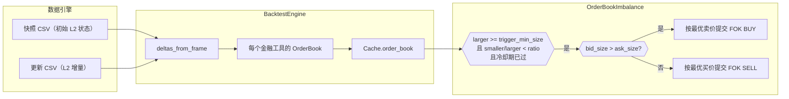
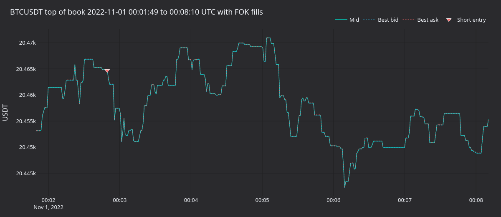
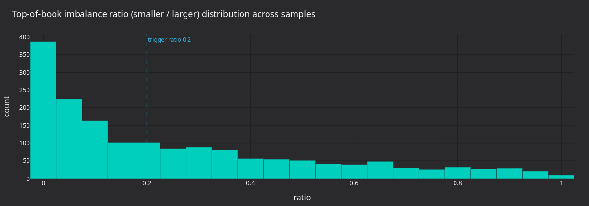
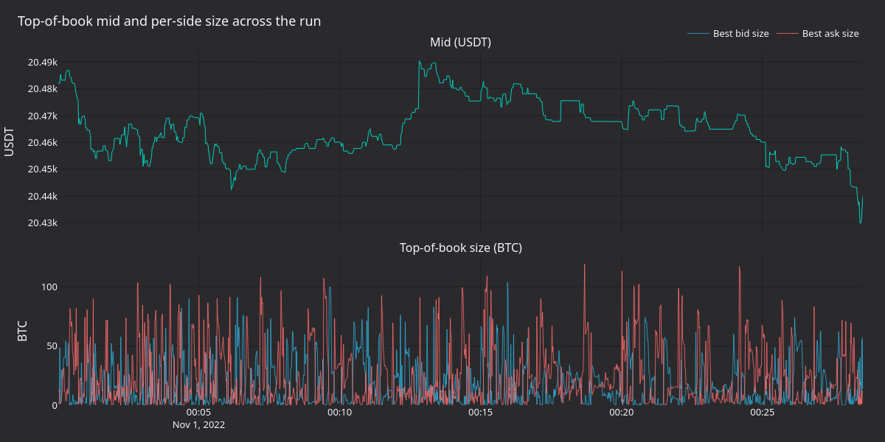
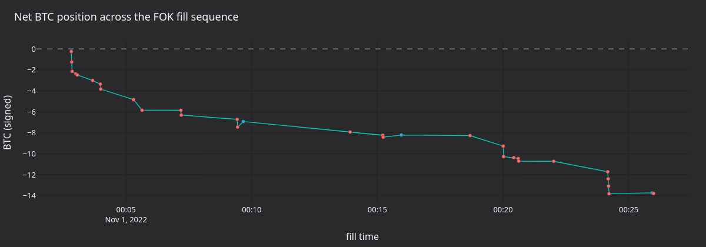

通过 `BacktestNode` 重放 Binance T_DEPTH 订单簿增量，并运行不平衡策略：当订单簿一侧明显厚于另一侧时，策略提交 fill-or-kill（FOK）限价订单。同一模式适用于任何交易场所的 L2 增量数据源。

[在 GitHub 上查看源代码](https://github.com/qOeOp/trade/blob/main/docs/tutorials/backtest_orderbook_binance.py)。

## 简介

订单簿顶部不平衡是一种微观结构信号：当 BBO 较小一侧的挂单量远低于较大一侧时，订单簿会明显倾斜。本教程的 `OrderBookImbalance` 策略在每次订单簿更新时分两步运行：

- 计算 `min(bid_size, ask_size) / max(bid_size, ask_size)`。值越高表示越平衡，越低表示偏斜越明显。
- 当较大一侧至少达到 `trigger_min_size`，且比率低于 `trigger_imbalance_ratio` 时，针对较厚一侧提交一笔 FOK 限价订单。`min_seconds_between_triggers` 规定的触发冷却期可防止策略在每次微小更新时重复触发。

该策略有意保持简单，不具备交易优势。



## 先决条件

- Python 3.12+
- 本地 Vibe Trader 源码构建（`make build-debug`）
- 同级的 [`orderbook_data.py`](./orderbook_data.py) 和 [`orderbook_imbalance.py`](./orderbook_imbalance.py) 文件。下载教程或通过 Jupytext 转换时，请将它们与本教程放在同一目录。
- 要重放日期的 Binance T_DEPTH CSV。随附教程使用 [data.binance.vision](https://data.binance.vision) 提供的 BTCUSDT 2022-11-01 数据。请将文件放入 `VIBE_DATA_DIR/Binance/` 目录。

```python
import os
import shutil
from pathlib import Path

import pandas as pd
from vibe_trader.adapters.binance import load_binance_order_book_deltas
from vibe_trader.backtest import BacktestNode
from vibe_trader.common import LogLevel
from vibe_trader.config import (
    BacktestDataConfig,
    BacktestEngineConfig,
    BacktestRunConfig,
    BacktestVenueConfig,
    ImportableStrategyConfig,
    LoggerConfig,
)
from vibe_trader.core.datetime import dt_to_unix_nanos
from vibe_trader.model import (
    AccountType,
    BookType,
    Currency,
    CurrencyPair,
    InstrumentId,
    OmsType,
    Price,
    Quantity,
    Symbol,
    Venue,
)
from vibe_trader.persistence import ParquetDataCatalog

from orderbook_data import deltas_from_frame
```

## 加载数据

`_depth_snap.csv` 和 `_depth_update.csv` 的每一行表示一个 L2 价位事件。Binance 加载器将其映射为 VibeTrader `OrderBookDelta` 对象：快照使用 `update_type="snap"`，更新使用 `set` / `delete`。BTCUSDT 2022-11-01 的完整更新文件约为 12 GB（约 1.1 亿行），因此教程最多读取 1,000,000 行。

```python
DATA_DIR = Path(os.environ.get("VIBE_DATA_DIR", "~/Downloads/Data")).expanduser() / "Binance"
```

```python
data_path = DATA_DIR
raw_files = [f for f in data_path.iterdir() if f.is_file()]
assert raw_files, f"Unable to find any data files in directory {data_path}"
raw_files
```

```python
# Initial L2 snapshot of the book at session open.
path_snap = data_path / "BTCUSDT_T_DEPTH_2022-11-01_depth_snap.csv"
df_snap = load_binance_order_book_deltas(path_snap)
df_snap.head()
```

```python
# Per-level deltas for the day; capped to 1M rows for a reasonable run time.
path_update = data_path / "BTCUSDT_T_DEPTH_2022-11-01_depth_update.csv"
nrows = 1_000_000
df_update = load_binance_order_book_deltas(path_update, nrows=nrows)
df_update.head()
```

### 构建当前模型对象

使用公开模型 API 定义金融工具，再将加载器的每一行转换为 `OrderBookDelta`。按 `ts_init` 排序，使数据引擎始终按真实发布时间顺序接收增量，不受快照和更新文件交错方式影响。

```python
BTCUSDT_BINANCE = CurrencyPair(
    instrument_id=InstrumentId(Symbol("BTCUSDT"), Venue("BINANCE")),
    raw_symbol=Symbol("BTCUSDT"),
    base_currency=Currency.from_str("BTC"),
    quote_currency=Currency.from_str("USDT"),
    price_precision=2,
    size_precision=6,
    price_increment=Price(0.01, precision=2),
    size_increment=Quantity(0.000001, precision=6),
    ts_event=0,
    ts_init=0,
)

deltas = deltas_from_frame(df_snap, BTCUSDT_BINANCE)
deltas += deltas_from_frame(df_update, BTCUSDT_BINANCE)
deltas.sort(key=lambda x: x.ts_init)
deltas[:10]
```

### 设置数据目录

将金融工具和增量持久化到新的 `ParquetDataCatalog`，供 `BacktestNode` 按时间范围延迟加载。重新运行教程会清除同一路径下此前的数据目录。

```python
CATALOG_PATH = Path.cwd() / "catalog"
if CATALOG_PATH.exists():
    shutil.rmtree(CATALOG_PATH)
CATALOG_PATH.mkdir()

catalog = ParquetDataCatalog(str(CATALOG_PATH))
```

```python
catalog.write_instruments([BTCUSDT_BINANCE])
catalog.write_order_book_deltas(deltas)
```

```python
catalog.instruments()
```

```python
start = dt_to_unix_nanos(pd.Timestamp("2022-11-01", tz="UTC"))
end = dt_to_unix_nanos(pd.Timestamp("2022-11-04", tz="UTC"))

deltas = catalog.query_order_book_deltas(
    identifiers=[str(BTCUSDT_BINANCE.id)],
    start=start,
    end=end,
)
print(len(deltas))
deltas[:10]
```

## 配置回测

`BacktestNode` 从数据目录摄取数据，并为每个 `BacktestRunConfig` 构建一个 `BacktestEngine`。交易场所的订单簿类型必须与数据一致：这些增量包含完整 L2 信息，因此使用 `L2_MBP`。

```python
instrument = catalog.instruments()[0]
book_type = BookType.L2_MBP

data_configs = [
    BacktestDataConfig(
        catalog_path=str(CATALOG_PATH),
        data_type="OrderBookDelta",
        instrument_id=instrument.id,
    ),
]

venues_configs = [
    BacktestVenueConfig(
        name="BINANCE",
        oms_type=OmsType.NETTING,
        account_type=AccountType.CASH,
        base_currency=None,
        starting_balances=["20 BTC", "100000 USDT"],
        book_type=book_type,
    ),
]

strategy_config = ImportableStrategyConfig(
    strategy_path="orderbook_imbalance:OrderBookImbalance",
    config_path="orderbook_imbalance:OrderBookImbalanceConfig",
    config={
        "instrument_id": str(instrument.id),
        "book_type": book_type.name,
        "max_trade_size": "1.000",
        "min_seconds_between_triggers": 1.0,
    },
)

config = BacktestRunConfig(
    engine=BacktestEngineConfig(
        logging=LoggerConfig(stdout_level=LogLevel.ERROR),
    ),
    data=data_configs,
    venues=venues_configs,
    dispose_on_completion=False,
)

config
```

## 运行回测

```python
node = BacktestNode(configs=[config])
node.build()
node.add_strategy_from_config(config.id, strategy_config)

result = node.run()
```

```python
result
```

```python
node.generate_order_fills_report(config.id)
```

```python
node.generate_positions_report(config.id)
```

```python
node.generate_account_report(config.id, venue=Venue("BINANCE"))
```

## 运行产生什么

一百万条更新大致覆盖初始快照重建后交易日的前十一分钟。下方渲染器使用三百万条更新（约 25 分钟），使图表包含足够多的触发事件；策略在较小的默认窗口中以相同方式触发。

在活跃更新窗口中，策略提交了 47 笔 FOK 限价订单，并累计形成 14 BTC 净空头。每次触发都发生在买方，说明采集窗口内几乎每次不平衡事件都由卖方挂单量主导买方挂单量。



**图 1.** *BTCUSDT 在 FOK 触发窗口内的中间价、最佳买价和最佳卖价。下三角表示在买价开空，叉号表示平仓成交。策略始终在买方触发。*



**图 2.** *所有采样订单簿顶部快照的 `smaller / larger` 比率，并标出 0.20 触发阈值。阈值左侧的分布质量即策略可触发区域。*



**图 3.** *活跃更新窗口中的中间价（上图）和以 BTC 计的最佳买价/卖价挂单量（下图）。订单簿顶部数量在较宽范围内波动，而中间价只在窄幅区间漂移。*



**图 4.** *FOK 成交序列中的累计带符号 BTC 数量。每个标记表示一笔成交；橙色为卖出，蓝色为买入。策略在 25 分钟内逐步建立 -14 BTC 空头持仓。*

<!-- #region -->
### 重新生成面板

独立渲染器会使用采样 Actor 重新运行回测，每秒采集一次订单簿顶部，再使用共享的 `vibe_dark` tearsheet 主题将 PNG 图表写入资产目录。

```bash
uv sync --extra visualization
VIBE_DATA_DIR=test_data/local \
    python3 docs/tutorials/assets/backtest_orderbook_binance/render_panels.py
```

将 `VIBE_DATA_DIR` 指向 `Binance/` 数据目录的上级位置。
<!-- #endregion -->

## 后续步骤

- **收紧触发条件**。将 `trigger_imbalance_ratio` 降到 0.10，要求订单簿达到十比一的偏斜后才触发。预计入场次数和触发率都会显著降低。
- **延长窗口**。将 `nrows` 提高到一千万或两千万，重放数小时数据，观察策略在更多样的交易时段中承受的压力。
- **使用报价 tick 而非增量**。在策略配置中设置 `use_quote_ticks=True`，并向引擎提供报价 tick 数据集，以成本更低的 L1 视图运行策略。
