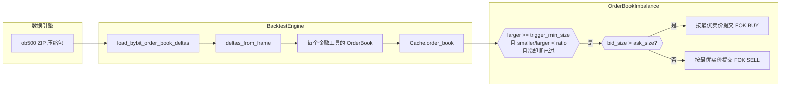
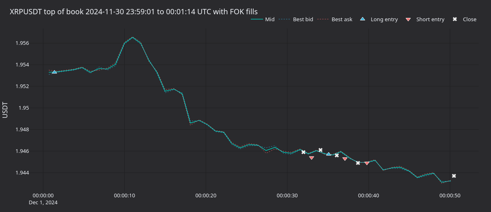
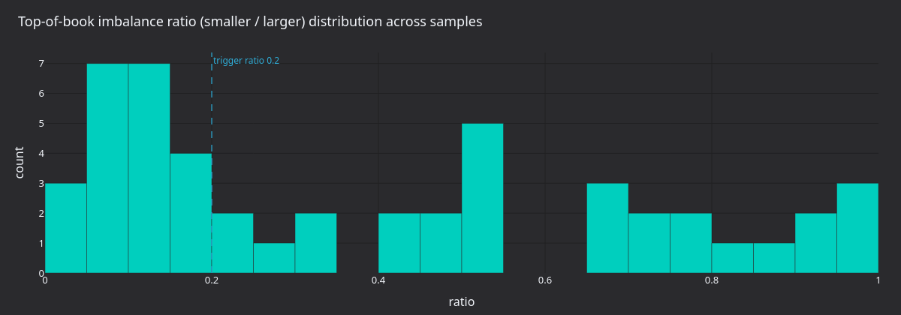
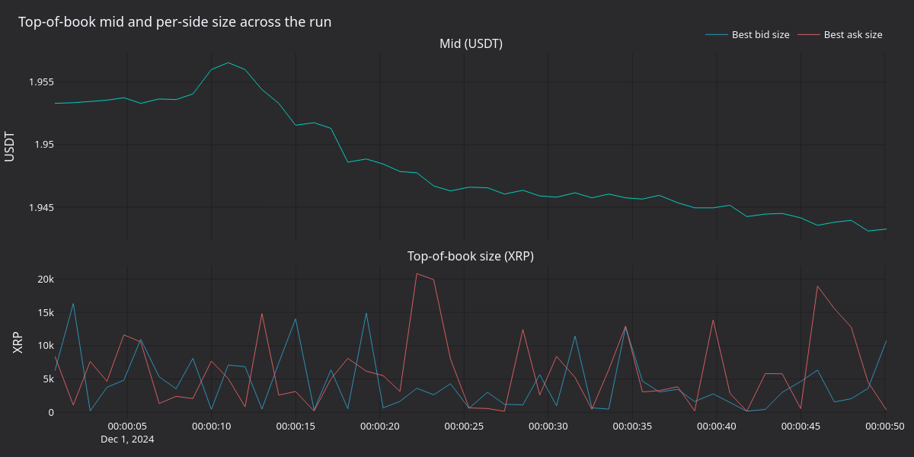
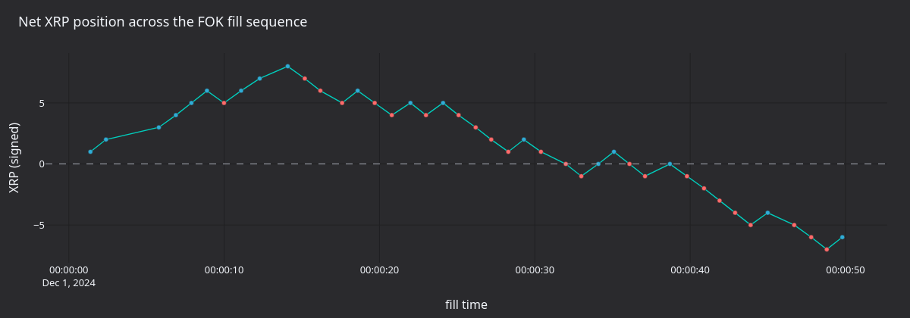

通过 `BacktestNode` 重放 Bybit `ob500` 订单簿增量，并运行 `OrderBookImbalance` 策略。整体模式与 [Binance 版本](https://github.com/qOeOp/trade/blob/main/docs/tutorials/backtest_orderbook_binance.py)相同，只是加载器和金融工具不同。

[在 GitHub 上查看源代码](https://github.com/qOeOp/trade/blob/main/docs/tutorials/backtest_orderbook_bybit.py)。

## 简介

Bybit 为每个交易品种发布一份深度为 500 档的 L2 增量存档。教程将每日 ZIP 读入 DataFrame。策略与 Binance 教程中的 `OrderBookImbalance` 相同：当 BBO 较小一侧的挂单量低于较大一侧的 `trigger_imbalance_ratio` 比例时，针对较厚一侧提交一笔 FOK 限价订单。

`OrderBookImbalance` 是教学策略，不具备交易优势。



## 先决条件

- Python 3.12+
- 本地 Vibe Trader 源码构建（`make build-debug`）
- 同级的 [`orderbook_data.py`](./orderbook_data.py) 和 [`orderbook_imbalance.py`](./orderbook_imbalance.py) 文件。下载教程或通过 Jupytext 转换时，请将它们与本教程放在同一目录。
- 一份每日 Bybit `ob500` ZIP，例如从 [public.bybit.com](https://public.bybit.com) 获取的 `2024-12-01_XRPUSDT_ob500.data.zip`。

```python
import os
import shutil
from pathlib import Path

import pandas as pd
from vibe_trader.backtest import BacktestNode
from vibe_trader.common import LogLevel
from vibe_trader.config import (
    BacktestDataConfig,
    BacktestEngineConfig,
    BacktestRunConfig,
    BacktestVenueConfig,
    ImportableStrategyConfig,
    LoggerConfig,
)
from vibe_trader.core.datetime import dt_to_unix_nanos
from vibe_trader.model import (
    AccountType,
    BookType,
    CryptoPerpetual,
    Currency,
    InstrumentId,
    OmsType,
    Price,
    Quantity,
    Symbol,
    Venue,
)
from vibe_trader.persistence import ParquetDataCatalog

from orderbook_data import (
    deltas_from_frame,
    load_bybit_order_book_deltas,
)
```

## 加载数据

```python
DATA_DIR = Path(os.environ.get("VIBE_DATA_DIR", "~/Downloads/Data")).expanduser() / "Bybit"
```

```python
data_path = DATA_DIR
raw_files = [f for f in data_path.iterdir() if f.is_file()]
assert raw_files, f"Unable to find any data files in directory {data_path}"
raw_files
```

```python
# Read the first 1M deltas; the full file is larger.
path_update = data_path / "2024-12-01_XRPUSDT_ob500.data.zip"
nrows = 1_000_000
df_raw = load_bybit_order_book_deltas(path_update, nrows=nrows)
df_raw.head()
```

### 构建当前模型对象

```python
XRPUSDT_BYBIT = CryptoPerpetual(
    instrument_id=InstrumentId(Symbol("XRPUSDT-LINEAR"), Venue("BYBIT")),
    raw_symbol=Symbol("XRPUSDT"),
    base_currency=Currency.from_str("XRP"),
    quote_currency=Currency.from_str("USDT"),
    settlement_currency=Currency.from_str("USDT"),
    is_inverse=False,
    price_precision=4,
    size_precision=0,
    price_increment=Price(0.0001, precision=4),
    size_increment=Quantity(1, precision=0),
    ts_event=0,
    ts_init=0,
)

deltas = deltas_from_frame(df_raw, XRPUSDT_BYBIT)
deltas.sort(key=lambda x: x.ts_init)
deltas[:10]
```

### 设置数据目录

```python
CATALOG_PATH = Path.cwd() / "catalog"
if CATALOG_PATH.exists():
    shutil.rmtree(CATALOG_PATH)
CATALOG_PATH.mkdir()

catalog = ParquetDataCatalog(str(CATALOG_PATH))
```

```python
catalog.write_instruments([XRPUSDT_BYBIT])
catalog.write_order_book_deltas(deltas)
```

```python
catalog.instruments()
```

```python
start = dt_to_unix_nanos(pd.Timestamp("2024-11-30", tz="UTC"))
end = dt_to_unix_nanos(pd.Timestamp("2024-12-04", tz="UTC"))

deltas = catalog.query_order_book_deltas(
    identifiers=[str(XRPUSDT_BYBIT.id)],
    start=start,
    end=end,
)
print(len(deltas))
deltas[:10]
```

## 配置回测

```python
instrument = catalog.instruments()[0]
book_type = BookType.L2_MBP

data_configs = [
    BacktestDataConfig(
        catalog_path=str(CATALOG_PATH),
        data_type="OrderBookDelta",
        instrument_id=instrument.id,
    ),
]

venues_configs = [
    BacktestVenueConfig(
        name="BYBIT",
        oms_type=OmsType.NETTING,
        account_type=AccountType.MARGIN,
        base_currency=None,
        starting_balances=["200000 XRP", "100000 USDT"],
        book_type=book_type,
    ),
]

strategy_config = ImportableStrategyConfig(
    strategy_path="orderbook_imbalance:OrderBookImbalance",
    config_path="orderbook_imbalance:OrderBookImbalanceConfig",
    config={
        "instrument_id": str(instrument.id),
        "book_type": book_type.name,
        "max_trade_size": "1",
        "min_seconds_between_triggers": 1.0,
    },
)

config = BacktestRunConfig(
    engine=BacktestEngineConfig(
        logging=LoggerConfig(stdout_level=LogLevel.ERROR),
    ),
    data=data_configs,
    venues=venues_configs,
    dispose_on_completion=False,
)

config
```

## 运行回测

```python
node = BacktestNode(configs=[config])
node.build()
node.add_strategy_from_config(config.id, strategy_config)

result = node.run()
```

```python
result
```

```python
node.generate_order_fills_report(config.id)
```

```python
node.generate_positions_report(config.id)
```

```python
node.generate_account_report(config.id, venue=Venue("BYBIT"))
```

## 运行产生什么

Bybit `ob500` 存档有时从文件标称日期前一分钟开始，因此最早几笔成交发生在 UTC 午夜之前，其余成交则位于文件所标日期内。将增量限制为一百万条时，活跃窗口约为最初一分钟。策略在该窗口内提交了 43 笔 FOK 订单。



**图 1.** *XRPUSDT 触发窗口内的中间价、最佳买价和最佳卖价。三角形表示入场（向上为做多，向下为做空），叉号表示平仓成交。*



**图 2.** *所有采样订单簿顶部快照的 BBO 数量比率 `smaller / larger`，并标出 0.20 触发阈值。*



**图 3.** *活跃窗口中的中间价（上图）以及以 XRP 计的最佳买价/卖价挂单量（下图）。*



**图 4.** *FOK 成交序列中的累计带符号 XRP 持仓。每个标记表示一笔成交：蓝色为买入，橙色为卖出。*

<!-- #region -->
### 重新生成面板

独立渲染器会使用采样 Actor 重新运行回测，每秒采集一次订单簿顶部，再使用共享的 `vibe_dark` tearsheet 主题将 PNG 图表写入资产目录。

```bash
uv sync --extra visualization
VIBE_DATA_DIR=test_data/local \
    python3 docs/tutorials/assets/backtest_orderbook_bybit/render_panels.py
```
<!-- #endregion -->

## 后续步骤

- **收紧触发条件**。将 `trigger_imbalance_ratio` 降到 0.10，要求订单簿达到十比一的偏斜后才触发。
- **延长窗口**。将 `nrows` 提高到一千万或两千万，重放数小时数据。
- **跨交易场所重放**。在两个引擎中运行同一策略（一个用于 Bybit，一个用于 Binance），并比较不平衡分布。
