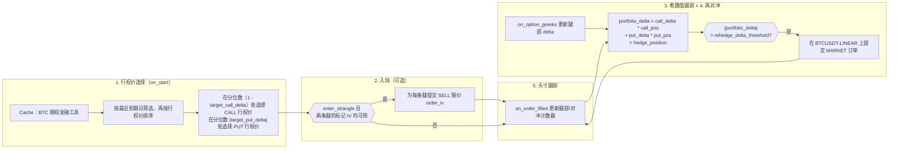
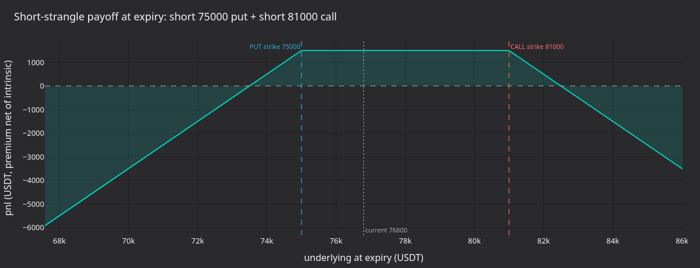
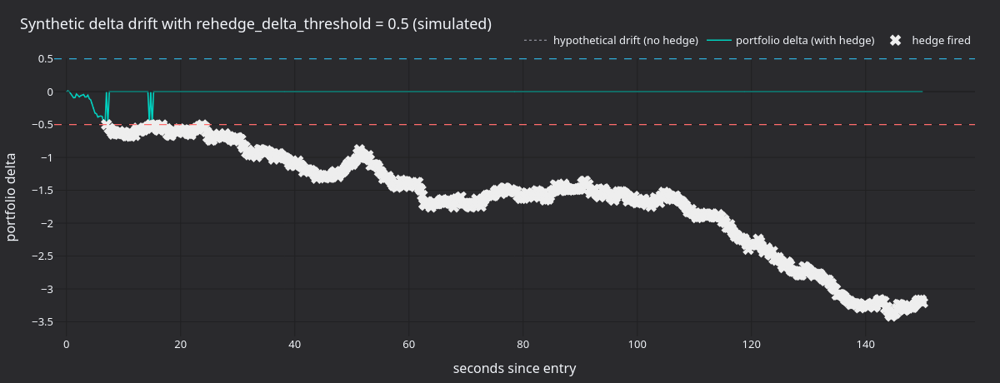
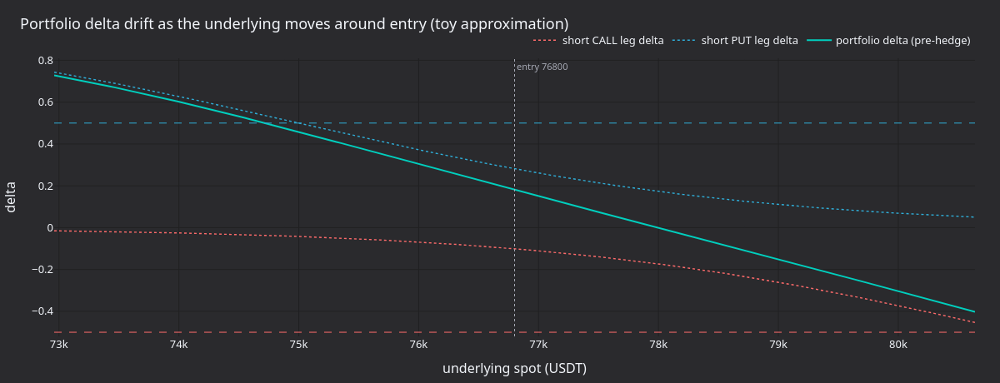
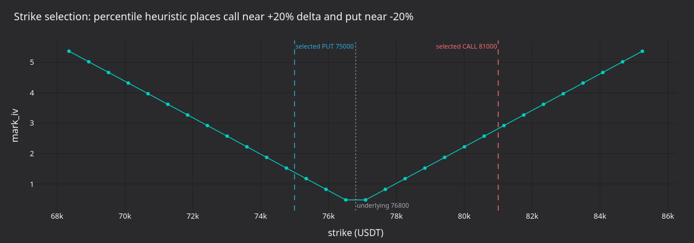

# Delta 中性期权策略（Bybit）

:::note
这是一个**仅使用 Rust**的系统教程。它使用 Rust `LiveNode` 在 Bybit 上运行实盘 Delta 中性做空波动率策略。
:::

本教程在 Bybit BTC 期权上运行 OTM 空头宽跨式组合，并使用 BTCUSDT 永续合约进行 Delta 对冲。策略启动时选择看涨和看跌期权的行权价，通过按隐含波动率定价的限价订单入场，根据交易场所提供的 Greeks 跟踪投资组合 Delta，并在 Delta 漂移超过阈值时向永续合约提交市价对冲订单。

:::warning
该策略在主网上使用真实资金交易。设置 `enter_strangle: false` 只会禁用初始宽跨式入场订单。策略启动时仍会从缓存恢复现有持仓，并在投资组合 Delta 突破阈值时向永续合约提交对冲订单。如果账户中保留了上一次会话的期权或对冲持仓，策略仍会交易。
:::

## 先决条件

- 完成[期权数据教程](options_data_bybit.md)，了解金融工具发现、Greeks 订阅和 `DataActor` 模式。
- 一个对期权和线性永续合约具有**交易权限**的 Bybit API 密钥。
- 环境变量：

```bash
export BYBIT_API_KEY="your-api-key"
export BYBIT_API_SECRET="your-api-secret"
```

## 策略概述

`DeltaNeutralVol` 策略位于 trading crate 的 `examples` 模块中，分五个阶段运行：

1. **行权价选择**：查询金融工具缓存中的全部 BTC 期权，筛选最近到期日，并按百分位排名选择 OTM 看涨和看跌期权行权价。
2. **入场**：在两条期权腿上提交按隐含波动率定价的 SELL 限价订单（通过 Bybit 的 `order_iv` 参数）。入场为可选操作，示例默认禁用。
3. **Greeks 跟踪**：订阅两条腿的 `OptionGreeks`。Delta 和 IV 直接来自 Bybit 的期权行情流。
4. **再对冲**：计算投资组合 Delta，并在突破阈值时向 BTCUSDT 永续合约提交市价订单。每次 Greeks 更新和周期性安全定时器都会触发检查。
5. **持仓跟踪**：通过 `on_order_filled` 跟踪看涨期权、看跌期权和对冲持仓。启动时从缓存恢复现有持仓。



### 投资组合 Delta

该策略将净敞口计算如下：

```
portfolio_delta = call_delta * call_position
                + put_delta * put_position
                + hedge_position
```

空头宽跨式组合起始时接近 Delta 中性，因为看涨和看跌期权的 Delta 会相互抵消。使用默认的 `target_call_delta = 0.20` 和 `target_put_delta = -0.20` 时，两条腿在入场时正好抵消。随着标的资产价格变化，净 Delta 会发生漂移，策略通过对冲将其拉回零附近。

## 配置

示例文件 [`crates/adapters/bybit/examples/node_delta_neutral.rs`](https://github.com/qOeOp/trade/tree/main/crates/adapters/bybit/examples/node_delta_neutral.rs) 对策略进行如下配置：

```rust
let hedge_instrument_id = InstrumentId::from("BTCUSDT-LINEAR.BYBIT");

let strategy_config = DeltaNeutralVolConfig::builder()
    .option_family("BTC".to_string())
    .hedge_instrument_id(hedge_instrument_id)
    .client_id(client_id)
    .contracts(1)
    .rehedge_delta_threshold(0.5)
    .rehedge_interval_secs(30)
    .enter_strangle(false)
    .iv_param_key("order_iv".to_string())
    .build();

let strategy = DeltaNeutralVol::new(strategy_config);
```

参数如下（所列默认值为结构体默认值；示例将 `enter_strangle` 覆盖为 `false`，并将 `iv_param_key` 覆盖为 `"order_iv"`）：

| 参数                      | 默认值     | 示例值           | 说明                                   |
| ------------------------- | ---------- | ---------------- | -------------------------------------- |
| `option_family`           | 必需       | `"BTC"`          | 金融工具发现所用的标的资产筛选条件。   |
| `hedge_instrument_id`     | 必需       | `BTCUSDT-LINEAR` | 用于 Delta 对冲的永续合约。            |
| `client_id`               | 必需       | `"BYBIT"`        | 数据和执行客户端标识符。               |
| `target_call_delta`       | `0.20`     | -                | 选择行权价时的目标看涨期权 Delta。     |
| `target_put_delta`        | `-0.20`    | -                | 选择行权价时的目标看跌期权 Delta。     |
| `contracts`               | `1`        | -                | 每条腿的合约数量。                     |
| `rehedge_delta_threshold` | `0.5`      | -                | 触发对冲的投资组合 Delta 阈值。        |
| `rehedge_interval_secs`   | `30`       | -                | 定期再对冲定时器间隔。                 |
| `enter_strangle`          | `true`     | `false`          | Greeks 到达时提交入场订单。            |
| `entry_iv_offset`         | `0.0`      | -                | 入场定价相对标记 IV 下调的波动率点数。 |
| `iv_param_key`            | `"px_vol"` | `"order_iv"`     | 适配器专用的 IV 参数键。               |

`iv_param_key` 是交易场所之间的主要差异。Bybit 使用 `order_iv`，适配器将其映射到下单 API 的 `orderIv` 字段；OKX 使用 `px_vol`。要按 IV 下单，必须正确设置此参数。

## 节点设置

该示例使用`Option` 和`Linear` 产品类型配置数据和执行客户端：

```rust
let data_config = BybitDataClientConfig {
    api_key: None,
    api_secret: None,
    product_types: vec![BybitProductType::Option, BybitProductType::Linear],
    ..Default::default()
};

let exec_config = BybitExecClientConfig {
    api_key: None,
    api_secret: None,
    product_types: vec![BybitProductType::Option, BybitProductType::Linear],
    account_id: Some(account_id),
    ..Default::default()
};
```

两种产品类型缺一不可：`Option` 用于宽跨式的期权腿，`Linear` 用于 BTCUSDT 永续对冲金融工具。执行客户端需要 `account_id` 来跟踪订单身份。

```rust
let mut node = LiveNode::builder(trader_id, environment)?
    .with_name("BYBIT-DELTA-NEUTRAL-001".to_string())
    .add_data_client(None, Box::new(data_factory), Box::new(data_config))?
    .add_exec_client(None, Box::new(exec_factory), Box::new(exec_config))?
    .with_reconciliation(true)
    .with_delay_post_stop_secs(5)
    .build()?;

node.add_strategy(strategy)?;
node.run().await?;
```

`with_reconciliation(true)` 会在启动时查询 Bybit 上的活动订单和持仓，在策略启动前恢复缓存。随后，策略会接管此前会话留下的所有现有持仓。

## 策略如何运作

### 行权价选择

启动时，策略查询缓存中与 `option_family` 匹配的所有期权金融工具。它会剔除已到期期权、选择最近到期日、分开看涨和看跌期权，并分别按行权价排序。

行权价是按排序列表中的百分位数选择的：

- **看涨期权**：索引 = `(1.0 - target_call_delta) * count`。当目标 Delta 为 0.20 且有 50 个看涨期权时，会选中第 40 个行权价（第 80 百分位，OTM）。
- **看跌期权**：索引 = `|target_put_delta| * count`。当目标 Delta 为 -0.20 时，会选中第 10 个行权价（第 20 百分位，OTM）。

这是一种启发式方法。对于到期日相同的期权，按行权价排序可以近似 Delta 排序。生产策略应先订阅所有行权价的 Greeks，再按实际 Delta 选择。

### 通过隐含波动率入场

当 `enter_strangle` 为 `true` 且两条腿的标记 IV 均已到达时，策略使用 `order_iv` 参数提交 SELL 限价订单：

```rust
let mut call_params = Params::new();
call_params.insert("order_iv".to_string(), json!(call_entry_iv.to_string()));

self.submit_order(call_order, None, Some(client_id), Some(call_params))?;
```

Bybit 会在服务器端将 `orderIv` 转换为限价，并使其优先于任何显式价格。`entry_iv_offset` 配置会从标记 IV 中减去波动率点数：偏移量 0.02 表示以低于标记 IV 两个波动率点的价格卖出，从而加快成交。

:::note
Bybit 的 demo 环境不接受带 `order_iv` 的订单。适配器会在订单到达 API 前拒绝它们。请使用主网或测试网按 IV 下单。
:::

### 再对冲

两个触发器检查投资组合增量：

- **每次 Greeks 更新**：`on_option_greeks` 更新期权腿的 Delta 值后，重新计算投资组合 Delta。
- **周期性定时器**：每隔 `rehedge_interval_secs` 触发一次，在 Greeks 停止更新时作为安全保障。

当 `|portfolio_delta| > rehedge_delta_threshold` 时，策略会向对冲金融工具提交市价订单。`hedge_pending` 标志可防止订单仍在处理时重复提交。

### 持仓跟踪

策略通过 `on_order_filled` 跟踪持仓，而不是在每个 tick 上查询缓存。每次成交都会更新相应的持仓计数器（看涨期权、看跌期权或对冲）。启动时，现有持仓会从缓存中恢复（缓存由对账过程填充）。

### 关机

停止时，策略会取消活动订单、退订全部数据源，并重置对冲待处理标志。它不会平仓。要平掉宽跨式组合和对冲持仓，必须手动操作或使用单独的退出策略。

## 运行产生什么

在没有既有持仓的账户上以 `enter_strangle: false` 运行主网 30 秒，不会提交任何订单。策略会记录发现的金融工具和所选行权价：

```
Selected call: BTC-28APR26-81000-C-USDT-OPTION.BYBIT (strike=81000)
Selected put: BTC-28APR26-75000-P-USDT-OPTION.BYBIT (strike=75000)
Strangle: 1 contracts per leg, hedge on BTCUSDT-LINEAR.BYBIT
```

这些信息足以分析策略的结构性行为。下图围绕采集时标的资产价格和实际选中的行权价（75,000 / 81,000），展示其运行机制。



**图 1.** *卖出 75,000 PUT 与卖出 81,000 CALL 组合的到期盈亏，假设总权利金为 1,500 USDT、贴现率为零。两个行权价之间的平坦顶部是仅赚取权利金的区间；价格越过任一行权价后，亏损线性增长。*



**图 2.** *在 `rehedge_delta_threshold=0.5` 下模拟 150 秒的布朗运动 Delta 漂移。点线表示未对冲漂移；实线表示每次触发市价对冲（叉号）后的策略投资组合 Delta。*



**图 3.** *简化模型近似展示标的即期价格在入场点上下 5% 范围内变化时，空头看涨和空头看跌期权腿的 Delta 如何变化，以及对冲前由此产生的投资组合 Delta。负 Gamma 使曲线在两翼收紧，并在跨越行权价时变陡。*



**图 4.** *在示意性 IV 微笑曲线上展示行权价选择启发式：看涨期权选择 (1 - 0.20) 百分位，看跌期权选择 0.20 百分位，使两条 OTM 期权腿位于标的资产两侧、Delta 绝对值大致相等的位置。*

### 重新生成面板

```bash
timeout 30 ./target/release/examples/bybit-delta-neutral > /tmp/bybit_dn.log 2>&1

uv sync --extra visualization
DN_LOG=/tmp/bybit_dn.log \
    python3 docs/tutorials/assets/delta_neutral_options_bybit/render_panels.py
```

渲染器从日志中解析所选行权价；由于默认配置不会提交订单，这些图表仅用于说明机制。

## 风险注意事项

- **Gamma 风险**：空头宽跨式组合具有负 Gamma。标的资产大幅波动时，Delta 敞口增长速度可能超过再对冲定时器的响应速度。收紧 `rehedge_delta_threshold` 并缩短 `rehedge_interval_secs` 可加快响应，但会增加对冲交易次数。
- **Vega 风险**：IV 飙升会增加空头期权的盯市亏损。该策略不管理 Vega 敞口。
- **流动性**：OTM 加密期权的价差可能很宽。当标的资产跳空，或永续合约只能以较粗的数量步长交易时，对冲质量会下降。
- **生命周期风险**：策略停止后，对冲也随之停止。持仓会保持未平仓、未对冲状态，直至人工处置。

## 运行示例

```bash
cargo run --example bybit-delta-neutral --package vibe-bybit --features examples
```

示例默认以 `enter_strangle: false` 运行，因此不会提交宽跨式入场订单。但它仍会恢复现有持仓，并在投资组合 Delta 突破阈值时提交对冲订单。若账户没有此前持仓，则不会提交订单。

按 Ctrl+C 停止。策略会在关闭前取消活动订单并退订数据。

## 完整源码

- 运行示例：[`crates/adapters/bybit/examples/node_delta_neutral.rs`](https://github.com/qOeOp/trade/tree/main/crates/adapters/bybit/examples/node_delta_neutral.rs)
- 策略实现：[`crates/trading/src/examples/strategies/delta_neutral_vol/`](https://github.com/qOeOp/trade/tree/main/crates/trading/src/examples/strategies/delta_neutral_vol/)
- 策略 README（含完整配置参考）：[`crates/trading/src/examples/strategies/delta_neutral_vol/README.md`](https://github.com/qOeOp/trade/tree/main/crates/trading/src/examples/strategies/delta_neutral_vol/README.md)

## 另请参阅

- [Bybit 上的期权数据和希腊值](options_data_bybit.md)：涵盖希腊值订阅和期权链快照的必备教程。
- [期权](../concepts/options.md)：期权金融工具类型和数据架构。
- [Bybit 集成](../integrations/bybit.md#options-trading)：包括 `order_iv` 和 `mmp` 在内的期权订单参数。
