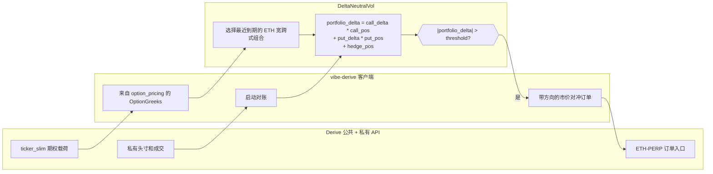
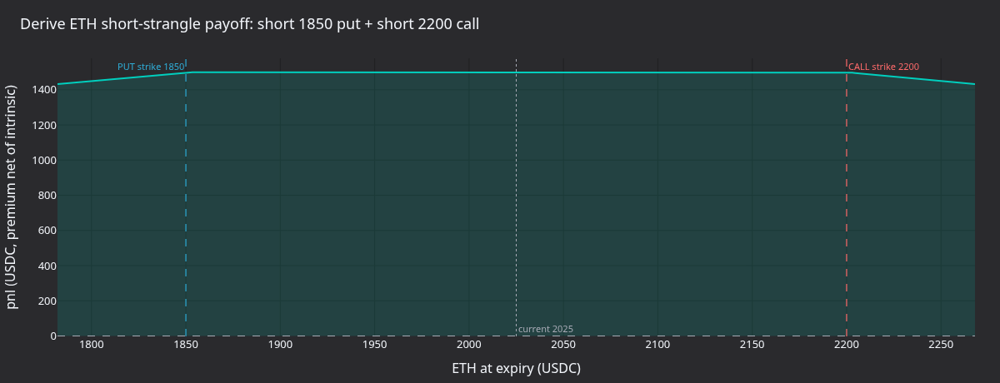
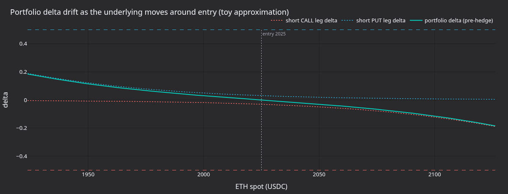
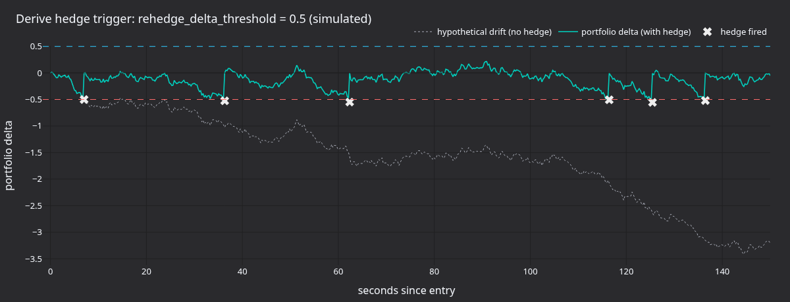
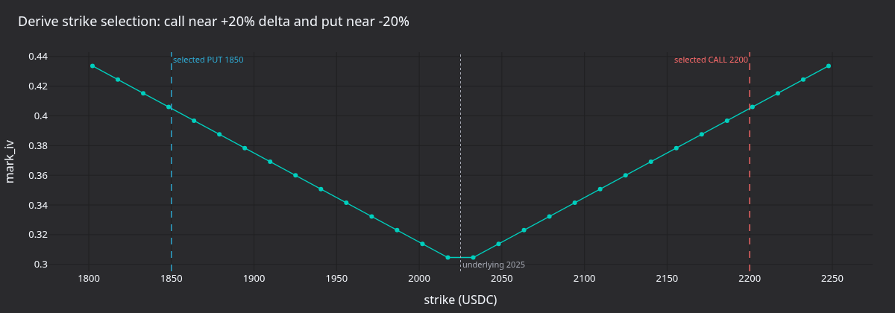

# Delta 中性期权策略（Derive）

:::note
这是一个**仅使用 Rust**的系统教程。它使用 Rust `LiveNode` 在 Derive 上运行实盘 Delta 中性做空波动率策略。
:::

本教程使用 Derive 适配器运行共享的 `DeltaNeutralVol` 策略。随附示例会发现 ETH 期权、选择一份价外看涨期权和一份价外看跌期权、订阅交易场所提供的 Greeks，并使用 `ETH-PERP.DERIVE` 进行 Delta 对冲。

Derive 运行器默认以仅对冲模式启动：它设置 `enter_strangle: false`，因此不会提交初始期权入场订单。但它仍会通过对账恢复现有持仓，并可在投资组合 Delta 突破配置阈值时向永续合约提交市价对冲订单。进行冒烟测试时，可设置 `DERIVE_DELTA_NEUTRAL_HEDGE_ENABLED=false`，使策略只加载金融工具、对账账户并订阅 Greeks，而不提交对冲订单。要测试入场订单，可设置 `DERIVE_DELTA_NEUTRAL_ENTER_STRANGLE=true`；运行器将提交按 Derive 权利金定价的期权订单，而不是按 IV 定价的期权订单。

:::warning
该策略可在主网上使用真实资金交易。设置 `enter_strangle: false` 只会禁用初始宽跨式入场订单。如果所选期权腿或对冲金融工具已有持仓，策略仍可提交对冲订单。
:::

## 先决条件

- 完成 [Derive 集成指南](../integrations/derive.md)中的钱包、子账户、会话密钥和资金配置。
- 一个 Derive 测试网或主网子账户，并为准备允许的对冲订单提供足够的 USDC 抵押品。
- 可用的 Rust 工具链以及已构建的 VibeTrader 工作区。
- 所选 Derive 环境所需的环境变量。

对于测试网：

```bash
export DERIVE_TESTNET_WALLET_ADDRESS="0x..."
export DERIVE_TESTNET_SESSION_PRIVATE_KEY="0x..."
export DERIVE_TESTNET_SUBACCOUNT_ID="12345"
```

对于主网：

```bash
export DERIVE_WALLET_ADDRESS="0x..."
export DERIVE_SESSION_PRIVATE_KEY="0x..."
export DERIVE_SUBACCOUNT_ID="12345"
export DERIVE_ENVIRONMENT="mainnet"
```

示例默认使用测试网。只有使用真实资金运行时才应设置 `DERIVE_ENVIRONMENT=mainnet`。

## 策略概述

`DeltaNeutralVol` 策略位于 trading crate 的 examples 模块中。Derive 运行器分五个阶段使用它：

1. **金融工具加载**：以 `currencies: ["ETH"]` 配置 Derive 数据客户端，使适配器将 ETH 永续合约和期权载入缓存。
2. **行权价选择**：从缓存中筛选有效的 ETH 期权，选择最近到期日，再按百分位排名选择 OTM 看涨和看跌期权行权价。
3. **Greeks 跟踪**：订阅两条腿的 `OptionGreeks`。Derive Greeks 来自共享的 `ticker_slim` 数据源及 `option_pricing` 载荷。
4. **再对冲**：计算投资组合 Delta，并在突破阈值时向 `ETH-PERP.DERIVE` 提交 Derive 市价订单。
5. **持仓跟踪**：根据成交跟踪看涨期权、看跌期权和对冲持仓。策略启动前，对账过程会恢复现有持仓。



### 投资组合 Delta

该策略将净敞口计算如下：

```
portfolio_delta = call_delta * call_position
                + put_delta * put_position
                + hedge_position
```

当看涨和看跌期权的 Delta 相互抵消时，空头宽跨式组合在入场时接近 Delta 中性。随着标的资产变动，净 Delta 会发生漂移，策略使用永续合约对冲，使投资组合回到零附近。

## 配置

`crates/adapters/derive/examples/node_delta_neutral.rs` 中的示例运行器按如下方式配置策略：

```rust
let option_family = env_string("DERIVE_DELTA_NEUTRAL_OPTION_FAMILY", "ETH")?;
let default_hedge = format!("{option_family}-PERP.DERIVE");
let hedge_instrument = env_string("DERIVE_DELTA_NEUTRAL_HEDGE_INSTRUMENT", &default_hedge)?;
let enter_strangle = env_bool("DERIVE_DELTA_NEUTRAL_ENTER_STRANGLE", false)?;
let hedge_enabled = env_bool("DERIVE_DELTA_NEUTRAL_HEDGE_ENABLED", true)?;
let rehedge_delta_threshold = if hedge_enabled {
    env_f64("DERIVE_DELTA_NEUTRAL_REHEDGE_DELTA_THRESHOLD", 0.5)?
} else {
    1.0e12
};

let hedge_instrument_id = InstrumentId::from(hedge_instrument.as_str());
let mut strategy_config = DeltaNeutralVolConfig::builder()
    .option_family(option_family)
    .hedge_instrument_id(hedge_instrument_id)
    .client_id(client_id)
    .target_call_delta(env_f64("DERIVE_DELTA_NEUTRAL_TARGET_CALL_DELTA", 0.20)?)
    .target_put_delta(env_f64("DERIVE_DELTA_NEUTRAL_TARGET_PUT_DELTA", -0.20)?)
    .contracts(env_u64("DERIVE_DELTA_NEUTRAL_CONTRACTS", 1)?)
    .rehedge_delta_threshold(rehedge_delta_threshold)
    .rehedge_interval_secs(env_u64("DERIVE_DELTA_NEUTRAL_REHEDGE_INTERVAL_SECS", 30)?)
    .enter_strangle(enter_strangle)
    .entry_iv_offset(env_f64("DERIVE_DELTA_NEUTRAL_ENTRY_IV_OFFSET", 0.0)?)
    .entry_premium_offset_ticks(env_i32("DERIVE_DELTA_NEUTRAL_ENTRY_PREMIUM_OFFSET_TICKS", 1)?)
    .build();

if let Some(expiry) = env_optional_string("DERIVE_DELTA_NEUTRAL_EXPIRY")? {
    strategy_config.expiry_filter = Some(expiry);
}

let strategy = DeltaNeutralVol::new(strategy_config);
```

参数：

| 参数                         | 默认值     | Derive 运行器 | 说明                                 |
| ---------------------------- | ---------- | ------------- | ------------------------------------ |
| `option_family`              | 必需       | `"ETH"`       | 金融工具发现所用的标的资产筛选条件。 |
| `hedge_instrument_id`        | 必需       | `ETH-PERP`    | 用于 Delta 对冲的永续合约。          |
| `client_id`                  | 必需       | `"DERIVE"`    | 数据和执行客户端标识符。             |
| `target_call_delta`          | `0.20`     | `0.20`        | 选择行权价时的目标看涨期权 Delta。   |
| `target_put_delta`           | `-0.20`    | `-0.20`       | 选择行权价时的目标看跌期权 Delta。   |
| `contracts`                  | `1`        | `1`           | 每条期权腿的合约数量。               |
| `rehedge_delta_threshold`    | `0.5`      | `0.5`         | 触发对冲的投资组合 Delta 阈值。      |
| `rehedge_interval_secs`      | `30`       | `30`          | 周期性再对冲定时器间隔。             |
| `expiry_filter`              | `None`     | 未设置        | 可选的到期日子字符串筛选条件。       |
| `enter_strangle`             | `true`     | `false`       | 权利金数据到达时提交入场订单。       |
| `entry_premium_offset_ticks` | `None`     | `1`           | 卖出入场价高于期权卖一价的 tick 数。 |
| `entry_iv_offset`            | `0.0`      | `0.0`         | 仅在禁用权利金模式时使用。           |
| `iv_param_key`               | `"px_vol"` | 未使用        | 按 IV 定价的交易场所所用 IV 参数键。 |

Derive 运行程序读取这些环境变量：

| 变量                                              | 默认值                 | 说明                                 |
| ------------------------------------------------- | ---------------------- | ------------------------------------ |
| `DERIVE_DELTA_NEUTRAL_OPTION_FAMILY`              | `ETH`                  | 期权系列/Derive 币种。               |
| `DERIVE_DELTA_NEUTRAL_HEDGE_INSTRUMENT`           | `<family>-PERP.DERIVE` | 永续对冲金融工具。                   |
| `DERIVE_DELTA_NEUTRAL_ENTER_STRANGLE`             | `false`                | 启用期权入场订单。                   |
| `DERIVE_DELTA_NEUTRAL_HEDGE_ENABLED`              | `true`                 | 启用永续对冲订单。                   |
| `DERIVE_DELTA_NEUTRAL_REHEDGE_DELTA_THRESHOLD`    | `0.5`                  | 投资组合 Delta 对冲阈值。            |
| `DERIVE_DELTA_NEUTRAL_REHEDGE_INTERVAL_SECS`      | `30`                   | 定期对冲检查间隔。                   |
| `DERIVE_DELTA_NEUTRAL_CONTRACTS`                  | `1`                    | 每条期权腿的合约数量。               |
| `DERIVE_DELTA_NEUTRAL_TARGET_CALL_DELTA`          | `0.20`                 | 看涨期权行权价选择目标。             |
| `DERIVE_DELTA_NEUTRAL_TARGET_PUT_DELTA`           | `-0.20`                | 看跌期权行权价选择目标。             |
| `DERIVE_DELTA_NEUTRAL_EXPIRY`                     | 未设置                 | 可选的到期日子字符串筛选条件。       |
| `DERIVE_DELTA_NEUTRAL_ENTRY_PREMIUM_OFFSET_TICKS` | `1`                    | 卖出入场价高于期权卖一价的 tick 数。 |
| `DERIVE_DELTA_NEUTRAL_ENTRY_IV_OFFSET`            | `0.0`                  | 仅在权利金模式之外使用。             |
| `DERIVE_DELTA_NEUTRAL_MAX_FEE_PER_CONTRACT`       | `1000`                 | 每份合约的签名手续费上限。           |
| `DERIVE_DELTA_NEUTRAL_MARKET_ORDER_SLIPPAGE_BPS`  | 适配器默认值           | 市价对冲订单的滑点界限。             |

Derive 会对显式的权利金限价进行签名。运行器通过 `entry_premium_offset_ticks=1` 启用策略的权利金入场模式，因此有卖一报价时，入场订单会使用实时期权卖一价；报价侧为空时，则回退到 Derive IV 字段。Bybit 和 OKX 继续使用共享的 IV 参数路径。

## 节点设置

Derive 运行器使用实盘环境，并根据 `DERIVE_ENVIRONMENT` 选择测试网或主网：

```rust
let environment = Environment::Live;
let derive_environment = derive_environment_from_env();
let trader_id = TraderId::from("TESTER-001");
let account_id = AccountId::from("DERIVE-001");
let client_id = *DERIVE_CLIENT_ID;
```

数据客户端批量加载 ETH 金融工具。这一点很重要，因为策略在 `on_start` 期间从缓存中选择期权腿。

```rust
let data_config = DeriveDataClientConfig {
    environment: derive_environment,
    currencies: vec![option_family.clone()],
    ..Default::default()
};
```

当配置字段未设置时，执行客户端从 Derive 环境变量中读取钱包、会话密钥和子账户值。该示例设置了费用上限，并允许可选的协议常数覆盖本地测试。

```rust
let exec_config = DeriveExecClientConfig {
    environment: derive_environment,
    max_fee_per_contract: Some(Decimal::from_str_exact("1000")?),
    domain_separator: env_override(
        derive_environment,
        "DERIVE_DOMAIN_SEPARATOR",
        "DERIVE_TESTNET_DOMAIN_SEPARATOR",
    ),
    action_typehash: env_override(
        derive_environment,
        "DERIVE_ACTION_TYPEHASH",
        "DERIVE_TESTNET_ACTION_TYPEHASH",
    ),
    trade_module_address: env_override(
        derive_environment,
        "DERIVE_TRADE_MODULE_ADDRESS",
        "DERIVE_TESTNET_TRADE_MODULE_ADDRESS",
    ),
    ..Default::default()
};
```

执行客户端需要 `DeriveExecFactoryConfig`，其中携带交易者 ID 和账户 ID：

```rust
let exec_factory_config = DeriveExecFactoryConfig {
    trader_id,
    account_id,
    config: exec_config,
};
```

节点启用对账，以便在策略启动前加载活动订单、持仓、余额和报告：

```rust
let mut node = LiveNode::builder(trader_id, environment)?
    .with_name("DERIVE-DELTA-NEUTRAL-001".to_string())
    .add_data_client(None, Box::new(data_factory), Box::new(data_config))?
    .add_exec_client(None, Box::new(exec_factory), Box::new(exec_factory_config))?
    .with_reconciliation(true)
    .with_delay_post_stop_secs(5)
    .build()?;

node.add_strategy(strategy)?;
node.run().await?;
```

## 策略如何运作

### 行权价选择

启动时，策略查询缓存中与 `option_family` 匹配的所有期权金融工具。Derive 示例使用 `ETH`，因此匹配的金融工具具有 `ETH-20260626-3000-C.DERIVE` 之类的符号。

策略会剔除已到期期权，并可选地应用 `expiry_filter`；未设置筛选条件时使用最近到期日。看涨和看跌期权分别按行权价排序：

- **看涨期权**：索引 = `(1.0 - target_call_delta) * count`。使用默认值 `0.20` 时，将选择约第 80 百分位的行权价。
- **看跌期权**：索引 = `abs(target_put_delta) * count`。使用默认值 `-0.20` 时，将选择约第 20 百分位的行权价。

这是一种按行权价排序的启发式方法。生产策略可以先订阅完整期权链的 Greeks，再按实际 Delta 选择。

### Greeks 与共享行情数据源

Derive 在报价所用的同一 `ticker_slim` 通道上发布期权定价字段。适配器从 `option_pricing` 派生 `OptionGreeks`，因此策略只需订阅选中的两条期权腿：

```rust
self.subscribe_option_greeks(call_id, Some(client_id), None);
self.subscribe_option_greeks(put_id, Some(client_id), None);
```

适配器对底层行情订阅进行引用计数。同一金融工具的报价、标记价格、指数价格、资金费率和期权 Greeks 可以共享同一个 WebSocket 通道。

### 在 Derive 上再对冲

Derive 执行适配器将市价订单作为以滑点为界的限价签名订单发送。签名前，它会刷新对冲金融工具当前的行情快照，并将最差可接受价格写入 EIP-712 载荷。`market_order_slippage_bps` 的默认值为 `50`。

当两个选定的期权腿都发出希腊值时，该策略会提交对冲，并且：

```
abs(portfolio_delta) > rehedge_delta_threshold
```

投资组合 Delta 为正时会触发在 `ETH-PERP.DERIVE` 上 SELL；为负时会触发 BUY。订单尚在处理时，`hedge_pending` 标志会阻止重复提交。

### 持仓跟踪

策略通过 `on_order_filled` 跟踪持仓，而不是在每次更新时轮询持仓。对账会在启动时恢复现有持仓；后续成交则更新内存中的看涨期权、看跌期权和对冲计数器。

### 关机

停止时，策略会取消所选期权腿和对冲金融工具的活动订单、退订数据源，并保持持仓不变。要平掉宽跨式组合和对冲持仓，必须手动操作或使用单独的退出策略。

## 运行产生什么

在测试网上以 `enter_strangle: false` 运行时，策略应发现所选期权腿并订阅 Greeks，但不提交入场订单。所选符号取决于实时 Derive 期权链：

```
Selected call: ETH-<expiry>-<strike>-C.DERIVE (strike=<strike>)
Selected put: ETH-<expiry>-<strike>-P.DERIVE (strike=<strike>)
Strangle: 1 contracts per leg, hedge on ETH-PERP.DERIVE
Strangle entry disabled: hedging externally-held positions only.
```

如果没有现有持仓，运行过程在启动后应保持只处理数据。如果账户已经持有所选期权腿或对冲金融工具的持仓，周期性再对冲定时器可能会提交对冲订单。

下图使用与 Derive 运行器相同的行权价选择机制。有冒烟测试日志时，图表会从中解析所选行权价；否则使用示意性的 ETH 行权价。



**图 1.** *卖出 ETH 看跌期权与卖出 ETH 看涨期权组合的到期盈亏，假设收取固定 USDC 权利金、贴现率为零。两个行权价之间的平坦顶部是仅赚取权利金的区间；价格越过任一行权价后，亏损线性增长。*



**图 2.** *简化模型近似展示空头看涨和空头看跌期权腿的 Delta 在入场点附近如何变化，以及对冲前由此产生的投资组合 Delta。*



**图 3.** *在 `rehedge_delta_threshold=0.5` 下模拟 150 秒的布朗运动 Delta 漂移。叉号表示启用对冲时策略将提交对冲订单的位置。*



**图 4.** *在示意性 IV 微笑曲线上展示行权价选择启发式。看涨期权行权价接近 `(1 - target_call_delta)` 百分位，看跌期权行权价接近 `abs(target_put_delta)` 百分位。*

### 重新生成面板

```bash
export DERIVE_ENVIRONMENT=mainnet
export DERIVE_DELTA_NEUTRAL_HEDGE_ENABLED=false
timeout 45 cargo run --example derive-delta-neutral --package vibe-derive --features examples \
    > /tmp/derive_dn.log 2>&1

uv sync --extra visualization
export DN_LOG=/tmp/derive_dn.log
python3 docs/tutorials/assets/delta_neutral_options_derive/render_panels.py
```

渲染器只使用日志选择行权价。由于无订单冒烟测试配置禁用了入场和对冲订单提交，这些图仍然只是机制示意。

## 风险注意事项

- **Gamma 风险**：空头宽跨式组合具有负 Gamma。ETH 大幅波动时，Delta 敞口增长速度可能超过再对冲定时器的响应速度。
- **滑点风险**：Derive 市价订单会在提交前签署带滑点界限的限价。界限过紧可能拒绝本可执行的对冲；界限过松则可能以差于预期的价格成交。
- **入场价格风险**：Derive 入场使用实时期权卖一价加 tick 偏移；报价侧为空时，则根据 Derive IV 字段计算权利金。偏移量很小或为负时，订单可能穿过订单簿并立即成交。
- **抵押品风险**：子账户没有足够的初始保证金余量时，Derive 会拒绝订单。启用实盘对冲前，请检查 `private/get_subaccount` 或适配器账户快照。
- **生命周期风险**：策略停止后，对冲也随之停止。持仓会保持未平仓、未对冲状态，直至由其他机制管理。

## 运行示例

```bash
cargo run --example derive-delta-neutral --package vibe-derive --features examples
```

按 Ctrl+C 停止。策略会在关闭前取消活动订单并退订数据，但不会平仓。

对于在不提交订单的情况下加载交易场所和账户的主网冒烟测试：

```bash
export DERIVE_ENVIRONMENT=mainnet
export DERIVE_DELTA_NEUTRAL_HEDGE_ENABLED=false
timeout 45 cargo run --example derive-delta-neutral --package vibe-derive --features examples
```

要进行会提交 Derive 权利金期权入场订单的主网冒烟测试：

```bash
export DERIVE_ENVIRONMENT=mainnet
export DERIVE_DELTA_NEUTRAL_ENTER_STRANGLE=true
export DERIVE_DELTA_NEUTRAL_ENTRY_PREMIUM_OFFSET_TICKS=1
timeout --signal=INT 45 cargo run --example derive-delta-neutral --package vibe-derive \
    --features examples
```

## 完整源码

- 运行示例：`crates/adapters/derive/examples/node_delta_neutral.rs`
- 策略实现：`crates/trading/src/examples/strategies/delta_neutral_vol/`
- 策略 README：`crates/trading/src/examples/strategies/delta_neutral_vol/README.md`

## 另请参阅

- [Derive 集成](../integrations/derive.md)：环境设置、符号体系、功能和执行语义。
- [期权](../concepts/options.md)：期权金融工具类型和数据架构。
- [Bybit 上的 Delta 中性期权策略](delta_neutral_options_bybit.md)：同一共享策略及 Bybit 专用的 IV 入场参数。
