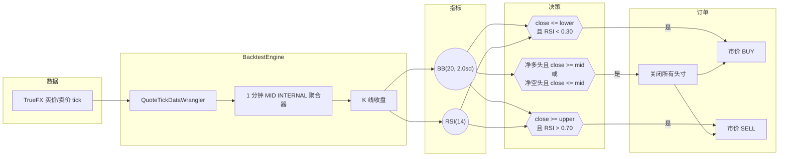
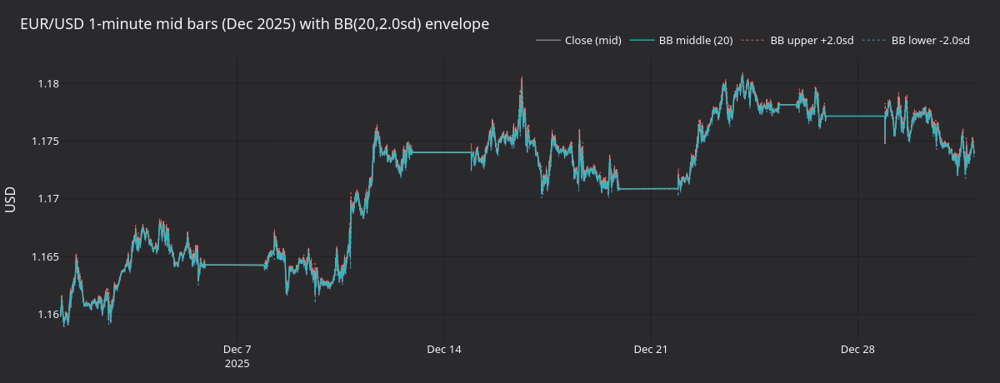
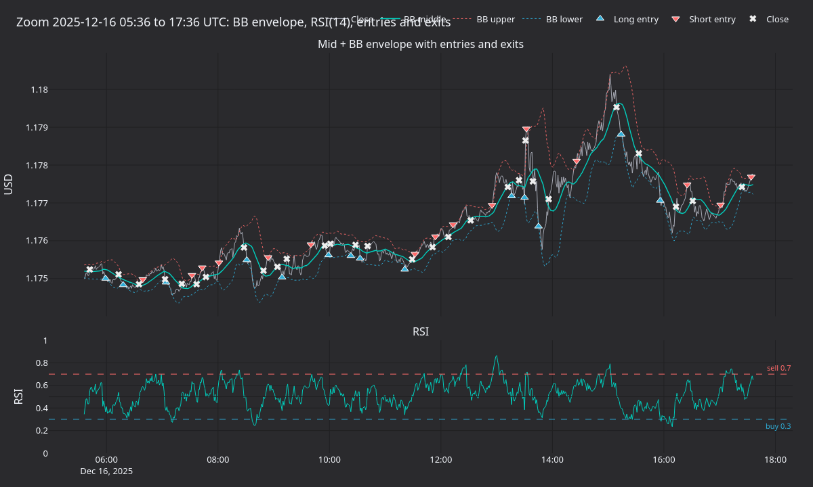
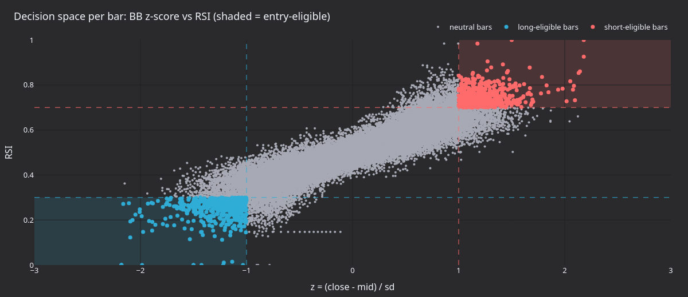
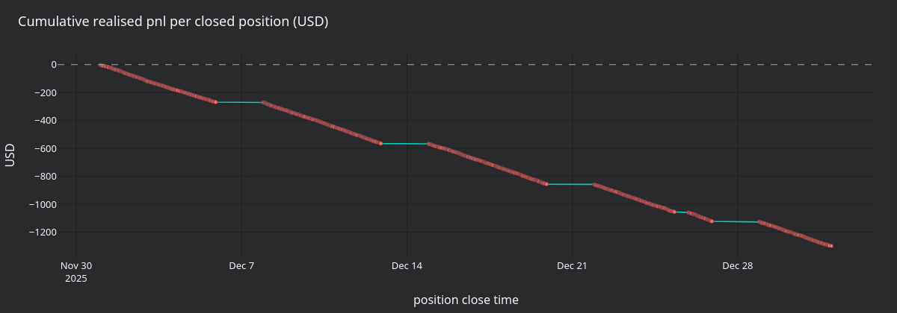

# 使用代理外汇数据进行均值回归（AX Exchange）

本教程在 **EURUSD-PERP**（[AX Exchange](https://architect.exchange)）上，使用 [TrueFX](https://www.truefx.com) EUR/USD 现货 tick 作为代理数据，回测布林带均值回归策略。

## 简介

该策略在一分钟中间价柱上结合两个指标：

- **布林带**（`BBMeanReversion` 的 `BB(20, 2.0sd)`）：20 根柱的滚动均值及 +/-2sd 包络。布林带用于判断价格相对近期波动率是否过度延伸。
- **相对强弱指数**（`RSI(14)`）：14 根柱周期的动量振荡指标。VibeTrader RSI 的取值范围是 `[0, 1]`，因此传统的 30/70 阈值对应 `0.30` / `0.70`。

入场需要两个信号同时成立：价格触及下轨且 `RSI < 0.30` 时开多；价格触及上轨且 `RSI > 0.70` 时开空。退出条件是单边的：收盘价反向穿过布林带中轨时，平掉所有持仓。新入场前，还会先平掉方向相反的现有持仓。

随附的 `BBMeanReversion` 策略有意保持简单，并不具备交易优势。



### 为什么代理数据

AX Exchange 是一个尚未被历史数据供应商覆盖的新交易场所。[TrueFX](https://www.truefx.com) 提供免费的机构级 EUR/USD 现货 tick 历史数据（来自 Integral 和 Jefferies 流动性池），可较好地作为 AX EURUSD-PERP 回测的替代数据。

## 先决条件

- Python 3.12+
- 本地 Vibe Trader 源码构建（`make build-debug`）。
- 一个免费的 TrueFX 账户，用于下载月度 tick 存档。

## 数据准备

### 下载 TrueFX EUR/USD tick

1. 前往 [TrueFX 历史数据下载页面](https://www.truefx.com/truefx-historical-downloads/)。
2. 选择 **EUR/USD** 和一个月份，例如 **2025 年 12 月**。
3. 解压 ZIP。CSV 没有表头，列依次为 `pair, timestamp, bid, ask`。

### 加载为 Vibe 报价 tick

```python
from pathlib import Path

import pandas as pd

from vibe_trader.persistence.wranglers import QuoteTickDataWrangler

df = pd.read_csv(
    Path("EURUSD-2025-12.csv"),
    header=None,
    names=["pair", "timestamp", "bid", "ask"],
)
df["timestamp"] = pd.to_datetime(df["timestamp"], format="%Y%m%d %H:%M:%S.%f")
df = df.set_index("timestamp")[["bid", "ask"]]

wrangler = QuoteTickDataWrangler(instrument=EURUSD_PERP)  # defined below
ticks = wrangler.process(df)
```

wrangler 会为每个 tick 标记金融工具 ID。策略声明 `1-MINUTE-MID-INTERNAL`，因此引擎会在内部从 tick 流聚合一分钟 MID 柱。

## 金融工具定义

使用代理数据时需要手动定义金融工具。乘数 `1000` 表示每份合约的名义价值为 1,000 EUR。

```python
from decimal import Decimal

from vibe_trader.model.currencies import USD
from vibe_trader.model.enums import AssetClass
from vibe_trader.model.identifiers import InstrumentId
from vibe_trader.model.identifiers import Symbol
from vibe_trader.model.instruments import PerpetualContract
from vibe_trader.model.objects import Price
from vibe_trader.model.objects import Quantity

instrument_id = InstrumentId.from_str("EURUSD-PERP.AX")

EURUSD_PERP = PerpetualContract(
    instrument_id=instrument_id,
    raw_symbol=Symbol("EURUSD-PERP"),
    underlying="EUR",
    asset_class=AssetClass.FX,
    quote_currency=USD,
    settlement_currency=USD,
    is_inverse=False,
    price_precision=5,
    size_precision=0,
    price_increment=Price.from_str("0.00001"),
    size_increment=Quantity.from_int(1),
    multiplier=Quantity.from_int(1000),
    lot_size=Quantity.from_int(1),
    margin_init=Decimal("0.05"),
    margin_maint=Decimal("0.025"),
    maker_fee=Decimal("0.0002"),
    taker_fee=Decimal("0.0005"),
    ts_event=0,
    ts_init=0,
)
```

手续费和保证金均为明确的回测假设。当前费率请查阅 [AX Exchange 文档](https://docs.architect.exchange/)。

## 配置

| 参数                 | 值     | 说明                                        |
| -------------------- | ------ | ------------------------------------------- |
| `bb_period`          | `20`   | BB 均值和标准差的滚动窗口。                 |
| `bb_std`             | `2.0`  | 以标准差倍数表示的带宽。                    |
| `rsi_period`         | `14`   | RSI 的回看柱数。                            |
| `rsi_buy_threshold`  | `0.30` | 多头入场确认（VibeTrader RSI 为`[0, 1]`）。 |
| `rsi_sell_threshold` | `0.70` | 空头入场确认。                              |
| `trade_size`         | `1`    | 每笔交易一份合约（名义金额 1,000 欧元）。   |

:::tip
VibeTrader RSI 返回 `[0.0, 1.0]` 范围内的值，而不是 `[0, 100]`。`0.30` / `0.70` 阈值对应教科书中的 30 / 70 水平。
:::

## 回测设置

```python
from vibe_trader.common import LogLevel
from vibe_trader.config import BacktestEngineConfig
from vibe_trader.backtest import BacktestEngine
from vibe_trader.config import LoggerConfig
from vibe_trader.examples.strategies.bb_mean_reversion import BBMeanReversion
from vibe_trader.examples.strategies.bb_mean_reversion import BBMeanReversionConfig
from vibe_trader.model.data import BarType
from vibe_trader.model.enums import AccountType
from vibe_trader.model.enums import OmsType
from vibe_trader.model.identifiers import TraderId
from vibe_trader.model.identifiers import Venue
from vibe_trader.model.objects import Money

engine = BacktestEngine(
    BacktestEngineConfig(
        trader_id=TraderId("BACKTESTER-001"),
        logging=LoggerConfig(stdout_level=LogLevel.INFO),
    ),
)

AX = Venue("AX")
engine.add_venue(
    venue=AX,
    oms_type=OmsType.NETTING,
    account_type=AccountType.MARGIN,
    base_currency=USD,
    starting_balances=[Money(100_000, USD)],
)

engine.add_instrument(EURUSD_PERP)
engine.add_data(ticks)

strategy = BBMeanReversion(
    BBMeanReversionConfig(
        instrument_id=instrument_id,
        bar_type=BarType.from_str("EURUSD-PERP.AX-1-MINUTE-MID-INTERNAL"),
        trade_size=Decimal("1"),
        bb_period=20,
        bb_std=2.0,
        rsi_period=14,
        rsi_buy_threshold=0.30,
        rsi_sell_threshold=0.70,
    ),
)
engine.add_strategy(strategy)
engine.run()
```

报告可直接从 `engine.trader` 生成：

```python
print(engine.trader.generate_account_report(AX))
print(engine.trader.generate_order_fills_report())
print(engine.trader.generate_positions_report())

engine.reset()
engine.dispose()
```

可运行示例位于 [`architect_ax_mean_reversion.py`](https://github.com/qOeOp/trade/tree/main/examples/backtest/architect_ax_mean_reversion.py)。

## 运行产生什么

使用 `BBMeanReversion(20, 2sd, RSI 14)` 重放 TrueFX 2025 年 12 月 EUR/USD 数据，会生成 44,591 根一分钟中间价柱，并通过 2,178 次成交平掉 1,089 个持仓。累计已实现盈亏最终为 **-1,287 USD**：策略整月持续亏损，没有出现明显的、由市场状态变化驱动的修复。缺少市场状态过滤器的均值回归策略，每个交易周期都要付出价差成本；而 EUR/USD 在 12 月下半月呈现明显上升趋势，策略却不断与之反向交易。



**图 1.** *2025 年 12 月 EUR/USD 一分钟中间价柱及 BB 中轨和 +/-2sd 包络。较长的平坦区段是 TrueFX 数据源中的周末空档。*



**图 2.** *数据集时间中点附近的十二小时局部图。上图：中间价与 BB 包络、多头入场（上三角）、空头入场（下三角）以及平仓成交（叉号）。下图：RSI(14) 及 0.30 买入阈值和 0.70 卖出阈值。*



**图 3.** *整月每根柱的 BB z-score 与 RSI。阴影区标出满足入场条件的象限：左下（做多）和右上（做空）。对角叶瓣反映相对布林带位置的价格与 RSI 之间的自然联动。*



**图 4.** *平仓头寸的累计实现美元盈亏。曲线大致呈线性下降，主要由价差和每个周期的小幅不利变动主导。*

### 重新生成面板

独立渲染器会重新运行回测，在采集到的柱上计算 BB 和 RSI，并使用共享的 `vibe_dark` tearsheet 主题生成 PNG 图表。

```bash
uv sync --extra visualization
TRUEFX_CSV=test_data/local/truefx/EURUSD-2025-12.csv \
    python3 docs/tutorials/assets/fx_mean_reversion_ax/render_panels.py
```

将 `TRUEFX_CSV` 指向 EUR/USD 存档的保存位置。

## 后续步骤

- **添加市场状态过滤器**。回撤主要集中在趋势行情。若已实现波动区间或较慢的趋势过滤器表明市场具有方向性，则抑制入场。
- **调整阈值**。更宽的布林带（`bb_std=2.5`）或更严格的 RSI 截止值（`0.25` / `0.75`）会减少入场次数，但提高确认门槛。
- **添加止损**。硬止损订单可限制每个周期的下行风险，避免一直持有亏损持仓、等待价格回归 BB 中轨。
- **转入 AX 沙箱**。回测表现符合预期后，连接 AX 沙箱进行模拟交易。配置方法请参阅 [AX Exchange 集成指南](../integrations/architect_ax.md)。

## 实盘运行

同一个 `BBMeanReversion` 策略也可在 AX Exchange 实盘运行。启动脚本会将 `BacktestEngine` 换成已配置 AX 数据与执行客户端的 `LiveNode`。参见实盘示例：[`ax_mean_reversion.py`](https://github.com/qOeOp/trade/tree/main/examples/live/architect_ax/ax_mean_reversion.py)。

有关连接设置和 API 密钥配置，请参阅[AX Exchange 集成指南](../integrations/architect_ax.md)。

## 进一步阅读

- [黄金永续合约订单簿不平衡教程](gold_book_imbalance_ax.md)
- [Architect Exchange 文档](https://docs.architect.exchange/)
