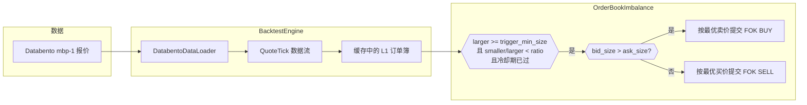
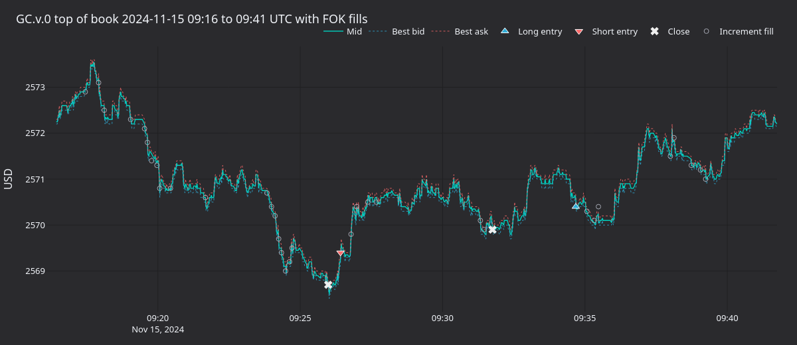
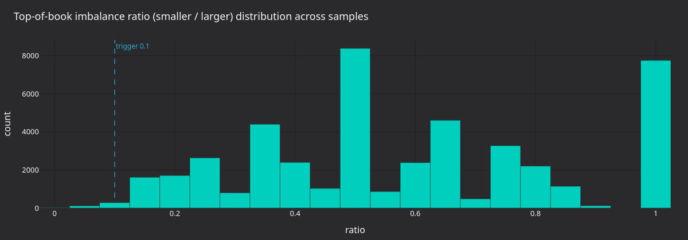
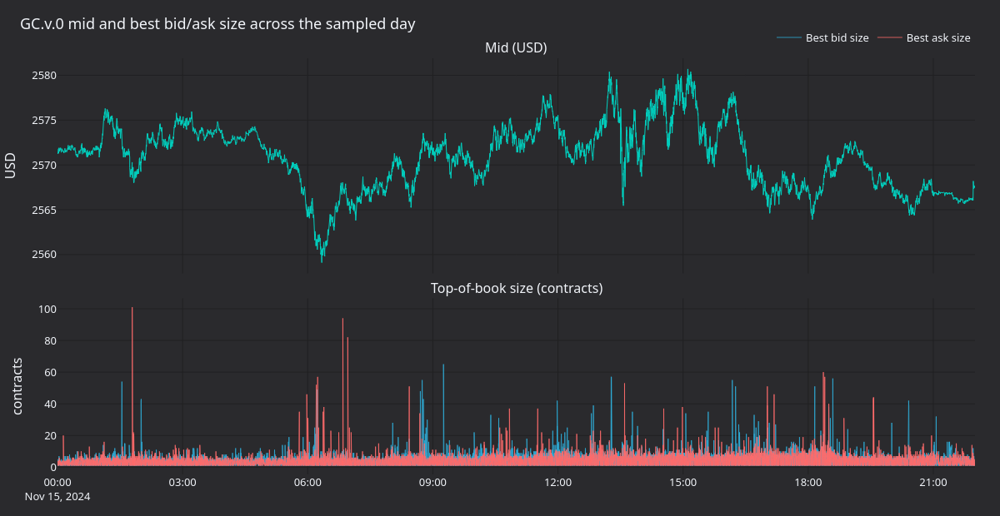
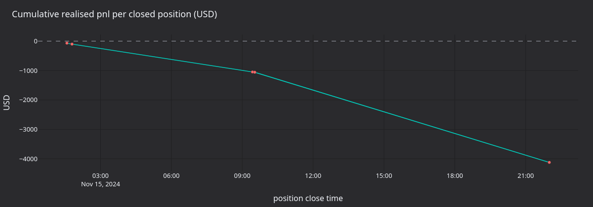

# 使用代理期货数据回测黄金永续合约订单簿不平衡（AX Exchange）

本教程在 **XAU-PERP**（[AX Exchange](https://architect.exchange)）上，使用 [Databento](https://databento.com) 的 CME 黄金期货（`GC.v.0`）`mbp-1` 报价作为代理数据，回测订单簿顶部不平衡策略。

## 简介

订单簿顶部不平衡是一种微观结构信号：当 BBO 一侧的挂单量明显高于另一侧时，订单簿会向一侧倾斜；随着较厚一侧吸收订单流，短期价格往往向较薄一侧移动。每当两侧比例越过阈值且冷却期已结束，随附的 `OrderBookImbalance` 策略就会针对较厚一侧提交 fill-or-kill（FOK）限价订单。

由于策略只需要 BBO，因此可使用 `mbp-1`（market by price，仅含一档最佳买卖价）报价数据，无需完整 L2 订单簿，从而降低回测的数据源成本。

`OrderBookImbalance` 是教学策略，不具备交易优势。



### 为什么代理数据

AX Exchange 较新，Databento 尚未覆盖。CME `GC` 黄金期货是全球流动性最强的黄金衍生品，可为黄金策略回测提供具有代表性的微观结构。这里使用**连续合约** `GC.v.0`，让数据文件按照成交量最高的合约跨到期日拼接，模拟永续合约追随流动性的方式。参数 `stype_in="continuous"` 会在请求时通过 Databento 的连续合约映射解析符号。连续合约在任一时刻只映射到一个底层金融工具，因此加载时覆盖 `instrument_id` 是安全的。

如需进一步了解订单簿不平衡特征的预测能力，请阅读 Databento 的[使用 sklearn 构建 HFT 信号](https://databento.com/blog/hft-sklearn-python)一文。

## 先决条件

- Python 3.12+
- 本地 Vibe Trader 源码构建（`make build-debug`）。
- 一个 Databento API 密钥：

```bash
export DATABENTO_API_KEY="your-api-key"
```

- Databento Python 客户端：`pip install databento`。

## 数据准备

### 下载 CME 黄金期货报价

```python
import databento as db
from pathlib import Path

data_path = Path("gc_gold_quotes.dbn.zst")

if not data_path.exists():
    client = db.Historical()
    data = client.timeseries.get_range(
        dataset="GLBX.MDP3",
        symbols=["GC.v.0"],
        stype_in="continuous",
        schema="mbp-1",
        start="2024-11-15",
        end="2024-11-16",
    )
    data.to_file(data_path)
```

这会拉取一个交易日的数据。后续运行将复用该文件。

### 加载为 Vibe 报价 tick

`DatabentoDataLoader.from_dbn_file` 解析 `.dbn.zst` 存档并生成 `QuoteTick` 对象。`instrument_id` 参数会覆盖 Databento 符号体系，使每个 tick 都显示为来自 `XAU-PERP.AX`。

```python
from vibe_trader.adapters.databento import DatabentoDataLoader
from vibe_trader.model.identifiers import InstrumentId

instrument_id = InstrumentId.from_str("XAU-PERP.AX")

loader = DatabentoDataLoader()
quotes = loader.from_dbn_file(
    path="gc_gold_quotes.dbn.zst",
    instrument_id=instrument_id,
)
```

## 金融工具定义

代理数据需要手动定义金融工具。价格精度和 tick 大小与 CME 源数据一致；保证金和手续费参数反映 AX 条件。

```python
from decimal import Decimal

from vibe_trader.model.currencies import USD
from vibe_trader.model.enums import AssetClass
from vibe_trader.model.identifiers import Symbol
from vibe_trader.model.instruments import PerpetualContract
from vibe_trader.model.objects import Price
from vibe_trader.model.objects import Quantity

XAU_PERP = PerpetualContract(
    instrument_id=instrument_id,
    raw_symbol=Symbol("XAU-PERP"),
    underlying="XAU",
    asset_class=AssetClass.COMMODITY,
    quote_currency=USD,
    settlement_currency=USD,
    is_inverse=False,
    price_precision=2,
    size_precision=0,
    price_increment=Price.from_str("0.01"),
    size_increment=Quantity.from_int(1),
    multiplier=Quantity.from_int(1),
    lot_size=Quantity.from_int(1),
    margin_init=Decimal("0.08"),
    margin_maint=Decimal("0.04"),
    maker_fee=Decimal("0.0002"),
    taker_fee=Decimal("0.0005"),
    ts_event=0,
    ts_init=0,
)
```

手续费是明确的回测假设。当前费率请查阅 [AX 文档](https://docs.architect.exchange/)。

## 策略配置

`use_quote_ticks=True` 与 `book_type="L1_MBP"` 共同指示策略消费报价 tick，并在缓存中自行维护 L1 订单簿，而不是订阅 L2 增量。

| 参数                           | 值       | 说明                           |
| ------------------------------ | -------- | ------------------------------ |
| `max_trade_size`               | `10`     | 每个 FOK 订单的合约上限。      |
| `trigger_min_size`             | `1.0`    | 较大一方必须持有至少一份合约。 |
| `trigger_imbalance_ratio`      | `0.10`   | 当较小/较大 < 10% 时触发。     |
| `min_seconds_between_triggers` | `5.0`    | 连续触发之间的冷却时间。       |
| `book_type`                    | `L1_MBP` | 只使用订单簿顶部。             |
| `use_quote_ticks`              | `True`   | 由报价 tick 驱动策略。         |

```python
from vibe_trader.examples.strategies.orderbook_imbalance import OrderBookImbalance
from vibe_trader.examples.strategies.orderbook_imbalance import OrderBookImbalanceConfig

strategy = OrderBookImbalance(
    OrderBookImbalanceConfig(
        instrument_id=instrument_id,
        max_trade_size=Decimal(10),
        trigger_min_size=1.0,
        trigger_imbalance_ratio=0.10,
        min_seconds_between_triggers=5.0,
        book_type="L1_MBP",
        use_quote_ticks=True,
    ),
)
```

## 回测设置

```python
from vibe_trader.common import LogLevel
from vibe_trader.config import BacktestEngineConfig
from vibe_trader.backtest import BacktestEngine
from vibe_trader.config import LoggerConfig
from vibe_trader.model.enums import AccountType
from vibe_trader.model.enums import OmsType
from vibe_trader.model.identifiers import TraderId
from vibe_trader.model.identifiers import Venue
from vibe_trader.model.objects import Money

engine = BacktestEngine(
    BacktestEngineConfig(
        trader_id=TraderId("BACKTESTER-001"),
        logging=LoggerConfig(stdout_level=LogLevel.INFO),
    ),
)

AX = Venue("AX")
engine.add_venue(
    venue=AX,
    oms_type=OmsType.NETTING,
    account_type=AccountType.MARGIN,
    base_currency=USD,
    starting_balances=[Money(100_000, USD)],
)

engine.add_instrument(XAU_PERP)
engine.add_data(quotes)
engine.add_strategy(strategy)
engine.run()
```

报告可从 `engine.trader` 生成：

```python
print(engine.trader.generate_account_report(AX))
print(engine.trader.generate_order_fills_report())
print(engine.trader.generate_positions_report())

engine.reset()
engine.dispose()
```

可运行示例位于 [`architect_ax_book_imbalance.py`](https://github.com/qOeOp/trade/tree/main/examples/backtest/architect_ax_book_imbalance.py)。

## 运行产生什么

使用 `OrderBookImbalance(0.10, 1.0, 5s)` 重放 2024-11-15 的 GC.v.0 mbp-1 数据（一个交易日），会产生 2,378 次 FOK 成交，并最终形成 5 个已平仓持仓周期。累计已实现盈亏为 **-4,170 USD**：策略全天持续亏损，主要来自不断增加现有持仓的增量 FOK 成交所支付的价差成本。



**图 1.** *GC.v.0 在一个活跃周期附近的订单簿顶部：约 09:26 从空仓开空，约 09:31 平仓，随后再次开多并持有至 09:35。三角形表示从空仓入场，叉号表示回到空仓，空心圆表示扩大持仓的增量 FOK 成交。*



**图 2.** *所有采样订单簿顶部快照的 BBO 数量比率 `smaller / larger`，并标出 0.10 触发阈值。阈值左侧的分布质量即策略可触发区域。*



**图 3.** *整个交易日的中间价（上图）以及最佳买价/卖价数量（下图），单位均为合约。订单簿顶部数量在约 2 至 50 份合约之间快速变化；中间价跨越约 15 美元的区间。*



**图 4.** *在五个平仓周期内累计实现的美元盈亏。斜率始终为负，每周期盈亏由价差主导。*

### 重新生成面板

独立渲染器会使用报价采样 Actor 重新运行回测，并使用 `vibe_dark` tearsheet 主题将 PNG 写入资产目录。

```bash
uv sync --extra visualization
GC_DBN=test_data/local/Databento/gc_gold_quotes.dbn.zst \
    python3 docs/tutorials/assets/gold_book_imbalance_ax/render_panels.py
```

## 后续步骤

- **更严格的触发条件**。将 `trigger_imbalance_ratio` 降到 `0.05`，或将 `trigger_min_size` 提高到 `5`，要求更强的信号确信度后才提交订单。
- **不同交易时段**。只重放常规交易时段（RTH），或连续回放数日，以观察策略在不同市场状态下的表现。
- **其他金融工具**。AX 提供外汇永续合约（`EURUSD-PERP`、`GBPUSD-PERP`）和白银永续合约（`XAG-PERP`）。同样的代理方法可与对应 CME 期货搭配使用。
- **转入 AX 沙箱**。回测表现符合预期后，请参阅 [AX Exchange 集成指南](../integrations/architect_ax.md)。

## 实盘运行

同一个 `OrderBookImbalance` 策略也可在 AX Exchange 实盘运行。启动脚本会将 `BacktestEngine` 换成已配置 AX 数据与执行客户端的 `LiveNode`。参见实盘示例：[`ax_book_imbalance.py`](https://github.com/qOeOp/trade/tree/main/examples/live/architect_ax/ax_book_imbalance.py)。

有关连接设置和 API 密钥配置，请参阅[AX Exchange 集成指南](../integrations/architect_ax.md)。

## 进一步阅读

- [使用代理 FX 数据进行均值回归教程](fx_mean_reversion_ax.md)
- [Architect Exchange 文档](https://docs.architect.exchange/)
- [Databento：使用 sklearn 构建 HFT 信号](https://databento.com/blog/hft-sklearn-python)
