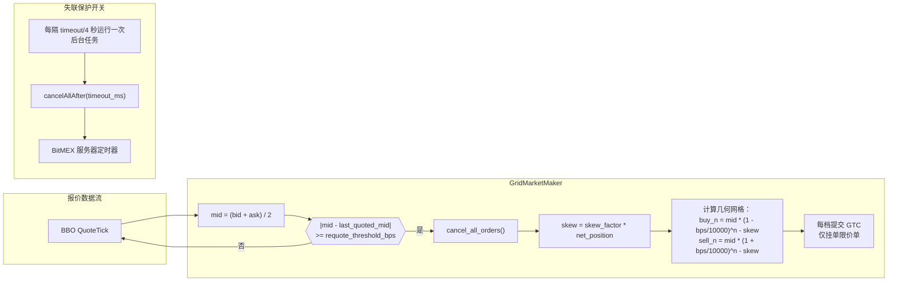
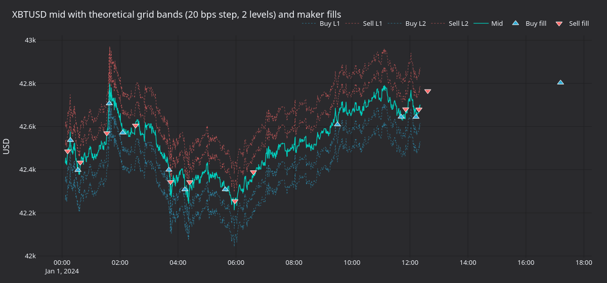
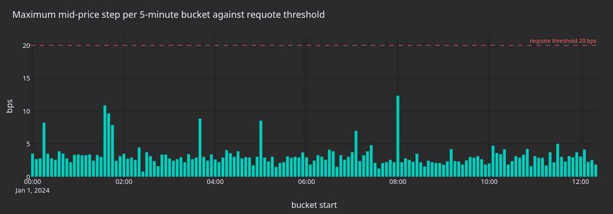
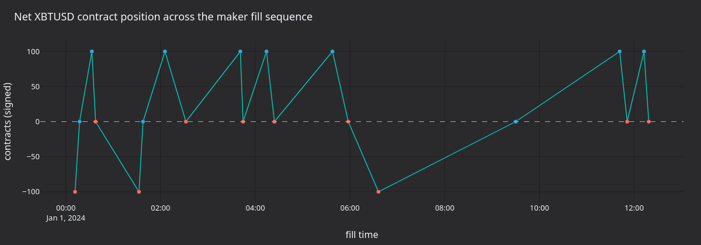
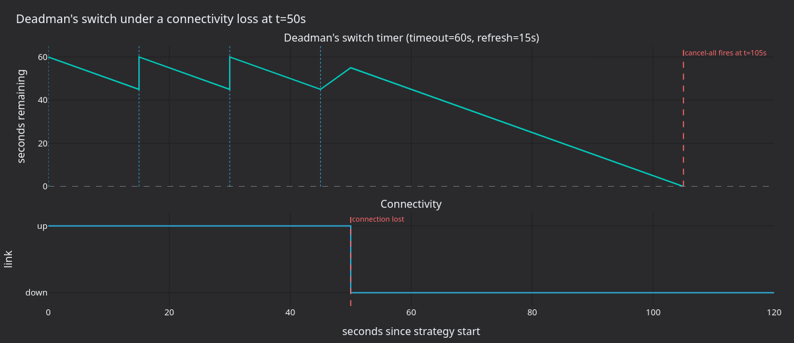
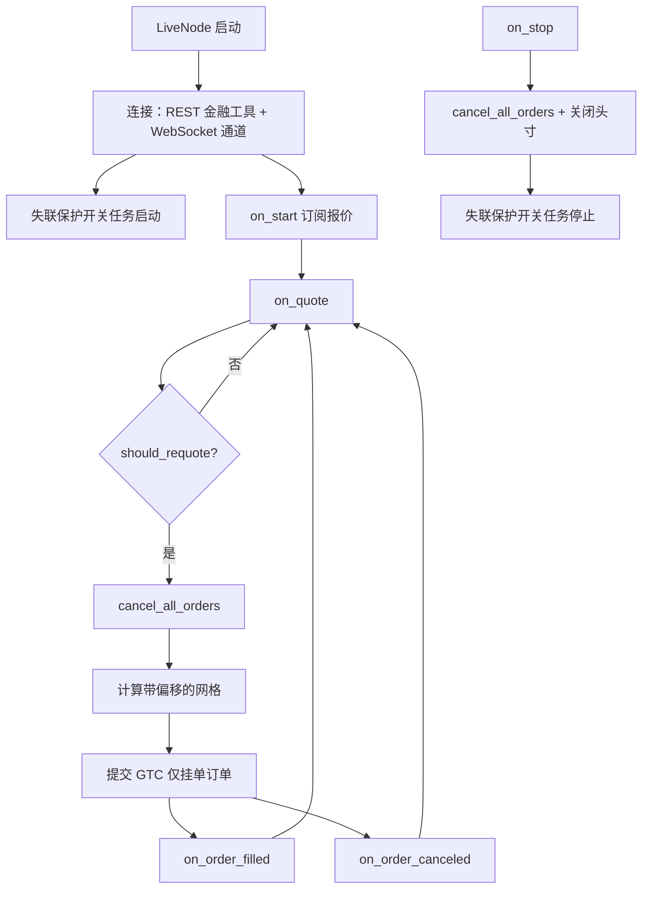

# 使用"失联保护开关"的网格做市（BitMEX）

本教程使用 [Tardis.dev](https://tardis.dev) 提供的免费历史报价数据，在 BitMEX XBTUSD 上回测随附的 `GridMarketMaker` 策略，再通过 Rust `LiveNode` 将同一配置用于实盘交易。教程重点介绍 BitMEX 的 **deadman's switch（失联保护开关）**：这是服务器端的全部撤单计时器，可在客户端失去连接时避免报价订单无人管理。

## 简介

XBTUSD 是 BitMEX 以 USD 计价、以 BTC 作为保证金的反向永续掉期，其深度订单簿历史可追溯至 2014 年。较窄的价差和可预测的深度使 BitMEX 很适合网格做市。



### 为什么 BitMEX 适合网格做市

适配器的两项功能与该策略非常契合：

1. **失联保护开关**（`cancelAllAfter`）：BitMEX 在服务器端维护全部撤单计时器，执行客户端按计划刷新它。如果连接中断且计时器到期，BitMEX 会取消账户中的所有活动订单。
2. **提交/撤单广播器**：适配器可通过多个 HTTP 连接并行广播订单提交和撤单请求，并在收到首个成功响应后结束其余请求。

### 失联保护开关的工作机制

设置 `deadmans_switch_timeout_secs` 后，后台任务会按超时时间的四分之一持续刷新服务器端计时器：

```
timeout = 60s -> refresh interval = timeout / 4 = 15s

 t=0s    Strategy starts, cancelAllAfter(60000ms) sent
 t=15s   Refresh: cancelAllAfter(60000ms) sent (resets timer)
 t=30s   Refresh: cancelAllAfter(60000ms) sent
 t=45s   Refresh: cancelAllAfter(60000ms) sent
 t=50s   Connectivity lost (last refresh was at t=45s)
 t=105s  Server timer fires -> BitMEX cancels all open orders
```

无人管理的报价是做市交易的重大风险：如果客户端崩溃，而中间价附近仍留有网格订单，在人工介入前可能产生没有上限的亏损。失联保护开关把风险暴露窗口限制在 `timeout` 秒以内。

## 先决条件

- 本地 Vibe Trader 源码构建（`make build-debug`）。
- 用于实盘示例的 Rust 工具链（`cargo`），可从 [rustup.rs](https://rustup.rs/) 安装。
- 一个 BitMEX 账户：在 [bitmex.com](https://www.bitmex.com/) 注册并生成具有订单管理权限的 API 密钥。首次运行请使用 [BitMEX 测试网](https://testnet.bitmex.com/)。

### 环境变量

```bash
# Mainnet
export BITMEX_API_KEY="your-api-key"
export BITMEX_API_SECRET="your-api-secret"

# Testnet
export BITMEX_TESTNET_API_KEY="your-testnet-api-key"
export BITMEX_TESTNET_API_SECRET="your-testnet-api-secret"
```

也可以将凭据放在项目根目录的 `.env` 文件中；Python 和 Rust 路径都会通过 `dotenvy` 加载该文件。

## 使用免费的 Tardis 报价数据进行回测

除近期成交外，BitMEX 自有 API 不提供历史 L2 数据。[Tardis.dev](https://tardis.dev) 从 2019 年 3 月起采集并归档逐 tick 的 BitMEX 数据。**每月第一天的数据可免费直接下载**，无需 API 密钥。

### 下载数据

```bash
curl -L -o XBTUSD.csv.gz \
    https://datasets.tardis.dev/v1/bitmex/quotes/2024/01/01/XBTUSD.csv.gz
curl -L -o XBTUSD-trades.csv.gz \
    https://datasets.tardis.dev/v1/bitmex/trades/2024/01/01/XBTUSD.csv.gz
```

策略本身不一定需要成交文件，但生成图表时它很有用：撮合引擎需要主动方订单流来成交被动挂单，而成交数据流正好提供这些信息。

:::tip
完整历史数据（所有日期）需要付费的 Tardis API 密钥。批量获取请使用 [Tardis 下载工具](https://docs.tardis.dev/downloadable-csv-files)。
:::

### 加载数据

`TardisCSVDataLoader` 可直接解析 `.csv.gz` 文件：

```python
from vibe_trader.adapters.tardis.loaders import TardisCSVDataLoader
from vibe_trader.model.identifiers import InstrumentId

instrument_id = InstrumentId.from_str("XBTUSD.BITMEX")

loader = TardisCSVDataLoader(instrument_id=instrument_id)
quotes = loader.load_quotes("XBTUSD.csv.gz")
trades = loader.load_trades("XBTUSD-trades.csv.gz")
```

无论源 CSV 使用什么键，`instrument_id` 参数都会将每条记录标记为 `XBTUSD.BITMEX`。

### 金融工具定义

XBTUSD 是**反向永续合约**：价格以 USD 报价，但保证金和结算币种均为 BTC。每份合约代表 1 USD 的名义敞口。

```python
from decimal import Decimal

from vibe_trader.model.currencies import BTC
from vibe_trader.model.currencies import USD
from vibe_trader.model.enums import AssetClass
from vibe_trader.model.identifiers import Symbol
from vibe_trader.model.instruments import PerpetualContract
from vibe_trader.model.objects import Price
from vibe_trader.model.objects import Quantity

XBTUSD = PerpetualContract(
    instrument_id=instrument_id,
    raw_symbol=Symbol("XBTUSD"),
    underlying="XBT",
    asset_class=AssetClass.CRYPTOCURRENCY,
    base_currency=BTC,
    quote_currency=USD,
    settlement_currency=BTC,
    is_inverse=True,
    price_precision=1,
    size_precision=0,
    price_increment=Price.from_str("0.5"),
    size_increment=Quantity.from_int(1),
    multiplier=Quantity.from_int(1),
    lot_size=Quantity.from_int(1),
    margin_init=Decimal("0.01"),
    margin_maint=Decimal("0.005"),
    maker_fee=Decimal("-0.00025"),
    taker_fee=Decimal("0.00075"),
    ts_event=0,
    ts_init=0,
)
```

手续费率是明确的回测假设。当前费率请查阅 [bitmex.com/app/fees](https://www.bitmex.com/app/fees)。

### 回测引擎设置

XBTUSD 以 BTC 为保证金，因此起始余额以 BTC 为单位：

```python
from vibe_trader.common import LogLevel
from vibe_trader.config import BacktestEngineConfig
from vibe_trader.backtest import BacktestEngine
from vibe_trader.config import LoggerConfig
from vibe_trader.model.enums import AccountType
from vibe_trader.model.enums import OmsType
from vibe_trader.model.identifiers import TraderId
from vibe_trader.model.identifiers import Venue
from vibe_trader.model.objects import Money

engine = BacktestEngine(
    BacktestEngineConfig(
        trader_id=TraderId("BACKTESTER-001"),
        logging=LoggerConfig(stdout_level=LogLevel.INFO),
    ),
)

BITMEX = Venue("BITMEX")
engine.add_venue(
    venue=BITMEX,
    oms_type=OmsType.NETTING,
    account_type=AccountType.MARGIN,
    base_currency=BTC,
    starting_balances=[Money(1, BTC)],
)

engine.add_instrument(XBTUSD)
engine.add_data(quotes + trades)
```

### 策略配置

```python
from vibe_trader.examples.strategies.grid_market_maker import GridMarketMaker
from vibe_trader.examples.strategies.grid_market_maker import GridMarketMakerConfig

strategy = GridMarketMaker(
    GridMarketMakerConfig(
        instrument_id=instrument_id,
        max_position=Quantity.from_int(300),
        trade_size=Quantity.from_int(100),
        num_levels=3,
        grid_step_bps=100,
        skew_factor=0.5,
        requote_threshold_bps=10,
    ),
)
engine.add_strategy(strategy)
```

### 运行并查看结果

```python
import pandas as pd

engine.run()

with pd.option_context("display.max_rows", 100, "display.max_columns", None, "display.width", 300):
    print(engine.trader.generate_account_report(BITMEX))
    print(engine.trader.generate_order_fills_report())
    print(engine.trader.generate_positions_report())

engine.reset()
engine.dispose()
```

完整回测脚本位于 [`bitmex_grid_market_maker.py`](https://github.com/qOeOp/trade/tree/main/examples/backtest/bitmex_grid_market_maker.py)。

### 运行产生什么

2024-01-01 免费样本来自较为平静的元旦交易时段：当天大部分时间，BTC 的波动区间约为 200 USD。使用实盘推荐值 `grid_step_bps=100`（1%）时，最内层买卖价位距离中间价约 420 USD，始终未被触及。因此示例以零成交结束，这正是平静行情下的真实结果。

下图针对前 200,000 条报价使用间距更窄的 `grid_step_bps=20` 配置，以便观察被动成交。采用 20 bps 网格步长、两层网格和 20 bps 重新报价阈值时，策略在采集窗口内产生了 22 次 maker 成交。



**图 1.** *XBTUSD 中间价（青色）及 `grid_step_bps=20`、`num_levels=2` 下的四条理论网格带。三角形表示 maker 成交：向上为买入，向下为卖出。*



**图 2.** *采集窗口内每个五分钟分桶的最大中间价步长（单位为基点）。位于虚线以上的分桶至少有一次越过重新报价阈值。*



**图 3.** *maker 成交序列中累计的带符号 XBTUSD 合约数量。每次成交后，库存偏斜会把网格拉回接近空仓的位置。*



**图 4.** *服务器端全部撤单计时器，配置为 `timeout=60s`、`refresh_interval=15s`。每次刷新都会把计时器重置为 60 秒。连接在 t=50s 中断后，计时器不再被刷新；服务器在 t=105s 触发 `cancelAll`。*

### 重新生成面板

```bash
uv sync --extra visualization
XBTUSD_QUOTES=XBTUSD.csv.gz XBTUSD_TRADES=XBTUSD-trades.csv.gz \
    python3 docs/tutorials/assets/grid_market_maker_bitmex/render_panels.py
```

渲染器将数据集限制为 200,000 条报价和 30,000 笔成交，使运行可在数分钟内稳定复现。

## 实盘交易：带失联保护开关的 GridMarketMaker

回测表现符合预期后，可通过 Rust `LiveNode` 将同一配置用于实盘交易。该策略由 Rust 原生实现。

### 环境设置

当未在配置中显式设置时，凭据会自动从环境变量加载：

```bash
# Testnet (recommended for first runs)
export BITMEX_TESTNET_API_KEY="your-key"
export BITMEX_TESTNET_API_SECRET="your-secret"
```

或者将它们放在项目根目录下的`.env` 文件中。

### 代码演练

完整的 `main()` 函数位于 [`node_grid_mm.rs`](https://github.com/qOeOp/trade/tree/main/crates/adapters/bitmex/examples/node_grid_mm.rs)：

```rust
#[tokio::main]
async fn main() -> Result<(), Box<dyn std::error::Error>> {
    dotenvy::dotenv().ok();

    let environment = Environment::Live;
    let trader_id = TraderId::from("TESTER-001");
    let instrument_id = InstrumentId::from("XBTUSD.BITMEX");

    let data_config = BitmexDataClientConfig {
        environment: BitmexEnvironment::Testnet,
        ..Default::default()
    };

    let exec_config = BitmexExecFactoryConfig::new(
        trader_id,
        BitmexExecClientConfig {
            environment: BitmexEnvironment::Testnet,
            deadmans_switch_timeout_secs: Some(60),
            ..Default::default()
        },
    );

    let data_factory = BitmexDataClientFactory::new();
    let exec_factory = BitmexExecutionClientFactory::new();

    let log_config = LoggerConfig {
        stdout_level: LevelFilter::Info,
        ..Default::default()
    };

    let mut node = LiveNode::builder(trader_id, environment)?
        .with_logging(log_config)
        .add_data_client(None, Box::new(data_factory), Box::new(data_config))?
        .add_exec_client(None, Box::new(exec_factory), Box::new(exec_config))?
        .with_reconciliation(true)
        .with_reconciliation_lookback_mins(2880)
        .with_delay_post_stop_secs(5)
        .build()?;

    let config = GridMarketMakerConfig::builder()
        .instrument_id(instrument_id)
        .max_position(Quantity::from("300"))
        .num_levels(3)
        .grid_step_bps(100)
        .skew_factor(0.5)
        .requote_threshold_bps(10)
        .build();
    let strategy = GridMarketMaker::new(config);

    node.add_strategy(strategy)?;
    node.run().await?;

    Ok(())
}
```

配置要点：

- **`deadmans_switch_timeout_secs: Some(60)`**：启用失联保护开关，超时时间为 60 秒、刷新间隔为 15 秒。
- **`with_reconciliation(true)`**：启动时查询 BitMEX REST API，重新加载活动订单和持仓，使策略在重启后能够正确恢复。
- **`with_reconciliation_lookback_mins(2880)`**：对账时回看 2880 分钟（两天）的订单历史。
- **`with_delay_post_stop_secs(5)`**：停止后保留五秒宽限期，在节点退出前处理待定的撤单与成交事件。

### BitMEX 特定注意事项

#### GTC 与 post-only 订单

BitMEX 网格订单以 `GTC` 和 `ParticipateDoNotInitiate`（post-only）方式提交。如果订单到达时价格已经穿过订单簿，BitMEX 会拒绝订单，而不会让其消耗流动性。

这不同于 dYdX 的配置，后者的短期订单每八秒自动到期。在 BitMEX 上，重新报价周期完全由中间价变化（`requote_threshold_bps`）驱动。

#### 订单量化

适配器会自动处理 BitMEX 金融工具的价格和数量量化，策略代码无需手动舍入或转换。

#### 反向永续合约记账

XBTUSD 以 BTC 作为保证金，PnL 也以 BTC 累积：在 42,000 USD 的价格水平捕获 1 USD 价差，每次成交赚取 1/42,000 BTC。应据此设置 `max_position` 和 `trade_size`。

### 运行示例

```bash
cargo run --example bitmex-grid-mm --package vibe-bitmex --features examples
```

### 正常关闭

按 **Ctrl+C** 停止节点。关闭顺序如下：

1. 收到 SIGINT，交易器停止并触发 `on_stop()`。
2. 策略取消所有订单并平仓。
3. 五秒宽限期（`delay_post_stop_secs`）处理残留事件。
4. 失联保护开关的后台任务停止。
5. 客户端断开连接，节点退出。

## 配置参考

### GridMarketMaker 参数

| 参数                    | 类型           | 默认值  | 说明                                                                  |
| ----------------------- | -------------- | ------- | --------------------------------------------------------------------- |
| `instrument_id`         | `InstrumentId` | *必需*  | 要交易的金融工具（例如 `XBTUSD.BITMEX`）。                            |
| `max_position`          | `Quantity`     | *必需*  | 以合约计的最大净敞口（多头或空头）。                                  |
| `trade_size`            | `Quantity`     | `None`  | 每层网格的数量。若为 `None`，则使用金融工具的 `min_quantity` 或 1.0。 |
| `num_levels`            | `usize`        | `3`     | 买卖两侧各自的网格层数。                                              |
| `grid_step_bps`         | `u32`          | `10`    | 以基点为单位的网格间距 (100 = 1%)。                                   |
| `skew_factor`           | `f64`          | `0.0`   | 根据净库存移动网格的激进程度。                                        |
| `requote_threshold_bps` | `u32`          | `5`     | 重新报价前的最小中间价格变动（基点）。                                |
| `expire_time_secs`      | `Option<u64>`  | `None`  | 订单到期（以秒为单位）。在 BitMEX 上使用`None` 进行 GTC。             |
| `on_cancel_resubmit`    | `bool`         | `false` | 意外取消后在下一个报价时重新提交网格。                                |

### 失联保护开关参数

| 参数                           | 类型          | 说明                                                                                        |
| ------------------------------ | ------------- | ------------------------------------------------------------------------------------------- |
| `deadmans_switch_timeout_secs` | `Option<u64>` | 服务器端取消计时器（以秒为单位）。刷新间隔 =`timeout / 4`（最小 1 秒）。`None` 禁用该功能。 |

60 秒超时对应 15 秒刷新间隔；最后一次刷新后，再过 60 秒 BitMEX 才会触发计时器。较小值缩短风险暴露窗口，但提高 API 调用频率；较大值减少开销，但会延长窗口。

### 选择网格参数

- **`grid_step_bps`**：XBTUSD 价差较窄。可先从 50-100 bps 开始，确认能够成交后再收紧。每层网格捕获的价差为步长的一半。
- **`skew_factor`**：从 `0.0` 开始（不偏斜）。值为 `0.5` 时，每一份合约的净持仓会使网格移动 0.5 USD。
- **`requote_threshold_bps`**：10 bps（0.1%）可作为 XBTUSD 的起点。较小值会造成频繁撤单和重挂；较大值则会使订单在快速行情中失去时效。

## 事件流程



## 监控和了解输出

### 关键日志消息

| 日志消息                                                        | 含义                                   |
| --------------------------------------------------------------- | -------------------------------------- |
| `Requoting grid: mid=X, last_mid=Y`                             | 中间价移动超过阈值，正在刷新网格。     |
| `Starting dead man's switch: timeout=60s, refresh_interval=15s` | 节点启动时启用失联保护开关。           |
| `Dead man's switch heartbeat failed: ...`                       | 短暂网络问题；开关将在下一个间隔重试。 |
| `Disarming dead man's switch`                                   | 关闭期间正常解除失联保护开关。         |
| `benign cancel error, treating as success`                      | 取消已成交或已取消的订单（正常）。     |
| `Reconciling orders from last 2880 minutes`                     | 启动对账正在加载此前状态。             |

### 预期行为模式

1. **启动**：加载金融工具、对账查询此前订单、连接 WebSocket，第一条报价触发初始网格。
2. **稳态**：网格在各个 tick 之间持续存在；只有中间价移动超过阈值时才重新报价。
3. **成交**：持仓更新，偏斜在下一次重新报价时调整。
4. **关闭**：取消所有订单、平掉持仓，并停止失联保护开关。
5. **重启**：对账恢复未结订单状态；策略从先前的网格恢复。

## 定制提示

### 高波动率与低波动率

| 条件       | 调整                                                                           |
| ---------- | ------------------------------------------------------------------------------ |
| 高波动率   | 更宽的 `grid_step_bps`（100-200）、更少的 `num_levels`、更低的 `skew_factor`。 |
| 低波动率   | 更窄的 `grid_step_bps`（20-50）、更多的 `num_levels`、更高的 `skew_factor`。   |
| 流动性稀薄 | 增加`requote_threshold_bps` 以减少取消频率。                                   |

### 启用提交广播器

对于生产部署，可启用提交广播器，通过多个 HTTP 连接冗余提交订单：

```rust
let exec_config = BitmexExecFactoryConfig::new(
    trader_id,
    BitmexExecClientConfig {
        environment: BitmexEnvironment::Mainnet,
        deadmans_switch_timeout_secs: Some(60),
        submitter_pool_size: Some(2),
        canceller_pool_size: Some(2),
        ..Default::default()
    },
);
```

设置 `submitter_pool_size=2` 后，每笔订单会并行提交给两个 HTTP 客户端，以首个成功响应为准。这能降低某条路径阻塞时漏掉订单提交的概率。

### 主网切换

将两个配置中的 `environment` 字段都设为 `BitmexEnvironment::Mainnet` 即可切换网络。所有端点和凭据环境变量都会自动解析。

## 进一步阅读

- [BitMEX 集成指南](../integrations/bitmex.md)：完整适配器参考。
- [使用短期订单进行链上网格做市（dYdX）](./grid_market_maker_dydx.md)：以短期订单到期机制替代失联保护开关。
- [Tardis 可下载 CSV 文件](https://docs.tardis.dev/downloadable-csv-files)：Tardis 存档的 schema 文档。
- [BitMEX API 文档](https://www.bitmex.com/app/apiOverview)：`cancelAllAfter`端点和订单管理参考。
