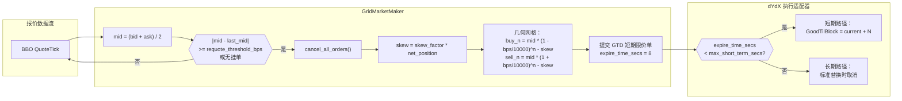
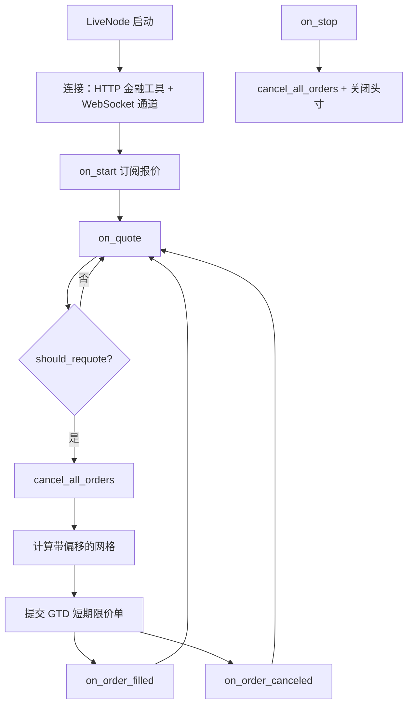
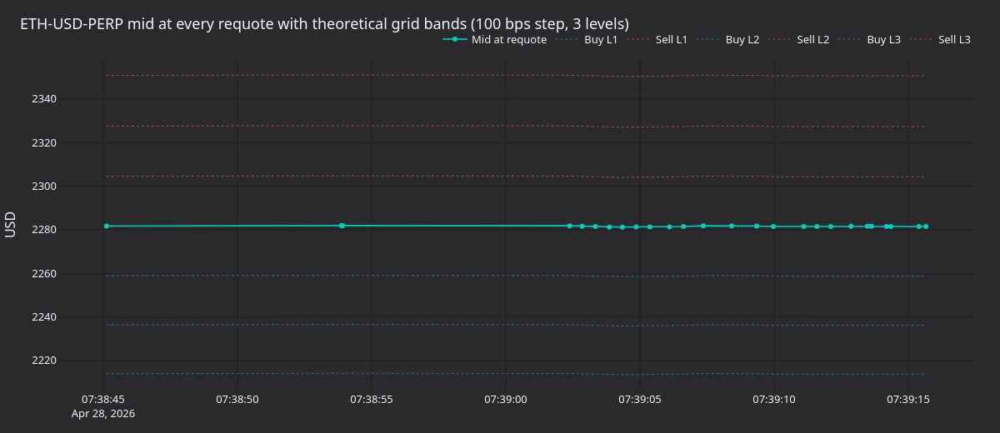
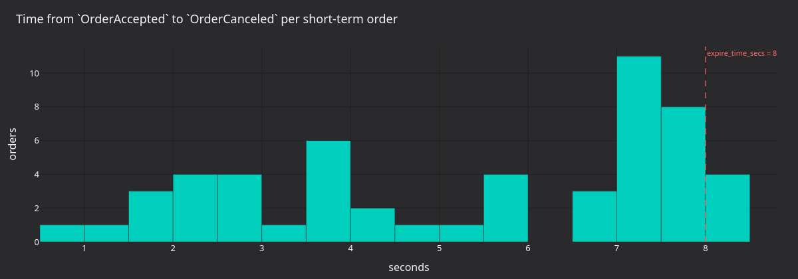
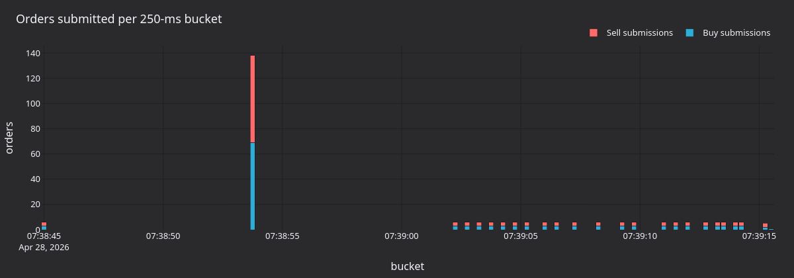
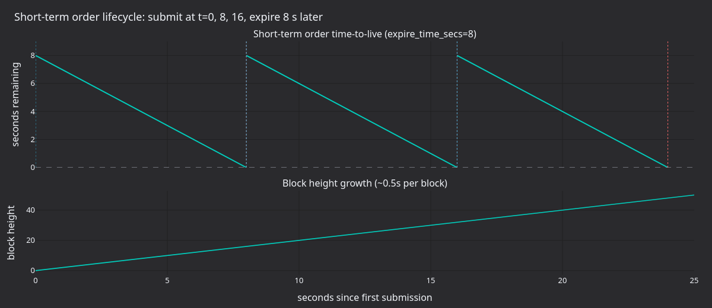

# 使用短期订单进行链上网格做市（dYdX）

本教程通过 Rust `LiveNode` 在 dYdX v4 上运行随附的 `GridMarketMaker` 策略。策略围绕中间价对称挂出限价订单，通过偏斜网格管理库存，并借助交易场所基于区块的到期机制轮换短期订单，而不是显式撤单。

## 简介

网格做市商以当前中间价为中心，按固定价格间距维护一组静态买卖限价订单。订单成交时，策略试图赚取买卖网格价位之间的价差。库存管理将净敞口限制在 `max_position` 内，避免网格持续累积方向性持仓。



### 库存偏斜（受 Avellaneda-Stoikov 启发）

多头持仓增大时，整个网格向下移动（买价和卖价都更低），以鼓励下一次在卖方成交；空头持仓增大时，网格则向上移动。这体现了针对离散网格调整后的 Avellaneda-Stoikov 框架。

### 为什么选择 dYdX v4

dYdX v4 非常适合做市：

- **短期订单**约 20 秒到期：提交延迟低，且没有链上存储成本。
- **约 0.5 秒的出块时间**带来快速确认周期。
- **撤单无需 gas 费**：借助 GTB 重放保护，短期订单撤单免费。
- **链上订单簿**在每个区块中执行确定性撮合。
- **批量撤单**：一个 `MsgBatchCancel` 即可清理多笔短期订单。

## 先决条件

### 资助 dYdX 账户

您需要一个存有 USDC 抵押品的 dYdX 账户。创建测试网账户并注资的方法，请参阅集成指南的[测试网设置](../integrations/dydx.md#testnet-setup)部分。测试网钱包还需要一把通过 dYdX UI 注册的 API 交易密钥。

### 环境变量

```bash
# Mainnet
export DYDX_PRIVATE_KEY="0x..."
export DYDX_WALLET_ADDRESS="dydx1..."

# Testnet
export DYDX_TESTNET_PRIVATE_KEY="0x..."
export DYDX_TESTNET_WALLET_ADDRESS="dydx1..."
```

## 策略概述

### 几何网格定价

每层网格与中间价保持固定百分比距离（以基点计）：

```
Buy level N:  mid * (1 - bps/10000)^N - skew
Sell level N: mid * (1 + bps/10000)^N - skew
```

其中 `skew = skew_factor * net_position`。

当中间价约为 1000.00、`grid_step_bps=100`（1%）且网格为三层时：

```
                        Sell 3: 1030.30
                    Sell 2: 1020.10
                Sell 1: 1010.00
            ─── Mid: 1000.00 ───
                Buy 1:  990.00
                    Buy 2:  980.10
                        Buy 3:  970.30
```

当净多头持仓为 2 且 `skew_factor=1.0` 时，整个网格向下移动 2.0：

```
                        Sell 3: 1028.30
                    Sell 2: 1018.10
                Sell 1: 1008.00
            ─── Mid: 1000.00 ───
                Buy 1:  988.00
                    Buy 2:  978.10
                        Buy 3:  968.30
```

### 库存管理

该策略通过两种机制强制执行头寸限制：

1. **`max_position`**：净敞口（多头或空头）的硬上限。如果新增下一层网格后的预计敞口会突破上限，策略将跳过该层。
2. **预计敞口跟踪**：提交每层订单前，策略跟踪最坏情况下的单边敞口（当前持仓加全部挂单买入或卖出订单），以免承诺过多风险。

`cancel_all_orders` 是异步操作，因此在撤单请求与确认之间，挂单仍可能成交。跟踪两侧最坏情况风险，可以防止撤单-重新报价切换期间出现短暂的风险超限。

### 重新报价阈值

`requote_threshold_bps` 控制中间价需要移动多远，策略才会取消所有活动订单并挂出新网格：

- **较低阈值**（5 bps）：响应更快，但撤单和下单次数更多。
- **较高阈值**（50 bps）：操作次数更少，但订单可能离当前价格更远。

## 配置

| 参数                    | 类型           | 默认值  | 说明                                                                  |
| ----------------------- | -------------- | ------- | --------------------------------------------------------------------- |
| `instrument_id`         | `InstrumentId` | *必需*  | 要交易的金融工具（例如 `ETH-USD-PERP.DYDX`）。                        |
| `max_position`          | `Quantity`     | *必需*  | 最大净敞口（多头或空头）。                                            |
| `trade_size`            | `Quantity`     | `None`  | 每层网格的数量。若为 `None`，则使用金融工具的 `min_quantity` 或 1.0。 |
| `num_levels`            | `usize`        | `3`     | 买卖两侧各自的网格层数。                                              |
| `grid_step_bps`         | `u32`          | `10`    | 以基点为单位的网格间距 (10 = 0.1%)。                                  |
| `skew_factor`           | `f64`          | `0.0`   | 根据库存移动网格的激进程度。                                          |
| `requote_threshold_bps` | `u32`          | `5`     | 重新报价前的最小中间价格变动（以基点为单位）。                        |
| `expire_time_secs`      | `Option<u64>`  | `None`  | 订单到期（以秒为单位）。设置时使用 GTD，否则使用 GTC。                |
| `on_cancel_resubmit`    | `bool`         | `false` | 意外取消后在下一个报价时重新提交网格。                                |

### 参数选择

- **`grid_step_bps`**：波动市场可用 50-100 bps，平静市场可用 5-20 bps。较宽网格每次成交可捕获更多价差，但成交频率更低。
- **`skew_factor`**：从 `0.0` 开始。值为 `0.5` 时，每单位净持仓会使网格移动 0.5 个价格单位。偏斜过于激进可能使整张网格完全移到中间价上方或下方。
- **`expire_time_secs`**：dYdX 短期订单设为 `8` 秒。该值适配 40 个区块（约 20 秒）的短期窗口，并让订单走低延迟的短期路径。为 `None` 时，订单使用 GTC 和长期路径。
- **`on_cancel_resubmit`**：当发生非策略主动触发的撤单（索引器报告短期订单到期、自成交防护、风险限制）后，在下一条报价上重新提交网格。索引器会在每笔短期订单到期后不久发出撤单事件；此标志会重置重新报价锚点，因此即使中间价尚未移动超过 `requote_threshold_bps`，下一条报价也会重建网格。

## dYdX 特定注意事项

### 短期订单到期

当`expire_time_secs=8` 时，订单被适配器归类为短期：

1. 适配器检查 `8s < max_short_term_secs (40 blocks * ~0.5s = ~20s)`。
2. 订单按 `GoodTilBlock = current_height + N` 作为短期订单提交。
3. 未成交订单约八秒后在链上到期。到期不消耗 gas（由链上的 GTB 重放保护处理），但索引器仍会在到期区块后不久为每笔到期订单发出 `OrderCanceled` 事件，因此策略可通过常规撤单事件路径感知到期。

这是做市商的推荐配置，因为：

- 短期订单延迟较低。
- 到期不产生链上 gas 费。
- 连续重新报价会替换已到期订单；启用 `on_cancel_resubmit=true` 时，该过程由索引器发出的撤单事件驱动。

完整说明请参阅集成指南的[订单分类](../integrations/dydx.md#order-classification)部分。

### 意外取消和`on_cancel_resubmit`

`pending_self_cancels` 集合用于区分策略主动撤单和意外撤单：

1. 策略调用 `cancel_all_orders` 时，会在 `pending_self_cancels` 中记录所有活动订单 ID。
2. 触发 `on_order_canceled` 时：
   - 如果订单 ID 位于 `pending_self_cancels` 中，则属于策略主动撤单，无需处理。
   - 否则撤单并非由策略发起（可能是短期订单到期、自成交防护或风险限制）。此时重置 `last_quoted_mid`，使下一条报价触发整张网格的重新提交。

这样既能避免策略在自己发起的批量撤单期间无谓地重新报价，又能对意外撤单作出响应。

`on_order_filled` 也会从 `pending_self_cancels` 中删除订单。如果订单在撤单确认到达前成交，这可防止陈旧条目不断累积。

### 订单量化

dYdX 市场的价格和数量量化由适配器的 `OrderMessageBuilder` 自动处理，无需手动舍入或转换。详情请参阅[价格和数量量化](../integrations/dydx.md#price-and-size-quantization)。

### post-only 订单

所有网格订单均以 `post_only=true` 提交。撮合时会穿过价差的订单将被交易所拒绝，因此所有成交都按 maker 费率计费，网格也不会在重新报价切换期间意外吃掉自己的报价。

## 运行与停止

### 环境设置

凭据从环境变量或项目根目录的 `.env` 文件加载（由 `dotenvy` 自动加载）：

```bash
# Direct export
export DYDX_PRIVATE_KEY="0x..."
export DYDX_WALLET_ADDRESS="dydx1..."
```

```bash
# .env equivalent
DYDX_PRIVATE_KEY=0x...
DYDX_WALLET_ADDRESS=dydx1...
```

### 运行示例

```bash
cargo run --example dydx-grid-mm --package vibe-dydx --features examples
```

示例默认连接主网。要连接测试网，请将示例开头附近的 `DYDX_NETWORK` 常量设为 `DydxNetwork::Testnet`（需要测试网 API 交易密钥），然后重新构建。

### 正常关闭

按 **Ctrl+C** 停止节点。关闭顺序如下：

1. 收到 SIGINT，交易器停止并触发 `on_stop`。
2. 策略取消所有订单并平仓。
3. 五秒宽限期（`delay_post_stop_secs`）处理残留事件。
4. 客户端断开连接，节点退出。

## 代码演练

`main` 函数位于 [`crates/adapters/dydx/examples/node_grid_mm.rs`](https://github.com/qOeOp/trade/tree/main/crates/adapters/dydx/examples/node_grid_mm.rs)：

```rust
const DYDX_NETWORK: DydxNetwork = DydxNetwork::Mainnet;

#[tokio::main]
async fn main() -> Result<(), Box<dyn std::error::Error>> {
    dotenvy::dotenv().ok();

    let network = DYDX_NETWORK;

    let environment = Environment::Live;
    let trader_id = TraderId::from("TESTER-001");
    let account_id = AccountId::from("DYDX-001");
    let node_name = "DYDX-GRID-MM-001".to_string();
    let instrument_id = InstrumentId::from("ETH-USD-PERP.DYDX");

    let data_config = DydxDataClientConfig {
        network,
        ..Default::default()
    };

    let exec_config = DydxExecClientConfig {
        trader_id,
        account_id,
        network,
        ..Default::default()
    };

    let data_factory = DydxDataClientFactory::new();
    let exec_factory = DydxExecutionClientFactory::new();

    let log_config = LoggerConfig {
        stdout_level: LevelFilter::Info,
        ..Default::default()
    };

    let mut node = LiveNode::builder(trader_id, environment)?
        .with_name(node_name)
        .with_logging(log_config)
        .add_data_client(None, Box::new(data_factory), Box::new(data_config))?
        .add_exec_client(None, Box::new(exec_factory), Box::new(exec_config))?
        .with_reconciliation(false)
        .with_delay_post_stop_secs(5)
        .build()?;

    let config = GridMarketMakerConfig::builder()
        .instrument_id(instrument_id)
        .max_position(Quantity::from("0.10"))
        .num_levels(3)
        .grid_step_bps(100)
        .skew_factor(0.5)
        .requote_threshold_bps(10)
        .expire_time_secs(8)
        .on_cancel_resubmit(true)
        .build();
    let strategy = GridMarketMaker::new(config);

    node.add_strategy(strategy)?;
    node.run().await?;

    Ok(())
}
```

配置要点：

- **`dotenvy::dotenv().ok()`**：加载项目根目录中的 `.env`（如存在）。
- **`with_reconciliation(false)`**：为简化示例而禁用；生产环境应启用，以便重启后恢复状态。
- **`with_delay_post_stop_secs(5)`**：关闭期间用于处理待定撤单与成交事件的宽限期。

### 事件流程



## 策略内部结构

来自`grid_mm.rs` 的关键 Rust 片段如下。

### 解析交易数量（`on_start`）

交易数量根据金融工具缓存解析：优先使用配置值，其次使用金融工具的 `min_quantity`，最后以 `1.0` 作为后备。

```rust
fn on_start(&mut self) -> anyhow::Result<()> {
    let instrument_id = self.config.instrument_id;
    let (instrument, size_precision, min_quantity) = {
        let cache = self.cache();
        let instrument = cache
            .instrument(&instrument_id)
            .ok_or_else(|| anyhow::anyhow!("Instrument {instrument_id} not found in cache"))?;
        (
            instrument.clone(),
            instrument.size_precision(),
            instrument.min_quantity(),
        )
    };
    self.price_precision = Some(instrument.price_precision());
    self.instrument = Some(instrument);

    if self.trade_size.is_none() {
        self.trade_size =
            Some(min_quantity.unwrap_or_else(|| Quantity::new(1.0, size_precision)));
    }

    self.subscribe_quotes(instrument_id, None, None);
    Ok(())
}
```

### 报价处理程序（`on_quote`，节选）

```rust
fn on_quote(&mut self, quote: &QuoteTick) -> anyhow::Result<()> {
    let mid_f64 = (quote.bid_price.as_f64() + quote.ask_price.as_f64()) / 2.0;
    let mid = Price::new(
        mid_f64,
        self.price_precision
            .expect("price_precision should be resolved in on_start"),
    );

    if !self.should_requote(mid) {
        return Ok(()); // Mid hasn't moved enough, keep existing grid
    }

    self.cancel_all_orders(instrument_id, None, None, None)?;

    let (net_position, worst_long, worst_short) = { /* ... */ };

    let grid = self.grid_orders(mid, net_position, worst_long, worst_short);

    if grid.is_empty() {
        return Ok(()); // Don't advance requote anchor when fully constrained
    }

    let (tif, expire_time) = match self.config.expire_time_secs {
        Some(secs) => {
            let now_ns = self.clock().timestamp_ns();
            let expire_ns = now_ns + secs * 1_000_000_000;
            (Some(TimeInForce::Gtd), Some(expire_ns))
        }
        None => (None, None),
    };

    for (side, price) in grid {
        let order = self.order().limit(
            instrument_id,
            side,
            trade_size,
            price,
            tif,
            expire_time,
            Some(true), // post_only
        );
        self.submit_order(order, None, None)?;
    }

    self.last_quoted_mid = Some(mid);
    Ok(())
}
```

### 网格定价 (`grid_orders`)

计算几何网格价格，并在每一层强制执行 `max_position` 限制：

```rust
fn grid_orders(
    &self,
    mid: Price,
    net_position: f64,
    worst_long: Decimal,
    worst_short: Decimal,
) -> Vec<(OrderSide, Price)> {
    let instrument = self
        .instrument
        .as_ref()
        .expect("instrument should be resolved in on_start");
    let mid_f64 = mid.as_f64();
    let skew_f64 = self.config.skew_factor * net_position;
    let pct = self.config.grid_step_bps as f64 / 10_000.0;
    let trade_size = self
        .trade_size
        .expect("trade_size should be resolved in on_start")
        .as_decimal();
    let max_pos = self.config.max_position.as_decimal();
    let mut projected_long = worst_long;
    let mut projected_short = worst_short;
    let mut orders = Vec::new();

    for level in 1..=self.config.num_levels {
        let buy_f64 = mid_f64 * (1.0 - pct).powi(level as i32) - skew_f64;
        let sell_f64 = mid_f64 * (1.0 + pct).powi(level as i32) - skew_f64;
        let buy_price = instrument.next_bid_price(buy_f64, 0);
        let sell_price = instrument.next_ask_price(sell_f64, 0);

        if let Some(buy_price) = buy_price
            && projected_long + trade_size <= max_pos
        {
            orders.push((OrderSide::Buy, buy_price));
            projected_long += trade_size;
        }

        if let Some(sell_price) = sell_price
            && projected_short - trade_size >= -max_pos
        {
            orders.push((OrderSide::Sell, sell_price));
            projected_short -= trade_size;
        }
    }

    orders
}
```

## 35 秒主网运行会产生什么

使用示例配置（`grid_step_bps=100`、`num_levels=3`、`skew_factor=0.5`、`requote_threshold_bps=10`、`expire_time_secs=8`）在 `ETH-USD-PERP.DYDX` 上进行 35 秒主网采集，共记录 47 次重新报价、276 次订单提交、67 次接受和 54 次撤单。ETH 价格接近 2,281 USD，波动始终不足以触发 10 bps 的重新报价阈值；因此，大多数周期由每八秒一次的短期订单到期触发，而非价格波动。



**图 1.** *每次重新报价时的 ETH-USD-PERP 中间价及六条理论网格带（每侧三层，步长 100 bps）。中间价约为 2,281 USD；最内层买价和卖价分别约为 2,258 和 2,304 USD。*



**图 2.** *每笔短期订单从 `OrderAccepted` 到 `OrderCanceled` 的存续时间（秒）。集中在 7-8 秒附近的主要分布与 `expire_time_secs=8` 一致；小于六秒的次要簇来自重新报价切换期间由策略主动发起的撤单。*



**图 3.** *每个 250 毫秒分桶内的订单提交数，并按买卖方向拆分。每次重新报价周期提交六笔订单（三买加三卖）；各次突发之间的间隔即重新报价间隔。*



**图 4.** *`expire_time_secs=8` 且出块时间为 0.5 秒时的理论短期订单时间线。下图跟踪链上区块高度的推进；每笔订单的 `GoodTilBlock` 目标设在约 16 个区块之后，对应八秒到期时间。*

### 重新生成面板

```bash
# Capture a 35-second mainnet run.
timeout 35 ./target/release/examples/dydx-grid-mm > /tmp/dydx_main.log 2>&1

uv sync --extra visualization
DYDX_LOG=/tmp/dydx_main.log \
    python3 docs/tutorials/assets/grid_market_maker_dydx/render_panels.py
```

## 监控和了解输出

### 关键日志消息

| 日志消息                                            | 含义                               |
| --------------------------------------------------- | ---------------------------------- |
| `Requoting grid: mid=X, last_mid=Y`                 | 中间价移动超过阈值，正在刷新网格。 |
| `Submit short‑term order N`                         | 通过短期广播路径提交的订单。       |
| `BatchCancel N short-term orders`                   | 对过期/过时的订单执行批量取消。    |
| `benign cancel error, treating as success`          | 撤销已成交或已到期的订单（正常）。 |
| `Sequence mismatch detected, will resync and retry` | Cosmos SDK 序列错误，自动恢复。    |

### 预期行为模式

1. **启动**：加载金融工具、连接 WebSocket，第一条报价触发初始网格。
2. **稳态**：网格在各个 tick 之间持续存在；只有中间价移动超过 `requote_threshold_bps` 时才重新报价。
3. **成交**：持仓更新、偏斜调整，下一次重新报价时移动网格。
4. **到期**：短期订单在链上约八秒后过期；索引器为每个事件发出一个取消事件，下一个报价刷新网格。
5. **关闭**：所有订单取消，持仓平仓，WebSocket 断开连接。

## 定制提示

### 高波动率与低波动率

| 条件       | 调整                                                                           |
| ---------- | ------------------------------------------------------------------------------ |
| 高波动率   | 更宽的 `grid_step_bps`（100-200）、更少的 `num_levels`、更低的 `skew_factor`。 |
| 低波动率   | 更窄的 `grid_step_bps`（10-30）、更多的 `num_levels`、更高的 `skew_factor`。   |
| 流动性稀薄 | 增加`requote_threshold_bps` 以减少取消频率。                                   |

### 多种金融工具

每个金融工具运行一个独立的 `GridMarketMaker` 实例。各实例分别管理自己的网格、持仓和撤单状态：

```rust
let btc_config = GridMarketMakerConfig::builder()
    .instrument_id(InstrumentId::from("BTC-USD-PERP.DYDX"))
    .max_position(Quantity::from("0.001"))
    .base(
        StrategyConfig::builder()
            .strategy_id(StrategyId::from("GRID_MM-BTC"))
            .order_id_tag("BTC".to_string())
            .build(),
    )
    .grid_step_bps(50)
    .build();

let eth_config = GridMarketMakerConfig::builder()
    .instrument_id(InstrumentId::from("ETH-USD-PERP.DYDX"))
    .max_position(Quantity::from("0.10"))
    .base(
        StrategyConfig::builder()
            .strategy_id(StrategyId::from("GRID_MM-ETH"))
            .order_id_tag("ETH".to_string())
            .build(),
    )
    .grid_step_bps(100)
    .build();

node.add_strategy(GridMarketMaker::new(btc_config))?;
node.add_strategy(GridMarketMaker::new(eth_config))?;
```

### 主网与测试网切换

示例根据文件开头附近的 `DYDX_NETWORK` 常量选择网络，默认值为 `DydxNetwork::Mainnet`。将其改为 `DydxNetwork::Testnet` 并重新构建，即可连接测试网。

## 进一步阅读

- [dYdX v4 集成指南](../integrations/dydx.md)：完整适配器参考。
- [dYdX 协议文档](https://docs.dydx.xyz/)：官方协议文档。
- [订单类型](https://docs.dydx.xyz/concepts/trading/orders)：协议级订单机制。
- [使用失联保护开关进行网格做市（BitMEX）](./grid_market_maker_bitmex.md)：比较失联保护开关与短期订单到期机制。
