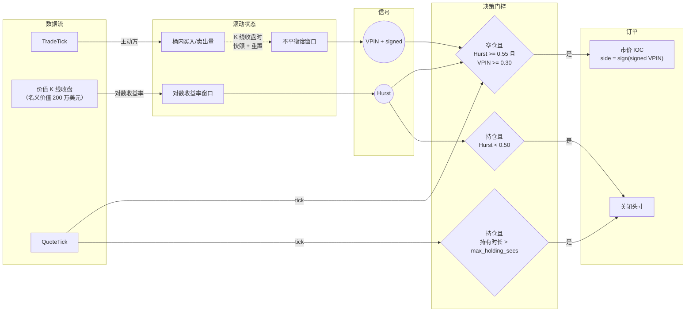
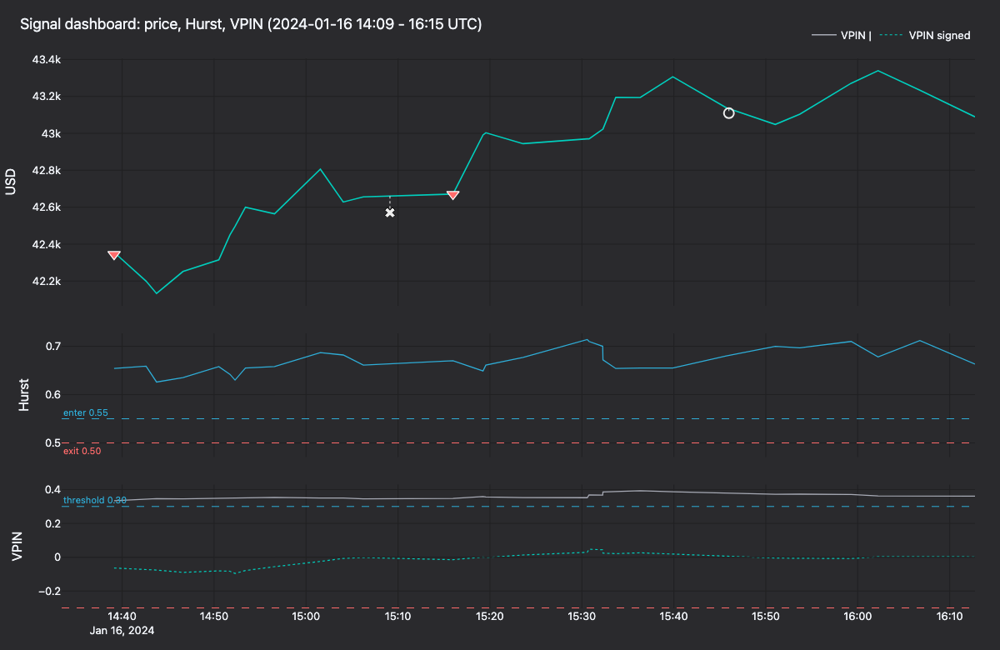
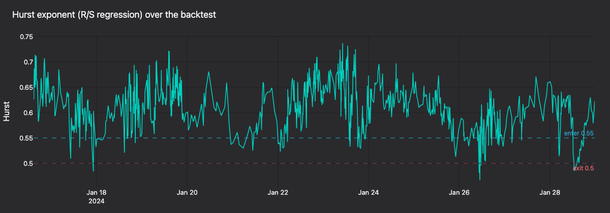
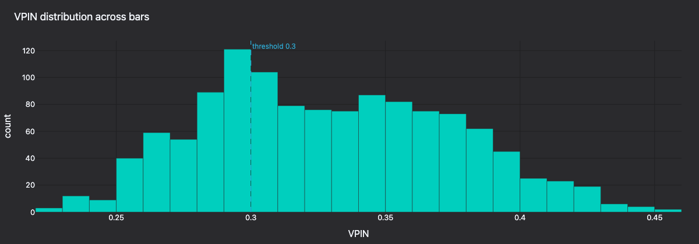
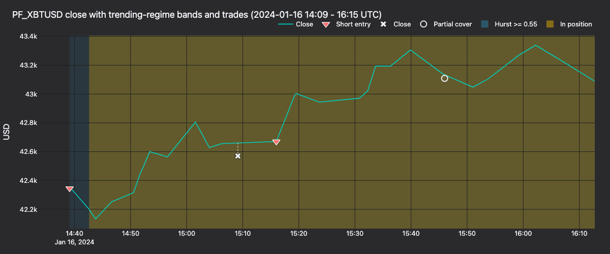
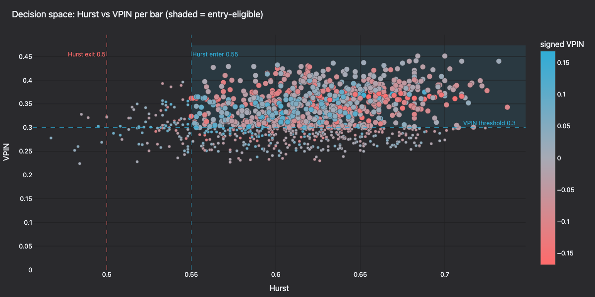

# Hurst/VPIN 方向性策略（Kraken Futures）

:::note
这是一个**仅使用 Rust**的教程。策略、回测接线和测试均位于编译后的核心中。
:::

本教程在 **PF_XBTUSD**（[Kraken Futures](https://futures.kraken.com) 上以 USD 作为保证金的比特币永续合约）上回测方向性策略。策略结合 **Hurst 指数市场状态过滤器**和 **VPIN**（Volume-synchronized Probability of Informed Trading，成交量同步知情交易概率）订单流信号。历史成交与报价来自 [Tardis.dev](https://tardis.dev)，并通过 Rust `BacktestEngine` 重放。

## 简介

策略结合三个组件：根据柱数据计算的**慢速市场状态过滤器**、根据成交计算的**快速知情订单流信号**，以及只有两者方向一致时才触发的**报价驱动入场**。

- **美元柱上的 Hurst 指数。** 按照 Lopez de Prado（*Advances in Financial Machine Learning*，第 2 章）的方法，在固定名义金额（价值）柱上采样。重标极差（R/S）估计高于 `0.55` 表示持续的趋势行为；低于 `0.50` 则表示序列趋向均值回归或噪声。

- **基于主动成交方向流量计算 VPIN。** 每根完整美元 K线都视为一个成交量桶。取最近五十个桶中主动买入与主动卖出成交量绝对不平衡的平均值，得到 VPIN 水平；有符号不平衡则给出知情流量的净方向。

- **报价驱动入场。** 两个信号一致后，策略在下一条报价 tick 上建仓。入场时机由实时订单簿顶部决定，而非柱收盘。

退出也由相同要素驱动：Hurst 估计回落并穿过较低阈值，或达到最长持有时间时，策略平仓。

该策略以 [`HurstVpinDirectional`](https://github.com/qOeOp/trade/tree/main/crates/trading/src/examples/strategies/hurst_vpin_directional) 的形式随 `vibe_trading::examples::strategies` 模块提供。与所有随附示例策略一样，它有意保持简单，不具备 alpha 优势。

### 为什么选择 Kraken 期货

Kraken 期货以两种形式列出比特币和以太币的永续合约：

- **`PI_` 反向永续合约**：以 USD 报价，以标的资产作为保证金和结算币种。
- **`PF_` 线性永续合约**：以 USD 报价，通过多抵押品机制以 USD 作为保证金和结算币种。

本教程使用 **`PF_XBTUSD`**，因此账户币种、报价币种和美元柱采样框架均为 USD。

### 为什么结合美元柱与 VPIN

VPIN 定义在*成交量*桶上，而非*时间*桶上。美元柱（VibeTrader 中的 `VALUE` 聚合）在累计成交固定名义金额后收盘，因此采样框架会随市场活跃度自适应。把每个 VPIN 桶定义为一根美元柱，可让两个信号使用同一时钟；在同一组柱上采样的 Hurst 也使用相同框架。

## 先决条件

- 可用的 Rust 工具链（参见 [rustup.rs](https://rustup.rs)）。
- 已克隆并能成功构建的 VibeTrader 仓库。
- 可以通过互联网下载免费的 Tardis 示例（每个月的第一天不需要 API 密钥）。

## 数据准备

Tardis 以历史标识 `cryptofacilities` 发布 Kraken Futures 数据。每月第一天的数据可免费获取，无需 API 密钥，足以进行单日接线检查。完整回测至少需要两个交易时段来预热 128 根柱的 Hurst 窗口，因此需要付费的 Tardis API 密钥（参见下方提示）。

```bash
mkdir -p /tmp/tardis_kraken

curl -L -o /tmp/tardis_kraken/PF_XBTUSD_trades.csv.gz \
  https://datasets.tardis.dev/v1/cryptofacilities/trades/2024/01/01/PF_XBTUSD.csv.gz

curl -L -o /tmp/tardis_kraken/PF_XBTUSD_quotes.csv.gz \
  https://datasets.tardis.dev/v1/cryptofacilities/quotes/2024/01/01/PF_XBTUSD.csv.gz
```

教程后文的可运行示例二进制文件默认从 `/tmp/tardis_kraken/` 读取数据，因此预先下载到该目录后，运行 `cargo run` 时无需覆盖 `KRAKEN_TRADES` 或 `KRAKEN_QUOTES`。

:::tip
完整历史区间需要付费的 Tardis API 密钥。超出单日样本后，请使用 [Tardis 下载工具](https://docs.tardis.dev/downloadable-csv-files) 批量获取。
:::

Rust Tardis 加载器直接解析 `.csv.gz`，并使用提供的金融工具 ID 标记每条记录，因此策略层无需符号映射：

```rust
use vibe_model::identifiers::InstrumentId;
use vibe_tardis::csv::load::{load_quotes, load_trades};

let instrument_id = InstrumentId::from("PF_XBTUSD.KRAKEN");
let trades = load_trades(
    "PF_XBTUSD_trades.csv.gz",
    Some(1),               // price_precision
    Some(4),               // size_precision
    Some(instrument_id),
    None,                  // limit
)?;
let quotes = load_quotes(
    "PF_XBTUSD_quotes.csv.gz",
    Some(1),
    Some(4),
    Some(instrument_id),
    None,
)?;
```

请显式传入金融工具的 `price_precision` 和 `size_precision`。否则加载器会根据开头几条记录推断精度；如果样本日开头没有小数价格，可能推断出 `0`。撮合引擎遇到精度与金融工具声明不一致的报价 tick 时会拒绝该数据。

## 金融工具定义

由于这里直接加载 CSV，而不经过 Kraken 实盘适配器，因此需要手动将 `PF_XBTUSD` 定义为 [`CryptoPerpetual`](https://github.com/qOeOp/trade/blob/main/crates/model/src/instruments/crypto_perpetual.rs)。Kraken Futures 线性永续合约以 USD 报价并使用 USD 保证金：

```rust
use vibe_model::{
    identifiers::{InstrumentId, Symbol},
    instruments::CryptoPerpetual,
    types::{Currency, Price, Quantity},
};
use rust_decimal_macros::dec;

let instrument = CryptoPerpetual::builder()
    .instrument_id(InstrumentId::from("PF_XBTUSD.KRAKEN"))
    .raw_symbol(Symbol::from("PF_XBTUSD"))
    .base_currency(Currency::BTC())       // base
    .quote_currency(Currency::USD())      // quote
    .settlement_currency(Currency::USD()) // settlement (linear)
    .is_inverse(false)
    .price_precision(1)
    .size_precision(4)
    .price_increment(Price::from("0.5"))
    .size_increment(Quantity::from("0.0001"))
    .margin_init(dec!(0.02))
    .margin_maint(dec!(0.01))
    .maker_fee(dec!(0.0002))
    .taker_fee(dec!(0.0005))
    .ts_event(0.into())
    .ts_init(0.into())
    .build()
    .unwrap();
```

费用和保证金是明确的回测假设。查看[Kraken 期货费用表](https://futures.kraken.com/features/fee-schedule)了解当前费率。

## 美元柱采样

VibeTrader 提供 AFML 第 2 章中的所有信息驱动柱聚合器：tick、成交量、价值（美元），以及各自的不平衡柱与游程柱变体。这里使用普通 `VALUE` 柱，在成交数据流累计固定名义金额后收盘。

柱类型用字符串表示。`INTERNAL` 后缀指示引擎在 VibeTrader 内部从底层成交数据流聚合，价格类型为 `LAST`：

```rust
use vibe_model::data::BarType;

let bar_type = BarType::from("PF_XBTUSD.KRAKEN-2000000-VALUE-LAST-INTERNAL");
```

每累计成交 **2,000,000 USD** 名义金额，一根柱收盘。按此大小，一个交易时段通常少于 150 根柱，不足以填满 128 根柱的 Hurst 窗口，因此默认配置需要多个交易时段预热。单日运行时，可将柱大小缩小至 **500,000 USD**，或相应调低 `hurst_window` 和 `vpin_window`。完整多日回测应使用默认值。

:::note
`VALUE` 柱只是成交数据流的一种*视图*。回测引擎消费的正是驱动 VPIN 的同一数据流，因此不会重复计数。
:::

## 策略概述

`HurstVpinDirectional` 策略并行运行三条在柱收盘时同步的管道：成交更新桶累加器，柱收盘触发信号重算，报价驱动入场与超时检查。



1. **每笔成交**：使用 `TradeTick::aggressor_side`，为当前美元柱桶累计主动买入量和主动卖出量。
2. **每根柱**（桶结束）：把柱的对数收益加入 Hurst 窗口，计算该桶的带符号不平衡和绝对不平衡，重置累加器，重新估算滚动 Hurst 与 VPIN，清除 `exit_cooldown`，并检查市场状态退出条件。
3. **每次报价**：若当前空仓且两个信号一致（Hurst 显示趋势、VPIN 高于阈值、带符号不平衡非零），则提交市价 IOC 订单建仓。若已有持仓，则检查最长持有时间。

Hurst 跌破 `hurst_exit` 时，柱处理管道触发市场状态退出；持仓时间超过 `max_holding_secs` 时，报价管道触发持有超时退出。



**图 1.** *2024-01-16 14:09-16:15 UTC 的信号仪表板：收盘价、Hurst、VPIN。标记位于实际成交价；点线连接段表示成交价相对柱收盘线的滑点。*

### Hurst 估计器

策略使用经典重标极差（R/S）回归。对于 `(4, 8, 16, 32)` 中的每个滞后值 `k`，将收益窗口拆为长度为 `k` 的不重叠区块，计算各区块的重标极差并记录平均 R/S。对整个滞后集合回归 `log(R/S)` 与 `log(k)`，其斜率即 Hurst 估计。



**图 2.** *PF_XBTUSD 十四天（2024-01-15 至 2024-01-28）的滚动 Hurst，入场阈值为 0.55，退出阈值为 0.50。*

### VPIN 估计器

由于交易场所数据源明确提供成交主动方，VPIN 可简化为

```
VPIN = mean_k ( |V_B_k - V_S_k| / (V_B_k + V_S_k) )
```

即对最近 `k` 个已完成美元柱桶求均值。带符号版本保留 `V_B - V_S` 的符号，用于选择方向。相比 Easley/Lopez de Prado 原始形式中的批量成交量分类，这种方法更准确；原方法只在无法直接观察成交主动方时才有必要。



**图 3.** *VPIN 在所有柱上的分布，进入阈值为 0.30。*

### 配置

| 参数               | 值               | 说明                                          |
| ------------------ | ---------------- | --------------------------------------------- |
| `bar_type`         | `2M-VALUE-LAST`  | 每成交 2,000,000 USD 名义金额后收盘的美元柱。 |
| `trade_size`       | `0.0100`         | 每笔交易 0.0100 XBT（与金融工具精度匹配）。   |
| `hurst_window`     | `128`            | 美元柱对数回报的滚动窗口。                    |
| `hurst_lags`       | `[4, 8, 16, 32]` | R/S 回归中使用的滞后集。                      |
| `hurst_enter`      | `0.55`           | 在此之上，该状态被视为趋势。                  |
| `hurst_exit`       | `0.50`           | 低于此值时平掉现有持仓。                      |
| `vpin_window`      | `50`             | 计算 VPIN 均值所用的已完成成交量桶数。        |
| `vpin_threshold`   | `0.30`           | 将订单流视为知情交易流所需的最低 VPIN。       |
| `max_holding_secs` | `1800`           | 允许持仓的秒数（默认 `3600`；此处覆盖）。     |

:::tip
美元柱大小、Hurst 滞后值和 VPIN 窗口彼此耦合。较小的柱响应更快，但 Hurst 噪声更大；较大的柱能平滑两个信号，却可能使单日回测的样本不足。
:::

## 回测设置

配置一个使用 Kraken 交易场所、起始余额为 USD 的 `BacktestEngine`：

```rust
use vibe_backtest::{
    config::{BacktestEngineConfig, SimulatedVenueConfig},
    engine::BacktestEngine,
};
use vibe_model::{
    data::Data,
    enums::{AccountType, BookType, OmsType},
    identifiers::Venue,
    instruments::{Instrument, InstrumentAny},
    types::Money,
};

let mut engine = BacktestEngine::new(BacktestEngineConfig::default())?;

engine.add_venue(
    SimulatedVenueConfig::builder()
        .venue(Venue::from("KRAKEN"))
        .oms_type(OmsType::Netting)
        .account_type(AccountType::Margin)
        .book_type(BookType::L1_MBP)
        .starting_balances(vec![Money::from("100_000 USD")])
        .build()?,
)?;

engine.add_instrument(&InstrumentAny::CryptoPerpetual(instrument))?;
```

将已加载的成交和报价作为 `Data` 枚举变体传入：

```rust
let mut data: Vec<Data> = trades.into_iter().map(Data::Trade).collect();
data.extend(quotes.into_iter().map(Data::Quote));
engine.add_data(data, None, true, true)?;
```

### 添加策略

```rust
use vibe_model::types::Quantity;
use vibe_trading::examples::strategies::{
    HurstVpinDirectional, HurstVpinDirectionalConfig,
};

let config = HurstVpinDirectionalConfig::builder()
    .instrument_id(instrument_id)
    .bar_type(bar_type)
    .trade_size(Quantity::from("0.0100")) // match instrument size_precision
    .max_holding_secs(1800)
    .build();

engine.add_strategy(HurstVpinDirectional::new(config))?;
```

### 运行回测

```rust
engine.run(None, None, None, false)?;
```

使用默认 128/50 窗口和 2,000,000 USD 美元柱时，单日样本在整个运行期间都处于预热阶段。运行会展示引擎聚合美元柱，并以成交和报价粒度驱动策略，但窗口填满前不会输出 Hurst 与 VPIN。若要在单日内观察信号更新及入场/退出逻辑触发，可按前述方法缩小柱大小或窗口，或提供至少两个交易时段的数据。

该配置在十四天（2024-01-15 至 2024-01-28）内生成 1,224 根柱，只触发两次入场、一次部分回补和一次平仓。入场本就设计得较稀疏：`hurst_enter` 与 `vpin_threshold` 必须在同一条报价上同时越过阈值。退出 IOC 仅部分成交后，剩余持仓在该交易时段余下时间保持未平；这正是净额结算 OMS 处理未能完全成交的退出 IOC 的结果。

上述接线已作为可运行二进制文件随仓库提供：

```bash
cargo run -p vibe-kraken --features examples \
  --example kraken-hurst-vpin-backtest --release
```

默认从 `/tmp/tardis_kraken/` 读取 `PF_XBTUSD_trades.csv.gz` 和 `PF_XBTUSD_quotes.csv.gz`。可通过 `KRAKEN_TRADES` 与 `KRAKEN_QUOTES` 环境变量覆盖。



**图 4.** *2024-01-16 14:09-16:15 UTC 的收盘价。青色区带标出 `Hurst >= 0.55` 的柱；金色区带标出有持仓的时段。标记位于实际成交价；点线连接段表示成交价相对柱收盘线的滑点。*



**图 5.** *整个回测中每根柱的 Hurst 与 VPIN，颜色表示带符号 VPIN。阴影象限表示满足入场条件的区域。*

### 重新生成面板

回测策略在每根柱收盘时记录 `Hurst=… VPIN=… signed=… bar_close=…`，并在入场和退出时记录标准 `OrderFilled` 事件，因此上图可以根据运行的标准输出完整复现：

```bash
RUST_LOG=info cargo run -p vibe-kraken --features examples \
    --example kraken-hurst-vpin-backtest --release > /tmp/backtest.log 2>&1

uv sync --extra visualization
BACKTEST_LOG=/tmp/backtest.log \
    python3 docs/tutorials/assets/hurst_vpin_kraken/render_panels.py
```

渲染器使用共享的 `vibe_dark` tearsheet 主题，并通过 Plotly 的 Kaleido 导出器生成静态 PNG。

## 后续步骤

- **调整采样框架**。尝试更大或更小的美元柱阈值。`VALUE_IMBALANCE` 与 `VALUE_RUNS` 聚合器会在信息到达时自适应收柱，可作为固定美元采样的替代方案进行研究。
- **收紧阈值**。`hurst_enter`、`hurst_exit` 和 `vpin_threshold` 相互影响：提高入场阈值会让信号更少但更具针对性；收紧退出条件会缩短平均持有时间。
- **添加波动率门控**。在相同柱上叠加已实现波动率估计器，在明显混乱的交易时段抑制入场。
- **转入 Kraken Futures demo**。回测表现符合预期后，可通过 Kraken 实盘客户端工厂，在 [demo-futures.kraken.com](https://demo-futures.kraken.com) 上运行同一策略。随附的实盘接线可通过以下命令运行：

  ```bash
  cargo run -p vibe-kraken --features examples \
    --example kraken-hurst-vpin-live
  ```

  运行前，请在环境中设置 `KRAKEN_FUTURES_API_KEY` 和 `KRAKEN_FUTURES_API_SECRET`。

## 进一步阅读

- [`HurstVpinDirectional`策略源码](https://github.com/qOeOp/trade/tree/main/crates/trading/src/examples/strategies/hurst_vpin_directional)
- [数据概念：柱类型与聚合](../concepts/data/)
- [Tardis 集成指南](../integrations/tardis.md)
- [Kraken 集成指南](../integrations/kraken.md)
- [Kraken 期货文档](https://docs.kraken.com/api/docs/futures-api)
- Lopez de Prado, M.（2018）。*Advances in Financial Machine Learning*，Wiley。第 2 章（信息驱动柱）和第 19 章（VPIN）。
