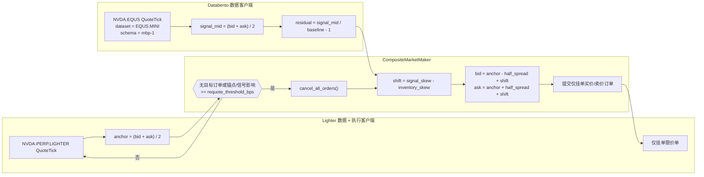
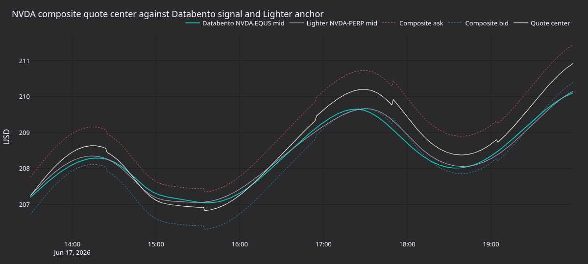
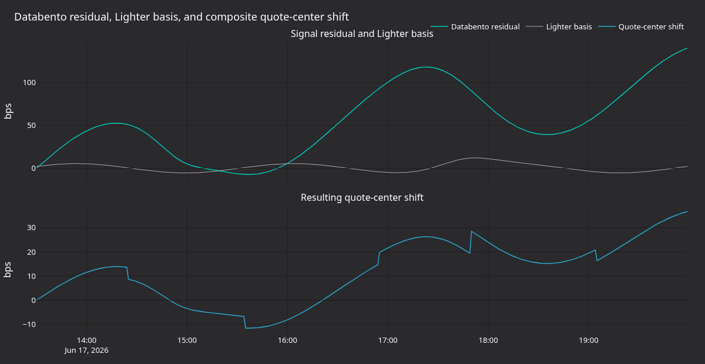
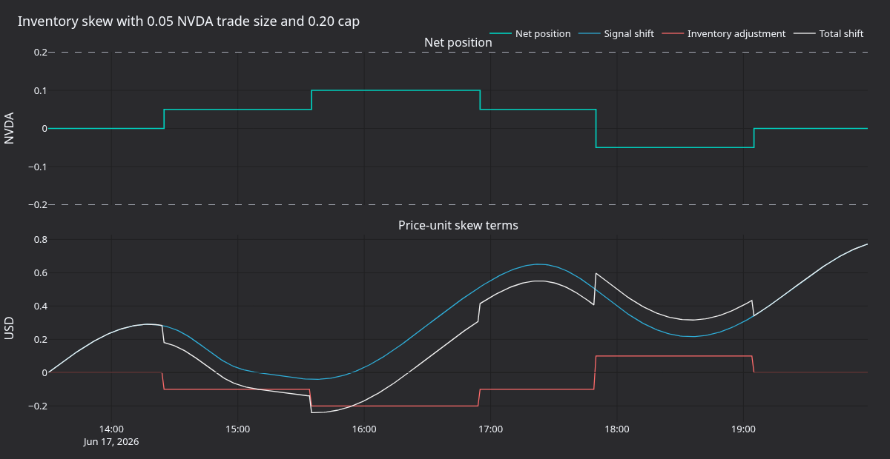
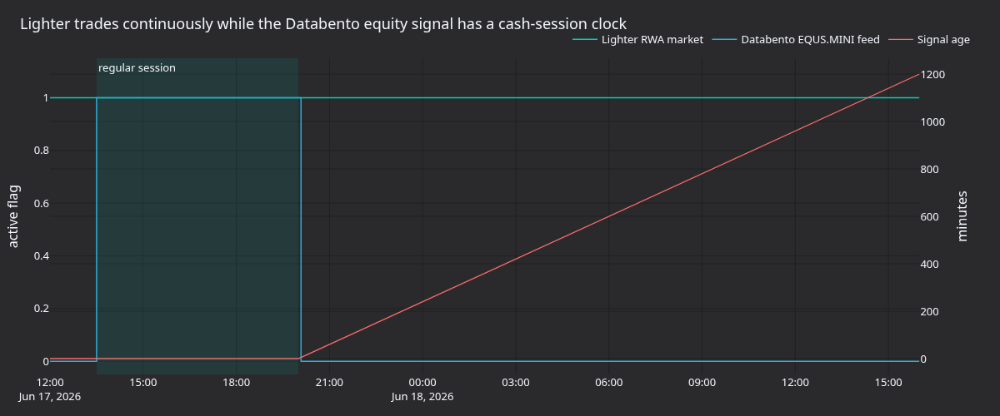

本教程在 Lighter 的 `NVDA-PERP.LIGHTER` RWA 市场上运行随附的 [`CompositeMarketMaker`][composite-market-maker] 策略，并使用 Databento `NVDA.EQUS` 报价作为外部信号。策略围绕 Lighter 中间价分别挂出一笔 post-only 买单和卖单，再根据标准化的 Databento 残差与当前 Lighter 库存同时移动两侧报价。

该配置使用 Rust [`LiveNode`][live-node]，策略本身则以原生 Rust `CompositeMarketMaker` 运行。如果您刚接触 Lighter 适配器，请先阅读 [Lighter 入门][lighter-get-started]。该指南分别介绍 Rust 和 Python 数据客户端路径，本教程在此基础上加入 Databento 信号数据与实盘订单流。

## 简介

Lighter 提供持续交易的现实世界资产（RWA）永续合约，其中包括个股市场。当前交易场所详情请参阅 Lighter 的 [RWA 文档][RWA docs] 和 [市场规范][market specifications]。Databento 的 [美国股票][Databento US Equities] 数据集提供 `NVDA` 的美国股票订单簿顶部数据，Vibe Databento 适配器可访问其中的 `mbp-1`。

`CompositeMarketMaker` 是一个小型双输入做市商：

- **目标金融工具**是需要报价的 Lighter 市场：`NVDA-PERP.LIGHTER`。
- **信号金融工具**是 Databento 参考数据源：`NVDA.EQUS`。
- **锚点**是 Lighter 中间价。
- **信号残差**为`(databento_mid / baseline) - 1.0`。
- **报价移位**是`signal_skew_factor * residual - inventory_skew_factor * net_position`。

如果未配置基线，策略会把首次观察到的 `NVDA.EQUS` 中间价作为参考价格。残差从零开始，衡量 NVDA 相对第一个信号中间价的变化，而不是 Lighter 与 Databento 之间的基差。若需要确定性运行，可在示例源码中设置 `SIGNAL_BASELINE` 常量以固定参考价格。

在该配置中，Lighter BBO 仍是价差锚点。Databento 通过标准化残差使报价中心上移或下移。



教程重点在于适配器接线：同一个引擎同时消费直接的美国股票数据源和加密原生 RWA 交易场所数据，而订单生命周期、库存与报价状态都保留在同一个事件驱动运行时中。

## 先决条件

- Rust 工具链（MSRV 1.97.1 或更高版本）。
- 一个将 Vibe、Lighter 和 Databento crate 作为依赖的 Cargo 项目（参见[项目设置](#项目设置)）。
- Python 3.12+，用于重新生成图表。
- 一个可实盘访问 Databento US Equities Mini（`EQUS.MINI`）的 Databento API 密钥；这是随附 `NVDA.EQUS` 路由的默认数据集。`EQUS.PLUS` 等更高层级需要单独的 Databento 许可证；账户获得相应权限后，可通过 `venue_dataset_map` 选择。
- 已配置环境所需的 Lighter API 凭据（数字账户索引、API 密钥索引和 API secret；默认环境为测试网），只在连接和提交订单时需要。
- Lighter 集成指南：[Lighter](../integrations/lighter.md)。
- Databento 集成指南：[Databento](../integrations/databento.md)。

该示例从环境变量中读取凭据，并将策略参数保留为可编辑的 Rust 常量。默认为`LighterEnvironment::Testnet`，因此设置测试网 Lighter 凭据：

```bash
export DATABENTO_API_KEY="your-databento-api-key"
export LIGHTER_TESTNET_ACCOUNT_INDEX="123456"
export LIGHTER_TESTNET_API_KEY_INDEX="0"
export LIGHTER_TESTNET_API_SECRET="your-lighter-api-secret"
```

使用主网时，请将源码中的 `LIGHTER_ENVIRONMENT` 改为 `LighterEnvironment::Mainnet`，并使用集成指南所述的主网 `LIGHTER_*` 凭据变量。运行示例前还需设置 `DATABENTO_API_KEY`。

## 项目设置

策略、节点和适配器均以 crate 形式提供，因此可以在自己的 Cargo 项目中添加这些依赖，无需在 VibeTrader checkout 内工作。将以下内容加入 `Cargo.toml`，并让每个 Vibe 依赖都指向同一个 `develop` git 源，使各 crate 解析为一致版本：

```toml
[dependencies]
vibe-common = { git = "https://github.com/qOeOp/trade.git", branch = "main", features = ["live"] }
vibe-core = { git = "https://github.com/qOeOp/trade.git", branch = "main" }
vibe-databento = { git = "https://github.com/qOeOp/trade.git", branch = "main", features = ["high-precision", "live"] }
vibe-lighter = { git = "https://github.com/qOeOp/trade.git", branch = "main", features = ["examples", "high-precision"] }
vibe-live = { git = "https://github.com/qOeOp/trade.git", branch = "main", features = ["node"] }
vibe-model = { git = "https://github.com/qOeOp/trade.git", branch = "main", features = ["high-precision"] }
vibe-trading = { git = "https://github.com/qOeOp/trade.git", branch = "main", features = ["examples", "high-precision"] }

tokio = { version = "1", features = ["full"] }
```

`vibe-trading` 的 `examples` feature 会公开 `CompositeMarketMaker` 策略，Lighter 的加密原生定价则需要 `high-precision`。通用 crate 布局和 feature flag 说明请参阅 Rust [项目设置指南][project-setup]。

Databento 客户端还需要一份将交易场所映射到数据集的 publishers 文件。请从 Databento 适配器 crate 下载 [`publishers.json`][databento-publishers]，并让 `publishers_filepath` 指向本地副本。随附示例会解析 checkout 中的同一文件，因此此步骤只适用于您自己的项目。

## 为什么选择 NVDA

`NVDA` 是流动性较好的 Nasdaq 上市个股，Lighter 将其 RWA 永续合约映射为 `NVDA-PERP.LIGHTER`。这样便能将获得许可的 Databento 信号与 Lighter 交易市场配对：

| 角色         | 金融工具 ID         | 来源      | 说明                               |
| ------------ | ------------------- | --------- | ---------------------------------- |
| 信号金融工具 | `NVDA.EQUS`         | Databento | EQUS.MINI 订单簿顶部报价更新。     |
| 目标金融工具 | `NVDA-PERP.LIGHTER` | Lighter   | 通过 Lighter 交易的 RWA 永续合约。 |

默认情况下，订阅 `NVDA.EQUS` 会从 Databento 的 `EQUS.MINI` 数据集请求 `NVDA` 订单簿顶部（`mbp-1`）报价，并以单一 `QuoteTick` 流交付。`EQUS.MINI` 是成本最低的美国股票整合数据层；`EQUS.PLUS` 等信息更丰富的层级需要单独的 Databento 许可证。账户获得权限后，可通过客户端的 `venue_dataset_map`（例如 `{"EQUS": "EQUS.PLUS"}`）选择。适配器通过 publishers 文件解析 `EQUS` 交易场所：示例让 `DatabentoLiveClientConfig` 指向 Databento 适配器随附的 `publishers.json`。映射规则请参阅[金融工具 ID 与符号体系][databento-symbology]。

部分保留旧套餐的账户和历史示例仍使用 Databento Equities Basic（`DBEQ.BASIC`）数据集名称。新的 Databento 订阅采用 Databento US Equities 产品线，因此本教程使用整合后的 `EQUS` 交易场所。这里的订单簿顶部数据源是用于演示接线、且受许可约束的信号代理，并非完整深度的 Nasdaq TotalView 订单簿。

示例以 `trade_size=0.05` 起步，该值与教程验证期间观察到的 Lighter NVDA 最小基础资产数量一致。增大数量或更换金融工具前，请检查[市场详情端点][market details endpoint]。

## 会话约束

Lighter RWA 市场全天连续交易，而 `NVDA.EQUS` 遵循美国股票市场数据时段。首次实盘测试应安排在常规现金市场时段（美国夏令时为 13:30-20:00 UTC），并单独处理节假日和半日市。

`CompositeMarketMaker` 不内置交易时段门控或信号时效保护。生产使用时，应添加 Actor 或策略变体，在 Databento 信号过期时撤销报价。教程示例明确保留这一限制，没有将其隐藏在自定义策略里。

## 示例节点

有两种运行方式：在 VibeTrader checkout 中运行随附的 [Lighter NVDA 组合做市示例][example-script]二进制文件，或将下方节点接线复制到自己项目的 `main` 中，并依赖[项目设置](#项目设置)所列 crate。Python 对应示例位于 [`examples/live/lighter/nvda_composite_mm.py`][python-example-script]，它通过 PyO3 使用同一个 Rust 策略。

在 checkout 中设置凭据变量后，随附二进制文件会连接数据客户端与执行客户端。默认配置为 `DRY_RUN = true`，因此只启动客户端，不添加会提交订单的策略：

```bash
cargo run --bin lighter-nvda-composite-mm --package vibe-tutorials --features examples
```

Databento 是没有固定交易场所路由的多交易场所数据客户端，因此引擎将其作为 `NVDA.EQUS` 的默认路由。Lighter 则注册到 `LIGHTER` 交易场所路由，并接收 `NVDA-PERP.LIGHTER` 订阅。

配置核心是由三个客户端组成的节点，以及 `CompositeMarketMaker`：

```rust
let lighter_environment = LIGHTER_ENVIRONMENT;
let trader_id = TraderId::from(TRADER_ID);
let account_id = AccountId::from(ACCOUNT_ID);
let instrument_id = InstrumentId::from(INSTRUMENT_ID);
let signal_instrument_id = InstrumentId::from(SIGNAL_INSTRUMENT_ID);

let databento_api_key = get_env_var("DATABENTO_API_KEY")?;
let databento_config =
    DatabentoLiveClientConfig::new(databento_api_key, publishers_filepath, true, true);
let lighter_data_config = LighterDataClientConfig::builder()
    .environment(lighter_environment)
    .build();
let lighter_exec_config = LighterExecClientConfig::builder()
    .trader_id(trader_id)
    .account_id(account_id)
    .environment(lighter_environment)
    .build();

let mut strategy_config = CompositeMarketMakerConfig::builder()
    .instrument_id(instrument_id)
    .signal_instrument_id(signal_instrument_id)
    .max_position(max_position)
    .trade_size(trade_size)
    .half_spread_bps(HALF_SPREAD_BPS)
    .inventory_skew_factor(INVENTORY_SKEW_FACTOR)
    .signal_skew_factor(SIGNAL_SKEW_FACTOR)
    .requote_threshold_bps(REQUOTE_THRESHOLD_BPS)
    .on_cancel_resubmit(ON_CANCEL_RESUBMIT)
    .build();
strategy_config.base.strategy_id = Some(StrategyId::from("NVDA_COMPOSITE_MM-001"));
strategy_config.base.order_id_tag = Some("001".to_string());

let mut node = LiveNode::builder(trader_id, Environment::Live)?
    .with_name("LIGHTER-NVDA-COMPOSITE-MM-001".to_string())
    .with_reconciliation(!DRY_RUN)
    .add_data_client(
        None,
        Box::new(DatabentoDataClientFactory::new()),
        Box::new(databento_config),
    )?
    .add_data_client(
        None,
        Box::new(LighterDataClientFactory::new()),
        Box::new(lighter_data_config),
    )?
    .add_exec_client(
        None,
        Box::new(LighterExecutionClientFactory::new()),
        Box::new(lighter_exec_config),
    )?
    .build()?;

if !DRY_RUN {
    node.add_strategy(CompositeMarketMaker::new(strategy_config))?;
}
```

要允许订单提交，请编辑示例源顶部附近的常量：

```rust
const DRY_RUN: bool = false;
```

然后运行相同的命令：

```bash
cargo run --bin lighter-nvda-composite-mm --package vibe-tutorials --features examples
```

:::warning
当 `DRY_RUN` 为 `false` 时，该命令可能提交实盘订单。请从有资金的测试账户或能够承受损失的主网账户开始，并使用可接受的最小数量。修改前请确认当前金融工具 ID、账户 ID、数字账户索引和 Lighter 凭据。
:::

进行测试网冒烟运行时，请保持 `LIGHTER_ENVIRONMENT` 为 `LighterEnvironment::Testnet`，并使用 `LIGHTER_TESTNET_*` 凭据变量。即使运行时间不在 Databento 美国股票现金市场时段内，仍可验证节点启动、路由、Lighter 数据和订单生命周期。首条 `NVDA.EQUS` 报价到达前，Databento 残差保持为零。

## 策略参数

| 参数                    | 值                  | 说明                                     |
| ----------------------- | ------------------- | ---------------------------------------- |
| `instrument_id`         | `NVDA-PERP.LIGHTER` | 需要报价的 Lighter RWA 永续合约。        |
| `signal_instrument_id`  | `NVDA.EQUS`         | Databento US Equities Mini 信号数据源。  |
| `trade_size`            | `0.05`              | 每笔买单或卖单的数量。                   |
| `max_position`          | `0.20`              | Lighter 净敞口的硬上限。                 |
| `half_spread_bps`       | `25`                | 围绕 Lighter 锚点的半价差。              |
| `inventory_skew_factor` | `2.0`               | 每单位净头寸的价格单位。                 |
| `signal_skew_factor`    | `55.0`              | 标准化 Databento 残差的每单位价格单位。  |
| `signal_baseline`       | 首个信号中间价      | Databento 残差的可选参考价格。           |
| `requote_threshold_bps` | `5`                 | 触发撤单和重新报价的锚点或信号影响变动。 |

当 Lighter 中间价为 `207.00`、`half_spread_bps=25` 时，未偏斜半价差为 `0.5175` USD。如果 Databento 比基线高 30 bps，`signal_skew_factor` 为 `55.0` 会在考虑库存偏斜前把两侧同时上移 `0.165` USD。持有 `0.05` 多头且 `inventory_skew_factor=2.0` 时，两侧会同时下移 `0.10` USD。

## 重新报价行为

信号 tick 会更新内部状态，但不会自行提交订单。首条 Databento 报价到达前，残差为零。下一条 Lighter 报价 tick 会读取最新信号残差并检查报价状态。满足以下任一条件时启动报价周期：

- 没有活动或处理中的目标订单；
- Lighter 锚点至少移动 `requote_threshold_bps`；或
- 信号残差变化产生的价格影响越过同一阈值。

随后，策略取消活动订单，从缓存读取当前净持仓和待定敞口，计算一笔买价和一笔卖价，舍弃会突破 `max_position` 的一侧，并将剩余订单以 post-only 限价方式提交。

## 面板

下图使用确定性重放数据，展示报价机制和现金市场时段约束，并非实际采集的 Lighter 实盘成交轨迹。



**图 1.** *Databento `NVDA.EQUS` 中间价、Lighter `NVDA-PERP.LIGHTER` 中间价、组合买价、组合卖价和报价中心。*



**图 2.** *Databento 残差、Lighter 基差和报价中心偏移，单位为 bps。*



**图 3.** *交易数量为 `0.05` NVDA、持仓上限为 `0.20` NVDA 时的净持仓、信号偏移、库存调整和总偏移。*



**图 4.** *将 Lighter 连续 RWA 市场时钟与 Databento US Equities 现金市场信号时段对照，并展示常规交易时段结束后的信号时效。*

## 重新生成面板

```bash
uv sync --extra visualization
python3 docs/tutorials/assets/lighter_rwa_composite_mm/render_panels.py
```

渲染器会向 `docs/tutorials/assets/lighter_rwa_composite_mm/` 写入四个 PNG。它使用 `vibe_dark` Plotly 主题和确定性重放数据，因此文档构建不依赖供应商数据许可证或实盘交易所访问。

## 扩展

下一项实用改进是信号时效门控。例如，在现金市场时段内，如果最新 `NVDA.EQUS` 报价已超过 30 秒，或现金市场刚刚收盘，就取消所有 Lighter 订单。这样可将 Databento 信号明确建模为运行依赖，而非隐含依赖。

若要构建纯公允价值策略，可复用本教程的客户端接线，编写一个小型变体：直接以 Databento 中间价作为买卖报价锚点，再只用 Lighter BBO 检查 post-only 与基差限制。

[composite-market-maker]: https://github.com/qOeOp/trade/blob/main/crates/trading/src/examples/strategies/composite_market_maker/strategy.rs
[live-node]: ../how_to/run_rust_live_trading.md
[project-setup]: ../concepts/rust.md#project-setup
[lighter-get-started]: ../how_to/get_started_lighter.md
[databento-symbology]: ../integrations/databento.md#instrument-ids-and-symbology
[databento-publishers]: https://github.com/qOeOp/trade/blob/main/crates/adapters/databento/publishers.json
[RWA docs]: https://docs.lighter.xyz/trading/real-world-assets-rwas
[market specifications]: https://docs.lighter.xyz/trading/real-world-assets-rwas/market-specifications
[market details endpoint]: https://mainnet.zklighter.elliot.ai/api/v1/orderBookDetails
[Databento US Equities]: https://databento.com/blog/introducing-databento-us-equities
[example-script]: https://github.com/qOeOp/trade/blob/main/examples/tutorials/src/bin/lighter_nvda_composite_mm.rs
[python-example-script]: https://github.com/qOeOp/trade/blob/main/examples/live/lighter/nvda_composite_mm.py
