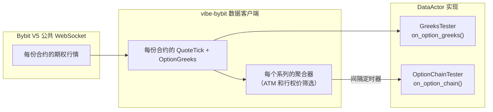
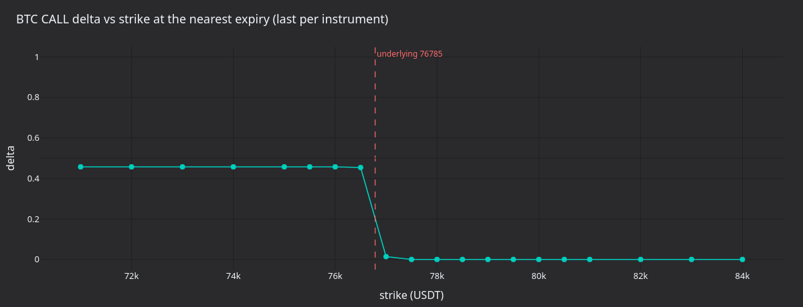
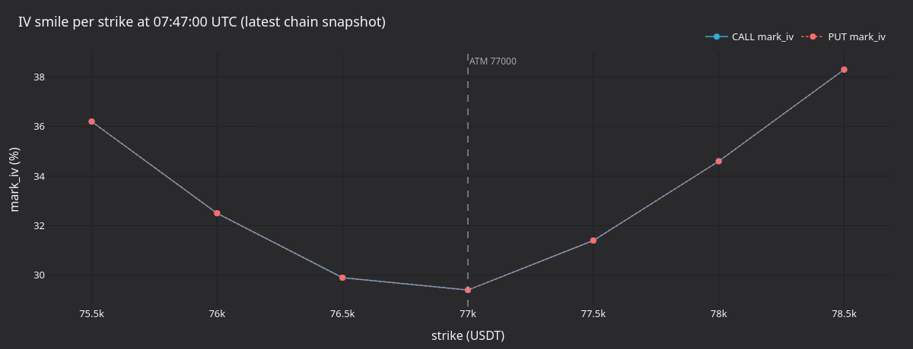
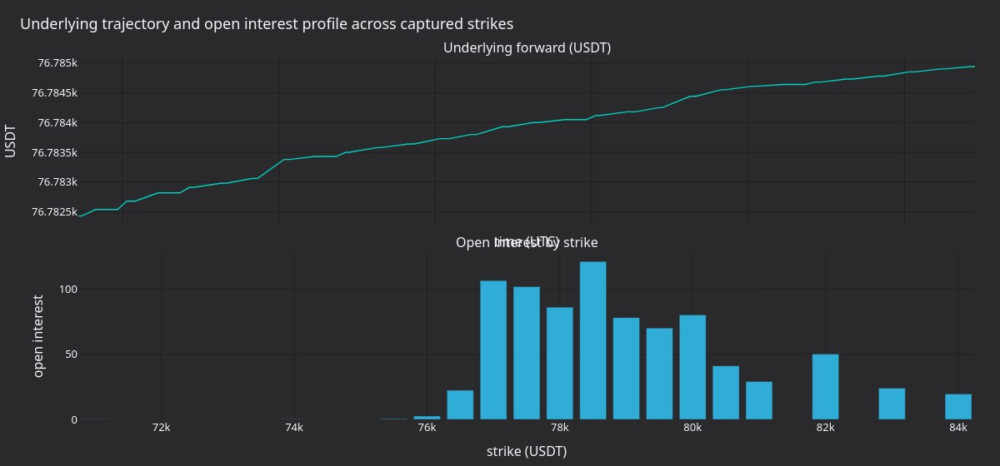
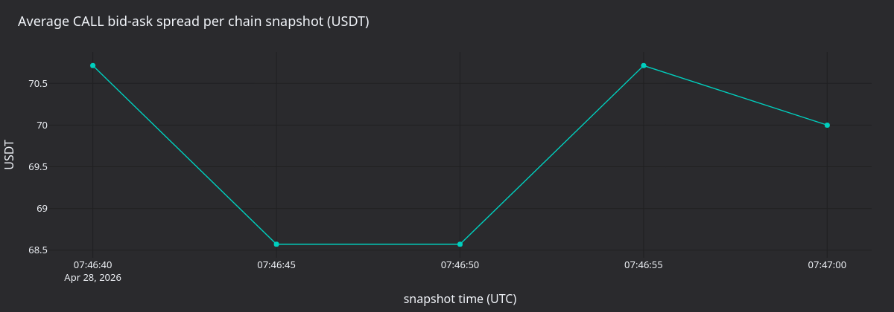

:::note
这是一个**仅使用 Rust**的系统教程。它通过 Rust `LiveNode` 和 Bybit 适配器流式接收实时期权 Greeks 与聚合期权链快照。
:::

本教程连接 Bybit 实时期权市场，并通过两个 `DataActor` 示例消费 Greeks 与期权链数据。内容包括金融工具发现、订阅交易场所提供的 Greeks，以及按 ATM 相对范围筛选行权价的周期性期权链快照。

## 简介

Bybit 在每次期权 ticker 更新中同时发布 Greeks（delta、gamma、vega、theta）和隐含波动率。VibeTrader 在两个层级公开这些数据：

- **单金融工具 Greeks**：订阅一份期权合约，并在每次 ticker 更新时接收 `OptionGreeks` 事件。
- **期权链快照**：订阅整个到期系列，周期性接收 `OptionChainSlice` 事件；该事件聚合全部活跃行权价的报价与 Greeks。

这两种模式分别由两个示例二进制文件演示：第一个订阅各金融工具的 Greeks 流，第二个订阅带 ATM 相对行权价筛选的聚合期权链。



## 先决条件

- 可用的 Rust 工具链（[rustup.rs](https://rustup.rs)）。
- 已克隆并能成功构建的 VibeTrader 仓库。
- 一个具有读取权限的 Bybit API 密钥。仅数据使用不需要交易许可。在[bybit.com](https://www.bybit.com/app/user/api-management)创建密钥。
- 为身份验证设置的环境变量：

```bash
export BYBIT_API_KEY="your-api-key"
export BYBIT_API_SECRET="your-api-secret"
```

也可使用仓库根目录中的 `.env` 文件，示例会通过 `dotenvy` 加载。

:::warning
Bybit demo 交易只对私有数据流使用 `stream-demo.bybit.com`。公开期权市场数据使用主网公开流 `wss://stream.bybit.com/v5/public/option`。
:::

## DataActor 模式

Rust `DataActor` 需要三个部分：

1. 一个带 `core: DataActorCore` 字段和自定义状态的结构体。
2. `vibe_actor!(YourType)` 宏以及 `Debug` 实现。
3. 实现 `DataActor` trait 及其回调。

该宏提供 blanket `Actor` 与 `Component` 实现所需的原生运行时接线，因此只需实现所需回调。每个回调都有默认的空操作实现。

## 第 1 部分：单金融工具 Greeks

`bybit-greeks-tester` 示例订阅最近到期日全部 BTC CALL 期权的 `OptionGreeks`，并记录每次更新。

### Actor 结构

```rust
#[derive(Debug)]
struct GreeksTester {
    core: DataActorCore,
    client_id: ClientId,
    subscribed_instruments: Vec<InstrumentId>,
}

vibe_actor!(GreeksTester);

impl GreeksTester {
    fn new(client_id: ClientId) -> Self {
        Self {
            core: DataActorCore::new(DataActorConfig {
                actor_id: Some("GREEKS_TESTER-001".into()),
                ..Default::default()
            }),
            client_id,
            subscribed_instruments: Vec::new(),
        }
    }
}
```

宏要求存在 `core` 字段。`client_id` 标识订阅应路由到哪个数据客户端。`subscribed_instruments` 向量记录已订阅对象，便于停止时清理。

### 发现金融工具

启动时，Actor 查询缓存中的所有期权金融工具，筛选尚未到期的 BTC CALL，并找出最近到期日：

```rust
fn on_start(&mut self) -> anyhow::Result<()> {
    let venue = Venue::new("BYBIT");
    let underlying_filter = Ustr::from("BTC");

    let mut options: Vec<(InstrumentId, f64, u64)> = {
        let cache = self.cache();
        let instruments = cache.instruments(&venue, Some(&underlying_filter));

        instruments
            .iter()
            .filter_map(|inst| {
                if inst.option_kind() == Some(OptionKind::Call) {
                    let expiry = inst.expiration_ns()?.as_u64();
                    let strike = inst.strike_price()?.as_f64();
                    Some((inst.id(), strike, expiry))
                } else {
                    None
                }
            })
            .collect()
    }; // cache borrow dropped here

    let now_ns = self.timestamp_ns().as_u64();
    options.retain(|(_, _, exp)| *exp > now_ns);

    let nearest_expiry = options.iter().map(|(_, _, exp)| *exp).min().unwrap();
    options.retain(|(_, _, exp)| *exp == nearest_expiry);
    options.sort_by(|(_, a, _), (_, b, _)| a.partial_cmp(b).unwrap());

    // ...subscribe to each
}
```

:::warning
调用任何订阅方法前必须释放缓存借用。缓存内部使用 `Rc<RefCell<...>>`，而订阅方法可能也需要借用缓存。先将拥有所有权的数据收集到本地 `Vec`，释放缓存引用，再执行订阅。
:::

### 订阅 Greeks

发现金融工具后，逐一订阅：

```rust
let client_id = self.client_id;
for (instrument_id, _, _) in &options {
    self.subscribe_option_greeks(*instrument_id, Some(client_id), None);
    self.subscribed_instruments.push(*instrument_id);
}
```

### 处理更新

Bybit 每次 ticker 更新都会携带 `OptionGreeks` 事件并触发 `on_option_greeks`：

```rust
fn on_option_greeks(&mut self, greeks: &OptionGreeks) -> anyhow::Result<()> {
    log::info!(
        "GREEKS | {} | delta={:.4} gamma={:.6} vega={:.4} theta={:.4} rho={:.6} | \
         mark_iv={} bid_iv={} ask_iv={} | underlying={} oi={}",
        greeks.instrument_id,
        greeks.delta,
        greeks.gamma,
        greeks.vega,
        greeks.theta,
        greeks.rho,
        greeks.mark_iv.map_or("-".to_string(), |v| format!("{v:.2}")),
        greeks.bid_iv.map_or("-".to_string(), |v| format!("{v:.2}")),
        greeks.ask_iv.map_or("-".to_string(), |v| format!("{v:.2}")),
        greeks.underlying_price.map_or("-".to_string(), |v| format!("{v:.2}")),
        greeks.open_interest.map_or("-".to_string(), |v| format!("{v:.1}")),
    );
    Ok(())
}
```

`OptionGreeks` 字段如下：

| 字段               | 类型           | 说明                           |
| ------------------ | -------------- | ------------------------------ |
| `instrument_id`    | `InstrumentId` | 期权合约。                     |
| `delta`            | `f64`          | 价格对标的资产的敏感性。       |
| `gamma`            | `f64`          | Delta 对标的资产价格的敏感度。 |
| `vega`             | `f64`          | 价格对 1% 波动率变化的敏感性。 |
| `theta`            | `f64`          | 每日时间衰减。                 |
| `rho`              | `f64`          | 对利率变化的敏感性。           |
| `mark_iv`          | `Option<f64>`  | 标记价格隐含波动率。           |
| `bid_iv`           | `Option<f64>`  | 买价隐含波动率。               |
| `ask_iv`           | `Option<f64>`  | 卖价隐含波动率。               |
| `underlying_price` | `Option<f64>`  | 本次到期的当前标的远期价格。   |
| `open_interest`    | `Option<f64>`  | 该合约的未平仓量。             |

`delta`、`gamma`、`vega`、`theta` 和 `rho` 位于嵌套的 `greeks: OptionGreekValues` 结构体中。`OptionGreeks` 实现了 `Deref<Target = OptionGreekValues>`，因此可像上例一样直接访问 `greeks.delta` 等字段。

Bybit 不提供 rho；适配器将其设为 `0.0`。

### 清理

停止时，退订所有金融工具：

```rust
fn on_stop(&mut self) -> anyhow::Result<()> {
    let ids: Vec<InstrumentId> = self.subscribed_instruments.drain(..).collect();
    let client_id = self.client_id;
    for instrument_id in ids {
        self.unsubscribe_option_greeks(instrument_id, Some(client_id), None);
    }
    log::info!("Unsubscribed from all option greeks");
    Ok(())
}
```

## 第 2 部分：期权链快照

`bybit-option-chain` 示例订阅聚合期权链并记录周期性快照，展示每个行权价的看涨、看跌期权及其报价与 Greeks。

### 为什么使用期权链

单金融工具订阅提供精细控制，但监控整个波动率曲面需要管理多条数据流，并关联不同行权价的更新。期权链订阅可代为处理：`DataEngine` 聚合一个系列所有行权价的报价与 Greeks，并按定时器发布单个 `OptionChainSlice`。

聚合在 VibeTrader 内部完成。Bybit 发布逐合约的期权市场数据，其 V5 公共 WebSocket 文档并未提供原生期权链数据流。

### 关键类型

**`OptionSeriesId`** 标识单个到期系列：

```rust
let series_id = OptionSeriesId::new(
    Venue::new("BYBIT"),    // venue
    Ustr::from("BTC"),      // underlying
    Ustr::from("USDT"),     // settlement currency
    UnixNanos::from(expiry), // expiration timestamp
);
```

**`StrikeRange`** 控制哪些行权价处于活跃状态：

| 变体          | 说明                                                               |
| ------------- | ------------------------------------------------------------------ |
| `Fixed`       | 一组固定的行权价。                                                 |
| `AtmRelative` | ATM 上方 `strikes_above` 个行权价及下方 `strikes_below` 个行权价。 |
| `AtmPercent`  | 与 ATM 价格的距离在 `pct` 范围内的所有行权价。                     |

对于基于 ATM 的变体，订阅会延后到根据交易场所提供的远期价格确定 ATM 价格之后。

### 订阅

```rust
let strike_range = StrikeRange::AtmRelative {
    strikes_above: 3,
    strikes_below: 3,
};

let snapshot_interval_ms = Some(5_000); // snapshot every 5 seconds

self.subscribe_option_chain(
    series_id,
    strike_range,
    snapshot_interval_ms,
    Some(client_id),
    None, // params
);
```

向 `snapshot_interval_ms` 传入 `None` 可启用原始模式，此时每次报价或 Greeks 更新都会立即发布一个切片。

### 处理快照

`on_option_chain` 回调接收一个 `OptionChainSlice`，其中包含所有活跃行权价的看涨与看跌期权数据：

```rust
fn on_option_chain(&mut self, slice: &OptionChainSlice) -> anyhow::Result<()> {
    log::info!(
        "OPTION_CHAIN | {} | atm={} | calls={} puts={} | strikes={}",
        slice.series_id,
        slice.atm_strike.map_or("-".to_string(), |p| format!("{p}")),
        slice.call_count(),
        slice.put_count(),
        slice.strike_count(),
    );

    for strike in slice.strikes() {
        let call_info = slice.get_call(&strike).map(|d| {
            let greeks_str = d.greeks.as_ref().map_or("-".to_string(), |g| {
                format!(
                    "d={:.3} g={:.5} v={:.2} iv={:.1}%",
                    g.delta, g.gamma, g.vega,
                    g.mark_iv.unwrap_or(0.0) * 100.0,
                )
            });
            format!("bid={} ask={} [{}]", d.quote.bid_price, d.quote.ask_price, greeks_str)
        });

        let put_info = slice.get_put(&strike).map(|d| {
            let greeks_str = d.greeks.as_ref().map_or("-".to_string(), |g| {
                format!(
                    "d={:.3} g={:.5} v={:.2} iv={:.1}%",
                    g.delta, g.gamma, g.vega,
                    g.mark_iv.unwrap_or(0.0) * 100.0,
                )
            });
            format!("bid={} ask={} [{}]", d.quote.bid_price, d.quote.ask_price, greeks_str)
        });

        log::info!(
            "  K={} | CALL: {} | PUT: {}",
            strike,
            call_info.unwrap_or_else(|| "-".to_string()),
            put_info.unwrap_or_else(|| "-".to_string()),
        );
    }

    Ok(())
}
```

`OptionChainSlice` 的字段和方法如下：

| 名称             | 类型/返回值                 | 说明                                 |
| ---------------- | --------------------------- | ------------------------------------ |
| `series_id`      | `OptionSeriesId`            | 本快照涵盖的系列。                   |
| `atm_strike`     | `Option<Price>`             | ATM 远期价格行权价。                 |
| `call_count()`   | `usize`                     | 有数据的看涨期权行权价数量。         |
| `put_count()`    | `usize`                     | 有数据的看跌期权行权价数量。         |
| `strike_count()` | `usize`                     | 所有行权价的并集数量。               |
| `strikes()`      | `Vec<Price>`                | 所有行权价的排序列表。               |
| `get_call(k)`    | `Option<&OptionStrikeData>` | 行权价 `k` 的看涨期权报价与 Greeks。 |
| `get_put(k)`     | `Option<&OptionStrikeData>` | 行权价 `k` 的看跌期权报价与 Greeks。 |

每个 `OptionStrikeData` 包含 `quote: QuoteTick`（买价/卖价）以及可选的 `greeks: Option<OptionGreeks>`。

## 节点设置

两个示例使用相同的 `LiveNode` 模式。只消费数据时无需执行客户端：

```rust
#[tokio::main]
async fn main() -> Result<(), Box<dyn std::error::Error>> {
    dotenvy::dotenv().ok();

    let environment = Environment::Live;
    let trader_id = TraderId::test_default();
    let client_id = ClientId::new("BYBIT");

    let bybit_config = BybitDataClientConfig {
        api_key: None,    // loaded from BYBIT_API_KEY env var
        api_secret: None, // loaded from BYBIT_API_SECRET env var
        product_types: vec![BybitProductType::Option],
        ..Default::default()
    };

    let client_factory = BybitDataClientFactory::new();

    let mut node = LiveNode::builder(trader_id, environment)?
        .with_name("BYBIT-OPTIONS-001".to_string())
        .add_data_client(None, Box::new(client_factory), Box::new(bybit_config))?
        .with_delay_post_stop_secs(5)
        .build()?;

    let actor = GreeksTester::new(client_id); // or OptionChainTester
    node.add_actor(actor)?;
    node.run().await?;

    Ok(())
}
```

将 `product_types` 设为 `[BybitProductType::Option]` 后，只加载期权金融工具。金融工具提供器获取并解析所有已上市期权期间，启动过程会阻塞等待。

## 运行示例

```bash
# Per-instrument Greeks
cargo run --example bybit-greeks-tester --package vibe-bybit --features examples

# Option chain snapshots
cargo run --example bybit-option-chain --package vibe-bybit --features examples
```

按 Ctrl+C 可停止任一示例。Actor 的 `on_stop` 回调会在关闭前退订所有数据流。

## 示例产生什么

在 4 月 28 日进行 30 秒主网运行时（BTC 约为 76,800 USDT，到期时间为 2026-04-28 08:00 UTC），单金融工具测试器捕获了 22 份 BTC CALL 合约的 **938 次 Greeks 更新**；期权链测试器则捕获了 **5 份链快照**，每份覆盖七个行权价。

### 单金融工具 Greeks 输出

```
Found 22 BTC CALL options at nearest expiry (ts=1777359600000000000)
Subscribed to option greeks for 22 instruments
GREEKS | BTC-28APR26-72000-C-USDT-OPTION.BYBIT | delta=0.4733 gamma=0.000000 vega=0.0000 theta=-0.0000 rho=0.000000 | mark_iv=0.66 bid_iv=0.00 ask_iv=5.00 | underlying=76782.43 oi=0.0
GREEKS | BTC-28APR26-71000-C-USDT-OPTION.BYBIT | delta=0.4733 gamma=0.000000 vega=0.0000 theta=-0.0000 rho=0.000000 | mark_iv=0.74 bid_iv=0.00 ask_iv=5.00 | underlying=76782.43 oi=0.1
GREEKS | BTC-28APR26-73000-C-USDT-OPTION.BYBIT | delta=0.4733 gamma=0.000000 vega=0.0000 theta=-0.0000 rho=0.000000 | mark_iv=0.57 bid_iv=0.00 ask_iv=5.00 | underlying=76782.43 oi=0.0
```

### 期权链输出

```
OPTION_CHAIN | BYBIT:BTC:USDT:2026-04-28T08:00:00Z | atm=77000 | calls=7 puts=7 | strikes=7
  K=75500 | CALL: bid=1210 ask=1430 [d=0.445 g=0.00000 v=0.00 iv=36.2%] | PUT: bid=0 ask=5 [d=0.000 g=0.00000 v=0.00 iv=36.2%]
  K=76000 | CALL: bid=700 ask=850 [d=0.445 g=0.00000 v=0.00 iv=32.5%] | PUT: bid=0 ask=5 [d=0.000 g=0.00000 v=0.00 iv=32.5%]
  K=76500 | CALL: bid=265 ask=370 [d=0.442 g=0.00000 v=0.07 iv=29.9%] | PUT: bid=0 ask=5 [d=-0.003 g=0.00000 v=0.07 iv=29.9%]
```

### 面板



**图 1.** *最近到期日各 BTC CALL 行权价的最新 delta，并标出约 77,000 USDT 的标的资产价格。行权价低于标的资产时 delta 约为 0.45，越过标的资产后降至接近零。临近到期时，Bybit 上 gamma 接近零的合约，其 delta 会在远期价格附近压缩成阶梯状曲线。*



**图 2.** *最新期权链快照中各行权价的标记 IV（叠加 CALL 与 PUT）。微笑曲线以 77,000 USDT 的 ATM 为中心近似对称：IV 从行权价 75,500 处的 36% 降至 77,000 处的 30%，再回升至 78,500 处的 38%。*



**图 3.** *每次 Greeks 更新报告的标的远期价格（上图），以及最新更新时按行权价统计的未平仓量（下图）。OI 集中在 70,000-76,000 USDT 区间，即平值到略微价外的行权价。*



**图 4.** *每份期权链快照中 CALL 的平均买卖价差，单位为 USDT。快照每五秒到达一次（`snapshot_interval_ms=5000`）。*

### 重新生成面板

```bash
timeout 30 ./target/release/examples/bybit-greeks-tester > /tmp/bybit_greeks.log 2>&1
timeout 30 ./target/release/examples/bybit-option-chain > /tmp/bybit_chain.log 2>&1

uv sync --extra visualization
GREEKS_LOG=/tmp/bybit_greeks.log CHAIN_LOG=/tmp/bybit_chain.log \
    python3 docs/tutorials/assets/options_data_bybit/render_panels.py
```

## 完整源码

- [`crates/adapters/bybit/examples/node_greeks.rs`](https://github.com/qOeOp/trade/tree/main/crates/adapters/bybit/examples/node_greeks.rs)
- [`crates/adapters/bybit/examples/node_option_chain.rs`](https://github.com/qOeOp/trade/tree/main/crates/adapters/bybit/examples/node_option_chain.rs)

## 后续步骤

- **组合两种模式**。在同一个 Actor 中，对近 ATM 合约使用单金融工具 Greeks，同时保留聚合期权链视图。为需要单独跟踪的合约订阅 Greeks，并订阅期权链以观察整个曲面。
- **添加报价与深度订阅**。调用 `subscribe_quotes`，接收单份期权合约的订单簿顶部 `QuoteTick` 更新；需要独立期权订单簿流时，调用 `subscribe_book_deltas`。Bybit 支持 25 档和 100 档期权深度。
- **期权执行**。[Delta 中性策略教程](delta_neutral_options_bybit.md)介绍使用永续合约对冲的空头宽跨式组合，包括通过 Bybit `order_iv` 参数按 IV 下单。

## 另请参阅

- [期权](../concepts/options.md)：期权金融工具类型、Greeks 数据类型和期权链架构。
- [Bybit 集成](../integrations/bybit.md)：完整的 Bybit 适配器参考，包括期权订单参数和限制。
