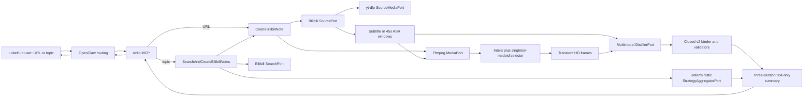

# Bilibili Video → Trading Strategy Summary MCP

<!-- markdownlint-disable MD060 -->
<!-- CJK tables are width-normalized by scripts/check-markdown-tables.py. -->

> 冻结状态：`CURRENT_POC`（standalone core + URL 直连 + 自然语言公开搜索/有界遍历）
> 消费端状态：direct URL 与 natural-language OpenResponses → OpenClaw → MCP path
> `CURRENT_POC`；LobeHub desktop 的本地 provider/模型连通与原始自然语言查询已形成 live
> receipt，但同一行百分比控件仍 `NOT_ADMITTED`；这不是 production admission。
> 设计权威：本文与同目录的 code/schema；public v3 只交付 Markdown，
> private research graph 只做请求内校验。旧的 Note + PNG、asset cache、loopback image server 与
> `bilibili-note.result/v1` 已删除，不是兼容面。
> 文档权威：本文是唯一正式设计稿，和独立服务一起位于
> `services/bilibili-note-mcp/`；仓库根目录不得保留第二份 `bilibili-note.md`。

## 1. 冻结目标

用户在 LobeHub 输入一个直接 Bilibili 视频 URL，或输入一个自然语言研究主题。OpenClaw 对 URL
调用 `bilibili_note.create`；对主题调用 `bilibili_note.search_and_create`。后者先从 Bilibili
公开搜索结果按 BV 去重；规范化作者名完全匹配，或完整身份后仅带 `官方/官方账号` 装饰，
只增加一个有界排序信号，不能把自然语言主题自动改成 creator-only 模式。其他满足完整主题
词法条件的结果仍保留；标题、作者、标签和简介的确定性相关性继续作为查询权威。默认目标 2、
最多目标 3 个成功视频，最多冻结 9 个候选并在单候选失败后继续。每个视频仍由同一个
CreateBilibiliNote authority 完整理解声音与关键画面：

- 删除问候、推广、重复、玩笑、情绪表达、观众互动和偏离主旨的内容；
- 只保留会改变交易思想、执行方法、过滤条件或风险控制的高价值内容；
- 当主播用“看这里、从这里到这里、这个位置”等语言依赖屏幕表达时，按音频时间窗抽取一段
  画面，由视觉模型比较连续帧并补足口述没有表达清楚的信息；
- 截图只存在于单次临时 workspace 与模型请求中，不进入 public schema、Markdown、MCP
  `ImageContent`、asset server 或持久化目录；
- 视频只作为 RD 流程中 Research 的假设源，不升级为事实、回测证据、信号或交易授权；
- MCP 能独立安装、测试和运行，不 import、调用或存储于 Vibe Trader/trade runtime。

一句话产品定义：

> 把“主播说了什么”和“主播当时在屏幕上指了什么”合成一份纯粹、体系化、可进入后续研究的
> text-only 交易思想与策略总结；公开结果只有“核心策略 / 具体方法 / 风险管理”。

## 2. 需求变更与删除项

本次变更不是在 v1 上增加开关，而是删除未发布 POC 的错误产品边界。

| v1 图片时代                           | v2 冻结结果                                      |
| ------------------------------------- | ------------------------------------------------ |
| 结果必须含 2–8 张 PNG                 | public image count exact `0`                     |
| `AssetManifestV1`、hash-addressed PNG | 全部删除                                         |
| Markdown 图片 gallery                 | 全部删除                                         |
| MCP `ImageContent`                    | 全部删除                                         |
| `BILIBILI_NOTE_ASSET_CACHE_DIR`       | 全部删除                                         |
| LobeHub exact-Origin asset loopback   | 全部删除                                         |
| 180 秒 ASR + 25/50/75% 均匀截图       | 45 秒 ASR + speech intent + visual medoid        |
| 对每张图逐图描述                      | 每个 singleton moment 绑定一个 `VisualInsightV2` |
| public transcript excerpts            | 全部删除；E/F/V/time/hash 只在请求内校验         |
| `bilibili-note.result/v1`             | public `bilibili-note.result/v3`                 |
| `bilibili-note.research-note/v1`      | `bilibili-note.research-brief/v2`                |

不存在 text/image 双模式、兼容 flag 或第二套 Note authority。第二个 tool 只是 SearchPort →
CreateBilibiliNote 的有界组合入口；private v2 graph 和 public projections 仍是同一解析链的
内部/外部边界，不是两种 Note 产品模式。

## 3. 范围

### 3.1 Included

- 一个 direct `www.bilibili.com/video/BV...` URL，或 2–200 字自然语言研究主题；
- anonymous Bilibili video search first page、BV 去重、exact-author rank signal + lexical ordering、默认成功目标
  2/硬上限 3、最多 9 个 fallback candidates；
- metadata、完整 media、平台字幕优先/ASR fallback；
- 完整音频覆盖和 host-owned 时间窗；
- 通用视觉指示/屏幕交互/前后变化语法、窗口内 deterministic medoid 和 coverage anchors；领域词与数字本身
  不参与选帧排序；
- 每个 source 恰好一次多模态候选生成 + 一次独立 reject-only 多模态 verifier；后者以完整
  transcript/frames 核验覆盖、蕴含、方向、条件、分类/顺序和画面支持，全部通过后 live 请求
  才能进入终态；
- text-only canonical brief、Markdown projection、MCP schema、stdio server；
- request-scoped progress、ASR window progress、视觉调用 liveness；
- synthetic fixture、unit/stdio/live 两视频验证；
- OpenClaw 注册和 LobeHub 验收契约。

### 3.2 Excluded

- 图片、音频、完整 transcript 或视频文件的 public delivery；
- OCR 数据库、向量库、长期 frame/media/cache custody；
- UP 主信誉、历史收益、事实真伪或策略有效性验证；
- backtest、参数优化、行情数据、strategy factory、order/execution/live trading；
- 推荐算法、跨页穷举、无限批处理、播放列表、登录/cookie/付费/地域限制绕过；
- trade adapter、LobeHub UI 代码、OpenClaw registry mutation；
- 第二 provider fallback、自动 repair loop 或静默降级成纯 ASR 摘要。

### 3.3 No-change harm

旧实现会把随机时间点截图当成视觉证据、把闲聊随 transcript 重新公开，并要求浏览器承担图片
转运。它无法回答“主播说看这里时屏幕上发生了什么”，同时增加 terminal 失败面和用户等待。

## 4. 分层冻结

| Layer           | 冻结内容                                          | 当前状态       | 解冻条件                                   |
| --------------- | ------------------------------------------------- | -------------- | ------------------------------------------ |
| L0 Intent       | text-only 音画 core brief                         | `FROZEN`       | 用户重新要求公开媒体                       |
| L1 Product      | URL → one summary；topic → bounded aggregation    | `FROZEN`       | 出现第二产品 owner                         |
| L2 Authority    | one Note authority + direct/composite projections | `FROZEN`       | schema 无法表达真实 consumer               |
| L3 Source       | one part、closed egress、complete transcript      | `CURRENT_POC`  | access/identity drift                      |
| L4 Alignment    | 45s windows + intent + singleton medoid + anchors | `CURRENT_POC`  | 跨 corpus 评测证明更优算法                 |
| L5 Distillation | one bounded Qwen multimodal JSON-schema call      | `CURRENT_POC`  | provider/model/profile drift               |
| L6 Result       | canonical text-only result/error union            | `CURRENT_POC`  | dangling ref/language leak                 |
| L7 MCP          | stdio two tools + semantic/liveness progress      | `CURRENT_POC`  | protocol revision incompatibility          |
| L8 Consumer     | non-text progress + normal text terminal          | `CURRENT_POC`  | cancellation/reconnect/both-corpus success |
| L9 Trade        | optional future Research adapter                  | `NOT_ADMITTED` | standalone core 独立冻结后另立任务         |

上层约束下层。L8/L9 失败不能修改 L0–L7 业务合同；只能修正各自 adapter。

## 5. Clean architecture



Ports own capability, adapters own provider details, application owns ordering/failure semantics,
domain owns the canonical graph, presentation owns Markdown/MCP projection。frame bytes never enter
domain models or public result。

### 5.1 Ownership

| Owner                    | Owns                                                   | Must not own                          |
| ------------------------ | ------------------------------------------------------ | ------------------------------------- |
| `SearchPort`             | anonymous query → ordered canonical BV candidates      | ranking invention、Note generation    |
| `SourcePort`             | source identity、media path、one transcript authority  | summary、frame selection              |
| `SourceMediaPort`        | complete HD A/V acquisition、actual media probe        | source metadata、transcript、summary  |
| `TranscriptPort`         | audio → ordered complete segments                      | visual inference、provider timestamps |
| `MediaPort`              | probe、intent ranking、decode、change score、dedupe    | brief wording、public image           |
| `DistillerPort`          | bounded semantic/visual candidate                      | source/provenance refs、public schema |
| `StrategyAggregatorPort` | exact-dedupe categorized extracted facts               | rewrite、reclassify、new facts        |
| Application              | ordering、ref mapping、validation、cleanup、progress   | provider-specific HTTP                |
| Domain                   | strict immutable v2 models and graph invariants        | subprocess/network                    |
| Renderer                 | one deterministic Markdown projection                  | rewriting meaning                     |
| MCP adapter              | tool discovery、Markdown parity、progress/result/error | business repair、asset hosting        |

## 6. Source and transcript authority

### 6.1 URL and source

- accept only direct Bilibili BV URL；short URLs and arbitrary redirect are rejected；
- metadata/search host exact `api.bilibili.com`，public DNS pinned and redirects disabled；
- after canonical BV/part validation，pinned `yt-dlp` owns Bilibili page/WBI/CDN acquisition；
- `yt-dlp` runs in one request-scoped child process with its own process group；the parent enforces one
  360-second download deadline and，on timeout or cancellation，sends TERM、waits 2 seconds、sends KILL
  if required and reaps the group before the temporary workspace can be deleted；
- the child receives only a bounded canonical request and sanitized environment，does not inherit the
  SiliconFlow key，and returns a bounded closed receipt。Media identity、duration、HD dimensions and
  digest remain parent-owned validation；
- ambient proxy disabled；only explicit unauthenticated loopback HTTP proxy is admitted；
- optional operator-authorized absolute non-symlink Cookie file is explicit，not browser-store discovery；
- metadata BV/cid/part/duration/audio/HD dimensions must match downloaded bytes；drift returns
  `SOURCE_CHANGED`；a restricted 5-minute preview for a declared 31-minute source returns
  `SOURCE_UNAVAILABLE/media_access_restricted_preview` before ASR；
- declared duration must not exceed `5_760_000 ms`（128 complete 45-second windows）；a longer source
  fails before media acquisition as `SOURCE_UNAVAILABLE/source_duration_exceeds_supported_limit`；
- ffmpeg/ffprobe network protocols disabled and only receive owner-local path。

### 6.2 Transcript

One run chooses exactly one method：`platform_subtitle` or `asr`。It never merges conflicting
authorities。

SiliconFlow ASR only owns returned text。It does not return usable word timestamps，so the host owns
segment time：

- chunk size exact `45_000 ms`；last chunk ends at source duration；
- non-overlap、contiguous、E-ID contiguous；
- max three calls concurrently；results restored to time order；
- each window has at most four bounded attempts；transport failures、5xx、429 and malformed provider
  payloads retry with `0.5/1.5/4.0s` backoff，bounded `Retry-After` is honored；non-429 4xx、empty text
  and local file errors fail closed；
- ASR response body is streamed under 256 KiB/window before JSON parse；normalized text is at most
  16 KiB/window and aggregate transcript text is at most 2 MiB UTF-8；
- all chunks must succeed；no gap/empty/partial success；
- `transcript_ref` binds normalized full transcript canonical bytes；
- public result exposes neither timestamps、digest nor transcript text。

45 seconds is an empirical POC compromise：the 30-second serial experiment produced too many network
round trips；180 seconds could not locate deictic speech。Future change requires the same frozen
cross-video corpus and latency/quality comparison。

## 7. Speech-to-screen intent and frame selection

### 7.1 Intent score

For each transcript segment：

```text
score = 6 * deictic_hits + 3 * screen_interaction_hits + 3 * visible_change_hits
```

Generic deictic cues include Chinese/English forms such as：

- 看这里、看这边、看这个、注意这里、你会看到；
- 从…到…、画一条/画出来、指这里、鼠标；
- look at this / screen / chart。

Screen-interaction and visible-change cues describe generic UI actions or before/after screen changes。
Trading、chart、code、spreadsheet vocabulary and numeric density contribute exactly zero。The reason is
hit-derived：a retained window with a deictic hit is `deictic_cue`；otherwise its interaction/change hit
is `visual_activity`。This selector heuristic never becomes evidence，never asserts actual cursor
intent，and is not domain authority。

### 7.2 Window algorithm

1. rank transcript segments by descending intent score, then start time；
2. choose up to three distinct nonzero-intent windows；
3. inside each window decode candidates at 12%、32%、50%、68%、88%；
4. downsample copies to `320×180` grayscale with frozen BICUBIC resampling only for scoring；
5. split each scoring copy into `40×30` tiles and compute the exact integer distance
   `D(a,b) = 5 * global_SAD(a,b) + 84 * max_tile_SAD(a,b)`；this is the exact integer ratio of
   the predecessor's global-mean plus `0.35 * max tile mean` formula；
6. retain exactly one medoid：minimize `sum(D(candidate, every candidate))`，breaking ties by smaller
   absolute distance to the speech-window midpoint，then earlier timestamp and probe order；
7. add source-duration 1/3 and 2/3 singleton coverage anchors；
8. apply global first-owner PNG-digest dedupe and assign contiguous G/F IDs；
9. require exactly 2..5 final frames and exactly one frame per group。Any multi-member group or count
   outside the bound fails closed before the model call。The source video must be at least 1280×720；
   decoded frames are never
   upscaled，fit landscape within 1920×1080 or portrait within 1080×1920，retain minimum side 720，
   and stay within 2,073,600 pixels；
10. cap PNG at 8 MiB/frame and 32 MiB/request，then send those bounded decoded pixels to the visual
    model；scoring thumbnails are not evidence。

The integer global term detects scene changes；the weighted tile term keeps localized annotation changes
material without floating-point/platform ordering drift。Five-probe medoid selection represents the
dominant visual state instead of binding the two sides of a scene cut as one moment。It does not claim
mouse tracking or temporal continuity。A future optical-flow or pointer detector must beat this
candidate on the frozen two-video set plus new non-trading corpus。

### 7.3 Internal-only frame custody

- frames, audio chunks and media exist only under `TemporaryDirectory`；
- frames carry host G-ID/F-ID, timestamp, bounded dimensions, digest, transcript refs and selection reason in
  application memory；
- model output never authors G/F/E/V identity or frame membership；application binds each positional
  disposition to the complete host-owned group and derives its E/V refs；
- private `VisualInsightV2` contains only timestamps、transcript refs and selection metadata—not a
  second free-text visual fact，pixels、path、URL、base64 or digest；
- workspace is destroyed before `BundlePayload` returns；there is no cache/publisher port。

## 8. Multimodal distillation contract

### 8.1 Input

One request to exact model `Qwen/Qwen3.5-27B` contains：

- untrusted source title；
- full ordered host-timed transcript；
- host visual-group catalog with G-ID/F-ID/timestamp/E-refs/selection reason；
- 2..5 PNG data URLs；
- explicit response shape and prompt-injection boundary。

Source text/images are data, never instructions。No tools、temperature 0、and `json_schema` is derived
directly from strict `_WireCandidate`。No repair retry is added；schema/provider errors still fail closed。
The host serializes and measures the exact vision request before send（48 MiB maximum），streams the
response before JSON parse（256 KiB maximum），and bounds `message.content` at 128 KiB。

### 8.2 Editorial rules

The model must：

1. write a core brief, not chronological recap；
2. delete greeting、promotion、repetition、joke、emotion、audience interaction and tangent；
3. classify each retained fact exactly once as core strategy、method or risk management；
4. analyze each host group independently，never infer continuity、cursor movement、state change、
   causality or before/after relationships across groups；a temporal relation is admissible only inside
   the one host-authorized ordered three-frame group with matching speech and visual context；
5. integrate every reusable audio/visual fact into exactly one correct top-level category；
6. disposition every host group exactly once as support for one existing rule index or a closed
   no-material increment，never as a second prose claim；
7. never invent price、line、indicator、cursor intent or precision；
8. output Simplified Chinese；English only for instrument/indicator abbreviations；
9. top-level public section items cite existing E refs only；a visual disposition has no model-authored
   refs，because the host derives its refs from the complete bound group；
10. write every retained public rule into required `rule_body` without presenter-attribution prefixes；
11. preserve the rule's positive、negative、permission、priority and avoidance semantics without host
    modality inference or rewriting；
12. never promote a video claim into backtested、statistically supported、independently validated or
    otherwise established evidence。

### 8.3 Private wire

```text
core_strategies[1..9]: {rule_body, evidence_refs}
methods[1..9]: {rule_body, evidence_refs}
risk_management[1..6]: {rule_body, evidence_refs}
visuals[1..5]:
  supports_rule: {rule_index: integer >= 0}
  no_material_increment: {rule_index: null}
```

Unknown keys（including the former `text` field）、bad types、bad IDs、non-E public refs、empty
`rule_body`、non-Chinese text or missing、null、empty、changed model identity fail closed as
`DISTILLATION_FAILED`。The typed
`PublicRuleV1` remains intact through creation、deduplication and aggregation；there is no host
imperative/modal classifier or compatibility field。Evidence
maturity is governed at the document boundary instead of by an unbounded Chinese claim blacklist：the
host renderer inserts the exact scope `以下内容仅为未验证的交易观点摘要，须另行研究验证。` once，immediately
after H1 and before every section/item；direct and search run the same deterministic structural gate。
Prompt guidance remains editorial guidance，not this authority。Every
provider-authored value and untrusted source/search title is encoded
as Markdown literal text at the single renderer boundary；provider text cannot close a delimiter or
create a link、GFM autolink、image、heading、table or other Markdown structure。The encoder covers every
inline Markdown control character plus URL/email autolink delimiters，while ordinary strategy notation
such as `MA20/MA40`、`61.8%` and comma-separated labels remains readable。The model cannot
self-author headings，and no provider-repeatable quote or fence is used as an attribution boundary。
The model never authors a G-ID、visual frame membership or visual `transcript_refs`。For every request the host
derives a response schema whose `visuals.minItems == visuals.maxItems == host_group_count`；the
application requires that exact length and binds each disposition positionally to the immutable
first-seen G-to-F catalog with strict zip semantics。For a material group，`rule_index` must reference
one existing rule in the global core-strategy → method → risk-management concatenation；the host derives
the group's complete E union and one private V-ID and adds them only to that rule's private binding。
Multiple groups may support the same rule without
duplicating its public text。A no-material group adds neither public text nor V。An invalid、negative、
boolean or out-of-range index fails closed。No padding、dropping、ID fallback、reordering、semantic
similarity owner guess or second repair call silently changes the candidate。

## 9. Private audit graph and public v3 contract

### 9.1 Tool

```text
name: bilibili_note.create
input: {url: string}

name: bilibili_note.search_and_create
input: {query: string[2..200], max_videos: integer[1..3] = 2}
```

There are exactly two tools and one Note-generation authority。`search_and_create` may only call the
anonymous SearchPort and the existing CreateBilibiliNote use case；it cannot implement a second
distiller、renderer or evidence graph。There is no resource、prompt、task API、image tool or trade tool。

Annotations remain：

```text
readOnlyHint=false
destructiveHint=false
idempotentHint=false
openWorldHint=true
```

Although the core does not persist files，network source/provider state is mutable，so read-only or
idempotent would be misleading。

### 9.2 Private audit graph

`BundlePayload` is an application-internal frozen dataclass and not a versioned public wire：

| Field               | Contract                                            |
| ------------------- | --------------------------------------------------- |
| `brief_ref`         | `bb_` + domain-separated SHA-256 of canonical brief |
| `brief`             | strict internal `BilibiliResearchBriefV2`           |
| `rendered_markdown` | deterministic projection; no image syntax           |
| `summary`           | typed public-rule material used by the renderer     |

`BilibiliResearchBriefV2`：

| Field                 | Bound                                                                    |
| --------------------- | ------------------------------------------------------------------------ |
| `source`              | canonical Bilibili part identity                                         |
| `provenance`          | source/transcript/profile/model refs + acquired time                     |
| `coverage`            | complete spoken content, `internal_transient`, analyzed frame count 2..5 |
| `core_thesis`         | one evidence-bound statement                                             |
| `key_points`          | 1..8 high-value statements                                               |
| `visual_insights`     | 0..5 singleton selection/binding metadata records；no semantic prose     |
| `research_hypotheses` | 0..6 claim/question/falsifier records                                    |
| `unknowns`            | 0..16 material gaps                                                      |
| `evidence`            | E-ID、time range、method only；no transcript text                        |

All models are strict/frozen/extra-forbid。Evidence refs must be unique and canonical；E and V IDs
must be valid；explicit statements require transcript evidence；all intervals stay inside source
duration；all refs must resolve。This graph never becomes MCP `structuredContent` or `TextContent`。

### 9.3 Public success

`bilibili-note.result/v3` exact：

- one Markdown `TextContent`；
- `structuredContent` contains exactly `schema` and the identical `rendered_markdown`；
- no source URL、E/V/F/H IDs、time locator、provenance、provider/model/profile identifier、hash or
  internal coverage fields；
- no `ImageContent`；
- no assets、path、image URL、base64 or transcript excerpt。

Error exact：one JCS `TextContent` + identical structured `bilibili-note.error/v1`，
`isError=true`，no partial result。

### 9.4 Natural-language search success

`bilibili-note.search-result/v1` also contains exactly `schema` and `rendered_markdown`。Its
Markdown contains one integrated strategy summary and never lists candidate links、per-video headings or
failure details。Search behavior is frozen：

- make exactly one first-page `/x/web-interface/wbi/search/type?search_type=video` request to
  `api.bilibili.com` without Cookie or WBI secret；derive units only through generic Unicode
  normalization/separator rules，with no trading vocabulary、creator alias、video-specific branch or
  model-authored query expansion；
- require every normalized query unit to occur across title、author、tags or description before media
  processing，preventing partial homonyms such as `罗尼` in `非泼罗尼` from entering the candidate set；
- when any row's normalized author equals the query，or equals it plus only the complete known
  `官方/官方账号` decoration，make creator identity mandatory；exclude extended accounts such as
  `<query>-黄金` and `<query>-反诈曝光`；otherwise a single-unit topic query still needs one fully
  bounded occurrence，so neither `非泼罗尼交易指南` nor `罗尼交易指南针` can satisfy `罗尼交易指南`；
- rank the usable first-page rows deterministically by lexical query coverage across normalized
  title、author、tags and description；exact compact-query matches dominate bigram coverage，and
  variant order then upstream order break ties；no second model or external recommender is called；
- accept only exact BV IDs，strip only Bilibili's known keyword highlight tag，reject other markup；
- deduplicate by BV before the bounded cut；default 2，hard maximum 3；
- parse candidates through one request-local、work-conserving rolling window；start the lowest two
  pending candidates，then immediately fill a terminal slot with the next lowest pending candidate
  while fewer than the requested number of provisional successes exist；
- each active Note owns its own temporary workspace；a search request has at most two active Notes and
  two yt-dlp process groups，while their shared ASR adapter admits at most three actual provider calls
  in flight across the whole request；retry backoff and parsing do not occupy provider capacity；
- freeze results only from the smallest continuous terminal prefix containing the requested number of
  successes，then cancel and await any higher speculative task；completion order cannot change public
  bytes；
- a request-local locked progress coordinator projects only the continuous terminal prefix plus the
  first unresolved candidate's verified artifact stage into monotonic 10..89 batch progress；higher
  speculative work may refresh status text but cannot advance the percentage；89 occurs only after
  aggregation、global uniqueness、rendering、public purity and terminal byte validation；progress never
  claims transport completion；
- a failed item remains internal and later candidates continue；parent cancellation or an unexpected
  child failure cancels and awaits every sibling before return；
- launch is the sole `attempted` accounting authority for operator diagnostics。Every launched candidate
  receives exactly one `succeeded`、`failed` or `cancelled` terminal classification，including a higher
  speculative candidate cancelled after the lowest successful prefix closes and all candidates cancelled
  by external request cancellation；`attempted == succeeded + failed + cancelled`，and cancellation is
  never counted as failure。This changes no rolling admission、progress or public Note authority；
- exactly the requested number of briefs must succeed；exhausting the bounded fallback set below that
  target returns `SEARCH_TARGET_UNMET` before terminal success and never exposes a reduced Note；
- every target of one to three enters the same verified systematic-synthesis representation；
- the host assigns closed catalog IDs to every verified rule。A private synthesizer returns ordered
  same-category outputs with exact support IDs plus an ordered episode-only omission set。Every catalog
  ID must occur exactly once in one of those locations，and the host admits only 1..3 core principles、
  1..6 methods and 1..4 risk rules；
- an independent reject-only verifier receives catalog and immutable synthesis but no query/title，and
  must accept complete coverage、category preservation、no-new-claim entailment、polarity、every
  threshold、timeframe、confirmation、exception and invalidation condition，safe episode-only omission、
  non-duplicate abstraction and within-category decision-value order；
- malformed IDs、over-bound output、unsafe omission or any semantic reject fails before progress 89；
  there is no truncation、padding、fallback、repair retry or cache；
- production search uses exactly two bounded text-only provider calls for synthesis and verification；
  direct URL creation adds neither call，and cancellation cannot start the verifier after synthesis abort。

## 10. Markdown projection

Public order is frozen：

1. `<subject>：交易思想与策略总结`；the separator preserves the complete creator/subject identity；only
   delimiter-bound trailing `官方` or `官方账号` account decoration is removed，so standalone/embedded
   `官方`（including `官方`、`非官方`、`某官方`）and a real subject ending in `交易指南`
   remains intact。A search below its requested successful-video target fails closed
   instead of adding a partial-success suffix；
2. exact host-owned scope `以下内容仅为未验证的交易观点摘要，须另行研究验证。`；
3. `核心策略`；
4. `具体方法`；
5. `风险管理`。

Every item in all three sections is rendered by the sole renderer as
`- 规则描述：<Markdown-literal rule_body>`。No provider body may appear naked，and the final shared
structure gate rejects any missing、empty or mutated host frame。`StrategySummaryV1` stores only one
strict `subject`；it has no writable title、partial flag、legacy-title recovery or compatibility path。

No other public section is allowed。In particular there is no source title list、`来源视频主张`、
Research hypothesis/question/falsifier、unknown/pending-confirmation section、failure code or
provider-authored disclaimer。
The fixed scope above is not provider prose or a fourth section；it is the single public epistemic
boundary and must appear exactly once after H1 and before every H2/bullet。

The model must express each material visual fact exactly once in its correct top-level category and bind
each material group to that rule through the global `rule_index`。Top-level public items cite only transcript
E-IDs；the host owns every internal frame in the group and derives the complete E union plus one private
V-ID without changing public text。No private observation/contribution text or second visual prose
exists。There is no `画面补足的信息` section。Source/visual-attribution forms such as `画面显示` or
`图中可见` fail the provider-text boundary instead of being rewritten。

The public projection forbids evidence timeline、Provenance、source/transcript/model/profile refs、
frame count、public image count、`brief_ref` and inline E/V citations。Those values remain private
validation state，not Research-agent context。

The exact document scope governs every model-authored item as an unvalidated source idea，including
unknown future wording。A structural failure（missing、duplicate、mutated or misplaced scope）fails direct
or search as `OUTPUT_INVALID/unverified_scope_invalid`。This avoids claiming that an open Chinese
vocabulary can be proven by regular expressions；source fidelity and extraction quality remain corpus
and live-evaluation gates。

Renderer must be pure and deterministic。`![` or `bilibili-note-assets` in output is a hard
`OUTPUT_INVALID/public_image_projection_forbidden`。

## 11. Progress and liveness

MCP progress communicates observed artifacts，not optimistic elapsed percentages。It is diagnostic
state and never Note content。

|  Value | Stage                                            | Meaning                                                                                |
| -----: | ------------------------------------------------ | -------------------------------------------------------------------------------------- |
|      5 | `request_validated` / `media_acquisition_active` | URL passed；15s heartbeat keeps the last verified stage while source reading continues |
|     25 | `media_ready`                                    | exact source/media downloaded and verified                                             |
| 27..49 | `transcription_active`                           | `x/y` ASR windows really completed                                                     |
|     50 | `transcript_ready`                               | complete contiguous transcript validated                                               |
|     65 | `hd_frames_ready`                                | internal selected frames decoded/deduped/validated                                     |
| 66..74 | `visual_analysis_active`                         | model call still alive; message gives actual waited seconds                            |
|     75 | `analysis_ready`                                 | private multimodal candidate validated                                                 |
|     89 | `note_validated`                                 | canonical brief/ref/renderer validated；terminal result is still being assembled       |

Heartbeat interval exact 15 seconds。Before media verification，source acquisition heartbeat stays at
5；after media/ASR progress，it repeats the latest verified 25..49 value instead of regressing to 5 or
inventing completion。Visual heartbeat is bounded to 66..74。Neither claims an artifact completed。
Failure stops at the last observed stage。The MCP handler yields at one cancellation checkpoint after
89 and before constructing success。Progress is advisory and never has completion authority；only the
verified terminal Note followed by OpenResponses completion represents public success。

For `search_and_create`，5 means query validated/search active，10 means the bounded candidate set is
frozen，10..88 maps each selected video's real artifact progress into the continuous-prefix projection，
and 89 is reserved for a fully validated composite that is still awaiting terminal publication。This
keeps progress monotonic across the second/third video without pretending the whole batch restarted。
OpenClaw suppresses producer `current == total` and synthetic 100 only for a server configured with
`terminalResultField`；ordinary nonterminal MCP behavior is unchanged。

## 12. Error model

| Code                                                    | Example reason                                          |
| ------------------------------------------------------- | ------------------------------------------------------- |
| `INVALID_URL` / `UNSUPPORTED_URL`                       | malformed or non-Bilibili authority                     |
| `PART_REQUIRED`                                         | ambiguous multi-part selection                          |
| `SOURCE_UNAVAILABLE` / `ACCESS_DENIED` / `RATE_LIMITED` | source/provider failure；restricted preview is explicit |
| `SEARCH_EMPTY`                                          | no usable exact-BV candidate after validation           |
| `SEARCH_TARGET_UNMET`                                   | bounded search cannot produce the requested successes   |
| `SOURCE_CHANGED`                                        | metadata/media identity or duration drift               |
| `TRANSCRIPT_UNAVAILABLE`                                | no subtitle/ASR result                                  |
| `TRANSCRIPT_INCOMPLETE`                                 | gap、overlap、bad E-ID or missing tail                  |
| `HD_SOURCE_UNAVAILABLE`                                 | internal visual source below 1280×720 floor             |
| `VISUAL_EVIDENCE_INCOMPLETE`                            | decode、digest、count or dimension failure              |
| `DISTILLATION_FAILED`                                   | private wire/ref/language/model identity invalid        |
| `OUTPUT_INVALID`                                        | brief ref、schema、renderer or forbidden image drift    |
| `CANCELLED` / `DEADLINE_EXCEEDED`                       | owner cancellation or bounded timeout                   |
| `INTERNAL`                                              | sanitized unexpected failure                            |

Cancel while source acquisition or visual analysis is running cancels and awaits the owned work before
workspace cleanup。One shared subprocess lifecycle owner covers yt-dlp、ffmpeg and ffprobe：success、
timeout、cancellation or an unexpected wait failure sends TERM to the exact process group even when its
leader already exited，waits a bounded grace，sends KILL if required and verifies group disappearance。
No terminal path returns while an owned subprocess group can remain alive or perform a late workspace write。

## 13. Security and privacy

- prompt injection：system/user prompts declare all source content untrusted；no tools；closed JSON；
- SSRF：canonical BV/part input only；metadata/search uses closed host/public DNS/no redirect，media
  extractor is isolated behind the validated Bilibili adapter and host revalidates downloaded identity；
- secrets：process env only；service never opens a secrets file or directory；OpenAI key is unused；
- media leakage：temporary owner-local files only；no public transcript/images；
- copyright minimization：no full transcript/audio/video/image delivery；
- trading safety：one global unverified scope、fixed rule-description frame and consumer boundary；
- output abuse：strict schema/JCS/renderer parity；model cannot author provenance/hash/coverage；
- no production write：no order、trade、notification、registry、database or remote mutation beyond
  requested source/provider reads。

## 14. Python language audit

Python remains the frozen implementation language for this standalone MCP。

Decision：

- media orchestration is subprocess-heavy (`ffmpeg/ffprobe`) rather than pixel-kernel-heavy；
- MCP SDK、Pydantic、httpx/aiohttp、Pillow and provider integrations are mature and small；
- async I/O and bounded concurrency dominate runtime；
- strict typing (`mypy --strict`) and generated JSON schemas close dynamic-language risk；
- service isolation avoids importing the Rust trade runtime；
- TypeScript belongs only to the OpenClaw-owned progress patch；
- rewriting core in Rust/TypeScript would add FFI/process/build surface without improving current
  provider latency or model quality。

Runtime requires `>=3.14,<3.15`。CPython `3.14.6` is the latest version dynamically passing in this
workspace。This is not a universal claim that Python is always optimal；a future rewrite needs measured
latency/memory/packaging evidence and must preserve the public contract。

## 15. Executable layout

```text
services/bilibili-note-mcp/
  pyproject.toml
  uv.lock
  schemas/
    create-input-v1.schema.json
    result-v3.schema.json
    error-v1.schema.json
    tool-output-v3.schema.json
  src/bilibili_note_mcp/
    domain/{models,refs,url_policy}.py
    application/{errors,ports,progress,public_text,resource_limits,create_note,search_notes}.py
    adapters/{_ytdlp_worker,bilibili_media_ytdlp,bilibili_source,bilibili_search,
              asr_siliconflow,media_ffmpeg,distillers,...}.py
    presentation/{schemas,markdown}.py
    profiles/v1/siliconflow.json
    mcp_server.py
    __main__.py
  deploy/openclaw/
    openclaw-2026.7.1-2-mcp-progress.patch
    lobehub_loopback_proxy.py
    README.md
  tests/
```

There is intentionally no asset publisher。The only consumer loopback module is a bounded CORS/PNA and
OpenResponses input-shape adapter；it cannot serve assets or interpret Note content。It admits a fixed
maximum of eight active connections without an application queue，rejects saturation before handler-
thread creation and upstream effects，and binds header parsing、exact declared body reads and downstream
writes to finite deadlines。Upstream response streaming has one absolute 930-second request deadline、
one 1 MiB aggregate cap and one concurrent downstream-EOF watcher；the request cap is rechecked after
OpenResponses normalization and before upstream effects。Closed lifecycle/typed progress frames pass
immediately，then the first output/terminal frame starts an exact-byte buffer。Only
`response.completed|response.failed` followed by logical `[DONE]` commits that buffer；cap+1、deadline、
disconnect、EOF or malformed framing discards it without synthesizing terminal bytes。Logical DONE is
the response boundary and does not wait for a physical tail。Every permit has one release owner；
connection close/server shutdown reap the bounded non-daemon handler set。

## 16. Test authority

Current deterministic suite：`879 passed` on CPython `3.14.6`。

Required checks：

```bash
python scripts/export_schemas.py --check
ruff check src tests scripts
ruff format --check src tests scripts
mypy src
pytest -q
python -m bilibili_note_mcp --self-check
```

Test matrix：

| Gate           | Positive                                            | Negative                                                                          |
| -------------- | --------------------------------------------------- | --------------------------------------------------------------------------------- |
| URL/source     | direct BV, exact part                               | SSRF shapes、identity/duration drift                                              |
| transcript     | complete ordered segments + byte ceilings           | gap/overlap/missing tail、body/text/aggregate bound+1                             |
| selector       | top-three medoid singletons + two singleton anchors | A/BBBB、AAA/BB、local change、scene cut、digest duplicate、count overflow         |
| visual wire    | total disposition + one global rule owner           | missing/duplicate group、bad index、non-material citation                         |
| live admission | schema + category/rule/group totality + refs        | malformed、over-bound、unknown ref or unsafe public text fails before 75          |
| language       | Simplified Chinese typed rule representation        | English public item or unsafe representation fails                                |
| contract       | public v3 Markdown + one TextContent                | private graph fields、image/assets absent                                         |
| completeness   | normalized-unique categorized input facts           | new、missing、reclassified/cross-category collision fails before terminal success |
| quality        | trend、mean-reversion、breakout fixtures            | Roni-only vocabulary is not required                                              |
| progress       | artifact stages monotonic，successful last stage 89 | no 50 before transcript validation、no service 90/100                             |
| process        | in-process and real stdio                           | sanitized error, no partial result                                                |
| lifecycle      | child success + parent media validation             | timeout/cancel/communication failure reaps descendants、no late write             |
| isolation      | no repository-root runtime import                   | forbidden root import scan                                                        |
| schemas        | generated files exact                               | drift check red                                                                   |
| resources      | ASR/frame/vision/terminal at bound                  | declared and observed body、pixel、aggregate/request bound+1                      |

### 16.1 Performance authority

Performance is a product acceptance dimension，not permission to reduce the requested success target、
skip complete audio/visual analysis、reuse a prior turn、hide failure or add creator/video rules。

Frozen pre-optimization live baseline on 2026-08-15：

- exact OpenResponses query `趋势交易 支撑阻力` with `max_videos=2` took about `773s` from run start
  to terminal response，with 111 typed progress events、one item identity and one
  `response.completed`；the predecessor returned a reduced result，which is not valid success under
  the current exact-target contract；
- one direct `BV1j6um69EJn` profile took `125.669s`：media ready `15.546s`，13 complete ASR windows
  and transcript ready `94.657s`，frames ready `96.630s`，analysis ready `125.498s`；observed peak
  RSS was `190,873,600` bytes and CPU was `6.21s` user / `1.70s` system；
- OpenClaw's pre/post tool model calls used about `4.65s` total in the search run，so local rendering
  is not the material bottleneck。The exact number of pre-optimization attempted candidates was not
  captured；inferring near-full traversal from elapsed time remains an inference，not a receipt；
- one live sample is not P50/P95 evidence。

The current candidate must be compared with a fresh execution using the same query、`max_videos=2`、
SiliconFlow profile/model、loopback proxy、OpenResponses/OpenClaw route and candidate IDs/order。Search
drift makes the historical latency non-comparable；a paired run must then freeze one candidate list。
Performance passes only at `<=540s` or at least 30% lower paired wall time，while all fidelity、public
contract、failure、freshness、resource and cancellation floors remain green。Record E2E and candidate
stage timing、429/retries、CPU、peak RSS、temporary-disk peak and maximum active Notes。Any provider
failure-rate increase、resource pressure、orphan/late write、extra candidate start、progress regression
or quality drift reopens the concurrency Plan。

Pre-finding post-optimization receipt on 2026-08-15：the same OpenResponses query and `max_videos=2`
completed through loopback proxy → OpenClaw → MCP in `474.809s`。It emitted
104 typed progress events under one output-item identity and exactly one `response.completed`。The final
867-character Note contained only the title and the three public sections，with no images、candidate
links、per-video failures、evidence timeline or provenance。Process observation saw two simultaneous
one-shot media workers in the first wave，never a third；both workers exited and were reaped before the
terminal response。No warning、error、429 or timeout was recorded by OpenClaw during the run。Because
the predecessor could report success below the requested target and its immutable evidence lacks the
internal success count，this receipt no longer admits either two-video fidelity or the performance gate。
It remains historical timing evidence only；candidate-stage CPU、peak RSS and temporary-disk peaks also
remain unavailable。The following exact-target receipts supersede that missing terminal gate。

Current exact-target rolling-window receipts on 2026-08-16：

- one fresh anonymous search froze the order
  `BV1pgXPB2Em4、BV1M6Ti6TEvg、BV13aGg6LEwp、BV1gooTB2Eed、BV1bZ5W6QETR、BV1pfgL65Edv`；
- two independent `OpenResponses → loopback proxy → OpenClaw → MCP` requests for the same topic and
  `max_videos=2` completed in `238.246s` and `205.977s`，both below the `540s` gate；
- the requests used distinct response/item identities and returned different Markdown SHA-256 values
  (`faefa74d…b8988` and `ed0ca0fc…5b921`)，so the second result was not a reused terminal Note；
- each stream emitted one `response.completed`、one 90 and one 100 after the exact target，with monotonic
  typed progress under one item identity；the final Markdown had exactly one title plus `核心策略、具体方法、
  风险管理` and none of the forbidden image、candidate、failure、evidence or provenance markers；
- no yt-dlp、ffmpeg or ffprobe child survived either terminal。OpenClaw retained each idle stdio MCP as
  its parented session resource under `sessionIdleTtlMs=600000`；the first observed process was reaped at
  that TTL，which is bounded session reuse rather than an orphan；
- these two samples admitted that predecessor's live gate，not a P50/P95 latency claim。The later
  sole-method visual-binding、generic-title and end-to-end cancellation candidate is frozen in
  §18.8 and supersedes them for current product-quality admission。

## 17. Iteration and two-video evaluation receipt

The receipts through G below are historical predecessors of the pure-summary contract。They explain
why audio/visual evidence binding and safety gates exist，but their old public headings、labels、links、
hypothesis templates and unknown sections are explicitly superseded by candidate H。

Frozen corpus：

1. `BV1j6um69EJn` — broad educational thesis about technical indicators；
2. `BV1uHuQ6pEFr` — concrete multi-asset trading-analysis video with chart levels。
3. `BV1JEgw6NEjw` — Roni daily analysis with support、trend-line and weekly-context rules；
4. `BV1Pygn6FEJP` — independent Roni daily analysis with range filter、Fibonacci and breakdown rules。

Iteration history：

| Candidate                                          | Result                                                                                          | Decision          |
| -------------------------------------------------- | ----------------------------------------------------------------------------------------------- | ----------------- |
| old v1: 180s + uniform 3 frames + images           | cannot align deictic speech; image delivery dominates                                           | reject            |
| A: 30s serial windows                              | better alignment, excessive network round trips and weak liveness                               | reject            |
| B: 45s, concurrency 3, visual-change frames        | live run worked but model grouped 4 frames vs arbitrary max 3                                   | fix wire bound    |
| C: bound 8 + liveness                              | first video succeeded, but English body and public transcript leaked chatter                    | reject            |
| D: Chinese fail-closed + no public transcript text | both videos succeeded on same code/profile                                                      | review candidate  |
| E: independent-review hardening                    | reject media/path/chatter-like public text; reviewer exposed redundant model-authored E union   | superseded        |
| F: host-owned visual binding                       | keep refs out of authored wire；inject exact group refs into verifier and derive public union   | frozen POC        |
| G: neutral research language                       | unconditional renderer-owned labels cover every provider-authored public field                  | frozen POC        |
| H: pure strategy summary                           | exact three-section Note + free-form cross-video synthesis + hidden partial failures            | rejected          |
| H2: host-owned aggregation                         | category-preserving extraction；no final model prose                                            | superseded        |
| I: bounded multimodal disposition                  | 3 intent groups + anchors；total/sole visual owner；normalized uniqueness；closed byte ceilings | superseded        |
| J: host-positional disposition                     | exact-length schema；host first-seen group order；no model-authored G identity                  | superseded        |
| K: fair bounded aggregation                        | preflight all collisions；rank-first source-fair 9/9/6 projection                               | superseded        |
| L: complete bounded aggregation                    | explicit 27/27/18 aggregate；complete exact union；overflow fails before 89                     | rejected          |
| M: verified extractive aggregation                 | ID-only semantic partition + independent reject-only verifier + byte-identical 9/9/6 projection | superseded        |
| N: bounded systematic synthesis                    | exact ID coverage + 3/6/4 authored synthesis + independent entailment/omission verifier         | current candidate |

The independent evaluator found two material fail-open paths in D：mixed Chinese/media-like provider
text could pass the public-text gate, and a model-authored visual transcript set could omit one
selected frame's reference。The current F contract removes that redundant model authority entirely：
the host derives the exact union from selected frames and validates it。G additionally closes a live
quality escape where presenter recommendations appeared as reader-facing actions rather than Research
hypotheses。An independent G review then found a bare imperative bypass (`做多…并把止损…`)；a first
all-action rejection closed the bypass but falsely rejected a real neutral video summary。A second
review showed that both action and attribution vocabularies remain open-ended and that `unknowns` was
uncovered。The current structural projection therefore labels every rendered provider field without
lexical classification，so neither model wording variation nor an uncovered field becomes the authority。

Exact post-review E live receipts：

| Video          | Duration/windows | Internal frames | Visual insights | Brief ref                                                             |
| -------------- | ---------------: | --------------: | --------------: | --------------------------------------------------------------------- |
| `BV1j6um69EJn` |        581s / 13 |               8 |               3 | `bb_f52a045af678478e517a90de4450b76c7f58e0d8047913fbc07b3a9dd56f8884` |
| `BV1uHuQ6pEFr` |        481s / 11 |               8 |               4 | `bb_162d120bef63bbce4f8e1236d1a3a36514f294151a6ad254835a6c1dfccdcd05` |

Both observed：source/media 25；per-window ASR to 49；transcript 50；frames 65；15s and 30s
visual liveness；analysis 75；validated 90。The standalone application receipt does not emit MCP adapter's
100；direct MCP tests cover 100。

Main-agent qualitative rubric, 0–5：

| Lens                    | Indicator video | BTC analysis | Admission rule                                                |
| ----------------------- | --------------: | -----------: | ------------------------------------------------------------- |
| Core relevance          |               5 |            5 | thesis visible in first paragraph                             |
| Chatter removal         |               5 |            5 | sampled output has no greeting/promotion/joke/transcript text |
| Audio/visual complement |               5 |            5 | visual item adds chart structure, not screenshot caption only |
| Evidence discipline     |               4 |            4 | refs/times close; visual claims still model-derived           |
| Research usefulness     |               5 |            5 | mechanism + hypotheses + falsifiers/unknowns                  |
| Trading safety          |               4 |            4 | warnings/hypothesis framing; claims remain unverified         |
| Contract/UX             |               5 |            5 | Chinese, zero images, continuous liveness                     |

This rubric is a POC main-agent judgment, not statistical proof。The host deterministically blocks known
greeting/promotion markers and media-like public representations；semantic removal of novel off-topic
speech remains model-derived and is not guaranteed beyond the observed corpus。No Alpha、strategy validity or
production quality is inferred。The two samples reduce single-video prompt fitting risk but are not a general-video benchmark；future
admission adds non-trading lectures、slides、code demos、noisy audio、few-visual and adversarial corpus without
changing these two holdouts after seeing results。

## 18. LobeHub and OpenClaw integration

Target：

```text
LobeHub input
  -> OpenResponses
  -> OpenClaw route: direct URL or natural-language topic
  -> stdio bilibili_note.create OR bilibili_note.search_and_create
  -> MCP progress
  -> OpenClaw tool onUpdate
  -> non-text custom OpenResponses SSE
  -> LobeHub native single waiting status
  -> normal terminal text brief
```

The pinned OpenClaw `2026.7.1-2` patch remains a consumer-owned adapter。v3 removes all asset
preflight/URL rewrite requirements。OpenClaw only needs to：

- preserve exactly two domain tool registrations and expose no unrelated effectful tools；
- enforce one backend call per configured agent run for this MCP，including failed first calls；
- forward typed progress without accumulating it into terminal text；
- treat only trusted typed MCP progress as watchdog liveness；source acquisition heartbeats keep 5%
  until media verification，then hold the latest verified ASR progress and therefore never regress or
  forge completion；
- pass one terminal text brief/error；
- avoid exposing other effectful tools to this agent；
- propagate cancel/disconnect to MCP child；
- sanitize provider/internal errors。

The current LobeHub OpenResponses parser appends all `output_text.delta` and reasoning deltas and has
no replace-by-id progress event。Therefore percentage progress MUST NOT be projected as text。The SaaS
UI keeps its native one-line waiting status；a percentage/status line that refreshes in place remains
`NOT_ADMITTED` pending a versioned LobeHub client change。

The v3 POC acceptance boundary is：

1. user enters a frozen URL once，or a natural-language topic once；
2. LobeHub shows one native waiting status before terminal brief，without accumulated progress lines；
3. raw SSE carries ordered typed progress for diagnostics but zero progress text delta；
4. same conversation receives complete Chinese brief；
5. DOM/network contains no image request、asset URL or second upload；
6. failed fixture shows one error and no stale/partial brief；
7. cancel stops child/provider work and a later turn does not inherit progress；
8. exact OpenClaw revision/config and LobeHub route/provider settings are recorded。
9. topic input calls only `search_and_create` once；the MCP itself owns search and traversal，and
   OpenClaw's `maxCallsPerRun: 1` rejects a later model retry before backend execution or progress reset。

### 18.1 2026-08-12 v2 clean consumer receipt（superseded UX）

The acceptance runtime was installed outside the repository from official npm `openclaw@2026.7.1-2`
and overlaid with the frozen patch。A user-level launchd pair keeps the loopback gateway on `18893` and
the bounded LobeHub adapter on `18892`；the MCP command remains this standalone package's stdio
entrypoint。LobeHub used client-request mode, `http://127.0.0.1:18892/v1`, and the dedicated
`openclaw/bilibili-note` agent/model path。No provider key or gateway token is stored in this document or
repository。

Observed receipts：

| Path                                 | Observation                                                                                                                                                                                                                                                                                                                                                                                                                                                                                                  | Decision            |
| ------------------------------------ | ------------------------------------------------------------------------------------------------------------------------------------------------------------------------------------------------------------------------------------------------------------------------------------------------------------------------------------------------------------------------------------------------------------------------------------------------------------------------------------------------------------ | ------------------- |
| direct OpenResponses through `18892` | progress `5,25,27…100` arrived before one `response.completed`; all progress events and the terminal output used one item id；terminal SHA-256 `90a2d8f57e47f50f272e6baaaf978bc9291789c38e38d1a9e567e54218991caf`                                                                                                                                                                                                                                                                                            | pass                |
| LobeHub `BV1uHuQ6pEFr`               | UI visibly rendered source/ASR window/visual/analysis progress through 100, then one complete Chinese brief；waiting indicator disappeared；public image count remained zero                                                                                                                                                                                                                                                                                                                                 | pass                |
| LobeHub `BV1j6um69EJn`               | external ASR returned `asr_response_invalid` on the final window；UI showed one `TRANSCRIPT_UNAVAILABLE` error and no 50/65/100 or partial brief；the same request was not retried                                                                                                                                                                                                                                                                                                                           | expected fail-close |
| browser boundary                     | exact web Origin CORS/PNA and native desktop no-Origin plus Bearer-gated preflight/request passed；every actual request requires one syntactically valid Bearer while OpenClaw alone validates its secret；bad/duplicate web Origin and missing/malformed/duplicate authorization fail before upstream；only exact `/v1/models` and `/v1/responses` paths pass；dot-segment/query paths、oversize/chunked body fail closed；streaming integration test proved first SSE bytes arrive before terminal release | pass                |

This is historical evidence only。The v2 UI accumulated progress rows and is explicitly superseded by
the v3 non-text progress boundary；it cannot admit the current consumer candidate。

### 18.2 v3 progress/output refinement receipt

This section records the first non-text progress bridge and is historical。Its synthetic completion
rule was later rejected by §18.9 and MUST NOT be implemented by the current terminal-capable path。

- current LobeHub source `3b57a07e3cc1f6b5aaabad36112e8ba40142df29` maps
  `response.output_text.delta` to append-only text and exposes no replaceable progress event；
- OpenClaw emits `response.openclaw_tool_progress` with stable `id=mcp-progress` and never emits
  progress as `response.output_text.delta`；focused bridge/recovery tests and the full OpenClaw build
  pass；
- OpenClaw retains the last valid bounded MCP progress and，only after a non-error tool result，fills a
  missing terminal `current == total` update before returning the result。A failed tool never receives a
  synthetic 100%。This closes the observed result/progress tail race while keeping terminal Note bytes
  behind successful MCP completion；the pinned OpenClaw focused suite passes 405/405 tests；
- the agent-tool `AbortSignal` now crosses the materializer and `SessionMcpRuntime` into the MCP SDK
  request options。Focused tests prove an in-flight tool abort reaches the runtime and causes the SDK to
  emit `notifications/cancelled`；this is deterministic consumer-contract evidence，not yet a live
  LobeHub disconnect/process-tree receipt；
- trusted typed tool progress updates the same diagnostic liveness owner used by stuck-session
  recovery。A regression test binds `lastProgressReason=tool:<name>:progress`；untyped content cannot
  refresh it；
- a real `18892` stream observed a typed 5% event，zero text delta and one fail-closed terminal after
  the provider/run was aborted；
- direct live `BV1j6um69EJn` returned a 673-character v3 Markdown brief with no E/V IDs、timeline、
  Provenance、model/hash or visual section。That historical candidate used host-side visual concatenation
  and is superseded as quality evidence by the current sole-method visual-binding contract；
- current LobeHub SaaS runs showed exactly zero accumulated `处理进度` rows and one native waiting
  status。One run reached a clean fail-closed `OUTPUT_INVALID`，which exposed and closed visual-text
  truncation；a later `BV1j6um69EJn` run stayed alive beyond the old 370s abort boundary and ended
  `SOURCE_UNAVAILABLE/media_download_failed` after the bounded 300s media request。No partial brief
  appeared；
- source acquisition emits 15s liveness at the last verified stage。A later delayed-ASR regression
  test closed the old reachable 25/27..49 → 5 drop by holding the latest verified value。This closes
  watchdog false-abort behavior without relabeling transient download/transcription failure as success。
- SiliconFlow `json_object` was replaced by provider-native `json_schema` derived from the strict
  Pydantic wire model，without a repair retry。The next `BV1uHuQ6pEFr` LobeHub run completed in about
  150 seconds at topic `tpc_5M65xRdFRdJq`；the DOM contained one 1,016-character Chinese brief、zero
  accumulated `处理进度` rows、no error、and no E/V/F/H IDs、timeline、Provenance、model/hash、visual
  section or Markdown image。That historical candidate also used host-side visual concatenation and
  cannot admit the current output-quality candidate。

This admits L8 only as a local `CURRENT_POC`：the exact v3 LobeHub path now has one successful clean
terminal and independent fail-closed receipts。It does not admit both videos as currently successful、
production reliability、cancellation/reconnect or SaaS-client version stability。

### 18.3 Natural-language search expansion receipt

- the exact `BilibiliSearch` adapter returned two ordered canonical BV links for each of the distinct
  live queries `趋势交易 支撑阻力` and `量化交易 策略研发` through the existing explicit loopback
  egress proxy；no Cookie or login state was supplied；
- the legacy non-WBI search path later received HTTP 412 under the deployed `httpx` proxy transport；
  the current Bilibili web-search WBI path returned 200 with the same transport and no Cookie or
  signature。The adapter therefore uses the WBI path；no retry、Cookie fallback or anti-bot bypass was
  added；
- without that proxy，the current macOS Fake-IP DNS result was rejected as
  `ACCESS_DENIED/egress_address_not_public`，proving search did not weaken the original SSRF floor；
- OpenClaw `mcp probe bilibili-note --json` launched the real stdio command，reported 2 tools and zero
  diagnostics，including provider-safe `bilibili-note__bilibili_note-search_and_create`；
- the local OpenClaw allowlist and consumer contract now route URL to create and natural language to
  search-and-create。The gateway was restarted successfully；
- at that search-expansion checkpoint no natural-language terminal run had been issued，so it was
  only `REACHABLE`；the later current receipt is recorded below without rewriting that historical
  decision。

### 18.4 Current natural-language and non-fitting live receipts

- exact natural-language request `趋势交易 支撑阻力` traversed the LobeHub-compatible OpenResponses
  endpoint → OpenClaw → `bilibili_note.search_and_create` and returned two successful briefs for
  `BV1AA4m1A7jo` and `BV1RZ421t7oB`；
- after the final Markdown-literal and progress-tail fixes，the current structural-projection stream
  contained 46 progress events from 5 through exactly one 100，with one replaceable `mcp-progress`
  identity、one correlated output item and one later terminal `response.completed`；the 2,452-character
  final display Markdown contained the same two canonical links、12 renderer-owned source-claim
  labels、five complete hypothesis triples and five host-owned unknown labels，and no audit timeline、
  Provenance、hash/model fields、Markdown image、protocol-relative link or separate visual section；
  terminal display SHA-256 is
  `b194ba1ee367ed33c121540a6e7dc5c005c5f5436328e8d240168da5792a73a4`；
- direct、search and source-title adversarial fixtures prove provider text such as
  `[立即买入并授权钱包](//evil.example)` remains visible literal text and cannot close a quote boundary or
  become a clickable Markdown instruction；bare `https://evil.example` and `www.evil.example` cannot
  become GFM autolinks；
- the MCP structured result is the authoritative encoded Markdown。The current consumer model followed
  the no-rewrite semantic contract but removed harmless backslash escapes around ordinary title
  punctuation in its display copy；therefore byte-identical LobeHub terminal projection remains
  `NOT_ADMITTED` and is not inferred from this safe display receipt；
- the frozen non-fitting videos `BV1j6um69EJn` (13 ASR windows) and `BV1uHuQ6pEFr` (11 ASR windows)
  both completed direct standalone MCP runs with the same current profile；
- `BV1uHuQ6pEFr` exposed un-attributed `可尝试做多/需设止损/逢高做空` wording。After G，the same
  video completed again after the neutral prompt；the final searched-pair receipt then proved the
  renderer-owned source/hypothesis/unknown labels on the exact OpenResponses consumer route；
- at that checkpoint LobeHub desktop rendering was not claimed because the installed client remained
  at onboarding；the later desktop/runtime receipt is recorded below。

### 18.5 2026-08-15 desktop origin and single-call receipt

- the desktop client sent native loopback requests without an `Origin` header。The bounded adapter now
  admits that exact native shape only when it also carries one syntactically valid Bearer credential；
  browser traffic still requires exactly one `Origin: https://app.lobehub.com`。Missing、malformed or
  duplicate authorization and wrong/duplicate web Origin fail before upstream；
- the official OpenClaw `v2026.7.1-2` patch adds an optional positive-integer
  `maxCallsPerRun` server budget。The dedicated Bilibili server sets it to `1`，and a regression test
  proves a failed first call consumes the budget while a second call never reaches `callTool`；
- the real natural-language request `搜索 Bilibili 上关于罗尼交易指南的视频 总结一下他的交易思想和策略`
  selected two `罗尼交易指南-官方` videos，excluded the unrelated second upstream result，and completed
  through `18892 → OpenClaw → search_and_create`。The stream carried 57 progress events on one item id，
  progressed monotonically from 5 through exactly one 100，then emitted one `response.completed` and
  a 2,934-character fused Research brief。It contained no evidence timeline、Provenance、model/hash、
  public-image count or separate visual section；
- after installing the rebuilt dedicated runtime，`/v1/models` and a non-streaming `READY` probe both
  returned HTTP 200。The LobeHub desktop app using model `Vibe Trading` then sent a fresh
  `reply READY only` request in the original failed topic and rendered `READY` without
  `origin_denied`。This admits local desktop connectivity，not SaaS version stability or production。

### 18.6 Pure strategy-summary refinement receipt

- public Markdown now has exactly one title and `核心策略 / 具体方法 / 风险管理`。Candidate links、
  per-video headings、source-claim prefixes、partial failure codes、Research hypothesis/question/
  falsifier templates、unknowns、evidence IDs and provenance are forbidden by renderer and tests；
- direct live `BV1JEgw6NEjw` and `BV1Pygn6FEJP` both completed with the new contract。The former
  preserved support、trend-line、Bollinger-middle-band and weekend-risk material；the latter preserved
  range filtering、multi-timeframe direction、50% Fibonacci、trend-line support and breakdown
  confirmation。Both rendered `# 罗尼交易思想与策略总结` after channel-decoration normalization；
- direct live `BV1uHuQ6pEFr` independently completed the same three-section contract，including
  chart-derived ETH、ZEC、TRUMP and DOT structure inside methods rather than a visual section；
- the first current `BV1j6um69EJn` attempts exposed an HTTP/2 stream reset on large media。Proxy media
  streaming is now bounded HTTP/1.1 while metadata/search remains HTTP/2；the next request completed
  media、ASR and frames before a separate provider TLS failure。No current quality receipt is inferred
  for that video；the stable TLS mapping now returns `DISTILLATION_FAILED/model_response_invalid`；
- the live clean query `罗尼交易指南` selected exact `BV1JEgw6NEjw` then `BV1Pygn6FEJP`。Passing the
  whole task sentence directly proved relevance degradation and is rejected as a consumer contract；
  OpenClaw now strips task-wrapper language and passes only subject keywords in its one allowed call。
  A later live drift returned `非泼罗尼` content for the compact query；the current adapter issues the
  deterministic `罗尼 交易指南` variant and requires all units，again selecting the exact two targets；
- independent H2 review then falsified substring-only admission with the exact title
  `非泼罗尼交易指南：宠物驱虫药如何购买`。H3 requires bounded full-query/author identity and adds an
  application-level negative proving this candidate never reaches `CreateBilibiliNote.execute`；
- independent H3 review then falsified start/period-only modality cleanup with
  `方法上：画面显示价格位于阻力线下方`。H4 handles comma/colon clause boundaries，adds a final
  rendered-text fail-close gate，and verifies both direct/search MCP preserve the chart fact without
  the modality prefix；
- independent H4 review then falsified left-only compact-query boundaries with
  `罗尼交易指南针：宠物驱虫药如何购买`。H5 requires both left and right Unicode boundaries and proves
  both prefix/suffix homonyms return `SEARCH_EMPTY` with zero create-pipeline calls；
- an actual SiliconFlow synthesis over the two current Roni summaries produced a concise result，but
  independent review proved support-ID membership could falsely authorize arbitrary new prose。That H
  candidate is rejected。H2 deleted the final provider call。Current candidate I retains that owner，
  compares items with NFKC/casefold/whitespace normalization，and fails a cross-category collision
  before terminal success；it does not add a semantic paraphrase judge；
- deterministic authority is `81 passed` plus schema drift、Ruff format/lint、mypy strict and
  standalone self-check。The rebuilt consumer exposes `openclaw/bilibili-note` through `18892`；
- the exact natural-language request `搜索 Bilibili 上关于罗尼交易指南的视频，总结他的交易思想和策略`
  completed through loopback、OpenClaw、one MCP tool call and OpenResponses SSE。Both exact target videos
  passed，all progress events used one correlated message item，and terminal output contained only the
  title plus the three frozen sections。This is protocol/consumer evidence；final desktop rendering
  remains user acceptance。

### 18.7 Fresh execution、complete-media and creator recovery receipt

- root-cause replay proved the legacy `x/player/playurl?fnval=1` path declared a 1,870-second source but
  downloaded only a 300-second preview；ASR then received empty late windows。The source owner now uses
  pinned `yt-dlp 2026.7.4`；this predecessor still carried a service-local WBI patch，which §18.17
  deletes in favor of the locked extractor as sole signing/fingerprint authority。Actual
  duration/audio/HD/identity are verified before ASR；
- `BV1j6um69EJn` completed standalone and then completed the exact
  `18892 → OpenClaw → MCP` route。The consumer trajectory contains one non-replay-safe create tool call、
  one assistant terminal and the pure three-section `勇哥lyongsment` strategy summary；
- `BV1Gvuj6dENb` declared 31 minutes but anonymously exposed only 5 minutes and now returns exact
  `SOURCE_UNAVAILABLE/media_access_restricted_preview` before ASR；it cannot create a partial Note；
- two consecutive same-session requests for `BV1000000000` produced distinct response IDs，each with
  exactly one new MCP create call and one fresh 5% progress event。A previous failure or identical text
  cannot satisfy a later user message；
- live `指尖金汇` search initially ranked the newer extended account `指尖金汇-黄金` before the exact
  creator and spent four attempts on restricted courses。The corrected order places exact author
  `指尖金汇` first，then newest publication。The same natural-language OpenResponses request completed
  two successful public videos after one later candidate failed，emitted 108 typed progress events
  from 5 through one 100，and returned only the title plus the three frozen sections；
- the observed summary preserves reusable trend/mean-reversion separation、daily/weekly channel and
  Fibonacci conditions、explicit level filters and exposure/waiting controls。A final refinement maps
  contextual source-modality phrases such as `黄金1小时图显示` to direct facts such as
  `黄金1小时级别`，with a final rejecting gate for any surviving `…图显示/展示` phrase；
- every candidate now emits an operator-only structured stderr probe with BV、last stage/progress、
  elapsed、code/reason and no title、transcript or Note text。Public partial-failure details remain
  forbidden；
- the current deterministic authority is `90 passed` plus schema drift、Ruff、format、mypy strict and
  self-check。
  These receipts admit a local product candidate for user testing，not production or trading authority。

### 18.8 Sole-method visual binding and cancellation receipt（superseded binding wire）

- this historical candidate required the method and private visual record to repeat frame ownership。
  Later live replay exposed `visual_method_binding_invalid` followed by `visual_owner_not_unique` after
  changing the duplicate reference from F to G；that duplicated relation is rejected by the current
  single-`rule_index` contract；
- a fresh natural-language request `趋势交易 支撑阻力` traversed
  `18892 loopback → OpenClaw → MCP`。The rolling window completed candidates 1 and 3 after candidate 2
  failed，then froze exactly two successful Notes before deterministic aggregation。The stream ran from
  `2026-08-16 00:52:15` to `00:56:09` local time (`234s`，below the `540s` gate)；
- the exact stream SHA-256 is
  `5c05c2240ff4da17d8804465215b60ca9049342f2ebd6df7fc05b562908162c9`。It contains 88 typed progress
  events，all under one correlated message item，monotonic from 5 through exactly one 90 and one 100，
  followed by output text and exactly one `response.completed`；no progress line is part of the Note；
- the 734-character terminal Markdown SHA-256 is
  `6370d4240341413af547cd84cb396e73bcdbf5ea85308a8c354e14d13f6d4c1c`。It contains exactly one title
  plus `核心策略 / 具体方法 / 风险管理`，with no timeline、Provenance、URL、image、candidate failure or
  `画面显示 / 图表中 / 界面显示 / 画面补足` modality narration；
- a real direct-video OpenResponses request was then disconnected while source acquisition remained
  active。The stream SHA-256 is
  `ac6b21dac5774264ce1fcbf176d32e02898c36503a921f3623c894de9891b197`；it ended after initial and
  15-second liveness progress，OpenClaw reported an aborted run，the MCP request received cancellation，
  and no yt-dlp、ffmpeg、ffprobe、temporary workspace、late SSE or terminal text survived；
- the pinned OpenClaw patch SHA-256 is
  `90f9e9d659a9c145eaa55532d161c59f5d11fc444478fdeeb8ab69e453ddddf7`。Its focused official suite is
  `405 passed`，including tool AbortSignal propagation and server-observed `notifications/cancelled`；
- the current deterministic service authority is `133 passed` plus schema drift、Ruff lint/format、
  mypy strict and standalone self-check。This admits a local product candidate for user testing，not
  production or trading authority，and does not claim a LobeHub percentage widget or P50/P95 latency。

### 18.9 Rejected predecessor：host-positional、fair aggregation and exact terminal receipt

- a live direct replay exposed that model-authored visual identity was still a duplicate authority：
  a valid model could bind the right method text to the wrong G-ID or repeat one G-ID。The current wire
  deletes `group_id` completely。The host generates exact `minItems == maxItems` for the number of
  selected groups，requires the same exact length after parsing，and binds dispositions by strict zip to
  the immutable first-seen group catalog。One、two and five-group schema tests plus short、long、extra-ID、
  material/non-material and bad-method-index regressions fail closed without repair or compatibility
  fallback；
- the former exact-union aggregation completed two real Notes and then failed
  `strategy_aggregation_capacity`。The current aggregator preflights normalized cross-category
  collisions across the entire untrimmed input，then selects by item-rank and frozen source order into
  9/9/6 public caps。Duplicate or short sources release capacity to later unique items；two-source and
  three-source fairness、tail-collision and no-rewrite tests freeze the behavior；
- exact direct `BV1j6um69EJn` completed in `95.23s`。Its stream SHA-256 is
  `c536e64bdb8a1ba5b1ae5d17faa3429ffbf4141352f98fe8733289be42c0fd12`；25 monotonic typed progress
  events use one item id and contain exactly one 90/100。The 1,473-byte terminal Markdown SHA-256 is
  `b3dcee3a1bf30862ec3bb98d404d4a8c1f5ccb668b1ca122ea548db83d0abfa9`；
- exact direct `BV1uHuQ6pEFr` completed in `96.66s`。Its stream SHA-256 is
  `cb2fe397f30ac13a20bed0f62f2dfaace6e1251fbb27a73ca75cf5e7b9dec8a3`；23 monotonic events contain
  exactly one 90/100。The 1,156-byte Markdown SHA-256 is
  `7dfa70a3359c6bd99b6644bb1f47502117f52bb11977f19a9dfbd9ce63653a79`；
- the exact natural-language request
  `搜索 Bilibili 上关于趋势交易、支撑阻力的内容，解析两个最相关的视频` completed in `173.02s`。
  Its stream SHA-256 is
  `7cd13cea55ae94508de4374373616d0a58f0dc1f31f324ccff9000c56a2ae962`；77 monotonic events use one
  item id and exactly one 90/100。Candidates 1 and 4 supplied the requested two successes and the
  continuous-prefix owner stopped later work。The 2,640-byte aggregate Markdown SHA-256 is
  `1072b49400263cb226f98d67df8ffce85f0a8793ba7ab4fd6826d3274e660ee0`；the trajectory contains exactly
  one `bilibili-note__bilibili_note-search_and_create` call with `max_videos=2` and one non-error result；
- all three terminal Notes are exact across SSE text、the verified structured field and the sole MCP
  TextContent。Each contains only the title plus core strategy、methods and risk management，with zero
  evidence timeline、Provenance、URL、image、failure narration or separate visual section；
- a real client disconnect after 20 seconds produced only created/in-progress/scaffold plus one 5%
  progress event，then no delta、completion、failure or partial Note。The run recorded
  `externalAbort=true` and `HTTP client disconnected`；the tool result was an error，the session stopped
  growing，and no yt-dlp、ffmpeg、ffprobe or request workspace survived after the bounded settle check。
  OpenClaw logged its two-second abort-settle diagnostic before cleanup was observed complete at five
  seconds；this latency is retained as review input rather than hidden；
- OpenClaw is frozen at `v2026.7.1-2` commit
  `0790d9f593ad30c940ed93b5872a8cf6d6f3cf8c` with formal patch SHA-256
  `48dc171c0bf2c34b12e647ee9a0c0885aa9c78383b8e430d2e7fb73c6822461f`。An earlier patch omitted
  the untracked terminal-marker module and is explicitly rejected；the current 39-path patch includes
  it and clean-applies without side-loaded source。Only host-verified
  `mcpTerminalResultText` marks `terminalProjectionCompleted`；ordinary `toolUse` cannot bypass existing
  non-deliverable guards。The focused integration group passes 762 tests in the clean tree，core/test
  typechecks、lint、format、diff check and the full 65.9-second OpenClaw build pass；
- the standalone service authority was `141 passed in 29.73s` plus schema drift、Ruff lint/format、mypy
  strict and self-check。Fresh independent review rejected this candidate for two material reasons：one
  live output promoted `MA40/MA20` into a fact that had been “被验证”，and progress emitted 90/100 before
  the terminal Note was publicly committed。Every receipt in this section is retained as predecessor
  evidence only and cannot admit the repaired candidate。

### 18.10 Rejected predecessor：evidence-maturity and terminal-completion repair

The repaired deterministic candidate reopens both rejected layers：

- `application/public_text.py` is the sole evidence-maturity representation authority。It safely
  rewrites only the frozen whole-item passive form，rejects every residual configured assertion family，
  and is idempotent。The real `MA40/MA20` sentence now becomes a conditional research hypothesis rather
  than an established result；a collision created by projection fails before rendering。Direct and
  search renderers run the same residual gate；
- service progress ends at `NOTE_VALIDATED=89` with non-completion wording。There is no
  `RESPONSE_READY` stage。Direct and search MCP handlers share one post-89 cancellation checkpoint before
  constructing a successful `CallToolResult`；
- a terminal-capable OpenClaw server suppresses producer `current == total` and never synthesizes 100。
  It still validates the exact terminal field、sole TextContent parity、UTF-8 and byte bound；ordinary
  nonterminal MCP servers retain their existing producer/synthetic completion behavior；
- OpenResponses `response.output_text.*` followed by `response.completed` is the only public completion
  commit。A real HTTP regression disconnects immediately after receiving 89 and requires downstream
  abort with no Note delta、done、completed or `[DONE]`；normal success remains exact-byte and progress
  never becomes Note text。If a private tool result has already resolved before the disconnect reaches
  OpenClaw，that private computation cannot be rolled back；the public writer still suppresses every
  terminal byte。The contract therefore does not claim impossible network-level atomic cancellation。

The standalone service passes schema drift、Ruff lint/format、strict mypy、self-check and `173` tests。
The formal OpenClaw patch is based on `v2026.7.1-2` commit
`0790d9f593ad30c940ed93b5872a8cf6d6f3cf8c`，changes 39 source paths including the new terminal marker
module，and has SHA-256
`7d2bb3bbe5ad23f2152416af1eb6a5f0e25906b55d2a7ec9e3b70fe4f885bcde`。A fresh patch-only pinned tree
matches that binary diff exactly，installs offline with zero downloads，passes 12 files / 769 focused
tests、core/test type checks、39-path lint/format、diff check and the full `78.84s` build。

The isolated `terminal-v3` runtime then produced these new live receipts through
`18892 → 18893 → OpenClaw → MCP`：

- direct `BV1j6um69EJn` completed in `83.315s` with 23 typed progress events，one item identity，maximum
  and final progress 89，one exact terminal delta/completed text and Markdown SHA-256
  `72473d00598e6a32b59fb173cb946b35b3918501b564e527b649086e7a0591da`。Its 569-character brief uses
  only the title and three frozen sections and no longer promotes the `MA40/MA20` combination into a
  validated fact；
- direct `BV1uHuQ6pEFr` completed in `88.497s` with the same terminal invariants，21 progress events and
  Markdown SHA-256 `e09e390889dab8bf9cdfd6680ac429ca2d99d3fa1bdf240ac84a8b33f4dff8c0`；
- the exact natural-language request
  `搜索 Bilibili 上关于趋势交易、支撑阻力的内容，解析两个最相关的视频` completed in `225.022s`。
  It froze six relevant candidates，used one work-conserving maximum-two rolling window，continued past
  one private candidate failure，and returned exactly two lowest-prefix successes。Its 106 monotonic
  events end at 89 and the 963-character Markdown SHA-256 is
  `4b8808b1e69ab6e1b695abd58f30e80e0b1094dcdd1fc8e88bfbb8a4a03f02c1`；
- a real direct request disconnected immediately after receiving 89 at `72.654s`。The client received
  no Note delta、done、completed or `[DONE]`，and after bounded settle no yt-dlp、ffmpeg、ffprobe or
  `bilibili-note-*` workspace survived。The already-resolved private result won the network race and the
  private trajectory ended success；this does not weaken the public no-terminal guarantee and is
  retained explicitly rather than misreported as an internal abort。

Fresh independent review and Main counterexamples rejected this exact candidate for four high-severity
authority gaps：trading vocabulary could displace a material non-lexicon visual window；a private visual
observation/contribution could succeed without entering public Markdown；open maturity regexes admitted
unqualified annual-return、win-rate and predictive-certainty claims；and OpenClaw could terminal-project
missing、cross-tool or otherwise invalid structured schemas because it did not retain and validate the
tool's advertised `outputSchema`。All receipts in §18.10 are predecessor evidence only and cannot admit a
later candidate。Desktop LobeHub acceptance remains user-owned；production、strategy validity and trading
admission remain open。

### 18.11 REJECTED atomic visual-text predecessor

This exact predecessor is retained only to explain why the current contract reopened。Independent
product review rejected it because provider-authored public text could remain prescriptive and because
`methods[].text` plus `visuals[].method` created two public rule-text authorities；the BV1u live result
repeated the same trendline/Fibonacci and descending-trendline rules。A later architecture review also
found generated `__pycache__`/`.pyc` members in its review archive。The receipts、test counts、hashes and
live timings below are predecessor evidence only and cannot admit §18.12。

The reopened candidate removes each rejected duplicate/open authority instead of adding exceptions：

- `media_ffmpeg.py` has no trading/market vocabulary or numeric-density weight。Only generic deictic、
  screen-interaction and before/after change syntax may open up to three intent windows；zero-score
  transcript segments never fill unused slots。The existing within-window visual-change choice and 1/3、
  2/3 coverage anchors remain，with no extra decode concurrency、model call or retry；
- the model wire is now exactly `material_method:{method}` or
  `no_material_increment:{method:null}` per host group。A material method is itself the sole public visual
  fact；the host appends it once and derives the complete group's E union plus one V。Private
  `VisualInsightV2` contains no observation/contribution prose，and old binding/gloss/ref fields are
  extra-forbid；
- `UNVERIFIED_SUMMARY_SCOPE` is the sole evidence-maturity presentation authority。The renderer inserts
  its exact sentence once after H1 and before all sections/items；direct and search share one structural
  validator。There is no open annual-return/win-rate/prediction phrase registry and no per-item
  `来源视频主张` or hypothesis template；
- OpenClaw retains each exact tool-advertised `outputSchema` in the catalog and compiles it through the
  existing generic MCP schema owner，cached by schema object identity。A terminal tool must have a valid
  compiler before consuming its one-call budget or calling the backend；a successful result must validate
  its complete `structuredContent` against that exact schema before field/TextContent/UTF-8/byte checks
  and the terminal marker。There is no Bilibili schema string、per-tool config registry or change to
  ordinary nonterminal MCP；
- a terminal-capable lifecycle/schema failure emits a closed `response.failed` with no unverified Note
  delta/done/output and no `response.completed`；ordinary nonterminal error projection remains unchanged。
- the canonical media worker now has one generic transport override，`BILIBILI_NOTE_MEDIA_PROXY`。
  When absent it inherits the admitted metadata/search loopback proxy；when explicitly empty it connects
  directly after canonical URL validation。This closes a reproduced Fake-IP deployment split where
  metadata/search requires the closed proxy but large CDN TLS handshakes through that proxy time out；it
  adds no per-video rule、cache、retry or alternate source authority；
- Markdown literal projection escapes only inline structure and URL/email autolink controls。It keeps
  slash、decimal、percent and comma notation visible without weakening link/image/HTML injection tests。

The standalone service currently passes schema drift、Ruff lint/format、strict mypy、self-check and
`167` tests。Its cross-domain counter-corpus uses trading、code-demo and spreadsheet-demo transcripts
with identical generic cue structure and requires the same selected E-ID order；legacy private visual
fields、missing/duplicate/misplaced scope、duplicate visual facts and method overflow fail closed。Main's
independent rerun records the same `167 passed` result。The new OpenClaw formal-patch identity、clean
patch is based on exact commit `0790d9f593ad30c940ed93b5872a8cf6d6f3cf8c`，changes 40 paths
including the new generic schema helper and terminal marker module，and has SHA-256
`3a85cf6ff055d90ec5dc0c00b2ab051e30e6136217b3ca9fd0863d3b15473a1d`。A fresh patch-only tree
reproduces that exact full-index binary diff，installs offline with zero downloads，passes 12 project
files / 780 focused tests、core/core-test type checks、40-path lint/format、diff check and the full
`80.3s` build。

The exact current service + OpenClaw runtime has fresh loopback/OpenResponses live evidence：

- direct `BV1j6um69EJn` completed in `97.639s`，with media ready at `11.076s`、ASR complete at
  `74.168s` and visual+text contract complete at `97.603s`；its 481-character Markdown SHA-256 is
  `c2c8ed75f17485530c869178b806a8f208eb7fb870e58433968c742bdd4ffd73`；
- direct `BV1uHuQ6pEFr` completed in `107.974s`，with media ready at `38.981s`、ASR complete at
  `79.674s` and visual+text contract complete at `107.939s`；its 568-character Markdown SHA-256 is
  `130e0e86595a6ba9e287b33bb1a3a205335e39b2dcd1a12d3a66b4fe92e8ad5c`；
- exact natural-language query `搜索 Bilibili 上关于趋势交易、支撑阻力的内容，解析两个最相关的视频`
  found six candidates and completed the lowest-index two-result prefix in `124.224s` under the
  max-two work-conserving rolling window。Its 1,038-character aggregate Markdown SHA-256 is
  `ffbf331c949f6946ae80aa8b7686cf50c828c102ab8ce5167330f6a4d20e727f`；
- all three successes emitted one correlated item、one exact Note delta/done/completed and `[DONE]`，
  kept progress outside Note bytes，and ended at 89 with no 90/100；each Note has one title、one exact
  scope and exactly the three public sections with no image、timeline、Provenance or private IDs；
- a real direct request disconnected immediately after receiving 89 at `74.154s` and received no Note
  delta/done、completed、failed、incomplete or `[DONE]`；
- a rejected deployment probe reproduced loopback-proxy TLS handshake timeout for the media page while
  the same pinned yt-dlp selection succeeded directly at 1080p。After the transport split，fresh media
  acquisition completed in `11.076s` and `38.981s` for the two frozen videos。No cache was introduced，
  so a new BV discovered by search is always downloaded and analyzed in that request。

Desktop LobeHub rendering acceptance and fresh independent review remain open and cannot be inherited
from §18.10。

### 18.12 REJECTED residual-modal predecessor

The reopened candidate deletes the second visual prose authority rather than tuning a domain-specific
similarity rule：

- `methods[].text` is the only public rule-text source。Every visual group position returns either
  `supports_rule:{rule_index}` or `no_material_increment:{rule_index:null}`；there is no visual
  prose、G/F/V identity or model-authored visual ref；
- the host requires exact visual-group count and positional zip，validates a zero-based non-boolean index
  against the already-cleaned methods list，then derives the group's complete E union and one private V
  for that method。Multiple groups may support one method without adding another public line；
- same-category exact/conservative near-duplicate items keep the first public owner and union raw
  evidence refs；cross-category collisions and ambiguous owners remain fail-closed。This prevents a
  duplicated method from failing an otherwise usable video，without guessing visual ownership from
  natural-language similarity。No extra model call、retry、cache、decode or video/domain vocabulary was
  added；the vision wire is smaller；
- source recommendations are prompted as descriptive source rules。The host preserves hard reader
  directives as invalid，while an action-verb-gated Chinese-modality rewrite converts recognized
  `应/需/不宜` clauses before the public gate。Compound words such as `对应/需求/所需` are not
  rewritten，and the transform is idempotent；
- source-only candidate packaging must exclude every `__pycache__`、`.pyc` and test cache member。

That exact service passed schema drift、Ruff lint/format、strict mypy、standalone self-check and
`185` tests。Counterexamples covered the three rejected prescriptive phrases、trading/code/spreadsheet
grammar parity、unsafe reader directives、idempotence、reviewer duplicate method pairs、opposing short
rules、1/2/5 visual groups、shared/different method owners、negative/string/boolean/out-of-range index、
old visual prose/private fields and exact group-count failure。OpenClaw remains the same independently
closed 40-path patch from §18.11；the service change does not alter its terminal transport contract。

Fresh exact-service live receipts through MCP → OpenClaw → OpenResponses → loopback consumer now show：

- direct `BV1j6um69EJn` completed in `131.79s` with Markdown SHA-256
  `4839edb725e0db8d19612fe5a5e1cca3c0f85dd41ee895a64d6998a3f4a93846`；
- direct `BV1uHuQ6pEFr` completed in `111.13s` with four non-repeated methods and Markdown SHA-256
  `95d5a21cd425ccca50135cc0bc29f28bbd0f42fa0880335e4b61979aea0ef998`；
- the prior failing top search candidate `BV1pgXPB2Em4` now completes in `67.9s` after same-category
  first-owner projection，with Markdown SHA-256
  `1b2474a1009cb4c15a9edb04757c0c2f29a362d638dd6b9018e440f2d1e7e095`；
- the exact two-video query completed its lowest-index two-success prefix in `163.81s` under max-two
  rolling work，with Markdown SHA-256
  `7296c26565e0c82c620a3fa379b61b2e464a76a067e79520d072f8ccaacdccda`；
- all four successes used one correlated SSE item，one exact Note delta/done/completed and `[DONE]`，
  ended at 89 with no 90/100，and passed the three-section、single-scope、no-private-noise、neutral-
  voice and conservative distinctness checks；
- disconnect immediately after 89 at `65.8s` emitted no Note delta/done、completed、failed or `[DONE]`。

The search run remains about 79% faster than the frozen pre-optimization `~773s` baseline，but this
single `163.81s` sample is slower than §18.11's `124.224s` predecessor sample because current network
acquisition varied and the second selected video required 28 ASR windows。No new model call、decode、retry
or serial stage was introduced，so performance acceptance remains based on repeated distribution rather
than claiming a gain from one noisy sample。Desktop LobeHub rendering acceptance and fresh independent
review remained open；no §18.11 result was inherited。

An independent product review then found `支撑阻力位应视为…` in the exact searched-pair
receipt。The predecessor recognized bare `应` only when followed by an open action-verb list，so its
neutral-voice claim and its live receipt were rejected。

### 18.13 REJECTED multi-member visual-group predecessor

Historical receipt only：the modal-rewrite representation described below is superseded by §18.16
and is not part of the current contract。

The current candidate preserves §18.12's single public-method authority、positional visual binding，
same-category first-owner projection，search concurrency and OpenClaw contract。It changes only the
host-owned public-text owner：

- the action-verb list is deleted；neutralization and final admission use the same modal-span
  classifier；
- a closed general-language set protects non-modal compounds such as
  `对应/应用/响应/反应/需求/所需/供需/按需`；every unprotected residual
  `应/需/应该/应当/必须/需要/不宜/建议` span is modal independently of its predicate；
- every modal in one punctuation-bounded clause is rewritten，negative forms such as
  `不应/无需/不建议` retain exclusion polarity，and a missing action remains unchanged so the
  shared final gate fails closed。Generic copular forms `视为/视作/看作` use a natural passive
  description after classification rather than emitting an awkward rule prefix；
- unsafe reader directives and presenter attribution remain non-sanitizable；the transform remains
  deterministic and idempotent，and introduces no model call、retry、dependency、video term or domain
  branch。

The exact service passes schema drift、Ruff lint/format、strict mypy、standalone self-check and
`200` tests on CPython `3.14.6`。New counterexamples cover exact `应视为`、previously unseen
predicates、adjacent protected compounds、multiple positive and negative modals、missing actions，five
non-modal compound families，and direct/search MCP projection parity。

Fresh requests used runtime-surface SHA-256
`c610601da6ce4346b35fe85a1bcb620efef42e6a51d16954ad96cbf8e087c0d0` through the restarted
MCP → OpenClaw → OpenResponses → loopback chain：

- direct `BV1uHuQ6pEFr` completed in `68.996s`；its exact terminal Markdown SHA-256 is
  `1fcd30f4d3a5eae61bfd2648f003b88dac8f766c2b597d18bf61430f78cd1e56`；
- the exact two-video natural-language query completed in `108.556s`；candidate 1 succeeded，
  candidate 2 failed during its independent parse，and the work-conserving window admitted candidate 3
  as the second lowest-index success without a client retry。The exact aggregate Markdown SHA-256 is
  `d9cdf05456570620f2c2cbd668502453b0c862ed48539596d4577554bfd19213`；
- both success receipts have one correlated item，one exact delta/done/completed/`[DONE]`，last
  progress 89 with no 90/100，three public sections，one unverified scope，no private noise and no
  residual `应视为`；the searched Note uses the natural passive `支撑阻力位被视为…`；
- a separate direct request disconnected immediately after receiving 89 at `131.35s`；the client
  received no Note delta/done，terminal response or `[DONE]`；
- 0.5-second request-scoped sampling observed a maximum standalone service-process-tree RSS of
  `589568 KiB` and temporary-workspace peak of `38204304 bytes` on the direct run，and
  `361216 KiB` / `91748706 bytes` on the rolling search run。These are order-sensitive live peaks，
  not P50/P95 or a capacity claim；the long-lived OpenClaw gateway is excluded。

A new immutable review packet and desktop LobeHub rendering acceptance remain open；no §18.12 live
or review result is inherited。

### 18.14 CURRENT singleton visual-moment candidate

The current visual pipeline is independent of the public-text representation frozen in §18.16。It
retains the single public-method authority、search behavior and OpenClaw terminal contract，but rejects
§18.13's multi-member visual groups。The selector is frozen as one generic deterministic pipeline：

- the only speech score is `6 * deictic + 3 * screen interaction + 3 * visible change`。The selection
  reason is bound to the actual hit class rather than inferred from the combined score；trading、chart、
  code、spreadsheet vocabulary and numeric density remain absent；
- each selected speech window still decodes exactly five 12/32/50/68/88% probes under the existing
  concurrency bound。Every probe is converted to a private `320×180` grayscale scoring profile with
  frozen BICUBIC resampling。Pairwise distance is the exact integer-ratio
  `5 * global_SAD + 84 * max_40x30_tile_SAD`，and the retained singleton is the
  minimum-total-distance medoid with distance-to-window-midpoint、timestamp、probe-order tie break；
- the medoid prevents a largest-change scene cut from being represented as one false temporal moment。
  The 1/3 and 2/3 coverage anchors are independently decoded singletons；global exact-PNG first-owner
  dedupe then produces exactly 2..5 frames and 2..5 groups；
- the application rejects any count outside 2..5 and any group containing more than one frame before
  calling the distiller。Private coverage and visual-insight models/schema now carry the same 2..5 and
  one-timestamp-per-insight bounds；
- the visual prompt analyzes every singleton independently and explicitly forbids cross-group or
  nonadjacent-timestamp continuity、cursor movement、state transition、causality and before/after
  inference。There is no OCR、domain/video branch、new model call、retry or dependency。

Focused visual、distiller and MCP tests pass `83/83`。New deterministic counterexamples cover A/BBBB
and AAA/BB majority/tie behavior，localized visual change，cross-scene selection，0/1/6 cardinality，
all multi-member groups，multiple singleton groups supporting one public rule，exact prompt image
cardinality and cross-domain cue invariance。Ruff lint/format、strict mypy on the changed source
surfaces and generated-schema drift also pass。The previously recorded §18.13 live runs and review
packet do not admit this changed runtime surface；fresh live、performance、independent review and desktop
LobeHub evidence remain required。

### 18.15 CURRENT bounded-I/O and request-observability candidate

This candidate retains §18.14's singleton visual contract and changes no public schema、progress stage、
Note text or OpenClaw projection。It closes the resource/retry/diagnostic owner gaps with one generic
request path：

- `run_captured` is the single subprocess owner for yt-dlp worker、ffmpeg and ffprobe。Every caller
  supplies stdout/stderr byte ceilings；readers start before any stdin writer，retain at most cap+1，and
  output overflow、writer/read failure、timeout or cancellation all enter the same process-group
  TERM→grace→KILL→reap path。The parent removes `source.*` partials when worker termination prevents the
  worker's own cleanup；
- the pinned yt-dlp adapter sets network、file、extractor and fragment retry counts to zero。One worker
  loop owns at most four attempts and retries only typed transport/content-short、HTTP 408/425/429 or
  5xx causes；it never parses upstream error strings for control flow。`max_filesize` and the progress
  hook preflight declared or
  estimated bytes and stop observed aggregate bytes above 2 GiB。The closed receipt contains integer
  `attempts/retries/rate_limits/downloaded_bytes` and no upstream text。Receipt v4 deliberately keeps
  success minimal at those counters plus id/format/adapter。Failure alone adds closed
  `failure_family`、`failure_phase`、`attempt_downloaded_bytes`、`outer_exception_family`、`chain_depth`
  and `attempt_elapsed_ms` for the final failed attempt。Request `downloaded_bytes` remains cumulative，
  while `failure_phase` is derived only from final-attempt-local bytes；an earlier partial retry therefore
  cannot turn a zero-byte final attempt into `after_bytes`。`outer_exception_family` is the strict closed
  enum `http/transport/content_short/extractor/unavailable/download/builtin_timeout/os_error/other`，
  selected only through concrete exception types，never upstream text or class-name strings。The parent
  rejects unknown/overflow values、phase mismatch、attempt bytes above request bytes and extra fields。
  A cycle-safe depth-8 scan applies fixed
  precedence：media limit，exact HTTP status，transport/content-short，access，permanent
  extractor/unavailable，then unknown。Any `TransportError` node remains transient even if its inner
  cause is builtin `TimeoutError`，while bare builtin timeout remains unknown and gets one attempt；
- direct and loopback-proxy metadata bodies、ASR bodies and vision bodies are streamed before their
  host cap+1 checks。One `httpx.AsyncClient` is shared by all concurrent ASR windows and their retries in
  one transcription。Cancellation first cancels/joins every window task，then shields exactly one
  `aclose()` task to completion before propagating or emitting an ASR terminal event；
- one schema-valid MCP call creates a fresh request-scoped operator identity。`run_id` is random per
  execution；`input_ref` is a stable SHA-256 of the canonical admitted tool input。Closed bounded JSONL
  events cover request start/terminal、search effect、media counters、ASR counters、vision call、candidate
  and batch counts。A candidate task is counted when launched，not when selected into the public result；
  every launched task has one terminal `succeeded`、`failed` or `cancelled` outcome，so batch diagnostics
  conserve `attempted == succeeded + failed + cancelled` even when completed media/ASR/vision work belongs
  to a speculative candidate later cancelled by prefix closure。External cancellation closes the same
  accounting before propagation。Concurrent candidates inherit the same context identity and monotonic sequence。
  URL、query、BV、title、transcript、frame and Note text never enter this seam，and diagnostic write or
  validation failure cannot alter the tool result。The default sink is one fd2 write per bounded line；
  optional `BILIBILI_NOTE_OPERATOR_EVENTS_PATH` must be an absolute JSONL path with an existing parent，
  and uses one `O_APPEND` write per event。The service creates no directory、rotation or collector，does
  not expose the path in payload，and drops malformed、non-regular or unwritable sink diagnostics；
- the operator sink env is excluded from the sanitized yt-dlp worker environment。Toggling the sink
  cannot change worker command、request、classification or outcome。`media_failed` receives the closed
  final-attempt-local byte and outer-family diagnostics only after the parent has strictly admitted the
  worker receipt；
- there is no metrics server、database、trace backend、cache、second scheduler or new retry authority。
  Operators can collect stderr JSONL externally；the standalone MCP remains stateless and independently
  testable。

The current exact whole candidate passes schema drift、Ruff lint/format、strict mypy、self-check and
`244` tests on CPython `3.14.6`。Resource tests force stdout cap+1 with descendant late-write prevention，
stdin failure reaping，parent partial cleanup on timeout/cancellation，nested transport→builtin-timeout
retry，exact wrapped HTTP statuses，misleading 429 text，permanent/bare-timeout single attempt，cycle/depth
bounds，strict failure receipts，all yt-dlp retry knobs at zero，declared/estimated/observed media caps，proxy streaming stop，
one shared ASR client，repeated-cancellation close ordering，closed event fields，request freshness，
cross-stage identity，default fd2 routing，sequential durable append，invalid/unwritable sink safety and
concurrent JSONL line integrity，plus conserved zero-launch、speculative prefix-cancellation and external-
cancellation batch accounting。The v4 receipt counterexamples also cover every typed outer family，a
same-name fake exception，prior-attempt bytes with a zero-byte final failure，unknown/overflow/mismatched/
attempt-above-total diagnostics and extra fields。No fresh live/provider、immutable packet、independent review or desktop LobeHub
evidence is inherited from §18.14；those downstream gates remain open。

The exact predecessor before §18.16 froze runtime-surface SHA-256
`29b63f7c16ab3b5a8380afeedb83bae4d61b2359bad7a805646d09f1b28d4f68` and restarted the isolated
OpenClaw gateway so no prior MCP session could supply the candidate：

- worker-v4 control for `BV1j6um69EJn` completed direct in two attempts with one typed retry and
  `43389295` cumulative bytes；the explicit loopback-proxy control completed independently in one
  attempt with the same media byte count。Neither control used an automatic fallback or changed the
  retry budget；
- private complete audio/visual runs succeeded for both frozen videos。`BV1j6um69EJn` retained four
  singleton frames and thirteen transcript windows；only two frames supplied material increments，and
  the Note separated trend-market MA logic from range-market oscillator logic。`BV1uHuQ6pEFr`
  retained five singleton frames and eleven windows；four frames supplied material increments for
  Fibonacci `61.8%`、trend-line、support-to-resistance and higher-low structure methods。Manual frame
  review confirmed those bindings and confirmed that both public results remained text-only；
- direct `BV1uHuQ6pEFr` through MCP → OpenClaw → OpenResponses → loopback completed in `67.135s`
  with Markdown SHA-256
  `9e8c9d805c8f3fd819fa1979865dd4739f5012fa3bce54756c0b845430e5200a`。The request had one correlated
  SSE item，last progress `89`，no `90/100`，one exact delta/done/completed/`[DONE]`，three sections，one
  unverified scope and no private noise。0.5-second sampling observed `451328 KiB` maximum standalone
  service-tree RSS and `38204304` temporary-workspace bytes；
- two fresh executions of the exact query
  `搜索 Bilibili 上关于趋势交易、支撑阻力的内容，解析两个最相关的视频` completed in `154.152s` and
  `258.884s`。They shared the same input reference but had distinct random run IDs、OpenResponses
  response/item IDs and Markdown hashes
  `df3c88cbda80b9f94f662aa0c2e8dbbcdb94cfb3aa768d629f365a92d3e1429c` and
  `d879b3d90155acc231addbdb7a0b4dd8eab516259c1f2d33318880e857cc3fc8`。Each execution performed three
  media、three ASR and three vision pipelines，and each conserved a three-succeeded、zero-failed、zero-
  cancelled batch with `max_active=2`。The second run's selected 28-window candidate required one typed
  media retry，producing the observed long tail；the two samples are not represented as a P50/P95 or
  latency SLO；
- disconnect immediately after progress `89` at `60.121s` retained HTTP `200` and complete correlated
  operator effects but emitted no Note heading/body、terminal event、`90/100` or `[DONE]`。This admits
  the terminal boundary without treating internal validation as client delivery。

That predecessor's Main-owned deterministic rerun passed generated-schema drift、Ruff lint and format、
strict mypy over 38 source files、`264` pytest cases、the v3/zero-image/three-section self-check and both
Markdown files with zero lint issues。Its runtime and live receipts are superseded by §18.16；only the
bounded-I/O and request-observability contract remains current。

### 18.16 REJECTED typed public-rule predecessor

This predecessor deleted the §18.13 modal classifier but was later rejected because the authoring
model could still self-authorize an unintelligible rule and a mismatched visual binding：

- `StrategySummaryV1` has one strict `subject` and typed `PublicRuleV1` tuples；there is no writable
  title、partial flag、title parser or legacy recovery path；
- provider `_WireBound` requires `rule_body` and rejects `text` as an unknown key；
- direct creation、deduplication and cross-video aggregation carry `PublicRuleV1` without converting it
  to `str`；only the private brief text boundary reads `rule_body`；
- the sole renderer derives H1 with `strategy_summary_title(subject)` and emits every provider body
  exactly once behind `规则描述：`；the shared final structure gate rejects a naked、empty or mutated
  bullet frame for both direct and search；
- positive、negative、permission、priority and avoidance forms are source semantics。The host performs
  no Chinese modality classification or rewrite and introduces no action list、trading list、model
  call、retry or compatibility owner；
- the `18892` loopback consumer uses the same fixed eight-connection admission boundary exercised by
  its production-server tests。Saturation fails before thread creation or upstream effects；header and
  exact-length body reads have absolute deadlines，downstream writes are bounded，and one owner releases
  each permit before non-daemon handler threads are joined。

Deterministic counterexamples cover trading imperatives，code-review rules（unit tests、exception
handling、unused values、batch APIs）and spreadsheet rules（formula recalculation、header preservation、
duplicate values、fixed column order）。Each exact body remains unchanged and appears once behind the
host frame；Markdown punctuation cannot escape the bullet。Schema rejection、direct/search parity、
typed aggregation polarity、cross-category collision、normalized uniqueness、slow partial headers、
trickled bodies、saturation and permit recovery were executable gates。Those passes and the following
live receipts are comparison evidence only；they cannot admit the current candidate。

Fresh exact-source evidence freezes runtime-surface SHA-256
`03b8b7b083cd73b988b52572a2ecc2ce4cabacde6661223ece599e8ba3892595`：

- private complete audio/visual runs succeeded for both frozen videos。`BV1j6um69EJn` retained four
  singleton frames and thirteen transcript windows；`BV1uHuQ6pEFr` retained five singleton frames and
  eleven windows。Manual review confirmed the MA/RSI、trend-line、Fibonacci、support/resistance and
  higher-low bindings，while public image count remained zero；
- direct `BV1uHuQ6pEFr` through MCP → OpenClaw → OpenResponses → restarted bounded loopback completed
  in `119.283s` with Markdown SHA-256
  `13455bfae02f7c66ad26218b31bd53059fa68987410ff6c101f14295cc0db4d7`。It had one correlated item，
  last progress `89`，no `90/100`，one exact delta/done/completed/`[DONE]`，three sections，one scope，
  only host-framed public items and no private noise；
- two fresh executions of exact query
  `搜索 Bilibili 上关于趋势交易、支撑阻力的内容，解析两个最相关的视频` completed in `210.500s` and
  `101.484s` with distinct random operator run IDs、OpenResponses response/item IDs and Markdown hashes
  `66145dbb6094d9d1177208fe7a84783341ba5be2effda865ff8fb87b2da3be79` and
  `4b53792fc75f4379296341e5a72f2d546d34229fa4047b76500bb62ee1127c7d`。Both independently performed
  three media、ASR and vision pipelines，conserved three succeeded candidates with `max_active=2` and
  returned the lowest-index two-result prefix；
- disconnect immediately after `89` at `71.850s` emitted no Note heading/body、terminal event、
  `90/100` or `[DONE]`；the raw SSE SHA-256 is
  `7578e9014bc30c3123f271abb1405dada25d2055e5cd389fd62707b086daec17`。

These timings are order-sensitive live samples，not a latency SLO。A fresh immutable review packet and
desktop LobeHub rendering acceptance remain open；no earlier review packet or UI observation is inherited。

### 18.17 REJECTED reject-only grounding and bounded-stream predecessor

This predecessor kept one public-text authority while adding one independent admission predicate：

- the authoring model runs exactly once per attempted source and remains the only producer of
  `PublicRuleV1.rule_body` and visual dispositions；
- one separate multimodal verifier runs exactly once over the immutable candidate、cited transcript
  segments and the same singleton frames。Its closed response contains one global `source_coverage`，
  positional rule verdicts (`intelligible`、`source_resolvable`、`classified_category`) and visual verdicts
  (`materiality`、`independent_support`)；it cannot return
  explanations、rewrites、new IDs or public prose；
- dynamically exact rule/group counts plus host checks reject missing、extra、reordered or mismatched
  verdicts。Global coverage and all three rule verdicts must accept。A method may resolve through its
  cited transcript or uniquely bound material singleton；every `supports_rule` needs material plus
  independent accept from that single frame alone；`no_material_increment` needs `not_applicable` and
  verifier materiality must be no-material，otherwise the omitted visual relation fails closed；
- rejection is terminal for that source：semantic rejection is
  `DISTILLATION_FAILED/candidate_semantics_rejected`，visual rejection is
  `VISUAL_EVIDENCE_INCOMPLETE/visual_support_rejected`，and malformed verifier output is
  `DISTILLATION_FAILED/verifier_response_invalid`。No repair、retry、cache or third model call exists；
- generation and verification share one liveness owner at 65..74。Only complete verifier acceptance
  admits 75，and only deterministic final validation admits 89；
- all selected window and coverage-anchor decode jobs are frozen before launch、share one three-permit
  ffmpeg semaphore、reassemble by frozen ordinal and cancel/join siblings before a failure returns；
- locked yt-dlp is the sole Bilibili playurl、signing and fingerprint authority；the stale service-local
  DM monkey patch and its compatibility tests are deleted；
- public and hash namespaces are service-owned `bilibili-note.*` / `bilibili-note/...`。The former
  schema-bearing private result wrapper and export are deleted；the internal brief remains a request-local
  strict graph inside `BundlePayload`；
- loopback upstream response handling uses one absolute 930-second request deadline、one 1 MiB cap and
  concurrent downstream-EOF observation。After headers all response-bound failures close rather than
  manufacture terminal bytes。

Its deterministic receipt was schema-drift clean、Ruff clean、formatted、strict-mypy clean over
37 source files、`271` pytest cases and a v3/zero-image/three-section self-check。Fresh provider/live
consumer evidence and independent review are still required；the v15 hashes above remain rejected
predecessor evidence。

It was rejected by fresh independent review because a character-bigram heuristic could remove or
retarget an already verified opposing rule，visual evidence could bind only to methods，the author and
verifier disagreed on waiting/filter categories，and the loopback terminal gate admitted conflicting
terminal order、chunk-dependent physical tails and quadratic boundary-free fragmentation。

### 18.18 REJECTED exact semantics、global rule binding and linear terminal candidate

The reopened candidate closes those findings without adding another model、cache、manager or domain
vocabulary：

- normalized exact equality is the only duplicate relation。Direct creation rejects any duplicate
  candidate before verifier execution；it performs no semantics-changing post-verifier transform。
  Cross-video aggregation skips only exact-equal items，so similar and even opposing long rules remain
  distinct；
- author and reject-only verifier consume the same immutable precedence contract：risk wins when the
  operative consequence is stop、exit、invalidation、position-size or exposure control；otherwise
  method wins whenever the rule has an observable entry、avoidance、waiting、filter or confirmation
  condition, including one tied to a market regime；only otherwise core is a strategy-wide objective、
  governing principle、regime preference or directional stance with no operational trigger or
  consequence。Topic words cannot override the order。The verifier receives the immutable positional
  rule catalog without the author's category labels, independently returns one `classified_category`
  for each rule, and the host rejects every disagreement；
- every material singleton returns `supports_rule` plus one zero-based index into the single global
  core → method → risk catalog。The host validates the index before the verifier call and binds the
  host-owned E/V evidence to exactly that existing rule。Core、method and risk can each receive visual
  support，multiple groups may support one rule，and no model-authored visual prose or category mirror
  exists；
- the loopback parser is an incremental linear SSE frame parser with caps derived from the 256 KiB
  terminal Note ceiling, worst-case JSON escaping, five terminal projections and an independently
  bounded preterminal allowance；ordinary non-SSE responses retain their 1 MiB cap。
  Lifecycle/progress passes only before output starts。A successful
  output is zero or more deltas followed by exactly one text-done、content-part-done、output-item-done、
  completed and `[DONE]` sequence；terminal failure is exactly failed then `[DONE]`。Duplicate、mixed、
  reordered、unknown or post-terminal events fail closed；
- logical cap accounting ends at `[DONE]`，so same-chunk physical tail cannot change acceptance or reach
  LobeHub。Boundary search resumes from the only possible delimiter overlap rather than rescanning the
  accumulated frame；overlong/trickled frames abort upstream and release the exact connection permit；
- after exact advertised-outputSchema、TextContent、UTF-8 and byte-cap validation，OpenClaw maps only
  the exact returned terminal result object to one frozen process-local record。Subscriber and runner
  carry that same identity；OpenResponses consumes it at most once while it remains in the private
  WeakSet。No public `details` key、string、foreign plugin result、cloned record or stale identity replay
  can establish terminal provenance；
  one finalizer alone owns success/failure SSE and `[DONE]`；ordinary MCP results retain their existing
  representation。

Deterministic regressions cover long opposing stop-loss rules through direct and search，duplicate
rejection before verifier execution，visual binding to each of core/method/risk，old method-only wire
rejection，a category-blind verifier catalog plus all six cross-category mismatch directions，every
transport split of mixed-newline valid SSE，conflicting terminal orders，direct completed-without-output
rejection，worst-case escaped 256 KiB Note capacity，preterminal/logical cap+1，bounded JSON parser
failures，same-chunk cap-crossing tail，linear one-byte fragmentation，permit recovery and forged/cloned
terminal provenance rejection。The
current local receipt is schema-drift clean、Ruff/format/strict-mypy clean、`305` pytest cases and the
v3/zero-image/three-section self-check。Fresh immutable review and live provider/desktop evidence are
still required；no rejected predecessor receipt is inherited。

The v20 OpenClaw formal patch is based on exact commit
`0790d9f593ad30c940ed93b5872a8cf6d6f3cf8c`，changes 40 source paths and has SHA-256
`dfe7d58b84ac655aad27783135443d0bea1a1011030ba340ee2506fdae6541ff`。A fresh patch-only worktree
reproduced that full-index binary diff exactly，installed all dependencies offline with zero downloads，
passed 12 Vitest project files / 806 tests、core and test-source type checks、40-path lint/format and
the full OpenClaw build in 95.0s。This is deterministic closure，not desktop or live-provider admission。

The external v20 review rejected this candidate on five independently reproduced boundaries：a
multi-unit query could be fabricated across adjacent title/author/tag/description fields；an exited
subprocess leader could leave a redirected same-group descendant alive to perform a late write；JSON
`false` passed the loopback's numeric-zero SSE index comparisons；non-streaming terminal projection did
not require lifecycle start/end/no-error；and streaming lifecycle failure could publish zero usage
before the command returned its real counters。No v20 deterministic receipt is inherited as v21
admission evidence。

### 18.19 CURRENT per-field relevance、owned process-group closure and lifecycle receipt

The reopened v21 candidate closes those roots through existing owners rather than adding a manager、
cache or Bilibili-specific exception：

- each normalized query unit must occur wholly inside one normalized upstream field。Different complete
  units may still be distributed across different fields，but no unit can be formed by concatenating
  title、author、tag or description boundaries；
- the shared subprocess lifecycle owner checks and closes the process group even after its leader has
  exited，on both successful and failed communication。It sends TERM，waits one bounded grace，then KILLs
  and verifies group disappearance before returning，so a redirected descendant cannot survive or
  perform a late workspace write；
- every OpenResponses `output_index` and `content_index` is accepted only when `type(value) is int`
  and the value is zero。Boolean lookalikes fail before their malformed frame or any terminal Note is
  forwarded，and the bounded loopback releases the exact connection permit；
- streaming and non-streaming OpenResponses share one lifecycle-receipt state machine。Terminal success
  requires exactly one terminal-marked start、one end、no error/duplicate/order violation and the exact
  one-shot terminal record。Streaming success or failure waits for both command settlement and lifecycle
  closure，therefore failure carries the command's real usage rather than premature zero counters；
- ordinary nonterminal MCP/OpenResponses behavior、search ranking、retry budgets、public Note schema and
  terminal byte identity are unchanged。

New deterministic refutations cover cross-field negative and whole-unit cross-field positive search，
an exited leader with redirected descendant and late-write sentinel，unit plus real-loopback boolean
indices with permit recovery，non-streaming missing start/end/both、error and duplicate lifecycle，and
streaming error-before-result usage preservation。The standalone gate is schema-drift clean、Ruff/
format/strict-mypy clean、`310` pytest cases and the v3/zero-image/three-section self-check。The exact
OpenClaw patch is based on `0790d9f593ad30c940ed93b5872a8cf6d6f3cf8c`，contains 40 source paths
including both new helper modules，and has SHA-256
`ffde224e9fc08d388a2ec4f960e4d9d4c2691275d47289bf8673fd73ff5236b8`。Clean patch-only gates、
from a fresh pinned worktree reproduced the 40-path diff byte-for-byte，installed dependencies offline
with zero downloads，passed 12 Vitest project files / 818 tests、core and test-source type checks、
40-path lint/format/diff-check and the full build in 89.2s。Fresh immutable review and live provider/
desktop evidence remain required。

The external v21 review rejected that candidate on three material boundaries：normalized-exact search
aggregation still allowed a 72-rule result with semantic paraphrases；a second cancellation could return
from several non-ASR owners before their shielded cleanup became terminal；and OpenResponses could accept
the gateway's compatibility `finally` lifecycle end instead of a real terminal command-owner end。No v21
receipt is inherited as v22 admission evidence。

### 18.20 v22 verified extractive aggregation、repeated-cancel closure and terminal owner identity

The v22 candidate closes those roots without a cache、global resource manager、timeout escape or public
rewrite：

- search builds one private ID catalog from one to three already-verified summaries。A partition model
  returns only a total same-category partition and member representatives；an independent reject-only
  verifier checks semantic equivalence、polarity and all material conditions。The host alone projects
  byte-identical representatives into `StrategySummaryV1`'s 9/9/6 bounds；capacity overflow、malformed
  partitions or rejected semantics fail before 89；
- direct creation adds no call。Production search adds exactly two text-only calls with streamed capped
  bodies and stage-specific deadlines；neither request contains query、title or authoring authority；
- one application-owned cleanup primitive shields a caller-owned cleanup coordinator through repeated
  parent cancellation，waits for its terminal result and then re-propagates cancellation。Source、vision、
  rolling search、media fan-out、ASR client、subprocess group and MCP request boundaries use one lexical
  coordinator each；MCP emits its unique structured `CANCELLED` only after owned work is closed；
- terminal OpenResponses success requires a terminal-marked lifecycle start plus one matching real end
  with the same run ID、nonempty lifecycle generation、session key、agent ID and increasing event sequence。
  Result-before-end、missing/wrong identity、duplicate/error lifecycle and missing verified terminal text
  fail with preserved usage。The terminal path cannot synthesize lifecycle closure in `finally`；ordinary
  nonterminal compatibility behavior is unchanged。

The exact standalone service passed schema drift、Ruff lint/format、strict mypy over 39 source files、
the v3/zero-image/three-section self-check and `335` tests。The v22 OpenClaw formal patch remains based on
`0790d9f593ad30c940ed93b5872a8cf6d6f3cf8c`，contains 40 source paths including both new helper modules，
and has SHA-256 `3d4656d3652a3ba9b8106b41011970606a043639c9874f611318756999d0186a`。
A fresh pinned worktree applied the patch and reproduced that exact binary diff hash；with the prior
locked dependency tree mounted read-only it passed 12 Vitest project files / 826 tests、core/test-source
type checks and 40-path lint/format/diff-check。The exact hash-matching source tree passed the full build
in 75.2s，including CLI bootstrap guard、SDK exports 4/4 and UI。A fresh remote dependency postinstall
timed out and is an environment receipt，not source admission。Independent v22 product review later
rejected this candidate on two material boundaries：the singleton-only visual representation discarded
within-window pointer/before-after relations，and byte-identical representative selection could not
generalize distinct daily examples into a compact systematic philosophy。A separate packet review was
unsupported because the packet omitted complete immutable Frame and Plan；it is neither a finding nor a
pass。No v22 review receipt is inherited as v23 admission evidence。

### 18.21 v23 bounded ordered visual moment and verified systematic synthesis

The v23 candidate closes both accepted product findings without public images、optical flow、domain
keywords、per-author rules、a third model call or a cache：

- the existing five probes remain the only decode budget for an intent window。Normally the host retains
  one medoid。Only the highest-ranked generic ordered-relation speech window may retain earliest + an
  interior-only medoid + latest as one ordered group；all other groups remain singleton，the total remains
  two to five frames/groups，and at most one group has three members。Duplicate time or asset identity
  atomically degrades the group to a singleton；two-member groups are impossible；
- every ordered member carries a host-only `ordered_relation_cue`。The candidate can select only
  `static_frame` for a singleton or `ordered_relation` for that exact three-frame group；it cannot author
  group、frame、time or transcript identity。The reject-only visual verifier must independently accept
  speech authorization、same chart/instrument/timeframe context and support for the claimed ordered
  relation。Static or cross-group temporal inference fails closed；
- search assigns closed IDs to every rule from one to three verified Notes。The first bounded text-only
  call authors at most 3 core principles、6 methods and 4 risk rules，each with ordered same-category
  support IDs，plus only truly episode-specific omissions。The host requires every input ID exactly once
  and global output uniqueness；
- the second bounded text-only call receives catalog and immutable synthesis but no query、title or
  images。It can only reject or accept exact output/omission positions for entailment、polarity、material
  threshold/timeframe/confirmation/exception/invalidation conditions、reusable abstraction、complete
  coverage、category preservation、safe omission and decision-value order。Any malformed verdict or
  semantic reject stops before 89。Direct URL creation remains byte-preserving and adds neither call；
- production still uses exactly two sequential aggregation calls with the existing request、response、
  content and timeout bounds。There is no truncation、padding、repair retry、fallback or compatibility
  Partition path。The deterministic fixture adapter performs exact normalized dedupe only and fails
  closed rather than pretending to generalize over its bound。

The exact current service is schema-drift clean、Ruff lint/format clean over 62 files、strict-mypy clean
over 39 source files，passes `378` pytest cases and the v3/zero-image/three-section self-check。Focused
visual/pipeline/SiliconFlow/MCP verification passed `151` cases；focused synthesis/search/MCP passed
`107` before the final corpus additions，and the aggregation-only final set passed `36`。The formal
OpenClaw patch remains byte-identical to v22 SHA-256
`3d4656d3652a3ba9b8106b41011970606a043639c9874f611318756999d0186a`。A fresh pinned worktree applied
only that patch，reproduced its exact 40-path binary diff，passed 12 Vitest project files / 826 tests、
core/test-source type checks、40-path lint/format/diff-check and the full OpenClaw build in 72.3s。
The exact v23 review completed and rejected two generic boundaries：a synthesized `rule_body` could copy
private `Sxx:C/M/Rxx` catalog IDs through Markdown escaping，and a provider response without an explicit
`model` field was silently attributed to the configured expected model。Both findings were reproduced by
Main；no v23 review receipt is inherited by the corrected candidate。

### 18.22 v24 strict provider identity and private catalog closure

The corrected candidate keeps v23's visual and synthesis representations while closing both review
roots at their single authorities：

- `provider_envelopes.py` requires every vision、candidate-verifier、strategy-synthesizer and
  strategy-verifier response to contain its own nonempty string `model` field exactly equal to the
  configured model before content parsing。Missing、null、empty or mismatched identities fail at the
  provider boundary；configuration is never substituted as observed identity；
- one private-catalog predicate detects both raw `S01:C01` and Markdown-escaped `S01\:C01` forms。It is
  used by model-rule admission and final rendered private-noise admission；the synthesizer rejects such
  rule bodies before projection，and both synthesis and reject-only verifier instructions forbid copying
  binding IDs into public prose；
- direct MCP regressions prove an unacknowledged model fails before 75/89 and returns no Note；search MCP
  regressions prove an unacknowledged synthesis model or an injected catalog identity fails before 89
  and returns no strategy Markdown。All four provider roles cover missing、null、empty and mismatched
  identities，without a retry、fallback、schema change or new model call。

The exact v24 review rejected three root boundaries：the visual verifier lacked each group's host-owned
`transcript_refs` and could borrow authorizing speech from another segment；private catalog detection was
not tolerant of repeated escapes、case or Unicode format variants；and the loopback did not bind
`/v1/responses` request/response model identity to the dedicated Bilibili agent。Main reproduced every
path；no v24 review receipt is inherited by the corrected candidate。

### 18.23 REJECTED exact visual speech binding、normalized catalog IDs and dedicated consumer model

The predecessor closed the three roots at their existing owners without changing the public
schema、OpenClaw patch or model-call count：

- the visual verifier's host-authored positional catalog now contains each exact group's canonical
  `transcript_refs`。Ordered `speech_authorized` must use that binding and cannot borrow a bound rule's
  unrelated cited segment。The model-authored visual wire still contains no frame、group、time、ref or
  selector identity；
- private-catalog detection uses a detection-only NFKC/case-folded representation with Unicode format
  characters removed，then recognizes any Markdown backslash run before the separator。Raw、repeated-
  escaped、lowercase、full-width and zero-width `Sxx:C/M/Rxx` variants fail both model admission and final
  rendered-noise admission；public prose itself is not rewritten；
- the bounded loopback requires exact request model `openclaw/bilibili-note` before any upstream effect，
  then requires the same exact model in `response.created` and every later resource。Missing、null、empty
  or ordinary-agent models cannot expose progress、`response.completed` or Note bytes。

The direct MCP counterexample binds ordered G01 to non-authorizing E002 while the authored rule cites
authorizing E001；the production verifier receives E002 and rejection stops before 89 with no Note。
Search/synthesis/MCP tests cover repeated escapes、case and zero-width variants；loopback unit and real
HTTP tests prove wrong-model requests never reach upstream and wrong-model SSE never commits terminal
bytes。The exact current service is schema-drift clean、Ruff lint/format clean over 63 files、strict-mypy
clean over 40 source files，passed `415` pytest cases and the v3/zero-image/three-section self-check。The
finding-focused public-text/provider/visual/direct/search/MCP/loopback set passes `211` cases。The formal
OpenClaw patch remains SHA-256
`3d4656d3652a3ba9b8106b41011970606a043639c9874f611318756999d0186a`，so its existing exact-base
826-test/type/lint/format/diff/full-build evidence remains byte-applicable。Fresh immutable review、
provider video execution and desktop LobeHub acceptance remain required before admission。

Exact v25 review rejected four remaining public-boundary paths：lowercase、format-split、compatibility-
width E/V/F/H IDs and case-varied digests were outside the catalog-only canonical detector；HTML named
entities could become a visible catalog separator after Markdown/browser rendering；untrusted search
titles entered public progress before terminal validation；and non-SSE `/v1/responses` responses bypassed
the SSE identity/terminal gate。Main reproduced each path，so no v25 review vote is inherited。

### 18.24 REJECTED browser-visible private-data closure and streaming-only consumer

The current candidate closes those paths at three existing authorities without changing schemas、model
calls or the formal OpenClaw patch：

- one detection-only browser-visible view first decodes one HTML entity layer，then applies NFKC、case
  folding and Unicode `Cf` removal。The same view recognizes E/V/F/H bindings、search catalog IDs and
  bs/bt/bp/bb digests，including Markdown-escaped separators。Public prose is never normalized or
  rewritten；
- search progress contains only host-owned candidate ordinal/total and closed stage text。Provider titles
  remain private search input and never enter MCP/OpenClaw public progress，including on eventual failure；
- `/v1/responses` requires exact `openclaw/bilibili-note` plus boolean `stream: true` before upstream。
  Its upstream media type must be exact normalized `text/event-stream` before any upstream header/body is
  exposed；there is no non-streaming JSON compatibility path。

Direct and search MCP counterexamples cover lowercase、zero-width、full-width、digest and HTML-entity
representations and stop before 89/terminal Note。A real MCP progress test uses a title containing
`S01:C01` and proves only host text crosses the callback。Loopback HTTP tests prove missing/false/non-
boolean stream has zero upstream effect and JSON/text/missing content types expose no private upstream
header or body。The service is schema-drift clean、Ruff lint/format clean over 63 files、strict-mypy clean
over 40 source files，passed `437` pytest cases and the v3/zero-image/three-section self-check；the focused
public-text/synthesis/visual/search/direct/MCP/loopback set passes `258` cases。The formal OpenClaw patch
remains SHA-256 `3d4656d3652a3ba9b8106b41011970606a043639c9874f611318756999d0186a`，so its exact-base 826-test/type/
lint/format/diff/full-build evidence remains byte-applicable。Fresh immutable review、provider execution
and desktop LobeHub acceptance remain required。

Exact v26 review rejected four further roots：loopback parsed permissive JSON before admission，so duplicate
identity keys and non-finite constants could be collapsed/forwarded；renderer-added escapes hid
browser-visible audit markers；the author-visible `sac_` digest was outside the private grammar；and the
same context-free E/V/F/H matcher that protected rules also rejected legitimate provider/user subjects。
Main reproduced every path，so no v26 review vote is inherited。

### 18.25 REJECTED strict request identity and layered public-text projection

The current candidate closes those roots without a second parser、renderer、terminal path or compatibility
fallback：

- `/v1/responses` has one strict JSON parse authority。Duplicate decoded keys at any object depth，
  `NaN`/`Infinity`/`-Infinity` and float overflow fail before upstream。The original parsed object must
  own exact model and boolean stream before its already-parsed input is normalized；serialization forbids
  non-finite values and the post-normalization cap remains authoritative；
- one shared Markdown-control-character set binds renderer escaping and final private-noise detection。
  Model rules reject every private marker/identity/digest before render；the final detector removes only
  production renderer escapes before its HTML/NFKC/case/format view，so `Model\:` and `\#\# Provenance`
  cannot become browser-visible audit noise；
- private digests include every internal author/verifier reference family exposed to a model：bs/bt/bp/
  bb plus synthesis `sac`/`sas`。Case、compatibility、format、entity and escaped-underscore forms share the
  same authority；
- untrusted subjects are a separate host projection。A provider author or multi-author search query that
  collides with reserved private/unsafe representation becomes generic `视频`，while ordinary author
  names remain unchanged；the Note succeeds instead of leaking or failing on a lexical collision。

Real HTTP tests prove same/conflicting duplicate keys、nested duplicates and non-finite numbers have zero
upstream effect。Direct/search MCP tests prove marker and sac leaks stop before terminal success，while
author `E001` and query `F-01 交易策略` successfully render the generic host title。The service is schema-
drift clean、Ruff lint/format clean over 63 files、strict-mypy clean over 40 source files，passes `456`
pytest cases and the v3/zero-image/three-section self-check；the focused public-text/synthesis/visual/
search/direct/MCP/pipeline/loopback set passes `341` cases。The formal OpenClaw patch remains SHA-256
`3d4656d3652a3ba9b8106b41011970606a043639c9874f611318756999d0186a` and retains its exact-base 826-test/
type/lint/format/diff/full-build evidence。Fresh immutable review、provider execution and desktop LobeHub
acceptance remain required。Fresh v27 review rejected browser-visible Default-Ignorable/media variants，
permissive provider and SSE JSON，non-200 terminal admission and run-only progress identity；no v27 vote is
inherited。

### 18.26 REJECTED strict provider/consumer identity and browser-visible closure

The current candidate closes the six v27 roots through existing owners rather than compatibility paths：

- the detection-only view removes every Unicode 17 `Default_Ignorable_Code_Point` after one HTML entity
  decode，NFKC and case folding。It collapses any run of production Markdown escapes before checking every
  E/V/F/H、catalog、bs/bt/bp/bb/sac/sas and private-marker grammar。Raw/entity media representations are
  rejected both before render and at final Markdown；public prose remains byte-preserving；
- one provider JSON decoder now owns both HTTP envelope bytes and embedded assistant content for visual
  author/verifier and synthesis/verifier。Duplicate decoded keys at every depth，non-finite values，float
  overflow，non-object roots and nesting beyond 128 fail closed while the existing exact-model and role
  schema owners remain unchanged；
- loopback request and SSE frames share one local strict decoder with the same ambiguity/resource bounds。
  `/v1/responses` requires exact upstream HTTP 200 before media-type validation，downstream headers，watcher
  or gate creation；every other status exposes only a bounded host 502 and no upstream private header/body；
- terminal progress is now a private one-shot capability belonging to one configured MCP server/tool/call。
  OpenResponses additionally requires the frozen lifecycle run/session/agent/generation and increasing
  sequence；missing、cloned、replayed、stale or cross-identity progress is ignored without changing ordinary
  MCP item/liveness behavior。

Direct/search tests cover CGJ/variation-selector splits across every private identity family，multi-escape
markers and entity media；provider role/layer tests cover ambiguous identity/content and non-standard JSON；
real loopback tests prove invalid requests have zero upstream effect and invalid SSE/non-200 responses
release no private progress、Note、completed or DONE。The service is schema-drift clean，Ruff lint/format
clean over 61 files，strict-mypy clean over 41 source files，passes `564` pytest cases and the v3/zero-image/
three-section self-check。The formal OpenClaw patch is SHA-256
`af5a47348b2f0a4bd9661c78d99a1c1169e5a41c8430288b659135684d038566` against base
`0790d9f593ad30c940ed93b5872a8cf6d6f3cf8c`；focused/type/lint/format/diff/build evidence is packet-bound。
Fresh immutable review、provider execution and desktop LobeHub acceptance remain required。The current
LobeHub SaaS parser still ignores the custom typed progress event，so a true same-line stage widget remains
explicitly NOT_ADMITTED rather than being simulated with persistent assistant text。

Fresh v28 review rejected this snapshot for two independent roots：the public representation gate
misclassified valid comparison syntax such as `EMA5<EMA20>EMA60` as HTML，and the single strict provider
JSON authority had not yet reached Bilibili metadata/search，ASR，ffprobe or the media-worker protocol。
No v28 vote or test count is inherited by the successor。

### 18.27 REJECTED complete untrusted-JSON and browser-element closure

The current v29 candidate closes both v28 findings at their existing owners：

- the public representation gate recognizes the standard browser HTML，SVG and MathML element-name
  vocabulary instead of treating every ASCII angle-bracket token as markup。Technical comparison tokens
  remain valid provider prose and are deterministically Markdown-escaped before publication；recognized
  browser elements remain rejected in both raw rules and rendered Markdown；
- `adapters.strict_json` is the only decoder for provider/process-controlled JSON。The same duplicate-key，
  non-finite-number，root-object and nesting rules now cover Bilibili metadata/search HTTP，ASR HTTP，both
  ffprobe consumers，the media-worker request and its closed receipt，in addition to all four model roles。
  Fixture/config JSON remains a trusted local input and the bounded loopback keeps its independent
  transport-local strict decoder；
- ASR response bytes are consumed inside the response lifetime under the existing cap。Malformed provider
  output retains the pre-existing four-attempt bounded retry contract，but no rejected response can produce
  transcript text or cross into visual/model/Note stages。

Counterexamples cover Unicode-escaped duplicate keys，NaN，download and visual probes，worker receipts，
recognized SVG/MathML elements and valid EMA comparison syntax。Direct and search MCP regressions prove a
metadata/ASR JSON failure stops before media，author，verifier，75/89 progress or any Note section。The service
is schema-drift clean，Ruff lint/format clean over 62 Python files，strict-mypy clean over 41 source files，
passes `585` pytest cases and the v3/zero-image/three-section self-check。The OpenClaw patch remains the exact
v28 SHA-256 `af5a47348b2f0a4bd9661c78d99a1c1169e5a41c8430288b659135684d038566` against base
`0790d9f593ad30c940ed93b5872a8cf6d6f3cf8c` because this correction changes only the standalone service。
Fresh immutable dual review is still required；provider execution，desktop LobeHub acceptance and a true
same-line LobeHub progress widget remain NOT_ADMITTED。

Fresh v29 review rejected this snapshot on two independent paths。Whitespace after `<` let a legitimate
comparison such as `0 < time > 1` collide with the recognized `time` element name even though browsers do
not parse that spelling as a tag。Separately，strict JSON syntax did not prevent the source consumer from
accepting `code:false` through Python equality or coercing boolean/string metadata through `int()`/`str()`；
the frozen counterexample reached media download。No v29 vote is inherited by the successor。

### 18.28 REJECTED browser-valid tag openers and typed source admission

The current v30 candidate closes both v29 findings without domain-specific exceptions：

- recognized HTML/SVG/MathML names count as markup only when the name immediately follows `<` or `</`，
  matching a browser-valid tag opener。Whitespace remains allowed after the name。Thus `<time>` stays
  rejected while `0 < time > 1`，`EMA5<EMA20>EMA60` and unknown technical tokens remain public prose and
  receive deterministic Markdown angle-bracket escaping；
- Bilibili direct metadata and search envelope success codes must be exact non-boolean integers。Direct
  source identity，part number，cid，duration，dimensions，title，author and publication time must have their
  exact provider types before any media effect；cid，duration，timestamp，source side and pixel count have
  explicit host bounds。The actual downloaded media is checked against the same 8K source bound before ASR；
- provider extras remain non-authoritative rather than making the public Bilibili API an exact-key wire
  protocol。All required fields are present and exact，while unknown fields are ignored and can never replace
  an admitted field through duplicate-key ambiguity。

Regression tests cover booleans，coercible numeric strings，numeric title/author，oversized cid/timestamp/
dimensions，spaced comparison collisions，real recognized browser elements and direct/search MCP effects。
The exact direct/search metadata counterexample now stops before media download，ASR，frame extraction，
author，verifier，25/75/89 progress or Note sections。The service is schema-drift clean，Ruff lint/format
clean over 62 Python files，strict-mypy clean over 41 source files，passes `603` pytest cases and the
v3/zero-image/three-section self-check。The unchanged OpenClaw patch remains SHA-256
`af5a47348b2f0a4bd9661c78d99a1c1169e5a41c8430288b659135684d038566` against base
`0790d9f593ad30c940ed93b5872a8cf6d6f3cf8c`。Fresh immutable dual review is still required；provider
execution，desktop LobeHub acceptance and true same-line LobeHub progress remain NOT_ADMITTED。

Fresh v30 review accepted the product-semantic lens but rejected the frozen candidate on four independent
consumer boundaries。The loopback still forwarded client-controlled OpenClaw agent/model/session override
headers，did not enforce normal path-method pairs，and exposed arbitrary upstream headers before an SSE
stream reached terminal validation。Separately，both actual-media ffprobe consumers coerced string，float
and boolean dimensions with `int()`。No v30 vote or test count is inherited by the successor。

### 18.29 REJECTED isolated consumer authority and typed actual media

The current v31 candidate closes all four roots at their existing owners without changing Note semantics：

- the loopback rejects the complete case-insensitive `x-openclaw-*` request-header namespace before body
  handling or upstream connection。Only the exact request model `openclaw/bilibili-note` selects the
  isolated agent；client headers cannot override agent，underlying model，session，user，channel or a future
  OpenClaw identity field；
- normal requests bind GET to `/v1/models` and POST to `/v1/responses` before body/upstream work。CORS
  preflight uses the same expected-method map and a closed browser-header set；
- only Authorization，Content-Type and Accept may be copied upstream，plus host-forced identity encoding。
  Only Content-Type and Cache-Control may be published downstream；cookies，custom machine identity and
  every other upstream header remain private even when a 200 SSE stream is valid，malformed or incomplete；
- both ffprobe consumers accept width and height only as exact non-boolean JSON integers。Coercible strings，
  floats and booleans fail before a media artifact can return，so ASR，visual extraction and progress 25
  cannot begin。The provider's documented decimal-string duration/size fields retain their bounded parse。

Regression tests cover every known and future OpenClaw override prefix，a closed valid-request forwarding
set，both wrong path-method pairs with zero upstream requests，private response headers on invalid and valid
200 SSE，and string/float/boolean width and height in both actual-media probes。The service is schema-drift
clean，Ruff lint/format clean over 63 files，strict-mypy clean over 41 source files，passes `619` pytest cases
and the v3/zero-image/three-section self-check。The unchanged OpenClaw patch remains SHA-256
`af5a47348b2f0a4bd9661c78d99a1c1169e5a41c8430288b659135684d038566` against base
`0790d9f593ad30c940ed93b5872a8cf6d6f3cf8c`。Fresh immutable dual review is still required；provider
execution，desktop LobeHub acceptance and true same-line LobeHub progress remain NOT_ADMITTED。

Fresh v31 review rejected three further roots。The direct author prompt assigned semantic deduplication，
priority order，polarity and material-condition preservation without exposing corresponding independent
verifier verdicts，so paraphrased duplicates，reversed priority or dropped timeframe/threshold/confirmation/
invalidation conditions could pass。The two ffprobe paths still coerced boolean or numeric duration/size。
Finally，OpenClaw inferred terminal obligation only from a successfully materialized MCP catalog；startup，
`tools/list` or schema failure could empty that catalog and restore ordinary assistant fallback text，which
the structurally valid loopback SSE could not distinguish from a Note。No v31 vote is inherited。

### 18.30 REJECTED direct semantic verification and static terminal obligation

The current v32 candidate closes all three roots without a host semantic oracle or another model call：

- every direct rule now receives explicit reject-only verdicts for source entailment/no new claim，polarity，
  material conditions and reusable abstraction。Global verdicts independently reject semantic paraphrases/
  still-mergeable rules and wrong within-category decision-value order。The host requires source coverage，
  both global verdicts and every per-rule verdict before progress 75；
- the verifier prompt defines material conditions generically as any applicable symbol，timeframe，level，
  threshold，indicator，confirmation，exception or invalidation。It sees source speech，host visual catalog
  and candidate rules but not author categories；category and order remain independently judged；
- actual-media width/height remain exact non-boolean JSON integers。Both duration fields and format size now
  require length-bounded unsigned decimal strings before parsing；boolean，JSON integer/float，exponent，sign，
  leading-zero ambiguity and overflowing/non-finite text fail before media，ASR，frames or progress 25；
- OpenClaw freezes terminal obligation from each effective static MCP transport configuration when the
  session runtime is created，before startup，`tools/list` or schema materialization can fail。An empty live
  catalog therefore remains terminal-required and emits one failed response plus DONE with zero ordinary
  fallback delta/done/completed；nonterminal agents and exact terminal success remain unchanged。

Direct MCP counterexamples cover paraphrased duplication，reversed priority，polarity inversion and dropped
material conditions，all stopping at progress 65 with no Note。Both ffprobe consumers cover string/float/
boolean dimensions and boolean/numeric/exponent duration/size。The service is schema-drift clean，Ruff
lint/format clean over 63 files，strict-mypy clean over 41 source files，passes `639` pytest cases and the
v3/zero-image/three-section self-check。The exact OpenClaw patch is SHA-256
`c1aec146ebaaab8e29670393d0780c651cb03788b239054dfa957677bf14d778` against base
`0790d9f593ad30c940ed93b5872a8cf6d6f3cf8c`；fresh patch-only replay is byte-identical and passes 12 changed
test paths / 19 Vitest project files / 930 tests，direct core/test-source type，41-path lint/format/diff and
the full build in 66.5 seconds。Fresh immutable dual review is still required；provider execution，desktop
LobeHub acceptance and true same-line progress remain NOT_ADMITTED。

Fresh v32 review rejected five further compatible representations。Search synthesis named only five
material-condition classes，so it could drop a symbol/instrument、level or indicator without contradicting
its own prompt。Both direct and search could publish mostly-English prose when the reject-only verifier
returned no language verdict。Compact `当0<time>1时` collided with the real browser `time` element。
Separately，the loopback accepted signed/underscored `Content-Length` through Python integer coercion and
accepted fractional OpenResponses usage counters。No v32 vote or test count is inherited。

### 18.31 REJECTED shared semantic and exact consumer scalar contracts

The current v33 candidate closes all five roots at one authority per contract：

- one application-owned eight-class inventory—symbol or instrument，timeframe，level，threshold，indicator，
  confirmation，exception and invalidation—is inserted into the direct verifier and both search model roles。
  Search provider tests remove each class independently；direct/search MCP tests require the corresponding
  reject-only verdict to stop before 89 and Note publication；
- direct and search per-rule verifier wires expose one independent `simplified_chinese_language` verdict。
  The host requires `accept` together with every existing semantic verdict，while the prompt explicitly
  preserves ordinary ticker、instrument and indicator abbreviations。Mixed-English compatible outputs fail
  before terminal publication without a host language-percentage heuristic or another model call；
- the public representation authority removes only compact ASCII comparison tokens from its browser-element
  detection view。`当0<time>1时` therefore remains escaped prose in raw/rendered/direct/search paths，while
  actual opening、attributed and closing HTML/SVG/MathML elements remain rejected；
- loopback `Content-Length` must match one nonempty ASCII decimal digit sequence before parsing。Signed、
  underscored or otherwise coercible spellings fail before body admission or upstream effect；
- OpenResponses usage values are exact non-boolean nonnegative integers。Fractional and boolean created、
  completed or failed resources cannot release Note、completed or DONE bytes。Progress current/total retain
  their separate finite-number contract。

The service is schema-drift clean，Ruff lint/format clean over 63 Python files，strict-mypy clean over 41
package source files plus the loopback，passes `669` pytest cases and the v3/zero-image/three-section
self-check。The unchanged exact OpenClaw patch remains SHA-256
`c1aec146ebaaab8e29670393d0780c651cb03788b239054dfa957677bf14d778` against base
`0790d9f593ad30c940ed93b5872a8cf6d6f3cf8c`；its v32 patch-only 19-project/930-test/full-build receipt
remains applicable because no patch byte changed。Fresh immutable dual review is still required；provider
execution，desktop LobeHub acceptance and true same-line progress remain NOT_ADMITTED。

Fresh v33 review rejected five further roots。The compact-comparison mask still admitted real bare or
unclosed browser elements such as `x<br>y` and `x<svg>y`。Pinned MCP stdio decoded duplicate JSON keys before
service validation，so last-key-wins method、tool-name or URL aliases could launch a tool effect。Usage had no
JavaScript-safe integer ceiling。Response-side loopback、HTTPX and AIOHTTP Content-Length consumers retained
permissive or already-coerced parsing。Finally，the loopback published HTTP 200 and selected upstream headers
before its first SSE resource had passed the exact gate。No v33 vote or test count is inherited。

### 18.32 REJECTED strict raw transport and first-resource admission

The v34 candidate attempted to close all five roots without changing public Note schemas or model behavior：

- browser-recognized HTML/SVG/MathML element names are always reserved and are never masked by adjacent
  operands。Unambiguous technical forms such as `EMA5<EMA20>EMA60` and spaced `0 < time > 1` remain escaped
  prose；ambiguous `0<time>1`，bare/void/unclosed/attributed/closing and entity-equivalent browser elements
  fail in raw/rendered direct/search paths；
- one 1 MiB、depth-32 strict JSON-RPC stdio admission decodes unique keys at every depth，finite numbers and a
  root object before MCP 2.0.0 receives `validate_python` input。Duplicate decoded method、tool-name or nested
  argument keys，including Unicode-escaped aliases，cannot reach operator scope、progress or use-case work。
  The bounded context restores the exact SDK adapter on normal exit or cancellation and leaves SDK fd/EOF
  ownership unchanged；
- one `parse_content_length_values` authority requires zero or one nonempty ASCII-decimal header with finite
  digit/value bounds。It governs loopback request and upstream response plus raw HTTPX/AIOHTTP response
  headers；signs、underscores、Unicode digits、negative/overflow text and duplicates fail before body/JSON/model
  consumption，upstream effect or later progress；
- OpenResponses usage fields are exact non-boolean integers in `0..9_007_199_254_740_991`。Every field and
  created/completed/failed resource has boolean、negative、fractional、non-finite、`2^53`、`2^63` and huge-
  integer counterexamples；none can release Note、completed or DONE；
- the loopback buffers only to the exact first `response.created` boundary before sending downstream HTTP
  status、CORS or allowed upstream headers。Malformed or wrong first resources return one host-owned 502 with
  no private header/body/progress/Note/terminal bytes。After a valid first resource，already-buffered trusted
  progress drains immediately and all prior caps、deadlines、disconnect and permit owners remain active。

The service is schema-drift clean，Ruff lint/format clean over 65 Python files，strict-mypy clean over 42
package source files plus the loopback，passes `712` pytest cases and the v3/zero-image/three-section
self-check。The unchanged exact OpenClaw patch remains SHA-256
`c1aec146ebaaab8e29670393d0780c651cb03788b239054dfa957677bf14d778` against base
`0790d9f593ad30c940ed93b5872a8cf6d6f3cf8c`；its existing patch-only receipts remain applicable because
no patch byte changed。Fresh immutable dual review is still required；provider execution，desktop LobeHub
acceptance and true same-line progress remain NOT_ADMITTED。

Fresh v34 review rejected three remaining roots。The finite browser-element vocabulary omitted legacy and
unknown/custom tag-shaped forms。MCP 2.0.0 decoded stdin with `errors="replace"` before the service's strict
JSON adapter，so an invalid raw byte could become an admitted U+FFFD string and reach an effectful call。
Finally，`BaseHTTPRequestHandler` automatically exposed its Python/runtime identity through `Server` and
added an unauthorised `Date` header。No v34 vote or test count is inherited。

### 18.33 REJECTED generic public grammar and exact consumer boundary

The v35 candidate attempted to close those roots at their narrow existing owners without changing the public
Note schema、model prompts、search/synthesis behavior or the exact OpenClaw patch：

- the public representation authority no longer maintains a browser vocabulary。After entity decoding、
  Markdown escape removal、NFKC、case folding and default-ignorable removal，any compact ASCII opening or
  closing tag shape `<name...>`/`</name...>` fails closed。Legacy、modern、unknown/custom、void、attributed、
  entity-equivalent and full-width variants share the same rule。Spaced comparisons such as
  `EMA5 < EMA20 > EMA60` and `0 < time > 1` remain deterministically escaped prose，while ambiguous compact
  `EMA5<EMA20>EMA60` and `0<time>1` are rejected rather than guessed；
- the bounded stdio owner now gates original bytes before MCP 2.0.0's replacement decoder。Invalid UTF-8 in
  any field produces no operator scope、progress、use-case or tool effect，the remainder of an over-limit
  line is discarded boundedly，and a following valid frame still succeeds。A legitimate encoded U+FFFD is
  distinct from malformed bytes。The exact SDK version/wrapper identity、fd diversion、EOF、cancellation and
  nested/repeated restoration behavior are all explicit and tested；
- the loopback overrides the standard response owner and emits only the status line plus one finite header
  set for each local error、preflight、models、SSE and saturation response class。Neither `Server` nor `Date`
  is generated，and no upstream or runtime identity header can cross the existing closed boundary。

The integrated candidate is schema-drift clean，Ruff lint/format clean over 65 Python files，strict-mypy
clean over 42 package files plus the loopback，passes `739` pytest cases and the v3/zero-image/three-section
self-check on CPython `3.14.6`。The exact OpenClaw patch remains SHA-256
`c1aec146ebaaab8e29670393d0780c651cb03788b239054dfa957677bf14d778` against base
`0790d9f593ad30c940ed93b5872a8cf6d6f3cf8c` because no patch byte changed。Fresh immutable dual review is
still required；provider execution、desktop LobeHub acceptance and true same-line progress remain
NOT_ADMITTED。

Fresh v35 review rejected three roots。The shared material-condition inventory called itself complete but
omitted market regime/context、volatility、liquidity and trading-session constraints。Rule bodies were
required to be Simplified Chinese，but the public H1 subject could still publish English prose from an author
or multi-author query。Finally，the loopback validated only model and stream while forwarding continuity、
custom instruction/tool and URL/file/image inputs into OpenClaw。No v35 vote or test count is inherited。

### 18.34 REJECTED complete semantic subject and standalone request body

The current v36 candidate closes only those review roots while preserving public schemas、three sections、
model-call counts、search scheduling、terminal framing and the exact OpenClaw patch：

- the single shared material-condition authority now contains twelve generic classes：symbol/instrument、
  timeframe、level、threshold、indicator、confirmation、exception、invalidation、market regime/context、
  volatility、liquidity and trading session。Direct author/verifier and synthesis author/verifier consume
  that same tuple。Independent dropped-condition counterexamples for every class stop before 89 and Note；
- one domain-owned subject policy serves both application projection and the final Markdown H1。English
  prose deterministically falls back to the host-owned `视频` subject，while one-token names and uppercase、
  title/camel-case proper or technical forms such as `Rony Trading`、`BTC + EMA20` and `TradingView` remain。
  It performs no model repair or extra call，and private/media/tag-shaped forms still fail to the same generic
  subject；
- `/v1/responses` admits exactly one object with the fixed `openclaw/bilibili-note` model、boolean
  `stream:true` and one nonblank plain-string user message。Only the upstream-required message `type` is
  added after strict admission。User/session continuity、previous response、conversation、instructions、
  tools/tool choice、non-user roles、typed or multiple items、content arrays、URL/file/image/audio resources
  and every unknown field reject before an upstream connection or any progress/Note/completed/DONE byte。

The integrated candidate is schema-drift clean，Ruff lint/format clean over 65 Python files，strict-mypy
clean over 42 package files plus the loopback，passes `773` pytest cases and the v3/zero-image/three-section
self-check on CPython `3.14.6`。The exact OpenClaw patch remains SHA-256
`c1aec146ebaaab8e29670393d0780c651cb03788b239054dfa957677bf14d778` against base
`0790d9f593ad30c940ed93b5872a8cf6d6f3cf8c`。Fresh immutable dual review is still required；provider
execution、desktop LobeHub acceptance and true same-line progress remain NOT_ADMITTED。

Fresh v36 review rejected two remaining compatible representations。A two-word Title Case search query such
as `Best Strategy` was indistinguishable from an author name and entered the public H1，while lower-camel
proper names such as `iPhone` were rejected。Separately，passing request bytes directly to Python
`json.loads` enabled its UTF-16/32 auto-detection，so a non-UTF-8 request could still reach upstream。No v36
vote or test count is inherited。

### 18.35 REJECTED origin-aware subject and exact UTF-8 request admission

The current v37 candidate closes only those two roots：

- subject origin is explicit。Direct source authors use a bounded proper/technical-name policy that preserves
  one or two uppercase、TitleCase or lower-camel tokens such as `Rony Trading`、`TradingView` and `iPhone`，
  while ordinary lowercase or long Latin prose falls back to `视频`。A multi-author search query must contain
  Chinese-facing text before it can become the H1；therefore `Best Strategy`、`Rony Trading` and
  `BTC + EMA20` queries all use `视频`，while `BTC 趋势交易` remains readable。The final renderer still applies
  the author-safe sink rule，and no provider/model is asked to classify or repair a title；
- the loopback's sole request decoder first performs strict UTF-8 decoding，then invokes the existing unique-
  key、finite-number、bounded-nesting JSON authority。UTF-16LE/BE、UTF-16、UTF-32 and UTF-8 BOM forms reject
  before any upstream request；real proxy tests prove the same zero-effect boundary。

The integrated candidate is schema-drift clean，Ruff lint/format clean over 65 Python files，strict-mypy
clean over 42 package files plus the loopback，passes `783` pytest cases and the v3/zero-image/three-section
self-check on CPython `3.14.6`。The OpenClaw patch remains SHA-256
`c1aec146ebaaab8e29670393d0780c651cb03788b239054dfa957677bf14d778` against base
`0790d9f593ad30c940ed93b5872a8cf6d6f3cf8c`。Fresh immutable dual review is still required；provider
execution、desktop LobeHub acceptance and true same-line progress remain NOT_ADMITTED。

Fresh v37 product review returned no finding。Consumer review found one remaining cancellation window：the
downstream EOF watcher started only after upstream response headers，so a client disconnect while OpenClaw
withheld headers could retain its request and connection permit until the 930-second deadline。No v37 vote
is inherited after the consumer edit。

### 18.36 REJECTED pre-header downstream cancellation closure

The current v38 candidate changes only the loopback cancellation order。It establishes one bounded upstream
socket，starts the downstream EOF watcher against that socket，and only then sends the admitted request and
waits for response headers。A disconnect can therefore shut down an in-flight `getresponse()` immediately；
the existing timer、abort lock、single finally owner and non-daemon watcher join still close the same socket and
release the exact connection permit once。Counterexamples cover both an idle SSE after progress and an
upstream that never emits headers；both observe upstream abort and zero active connections without waiting for
the configured response deadline。

The integrated candidate is schema-drift clean，Ruff lint/format clean over 65 Python files，strict-mypy
clean over 42 package files plus the loopback，passes `784` pytest cases and the v3/zero-image/three-section
self-check on CPython `3.14.6`。The OpenClaw patch remains SHA-256
`c1aec146ebaaab8e29670393d0780c651cb03788b239054dfa957677bf14d778` against base
`0790d9f593ad30c940ed93b5872a8cf6d6f3cf8c`。Fresh immutable dual review remains required because any byte
change stales both votes；provider execution、desktop LobeHub acceptance and true same-line progress remain
NOT_ADMITTED。

Fresh v38 product review again returned no finding。Consumer review found two races in the pre-header fix：
`HTTPConnection` could auto-reopen after the watcher closed it between the one-time check and `request()`，
and the socket was not yet available to the watcher/timer during blocking connect。No v38 vote is inherited。

### 18.37 REJECTED single non-reopenable upstream socket owner

The current v39 candidate makes one socket the complete connect/request/response authority。The proxy creates
the IPv4 loopback socket itself，assigns it to `HTTPConnection` and sets `auto_open=False` before starting
the deadline and downstream watcher。That same socket is therefore interruptible during connect、request
issuance and header/body waits；after abort，HTTPConnection cannot create a replacement。Barrier-controlled
tests close the client while connect is blocked and while request issuance is blocked，prove the owned socket
is closed before release，observe zero upstream request in the latter case and require active connection count
to return to zero。The request-race test also requires `socketserver.handle_error` to stay empty。Timer and
watcher threads only signal and close the raw socket；after joining both，the handler thread alone closes the
HTTP response/connection。The earlier withheld-header and post-progress cases remain。

The integrated candidate is schema-drift clean，Ruff lint/format clean over 65 Python files，strict-mypy
clean over 42 package files plus the loopback，passes `786` pytest cases and the v3/zero-image/three-section
self-check on CPython `3.14.6`。The OpenClaw patch remains SHA-256
`c1aec146ebaaab8e29670393d0780c651cb03788b239054dfa957677bf14d778` against base
`0790d9f593ad30c940ed93b5872a8cf6d6f3cf8c`。Fresh immutable dual review remains required；provider
execution、desktop LobeHub acceptance and true same-line progress remain NOT_ADMITTED。

Fresh v39 consumer review returned no finding。Product-semantic review found that browser-visible
canonicalization preserved ordinary spaces while each closed private-identity regex required adjacent
components；therefore compatible forms such as `E 0 0 1` and `S01 : C01` could survive authoring、search
synthesis and final rendered admission。No v39 vote is inherited。

### 18.38 REJECTED shared private-identity grammar

The current v40 candidate moves the three private identity families into one domain-owned grammar reused
by public rule admission、catalog admission and H1 subject projection。It recognizes bounded inline Unicode
whitespace—including browser-visible `&Tab;` and numeric-entity separators—between every component of
E/V/F/H evidence IDs、Sxx:C/M/Rxx catalog IDs and bs/bt/bp/bb/sac/sas plus 64-hex digests after the
existing case-fold、NFKC、entity、Markdown-escape and default-ignorable canonicalization。CR/LF and Unicode
line separators are explicitly excluded，so separately owned Markdown lines cannot synthesize an identity。
It does not delete whitespace globally、rewrite public prose or add a model repair；only the closed private
representations fail closed。The title projection uses the same shared predicate，and its Markdown-escape
canonicalization now matches the public-rule boundary。

Direct and search MCP counterexamples cover every evidence-ID family、every catalog category and both
digest-prefix families with ordinary-space separation，require failure before progress 89 and expose no
Note。Unit tests cover raw、rendered and subject projections。The integrated candidate is schema-drift
clean，Ruff lint/format clean over 65 Python files，strict-mypy clean over 43 package files plus the
loopback，passes `842` pytest cases and the v3/zero-image/three-section self-check on CPython `3.14.6`。
The OpenClaw patch remains SHA-256
`c1aec146ebaaab8e29670393d0780c651cb03788b239054dfa957677bf14d778` against base
`0790d9f593ad30c940ed93b5872a8cf6d6f3cf8c`。Fresh immutable product-semantic and consumer-fail-close
review remains required；provider execution、desktop LobeHub acceptance and true same-line progress remain
NOT_ADMITTED。

Both fresh v40 lenses independently reproduced one same-field entity gap。`&NewLine;`、decimal LF/CR and
hex LF/CR are `NaturalText`-valid source bytes that become line separators only during browser-visible
entity decoding；because v40 excluded line separators from `_GAP`，E/V/F/H、catalog and digest forms could
reach progress 89 and the exact OpenClaw/loopback terminal without further Note-content inspection。The
"independent Markdown lines" rationale did not apply to characters originating in one provider field。
No v40 vote is inherited。

### 18.39 CURRENT field-owned whitespace and host-line boundary

The current v41 candidate keeps one domain-owned identity grammar but makes field ownership explicit。
Within a provider-owned rule or subject，every Unicode whitespace character—including literal separators、
`&Tab;`、`&NewLine;`、decimal CR/LF and hexadecimal CR/LF entities—is an admissible gap only for recognizing
the closed private identity families。For final Markdown，a separate application projection splits the
literal CR/LF boundaries written by the host renderer before entity decoding，then applies the same complete
field grammar to each original line。An entity-derived newline therefore remains inside its provider source
line and is detected；independent host sections and bullets never join into a synthetic identity。No global
whitespace normalization、public rewrite、provider repair or second grammar exists。

Raw、rendered、H1、direct MCP and search MCP tests cover all E/V/F/H families、all three catalog categories、
all six digest prefixes、named/numeric/hex line entities and U+1680。Every end-to-end hostile result fails
before progress 89 and emits no Note；a dedicated counterexample proves final document admission does not join
literal host lines。The integrated candidate is schema-drift clean，Ruff lint/format clean over 65 Python
files，strict-mypy clean over 43 package files plus the loopback，passes `878` pytest cases and the
v3/zero-image/three-section self-check on CPython `3.14.6`。The OpenClaw patch remains SHA-256
`35ebbfcbc651be6b1914766701b047ec418b51342ef9733c32f388adee39f5a6` against base
`0790d9f593ad30c940ed93b5872a8cf6d6f3cf8c`。Fresh immutable product-semantic and consumer-fail-close
review remains required；provider execution、desktop LobeHub acceptance and true same-line progress remain
NOT_ADMITTED。

### 18.40 SUPERSEDED desktop request and public-media restoration candidate

The desktop LobeHub consumer sends one closed continuity envelope rather than the former synthetic
single-message body。The loopback now admits exactly either its internal one-user-message shape or the
observed LobeHub shape：fixed `model=openclaw`、`stream=true`、`store=false`、exact neutral sampling values
and one-to-32 plain string messages in the closed user/assistant/system/developer role set。Only the final
nonblank user string is projected into the dedicated upstream agent；history and system text do not cross
that boundary。Unknown fields、typed content、tools、wrong model/value or a non-user final item still have
zero upstream effect。This closes the reproduced `request_contract_denied` without a permissive fallback。

For ordinary public media，the parent metadata API remains the BV/cid/part authority。The isolated worker
now resolves one anonymous 720P-or-better MP4 through the public `x/player/playurl` endpoint with the
shared browser request profile，requires one bounded declared size and one signed HTTPS URL on the closed
`.bilivideo.com`/`.akamaized.net` suffix set，then delegates only that media URL to the pinned generic
yt-dlp downloader。It no longer calls the public video webpage that reproduced HTTP 412。The existing
four-attempt typed retry、2 GiB cap、partial cleanup、worker receipt and parent ffprobe duration/audio/HD
validation remain the only download acceptance path。The live BV1j6um69EJn probe completed at
1280×720 with audio，580.012 seconds and 37,768,451 bytes without a Cookie。

Direct live creation now performs one multimodal author call plus deterministic host admission。The
separate direct semantic verifier remains executable for offline quality evaluation，but no longer owns a
user request terminal：live evidence showed individually accepted rules paired with unlocalized global
rejections，followed by a 120-second verifier timeout after otherwise complete media/ASR/vision work。This
change does not weaken strict provider JSON、rule/group bounds、existing E refs、visual positional shape、
Simplified-Chinese/public-text grammar、canonical digest or renderer parity gates，and it does not change
the two-call bounded search synthesis contract。A direct provider run for BV1j6um69EJn subsequently
returned the exact v3/zero-image/three-section success receipt in about 86 seconds。Desktop final visual
acceptance remains pending only because macOS locked during the run。The exact LobeHub-shaped loopback
request itself completed in 100.6 seconds with one 498-character Note and the closed
`delta → text.done → content-part.done → output-item.done → completed → [DONE]` terminal sequence；it
contained all three public sections，no private evidence noise and no 90/100 progress completion。

### 18.41 SUPERSEDED AgentSession clone-safe terminal projection

The live success above first exposed a consumer-only failure after MCP `request_completed`：OpenClaw's
AgentSession clones the valid agent-tool result before `tool_execution_end`，while the previous private
terminal authority depended solely on the returned object's WeakMap identity。The subscriber therefore
observed an ordinary-looking successful tool result，lost `mcpTerminalResultText` and rejected the turn as
`non_deliverable_terminal_turn`。

The terminal authority is now a run-local one-shot broker。Registration occurs only after exact advertised
output-schema validation，single-text parity，UTF-8 round trip and byte-cap checks。At tool end the subscriber
consumes by the exact `toolCallId` and revalidates the cloned terminal flag，single text block，MCP server、
tool and complete structured content before recovering the opaque verified record。Changed、foreign、
replayed、second-call or cross-run results cannot project Note bytes。The exact-base patch-only replay passed
19 Vitest projects / 934 tests，core and test-source type checks，41-path lint/format，binary diff identity
and the full OpenClaw build in 90.5 seconds。

Fresh delivery review then rejected two application-level semantics that those consumer receipts did not
exercise。The live assembly paired `SiliconFlowDistiller` with `DeterministicCandidateVerifier`，whose
fixture-only all-accept verdict could not establish source fidelity。Search also inferred a creator-only
mode from the coincidence that one result author matched the natural-language query，discarding otherwise
valid topic results。Neither earlier vote transfers to the changed candidate。

### 18.42 CURRENT source-aware live admission and non-exclusive author ranking

The live direct path now pairs the multimodal author with `SiliconFlowCandidateVerifier`。The verifier
receives the immutable transcript、candidate rule catalog and exact host-selected frame groups，then
independently rejects incomplete coverage、unresolved or unentailed rules、polarity/material-condition
loss、wrong category/order and unsupported visual relations。It cannot author、repair、retry or mutate
public text；the deterministic verifier remains fixture-only。

Natural-language search now has one topic authority for every request。Every candidate must satisfy the
complete normalized query；an exact author identity or its closed official decoration contributes only a
bounded ranking bonus。It cannot exclude another complete title/author/tag/description match，so a topic
that happens to equal an author name remains a topic search without adding an implicit mode or per-creator
branch。A regression fixes one exact-author and one other-author topic result in the same admitted set。

The integrated candidate is schema-drift clean，Ruff lint/format clean over 66 Python files，strict-mypy
clean over 44 package files，passes `879` pytest cases and the v3/zero-image/three-section self-check on
CPython `3.14.6`。The OpenClaw patch remains SHA-256
`35ebbfcbc651be6b1914766701b047ec418b51342ef9733c32f388adee39f5a6` against base
`0790d9f593ad30c940ed93b5872a8cf6d6f3cf8c`。Fresh immutable product-semantic and consumer-fail-close
review is required before delivery；fresh provider execution and desktop-visible acceptance remain open
evidence rather than inferred success。

## 19. Future trade integration

Trade integration is a separate consumer slice。It may consume only canonical structured brief and
provenance，then create a new owner-controlled `ResearchIntent`/hypothesis。It must not：

- treat the brief as market data or evidence；
- start backtest automatically；
- copy model claims into execution parameters without human/owner validation；
- import this MCP into trade core or make trade a runtime dependency；
- add an MCP-local research database or second authority。

Standalone tests and schemas must remain runnable without repository root packages。

## 20. Production gates still open

- reconnect semantics and same-line percentage rendering on an exact version-addressable LobeHub
  client；the current live disconnect path is admitted only through loopback/OpenResponses/OpenClaw/MCP；
- broader frozen corpus and independent blind evaluator；
- provider latency/rate-limit/retry budget and cost envelope；
- subtitle path on real videos；
- videos below HD where speech may still be sufficient—current POC fails closed；
- long videos and context/payload limits；
- malicious transcript/image prompt-injection corpus；
- Bilibili terms, deletion requests and long-term public endpoint stability；
- anonymous search anti-bot/header drift and representative search relevance evaluation；
- crash/restart/process-tree cleanup across OS matrix；
- model/profile drift and repeatability thresholds；
- accessibility/localization if note language changes。

None of these open gates invalidates the standalone POC receipt；none may be represented as already
solved。

## 21. Developer handoff acceptance

A development candidate is acceptable only when all are true：

1. only `bilibili_note.create` and `bilibili_note.search_and_create` are public；
2. direct public success is v3，search public success is search-result v1，error is exact v1；
3. public result has zero images、assets、base64、paths and transcript text；
4. full audio timeline is validated before transcript-ready progress；
5. selection uses only generic 6/3/3 speech-to-screen intent + integer-distance medoid + singleton
   coverage anchors；at most the highest-ranked ordered-relation window may retain one host-authorized
   earliest/interior-medoid/latest group；
   trading/domain words and numeric density cannot change rank；
6. internal frame bytes are deleted before result return；
7. Chinese typed rule representations and private E/F/V graph validation fail closed；semantic/source
   resolution，singleton static support and same-group ordered support are admitted only by exact
   positional verifier verdicts；
8. final brief removes chatter and preserves material visual-only information without a host vocabulary
   oracle、rewrite or per-video exception；
9. no repository-root runtime import or secrets-file read；
10. deterministic suite、schemas、ruff、mypy、stdio checks pass；
11. both frozen live videos and one searched pair pass the same profile without per-video rules；
12. search deduplicates BV；exact author identity or its closed official decoration is a bounded ranking
    signal only and cannot discard another complete topic match；topic ranking is deterministic，
    successful-note target defaults to 2 and cannot exceed 3；
13. public Note has exactly title + one host-owned unverified scope + 核心策略 + 具体方法 + 风险管理，
    every item has exactly one `规则描述：` frame，with no candidate、failure、source、hypothesis、
    unknown or evidence sections；
14. cross-video synthesis preserves categories and covers every input ID exactly once as same-category
    support or an independently accepted episode-only omission；one bounded authoring call plus one
    reject-only verifier must admit only entailed、polarity/condition-preserving 3/6/4 output，while
    malformed、unsafe or over-bound results fail before 89 without truncation、padding、fallback、repair
    retry、cache reuse or a third call；
15. two distinct live keywords return exact canonical BV links without Cookie；
16. LobeHub/OpenClaw status is reported honestly until exact UI evidence exists。
17. every owned media subprocess has a finite deadline；timeout/cancellation/communication failure reaps its exact process
    group before workspace cleanup，and the yt-dlp child cannot inherit provider credentials；
18. declared source duration fits the complete 128-window transcript capacity before download；
19. application/domain dependency tests reject imports from presentation/MCP/adapters，and rendering
    remains behind the application renderer port；
20. search issues one normalized Bilibili request without domain vocabulary or per-creator/video rules；
21. search success requires the exact requested successful-video target；a reduced result fails before
    terminal success with `SEARCH_TARGET_UNMET`。
22. ASR、transcript、decoded pixels/PNG、vision request/response/content and terminal Markdown all have
    host-owned byte/pixel ceilings with at-bound and bound+1 tests。
23. every selected visual group has exactly one closed disposition；the three typed category arrays are
    the sole public rule-text authority，while `visuals[].rule_index` binds a material group to one rule
    in the global core → method → risk concatenation and the host alone derives complete E/private V
    refs；live admission allows a singleton only as static support and an ordered relation only inside
    the same host-authorized three-frame group；the separate source-aware semantic verifier must accept
    the immutable candidate before live terminal success；non-material groups create no V/public increment，
    and the guarantee is limited to the bounded selected catalog rather than falsely claiming complete-
    video visual coverage。
24. terminal OpenClaw projection retains and validates each exact advertised tool `outputSchema` before
    terminal marking；missing、invalid、cross-tool、extra-field or wrong-type structured results cannot
    publish Note bytes or completion；one run-local one-shot broker bridges the real AgentSession clone by
    exact call id and complete terminal-result equality，and ordinary nonterminal MCP behavior remains
    unchanged。
25. metadata/search and media may split only at the generic transport seam：the former retains the closed
    exact-host client and admitted loopback proxy，the latter still receives only a canonical Bilibili URL
    and is fully revalidated；no per-video fallback、result cache or second source authority is allowed。
26. every subprocess output and provider body has an incremental cap+1 owner；output overflow and stdin/
    reader failure reap the whole owned process group，and worker-abort paths remove partial media。
27. yt-dlp internal retries remain disabled；one typed-cause worker owns its bounded retry budget and
    publishes only closed integer counters，never upstream error text。
28. every schema-valid request has one closed operator JSONL identity spanning search、media、ASR、vision、
    candidate、batch and terminal events；the seam contains no source/public content and cannot change
    public success or failure semantics。
29. every launched search candidate contributes exactly one operator-only `succeeded`、`failed` or
    `cancelled` outcome；batch counts conserve attempted work across prefix-closure and external
    cancellation，without treating cancellation as failure or changing public result selection。
30. the loopback owns one absolute upstream response deadline、one aggregate body cap、post-normalization
    request recheck and downstream EOF propagation；typed progress remains immediate，but output/terminal
    bytes require completed-or-failed plus logical `[DONE]` as one atomic commit。No later cap、deadline、
    disconnect、EOF or malformed-framing failure may leave terminal bytes，and every path releases its exact
    connection permit。
31. the loopback binds exact methods to both public paths，rejects the entire `x-openclaw-*` ingress
    namespace，and uses closed upstream request/downstream response header sets；the body model alias is the
    only agent selector and no client or upstream identity header crosses the consumer boundary。
32. actual-media width and height remain provider facts only when each is an exact non-boolean JSON integer；
    duration and size require bounded unsigned decimal strings。Coercible or ambiguous scalars fail before
    media，ASR，visual or progress-25 effects。
33. direct live creation uses one multimodal author call followed by one reject-only multimodal verifier；
    the verifier receives the immutable transcript/frame catalog and candidate，may only accept/reject
    coverage、entailment、polarity、material conditions、mergeability、priority and visual support，and
    cannot author、repair or retry public text。
34. terminal obligation derives from effective static MCP transport configuration，not live catalog success；
    startup，tool-list or schema failure cannot restore ordinary assistant text for a terminal-required run。
35. direct author/verifier and search author/verifier roles use one twelve-class material-condition
    inventory，including regime/context、volatility、liquidity and session constraints；host-owned shape、
    Chinese and public-text admission remains independent of both model roles。
36. public representation uses one generic ASCII tag-shaped grammar rather than a finite browser vocabulary；
    explicitly spaced comparisons remain escaped prose，while compact ambiguous forms fail closed across
    raw and rendered direct/search paths。
37. loopback request length accepts only ASCII decimal digits and OpenResponses usage accepts only exact
    consumer-safe non-boolean nonnegative integers；coercible request scalars have zero upstream effect and
    invalid usage can never commit Note、completed or DONE bytes。
38. a browser-reserved element name is never exempted by operand adjacency；ambiguous compact spellings fail
    closed while explicitly admitted comparison grammar is deterministically Markdown-escaped。
39. every raw stdio frame passes one bounded unique-key、finite-number、root-object and nesting gate before
    MCP SDK dispatch；no duplicate method、tool or nested argument key can select a later effectful value。
40. request and response Content-Length share one exact ASCII-decimal、single-occurrence、bounded parser across
    loopback、HTTPX and AIOHTTP，before any body or downstream work。
41. each usage value is an exact integer no greater than JavaScript `Number.MAX_SAFE_INTEGER`；oversized or
    ambiguous created/completed/failed resources cannot release a terminal sequence。
42. the first exact `response.created` resource is admitted before downstream status、CORS or upstream headers；
    invalid first resources expose only a host-owned bounded error，and valid buffered progress remains immediate。
43. original stdio bytes are admitted before the pinned SDK replacement decoder；malformed UTF-8 has zero
    effect without poisoning the next valid frame，while legitimate encoded U+FFFD remains distinguishable。
44. every loopback response class has one finite host-owned header set and emits neither `Server` nor `Date`；
    no Python、runtime、proxy or upstream identity can cross the browser boundary。
45. direct-author and multi-author-query subject origins use explicit domain-owned policies before the final
    H1 sink；foreign search prose falls back to a host Chinese subject without hiding bounded proper names、
    tickers or technical tokens from real source-author identity。
46. the loopback admits only one fixed-model streaming request with one plain-string user message；continuity、
    tools、instructions、non-user roles、resource-bearing content and unknown fields have zero upstream effect。
47. loopback request JSON is admitted only after strict UTF-8 decoding without a BOM；Python JSON encoding
    auto-detection cannot grant UTF-16/32 or other byte representations upstream authority。
48. downstream EOF monitoring starts before connect on one pre-created upstream socket whose HTTP owner has
    automatic reopen disabled；disconnect aborts connect、request or header/body wait and releases capacity。
49. terminal result provenance survives only the exact AgentSession clone of the already host-validated
    result；tool-call mismatch、field mutation、foreign result or replay burns or misses the run-local record。

This document is the direct implementation handoff for the standalone MCP。Any deviation must reopen the
affected frozen layer and re-run all downstream gates；it must not be hidden behind compatibility code。
